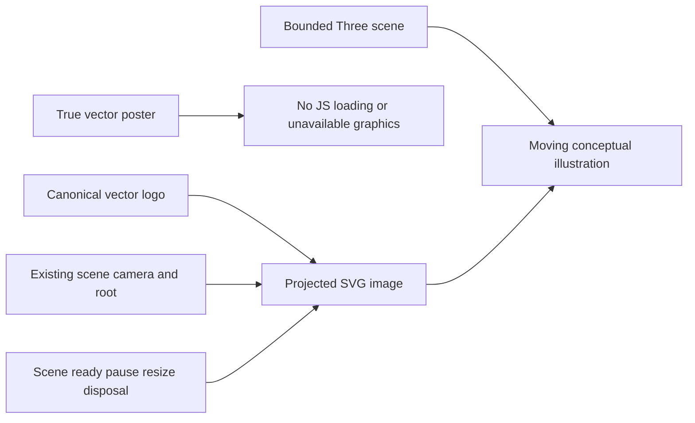

# BenchmarkComparisons vector assets

Continuation of [BenchmarkComparisons](../BenchmarkComparisons.md), existing
REQ-BC-012/013/016/017/025/029. The acceptance matrix below is the durable contract;
the ignored root vector-assets acceptance/plan files retain local task planning.
Decision: [ADR-053](../../ADR/ADR-053-unified-visual-identity.md) vector repair
continuation and [ADR-040](../../ADR/ADR-040-static-site-threejs-evidence.md) manual
visual review; no database/public API/persistence boundary changes.

- REQ-VEC-001 → AC-VEC-001: replace the raster-in-SVG poster with real geometry.
- REQ-VEC-002 → AC-VEC-002/003: project the canonical vector logo outside the
  bounded GPU buffer and keep it subordinate to scene lifecycle.
- REQ-VEC-003 → AC-VEC-004/005: retain resource, accessibility, brand, real build,
  provenance and GitHub-only qualification contracts.

Slice ownership: site/Features/BenchmarkComparisons owns HTML, desktop/mobile posters, scene
geometry/lifecycle/observer and CSS; tests/KeyLoad.SiteTests/Features/BenchmarkComparisons
owns actual-source XML and real Chrome assertions. Shared favicon remains the
unchanged byte-identical mirror of the AdminDashboard canonical logo. Backend,
SDK/MCP, persisted data and benchmark workload surfaces are N/A: this is an asset
rendering repair. No new source inventory, library, package or vendor is added.

Tests must reject raster/executable/external poster payloads and exercise real
ready/resize/pointer/reduced-motion/offscreen/restoration flows at DPR2.
An actual favicon404 keeps the poster; both mobile and desktop retain all model cards.
The complete
GitHub SiteTests, native coverage, parity/build and existing renderer assertions
remain mandatory. Design judgment uses the existing ADR-040 manual exception;
static builds and screenshots do not establish GitHub qualification/publication.
Keep source and measured revisions separate. Rollback restores the coherent
presentation source, never archived reports or database formats.

| Acceptance | Pass/fail contract | Verification |
|---|---|---|
| AC-VEC-001 | Both posters contain true SVG paths/text, the canonical K geometry and all eight model labels. Embedded raster, executable/external content or clipped mobile models fails. | SiteVectorAssetTests validates actual XML, local references, labels and canonical path attributes; ADR-040 manual desktop/mobile review judges fitting and sharpness. |
| AC-VEC-002 | Exactly one decorative live image loads the unchanged favicon outside the GPU buffer, with contained central bounds and projected CSS sizing. Missing, duplicated, unloaded or oversized rasterized logo fails. | Real Chrome ready/pointer/resize assertions at DPR2; manual sharpness review. |
| AC-VEC-003 | Loading/no-JS/error/zero-size/offscreen/disposed retains the poster and hides the live image; ready shows the loaded SVG. Favicon404 never reaches ready. Pause/reduced motion/restoration preserves the lifecycle. | Existing real browser lifecycle flow, Retina resize/pose checks and SiteVectorAssetBrowserTests actual HTTP404 failure. Hardware device-loss qualification remains open. |
| AC-VEC-004 | Existing DPR1.5/1M-pixel/30-draw/5K-triangle budgets, movement, accessibility and responsive overflow bounds hold. | Existing real renderer/responsive assertions plus recorded manual GPU observations. |
| AC-VEC-005 | The real builder emits both posters and canonical assets with unchanged brand parity and benchmark provenance. | Complete SiteTests, source/output byte parity, native coverage and Pages gates in GitHub at the exact source revision. |

GitHub-only TUnit/MTP qualification remains required for every automated criterion.
The implementation evidence (report removed from repository) records
development checks and manual preview separately from the blocked publication.
