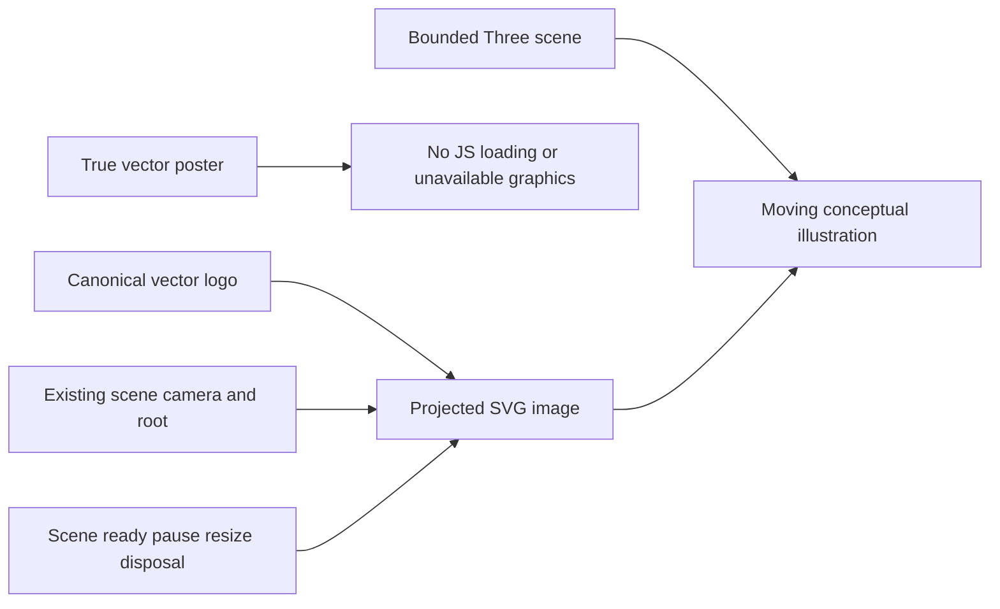

# BenchmarkComparisons vector assets

Continuation of [BenchmarkComparisons](../BenchmarkComparisons.md), existing
REQ-BC-012/013/016/017/025/029. [Acceptance](../../../vector-assets.acceptance.md)
is the precise AC-VEC-001..005 test matrix; [plan](../../../vector-assets.plan.md)
records task ownership, ordered checks and evidence. Decision: ADR-053 vector
repair continuation; no database/public API/persistence boundary changes.

- REQ-VEC-001 → AC-VEC-001: replace the raster-in-SVG poster with real geometry.
- REQ-VEC-002 → AC-VEC-002/003: project the canonical vector logo outside the
  bounded GPU buffer and keep it subordinate to scene lifecycle.
- REQ-VEC-003 → AC-VEC-004/005: retain resource, accessibility, brand, real build,
  provenance and GitHub-only qualification contracts.

Slice ownership: site/Features/BenchmarkComparisons owns HTML, poster, scene
geometry/lifecycle/observer and CSS; tests/KeyLoad.SiteTests/Features/BenchmarkComparisons
owns actual-source XML and real Chrome assertions. Shared favicon remains the
unchanged byte-identical mirror of the AdminDashboard canonical logo. Backend,
SDK/MCP, persisted data and benchmark workload surfaces are N/A: this is an asset
rendering repair. No new source inventory, library, package or vendor is added.

Tests must reject raster/executable/external poster payloads and exercise real
ready/resize/pointer/reduced-motion/offscreen/restoration flows at DPR2. Full
GitHub SiteTests, native coverage, parity/build and existing renderer assertions
remain mandatory. Design judgment uses the existing ADR-040 manual exception;
static builds and screenshots do not establish GitHub qualification/publication.
Keep source and measured revisions separate. Rollback restores the coherent
presentation source, never archived reports or database formats.
