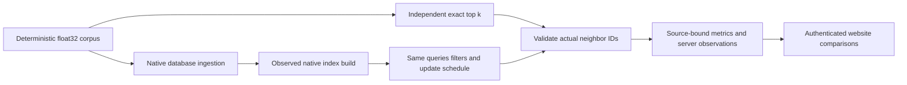

# BenchmarkComparisons: native vector qualification

This contract implements the owner's 2026-10-05 request under
[ADR-109](../../ADR/ADR-109-native-vector-comparisons.md). The Benchmarks producer
and website consumer are in scope, including SurrealDB and HelixDB. Product SQL,
storage, licensing and unrelated changes are outside this task.

## Closed workload and evidence contracts

Vector profiles are `vector-{100k|1m}-{exact|hnsw|ivfflat|native}-{plain|filtered|mixed}-c16`.
All use actual N records, 128 float32 dimensions, cosine distance, top k 10,
seed 1729, 1,024-byte canonical document payload, 64 distinct deterministic
non-corpus query vectors, 256 warmups, 100,000 measured queries, concurrency 16,
one repetition, and a 30-second per-request timeout. The finite query set and
closed-loop load model are disclosed; operation counts are not record counts.

Each query is compared with independently computed canonical exact top k.
Distance ties use ordinal document ID. Recall is intersection count divided by
the expected k (or eligible cardinality if smaller); duplicate/unexpected IDs,
incorrect filters, non-finite vectors or underfilled exact responses fail.
Exact recall must be 1; approximate aggregate recall must be at least 0.95.
Emit per-query/aggregate recall and the measured minimum; do not call a lower
accuracy cell a comparable performance success.

`filtered` selects `number % 100 == 0` (1% selectivity) in the native query.
`mixed` searches the stable 90% (`number % 10 != 9`) while a separately bounded
writer applies 10,000 distinct deterministic embedding changes spread over the
remaining 10%. Mutable slot selection is `(1729 + ordinal * 2654435761) % (N/10)`
using UInt64 arithmetic without wrap, with record number `9 + 10 * slot`.
Gate the writer and readers together, verify every acknowledged update by native
readback, and record search/update counts and their timing separately. This is
concurrent index maintenance with stable eligible ground truth; it does not
claim snapshot accuracy for changing eligible vectors. No client-side filtering.

HNSW parameters: m=16, construction ef=200, search ef=200. IVFFlat uses
`lists=max(1,floor(sqrt(N)))`, `probes=min(lists,ceil(sqrt(lists))*4)`; parameters
are recorded, not inferred. PostgreSQL must prove the actual requested index is
present and the measured query plan uses it. `native` denotes an explicitly recorded provider ANN implementation when its public
API does not expose a named HNSW/IVFFlat contract. It uses the same cosine corpus,
filters and recall threshold; the actual index/metric configuration is evidence.
Native databases expose unsupported
methods as unavailable; different ANN algorithms never silently reuse a label.
Index build timing surrounds native build completion after ingestion and before
warmup; exact uses an explicit zero build cost with no ANN index, while every
ANN build receipt must have a strictly positive finite duration. Validation,
ingestion, oracle computation and build time are excluded from query latency.
Closed-loop query throughput includes common neighbor validation; writer duration
includes post-acknowledgment native readback and validation. Ingestion, oracle,
index preparation and warmup are outside both measured rates. Each native search,
update and post-acknowledgment read awaits its original operation under a linked
30-second policy deadline; failures cancel peers and all operations join before
cleanup or failure reporting.

Use a lazy corpus and bounded query/oracle/sample arrays; retain at most 4,096
evenly sampled latencies and label p95/p99 as estimates. Bound native batches,
result sizes and update concurrency. Verify actual loaded record count and
canonical fields/digest with ordered bounded native readback before timing.
Native vector readback must additionally confirm the stored dimensions/values;
a count or expected digest generated locally is not readback proof.

Each applicable engine sees the same profile, corpus, filters, schedule and
accuracy threshold. Show actual node count, read/write acknowledgment and
effective CPU/RAM/storage limits with every comparison; compare winners only
within compatible contracts. Native server container/process RAM is distinct
from generator RSS. Retain original native build/query timings and whole-run server-resource
observations with the five-second sampling interval. A RAM sum is explicitly the
sum of observed per-node RSS maxima over the entire run; it is neither an
unsampled peak nor a simultaneous aggregate or index/query-only measurement.
Do not attribute those samples to an unobserved phase, or derive server use from
the client's counters. Only authenticated
original Linux GitHub artifacts may populate website metrics.

## Requirements, acceptance and tests

| Requirement | Measurable pass/fail criterion | Test/evidence mapping |
|---|---|---|
| REQ-VQ-001: complete real vector scale | AC-VQ-001: exact 24 closed profiles × applicable targets × 1/2/3 topology slots; 100k/1m actual record readback and ≥100k measured queries; invalid profiles/counts reject | `VectorProfileContractTests`, `VectorCorpusContractTests`, `VectorSelectionContractTests`; original native worker receipts |
| REQ-VQ-002: native algorithms and quality | AC-VQ-002: exact/HNSW/IVFFlat metadata and actual PostgreSQL plans match requested method; independent expected IDs yield exact recall 1 and ANN ≥0.95; duplicate/filter/underfill failures reject | `VectorCorpusContractTests`, `VectorResponseContractTests`, `VectorIndexContractTests`, `PostgresVectorPayloadContractTests`, `PostgresVectorQueryContractTests`, `QdrantVectorContractTests`; actual PostgreSQL comparison cases and plan receipts |
| REQ-VQ-003: filters and updates | AC-VQ-003: native 1% filters and mixed stable-90% searches return only eligible IDs; 10k acknowledged updates are read back after genuinely overlapping queries/writes; failure/cancellation invalidates cell | Native filtered/mixed flow cases; timed original query/update receipts |
| REQ-VQ-004: trustworthy costs | AC-VQ-004: query p95/p99 and useful rate exclude ingestion/oracle/build; native index build ms is observed; separately scoped whole-run server RAM/resource observations and client counters are emitted with actual bounds | `VectorIndexContractTests`, `VectorExecutionPolicyContractTests`; native measurement/phase/resource flows, original cgroup/process sidecars |
| REQ-VQ-005: new native engines | AC-VQ-005: SurrealDB and HelixDB use pinned real disk-backed native servers under Aspire; CRUD/vector/graph only where truly supported; readiness, loaded data, membership, ownership and teardown verified; unsupported native topology has null metrics/reason | Native comparison TUnit flows and image/source provenance; original Actions container logs |
| REQ-VQ-006: same-family fairness | AC-VQ-006: corpus, query schedule, metric, filters, accuracy, resources and actual ACK/read contract match before rankings; controls remain explicitly small; unsupported capabilities never become zero-valued successes | Cross-engine corpus/contract validation, fairness review and original measured settings |
| REQ-VQ-007: website-producing delivery | AC-VQ-007: readable isolated per-database groups feed strict complete source/run/attempt/profile/index-bound aggregation; missing/duplicate/mixed/fabricated results reject; site exposes scale/method/recall/build/p95/p99/server RAM and original evidence | Isolated plan/aggregate/admission/site browser TUnit tests; authentic Linux Benchmarks and Pages receipts |

All test sources retain canonical `Features/BenchmarkComparisons/<Role>/`.
Manual evidence exception: external provider timing, membership, disk durability
claims, original artifact authority and Pages publication require the genuine
Actions run and provider receipt; local tests cannot establish those claims.

Run governance, restore, Release build, then the owning Aspire suites (`unit`,
`comparison`, `site`), formatting and the final solution build. Native workloads
run in separate Linux jobs and the AppHost owns all resources and cleanup.
Unexpected native errors and timeouts retain safe diagnostics and null metrics;
they cannot cause fallback to a different algorithm, topology or prior cohort.

Status: acceptance contract established; implementation and native qualification
are pending. No new performance result is established by this document.

## Source fairness review, 2026-10-06

The active inventories contain two document scale profiles and 24 vector
profiles, all limited to 100,000 or 1,000,000 records across the 11 engines.
The 4,096-record control remains a separately labelled workload. Every measured
vector adapter consumes the common corpus, query set, accuracy validator and
concurrent update schedule. Native ingestion is checked by actual ordered
record, payload and stored-vector readback; locally generated expected hashes
cannot replace that check. Query throughput includes answer validation; update
throughput includes native readback after acknowledgement and validation.

PostgreSQL implements exact/HNSW/IVFFlat; Qdrant and SurrealDB implement
exact/HNSW; HelixDB exposes its provider-native ANN mode. Other methods and
unsupported native topologies retain explicit unavailable receipts. Scalar
indexes used for ordered readback are setup costs, distinct from the subsequently
timed ANN build. ANN receipts require positive observed build time and a completed
native index lifecycle; exact has no ANN index and zero ANN build time.

The current KeyLoad SDK cannot expose stored vector values or the required
native numeric search predicate. Its new vector scale cells therefore remain
explicitly unavailable, including plain exact, rather than weakening the shared
readback contract. Existing small-control search support does not close this
capability gap. Actual acknowledgement, read and server-resource contracts are
shown with measurements; source review alone cannot establish cross-engine
runtime equivalence or a performance winner.

Qdrant query evidence retains the actual native filter as well as the forced
exact/HNSW request parameters and observed collection state. It is explicitly
labelled request/configuration evidence; Qdrant does not expose a PostgreSQL-style
query plan through this adapter. `QdrantVectorContractTests` checks the distinct
filtered/mixed predicates and the unfiltered request alongside index admission.

Local inventory, JavaScript syntax, authored-asset bounds and governance checks
pass. The final whole-solution Release build remains blocked by active shared
runtime-policy diagnostics. The Aspire/TUnit suites and genuine Linux native
scale runs have not qualified this source, and no new website figures are ready.

## Typed native execution policy join, 2026-10-06

The current runtime-policy rule applies to native operation safety settings.
Immutable corpus/profile/index identities and workload cardinalities remain
protocol values. Native HTTP response limits, batch capacity, cleanup deadlines,
index-build deadlines and polling intervals must instead come from centrally
registered, validated `IOptions<NativeComparisonExecutionOptions>`. The comparison
host composition owns binding from a source-controlled JSON section and rejects
missing/invalid policy before target creation; target execution does not read
configuration or the environment. Native adapters receive that typed policy,
record effective limits with native index evidence, and await original operations
and cleanup. Qdrant control ingestion also uses the configured native write-batch
capacity, rather than a separate hardcoded batch size; its corpus and measured
query schedule retain their existing control contract. Policy does not select a different corpus, algorithm, recall target
or native topology.

TASK-VQ-POLICY-001: native adapter worker owns the shared options type/validation,
central JSON/host registration and new SurrealDB/HelixDB target injection. Root
owns Qdrant consumption and final integration; vector worker owns PostgreSQL
vector consumption. Join compile and native flows only after composition binding
and every new native execution owner use the same validated policy. Existing
unrelated runtime-policy migration stays with its owning task. AC-VQ-004/005/006
include invalid-policy rejection, actual effective settings and unchanged
corpus/accuracy/native algorithm, tested through the real composed host.

All isolated worker selectors and immutable-workload override detection are bound
from the trusted `Benchmarks` section into `IOptions<ComparisonWorkerSelectionOptions>` by `ComparisonWorkerSelection.Read`
composition, then parsed against the frozen profile inventory before allocating
resources. An absent selector admits the existing control/scaled families; an
invalid or simultaneous selector rejects the worker selection. The vector worker
owns this small configuration join and its profile-selection regressions.
