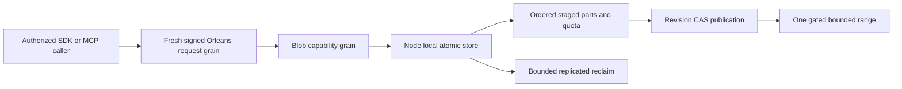

# BlobStorage

Status: contract Accepted; public implementation and runtime qualification pending. Owner: BlobStorage feature lead, with the KeyLoad integrator owning shared contracts. Decision: [ADR-038](../ADR/ADR-038-chunked-blob-storage.md). Authority: [root policy](../../AGENTS.md). Detailed criteria: [acceptance](../../blob-storage.acceptance.md); execution graph: [plan](../implementation/blob-storage.plan.md).

## Призначення, актори та межі

Користувач або агент зберігає великий binary payload частинами та читає потрібний діапазон без завантаження всього об'єкта. Обов'язкова серверна identity, row/resource authority та фізична node-local ownership не змінюються.

Прийнятий контракт визначає десять typed операцій: begin, write part, complete, abort, delete, reclaim, metadata, upload info, range, list. Вони проходять звичайний signed request grain і capability grain; лише node-local PartitionHost володіє atomic store. Частини зберігаються як raw canonical values, manifests і counters — як versioned records. Private snapshot `ReadChunk` і backup pieces мають власну authority/lifecycle. Cartograph може обслуговувати регенеровані backup-архіви через ManagedCode provider; транзакційні user blobs використовують наявний atomic store.

Raw part і range мають межу65536 bytes; maximum object1GiB, default resource object limit64MiB. Повний об'єкт для range не матеріалізується. Complete публікує manifest через revision CAS; partial upload не є видимим complete object. SHA256 перевіряє кожну частину; `sha256-chain-v1` зв'язує scope/layout/order і не називається whole-file SHA256. Bounds/quota/identity/retention/error/format semantics є точним контрактом ADR-038, а не passing evidence.

## Вимоги та measurable acceptance

| Вимога | Критерій поведінки | Автоматизована перевірка |
|---|---|---|
| REQ-BLOB-001: chunked upload має bounded persisted lifecycle і завершений видимий об'єкт | AC-BLOB-001: ordered/retried parts, complete CAS та стабільний command ID; invalid order/bytes/hash/chain і незавершене upload не публікують partial data | Pending genuine TUnit provider lifecycle/CAS/retry та RF3 .NET/MCP tests |
| REQ-BLOB-002: partial read читає точний authorized range з bounded retained memory | AC-BLOB-002: exact first/last/interior/cross-boundary/zero range at expected revision; validation, corruption, cancellation і здоровий follow-up; <=2 visited parts | Pending real-store та public SDK/official MCP range tests |
| REQ-BLOB-003: persisted principal/resource scope визначає всі upload/read/delete права | AC-BLOB-003: tenant/resource mismatch, revoked key, forged roles та unauthorized metadata/range requests відхилено без effects/витоку; .NET/MCP дають однакову authority | PLANNED real persisted-policy unit та Docker/Aspire RF3 SDK/official MCP adversarial flows |
| REQ-BLOB-004: publish/delete/recovery мають явний revision, integrity та retention contract | AC-BLOB-004: перевірений complete object переживає declared process-recovery cut; missing/corrupt part fail closed; concurrent overwrite/read бачить визначений revision; orphan cleanup не видаляє live leased version | PLANNED real-process CrashHost/recovery та RF3 retry/rejoin tests після погодження storage/manifest/cleanup contract |
| REQ-BLOB-005: quotas охоплюють усі ресурси та активні/retired versions | AC-BLOB-005: persisted resource/store counters атомарно reject overflow; abort/expiry/reclaim звільняють правильні bytes/slots один раз; malformed counters/format fail closed | Pending real-provider quota/reopen/adversarial tests |
| REQ-BLOB-006: agent discovery і bounded listing мають спільний typed API | AC-BLOB-006: metadata/upload info/list без full bytes; авторизоване bounded listing; усі10 .NET/MCP operations мають однакові identity/error semantics | Pending DTO goldens, provider listing, official RF3 discovery and operation parity |
| REQ-BLOB-007: integrity/format/compatibility є явним контрактом | AC-BLOB-007: byte/JSON golden vectors, chain binding, незмінні старі enum values/nonblob JSON; unknown format та downgrade boundary | Pending contract goldens/provider checks and documented rollback evidence |

Кожен AC ще pending. Acceptance не означає готовий endpoint чи кваліфікований durability profile. Global blob quota є logical payload reservation, не physical disk quota. Provider/replica snapshot limits охоплюють увесь store, включно з іншими ресурсами й outcome metadata;1GiB blob ceiling не обіцяє необмежений database/snapshot.

## Canonical slice map

| Surface | Ownership / стан |
|---|---|
| Public contracts | `src/KeyLoad.Abstractions/Features/BlobStorage/`; інтегратор owns DTO/enums/identity/error semantics за ADR-038 |
| Engine/storage | Planned `src/KeyLoad.Core/Features/BlobStorage/` + node-local provider building blocks; files/locks/apply належать PartitionHost, не grains |
| Server/.NET SDK | Planned matching `Features/BlobStorage/`; shared transport залишається [ClientApi](ClientApi.md) |
| MCP/agent | Planned owning-operation mapping через [ADR-039](../ADR/ADR-039-official-mcp-agent-api.md), ті самі grants та semantics |
| Tests | Planned UnitTests/RecoveryTests/IntegrationTests `Features/BlobStorage/`, реальні stores/processes/RF3, без doubles |
| Frontend | N/A: required capability є програмним storage API; окремий UI не запитано |
| Durable spec | Цей файл, ADR-038, root policy; новий KL-ID не вигадується |

## Dependencies, execution та qualification

Порядок: accepted contract/native review → frozen DTO/goldens → real AC tests → disjoint engine → shared authorization/routing → SDK/MCP → recovery/RF3 parity. Shared contracts, codec та storage lifetime мають одного integration owner; workers stop/escalate на unresolved format, trust boundary або overlap, join тільки reviewed complete evidence.

Product verification: canonical GitHub Actions build/analyze/format, TUnit unit, real process recovery і Docker/Aspire RF3 через .NET та official MCP; exact source SHA/run/jobs/artifacts обов'язкові. Ресурсні metrics беруться з actual CI results; power-loss/endurance та production readiness не випливають із опису чи process-kill. Rollout/rollback для blobs визначаються перед збереженням customer data; зараз дані не мігруються.
