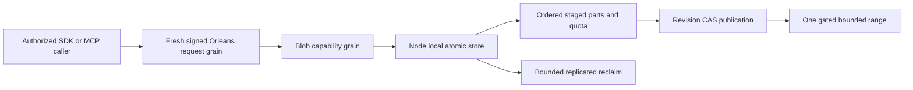

# BlobStorage

Accepted TASK-RUNTIME-BLOB-QUOTA-FIXTURE-W refines REQ/AC-BLOB-005 after
run37005805424. BlobMissingQuotaReopenTests previously deleted a partition-scoped
key although the actual quota row is resource-scoped. Encode the actual key with
public KeyCodec using QuotaSpace/tenant/database/domain/resource, exactly matching
the internal BlobKeys.Quota(blob) format without changing its visibility. Delete it,
assert the actual row exists before deletion and is absent afterward, then retain
the existing real reopen Corruption/no-position-change/no-apply assertions.
Only that test file and its now-unused literal change; no production key encoding,
quota, missing-state policy or timeout change. Source review and full exact-SHA
GitHub verification are required; the prior failure is its tests-first baseline.

Accepted TASK-RUNTIME-ADMISSION-W fixture refinement for REQ/AC-BLOB-003:
BlobAuthorizationTests.StartActiveUpload supplies RowAccess(OwnerAlice) for the
persisted restricted Alice principal, matching the existing PublishOwned setup.
Run37005805424 rejected setup before its intended adversarial reads. Preserve
all wrong-owner/creator/revoked-principal denials and exact error codes. The worker
owns this test file only; ADR-038 authority and all product code stay unchanged.
Lead source review/build and full exact-SHA GitHub tests qualify the correction.

Status: contract Accepted; canonical engine/server/MCP and typed SDK source present, exact-SHA runtime qualification pending. Owner: BlobStorage feature lead, with the KeyLoad integrator owning shared contracts. Decision: [ADR-038](../ADR/ADR-038-chunked-blob-storage.md). Authority: [root policy](../../AGENTS.md). Detailed criteria: [acceptance](BlobStorage.md); execution graph: [plan](BlobStorage.md).

## Призначення, актори та межі

Користувач або агент зберігає великий binary payload частинами та читає потрібний діапазон без завантаження всього об'єкта. Обов'язкова серверна identity, row/resource authority та фізична node-local ownership не змінюються.

Прийнятий контракт визначає десять typed операцій: begin, write part, complete, abort, delete, reclaim, metadata, upload info, range, list. Вони проходять звичайний signed request grain і capability grain; лише node-local PartitionHost володіє atomic store. Частини зберігаються як raw canonical values, manifests і counters — як versioned records. Private snapshot `ReadChunk` і backup pieces мають власну authority/lifecycle. Cartograph може обслуговувати регенеровані backup-архіви через ManagedCode provider; транзакційні user blobs використовують наявний atomic store.

Raw part і range мають межу65536 bytes; maximum object1GiB, default resource object limit64MiB. Повний об'єкт для range не матеріалізується. Complete публікує manifest через revision CAS; partial upload не є видимим complete object. SHA256 перевіряє кожну частину; `sha256-chain-v1` зв'язує scope/layout/order і не називається whole-file SHA256. Bounds/quota/identity/retention/error/format semantics є точним контрактом ADR-038, а не passing evidence.

## Вимоги та measurable acceptance

| Вимога | Критерій поведінки | Автоматизована перевірка |
|---|---|---|
| REQ-BLOB-001: chunked upload має bounded persisted lifecycle і завершений видимий об'єкт | AC-BLOB-001: ordered/retried parts, complete CAS та стабільний command ID; invalid order/bytes/hash/chain і незавершене upload не публікують partial data | Pending genuine TUnit provider lifecycle/CAS/retry та RF3 .NET/MCP tests |
| REQ-BLOB-002: partial read читає точний authorized range з bounded retained memory | AC-BLOB-002: exact first/last/interior/cross-boundary/zero range at expected revision; validation, corruption, cancellation і здоровий follow-up; <=2 visited parts | Pending real-store та public SDK/official MCP range tests |
| REQ-BLOB-003: persisted principal/resource scope визначає всі upload/read/delete права | AC-BLOB-003: tenant/resource mismatch, revoked key, forged roles та unauthorized metadata/range requests відхилено без effects/витоку; .NET/MCP дають однакову authority | PLANNED real persisted-policy unit та Docker/Aspire RF3 SDK/official MCP adversarial flows |
| REQ-BLOB-004: publish/delete/recovery мають явний revision, integrity та retention contract | AC-BLOB-004: перевірений complete object переживає declared process-recovery cut; missing/corrupt part fail closed; concurrent overwrite/read бачить визначений revision; orphan cleanup не видаляє live leased version | PLANNED real-process CrashHost/recovery та RF3 retry/rejoin tests після погодження storage/manifest/cleanup contract |
| REQ-BLOB-005: quotas охоплюють усі ресурси та активні/retired versions | AC-BLOB-005: persisted resource/store counters атомарно reject overflow; abort/expiry/reclaim звільняють правильні bytes/slots один раз; malformed counters/format fail closed | Pending real-provider quota/reopen/adversarial tests |
| REQ-BLOB-006: agent discovery і bounded listing мають спільний typed API | AC-BLOB-006: metadata/upload info/list без full bytes; авторизоване bounded listing; усі10 .NET/MCP operations мають однакові identity/error semantics | Pending DTO goldens, provider listing, official RF3 discovery and operation parity |
| REQ-BLOB-007: integrity/format/compatibility є явним контрактом | AC-BLOB-007: byte/JSON golden vectors, chain binding, незмінні старі enum values/nonblob JSON; unknown format та downgrade boundary | Pending contract goldens/provider checks and documented rollback evidence |

Кожен AC ще pending. Acceptance не означає готовий endpoint чи кваліфікований durability profile. Global blob quota є logical payload reservation, не physical disk quota. Provider/replica snapshot limits охоплюють увесь store, включно з іншими ресурсами й outcome metadata;1GiB blob ceiling не обіцяє необмежений database/snapshot.

## Canonical slice map

| Surface | Ownership / стан |
|---|---|
| Public contracts | `src/KeyLoad.Abstractions/Features/BlobStorage/`; інтегратор owns DTO/enums/identity/error semantics за ADR-038 |
| Engine/storage | Source `src/KeyLoad.Core/Features/BlobStorage/` + node-local provider building blocks; files/locks/apply належать PartitionHost, не grains |
| Server/.NET SDK | Source matching `Features/BlobStorage/`; feature-owned BlobClientExtensions use shared [ClientApi](ClientApi.md) transport |
| MCP/agent | Source owning-operation mapping через [ADR-039](../ADR/ADR-039-official-mcp-agent-api.md), ті самі grants та semantics; qualification pending |
| Tests | Source unit/recovery/blob fixtures and SQL RF3 differential cases; реальні stores/processes/RF3, без doubles; exact-SHA execution remains required |
| Frontend | N/A: required capability є програмним storage API; окремий UI не запитано |
| Durable spec | Цей файл, ADR-038, root policy; новий KL-ID не вигадується |

## Dependencies, execution та qualification

Порядок: accepted contract/native review → frozen DTO/goldens → real AC tests → disjoint engine → shared authorization/routing → SDK/MCP → recovery/RF3 parity. Shared contracts, codec та storage lifetime мають одного integration owner; workers stop/escalate на unresolved format, trust boundary або overlap, join тільки reviewed complete evidence.

Product verification: canonical GitHub Actions build/analyze/format, TUnit unit, real process recovery і Docker/Aspire RF3 через .NET та official MCP; exact source SHA/run/jobs/artifacts обов'язкові. Ресурсні metrics беруться з actual CI results; power-loss/endurance та production readiness не випливають із опису чи process-kill. Rollout/rollback для blobs визначаються перед збереженням customer data; зараз дані не мігруються.

## Unified SQL and typed SDK join

ADR-054/AC-AISQL-006 extends the existing canonical blob operations into SQL CALL; no lifecycle/atomicity/authorization/integrity change. Abstractions `Features/BlobStorage/BlobOperationProtocol.cs` owns the route constants and Client `Features/BlobStorage/BlobClient.cs` mirrors all ten HTTP/MCP operations through the existing bounded SDK transport. RF3 SQL/.NET/official MCP published-partial-read differential proof is required; this source is not a passing outcome.

REQ-BLOB-006 also maps to AC-AISQL-012/TASK-AISQL-012A: feature-owned
BlobClientExtensions retain SDK source call syntax, validate missing client/request
before HTTP effects and call the same internal Send transport. New public argument
tests and existing genuine RF3 lifecycle/range/retry cases qualify the pre-delivery
refactor; source spelling changes do not establish published binary compatibility.

# Current first-release BlobStorage format operation proof

TASK-BLOB-CURRENT-FORMAT-007 maps REQ-BLOB-007/AC-BLOB-007 and existing ADR-038 to real persisted ConfigureResource → exact current complete JSON (including immutable VectorProfiles[]) → same outer command-ID native result replay with full-store/position invariance → legitimate document write/read. This is current first-release format, not legacy or migration compatibility. Nullable BlobPolicy stays omitted when null; no product omission/fallback change. Existing stable enum/capability numeric identities are asserted inside the completed native configuration/blob operation flows, not standalone getter/metadata tests.

REQ-BLOB-001/002/005/007 and AC-BLOB-001/002/005/007 also map to native default BlobStore configuration → oversized declared length rejects Validation and leaves target metadata/upload absent (first logged rejection may retain outcome/clock once under ADR-002) → exact same-ID failure bytes plus stable full post-failure image/position → small real upload/write/publish with complete independent metadata and partial bytes → same command-ID publication replay/no extra effect → joined native store close/reopen with full canonical image/position and identical complete metadata/range → healthy full read.

Remove exactly obsolete ordinary identities BlobStorageCompatibilityTests.AcBlob007AppendsBlobEnumsAndCapabilitiesWithoutRenumberingExistingValues and BlobStorageCompatibilityTests.AcBlob007ResourceWithoutBlobPolicyRetainsItsCanonicalJsonBytes. New cases are functional complete native operations; root must reconcile genuine post-build census UID/source ranges/classifications. Do not fabricate IDs/counts/PASS. Existing integrity golden controls remain separate. No production behavior, limits, format decoder, dependencies or authorization changes.
