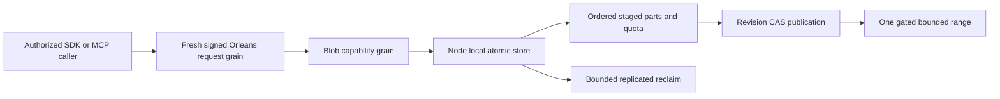

# BlobStorage

Accepted TASK-RUNTIME-BLOB-QUOTA-FIXTURE-W refines REQ/AC-BLOB-005 after
run37005805424. BlobMissingQuotaReopenTests previously deleted a partition-scoped
key although the actual quota row is resource-scoped. Encode the actual key with
public KeyCodec using QuotaSpace/tenant/database/domain/resource, exactly matching
the internal BlobKeys.Quota(blob) format without changing its visibility. Delete it,
assert the actual row exists before deletion and is absent afterward, then retain
the existing real reopen Corruption/no-position-change/no-apply assertions.
Only that test file and its now-unused literal change; no production key encoding,
quota, missing-state policy or timeout change. Source review and full exact-SHA
GitHub verification are required; the prior failure is its tests-first baseline.

Accepted TASK-RUNTIME-ADMISSION-W fixture refinement for REQ/AC-BLOB-003:
BlobAuthorizationTests.StartActiveUpload supplies RowAccess(OwnerAlice) for the
persisted restricted Alice principal, matching the existing PublishOwned setup.
Run37005805424 rejected setup before its intended adversarial reads. Preserve
all wrong-owner/creator/revoked-principal denials and exact error codes. The worker
owns this test file only; ADR-038 authority and all product code stay unchanged.
Lead source review/build and full exact-SHA GitHub tests qualify the correction.

Status: contract Accepted; canonical engine/server/MCP and typed SDK source present, exact-SHA runtime qualification pending. Owner: BlobStorage feature lead, with the KeyLoad integrator owning shared contracts. Decision: [ADR-038](../ADR/ADR-038-chunked-blob-storage.md). Authority: [root policy](../../AGENTS.md). Detailed criteria: [acceptance](BlobStorage.md); execution graph: [plan](BlobStorage.md).

## Призначення, актори та межі

Користувач або агент зберігає великий binary payload частинами та читає потрібний діапазон без завантаження всього об'єкта. Обов'язкова серверна identity, row/resource authority та фізична node-local ownership не змінюються.

Прийнятий контракт визначає десять typed операцій: begin, write part, complete, abort, delete, reclaim, metadata, upload info, range, list. Вони проходять звичайний signed request grain і capability grain; лише node-local PartitionHost володіє atomic store. Частини зберігаються як raw canonical values, manifests і counters — як versioned records. Private snapshot `ReadChunk` і backup pieces мають власну authority/lifecycle. Cartograph може обслуговувати регенеровані backup-архіви через ManagedCode provider; транзакційні user blobs використовують наявний atomic store.

Raw part і range мають межу65536 bytes; maximum object1GiB, default resource object limit64MiB. Повний об'єкт для range не матеріалізується. Complete публікує manifest через revision CAS; partial upload не є видимим complete object. SHA256 перевіряє кожну частину; `sha256-chain-v1` зв'язує scope/layout/order і не називається whole-file SHA256. Bounds/quota/identity/retention/error/format semantics є точним контрактом ADR-038, а не passing evidence.

## Вимоги та measurable acceptance

| Вимога | Критерій поведінки | Автоматизована перевірка |
|---|---|---|
| REQ-BLOB-001: chunked upload має bounded persisted lifecycle і завершений видимий об'єкт | AC-BLOB-001: ordered/retried parts, complete CAS та стабільний command ID; invalid order/bytes/hash/chain і незавершене upload не публікують partial data | Pending genuine TUnit provider lifecycle/CAS/retry та RF3 .NET/MCP tests |
| REQ-BLOB-002: partial read читає точний authorized range з bounded retained memory | AC-BLOB-002: exact first/last/interior/cross-boundary/zero range at expected revision; validation, corruption, cancellation і здоровий follow-up; <=2 visited parts | Pending real-store та public SDK/official MCP range tests |
| REQ-BLOB-003: persisted principal/resource scope визначає всі upload/read/delete права | AC-BLOB-003: tenant/resource mismatch, revoked key, forged roles та unauthorized metadata/range requests відхилено без effects/витоку; .NET/MCP дають однакову authority | PLANNED real persisted-policy unit та Docker/Aspire RF3 SDK/official MCP adversarial flows |
| REQ-BLOB-004: publish/delete/recovery мають явний revision, integrity та retention contract | AC-BLOB-004: перевірений complete object переживає declared process-recovery cut; missing/corrupt part fail closed; concurrent overwrite/read бачить визначений revision; orphan cleanup не видаляє live leased version | PLANNED real-process CrashHost/recovery та RF3 retry/rejoin tests після погодження storage/manifest/cleanup contract |
| REQ-BLOB-005: quotas охоплюють усі ресурси та активні/retired versions | AC-BLOB-005: persisted resource/store counters атомарно reject overflow; abort/expiry/reclaim звільняють правильні bytes/slots один раз; malformed counters/format fail closed | Pending real-provider quota/reopen/adversarial tests |
| REQ-BLOB-006: agent discovery і bounded listing мають спільний typed API | AC-BLOB-006: metadata/upload info/list без full bytes; авторизоване bounded listing; усі10 .NET/MCP operations мають однакові identity/error semantics | Pending DTO goldens, provider listing, official RF3 discovery and operation parity |
| REQ-BLOB-007: integrity/format/compatibility є явним контрактом | AC-BLOB-007: byte/JSON golden vectors, chain binding, незмінні старі enum values/nonblob JSON; unknown format та downgrade boundary | Pending contract goldens/provider checks and documented rollback evidence |

Кожен AC ще pending. Acceptance не означає готовий endpoint чи кваліфікований durability profile. Global blob quota є logical payload reservation, не physical disk quota. Provider/replica snapshot limits охоплюють увесь store, включно з іншими ресурсами й outcome metadata;1GiB blob ceiling не обіцяє необмежений database/snapshot.

## Canonical slice map

| Surface | Ownership / стан |
|---|---|
| Public contracts | `src/KeyLoad.Abstractions/Features/BlobStorage/`; інтегратор owns DTO/enums/identity/error semantics за ADR-038 |
| Engine/storage | Source `src/KeyLoad.Core/Features/BlobStorage/` + node-local provider building blocks; files/locks/apply належать PartitionHost, не grains |
| Server/.NET SDK | Source matching `Features/BlobStorage/`; feature-owned BlobClientExtensions use shared [ClientApi](ClientApi.md) transport |
| MCP/agent | Source owning-operation mapping через [ADR-039](../ADR/ADR-039-official-mcp-agent-api.md), ті самі grants та semantics; qualification pending |
| Tests | Source unit/recovery/blob fixtures and SQL RF3 differential cases; реальні stores/processes/RF3, без doubles; exact-SHA execution remains required |
| Frontend | N/A: required capability є програмним storage API; окремий UI не запитано |
| Durable spec | Цей файл, ADR-038, root policy; новий KL-ID не вигадується |

## Dependencies, execution та qualification

Порядок: accepted contract/native review → frozen DTO/goldens → real AC tests → disjoint engine → shared authorization/routing → SDK/MCP → recovery/RF3 parity. Shared contracts, codec та storage lifetime мають одного integration owner; workers stop/escalate на unresolved format, trust boundary або overlap, join тільки reviewed complete evidence.

Product verification: canonical GitHub Actions build/analyze/format, TUnit unit, real process recovery і Docker/Aspire RF3 через .NET та official MCP; exact source SHA/run/jobs/artifacts обов'язкові. Ресурсні metrics беруться з actual CI results; power-loss/endurance та production readiness не випливають із опису чи process-kill. Rollout/rollback для blobs визначаються перед збереженням customer data; зараз дані не мігруються.

## Unified SQL and typed SDK join

ADR-054/AC-AISQL-006 extends the existing canonical blob operations into SQL CALL; no lifecycle/atomicity/authorization/integrity change. Abstractions `Features/BlobStorage/BlobOperationProtocol.cs` owns the route constants and Client `Features/BlobStorage/BlobClient.cs` mirrors all ten HTTP/MCP operations through the existing bounded SDK transport. RF3 SQL/.NET/official MCP published-partial-read differential proof is required; this source is not a passing outcome.

REQ-BLOB-006 also maps to AC-AISQL-012/TASK-AISQL-012A: feature-owned
BlobClientExtensions retain SDK source call syntax, validate missing client/request
before HTTP effects and call the same internal Send transport. New public argument
tests and existing genuine RF3 lifecycle/range/retry cases qualify the pre-delivery
refactor; source spelling changes do not establish published binary compatibility.

# Current first-release BlobStorage format operation proof

TASK-BLOB-CURRENT-FORMAT-007 maps REQ-BLOB-007/AC-BLOB-007 and existing ADR-038 to real persisted ConfigureResource → exact current complete JSON (including immutable VectorProfiles[]) → same outer command-ID native result replay with full-store/position invariance → legitimate document write/read. This is current first-release format, not legacy or migration compatibility. Nullable BlobPolicy stays omitted when null; no product omission/fallback change. Existing stable enum/capability numeric identities are asserted inside the completed native configuration/blob operation flows, not standalone getter/metadata tests.

REQ-BLOB-001/002/005/007 and AC-BLOB-001/002/005/007 also map to native default BlobStore configuration → oversized declared length rejects Validation and leaves target metadata/upload absent (first logged rejection may retain outcome/clock once under ADR-002) → exact same-ID failure bytes plus stable full post-failure image/position → small real upload/write/publish with complete independent metadata and partial bytes → same command-ID publication replay/no extra effect → joined native store close/reopen with full canonical image/position and identical complete metadata/range → healthy full read.

Remove exactly obsolete ordinary identities BlobStorageCompatibilityTests.AcBlob007AppendsBlobEnumsAndCapabilitiesWithoutRenumberingExistingValues and BlobStorageCompatibilityTests.AcBlob007ResourceWithoutBlobPolicyRetainsItsCanonicalJsonBytes. New cases are functional complete native operations; root must reconcile genuine post-build census UID/source ranges/classifications. Do not fabricate IDs/counts/PASS. Existing integrity golden controls remain separate. No production behavior, limits, format decoder, dependencies or authorization changes.

### TASK-MCP-CATALOG-COMPLETE-76-001 implementation contract

AC-MCP-001/003/006/007 and AC-BLOB-006 preserve all ten blob tools and the
independent complete public catalog. [ClientApi](ClientApi.md) owns the exact76
tuple/schema/effect and negative→healthy decode contract. Original55f normal/scalar
failures remain immutable; initial gateway discovery remains three tools. Root
joins docs-first ClientApi Contracts literal inventory and Helpers executable
assertions, then existing six McpCatalogTests/four BlobAgentCatalogTests identities
with native normal/scalar metadata and full current-source qualification gates.
No product API, dependency or authorization change; rollback is fixture/docs only.
No source-only count or schema review establishes runtime or RF3 acceptance.

## TASK-KL036-CONTROLLED-BLOB-MOVEMENT-001 — native owning prerequisite

REQ-MOVE-CONTROLLED-BLOB-001 / AC-MOVE-CONTROLLED-BLOB-001 require actual original Begin/Part0/Part1/Complete receipts and new bounded Blob effects through the existing controlled command pipeline after retirement. The unique request grain currently routes only Batch; Blob resource ownership precedes retained outcome selection. Expanding a selector alone is insufficient. The original source StoredOutcome remains authoritative; current destination upload lifetime and native BlobOutcomeAuthority must be verified by an authenticated bounded native read before successful historical result release. Retired observation never reexecutes an old effect.

REQ-MOVE-CONTROLLED-BLOB-OUTCOME-001 / AC-MOVE-CONTROLLED-BLOB-OUTCOME-001 preserve exact source outcome bytes, scope/fingerprint/incarnation/current policy and real destination state. Missing/corrupt/wrong authority/body/owner/epoch fails closed. New controlled target effects capture the actual native pre-effect BlobOutcomeAuthority, bind it to the real effect/ACK digest, and retain it in original control outcome finalization. Existing phases, aliases/IDs, counters, quotas, ordered apply and absolute expiry remain unchanged; additive field IDs and native typed read contracts are frozen in the owning implementation contract before code. No legacy/fallback authority.

REQ-MOVE-CONTROLLED-BLOB-POLICY-001 / AC-MOVE-CONTROLLED-BLOB-POLICY-001 extend the actual restored-policy whole RF3 case: retain all old positive closures; capture the bounded actual typed initial Blob requests/results in fixture memory; prove demotion2 denial and restore3 original epoch1 USER receipt PermissionDenied/null through SDK, official MCP and Q1 without replacing native StoredOutcome bytes. Current admin parent replay must not rebind old USER epochs. A generic OwnershipLost does not qualify policy denial.

REQ-MOVE-CONTROLLED-BLOB-READ-001 / AC-MOVE-CONTROLLED-BLOB-READ-001 require actual current metadata/upload/range/list routing to the real moved owner with native policy, row, lifetime, byte/read/result budgets and full exact blob/cold proof. Unrelated current model routing is not qualified by this Blob prerequisite. ADR-106 owns the control/read boundary; BlobStorage owns actual policy/lifetime/data execution. The native current proof remains separate from an immutable original result.

Whole-flow mapping is the existing protected six-owner parent/restored-policy corpus with actual persisted c1 credentials, complete literal models/receipts and all6/18lock joined cold cuts, SDK/official MCP/Q1 and fresh healthy continuation. All old positive Begin/Part0/Part1/Complete closures remain. Source-only implementation proposals are not compiled/runtime evidence; root-only exact-source Linux UID/PDB/full Unit normal+scalar/recovery/RF3 gates remain OPEN. No strict task selection/count change.

### TASK-KL036-CONTROLLED-BLOB-MOVEMENT-001 — complete source-stage contract

The source-stage implementation extends the existing controlled native command pipeline, not a second dispatcher. Canonical control owner A freshly loads the persisted caller and logical resource policy before outcome/locator diagnostics, captures the complete native request/policy scope, and revalidates that exact scope after the authenticated B read. Current physical owner B freshly authenticates its configured technical administrator, verifies the actual published native owner/placement/moved descriptor and non-policy resource definition, and executes native BlobAuthority/BlobOutcomeValidation over the actual B cut using the full MAC-bound canonical A policy overlay. B's separately configured user mirror is not a second logical policy authority. Source-supplied policy is accepted only inside this authenticated server delegation; caller JSON cannot construct that trust. A missing/conflicting physical scope remains refused. Reverse B→A with current destination A follows the existing ordinary local native Blob path under fresh A policy.

Frozen additive native fields: PartitionControlEffectPayload.BlobAuthority Id2, PartitionControlAcknowledgeBody.BlobAuthority Id6, PartitionControlCommandRecord.BlobAuthority Id15; old fields/aliases/IDs/stages/counters remain unchanged. PartitionControlApplyBody.Command Id3 retains the actual Batch value or is null only for a real native Blob OriginalOperation. The owning grant admission compares the complete actually retained TargetBody bytes to the intended phase bytes, so absence of the Batch-only field does not bypass original body identity. Successful native target effects capture BlobOutcomeAuthority before effects and bind it into actual effect/ACK digest and source StoredOutcome; failed native effects retain a null stamp. The actual existing expired-grant query-only path is unchanged.

ControlledBlobReadFrame alias keyload.core.partition-control-blob-read-frame.v1 has Id0 Version,1 QueryId,2 Control,3 Publication,4 Principal,5 Resource,6 DirectoryRevision,7 ExpiresAt,8 Purpose,9 Original,10 OriginalOutcome,11 NativeRequest. Purpose values are Outcome0/Metadata1/UploadInfo2/Range3/List4. Outcome requires the actual original operation/outcome and empty NativeRequest; data requires both originals null and the exact existing native typed request. ControlledBlobReadRequest alias keyload.orleans.controlled-blob-read-request.v1 has Id0 Frame,1 MaximumReadBytes,2 MaximumExaminedRecords,3 MaximumResultBytes. ControlledBlobReadResult alias keyload.orleans.controlled-blob-read-result.v1 has Id0 NativeValue,1 OutcomeValidated,2 ReadBytes,3 ExaminedRecords. The result flag is produced only after actual destination native validation, never a caller proof flag. Its result type is closed against the requested purpose. GrainReadKind.ControlledBlob appends after WaitForAnnIndex without changing any old ordinal; later KL078 SampleChunkWindow must compose after this actual precursor.

RemoteControlledBlobCall alias keyload.server.remote-controlled-blob-call.v1 has Id0 Version,1 actual ingress RequestId,2 Nonce,3 CallerVoter,4 CallerSiloAddress,5 Source,6 registered Destination,7 Request,8 MaximumReplyBytes. RemoteDocumentTransportEnvelope appends Id2 ControlledBlob; RemoteDocumentReplyV1 appends Id8 ControlledBlob. Exactly one request variant is admitted. Old reply validators reject the new slot; the new reply validator rejects old result/query/control success slots. The existing RemoteDocumentMac request/reply domains authenticate the entire native envelope/reply bytes, including all new fields. No bare-frame signature, new endpoint, unsigned hint or fallback is introduced. Original bounded HTTP client, pins, work/session owner, read/result/record/query budgets, absolute expiry, caller cancellation, original failure ledger and joined runtime disposal are reused.

Source ownership is BlobStorage Authorization/Queries/Validation/Contracts in Core; BlobStorage Contracts/Identity/Queries/Serialization in Orleans; BlobStorage Execution/Transport/Validation/Contracts in Server; the existing ClusterRouting controlled command and DocumentStorage runtime/transport integration points retain their owners. Existing GrainRequestEnvelopeConstruction.MovementRead constructs both controlled read envelopes with the same actual database/clock/lifetime/expiry/payload-copy guard and codec Issue/ValidateScope; the purpose-specific factory methods do not duplicate a codec. GrainBlobReadExecution owns only configured borrowed-router selection versus the original reused native Blob capability after the same fresh read admission; it owns no storage/options/lifetime.

Automated complete-flow mapping extends the existing ActualDemotionDeniesParentThenRestoredAdminReplaysParentButNotOldUserReceiptsAndMovesCold case and preserves every original positive closure, literal model assertion, original ParentDeadline and six-owner Aspire topology. After actual A→B retirement, original Begin/Part0/Part1/Complete receipts replay through SDK, official MCP and Q1 on both; current metadata/upload/full two-part range/list are checked through all four callers. New actual Begin/Part0/Part1/Complete effects have real B incarnation/placement receipts; a genuinely wrong first ordinal reaches native B execution, retains an actual finalized failed Validation outcome with null authority and empty effect mutations, and leaves upload progress unchanged before healthy parts/completion. All four new successful receipts replay after joined all-six/18-lock cold reopen. Changed same-ID original content refuses Conflict. Demotion2 and restore3 deny each epoch1 original receipt through all four callers with exact PermissionDenied/null, preserve native source StoredOutcome raw bytes, and keep parent admin replay separate. Restored current Blob reads and the complete B→A fresh-move/full-model/cold continuation remain genuine operations.

Rollback removes this additive source stage as a coherent unqualified checkpoint; it does not modify immutable original failed reports, old native fields/ordinals or legacy formats. Source review/reconstruction is not qualification. Required gates remain root-only fresh exact-source native build/analyzers, original Linux Source/PDB/UID discovery, complete Unit normal+scalar, process recovery and protected Aspire six-owner SDK/official MCP/Q1/cold flows. No task selector/native UID/count/PASS contract changes are made. Additional forged/mixed-variant/MAC failure matrix and all six mutation-kind fault coverage beyond the four-operation corpus remain explicit unqualified acceptance work; native closed guards are implemented but not credited by property-only tests. Whole KL036 nested failed-detail numeric+1 and other existing OPEN criteria remain OPEN.

### TASK-KL036-CONTROLLED-BLOB-SIX-KIND-002 / CUT-003 — authored whole-flow successor
REQ/AC-MOVE-CONTROLLED-BLOB-001 and ADR-106 retain the original A policy / B physical-lifetime trust contract. The existing actual restored-policy RF3 case now executes all six native blob mutation kinds after A→B, through the .NET SDK, official MCP, Q1 SDK and Q1 MCP: Begin/Part/Abort/Reclaim and a distinct Begin/Part/Complete/Delete/Reclaim. Active reclamation must return exact Conflict; wrong-revision deletion must return exact RevisionConflict. All six joined native cuts account only the five actual source technical phases and one actual target phase, their scoped outcome/locator/authority/grant/index records, native Clock/Applied, exact failed original outcome, null failed stamp and empty target mutations. Every other raw row, counter, policy, placement/fence/cursor/parent stays byte-exact. Unknown metadata/entry or an early refusal fails qualification. Cold replay retains actual receipts for valid lifetimes and exact TokenInvalidated after genuine state reclamation; persisted demotion2/restoration3 keep all six historical USER commands PermissionDenied and original native records byte-identical. Existing old receipts/models, independent post-move0x43/0x44 bytes after cold/reverse, unchanged original deadline and full cleanup remain mandatory.
Mapping: `PartitionMovementPolicyEpochColdRf3Tests.ActualDemotionDeniesParentThenRestoredAdminReplaysParentButNotOldUserReceiptsAndMovesCold`; supporting fixture roles `PartitionMovementControlledBlobLifecycleRf3{Trial,Publication,Calls,Assertions}` and `PartitionMovementControlledBlobFailedCutRf3{Trial,Assertions,Phases}`. No new case/UID/count or runtime PASS is inferred from source. Signed-transport forged-envelope matrix and numeric nested failed-detail legal/+1 remain OPEN; no arbitrary detail cap, fake authority or generic refusal is credited.

# Exact native membership control-plane cut accounting
TASK-KL036-BLOB-COLD-MEMBERSHIP-CUT-005; REQ/AC-MOVE-CONTROLLED-BLOB-001 / ADR-106. Freeze before source.
Native ReplicaMembershipStore.CompareExchangeAsync submits real OperationKind.Membership through the same native coordinator/database during each original restarted silo's lifecycle. Core ExecuteMembership changes only KeyCodec.Encode(ReplicaMembershipProtocol.StorageSpace, ReplicaMembershipProtocol.TableKey), conditional on the actual ExpectedVersion, and increments its native row Version exactly once only on true. AtomicCommandCommit persists the actual Global StoredOutcome plus native Clock/Applied. Therefore expecting every entry after genuine RestartAsync to be a no-op contradicts the native owner pipeline.
The fixture may account ONLY actual native Membership operations for that exact existing table key and PartitionStoreProtocol.AdministratorId. It must read the actual before PrincipalRecord/physical catalog, require persisted cluster-admin/current epoch/incarnation, verify actual Global StoredOutcome/fingerprint/null partition/null model stamps and success bool against the exact original mutation's version predicate, carry the actual payload bytes only on actual true, and compare complete final native MembershipRecord bytes. No invented operation/result, general metadata-prefix ignore, copied codec/provider algorithm, arbitrary principal/table or policy fallback. Every additional nonmembership entry must still be the exact existing intended controlled phase or absent for a read/denied replay. Every other raw row including policies, resource/blob quotas/models, owner/placement/fence/cursor/parent/grants stays exact. Actual replica entries remain committed and index-bound; local StorePosition delta is separately exact. Actual Clock is the maximum before/actual admitted evaluations. Membership GlobalOutcome keys are individually bound to their actual native entry IDs and original current principal policy.
This is test-only correction of control-plane accounting, not relaxed product authorization or a fake no-write claim. Existing failed reports remain immutable. Full native compile/UID/Linux normal/scalar/RF3 evidence remains OPEN; no deadline/limit/profile change. Exact guards include current existing RequireNoEffects helper plus the immutable six-kind successor postimages.

### TASK-KL036-CONTROLLED-BLOB-WIRE-004 — actual signed producer borrow (source checkpoint)
REQ/AC-MOVE-CONTROLLED-BLOB-001; ADR-106. The reviewed internal optional borrowed observer is source-implemented after actual native encoding/signing and before the original first HTTP send, under the same actual request token/work/lifecycle. Ordinary DI never registers an observer service; the null path retains the original send. No alias/Id/public fields, defaults, signatures, deadlines, roles or persisted authority change.

Automated supporting case: `PartitionMovementBlobWireNativeTests.ActualSignedSixKindBlobWireFaultsDenyWithoutEffectsThenOriginalSendAndColdSdkMcpQ1AreHealthy`. Six real native hosts/silos/storage owners use the existing centrally bound parent integration deadline. Genuine six-kind outcome and four read-purpose frames are independently mutated one field while retaining their ORIGINAL MAC; the real endpoint must return Unauthorized/Unauthenticated, then the unchanged original send and SDK/official MCP/Q1 receipts, literal blob bytes, all-six stopped native cuts and same-cohort cold continuation must succeed. This is MAC rejection supporting evidence, not proof that a correctly re-signed semantic forgery passes or fails later scope guards. Docker RF3 mandatory flows remain separate.

The unsigned middleware JSON refusal is read using the existing native HttpContent bounded buffer primitive with the actual original MaximumReplyBytes, followed by exact Problem.ErrorCode validation; it is not passed through the binary signed-reply reader. Existing failed request/response disposal and original failure ledger remain. Full raw cuts account ONLY actual native Membership CAS outcomes/version/payload/root identity, no-op Applied entries and their exact local commit deltas; all other rows remain byte-identical. No global simultaneous read-cut is inferred from six independently gated owner reads.

Qualification: PRIVATE SOURCE ONLY. Root-only compiler/analyzer, actual native UID discovery and exact-source Linux normal/scalar, recovery and Docker RF3 gates remain unqualified. No task count/UID/PASS contract changes. Pregrant universal future nested SafeDetail capacity and the independent numeric nested-error legal/+1 criterion remain OPEN.
