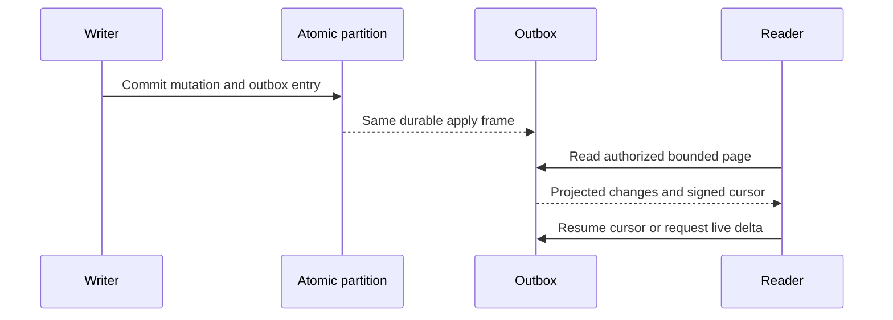

# ChangeFeeds

Status: source-present for a single atomic partition; delivered-source GitHub qualification remains pending. The design target includes replayable projections and resumable public feeds. Cross-partition coverage and external-index publication are planned.

## Purpose, actors, and entry points

ChangeFeeds exposes committed document mutations to authorized readers and bounded scalar live queries, and provides a system outbox for in-partition projections. Actors are database clients, projection workers, and query clients. Current HTTP/.NET entry points are `POST /v1/changes/read`, `POST /v1/query/live/start`, `POST /v1/query/live/read`, and administrator projection operations under `/v1/admin/projections/*`; their contracts are in `src/KeyLoad.Abstractions/Features/ChangeFeeds/Contracts/ChangeFeeds.cs`, implementation in `src/KeyLoad.Core/Features/ChangeFeeds/Execution/ChangeFeeds.cs`, `ProjectionOutbox.cs`, and `src/KeyLoad.Query/Features/ChangeFeeds/Queries/LiveQueryExecutor.cs`, and SDK methods in `src/KeyLoad.Client/KeyLoadClient.cs`. These are existing routes, not a proposal for additional endpoints.

## Canonical slice map and boundaries

| Surface | Current source | Target owner |
|---|---|---|
| Contracts | `src/KeyLoad.Abstractions/Features/ChangeFeeds/Contracts/ChangeFeeds.cs` | `src/KeyLoad.Abstractions/Features/ChangeFeeds/` |
| Outbox and public feed | `src/KeyLoad.Core/Features/ChangeFeeds/Execution/ProjectionOutbox.cs`, `ChangeFeeds.cs` | `src/KeyLoad.Core/Features/ChangeFeeds/` |
| Scalar live query | `src/KeyLoad.Query/Features/ChangeFeeds/Queries/LiveQueryExecutor.cs`; public facade `LiveQueries.cs` | Slice-local private owner borrowing the existing database/query engine; same single read cut |
| HTTP/.NET SDK | `src/KeyLoad.Server/Features/ClientApi/Transport/ApiEndpoints.cs`, `src/KeyLoad.Client/KeyLoadClient.cs` | Shared entry points; behavior remains in this slice |
| Tests | `tests/KeyLoad.UnitTests/Features/ChangeFeeds/` feed/projection suites, `LiveQueryTests.cs`; `tests/KeyLoad.RecoveryTests/Features/EventStreams/Cases/ProjectionRecoveryTests.cs`; `tests/KeyLoad.IntegrationTests/Features/ClusterReplication/Cases/ClusterTests.cs`; new `Features/ChangeFeeds/Cases/FeedLiveRf3Tests.cs` | Unit feed/projection source is slice-local; remaining layout debt targets matching `Features/ChangeFeeds/` folders |
| Durable design | `../design/change-feeds.md` | Detailed design reference; this file owns feature acceptance |
| Frontend | None | N/A: polling and query results are database/client contracts, with no independent UI |
| Official MCP / SQL Q1 CALL | Existing `keyload_changes_read`, `keyload_query_live_start`, `keyload_query_live_read` in the native ClientApi read catalog | Real official MCP SDK invokes the same native operations; exact-source RF3 qualification remains required |

Current root-level source locations are migration debt under [ADR-032](../ADR/ADR-032-mcaf-governance.md). ChangeFeeds does not own the private redo journal, business event streams, message leases, replica placement, or external search-index files. A per-partition outbox is not a cross-partition CDC guarantee.

## Accepted TASK-MP-007D read-work repair

[ADR-035](../ADR/ADR-035-memory-performance.md) adds REQ-FEED-006, mapped to
AC-FEED-004/005 and AC-MP-006/012: carry actual stored outbox byte length and owned
lookup key alongside the decoded entry instead of copying/rereading its payload
for quota subtraction during purge. One canonical point-reader decodes borrowed
bytes and validates sequence/partition before yielding an owned entry. Existing
feed/projection iteration reuses it; purge mutates only between point reads, not
from a range callback. Producer, wire/signatures, filters, checkpoint pins,
contiguous progress and exact response serialization budgets stay. Raw stored
length cannot replace response size without a separate compatibility proof.

Purge passes `min(head.Tail, ThroughSequence)` as the reader's inclusive upper
position. It neither decodes nor validates a retained entry beyond that requested
cut; a no-op or already-reclaimed prefix reads no entries. Gaps and invalid
sequence/partition metadata inside the requested prefix still fail atomically.
Prepare the partition identity once per iterator, rather than hashing it for each
entry. This changes read work only, not committed purge outcomes or retention pins.

Worker owns only ProjectionOutbox.cs range-reader/purge regions and new
Core/UnitTests Features/ChangeFeeds helpers/tests. Shared contracts, ChangeFeeds.cs,
live queries, other producer/consumer methods, docs and CI remain lead-owned.
Real-store tests first prove stored-byte reclamation across large/Unicode entries,
pinned/partial purge, rollback on missing/wrong-sequence/partition records, reopen
and a healthy subsequent producer. A corrupt next retained entry proves that no-op
and prefix purge do not inspect it; restoring that real-store entry allows the
next projection batch to consume it. GitHub executes TUnit/recovery/RF3; source and
development builds do not establish reduced physical I/O.

Projection batch reads reuse their already-loaded outbox head and pass its tail
to the shared entry reader, avoiding a second metadata lookup. Per-entry byte
accounting uses the captured stored length only after a real-store test proves
that `JsonDefaults` round-trips a large Unicode outbox entry byte-for-byte. Exact
and one-byte-too-small batch limits retain their previous result/error semantics;
one single-entry batch performs exactly one lookup each for the principal,
consumer, head and outbox entry.

## Current behavior and accepted target

- Canonical mutations and their outbox entries are committed together. A failed batch exposes no partial entries; a retry with the same command does not append duplicates. Outbox positions are partition-local and monotonically increasing.
- Projection consumers persist an immutable filter/generation, contiguous checkpoint, signed batch token, replay receipt, and retention pin. Effects and checkpoint commit atomically in the same atomic partition. Failed effects do not advance the checkpoint; stale generation tokens are rejected.
- Public document feeds require `ChangesRead | DocumentsRead`. Signed cursors bind the principal, policy/schema/visibility epochs, partition, collection, database incarnation, and position. Bounded pages project before/after images through row and field policy; deletion metadata has no after payload.
- Scalar live queries capture a bounded initial Q1 snapshot and outbox cut together, then return bounded upsert/remove deltas. Unsupported ordering, top-k, aggregation, joins, graph, or ANN subscriptions are rejected by the current profile.
- Current source does not establish external-file atomic publication, automatic retention scheduling, multi-partition merge, or all event/topic/group feed semantics. Those remain planned and require their own contracts and evidence.

## Requirements and acceptance

| Requirement | Measurable acceptance | Existing or planned evidence |
|---|---|---|
| REQ-FEED-001: publish canonical changes and projection effects atomically | AC-FEED-001 passes when a failed producer/effect batch changes neither canonical state nor visible outbox/checkpoint, and replay of the same command/batch returns its prior outcome without duplicate effects. | Existing `ChangeFeedTests.EveryCanonicalMutationAndItsCommitShareThePartitionOutbox`, `FailedBatchAndSameCommandRetryCannotPublishPartialOrDuplicateChanges`, `FailedProjectionEffectsDoNotAdvanceTheCheckpointAndDuplicateDeliveryIsSafe`; recovery `ProjectionCrashRecoversEffectsOutboxReceiptOutcomeAndCheckpointTogether`. |
| REQ-FEED-002: expose resumable, bounded, authorized document changes | AC-FEED-002 passes when a page returns only currently and historically visible, safely projected changes; its signed cursor resumes within retention, and byte/position bounds preserve the first undelivered entry. Stale policy/ACL/incarnation or reclaimed history returns an explicit error. | Existing `ChangeFeedTests.FeedAndProjectionByteBoundariesPreserveTheFirstUndeliveredPosition`, `FeedResumesAnEmptyTailProjectsPiiAndRetainsDeletionMetadata`, `FeedNeverReturnsFormerOwnersDataAndAclChangesFenceOldCursors`, `FeedRevocationHistoryLossAndScopeMismatchAreExplicit`. |
| REQ-FEED-003: make scalar live snapshot plus tail gap-free | AC-FEED-003 passes when a concurrent committed write is present either in the initial snapshot or a later delta, and replayed authorized deltas match the ordinary query oracle. Unsupported query profiles fail explicitly. | Existing `LiveQueryTests.ScalarLiveDeltasMatchTheSharedQueryOracleAcrossSeededMutationsAndReplay`, `ConcurrentInitialSnapshotAndTailNeverLoseACommittedDocument`, `UnsupportedRankingIncompleteSnapshotsAndDifferentQueryCursorsAreRejected`. |
| REQ-FEED-004: advance projection checkpoints contiguously under pinned retention | AC-FEED-004 passes when filtered positions advance contiguously, no checkpoint crosses a pending effect, and purge cannot pass the lowest active generation checkpoint. | Existing `ChangeFeedTests.RetentionPinsProtectUnprocessedAndRebuildHistory`, `FilteredProjectionPositionsAdvanceContiguouslyWithoutPublishingForeignResources`, `AReleasedGenerationRejectsOldBatchesAndCachedCommandReceipts`; planned real multi-partition coverage tests. |
| REQ-FEED-005: recover retained feed state without silent gaps | AC-FEED-005 passes when reopen/compaction and the declared RF3 snapshot-install path preserve outbox/checkpoint/receipt state or explicitly invalidate old cursors; history loss requires resynchronization. | Existing `OutboxAndConsumerReceiptsRecoverAfterReopenAndCompaction`, `ProjectionRecoveryTests.ProjectionCrashRecoversEffectsOutboxReceiptOutcomeAndCheckpointTogether`; current-source GitHub qualification and broader leader-loss cases remain pending. |
| REQ-FEED-006: bound projection read work without changing byte-budget behavior | AC-FEED-006 passes when persisted entry bytes equal `JsonDefaults` serialization after decode, exact and one-byte-short limits preserve success/rejection, and an isolated one-entry batch performs exactly four borrowed point lookups. | `ProjectionReadWorkTests.AcMp006ProjectionBatchReusesHeadAndStoredEntryBytes`; real ZoneTree counters; TUnit execution remains GitHub Actions only. |

## Error, edge, and security flows

Empty-tail cursors are valid. Filtered partition positions may produce an empty page with `HasMore`; callers continue until caught up. A first item larger than the byte budget fails with `BudgetExceeded` without moving past it. Missing authorization fails before reading payloads. Principal revocation or policy/schema/row-visibility changes fence old cursors. A cursor behind a reclaimed prefix returns `HistoryUnavailable`, requiring a fresh snapshot. A deleted change preserves revision/deletion metadata and has no `After` payload; its `Before` image may be present only when historical and current row authorization allow it, and it is safely projected. Public readers never receive raw system-outbox entries or unrelated resource identities.

## ADRs and verification boundary

Related decisions: [ADR-017](../ADR/ADR-017-ownership-session-tokens.md), [ADR-022](../ADR/ADR-022-policy-epoch-revocation.md), [ADR-023](../ADR/ADR-023-journal-authority.md), [ADR-024](../ADR/ADR-024-transaction-domain-binding.md), [ADR-025](../ADR/ADR-025-event-revision-feed-positions.md), [ADR-027](../ADR/ADR-027-contiguous-subscription-checkpoints.md), [ADR-029](../ADR/ADR-029-event-message-classification.md), and [ADR-030](../ADR/ADR-030-retention-paused-restore.md). Cluster routing follows the accepted [ADR-036](../ADR/ADR-036-orleans-foundation.md). The operational distinction among redo journal, business streams, queue state, and outbox is in [change-feed design](../design/change-feeds.md).

TUnit unit, process-recovery, and Docker/Aspire RF3 cases execute through GitHub Actions only. The current source/test names above are traceability, not a passing result for the current checkout. Required external-index manifests, multi-partition semantics, official MCP calls, and delivered-source CI evidence remain pending. Tests use the real ZoneTree store and real cluster/client path; no mock-only acceptance is permitted.

Original KL-016 task acceptance is complete on the source-bound Linux Stage VII
cohort documented in [the canonical task status](../implementation/status.json).
Crash between commit and delivery loses no event; duplicate delivery is safe; checkpoint does not skip a failed event. The receipt retains all original full-suite failures;
this task closure does not mark the complete feature or later source qualified.

## Live delta retained output composition, TASK-QUERY-RESULT-CAP-LIVE-002

REQ-QUERY-001/003, AC-MP-003/012 and REQ/AC-FEED-002/003 under ADR-004/010/013/022/118 require the existing constrained result budget to admit each retained selected live delta before retention. Core keeps its existing public ReadChangeFeedView signature and adds an internal synchronous before-retain overload, invoked only after original request.MaxBytes admits the change and before changes.Add/checkpoint advancement. LiveQueryResultByteAdmission uses exact original budget.MeasureResult and cumulative MaximumResultBytes; overflow is existing QueryEngine.ResultLimitExceeded BudgetExceeded, not partial success. Full wrapper serializer check remains. No operation clock/token/read grants/admission/read cut reset or new request/serialization/persistence field. Install this additional callback only for an explicit configured result cap; null/default preserves old feed behavior.

LiveQueryResultCompositionTests use actual ZoneTree Start->multirow mutation->Read, individually fitting changes whose combined output exceeds4096, exact terminal error/noPartial/fullnative store bytes and position invariance, healthy smaller literal projection and complete checkpoint/cut/receipt/row metadata. A separate original request.MaxBytes page/resume flow proves candidates excluded by original pagination are not charged against retained query cap. Root owns discovery/native normal/scalar/full RF3 proof; source-only packet is unexecuted. Rollback removes internal callback, live admission helper and matching cases together; R2 default cap/native journal/auth contracts remain unchanged.

## KL031 exact-through native projection boundary (accepted root direction 2026-10-08)

REQ-PROJECTION-PREFIX-001 / AC-PROJECTION-PREFIX-001: optional ReadProjectionBatchRequest ThroughSequence native Id3 limits the existing administrative signed projection batch to the exact retained source prefix U. JSON omits null and existing null behavior remains latesthead. Fresh persisted ClusterAdministrator and actual current consumer/released-generation checks precede U validation. Current checkpoint<=U<=retainedhead is required, including an empty U=checkpoint batch. Out-of-range U is TokenInvalidated with exact safe detail `The projection upper sequence is outside the current consumer checkpoint and retained head.`; no read mutation/checkpoint effect. Returned and signed ThroughSequence never exceed U; HasMore refers to remaining range through U, not later head. Limit/MaxBytes/ordering/checksum/signature/expiry/replay/receipt semantics remain unchanged. Existing SDK/MCP/SQL request paths forward the actual typed option through their unique request grain; no new dispatcher/admin role. ADR019 owns the ANN consumer use; existing changefeed projection authority contracts remain mandatory.

TASK-ANN-R2-PREFIX tests use actual persisted consumer pin and native canonical vectors, capture seedU then append a later vector, native/JSON request roundtrip, exact bounded original Mutation bytes, signed empty-effect checkpoint+sameID full native receipt replay/no new effects, next latesthead healthyread, inclusive emptyU and invalidlow/high no-effect followedhealthy. Revoked/nonadministrator/obsoleteconsumer must fail under original persisted checks rather than trusting suppliedU. Source authored, not qualification.

The AC-ANN-007 exact-prefix owner pins the existing native `applyVectorProjection` mutation discriminator as well as putDocument/patchDocument/deleteDocument/putVector. Consumer filter admission must accept this actual canonical mutation; its native Target, dependency lineage and canonical receipt remain unchanged. Unsupported discriminators still fail before effects. The ANN replay test must exercise a real projected vector and a source-document revision transition, not only direct PutVector. Null StartAfter retains the original first-available-minus-one checkpoint semantics; it does not silently jump to the current head.

## TASK-KL079-NATIVE-FEED-LIVE-001

REQ/AC-FEED-002/003/005 and REQ/AC-QUERY-001/003, AC-MP-003/012 retain one native owner read cut, persisted current/historical authorization, signed original cursors, gap-free snapshot/tail and no raw PII. ReadChangeFeed's existing two-argument API deliberately delegates to its new original-cancellation overload; no legacy path or schema. Original DatabaseEngine clock owns cursor expiry and operation deadline. One existing ReadExecutionBudget and read grant charge all actual raw storage bytes/record attempts before decode/copy, projected result retention and the complete final response. Request.MaxBytes still bounds change payload and preserves the first undelivered entry; it does not replace complete wrapper/read-work limits. Feed cancellation produces no returned partial page. Existing live reader/view budget and profile stay unchanged.

Order: this contract and canonical ChangeFeeds/ADR010 appendices precede source. Core owns public feed same-cut operation; Orleans forwards exact original token through existing native CQRS/unique request grain. Tests: native observed point-read cancellation/deadline -> original error/no partial/full canonical cut unchanged -> independent complete literal healthy feed/empty continuation; genuine Aspire RF3 SDK/official MCP reconnect, replay, historic/current row+field redaction, persisted revoke/token invalidation -> exact grant repair/fresh cursor -> healthy; live initial snapshot/concurrent committed writes/deltas/delete/current revocation -> ordinary query literal parity/healthy fresh subscription. Cold feed continuity is exercised by the RF3 reconnect case. SQL Q1 CALL uses existing tools/decoder, no new dialect/operation.

Ownership: existing Core ChangeFeeds.cs, existing Orleans GrainCoreReadCapabilities.cs, feature-local Unit and Integration ChangeFeeds roles, docs/Features/ChangeFeeds.md and ADR010 appendices. No shared fixture mutation, new option/quota/provider, alias/Id/default/deadline/protocol change. Root joins source and owns compiler/census/native normal+scalar/recovery/Linux RF3 qualification; source-authored arguments are not observed native counts or PASS. Original KL079 full criteria and mandatory full product/fault/endurance/coverage gates stay open. Rollback source stage only, no persisted migration.

## TASK-KL079-FULL-LIVE-PAGE-002

REQ/AC-FEED-002/003/005 and AC-MP-003/012 retain the existing six-field LiveQueryChange and five-field LiveQueryPage. Independent upsert revision2 and native tombstone revision3 come from the original stored document mutation, not a constructor overload. Complete SDK/official MCP/Q1 tail pages compare literal changes, through sequence, hasMore and the actual unchanged owning read cut. Each returned opaque cursor is nonempty and is consumed through the same real route; the complete empty continuation preserves through sequence, hasMore=false and the same unchanged cut. Cursor bytes are never fabricated or required to equal independently issued tokens. Current persisted revocation and obsolete-policy token failures cover SDK, official MCP and both Q1 routes, with no partial result, bracketed by existing full canonical no-effect checks; exact policy repair leads to a fresh healthy full page on all routes.

Order: feature/ADR contract, native constructor/delete semantic proof, bounded assertion helpers, unchanged two genuine RF3 case identities. No production schema/alias/Id, runtime option, timeout, topology or authorization change. Root owns fresh compiler/native census/Linux operations; this fixture correction alone does not qualify the whole task. Rollback removes only these fixture assertions and appendix together.

## TASK-KL079-COMPLETE-PAGE-COLD-003

REQ/AC-FEED-002/003/005 retain the same bounded polling/retention, current persisted privacy and six-field LiveQueryChange (original upsert revision2/delete revision3) contracts. The existing RF3 feed case must assert all seven page fields: complete independent literal changes, actual opaque cursor, exact through/tail/firstAvailable/hasMore, and actual read cut bounded by the original successful receipt. Fixture tail2 includes its hidden second row; updated tail3 follows only the actual acknowledged replacement. Each SDK, official MCP and both Q1 route consumes its own returned opaque cursor; the next page is the independently known hidden position or complete empty tail. Different issued cursor bytes/read cuts are not fabricated or required equal. Every original assertion remains.

The existing live RF3 case closes its actual original reader/administrator before genuine all-three fixture kill/restart, recreates fresh callers from the same persisted credentials and verifies original physical owner/incarnation and monotone observed generation (no +1/positive-initial assumption). The original pre-cold subscription cursor is then consumed for the actual fresh delete, exact native revision3/receipt/Remove and full page/empty continuation on all four routes, followed by persisted revocation, obsolete-policy token refusal, exact policy repair and fresh healthy snapshot/tail. This is continuation of the real original subscription, not resynchronizing under a replacement token. No connection-grain, public schema, limit/deadline, clock, topology or production behavior change.

Existing two `FeedLiveRf3Tests` identities are unchanged. Native discovery/source/PE/PDB and Linux normal/scalar outcomes plus actual owned resource/reader cleanup remain required; source review and local prior15 cases do not close the task. Existing Unit/projection process/native snapshot-install paths remain mandatory, with full product/endurance gates separate and open. Rollback removes only this fixture oracle/cold extension coherently; no state/format migration.

### TASK-KL079-COLD-NATIVE-COHORT-ACQUISITION-001

REQ/AC-FEED-005, REQ/AC-REP-004 and REQ/AC-TEST-007: catalog prerequisite must actively obtain missing/expired genuine signed native cohort observations rather than waiting for unrelated outbound replica work. Catalog startup currently precedes RuntimeJournalStartup acquisition; incoming replica RPC does not fill the private discovery cache. A current cold follower may therefore materialize leader heartbeats while its own cache is empty. This is a source-proven liveness counterexample; original b392 seventeen RoleFollower/cohortFalse observations do not identify the historical branch and remain failed/unknown.

At the same original cohort short circuit, after all existing native consensus guards, await the existing owned signed EnsureCompatibleCohortAsync with the original readiness token/RPC deadline/current-contract/MAC/fixed-voter/TTL checks. Only its exact existing OwnershipLost/NoLeader maps to an insufficient-ready value for the unchanged heartbeat poll; all other original errors and cancellation propagate. After actual acquisition/work settlement, evaluate the same closed predicate/status, which remains mandatory before admin auth/catalog bootstrap/admission. No cache injection, extra loop/retry, new provider/endpoint/option, relaxed majority, changed clock/deadline or persisted/public schema.

RequestCqrsColdStartupAcquisitionTests.ColdFollowerAcquiresItsOwnSignedCurrentCohortWithoutUnrelatedOutboundWork and OriginalUnavailableAndIncompatibleRefusalsAndCallerCancellationPrecedeHealthyAdmission execute genuine existing3-silo/Kestrel nonce/native-MAC operations with complete original identity/address and refusal→healthy assertions, zero-request cancellation, all counts and joined client/endpoint/signer cleanup. Supporting native tests do not replace original exact-source Linux KL079 full SDK/official MCP/Q1 snapshot/tail/privacy/reconnect/revocation/cold operation or KL042 whole restore gates. Selectors/old b392 TRX identities are retained separately; fresh current native UID/image/runtime outcomes are required. Join discriminator13 → signed-cohort5 → this guarded successor; no source declaration is qualification.

## TASK-KL079-SNAPSHOT-INSTALL-CURSOR-001

REQ/AC-FEED-002/005 and AC-REP-004 require the original public feed cursor across genuine empty-follower snapshot installation plus ordered tail and cold reopen. Extend the existing EmptyReplicaSnapshotScenario only with bounded read operations: after the original configuration/processing and denied-principal admission, before erase, capture a caught-up Start.Now cursor from the selected actual follower. Preserve that exact signed cursor, partition, incarnation and original outbox position. After the existing verified snapshot checksum, native ordered-tail entry and same installed-owner cold reopen, consume it through SDK, official MCP and both Q1 routes. Independently reconstruct all forty doc payloads plus the ordered-tail literal and revision1; validate sequence, current cut, authority, nondefault committed timestamps, original last-doc and tail receipts, complete seven-field pages and each route's empty continuation. No token bytes equality across separately issued responses.

Read-only additions do not change snapshot threshold16, suffix headroom, write cadence, existing three-minute deadline, membership, erase paths, grants, or startup. Native verification checks incarnation/current persisted policy/schema/visibility/expiry; NodeId is not a feed claim, so the genuine replacement follower must preserve this original cursor under unchanged authority. Any actual refusal is retained as a failure, never converted into resynchronization success. Existing revoke/redaction/history loss and live subscription cold controls remain mandatory. Implementation order: these docs and ADR010; fixture-only ChangeFeeds assertion; additive capture/verification calls in the existing erase/install case. Exact-source Linux normal/scalar, native UID/image/source and all cleanup gates remain unqualified. Rollback removes only these fixture assertions, no format/API/product change.

## TASK-KL079-REPAIRED-LIVE-COLD-004

REQ/AC-FEED-002/003/005: the same original ConcurrentSnapshotAndCommittedTailRemainGapFreePrivateAndRevocable RF3 case must retain its freshly authorized repaired-policy snapshot cursor, genuinely resurrect its original deleted row with original private payload/owner (previous native revision3, new revision4, outbox sequence5), and receive the full independent redacted upsert plus complete empty continuation through SDK, official MCP and both Q1 routes. The hidden row remains excluded. Preserve the actual new command and complete acknowledged receipt; same-ID replay under fresh persisted administrator authorization leaves the complete outbox state unchanged.

Close original callers and use the existing actual all-three same-root cold restart. Require the same NodeId/incarnation and nondecreasing generation via the original owner helper. The SAME repaired pre-write cursor must return that complete revision4/sequence5 delta after cold; independently issued cursor bytes are not required equal. The earlier old-policy subscription remains TokenInvalidated with no protected result/effects across all four routes, and the repaired current caller ends with a fresh full literal snapshot and healthy empty tail. No new product/schema/alias/Id/clock/quota/deadline/transport/connection policy. Original test declarations and every prior concurrent/delete/revoke/repair assertion stay.

Order/owners: append this feature/ADR010 contract before private source; existing LiveTailRf3Trial returns its actual repaired snapshot and delegates the added phase to bounded feature-local LiveRepairedRf3Continuation/Assertions. FeedLiveRf3Protocol owns only independent semantic revision/sequence constants. FeedLiveRf3Connections owns every original/fresh SDK+official client and preserves original initiating/cleanup ledger. Runtime/discovery/source-image/normal+scalar RF3 and complete Unit/recovery remain root-owned authentic gates; this packet claims no PASS or task closure. Rollback removes only this extension and its contract together.

## TASK-KL079-PUBLIC-FIRST-ENTRY-BACKPRESSURE-005

REQ/AC-FEED-002/003/005 and the original KL079 delivery/backpressure criteria retain the existing OriginalCursorReconnectsAcrossColdRf3AndRechecksRevokedPersistedAccess identity. Native PrepareChangeRead accepts MaxBytes=1 as a positive bound; native ProjectChangePage measures the complete authorized DocumentChange and refuses before retaining or advancing its first undelivered visible entry. The independently fixed first projected JSON {"number":1,"status":"open"} alone exceeds one UTF8 byte, and the original full literal healthy page proves this actual first entry/ref/revision/receipt/redaction. The visible original first entry precedes the hidden second row; the request is not an empty/hidden-only tail or invalid zero-bound control.

Before the original first page, issue that SAME positive one-byte request through actual SDK, official MCP, Q1 SDK and Q1 MCP and require exactly BudgetExceeded with no protected returned page. Existing complete QueryAst/outbox-status comparison brackets all refusals. Immediately continue the original unmodified full literal page and its actual own hidden-gap resume. Preserve its actual cursor across original caller close/all-three same-root cold, original acknowledged update, full receipt replay, current persisted revoke/repair/obsolete-token no-effect and healthy continuation. No new case/declaration/UID, copied token, producer effect, clock, topology, resource/operation deadline/default or product contract.

Ordered implementation: this feature/ADR010 append; only the existing FeedReconnectRf3Trial call and semantic test payload-bound constant in FeedLiveRf3Protocol; root coherent compiler/discovery and complete Linux normal/scalar Unit/projection process/RF3 SDK+official MCP+both Q1 qualification. Existing observed native read cancel/deadline controls, complete live-result cumulative cap, projection pins/backpressure/checkpoint/recovery and follower snapshot-install cursor41 remain mandatory. Source presence is not PASS or complete feature/cross-partition qualification. Rollback removes only this additive refusal call and named fixture bound together.

## TASK-KL079-NATIVE-TASK-QUALIFICATION-006

REQ/AC-FEED-001..006 and the original KL079 bounded delivery/live-query criteria require actual current-source Linux normal/scalar native qualification. Source candidates are admission descriptors, not compiled UIDs, discovered case counts, execution or acceptance. Preserve the twelve preceding task objects byte-for-byte, native50 ordinary TUnit slots, existing exclusive heavy RF3 ownership, all original deadlines/Args/receipts/privacy/cold oracles and every full-suite/coverage gate. Benchmarks and Website remain separate.

Ordered stages: append this feature/TestInfrastructure/ADR117 contract; add only KL079 to the canonical selected-task dispatch and existing census-only allowlist; root compiles the unchanged canonical images/source receipt; isolated Linux normal/scalar jobs retain original native discovery, before/after DLL/PDB/source images, source verification, process settlement and owned Docker ledgers. Census retains every candidate result and intentionally refuses execution/acceptance until authenticated exact binding exists. Missing, duplicate, unexpected, typed-parameter/source/assembly/image drift or unsettled discovery never admits execution. No source scanning is a correctness test, and no native UID/display name is synthesized.

The complete native-source mapping is:

| Original criterion | Existing complete operation owners admitted for native census |
| --- | --- |
| AC-FEED-001 atomic producer/effect/outbox/checkpoint and original replay | ChangeFeedTests; ProjectionProcessRecoveryTests; ClusterTests.ReplicatedAtomicBatchSurvivesLeaderContainerKillAndMinorityRejectsWrites and RetainedReplicaCatchesUpThroughNativeSnapshotAndKeepsCommandOutcomes |
| AC-FEED-002 protected/resumable pages, retention, byte backpressure, cancel/deadline and no partial effects | ChangeFeedReadTests; ChangeFeedObservedWorkTests (both original Args); NativeChangeFeedCursorTests; OutboxPurgeTests; FeedLiveRf3Tests original reconnect/revoke/repair/cold case |
| AC-FEED-003 gap-free scalar snapshot/tail, predicate privacy, unsupported profiles and cumulative result bound | LiveQueryTests; LiveQueryResultCompositionTests; FeedLiveRf3Tests original concurrent/delete/revoke/repair/cold case |
| AC-FEED-004 contiguous filtered effects/checkpoints, generation fences/pins and bounded reserve | ChangeFeedTests; ProjectionProgressTests; original projection process and leader-loss/retained-follower flows |
| AC-FEED-005 exact reopen/compaction/history/cursor fences and installed snapshot recovery | ChangeFeedReadTests; OutboxPurgeTests; ProjectionProgressTests; all seven original ProjectionProcessRecoveryTests Args; both FeedLiveRf3Tests; EmptyReplicaSnapshotRf3Tests.ErasedFollowerInstallsNativeSnapshotAndOrderedTailBeforeCompletePublicReplayAndHealthyContinuation; original retained-follower and leader-loss flows |
| AC-FEED-006 real stored-byte/read-work boundary | ProjectionReadWorkTests.AcMp006ProjectionBatchReusesHeadAndStoredEntryBytes plus bounded projection/read/refusal cases above |

RF3 public reconnect/live/erased-follower flows preserve real SDK, official MCP and both Q1 routes, independently literal full pages, original receipt/no-effect replay, current persisted privacy and original cold/cursor identity. Supporting leader-loss/retained-follower operations remain their actual SDK contracts; their presence does not manufacture four-route or full-literal coverage.

After both authenticated original census artifacts exist, retain API run/attempt/source/job/artifact identity and ZIP digest, exact native class/method/display/UID/typed parameters/source span and identical prepared/before/after compiled images. A separately reviewed guarded successor replaces only KL079 censusSelections with exact strict cases derived from these originals; no arithmetic source-count promotion. Existing strict verifier then requires every declared native discovered/executed case, exact successful TRX, unchanged source/images and joined cleanup. The same normal/scalar mapped operations must execute through canonical run-tests.mjs, including fixture-owned Aspire RF3 and real process kill/reopen. Scalar caller environment is not a claim that Docker server hardware intrinsics were disabled.

Functional coverage remains an additional mandatory gate under the canonical complete coverage producer/verifier. Current strict Unit inventory maps eight listed Unit classes but not ChangeFeedObservedWorkTests; current product-contributors has no KL079 mapping. Do not edit those authenticated strict inventories from source declarations. Fresh native discovery/source-image binding must support an independently reviewed coverage mapping, actual covered execution and successful unchanged final coverage verification before task closure. This discovery packet generates no acceptance.json and claims no build/runtime/coverage PASS. Cross-partition subscriptions, top-k/ANN, endurance, power-loss and performance gates are not inferred from scalar feed qualification.

Ownership/integration: scripts/CodeQuality owns candidate admission, strict original intake/binding and verification; workflow owns isolated Linux jobs/source/image/artifact cleanup; current C# fixtures retain all operation/resource lifetimes. Root alone joins/builds/tests/pushes; KL079 owner follows the authentic normal/scalar artifacts through binding, actual execution failures and final coverage evidence. Rollback removes only this additive task entry/allowlist/workflow dispatch and appendices, preserving twelve original task objects and immutable discovery originals; no product/transport/format/authority change.
