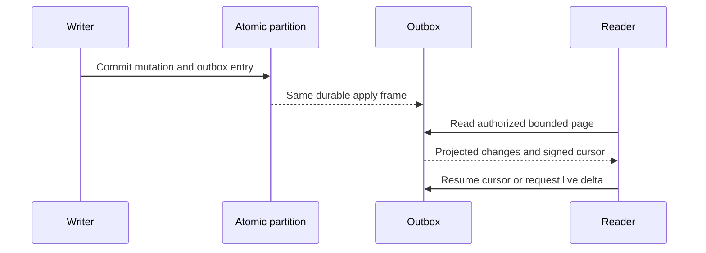

# ChangeFeeds

Status: source-present for a single atomic partition; delivered-source GitHub qualification remains pending. The design target includes replayable projections and resumable public feeds. Cross-partition coverage and external-index publication are planned.

## Purpose, actors, and entry points

ChangeFeeds exposes committed document mutations to authorized readers and bounded scalar live queries, and provides a system outbox for in-partition projections. Actors are database clients, projection workers, and query clients. Current HTTP/.NET entry points are `POST /v1/changes/read`, `POST /v1/query/live/start`, `POST /v1/query/live/read`, and administrator projection operations under `/v1/admin/projections/*`; their contracts are in `src/KeyLoad.Abstractions/Features/ChangeFeeds/Contracts/ChangeFeeds.cs`, implementation in `src/KeyLoad.Core/Features/ChangeFeeds/Execution/ChangeFeeds.cs`, `ProjectionOutbox.cs`, and `src/KeyLoad.Query/Features/ChangeFeeds/Execution/LiveQueries.cs`, and SDK methods in `src/KeyLoad.Client/KeyLoadClient.cs`. These are existing routes, not a proposal for additional endpoints.

## Canonical slice map and boundaries

| Surface | Current source | Target owner |
|---|---|---|
| Contracts | `src/KeyLoad.Abstractions/Features/ChangeFeeds/Contracts/ChangeFeeds.cs` | `src/KeyLoad.Abstractions/Features/ChangeFeeds/` |
| Outbox and public feed | `src/KeyLoad.Core/Features/ChangeFeeds/Execution/ProjectionOutbox.cs`, `ChangeFeeds.cs` | `src/KeyLoad.Core/Features/ChangeFeeds/` |
| Scalar live query | `src/KeyLoad.Query/Features/ChangeFeeds/Queries/LiveQueryExecutor.cs`; public facade `LiveQueries.cs` | Slice-local private owner borrowing the existing database/query engine; same single read cut |
| HTTP/.NET SDK | `src/KeyLoad.Server/ApiEndpoints.cs`, `src/KeyLoad.Client/KeyLoadClient.cs` | Shared entry points; behavior remains in this slice |
| Tests | `tests/KeyLoad.UnitTests/Features/ChangeFeeds/` feed/projection suites, `LiveQueryTests.cs`; `tests/KeyLoad.RecoveryTests/Features/EventStreams/Cases/ProjectionRecoveryTests.cs`; `tests/KeyLoad.IntegrationTests/Features/ClusterReplication/Cases/ClusterTests.cs` | Unit feed/projection source is slice-local; remaining layout debt targets matching `Features/ChangeFeeds/` folders |
| Durable design | `../design/change-feeds.md` | Detailed design reference; this file owns feature acceptance |
| Frontend | None | N/A: polling and query results are database/client contracts, with no independent UI |
| Official MCP | No implementation found | Required ClientApi caller surface; qualification is pending, not inferred from HTTP routes |

Current root-level source locations are migration debt under [ADR-032](../ADR/ADR-032-mcaf-governance.md). ChangeFeeds does not own the private redo journal, business event streams, message leases, replica placement, or external search-index files. A per-partition outbox is not a cross-partition CDC guarantee.

## Accepted TASK-MP-007D read-work repair

[ADR-035](../ADR/ADR-035-memory-performance.md) adds REQ-FEED-006, mapped to
AC-FEED-004/005 and AC-MP-006/012: carry actual stored outbox byte length and owned
lookup key alongside the decoded entry instead of copying/rereading its payload
for quota subtraction during purge. One canonical point-reader decodes borrowed
bytes and validates sequence/partition before yielding an owned entry. Existing
feed/projection iteration reuses it; purge mutates only between point reads, not
from a range callback. Producer, wire/signatures, filters, checkpoint pins,
contiguous progress and exact response serialization budgets stay. Raw stored
length cannot replace response size without a separate compatibility proof.

Purge passes `min(head.Tail, ThroughSequence)` as the reader's inclusive upper
position. It neither decodes nor validates a retained entry beyond that requested
cut; a no-op or already-reclaimed prefix reads no entries. Gaps and invalid
sequence/partition metadata inside the requested prefix still fail atomically.
Prepare the partition identity once per iterator, rather than hashing it for each
entry. This changes read work only, not committed purge outcomes or retention pins.

Worker owns only ProjectionOutbox.cs range-reader/purge regions and new
Core/UnitTests Features/ChangeFeeds helpers/tests. Shared contracts, ChangeFeeds.cs,
live queries, other producer/consumer methods, docs and CI remain lead-owned.
Real-store tests first prove stored-byte reclamation across large/Unicode entries,
pinned/partial purge, rollback on missing/wrong-sequence/partition records, reopen
and a healthy subsequent producer. A corrupt next retained entry proves that no-op
and prefix purge do not inspect it; restoring that real-store entry allows the
next projection batch to consume it. GitHub executes TUnit/recovery/RF3; source and
development builds do not establish reduced physical I/O.

Projection batch reads reuse their already-loaded outbox head and pass its tail
to the shared entry reader, avoiding a second metadata lookup. Per-entry byte
accounting uses the captured stored length only after a real-store test proves
that `JsonDefaults` round-trips a large Unicode outbox entry byte-for-byte. Exact
and one-byte-too-small batch limits retain their previous result/error semantics;
one single-entry batch performs exactly one lookup each for the principal,
consumer, head and outbox entry.

## Current behavior and accepted target

- Canonical mutations and their outbox entries are committed together. A failed batch exposes no partial entries; a retry with the same command does not append duplicates. Outbox positions are partition-local and monotonically increasing.
- Projection consumers persist an immutable filter/generation, contiguous checkpoint, signed batch token, replay receipt, and retention pin. Effects and checkpoint commit atomically in the same atomic partition. Failed effects do not advance the checkpoint; stale generation tokens are rejected.
- Public document feeds require `ChangesRead | DocumentsRead`. Signed cursors bind the principal, policy/schema/visibility epochs, partition, collection, database incarnation, and position. Bounded pages project before/after images through row and field policy; deletion metadata has no after payload.
- Scalar live queries capture a bounded initial Q1 snapshot and outbox cut together, then return bounded upsert/remove deltas. Unsupported ordering, top-k, aggregation, joins, graph, or ANN subscriptions are rejected by the current profile.
- Current source does not establish external-file atomic publication, automatic retention scheduling, multi-partition merge, or all event/topic/group feed semantics. Those remain planned and require their own contracts and evidence.

## Requirements and acceptance

| Requirement | Measurable acceptance | Existing or planned evidence |
|---|---|---|
| REQ-FEED-001: publish canonical changes and projection effects atomically | AC-FEED-001 passes when a failed producer/effect batch changes neither canonical state nor visible outbox/checkpoint, and replay of the same command/batch returns its prior outcome without duplicate effects. | Existing `ChangeFeedTests.EveryCanonicalMutationAndItsCommitShareThePartitionOutbox`, `FailedBatchAndSameCommandRetryCannotPublishPartialOrDuplicateChanges`, `FailedProjectionEffectsDoNotAdvanceTheCheckpointAndDuplicateDeliveryIsSafe`; recovery `ProjectionCrashRecoversEffectsOutboxReceiptOutcomeAndCheckpointTogether`. |
| REQ-FEED-002: expose resumable, bounded, authorized document changes | AC-FEED-002 passes when a page returns only currently and historically visible, safely projected changes; its signed cursor resumes within retention, and byte/position bounds preserve the first undelivered entry. Stale policy/ACL/incarnation or reclaimed history returns an explicit error. | Existing `ChangeFeedTests.FeedAndProjectionByteBoundariesPreserveTheFirstUndeliveredPosition`, `FeedResumesAnEmptyTailProjectsPiiAndRetainsDeletionMetadata`, `FeedNeverReturnsFormerOwnersDataAndAclChangesFenceOldCursors`, `FeedRevocationHistoryLossAndScopeMismatchAreExplicit`. |
| REQ-FEED-003: make scalar live snapshot plus tail gap-free | AC-FEED-003 passes when a concurrent committed write is present either in the initial snapshot or a later delta, and replayed authorized deltas match the ordinary query oracle. Unsupported query profiles fail explicitly. | Existing `LiveQueryTests.ScalarLiveDeltasMatchTheSharedQueryOracleAcrossSeededMutationsAndReplay`, `ConcurrentInitialSnapshotAndTailNeverLoseACommittedDocument`, `UnsupportedRankingIncompleteSnapshotsAndDifferentQueryCursorsAreRejected`. |
| REQ-FEED-004: advance projection checkpoints contiguously under pinned retention | AC-FEED-004 passes when filtered positions advance contiguously, no checkpoint crosses a pending effect, and purge cannot pass the lowest active generation checkpoint. | Existing `ChangeFeedTests.RetentionPinsProtectUnprocessedAndRebuildHistory`, `FilteredProjectionPositionsAdvanceContiguouslyWithoutPublishingForeignResources`, `AReleasedGenerationRejectsOldBatchesAndCachedCommandReceipts`; planned real multi-partition coverage tests. |
| REQ-FEED-005: recover retained feed state without silent gaps | AC-FEED-005 passes when reopen/compaction and the declared RF3 snapshot-install path preserve outbox/checkpoint/receipt state or explicitly invalidate old cursors; history loss requires resynchronization. | Existing `OutboxAndConsumerReceiptsRecoverAfterReopenAndCompaction`, `ProjectionRecoveryTests.ProjectionCrashRecoversEffectsOutboxReceiptOutcomeAndCheckpointTogether`; current-source GitHub qualification and broader leader-loss cases remain pending. |
| REQ-FEED-006: bound projection read work without changing byte-budget behavior | AC-FEED-006 passes when persisted entry bytes equal `JsonDefaults` serialization after decode, exact and one-byte-short limits preserve success/rejection, and an isolated one-entry batch performs exactly four borrowed point lookups. | `ProjectionReadWorkTests.AcMp006ProjectionBatchReusesHeadAndStoredEntryBytes`; real ZoneTree counters; TUnit execution remains GitHub Actions only. |

## Error, edge, and security flows

Empty-tail cursors are valid. Filtered partition positions may produce an empty page with `HasMore`; callers continue until caught up. A first item larger than the byte budget fails with `BudgetExceeded` without moving past it. Missing authorization fails before reading payloads. Principal revocation or policy/schema/row-visibility changes fence old cursors. A cursor behind a reclaimed prefix returns `HistoryUnavailable`, requiring a fresh snapshot. A deleted change preserves revision/deletion metadata and has no `After` payload; its `Before` image may be present only when historical and current row authorization allow it, and it is safely projected. Public readers never receive raw system-outbox entries or unrelated resource identities.

## ADRs and verification boundary

Related decisions: [ADR-017](../ADR/ADR-017-ownership-session-tokens.md), [ADR-022](../ADR/ADR-022-policy-epoch-revocation.md), [ADR-023](../ADR/ADR-023-journal-authority.md), [ADR-024](../ADR/ADR-024-transaction-domain-binding.md), [ADR-025](../ADR/ADR-025-event-revision-feed-positions.md), [ADR-027](../ADR/ADR-027-contiguous-subscription-checkpoints.md), [ADR-029](../ADR/ADR-029-event-message-classification.md), and [ADR-030](../ADR/ADR-030-retention-paused-restore.md). Cluster routing follows the accepted [ADR-036](../ADR/ADR-036-orleans-foundation.md). The operational distinction among redo journal, business streams, queue state, and outbox is in [change-feed design](../design/change-feeds.md).

TUnit unit, process-recovery, and Docker/Aspire RF3 cases execute through GitHub Actions only. The current source/test names above are traceability, not a passing result for the current checkout. Required external-index manifests, multi-partition semantics, official MCP calls, and delivered-source CI evidence remain pending. Tests use the real ZoneTree store and real cluster/client path; no mock-only acceptance is permitted.

Original KL-016 task acceptance is complete on the source-bound Linux Stage VII
cohort documented in [the canonical task status](../implementation/status.json).
Crash between commit and delivery loses no event; duplicate delivery is safe; checkpoint does not skip a failed event. The receipt retains all original full-suite failures;
this task closure does not mark the complete feature or later source qualified.

## Live delta retained output composition, TASK-QUERY-RESULT-CAP-LIVE-002

REQ-QUERY-001/003, AC-MP-003/012 and REQ/AC-FEED-002/003 under ADR-004/010/013/022/118 require the existing constrained result budget to admit each retained selected live delta before retention. Core keeps its existing public ReadChangeFeedView signature and adds an internal synchronous before-retain overload, invoked only after original request.MaxBytes admits the change and before changes.Add/checkpoint advancement. LiveQueryResultByteAdmission uses exact original budget.MeasureResult and cumulative MaximumResultBytes; overflow is existing QueryEngine.ResultLimitExceeded BudgetExceeded, not partial success. Full wrapper serializer check remains. No operation clock/token/read grants/admission/read cut reset or new request/serialization/persistence field. Install this additional callback only for an explicit configured result cap; null/default preserves old feed behavior.

LiveQueryResultCompositionTests use actual ZoneTree Start->multirow mutation->Read, individually fitting changes whose combined output exceeds4096, exact terminal error/noPartial/fullnative store bytes and position invariance, healthy smaller literal projection and complete checkpoint/cut/receipt/row metadata. A separate original request.MaxBytes page/resume flow proves candidates excluded by original pagination are not charged against retained query cap. Root owns discovery/native normal/scalar/full RF3 proof; source-only packet is unexecuted. Rollback removes internal callback, live admission helper and matching cases together; R2 default cap/native journal/auth contracts remain unchanged.

## KL031 exact-through native projection boundary (accepted root direction 2026-10-08)

REQ-PROJECTION-PREFIX-001 / AC-PROJECTION-PREFIX-001: optional ReadProjectionBatchRequest ThroughSequence native Id3 limits the existing administrative signed projection batch to the exact retained source prefix U. JSON omits null and existing null behavior remains latesthead. Fresh persisted ClusterAdministrator and actual current consumer/released-generation checks precede U validation. Current checkpoint<=U<=retainedhead is required, including an empty U=checkpoint batch. Out-of-range U is TokenInvalidated with exact safe detail `The projection upper sequence is outside the current consumer checkpoint and retained head.`; no read mutation/checkpoint effect. Returned and signed ThroughSequence never exceed U; HasMore refers to remaining range through U, not later head. Limit/MaxBytes/ordering/checksum/signature/expiry/replay/receipt semantics remain unchanged. Existing SDK/MCP/SQL request paths forward the actual typed option through their unique request grain; no new dispatcher/admin role. ADR019 owns the ANN consumer use; existing changefeed projection authority contracts remain mandatory.

TASK-ANN-R2-PREFIX tests use actual persisted consumer pin and native canonical vectors, capture seedU then append a later vector, native/JSON request roundtrip, exact bounded original Mutation bytes, signed empty-effect checkpoint+sameID full native receipt replay/no new effects, next latesthead healthyread, inclusive emptyU and invalidlow/high no-effect followedhealthy. Revoked/nonadministrator/obsoleteconsumer must fail under original persisted checks rather than trusting suppliedU. Source authored, not qualification.

The AC-ANN-007 exact-prefix owner pins the existing native `applyVectorProjection` mutation discriminator as well as putDocument/patchDocument/deleteDocument/putVector. Consumer filter admission must accept this actual canonical mutation; its native Target, dependency lineage and canonical receipt remain unchanged. Unsupported discriminators still fail before effects. The ANN replay test must exercise a real projected vector and a source-document revision transition, not only direct PutVector. Null StartAfter retains the original first-available-minus-one checkpoint semantics; it does not silently jump to the current head.
