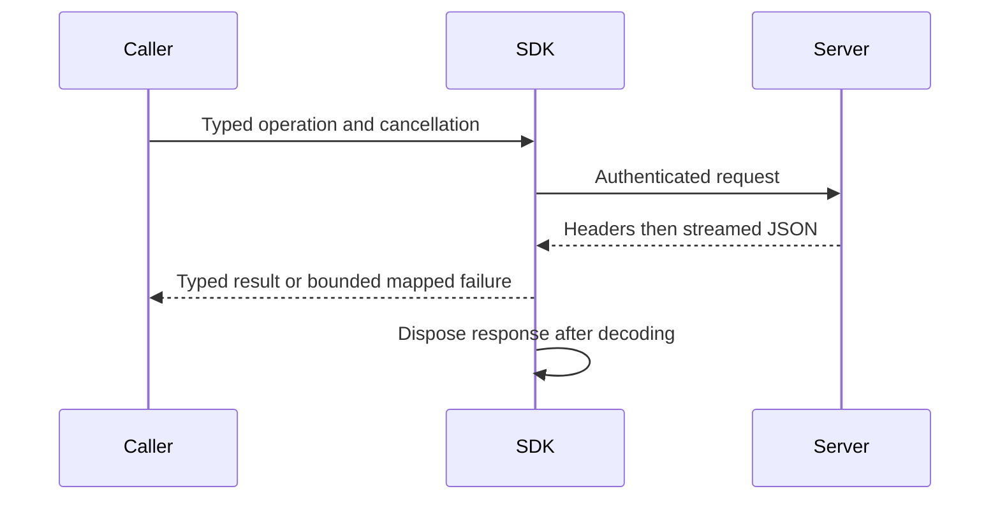

# ClientApi

Shared authenticated .NET SDK/CLI transport. [ADR-035](../ADR/ADR-035-memory-performance.md)
and [memory/performance acceptance](../../memory-performance.acceptance.md) govern
the current transport repair. The typed operation contracts and server authority
remain unchanged.
ADR-041 governs the explicit read-only CLR migration and the strict-analysis
query factory move to KeyLoadQuery.From<T>. Generated AST/JSON, cursor, authority
and transport behavior remain exact; all compiled consumers recompile together.

| Requirement | Acceptance | Automated proof |
|---|---|---|
| REQ-CLIENT-001: consume success bodies without a duplicate full HTTP response buffer | AC-MP-009 | Real Kestrel chunked/delayed typed response; RF3 SDK public calls |
| REQ-CLIENT-002: bounded error parse, cancellation and disposal preserve caller outcomes | AC-MP-009 | Real server malformed/oversized errors, mid-body cancellation, subsequent request |
| REQ-CLIENT-003: operator profiles are bounded and valid generated profiles preserve semantics | AC-MP-010 | Real temporary profile files in TUnit, oversized rejection before full allocation |

Canonical ownership: transport/helpers in src/KeyLoad.Client/Features/ClientApi;
tests in tests/KeyLoad.UnitTests/Features/ClientApi or the matching integration
slice. Existing KeyLoadClient.cs is the cross-feature transport entry point;
business operation methods retain their typed canonical contracts. CLI profile
adaptation belongs to ClientApi; shared AppHost composition is lead-owned.
Frontend/database/schema changes: N/A, transport decoding only.

CLI composition now lives in `src/KeyLoad.Cli/Hosting/KeyLoadCliApplication.cs`;
status/profile/help behavior lives in its `Features/ClientApi/CliClientApi.cs` and
original-text resource. The preserving contract and review exception are
AC-CQ-010 in [quality-gates acceptance](../../quality-gates.acceptance.md), under
ADR-033. The actual CLI build is clean; its process qualification remains pending.

TASK-MP-008 owns only the assigned SDK transport plus new matching helper/test
files. Lead owns shared docs/config and reviews the join. Real ASP.NET/Kestrel
network verification avoids fake HttpMessageHandlers or stream doubles. TUnit on
Microsoft.Testing.Platform runs only in GitHub Actions; development builds are not
test qualification. Unknown committed-write outcomes retain existing semantics;
an aborted decode never proves that the server rolled back the operation.

## Повний caller contract

Актори: application developer, operator CLI, durable worker і required MCP/agent caller. Source-present: typed [.NET SDK](../../src/KeyLoad.Client/KeyLoadClient.cs), [query builder](../../src/KeyLoad.Client/KeyLoadQuery.cs), [CLI](../../src/KeyLoad.Cli/Program.cs) та [HTTP routes](../../src/KeyLoad.Server/ApiEndpoints.cs). Public capability/operation semantics визначає owning Feature; SDK не є другим engine.

| Вимога | Measurable acceptance / flows | Test mapping |
|---|---|---|
| REQ-CLIENT-004: supported typed operations і capabilities дзеркалять canonical server contracts | AC-CLIENT-004: existing document/event/queue/group/graph/series/query/search/feed/admin calls повертають typed values/outcomes; unsupported capability/version дає явну помилку; equivalent query adapters дають однаковий result/authority | Existing `SqlJsonAndCSharpUseTheSameAuthorizedHttpQueryContract` у [ClusterTests](../../tests/KeyLoad.IntegrationTests/ClusterTests.cs), [QueryAdapterTests](../../tests/KeyLoad.UnitTests/QueryAdapterTests.cs); operation-manifest parity expansion PLANNED |
| REQ-CLIENT-005: retry/error/cancellation зберігають stable command identity та unknown outcome | AC-CLIENT-005: transient disconnect після committed write не спричиняє другу logical operation; same ID/content replay стабільний, different payload conflict; typed errors, cancellation, bounded decode/disposal зберігають caller semantics без fabricated success | Existing `ReplicatedAtomicBatchSurvivesLeaderProcessKillAndMinorityRejectsWrites` у ClusterTests; transport edge/error cases з AC-MP-009 PLANNED/GitHub pending |
| REQ-CLIENT-006: official MCP SDK adapter виконує ті самі authorized operations | AC-CLIENT-006 and AC-MCP-001–008: real official MCP C# SDK caller на Docker RF3 має operation/result/error/cancellation parity з .NET SDK; invalid/forged/revoked grants та unsupported calls fail before effects; search/storage coverage включено лише після owning capability implementation | PLANNED IntegrationTests `Features/ClientApi/` MCP parity/adversarial suite; [ADR-039](../ADR/ADR-039-official-mcp-agent-api.md) accepted stateless `/mcp`, version-one 37-operation catalog and bounded admission contract; runtime pending |
| REQ-CLIENT-007: simple agent/worker API має bounded capability та processing contract | AC-CLIENT-007: PLANNED versioned agent calls користуються тим самим persisted principal, typed operations, quotas і outcome semantics; queue worker stale lease/duplicate handler, empty input та cancellation не дають unauthorized/duplicate effects | Existing processing semantics у [MessagingTests](../../tests/KeyLoad.UnitTests/MessagingTests.cs); agent surface tests PLANNED після ADR-039 acceptance |

MCP і agent surface required; accepted contracts, exact names and wrappers are in
ADR-039 and [MCP acceptance](../../mcp-agent-api.acceptance.md). Implementation and
runtime qualification remain pending. SDK bearer/API key не містить trusted roles;
credentials/authorization — [Authorization](Authorization.md). Every operation має
окремий Orleans request grain, тоді node-local host виконує операцію;
[ADR-020](../ADR/ADR-020-independent-query-contexts.md) не дозволяє per-client
head-of-line blocking або storage ownership у session facade. Native stateless
transport does not capture a session principal. The .NET SDK's missing Backup and
SetDispatch are explicit parity work, not completed methods.

Canonical map: Client/Server `Features/ClientApi/` transport/adapters та matching IntegrationTests/UnitTests helpers; business operations/tests зберігають owning slice name. CLI — operator/worker entry point; окремий frontend N/A. Shared contracts і host composition мають одного integration owner. Freeze protocol → real parity tests → adapters → rollout/version contract → exact GitHub TUnit/recovery/Docker RF3 evidence. Existing source/test names не виконують planned MCP/agent AC; timeout не означає rollback.
