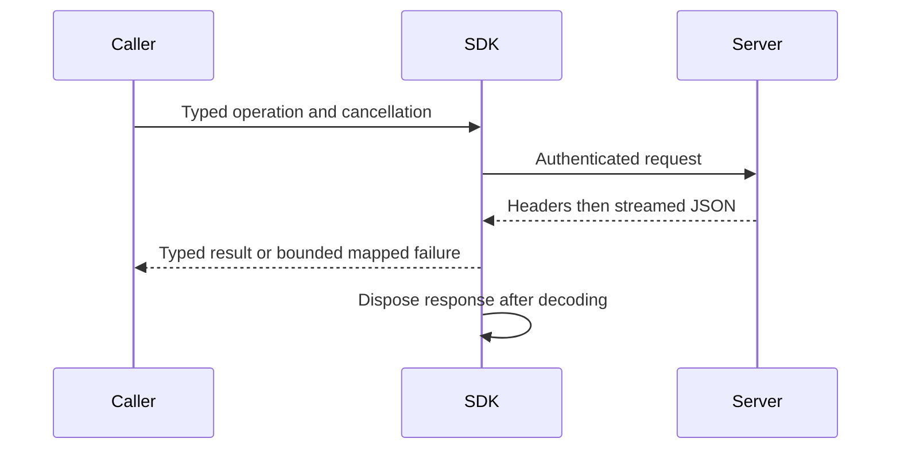

# ClientApi

TASK-MCP-Q2-SCHEMA-ORACLE implements REQ/AC-CLIENT-006 and AC-MCP-001 under
the existing [ADR-118](../ADR/ADR-118-bounded-relational-inner-join.md) request
contract. The original full normal/scalar runs at `24c0ac47` each failed
`AcMcp001SqlPathSchemaHasVersionAndTypedQueryRequest`: the actual query schema
contains six properties, while its pre-Q2 oracle expects five. Export the actual
GraphPath operation schema and require the exact six-member query property set,
the unchanged two required constructor fields, and the optional integer
`queryDialectVersion` with default 1. Preserve every outer request, partition,
result, hint and closed-object assertion. This is an oracle repair for the
already accepted versioned request, not a new SQL capability. Run the complete
ClientApi native normal/scalar suite and retain the original failure; actual
SDK/official MCP RF3 operation parity remains a separate required gate.

Owner direction2026-10-05 accepts [ToolDiscovery](ClientApi/ToolDiscovery.md)
and [ADR-104](../ADR/ADR-104-mcp-gateway-tool-discovery.md): three initial
ManagedCode.MCPGateway search/route/invoke tools replace the public default
all-operation catalog, with native MarkdownLd.Kb graph search and unchanged
fresh persisted authentication, canonical schemas and signed Orleans execution.
The complete internal operation inventory remains independently tested; public
gateway composition and real caller qualification are pending. This explicitly
supersedes the all-operation default discovery expectation below, not any required
operation, authorization, resource or RF3 acceptance.

TASK-MCP-RF3-CATALOG-INVENTORY preserves REQ/AC-CLIENT-006 and AC-MCP-001.
Luna query_wave owns the private McpCallerProtocol tool-count inventory and
discovery assertions only if the actual current canonical tool names are absent.
Derive the exact count/names from the real server operation catalog, retain
bounded paging, uniqueness, schema and annotation checks, and independently
compare the complete declared catalog. Original run37242346547 observed62 tools
against the obsolete56-count oracle. ADR-098 adds two accepted shortest-path tools,
and ADR-101 adds the two typed placement administration tools, so the independent
current independent oracle enumerates 68 canonical names and verifies their exact
request/result schemas and read-only/idempotent/non-destructive hints. The public
initial listing remains exactly three gateway tools; these are separate counts and
surfaces. Earlier 66-name planning arithmetic predates the current operation set.
Do not infer a passing discovery result from editing a count. Root reviews the exact
diff and runs the official MCP client through actual Aspire RF3; this source update
is not qualification.

REQ-SQLC-003 / AC-SQLC-003P preserves AC-MCP-002/003 in the Accepted
[ADR-065 public/native oracle stage](../ADR/ADR-065-full-sql-client-compatibility.md).
UnitTests ClientApi canonical command/read/polymorphic corpus and NEW
McpNativePayload files compare every native-decoded typed value with the original
public JSON, retain exact native bytes across source disposal and require real
same-instance array/stream parity. Native int-zero is the no-body contract.
No production/public/data/dependency changes are authorized; actual new GitHub
normal/scalar/recovery/RF3 evidence remains required. A real writer divergence
must be repaired in its owner rather than hidden by the oracle correction.

REQ-SQLC-005/007/008 and AC-SQLC-005/007/008 extend SQL clients under
[ADR-065](../ADR/ADR-065-full-sql-client-compatibility.md). Existing transport is
HTTP/JSON plus official MCP; no PostgreSQL native listener/session is implemented.
The working native target requires real Npgsql/psql/DBeaver bootstrap, typed
results, prepared/portal flows, persisted credential revalidation, original
execution drain and bounded state. The current API-key SHA256 verifier is not
SCRAM. Native security/transaction/gateway contracts must be frozen before code.
TASK-SQLC-C1 first preserves conservative unknown-write outcomes for commented
CALL/unknown roots with genuine Kestrel tests; TASK-SQLC-FULL owns native client
interoperability. [Inventory](../implementation/sql-client-conformance.json)
keeps both native and full SQL qualification false until actual evidence exists.

REQ-CLIENT-010 / AC-CLIENT-010 / AC-DIAG-001..004 add bounded internal RF3
dispatch evidence under [ADR-036](../ADR/ADR-036-orleans-foundation.md).
Closed credential/read/command phases and failure categories correlate the
existing nullable operation GUID without private values. Real middleware/provider
TUnit tests preserve public errors. Docker artifacts retain every node fairly and
distinguish actual SIGKILL action time from container StartedAt. Root owns markers,
capture and shared joins; worker owns middleware/new helper/UnitTests. GitHub
qualification is pending; native cause cannot be inferred from the generic503.

Shared authenticated .NET SDK/CLI transport. [ADR-035](../ADR/ADR-035-memory-performance.md)
and [memory/performance acceptance](../ADR/ADR-035-memory-performance.md) govern
the current transport repair. The typed operation contracts and server authority
remain unchanged.
ADR-041 governs the explicit read-only CLR migration and the strict-analysis
query factory move to KeyLoadQuery.From<T>. Generated AST/JSON, cursor, authority
and transport behavior remain exact; all compiled consumers recompile together.

| Requirement | Acceptance | Automated proof |
|---|---|---|
| REQ-CLIENT-001: consume success bodies without a duplicate full HTTP response buffer | AC-MP-009 | Real Kestrel chunked/delayed typed response; RF3 SDK public calls |
| REQ-CLIENT-002: bounded error parse, cancellation and disposal preserve caller outcomes | AC-MP-009 | Real server malformed/oversized errors, mid-body cancellation, subsequent request |
| REQ-CLIENT-003: operator profiles are bounded and valid generated profiles preserve semantics | AC-MP-010 | Real temporary profile files in TUnit, oversized rejection before full allocation |

Canonical ownership: transport/helpers in src/KeyLoad.Client/Features/ClientApi;
tests in tests/KeyLoad.UnitTests/Features/ClientApi or the matching integration
slice. Existing KeyLoadClient.cs is the cross-feature transport entry point;
business operation methods retain their typed canonical contracts. CLI profile
adaptation belongs to ClientApi; shared AppHost composition is lead-owned.
Frontend/database/schema changes: N/A, transport decoding only.

CLI composition now lives in `src/KeyLoad.Cli/Features/ClientApi/Hosting/KeyLoadCliApplication.cs`;
status/profile/help behavior lives in its `Features/ClientApi/CliClientApi.cs` and
original-text resource. The preserving contract and review exception are
AC-CQ-010 in [quality-gates acceptance](CodeQuality.md), under
ADR-033. The actual CLI build is clean; its process qualification remains pending.

TASK-MP-008 owns only the assigned SDK transport plus new matching helper/test
files. Lead owns shared docs/config and reviews the join. Real ASP.NET/Kestrel
network verification avoids fake HttpMessageHandlers or stream doubles. TUnit on
Microsoft.Testing.Platform runs only in GitHub Actions; development builds are not
test qualification. Unknown committed-write outcomes retain existing semantics;
an aborted decode never proves that the server rolled back the operation.

## Accepted real-Kestrel cancellation coordination refinement

TASK-RUNTIME-Kestrel-W preserves REQ-CLIENT-002 / AC-MP-009/012 under ADR-035.
The macOS baseline timed out before cancellation at the initial 1 MiB write/flush
barrier. Write and flush a bounded initial partial-body chunk, then withhold the
remaining response until caller cancellation. Surface named handler/write/flush
stages and unexpected handler failures under the same five-second waits. Preserve
the pending incomplete response, Cancelled error, real request-aborted signal and
successful subsequent HTTP request. Worker owns only KeyLoadClientTransportTests.cs;
no client product, timeout, policy or response-mapping change. Lead reviews the
real lifecycle and qualifies all three OSes in the complete GitHub run.

## Accepted root-name framing repair

TASK-RUNTIME-MCP-FRAME-W implements REQ-CLIENT-006 and AC-MCP-003/005/007 under
ADR-039. Run37005805424 proves lone-surrogate root property names can throw during
ValueTextEquals before safe string decoding. Classify a root id from the same
validated decoded property name used by duplicate detection. Preserve encoded
name/id byte limits, safe fixed Validation, depth/count budgets, escaped id keys,
native scalar ids and valid surrogate pairs; add no broad exception handler.
The existing four name/value surrogate cases and escaped-id bounds are failing/
boundary regressions. Worker owns only McpFrameInspection.cs; lead owns docs,
review, enabled build and exact GitHub UnitTests/RF3 join. No wire/persistence or
package migration; rollback reverts this internal property-classification change.

## Accepted malformed-problem decoding repair

REQ-CLIENT-002 / AC-MP-009 owns TASK-RUNTIME-ERROR-DECODING-W under ADR-035.
Run37005805424 reproduces a malformed problem body escaping the bounded reader
and selecting the transport-read detail instead of the server-unavailable fallback.
Only JsonException from the bounded Problem deserialization becomes a missing
problem; cancellation, I/O and success-body mapping remain intact. The existing
real-Kestrel ErrorBodiesArePreservedWhenValidAndBoundedWhenNullMalformedOrOversized
test is the failing regression. It retains exact valid details, malformed/null/
65,537-byte fallbacks, UnknownWriteOutcome and the original command header.
Lead owns the private reader and shared contract join. Release build, format,
governance and full exact-SHA GitHub suites qualify the repair. No public API,
schema or package migration is needed; rollback reverts only this private catch.

## Повний caller contract

### Accepted unknown-length MCP framing repair

REQ-CLIENT-009 / AC-CLIENT-009, AC-MCP-001/004/005/007 and AC-MP-009/012
(TASK-RUNTIME-MCP-FRAME-W3) require the unmodified official2.2.0 discovery-first
SDK to succeed under the existing default node/scope/memory limits. Its native
JsonContent has unknown HTTP length. At fa80c701, a small such body allocates the
8MiB permitted maximum, and admission carries an ingress projection already
240,947,200 bytes into the default134,217,728-byte control pool. The prior RF3
receipt lacks the exact admission exception, so this is a source-derived cause,
not a captured memory failure. Keep first discovery proof in renewed RF3 CI.

Separate permitted wire bytes from actual retained buffer capacity. For unknown
length, begin with at most the existing16KiB scratch-sized buffer and grow only
as actual bytes arrive, explicitly clamping growth to the same inclusive limit.
Known-length declarations, one excess byte, truncated bodies, UTF8/JSON/shape
errors, cancellation, replay bytes and clearing the entire retained buffer remain
exact. Ingress retains its conservative pre-read maximum reservation. After
framing, the canonical admission handoff uses the actual owned buffer capacity
and inspected shape; it cannot undercharge any retained raw owner. Do not change
projection equations, pool defaults, quotas, accepted protocol or client headers.

Server/ClientApi McpFrameBody and McpRequestState plus UnitTests/ClientApi real
frame/state regressions are the worker scope. Existing RF3 McpDiscoveryTests must
connect with default negotiation, list all tools and execute canonical calls;
scope/credential invalidation and malformed/oversized negatives remain required.
Tests first prove a small unknown-length frame's retained capacity, exact replay,
bounded growth/overrun and admission under the unchanged default control pool,
then disposal releases execution/memory ownership. Root owns review/build/format
and exact multi-OS unit plus RF3 official SDK join. Frontend, SDK API, persisted
format and dependency migration are N/A; ADR039 owns source-only rollback.

### Accepted MCP rejection diagnostics

REQ-CLIENT-008 / AC-CLIENT-008 (TASK-RUNTIME-MCP-DIAGNOSTICS-W) refines
REQ-CLIENT-006 and AC-MCP-003/005/007 after run37015193756. Every existing transport
guard rejection carries a closed private stage: revision count/value, session or
last-event presence, method/name header shape/encoding, body method shape or
mismatch, missing target, parameter/meta revision mismatch or target mismatch.
The public Validation detail and every accept/reject predicate remain exact.
Only failure paths attach enum metadata; successful calls gain no diagnostic
allocation, payload copying or changed business routing.

Logging uses only defined stage enums and Discovery/Initialize/ToolsCall/ToolsList/
Other method categories. Unknown metadata or arbitrary method strings become
closed defaults; no raw headers, arguments, URI/name, identity, bearer credential,
exception object/text or serialized body can enter the logger. Tests exercise the
actual guard and Microsoft logging EventSource provider with private canaries,
invalid enum metadata, malformed headers/body and unchanged safe errors. All
existing guard tests remain. The lead joins logging in McpHttpPipeline and owns
shared EventSource filter coordination, preserving identical native SDK handling.
Source privacy/predicate/lifetime review, enabled build and exact-SHA GitHub unit
and RF3 receipts are required. The environmental first-discovery failure requires
actual CI receipts rather than a synthetic caller or fabricated success.

Server/UnitTests Features/ClientApi is the canonical map; frontend, data migration
and SDK/API shape are N/A because this is internal failure evidence only. ADR039
governs ordered implementation and source-only rollback. No protocol downgrade,
dependency patch, broad exception fallback, trusted caller role or timeout change.

Актори: application developer, operator CLI, durable worker і required MCP/agent caller. Source-present: typed [.NET SDK](../../src/KeyLoad.Client/KeyLoadClient.cs), [query builder](../../src/KeyLoad.Client/Features/QueryExecution/Queries/KeyLoadQuery.cs), [CLI](../../src/KeyLoad.Cli/Program.cs) та [HTTP routes](../../src/KeyLoad.Server/ApiEndpoints.cs). Public capability/operation semantics визначає owning Feature; SDK не є другим engine.

| Вимога | Measurable acceptance / flows | Test mapping |
|---|---|---|
| REQ-CLIENT-004: supported typed operations і capabilities дзеркалять canonical server contracts | AC-CLIENT-004: existing document/event/queue/group/graph/series/query/search/feed/admin calls повертають typed values/outcomes; unsupported capability/version дає явну помилку; equivalent query adapters дають однаковий result/authority | Existing `SqlJsonAndCSharpUseTheSameAuthorizedHttpQueryContract` у [ClusterTests](../../tests/KeyLoad.IntegrationTests/Features/ClusterReplication/Cases/ClusterTests.cs), [QueryAdapterTests](../../tests/KeyLoad.UnitTests/QueryAdapterTests.cs); operation-manifest parity expansion PLANNED |
| REQ-CLIENT-005: retry/error/cancellation зберігають stable command identity та unknown outcome | AC-CLIENT-005: transient disconnect після committed write не спричиняє другу logical operation; same ID/content replay стабільний, different payload conflict; typed errors, cancellation, bounded decode/disposal зберігають caller semantics без fabricated success | Existing `ReplicatedAtomicBatchSurvivesLeaderProcessKillAndMinorityRejectsWrites` у ClusterTests; transport edge/error cases з AC-MP-009 PLANNED/GitHub pending |
| REQ-CLIENT-006: official MCP SDK adapter виконує ті самі authorized operations | AC-CLIENT-006 and AC-MCP-001–008: real official MCP C# SDK caller на Docker RF3 має operation/result/error/cancellation parity з .NET SDK; AC-MCP-001 independently checks all 68 accepted names, exact schemas and hints, including both GraphPath tools and `keyload_admin_partition_placement_bind` / `keyload_admin_partition_placement_read`; invalid/forged/revoked grants та unsupported calls fail before effects; search/storage coverage включено лише після owning capability implementation | Source IntegrationTests `Features/ClientApi/` MCP parity/adversarial suite; [ADR-039](../ADR/ADR-039-official-mcp-agent-api.md) owns the versioned stateless `/mcp` catalog and bounded admission contract; runtime pending |
| REQ-CLIENT-007: simple agent/worker API має bounded capability та processing contract | AC-CLIENT-007: PLANNED versioned agent calls користуються тим самим persisted principal, typed operations, quotas і outcome semantics; queue worker stale lease/duplicate handler, empty input та cancellation не дають unauthorized/duplicate effects | Existing processing semantics у [MessagingTests](../../tests/KeyLoad.UnitTests/MessagingTests.cs); agent surface tests PLANNED після ADR-039 acceptance |

MCP і agent surface required; accepted contracts, exact names and wrappers are in
ADR-039 and [MCP acceptance](ClientApi.md). Implementation and
runtime qualification remain pending. SDK bearer/API key не містить trusted roles;
credentials/authorization — [Authorization](Authorization.md). Every operation має
окремий Orleans request grain, тоді node-local host виконує операцію;
[ADR-020](../ADR/ADR-020-independent-query-contexts.md) не дозволяє per-client
head-of-line blocking або storage ownership у session facade. Native stateless
transport does not capture a session principal. The .NET SDK exposes typed BackupAsync in Features/BackupRestore and
SetDispatchAsync in Features/Messaging through the shared authenticated transport.
Their owning feature RF3 qualification remains distinct from source presence and
the required supporting Kestrel transport controls.

Canonical map: Client/Server `Features/ClientApi/` transport/adapters та matching IntegrationTests/UnitTests helpers; business operations/tests зберігають owning slice name. CLI — operator/worker entry point; окремий frontend N/A. Shared contracts і host composition мають одного integration owner. Freeze protocol → real parity tests → adapters → rollout/version contract → exact GitHub TUnit/recovery/Docker RF3 evidence. Existing source/test names не виконують planned MCP/agent AC; timeout не означає rollback.

TASK-MCP-NATIVE-SCHEMA-EVIDENCE retains the original official-client schemas
needed to diagnose AC-MCP-001 / REQ/AC-CLIENT-006. The existing discovery,
incoming-graph and partition-query RF3 cases capture only their exact shortest-path,
incoming-graph and partition-query `Tool.InputSchema` objects before assertions.
The original current-source R154/R155 output assertions also require the exact
shortest-path and partition-query `Tool.OutputSchema` objects. Capture these two
outputs in the same existing helper and call sites before assertions, with a
fixed output filename marker and the exact official SDK output capture source.
Keep every strict type/nullability/required-member/item/hint assertion unchanged.
Each UTF-8 schema is at most 64 KiB; its sidecar is at most 1 KiB and contains
only canonical tool name, official SDK capture source, actual Aspire RF3/node1
context, owned filename, byte count and SHA-256. The three inputs and two outputs
total at most 320 KiB per capture set; each object and sidecar retains the existing
independent bound. A missing output fails capture. Unknown tool names, non-object
schemas, excess bounds and failed
writes fail; no credentials, caller data or private inventory is recorded.

ADR-039 freezes the test-only helper
`tests/KeyLoad.IntegrationTests/Features/ClientApi/Helpers/NativeMcpSchemaEvidence.cs`
and the three existing case call sites. Use the existing repository-root helper
and uploaded `artifacts/qualification/mcp-schema-evidence/` ownership. Root owns
contract, review, native RF3 evidence and delivery; a Luna worker prepares the
guarded helper/calls. Schema capture alone is diagnostic evidence, not a passing
operation or an authorization to relax assertions or alter production schemas.

TASK-MCP-NATIVE-SCHEMA-ORACLE repairs the three test observations established by
the original876c official-client captures in run37546085722. It retains
REQ/AC-CLIENT-006, AC-MCP-001 and REQ-GRAPH-010 / AC-GRAPH-009. JsonDefaults.Web
accepts quoted integers and the native schema projection copies those options;
integer schemas therefore have the exact string/integer type set. Nullable
Labels has the exact array/null set with string items. PartitionRef's optional
computed AtomicPartitionId is getter-only: its captured string/null input
projection cannot supply authority or replace the four required constructor
identity fields. Their required set and the computed output value remain fixed.

Root owns the contract and joins. ci_failure_evidence Luna owns only
GraphIncomingMcpSchemaAssertions, PartitionQueryMcpSchemaAssertions,
McpGraphPathInputSchemaAssertions and McpGraphPathSchemaAssertions in their
current IntegrationTests slices.
Compare exact allowed sets, rejecting duplicates and extra types; distinguish
the optional computed metadata field from required identity strings. Preserve
all property/required-member/item/effect-hint/catalog checks and native official
client flows. Native output uses the same unchanged exporter options; review its
current source shape and retain output execution as unqualified until the actual
RF3 flow passes. For the parameters dictionary, omitted
additionalProperties is open under Draft2020-12; explicit false remains rejected.
An explicit value must be a boolean or object schema. The original259/884
output-version stack proves array-versus-scalar disagreement; retain the frozen
exact string/integer output set, with no duplicate, extra or null type. Labels
input remains unchanged. No production schema, decoder, public contract, dependency or
trust change is authorized by this test repair. Root builds, reviews, executes
the real Aspire RF3 SDK flows and retains exact-source Linux original reports.
Rollback removes only the oracle corrections, preserving captured failure
evidence and every mandatory suite. UI/storage changes are N/A.

The current-source R158/R159 official SDK output captures establish the remaining
exact output sets: QueryRow.RedactedFields is array/null with string items;
PartitionRef.AtomicPartitionId is string/null, while its four required identity
strings remain scalar strings; GraphPath.Hops is exactly string/integer/null.
Use those exact sets in the same existing output assertions, rejecting duplicates,
extra types and malformed entries. Keep every field, required-member, item,
reference-depth, catalog and effect-hint assertion. The captured output hashes
are respectively `248fd97e9a3105df3d6376640b9eb82350fffa8fd829de5e55e04bec85970eb2`
and `39c7b94a0a86777a5fb007407da7aa576d4b54f3164f5dce6bf05caf76075cf9`.
Captured failed flows remain failed; actual passing SDK/RF3 and delivered Linux
qualification are required after these precise oracle corrections.
R162 subsequently reached the placement tools and failed their common
PartitionRef property-set oracle. McpSchemaFactory exports their same canonical
PartitionRef through the same native projection and input/output transforms as
the captured graph/query tools. McpPartitionPlacementSchemaAssertions must also
require the exact five properties, keep only the four constructor identities
required, and check computed AtomicPartitionId's exact string/null set. Keep
integer string/integer sets exact and scalar string/boolean fields strict. This
source-bound inference still requires the actual full discovery flow to pass;
no placement operation, schema exporter or authority rule changes.

TASK-MCP-NATIVE-FAILURE-CODE supports REQ/AC-CLIENT-006 and AC-MCP-003/005/007
after the original876c saga-timeout RF3 invocation returned IsError without its
safe classification in the failed assertion. Root freezes and joins; a Luna
worker owns only IntegrationTests/Features/ClientApi/Assertions/McpCallerAssertions.cs.
The existing SuccessAsync assertion may read only the actual StructuredContent
errorCode, reuse its closed canonical enum validation and append that code with
the mapped HTTP status. Malformed/unknown envelopes produce fixed Unclassified
text. Keep the reason below128 UTF-8 bytes; never print detail, result, request ID,
tool arguments or credentials. No parallel Problem decoder, changed signatures,
guessed expected code or relaxed success/error assertions. The original test
identity/call-site supplies operation context; CallToolResult contains no tool
name. Root builds and retains actual official-client Aspire RF3/Linux outcomes;
this observation cannot qualify the saga or repair its unknown initiating cause.
Production/format/dependency changes are N/A. Rollback removes only this reason.

TASK-CLIENT-ADMIN-SDK-PARITY freezes the two missing public SDK extensions before
source integration under REQ/AC-CLIENT-004/005/006. Existing signatures and default
transport method inference remain unchanged. `BackupAsync(CancellationToken)`
sends one authenticated bodyless `POST /v1/admin/backup` through the current
transport, returns the canonical `BackupReceipt`, and classifies interrupted
writes as `UnknownWriteOutcome`. It has no command ID or automatic retry: a
further explicit call may create another archive. `SetDispatchAsync(Guid
commandId, bool paused, CancellationToken)` requires a nonempty caller-owned ID,
sends bodyless `POST /v1/admin/dispatch?paused=true|false` with that exact
`X-KeyLoad-Command-Id`, and returns the canonical boolean. The server's persisted
administrator authorization, signed operation, separate request grain, replay
and conflicting-payload semantics are unchanged; no caller role is accepted.

Ownership is `Client/Features/BackupRestore/Transport/BackupClient.cs` and
`Client/Features/Messaging/Transport/DispatchClient.cs`, joined to the existing
ClientApi route constants and internal `KeyLoadClient.Send`/`KeyLoadClientTransport`
method override. Existing callers omit the optional override and retain their
GET-for-null/POST-for-body selection. Business regressions belong to IntegrationTests
BackupRestore `AdminBackupClientParityTests`/`AdminBackupArchiveVerifier` and
Messaging `AdminDispatchClientParityTests`. Frontend is N/A because these are
SDK adapters for existing administrator operations; contracts and server routes
already exist. ADR-039 owns integration and rollback.

The actual Aspire RF3 backup flow commits a canonical seed through SDK, invokes
one SDK backup and one discovered official-MCP backup, and requires valid distinct
receipts. For each archive, complete bounded dashboard inventories must identify
exactly one physical voter and manifest; resolve only beneath the fixture-owned
bind mounts, compare retained file lengths with observed bytes, verify the native
backup cut includes the seed, restore into a unique owned directory and reopen
exact reference/JSON/revision/non-tombstone state. Require a new incarnation,
paused dispatch and an unchanged verified source archive. Join native disposal
and exact-root deletion while preserving primary and cleanup failures.

The dispatch flow establishes an administrator-unpaused baseline inside its
cleanup scope, persists a DocumentsRead-only member and requires its pause to
fail with PermissionDenied. Immediately commit a healthy administrator write
without any intervening dispatch mutation, proving denial had no effect. Then
exercise same-ID/same-boolean replay through both clients, changed-payload
Conflict, paused queue-receive rejection with unchanged message state/counters,
and cross-client resume/pause followed by exact delivery/ack and healthy document
commits/public reads. Global dispatch pause controls delivery; ordinary document
writes and enqueue remain admitted under their existing contracts. The R219
original RF3 attempt exposed the incorrect document-write pause oracle; refine
this test before changing its source, preserving the production pause contract.
Backup voter identities are canonical internal origins, not host directory
names. Resolve the matching Aspire container resource and its actual `/data`
bind mount within the fixture-owned root; require exact membership, origin and
mount identity before comparing archive bytes. The R219 original physical-path
failure remains retained. Bounded observed cleanup
restores dispatch. Root reviews guards, builds/formats, executes the real SDK and
official-MCP fixture, retains original evidence, and commits/pushes the stage.
The original R221 attempt reached exact restored document/reference/revision
verification, then exposed an invalid record-equality oracle: `StoreIdentity`
contains independently decoded `ReadOnlyMemory<byte>` signing-key storage.
Before refining the test, freeze value equality through the unchanged native
generated serialization, compared as a boolean without exposing either payload.
Capture the source `backup.json` SHA-256 before restore and require the same
digest after restore; the complete native verifier must again validate every
manifest file and the original position. This retains the unchanged-archive
requirement without changing identity equality, serialization or restore behavior.
`BackupRestore/Helpers/AdminBackupArchiveIntegrity` owns the bounded manifest
digest; the existing verifier owns the full native identity/file checks.
Hash the fixture-owned manifest through a streaming file reader, with cancellation
and joined disposal; never emit identity payloads, signing keys or archive data.
Source integration and the local owning RF3 flows now pass: R221 dispatch1/1
and R223 backup1/1 use the same source-verified native server image, real SDK and
official MCP clients and joined fixture cleanup. R222 full Release has zero
warnings/errors and zero source drift. Original R219/R221 failed observations
remain retained; exact-source Linux and broader runtime qualification are open.
This stage covers only
the observable archive outcome portion of AC-BACKUP-001; streaming/memory,
cluster-cut/reconciliation, cancellation/revocation parity and all remaining
ClientApi/BackupRestore acceptance stay mandatory and open.

TASK-MCP-SQL-SCHEMA-SIX-001 corrects the independent official SDK discovery oracle under AC-MCP-001 and ADR-118 Q1/Q2 schema additions. Original Linux run37612238705 attempt1 / SHA24c0ac47 actual AcMcp001OfficialClientDiscoversMetaToolsAndSearchesCanonicalSchemasAndHints fails the closed SQL query five-field assertion. The canonical current SqlOperationRequest query schema has exactly partition, sql, parameters, allowFullScan, cursor and queryDialectVersion; only partition and sql are required, additionalProperties remains false, queryDialectVersion uses the existing integer schema contract and has exact default1. Freeze these six literal properties and default before correcting Integration ClientApi Assertions/McpGraphPathInputSchemaAssertions.cs and Contracts/McpDiscoveryProtocol.cs. Preserve every existing direct-path/entity/partition/nullability/result/effect/discovery assertion and real official MCP call. No schema relaxation or production contract change; original failure is retained. Root executes fresh original native discovery flow and unchanged qualification gates; this source-only correction makes no runtime claim.

### TASK-MEMBERSHIP-MCP-CLOSED-INIT-ORACLE: exact earliest official admission denial

Freeze before test correction under REQ/AC-MEMBERSHIP-003/008 and existing ADR-106 Stage1A: actual R347 six-silo run failed1/1 at49.656s after the native authority routes admitted Group B. The real official SDK2.2.0 session creation failed in SendDiscoverAsync, before a tool invocation, with HTTP503 and exactly OwnershipLost / “The physical shard catalog is not ready for public admission.”. Preserve the original failed log/TRX/source-image witness; it is not a passing membership gate.

DatabaseIdentityMiddleware routes every /mcp request through McpHttpPipeline, which resolves persisted credentials through DatabaseCredentialResolver.ReadAsync and OrleansNode.ExecuteCoreAsync before native SDK framing/session processing. Stage1A DatabaseReady=false throws the catalog admission error before Grains lookup and request dispatch. Thus a successful official SDK connection is an invalid Stage1A test precondition. The real official discovery/initialization request must be rejected at that earliest boundary. Do not bypass authentication/initialization to manufacture read/write CallToolResult values. Actual SDK read and command denials remain mandatory at both groups; actual official tool read/write interoperability stays independently mandatory in data-ready RF3 and future Stage1B, and is not claimed from failed session creation.

The owning ClusterRouting readiness assertion must use real McpOfficialClient.ConnectAsync and require the exact native HttpRequestException503, a bounded original native response-body message, precisely five problem fields type/title/status/detail/errorCode with the literal catalog-not-ready values, and no bearer credential disclosure. Any other503, generic server fault, wrong body/extra field, successful connection, timeout, cancellation or cleanup error fails. Unexpected successful native owners are disposed; existing connection failure cleanup preserves primary and cleanup errors. No alternate transport, fake provider/handler, retry, timing change, production seam or successful-session branch is admitted.

The original SDK QueryCapabilities/Commit calls remain and now compare every typed safe problem field. This earliest source-bound pre-grain rejection implies no user data/catalog/outcome effect; this test does not claim a complete persisted-store snapshot from Initialize. Following both group denials, repeat genuine all-six silo/membership/data/authority health and independent signed native fingerprint checks to prove system-control operations remain healthy while data stays closed. All existing image/profile/two-three-voter/membership/privacy/cleanup and Stage1B boundaries remain. Root owns guarded join, full build and actual native six-silo operation proof plus mandatory Linux/recovery/standardRF3 gates. No runtime PASS, movement acceptance or production qualification follows from authored source.

## TASK-KL087-MULTI-LANE-RECEIVE-001

REQ-MSG-007 / AC-MSG-007 and ADR-026 freeze the new bounded ordered queue receive composition in [Messaging](Messaging.md#task-kl087-multi-lane-receive-001). SQL envelope v1 CALL `keyload_messages_receive_across_lanes(@args)` at queryDialectVersion1 decodes that same native command; it does not extend SELECT dialect2 or full SQL/protocol conformance. Official MCP discovery uses the bounded gateway and explicit typed schema; the initial tool set is unchanged. No runtime or Linux qualification is claimed.

## TASK-CLIENT-FIRST-CHUNK-ADMISSION-DIAGNOSTIC (2026-10-07)

REQ-CLIENT-002 / AC-MP-009 retains the real Kestrel mid-body cancellation and healthy subsequent SDK request under ADR-035. Original Linux run 37655841124 failed before handler admission within its unchanged five-second first-chunk deadline. Awaiting server startup is already present; this outcome does not establish a startup or scheduler defect. The test must observe original pending SDK completion alongside original first-chunk and handler-failure signals, reject premature completion, and retain joined cancellation/server cleanup. Diagnostic output contains only bounded phase, success flag and error code; no credentials or response payload. No retry, warmup, deadline increase or product change is authorized by this diagnostic amendment. Fresh native reproduction and original failures remain required evidence.

## TASK-KL026-BOUNDED-ROLLUP-001 public boundary

REQ-SERIES-024 / AC-SERIES-024 in [TimeSeries](TimeSeries.md) and [ADR120](../ADR/ADR-120-bounded-persisted-series-rollups.md) add only canonical typed `ReadSampleRollupRequest -> SampleRollupResult` at `/v1/series/rollups/read`, SDK ReadSampleRollupAsync and underlying on-demand `keyload_series_read_rollup` schema/read-only hints. Initial discovery catalog remains bounded under ADR114; grants are checked fresh by the owning request/read cut. RefreshSampleRollup / DropSampleRollup use the existing authorized CommitAsync / keyload_documents_commit Batch mutation schema, native request grain and RF3 acknowledgement path. Authored SampleRollupRf3Tests uses persisted credentials and literal SDK/official-MCP/shared-SQL parity; no native qualification or complete KL026 claim follows from source.

## TASK-KL098-TOPIC-RETENTION-001 contract join

[REQ/AC-EVENT-RETENTION-001–003](EventStreams.md) and [ADR-030](../ADR/ADR-030-retention-paused-restore.md) govern PurgeTopic through existing Batch. SDK CommitAsync, official MCP keyload_documents_commit and SQL CALL keyload_documents_commit use the same typed mutation decoder and fresh authorized request grain; no operation catalog/route/SQL dialect expansion. Canonical mutation schema now includes the explicitly frozen purgeTopic discriminator (28 total after the rollup and purge join) with topic, throughPosition and generation. Current raw backup/snapshot includes bounded native identity tombstones inside existing topic-event-id family without a format migration. Read-cut/restore authority, receipts, paused groups and other models remain unchanged. Existing AcMcp001EveryCanonicalMutationIsRepresentedAndRoundTripsThroughTypedDecoder plus real TopicRetentionRf3Tests and native TopicRetentionOperationTests bind this join; build/runtime/exact-SHA Linux recovery/RF3 qualification remains pending.

### TASK-DIAG-NATIVE-EVENTSOURCE-004 (authored)

REQ/AC-DIAG-001/002 retain exact generic503, closed failure category/phase, UTC timestamp and exclusion of exception CLR identity, message, credential and user data. The genuine EventSource test factory explicitly admits Error for only KeyLoad.Server.ServerErrorMiddleware on EventSourceLoggerProvider. Native listener enable/update/dispose must not revoke that owning factory admission. The regression reconfigures and disposes a second actual native logging EventListener, invokes the real middleware once, and requires original safe response and formatted diagnostic; no provider substitute, retry, wait or production hook. Fatal, domain and canceled flows preserve original outcomes and no unexpected diagnostics.

Microsoft's .NET10 LoggingEventSource OnEventCommand replaces singleton FilterSpecs on Enable/Update and sets provider None on Disable; see https://github.com/dotnet/runtime/blob/v10.0.0/src/libraries/Microsoft.Extensions.Logging.EventSource/src/LoggingEventSource.cs. This proves a native filter ownership hazard, not the identity of an interfering listener in the retained original Linux empty-output failure. Root must execute full normal/scalar and the actual diagnostic operation after join. ADR-033 coordinates native coverage proof; existing diagnostic production architecture is unchanged.

The native capture admits only FormattedMessage whose actual official LoggerName payload equals KeyLoad.Server.ServerErrorMiddleware (native payload position2). An actual foreign-category warning must reach its own native listener and remain absent from this capture, before the secondary listener is disposed. The subsequent real middleware failure retains exact safe503/category/phase/time and exclusion of both private canaries, followed by a successful200 request with unchanged captured failure text.

## TASK-MCP-CATALOG-KL087-ORACLE-001 — complete official operation discovery

REQ-CLIENT-006 / AC-MCP-001 and ADR-039/114 require the independent official
SDK schema/effect inventory to include the existing canonical
`keyload_messages_receive_across_lanes` operation. Original Linux RF3
run37666943488 at4e18 completed183 with173passed/10failed; the discovery case
successfully verified every one of its68 listed tools then failed expected69.
The test oracle omitted KL087 while the canonical native server command catalog
already exposed it. Current rollup adds one operation, so retain expected70;
add the missing independent operation rather than reducing that bound. Require
outer request only, body requestId/requests, and exact readOnly=false,
idempotent=false, destructive=true hints. The outer ID supplies correlation,
not a shared receipt or idempotent group transaction; original stable per-lane
IDs and partial outcomes remain authoritative. The initial three gateway meta
tools remain unchanged. Real official on-demand discovery, canonical schemas
and actual MultiLaneReceiveRf3Tests operations remain required; this source
repair alone is not runtime qualification or original-task closure.

TASK-MCP-R457-ROLLUP-READ-CORPUS / REQ-MCP-003 / AC-MCP-003: original complete normal and scalar R457/R458 each executed2946 cases and failed only the stale body-read corpus count28. The canonical independently authored corpus adds ReadSampleRollupRequest, making29 body-bearing reads; four no-body read contracts and28 mutation contracts remain unchanged. Update only this literal body-read expectation, preserving every canonical DTO native roundtrip, absent/null/unknown/wrong-case rejection and private-value exclusion. These are required ordinary protocol controls and do not contribute product functional coverage. Existing ClientApi ADRs cover this contract; no product schema, dispatch, bounds or authorization changes. Fresh native compilation, focused normal/scalar decoder execution and complete current suites remain required; preserve both original failures.

### TASK-KL014-COLD-BOOTSTRAP-SDK-001

REQ/AC-CLIENT-004/005, original architecture KL014 and ADR039/117: one fresh owning ClusterFixture captures actual selected storage root and native path existence immediately before creating the AppHost builder, then starts actual Aspire-owned RF3 current image resources, waits existing readiness, uses its discovered endpoint and private local profile in the actual built CLI status child. Reuse original process reader/exit settlement policy from AppHost; no CLI build/restore, secret argument, manual Docker or deadline expansion. Persist non-admin scoped credentials through actual SDK admin calls, configure collection, create/read full literal document, compare complete native receipt bytes for same command replay, require changed-content Conflict and unchanged full document plus original replay bytes, then healthy new-ID revision2. Await original fixture shutdown and assert only its owned root removed; primary and cleanup failures remain aggregated.

This is cold data/bootstrap proof on native RF3, not proof of an unprovisioned clean operating-system machine or a single server without external services. The original clean-machine criterion additionally requires authenticated Linux runner tool/image prerequisites and actual execution evidence; topology remains mandated RF3. Existing SdkSubmitReturnedCancellationReusesCommittedReceipt remains separate mandatory UnknownWriteOutcome recovery proof, including its retained original failure. No task closure or PASS is claimed from authored source.

The fixed internal ClusterFixtureColdStartObservation records only selected Root plus actual directory/file existence after coverage root selection and argument construction, before native builder/startup. No callback, fault control or caller-selected root. The whole operation requires that observation absent and exact same actual root after startup. Existing covered RF3 profile remains exactly eleven selected cases; this new bootstrap case is normal RF3 qualification, not currently eligible for covered selection. Register its actual case through the existing ledger: normal mode is no-op; unexpected covered selection remains rejected, with no whitelist change or coverage suppression. Constructor random root does not establish selected-root identity.

## TASK-KL021-DOCUMENT-SESSION-READ-001

Accepted homogeneous first-release document session-read implementation contract; runtime qualification remains open.

REQ-SESSIONREAD-001 / AC-SESSIONREAD-001: Only document GET gains optional typed GetDocumentRequest.MinimumToken at generated native Id1, keeping Reference Id0 and alias. SDK explicit GetAsync(EntityRef, CommitToken, CancellationToken), HTTP/official MCP keyload_documents_get and Q1 CALL keyload_documents_get(@arguments) decode the exact same typed request via existing canonical catalog; absent option remains ordinary strong GET. This is not generic model/session cache support and does not add a dispatcher.

REQ-SESSIONREAD-002 / AC-SESSIONREAD-002: The existing unique request/read grain obtains fresh native quorum barrier under original bounded ReplicaReadRoundExecutor timeout, including existing actual WaitForApplyAsync(barrier.Position). Afterwards document execution reloads persisted principal/grants and validates minimum token in the exact same native Store.Read cut as row/field authorization and document projection. Token must match database incarnation, exact atomic partition and current persisted ownership epoch; position must be positive and no greater than actual lastApplied at that cut. This barrier applies the current quorum commit cut, hence it already meets every previously acknowledged minimum token. A token beyond that fresh applied cut is explicitly rejected; there is no speculative wait for a caller-invented future position. No physical-lineage translation, stale-mode API or authority cache is added.

REQ-SESSIONREAD-003 / AC-SESSIONREAD-003: Explicit existing TokenInvalidated category with distinct fixed safe reasons WrongIncarnation / OutOfScope / FuturePosition / InvalidPosition identifies token failures without exposing token values/credentials/records. Missing/corrupt applied authority is Corruption; unsupported ownership epoch is OwnershipLost or token invalidation per current placement witness policy. Persisted authorization is checked before token failure reasons; denial contains no row. Caller cancellation checked before admission and inside final cut, no partial result; native deadline/admission/drain unchanged. Former leader with no quorum cannot pass existing fresh barrier even for a valid historical token.

REQ-SESSIONREAD-004 / AC-SESSIONREAD-004: Real ZoneTree local whole flows prove literal document/complete state+position unchanged after invalid incarnation/scope/future/position and pre-cancel, fresh authorized minimum succeeds and later revision continues. Real fixture-owned Aspire RF3 SDK+official MCP failover operation proves acknowledged write token→elected leader kill→token-bearing complete literal healthy read→all invalid variants fail→healthy token read; isolated former surviving leader/minority strong token read fails, both voter restoration and healthy read follow. Existing native receipt replay/Unknown scenarios remain separate and unchanged. Auth revocation must deny valid token then renewed persisted grant/healthy read.

Ownership: Abstractions DocumentStorage DTO; Client overload; Core feature-local same-view validator and Documents reader; Orleans existing GrainCoreReadCapabilities routing; docs ClientApi/DocumentStorage/ClusterReplication + ADR017/036 amendment; unit DocumentStorage and RF3 ClusterReplication wholeflow. SQL Q1 CALL is exact typed operation envelope only; Q1 SELECT/AST and other read models do not accept session options in this stage. Same homogeneous current first-release cohort; native Id append/alias remains stable, no legacy reader/migration/runtime fallback. Root owns join/build/native discovery/test/Linux evidence and status; no qualification or closure inferred from authored source.

## Proven epoch meaning before implementation

DatabaseEngine.Token in Core/DatabaseEngine.cs obtains OwnershipEpoch from persisted ReadPlacementWitness.PlacementEpoch. AtomicPartitionPlacementReader Fallback/Explicit uses PhysicalShardCatalog.DefaultShard.PlacementEpoch; PhysicalShardCatalogRecordSerialization.InitialRecord initializes that physical-placement value. ReplicaElection.RunRound changes DurableReplicaLog term/vote, not physical catalog. Original authenticated 4e18 RF3 passed LeaderLossQueueScenario compares the entire pre-kill commit token to the actual replay token after elected leader kill. Hence elected leader failover keeps physical PlacementEpoch, and equality does not invalidate that acknowledged token. The new public wholeflow additionally checks a fresh postfailover command retains the same physical epoch/incarnation/atomic identity. Physical ownership movement with a changed placement epoch is explicitly unsupported by this minimal surface; it fails closed without invented lineage, and does not claim KL035/036/072 movement support.

The current native fixture supports Kill/Restart and retains actual owner receipts.
The authored authority-denial flow is a still-live surviving voter without quorum,
not a network-isolated former leader while another majority stays live. That
stronger KL021 authority scenario remains open until a bounded fixture-owned
network partition contract exists; no manual Docker or new fault hook is added.
Fresh barrier implementations are ReplicaReadRoundExecutor + ReplicaLeader.BarrierAsync:
both use native Materializer.WaitForApplyAsync at their authenticated quorum cut.
SDK method ownership is Features/DocumentStorage/Transport/DocumentSessionClient.cs.

### Native MCP no-quorum boundary refinement

McpHttpPipeline.RunAsync invokes DatabaseCredentialResolver.ReadAsync before
native tool dispatch. Its fresh signed Authenticate read itself needs quorum.
Therefore the no-quorum official caller must retain the actual native
HttpRequestException HTTP503 rather than invent a CallToolResult error; SDK
GET still asserts its actual typed OwnershipLost problem. The healthy
restored token-bearing SDK/MCP/SQL results remain complete literal checks.
This is not a tool outcome or session initialization success claim.

The final no-quorum oracle retains both SDK's exact OwnershipLost/503/NoLeader
problem and the official caller's actual native HTTP503 original exception,
with its bounded five-field Problem body and credential/document privacy checks.
It never converts that pre-tool HTTP failure into a fictitious tool result.

## Native cancellation first-write admission, 2026-10-08

REQ-CLIENT-002 / AC-MP-009 retains the real Kestrel incomplete-response cancellation and successful subsequent SDK request. Original Linux run 37694136259 at source 30fb49fb failed only the scalar MidBodyCancellationMapsReadFailureAndClientCanSendNextRequest case while its original handler phase was WritingFirstChunk; the full normal 2961-case and recovery 256-case suites passed. This is a failure, not qualified cancellation proof.

The first cancellation-flow chunk is explicitly 1024 bytes, independent of the unchanged 64 KiB large-response throughput chunk and the unchanged 1 MiB incomplete payload. This keeps the first-write synchronization below the ordinary response buffering boundary; the test still requires a completed actual server write/flush, a pending SDK read, original Cancelled classification, real request-abort observation, joined handlers and a literal healthy next response. Keep every five-second wait, total payload, native HTTP transport and product policy unchanged. Native local and Linux execution must verify this source; original failures remain retained. ADR-035 supplies the existing transport and ownership contract.

# KL034 selected native FTS prefix wait — proposed bounded implementation contract

Original KL034 is Search freshness contract (architecture-v0.3.uk.md), not ANN availability. TASK-KL034-NATIVE-FTS-WAIT-001 maps REQ-SEARCH-004/005 and new REQ-SEARCH-WAIT-001/002/003 to AC-SEARCH-WAIT-001/002/003, ADR-009 and ClientApi shared-operation ownership. This packet is source implementation only; native execution, RF3 and original task closure remain pending.

1. A generated, aliased WaitForIndexRequest contains Partition, Collection, TextField and MinimumToken (existing CommitToken). A generated result contains the actual current applied CommitToken and the authorized resource SchemaVersion and principal PolicyEpoch. It does not expose principal identity, physical node ID, local file paths, document counts, hidden rows, posting counts or an invented persisted index watermark.
2. The standalone read enters the existing unique request actor/CQRS read dispatcher and fresh quorum/applied barrier. In its single canonical read cut, fresh persisted Query|DocumentsRead and field-use authorization precede token/provider diagnostics. Validate exact incarnation, atomic partition and physical placement epoch plus positive minimum position against actual persisted AppliedBytes. Missing/invalid AppliedBytes is Corruption; future or wrong-scope token is TokenInvalidated. Local ZoneTree Store.Position is used only by the existing native TextProjectionScope, never as replicated prefix authority. The returned applied token is constructed from the same placement witness and AppliedBytes.
3. Selected native FTS is mandatory for this operation. Without the selected provider, return UnsupportedCapability; ANN remains gated. Acquire the actual current-generation native projection lease. Visit all visible canonical documents using existing budgeted visitor and canonical field tokenizer, BeginRecord/ObserveToken each actual record/token, then complete existing native VerifyCandidates with empty terms/candidates to verify complete corpus visitation and publish a newly built generation. Empty verification requests do not rank a fabricated query. Existing generation mismatch/corruption errors and native generation quotas remain unchanged.
4. The operation returns only after successful publication/verification and joined native lease settlement. A pinned lease protects its generation under existing owner lifecycle. The original shared ReadExecutionBudget bounds admission, raw scan, token work, physical native projection, timeout, cancellation and result bytes; no polling, retry, custom timeout or admin privilege. Failure/cancellation returns no partial result. Canonical data, receipts and replication position are unchanged. Projection state is disposable and may be retired/rebuilt under existing failure rules.
5. SDK, HTTP, official MCP discovery/schema/effect hints and Q1 existing CALL invoke this one typed operation. A new discovery-only tool does not widen initial operation exposure or local-image qualification whitelist. No SELECT grammar or window syntax is introduced. Default search behavior and ranking remain unchanged.
6. Actual native tests must prove acknowledged prefix success, wrong scope/future token, fresh field denial, elapsed deadline and cancellation after observed real work, full canonical image/cut invariance and subsequent healthy literal text ranks. Actual SDK/official MCP/Q1 CALL must use an acknowledged token, compare full typed wait results on an owning node/cut where comparable and then independent literal search results. Node cuts must not be assumed equal across nodes. Required after-join Linux normal/scalar/RF3 qualification is explicit and unexecuted.

REQ-SEARCH-WAIT-001 / AC-SEARCH-WAIT-001 → NativeTextWaitForIndexTests.RejectedMinimumPrefixRetainsCompleteStoreThenNativePublicationReturnsLiteralHealthy (future/wrong-incarnation two native cases); same-cut applied token authority and complete healthy literal Ukrainian/English output. REQ-SEARCH-WAIT-002 / AC-SEARCH-WAIT-002 → NativeTextWaitObservedWorkTests.ActualNativePublicationWorkCancellationOrDeadlineSettlesWithoutPartialThenLiteralHealthy (original cancellation/deadline two cases); real native range-work, exact safe errors/no partial, full canonical bytes/cut and complete healthy output. REQ-SEARCH-WAIT-003 / AC-SEARCH-WAIT-003 → NativeTextWaitRf3Tests.AcknowledgedNativeTextPrefixSdkOfficialMcpAndQ1CallRejectDeniedThenPublishHealthyAndExcludeDeleted; actual persisted ordinary identity, protected field denial, SDK/official MCP and both existing Q1 CALL routes, complete result parity and literal deleted-document exclusion. Existing native catalog/decode cases verify shared generated schemas and71 operations/30 body read DTOs as supporting controls, not product operation evidence. All execution evidence is pending root native runs.

## TASK-KL031-NATIVE-ADMIN-MAINTENANCE-001 (private first-release contract)

REQ-ANN-MAINT-001 / AC-ANN-MAINT-001: one native admin maintenance parent is dispatched through the distinct RequestGrain special-parent boundary; every configure/read/exact-through/checkpoint/release child uses fresh signed native CQRS identity and the existing canonical operation. The parent is absent from CoreAtomic payload mappings and standalone Core submit rejects it without effects. Persisted ClusterAdministrator is reloaded after each quorum barrier, before any seed or owner access. SDK and official MCP invoke the same bounded generated operation schema via authorized on-demand discovery; ordinary VectorSearch remains unchanged and public ANN remains disabled until AC-ANN-008.

REQ-ANN-MAINT-002 / AC-ANN-MAINT-002: the typed request freezes command, canonical scope, vector space, consumer generation and physical NodeId/incarnation/placement. Only bounded generation/cut/digest/status and genuine canonical child receipts leave the physical owner. Existing native CQRS started/progress/terminal/error/cancellation/maximum-buffer limits apply; typed closed maintenance stages carry no payload or credentials. A wrong physical owner fails OwnershipLost, stale generation/incarnation fails TokenInvalidated, missing/corrupt canonical authority fails Corruption, denied admin fails PermissionDenied, budget/deadline exhaustion returns original BudgetExceeded without partial success.

REQ-ANN-MAINT-003 / AC-ANN-MAINT-003: restart/replay never uses a disposable manifest as durable outcome authority. An active nonempty checkpoint is reauthorized against its genuine canonical ProjectionReceipt; release invalidates prior generation outcomes and empty checkpoints do not gain fabricated expired-token receipts. Cancellation after a canonical child may commit remains UnknownWriteOutcome and original diagnostic; fresh signed read/checkpoint reconciliation is required. Owning maintenance work is joined before node-local owner shutdown; primary and cleanup failures are retained. Native Unit/process and real SDK/official MCP RF3 positive/revoked/wrong-owner/cancel/restart/healthy flows remain required, source-authored is not PASS.

Canonical details and file/lifetime/pin stages: [Managed ANN](Search/ManagedAnn.md), [ADR-019](../ADR/ADR-019-managed-ann.md). Rollout is current first-release native generated aliases/IDs only, with no legacy reader/migration/fallback; no SQL language extension or public approximate query eligibility is implied. Root owns catalog/schema/native integration and actual Linux qualification.

## Native dependency invalidation and explicit rebuild (owner-approved 2026-10-08)

REQ/AC-ANN-GEN-004/006 and AC-ANN-007: exact-through replay consumes same-partition native putDocument, patchDocument, deleteDocument, putVector and applyVectorProjection entries, including canonical nested Target. Consumer Resources is empty (all same-partition resources) to retain source-document transitions as well as target writes. Native mutation limits, byte/work admission and signed checkpoint contracts remain unchanged.

Pinned capture records a bounded native identity of current resource policy/configuration within the admitted atomic transaction domain; it excludes user documents and credentials, is computed inside the same cut, and is checked under fresh persisted authorization before generation use. Configuration transitions without native outbox history explicitly invalidate the generation. Replay never imports fresh U vector values as deltas. It may remove rows excluded by the actual fresh authorized U cut, then verifies complete actual replay corpus bytes/digest against U. Any remaining eligible row absent/different in replay, or unavailable policy/dependency history, fails HistoryUnavailable with exact safe detail "The native ANN dependency history is unavailable; explicitly rebuild the generation." No partial generation/results are served.

An explicit Build maintenance request can provision a fresh active generation/canonical cut and publish only after native seed/replay verification. Restore validates and loads original arrays and applies actual deltas; it never invokes Build as a fallback. Policy hide/restore must demonstrate invalidation/no partial/full canonical no-effect, then explicitly invoked fresh build and independent literal results. All new public progress/error/owner use boundaries share this rule; public approximate Search remains disabled pending AC-ANN-008. Native source declaration is not execution/qualification.

### ANN physical-owner discovery (private implementation contract)

The existing persisted-administrator NodeStatus operation already exposes `NodeId` as the actual canonical `Store.Identity.NodeId.ToString()`; consumers must strictly parse a nonempty GUID. No duplicate identity field is added; Id9 consensus term remains unchanged. This value is discovery, never caller authority. Administrative ANN maintenance must bind this GUID, current physical placement and persisted partition incarnation, then reload authorization and fresh quorum at each separately signed child request. SDK and official MCP discovery followed by the fenced maintenance operation are required real RF3 proof; an unavailable or moved owner fails closed, without translating an identity from a process name. Ordinary callers do not acquire administrative authorization from this field.

The two native ANN admin RF3 argument instances register their actual standard execution identity with the existing fixture ledger. They do not expand the frozen eleven-case covered RF3 selection; covered-profile eligibility requires a separately reviewed exact inventory and real collected evidence. No new case is relabeled as a completed covered operation.

## Closed owned diagnostic parity (TASK-MCP-OWNED-SAFE-DETAIL-PARITY-001)

REQ-CLIENT-006 / AC-CLIENT-006 and AC-MCP-003/005/007 require the actual SDK and
MCP/Q1 CALL safe diagnostics to agree for the accepted owned failures. Preserve
the exact owned ordinal pairs listed in this contract: `TokenInvalidated` / `The document session token belongs
to another incarnation.` and `Validation` / `The declared vector profile does
not match the configured field.`. The native MCP invocation forwards the actual
server-owned KeyLoad detail to this closed selector, which returns a fixed owned
literal; arbitrary, null, mismatched-code and private details retain the existing
generic code-derived response. No roles, model identity, field path, payload or
exception detail is reflected. Wrapper bytes, request identity, status, summary,
resource reservation and joined owner lifetime remain unchanged.

Implementation: ClientApi McpToolDispatcher -> McpRequestState -> McpReplyOwner
-> McpReplyWriter -> McpReplyProtocol. Native `McpOwnedDiagnosticWholeFlowTests`
executes real ZoneTree document session rejection and direct/projection vector
failed receipts/replay/no-effects followed by literal healthy results and the
actual bounded MCP reply writer. The supporting unknown-detail control remains
non-product evidence. Root must rerun the existing official SDK/MCP/Q1 RF3
foreign-incarnation and configured-vector-profile cases; source/unit evidence
does not qualify those transports. No schema/catalog, fallback, timeout,
authorization or failure-retention contract changes. Rollback removes this
closed mapping and its forwarding/tests, restoring generic diagnostic loss.

### Exact additional session categories from the existing RF3 oracle

The unchanged DocumentSessionReadRf3Assertions.RejectedAsync tests five real rejected tokens; besides foreign incarnation, its actual Core path requires exact TokenInvalidated literals `The document session token belongs to another atomic partition or placement.`, `The document session token position must be positive.`, and `The document session token is beyond the current quorum-applied cut.`. Add only these exact code/literal pairs. This closes the same operation parity repair; no arbitrary detail or new diagnostic category is admitted. Native wholeflow executes all five token failures and healthy reads under one unchanged store cut.

## Exact scope-denied diagnostic follow-on (TASK-MCP-SCOPE-DENIED-PARITY-002)

REQ-CLIENT-006 / AC-CLIENT-006 and AC-MCP-003/005/007 under ADR-039 also preserve
exact `PermissionDenied` / `The principal cannot perform this operation in this
scope.` from the actual persisted AuthorizationPolicy and unchanged
CrossTenantRf3ErrorAssertions.McpAsync oracle. This adds exactly one closed
code/literal pair, returning an owned constant; arbitrary text, suffix, private
data and mismatched code remain the prior fixed safe response. No row/entity,
field, grant, payload or credential is disclosed. New
`McpScopeDeniedDiagnosticWholeFlowTests` performs a real persisted principal
denial before invalid-token diagnostics, complete native store/cut invariance,
native bounded MCP problem parity, then fresh persisted epoch/grant and literal
healthy session read. Original official SDK/MCP cross-tenant wholeflow remains
required; no source/runtime qualification or acceptance closure is inferred.
This packet layers on TASK-MCP-OWNED-SAFE-DETAIL-PARITY-001, retaining its exact
five pairs, wrapper ownership/budgets/summary and existing generic fallbacks.

## c028 native WaitForIndex discovery oracle correction

AC-MCPGW-001/002/004 and the existing KL034 WaitForIndex contract require the official SDK discovery whole flow to request the independently named `keyload_search_wait_for_index` capability, with required partition/collection/textField/minimumToken request fields and appliedToken/schemaVersion/policyEpoch result fields; read-only/idempotent/destructive hints remain true/true/false. TASK-C028-MCP-WAIT-INDEX-INVENTORY-001 corrects the omitted independent expectation. The actual runtime operation is already registered; canonical tool count71 remains unchanged. The original c028 case discovered only its70 expected entries before failing count71, so that failure is not evidence of a missing runtime operation. Existing official-client schema/effect discovery case must execute again; no runtime qualification is claimed. ADR: existing ADR009 native publication and ADR039 public schema contracts remain unchanged.

### Stage XVI canonical catalog join

The original c028 inventory failure concerned its unchanged71-operation baseline and omitted independent WaitForIndex expectation. The next native ANN maintenance stage adds one actual authorized parent operation, making the current complete catalog72. The current independent schema/effect expectations retain both WaitForIndex and ANN maintenance; neither addition lowers the expected count. Initial bounded discovery and the closed eleven covered-RF3 cases remain unchanged. Actual official SDK discovery and full RF3 qualification are pending.

## KL029 protected native text maintenance stage

REQ/AC-FTS-INC-001–011 in NativeFullTextProjection/ADR078 own `keyload_search_text_maintain` at `/v1/search/text/maintain`, through the existing separately authenticated native CQRS parent and fresh signed child grains, SDK, official MCP and Q1 CALL. The typed immutable request contains original CommandId, consumer, collection, field, generation, actual persisted node GUID, physical placement fence and Build/Restore/Release. Fresh persisted administrator authority is required; caller roles are not trusted. Hints are readOnly=false, destructive=false, idempotent=true; initial discovery remains the same three tools. The additive canonical catalog is 73, with independent exact descriptor goldens; no native census identities or qualification counts are inferred.

The typed final result carries actual source observation, bounded tombstone-inclusive map count, complete inventory identity, original checkpoint child receipt or actual released-consumer child result. Id9 IndexedThroughSequence explicitly distinguishes the indexed prefix from fresh Source.ThroughSequence; no fabricated parent atomic token or read-side ACK exists. Release returns no source/index/prefix and joins every exact generation owner before native deletion. Same immutable original Build replay is a bounded original-prefix outcome; new canonical changes require explicit Restore. WaitForIndex retains its unchanged read-only publication semantics. Unsupported/public approximate/incremental-query selection and required exact-source Linux/RF3/process/resource/performance gates stay open.

## Explicit maintained text query selection — KL029 source stage

SearchRequest adds optional native Id13 `TextIndexSelectionV1` (Consumer Id0, positive Generation Id1), JSON omitted when null. Existing SDK SearchAsync, official MCP keyload_search_execute and Q1 CALL share this exact typed request and generated closed schema. Selection grants no authority and adds no tool/catalog entry. Fresh persisted caller Query/DocumentsRead/field/row policy and the original quorum/applied read barrier remain before the actual same-cut native source/index lookup. Missing/stale/released/nonlocal maintained generations reject HistoryUnavailable; selected reads never build, restore, acknowledge checkpoints or perform implicit fanout. Existing unselected text bootstrap remains the existing API. Explicit protected maintenance Restore is required after source updates, with its original separate request-grain/receipt ownership. Public owner-local selected generation qualification is authored only; failover/move selection routing and performance remain open.

## TASK-OWNER-DOCUMENT-1B-002: configured A-to-B document read stage

REQ-OWNER-DOC-001..006 map respectively to AC-OWNER-DOC-001..006. This implementation stage is explicitly opt-in ephemeral two-RF3 data admission, dependent on the configured native owner directory. Default RF3 is unchanged. Only explicit immutable PMAP assignments to the exact registered destination may route an existing document Get request. Local effects and non-routed reads reject foreign ownership before effects or token creation; general fanout and remote writes remain open.

The source captures current persisted principal identity/tenant/policy epoch and exact PMAP/directory fence after native quorum admission. A domain-separated configured peer signature carries identity and scope, never grants, roles or credentials. B independently authorizes its matching current persisted principal during its actual native document read cut through a unique RequestGrain/CQRS child. Physical placement hints scope and restore the native RequestContext value and do not authorize execution. Original deadlines, cancellation and admission limits dominate all owned transport/child work. Source rechecks its fence after the reply; no transparent retry or cross-owner position comparison is permitted.

The reply's private native witness binds the actual destination node/incarnation/read generation, partition owner and policy/applied cut. Public callers receive only the authorized DocumentResult. SDK GetAsync, official keyload_documents_get and the existing SQL CALL share the same execution. Existing minimum CommitToken is evaluated on B, not A. No persisted text/index checkpoint or global snapshot is claimed.

Implementation order: registered-owner PMAP validation/local execution fence; typed private document witness and same-cut reader; bounded signed peer transport and fresh destination admission; explicit startup ownership and joined shutdown; real ZoneTree denial/repair/healthy flows; real owned six-silo SDK/MCP/CALL denial, literal result, original B receipt replay and restart. Each stage remains unqualified until its actual native operation gates run. Source-only assertions are not acceptance. Existing ADR106/ADR100 ownership, ADR002 retained failure, authorization and document-session contracts remain in force.

## Fresh policy and native transport ownership join

Source and destination each require their own current persisted DocumentsRead grant before physical placement/token diagnostics; source epoch/tenant/map/directory are rechecked after the remote reply. The destination child again loads fresh persisted identity at its actual quorum-backed read cut. The source transport owns both native HttpClient and SocketsHttpHandler directly; HttpClient borrows its handler, and shutdown joins all original work before observing both disposals and address-pin disposal. Current root physical-owner lifecycle/configuration fixes and ADR106 native integration appendix must survive this stage. SDK and official MCP both exercise existing Q1 CALL, with no new catalog/dialect entry.

### TASK-PQUERY-REMOTE-PUBLIC-001 — configured two-owner partition query

REQ-CLIENT-001/006 and REQ-PQUERY-REMOTE-001..005 map to AC-PQUERY-REMOTE-001..005 in [DistributedQueryExecution](QueryExecution/DistributedQueryExecution.md) and ADR-100. Existing SDK `PartitionQueryAsync`, HTTP, official MCP `keyload_query_partitions` and Q1 `CALL` retain the same request/page schema and effect hints. Default same-owner admission remains; only the explicitly configured two-owner topology enables physical fanout. Receiving owners independently reload the persisted subject and authorize the query in their own cut; caller roles never cross the transport. The public page contains separate scoped leaf witnesses and no global snapshot promise. Native SDK/official MCP/CALL denial, literal merge, immutable destination receipt replay and owned restart are authored in `RemotePartitionQueryRf3Tests`; actual qualification remains pending. No catalog count changes or fabricated generated schema receipts accompany this slice.

## AC-ANN-008 current first-release read and physical partial-write stage

REQ-ANN-008 / AC-ANN-008: additive vector-only ApproximateSearchRequest v1 owns explicit RequestedMode=Approximate, Consumer and IndexGeneration; AnnSearchPage v1 reports separately requested/actual Mode, CompleteTopK, and the actual same authorized Position, even for empty pages. Default-off centrally bound QueryExecutionOptions.EnableApproximateSearch is a qualification rollout gate, not authority. Native query grain and fresh quorum/persisted row+field read admission precede generation lookup. Existing exact Search remains unchanged. No public corpus count/digest, consumer/admin capability, load/rebuild or self-provisioning occurs on read. Missing/stale/corrupt state fails closed; only actual charged native insufficient-candidate exact work reports ExactFallback.

SDK ApproximateSearchAsync, HTTP /v1/search/ann and discovered official MCP/shared SQL CALL keyload_search_ann_read share one canonical typed descriptor and executor. New generated aliases/field IDs are the explicit version-one request/page/mode contracts; no existing persisted generation format changes or legacy reader. Initial discovery and covered-eleven selection are unchanged.

Each public native owner frame reserves both capture peaks, ordinal bitmap, configured packed scratch and complete projected result/ranking retention before allocation, counts all simultaneous index/frame reservations, and transfers to an original pinned lease. Original cancellation/time/read/result/work limits remain. Shutdown and every failure join/release actual admitted capture, native worker, index reader and memory frame.

REQ-ANN-007 / AC-ANN-007 physical write observation is internal bounded native operational diagnostics: exact session GUID, actual admitted closed capability kind, actual current work and completed frame-write bytes. PackedAnnStorageFrames increments bytes only after successful actual synchronous header/payload writes; this is not flush/durability evidence. A Volatile-published immutable stage holder and Interlocked counters prevent torn observation; the session owns its holder until abort/shutdown, and no corpus, credentials, callback or injected test switch is exposed. The owning TimeProvider can observe this native counter and cancel the original current child to exercise actual partial-file cleanup; it cannot modify the operation or fabricate an outcome. Existing signed fault v2 JournalFlushed does not observe this separate native ANN writer, so no alternate fault framework is introduced.

Required actual native wholeflows: provisioned exact/approximate/fallback and zero eligible modes; persisted ordinary row/field caller admission; disabled/missing/stale/budget denial without partial/provisioning; original cancellation and elapsed budget after native read work; concurrent pinned lease resident admission and shutdown joins; physical partial frame write cancellation before publication/ACK, full canonical/native file invariance and healthy resume; actual Aspire RF3 SDK/official MCP/both CALL equivalence. Authored source does not establish these gates or task closure.

## Stage XVII composed native integration contract (2026-10-08)

The joined source stage combines TASK-FTS native maintenance, TASK-OWNER-DOCUMENT-1B-002, TASK-PQUERY-REMOTE-PUBLIC-001 and REQ/AC-ANN-008. Their existing REQ/AC, ADR-078, ADR-106, ADR-100 and ADR-019 contracts and full flow gates remain mandatory. Each standalone proposal counted its one additive descriptor against catalog72; the combined actual catalog is74: existing72 plus keyload_search_text_maintain and keyload_search_ann_read. All three independent schema/effect/count oracles must use74. Initial discovery remains3; the closed covered-RF3 cohort remains11. No earlier original evidence is relabelled as this joined stage.

Every currently delivered GrainReadKind ordinal remains unchanged. The unpublished additions are frozen after AnnMaintenance in this exact order: TextMaintenance, OwnedDocument, PartitionQueryLeaf, ApproximateSearch. This establishes the initial combined contract; no compatibility reader or migration is introduced. Parent text maintenance and ANN maintenance each retain their existing fresh administrator child admission. The document and partition-query routers preserve their separate fresh source/destination grants, exact configured physical witnesses and original work budgets.

ANN public admission remains default-off. RemoteDocumentReads and RemotePartitionQueries remain opt-in, with the latter requiring the former. The first remote-query stage serializes at most eight actual owner leaves under the original parent budget; bounded parallel and in-flight cancellation are separate pending stages. Node-local text/ANN owners remain borrowed by Orleans and joined/disposed by PartitionHost, including startup failure. Canonical storage, persisted authorization, physical ownership and RF3 acknowledgement barriers are unchanged.

Ordered integration: validate every packet/current-byte guard; compose only the twelve declared shared seams; publish these contracts before implementation files; compile the full native solution with required analyzers; verify formatting; execute genuine authored normal/scalar whole flows and process recovery through the same Aspire entry; execute public SDK/official MCP/CALL RF3 flows; then bind the new compiled census/PDB source inventory and production discovery before delivery. Root owns integration/compiler/runtime/Git; parallel agents own private reviewed packets. A local source join or build does not close tasks or produce numeric product coverage. Existing exact source Linux RF3, fault/endurance, resource/recall/performance gates remain open until their original evidence succeeds. Rollback removes the unqualified additive stage on the same new-product branch without retaining legacy readers; no acknowledged data-format rollback is promised.

### Selected-generation safe MCP failure parity

REQ-FTS-SELECT-014 / AC-FTS-SELECT-014: the bounded native MCP writer admits exactly ErrorCode.HistoryUnavailable paired with the fixed literal `The native text projection does not match the authorized source cut.`. Actual selected stale reads across official MCP and MCP Q1 retain the same error, null result, unchanged canonical state and explicit Restore healthy continuation. Arbitrary/private text, missing detail, or this literal paired with any other code remains the existing generic safe failure. No tool/catalog/admission/resource limits change. The unit writer operation exercises full five-field problem, null result and actual execution identity at the inclusive native byte boundary. R632 direct worker disposal and all original reader/slot/session joins are retained.

### Original synchronous stage cancellation identity (R648)

AC-ROUTE-003/REP-004 and the existing joined stage-failure contract require ServerFailureObserver to retain the original exception from inline Action work and from invocation of Func<Task> before it returns a task. A synchronous OperationCanceledException must retain its exact type, instance, cancellation token and stack; it must not be converted into a canceled wrapper task. Actual returned task faults keep every original inner exception, and actual canceled returned tasks keep their originating TaskCanceledException task/token contract. Both filtered fatal and nonfatal failures remain ordered before original joined cleanup and ThrowIfAny. No task relocation, error suppression, retry, deadline, capacity or public protocol change is admitted; existing architecture suffices (ADR: N/A for this implementation repair).

ServerSynchronousCancellationWholeFlowTests executes a real owned file operation under a canceled original token through both invocation forms, requires original exact cancellation identity/token and complete unchanged file bytes, and performs a healthy real write/read continuation before cleanup. Existing ServerFailureObserverTests retains actual asynchronous file faults/task cancellation and ordered aggregate identities. The three original R648 native ANN cancellation failures must be rerun with their full partial-file/no-publication/checkpoint/canonical-image/healthy continuation oracles; these are not replaced by the shared file-stage regression. Original R648 evidence stays immutable. Root joins and executes fresh native normal/scalar/recovery gates; this source contract claims no runtime pass.

### Official caller current-revision admission (2026-10-08)

REQ-CLIENT-006 and AC-CLIENT-006 / AC-MCP-001/003/007 require actual official SDK calls to select the already frozen 2026-07-28 stateless protocol explicitly. The fixture must not silently fall back to an older initialize protocol after discovery fails. This changes caller configuration only; persisted authentication, exact server header/body revision checks, discovery deadlines, signed execution and resource cleanup remain authoritative.

`McpDiscoveryTests.AcMcp003UnsupportedOfficialProtocolRejectsThenCurrentCallerExecutes` submits an actual older-version official handshake to the same discovered node, requires HTTP400, then creates a current-revision official client and executes two canonical capability operations with complete equal JSON values and distinct execution IDs. Existing malformed metadata and revision controls remain unchanged. This is ordinary RF3 evidence, not a new covered-cohort admission.

Original run37744013727 retains a PerformInitializeHandshake failure and the generic metadata HTTP400. Its real wave rejection captures are empty and raw logs omit the guard event; the rejected field and triggering discovery failure are unobserved. SDK2.2.0 defaults can fall back when ProtocolVersion is null. Explicit current selection prevents that masking but does not establish resolution of the initiating discovery failure. Fresh exact-source Linux RF3 execution remains required.

### Canonical command-content conflict safe parity (2026-10-08)

REQ-CLIENT-006 / AC-CLIENT-006 and AC-MCP-003/007 preserve the owned native `Conflict` detail `The command ID was already used with different content.` only for that exact ordinal code/literal pair. Arbitrary text, suffixes and wrong-code pairs retain existing generic safe mapping. Persisted authorization still precedes fingerprint disclosure; no caller roles or private payload enter the diagnostic.

`McpCommandConflictDiagnosticWholeFlowTests.NativeReplayConflictKeepsOwnedProblemAndStateThenHealthyCommand` runs real ZoneTree commit, exact same-ID native receipt replay, changed-content conflict, full retained storage/position invariance, actual MCP reply encoding/privacy negatives, then an independently literal revision2 healthy operation. Existing official SDK/MCP `Kl015ForeignWritesScansAndIndexesAreDeniedAndAuthorizedReceiptRemainsStable` retains its complete conflict/no-disclosure and healthy read oracle. Original run37744013727/source59e85625 failure remains historical; this source repair is not execution or KL015 closure.

### TASK-KL014-NULL-WRITE-RESPONSE-001

REQ-CLIENT-002/005 / AC-MP-009 / AC-CLIENT-005, ADR-035 and ADR-117: an HTTP success status with JSON null is not an acknowledged typed write result. The shared SDK transport must return the existing UnknownWriteOutcome with the literal safe WriteResponseUnavailable message, retaining the caller's command ID and body for retry. Malformed JSON retains the same existing classification. Every nullable read remains unchanged: an absent document may legitimately be a successful null value. No schema, routing, persisted authorization, RF3 barrier or automatic retry changes.

Actual loopback Kestrel cases KeyLoadClientNullWriteTests run null and malformed successful write responses, require failed/null-value exact unknown outcomes, retry the identical command through the same SDK and compare complete literal native receipt bytes, and verify both requests' complete command bodies and stable ID headers. The same SDK then reads a legitimate absent document followed by a full literal healthy document. This is transport qualification only: cold-bootstrap RF3 and the existing SubmitReturned SDK/official MCP interruption plus exact receipt replay remain mandatory whole-task Linux gates. No source-only PASS or clean-machine qualification is claimed.

Canonical map: ClientApi SDK Transport and UnitTests Cases; server, schema, frontend and migration N/A because existing outcome semantics are preserved. Root owns source join, compile and normal/scalar native runs; current Linux RF3 prerequisite/bootstrap/unknown-write evidence remains required for KL014 closure.

### TASK-KL014-RESPONSE-NULLABILITY-002

REQ-CLIENT-002/005 / AC-MP-009 / AC-CLIENT-005 and ADR-035 implementation amendment freeze a default nonnullable internal SDK response contract, with explicit nullable read sites matching the existing native operation schemas: ordinary/session document GET, message inspection, queue transfer intent/receipt, recurring schedule/saga inspection, blob metadata/upload info. Writes always require a value, even if an internal read allowance is incorrectly supplied. This preserves legitimate absent reads while null root responses for Status and all other nonnullable results return the existing safe read OwnershipLost or write UnknownWriteOutcome classification. No reflection, guessed routes, public API change, schema relaxation or second transport.

KeyLoadClientNullReadTests executes every one of the nine actual SDK nullable call sites against native Kestrel null responses, then tests null/malformed HTTP200 Status responses for failed/no-value exact OwnershipLost and a complete literal successful Status response through that same SDK. Complete request and Status comparisons use strict typed public JSON bytes; full retry receipt and full document continuation retain native-byte comparisons. Existing KeyLoadClientNullWriteTests retains same ID/body/header unknown-write retry and complete literal receipt plus absent/full document continuation. JsonDefaults required-constructor and nested-null enforcement remains unchanged. Frozen native call map and ADR own implementation/join/rollback; current normal/scalar and Linux cold-bootstrap plus SDK/official MCP committed-interruption receipt replay remain mandatory.

### TASK-KL014-HTTP-FULL-ORACLE-003

REQ-CLIENT-002/005 / AC-MP-009 / AC-CLIENT-005 retains original R792 four normal and four scalar failures. Every null/malformed classification and nine nullable-site assertion reached its expected relation; two read cases failed only complete native Status comparison, and two write cases failed only complete captured-request comparison after successful full native receipt equality. They remain failed cases. Independently authored NodeStatus shares the same literal Node string in NodeId/Leader; PutDocument(Collection) inherits Mutation(Collection), sharing Collection/Resource. Exact pinned Orleans10.4.0 StringCodec/ReferenceCodec tracks CLR object references, whereas HTTP JSON carries value fields without that graph identity. No assertion of canonical semantic native bytes is made.

Repair only those two complete transport comparisons to strict typed public JSON bytes against the original independently literal fixtures, retaining all fields and every other assertion: exact unknown/read failures, full original stable body/header/ID retry, native fullreceipt parity, legal absent reads, native fulldocument continuation and joined cleanup. Do not manufacture distinct expected strings or alter product/native serializers. These four cases are required supporting real Kestrel transport controls, not functional database coverage contributors. Actual native normal/scalar reproduction and fresh complete build/census/source+PE/PDB binding remain required. Current committed3458 Linux RF3 bootstrap/SDKofficialMCP stable replay remains separate from the new dirty SDK image.

### KL014 interrupted RF3 retry complete continuation

REQ-CLIENT-005 / AC-CLIENT-005: the existing four RequestCqrsPhaseFaultTests must continue from their actual BeforeSubmit/SubmitReturned SDK or official MCP interruption into identical-command retry, complete SDK/MCP receipt parity and a complete independently literal DocumentResult. The same persisted nonadministrator then submits changed content with the original ID through both real clients: exact Conflict, safe fixed detail, no SDK value and unchanged full document. Both clients replay the original full receipt after rejection. A fresh ID commits the changed content once, both callers observe the complete document at the next revision, and another original-ID replay must return the original receipt without reverting the later document. This is one bounded native fixture-owned RF3 flow, preserving actual cancellation, settled producer authority, original diagnostics, retirement and joined cleanup.

Ownership: IntegrationTests ClusterRouting Assertions existing receipt oracle plus feature-local replay continuation; product/server/schema/storage/transport changes N/A. ADR-035 extends only acceptance oracles under existing contracts. Private guarded docs-first source review precedes root join/build; the four actual native cases and authentic current Linux RF3 originals are mandatory. No code-present, local build, old-source or running-job acceptance claim.

KL014 interrupted replay owner-oracle follow-on: the healthy complete receipt is independently constructed from the caller-issued fresh command ID, real administrator placement witness (incarnation, exact atomic partition, current ownership epoch), literal putDocument mutation and QuorumProcessDurable. Its observed position must strictly exceed both original receipt and precommand same-owner Applied, and not exceed postcommand same-owner Applied; no exact position reservation is claimed. SDK/official MCP minimum-token reads with that actual healthy token must each equal the complete literal healthy document. Existing complete receipt parity, post-conflict original replay and post-healthy original replay/no-revert assertions remain unchanged. The existing administrator is passed only for authenticated native placement/status observations; the database effects retain the original persisted nonadministrator.
