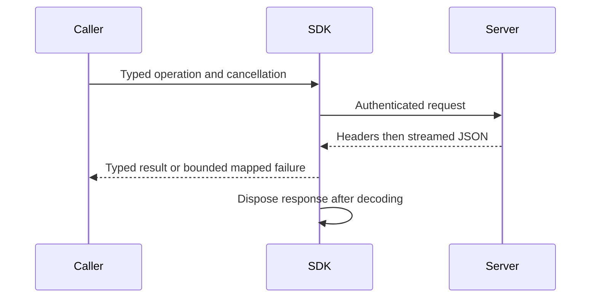

# ClientApi

Owner direction2026-10-05 accepts [ToolDiscovery](ClientApi/ToolDiscovery.md)
and [ADR-104](../ADR/ADR-104-mcp-gateway-tool-discovery.md): three initial
ManagedCode.MCPGateway search/route/invoke tools replace the public default
all-operation catalog, with native MarkdownLd.Kb graph search and unchanged
fresh persisted authentication, canonical schemas and signed Orleans execution.
The complete internal operation inventory remains independently tested; public
gateway composition and real caller qualification are pending. This explicitly
supersedes the all-operation default discovery expectation below, not any required
operation, authorization, resource or RF3 acceptance.

TASK-MCP-RF3-CATALOG-INVENTORY preserves REQ/AC-CLIENT-006 and AC-MCP-001.
Luna query_wave owns the private McpCallerProtocol tool-count inventory and
discovery assertions only if the actual current canonical tool names are absent.
Derive the exact count/names from the real server operation catalog, retain
bounded paging, uniqueness, schema and annotation checks, and independently
compare the complete declared catalog. Original run37242346547 observed62 tools
against the obsolete56-count oracle. ADR-098 adds two accepted shortest-path tools,
and ADR-101 adds the two typed placement administration tools, so the independent
current independent oracle enumerates 68 canonical names and verifies their exact
request/result schemas and read-only/idempotent/non-destructive hints. The public
initial listing remains exactly three gateway tools; these are separate counts and
surfaces. Earlier 66-name planning arithmetic predates the current operation set.
Do not infer a passing discovery result from editing a count. Root reviews the exact
diff and runs the official MCP client through actual Aspire RF3; this source update
is not qualification.

REQ-SQLC-003 / AC-SQLC-003P preserves AC-MCP-002/003 in the Accepted
[ADR-065 public/native oracle stage](../ADR/ADR-065-full-sql-client-compatibility.md).
UnitTests ClientApi canonical command/read/polymorphic corpus and NEW
McpNativePayload files compare every native-decoded typed value with the original
public JSON, retain exact native bytes across source disposal and require real
same-instance array/stream parity. Native int-zero is the no-body contract.
No production/public/data/dependency changes are authorized; actual new GitHub
normal/scalar/recovery/RF3 evidence remains required. A real writer divergence
must be repaired in its owner rather than hidden by the oracle correction.

REQ-SQLC-005/007/008 and AC-SQLC-005/007/008 extend SQL clients under
[ADR-065](../ADR/ADR-065-full-sql-client-compatibility.md). Existing transport is
HTTP/JSON plus official MCP; no PostgreSQL native listener/session is implemented.
The working native target requires real Npgsql/psql/DBeaver bootstrap, typed
results, prepared/portal flows, persisted credential revalidation, original
execution drain and bounded state. The current API-key SHA256 verifier is not
SCRAM. Native security/transaction/gateway contracts must be frozen before code.
TASK-SQLC-C1 first preserves conservative unknown-write outcomes for commented
CALL/unknown roots with genuine Kestrel tests; TASK-SQLC-FULL owns native client
interoperability. [Inventory](../implementation/sql-client-conformance.json)
keeps both native and full SQL qualification false until actual evidence exists.

REQ-CLIENT-010 / AC-CLIENT-010 / AC-DIAG-001..004 add bounded internal RF3
dispatch evidence under [ADR-036](../ADR/ADR-036-orleans-foundation.md).
Closed credential/read/command phases and failure categories correlate the
existing nullable operation GUID without private values. Real middleware/provider
TUnit tests preserve public errors. Docker artifacts retain every node fairly and
distinguish actual SIGKILL action time from container StartedAt. Root owns markers,
capture and shared joins; worker owns middleware/new helper/UnitTests. GitHub
qualification is pending; native cause cannot be inferred from the generic503.

Shared authenticated .NET SDK/CLI transport. [ADR-035](../ADR/ADR-035-memory-performance.md)
and [memory/performance acceptance](../ADR/ADR-035-memory-performance.md) govern
the current transport repair. The typed operation contracts and server authority
remain unchanged.
ADR-041 governs the explicit read-only CLR migration and the strict-analysis
query factory move to KeyLoadQuery.From<T>. Generated AST/JSON, cursor, authority
and transport behavior remain exact; all compiled consumers recompile together.

| Requirement | Acceptance | Automated proof |
|---|---|---|
| REQ-CLIENT-001: consume success bodies without a duplicate full HTTP response buffer | AC-MP-009 | Real Kestrel chunked/delayed typed response; RF3 SDK public calls |
| REQ-CLIENT-002: bounded error parse, cancellation and disposal preserve caller outcomes | AC-MP-009 | Real server malformed/oversized errors, mid-body cancellation, subsequent request |
| REQ-CLIENT-003: operator profiles are bounded and valid generated profiles preserve semantics | AC-MP-010 | Real temporary profile files in TUnit, oversized rejection before full allocation |

Canonical ownership: transport/helpers in src/KeyLoad.Client/Features/ClientApi;
tests in tests/KeyLoad.UnitTests/Features/ClientApi or the matching integration
slice. Existing KeyLoadClient.cs is the cross-feature transport entry point;
business operation methods retain their typed canonical contracts. CLI profile
adaptation belongs to ClientApi; shared AppHost composition is lead-owned.
Frontend/database/schema changes: N/A, transport decoding only.

CLI composition now lives in `src/KeyLoad.Cli/Features/ClientApi/Hosting/KeyLoadCliApplication.cs`;
status/profile/help behavior lives in its `Features/ClientApi/CliClientApi.cs` and
original-text resource. The preserving contract and review exception are
AC-CQ-010 in [quality-gates acceptance](CodeQuality.md), under
ADR-033. The actual CLI build is clean; its process qualification remains pending.

TASK-MP-008 owns only the assigned SDK transport plus new matching helper/test
files. Lead owns shared docs/config and reviews the join. Real ASP.NET/Kestrel
network verification avoids fake HttpMessageHandlers or stream doubles. TUnit on
Microsoft.Testing.Platform runs only in GitHub Actions; development builds are not
test qualification. Unknown committed-write outcomes retain existing semantics;
an aborted decode never proves that the server rolled back the operation.

## Accepted real-Kestrel cancellation coordination refinement

TASK-RUNTIME-Kestrel-W preserves REQ-CLIENT-002 / AC-MP-009/012 under ADR-035.
The macOS baseline timed out before cancellation at the initial 1 MiB write/flush
barrier. Write and flush a bounded initial partial-body chunk, then withhold the
remaining response until caller cancellation. Surface named handler/write/flush
stages and unexpected handler failures under the same five-second waits. Preserve
the pending incomplete response, Cancelled error, real request-aborted signal and
successful subsequent HTTP request. Worker owns only KeyLoadClientTransportTests.cs;
no client product, timeout, policy or response-mapping change. Lead reviews the
real lifecycle and qualifies all three OSes in the complete GitHub run.

## Accepted root-name framing repair

TASK-RUNTIME-MCP-FRAME-W implements REQ-CLIENT-006 and AC-MCP-003/005/007 under
ADR-039. Run37005805424 proves lone-surrogate root property names can throw during
ValueTextEquals before safe string decoding. Classify a root id from the same
validated decoded property name used by duplicate detection. Preserve encoded
name/id byte limits, safe fixed Validation, depth/count budgets, escaped id keys,
native scalar ids and valid surrogate pairs; add no broad exception handler.
The existing four name/value surrogate cases and escaped-id bounds are failing/
boundary regressions. Worker owns only McpFrameInspection.cs; lead owns docs,
review, enabled build and exact GitHub UnitTests/RF3 join. No wire/persistence or
package migration; rollback reverts this internal property-classification change.

## Accepted malformed-problem decoding repair

REQ-CLIENT-002 / AC-MP-009 owns TASK-RUNTIME-ERROR-DECODING-W under ADR-035.
Run37005805424 reproduces a malformed problem body escaping the bounded reader
and selecting the transport-read detail instead of the server-unavailable fallback.
Only JsonException from the bounded Problem deserialization becomes a missing
problem; cancellation, I/O and success-body mapping remain intact. The existing
real-Kestrel ErrorBodiesArePreservedWhenValidAndBoundedWhenNullMalformedOrOversized
test is the failing regression. It retains exact valid details, malformed/null/
65,537-byte fallbacks, UnknownWriteOutcome and the original command header.
Lead owns the private reader and shared contract join. Release build, format,
governance and full exact-SHA GitHub suites qualify the repair. No public API,
schema or package migration is needed; rollback reverts only this private catch.

## Повний caller contract

### Accepted unknown-length MCP framing repair

REQ-CLIENT-009 / AC-CLIENT-009, AC-MCP-001/004/005/007 and AC-MP-009/012
(TASK-RUNTIME-MCP-FRAME-W3) require the unmodified official2.2.0 discovery-first
SDK to succeed under the existing default node/scope/memory limits. Its native
JsonContent has unknown HTTP length. At fa80c701, a small such body allocates the
8MiB permitted maximum, and admission carries an ingress projection already
240,947,200 bytes into the default134,217,728-byte control pool. The prior RF3
receipt lacks the exact admission exception, so this is a source-derived cause,
not a captured memory failure. Keep first discovery proof in renewed RF3 CI.

Separate permitted wire bytes from actual retained buffer capacity. For unknown
length, begin with at most the existing16KiB scratch-sized buffer and grow only
as actual bytes arrive, explicitly clamping growth to the same inclusive limit.
Known-length declarations, one excess byte, truncated bodies, UTF8/JSON/shape
errors, cancellation, replay bytes and clearing the entire retained buffer remain
exact. Ingress retains its conservative pre-read maximum reservation. After
framing, the canonical admission handoff uses the actual owned buffer capacity
and inspected shape; it cannot undercharge any retained raw owner. Do not change
projection equations, pool defaults, quotas, accepted protocol or client headers.

Server/ClientApi McpFrameBody and McpRequestState plus UnitTests/ClientApi real
frame/state regressions are the worker scope. Existing RF3 McpDiscoveryTests must
connect with default negotiation, list all tools and execute canonical calls;
scope/credential invalidation and malformed/oversized negatives remain required.
Tests first prove a small unknown-length frame's retained capacity, exact replay,
bounded growth/overrun and admission under the unchanged default control pool,
then disposal releases execution/memory ownership. Root owns review/build/format
and exact multi-OS unit plus RF3 official SDK join. Frontend, SDK API, persisted
format and dependency migration are N/A; ADR039 owns source-only rollback.

### Accepted MCP rejection diagnostics

REQ-CLIENT-008 / AC-CLIENT-008 (TASK-RUNTIME-MCP-DIAGNOSTICS-W) refines
REQ-CLIENT-006 and AC-MCP-003/005/007 after run37015193756. Every existing transport
guard rejection carries a closed private stage: revision count/value, session or
last-event presence, method/name header shape/encoding, body method shape or
mismatch, missing target, parameter/meta revision mismatch or target mismatch.
The public Validation detail and every accept/reject predicate remain exact.
Only failure paths attach enum metadata; successful calls gain no diagnostic
allocation, payload copying or changed business routing.

Logging uses only defined stage enums and Discovery/Initialize/ToolsCall/ToolsList/
Other method categories. Unknown metadata or arbitrary method strings become
closed defaults; no raw headers, arguments, URI/name, identity, bearer credential,
exception object/text or serialized body can enter the logger. Tests exercise the
actual guard and Microsoft logging EventSource provider with private canaries,
invalid enum metadata, malformed headers/body and unchanged safe errors. All
existing guard tests remain. The lead joins logging in McpHttpPipeline and owns
shared EventSource filter coordination, preserving identical native SDK handling.
Source privacy/predicate/lifetime review, enabled build and exact-SHA GitHub unit
and RF3 receipts are required. The environmental first-discovery failure requires
actual CI receipts rather than a synthetic caller or fabricated success.

Server/UnitTests Features/ClientApi is the canonical map; frontend, data migration
and SDK/API shape are N/A because this is internal failure evidence only. ADR039
governs ordered implementation and source-only rollback. No protocol downgrade,
dependency patch, broad exception fallback, trusted caller role or timeout change.

Актори: application developer, operator CLI, durable worker і required MCP/agent caller. Source-present: typed [.NET SDK](../../src/KeyLoad.Client/KeyLoadClient.cs), [query builder](../../src/KeyLoad.Client/Features/QueryExecution/Queries/KeyLoadQuery.cs), [CLI](../../src/KeyLoad.Cli/Program.cs) та [HTTP routes](../../src/KeyLoad.Server/ApiEndpoints.cs). Public capability/operation semantics визначає owning Feature; SDK не є другим engine.

| Вимога | Measurable acceptance / flows | Test mapping |
|---|---|---|
| REQ-CLIENT-004: supported typed operations і capabilities дзеркалять canonical server contracts | AC-CLIENT-004: existing document/event/queue/group/graph/series/query/search/feed/admin calls повертають typed values/outcomes; unsupported capability/version дає явну помилку; equivalent query adapters дають однаковий result/authority | Existing `SqlJsonAndCSharpUseTheSameAuthorizedHttpQueryContract` у [ClusterTests](../../tests/KeyLoad.IntegrationTests/Features/ClusterReplication/Cases/ClusterTests.cs), [QueryAdapterTests](../../tests/KeyLoad.UnitTests/QueryAdapterTests.cs); operation-manifest parity expansion PLANNED |
| REQ-CLIENT-005: retry/error/cancellation зберігають stable command identity та unknown outcome | AC-CLIENT-005: transient disconnect після committed write не спричиняє другу logical operation; same ID/content replay стабільний, different payload conflict; typed errors, cancellation, bounded decode/disposal зберігають caller semantics без fabricated success | Existing `ReplicatedAtomicBatchSurvivesLeaderProcessKillAndMinorityRejectsWrites` у ClusterTests; transport edge/error cases з AC-MP-009 PLANNED/GitHub pending |
| REQ-CLIENT-006: official MCP SDK adapter виконує ті самі authorized operations | AC-CLIENT-006 and AC-MCP-001–008: real official MCP C# SDK caller на Docker RF3 має operation/result/error/cancellation parity з .NET SDK; AC-MCP-001 independently checks all 68 accepted names, exact schemas and hints, including both GraphPath tools and `keyload_admin_partition_placement_bind` / `keyload_admin_partition_placement_read`; invalid/forged/revoked grants та unsupported calls fail before effects; search/storage coverage включено лише після owning capability implementation | Source IntegrationTests `Features/ClientApi/` MCP parity/adversarial suite; [ADR-039](../ADR/ADR-039-official-mcp-agent-api.md) owns the versioned stateless `/mcp` catalog and bounded admission contract; runtime pending |
| REQ-CLIENT-007: simple agent/worker API має bounded capability та processing contract | AC-CLIENT-007: PLANNED versioned agent calls користуються тим самим persisted principal, typed operations, quotas і outcome semantics; queue worker stale lease/duplicate handler, empty input та cancellation не дають unauthorized/duplicate effects | Existing processing semantics у [MessagingTests](../../tests/KeyLoad.UnitTests/MessagingTests.cs); agent surface tests PLANNED після ADR-039 acceptance |

MCP і agent surface required; accepted contracts, exact names and wrappers are in
ADR-039 and [MCP acceptance](ClientApi.md). Implementation and
runtime qualification remain pending. SDK bearer/API key не містить trusted roles;
credentials/authorization — [Authorization](Authorization.md). Every operation має
окремий Orleans request grain, тоді node-local host виконує операцію;
[ADR-020](../ADR/ADR-020-independent-query-contexts.md) не дозволяє per-client
head-of-line blocking або storage ownership у session facade. Native stateless
transport does not capture a session principal. The .NET SDK's missing Backup and
SetDispatch are explicit parity work, not completed methods.

Canonical map: Client/Server `Features/ClientApi/` transport/adapters та matching IntegrationTests/UnitTests helpers; business operations/tests зберігають owning slice name. CLI — operator/worker entry point; окремий frontend N/A. Shared contracts і host composition мають одного integration owner. Freeze protocol → real parity tests → adapters → rollout/version contract → exact GitHub TUnit/recovery/Docker RF3 evidence. Existing source/test names не виконують planned MCP/agent AC; timeout не означає rollback.

TASK-MCP-NATIVE-SCHEMA-EVIDENCE retains the original official-client schemas
needed to diagnose AC-MCP-001 / REQ/AC-CLIENT-006. The existing discovery,
incoming-graph and partition-query RF3 cases capture only their exact shortest-path,
incoming-graph and partition-query `Tool.InputSchema` objects before assertions.
The original current-source R154/R155 output assertions also require the exact
shortest-path and partition-query `Tool.OutputSchema` objects. Capture these two
outputs in the same existing helper and call sites before assertions, with a
fixed output filename marker and the exact official SDK output capture source.
Keep every strict type/nullability/required-member/item/hint assertion unchanged.
Each UTF-8 schema is at most 64 KiB; its sidecar is at most 1 KiB and contains
only canonical tool name, official SDK capture source, actual Aspire RF3/node1
context, owned filename, byte count and SHA-256. The three inputs and two outputs
total at most 320 KiB per capture set; each object and sidecar retains the existing
independent bound. A missing output fails capture. Unknown tool names, non-object
schemas, excess bounds and failed
writes fail; no credentials, caller data or private inventory is recorded.

ADR-039 freezes the test-only helper
`tests/KeyLoad.IntegrationTests/Features/ClientApi/Helpers/NativeMcpSchemaEvidence.cs`
and the three existing case call sites. Use the existing repository-root helper
and uploaded `artifacts/qualification/mcp-schema-evidence/` ownership. Root owns
contract, review, native RF3 evidence and delivery; a Luna worker prepares the
guarded helper/calls. Schema capture alone is diagnostic evidence, not a passing
operation or an authorization to relax assertions or alter production schemas.

TASK-MCP-NATIVE-SCHEMA-ORACLE repairs the three test observations established by
the original876c official-client captures in run37546085722. It retains
REQ/AC-CLIENT-006, AC-MCP-001 and REQ-GRAPH-010 / AC-GRAPH-009. JsonDefaults.Web
accepts quoted integers and the native schema projection copies those options;
integer schemas therefore have the exact string/integer type set. Nullable
Labels has the exact array/null set with string items. PartitionRef's optional
computed AtomicPartitionId is getter-only: its captured string/null input
projection cannot supply authority or replace the four required constructor
identity fields. Their required set and the computed output value remain fixed.

Root owns the contract and joins. ci_failure_evidence Luna owns only
GraphIncomingMcpSchemaAssertions, PartitionQueryMcpSchemaAssertions,
McpGraphPathInputSchemaAssertions and McpGraphPathSchemaAssertions in their
current IntegrationTests slices.
Compare exact allowed sets, rejecting duplicates and extra types; distinguish
the optional computed metadata field from required identity strings. Preserve
all property/required-member/item/effect-hint/catalog checks and native official
client flows. Native output uses the same unchanged exporter options; review its
current source shape and retain output execution as unqualified until the actual
RF3 flow passes. For the parameters dictionary, omitted
additionalProperties is open under Draft2020-12; explicit false remains rejected.
An explicit value must be a boolean or object schema. The original259/884
output-version stack proves array-versus-scalar disagreement; retain the frozen
exact string/integer output set, with no duplicate, extra or null type. Labels
input remains unchanged. No production schema, decoder, public contract, dependency or
trust change is authorized by this test repair. Root builds, reviews, executes
the real Aspire RF3 SDK flows and retains exact-source Linux original reports.
Rollback removes only the oracle corrections, preserving captured failure
evidence and every mandatory suite. UI/storage changes are N/A.

The current-source R158/R159 official SDK output captures establish the remaining
exact output sets: QueryRow.RedactedFields is array/null with string items;
PartitionRef.AtomicPartitionId is string/null, while its four required identity
strings remain scalar strings; GraphPath.Hops is exactly string/integer/null.
Use those exact sets in the same existing output assertions, rejecting duplicates,
extra types and malformed entries. Keep every field, required-member, item,
reference-depth, catalog and effect-hint assertion. The captured output hashes
are respectively `248fd97e9a3105df3d6376640b9eb82350fffa8fd829de5e55e04bec85970eb2`
and `39c7b94a0a86777a5fb007407da7aa576d4b54f3164f5dce6bf05caf76075cf9`.
Captured failed flows remain failed; actual passing SDK/RF3 and delivered Linux
qualification are required after these precise oracle corrections.
R162 subsequently reached the placement tools and failed their common
PartitionRef property-set oracle. McpSchemaFactory exports their same canonical
PartitionRef through the same native projection and input/output transforms as
the captured graph/query tools. McpPartitionPlacementSchemaAssertions must also
require the exact five properties, keep only the four constructor identities
required, and check computed AtomicPartitionId's exact string/null set. Keep
integer string/integer sets exact and scalar string/boolean fields strict. This
source-bound inference still requires the actual full discovery flow to pass;
no placement operation, schema exporter or authority rule changes.

TASK-MCP-NATIVE-FAILURE-CODE supports REQ/AC-CLIENT-006 and AC-MCP-003/005/007
after the original876c saga-timeout RF3 invocation returned IsError without its
safe classification in the failed assertion. Root freezes and joins; a Luna
worker owns only IntegrationTests/Features/ClientApi/Assertions/McpCallerAssertions.cs.
The existing SuccessAsync assertion may read only the actual StructuredContent
errorCode, reuse its closed canonical enum validation and append that code with
the mapped HTTP status. Malformed/unknown envelopes produce fixed Unclassified
text. Keep the reason below128 UTF-8 bytes; never print detail, result, request ID,
tool arguments or credentials. No parallel Problem decoder, changed signatures,
guessed expected code or relaxed success/error assertions. The original test
identity/call-site supplies operation context; CallToolResult contains no tool
name. Root builds and retains actual official-client Aspire RF3/Linux outcomes;
this observation cannot qualify the saga or repair its unknown initiating cause.
Production/format/dependency changes are N/A. Rollback removes only this reason.

TASK-CLIENT-ADMIN-SDK-PARITY freezes the two missing public SDK extensions before
source integration under REQ/AC-CLIENT-004/005/006. Existing signatures and default
transport method inference remain unchanged. `BackupAsync(CancellationToken)`
sends one authenticated bodyless `POST /v1/admin/backup` through the current
transport, returns the canonical `BackupReceipt`, and classifies interrupted
writes as `UnknownWriteOutcome`. It has no command ID or automatic retry: a
further explicit call may create another archive. `SetDispatchAsync(Guid
commandId, bool paused, CancellationToken)` requires a nonempty caller-owned ID,
sends bodyless `POST /v1/admin/dispatch?paused=true|false` with that exact
`X-KeyLoad-Command-Id`, and returns the canonical boolean. The server's persisted
administrator authorization, signed operation, separate request grain, replay
and conflicting-payload semantics are unchanged; no caller role is accepted.

Ownership is `Client/Features/BackupRestore/Transport/BackupClient.cs` and
`Client/Features/Messaging/Transport/DispatchClient.cs`, joined to the existing
ClientApi route constants and internal `KeyLoadClient.Send`/`KeyLoadClientTransport`
method override. Existing callers omit the optional override and retain their
GET-for-null/POST-for-body selection. Business regressions belong to IntegrationTests
BackupRestore `AdminBackupClientParityTests`/`AdminBackupArchiveVerifier` and
Messaging `AdminDispatchClientParityTests`. Frontend is N/A because these are
SDK adapters for existing administrator operations; contracts and server routes
already exist. ADR-039 owns integration and rollback.

The actual Aspire RF3 backup flow commits a canonical seed through SDK, invokes
one SDK backup and one discovered official-MCP backup, and requires valid distinct
receipts. For each archive, complete bounded dashboard inventories must identify
exactly one physical voter and manifest; resolve only beneath the fixture-owned
bind mounts, compare retained file lengths with observed bytes, verify the native
backup cut includes the seed, restore into a unique owned directory and reopen
exact reference/JSON/revision/non-tombstone state. Require a new incarnation,
paused dispatch and an unchanged verified source archive. Join native disposal
and exact-root deletion while preserving primary and cleanup failures.

The dispatch flow establishes an administrator-unpaused baseline inside its
cleanup scope, persists a DocumentsRead-only member and requires its pause to
fail with PermissionDenied. Immediately commit a healthy administrator write
without any intervening dispatch mutation, proving denial had no effect. Then
exercise same-ID/same-boolean replay through both clients, changed-payload
Conflict, paused-write rejection with unchanged JSON/revision, and cross-client
resume/pause followed by healthy commits/public reads. Bounded observed cleanup
restores dispatch. Root reviews guards, builds/formats, executes the real SDK and
official-MCP fixture, retains original evidence, and commits/pushes the stage.
Source integration and runtime qualification are pending. This stage covers only
the observable archive outcome portion of AC-BACKUP-001; streaming/memory,
cluster-cut/reconciliation, cancellation/revocation parity and all remaining
ClientApi/BackupRestore acceptance stay mandatory and open.
