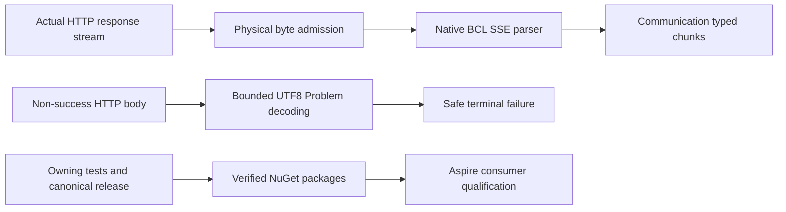

# Native CQRS HTTP transport bounds

Status: owning repair10.2.7 delivered at source6dae0a68960055f01216c186448787000fd0b6e6; canonical Linux release passes1345/1345 and all four published packages are verified from NuGet. KeyLoad's three central pins are updated; Aspire consumer qualification remains pending. Canonical slice: ClientApi. Parent: [ClientApi](../ClientApi.md). Decision: [ADR-083](../../ADR/ADR-083-cqrs-http-transport-bounds.md). Product stream integration remains subject to [NativeCqrs](../ClusterRouting/NativeCqrs.md) C1–C3.

The selected Communication10.2.6 native HTTP reader passes an unbounded body into the BCL SSE parser and reads a non-success body using ReadAsStringAsync. A non-Problem response can become its public Problem.Detail verbatim. Repair these paths in the owning Communication repository; KeyLoad must not introduce another parser or consume an unpublished package.

## Requirements and acceptance

| Requirement | Measurable acceptance | Evidence |
|---|---|---|
| REQ-CHB-001: physical SSE input is bounded before excess bytes reach the native parser | AC-CHB-001: genuine ASP.NET TestServer HTTP responses prove inclusive frame-byte limits for LF, CRLF and CR, including delimiters split across reads, comment/heartbeat and multiline frames, EOF and a stalled oversized unterminated line. Exactly-at-limit input can complete; the next excess byte produces one terminal resource failure and stops reading. Skip cannot suppress a resource limit. | Owning CQRS/CqrsHttpBoundsIntegrationTests; actual BCL parser and native client helper |
| REQ-CHB-002: non-success HTTP decoding has finite memory and no raw-body fallback | AC-CHB-002: known and unknown content lengths, inclusive byte limits, excess bytes, invalid UTF8/JSON, empty and plain-text bodies are exercised through real HTTP. Valid bounded RFC7807 status/type/title/detail semantics are preserved. A non-Problem, invalid or oversized body yields status-based safe failure with no raw response payload, URI or credentials in public chunks. | Owning real transport regressions and updated plain-text failure oracle |
| REQ-CHB-003: callers can bound aggregate bytes without changing generic long-stream compatibility | AC-CHB-003: an explicit positive MaximumStreamBytes counts every successful response byte, including heartbeat and frame delimiters, without reset or overflow; inclusive and excess boundaries are exercised. Invalid frame/failure/aggregate options fail before the lazy request factory or HTTP send. KeyLoad's later C2 contract must configure finite aggregate/count/rate/time budgets. | Owning real transport and API-boundary regressions; C2 product tests pending |
| REQ-CHB-004: admission retains native cancellation, disposal and failure contracts | AC-CHB-004: cancel actual pending frame/error-body reads, join their MoveNext completion and then dispose the enumerator; separately dispose an open frame stream after a yielded chunk while no MoveNext is active. Both valid consumer-abandonment paths settle server and reader within10 seconds and a following request succeeds. Malformed bounded frames retain EmitFailed/Skip/Throw policy using safe constant public diagnostics; caught exceptions are reported immediately with their original object under the owning diagnostics policy, never retained in Result/Problem. | Owning real transport lifecycle regressions; complete owning TUnit/coverage gate |
| REQ-CHB-005: the repaired dependency is delivered before consumption | AC-CHB-005: complete owning Release build, TUnit/coverage, scoped commit/push and canonical release succeed at the exact SHA; all three consumed Communication packages are available on the intended NuGet feed. Only then update centrally pinned KeyLoad versions and run focused Aspire consumer regressions plus required full gates. | Root release/feed receipts and original consumer reports |

Every REQ maps to its corresponding AC. Authored tests, a local package, a pushed commit or a green publication step without feed verification cannot close AC-CHB-005. Frontend N/A: library transport and API contract only. Performance and allocations need measured evidence; the byte ceiling is admission, not a claim about exact BCL pool allocation or speed.

## Accepted API and semantics

Add positive int MaximumFrameBytes and MaximumFailureBodyBytes to CqrsStreamClientOptions. Defaults are16MiB and64KiB respectively; hard ceilings are64MiB and1MiB. Add nullable positive long MaximumStreamBytes, unset by default to preserve generic long-stream duration compatibility. A configured aggregate limit is authoritative and includes all raw successful-body bytes. Validate all options at the public helper boundary before invoking its lazy factory. Use named canonical constants throughout new runtime and test code.

A frame is the physical SSE block ending with an empty line, including every byte of its terminating delimiter; EOF closes a final block. Count UTF8 wire bytes, comments, field names, data, line terminators and any BOM. Recognize LF, CRLF and CR across arbitrary read boundaries. A CR must not incorrectly reset the counter before its following LF is accounted for. The guard admits at most the remaining frame/aggregate bytes plus the single byte needed to detect excess. It must not accumulate a second frame buffer or decode/reimplement SSE fields; the BCL remains the only SSE parser. Its allocation granularity is separate from this admission contract.

Read a non-success body into a finite owned UTF8 buffer of at most MaximumFailureBodyBytes plus one detection byte, or reject an already excessive Content-Length without draining. Deserialize bounded bytes directly; do not create an unbounded response string. Preserve existing bounded Problem interpretation and missing-status/title/type normalization. Invalid, empty, non-Problem or excessive bodies use HTTP status and safe named constant detail; never include raw text. Resource-limit chunks have stable public well-known codes and constant detail. Limits fail closed under every malformed-frame policy. An ordinary malformed bounded frame still obeys its selected policy, with safe public JsonException text under Throw. Keep original exceptions only at the immediate diagnostic boundary.

Frozen well-known Problem titles are cqrs_stream_frame_limit_exceeded, cqrs_stream_failure_body_limit_exceeded and cqrs_stream_total_limit_exceeded. Their constant details respectively are “The CQRS response frame exceeded its configured byte limit.”, “The HTTP failure response exceeded its configured byte limit.” and “The CQRS response stream exceeded its configured byte limit.” Frame/total failures use the existing transport-failure status500; failure-body excess retains the actual non-success HTTP status. Invalid/empty/plain-text non-success bodies use “The HTTP request returned a non-success status code.” without copying body text. Malformed bounded-frame public detail and opt-in JsonException text use “The server sent an invalid CQRS stream frame.” Original caught exceptions are reported immediately under owning policy and are not stored in these public Problems.

The native async enumerator permits one operation at a time. A pending MoveNext must receive cancellation and finish before DisposeAsync; invoking both concurrently is not a valid lifecycle oracle. Timeout cleanup must request actual cancellation and join the owned reader rather than treating Task.WaitAsync as reader completion. Keep the native request, response, parser and stream disposal chain; no alternate HTTP client, server writer, CQRS dispatcher, Result envelope compatibility or KeyLoad workaround. Changes to generic producer normalization, command execution reliability or Graph are outside this repair unless an actual test demonstrates a separately specified defect.

## Ordered ownership and verification

1. Root freezes this REQ/AC/API contract, ADR and scoped task before write release.
2. Luna owns a reviewable patch staged under /private/tmp for only owning Communication/Cqrs client admission/helpers/constants, CQRS tests and concrete README examples. Reuse CqrsTestHost.StartMinimalApiAsync/GetTestClient for real HTTP. Existing stub-based tests may have an unsafe oracle corrected; they cannot prove physical resource/lifecycle boundaries. No builds, releases, version changes or Git actions by the worker.
3. Root reviews and applies the scoped patch to the owning repository under existing dependency-repair authorization. Recheck its working tree, preserve unrelated changes, run its canonical restore/full build/TUnit coverage and required bounded performance check for the added hot path. Root owns diagnostic repairs and evidence.
4. Root increments both canonical Version/PackageVersion from10.2.6 to10.2.7 only after relevant checks, commits the complete scoped repair, pushes main without force and follows its release workflow. Independently verify ManagedCode.Communication, ManagedCode.Communication.AspNetCore and ManagedCode.Communication.Orleans10.2.7 from NuGet; partial publication is insufficient.
5. Root updates KeyLoad's three central pins only after feed proof, restores/builds and exercises actual native CQRS consumers through Aspire. Product C2 remains blocked on its own signed request, persisted authorization, RF3, terminal authority, aggregate/count/rate/time and official MCP contracts.

Migration: additive options and intentional removal of raw-body failure exposure. README gives explicit bounded-client usage and the new status-only plain-text behavior. Rollback: redeploy a homogeneous prior KeyLoad binary before product C2 adoption; never reintroduce the unsafe raw-body path or replace the repaired library with a consumer parser. No storage format or RF3 topology changes.

## Native parser EOF and cancellation qualification correction, 2026-10-04

The first actual complete owning TUnit/coverage cohort passes1341/1344 cases without skips. Real forced one-byte CR/LF reads pass the physical frame bound. The no-final-empty-line EOF oracle incorrectly expects Completed: pinned .NET10.0.12 SseParser discards pending data at EOF before a final empty line. The admission guard closes/account-checks the final physical block at EOF; it must not invent SSE dispatch. A within-limit partial frame yields the existing Incomplete failure and no data, while an over-limit partial frame yields the resource failure. Fully-delimited input remains the inclusive-limit success case. This clarifies AC-CHB-001 without changing the native BCL parser or allowing partial success.

The two genuine cancelled active-reader cases currently return from MoveNext without the expected owned-token OperationCanceledException. Root must retain the original reports and inspect the actual native failure classification before repairing the owning cancellation boundary. Do not relax cancellation to a successful/failed data chunk, race Dispose with active MoveNext, or report wrapper timeout as real settlement. The existing AC-CHB-004 remains mandatory.

The second complete owning cohort passes1342/1344 with the corrected native EOF negative oracle. Both remaining unchanged cancellation assertions report actual System.IO.IOException from the aborted native response. CqrsStreamNormalizer currently converts that non-OCE fault before checking the already-cancelled owned token. The owning repair must recheck the actual consumer token in the general MoveNext exception boundary before fault conversion and before final fault/incomplete emission. Cancellation takes precedence when that same consumer token is cancelled; uncancelled transport errors retain native failure normalization. Preserve real HTTP reader/producer settlement, early disposal, malformed policy and current sequence behavior. This extends the scoped owning repair to CqrsStreamNormalizer only; it does not declare arbitrary invalid post-terminal source sequences qualified.

## Accepted measured allocation correction, 2026-10-04

The third complete owning TUnit/coverage cohort passes all1344 cases without skips. Native HTTP BenchmarkDotNet after01 retains unchanged owning and harness source inventories and all three original reports. Compared with the same-machine baseline04, allocations increase from13771/26364/214021 to22289/34826/222874 bytes per operation for128/4096/65536-byte results. The short measurements have broad latency confidence intervals and remain development evidence; they do not establish a public performance claim.

Remove the guard's separate8192-byte array and the admitted-prefix copy. The real source reads directly into the caller/BCL-provided destination, sliced to the unchanged minimum of destination capacity,8192 bytes and remaining quota plus one detection byte. Physical admission examines only bytes actually returned by the source and returns the admitted prefix length. An excess detection byte may occupy destination memory beyond that returned prefix, but must never be exposed to the parser as readable input. Preserve all counters, CR/LF/EOF boundaries, aggregate overflow safety, pending failure, cancellation and source ownership. No additional frame buffer, pooling lifecycle, SSE parser or change to quota semantics is authorized. Root reruns the complete owning build/TUnit/coverage and the unchanged native HTTP harness after review; the before/after source inventories and original reports are retained before release.

Owning source review also identifies the AC-CHB-004 diagnostic gap: CqrsStreamChunk.FromException currently constructs Problem.Create(exception), then creates a failed Result without the original exception, losing its native immediate stack telemetry. Use the existing canonical Result<TResult>.Fail(exception) path in that factory so producer and normalizer conversions report the original object immediately without retaining it in the chunk/Result/Problem. Preserve existing public Problem/sequence semantics; this correction does not claim generic exception-message privacy. Add focused native Create and Normalize fault regressions that capture actual diagnostic output, preserve exactly one failure, retain the original stack and prove no exception object/stack is serialized. Include them in the full owning TUnit gate before release.

The first actual extended full cohort passes1344/1345; the new diagnostic oracle already observes the original exception Error-log, but expects a full type name in error.type. Native CommunicationTelemetry.ResolveErrorType returns exception.GetType().Name when the original exception is supplied; problem.error_code retains its FullName. Assert those exact distinct native tags, plus the original stack event and object identity. Keep the failed original cohort and do not replace stack/object/count assertions with tag presence or a weaker match.

## Actual owning tests05 and native HTTP after02, 2026-10-04

The complete native owning TUnit/coverage cohort passes all1345 cases with no failed, skipped, cancelled, timed-out or flaky tests after build07 (zero warnings/errors). Original reports and coverage are sealed under `artifacts/qualification/native-cqrs-http-owning-development-20261004/tests05-originals/`. The original failed tests04 cohort remains retained; its new telemetry oracle was corrected to the source-defined short type name in `error.type`, while the full type name in `problem.error_code`, original exception identity, throw-site stack and non-serialization assertions remain mandatory.

Native HTTP BenchmarkDotNet after02 completes all three128/4096/65536-byte cases with362 owning source files and both unchanged private harness inputs. Allocations are14103/26588/214606 bytes per operation versus22289/34826/222874 in the first bounded-reader cohort and13771/26364/214021 in baseline04. This observes the removal of the redundant8KiB buffer without weakening physical byte admission. Original reports, native run log and before/after source inventories are sealed in `after02-originals/`. Short-run local latency uncertainty does not establish acceleration or GitHub qualification.

## Canonical owning delivery, 2026-10-04

The final versioned owning build08 passes with zero warnings/errors, and the unchanged complete tests06 cohort passes1345/1345. Commit6dae0a68960055f01216c186448787000fd0b6e6 is pushed to main. Its [canonical Linux release](https://github.com/managedcode/Communication/actions/runs/37196454147), CI37196454070 and CodeQL37196454093 all succeed. The release's full native tests pass1345/1345 without failures/skips.

All four10.2.7 packages, including the three KeyLoad consumes and Communication.Extensions, are indexed and downloaded directly from NuGet. Each native nuspec identifies the exact release SHA; every original archive entry is byte-identical to the corresponding GitHub package. NuGet adds only its repository signature, verified successfully by `dotnet nuget verify --all`. Original run/log, packages, feed/index/nuspec receipts and verification evidence are sealed in `artifacts/qualification/native-cqrs-http-owning-development-20261004/publication02-originals/`. KeyLoad pins now select10.2.7; restore/build, actual Aspire consumer regressions and complete consumer gates remain required before AC-CHB-005 closes.
