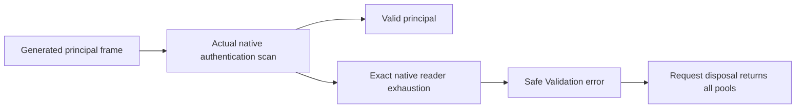

# Native authentication reader failure

Canonical slice: ClientApi. Existing [ADR-060](../../ADR/ADR-060-native-internal-serialization.md), AC-IS-002/005/006, already defines malformed native errors and pool safety. ADR: N/A for a new decision because this correction preserves formats, public APIs, limits, authority, dependencies and topology.

| Requirement | Acceptance | Observable contract and test |
| --- | --- | --- |
| REQ-NAR-001 | AC-NAR-001 | Removing the last byte from a genuine generated principal reply returns safe Validation from Inspect and ReadPrincipal; NativeAuthenticationReaderFailureTests and the existing wrong-root/trailing-frame test. |
| REQ-NAR-002 | AC-NAR-002 | Actual request-state authentication rejects that frame and releases every ingress/data/control reservation; genuine state and full-pool assertions. |
| REQ-NAR-003 | AC-NAR-003 | Valid generated replies remain valid and caller cancellation remains cancellation. Only the existing pinned Reader throw-site predicate joins malformed classification. |
| REQ-NAR-004 | AC-NAR-004 | Scoped source review, full Release/formatter and focused normal/scalar retain actual evidence; broader failing suites, coverage and RF3 remain open. |

Server owns the existing McpNativeAuthentication.Malformed predicate; UnitTests owns only the new ClientApi regression file. Backend domain, shared binary codecs, public contracts, frontend, storage and deployment changes are N/A because this fixes one existing denial path. Other native, SQL and benchmark owners retain their scopes.

Root freezes NAR-P, Luna authors NAR-T test-first, root applies NAR-E, strong R38 performs read-only NAR-R, and root owns NAR-I integration. Local tests use .NET 10, TUnit and Microsoft.Testing.Platform; the owner permits development checks. Exact-source Linux CI remains mandatory for qualification. Focused command: dotnet test --project tests/KeyLoad.UnitTests --no-build --no-restore --configuration Release --treenode-filter '/*/*/NativeAuthenticationReaderFailureTests/*', repeated with DOTNET_EnableHWIntrinsic=0. Preserve the existing complete wrong-root/trailing/pool assertions.

No new migration is needed; reverting this predicate restores previous error mapping without modifying data. No broad InvalidOperationException catch, replacement reader, fake native exception or grant of authority is permitted. Unforced programming/session failures remain a source-review exception; numeric coverage, full suites, fault/endurance and performance gains are unqualified until their authentic gates exist.

Local development evidence, 2026-10-03: integrated compilation and the complete 26-project Release build passed with zero warnings/errors. The actual TUnit authentication/reader selection passed 24/24 in both normal and hardware-intrinsics-disabled modes, with no skips, including all four new regression cases and every-prefix, valid/reference, malformed-array and owned-exception controls. Original TRX SHA-256: normal 78d02f01d55ae8d3fb718c0d4e355552652b26431ba4ff39b0393a30642505f3; scalar afb2f436f6b52be1c69e46bd1cc83d3f6b06dafa0aaa100ec421c26c627fc362. Server source SHA-256 050b34311ce800f7a5b218fd77d044325983256a7091f6139b49dde822fd77bb and regression source 482d116211b1317756acfc1df88ff5e11ab0e678b694943eaf3e998fd404dfa5 were independently reviewed. This does not close the failed broader baseline or establish exact-source Linux/RF3, coverage or power-loss qualification.
