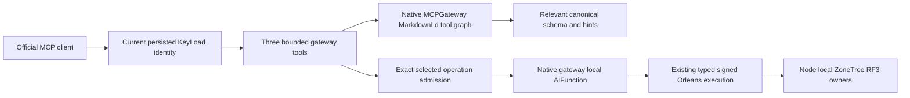

# ClientApi: bounded graph-based MCP tool discovery

Owner direction: 2026-10-05. Status: Accepted implementation contract; source
and runtime qualification pending. Parent: [ClientApi](../ClientApi.md).
Decision: [ADR-104](../../ADR/ADR-104-mcp-gateway-tool-discovery.md).
Original task joins: KL-002, KL-014, KL-061, KL-076, KL-080. This adds acceptance
to the existing product work; it does not replace the original 104-task plan.

## Outcome and scope

The official MCP client initially receives exactly three tools:
`gateway_tools_search`, `gateway_tools_route`, and `gateway_tool_invoke`.
Search and routing use our published ManagedCode.MCPGateway and its native
ManagedCode.MarkdownLd.Kb graph index. Relevant operation metadata, exact typed
schemas and effect hints are returned on demand. All canonical operations remain
in the server's single internal operation inventory; listing them all is removed
from the public default discovery path.

Incoming callers continue authenticating through persisted KeyLoad credentials
on every HTTP request. Gateway OAuth config is for outbound MCP sources and is
not an incoming authentication scheme. Execution retains the existing signed
Orleans gateway, fresh request grain, persisted authorization, RF3 and node-local
ZoneTree ownership. No loopback proxy, second dispatcher, reflection-discovered
database engine, or additional authenticated endpoint is introduced.

Only static public operation metadata enters the graph. It contains no resource
inventory, actual data, principal, credential, authorization grant, request body,
query history or caller-supplied context. Static operation metadata is visible to
an authenticated current principal; discovering an operation does not grant its
capability or access to a resource. Every invocation reloads the persisted policy
through the canonical execution path, including administrator operations.

## Frozen wire and native integration contract

- `tools/list` returns the three fixed meta tools with independent exact schemas
  and annotations. It does not paginate the internal operation inventory. An
  incoming nonempty discovery cursor fails with the existing safe Validation.
- Search arguments are exactly `{ query, maxResults? }`. Query is nonblank,
  valid UTF8 and at most 2048 UTF8 bytes. Result limit is 1..4, default 3;
  missing/extra/duplicate/case-altered fields and invalid limits are rejected.
- Route arguments are exactly `{ query, maxCategories?, maxToolsPerCategory?,
  preferReadOnly? }`. Each count is 1..2, default 2, producing at most four
  unique operations. The same query bound applies. No context, translation,
  federation endpoint, remote source, model provider or disabled-tool opt-in is
  accepted from a caller.
- Invoke arguments are exactly `{ toolId, arguments? }`. `toolId` must equal a
  current canonical operation name using ordinal case-sensitive comparison.
  `arguments` is the canonical tool argument object, unchanged: `{ request }`,
  `{ commandId, request }`, or `{}` as prescribed by the operation. Unknown
  targets and direct calls to the removed public operation-tool names fail
  before effects. The invocation cannot recursively target a gateway meta tool.
- The native incoming message filter selects the inner canonical descriptor
  before typed argument conversion. One original route-specific HTTP admission
  lease charges the entire outer frame and authenticated identity. Control
  search/route/list calls retain the existing control lane. The outer meta call
  never downgrades a write, delivery, backup or blob call into a discovery lane.
- Register one immutable bounded metadata catalog through `IMcpGatewayFactory`
  and normal `McpGatewayOptions.AddTool`, using real local `AIFunction` adapters.
  Each adapter observes the current HttpContext and admitted descriptor; it
  captures no principal or caller arguments. It invokes the existing
  `McpToolDispatcher.InvokeCanonicalAsync(arguments, cancellationToken)` seam.
  A mismatch with that request's selected descriptor fails before dispatch.
- The factory-backed catalog owner exposes native `SearchAsync(query, limit,
  cancellationToken)`, `RouteAsync(query, categories, toolsPerCategory,
  preferReadOnly, cancellationToken)` and `InvokeAsync(toolId, arguments,
  cancellationToken)`; it does not recreate the gateway's graph/search engine.
- Configure graph strategy, generated tool graph, native schema-aware search,
  disabled query translation, four native search matches and finite descriptor
  text. No search cache or embedding/model service is registered. Canonical
  hints add bounded feature/category and operation aliases to the graph.
- Search/route success retains the existing `{ result, requestId }` envelope;
  `requestId` is null because no database operation has executed. Results map
  only native matches back to current canonical tools, including exact input
  and output schemas, annotations and finite score. Raw provider diagnostics,
  exception text, generated SPARQL and query echoes are not public results.
  The existing inclusive control reply byte ceiling remains mandatory; no
  partial schema is returned to fit it.
- Invoke calls the actual native gateway with only the host-admitted target and
  canonical argument dictionary. A successful local adapter returns the existing
  native `CallToolResult` object. Preserve its exact result/error, real execution
  GUID and borrowed reply owner through draining. Gateway status is not a
  replacement for `CallToolResult.IsError`; unexpected non-result output fails
  closed with the existing safe error. Do not serialize an alternate gateway
  output envelope or normalize canonical user numbers/content.
- `WithMcpGatewayCatalog()` is not used: its current aggregate exporter lists
  all tools and rebuilds normalized results. This uses the package's normal
  factory/search/invoke APIs within KeyLoad's existing official MCP host.

## Bounds, lifetime, migration and observability

Owner extension 2026-10-05, REQ/AC-MCPGW-007: the same native MCP server lists
one static Markdown resource `keyload://guides/agent-quickstart` (`text/markdown`)
and one no-argument prompt `keyload_agent_quickstart`. Both return the same
guidance, at most 8192 UTF8 bytes: what the development-preview database is,
how to search/route relevant tools, inspect the returned schema/effect hints,
invoke with exact arguments, paginate reads and retain a write identity for
uncertain outcomes. Include one valid search and no-body invocation example;
do not invent typed data mutations or advertise unfinished conformance.
Fresh persisted authentication and the existing control admission/reply budgets
apply to list/read/get on every request. These static surfaces expose no data,
resource inventories, credentials or principal context, and introduce no extra
operation tool. Return fresh native resource/prompt objects; terminal list cursors
are null. Reject nonempty cursors, unknown URI/name, and prompt arguments before
any database execution. No resource templates or subscriptions are advertised.
Native official SDK list/read/get, content equality, byte bounds, cancellation,
unknown inputs and revoked credentials are mapped tests; source text alone is
not protocol or RF3 proof. Root owns shared registration; the ClientApi Guidance
subfeature owns content, query validation and native transport handlers.

The metadata index admits at most 256 canonical operations and at most 4 MiB of
serialized immutable operation metadata before native graph construction. Native
descriptor search text is at most 4096 characters. These bound inputs and catalog
growth; measured total graph allocation/peak RAM is a separate acceptance gate,
not inferred from a result-count setting. Node control/data/ingress budgets,
payload/reply bounds, concurrency, scope quotas and cancellation remain intact.

Warm the real native graph once as host-owned startup work; native failure fails
startup/readiness instead of publishing a healthy empty index. Rebuild after
restart derives solely from canonical source metadata. No persisted format,
database journal or credential migration occurs. Retain active search/invocation
owners until work settles; dispose the factory instance after host requests drain.
Cancellation/deadline is threaded into native work and rechecked after completion.
The graph package does not promise immediate interruption of an already-running
SPARQL processor; do not detach that work or release its owners early.

Only closed method/stage/error categories and execution GUIDs may be recorded.
Do not emit search text, arguments, native exception messages or identity into
diagnostics. Existing native-package logging policy applies. Dependency defects
are repaired and published in their owner, never hidden by a consumer fallback.

This intentionally replaces the public all-operation discovery contract in
ADR-039. Update official SDK examples and callers together, keeping complete
operation parity tests through gateway invocation. No legacy direct-tool route or
second full-catalog MCP endpoint remains. Source rollback reverts this composition
and its tests together; it changes no durable data. A missing gateway package or
failed graph index is a failure, never permission to revive the previous route.

## Requirements and mapped acceptance

| Requirement | Measurable acceptance and negative/edge flows | Automated evidence |
|---|---|---|
| REQ-MCPGW-001 compact official discovery | AC-MCPGW-001: real official client lists exactly the three names, valid strict schemas/hints, no canonical tool page; nonempty cursor and direct/recursive/unknown invocation fail before effects | UnitTests ClientApi gateway catalog/oracles; IntegrationTests ClientApi real discovery |
| REQ-MCPGW-002 native graph relevance | AC-MCPGW-002: actual graph index resolves exact names and document/graph/blob/queue/series/SQL tasks to actual relevant canonical tools; unique bounded output, exact schemas and effect hints; no invented operation or numeric score; malformed/oversized query/limits reject | Native gateway graph cases over real canonical metadata; official search-to-invoke scenarios |
| REQ-MCPGW-003 fresh persisted authority | AC-MCPGW-003: invalid/revoked/expired credentials fail; caller role/context fields cannot elevate; existing policy/row/field denials remain; grants revoked between discovery and invoke take effect; discovery exposes no data/resource/identity | Aspire RF3 official SDK grant/credential/revocation and canary cases |
| REQ-MCPGW-004 one canonical execution | AC-MCPGW-004: every inner route uses original admission/quotas and fresh signed Orleans request; typed success/error/requestId unchanged; same-ID write replay/conflict/unknown-outcome semantics preserved; SDK and gateway effects/results agree | Unit admission/selection/result-owner assertions; real .NET/MCP RF3 reads/writes/backup/blob/SQL |
| REQ-MCPGW-005 bounded graph and lifecycle | AC-MCPGW-005: catalog/query/count/reply thresholds pass exact limit and reject excess before unsafe allocation/effect; startup index failure is fatal; cancellation drains and releases owners with healthy follow-up; concurrent identities do not cross; cold restart rebuilds metadata and preserves data | Real native index/owner/bounds cases; Aspire RF3 cancellation/concurrency/restart; measured index allocation/RAM retained separately |
| REQ-MCPGW-006 privacy and delivery | AC-MCPGW-006: provider/search exceptions produce safe existing failures; diagnostic canaries never appear; only published centrally pinned packages are consumed; Release build/analyzers/formatter, full relevant normal/scalar/recovery and genuine RF3 pass with exact source evidence | Source/privacy review, native EventSource/Kestrel cases, actual NuGet restore and Linux CI artifacts |
| REQ-MCPGW-007 agent orientation | AC-MCPGW-007: official SDK lists exactly one guide and one no-argument prompt, reads/gets identical valid Markdown <=8192 UTF8 bytes with actual discovery/invocation instructions; fresh authentication, safe unknown/cursor/argument rejection, cancellation and mutable-object isolation pass | UnitTests ClientApi guidance cases; IntegrationTests ClientApi official resource/prompt and credential cases |

Frontend and .NET business SDK API: N/A, official MCP protocol adapter and
examples change; data and native Orleans contract migration: N/A, canonical
execution/persistence stay exact. AppHost owns real runtime/test resources and
shutdown. No unit fake gateway, in-memory database or self-proxy is acceptance.

## Execution and evidence

TASK-MCPGW-CATALOG: Luna partition_pages owns new ClientApi native index, local
AIFunction adapter, bounded metadata hints/lifetime and real native graph tests.
TASK-MCPGW-TRANSPORT: Luna lifecycle_wave owns three-tool protocol, admission
selection, typed native invocation/reply-owner join and new protocol/bounds tests.
Their scopes are disjoint; root owns shared registrations, centrally pinned
packages, docs, official caller migration, RF3 joins, review, gates and Git.

Read-only source baseline identifies MCPGateway0.4.16 and MarkdownLd.Kb0.2.10;
both versions were observed in live NuGet.org flat-container indexes on2026-10-05.
KeyLoad's preceding checkpoint ce2eace builds with zero warnings/errors and its
focused partition-query Aspire units pass25/25. RF3 startup stopped before node
creation due to a missing required server image. The required formatter baseline
fails on source whitespace/import ordering; these are open, not passing gates.

Ordered stages: freeze this contract and ADR; implement code and mapped tests;
root reviews both packets and removes replaced paths; restore/build the combined
source; run focused then related suites through Aspire; repair actual failures;
run formatter and required broader gates; commit/push each coherent stage; retain
exact Linux CI/RF3 evidence before acceptance closure. Use canonical AppHost
`--KeyLoadTests:Suite=unit`, `unit-scalar`, `recovery`, and `rf3` entry points;
bounded filters are development evidence only. No criterion is closed yet.
