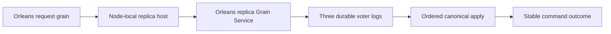
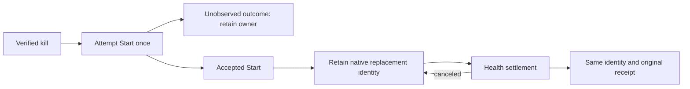
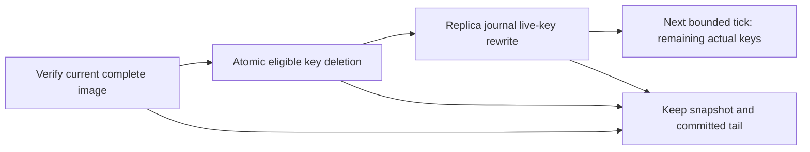

# ClusterReplication

Status: implementation in progress. Owner: KeyLoad lead. The owner's Orleans-only correction supersedes the DotNext candidate in architecture v0.3. Decision: [ADR-036](../ADR/ADR-036-orleans-foundation.md).

REQ-REP-052 / AC-DBHP-001..008 adds the accepted preserving
[bounded replica term metadata](ClusterReplication/ReplicaTermMetadata.md) work
under [ADR-061](../ADR/ADR-061-bounded-replica-term-metadata.md). This private
node-log scalar observation retains actual provider read checks and both public
authorized quorum barriers. Implementation/native performance proof remains open.

| Requirement | Acceptance and observable evidence |
|---|---|
| REQ-REP-001: Orleans carries votes, ordered appends, read barriers, forwarding and snapshot transfer. No DotNext runtime/package remains. | AC-REP-001: dependency/source inventory contains no DotNext reference; three Docker silos accept .NET SDK operations through request grains. |
| REQ-REP-002: terms, votes, log entries and commit positions are node-owned and process durable before acknowledgement. | AC-REP-002: real-process append/vote/commit interruption tests reopen the acknowledged prefix and reject complete-record corruption. |
| REQ-REP-003: an odd fixed RF3 voter set commits only with a majority; a current-term quorum barrier precedes public reads. | AC-REP-003: leader kill preserves acknowledged commands and stable-ID outcomes; an isolated minority rejects reads and writes. |
| REQ-REP-004: a restarted/empty replica catches up by a verified bounded snapshot followed by the ordered tail. | AC-REP-004: SDK-visible documents, topic/checkpoint/outbox/inbox outcomes survive replica erase/restart; interrupted/corrupt transfers preserve a complete recoverable cut. |
| REQ-REP-005: replicated principals and grants remain authoritative, including after leadership changes and snapshot catch-up. | AC-REP-005: SDK/MCP unauthorized and protected-field requests fail without canonical effects before and after failover. |
| REQ-REP-006: bounded anti-replay admission retains reserved capacity for votes, heartbeats, noop/current-term establishment and membership/lease control when application traffic saturates. | AC-REP-006: signed replay/tamper requests are rejected; saturated forward/read/data-append traffic is throttled without exhausting control capacity; real RF3 client load preserves leadership and minority denial. |

Slice map: `src/KeyLoad.Replication/Features/ClusterReplication/` owns protocol/log contracts and coordination; `src/KeyLoad.Orleans/Features/ClusterReplication/` owns the per-silo service/transport; `src/KeyLoad.AppHost/Features/ClusterReplication/` owns Docker resource composition; recovery and integration tests mirror `Features/ClusterReplication/`. Node storage adapter remains StorageRecovery. Frontend: N/A, this protocol has no UI. Public client shapes: existing ClientApi contracts; user-visible guarantees remain stable.

Traceability: AC-REP-001/003/004 map to `ClusterTests` and the new replica recovery tests; AC-REP-002 maps to real CrashHost interruption scenarios; AC-REP-005 maps to authorization/failover client cases. TASK-REP-LOG, TASK-REP-TRANSPORT, TASK-REP-INTEGRATE and TASK-REP-VERIFY are defined in [execution plan](../ADR/ADR-036-orleans-foundation.md). Qualification is GitHub Actions only. Historical CI 36926803549 qualifies the old implementation, not this replacement. Power-loss and endurance remain pending.

TASK-RUNTIME-REPLICA-READINESS-W4 maps REQ-REP-004 / AC-REP-004 and
REQ/AC-STORAGE-012. Exact main b533c80 / CI37032546228 fails the Windows
SnapshotInstalled reopen on target/database/tree/0.meta.wal; the prior two-store
barrier probes only owner.lock and commands.wal. Root replaces each store's
probe with the shared StorageRecovery exclusive-file probe, including metadata
when present, inside the existing single five-second/25ms loop. Cancellation
stops before another probe. No file creation, recovery retry, timeout increase,
weakened snapshot/tail/receipt predicate or attribution of the unknown holder
is permitted. A disjoint test worker owns new ClusterReplication real-file
barrier cases: hold canonical or replica metadata exclusively, verify pending
then release and success; cancel a held wait and pre-cancel an unlocked wait;
assert a permanent holder still fails under the unchanged bound. Use actual
closed CrashHost target stores and observe/dispose pending tasks and holders
before deleting their root. Existing native SnapshotInstalled process-kill and
ordered-tail tests are the primary regression. ADR-035/036/041 ownership and
lifetime contracts suffice; public/data/dependency boundaries are unchanged.
Root reviews both helper/caller scopes together, development-builds/formats,
and qualifies the full three-OS recovery suite in GitHub at the delivered SHA.

The same W4 criterion includes exact1bee2609 / CI37036628601's source-store
reopen failures. For the six typed snapshot/transfer crash boundaries, the child
also opened `source/database` and `source/replica`. Enumerate these exact owned
stores alongside the target stores inside the same single five-second/25ms loop.
Use the crash boundary's explicit source-ownership contract, never filesystem
existence to decide whether required ownership/journal files are optional. Other
boundaries retain their target-only path and must not create source storage.
Root owns the CrashHost store-path/source-boundary helpers, preserving the
existing scenario predicate, and ReplicaProcessTrial/ReplicaProcessFiles join.
The disjoint readiness test worker extends only its real-store fixture and cases:
each source canonical/replica owner, journal and metadata holder keeps the actual
combined wait pending until released. Existing source snapshot import and private
transfer crash cases remain the primary regression and retain all assertions.

The two permanent-holder elapsed checks and StorageRecovery's two missing-required-
file arguments retain their five-second lower and six-second upper observation
bounds. Run only those individual wall-clock measurement cases with TUnit's
keyless method-level `NotInParallel`, which the
pinned1.72.10 package documents as exclusive execution. Exact Windows evidence
shows the failed check overlapped74 distinct cases with16 active at peak; timer
or continuation delay is a supported inference, without a threadpool trace.
No class/assembly serialization, retry or timeout increase is allowed. Other
holder-release/cancellation tests and every real process crash remain parallel.
This is intrinsic readiness timing qualification, not a loaded-system latency
claim. Source review, native case discovery and full exact-SHA CI must verify
that the same bounds and all original crash cases remain.

TASK-RUNTIME-MAC-FIXTURE-W6 refines AC-REP-004 / AC-STORAGE-012 after
exact323d60499 / CI37044499074. All11 new macOS readiness cases fail during
construction at ReplicaSnapshotFiles.RejectLinks' reparse-point rejection,
before snapshot-data or readiness predicates. The fixture allocates an unresolved
system temp path; macOS temp aliases are the source-supported cause, while the
native report does not expose that run's exact TMPDIR. Reuse CrashHost's existing
ReplicaFixturePaths.NewDirectory for the fresh owned root, as other real replica
fixtures already do. It resolves existing directory ancestors using native .NET
ResolveLinkTarget before the private root is created; production RejectLinks
remains unchanged and fail-closed. Preserve one root, shared incarnation, both
target stores and required source stores, closure order, actual exclusive holders,
waits/assertions and owned cleanup. No second resolver, guard bypass, dependency,
public contract or persistence migration is introduced. The worker owns only
ReplicaFileReadinessStores; root owns contract/diff/evidence integration. All11
formerly red native cases plus original snapshot/tail/process recovery across
three OSes are the regression matrix. AC-REC-FUP-001 requires the existing
physical-temp helper and unchanged fail-closed guard; AC-REC-FUP-002 requires the
same genuine source/target stores, incarnation, holders, assertions and cleanup.
Either criterion fails on setup rejection, changed ownership or leaked work;
all11 native cases and original snapshot/tail cases must pass. ADR035/036/033 cover this preserving private
fixture reuse; rollback reverts only the allocator call. Environmental path or
cleanup failures require source lifetime review rather than a synthetic injector.

## Actors, entry points and failure boundaries

Actors are authenticated SDK/MCP callers, the node-local replica host, fixed voters, the membership provider and the recovery operator. Current source is composed by [ServerApplication](../../src/KeyLoad.Server/Features/ClientApi/Hosting/ServerApplication.cs): it starts the node-local [PartitionHost](../../src/KeyLoad.Server/Features/StorageRecovery/Hosting/PartitionHost.cs) and Orleans silo, whose [replica service](../../src/KeyLoad.Orleans/Features/ClusterReplication/GrainServices/PartitionReplicaGrainService.cs) routes peer operations. Aspire declares three Docker nodes with separate data mounts. This source is not yet qualified as a delivered RF3 deployment: current tests do not force request-activation migration and then verify storage ownership and a durable caller-visible outcome. Public HTTP/.NET transport belongs to ClientApi; required official MCP parity is pending. Frontend is N/A because replica consensus has no independent UI. Shared contracts stay in Abstractions and the exact ClusterReplication/StorageRecovery slice owners above.

Positive flow: an authorized command reaches its own request grain, the physical host orders and persists it, a majority crosses the declared acknowledgement barrier, and canonical apply returns the stable outcome. Negative flow: minority, stale term/owner, invalid peer MAC/replay or denied principal cannot establish committed success. Edge/error flow: an unknown response is resolved by stable command ID; interrupted/corrupt append or snapshot reopens one verified cut or fails explicitly; cancellation drains owned work without transferring locks to a migrating activation.

TASK-RF3-ELECTION-RETRY-R80 preserves AC-REP-003 after exact2ecbeee4d /
run37093992229/job111123331985:62 of63 tests passed, and LeaderLossScenario queue
Receive returned UnknownWriteOutcome with the documented same-command-ID retry.
Freeze queue Receive/Processing and projection replay requests before using the
existing election helper, as subscription writes already do. Preserve its strict
UnknownWriteOutcome/OwnershipLost whitelist,250ms cadence, original two-minute
scenario deadline and every receipt/single-delivery/ACK/minority/recovery oracle.
No new IDs inside retries, added sleeps, product retry/shim or exception waiver.
Existing leader-kill RF3 is the failing regression; actual later delivered-SHA
GitHub RF3 success closes it. Cohesive LeaderLossQueueScenario owns only this queue
flow, called with the existing fixed collection/queue names; all original exact
data/effect/ACK checks remain, while the original scenario stays under200LOC.
ADR-003/007/036 cover the unchanged fault contract.

AC-REP-006 additionally maps to existing cryptographic/replay source cases in the [ClusterReplication unit slice](../../tests/KeyLoad.UnitTests/Features/ClusterReplication/) and planned real RF3 saturation/failover cases. Pure envelope tests do not prove liveness under load. Every acknowledgement/recovery assertion needs the exact delivered GitHub run; fault/endurance/power-loss claims remain separate.

Related invariants: [ADR-003](../ADR/ADR-003-durability-ack-barrier.md) ACK/profile barriers, [ADR-007](../ADR/ADR-007-replica-consensus-bootstrap.md) consensus/bootstrap, [ADR-016](../ADR/ADR-016-atomic-physical-placement.md) atomic identity/placement and [ADR-017](../ADR/ADR-017-ownership-session-tokens.md) current ownership-session tokens. Physical movement must preserve or explicitly invalidate those tokens under its separately qualified contract.

TASK-REP-DISCOVERY removes the obsolete HTTP consensus/body-spooling protocol.
PeerSecurity authenticates only a bodyless GET of /internal/silo with no query;
native signed envelopes own votes, append payloads and snapshots. The discovery
signature binds a versioned purpose, exact method, recipient authority, path,
timestamp and nonce. A fixed-capacity nonce table rejects saturation explicitly,
retains a nonce through its inclusive future validity, and does not admit malformed
or forged requests. The clock is injected TimeProvider.System in production.
Real request-object security cases cover tamper/replay/expiry/body/path/method and
capacity, while RF3 CI exercises the genuine sockets and signed discovery reply.
No HTTP handler fake or legacy body fallback remains.

## Bounded intentional restart health wait refinement

REQ-REP-050 maps to AC-REP-050 and AC-ISO-004: after a deliberate native Docker kill
and one Aspire Start command, health waiting uses the native recovery wait behavior
with the original cancellation/deadline. Old unavailable logical-resource snapshots
must not immediately abort a requested restart. Actual healthy result, fresh Docker
Running/changed-start/source identity, public SDK readiness, persisted command/data/
subscription/outbox recovery and minority rejection remain required. Initial startup
keeps its existing fail-fast behavior; no retries, longer deadlines or swallowed
failures. Existing `ReplicatedAtomicBatchSurvivesLeaderContainerKillAndMinorityRejectsWrites`
is the real acceptance regression, executed in exact-SHA Linux RF3 CI. TASK-AISQL-024
retained run37072003906 evidence supports stale-terminal handling; exact selected
Aspire event generation remains unproven. TASK-AISQL-025/root owns only the two
post-restart health waits; ADR036 existing lifecycle contract is sufficient, new
architecture ADR:N/A. Qualification remains pending.

## Atomic checkpoint metadata publication

REQ-REP-051 maps to AC-REP-051: every node shares one log-owned protocol gate for
term/append/follower planning and checkpoint metadata publication. Real canonical
snapshot capture/verification/install IO remains outside that gate. A checkpoint
cannot advance the compacted cut between an authenticated protocol operation's
metadata, term and suffix reads; ordinary concurrent publication cannot poison a
healthy replica. The materializer borrows the gate, drains its apply work and does
not dispose the log owner's gate; physical log disposal closes it after consensus
and materializer drain. Existing snapshot cut, tail, quorum, incarnation, transfer
and process-durable acknowledgement rules remain strict.

AC-REP-051 requires tests on genuine ZoneTree log/canonical stores proving the same
gate instance, blocked metadata publication while a real planning scope is held,
then exact verified snapshot publication/tail read and preserved metadata after
release. Cover direct Create and completed incoming transfer publication,
successful and faulted materializer disposal, and actual log-owner closure. Existing
process-crash/snapshot tests and 1/2/3 native intensive seeding/read plus RF3 SDK/MCP
fault gates must pass at the repaired SHA. TASK-ISO-016K-F and ADR007 own the ordered
contract; no injected storage substitute, silent retry, lost cut or changed quorum
is acceptable. Source races are established independently from the unresolved
cf630 OwnershipLost runtime attribution; exact native node logs remain necessary.

TASK-REP-MATERIALIZER-FAULT-ORACLE refines AC-REP-002/004/051 without changing
production shutdown. In the real ZoneTree JournalFlushed failure flow, the pending
apply waiter must fail with RecoveryRequired and the memoized disposal task must
preserve its original UnknownWriteOutcome. Successful resource cleanup does not
require a successful terminal task. Assert repeated disposal observes the same
original exception, the borrowed log gate stays usable until its physical owner
closes, and reopening retains the committed prefix and storage identity.
The lifecycle fixture may acknowledge only that exact terminal exception after
the scenario has asserted it; any different exception, unasserted failure or
independent owner/directory cleanup error remains fatal to the test. Keep the
normal/concurrent disposal and filesystem-failure regressions. The owning paths
are RecoveryTests/Features/ClusterReplication/Cases/ReplicaMaterializerLifecycleTests.cs
and Fixtures/ReplicaMaterializerLifecycleFixture.cs. Native TUnit recovery and
exact-source Linux recovery reports qualify this test correction; they do not
close RF3, endurance or power-loss gates. ADR-007 preserves the failure contract.

## TASK-ISO-021 accepted application/control read separation

REQ/AC-REP-006 and AC-ISO-003/004/005 remain the correctness/qualification gates.
Source b474 proves application quorum rounds spend Critical capacity via empty
Append. Actual native RF2 OwnershipLost/RF3 ResourceExhausted do not yet prove
which replay pool first overflowed; preserve that uncertainty and failed samples.

Append signed method ordinals ReadProbe=7 and ControlReadBarrier=8; old0..6,
envelope version, exact HMAC method binding, generation, nonce, freshness,
full-lifetime cross-method replay and durable formats stay unchanged. ReadProbe
uses the existing strict AppendRequest parser with initialized empty Entries
and declared LeaderId equal to authenticated sender. Any data/control entry,
default/null entries, malformed/duplicate/unknown/trailing field, invalid header
or over-budget body fails before receiver/ObserveLeader/state mutation. Valid
ReadProbe consumes ReadBarrier. Ordinary heartbeat/control empty Append stays
Critical. Application-origin nonempty catchup fallback uses empty ReadProbe;
control/write fallback keeps ordinary Append. Snapshot/data semantics unchanged.

ReplicaLeader uses an internal closed purpose, never a public caller flag.
ReplicaConsensus adds trusted ReadControlBarrierAsync sharing the actual bounded
read core/readiness/activity/lifetime/10s/quorum/term/cut/apply semantics. Remote
control uses signed strict-empty-string ControlReadBarrier/Critical; local
control round uses ordinary empty Append. Existing public ReadBarrier retains
application purpose. No ICommitCoordinator/HTTP/SQL/SDK/MCP/authorization change.

ReplicaMembershipTable constructor now requires the actual ReplicaConsensus
instead of IReplicaEndpoint; the sole production construction already supplies
partition.Consensus. Change the source signature coherently, with no legacy
overload/cast/compatibility fallback. ReplicaMembershipStore receives that same
node-owned consensus and calls trusted control read; membership writes retain
coordinator/atomic CAS. Preserve true caller cancellation; independent native
deadline/lifetime cancellation maps OwnershipLost as the original coordinator.

Disjoint ownership: root enum, strict Orleans replay/sender classification,
membership source join, fixed quota diagnostics, benchmark-only profile/env,
shared docs and integration. gates_audit owns Replication ReplicaConsensus.cs,
ReplicaLeader.cs, ReplicaFollowerSender.cs, ReplicaRequestDispatcher.cs and NEW
cohesive prefixed purpose/guard helpers plus NEW focused real-node tests under
RecoveryTests/Features/ClusterReplication. Escalate if a test needs a shared
fixture edit; no synthetic successful transport, gate/quorum/term/retry relaxation
or public/shared abstraction edits. Tests first use actual stored nodes and
real protocol. Root new security TUnit tests cover valid signed methods, empty
guards, wrong sender/MAC, malformed/nonempty/null fields, cross-method replay,
separate capacity denial and unchanged old method/data/snapshot classification.

Quota diagnostic snapshot is captured atomically at capacity denial and emitted
after the lock: configured numeric sender index, closed method/pool, counts and
limits, Unix timestamp/oldest expiry. No identity/address/nonce/payload/credential/
exception text. Fixed per-sender/pool state emits first then at most once30s,
with saturating suppressed count; no success-path allocation/unbounded keys/IO.
Original authenticated ResourceExhausted classification remains unchanged.

Benchmark-only ReadBarrierPerVoter196608 with original Critical16384/Forward32768/
DataAppend32768 yields278528 per voter,835584 per RF3 node, below1048576.
Production defaults stay unchanged. Retain actual rolling occupancy/expiry and
exact node config; this arithmetic does not guarantee complete CRUD/queue cells
or throughput. Every public successful call still performs two authorized
quorum barriers; do not remove persisted authorization or cache it here.

Ordered stages: failing acceptance-derived tests; bounded source implementation;
root review/build/format/governance; exact-SHA full normal/scalar/138 recovery/
RF3 and native KeyLoad1/2/3; then genuine control-pressure/failover proof and
all270 before aggregation/site. Native control execution/membership-under-load
observer remains a separately frozen required join, not inferred from admission
or absence of warnings. Public auth/lease reserve liveness remains unqualified.
All test/runtime execution is GitHub only. Homogeneous all-voter rollout and
rollback preserves local stores/journals; old nodes fail closed on new methods,
no mixed-version availability promise. ADR remains Accepted pending all evidence.

TASK-ISO-021R source review closes the new-method index overflow boundary:
ReadProbe rejects PreviousIndex=Int64.MaxValue before replay admission, even
with otherwise valid positive term/previousTerm and empty entries. Genuine
signed MaximumPreviousIndexFailsBeforeReplayAdmission asserts Validation and
both one-slot pools remain available. Existing Append semantics are unchanged.
Source review also confirms fixed rate state/atomic snapshots and actual native
DI/Consensus ownership; native control-under-load and provider-failure evidence
remain open, with no inferred successful runtime result.

## Embedded final clock ordering, TASK-EMBEDDED-CLOCK-ORDER-001

EmbeddedCoordinator is the product-owned real standalone admission coordinator over DatabaseEngine and its native ZoneTree Store.Commit gate. For coordinator-owned JSON/native submissions, bounded validation/normalization stays before commit; the final EvaluationClock.GetUtcNow sample is selected inside the original Store.Commit callback immediately before the existing ApplyCommittedCommand. Retain exactly one commit and the shared authorization/outcome/fingerprint/strict ValidateCommandClock pipeline. Public Apply(ReplicatedOperation, replicationIndex) retains supplied canonical EvaluatedAt unchanged. This matches RF3 ReplicaLeader final timestamp selection under rounds and state.LockedAsync before ordered append; embedded ownership does not qualify RF3. No clamp, retry, backward-clock acceptance, fence reset or second coordinator lock is allowed. Cancellation is rechecked inside admission before clock selection; synchronous original apply settles before return. TASK-EMBEDDED-CLOCK-ORDER-001 maps REQ-REP-001 and AC-REP-001, and native durable-job clock/owner contracts under ADR-028/ADR-110. Preserve original R308 four journal-fence failures. Root validates all five NativeSagaTimeoutFunctionalTests actual native job operations, plus existing strict stale-clock/replay tests, normal/scalar and required Linux/RF3 gates. No result or source review closes these runtime predicates.

## TASK-KL009-NATIVE-APPLY-SCOPE-001 (follower-owner implementation contract, 2026-10-07)

REQ-REP-APPLY-SCOPE-001 / AC-REP-APPLY-SCOPE-001 binds original KL009 to a genuine node-local canonical apply owner and real independent replica-network progress. Preserve native ZoneTree, original ordered commit/apply gates, deterministic replay, bounded admission, RF3 acknowledgements and separate authenticated request grains. This is authored acceptance infrastructure; Linux/native execution and original task closure are not claimed.

Docs-first current private-format boundary: all RequestCqrsProbe owner/arm/release/marker producers/readers select version2 and reject version1 without fallback, migration or mixed records. Original request/read phases retain exact original semantics with nullable new arm fields all null and marker EntryIndex/EntryTerm null. CanonicalJournalFlushed is Hold-only and requires complete four-scalar Partition, nonempty SourceRequestId, distinct nonempty SourceArmId and exact TargetVoter. CanonicalOutboundObserved, CanonicalIndependentAppendCompleted and CanonicalOwnerDisposed are unarmable observation-only phases. Canonical markers contain positive real entry index/term and the genuine original request actor ID. Release still addresses the exact arm/request identity. Keep original 32-arm, 400-file, 8-marker, 8192-record-byte, 1048576-aggregate-byte and depth4 ceilings, original component/principal byte bounds, hold/poll/admission/shutdown deadlines and validated configurable lower bounds. No status/receipt is invented.

Identity bridge is bounded test control, never authority: the original real BeforeSubmit Hold publishes its actual signed-voter request actor marker. While held, the fixture writes a distinct canonical arm referencing that source BeforeSubmit arm, principal, stable Batch CommandId, observed actor ID, complete partition and an explicitly observed nonleader voter. Both arms retain their original immutable bytes until joined shutdown. The actual Channel worker opens its own synchronous scope from the genuine ReplicaEntry Id/index/term and exact physical voter plus active source arm. No request ExecutionContext/AsyncLocal propagation across Channel is assumed and no synthetic actor ID is created. Actual Database.Apply retains original persisted authorization, identity/fingerprint/replay and strict clock validation; only its construction-owned native JournalFlushed FaultObserver may hold that owner. Unmatched bootstrap/recovery/job/store work has no hold and the replica store gets no callback.

Independent network evidence is produced only by actual PartitionReplicaGrainService.ExchangeAsync after peer request authentication, original readiness/admission/native endpoint validation and successful signed reply construction. Begin captures the same currently held follower owner; completion decodes only already-admitted request/result bytes and requires an accepted empty native Append, exact term and matched/next position, with prior/committed cuts covering the held genuine entry. Completion must still see that exact held scope. Failed/cancelled/rejected exchanges do not qualify. It emits one bounded presence marker, never credentials, payloads or invented counts. Actual ReplicaGrainServiceClient.InvokeAsync separately observes any external invocation originating in the explicit canonical apply scope; any such marker fails acceptance. The real native RPC boundary is used, not HTTP discovery or a replacement transport.

The leader-owned draft cannot qualify this operation: ReplicaLeader owns rounds through WaitForApplyAsync, and that waiter synchronously reads canonical LastApplied. The accepted proof therefore holds a follower, leaves leader semaphores/cancellation untouched, and avoids node Status/State calls while held (they may read LastApplied under ProtocolGate). Discovery/leader identity is captured before the hold. Original health/readiness routes remain unchanged.

Lifetime: the physical host owns bridge, real materializer worker, storage callback and DI observer. Real GrainService construction resolves the observer before accepting replica RPC, including followers without a local public request. One exact scope owns hold, origin observation and callback admission, restores its prior execution context, writes canonical-owner disposal and joins original callback lifecycle. Synchronous apply errors and scope cleanup errors both propagate, preserving original failures; no second commit, retry, lock change, cancellation clamp or timeout increase. Existing host stop cancels hold and joins callbacks/materializer before store disposal. The fixture releases both arms, joins the actual SDK operation and original request producer plus canonical owner before deleting owned controls/resources.

Whole flow: actual Aspire current-image RF3, persisted non-admin principal and document+queue scope, original SDK atomic Batch, original signed BeforeSubmit marker, native follower JournalFlushed marker carrying real entry index/term, accepted authenticated Append settlement while held, and absent canonical-origin outbound evidence. Original leader SDK receipt must be successful under unchanged deadlines. Release the exact canonical arm and join its owner; verify independent literal complete document (reference/revision/JSON/redaction/empty fields) and queue inspection metadata/body/headers through SDK and official MCP. Assert exact receipt effects and native-byte same-ID SDK/MCP replay, changed-payload conflict with unchanged public state, then distinct healthy queue continuation. This proves the full scoped public projections, not a complete raw-store image or power-loss durability.

Owned paths: Replication ClusterReplication real ApplyBatch/worker scope; Orleans ClusterReplication real GrainService incoming/outgoing transport; Server ClusterRouting existing private control codecs/lifecycle and observer composition; Server StorageRecovery physical host/native storage callback; AppHost ClusterRouting strict current owner reader; IntegrationTests ClusterRouting actual Aspire wave/probe/SDK/MCP helpers; UnitTests ClusterRouting bounded private codec-negative control. That unit codec case is supporting infrastructure, not a product coverage contributor. Root-only format/full build, genuine new census/source-image binding, focused native codec in normal/scalar, existing probe request/read/fault flows, new current-image RF3 operation and mandatory full normal/scalar/recovery/RF3 gates remain required. No numeric coverage or successful native execution is claimed. Rollback removes the same-current private diagnostics coherently; persisted database, replication/native binary/public JSON formats and authorities are unchanged.

## TASK-KL020-ORIGINAL-ACCEPTANCE-CLOSEOUT-001

The original KL-020 acceptance in architecture-v0.3.uk.md is independently
qualified at source 4e18ba1ba29ae31970302e6bfa43ad9c04ead7e0 by the original
Linux [RF3 job 112948482972](https://github.com/managedcode/KeyLoad/actions/runs/37666943488/job/112948482972).
`ClusterTests.ReplicatedAtomicBatchSurvivesLeaderContainerKillAndMinorityRejectsWrites`
passed through the actual fixture-owned Aspire three-voter topology. It commits
an acknowledged QuorumProcessDurable document/event/queue/topic batch, kills the
elected container, retries the frozen command ID and compares its original token
and one document revision/one queue delivery, then observes processing and
subscription/projection effects. It kills the second voter, rejects both a strong
write and read, restores both voters, verifies the minority document remains
absent and checks replicated revisions and checkpoints across all three nodes.
This maps the three original task criteria to REQ/AC-REP-003.

The immutable original required RF3 TRX digest is
`8c9eb6c1b6fad38a0dd8532ea8f375465623939ef7784d9bb9ba9e24f938f75c`;
the original native RF3 test-image observation digest is
`086f26313d9d9311bcb544bf33290a90e51ebd49dd3d1f2d56d06a95a1d34c72`.
Its exact test/helper declaration hashes match original native PDB documents;
the operation bodies remain unchanged. Fixture and product sources have later
changes: this is an original task/source qualification, not current whole-module
equivalence. Required RF3 was 173/183 passed with ten retained failures; covered
RF3 was 0/11 due to selection admission. Consensus fault/unacknowledged-entry,
power-loss, endurance, performance, coverage and broader feature gates remain
open under their owning criteria. No failed report is promoted to full-suite PASS.

KL-021 remains open: the passed scenario performs ordinary quorum reads, not a
read carrying the previous commit/session token. Current GetDocumentRequest has
only EntityRef and the SDK GetAsync has no minimum CommitToken argument. Public
token-bound failover read and wrong-incarnation rejection need a frozen ClientApi
read-admission contract and actual SDK/MCP operation proof; internal token
validation and receipt equality do not supply that missing public flow.

## TASK-KL021-DOCUMENT-SESSION-READ-001

Accepted homogeneous first-release document session-read implementation contract; runtime qualification remains open.

REQ-SESSIONREAD-001 / AC-SESSIONREAD-001: Only document GET gains optional typed GetDocumentRequest.MinimumToken at generated native Id1, keeping Reference Id0 and alias. SDK explicit GetAsync(EntityRef, CommitToken, CancellationToken), HTTP/official MCP keyload_documents_get and Q1 CALL keyload_documents_get(@arguments) decode the exact same typed request via existing canonical catalog; absent option remains ordinary strong GET. This is not generic model/session cache support and does not add a dispatcher.

REQ-SESSIONREAD-002 / AC-SESSIONREAD-002: The existing unique request/read grain obtains fresh native quorum barrier under original bounded ReplicaReadRoundExecutor timeout, including existing actual WaitForApplyAsync(barrier.Position). Afterwards document execution reloads persisted principal/grants and validates minimum token in the exact same native Store.Read cut as row/field authorization and document projection. Token must match database incarnation, exact atomic partition and current persisted ownership epoch; position must be positive and no greater than actual lastApplied at that cut. This barrier applies the current quorum commit cut, hence it already meets every previously acknowledged minimum token. A token beyond that fresh applied cut is explicitly rejected; there is no speculative wait for a caller-invented future position. No physical-lineage translation, stale-mode API or authority cache is added.

REQ-SESSIONREAD-003 / AC-SESSIONREAD-003: Explicit existing TokenInvalidated category with distinct fixed safe reasons WrongIncarnation / OutOfScope / FuturePosition / InvalidPosition identifies token failures without exposing token values/credentials/records. Missing/corrupt applied authority is Corruption; unsupported ownership epoch is OwnershipLost or token invalidation per current placement witness policy. Persisted authorization is checked before token failure reasons; denial contains no row. Caller cancellation checked before admission and inside final cut, no partial result; native deadline/admission/drain unchanged. Former leader with no quorum cannot pass existing fresh barrier even for a valid historical token.

REQ-SESSIONREAD-004 / AC-SESSIONREAD-004: Real ZoneTree local whole flows prove literal document/complete state+position unchanged after invalid incarnation/scope/future/position and pre-cancel, fresh authorized minimum succeeds and later revision continues. Real fixture-owned Aspire RF3 SDK+official MCP failover operation proves acknowledged write token→elected leader kill→token-bearing complete literal healthy read→all invalid variants fail→healthy token read; isolated former surviving leader/minority strong token read fails, both voter restoration and healthy read follow. Existing native receipt replay/Unknown scenarios remain separate and unchanged. Auth revocation must deny valid token then renewed persisted grant/healthy read.

Ownership: Abstractions DocumentStorage DTO; Client overload; Core feature-local same-view validator and Documents reader; Orleans existing GrainCoreReadCapabilities routing; docs ClientApi/DocumentStorage/ClusterReplication + ADR017/036 amendment; unit DocumentStorage and RF3 ClusterReplication wholeflow. SQL Q1 CALL is exact typed operation envelope only; Q1 SELECT/AST and other read models do not accept session options in this stage. Same homogeneous current first-release cohort; native Id append/alias remains stable, no legacy reader/migration/runtime fallback. Root owns join/build/native discovery/test/Linux evidence and status; no qualification or closure inferred from authored source.

## Proven epoch meaning before implementation

DatabaseEngine.Token in Core/DatabaseEngine.cs obtains OwnershipEpoch from persisted ReadPlacementWitness.PlacementEpoch. AtomicPartitionPlacementReader Fallback/Explicit uses PhysicalShardCatalog.DefaultShard.PlacementEpoch; PhysicalShardCatalogRecordSerialization.InitialRecord initializes that physical-placement value. ReplicaElection.RunRound changes DurableReplicaLog term/vote, not physical catalog. Original authenticated 4e18 RF3 passed LeaderLossQueueScenario compares the entire pre-kill commit token to the actual replay token after elected leader kill. Hence elected leader failover keeps physical PlacementEpoch, and equality does not invalidate that acknowledged token. The new public wholeflow additionally checks a fresh postfailover command retains the same physical epoch/incarnation/atomic identity. Physical ownership movement with a changed placement epoch is explicitly unsupported by this minimal surface; it fails closed without invented lineage, and does not claim KL035/036/072 movement support.

The current native fixture supports Kill/Restart and retains actual owner receipts.
The authored authority-denial flow is a still-live surviving voter without quorum,
not a network-isolated former leader while another majority stays live. That
stronger KL021 authority scenario remains open until a bounded fixture-owned
network partition contract exists; no manual Docker or new fault hook is added.
Fresh barrier implementations are ReplicaReadRoundExecutor + ReplicaLeader.BarrierAsync:
both use native Materializer.WaitForApplyAsync at their authenticated quorum cut.
SDK method ownership is Features/DocumentStorage/Transport/DocumentSessionClient.cs.

### Native MCP no-quorum boundary refinement

McpHttpPipeline.RunAsync invokes DatabaseCredentialResolver.ReadAsync before
native tool dispatch. Its fresh signed Authenticate read itself needs quorum.
Therefore the no-quorum official caller must retain the actual native
HttpRequestException HTTP503 rather than invent a CallToolResult error; SDK
GET still asserts its actual typed OwnershipLost problem. The healthy
restored token-bearing SDK/MCP/SQL results remain complete literal checks.
This is not a tool outcome or session initialization success claim.

The final no-quorum oracle retains both SDK's exact OwnershipLost/503/NoLeader
problem and the official caller's actual native HTTP503 original exception,
with its bounded five-field Problem body and credential/document privacy checks.
It never converts that pre-tool HTTP failure into a fictitious tool result.

## TASK-KL021-OWNED-SILO-ISOLATION-002 — accepted namespace control implementation contract

REQ-MTOKEN-ISOLATION-003: native fault image derives from the exact existing Dockerfile pinned aspnet/runtime and server build. A dedicated feature-owned fault Dockerfile derives from the authenticated exact server @sha256 image receipt; fault-runtime installs native iptables and a bounded coreutils timeout wrapper as container UID0 at image build, then restores APP_UID. Normal root Dockerfile and its runtime final/default target remain byte-for-byte unchanged and receives no fault tools or capability changes. Aspire13.6 public WithDockerfile(context,Dockerfile,stage:fault-runtime) owns the selected three-node image build/start; WithContainerRuntimeArgs adds only NET_ADMIN to these exact owned resources. No privileged, host network/PID namespace, production default changes, manual topology, image digest fiction or whitelist expansion. Tool version/package/license and base/build/image/config identities are actual build/start receipts, not inferred from a web page.

AC-MTOKEN-ISOLATION-003: fixture opts into a separate owned native fault wave and requires Linux/running container Config.User APP_UID, only admitted additional capability NET_ADMIN, no Host/PID/shared namespace, exactly three model names and matching incarnation/config image/build source. Before every firewall mutation re-inspect owned ID/name/image/config/incarnation and verified unique IPv4 endpoints; reject malformed/ambiguous/IPv6/foreign source rather than accepting alias fallback. Native discovery SiloAddress IP/port must match inspected network address TCP11111; HTTP8080 endpoint remains discovered from Aspire. Unconfigured standard/default/covered fixtures cannot acquire this fault capability.

REQ-MTOKEN-ISOLATION-004: create unique per-run bounded-length chains inside only the old leader's network namespace. For each of exactly two owned peer IPv4s, INPUT source and OUTPUT destination rules block both sport11111 and dport11111; attach those exact chains first in the corresponding chain so existing connections and both directions are isolated. HTTP8080 remains outside all rules. Record chain/rule mutation intent BEFORE execution and actual exit/output/check receipt before next mutation, including partial chain creation/jump install. Never flush shared INPUT/OUTPUT rules or unrelated chains. Restore only own exact jump/rules/chains and verify absence.

AC-MTOKEN-ISOLATION-004: native docker exec --user0 uses inspected full owned container ID, executable argument list, no shell interpolation, no detach/privileged. Image timeout wrapper bounds remote iptables work; xtables lock wait fits within it. Host original exec task and bounded stdout/stderr readers remain owned and are actually joined even after initiating cancellation, then partial intents reconcile against native exact chain/rule state before restore. Docker CLI cancellation alone is not evidence of remote exec completion. Unsettled original remote/host work retains primary/cleanup/resource/image ownership and fails; never restores over an in-flight mutation or deletes retained receipts. Actual counter/rule checks and genuine surviving-majority new-term ACK provide fault proof, not HTTP reachability alone.

AC-MTOKEN-ISOLATION-005: real SDK/officialMCP whole-flow uses current optional MinimumToken public contract: original canonical command ACK/token; exact old leader/container/native term; namespace isolation; actual different surviving leader/newer term and majority ACK of one immutable next command; reachable running old leader rejects token-bearing strong read with exact native no-authority error, no stale/partial body; same exact nodes/rules restored and joined; literal current document/revision/token/receipt and healthy reads across restored replicas. Existing parent/start/cleanup deadlines unchanged, no timer sleeps or generic retry-to-green. Any canonical UnknownWriteOutcome is preserved and reconciled only under existing original-ID/receipt contract, never replaced by fresh IDs or fabricated ACK.

Public API evidence: Docker documents container exec UID selection and non-detached process lifetime at https://docs.docker.com/reference/cli/docker/container/exec/ ; namespace isolation and NET_ADMIN (rather than privileged) at https://docs.docker.com/engine/containers/run/ . Pinned Aspire13.6 local XML advertises WithDockerfile stage/build-before-start and WithContainerRuntimeArgs; these are source/API evidence, not native execution. Netfilter upstream https://www.netfilter.org/projects/iptables/index.html owns rule manipulation semantics. Current tool package version/image ID/namespace behavior will be measured in root's genuine native build/start gates; no runtime availability claim before execution.

Ordered ownership: docs/ADR017 contract precedes Dockerfile fault-only stage and AppHost ClusterReplication resource composition helper. Integration ClusterReplication models/lifecycle/processes own exact node/image/IP/chain/rule receipts, original process/readers and restoration; owning case/flow consumes disjoint KL021 MinimumToken API packet. Root joins source/serialization/API paths coherently, builds and runs actual native Linux RF3. Source/API readiness, functional proof and all broader endurance/performance gates remain distinct; no KL021 task closure from authored code.

REQ/AC-MTOKEN-ISOLATION-006: NodeStatus gains additive native Id9 ConsensusTerm, verified free after existing IDs0..8. NodeAdministration.StatusAsync copies Term from the same existing locked partition.Consensus.StateAsync snapshot used for Leader/Applied. Current persisted authorization, separate request grain, readonly status semantics and native/public serializers remain unchanged. Purpose is authenticated operational authority diagnostics, not a test hook. Original ACK and actual new-majority ACK whole-flow requires positive original term and strictly larger surviving term; changed leader alone does not prove it. No on-disk live inspection or invented term. Public SDK/official MCP status full outcomes bind actual native term; defaults of construction do not qualify it.

Frozen bounded native authority observation (owner approved2026-10-08): under the SAME original McpCallerDeadline token, sequential authenticated SDK Status operations, exactly one awaited original request in flight, on the two inspected surviving voters may observe readiness. No Task.Delay, sleep, polling worker, reset deadline, mutation retry or health-only inference. The latest32 actual status/error observations form a fixed-size closed diagnostic summary; replies do not accumulate. Readiness is bounded by the original deadline, never by an arbitrary attempt count. Only exact OwnershipLost/503/"The cluster has no current leader with a reachable majority." is a pending authority observation; any other failure remains fatal to the flow. Readiness requires an explicit positive ConsensusTerm strictly newer than the original ACK's status and Leader equal to one of those exact two surviving voters, different from the isolated voter. Then submit exactly one immutable next command; require its actual quorum ACK and fresh status/official MCP status native term. Original cancellation fails honestly after joining its actual observation. Default production status semantics remain diagnostics, not a new strong-read promise; the subsequent actual ACK is the authority proof.

Service-user invariant clarification: the fault Dockerfile inherits and restores the base APP_UID USER. The selected resources preserve the already existing ClusterResourceSettings --user uid:gid override exactly, captured through pinned public ContainerRuntimeArgsCallbackAnnotation before adding NET_ADMIN. They do not change default host/container identity or start service as root. Native tool/read commands alone use --user0 inside each verified owned namespace.

Persisted NodeStatus.NodeId is a physical GUID independent of Aspire node1/node2/node3 resource names. The real flow captures each original authenticated endpoint identity and requires it unchanged after restoration; public SDK/official MCP status comparisons bind that actual GUID rather than an invented resource-name identity.

## Accepted partial native restart ownership (2026-10-08)

TASK-REP-PARTIAL-RESTART-001 refines REQ-REP-004 / AC-REP-004 and REQ-TEST-007 / AC-TEST-007. Before implementation: an actual successful Aspire Start is retained independently from its health/readiness completion. Once attempted, an unobserved Start outcome cannot be repeated; it remains owned until actual application/resource shutdown retires it. Once accepted, subsequent recovery resumes only native inspection, health wait and receipt settlement under the caller's existing token/deadline. It never reissues Start because health wait was canceled. The first observed replacement ID/configured image/image ID/start timestamp is retained and exact unchanged identity is required after health, before the original receipt is published. Native runtime identity changing during settlement fails; no readiness success is inferred from running state. Kill cannot replace an unsettled prior restart owner. The original initiating error and all cleanup errors remain separate.

The fixture exposes a useful two-phase native ownership boundary: BeginContainerRestartAsync accepts the actual Start and observes its running replacement; RestartContainerAsync settles native health and receipts for the same owner. This is fixture lifecycle composition, not a product test hook. AC-REP-PARTIAL-RESTART-001: AcEvent008AcceptedRestartCancellationResumesSameReplacementAndPreservesReplay uses actual killed leader/accepted replacement, cancels at the exact-token original health-settlement admission gate, then resumes under the original operation deadline and proves the same running replacement identity, canonical SDK receipt replay, full literal SDK/official MCP aggregate state on all three replicas. No timer, sleep, fake resource, deadline increase or mutation retry is added. During-health scheduler timing is not claimed: the deterministic cancellation is at the explicit accepted-Start-to-native-health boundary. Existing original leader-loss case remains intact.

Original aa103 run37686560768/job113015778654 failure remains immutable. Its initiating Starting/unknown-health cause is unresolved; this repair addresses only the proven secondary repeated Start. Exact-source Linux native RF3 qualification remains open. Root owns join/build/native execution.

Restart diagnostic refinement: resumed attempts explicitly record AcceptedStartRetained, never a fabricated new Start success. Begin phase failures save the original exception/category at actual StartCommand or RuntimeInspection stage; diagnostic cleanup failure is attached through the unchanged failure-retention path.

## First-incarnation readiness evidence (2026-10-08)

TASK-REP-READINESS-EVIDENCE-001 refines REQ-REP-004 / AC-REP-004 and REQ/AC-TEST-007. This stage follows TASK-REP-PARTIAL-RESTART-001 without changing admission. For each exact Aspire discovered owned node endpoint, one native GET /health/ready is awaited and its bounded response reader settled/disposed. It shares the existing three-second per-node diagnostic deadline with signed discovery, rather than granting either a second budget. Only status200,503,other HTTP status or fixed unavailable is retained; response bodies are drained within the existing8192-byte cap and never retained as readiness explanations. Server's503 body does not identify DatabaseReady/compatible-cohort/catalog branch, so branch remains explicitly Unobserved. No server response/auth semantics change or inferred reason is introduced.

Each existing actual native ResourceId log subscription records its closed started/running/completed/canceled/faulted state plus observation timestamps of first/last received log lines. These are observer times, not invented native event timestamps; observed faults are rethrown for existing joined disposal. Save snapshots this evidence without replacing its original failure. ResourceId-keyed task lifecycle is retained; no unproved reattachment is introduced. Current24-line buffers and80-line/8192-byte total artifact limits remain unchanged. Evidence groups put resource/readiness/discovery/subscription state first, followed by newest retained logs so prefix clipping cannot omit the latest signal. Existing failure markers remain.

AC-REP-READINESS-EVIDENCE-001 maps to the actual AcEvent008AcceptedRestartCancellationResumesSameReplacementAndPreservesReplay flow: canceled accepted restart saves real diagnostic evidence before recovery; after real all-three SDK/MCP healthy replay, another one-shot observation must contain HTTP200 for all three owned discovered endpoints and actual log observation state. No fake response/source assertion/timer/retry/increased budget. Native execution and exact Linux original evidence remain root-owned and pending.

## KL035 bounded replica-prefix GC contract (2026-10-08)

TASK-REP-PREFIX-GC-001 / REQ-REP-GC-001 / AC-REP-GC-001 freezes actual prefix reclamation. A node-local Materializer holds its existing apply owner, then SnapshotStore gate, then native log ProtocolGate and log lock. CURRENT published snapshot is reverified against native complete image, incarnation, format, checksum and committed cut before any eligible key deletion. One batch deletes actual canonical replica-entry keys with absolute Index<=snapshot.Index using the native replica store atomic Commit; it changes neither hardstate snapshot/term/vote/LastIndex/CommittedIndex nor canonical apply/docs/receipts. Only existing MaxAppendEntries and MaxAppendBytes bound range/work/key retention, checked before allocation; cancellation before commit publishes no effects. The same verified immutable image remains and all suffix entries are retained. Unpublished/corrupt/missing image fails closed before deletion.

The GC batch then awaits the existing REPLICA store Compact publication under the same owner, rewriting replica commands.wal with surviving live keys; CANONICAL Compact is not called. Native ZoneTree derived segments may retain older deleted bytes, and eventual maintainer segment reclamation is explicitly separate/unmeasured. This is actual key deletion plus replica-journal live-key rewrite, not read visibility cutoff or immediate whole-tree byte reclamation. Native compaction failure/poison and original ownership cleanup propagate; snapshot+tail remains at every valid recovery cut. Existing journals/formats/aliases/term/index semantics are unchanged. No discarded atomic journal, migration or compatibility fallback.

REQ-REP-GC-002 / AC-REP-GC-002: maintenance schedules at most one existing joined checkpoint/reclamation task. Bounded later ticks use actual remaining prefix keys as progress; no persisted/stale cursor and no unbounded reclaim loop. Reader results are existing independent native arrays; per-call image files are closed under snapshot gate. GC deletes no snapshot image or transfer file and never invalidates borrowed native read cuts. Compact uses its actual storage write gate/current-generation contract.

REQ-REP-GC-003 / AC-REP-GC-003: real current-format store/CrashHost flows create committed snapshot+new retainedtail/full literal original receipts, reclaim actual eligible keys, inspect exact hardstate/terms/index/suffix/canonical state, native dispose/reopen, fresh-target complete install+tail and exact retry with healthy next command. Corrupt/missing snapshot and canceled GC preserve full native state; repair then healthy GC follows. Real owned child kills at existing publication and replica-store native checkpoint/journal fault boundaries prove at least one complete verified snapshot+tail path. All actual original children/readers/filelocks are joined. This proves process-kill recovery only; power-loss/endurance/current Linux RF3 remain separate pending gates.

Ownership: Replication ClusterReplication/Contracts existing interfaces; Storage native log prefix collector/reclaimer and snapshot owner; Execution Materializer/Maintenance. No new provider, public SDK/SQL/MCP operation or wire format is introduced: this is existing node-local housekeeping, never caller-authorized database mutation bypass. RecoveryTests/ClusterReplication and CrashHost/ClusterReplication own real native cuts and wholeflow assertions. Root joins/builds/native tests/records actual new census. ADR030 remains Accepted until exact required evidence exists.

### Exact private GC verification map

`ReplicaPrefixGcProcessRecoveryTests.AcRepGc003ActualPrefixDeletionAndReplicaRewriteRetainVerifiedSnapshotTailRecovery` owns ten native argument rows: HeaderWritten/0, PayloadWritten/0, JournalFlushed/0, MutationApplied/0, MutationApplied/3, ApplyCompleted/0, SnapshotWritten/0, SnapshotFlushed/0, InstallPrepared/0, JournalSwapped/0. Existing synchronous native `CommitStage` observer pauses only the admitted replica-store deletion/rewrite position; the real original CrashHost child is killed and its readers joined before reopen. No new product fault callback is introduced. Original cuts before durable journal completion permit only complete prefix retained or complete prefix reclaimed; all later cuts require complete reclamation. Partial key deletion is rejected.

Each actual row verifies snapshot cut4+term1, retained tail5, immutable complete hardstate bytes, canonical inventory equivalence, all literal original put mutation receipts2–5 and byte-identical replay without position changes. A fresh empty native target installs the retained complete snapshot and actual surviving tail entry, applies them, then commits independently specified healthy revision5/cut6 and reopens. The same owned trial additionally checks original-token cancellation, missing native image (FileNotFoundException) and hash-corrupt image (Corruption), full unchanged replica/canonical records and position, exact image repair, successful reclamation and healthy tail. Native images, stores, original child/readers and file locks remain trial-owned through cleanup; failures retain original root/evidence. New case discovery counts/compiled identities and all Linux qualification remain root-owned and unobserved for this packet.

Code ownership adds feature-local `ReplicaPrefixReclaimer`, `ReplicaVerifiedPrefixReclamation`, `ReplicaCheckpointReclamation` and cohesive `ReplicaCheckpointPublication`; the latter moves existing state calculation only, preserving its original locks/guards. New crash/test types are under their actual ClusterReplication Contracts/Helpers/Processes/Assertions/Cases roles. No native aliases/field IDs, storage formats, public SDK/MCP/SQL routes, runtime deadlines or qualification statuses change.

An explicit reclamation call with an already-deleted prefix still verifies the current complete image and joins one native replica WAL rewrite, returning zero without a no-op atomic commit. This settles process interruption between deletion and rewrite. Original cancellation is checked again before that zero-deletion rewrite; once a positive deletion commits, the original rewrite is joined despite later cancellation. The normal maintenance trigger remains actual remaining prefix keys or its unchanged snapshot threshold. No persistent cursor/new recovery format is added.

R2 GC test ownership: each actual native node/materializer operation is observed to terminal completion before every original disposal; all primary and cleanup identities remain retained. Invalid-image restoration observes deletion and original-image rename separately, preserving either failure and attempting both. ReplicaCrashNode construction/disposal joins Log, replica store and canonical store independently. These source corrections do not change GC semantics, fault cuts, resource caps or qualification.

### TASK-CRS-COHORT-NO-QUORUM-DETAIL-001

REQ/AC-CRS-002/005 and REQ/AC-SESSIONREAD-003 preserve the existing authenticated fixed-voter cohort and explicit majority. Only the final aggregate compatible-count-below-majority branch in ReplicaCohortAdmission.EnsureCompatibleCohortAsync returns the existing OwnershipLost/NoLeader diagnostic. SDK reads and MCP's pre-tool authenticated read therefore retain the same established no-quorum safe problem. Individual invalid/unavailable discovery, local transport-not-ready, substituted signature, wrong identity and incompatible reachable peer retain their existing strict diagnostics and rejection; no new catch, retry, threshold, deadline or cache authority.

Root owns this single Orleans branch and extends the existing StoppedSocketsRemoveFreshObservationsAndRequireACompatibleMajority native whole-flow to distinguish exact individual InvalidDiscovery from exact aggregate NoLeader, preserve actual stopped sockets/cache eviction/two-voter survival, and re-admit a fresh healthy signed cohort. Existing transition/signature/cancellation/shutdown controls and real KL021 SDK/official MCP no-quorum/body/privacy/restoration flow remain required. Stage order: docs, code and focused native normal/scalar, full build/format, current native case-source binding, delivered exact-source Linux RF3. Original46a4 safe-detail mismatch is retained; source diagnosis does not identify every historical initiating branch. ADR-082 owns cohort admission; ADR-017 owns public session-read authority.

### TASK-MTOKEN-ISOLATION-ADMISSION-EVIDENCE-001

REQ/AC-MTOKEN-ISOLATION-003 retains every original exact native container namespace guard. The original46a4 inspected-container rejection has no retained compound predicate member. Evaluate the existing conditions in their original short-circuit order and retain the first observed mismatch as one closed enum: running state, privilege, PID namespace, network count/mode, capability count/value, exact name/image/user/build source/incarnation. Invalid JSON/required fields and exact GUID parsing still fail; no alias, alternate namespace, permission or admitted-cohort expansion. On an actual predicate rejection emit one bounded fixed-schema stderr row containing only schema/kind/closed mismatch, then throw the unchanged primary rejection. Retain any output failure after that primary through the existing ServerFailureObserver. No native names, addresses, image refs, identifiers, payloads or credentials are emitted.

IntegrationTests ClusterReplication Contracts owns the closed enum; Validation owns native field evaluation; Diagnostics owns the bounded row and original failure order; Serialization reader consumes them at its existing admission boundary. Root joins these together and builds/formats; genuine Kl021ReachableFormerLeaderRejectsMinimumTokenWhileOtherVotersAcknowledgeNewerTerm and its original exact SDK/MCP/isolation/restoration gates remain the runtime evidence. A future observed row identifies only the actual failing predicate, not a consensus cause or successful fault. Original source/namespace guard, shutdown/resource retention, deadlines and all acceptance counts remain unchanged. ADR-017 owns this additive test evidence contract.

### TASK-MTOKEN-ISOLATION-PARTIAL-RETIREMENT-001: original Linux59 cleanup correction

REQ/AC-MTOKEN-ISOLATION-003/004/005 retain strict native namespace admission and joined ownership after any startup or mutation failure. Original run37744013727/job113201104531 Kl021ReachableFormerLeaderRejectsMinimumTokenWhileOtherVotersAcknowledgeNewerTerm fails first at NetworkMode admission and also fails cleanup because no complete admitted node set was recorded. The primary NetworkMode cause remains unknown; do not change or relax that predicate. Two independent definite lifecycle defects are corrected: partial startup must not require successful admission of every node before invoking the existing native stopped-namespace verifier, and native canonical/replica lock checks must open actual owner.lock, matching ZoneTree's real owner, rather than nonexistent store.owner.lock.

Ordered contract: require actual owned AppHost stop success; invoke existing VerifyNodesStoppedAsync for every exact admitted model name, using recorded full IDs where available and its existing exact-name/unique-full-ID/stopped-state checks for unobserved nodes. Any running, ambiguous, substituted observed ID or native Docker failure retains primary/cleanup/root/image ownership and fails. Only after all namespaces settle, acquire all9 actual native locks (3node owners plus3canonical/3replica owner.lock files); only then run unchanged actual derived-image/base/layer/source proof, no-referencing-container check, tag removal and remaining-tag verification. Capture original retirement/mutation evidence and original cleanup failures. Incomplete admission alone does not establish unsettled resources; actual native stopped and lock proofs do. No weakened namespace, lock, image, deadline, resource, exception or assertion contract is introduced.

IntegrationTests ClusterReplication Lifecycle/ReplicaIsolationOwner.cs owns partial-start shutdown admission; Lifecycle/ReplicaIsolationRetirement.cs owns exact physical locks. Cases/ReplicaIsolationNativeRetirementTests.cs and Fixtures/ReplicaIsolationNativeRetirementFixture.cs exercise real native3node lock files and6ZoneTree stores: committed literal rows, all9-held-lock retirement rejection without FileNotFound, actual owner disposal, all9exclusive canonical lock proofs, unchanged literal rows/positions after native reopen and joined private-root cleanup. This is supporting native storage/lifecycle regression, without claiming Docker RF3 or functional product-contributor coverage. The existing full genuine Kl021 SDK/officialMCP isolation/restoration/retirement flow remains mandatory exact-source Linux proof; source and original failure are not passing runtime evidence. Root owns docs-first guarded join, build/format, native TUnit and required Linux RF3 qualification. Rollback restores both cleanup corrections together; original primary errors remain visible.

### KL021 persisted session-read denial complete adapter continuation

REQ/AC-SESSIONREAD-001..004: extend the existing DocumentSessionReadRf3Authorization revoke→deny→restore operation, retaining its real persisted nonadministrator and valid acknowledged minimum. Direct SDK denial must be unsuccessful with no value and PermissionDenied/403. The same valid minimum through Q1 CALL must fail through both real SDK and official MCP, with no SDK JSON value and the actual dispatched safe PermissionDenied envelope. Credential and literal document content stay absent from official errors. An authorized administrator's full literal DocumentResult at the same minimum remains unchanged during denial. Renewed persisted grants then restore the existing full SDK/MCP/Q1 healthy reads.

Ownership: IntegrationTests ClusterReplication Assertions/DocumentSessionReadRf3Authorization only. ADR-017 owns current token and same-cut authorization, with no schema/product/storage/topology/lifecycle changes. Keep every existing assertion and original bound, failover, namespace, primary failure and joined cleanup. Ordered docs/private guarded review→root join/build→existing Kl021AcknowledgedDocumentTokenSurvivesElectedFailoverAndRejectsInvalidReads through native RF3→authentic current Linux originals; source alone is not acceptance.

## KL021 initial explicit follower snapshot capability

REQ/AC-FOLLOWERREAD-001..005 are canonically frozen in
[DocumentStorage](DocumentStorage.md#task-kl021-follower-snapshot-001-explicit-bounded-follower-document-reads)
and implemented under ADR-017 through the unique authenticated request grain,
actual local follower capture and final fresh quorum/apply barrier. Server-created
native credential witness is revalidated against current actual key/principal,
policy and current/captured row in the same final cut. Captured data is disposable
request-owned memory, never policy or durable authority. Data/authorization cuts,
term/owner/generation, explicit physical-position lag and minimum refusals are
separate and bounded; original strong/session/refusal paths remain unchanged.
Actual authored28 FollowerDocumentRf3Tests cases cover held SDK/official MCP/Q1,
credential/grant/field-policy changes, lag/cancel/no-quorum and full restoration;
all runtime gates remain pending. This point-document stage does not close the
broader KL021 model/read-mode inventory. No offline authorization, silent
fallback, remote owner substitution, latency or production claim is made.

## TASK-KL021-NATIVE-CAPABILITY-OBSERVATION-004

REQ/AC-MTOKEN-ISOLATION-003 retains exact single-capability admission, every native network/name/image/user/source/incarnation guard and the original failure/cleanup order. Current f80/run37861333290 normal and scalar former-leader originals first reject Capability after network-mode equality to the attached native network ID passed. Their schema2 row does not retain the capability literal; it cannot establish which alternative spelling was supplied. Docker 28.0.4 daemon validation discards the normalized capability return, stores the supplied HostConfig and returns that HostConfig in inspect. Do not infer a returned spelling merely from NormalizeLegacyCapabilities.

Ordered additive evidence contract: emit schema3 with the existing closed mismatch/network booleans and only three capability booleans: exact single value, sole exact NET_ADMIN, sole exact CAP_NET_ADMIN. Never emit a native literal, identifier, address, image, payload or credential. Neither capability predicate changes admission: the sole exact NET_ADMIN remains required. No alias fallback, deadline change, policy change, privilege or topology change. The complete Kl021ReachableFormerLeaderRejectsMinimumTokenWhileOtherVotersAcknowledgeNewerTerm native SDK/official MCP/Q1 refusal/restoration flow remains required on current Linux; diagnostics and supporting controls cannot qualify it.

Ownership: IntegrationTests ClusterReplication Diagnostics owns the bounded row; Cases owns a supporting complete strict-admission rejection→healthy control, with independently literal full diagnostic rows. Root joins/compiles and binds its ordinary classification to actual native metadata. ADR-017 remains the owning namespace/session contract. Verify wrong, prefixed, absent and multiple capabilities remain rejected, then the unchanged exact sole capability and exact network are admitted. Preserve all original failed reports; fresh authentic Linux originals must identify the actual producer before any producer/schema correction.

## TASK-KL021-NATIVE-CAPABILITY-SCHEMA-005

REQ/AC-MTOKEN-ISOLATION-003: owner-approved native schema correction separates the configured additional capability `NET_ADMIN` from the exact native Docker inspect representation `CAP_NET_ADMIN`. The actual source023/run37872325740/attempt1 normal and scalar schema3 originals establish one capability, soleCapabilityMatchesNetAdmin=false and soleCapabilityMatchesPrefixedNetAdmin=true, with exact attached network ID equality. Admission stops at Capability before evaluating RuntimeUser; these failures do not prove the service uid, and that unchanged exact non-root service-user guard remains mandatory. Preserve both original failed reports and their archive/source/image bindings.

This correction supersedes only the unprefixed inspect-literal admission expectation in TASK-KL021-NATIVE-CAPABILITY-OBSERVATION-004. Aspire's existing --cap-add=NET_ADMIN producer remains unchanged. Inspect admission requires ONE exact CAP_NET_ADMIN string, with ordinal equality; unprefixed NET_ADMIN, different case, whitespace, ALL, other capabilities, absent values and multiple capabilities fail closed. There is no OR alias, decoder normalization or fallback. Every original running/privilege/PID/network/name/image/user/source/incarnation predicate and ordering remains unchanged. Diagnostic schema3 continues to report the two separate literal predicates without exporting native identities.

Stages/ownership: IntegrationTests ClusterReplication Serialization declares the native canonical inspect constant separately from the configured diagnostic value; Validation compares only that native constant. Cases retains the existing ordinary supporting case identity and complete independently literal refusal/admission diagnostics, including a mismatched runtime user followed by exact healthy admission. Root alone joins, formats/builds, binds current source/PDB/native case metadata and executes native controls plus fresh genuine Linux former-leader SDK/official MCP/Q1 minimum-token refusal/restoration and cleanup. Controls are ordinary, not functional coverage or RF3 qualification. No database migration or product capability change; rollback restores the prior predicate and retains all originals. Current runtime qualification remains OPEN.

## KL035 genuinely empty follower installation contract

TASK-KL035-EMPTY-FOLLOWER-001 implements architecture KL035 and REQ-REP-004/005, AC-REP-004/005. The retained-directory scenario remains unchanged. An additive EmptyReplicaSnapshotRf3Tests operation uses the existing inspected Docker SIGKILL/settled readers and same Aspire restart owner. Before erasure it exclusively opens actual stopped node ownership and canonical/replica owner/WAL/metadata files and rejects links/foreign roots. Only database, replica, snapshots and the eagerly opened disposable search-indexes/text-projections roots within that fixture-owned follower bind mount are erased; actual bootstrap membership, root, profile, immutable configured incarnation and voter cohort stay owned by the same fixture.

AC-KL035-EMPTY-001: the two surviving voters produce forty independently literal documents and a published native snapshot, followed by one actual later acknowledged tail command. The receiving node must apply at least that original token position and have an installed read generation. A genuinely empty ZoneTree canonical store receives its newly created native NodeId under ZoneTreeIdentityFile.Open, rather than copying another node's identity; configured incarnation stays exact and the new local NodeId must survive the later cold restart.

AC-KL035-EMPTY-002: after public SDK/official MCP verification, kill that exact follower again and reopen only its native stopped replica store. Require non-null complete ReplicaHardState snapshot, positive index strictly before the original tail position, matching incarnation and checksum/length of its actual immutable image, committed/last positions covering the tail, and the actual retained tail ReplicaEntry with the original command ID and compatible term. Successful forwarded reads or snapshot-file existence alone cannot pass this criterion.

AC-KL035-EMPTY-003: real SDK and official MCP assert every complete literal document, original full commit/subscription-processing/projection result and receipt, actual source event and change records, subscription checkpoint, outbox/consumer state and inbox deduplication. Fresh cut positions must be monotone; server-created current cursors are consumed through actual continuation to the complete empty tail and are never replaced with old/fabricated cursor bytes. A principal/key genuinely persisted before erase with an unrelated resource grant is denied without value/disclosure; an administrator then reads the complete healthy document. A subsequent real update uses the same token scope, increases position without a +1 assumption, and retains original command replay after that later commit.

Implementation order: retain shared original producer state/internal methods; additive stopped storage owner and native inspection; complete SDK/MCP assertions; new real RF3 case. Exact slice ownership is tests/KeyLoad.IntegrationTests/Features/ClusterReplication/{Cases,Helpers,Assertions}, existing ClientApi official SDK helper borrowed; no shared fixture or production changes. Dependencies are ADR035/036/017, original persisted-policy/ZoneTree/replica APIs and native ADR117 entry. Rollback removes the additive case/helpers and restores internal helper visibility only; no persisted format or public contract changes. Root alone joins/builds/discovers/qualifies the exact new source in Linux. Existing interrupted/corrupt install, checksum, atomic cut, ordered-tail and recovery-path/GC tests remain mandatory; no deadline expansion, new retry, generated snapshot/proof/raw insert, single-node replacement or power-loss/endurance/performance claim. Source-authored assertions are not runtime qualification.

## TASK-KL021-ORIGINAL-GENERATION-CANCEL-001 — actual store fence and initiating cancellation

REQ/AC-SESSIONREAD-002..004, REQ/AC-MTOKEN-ISOLATION-003/005 and the canonical DocumentStorage REQ/AC-FOLLOWERREAD-001..005 retain all original criteria. Original source55f/run37885964187/attempt1 task normal112/113 and scalar111/113 remain FAILED; no current-source qualification is inferred. The complete113-case task inventory and every existing selector/parameter/oracle remain unchanged.

Actual native `StoreIdentity.ReadGeneration` initializes at0; `NodeAdministration.StatusAsync` exposes that same persisted owner fence. Only actual native tree replacement advances it. A newer consensus term or successful quorum read does not imply a positive generation. Capture complete authenticated native statuses for all three distinct physical owners before namespace isolation. Every original direct SDK/official MCP status check binds exact captured NodeId/incarnation/generation, including0, while preserving role, current term, exact voters/durability/routing and actual process checks. After original minimum refusal and real majority newer-term ACK, restored full literal SDK/MCP/Q1 reads and original full receipt replays are followed by exact captured owner/generation checks on all three endpoints. The isolated minority cannot provide a successful authenticated status when its native quorum/persisted-authority barrier denies it; no fallback/status bypass or generation guess is introduced. Its original actual namespace/process verification and null/original/new minimum no-value refusals are bracketed by the exact native pre/post owner fences. NET_ADMIN/CAP_NET_ADMIN/nonroot/exact network-cohort admission remains unchanged.

The scalar OfficialMcp lost-quorum original contains `TaskCanceledException` only at the final failure observer; existing task settlement intentionally creates a canceled-task exception without the initiating frame. Its causal operation is unproven. The test now records a closed owning stage immediately before its existing startup/held-read/change/original/restart/readiness/discovery/MCP reconnect/healthy operations. Catch the actual exception inside RunOwned and inside the existing resumed-owner observer before cancellation becomes a settled canceled Task, emit only stage/caller/change enums, parent/wave/caller canceled booleans, actual exception type and at most16 original source-stack frames, then bare rethrow to the same lifecycle owner and cleanup. No exception Message, request/node/credential identity or user document is exported. Diagnostic output failure combines original+output exception rather than masking the primary. This is bounded original-failure observation, not a guessed product fix, timeout increase, native retry or changed error admission.

Ordered stages: frozen source/evidence contract; Integration ClusterReplication FlowAssertions/Flow/StatusIdentity owner-fence correction; DocumentStorage feature-local diagnostic enum/helper, state and existing Scenario/QuorumFlow stage annotations; root guarded source join/build/native exact113 metadata rebind; actual normal/scalar task lanes with unchanged20 slots/deadlines/source/PDB/images/native reports/cleanup. No production API, generated alias/Id, dispatcher, provider, storage replacement or fixture topology changes. Rollback removes the additive test observation while retaining native fence semantics. Required full-suite gates and broader unsupported follower models/SQL remain open. No task closure until the fresh exact-source originals satisfy all113 outcomes in both profiles.

## TASK-KL035-NATIVE-TASK-ACCEPTANCE-001: complete original snapshot installation

Original architecture KL-035 requires committed snapshot cut/index/term/config identity, checksummed bounded transfer and atomic installation, genuinely empty follower catch-up, interrupted installation recovery and a surviving snapshot+tail recovery path after log GC. This additive execution contract freezes the complete existing operations under REQ/AC-REP-004/005, AC-KL035-EMPTY-001/002/003 and REQ/AC-REP-GC-001/002/003; no original criterion is removed.

| Original criterion | Exact existing operations |
|---|---|
| Empty RF3 follower installs actual snapshot and ordered tail | EmptyReplicaSnapshotRf3Tests.ErasedFollowerInstallsNativeSnapshotAndOrderedTailBeforeCompletePublicReplayAndHealthyContinuation uses same Aspire-owned stopped voter, exact native owner locks/closed no-link roots and genuine database/replica/snapshot and disposable text-root erase. Remaining actual quorum publishes full snapshot and later acknowledged tail. New genuine local NodeId and unchanged configured incarnation/voter count, actual read generation/applied token are required. |
| Complete SDK/official MCP state and native installed cut | EmptyReplicaSnapshotScenario/Storage/Assertions/HistoryAssertions/PolicyAssertions compare all literal documents, original full command/subscription-processing/projection replies and receipts, events/change pages/checkpoints/outbox/consumer/inbox, persisted denial/no disclosure then healthy admin read. Re-kill exact receiving node and inspect its actual complete hardstate, snapshot index/term/incarnation/image length/SHA and original retained tail command; later same-root cold restart/revision2 update keeps original outcome replay. Forwarded reads or file existence alone cannot satisfy this. |
| Retained follower | Existing ClusterTests.RetainedReplicaCatchesUpThroughNativeSnapshotAndKeepsCommandOutcomes remains independent and unchanged; its preserved directories cannot substitute for the genuinely empty follower. |
| Bounded checksum/config/cut/atomic installation | ReplicaNativeSnapshotTests real native unsupported descriptor then resumed healthy install; ReplicaPersistenceTests complete/chunk/replay/corrupt/path/verified-install pointer/stale-cut/private-prefix flows; ReplicaSnapshotMetadataRecoveryTests foreign incarnation/truncated manifest unchanged cut then healthy; ReplicaTermMetadataSnapshotTests exact snapshot/replacement/compaction/warm-cut checks; ReplicaCheckpointProtocolGateTests actual planning gate after native image flush. |
| Interrupted/corrupt installation | ReplicaTransferProcessRecoveryTests actual killed transfer begin/chunk acknowledgement/rejection and publication+cold tail; ReplicaProcessRecoveryTests acknowledged-prefix kill, empty target full snapshot+cold tail, verified/install process cuts and corrupt/missing published image preserving newer canonical state. Every child/reader/file owner is joined. |
| GC retains recovery path | ReplicaPrefixGcProcessRecoveryTests actual eligible prefix deletion/native replica rewrite cuts, exact image/hardstate/term/suffix/original receipts and fresh native target full image+tail. Original cancellation/missing/corrupt image refuse GC with full native cut unchanged; restore actual image then healthy GC/cold reopen. REQ/AC-REP-GC-001..003. |

Four actual root R863 native censuses bind1 Unit case,32 Recovery cases and two genuine RF3 cases (one erased and one retained):35 per profile. Exact canonical type, actual constructor-bearing native report type, method, typed parameters, parameterized display and source paths enter the existing closed task contract. Original native UIDs/locations/process/source-image receipts remain evidence; source Arguments are not native case proof. This is metadata binding, not a test outcome or Linux qualification.

Reuse existing native REQ/AC-TUNIT-ENTRY-010 under ADR117. Root owns docs/contract/closed selector/workflow joins/build/format/Git and authenticates exact delivered-source normal/scalar original artifacts before task closure; security owner maps actual cases and harvests dedicated originals. Scalar RF3 is caller-only. Preserve prior eight tasks including KL033/KL036, all mandatory complete suites, native20 and unchanged native/job bounds/cleanup/admission. ADR035/036/017/041/061 own actual storage/replica/lifecycle boundaries; no data/API/provider/topology migration. Rollback removes only additive lane, retaining originals and prior tasks. Process-kill proof is not power-loss/endurance/performance or production readiness; dependency/full-product gates remain independent.

## TASK-KL035-COMPLETE-SNAPSHOT-ADMISSION-002

REQ/AC-REP-004 and REQ/AC-TUNIT-ENTRY-010 preserve every original KL035 criterion and all35 prior native case objects. Actual root R883 metadata (native0,14 cases,5742 source inputs/437 image inputs, zero drift; stdout SHA02891a853fc6bda7bf31d7d500de9b8b38587360689e895268de85d3c9066fd2) identifies two distinct omitted classes: ReplicaSnapshotRecoveryTests in ReplicaPersistenceTests.cs and ReplicaSnapshotProcessRecoveryTests in ReplicaProcessRecoveryTests.cs. Their14 exact typed native identities are added to the existing Recovery selection. The complete lane is49/profile:1 Unit+46 Recovery+2 actual Aspire Docker RF3. This is metadata admission, never an outcome claim. Existing historical35 binding and every other task/full suite remain unchanged. The neighboring class names in the earlier table did not admit these separate classes.

AC-KL035-PUBLISHED-REPAIR-001 strengthens the SAME four PublishedImageDamageFailsClosedAndPreservesNewerCanonicalState native process rows (SnapshotVerified/Installed × missing/corrupt): retain the genuine published immutable image within the stopped trial, preserve exact original missing/corrupt failure and newer native canonical cut/NodeId/read generation/full receipt. After the original node is disposed, restore only that exact image, cold recover original snapshot4+tail5 and stable original receipts, submit an independently literal new revision5/cut6 native command through the real log/materializer, require its full original receipt and exact retry without another store position, then cold reopen and verify healthy result/old outcomes again. No fabricated receipt, replacement snapshot, recovery fallback, token/deadline change or product behavior. The helper owns assertions for this actual case, not a standalone test.

AC-KL035-PUBLISHED-REPAIR-001 maps to those four existing cases and feature-local ReplicaSnapshotDamageRecovery. Existing node/materializer observed-owner helpers join primary and cleanup failures before trial files are removed. Fixture exact-image repair is not production repair from missing/corrupt bytes. Root must compile, refresh changed-source native metadata/PDB binding, execute actual operations and authenticate delivered-source Linux normal/scalar exact49 union/source-image/TRX/cleanup before acceptance. Original full-suite556 rows and R883 metadata are retained independently; no current PASS, power-loss, endurance, coverage or whole-product promotion.

## TASK-KL035-INSTALL-BOUNDARY-003: actual descriptor limit and original cancelled admission

REQ/AC-REP-004 and original architecture KL035 atomic snapshot installation require an explicit install boundary, independent of existing GC cancellation/log read limits. ReplicaSnapshotInstallBoundaryTests.ActualSnapshotCeilingOrOriginalCancelledInstallPreservesWholeCutThenSameTransferAndColdTailAreHealthy uses the existing real CrashHost SnapshotChunkAcknowledged producer, actual killed/readers-joined native source/target and original partial descriptor. After the same genuine image is fully copied, one source argument validates an exact image-length-minus-one receiver ceiling with valid smaller chunk bounds; the other calls real materializer InstallCheckpointAsync with its original already-cancelled caller token. Exact Validation or original OCE/token must retain full canonical+replica records/positions/hardstate/native local identity/read generation and private image/manifest lengths+SHA. The SAME valid descriptor then installs snapshot4, applies retained tail5, preserves complete ordered original receipts, joins actual materializer/node/source and cold reopens full literal healthy state. This cancellation is before apply ownership; no in-flight IO rollback is claimed. No fixture/threshold/product limit/deadline/retry/provider/format/authority change.

The existing49 task objects remain unchanged. Root must compile and obtain genuine native typed argument expansion/UID/PDB source-image records before adding this class to the Recovery selector; two source Arguments are not native census or passing outcomes. Existing full-suite/fault/coverage/Linux RF3 gates remain mandatory, and process recovery cannot qualify power-loss/endurance. Shared heavyweight fixture ownership remains untouched.

## TASK-KL035-EMPTY-NATIVE-PROJECTION-001: consistent stopped empty-follower cohort

Original exact-source 9c5fe578/run37920436876 normal job113786795759 and scalar job113786795953 both contain a native node1 startup failure in NativeTextRootFiles.VerifyReceipt, before the outer canceled-operation/cleanup aggregate. Production rejects a retained text projection owner receipt whose SourceNodeId differs from the newly created empty canonical store identity. The fixture erased database/replica/snapshots but retained both eagerly opened text projection roots.

Implementation contract: after the original actual Aspire kill joins and while the existing node.owner.lock is held exclusively, validate every existing mandatory erase root with the same no-link regular-tree/file-exclusive checks BEFORE deleting any root. Add only search-indexes and text-projections, the two actual eagerly initialized disposable native text roots bound to the erased canonical NodeId. Canonical and replica retain their explicit owner/WAL/metadata lock checks; text roots use existing recursive exclusive checks for every file. Preserve node root, ownership file, bootstrap/profile/incarnation/voters, all other native directories, survivor storage and production owner receipt checks. No migration/reader fallback.

The SAME existing genuine erased-follower operation is the regression: restart must now complete real native root construction, receive actual quorum snapshot plus ordered tail under its unchanged original three-minute token, show a genuinely new NodeId with unchanged incarnation, complete literal SDK/official MCP state/receipt/persisted-policy denial then healthy read, stop/inspect exact snapshot SHA/hardstate/tail, cold reopen retaining that NodeId and execute the original healthy update/replay. Do not substitute advisory readiness. No new cases, Arguments, UID/count or execution claims; original failed logs remain immutable. Root owns fresh build/discovery and exact-source Linux normal/scalar execution; task49/full recovery/GC/cleanup gates remain mandatory.

Ordered stages: immutable original evidence and this contract; guarded fixture/docs change; root review/join/build/census; original full RF3 case normal/scalar with unchanged deadlines; authenticate task/full-suite originals. Rollback restores prior fixture source, retains original logs and leaves production state/formats unchanged. This is a test-fixture cohort reset, not production recovery or power-loss proof.

## TASK-KL035-INSTALLED-CUT-TAIL-001: observe the installed cut before the later tail

REQ/AC-REP-004 and AC-KL035-EMPTY-001/002/003 preserve the original actual missing-tail failure from source745f4e37/run37951115844. That failure occurred before native hardstate escaped the stopped reader; snapshot coverage versus another missing-entry cause remains unclassified. The fixture now restarts the erased owner through its original final forty-document token, stops the same actual owner, and reads its real complete installed snapshot and verifies its immutable image. It cold restarts that same root and requires the genuine new NodeId to persist before submitting the original fresh later tail command. The final inspection still requires snapshot.Index < original tail position and the actual retained journal entry with exact command identity and compatible term. No forwarded read or manufactured snapshot passes this flow.

Native cadence contract: ReplicaMaintenance schedules a checkpoint at its unchanged configured threshold16 OR an actual retained checkpoint prefix. ReplicaCheckpointReclamation captures the current applied cut before reclaiming that prefix; ReplicaFollowerSender transfers the already published native descriptor. Therefore the stopped pre-tail observation must have no real checkpoint prefix and enough actual last-index headroom for all nine native submissions before final inspection below threshold16. The nine are the new tail, two original final-command replays, two original tail-command replays, two subscription-processing replays and two projection replays. Native ReplicaLeader appends each admitted replay even though the complete original durable outcome is retained. Post-tail actual Applied additionally reserves the eight remaining replay submissions, exposing any original election retry consuming this headroom. The healthy revision2 write remains after final inspection. This is a fail-closed observed prerequisite, without sleeps, retries, fake timestamps, forced maintenance, configuration changes or weakened final predicate. It does not guarantee a qualifying cadence cut or claim runtime success. Any actual unsuitable cut requires original native evidence before further repair.

Ordered ownership: docs/Features/ClusterReplication.md and canonical docs/ADR/ADR-017-ownership-session-tokens.md freeze this contract; IntegrationTests ClusterReplication Helpers/EmptyReplicaSnapshotStorage owns stopped native state/prefix/image reads and bounded failure-only metadata; Helpers/EmptyReplicaSnapshotScenario owns actual Aspire stop/restart order. Missing-tail metadata contains only snapshot/commit/last/tail integer positions and hasEntry false; original refusal is rethrown unchanged, without payload, identity, credential or exception text in this record. Original full receipt/history/processing/persisted policy denial and healthy/cold continuation assertions remain mandatory. Cleanup retains all original primary and shutdown failures and original deadlines. No production, persistence, scheduling, dependency, topology or transport change. Root alone joins, compiles, refreshes actual native UID/source/PDB/image census, and executes Linux normal/scalar49/profile plus required complete recovery/RF3 suites. Source review is not qualification. Rollback removes only the additive phase/read/diagnostic changes; no durable migration.

AC-KL035-INSTALLED-CUT-TAIL-001 additionally requires complete independently literal DocumentResult parity through original SDK/official MCP and real Q1 SDK/official MCP CALL for all forty documents, projection and original tail, plus the final cold healthy revision2 document. Existing full original SDK/MCP receipt/history/processing/policy outcomes remain unchanged. The added Q1 document operations are reads and do not consume replica commit headroom. Four-route write/replay expansion before strict inspection is not claimed; seventeen such submissions would exceed the unchanged sixteen-entry checkpoint cadence.

AC-KL035-INSTALLED-CUT-TAIL-002 freezes the later continuation separately: only after the strict actual snapshot+original tail entry observation succeeds and the same new native owner cold restarts, reconnect the real official SDK caller and replay original final/tail receipts plus original subscription/projection effects through SDK, official MCP, Q1 SDK and Q1 official MCP. Every response compares the complete original typed outcome, and the full forty-document/projection/tail literal and history/processing state is checked again. Then the original fresh revision2 command executes and its complete new receipt and original receipt replay also run through all four routes, followed by the complete literal revision2 document. Later native checkpoint/GC is legitimate and does not erase the already retained strict pre-continuation observation. No source-derived/native outcome PASS is inferred. Helpers/EmptyReplicaSnapshotAssertions owns the explicit after-cold allRoutes flag on these genuine executions; false before the strict inspection preserves its nine native submissions. No extra standalone cases or test-only DTO/getter assertions.

### TASK-KL035-NATIVE-BOUNDED-FLOW-002 — cohesive post-install tail phase

REQ/AC-REP-001 and REQ/AC-REP-004 retain the entire approved KL035 installed-snapshot→same-owner cold restart→fresh ordered tail→strict native journal inspection→full public receipt/processing/cold continuation flow. Native codefix attempts for CA1068 and KLD0032 returned NotFound. Extract only the actual sequential post-install tail preparation into private EmptyReplicaSnapshotScenario.CreatePostInstallTailAsync; return the original command, acknowledged receipt and complete baseline tuple. Preserve its exact RequireApplied/current-owner/generation checks, actual fresh tail commit and original RetryDuringElection, native baseline capture and unchanged16-cadence headroom assertion in the same order. RunAsync retains every Kill/Restart, running/stopped flag, actual MCP pointer/closing and original failure/cleanup join. No lifecycle owner, deadline, operation, native cut or assertion is removed or reordered. Private ProcessingAsync places required allRoutes before final CancellationToken and changes its exact actual callsite; optional public verification arguments and every route assertion remain unchanged.

Ordered ownership: this feature/ADR contract; private Integration ClusterReplication Helpers/EmptyReplicaSnapshotScenario.cs and Assertions/EmptyReplicaSnapshotAssertions.cs current-source guarded successor; root native preview/join/diagnostics; exact current Linux normal/scalar original49 discovery/source/image/TRX and complete actual flows with joined native resources. No new public/trust/persistence/topology/dependency seam or synthetic case is introduced. Original745 failure and strict Snapshot.Index<tail/actual entry/index/term remain immutable requirements. Root alone owns live/Git/build/CI, author only immutable private preimage/postimage/patch. Rollback this cohesive extraction/signature delta only; no stored-format or production change. Native compilation and qualification remain open, and no runtime PASS or missing-tail cause is inferred.

### TASK-KL035-OBSERVED-TAIL-BEFORE-REPLAY-003 — retain the native tail before complete replay

REQ/AC-REP-004/005 and AC-KL035-INSTALLED-CUT-TAIL-001/002 preserve all original empty-follower, complete public-state, persisted-policy, original receipt, same-owner cold restart and healthy revision2 criteria. The authentic aeb source/run37981021139/job113991243820 failed before tail creation: the installed native suffix was11 and the fixture reserved9 future submissions, giving20 against unchanged threshold16. This is an unsuitable fixture phase forecast; it does not prove a snapshot installation defect. ReplicaLeader.SubmitAsync appends each admitted replay before resolving its original outcome. ReplicaMaintenance selects a current applied checkpoint when the actual configured16-entry threshold or retained prefix requires it; neither mechanism promises an installed suffix below7.

Before implementation, place the strict native inspection immediately after the genuine later tail command, before all eight existing SDK/official-MCP receipt and processing replays. The stopped installed cut still requires the complete actual compatible snapshot, checksum and reclaimed prefix; its headroom reserves only the one command actually remaining before inspection. After genuine tail acknowledgement and current-owner catch-up, its actual applied suffix must remain strictly below16. Kill/join that exact Aspire follower, retain the actual Snapshot.Index < original tail position, exact native tail entry/command/term and complete image, then cold restart the same root and require the same native owner. Only after this observation run BOTH unchanged complete verification phases (original SDK/MCP and expanded SDK/MCP/Q1 routes), persisted denial/no-disclosure then healthy admin read, and fresh revision2/full original replay. All original literal documents, history/checkpoint/outbox/inbox/projection outcomes, original receipts, two official SDK sessions and joined cleanup remain; later legitimate replay-triggered checkpoint/GC cannot erase the retained earlier observation.

Ownership: Integration ClusterReplication Helpers/EmptyReplicaSnapshotScenario.cs only for operation order and actual remaining-command accounting, this feature and ADR017 for the precise refinement. Production snapshot selection, threshold16, limits, budgets, membership, authorization, storage format, test identities and required full suites stay unchanged. No maintenance forcing, retries, waits, fabricated positions, provider substitution or runtime claim. Rollback restores this fixture operation ordering only. Root alone joins/builds/censuses/executes exact current-source Linux normal/scalar49 and mandatory recovery/RF3 gates; source preview is not qualification.

### TASK-KL021-NATIVE-BODYLESS-STATUS-001

REQ/AC-REP-003/005 preserves the complete isolated-former-leader and restored-owner SDK/official MCP flow. AdminStatus has the existing closed no-body input schema: use McpOfficialClient.CallWithoutBodyAsync at both actual status callsites; CallAsync<T> instead adds a request property which the native decoder correctly refuses. Preserve the same tool, persisted credential, original token, two actual official callers, complete NodeStatus identity/term/incarnation/generation checks, minority read denial, healed read and joined cleanup. This caller correction changes no server schema, permission, result or test identity. ADR-017 already defines these boundaries; no new ADR is needed. Exact-source Linux execution remains required.
