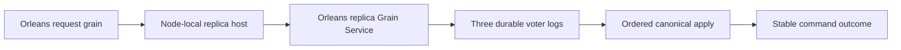

# ClusterReplication

Status: implementation in progress. Owner: KeyLoad lead. The owner's Orleans-only correction supersedes the DotNext candidate in architecture v0.3. Decision: [ADR-036](../ADR/ADR-036-orleans-foundation.md).

| Requirement | Acceptance and observable evidence |
|---|---|
| REQ-REP-001: Orleans carries votes, ordered appends, read barriers, forwarding and snapshot transfer. No DotNext runtime/package remains. | AC-REP-001: dependency/source inventory contains no DotNext reference; three Docker silos accept .NET SDK operations through request grains. |
| REQ-REP-002: terms, votes, log entries and commit positions are node-owned and process durable before acknowledgement. | AC-REP-002: real-process append/vote/commit interruption tests reopen the acknowledged prefix and reject complete-record corruption. |
| REQ-REP-003: an odd fixed RF3 voter set commits only with a majority; a current-term quorum barrier precedes public reads. | AC-REP-003: leader kill preserves acknowledged commands and stable-ID outcomes; an isolated minority rejects reads and writes. |
| REQ-REP-004: a restarted/empty replica catches up by a verified bounded snapshot followed by the ordered tail. | AC-REP-004: SDK-visible documents, topic/checkpoint/outbox/inbox outcomes survive replica erase/restart; interrupted/corrupt transfers preserve a complete recoverable cut. |
| REQ-REP-005: replicated principals and grants remain authoritative, including after leadership changes and snapshot catch-up. | AC-REP-005: SDK/MCP unauthorized and protected-field requests fail without canonical effects before and after failover. |
| REQ-REP-006: bounded anti-replay admission retains reserved capacity for votes, heartbeats, noop/current-term establishment and membership/lease control when application traffic saturates. | AC-REP-006: signed replay/tamper requests are rejected; saturated forward/read/data-append traffic is throttled without exhausting control capacity; real RF3 client load preserves leadership and minority denial. |

Slice map: `src/KeyLoad.Replication/Features/ClusterReplication/` owns protocol/log contracts and coordination; `src/KeyLoad.Orleans/Features/ClusterReplication/` owns the per-silo service/transport; `src/KeyLoad.AppHost/Features/ClusterReplication/` owns Docker resource composition; recovery and integration tests mirror `Features/ClusterReplication/`. Node storage adapter remains StorageRecovery. Frontend: N/A, this protocol has no UI. Public client shapes: existing ClientApi contracts; user-visible guarantees remain stable.

Traceability: AC-REP-001/003/004 map to `ClusterTests` and the new replica recovery tests; AC-REP-002 maps to real CrashHost interruption scenarios; AC-REP-005 maps to authorization/failover client cases. TASK-REP-LOG, TASK-REP-TRANSPORT, TASK-REP-INTEGRATE and TASK-REP-VERIFY are defined in [execution plan](../implementation/orleans-foundation.plan.md). Qualification is GitHub Actions only. Historical CI 36926803549 qualifies the old implementation, not this replacement. Power-loss and endurance remain pending.

TASK-RUNTIME-REPLICA-READINESS-W4 maps REQ-REP-004 / AC-REP-004 and
REQ/AC-STORAGE-012. Exact main b533c80 / CI37032546228 fails the Windows
SnapshotInstalled reopen on target/database/tree/0.meta.wal; the prior two-store
barrier probes only owner.lock and commands.wal. Root replaces each store's
probe with the shared StorageRecovery exclusive-file probe, including metadata
when present, inside the existing single five-second/25ms loop. Cancellation
stops before another probe. No file creation, recovery retry, timeout increase,
weakened snapshot/tail/receipt predicate or attribution of the unknown holder
is permitted. A disjoint test worker owns new ClusterReplication real-file
barrier cases: hold canonical or replica metadata exclusively, verify pending
then release and success; cancel a held wait and pre-cancel an unlocked wait;
assert a permanent holder still fails under the unchanged bound. Use actual
closed CrashHost target stores and observe/dispose pending tasks and holders
before deleting their root. Existing native SnapshotInstalled process-kill and
ordered-tail tests are the primary regression. ADR-035/036/041 ownership and
lifetime contracts suffice; public/data/dependency boundaries are unchanged.
Root reviews both helper/caller scopes together, development-builds/formats,
and qualifies the full three-OS recovery suite in GitHub at the delivered SHA.

The same W4 criterion includes exact1bee2609 / CI37036628601's source-store
reopen failures. For the six typed snapshot/transfer crash boundaries, the child
also opened `source/database` and `source/replica`. Enumerate these exact owned
stores alongside the target stores inside the same single five-second/25ms loop.
Use the crash boundary's explicit source-ownership contract, never filesystem
existence to decide whether required ownership/journal files are optional. Other
boundaries retain their target-only path and must not create source storage.
Root owns the CrashHost store-path/source-boundary helpers, preserving the
existing scenario predicate, and ReplicaProcessTrial/ReplicaProcessFiles join.
The disjoint readiness test worker extends only its real-store fixture and cases:
each source canonical/replica owner, journal and metadata holder keeps the actual
combined wait pending until released. Existing source snapshot import and private
transfer crash cases remain the primary regression and retain all assertions.

The two permanent-holder elapsed checks and StorageRecovery's two missing-required-
file arguments retain their five-second lower and six-second upper observation
bounds. Run only those individual wall-clock measurement cases with TUnit's
keyless method-level `NotInParallel`, which the
pinned1.72.10 package documents as exclusive execution. Exact Windows evidence
shows the failed check overlapped74 distinct cases with16 active at peak; timer
or continuation delay is a supported inference, without a threadpool trace.
No class/assembly serialization, retry or timeout increase is allowed. Other
holder-release/cancellation tests and every real process crash remain parallel.
This is intrinsic readiness timing qualification, not a loaded-system latency
claim. Source review, native case discovery and full exact-SHA CI must verify
that the same bounds and all original crash cases remain.

TASK-RUNTIME-MAC-FIXTURE-W6 refines AC-REP-004 / AC-STORAGE-012 after
exact323d60499 / CI37044499074. All11 new macOS readiness cases fail during
construction at ReplicaSnapshotFiles.RejectLinks' reparse-point rejection,
before snapshot-data or readiness predicates. The fixture allocates an unresolved
system temp path; macOS temp aliases are the source-supported cause, while the
native report does not expose that run's exact TMPDIR. Reuse CrashHost's existing
ReplicaFixturePaths.NewDirectory for the fresh owned root, as other real replica
fixtures already do. It resolves existing directory ancestors using native .NET
ResolveLinkTarget before the private root is created; production RejectLinks
remains unchanged and fail-closed. Preserve one root, shared incarnation, both
target stores and required source stores, closure order, actual exclusive holders,
waits/assertions and owned cleanup. No second resolver, guard bypass, dependency,
public contract or persistence migration is introduced. The worker owns only
ReplicaFileReadinessStores; root owns contract/diff/evidence integration. All11
formerly red native cases plus original snapshot/tail/process recovery across
three OSes are the regression matrix. AC-REC-FUP-001 requires the existing
physical-temp helper and unchanged fail-closed guard; AC-REC-FUP-002 requires the
same genuine source/target stores, incarnation, holders, assertions and cleanup.
Either criterion fails on setup rejection, changed ownership or leaked work;
all11 native cases and original snapshot/tail cases must pass. ADR035/036/033 cover this preserving private
fixture reuse; rollback reverts only the allocator call. Environmental path or
cleanup failures require source lifetime review rather than a synthetic injector.

## Actors, entry points and failure boundaries

Actors are authenticated SDK/MCP callers, the node-local replica host, fixed voters, the membership provider and the recovery operator. Current source is composed by [ServerApplication](../../src/KeyLoad.Server/Features/ClientApi/ServerApplication.cs): it starts the node-local [PartitionHost](../../src/KeyLoad.Server/Features/StorageRecovery/PartitionHost.cs) and Orleans silo, whose [replica service](../../src/KeyLoad.Orleans/Features/ClusterReplication/PartitionReplicaGrainService.cs) routes peer operations. Aspire declares three Docker nodes with separate data mounts. This source is not yet qualified as a delivered RF3 deployment: current tests do not force request-activation migration and then verify storage ownership and a durable caller-visible outcome. Public HTTP/.NET transport belongs to ClientApi; required official MCP parity is pending. Frontend is N/A because replica consensus has no independent UI. Shared contracts stay in Abstractions and the exact ClusterReplication/StorageRecovery slice owners above.

Positive flow: an authorized command reaches its own request grain, the physical host orders and persists it, a majority crosses the declared acknowledgement barrier, and canonical apply returns the stable outcome. Negative flow: minority, stale term/owner, invalid peer MAC/replay or denied principal cannot establish committed success. Edge/error flow: an unknown response is resolved by stable command ID; interrupted/corrupt append or snapshot reopens one verified cut or fails explicitly; cancellation drains owned work without transferring locks to a migrating activation.

AC-REP-006 additionally maps to existing cryptographic/replay source cases in the [ClusterReplication unit slice](../../tests/KeyLoad.UnitTests/Features/ClusterReplication/) and planned real RF3 saturation/failover cases. Pure envelope tests do not prove liveness under load. Every acknowledgement/recovery assertion needs the exact delivered GitHub run; fault/endurance/power-loss claims remain separate.

Related invariants: [ADR-003](../ADR/ADR-003-durability-ack-barrier.md) ACK/profile barriers, [ADR-007](../ADR/ADR-007-replica-consensus-bootstrap.md) consensus/bootstrap, [ADR-016](../ADR/ADR-016-atomic-physical-placement.md) atomic identity/placement and Proposed [ADR-017](../ADR/ADR-017-migration-tokens.md) movement lineage. Proposed token translation does not block the existing fixed RF3 scope; dependent physical movement must wait for its contract.

TASK-REP-DISCOVERY removes the obsolete HTTP consensus/body-spooling protocol.
PeerSecurity authenticates only a bodyless GET of /internal/silo with no query;
native signed envelopes own votes, append payloads and snapshots. The discovery
signature binds a versioned purpose, exact method, recipient authority, path,
timestamp and nonce. A fixed-capacity nonce table rejects saturation explicitly,
retains a nonce through its inclusive future validity, and does not admit malformed
or forged requests. The clock is injected TimeProvider.System in production.
Real request-object security cases cover tamper/replay/expiry/body/path/method and
capacity, while RF3 CI exercises the genuine sockets and signed discovery reply.
No HTTP handler fake or legacy body fallback remains.

## Bounded intentional restart health wait refinement

REQ-REP-050 maps to AC-REP-050 and AC-ISO-004: after a deliberate native Docker kill
and one Aspire Start command, health waiting uses the native recovery wait behavior
with the original cancellation/deadline. Old unavailable logical-resource snapshots
must not immediately abort a requested restart. Actual healthy result, fresh Docker
Running/changed-start/source identity, public SDK readiness, persisted command/data/
subscription/outbox recovery and minority rejection remain required. Initial startup
keeps its existing fail-fast behavior; no retries, longer deadlines or swallowed
failures. Existing `ReplicatedAtomicBatchSurvivesLeaderContainerKillAndMinorityRejectsWrites`
is the real acceptance regression, executed in exact-SHA Linux RF3 CI. TASK-AISQL-024
retained run37072003906 evidence supports stale-terminal handling; exact selected
Aspire event generation remains unproven. TASK-AISQL-025/root owns only the two
post-restart health waits; ADR036 existing lifecycle contract is sufficient, new
architecture ADR:N/A. Qualification remains pending.
