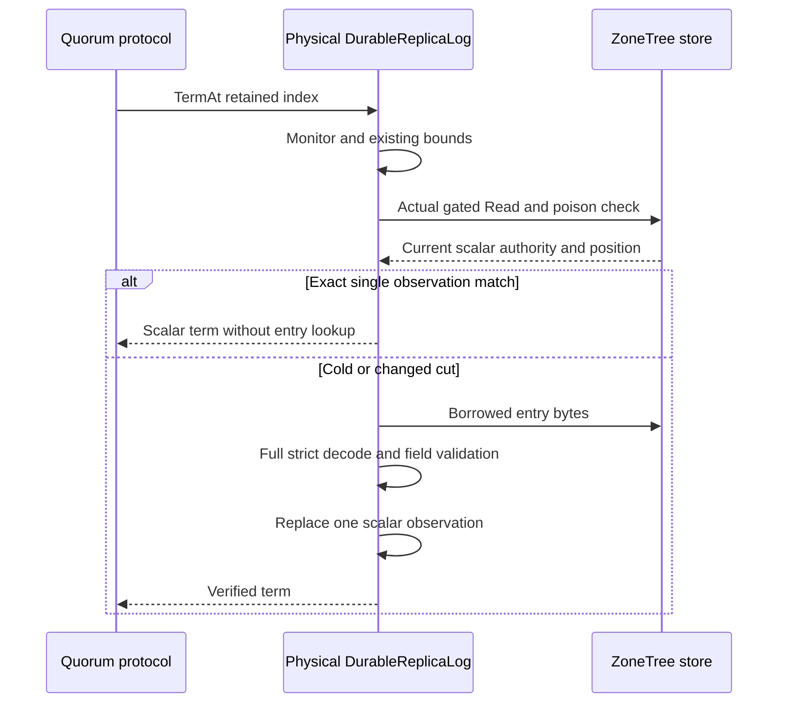

# ReplicaTermMetadata within ClusterReplication

Status: accepted preserving implementation contract; source and native gates
pending. Owner: KeyLoad lead. Decision: [ADR-061](../../ADR/ADR-061-bounded-replica-term-metadata.md).
Working acceptance/plan: `database-hotpath.acceptance.md` / `database-hotpath.plan.md`.

REQ-REP-052: retained-entry term queries reuse only one bounded scalar observation
at an identical verified physical-store authority/cut, preserving complete strict
miss validation, poison/disposal, retained/snapshot bounds and RF3 guarantees.
This maps to all AC-DBHP-001..008 below. Related REQ-MP-001/002/005 and
REQ-RESOURCE-002 still require measured operation efficiency and honest evidence.

## User-visible outcome and scope

Public SDK/MCP operations preserve both authorized quorum cuts and existing
errors. Internal term checks avoid copying/decoding the same retained command
again at an unchanged physical-store cut. This is one preserving database
optimization; throughput/resource benefit requires actual native measurements.
No new API/role/configuration, protocol, storage format, WAL/ACK or dependency.
Each node-local log owns one scalar observation; Orleans activation movement
does not transfer it or physical files.

## Canonical slice and execution ownership

|Surface|Paths and owner|
|---|---|
|Backend|`src/KeyLoad.Replication/Features/ClusterReplication/DurableReplicaLog.cs` and NEW `ReplicaTermObservation.cs`; bounded dependency Luna after test-source/root start|
|Contracts|Existing `ReplicaLogContracts.cs` and provider contract unchanged; root only if an approved contract delta becomes necessary|
|Tests|NEW `tests/KeyLoad.RecoveryTests/Features/ClusterReplication/ReplicaTermMetadata*.cs`; R15 Luna; existing full unit/scalar/recovery and RF3 remain mandatory|
|Frontend|N/A: private physical log metadata has no independent UI|
|Public SDK/MCP|Existing RF3 real clients and authorization/failover flows; no client/wire change|
|Infrastructure|Existing ci.yml/Aspire fixed1/2/3 benchmark resources and RF3 tests; no topology/limits change; root integration only|
|Docs/evidence|This contract, ADR-061, architecture/status/README and authentic native receipt; root sole integration owner|

The full permissions/dependencies/start conditions/artifacts/join task graph is
in the working plan and ordered ADR implementation contract. No implementation
worker invents architecture, weakens tests, edits other owners or executes local
tests. Shared source/config/Git/gates are serialized through root.

## Acceptance and testing methodology

|Acceptance|Observable pass/fail and proof|
|---|---|
|AC-DBHP-001|Exact native source/run/job/artifact hashes and all5 n1/n2/n3 PointRead repetitions recompute; operation/topology/read/ACK/resource scopes and complete-cohort failure retained. Historical artifact/math review is explicit manual evidence, not new qualification.|
|AC-DBHP-002|Real-store TermAt preserves zero/negative/missing/snapshot/retained suffix and strict decode errors; cold/warm/alternating indices, term/commit/vote advance and replacement tests return exact terms or established error. Wrong/stale term or weaker parser fails.|
|AC-DBHP-003|Real ZoneTree counters prove one borrowed cold entry lookup, zero additional point lookups/bytes for repeated warm same-cut term calls with a large valid payload. Independent source review proves exactly one scalar cell and no payload/key/StoreIdentity/signing retention. No allocation/RSS/latency claim inferred.|
|AC-DBHP-004|Direct record change/delete/corruption and same-position/different-valid-entry snapshot install force a strict fresh observation using Position/generation/authority; old term or hidden corruption fails. Restore NodeId and actual same-incarnation behavior require real restore evidence or documented source-only exception alongside existing restore tests.|
|AC-DBHP-005|A warmed cell cannot serve after real provider poison/failed install, provider/log disposal, or through another opened log. Real supported fault-boundary/installation and reopen tests preserve exact error; existing real-process crash suite remains required.|
|AC-DBHP-006|Existing log-monitor→provider read-gate order, protocol snapshot gate, all writes/ACK/crash hooks and borrowed lifetime remain. Full independent source review and genuine concurrent planning/publication/process/lifecycle regressions required; unforced cleanup failures are not fake runtime proof.|
|AC-DBHP-007|Complete enabled solution build/formatter/analyzers/complexity/governance and exact-SHA GitHub TUnit/MTP normal/scalar/recovery/Docker Aspire RF3 real .NET/official MCP suites execute with no skips/failures. Numeric coverage is open until actual compatible collection exists.|
|AC-DBHP-008|Repeated matched native PointRead1/2/3 and complete cohort retain source/workload/read/ACK/concurrency and client/per-node resource scopes. Server phases/CPU/alloc/GC profile gaps stay explicit. Unmatched samples/source counters cannot prove causal speedup, winner or maximum scalability.|

Tests are acceptance-derived, authored before the helper and exercise real
ZoneTree stores/files/provider fault boundaries, plus real process recovery and
public Docker RF3 clients. No mocks/fakes, local tests, generated performance
numbers or relaxed corruption/minority/ACK checks. Expected exact successful
terms and negative classifications are asserted alongside provider logical-read
and authority changes; assertions run outside any measured loop. Required native
commands are the root ci.yml gates. Baseline and candidate measurement use repeated
identical inputs; source snapshots and development builds remain separate evidence.

Migration/rollback is source-only after host drain. No stored/public/dependency
conversion and no power-loss/endurance/readiness claim. Related ADR stays Accepted
until implementation, every regression and authentic qualification exist.

## Evidence state

Actual source discovery: public read has authentication plus operation quorum
rounds; write adds its pre-write barrier and append round. The shared leader gate
and sequential write pump are profile targets. Empty warm read probes do not
persist no-op metadata. TermAt copies/decodes the entire retained entry solely
for its term. Benchmark replay capacity196608 differs from default16384; capacity
arithmetic alone does not attribute native throughput.

Retained d45 native PointRead data and original failed complete270 cohort are
being independently joined. New product/test source, exact-SHA qualification,
matched current-source/server-resource profiles and numeric coverage remain open.
