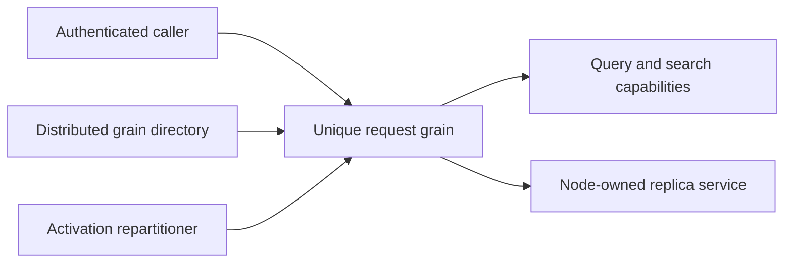

# ClusterRouting

TASK-RUNTIME-RESOURCE-W preserves REQ/AC-ROUTE-001 under ADR-036. The shared RF3
request-ID scenario receives a unique tenant, because persisted resource catalog
identity is tenant/database/name and a random partition key does not isolate it.
Run37005805424 found its orders definition colliding with the prior leader-loss
fixture's domain/indexes. Preserve actual eight parallel SDK reads, stable write
outcome, fresh actor IDs and strict unsupported resource-migration rejection.
Only RequestIdReceiptTests.cs changes; existing failing CI is the baseline and
full exact-SHA RF3 qualification remains required.

Status: implementation in progress. Owner: KeyLoad lead. Decision: [ADR-036](../ADR/ADR-036-orleans-foundation.md).

Owner direction 2026-10-05 adds the native Orleans per-method selection contract
in [ExecutionPrimitives](ClusterRouting/ExecutionPrimitives.md) under
[ADR-110](../ADR/ADR-110-native-orleans-execution-primitives.md), REQ/AC-ORL-001..010.
It audits StatelessWorker, OneWay, Durable Jobs and selective interleaving against
actual request/read/partition/due grains. Candidate runtime/provider adoption and
real-operation RF3/resource/performance qualification remain pending.
The [broad capability review](ClusterRouting/CapabilityReview.md) additionally maps
native Streams/pub-sub, transactions/persistence, local services/lifecycle,
placement, resource settings, telemetry and deployment/testing to concrete joins.

TASK-PLACEMENT-DISCOVERY advances original KL-036/069/070/071/072 toward the
freeze required by ADR-016/017 and AC-ROUTE-004/005, AC-REP-004. Luna
cluster_wave reads the actual node-local host, generated identity/token contracts,
replication recovery and router call paths; writes only a private source-bound
design packet. Identify the minimum catalog, physical group/epoch fencing,
persisted movement intent and snapshot/tail integration points, exact unavailable
prerequisites and measurable real-process/RF3 cases. Existing whole-dataset RF3
and activation movement must not be relabeled as physical placement. Root selects
and freezes the implementation contract before any write-capable implementation;
this discovery does not choose the still-proposed token format, migrate a store,
change a public API or satisfy runtime acceptance. The join requires concrete
current file/method evidence and an ordered, disjoint implementation graph.

The first concrete page stage is frozen in
[PartitionTransfer](ClusterRouting/PartitionTransfer.md), TASK-PMOVE-PAGES and
TASK-PMOVE-PAGE-ORACLES. Exact canonical pages retain an owned native cut;
complete ownership, installation, token and RF3 gates remain explicit.

The owner2026-10-04 native CQRS/result/long-operation requirement is specified in
[NativeCqrs](ClusterRouting/NativeCqrs.md) and [ADR-082](../ADR/ADR-082-native-cqrs-streams.md).
Only the real Graph/native-enumeration compatibility test stage is accepted for
implementation; product RPC/transport and long-operation lifecycle joins remain
pending. Current Task replies do not satisfy the new streamed-result requirement.

| Requirement | Acceptance and observable evidence |
|---|---|
| REQ-ROUTE-001: every database operation runs through a distinct Orleans request grain and calls the relevant database capabilities. | AC-ROUTE-001: .NET/MCP client writes and reads reach request grains; independent concurrent requests have distinct grain keys and stable command retry IDs. |
| REQ-ROUTE-002: distributed grain directory and activation repartitioning are enabled; routing migration never transfers node-owned file locks or journals. | AC-ROUTE-002: cluster configuration enables both services; migration followed by SDK reads/writes preserves replica identity and durable outcomes. |
| REQ-ROUTE-003: silo membership starts without a second cluster stack or a single primary-node dependency. | AC-ROUTE-003: all three Docker silos become ready; the remaining two continue when any configured voter is killed. |
| REQ-ROUTE-006: enforced grain-call policy permits only the declared application transitions and does not route native replica system targets through application telemetry grains. | AC-ROUTE-006: real RF3 authentication/write/read succeeds with enforcement enabled; direct capability calls remain denied; upstream Graph regression proves the default native-system-target exclusion and preserves explicit tracking. |
| REQ-ROUTE-008: rejected requests provide bounded internal diagnostics without private data or changed public errors. | AC-ROUTE-008: actual logging provider records request GUID, closed stage/category and typed error code; malformed payload/typed decode/general JSON or argument failures omit payload, identity, credentials and raw exception text; successful calls allocate no diagnostic context; existing SDK/MCP RF3 outcomes remain unchanged. |
| REQ-ROUTE-009: initial native Orleans RPC failures retain transport/outcome semantics without claiming storage damage. | AC-ROUTE-009 / AC-AISQL-011: server-derived reads report OwnershipLost, possibly dispatched commands report UnknownWriteOutcome; native exception/timeout/noncaller cancellation tests and stopped-replica RF3 replay preserve domain RecoveryRequired, caller cancellation, secret-free details and exactly one dispatch. |

Slice map: `src/KeyLoad.Orleans/Features/ClusterRouting/` owns request routing/membership; Server composition wires it. ClientApi owns HTTP/MCP adapters. Tests mirror ClusterRouting in IntegrationTests. Frontend: N/A, routing has no independent UI. Credentials remain in Authorization's persisted catalog.

Traceability: AC-ROUTE-001/002/003 map to client-visible RF3 scenarios and targeted migration evidence in TASK-REP-TRANSPORT/INTEGRATE/VERIFY. Existing `CommandRouterGrain` and membership files are replaced in the same migration. No result is qualified until the exact GitHub Actions SHA/run/artifacts are recorded.

TASK-ROUTE-MEMBERSHIP preserves the existing database CAS membership record and
monotonic heartbeat updates. Initial membership initialization waits for local
`IReplicaEndpoint.TransportReady`, then retries only transient quorum failures
with `TimeProvider.System` and the silo startup cancellation token. Later provider
calls use independent bounded request deadlines, so cancellation of the startup
token does not prevent membership shutdown. Membership never owns files and never
resolves an Orleans client while constructing its provider. Source ownership is
the new `Features/ClusterRouting/Topology/ReplicaMembershipTable.cs` and cohesive helpers;
the lead replaces the old provider and composes the actual silo. The frozen primary
constructor accepts database, coordinator, replica endpoint, cluster ID, internal
principal ID, TimeProvider, and startup CancellationToken in that order.

## Identity, placement та movement

Актори: caller/request grain, directory/membership provider та future placement operator. Current source: [Orleans project](../../src/KeyLoad.Orleans/KeyLoad.Orleans.csproj), [partition/public contracts](../../src/KeyLoad.Abstractions/Contracts.cs), [Core domain resolution](../../src/KeyLoad.Core/DatabaseEngine.cs). Current deployment — один replicated physical shard, який містить багато незалежних atomic partitions; directory activation movement не переносить файли чи transaction identity.

| Вимога | Acceptance / flows | Test mapping |
|---|---|---|
| REQ-ROUTE-004: atomic partition identity відокремлена від physical placement | AC-ROUTE-004: equal literal key у різних domains не створює shared transaction; server catalog resolution фіксує eligible shared resources; packing/activation placement не змінює CAS/unique/dedup scope | Existing `SameLiteralPartitionKeyCannotCrossTransactionDomains` у [TransactionTests](../../tests/KeyLoad.UnitTests/Features/ResourceExecution/Cases/TransactionTests.cs); expanded placement fixtures PLANNED |
| REQ-ROUTE-005: physical partition movement/split має fenced restartable protocol | AC-ROUTE-005: PLANNED prepare/copy/catch-up/validate/ownership-switch/release tests з process interruption і real RF3 доводять complete cut, stable outcomes and current ownership-session token identity or explicit invalidation, with no old-owner write after switch | PLANNED KL-036/069–072 suites; [ADR-016](../ADR/ADR-016-atomic-physical-placement.md), [ADR-017](../ADR/ADR-017-ownership-session-tokens.md) |

Distributed directory/repartitioning — required in-progress source migration. Automatic physical split/merge, broad placement balancing і migration-aware tokens не оголошені готовими. Resource packing/placement і routing contracts freeze одним integration owner за [ADR-001](../ADR/ADR-001-partition-identity-affinity.md), [ADR-007](../ADR/ADR-007-replica-consensus-bootstrap.md). Target Abstractions/Orleans/replication host/tests mirror `Features/ClusterRouting/` для routing behavior, StorageRecovery owns files, ClientApi owns caller transport. Frontend N/A; placement/operator controls потребують власного accepted API до implementation.

Positive/negative/edge/error proof: distinct request identities, quorum/bootstrap failure, delayed/cancelled membership startup, source/owner epoch mismatch, minority, leader kill, activation move, future interrupted physical move. All tests real TUnit/recovery/Docker-Aspire SDK/MCP in GitHub, exact SHA/jobs/artifacts; current source names не проходження gates.

Stream boundary: current request/response routing uses Orleans grain calls; no
Orleans runtime Streams provider is configured. KeyLoad EventStreams are durable
database records with cursor/replay contracts, not Orleans pub/sub. The owner has
directed that Orleans Streams remain a first-priority architecture and
implementation workstream. The provider, event source, delivery/restart and
backpressure contract still needs to be pinned before source changes or claims
that this path is implemented.

TASK-ROUTE-REQUEST implements AC-ROUTE-001 using one non-reentrant GUID request
grain per operation. It routes writes to canonical atomic-partition actors and reads
to independent GUID read actors. The signed transport binds request ID, incarnation,
kind, persisted identity, stable command ID, exact base64url UTF8 payload and expiry.
Invalid scope, stale expiry, wrong grain key, forged authority and oversized payload
or reply fail explicitly. Each read actor obtains a quorum barrier before loading
the current persisted principal and calling existing Core/Query/Search capabilities.
Storage remains borrowed from the physical host. Admin backup/status/admission use
the local `INodeAdministration` interface only after a persisted admin check.
Real-store protocol tests complement mandatory Docker SDK/MCP and activation-move
tests; neither protocol unit tests nor a development build qualifies movement.

TASK-ROUTE-DIAGNOSTICS implements AC-ROUTE-008 after run36988949282 exposed
undifferentiated request rejections. The exact decoder/downstream branch remains
unknown. Internal enum metadata distinguishes payload syntax, typed decode,
required-null shape, envelope/partition, quorum, authorization, execution and reply
stages. LoggerMessage records only a GUID and closed enums, with no exception object.
The stage variable is a value type and success does not allocate a diagnostic
object, callback or scope. Public error codes/details, authorization, wire/schema,
retry identity and replica ownership remain unchanged. New UnitTests exercise the
actual EventSource provider and caller-visible reply, including private canary omission;
existing full RF3 failure scenarios supply operational evidence in GitHub only.
Ownership/stages/rollback are accepted in ADR-036 and the root delivery task graph.

TASK-AISQL-011 repairs the initial OrleansNode RPC boundary after exact baseline
37065200835 exposed a generic503 during stopped-replica writes. Native Orleans
placement/directory rejection is a possible path; its exact class and dispatch
phase were not captured and remain unproven.
CanonicalOperationGateway supplies trusted command intent; DatabaseCredentialResolver
supplies read intent. Only native OrleansException and TimeoutException map to
fixed transport errors. No internal retry, parsing of caller roles, storage-error
conversion or diagnostic suppression is permitted. New pure classification tests
use actual framework exceptions; real RF3 catch-up remains the operational gate.

TASK-GRAPH-EDGES permits the exact ExecuteAsync transitions from IRequestGrain to
ICommandPartitionGrain and IDatabaseReadGrain. Clients may call only IRequestGrain;
the default-deny graph is retained. TASK-GRAPH-OWNING repairs the independently
owned ManagedCode.Orleans.Graph package before consumer qualification: when
TrackOrleansCalls is false, native system-target identity must bypass application
tracking regardless of the implementing assembly name. Replica Grain Services run
before membership is Active and cannot depend on ordinary graph telemetry grains.
The owning repository's regression, patch release, GitHub publication and intended
NuGet feed verification are mandatory before changing KeyLoad's package pin.

REQ-ROUTE-010 maps to AC-ROUTE-010 / AC-AISQL-013: read cancellation replies use
the actual incoming actor token. Only active caller cancellation returns
Cancelled; inactive-token native cancellation returns OwnershipLost, and commands
retain UnknownWriteOutcome. Typed domain errors, safe details and existing closed-category
logging/privacy remain authoritative. ADR-036 TASK-AISQL-020 owns the sole
classifier and all three actual token joins. Automated evidence: new genuine
GrainReplyCancellationTests plus unchanged retained-replica SDK RF3 catch-up;
exact-SHA qualification is pending. This corrects a concrete source defect without
inferring the prior run's exact internal phase from overwritten fixture logs.

TASK-WAL-CI-RPC-CANCEL refines the same initial-RPC failure boundary under
ADR-036: native cancellation with an inactive incoming caller token maps to the
existing trusted read/write transport outcomes, while active caller cancellation
wins before classification or logging. The existing real framework-exception
tests preserve domain errors, safe fixed detail, stable command identity and
privacy; exact-source stopped-node RF3 remains mandatory. No internal retry or
change to storage/replication outcomes is permitted.

### TASK-MEMBERSHIP-NATIVE-HEALTH-MAPPING-001 (accepted source repair; runtime pending)

REQ/AC-MEMBERSHIP-002/003/008 and NativeTUnitEntry's existing fixture-owned six-silo gate require distinct native states, not generic HTTP availability. Actual local R322 failed1/1 at904.656s with zero4200-source/896-image drift. Group A native HTTP repeatedly returned404 for /health/membership-authority while AppHost WaitForAuthority kept Group B pending;15-minute initiating cancellation then canceled creation of node4-6. Original60-second DCP watch failures and secondary OfflineFileNotFound cleanup remain original separate evidence, not inferred primary causes.

Freeze before code: Server ClusterRouting Transport/ReplicaMembershipHealthEndpoints.cs maps GET /health/silo to200 only after existing OrleansNode.SiloJoined and actual published native Grains factory are present, otherwise503. GET /health/membership-authority returns200 only in validated Authority mode after existing node native join/factory publication and ReplicaMembershipAuthorityOwner.IsReady (real IMembershipTable provider published only after Group A native silo/catalog startup, and admission still open); Local/Proxy/unpublished/closed states return503. No address/catalog/credential/payload is disclosed; boolean routes return empty status only. Owner.IsReady is the same existing native authority endpoint admission gate; no replacement provider, probe/reflection, unconditionalHealthy or application-request dispatch is introduced.

Group A early authority health MUST NOT require six Active rows, or Group B's native WaitFor gate would deadlock. Existing GET /health/membership-ready remains unchanged: actual native ReadAll/proxy path, six exact Active generations/fingerprint, bounded historical rows and local membership presence. Both group database-ready routes remain503 and SDK/officialMCP deny before request-grain dispatch. AppHost dependencies and all original container/image identities, deadlines, cancellation/reader/node/storage/lock/image joins remain unchanged.

Existing real TwoRf3MembershipProfileTests.AcMembership001To003UsesOneSixSiloMembershipAndKeepsBothDatabaseGroupsClosed is the regression: native Group A authority gate permits Group B startup, independent actual six-silo fingerprint/membership and per-node silo200/membership200/data503/authorityA200-B503/publicSDK-MCP-denial oracles remain exact. Source review cannot claim the before-catalog startup observation or runtime success; those existing acceptance criteria remain required. Root owns guarded join, strict solutionbuild, fresh exact native six-silo gate and mandatory full Linux suites. No watch timeout/configuration is raised. Rollback removes both missing route mappings together with this task contract only; existing three-node readiness/ownership contracts remain unchanged.

### TASK-MEMBERSHIP-MCP-CLOSED-INIT-ORACLE: exact earliest official admission denial

Freeze before test correction under REQ/AC-MEMBERSHIP-003/008 and existing ADR-106 Stage1A: actual R347 six-silo run failed1/1 at49.656s after the native authority routes admitted Group B. The real official SDK2.2.0 session creation failed in SendDiscoverAsync, before a tool invocation, with HTTP503 and exactly OwnershipLost / “The physical shard catalog is not ready for public admission.”. Preserve the original failed log/TRX/source-image witness; it is not a passing membership gate.

DatabaseIdentityMiddleware routes every /mcp request through McpHttpPipeline, which resolves persisted credentials through DatabaseCredentialResolver.ReadAsync and OrleansNode.ExecuteCoreAsync before native SDK framing/session processing. Stage1A DatabaseReady=false throws the catalog admission error before Grains lookup and request dispatch. Thus a successful official SDK connection is an invalid Stage1A test precondition. The real official discovery/initialization request must be rejected at that earliest boundary. Do not bypass authentication/initialization to manufacture read/write CallToolResult values. Actual SDK read and command denials remain mandatory at both groups; actual official tool read/write interoperability stays independently mandatory in data-ready RF3 and future Stage1B, and is not claimed from failed session creation.

The owning ClusterRouting readiness assertion must use real McpOfficialClient.ConnectAsync and require the exact native HttpRequestException503, a bounded original native response-body message, precisely five problem fields type/title/status/detail/errorCode with the literal catalog-not-ready values, and no bearer credential disclosure. Any other503, generic server fault, wrong body/extra field, successful connection, timeout, cancellation or cleanup error fails. Unexpected successful native owners are disposed; existing connection failure cleanup preserves primary and cleanup errors. No alternate transport, fake provider/handler, retry, timing change, production seam or successful-session branch is admitted.

The original SDK QueryCapabilities/Commit calls remain and now compare every typed safe problem field. This earliest source-bound pre-grain rejection implies no user data/catalog/outcome effect; this test does not claim a complete persisted-store snapshot from Initialize. Following both group denials, repeat genuine all-six silo/membership/data/authority health and independent signed native fingerprint checks to prove system-control operations remain healthy while data stays closed. All existing image/profile/two-three-voter/membership/privacy/cleanup and Stage1B boundaries remain. Root owns guarded join, full build and actual native six-silo operation proof plus mandatory Linux/recovery/standardRF3 gates. No runtime PASS, movement acceptance or production qualification follows from authored source.

### TASK-CRS-NATIVE-BUILDER-OWNERSHIP-001

REQ/AC-CRS-002/004 and existing joined request/fault lifecycle contracts require the actual native testing builder to remain owned from CreateAsync through every failed setup path and successful wave shutdown. Current RequestCqrsRf3WaveStartup holds it only in a local variable: override/model/build failures and successful ownership transfer omit its DisposeAsync. This is a proven test-infrastructure ownership defect; no causal attribution to historical SCAT cancellation or surviving MCP503 is made.

Freeze before implementation: startup captures the real IDistributedApplicationTestingBuilder immediately after its original CreateAsync completes. Successful transfer moves that exact owner into RequestCqrsRf3Wave; failed setup retains it in startup. Dispose is awaited after original application stop/disposal and diagnostics joins, and before successful node-lock cleanup. Each actual disposal failure remains in the original cleanup evidence; the builder reference is cleared only on successful awaited disposal. There is no detached task, altered startup/read/election deadline, new client, retry, weakened majority or missing-lock suppression. Append the fixture-local lifecycle stage at the end so existing stage numbers retain their meaning. No product or serializer contract changes.

Ordered implementation: freeze this contract; add exact builder ownership transfer/disposal to existing startup/wave; root format/build; execute the existing real SCAT mismatch/corrected waves, C1 two-compatible-voter restart and real guard-cancellation flows. Those whole operations retain their SDK/MCP/read-cut/no-effect/native lock and image oracles. Existing source review proves all setup branches capture the owner, but cannot prove native disposal completion at runtime. Actual original native logs, cleanup failures and exact source/DLL/image receipts are required; all Linux unit/scalar/recovery/RF3 gates remain open. Rollback removes this task and its fixture-only ownership changes together, preserving every original failure artifact. Root owns source join and execution; this private packet claims no passing runtime gate.

RequestCqrsRf3StartupExecution owns startup creation, execution and exactly one awaited disposal in its finally block. It collects the original setup failure and every cleanup failure before throwing their aggregate; the coordinator's RunAsync reports setup failures and transfers successful owners without disposing itself. This preserves explicit disposal on every path and avoids a second disposal replacing the original setup failure. Successful startup transfers every live owner before return; failed startup awaits all original application/diagnostics/builder cleanup in this one execution owner.
