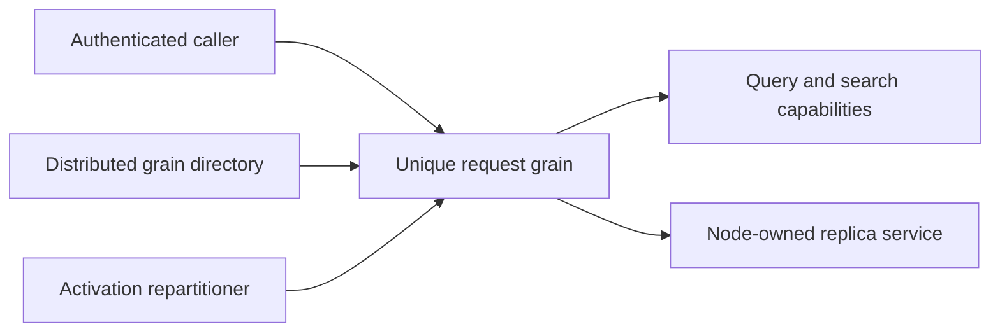

# ClusterRouting

TASK-RUNTIME-RESOURCE-W preserves REQ/AC-ROUTE-001 under ADR-036. The shared RF3
request-ID scenario receives a unique tenant, because persisted resource catalog
identity is tenant/database/name and a random partition key does not isolate it.
Run37005805424 found its orders definition colliding with the prior leader-loss
fixture's domain/indexes. Preserve actual eight parallel SDK reads, stable write
outcome, fresh actor IDs and strict unsupported resource-migration rejection.
Only RequestIdReceiptTests.cs changes; existing failing CI is the baseline and
full exact-SHA RF3 qualification remains required.

Status: implementation in progress. Owner: KeyLoad lead. Decision: [ADR-036](../ADR/ADR-036-orleans-foundation.md).

Owner direction 2026-10-05 adds the native Orleans per-method selection contract
in [ExecutionPrimitives](ClusterRouting/ExecutionPrimitives.md) under
[ADR-110](../ADR/ADR-110-native-orleans-execution-primitives.md), REQ/AC-ORL-001..010.
It audits StatelessWorker, OneWay, Durable Jobs and selective interleaving against
actual request/read/partition/due grains. Candidate runtime/provider adoption and
real-operation RF3/resource/performance qualification remain pending.
The [broad capability review](ClusterRouting/CapabilityReview.md) additionally maps
native Streams/pub-sub, transactions/persistence, local services/lifecycle,
placement, resource settings, telemetry and deployment/testing to concrete joins.

TASK-PLACEMENT-DISCOVERY advances original KL-036/069/070/071/072 toward the
freeze required by ADR-016/017 and AC-ROUTE-004/005, AC-REP-004. Luna
cluster_wave reads the actual node-local host, generated identity/token contracts,
replication recovery and router call paths; writes only a private source-bound
design packet. Identify the minimum catalog, physical group/epoch fencing,
persisted movement intent and snapshot/tail integration points, exact unavailable
prerequisites and measurable real-process/RF3 cases. Existing whole-dataset RF3
and activation movement must not be relabeled as physical placement. Root selects
and freezes the implementation contract before any write-capable implementation;
this discovery does not choose the still-proposed token format, migrate a store,
change a public API or satisfy runtime acceptance. The join requires concrete
current file/method evidence and an ordered, disjoint implementation graph.

The first concrete page stage is frozen in
[PartitionTransfer](ClusterRouting/PartitionTransfer.md), TASK-PMOVE-PAGES and
TASK-PMOVE-PAGE-ORACLES. Exact canonical pages retain an owned native cut;
complete ownership, installation, token and RF3 gates remain explicit.

The owner2026-10-04 native CQRS/result/long-operation requirement is specified in
[NativeCqrs](ClusterRouting/NativeCqrs.md) and [ADR-082](../ADR/ADR-082-native-cqrs-streams.md).
Only the real Graph/native-enumeration compatibility test stage is accepted for
implementation; product RPC/transport and long-operation lifecycle joins remain
pending. Current Task replies do not satisfy the new streamed-result requirement.

| Requirement | Acceptance and observable evidence |
|---|---|
| REQ-ROUTE-001: every database operation runs through a distinct Orleans request grain and calls the relevant database capabilities. | AC-ROUTE-001: .NET/MCP client writes and reads reach request grains; independent concurrent requests have distinct grain keys and stable command retry IDs. |
| REQ-ROUTE-002: distributed grain directory and activation repartitioning are enabled; routing migration never transfers node-owned file locks or journals. | AC-ROUTE-002: cluster configuration enables both services; migration followed by SDK reads/writes preserves replica identity and durable outcomes. |
| REQ-ROUTE-003: silo membership starts without a second cluster stack or a single primary-node dependency. | AC-ROUTE-003: all three Docker silos become ready; the remaining two continue when any configured voter is killed. |
| REQ-ROUTE-006: enforced grain-call policy permits only the declared application transitions and does not route native replica system targets through application telemetry grains. | AC-ROUTE-006: real RF3 authentication/write/read succeeds with enforcement enabled; direct capability calls remain denied; upstream Graph regression proves the default native-system-target exclusion and preserves explicit tracking. |
| REQ-ROUTE-008: rejected requests provide bounded internal diagnostics without private data or changed public errors. | AC-ROUTE-008: actual logging provider records request GUID, closed stage/category and typed error code; malformed payload/typed decode/general JSON or argument failures omit payload, identity, credentials and raw exception text; successful calls allocate no diagnostic context; existing SDK/MCP RF3 outcomes remain unchanged. |
| REQ-ROUTE-009: initial native Orleans RPC failures retain transport/outcome semantics without claiming storage damage. | AC-ROUTE-009 / AC-AISQL-011: server-derived reads report OwnershipLost, possibly dispatched commands report UnknownWriteOutcome; native exception/timeout/noncaller cancellation tests and stopped-replica RF3 replay preserve domain RecoveryRequired, caller cancellation, secret-free details and exactly one dispatch. |

Slice map: `src/KeyLoad.Orleans/Features/ClusterRouting/` owns request routing/membership; Server composition wires it. ClientApi owns HTTP/MCP adapters. Tests mirror ClusterRouting in IntegrationTests. Frontend: N/A, routing has no independent UI. Credentials remain in Authorization's persisted catalog.

Traceability: AC-ROUTE-001/002/003 map to client-visible RF3 scenarios and targeted migration evidence in TASK-REP-TRANSPORT/INTEGRATE/VERIFY. Existing `CommandRouterGrain` and membership files are replaced in the same migration. No result is qualified until the exact GitHub Actions SHA/run/artifacts are recorded.

TASK-ROUTE-MEMBERSHIP preserves the existing database CAS membership record and
monotonic heartbeat updates. Initial membership initialization waits for local
`IReplicaEndpoint.TransportReady`, then retries only transient quorum failures
with `TimeProvider.System` and the silo startup cancellation token. Later provider
calls use independent bounded request deadlines, so cancellation of the startup
token does not prevent membership shutdown. Membership never owns files and never
resolves an Orleans client while constructing its provider. Source ownership is
the new `Features/ClusterRouting/Topology/ReplicaMembershipTable.cs` and cohesive helpers;
the lead replaces the old provider and composes the actual silo. The frozen primary
constructor accepts database, coordinator, replica endpoint, cluster ID, internal
principal ID, TimeProvider, and startup CancellationToken in that order.

## Identity, placement та movement

Актори: caller/request grain, directory/membership provider та future placement operator. Current source: [Orleans project](../../src/KeyLoad.Orleans/KeyLoad.Orleans.csproj), [partition/public contracts](../../src/KeyLoad.Abstractions/Contracts.cs), [Core domain resolution](../../src/KeyLoad.Core/DatabaseEngine.cs). Current deployment — один replicated physical shard, який містить багато незалежних atomic partitions; directory activation movement не переносить файли чи transaction identity.

| Вимога | Acceptance / flows | Test mapping |
|---|---|---|
| REQ-ROUTE-004: atomic partition identity відокремлена від physical placement | AC-ROUTE-004: equal literal key у різних domains не створює shared transaction; server catalog resolution фіксує eligible shared resources; packing/activation placement не змінює CAS/unique/dedup scope | Existing `SameLiteralPartitionKeyCannotCrossTransactionDomains` у [TransactionTests](../../tests/KeyLoad.UnitTests/Features/ResourceExecution/Cases/TransactionTests.cs); expanded placement fixtures PLANNED |
| REQ-ROUTE-005: physical partition movement/split має fenced restartable protocol | AC-ROUTE-005: PLANNED prepare/copy/catch-up/validate/ownership-switch/release tests з process interruption і real RF3 доводять complete cut, stable outcomes and current ownership-session token identity or explicit invalidation, with no old-owner write after switch | PLANNED KL-036/069–072 suites; [ADR-016](../ADR/ADR-016-atomic-physical-placement.md), [ADR-017](../ADR/ADR-017-ownership-session-tokens.md) |

Distributed directory/repartitioning — required in-progress source migration. Automatic physical split/merge, broad placement balancing і migration-aware tokens не оголошені готовими. Resource packing/placement і routing contracts freeze одним integration owner за [ADR-001](../ADR/ADR-001-partition-identity-affinity.md), [ADR-007](../ADR/ADR-007-replica-consensus-bootstrap.md). Target Abstractions/Orleans/replication host/tests mirror `Features/ClusterRouting/` для routing behavior, StorageRecovery owns files, ClientApi owns caller transport. Frontend N/A; placement/operator controls потребують власного accepted API до implementation.

Positive/negative/edge/error proof: distinct request identities, quorum/bootstrap failure, delayed/cancelled membership startup, source/owner epoch mismatch, minority, leader kill, activation move, future interrupted physical move. All tests real TUnit/recovery/Docker-Aspire SDK/MCP in GitHub, exact SHA/jobs/artifacts; current source names не проходження gates.

Stream boundary: current request/response routing uses Orleans grain calls; no
Orleans runtime Streams provider is configured. KeyLoad EventStreams are durable
database records with cursor/replay contracts, not Orleans pub/sub. The owner has
directed that Orleans Streams remain a first-priority architecture and
implementation workstream. The provider, event source, delivery/restart and
backpressure contract still needs to be pinned before source changes or claims
that this path is implemented.

TASK-ROUTE-REQUEST implements AC-ROUTE-001 using one non-reentrant GUID request
grain per operation. It routes writes to canonical atomic-partition actors and reads
to independent GUID read actors. The signed transport binds request ID, incarnation,
kind, persisted identity, stable command ID, exact base64url UTF8 payload and expiry.
Invalid scope, stale expiry, wrong grain key, forged authority and oversized payload
or reply fail explicitly. Each read actor obtains a quorum barrier before loading
the current persisted principal and calling existing Core/Query/Search capabilities.
Storage remains borrowed from the physical host. Admin backup/status/admission use
the local `INodeAdministration` interface only after a persisted admin check.
Real-store protocol tests complement mandatory Docker SDK/MCP and activation-move
tests; neither protocol unit tests nor a development build qualifies movement.

TASK-ROUTE-DIAGNOSTICS implements AC-ROUTE-008 after run36988949282 exposed
undifferentiated request rejections. The exact decoder/downstream branch remains
unknown. Internal enum metadata distinguishes payload syntax, typed decode,
required-null shape, envelope/partition, quorum, authorization, execution and reply
stages. LoggerMessage records only a GUID and closed enums, with no exception object.
The stage variable is a value type and success does not allocate a diagnostic
object, callback or scope. Public error codes/details, authorization, wire/schema,
retry identity and replica ownership remain unchanged. New UnitTests exercise the
actual EventSource provider and caller-visible reply, including private canary omission;
existing full RF3 failure scenarios supply operational evidence in GitHub only.
Ownership/stages/rollback are accepted in ADR-036 and the root delivery task graph.

TASK-AISQL-011 repairs the initial OrleansNode RPC boundary after exact baseline
37065200835 exposed a generic503 during stopped-replica writes. Native Orleans
placement/directory rejection is a possible path; its exact class and dispatch
phase were not captured and remain unproven.
CanonicalOperationGateway supplies trusted command intent; DatabaseCredentialResolver
supplies read intent. Only native OrleansException and TimeoutException map to
fixed transport errors. No internal retry, parsing of caller roles, storage-error
conversion or diagnostic suppression is permitted. New pure classification tests
use actual framework exceptions; real RF3 catch-up remains the operational gate.

TASK-GRAPH-EDGES permits the exact ExecuteAsync transitions from IRequestGrain to
ICommandPartitionGrain and IDatabaseReadGrain. Clients may call only IRequestGrain;
the default-deny graph is retained. TASK-GRAPH-OWNING repairs the independently
owned ManagedCode.Orleans.Graph package before consumer qualification: when
TrackOrleansCalls is false, native system-target identity must bypass application
tracking regardless of the implementing assembly name. Replica Grain Services run
before membership is Active and cannot depend on ordinary graph telemetry grains.
The owning repository's regression, patch release, GitHub publication and intended
NuGet feed verification are mandatory before changing KeyLoad's package pin.

REQ-ROUTE-010 maps to AC-ROUTE-010 / AC-AISQL-013: read cancellation replies use
the actual incoming actor token. Only active caller cancellation returns
Cancelled; inactive-token native cancellation returns OwnershipLost, and commands
retain UnknownWriteOutcome. Typed domain errors, safe details and existing closed-category
logging/privacy remain authoritative. ADR-036 TASK-AISQL-020 owns the sole
classifier and all three actual token joins. Automated evidence: new genuine
GrainReplyCancellationTests plus unchanged retained-replica SDK RF3 catch-up;
exact-SHA qualification is pending. This corrects a concrete source defect without
inferring the prior run's exact internal phase from overwritten fixture logs.

TASK-WAL-CI-RPC-CANCEL refines the same initial-RPC failure boundary under
ADR-036: native cancellation with an inactive incoming caller token maps to the
existing trusted read/write transport outcomes, while active caller cancellation
wins before classification or logging. The existing real framework-exception
tests preserve domain errors, safe fixed detail, stable command identity and
privacy; exact-source stopped-node RF3 remains mandatory. No internal retry or
change to storage/replication outcomes is permitted.

### TASK-MEMBERSHIP-NATIVE-HEALTH-MAPPING-001 (accepted source repair; runtime pending)

REQ/AC-MEMBERSHIP-002/003/008 and NativeTUnitEntry's existing fixture-owned six-silo gate require distinct native states, not generic HTTP availability. Actual local R322 failed1/1 at904.656s with zero4200-source/896-image drift. Group A native HTTP repeatedly returned404 for /health/membership-authority while AppHost WaitForAuthority kept Group B pending;15-minute initiating cancellation then canceled creation of node4-6. Original60-second DCP watch failures and secondary OfflineFileNotFound cleanup remain original separate evidence, not inferred primary causes.

Freeze before code: Server ClusterRouting Transport/ReplicaMembershipHealthEndpoints.cs maps GET /health/silo to200 only after existing OrleansNode.SiloJoined and actual published native Grains factory are present, otherwise503. GET /health/membership-authority returns200 only in validated Authority mode after existing node native join/factory publication and ReplicaMembershipAuthorityOwner.IsReady (real IMembershipTable provider published only after Group A native silo/catalog startup, and admission still open); Local/Proxy/unpublished/closed states return503. No address/catalog/credential/payload is disclosed; boolean routes return empty status only. Owner.IsReady is the same existing native authority endpoint admission gate; no replacement provider, probe/reflection, unconditionalHealthy or application-request dispatch is introduced.

Group A early authority health MUST NOT require six Active rows, or Group B's native WaitFor gate would deadlock. Existing GET /health/membership-ready remains unchanged: actual native ReadAll/proxy path, six exact Active generations/fingerprint, bounded historical rows and local membership presence. Both group database-ready routes remain503 and SDK/officialMCP deny before request-grain dispatch. AppHost dependencies and all original container/image identities, deadlines, cancellation/reader/node/storage/lock/image joins remain unchanged.

Existing real TwoRf3MembershipProfileTests.AcMembership001To003UsesOneSixSiloMembershipAndKeepsBothDatabaseGroupsClosed is the regression: native Group A authority gate permits Group B startup, independent actual six-silo fingerprint/membership and per-node silo200/membership200/data503/authorityA200-B503/publicSDK-MCP-denial oracles remain exact. Source review cannot claim the before-catalog startup observation or runtime success; those existing acceptance criteria remain required. Root owns guarded join, strict solutionbuild, fresh exact native six-silo gate and mandatory full Linux suites. No watch timeout/configuration is raised. Rollback removes both missing route mappings together with this task contract only; existing three-node readiness/ownership contracts remain unchanged.

### TASK-MEMBERSHIP-MCP-CLOSED-INIT-ORACLE: exact earliest official admission denial

Freeze before test correction under REQ/AC-MEMBERSHIP-003/008 and existing ADR-106 Stage1A: actual R347 six-silo run failed1/1 at49.656s after the native authority routes admitted Group B. The real official SDK2.2.0 session creation failed in SendDiscoverAsync, before a tool invocation, with HTTP503 and exactly OwnershipLost / “The physical shard catalog is not ready for public admission.”. Preserve the original failed log/TRX/source-image witness; it is not a passing membership gate.

DatabaseIdentityMiddleware routes every /mcp request through McpHttpPipeline, which resolves persisted credentials through DatabaseCredentialResolver.ReadAsync and OrleansNode.ExecuteCoreAsync before native SDK framing/session processing. Stage1A DatabaseReady=false throws the catalog admission error before Grains lookup and request dispatch. Thus a successful official SDK connection is an invalid Stage1A test precondition. The real official discovery/initialization request must be rejected at that earliest boundary. Do not bypass authentication/initialization to manufacture read/write CallToolResult values. Actual SDK read and command denials remain mandatory at both groups; actual official tool read/write interoperability stays independently mandatory in data-ready RF3 and future Stage1B, and is not claimed from failed session creation.

The owning ClusterRouting readiness assertion must use real McpOfficialClient.ConnectAsync and require the exact native HttpRequestException503, a bounded original native response-body message, precisely five problem fields type/title/status/detail/errorCode with the literal catalog-not-ready values, and no bearer credential disclosure. Any other503, generic server fault, wrong body/extra field, successful connection, timeout, cancellation or cleanup error fails. Unexpected successful native owners are disposed; existing connection failure cleanup preserves primary and cleanup errors. No alternate transport, fake provider/handler, retry, timing change, production seam or successful-session branch is admitted.

The original SDK QueryCapabilities/Commit calls remain and now compare every typed safe problem field. This earliest source-bound pre-grain rejection implies no user data/catalog/outcome effect; this test does not claim a complete persisted-store snapshot from Initialize. Following both group denials, repeat genuine all-six silo/membership/data/authority health and independent signed native fingerprint checks to prove system-control operations remain healthy while data stays closed. All existing image/profile/two-three-voter/membership/privacy/cleanup and Stage1B boundaries remain. Root owns guarded join, full build and actual native six-silo operation proof plus mandatory Linux/recovery/standardRF3 gates. No runtime PASS, movement acceptance or production qualification follows from authored source.

### TASK-CRS-NATIVE-BUILDER-OWNERSHIP-001

REQ/AC-CRS-002/004 and existing joined request/fault lifecycle contracts require the actual native testing builder to remain owned from CreateAsync through every failed setup path and successful wave shutdown. Current RequestCqrsRf3WaveStartup holds it only in a local variable: override/model/build failures and successful ownership transfer omit its DisposeAsync. This is a proven test-infrastructure ownership defect; no causal attribution to historical SCAT cancellation or surviving MCP503 is made.

Freeze before implementation: startup captures the real IDistributedApplicationTestingBuilder immediately after its original CreateAsync completes. Successful transfer moves that exact owner into RequestCqrsRf3Wave; failed setup retains it in startup. Dispose is awaited after original application stop/disposal and diagnostics joins, and before successful node-lock cleanup. Each actual disposal failure remains in the original cleanup evidence; the builder reference is cleared only on successful awaited disposal. There is no detached task, altered startup/read/election deadline, new client, retry, weakened majority or missing-lock suppression. Append the fixture-local lifecycle stage at the end so existing stage numbers retain their meaning. No product or serializer contract changes.

Ordered implementation: freeze this contract; add exact builder ownership transfer/disposal to existing startup/wave; root format/build; execute the existing real SCAT mismatch/corrected waves, C1 two-compatible-voter restart and real guard-cancellation flows. Those whole operations retain their SDK/MCP/read-cut/no-effect/native lock and image oracles. Existing source review proves all setup branches capture the owner, but cannot prove native disposal completion at runtime. Actual original native logs, cleanup failures and exact source/DLL/image receipts are required; all Linux unit/scalar/recovery/RF3 gates remain open. Rollback removes this task and its fixture-only ownership changes together, preserving every original failure artifact. Root owns source join and execution; this private packet claims no passing runtime gate.

RequestCqrsRf3StartupExecution owns startup creation, execution and exactly one awaited disposal in its finally block. It collects the original setup failure and every cleanup failure before throwing their aggregate; the coordinator's RunAsync reports setup failures and transfers successful owners without disposing itself. This preserves explicit disposal on every path and avoids a second disposal replacing the original setup failure. Successful startup transfers every live owner before return; failed startup awaits all original application/diagnostics/builder cleanup in this one execution owner.

### RF3 SDK and due-owner original cancellation evidence

REQ/AC-CRS-002/004 with existing fault lifecycle contract under ADR-082/083 retains original run37666943488 TaskCanceledException failures. Reuse RequestCqrsLifecycleEvidence at both real scenario owners, original token states and closed stages before native/public awaits; capture first failure before cleanup and terminal after all original joins. Startup binds its existing actual readiness/capture observations; first/cold due wave is explicit. Preserve original exceptions as AggregateException inners and all cleanup failures; fatal handling remains existing observer behavior. No payload, secret, endpoint, root or free-form log in lifecycle context, no changed deadline or inferred success. Existing real native diagnostics early-completion/admission cancellation flows validate first snapshot and joined cleanup; both original full RF3 operations remain required, not replaced by a synthetic stage assertion. No new forced-fault seam is introduced; deterministic forced startup failure followed by fresh healthy RF3 needs separately authorized original native observation, not a fabricated fixture.

## TASK-C1-NATIVE-RPC-FAILURE-EVIDENCE-001

REQ-ROUTE-008 / AC-ROUTE-008 retains actual closed OrleansRpcFailure category, request GUID and typed code from existing owned C1 Aspire subscriptions. Separate bounded RPC artifact preserves original MCP-only schema. Save only after original subscription join, attach path to original failure through unchanged ServerFailureObserver aggregation; preserve all cleanup errors. Never retain raw lines, exception text, payload, credentials or binary signed discovery. Original follower-kill failure occurred before official MCP initialize completed, and original captured artifacts contain no RPC category. No membership or root cause is inferred from safe OwnershipLost. Native follower whole-flow must be rerun and actual category/phase bound before behavioral correction; no retry or timeout change.

### TASK-CRS-TWO-RF3-LATE-DATA-ADMISSION-001: Linux59 native startup correction (2026-10-08, source candidate)

Under existing REQ/AC-MEMBERSHIP-003/008 and AC-OWNER-DOC-001..006, the original authenticated required Linux RF3 run37744013727/job113201104531 failed AcOwnerDoc001To006DestinationFreshDenialGrantPublicReadReceiptReplayAndOwnedRestart at its existing15-minute deadline. Group B waited for Group A combined resource health, while Group A had both /health/membership-authority and /health/ready checks. Native Authority DatabaseReady requires verified physical-owner registration, which needs all six joined voters including Group B. This introduces a circular startup dependency. Original Group A503/data checks, Group B health waits, UnknownWriteOutcome registration logs and still-held cleanup locks remain failure evidence; this source correction does not convert that original run to a pass or explain the other original startup/diagnostic failures.

Freeze before implementation: Group A container resource health and Group B WaitFor authority dependencies retain the actual early /health/membership-authority200 gate, without adding late data admission to that dependency. All six retain RemoteDocumentReads configuration; Group B retains its existing actual membership and data-ready resource health checks. The fixture first waits for all six native resources healthy, then independently requires actual /health/ready200 from every one of the six discovered Aspire endpoints before transferring its owned wave. Only503 is pending; every non200 status other than503 fails, and HTTP faults propagate. The same existing initiating token/deadline bounds every request/wait; no timeout, retry budget, assertion, identity or endpoint changes. Native six-silo public SDK/MCP reads, persisted grants, receipt replay, restart and all resource/storage/lock/root joins remain mandatory.

Ordered ownership: AppHost ClusterRouting Resources/TwoRf3RemoteReadResources.cs owns the split health registration; IntegrationTests ClusterRouting Helpers/TwoRf3MembershipWave.cs and TwoRf3MembershipDataReadiness.cs own the final actual six-endpoint data admission. UnitTests ClusterRouting Cases/TwoRf3MembershipEnvironmentTests.cs checks the actual emitted native health annotations for absence of the circular Group A late-ready dependency and preservation of Group B checks. Existing AcOwnerDoc001..006 is the real regression and required delivery proof. [ADR-106](../ADR/ADR-106-partition-owner-movement.md) Stage1A/remote-document admission contracts are clarified for this two-level lifecycle gate without changing the topology, authority or public contract; rollback restores this source correction as one stage. Parent integrator owns solution build, native TUnit and Linux RF3 verification. Source readiness is not runtime success, and original namespace/C1 diagnostics/startup/cleanup failures remain unresolved until exact evidence establishes their causes.

R2 options/clock ownership correction: existing centrally bound, validated and registered `IOptions<TestExecutionOptions>` now owns `DatabaseReadinessPollInterval` (default100ms, existing positive bounded-duration validator). The fixture composition resolves that native options owner and its already registered `TimeProvider`, explicitly passes both to `TwoRf3MembershipDataReadiness`, and the operation uses only those supplied values. No operational constant or System clock selection remains in the wait helper. The original15-minute initiating token still bounds startup, every request and delay; status200/503/other failure rules and all owned cleanup remain unchanged. `RemoteReadAuthorityDependenciesExcludeLateDataAdmission` performs actual native Aspire composition and inspects emitted health annotations; classify it as ordinary supporting infrastructure, without assigning a functional product-contributor claim. Existing full public AcOwnerDoc001..006 remains the mandatory product regression.

### Genuine native terminal movement supporting flow (2026-10-08)

REQ-MOVE-NATIVE-TERMINAL-001: The configured two-owner native supporting fixture submits every immutable target StagePage and Install phase through the actual A grant/MAC admission and independently signed B journal/materializer. Every actual B journal is acknowledged at A before a subsequent authority transition. Terminal Install uses the original Handle.PageCount; A Installed advancement accepts only the actual returned CommitReceipt and ACKed terminal grant. Technical publication does not authorize ordinary target traffic while the public A-authority bridge remains closed.

AC-MOVE-NATIVE-TERMINAL-001: The complete mixed original source corpus is captured with independently checked family/page/resource digests. Every StagePage leaves all destination canonical model families unchanged; same-ID phase replay is byte-identical and preserves complete raw state, canonical position and native journal index. Installation checks full independently expected destination values, storage-incarnation normalization and original integrity incarnation, exact terminal command/token/mutations/durability, original A receipt authority and cold A/B reopening. Finalize/Publish/Retire must use actual preceding grants/journals; no synthesized Installed/MoveReady/receipt.

REQ-MOVE-NATIVE-HISTORY-001: The supporting fixture retains at most64 native entries. The explicitly selected terminal fixture admits at most426 original entries:19 throughCaptured +4*55 transfer pages +2 terminalInstall +3 InstalledAdvance/Finalize/CompleteRetirement +2 Publish +180 source cleanup operations. Native per-append MaxAppendEntries64, MaxAppendBytes, snapshot/materialization ceilings, command timeout, database/cache limits remain unchanged. The actual corpus must fit55 transfer families and one bounded cleanup batch per family; excess is a failure, not a quota adjustment.

AC-MOVE-NATIVE-HISTORY-001: Original command lookup reads actual retained native journal pages bounded by the original configuration; every page and entry checks the original token, exact index continuity and nonempty progress. Actual same-ID result/cut/index remains stable after replay and cold reopen. The final case asserts its independently counted history; no visibility-only history, fake journal or lost reader ownership is accepted.

All cases remain authored and unexecuted until root's genuine native gate. Public six-silo movement, terminal abort and four-child crash acceptance remain separate mandatory criteria; no task/status closure is proposed.

REQ/AC-MOVE-NATIVE-NONE-CORRUPTION-001: The separate real native malformed-control case replaces only persisted current-format control Phase with None0 and submits the original first Install authorization through configured MAC admission and the actual replica log/materializer. Fatal apply preserves complete canonical bytes/cut and produces no receipt. The original waiter exposes RecoveryRequired/corrupt-log; joined original worker shutdown retains Corruption/invalid-state. Exact original row bytes are restored with one native commit, faulted owners fully dispose, and cold new owners/admission replay the original retained command before genuine complete target installation and cold model/receipt checks. Two intentional fault-preparation/repair commits are explicitly counted apart from the replicated index. Production markers1..9, native serializer, quotas/timeouts and all original terminal case assertions remain unchanged. No immediate fabricated corruption receipt or materializer reset.

## Authored active-capture abort native operation

REQ-PMOVE-ABORT-FLOW-001 / AC-PMOVE-ABORT-FLOW-001 binds `ControlledPartitionMovementAbortTests.GenuineActiveCaptureAbortJoinsBothOwnersPreservesOriginalModelAndColdHealthyCommand`: genuine original Capture/page owner remains alive; A BeginAbort, every empty-target bounded cleanup family/ACK, SourceBeginAbort marker, old Capture rejection with full canonical/cut/native-accounting invariance, original producer/page/image join, terminal source/target journals, original exact body-bound ACKs, one actual grant-disposal batch and FinalizeAbort precede cold A/B reopening. Complete original document/vector/topic/queue values, full/partial blob reads and immutable A receipt remain authoritative. A new original-scope document command has full literal token/receipt, exact replay/no effects and cold literal read.

Independent history bound: source starts16 after genuinely authorized active Capture; BeginAbort1, target60*(authorize+ACK)120, SourceBeginAbort3, source terminalAbort3, cancel1 and finalize1 yield source145, target bootstrap1+60=61; healthy source146. All target families are genuinely empty before abort; all grants are actually ACKed except one deliberately unreleased Capture, so a nonterminal grant disposal fails the case. Existing selected terminal history426 covers this strict bound; production per-append64, database/cache limits and timeouts stay unchanged. Actual six distinct native loopback listeners/configured MAC admission are required; unsupported host bind is a failure, not a substitute proof. Source-only authored operation; no native execution, staged-target cleanup, process-cut or public RF3 qualification is claimed.

## TASK-MOVE-NATIVE-COMPOSED-003

This current source candidate composes REQ/AC-MOVE-NATIVE-TERMINAL-001, REQ/AC-MOVE-NATIVE-HISTORY-001, REQ/AC-MOVE-NATIVE-NONE-CORRUPTION-001 and REQ/AC-PMOVE-ABORT-FLOW-001 under [ADR-017](../ADR/ADR-017-ownership-session-tokens.md) and [ADR-030](../ADR/ADR-030-retention-paused-restore.md). Automated whole-flow mappings are respectively ControlledPartitionMovementTerminalTests.GenuineInstalledPublicationRetiresSourcePreservesOriginalReceiptAndBothColdOwners, ControlledPartitionMovementCorruptControlTests.MalformedPersistedNoneControlRejectsOriginalApplyAndRepairedColdOwnersInstallExactly, and ControlledPartitionMovementAbortTests.GenuineActiveCaptureAbortJoinsBothOwnersPreservesOriginalModelAndColdHealthyCommand. The history criterion is checked by all three genuine journal owners; every original complete supporting case remains mandatory.

Ordered integration: retain the current owner-admission, GrantTests cold-read/fence assertions, CaptureFlow.Principal, CapturedPageReader, canonical queue expected JSON and document-prefix paths; apply this docs-first guarded source composition; complete independent full source review; root alone formats, builds and executes the actual native TUnit/MTP focused cases and related normal/scalar gates. The current shared principal helper resolves authority before borrowing the native read view; root has joined the native test-oracle read ownership source correction, with its own execution evidence pending. The abort closed-capture check reuses the current principal helper: resolve authority before borrowing the native read view, never resolve another store read inside that view. Reject changed base/source guards and compose again instead of applying retired candidate bytes.

These are source-authored two-owner supporting operations, with distinct A/B stores/journals and six actual native loopback listeners, not six active Orleans silos. No build, native operation, coverage, RF3, public target read, staged-target abort, four-child fault cut, performance, endurance or power-loss qualification is inferred. ADR status and product acceptance remain open until their complete original evidence exists. Native MaxAppendEntries64 is unchanged;426 is solely the explicitly selected terminal/abort fixture retained-history bound.

## REQ-PMOVE-PROCESS-001 — admitted Fence four-child recovery

AC-PMOVE-PROCESS-001 requires the genuine configured MAC/admission producer and native replica log/materializer to commit mixed documents/vector/topic/queue/blob, Prepare11 and Authorize12 before handing the immutable locally signed source Fence to four owned children. Actual atomic HeaderWritten, PayloadWritten, JournalFlushed, MutationApplied and ApplyCompleted cuts are separate authored cases. Parent must not open stores between fault kill and recovery child. Original Fence13/position14, full literal phase/control/journal, full bilingual model/vector rank/event/head/cursor/queue metadata, full+partial blob, exact original A seed receipt, native payload and unchanged target image must survive native reopen; original replay cannot append or change the full raw read cut. Actual configured ACK14/AcceptFence15 and both cold owners provide healthy continuation.

One existing90s deadline spans producer, children and continuation; cleanup keeps30s and exact database/replica native file-release bounds. History64 remains unchanged (maximum15 entries), with original DB/cache/append caps. Every actual child/stdout/stderr/native node/listener is joined; failures retain all original roots and primary+cleanup outcomes. Native current-format files use CreateNew/Unix0600 and original bounded codec. No synthetic permit, target receipt, aliases for unavailable loopback addresses, skipped cases or expiry rewriting. Full Install/Retire/Abort process and public six-silo evidence, RF3, power-loss/endurance remain separate open gates.

Trace: TASK-KL036; ADR-017; `ControlledPartitionMovementProcessRecoveryTests.OriginalAdmittedFenceSurvivesFourOwnedChildrenWithMixedStateExactReplayAndHealthySettlement` (five actual-cut Arguments). CrashHost ClusterRouting owns producer/contracts/native child; Recovery ClusterRouting owns literal assertions/whole-operation deadline/four-child runner and cleanup. Source-only authoring does not establish native PASS or close KL036.

### TASK-PMOVE-FENCE-PROCESS-002: joined producer ownership

REQ-PMOVE-PROCESS-001 / AC-PMOVE-PROCESS-001 requires the original parent producer to close both actual canonical/replica nodes, MAC/native admission and all discovered native/HTTP listeners before the first of the four original CrashHost children starts. The shared ProcessOperation preparation scope returns only frozen value/configuration/original signed operation evidence after joined disposal; original known source and target native owner locks are checked before child execution. Discovered owner/voter/silo/caller addresses remain immutable original metadata, never claims of a live six-silo deployment. Actual fixed11111 native identity and six distinct IP pins are unchanged; unavailable original host bindings fail and actual Linux process qualification remains necessary.

The child consumes only the bounded current-format original typed CreateNew input, local native signature, persisted original owner/grant/placement/authorization and existing real journal/materializer. It does not issue a permit, configure live DNS/listener owners, create a dispatcher or reconnect to the parent producer. The post-child ACK14/Accept15 continuation invokes current configured MAC/native admission and its original DNS/IP address validation against frozen identities; DNS validation does not require an open original producer listener. No alias, different native port, deadline/expiry extension or bypass is admitted.

The existing five atomic cuts each retain all four joined original children, strict bounded Unix0600 native CreateNew files, one90s parent deadline, original readers/owner checks/primary-plus-cleanup failures, complete literal document/vector/topic/queue/blob/original receipt and unchanged-target images. ProcessRecoveryTests.OriginalAdmittedFenceSurvivesFourOwnedChildrenWithMixedStateExactReplayAndHealthySettlement remains the complete mapped automated flow. Root alone reviews/applies/formats/builds and executes original native TUnit/MTP development and Linux delivered-source gates. This source-only correction has no runtime pass and does not qualify full Install/Retire/Abort process movement, public RF3, power-loss or endurance.

The same Fence recovery flow also replays the genuine original CompleteBlob command, immutable request/evaluation time and complete original outcome in both recovered and final cold owners. Original published blob receipt/token/value are independently checked before handoff, then retained byte-identical after each replay. Existing complete raw-image/cut/index checks reject any new effect or journal entry. This activates the previously unused original blob replay assertion without changing the mixed corpus, canonical queue oracle or process stage.

### TASK-PMOVE-FENCE-PROCESS-003: independent blob oracle

REQ-PMOVE-PROCESS-001 / AC-PMOVE-PROCESS-001 also binds the blob expected reference, upload and original completion IDs, full bytes [1,2,3,4], partial bytes [2,3], part SHA256, published revision and part count to an independent literal recovery corpus. The parent compares the producer's original CompleteBlobUpload request against that corpus and recomputes its integrity from the actual persisted source incarnation plus literal input via the canonical native BlobIntegrity API. Parent, recovered and cold-owner assertions reuse this independent expected corpus, never the producer helper or its expected hash. Original outcome replay remains byte-exact and whole-store/journal-index oracles remain unchanged. This source repair addresses FENCE-PEER-001; it is not a compiler/native runtime pass or any Install/Retire/Abort/public/power-loss qualification.

### TASK-KL036-NATIVE-MEMBERSHIP-HEARTBEAT-001 — operation-specific native heartbeat

REQ-MEMBERSHIP-HEARTBEAT-001 / AC-MEMBERSHIP-HEARTBEAT-001 freeze the native Orleans10.4 UpdateIAmAlive producer: MembershipTableManager.UpdateIAmAlive constructs only SiloAddress and IAmAliveTime. The current signed authority v1 entry remains unchanged; its UpdateIAmAlive use carries canonical empty metadata, default status/port/start, UTC Alive, empty suspects and initial ETag. Validate this closed operation shape independently; InsertRow, UpdateRow and replies retain their exact full-entry validation. The server converts the authenticated heartbeat into a minimal native MembershipEntry and invokes the existing native membership provider, whose CAS changes only a strictly newer Alive on an existing row, preserving every other field, row ETag and table version. Unknown address and duplicate/stale heartbeat cannot insert or replace a row. Existing signed cluster/authority/caller group and exact caller-silo binding, replay admission, byte bounds, deadlines and persisted authority are unchanged. No schema/alias/ID migration or optional full-row metadata is introduced.

Automated supporting operation regression: ReplicaMembershipAuthorityHeartbeatFlowTests.NativeSignedHeartbeatPreservesFullRowRejectsWrongCallerThenHealthyContinuation drives the actual production ClientTable, signed HTTP authority Endpoint, published native ReplicaMembershipTable and real ZoneTree membership CAS/apply; malformed full-row and wrong-caller rejection preserves the cut, unknown/stale heartbeat is a native no-op, and a newer heartbeat continues healthily. Existing mandatory KL036 Aspire two-RF3 SDK/official MCP whole flows (public parent, four cancellation, capacity and three capture-pointer cases) remain the actual six-owner startup/operation/cold qualification; their fresh Linux normal/scalar evidence is required. Authentic556 nine RF3 failures per mode and native UpdateIAmAlive Validation.Entry stacks remain original failures, not qualified repair evidence.

Ownership: Orleans Validation/ReplicaMembershipAuthorityHeartbeat.cs and existing Call operation selection; Topology ClientTable heartbeat call; Server Transport/ReplicaMembershipAuthorityOperations.AliveAsync only; owning Unit native-store case; feature/PartitionTransfer/ADR106 traceability. Delivery order: docs freeze → narrow source/tests → root guarded join/build/native discovery → required Linux normal/scalar and genuine Aspire RF3/cold SDK/MCP. Rollback is source-only current-format revert; no persisted format or authority change. Fresh proof of common startup resolution remains OPEN until those actual suites run. Native source: https://github.com/dotnet/orleans/blob/v10.4.0/src/Orleans.Runtime/MembershipService/MembershipTableManager.cs, UpdateIAmAlive lines230–239.

TASK-KL036-NATIVE-MEMBERSHIP-HEARTBEAT-001 supporting regression ownership refinement: Security owns Cases/ReplicaMembershipAuthorityHeartbeatFlowTests.cs, Helpers/ReplicaMembershipAuthorityHeartbeatHttp.cs and Configuration/ReplicaMembershipAuthorityHeartbeatOptions.cs under owning Unit ClusterRouting. The actual existing native store/consensus fixture supplies ReplicaMembershipTable; its production authority owner publishes that same real provider, an owned ephemeral Kestrel host maps the production authority endpoint, and the production ReplicaMembershipAuthorityClientTable issues the original native minimal UpdateIAmAlive with real signed request/reply authentication. Verify the persisted row's exact metadata/ETag/table version, only a newer Alive mutation, stale/duplicate/unknown-address native successful no-op, malformed full registration and wrong signed caller address refusal with unchanged persisted cut, then a healthy newer heartbeat. All HTTP host/client/reader/provider operations join under existing owning limits/clocks/cancellation and one failure ledger. This supporting single-voter native committed store/signed-wire operation is not Docker RF3 qualification. It refines AC-MEMBERSHIP-HEARTBEAT-001's supporting test mapping without weakening any six-owner SDK/MCP/normal/scalar/cold gate or original556 failure. The earlier NativeStoreTests draft is transferred source work, not a second requirement or runtime evidence.

### TASK-KL019-NATIVE-ACTIVATION-001 — sequential native database activation witness

REQ-KL019-NATIVE-ACTIVATION-001 / AC-KL019-NATIVE-ACTIVATION-001 qualify the SAME native CommandPartitionGrain across actual sequential owned-node loss/restart: opt-in BeforeSubmit observation uses its actual IGrainContext.GrainId SHA256 and native non-default ActivationId with exact public parsable roundtrip. A fresh ingress request GUID alone is not database activation evidence. Separate closed CommandActivation files bind the original session/arm/request/command/voter/silo BeforeSubmit marker. Current probe v2 owner/arm/release/marker bytes remain unchanged; no new public endpoint, caller authority, generated persistence identity or policy change. Existing private modes, no-reparse checks, immutable controls, atomic writer and file/record/aggregate ceilings charge each witness exactly as every other control file. Default/unselected requests do not capture activation evidence.

NativeDatabaseActivationRf3Tests.SameNativeDatabaseGrainReplacesActivationReplaysStableCommandThenColdHealthyContinuation starts the real protected-document six-owner Aspire wave and performs the existing genuine protected setup. It then provisions a separate ordinary persisted C1 document caller and source-owned partition: source3 control mounts cannot be mislabeled as targetB activation proof. Hold the actual SDK command; capture/release/settle its native database witness and full original receipt. Kill/restart the exact observed source owner, capture the identical command through a fresh official MCP ingress request, require equal grain digest and unequal actual ActivationId and ingress request identity, and compare full original receipt and unchanged document revision/content. After all six processes stop and original node/database/replica locks are acquired, each source voter must retain the exact original successful native scoped outcome/receipt and each target voter must lack that unrelated scoped outcome. Reopen the same Aspire roots, verify unchanged exact SDK/MCP command replay, changed-content same-ID conflict, then the existing full fresh healthy command/read/receipt continuation. Original 12-minute parent and all request/hold/cleanup deadlines remain unchanged; initiating/producer/cleanup failures are retained, and a primary failure retains the owned roots before disposal while still joining all resource/lock cleanup.

Ownership: Server ClusterRouting Contracts/RequestCqrsProbeActivation{Record,Protocol}; Execution capture/inventory; Validation exact witness/native identity/marker binding; existing serialization owner remains the only atomic writer. Integration ClusterRouting Cases/NativeDatabaseActivationRf3Tests and bounded witness/held-call/scenario/cold-outcome responsibilities. ADR-106 native probe ownership is reused; no storage migration is needed. Ordered delivery is this docs freeze → guarded implementation → root full build/format/native discovery → actual Linux normal/scalar Aspire RF3 originals. Rollback removes only opt-in observation and its scenario; all current-format data/authority remain unchanged.

This case proves sequential activation replacement and duplicate-command effect fencing only. Simultaneously live duplicate database activations remain explicitly OPEN, as does whole KL019 until every original criterion is qualified. Source implementation/native census/build are not runtime PASS or a task closure, and killed-process cold reopening is not power-loss proof.

Failure evidence retention refinement: primary-failure retention also preserves the separate original private probe file tree. Its fixture first validates all original settled gates and producer-disposal markers after actual resources joined; only file deletion is inhibited. Native host stop/dispose/lock checks and every cleanup failure remain unchanged. Retained private records remain under their original closed modes and bounds, not exported as product telemetry.

### TASK-KL019-SIMULTANEOUS-NATIVE-CONTEXT-001 — actual overlap qualification

REQ-KL019-NATIVE-OVERLAP-001 requires a genuine old/new executing native `CommandPartitionGrain` context for the same canonical GrainId/physical owner. A sequential stop/restart, two request grains or concurrent HTTP calls cannot satisfy this predicate. AC-KL019-NATIVE-OVERLAP-001 requires the original old callback to acknowledge a fresh nonce before isolation, then acknowledge another fresh nonce after an actual distinct replacement ActivationId witness; the new callback must subsequently acknowledge a challenge bound to the original old-after Ack bytes. Both original producers must still be held. Any original cancellation, self-termination, timeout, early completion or missing Ack fails this gate.

The bounded opt-in diagnostic carries only original session/arm/request/command IDs, native voter/silo identity, SHA256 of native GrainId, actual ActivationId, closed step, nonce and original-file digests. It uses the existing immutable file quota, private modes, record bounds, source-probe admission and same original callback/token. It reads no caller payload, credentials or public protocol metadata. TargetVoter is admitted solely for a nonempty command `BeforeSubmit`/`Hold` with no read, partition, source-request or source-arm fields, and matches the exact actual local replica identity. Default untargeted behavior and canonical-journal target admission are unchanged.

Stage A derives a dedicated exact-six namespace model from the original source-bound image; the ordinary fixed-three composition and exact-two-peer rule APIs remain unchanged. The opt-in isolation blocks all five real other silo peers for the selected source owner. Actual signed discovery binds each of the six original Aspire containers to its own source/target incarnation and transport address; native capability/namespace/counter/restoration proofs remain mandatory. No independent containers, private Orleans API or replacement topology is admitted.

Stage B keeps the original native hold, routing and execution deadlines. After causal live overlap, releasing the old callback must produce actual `OwnershipLost` with the closed no-leader/transport-unavailable diagnostic rather than cancellation/expiry or an unknown-write result. Releasing the new callback must return the exact already-committed receipt. All six owners are then genuinely stopped/joined before original native cold receipt inspection, same-source SDK/official-MCP stable replay, conflict refusal and fresh healthy continuation. Uncommitted replication journal changes are not described as unchanged canonical state; no native failed result is reset or fabricated.

AC-KL019-NATIVE-LIVE-CALLBACK-001 maps to `NativeDatabaseLiveCallbackRf3Tests.ActualHeldNativeCallbackAcknowledgesBeforeAfterThenStableColdReceiptAndHealthyContinuation`, a genuine SDK held callback with two actual Ack rounds and original receipt/cold/healthy controls, without duplicate-activation credit. AC-KL019-NATIVE-OVERLAP-001 maps to `NativeDatabaseDuplicateActivationRf3Tests.SimultaneousNativeDatabaseContextsFenceOldAuthorityThenColdStableReplayAndHealthyContinuation`. Both require fresh native discovery, immutable compiled-image binding, Linux Aspire execution, original TRX and all resource/reader/producer cleanup joins. Source implementation, supporting flow, sequential replacement and metadata discovery alone do not close simultaneous duplicate ownership.

Ownership: AppHost `ReplicaIsolationResourceComposition` plus exact-six `NativeActivationIsolationComposition`; Server ClusterRouting `RequestCqrsProbeLive*` and actual held callback; Integration ClusterReplication native rule/identity owners plus ClusterRouting causal witness/producer/scenario/cases. This packet depends on immutable sequential KL019 R3 source, with separate live/prerequisite guards. Root alone joins, formats, builds and delivers. Rollback removes only this opt-in diagnostic stage and its two declared tests; it does not change persisted models, permissions, production directory defaults or ordinary fixed-three fixtures. All original Linux cancellation/startup failures remain immutable evidence; native timing may prevent overlap and remains an explicit failed qualification, never grounds to enlarge limits.

### TASK-KL019-WHOLE-NATIVE-UNION-001 — original acceptance trace

Original architecture KL019's duplicate/stale-epoch canonical-effect and restart-ownership predicates remain mandatory. Immutable sequential R3 plus simultaneous A+B are one source union with original reviewed C# bytes. This union adds REQ/AC-KL019-EPOCH-WHOLE-001 supporting real native stale/future operation refusal, exact failed-outcome repeat with no second cut, then actual current persisted epoch healthy commit/literal document/full receipt replay with no second commit. The ordered failed outcome is retained; it is not a successful original write or unchanged whole raw store.

Source mapping: PartitionOwnershipEpochWholeFlowTests.StaleAndFutureNativeEpochsReplayWithoutSecondEffectThenCurrentEpochIsHealthy; existing PartitionOwnershipEpochTests.CurrentBatchEpochIssuesTokenFromPersistedPlacementWitness / StaleAndFutureBatchEpochsPersistOwnershipFailureWithoutDomainMutation / MissingCatalogFailsClosedBeforePartitionCommit / CorruptPlacementOwnerTupleFailsBeforeOutcomeOrPartitionMutation preserve current positive and malformed authority controls. Actual persisted CAS and signed minimal native producer map to ReplicaMembershipNativeStoreTests.RealStorePersistsNativeSnapshotAndRejectsStaleCompareExchange and ReplicaMembershipAuthorityHeartbeatFlowTests.NativeSignedHeartbeatPreservesFullRowRejectsWrongCallerThenHealthyContinuation. Existing six-owner PhysicalOwnerRegistrationRf3Tests.AcOwnerRegister001To003RegistersConfiguredOwnersThenJoinsAllNodesAndReopensLiteralDirectory preserves actual native owner locks/directory identity and closed public calls after stopped joined owners; its original TaskCanceled evidence remains failed.

Sequential NativeDatabaseActivationRf3Tests.SameNativeDatabaseGrainReplacesActivationReplaysStableCommandThenColdHealthyContinuation and both declared live/duplicate activation cases retain complete actual SDK/official-MCP same-command receipts, no second effect/conflict and new healthy effect, original native cold source3/target3 scope and all-six owner lock/readers joins. Supporting live callback or sequential restart cannot qualify simultaneous duplicate activation. Original ingress request identity remains separate from same canonical database grain/owner identity.

Source mapping is not acceptance. No native UID/count/location or current runtime outcome is inferred; root must compile/discover the union once and qualify normal/scalar actual Linux Aspire originals, all request/reader/resource cleanup and exact source/image provenance. Native overlap remains OPEN until causal live Ack and old-authority refusal occur under original deadlines. Full dependency/mandatory CI and endurance/power-loss/performance gates remain separate; no old report or diagnostic-only proof closes KL019.

## TASK-KL019-NATIVE-MIGRATION-001 — accepted source implementation contract

TASK-KL019-NATIVE-INVENTORY-003 preserves REQ/AC-KL019-NATIVE-MIGRATION-001 and the same signed bounded probe inventory. Original source a73cbc00/run37939456309 failed KLD0033 in ReadSnapshotLocked: the nested Migration/Live/Activation else-if chain exceeds the existing depth3 policy. Flatten only that per-entry dispatch into ordered guard branches with continue; keep each original reader, the same lock, enumeration, owner/quota checks and all final presence/inventory/cross-record validation. Existing genuine migration, request-probe negative/healthy and RF3 flows remain the regression. Root owns this source repair and fresh original Linux checks; no limit, authorization, serialized schema, callback or qualification is changed.

The first original Linux build of source51fbd1c3/run37934301546 found CS8604 at the native previous-hint restore. TASK-KL019-NATIVE-CONTEXT-RESTORE-002 preserves REQ/AC-KL019-NATIVE-MIGRATION-001: capture the actual native RequestContext.Entries pair once and use its key presence and original value for exact finally restoration; do not infer absence from a nullable Get value or remove a present null entry. This uses the pinned [Orleans10.4 native context API](https://github.com/dotnet/orleans/blob/v10.4.0/src/Orleans.Core.Abstractions/Runtime/RequestContext.cs), without null-warning suppression, new context authority, timing or migration behavior. Existing complete actual migration/negative/cold flows remain the required regression; root owns this source repair and fresh original Linux compilation/qualification. The failed build remains immutable evidence.

REQ-KL019-NATIVE-MIGRATION-001 / AC-KL019-NATIVE-MIGRATION-001 refine AC-ROUTE-002 and original architecture621–627. Business identity is the existing canonical CommandPartitionGrain; native activation is disposable and node-local PartitionHost/ZoneTree/journals/file locks remain physical owners. No request-grain movement, kill/restart or placement hint is credited as actual migration.

Pinned Orleans10.4 public Grain.MigrateOnIdle is advisory, asynchronous when no calls execute; it does nothing if placement selects the same location. Current PreferLocalPlacementDirector uses a valid IPlacementDirector.PlacementHintKey with a compatible native SiloAddress before preferring local. Public source URLs and installed XML are in api-evidence.json. No private Orleans API/reflection, replacement placement director, timing/config change or new public endpoint.

Reviewed optional shared seam, accepted before live source integration:
- Orleans new Contracts/IGrainActivationMigrationObserver.cs: optional internal ValueTask<SiloAddress?> PrepareMigrationAsync(identity, borrowed actual IGrainContext, original CT). Ordinary server registration absent; no default migration.
- Existing CommandPartitionGrain.ExecuteAsync: only after successful awaited commands.ExecuteAsync returns (its original finally settles/disposes CommandCapability lease), ask registered test observer for an actual admitted destination. On the actual grain instance, temporarily set ONLY public IPlacementDirector.PlacementHintKey; call this.MigrateOnIdle once; restore exact previous hint/absence in finally. Same original authenticated identity/request/command/CT. No self-management RPC/await for deactivation inside incoming turn; no unconditional migration. Native request remains executing until return, so migration cannot execute earlier. The caller must settle original response/ingress ProducerDisposed before the next operation; advisory return is not deactivation proof.
- Server optional feature-local RequestCqrsProbeMigration owner, registered ONLY with existing validated ephemeral signed/probe profile. It borrows existing probe Files/Lifecycle and current ReplicaSiloDiscoveryClient. Separate immutable Migration request record references a claimed BeforeSubmit/Hold arm, same session/request/command and exact original native GrainDigest/ActivationId. Destination is a DIFFERENT exact configured same physical group's voter. Resolve through existing signed discovery under original CT/deadline/byte/replay/cohort guards; public native placement receives only that authenticated current address. File bytes never authorize an effect or caller role. No arbitrary address/target group, missing claim, cancellation, changed owner/arm/activation or duplicate issuance admitted.
- Feature-local Contracts/Validation/Serialization for this separate private kind and fixed migration-attempt evidence; charge original files/bytes/records/arms quota/modes/no-reparse/atomic writer. Existing v2 arm/action/outcome enum and every generated persisted alias/Id remain unchanged. Do not reuse simultaneous liveness records. One selected request emits actual Requested/Cancelled diagnostic only; Requested is not migrated.
- Integration new NativeDatabaseMigrationRf3Tests + purpose-owned Scenario/Operation helpers reuse existing real6 Aspire wave, persisted synthetic principal, hold/witness helpers and signed discovery. No separate topology or TestCluster substitution.

Exact positive whole flow:
1. Genuine persisted admin provisions C1 resource/principal; SDK issues stable command under original BeforeSubmit/Hold, actual native grain/activation/voter/silo witness captured. Require intended initial state, then release; actual full receipt and literal revision commit once.
2. Same command SDK invocation under a fresh arm requests opt-in idle migration to a DIFFERENT current compatible source-group voter. Actual old native identity must match established witness; original receipt remains byte-identical/no second effect. Join original SDK producer and ingress ProducerDisposed, retire arm. Every other native host remains alive; no isolation/kill/restart to obtain new activation.
3. Official MCP fresh request captures actual before-submit witness. Require exact same canonical GrainDigest, distinct ActivationId AND actual signed SiloAddress/voter equal authenticated selected alternative, distinct request identity. Advisory scheduling, requested hint or changed ingress alone cannot pass. Missing movement/timeout/self-deactivation is original failure under unchanged original bounds; no polling repeated effect/no retry/new grace period.
4. Release new callback; full original receipt byte-identical; literal document/outbox unchanged, actual persisted placement/epoch tuple identical and fresh token scope/current epoch. Same-ID changed-body conflict preserves original result/no second commit. Fresh SDK/MCP healthy operation succeeds once.
5. Stop/join all six original native processes/readers/producers; exclusive node/database/replica locks. Exact captured native NodeIds/incarnations/physical placement/epoch, scoped original successful outcome/locator/receipt and target absence survive actual cold native reopen. Same Aspire roots restart and retain filesystem ownership; actual healthy SDK/MCP original replay and new command/read remain mandatory.

Meaningful negatives: ordinary unselected requests never migrate; malformed/substituted foreign-group target/actual identity or canceled original request is denied before migration intent without canonical effects, then exact legitimate request→actual migration→healthy. Existing real signed-probe mechanism tests supplement, never replace native operation. No mock context/property-only fixture.

Failure/lifetime rules: observer admission owns actual current callback until its resolve/read/evidence operations settle; borrows context only for callback, never retains grain/provider/handles. NativeRequestProducer remains owned across original request/response; CommandCapability has settled before advisory. Every body/construction/cancellation/read/migration marker/client/producer/node stop/disposal/lock failure retained in existing native fatal-priority ledger. A failed/unjoined owner retains roots and cannot become a migration observation. Restore exact RequestContext hint in finally; no changes to USER_CLAIMS, request state or Graph. Original12m parent,60s request/hold, RPC/read/cleanup budgets and all resource ceilings unchanged.

Rollout: root approve/reserve shared files, freeze ClusterRouting+NativeCqrsRequestV2+ADR082/106 append, private guarded implementation, root coherent build/format/native census, real exact-source Linux normal/scalar RF3 originals. Scope strictly diagnostic opt-in, no canonical format/authorization/public API/topology migration; rollback removes optional seam and case together. Whole KL019 remains unqualified until real migration, live duplicate authority, stale epoch, membership/placement CAS and filesystem restart pass. Source-ready existing sequential/overlap bodies stay immutable except separately reviewed genuine failure-ledger defects.

## Implemented source stage; all native qualification remains OPEN

TASK-KL019-MIGRATION-WHOLE-SOURCE-001 reserves the actual optional post-success `CommandPartitionGrain` hook and protected diagnostic owner approved by root. `IGrainActivationMigrationObserver` remains internal using the existing KeyLoad.Server friend visibility only; no new friendship/public route/default registration. Discovery uses the original validated replica IOptions object, same configured source-group VoterIds and actual signed fresh native compatible SiloAddress. Existing settings/bounds/tokens and aliases/IDs unchanged. The temporary native placement-hint key is restored exactly in finally. Current `RequestContext` is captured by pinned native MigrateOnIdle itself; Requested is advisory evidence only, never a migration assertion.

Private Migration/MigrationRequested records have exactly Version, Kind, SessionId, ArmId, RequestId, CommandId, Voter, SiloAddress, GrainDigest, ActivationId, TargetVoter, TargetSiloAddress. Same exact schema/strict reader, original record depth/bytes/aggregate/files/modes/immutable presence ledger. Only the local actual activation-witness voter owns these records. Exactly one request/intent filename pair per actual arm/request; immutable requests persist after retirement for evidence. Migration selection consumes the SAME successful bounded file inventory snapshot, not a racing second filesystem enumeration. No payload/header/role/exception text enters these records.

The genuine whole case first commits an unselected real SDK stable command, then independently refuses a substituted actual fixed foreign-group voter field (genuine source signed address retained, explicitly invalid candidate rather than fabricated discovery). Require TokenInvalidated/existing InvalidRequest, ValueNULL, no intent and unchanged literal/placement/physical identities. A second original held SDK caller is canceled after writing a legitimate request, requiring actual UnknownWriteOutcome, native Cancelled/ProducerDisposed, no intent and unchanged state. Both preceding calls retain the established same real activation. The legitimate request then returns the exact original receipt and genuine ingress disposal/arm retirement before the official MCP request obtains same canonical digest, DISTINCT native activation and exactly the selected signed source voter/silo. No native process dies/isolates to obtain this movement. Actual all6 public authenticated NodeIds/incarnations remain unchanged before/after; same placement/epoch serialized tuple retained. Original all6 cold stop/locks/ZoneTree outcome oracle is reused unchanged except its authorized pre-stop call to the existing source3 EventuallyCaughtUp observer under the original CT. Physical process/silo generations may naturally change only at subsequent explicit cold restart; persisted node IDs/incarnations must remain exact. Existing changed-body conflict, complete original SDK/MCP receipts, literal reads and new healthy operation follow.

TASK-KL019-DUPLICATE-CALLER-FAILURES-001 and TASK-KL019-MEMBERSHIP-CANCEL-HEALTHY-002 are composed byte-exact from their separately sealed source packets. Duplicate body/connect plus caller-disposal failures share the original ledger; membership canceled CAS refuses before row creation then same genuine snapshot/native provider commits, stale CAS leaves authoritative row exact, and healthy provider ReadRow succeeds. Stale CAS may retain its genuine failed/no-op outcome; no false whole-cut invariance claim.

Source-ready does not qualify native migration/overlap, Docker RF3, Linux/scalar, current image/source/PDB binding, fault/endurance or product readiness. Original registration/task cancellations remain immutable failures. Root freezes this contract before live join and performs the coherent compiler/formatter/census/image/native/Linux cycle through GitHub. Existing task acceptance objects untouched.

Frontend: N/A, internal native execution. No public database protocol, storage format or provider change. Ordered rollout: contract freeze; optional native source/probe and actual negative-to-healthy/cold operation cases; coherent Linux compilation/format/analyzers/native discovery; complete normal/scalar-caller RF3; authenticate original source/DLL/PDB/image/outcome/cleanup before plan closeout. Root owns source joins/docs/CI/Git; the whole-task worker owns implementation/regressions/failure repairs. Rollback removes the optional observer/hook/registration coherently; all original qualification gates remain. ADR: [ADR-082](../ADR/ADR-082-native-cqrs-streams.md).

| Exact source/test path |
|---|
| `src/KeyLoad.Orleans/Features/ClusterRouting/Contracts/IGrainActivationMigrationObserver.cs` |
| `src/KeyLoad.Orleans/Features/ClusterRouting/Grains/CommandPartitionGrain.cs` |
| `src/KeyLoad.Server/Features/ClusterRouting/Contracts/RequestCqrsProbeMigrationProtocol.cs` |
| `src/KeyLoad.Server/Features/ClusterRouting/Contracts/RequestCqrsProbeMigrationRecord.cs` |
| `src/KeyLoad.Server/Features/ClusterRouting/Execution/RequestCqrsProbeMigration.cs` |
| `src/KeyLoad.Server/Features/ClusterRouting/Execution/RequestCqrsProbeMigrationFiles.cs` |
| `src/KeyLoad.Server/Features/ClusterRouting/Execution/RequestCqrsProbeObserver.cs` |
| `src/KeyLoad.Server/Features/ClusterRouting/Hosting/OrleansSiloConfiguration.cs` |
| `src/KeyLoad.Server/Features/ClusterRouting/Serialization/RequestCqrsProbeFiles.cs` |
| `src/KeyLoad.Server/Features/ClusterRouting/Serialization/RequestCqrsProbeJson.cs` |
| `src/KeyLoad.Server/Features/ClusterRouting/Serialization/RequestCqrsProbeMigrationJson.cs` |
| `src/KeyLoad.Server/Features/ClusterRouting/Serialization/RequestCqrsProbeMigrationJsonContext.cs` |
| `src/KeyLoad.Server/Features/ClusterRouting/Validation/RequestCqrsProbeMigrationValidation.cs` |
| `tests/KeyLoad.IntegrationTests/Features/ClusterRouting/Assertions/NativeActivationMigrationRf3Ownership.cs` |
| `tests/KeyLoad.IntegrationTests/Features/ClusterRouting/Assertions/NativeActivationRf3ColdOutcome.cs` |
| `tests/KeyLoad.IntegrationTests/Features/ClusterRouting/Cases/NativeDatabaseMigrationRf3Tests.cs` |
| `tests/KeyLoad.IntegrationTests/Features/ClusterRouting/Contracts/NativeActivationMigrationRf3Protocol.cs` |
| `tests/KeyLoad.IntegrationTests/Features/ClusterRouting/Helpers/NativeActivationDuplicateRf3Operation.cs` |
| `tests/KeyLoad.IntegrationTests/Features/ClusterRouting/Helpers/NativeActivationMigrationRf3Attempt.cs` |
| `tests/KeyLoad.IntegrationTests/Features/ClusterRouting/Helpers/NativeActivationMigrationRf3Control.cs` |
| `tests/KeyLoad.IntegrationTests/Features/ClusterRouting/Helpers/NativeActivationMigrationRf3Operation.cs` |
| `tests/KeyLoad.IntegrationTests/Features/ClusterRouting/Helpers/NativeActivationMigrationRf3Scenario.cs` |
| `tests/KeyLoad.IntegrationTests/Features/ClusterRouting/Helpers/RequestCqrsProbeFileValidation.cs` |
| `tests/KeyLoad.UnitTests/Features/ClusterRouting/Cases/ReplicaMembershipNativeStoreTests.cs` |

TASK-CLUSTER-NATIVE-MAINTENANCE-READ-002 retains the existing native request-grain contract and strict64/200 executable-unit/type bounds. Colocate interchangeable text/ANN maintenance capability selection in one typed ClusterRouting Queries helper, behind the same unique request grain. Preserve fresh persisted principal reload, RequireAdministrator before service resolution or payload decoding, exact typed native service/payload pairs, the existing cancellation token, Orleans scheduler continuation and all phase/readiness/admission/disposal behavior. Existing SDK/MCP/RF3 full maintenance flows remain the regression map. ADR: existing request-grain/routing and native-maintenance decisions are sufficient because no public schema, authority, service registration, storage ownership, scheduling attribute or failure contract changes. The caller still owns every lifetime; a helper introduces no dispatcher or request-grain substitute.
