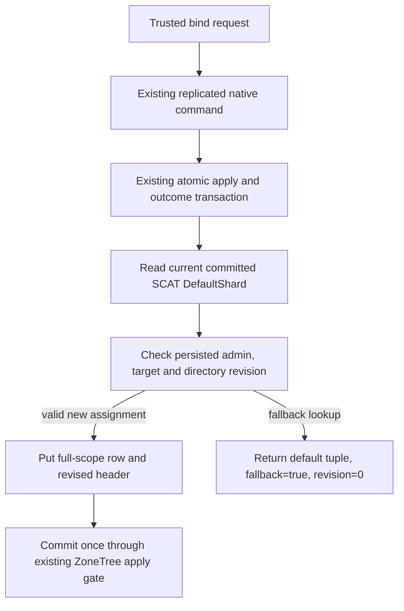

# Atomic partition placement prerequisite

Status: proposed prerequisite contract; implementation and qualification pending. Canonical slice: ClusterRouting. Related: [PhysicalShardCatalog](PhysicalShardCatalog.md), [ADR-016](../../ADR/ADR-016-atomic-physical-placement.md), [ADR-017](../../ADR/ADR-017-ownership-session-tokens.md), and [ADR-101](../../ADR/ADR-101-explicit-atomic-partition-placement.md).

This prerequisite persists explicit atomic-partition assignments while every assignment still resolves to the existing committed `DefaultShard`. It does not move data, change ordinary request routing, or complete KL-036, KL-037, KL-038, KL-071, or KL-072.

## Authority and data contract

The committed SCAT V1 `PhysicalShardCatalog`, its alias, field IDs, key, default record, bootstrap protocol, and startup fence remain byte-for-byte unchanged. Placement is separate additive native state. The directory header and per-assignment rows use new generated Orleans contracts and new KeyCodec spaces; they never replace or reinterpret SCAT V1.

`AtomicPartitionPlacementDirectoryV1` contains `Version=1`, monotonic `Revision`, and `ExplicitAssignmentCount` in `[0,4096]`. Its one header is keyed independently of any partition. An `AtomicPartitionPlacementV1` row is keyed by the complete four-field `PartitionRef` (`TenantId`, `DatabaseId`, `TransactionDomainId`, `PartitionKey`) and carries that same full identity, the complete committed physical-owner tuple (`PhysicalShardId`, `Incarnation`, exact ordered `VoterIds`, `PlacementEpoch`), and positive row `Revision`. The full identity is verified against the key after decode. The physical-owner tuple is copied from the committed SCAT V1 `DefaultShard` in the same transaction/view; a 32-byte atomic-partition digest alone is not an assignment key.

| Generated contract | Stable alias | Field IDs |
|---|---|---|
| `AtomicPartitionPlacementDirectoryV1` | `keyload.contract.atomic-partition-placement-directory.v1` | 0 `Version`; 1 `Revision`; 2 `ExplicitAssignmentCount` |
| `AtomicPartitionPlacementV1` | `keyload.contract.atomic-partition-placement.v1` | 0 `Version`; 1 `Partition`; 2 `PhysicalShardId`; 3 `Revision`; 4 `Incarnation`; 5 `VoterIds`; 6 `PlacementEpoch` |
| `BindAtomicPartitionPlacementRequest` | `keyload.contract.atomic-partition-placement-bind-request.v1` | 0 `Version`; 1 `ExpectedRevision`; 2 `Partition`; 3 `PhysicalShardId` |
| `AtomicPartitionPlacementReadRequest` | `keyload.contract.atomic-partition-placement-read-request.v1` | 0 `Version`; 1 `Partition` |
| `AtomicPartitionPlacementResolution` | `keyload.contract.atomic-partition-placement-resolution.v1` | 0 `Version`; 1 `Partition`; 2 `PhysicalShardId`; 3 `Incarnation`; 4 `VoterIds`; 5 `PlacementEpoch`; 6 `DirectoryRevision`; 7 `Revision`; 8 `IsFallback` |

`BindAtomicPartitionPlacementRequest` carries only version, expected directory revision, the full `PartitionRef`, and the requested `PhysicalShardId`. The server obtains the physical identity tuple from the committed SCAT V1 `DefaultShard` inside the same `IAtomicTransaction` and persists the entire tuple into each row; callers cannot supply incarnation, voters, or placement epoch. Existing-row validation compares every persisted tuple component, including exact voter order, with that same-transaction `DefaultShard`. A mismatch fails as `Corruption`; it never refreshes the stored tuple or falls back. In this prerequisite the only permitted target is that committed default shard. No assignment may establish an unverified second owner.

Header and row encoded values are each limited to 8192 bytes. Directory revision and row revision use checked positive `Int64` increments; counts use checked arithmetic. Malformed persisted shape, noncanonical identity, any mismatch between a row owner tuple and the same-view committed `DefaultShard`, impossible count/revision, oversized value, or an assignment without its required directory header fails closed as `Corruption`. Invalid request shape/version fails `Validation`; encoded request or assignment capacity excess fails `BudgetExceeded`; stale revision or command-content reuse fails `Conflict`; targeting a physical shard other than the committed default fails `UnsupportedCapability`.

A missing assignment resolves in one gated read to an explicit `IsFallback=true`, row `Revision=0` witness plus the validated current default shard tuple. It does not write a row. `DirectoryRevision` is zero when the directory header is absent; otherwise it is the validated current global header revision from this same read view, including for a fallback partition. Existing explicit rows resolve as `IsFallback=false` with their row revision and the row’s complete owner tuple after exact same-view validation against `DefaultShard`. The result is the generated public/native witness returned by Core from that one read; callers must not combine separately observed catalog, row, or directory state. This remains descriptive routing metadata only; no current data-operation path consumes it.

## Requirements and acceptance

- **REQ-PMAP-001 — Atomic bounded native directory.** Persist a generated header and full-scope rows through the existing replicated native command and `IAtomicTransaction` apply gate. **AC-PMAP-001:** real ZoneTree-backed tests prove keyspace isolation for partitions with equal suffixes but different tenant/database/domain, native generated-contract roundtrip of every owner-tuple field, exact create and reopen bytes/values, header/row/count consistency, 4096 assignment ceiling, 8192-byte limits, checked overflow, and rejection of malformed version/shape/key identity or any persisted owner-tuple mismatch without partial mutation.
- **REQ-PMAP-002 — Persisted authority and CAS/idempotency.** Only current persisted cluster administrators may bind an assignment; compare the expected directory revision under the same transaction. **AC-PMAP-002:** real native command tests prove absent fallback has no write, first assignment creates row revision 1, same command/body retry and exact same-target no-op preserve directory/row revisions, stale expected revision and same-ID/different-body conflict leave bytes unchanged, non-admin is denied, unsupported non-default target leaves state unchanged, and healthy follow-up still commits. Reopen proves the committed row and header remain consistent.
- **REQ-PMAP-003 — Public catalog caller surface.** Expose placement binding and same-view resolution through the real typed SDK and official MCP catalogs while preserving the persisted administrator trust boundary and native one-request-grain CQRS path. **AC-PMAP-003:** genuine Aspire RF3 calls through actual SDK and official MCP prove unbound fallback (including directory revision zero before any row), SDK bind with stable command ID, MCP read of the explicit witness, fallback for another unbound partition after the header exists, exact full owner tuple/order, and SDK/MCP agreement on all logical witness fields. Persisted non-admin reads and binds fail `PermissionDenied` without changing the witness. A non-default target remains `UnsupportedCapability`; stale global CAS remains `Conflict`; command-ID exact replay and changed-body conflict retain the native command/outcome behavior. No roles or physical tuple fields are accepted from the caller.
- **REQ-PMAP-004 — RF3 voter reopen.** Demonstrate that public resolution survives every voter process reopen within the existing physical RF3 group. **AC-PMAP-004:** use only the Aspire-owned three-node fixture; sequentially restart each actual voter, awaiting healthy readiness before the next restart, then query all three discovered node endpoints using the real SDK and official MCP clients. Every result carries the same committed partition/owner tuple, explicit/fallback state, and independently valid directory/row revisions. Do not assert equal read-cut positions across separate requests, claim power-loss durability, or count physical replicas as separate owners.

Traceability: REQ-PMAP-001 → AC-PMAP-001 → ADR-101 stages 1–2 → `AtomicPartitionPlacementNativeContractTests`, `AtomicPartitionPlacementResolutionTests`, and `AtomicPartitionPlacementCorruptionTests`; REQ-PMAP-002 → AC-PMAP-002 → ADR-101 stages 1–2 → `AtomicPartitionPlacementCommandTests`; REQ-PMAP-003/004 → AC-PMAP-003/004 → ADR-101 stage 3 → new `AtomicPartitionPlacementPublicRf3Tests` and feature-local SDK/MCP assertions. Native unit tests alone are not RF3 or SDK/MCP qualification.

## Ordered implementation and remaining qualification

1. Add new Abstractions generated contracts and Core feature-local native keys, serializer, validation, same-view resolver, and command handler. The Core read returns the public generated witness directly. The integration owner appends the operation enum values and wires native normalization/dispatch; existing numeric values remain unchanged.
2. Add actual ZoneTree UnitTests using the existing test database/fixture patterns, including raw native corruption setup, generated roundtrip of the full public witness, and reopen.
3. Add typed Server routes and MCP catalog entries that use the existing `ApiGrainDispatch`/`CanonicalOperationGateway`, plus SDK extension methods over shared `KeyLoadClient.Send<T>`. Both read and write reload the caller's persisted principal; both require persisted `ClusterAdministrator`. The binding route dispatches the existing PMAP native command; the read route dispatches through the existing `DatabaseReadGrain` and returns the same-view generated Core result.
4. Add real Aspire RF3 SDK and official MCP cases, including sequential voter restarts. Root retains the required build, formatter, unit, recovery, and complete RF3 gates. No source-stage or qualification status is asserted by this private amendment.

The future physical transfer requires its own fenced source cut, target ownership, replication/catch-up, publication, rollback, and token-lineage contracts under KL-036/071/072. Until those stages are accepted and qualified, all current configured work remains on `DefaultShard` and this directory is not a routing authority.

