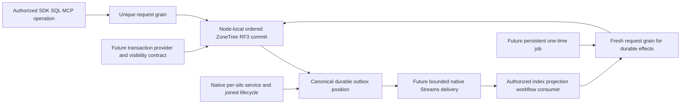

# ClusterRouting: Orleans capability review for KeyLoad

Date: 2026-10-05. Scope: documentation and source review; no runtime/provider
changes or qualification. Owner: KeyLoad lead. Related contract:
[ExecutionPrimitives](ExecutionPrimitives.md), REQ/AC-ORL-001..010 and
[ADR-110](../../ADR/ADR-110-native-orleans-execution-primitives.md).

This inventory records the review snapshot before implementation approval.
The current, unqualified native-service, telemetry and journal-backed jobs
integration is tracked in [RuntimeAdoption](RuntimeAdoption.md) and
[RuntimeJournal](RuntimeJournal.md); their source does not close runtime gates.

## Coverage and decision method

The owner requested a broad review of Orleans documentation, explicitly including
Durable Jobs, local services, message buses and transactions. The review covers
the capability families in the [official documentation index](https://learn.microsoft.com/en-us/dotnet/orleans/),
the [overview](https://learn.microsoft.com/en-us/dotnet/orleans/overview), linked
Learn topics, and version-sensitive APIs/source at
[v10.4.0](https://github.com/dotnet/orleans/releases/tag/v10.4.0), matching the
current central package manifest. It is a capability review, not a claim that
every tutorial/video or historical deployment example was read line by line.

Three read-only reviews cover state/time, messaging and runtime/lifecycle. Root
joins them against actual KeyLoad composition and canonical storage contracts.
`Source-present` means code/registration exists; it does not mean its complete
runtime gates passed. `Candidate` means useful after a concrete owning contract
and real-operation proof. `Defer` means there is no current matching requirement
or the required storage/rollout boundary is unresolved. Priorities below are
architecture judgments; no measured speed or memory benefit is inferred.

## Messaging, execution and response flow

| Capability / primary source | Current source and useful KeyLoad application | Required join |
|---|---|---|
| Grain identity, direct RPC, delivery/retries — [delivery](https://learn.microsoft.com/en-us/dotnet/orleans/implementation/messaging-delivery-guarantees) | Source-present: unique request -> read/partition grains and signed, bounded replica RPC exchange. Default non-retried RPC is at-most-once delivery; timeout can hide an already committed effect. Keep stable command outcome identity and bounded retries. | Existing signed scope, fresh persisted policy and RF3 receipt remain the authority. Retried database operations must deduplicate effects; native RPC does not persist application receipts. |
| Native `IAsyncEnumerable` response — [request API](https://github.com/dotnet/orleans/blob/v10.4.0/src/Orleans.Core.Abstractions/Runtime/AsyncEnumerableRequest.cs), [enumerator lifecycle](https://github.com/dotnet/orleans/blob/v10.4.0/src/Orleans.Core/Runtime/AsyncEnumerableGrainExtension.cs) | Source-present: ManagedCode.Communication CQRS chunks through the unique request grain, capacity/backpressure, explicit native batch size and joined disposal. Current product protocol is two chunks, Started plus terminal; richer row/search/blob/progress chunks remain candidates. | Call-scoped remote enumerators are activation-memory state; native StartEnumeration/MoveNext/DisposeAsync are AlwaysInterleave. Cancellation/early disposal, slow consumer, identity isolation, expiry/restart and terminal failure tests; no durable subscription claim. |
| Orleans Streams / `IAsyncStream<T>` — [overview](https://learn.microsoft.com/en-us/dotnet/orleans/streaming/) | Candidate: decoupled post-commit distribution to index/projection and workflow consumers. There is no configured native stream provider in current product composition; KeyLoad EventStreams are separate committed database records. | Pick exact provider and canonical outbox handoff, consumer dedup/checkpoint/authority, ordering and replay contracts. Publishing to a stream does not acknowledge a KeyLoad write. |
| Explicit/implicit subscriptions and `PubSubStore` — [stream APIs](https://learn.microsoft.com/en-us/dotnet/orleans/streaming/streams-programming-apis) | Candidate: activation-aware bounded consumers instead of a global dispatcher. Persist subscription metadata where required and reattach handlers after activation loss. | Bound namespaces, subscription count, lifetime and deletion/revocation. [Native 10.4 storage lookup](https://github.com/dotnet/orleans/blob/v10.4.0/src/Orleans.Streaming/PubSub/PubSubRendezvousGrain.cs) accepts stream-provider-named storage before PubSubStore; register the intended identity explicitly. |
| Persistent providers, rewind/checkpoints, queue cache — [providers](https://learn.microsoft.com/en-us/dotnet/orleans/streaming/stream-providers), [implementation](https://learn.microsoft.com/en-us/dotnet/orleans/implementation/streams-implementation/) | Candidate: actual durable transport when replay and independent consumers are required. Native pulling agents distribute queues; transport, retention and failure behavior depend on provider. | Freeze delivery retry window/failure handler, cache bytes/age, consumer lag and poison-record policy. Local queue-cache rewind is not durable restart replay; canonical feed positions retain their own meaning. |
| Stateless-worker stream consumption — [tagged tests](https://github.com/dotnet/orleans/blob/v10.4.0/test/Orleans.Streaming.Tests/StreamingTests/StatelessWorkersStreamTests.cs) | Candidate: interchangeable live preprocessing under bounded worker identities. Version 10.4 supports a constrained native path even though older Learn text describes subscriptions as undefined. | [Native restrictions](https://github.com/dotnet/orleans/blob/v10.4.0/src/Orleans.Streaming/Internal/StreamConsumerExtension.cs) require IStreamSubscriptionObserver, null sequence token and latest start position. Do not assign canonical ordered replay/checkpoint ownership to interchangeable activations. |
| Broadcast channels — [broadcast](https://learn.microsoft.com/en-us/dotnet/orleans/streaming/broadcast-channel) | Candidate: low-cost "refresh/wake may help" fan-out whose loss is repaired by canonical revalidation/sweeps. No current registration. | No durable history. Awaiting non-fire-and-forget fan-out changes error observation, not persistence. Existing authorization/cache lease/replica receipts cannot be converted into advisory signals. |
| Observers — [observers](https://learn.microsoft.com/en-us/dotnet/orleans/grains/observers) | Defer until a native Orleans client/status-push requirement exists; current public SDK/MCP uses HTTP-facing operation contracts. Potential use: ephemeral admin/operation progress. | Bound registration/expiry/unsubscribe/reconnect and DeleteObjectReference; authorize delivery and retain normal operation status/replay. Observers cannot carry required audit/event delivery. |
| OneWay, worker pools, selective interleaving — [method matrix](ExecutionPrimitives.md) | Candidate choices already audited per method. Preserve reliable serial partition/due paths; use workers for pure preparation and selective control for waits. | Exact method, invariant, per-key/per-silo/aggregate quotas and real caller fault/cancellation tests; no blanket attributes. |
| RequestContext and call filters — [context](https://learn.microsoft.com/en-us/dotnet/orleans/grains/request-context), [filters](https://learn.microsoft.com/en-us/dotnet/orleans/grains/interceptors) | Source-present: native typed subject-only context via ManagedCode.Orleans.Identity and Graph's default-deny call-filter transitions, including native enumeration handling. Candidate: bounded safe telemetry/operation correlation. | Context is propagated metadata, not current authority. Stream batches can retain producer context; reload persisted policy and restore context exactly rather than replaying trusted roles. Native extension methods require their real enumeration/filter contract. |
| Cancellation, call deadlines, external tasks, grain extensions — [cancellation](https://learn.microsoft.com/en-us/dotnet/orleans/grains/cancellation-tokens), [external tasks](https://learn.microsoft.com/en-us/dotnet/orleans/grains/external-tasks-and-grains), [extensions](https://learn.microsoft.com/en-us/dotnet/orleans/grains/grain-extensions) | Source-present: cancellation/deadlines and joined node-local search execution. Extensions support infrastructure such as native enumeration; defer a new domain dispatcher. | Cancellation does not prove rollback. Escaped work must not access activation fields/read views after lifetime end. Preserve native scheduler ownership and bounded execution; no unjoined Task.Run or custom parallel CQRS dispatcher. |

## State, transactions and scheduling

| Capability / primary source | Current source and useful KeyLoad application | Required join |
|---|---|---|
| Activation state and disposable grain caches — [lifecycle](https://learn.microsoft.com/en-us/dotnet/orleans/grains/grain-lifecycle) | Source-present: routing/request lifecycle. Candidate: bounded shard/control metadata or validated cache entries that can be rebuilt after migration. | Authorized scoped read-cut/policy-epoch identity, byte/entry budget, eviction/invalidation and restart tests under ResourceExecution. Activation state cannot become write/credential authority. |
| `IPersistentState<T>` / custom `IGrainStorage` — [persistence](https://learn.microsoft.com/en-us/dotnet/orleans/grains/grain-persistence/), [custom provider](https://learn.microsoft.com/en-us/dotnet/orleans/tutorials-and-samples/custom-grain-storage) | Candidate: bounded native coordinator/job snapshots through a canonical ZoneTree/RF3 adapter; current product grains use no persistence facet. Native APIs allow custom storage, so an external database is not mandatory. | Exact state-name/identity mapping, generated format, ETag CAS, fresh authority, uncertain-write recovery and no recursive provider->waiting-grain activation cycle. No two writable copies of canonical state. |
| Distributed ACID / `ITransactionalState<T>` — [transactions](https://learn.microsoft.com/en-us/dotnet/orleans/grains/transactions), [isolation overview](https://learn.microsoft.com/en-us/dotnet/orleans/overview) | Candidate: short bounded multi-grain control transactions or a defined cross-partition SQL transaction stage. Orleans supplies distributed serializable transactions for participating transactional state. Current KeyLoad atomic batches use their own canonical store/commit contract. | UseTransactions, native package, transaction options, reentrant transactional grains and synchronous PerformRead/PerformUpdate. Ordinary DatabaseEngine/ZoneTree calls do not enlist automatically. Long workflows still use canonical saga/outbox state. |
| `ITransactionalStateStorage<T>` and transaction committers — [storage API](https://github.com/dotnet/orleans/blob/v10.4.0/src/Orleans.Transactions/Abstractions/ITransactionalStateStorage.cs), [committer API](https://github.com/dotnet/orleans/blob/v10.4.0/src/Orleans.Transactions/Abstractions/ITransactionCommitter.cs) | Candidate: native integration over RF3-persisted prepares/commit/abort metadata, including a defined effect/outbox join. This is a dedicated storage protocol, not a plain KV adapter. | Coherent Load of ETag/committed sequence/pending prepares; Store can partially persist before failure, requiring reload/recovery. Define public read visibility and all-or-abort effects. Ordinary grain-storage bridge is development-only; commit hooks do not prove arbitrary external atomicity. |
| `JournaledGrain`, confirmed events and log-consistency providers — [event sourcing](https://learn.microsoft.com/en-us/dotnet/orleans/grains/event-sourcing/journaledgrain-basics), [providers](https://learn.microsoft.com/en-us/dotnet/orleans/grains/event-sourcing/log-consistency-providers) | Candidate: bounded event-driven coordinator history. Defer built-in whole-history LogStorage for unbounded database events; custom storage can use canonical records. RaiseEvent alone is not persistence confirmation. | Deterministic replay, version CAS, ConfirmEvents/conditional append, bounded snapshots/tail and uncertain outcome tests. KeyLoad EventStreams and replication/atomic journals remain distinct. |
| `Orleans.Journaling`, durable collections/completion and custom state machines — [tagged README](https://github.com/dotnet/orleans/blob/v10.4.0/src/Orleans.Journaling/README.md) | Candidate: bounded durable operation/job coordination; matching package is 10.4.0-alpha.1. Durable completion persists a result/completion state, not an arbitrary C# stack continuation. | Explicit native binary/generated format under KeyLoad policy; default JSON Lines is not an approved new internal format. Test write-failure fencing, canceled waits with writes still running, replay/compaction/corruption and stable component names. |
| Journal storage/catalog and named providers — [tagged API](https://github.com/dotnet/orleans/blob/v10.4.0/src/api/Orleans.Journaling/Orleans.Journaling.cs) | Candidate: canonical ZoneTree/RF3 append/conditional metadata/catalog implementation needed by native durable jobs. Upstream Blob/Table/Redis/S3 and volatile options are available; none is selected here. | Same storage/catalog/state-manager namespace, ownership/ETag fencing, live-list duplicates, bounded discovery and cancellation. New journals must not discard current recovery/replication journals. |
| Durable Jobs — [tagged README](https://github.com/dotnet/orleans/blob/v10.4.0/src/Orleans.DurableJobs/README.md) | Candidate: persisted one-time saga expiry, delayed wake-up or maintenance step. Retain current canonical recurring/saga records and fresh authorized request per effect. | Persistent provider/catalog, bounded metadata/concurrency/retry, stable occurrence fences, atomic enqueue or durable reconciliation, missed-due restart and cancel/dispatch-race tests. Running attempt can finish after cancellation. |
| Grain timers — [timers/reminders](https://learn.microsoft.com/en-us/dotnet/orleans/grains/timers-and-reminders) | Candidate: activation-local polling/cache maintenance. No current RegisterGrainTimer in product source; due discovery already uses its native service loop. | Freeze Interleave/KeepAlive, callback budget and joined disposal. Timer stops with activation; it cannot hold a durable schedule. |
| Reminders — [timers/reminders](https://learn.microsoft.com/en-us/dotnet/orleans/grains/timers-and-reminders) | Candidate: infrequent maintenance/reconciliation wake-up. No current reminder provider. A persistent recurring definition can wake an inactive grain. | Missing ticks during downtime require canonical catch-up; not a replacement for the one-second due scan. Native persistent reminder-provider/ZoneTree adapter and unregister/failover tests. |

## Local services, placement and operating the cluster

| Capability / primary source | Current source and useful KeyLoad application | Required join |
|---|---|---|
| GrainService / GrainServiceClient — [services](https://learn.microsoft.com/en-us/dotnet/orleans/grains/grainservices) | Source-present: PartitionReplicaGrainService and RecurringDueGrainService. Candidate: co-located partitioned runtime support and bounded maintenance discovery. | Service runs per silo, not once per cluster. Freeze partition/leader ownership, readiness, concurrency and joined stop; route business effects through an authorized request grain. |
| Silo-local DI, BackgroundService / IHostedService — [startup/host work](https://learn.microsoft.com/en-us/dotnet/orleans/host/configuration-guide/startup-tasks) | Source-present: borrowed DatabaseEngine, replica/coordinator, native request admission, QueryEngine/SearchEngine and discovery in silo DI. Candidate: host-local external-feed/telemetry adapters when no grain-service routing is needed. | DI singleton means one container instance, not a cluster singleton. Shared services need their own concurrency/ownership; never infer protection from one caller grain's turns. Loops need partitioning/leader fencing and joined host shutdown. |
| Startup tasks, ISiloLifecycle and IGrainLifecycle — [silo lifecycle](https://learn.microsoft.com/en-us/dotnet/orleans/host/silo-lifecycle), [grain lifecycle](https://learn.microsoft.com/en-us/dotnet/orleans/grains/grain-lifecycle) | Source-present: replica transport Init and RuntimeStorageServices shutdown participant. Candidate: exact provider/resource initialization stages and activation-local subscriptions/resources. No application AddStartupTask registration in current source. | Fail deterministic initialization promptly; preserve transport-before-membership bootstrap and reverse shutdown order. Do not initialize business data per silo or wait for ordinary grain placement before membership is usable. Stop/deactivation callbacks may never run after a process/silo crash; cleanup hooks cannot own a required durable effect or recovery guarantee. |
| Placement, filters, metadata and hints — [placement](https://learn.microsoft.com/en-us/dotnet/orleans/grains/grain-placement), [filters](https://learn.microsoft.com/en-us/dotnet/orleans/grains/grain-placement-filtering) | Source-present: PreferLocal request/read/partition grains. Candidate: hardware/role/locality constraints for future independent query/search compute; scoped hints for compatible targets. | Placement/activation affinity is not physical replica selection. Node-local storage owner tuple and catalog remain authoritative; [Native hints](https://github.com/dotnet/orleans/blob/v10.4.0/src/Orleans.Runtime/Placement/PreferLocalPlacementDirector.cs) must resolve compatible eligible silos. Role metadata/hints come from trusted server configuration/context, never caller-controlled physical-owner or authorization decisions; bound their scope and test actual placement/migration. |
| Distributed grain directory, activation repartitioning/rebalancing — [directory](https://learn.microsoft.com/en-us/dotnet/orleans/host/grain-directory), [load balancing](https://learn.microsoft.com/en-us/dotnet/orleans/implementation/load-balancing) | Source-present: experimental strongly consistent in-cluster AddDistributedGrainDirectory and locality-oriented AddActivationRepartitioner with exactly scoped existing opt-ins. Resource rebalancing is a separate experimental candidate, not currently enabled. | Logical activation movement must leave ZoneTree/WAL/file handles at physical owners. Freeze repartitioner bounds and prove forced live movement; directory consistency is not RF3 database consensus and format-upgrade tests are not activation-migration proof. |
| Activation collection/shedding, silo load shedding, message/queue limits — [collection](https://learn.microsoft.com/en-us/dotnet/orleans/host/configuration-guide/activation-collection), [tagged queue options](https://github.com/dotnet/orleans/blob/v10.4.0/src/Orleans.Runtime/Configuration/Options/SiloMessagingOptions.cs) | Source-present: explicit message-byte bound and KeyLoad NativeRequestWorkOwner limits/drain. Candidate: explicit native idle collection, memory-pressure response and per-activation queue thresholds. Tagged default request-queue limits are disabled; no override is configured here. | Native LoadSheddingOptions targets gateway/stream paths; KeyLoad gateway port is zero and public callers use cohosted IGrainFactory, so it cannot replace public admission. Freeze actual quotas/error semantics and test retained RAM, saturation, cancellation/failover and healthy following calls. |
| Generated serialization, immutable types, surrogates/codecs — [serialization](https://learn.microsoft.com/en-us/dotnet/orleans/host/configuration-guide/serialization), [immutability](https://learn.microsoft.com/en-us/dotnet/orleans/host/configuration-guide/serialization-immutability) | Source-present: generated aliases/Ids, native internal binary payloads and identity/CQRS surrogate registration. Candidate: proven immutable DTOs to reduce defensive-copy cost and fewer redundant encodings. | Audit underlying owned buffers, stable wire/codec fields and retained lifetime before skipping copies. Public JSON/exact document bytes, digests, checksums and durability barriers remain exact; measure allocations/RAM. |
| Client hosting, Aspire orchestration and membership providers — [clients](https://learn.microsoft.com/en-us/dotnet/orleans/host/client), [Aspire](https://learn.microsoft.com/en-us/dotnet/orleans/host/aspire-integration) | Source-present: server's silo factory, custom persisted membership and AppHost-owned Docker RF3/test runners. Native Azure/Redis/ADO.NET/Consul recipes are reference alternatives, not selected replacements. | Preserve intended fixed voters, discovered SDK/MCP endpoints and cleanup of every owned resource. Replacing canonical membership/provider topology needs its own decision and fault proof. |
| Heterogeneous silos, grain versioning and compatibility — [versioning](https://learn.microsoft.com/en-us/dotnet/orleans/grains/grain-versioning/grain-versioning), [heterogeneous silos](https://learn.microsoft.com/en-us/dotnet/orleans/host/heterogeneous-silos) | Source-present: aliased/versioned interfaces and compatibility fences. Candidate: explicit read/compute roles and qualified rolling API deployment. | Native version selection does not migrate database state, persisted tokens or preview-provider formats. Mixed-version/RF3 rollout tests, homogeneous format fences and rollback remain separate. |
| Metrics/traces, native Dashboard, server GC — [monitoring](https://learn.microsoft.com/en-us/dotnet/orleans/host/monitoring/), [Dashboard](https://learn.microsoft.com/en-us/dotnet/orleans/dashboard/), [GC](https://learn.microsoft.com/en-us/dotnet/orleans/host/configuration-guide/configuring-garbage-collection) | Source-present: generic HTTP/runtime OTel, KeyLoad diagnostics and its own admin dashboard. First candidate: explicit Microsoft.Orleans meter/activity export into existing Aspire telemetry, followed by measured GC/runtime profiles. No native Dashboard registration or explicit server-GC setting found in inspected composition; effective GC mode remains unverified. | Authenticated private operator surface, fixed low-cardinality metrics, no payloads/credentials/principal IDs. Native telemetry shows runtime behavior, not power-loss durability or website performance proof. |
| TLS, deployment/failure handling and resources — [TLS](https://learn.microsoft.com/en-us/dotnet/orleans/host/transport-layer-security), [deployment](https://learn.microsoft.com/en-us/dotnet/orleans/deployment/), [failures](https://learn.microsoft.com/en-us/dotnet/orleans/deployment/handling-failures) | Source-present: signed peer/request protocols and Docker/Aspire topology. Candidate: exact native network TLS/certificate and target-deployment configuration. Azure/Kubernetes/Service Fabric/Consul/legacy recipes were classified as deployment-specific references. | Certificate rotation/peer compatibility/readiness and process/partition fault tests under an owning deployment decision. Cluster failure recovery alone is not canonical committed-data recovery. |
| TestingHost/TestCluster, samples, best practices and migration guides — [testing](https://learn.microsoft.com/en-us/dotnet/orleans/implementation/testing), [practices](https://learn.microsoft.com/en-us/dotnet/orleans/resources/best-practices), [samples](https://learn.microsoft.com/en-us/dotnet/orleans/tutorials-and-samples/) | Source-present: native mechanism fixtures inside Aspire-launched TUnit, separate process and SDK/MCP RF3 suites. Samples help inspect native APIs; older builder/serializer/provider examples are not current acceptance evidence. | Current tagged API and real production provider/fault flow; no substitute topology, mocks, direct caller-side dotnet test, unbounded global coordinator or copied dispatcher. |

## Recommended order and concrete integration boundaries

1. Preserve and finish qualification of existing service/lifecycle, context,
   native result-stream and directory joins. Export native Orleans metrics/traces
   into existing Aspire diagnostics; select explicit resource/queue/GC and
   repartitioner budgets after an owned profile and overload/outcome contract.
2. Freeze the first native Streams flow: canonical committed outbox position ->
   bounded authorized notification -> index/projection consumer -> fresh request
   for any durable effect. Provider selection and one end-to-end recovery oracle
   precede implementation; neither a generic bus nor delivery success is authority.
3. Select one bounded pure worker operation and narrow long-operation control;
   compare message/serialization overhead to its actual current execution. Keep
   shard/cache coordination disposable and tied to read cuts/epochs.
4. Resolve the native journal/provider contract for Durable Jobs, then a one-time
   saga expiry/wake-up. Preserve canonical recurrence/generation and catch-up;
   test persistence and duplicate/cancel/revocation outcomes before replacing a
   wake mechanism.
5. Investigate a native transaction storage adapter as its own product workstream.
   It can be built over canonical storage, but needs RF3-persisted prepare/commit
   state, read visibility, stable outcomes, bounded contention and recovery. Do
   not advertise cross-partition SQL ACID from native API availability alone.

## Actual source joins and qualification

- [OrleansSiloConfiguration](../../../src/KeyLoad.Server/Features/ClusterRouting/Hosting/OrleansSiloConfiguration.cs) owns borrowed DI, message bound, services, serializer registration, native directory/repartitioner and Graph transitions.
- [Replica service](../../../src/KeyLoad.Orleans/Features/ClusterReplication/GrainServices/PartitionReplicaGrainService.cs), [transport lifecycle](../../../src/KeyLoad.Orleans/Features/ClusterReplication/Transport/ReplicaTransportLifecycle.cs) and [due service](../../../src/KeyLoad.Orleans/Features/Messaging/GrainServices/RecurringDueGrainService.cs) own real per-silo startup/dispatch/stop joins.
- [Native request owner](../../../src/KeyLoad.Orleans/Features/ClusterRouting/Streaming/NativeRequestWorkOwner.cs) and [OrleansNode](../../../src/KeyLoad.Server/Features/ClusterRouting/Hosting/OrleansNode.cs) own bounded admission, cancellation and drain before physical cleanup.
- [StorageContracts](../../../src/KeyLoad.Abstractions/Storage/StorageContracts.cs), [EventStreams](../EventStreams.md), [Messaging](../Messaging.md), [ChangeFeeds](../ChangeFeeds.md) and [ResourceExecution](../ResourceExecution.md) retain canonical data/effect/cursor/cache contracts.

REQ/AC-ORL-007..010 and TASK-ORL-SERVICES/MESSAGING/STATE/CAPABILITY-REVIEW in the
owning specification map this review to follow-up contracts and tests. Current
documentation acceptance uses actual source and primary-API review plus static
links/governance/diagram/JSON checks; it has an explicit review exception rather
than attribute/property-only tests. Future proof must execute actual committed
operations and verify state/errors across provider loss, retry, reordered or lost
signals, slow consumption, context/revocation, transaction abort/conflicts,
startup failure, migration and joined shutdown. All runtime joins use the owning
Aspire unit/scalar/recovery/RF3 entry, real .NET and official MCP clients, and
exact-source Linux evidence. Full gates and performance qualification stay open.

Documentation verification, 2026-10-06: joined three independent read-only
reviews; checked 226 local links across the owning docs/navigation, 14 tagged
native source paths, all ten REQ/AC pairs and status JSON. Repository governance
and whitespace checks passed; all three owning Mermaid diagrams rendered to
SVG. Corrected the existing stale TransactionTests navigation to its current
feature-local owner. No production code, dependencies or runtime settings were
changed by this review; build, runtime/fault suites and performance qualification
were not executed for this documentation-only stage.
