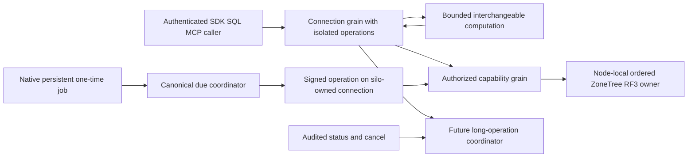

# ClusterRouting: native Orleans execution and scheduling primitives

Status: owner-directed selection and audit contract accepted; runtime adoption and
qualification pending. Date: 2026-10-05. Decision:
[ADR-110](../../ADR/ADR-110-native-orleans-execution-primitives.md).

The owner's follow-up broad review, including local services, messaging and
transactions, is in [CapabilityReview](CapabilityReview.md). It owns the complete
capability/source/priority inventory; this specification owns REQ/AC and tasks.

## Purpose and current boundary

Use Orleans' native primitives to admit useful independent work without losing
the database's ordered effects, bounded memory or request identity. Actors are
the authenticated SDK/SQL/MCP caller, its server-owned connection grain, capability grains,
partition due coordinator and node-local RF3 storage owner. Public operations
continue through the existing signed native CQRS path.

The source pins Orleans 10.4.0 and matching Journaling/DurableJobs
10.4.0-alpha.1 in [Directory.Packages.props](../../../Directory.Packages.props).
The approved implementation now registers a bounded RF3-backed native journal
provider and already-due saga jobs under [RuntimeJournal](RuntimeJournal.md),
plus native local-service wake and telemetry under [RuntimeAdoption](RuntimeAdoption.md).
These sources remain unqualified. ADR-125 replaces operation-keyed request/read
activations with one connection activation and bounded independent operation
contexts. Production StatelessWorker, OneWay and blanket Reentrant attributes
remain unselected for the inspected methods.

This specification owns the durable policy, method audit and REQ/AC inventory.
The linked adoption contracts own executable stages and reader rollout.
Frontend: N/A, no new UI. Client schemas: N/A for these stages; existing SDK/MCP
operation contracts remain the qualification entry points.

## Connection and request lifetimes

Owner correction 2026-10-09 selects **one grain per actual connection** and
parallel independent reads and commands on that grain. [ClientApi](../ClientApi.md#persistent-connection-ownership)
and [ADR-125](../../ADR/ADR-125-connection-owned-execution.md) freeze physical
Kestrel connection ownership, typed bounds, operation identity, native scheduling
and joined teardown. A new signed operation GUID is correlation and authority
input; it does not create an activation. Reads execute in call-local
ConnectionReadExecution through the same authorized capability and RF3 paths.

The connection retains only immutable borrowed dependencies and bounded live
operation bookkeeping. Payloads, principals, results, leases, deadlines and read
cuts belong to each call and settle after success, rejection, failure,
cancellation, deadline or early disposal. Current persisted authorization is
reloaded for every operation. No completed-operation history, storage handle,
trusted-role cache or persisted connection state is retained.

Native streaming interleaving allows independent operation turns while another
operation awaits. CloseAsync is a narrow AlwaysInterleave control method; signed
control validation precedes cancellation and joined cleanup. Only connection
close, idle expiry or native activation shutdown requests DeactivateOnIdle after
original producers settle. Finishing one operation leaves the connection usable.
CommandPartitionGrain and node-local ordered apply remain serial for the same
atomic partition. HTTP/2 proves simultaneous SDK operations on one physical
connection; official MCP SDK qualification uses its actual persistent transport.

Validated defaults admit at most 4,096 physical connections per node and eight
operations per connection, with no operation waiting queue and a two-minute
idle timeout. Existing per-silo limits of 64 producers and 128 execution frames
remain in force. Disconnect stops admission, cancels live calls and joins original
work before native close. Server shutdown closes connections before stopping the
silo. Silo-owned background execution uses one lifetime owner and separate signed
operation contexts. Native activation inventories must prove reuse and removal;
source callbacks alone do not prove RAM recovery or performance improvement.

## Per-grain and method selection

| Current owner / method | Decision and concrete reason |
|---|---|
| `ClusterRouting/Grains/ConnectionGrain.ExecuteStreamAsync` | Reuse the actual connection key. Native streamed calls interleave with bounded isolated operation ownership, fresh signed identity and authorization. Producer cleanup releases only its live call; close joins all original work before activation deactivation. |
| `ClusterRouting/Queries/ConnectionReadExecution.ExecuteAsync` | Use call-local read execution within the connection activation; no read activation or retained request state. Preserve admission, authorized read cuts and cleanup, including backup/admin lifecycle work. LiveQueryStart returns a snapshot/cursor without retaining it in the connection. |
| `ClusterRouting/Grains/CommandPartitionGrain.ExecuteAsync` | Keep non-reentrant serial partition routing and an awaited reply. Neither StatelessWorker, OneWay nor broad interleaving replaces the ordered node-local apply gate or the RF3 terminal receipt. |
| `Messaging/Grains/RecurringDueCoordinatorGrain.ProcessDueAsync` | Keep the reliable serial protocol in ADR-094, including fresh authority, canonical occurrence fences and bounded uncertainty retry. OneWay or interleaving here would silently change settlement/concurrency. |
| `ClusterReplication/GrainServices/PartitionReplicaGrainService` and `Messaging/GrainServices/RecurringDueGrainService` | Already source-present native per-silo services. Retain authenticated replica transport and leader-fenced due discovery, bounded dispatch and joined stop; neither service is a cluster singleton or the owner of moved storage files. |
| Future bounded pure query/search transform grain behind the request boundary | Evaluate StatelessWorker for bounded SQL parsing/tokenization, immutable chunk transformation, scoring or pre-aggregation. Reuse actual `SqlParser.Parse` / `SqlTokenizer.Lex` with fresh call-local state, or bounded copied inputs from an authorized read cut; return bounded typed results to its owner. Workers retain no authoritative data, storage handles, trusted roles, shared cursors or occurrence state. |
| Future long-operation control methods | Prefer a narrow AlwaysInterleave status/cancel method or audited MayInterleave predicate when a long operation awaits. Status reads bounded snapshots; cancel records cooperative intent and returns an awaited outcome. Reentrant is justified only after all methods' state across awaits are audited and measured contention warrants it. |
| Future disposable wake-up/refresh hint method | Evaluate OneWay only if loss, duplication and reordering are harmless and a canonical bounded sweep/revalidation guarantees progress without the hint. Existing revocation, lease acknowledgements, commands, due dispatch and stream terminal frames stay reliable. |
| `RecurringDueCoordinatorGrain.ExecuteJobAsync` and native saga wake-up adapter | Approved source integration under RuntimeJournal, pending qualification. Native Durable Jobs trigger canonical due processing after reloading current persisted creator and saga state, with a fresh signed request and RF3 effect. Canonical schedule, saga watermark and command outcomes retain their authority. |

Current grain/service paths in the first five rows are relative to
[KeyLoad.Orleans/Features](../../../src/KeyLoad.Orleans/Features/).
Worker, control and advisory-hint candidates remain unimplemented; native jobs
source integration does not close its acceptance criteria.

Implementation authorized on 2026-10-06; concrete staged contracts are in
[RuntimeAdoption](RuntimeAdoption.md).

## Requirements and acceptance

| Requirement | Measurable acceptance / flows | Evidence mapping |
|---|---|---|
| REQ-ORL-001: select native primitives per invariant and actual method, preserving request/storage/trust boundaries. | AC-ORL-001: every requested primitive has a native-source guarantee and an explicit candidate or rejection above; audit identifies identity, awaits, fields, external effects and completion requirements. Fresh signed operation isolation, serial commit and canonical due paths remain intact. | TASK-ORL-AUDIT / CONTRACT; source/doc review is the explicit static-evidence exception because this stage changes no executable behavior. |
| REQ-ORL-002: bound interchangeable worker execution and retained inputs/results. | AC-ORL-002: real query/search operations at saturation preserve a scalar result oracle; actual per-key/per-silo activation count, aggregate in-flight count/bytes and retained chunk bytes never exceed frozen bounds. Queue full/cancellation/slow consumer/activation loss release work and reject or recompute disposable work without an unauthorized storage call. | TASK-ORL-WORKERS; planned TUnit `Features/ClusterRouting/Cases/StatelessWorkerOperationTests.cs` plus real SDK/MCP RF3 workload. Test names are future ownership, not existing evidence. |
| REQ-ORL-003: OneWay carries only advisory, authenticated, bounded, loss-tolerant signals. | AC-ORL-003: real affected operation makes progress after target loss and a dropped hint, duplicate/reordered hints cause no duplicate canonical effect, and completion/authorization correctness does not depend on the signal. Overload has a frozen sender-rate/coalescing policy without an unbounded mailbox assumption. | TASK-ORL-HINTS; planned real-process and Aspire RF3 `OneWayHintRecoveryTests` through the affected operation. |
| REQ-ORL-004: enable only invariant-safe interleaving, with fresh isolated identity and bounded admission. | AC-ORL-004: a real blocked long operation admits status/cancel within its configured deadline; two principals/streams retain distinct request identity and read cuts across awaits, revocation is enforced, cancellation does not claim rollback of a committed effect, and serial partition order is unchanged. Negative flow rejects unauthorized control and leaves state intact. | TASK-ORL-CONTROL; planned TUnit/RF3 `InterleavedOperationControlTests`, joined with existing NativeCqrs identity, admission and lifetime regressions. |
| REQ-ORL-005: persistent one-time jobs preserve at-least-once delivery and canonical effect idempotency. | AC-ORL-005: real persistent-provider restart/leader loss after due time, retry after handler failure and cancellation racing dispatch produce either the canonical fenced effect once or an explicit non-effect outcome. A revoked creator, stale schedule generation and corrupt provider data cannot produce effects. Missed recurring work is derived from canonical logged-time state. | TASK-ORL-JOBS; planned real-process `DurableJobRecoveryTests` and Aspire RF3 official SDK/MCP `DurableJobOperationTests`; existing DueCoordination and RecurringSaga regressions remain mandatory. |
| REQ-ORL-006: qualify useful efficiency rather than assuming attributes create parallelism or durability. | AC-ORL-006: same-corpus/durability/topology before/after evidence records latency/p95/p99, throughput, allocations, server RAM, mailbox/in-flight work and due lag as applicable; correctness, bounded overload, cancellation and RF3 gates pass without weakening admission. No acceleration claim precedes comparable authenticated Linux GitHub evidence. | TASK-ORL-VERIFY; real native operation suites and original matched measurement artifacts. Stress/performance runs do not contribute to coverage. |
| REQ-ORL-007: select native per-silo services and ordered lifecycle hooks by actual ownership. | AC-ORL-007: source audit distinguishes existing replica/due GrainServices, borrowed silo-local services, activation hooks and startup tasks; any new implementation proves real three-silo startup, readiness, duplicate-loop prevention, cancellation and joined shutdown without a quorum-bootstrap dependency cycle, leaked file owner or direct database-effect bypass. | TASK-ORL-SERVICES; source review for this documentation stage, existing native request-work/due/replica lifecycle tests and planned real SDK/MCP RF3 service-lifecycle scenarios for a concrete new service. |
| REQ-ORL-008: separate native messaging delivery from committed KeyLoad event/queue history and RF3 acknowledgement. | AC-ORL-008: the capability review compares RPC, Streams, broadcast, observers and native result enumeration. Before a runtime join, freeze provider/subscription persistence, ordering/replay, bounded cache/producer/consumer work, outbox handoff, authority and deduplication; actual committed-operation tests prove recovery after loss/duplicate/reorder, slow consumption, revocation and restart. | TASK-ORL-MESSAGING; explicit static source/doc-review exception now; future operation tests mirror EventStreams, Messaging, ChangeFeeds and Search under their owning provider ADR. |
| REQ-ORL-009: assess native transactions and persistence against canonical ZoneTree/RF3 storage contracts. | AC-ORL-009: review distinguishes ITransactionalState/ITransactionalStateStorage, IPersistentState/IGrainStorage, JournaledGrain and Orleans.Journaling. No cross-partition ACID or external-store atomicity claim precedes an accepted storage/transaction adapter and real multi-grain abort, conflict, retry, crash/recovery, authorization and unknown-outcome tests through SDK/MCP. | TASK-ORL-STATE; explicit static source/doc-review exception now; provider and cross-partition implementation/tests remain separate owning decisions. |
| REQ-ORL-010: review all official documentation capability families for useful KeyLoad applications. | AC-ORL-010: a version-aware linked inventory covers grain/runtime model, messaging, state/time, services/lifecycle, placement/directory/migration, serialization, hosting/configuration, observability, security/deployment and testing/resources. Each capability records actual source presence, concrete use, missing contract and priority or deferral; unknowns and legacy examples stay explicit. | TASK-ORL-CAPABILITY-REVIEW; primary-source/native-API review plus actual source search and static link/navigation validation are the explicit documentation-only evidence exception. No runtime or performance result is inferred. |
| REQ-ORL-011: wake the existing native due service from canonical apply with bounded, joined disposable waiting. | AC-ORL-011: actual apply/racing registration/coalescing/cancellation/shutdown workflows settle safely; at most two scan pages per second, one page/job in flight and unchanged finite sweep/creator/quorum/restart single-effect contracts pass through actual SDK/MCP operations. | TASK-ORL-DUE-APPLY and ROOT-JOIN in RuntimeAdoption; new real-operation ClusterReplication/Messaging cases and existing DueCoordination RF3 gates. |
| REQ-ORL-012: export native Orleans runtime telemetry with bounded fail-closed privacy. | AC-ORL-012: real signed write/read/failure/concurrent identity operations preserve state/outcome and trace parentage; exported points/spans/exemplars contain only the accepted fixed metadata, immutable privacy sentinels suppress unsafe spans, capture/providers flush and join. | TASK-ORL-TELEMETRY/ROOT-JOIN in RuntimeAdoption; new OrleansRuntimeTelemetry operation cases plus actual SDK/MCP RF3 qualification. |
| REQ-ORL-013: one connection activation owns bounded parallel call-local execution, without per-operation activations or completed-request history. | AC-ORL-013: actual native operations and real SDK/official MCP flows prove repeated create/read/update/replay use the same activation, independent principals and commands overlap, cancellation/deadline/early disposal affect only their call, capacity rejects without queued work, and revocation is enforced fresh. Disconnect joins original work and native management inventory returns to its baseline before ordinary idle collection; a new connection succeeds without prior identity/payload crossover. Same-partition ordered effects and RF3 receipts remain intact. | TASK-CLIENT-CONNECTION and TASK-ORL-REQUEST-LIFETIME / root integration owner; ConnectionNativeOperationTests/FailureTests/SettlementTests and ConnectionRf3SequentialTests/OverlapTests/AuthorizationTests own the actual cases. First native run passed5/failed2 with0skips; original cleanup/capacity diagnosis and RF3 execution remain open. Matched isolated Linux load/RAM evidence remains mandatory. |

Native scheduling still runs one turn at a time. Interleaving admits other turns
while a method awaits; it does not parallelize a CPU loop. AlwaysInterleave can
run alongside writes, so a method named "read" is not sufficient evidence.
ReadOnly permits only compatible read requests to interleave and does not prove
external purity. The 10.4.0 MayInterleave predicate is
`public static bool Name(IInvokable req)` on the grain class: use a deterministic,
cheap closed typed method allow-list, keep effect transitions serial and reject
unknown methods; it must not derive trust from caller input. OneWay, ReadOnly and
AlwaysInterleave annotate interface methods; Reentrant and MayInterleave annotate
the grain class. A OneWay method returns nongeneric Task or ValueTask.

A StatelessWorker activation limit applies per grain identity per silo. Freeze a
bounded reusable worker-key set before implementation; GUID-per-request worker
keys would multiply pools. Do not rely on worker placement for physical storage
ownership. Preserve current `NativeRequestWorkLimits` admission and native stream
backpressure; additional worker input/result quotas must be frozen before code.
OneWay returns no callee completion/error acknowledgement. Its transport send
must still be observed for local failure and cannot serve as a durable receipt.

The verified 10.4.0 native path uses
`ILocalDurableJobManager.ScheduleJobAsync(ScheduleJobRequest, CancellationToken)`,
`CancelAsync(DurableJob, CancellationToken)` and
`IDurableJobHandler.ExecuteJobAsync(IJobRunContext, CancellationToken)`.
`UseJournaledDurableJobs` requires a catalog-capable journal provider;
`DurableJobsOptions.MaxConcurrentJobsPerSilo` bounds handler concurrency, not all
database work. Durable cancellation prevents future attempts while an already
running attempt may still finish.
Integration must first pin the matching prerelease package and resolve the
journal/catalog provider, RF3 persistence/ownership, admission, metadata bytes,
retry classification and dispatch-lag limits. In-memory scheduling cannot prove
durability. No Azure/provider dependency is selected by this contract. KeyLoad
canonical job/schedule/authorization state stays in ZoneTree; any new persisted
KeyLoad-owned scheduler model requires the same storage and recovery contract.
The accepted named RF3 journal/provider contract is in RuntimeJournal. Its
already-due reconciliation and fault proof remain open; immediate future-job
registration still needs its own atomic wake-intent and uncertainty contract.
Native job ID is delivery identity; canonical occurrence/generation fences decide
idempotency. Do not reuse a permanently rejected command receipt for a new
attempt; retain the ADR-094 fresh-attempt/unknown-result retry rule.
Persist only bounded canonical work identifiers/generations in job metadata;
reload creator identity from canonical state at execution. Do not persist signed
request envelopes, credentials, caller-supplied roles or user payloads in the
scheduler/diagnostic context.

## Execution, verification and open joins

| Task / owner | Dependencies, artifacts and completion |
|---|---|
| TASK-ORL-AUDIT / read-only native API and grain reviewers | Inspect pinned version, official APIs and actual methods. Complete with source-backed findings; no source/provider/test edits. |
| TASK-ORL-CONTRACT / root integration owner | Join both audits; own root policy, this specification, ADR-110, architecture/index/status links. Complete after policy diff preservation, link/diagram checks and static governance. This is the current stage. |
| TASK-ORL-REQUEST-LIFETIME / root integration owner | First freeze native observation deadlines below ordinary idle collection and finite ingress/admission/cleanup bounds. Own connection operation tests, lifecycle and Server admission. Verify same-connection parallelism, stored outcomes, original cleanup, actual activation reuse/removal, saturation and following-operation isolation through Aspire RF3. Run heavy load/RAM trials only in isolated Linux GitHub jobs; no runtime gate closes from this documentation stage. |
| TASK-ORL-WORKERS / ClusterRouting execution owner | Starts after exact pure operation, keys, quotas, call-graph transitions and oracle are frozen. Own new feature-local Grains/Contracts/Models and matching real-operation tests. No storage or connection-boundary replacement. |
| TASK-ORL-CONTROL / native long-operation owner | Starts after NativeCqrs durable operation/control API and per-await state audit exist. Own only control contract and grain scheduling plus real identity/cancellation tests; public API changes require their owning ADR. |
| TASK-ORL-HINTS / affected slice owner | Starts only when a concrete disposable hint and no-hint recovery path are frozen. Own that method and actual loss/duplicate/overload tests; no reliable protocol may be converted silently. |
| TASK-ORL-JOBS / Messaging owner, root owns provider join | Starts only after exact native prerelease/provider/atomic-enqueue contract is accepted. Own the bounded native adapter and actual recovery/idempotency tests; retain ADR-092/094 canonical schedules and effects. |
| TASK-ORL-SERVICES / native runtime owner | Starts after per-silo/partitioned ownership, exact lifecycle stage, readiness, quotas and drain contract are frozen. Preserve existing replica/due services and node-local ownership; test actual topology startup/failure/shutdown. |
| TASK-ORL-MESSAGING / EventStreams, Messaging and ChangeFeeds owners | Starts after exact post-commit provider/outbox/subscription contract is accepted. Do not replace canonical records or acknowledged effects with transient messaging. |
| TASK-ORL-STATE / storage/transaction owner | Starts only after a specific native state use and ZoneTree/RF3 storage adapter contract is accepted. New cross-partition guarantees require an owning transaction decision and real fault tests. |
| TASK-ORL-CAPABILITY-REVIEW / three read-only state, messaging and runtime reviewers; root integrates | Review the official documentation families and tagged API against actual source; join concrete capability/priority/prerequisite inventory. No runtime/dependency/provider changes. |
| TASK-ORL-VERIFY / root and real-operation test owners | Join completed candidate stages; run final formatter/build and Aspire-owned suites, review coverage gaps, collect exact-source Linux fault and matched performance evidence. Close each candidate only on its own complete proof. |

Baseline: governance passes on 2026-10-05; the four inspected production paths
use default non-reentrant scheduling. Runtime/performance adoption baseline is
unmeasured here. Use existing source-bound evidence to record baseline failures;
after each coherent candidate implementation and self-review run the full
relevant Aspire suite, retaining failures without taking over unrelated tasks. Tests
exercise real operations and state/error outcomes; no mocks or attribute-only
assertions. Required commands after candidate source changes are
`dotnet build KeyLoad.slnx --no-restore --configuration Release`, the root formatter
gate, and the Aspire-owned entry with `unit`, `unit-scalar`, `recovery` and `rf3`.
RF3 uses discovered Docker endpoints and the real .NET/official MCP clients.
Local evidence remains development evidence; exact-source Linux CI and required
endurance/fault gates remain distinct.

Contract-stage verification, 2026-10-05: native API and grain audits joined;
independent doc review resolved its test-order finding. Governance, whitespace,
introduced local links, REQ/AC/navigation/status checks and JSON syntax passed;
both new Mermaid diagrams rendered to SVG. No runtime tests/build or performance
qualification was run for this documentation-only stage.

Broad-review verification, 2026-10-06: state/time, messaging and runtime/lifecycle
reviews joined without blocking findings. The CapabilityReview inventory,
REQ/AC-ORL-007..010, native tagged links and all three Mermaid diagrams passed
static validation. The adoption tasks and actual runtime/resource/fault gates
remain open.

Rollout stages change neither persisted formats nor request aliases by default.
Any new control/provider contract needs an explicit versioned rollout. Disable a
candidate only after joining admitted work; retain canonical due sweeps/receipts
so disposable hints/workers cannot strand effects. Persistent job rollback must
reconcile queued jobs and canonical generations before removing its provider.

REQ-ORL-013 and AC-ORL-013: the accepted [replicated runtime journal](RuntimeJournal.md) contract owns native Journaling/DurableJobs, private RF3 identity, bounded storage, bootstrap, owner fencing and creator-authorized saga expiry. Its real SDK/MCP, restart and fault gates remain open.
