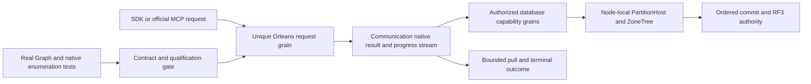

# Native CQRS result and operation streams

Status: C0 runtime-compatibility contract accepted by root under the owner's104-task scope,2026-10-04. Product stream implementation and qualification are pending. Canonical slice: ClusterRouting; parent [ClusterRouting](../ClusterRouting.md). Decision: [ADR-082](../../ADR/ADR-082-native-cqrs-streams.md). Related slices: ClientApi, QueryExecution, Search, Authorization, ResourceExecution and StorageRecovery.

The owner requires Orleans execution/coordination and ManagedCode.Communication CQRS native IAsyncEnumerable results and long operations. KeyLoad currently returns a bounded Task<GrainOperationReply> through its unique request grain. Pages, cursors and persisted feeds are real existing contracts; they do not establish this new stream contract. Communication10.2.6 supplies ICommand, a capacity-one CqrsStream producer and native CqrsStreamChunk serializers. It does not supply an IQuery dispatcher. Keep typed KeyLoad read contracts and the canonical persisted command/receipt path.

## Requirements and acceptance

| Requirement | Measurable acceptance | Automated evidence |
|---|---|---|
| REQ-NCQRS-001: native enumeration preserves enforced Orleans caller/method transitions and separate request identity | AC-NCQRS-001: a real Orleans cluster with the pinned Graph filters accepts an explicitly allowed nested grain call after an emitted chunk and awaited suspension; the same missing transition fails. The observed caller/method and request keys remain correct across independent concurrent streams. Product SDK/MCP RF3 requests must later prove the real signed request/read/command join. | C0 NativeCqrsGraphTests and NativeCqrsIsolationTests; C1/C2 actual RF3 routing tests pending |
| REQ-NCQRS-002: native pull lifetime, cancellation and backpressure are bounded | AC-NCQRS-002: actual Communication chunks cross Orleans with native batch size1; an unread bounded producer cannot grow an unbounded backlog. Cancellation after the first chunk and early enumerator disposal settle the real producer and release the enumerator within a declared10-second test cleanup bound; a following stream succeeds. No fake clock or programmable provider substitutes. | C0 NativeCqrsLifetimeTests; later product admission/cancellation RF3 tests pending |
| REQ-NCQRS-003: one terminal outcome and safe failures have explicit authority | AC-NCQRS-003: a KeyLoad-owned well-formed Create producer yields increasing sequences and exactly one Completed or Failed chunk; domain failure after progress retains a bounded safe code/detail. Transport failure before/after chunks and consumer cancellation remain distinguishable from committed command outcomes. Commands never report cancellation as proof that an acknowledged or uncertain write was undone. | C0 NativeCqrsTerminalTests; C1 canonical receipt/privacy and C2 RF3 interruption tests pending |
| REQ-NCQRS-004: SDK/MCP consume the same native typed execution stream | AC-NCQRS-004: genuine Aspire RF3 .NET SDK and official MCP clients consume results/progress, abort/retry and observe persisted grant/revocation errors through the same request/capability path; public result payload/frame/total/rate/time limits and cleanup are measured. Existing bounded final response compatibility drains that path once, without another dispatcher. | C2 ClientApi/QueryExecution RF3 tests pending; Communication-owned HTTP bound regressions required before SSE admission |
| REQ-NCQRS-005: long work has a defined restart/failover contract | AC-NCQRS-005: genuine process interruption and RF3 failover prove the chosen durable receipt/checkpoint or explicitly disposable operation contract, stable retry identity, fencing, no leaked storage lease and recovery after activation movement. ANN generation freshness/publication must additionally satisfy AC-ANN-007/008. | C3 Search/StorageRecovery/ClusterRouting process and RF3 tests pending |

Every requirement maps to its acceptance above. C0 qualifies only the native runtime mechanism; it cannot close the product half of AC-NCQRS-001–003 or AC-NCQRS-004/005. No source-only claim, skipped case, assertion relaxation or mock/fake/stub is accepted as runtime proof.

## Accepted C0 test contract

Use a genuine Microsoft.Orleans.TestingHost10.3.1 TestCluster, centrally pinned to the existing Orleans family, with the actual ManagedCode.Orleans.Graph10.0.6 filters and Communication10.2.6 registration. This package is test-only in KeyLoad.UnitTests; no new product package, project, topology or public capability is introduced. Start and completely dispose the native cluster inside the TUnit process launched by the existing Aspire unit entry. It is an explicitly named routing-mechanism fixture, never a replacement for Docker RF3.

Test actors perform real native runtime observations: actual actor/caller/method identity, enumerator/producer entry and settlement counters, and typed chunks. They are not substitutes for storage or replica capabilities, are not registered in the product server and do not return invented database success. Use generated test-only stable Alias/Id records and native Communication chunk conversion. No caller-controlled expected response, mocked factory, fake filter, synthetic cancellation hook or alternate stream implementation.

Freeze per-test request GUIDs; allowed and denied transitions are method-specific. The allowed stream emits Started, awaits a real suspension, invokes the observation leaf, emits bounded Progress and returns its actual observation in one terminal Result. The denied stream uses the same native path with that edge absent: assert Started, the actual leaf-call attempt, native exception type/status, no leaf entry, successful allowed control and real finally settlement. Do not catch every InvalidOperationException and manufacture a safe Graph-denial Problem. Native dependency failure detail is not a public oracle; safe product conversion is required in C1. Mid-stream domain failure uses an explicitly constructed bounded typed Problem. Observe producer settlement in its real finally; separate client observation calls must not fabricate cleanup evidence. Concurrent streams use distinct keys and assert no caller/history or terminal/result identity crossover.

Inside the leaf, CaptureCurrentCaller describes the current leaf method because Graph's incoming filter sets it before invocation. Observe the originating edge using the actual CallHistory and native GetLatestObservedCall, including exact source/method and target/method. Bind source/target native grain IDs and leaf primary key to the genuine requested actors; an echoed request parameter or substring comparison alone is insufficient. Never construct or restore synthetic Graph authority to make a test pass.

Set native Orleans batch size1 on the actual enumerable. All test pulls, observer waits and teardown have finite real deadlines; no Timer-based fabricated elapsed budget or unbounded wait. Cancellation and early disposal must occur after actual first-chunk receipt. Both consumer and producer must settle before fixture disposal. A failed cleanup is a test failure; never swallow it as success. The cleanup deadline is a test envelope, not a production cancellation-latency promise.

Exact ownership: new tests/KeyLoad.UnitTests/Features/ClusterRouting/NativeCqrs*.cs only for the worker; root owns the central pin, test-project reference, this specification, ADR, shared status and every build/runtime/Git join. Existing tests and product files remain outside C0 write scope. Keep numeric source limits and native serializer analysis. Root verifies every diff and then runs the focused C0 cases through Aspire, full normal/scalar unit gates, build/formatter/governance and delivered-source Linux qualification.

C0 test construction uses the pinned native extension points: a narrowly targeted Orleans IConfigureGrainTypeComponents installs an IGrainActivator only for the three empty-constructor test grain implementations. Its actual factories construct those instances; Orleans still attaches their real context and owns scheduling, routing, activation and lifecycle. Disposal delegates to the native DefaultGrainActivator, and all other grain types keep their native activators. A custom TUnit DataSourceGeneratorAttribute obtains one per-test-session fixture through SharedDataSources.GetOrCreate with an explicit constructor factory; native initialization and disposal remain automatic. Ownership adds tests/KeyLoad.UnitTests/Features/ClusterRouting/Helpers/NativeCqrsActivation.cs and NativeCqrsDataSource.cs. These construction hooks do not inject authority, RequestContext, call history, results or producer observations.

## Ordered product stages and blocked joins

1. C0: prove actual Graph/native enumeration context, lifetime, failure and isolation behavior. A demonstrated ManagedCode defect must be repaired in its owning repository, with the prescribed patch release, successful publication and verified NuGet availability before KeyLoad consumes it.
2. C1: the accepted [NativeCqrsRequestV2](NativeCqrsRequestV2.md) contract freezes the single native request entry, alias `keyload.request.v2` and current `RequestInterfaceVersion4` as distinct identifiers, Started/terminal types, signed purpose, authenticated peer envelope3 with separately preserved discovery-MAC2, cohort readiness/majority admission, cold rollout/rollback, byte/count/deadline bounds and canonical write-outcome semantics. Product writes wait for published dependencies and the unchanged six C0 Aspire oracles; current source is not yet application-RPC compatible merely because this contract exists.
3. C2: root freezes versioned SDK/SSE and official MCP progress/abort contracts. Use actual Communication HTTP helpers after the [owning transport-bounds repair](../ClientApi/CqrsTransportBounds.md) is published and verified; preserve current persisted authorization and official MCP request tokens. No custom competing CQRS dispatcher or consumer-side parser workaround.
4. C3: root freezes each long-operation receipt/checkpoint, node-local lease, restart/failover/fencing and ANN build/replay/publication contract before implementing it. Native IAsyncEnumerable alone is not durable execution, an outbox checkpoint or an atomicity guarantee.

Frontend N/A: runtime/API work has no requested UI. Benchmarks later measure chunk/admission/serialization/cancellation resource cost on genuine GitHub workloads. Rollback of C0 removes only test infrastructure. Product rollout/rollback stays blocked on C1–C3 contracts and required gates; no canonical stored data, native WAL, authorization, RF3 authority or public response format changes in C0.

## Accepted owning Graph enumeration repair, 2026-10-04

The first actual Aspire C0 cohort fails all six tests before the intended producer observations. Its original reports and native cluster logs are retained. Pinned Orleans10.3.1 source proves that AsyncEnumerableGrainExtension.StartEnumeration calls the original IAsyncEnumerableRequest.SetTarget/InvokeImplementation/GetAsyncEnumerator directly, then retains that enumerator for native MoveNext/Dispose. The original application method bypasses the ordinary GrainMethodInvoker request.Invoke filter path. Graph10.0.6 and current owning10.0.8 have no adapter for this path; the default Orleans-module tracking skip loses the application method's caller context. This is an owning dependency defect, not permission to inject authority in KeyLoad tests.

| Requirement | Acceptance | Owning automated evidence |
|---|---|---|
| REQ-GSE-001: native StartEnumeration enforces the original application transition | AC-GSE-001: genuine Orleans cluster client and silo-origin calls admit allowed initial stream methods and reject absent client/method edges before application producer entry; permitted nested leaf calls after first and later pulls retain exact original caller/method and native grain IDs. Default system-target and ordinary non-stream behavior remain unchanged. | NativeAsyncEnumerationPolicyTests; existing attribute/system-target suites |
| REQ-GSE-002: original application context follows the actual enumerator lifetime | AC-GSE-002: actual GetAsyncEnumerator, later MoveNext and Dispose execute with the captured original caller/history; async suspension, errors, cancellation and early disposal restore the previous ambient context. Concurrent distinct streams have independent history branches, no crossed result identity and no history growth per MoveNext. | NativeAsyncEnumerationContextTests and NativeAsyncEnumerationLifetimeTests; existing history isolation suite |
| REQ-GSE-003: the adapter preserves native runtime ownership with bounded registration state | AC-GSE-003: the server-local wrapper delegates every native IRequest/IInvokable member and MaxBatchSize; Orleans keeps its request-id dictionary, scheduler, batching, cancellation, expiration and disposal. Factories are closed at startup from the same configured grain-interface assembly inventory; runtime lookup uses exact original generated MethodInfo metadata in an immutable finite catalog. An unregistered/open-generic stream method fails closed without per-call reflection, scans or lazy catalog growth. | Catalog/delegation regressions and real batch-size1/multi-batch streams |
| REQ-GSE-004: the owning repair is delivered before KeyLoad consumption | AC-GSE-004: owning formatter, full Release build and full TUnit suite pass; canonical patch commit/push/release succeeds at its exact SHA and ManagedCode.Orleans.Graph is verified on NuGet before KeyLoad's central pin changes. The unchanged six C0 oracles then pass through Aspire, followed by required full Linux/recovery/RF3 gates. | Root owning release/feed receipts and original Aspire C0 reports |

The repair intercepts only exact native IAsyncEnumerableGrainExtension.StartEnumeration with its original typed request argument. Outgoing and incoming tracking use that original request's generated interface/method/options, while retaining actual context.SourceId/TargetId and TargetContext.GrainInstance for native activation identity and MayInterleave resolution. Policy validation precedes wrapper attachment. Later native extension/system calls remain native; do not represent each MoveNext as another application invocation or append synthetic authority/history entries.

After successful incoming policy validation, fork the existing actual CallHistory once for that stream and capture its actual CurrentCallerContext. A server-only delegating IAsyncEnumerableRequest<T> returns a scoped native enumerable. Scope InvokeImplementation, GetAsyncEnumerator, every actual MoveNextAsync and DisposeAsync, restoring both previous ambient values in finally. Reuse that isolated captured branch across sequential pulls; outgoing child calls retain the existing fork/restore behavior. Do not infer caller identity from history, share mutable branches between enumerators or add global stream/handle registries. Native Orleans remains the owner of the actual enumerator and source cancellation token. This is graph-transition enforcement; persisted database authorization remains separate and mandatory.

Root freezes this contract and ADR before write delegation. The query worker stages a scoped patch under /private/tmp against the clean owning Orleans.Graph checkout: new ManagedCode.Orleans.Graph/Features/AsyncEnumeration helpers, minimal joins in the two filters, RequestContextHelper and client/silo registration; corresponding real native tests under ManagedCode.Orleans.Graph.Tests/Features/AsyncEnumeration plus scoped README/owning feature documentation. No KeyLoad test/production edit, Orleans fork, transport serializer DTO, wildcard policy, suppressions, release, build or Git by the worker. Root reviews/applies, owns canonical formatter/build/tests, diagnoses actual failures and delivers the published patch. No KeyLoad storage-format conversion is involved. Product stream adoption remains disabled until its current contract and gates qualify; rollback must not bypass graph checks or retain a consumer workaround. Client and silo Graph versions must match before qualification.

### KL029 signed long-maintenance stream admission correction (2026-10-10)

REQ-FTS-002/004/005 and AC-FTS-002/004/005 retain exact source U, current persisted administrator and independent SDK/official MCP/Q1 result, receipt, replay, cold and resource oracles. Actual Build/Restore emits Configure, Capture, repeated NativeIndex/Publish/Checkpoint and Completed progress. The short-only native admission previously rejected its first Progress before yielding it; this source defect does not classify unrelated unknown outcomes.

Ordered integration: a call-local purpose binds the original verified signed request immediately after existing connection validation; the independent consumer verifies that same signed request only on first Started. Only typed MaintainTextIndex Build/Restore enables the long profile. Release, early Failed and ordinary requests retain their existing two-frame contract. No public alias, field ID, option, quota, deadline, policy, read cut or storage format changes. Full progress identity/sequence/event/message/typed phase and terminal validation precedes native serialization admission. Each progress uses MaximumStartedBytes; every frame contributes to existing MaximumTotalFrames and MaximumAggregateBytes. Successful final requires Completed, while failure may terminate an admitted phase. Existing producer/enumerator cancellation and joined cleanup preserve initiating/fatal/cleanup failures.

Owning source: ClusterRouting Streaming purpose/admission/lifetime/consumer, ConnectionGrain and Server OrleansNodeRequestExecutor, Search TextMaintenanceProgress and phase validation. Ordinary malformed two-frame tests remain; real native CQRS producer regressions exercise Configure through Final and malformed/extra/after-final refusal followed by joined healthy work. Original nine Aspire RF3 cases and both profiles remain mandatory. Source and local development proof do not qualify Linux coverage, RF3 durability or performance. Rollback reverts this coherent profile together, without persisted-data migration.

### Original typed-validation boundary correction (2026-10-10)

The pre-Started call-local purpose binds only the same successfully verified signed envelope kind and operation. It does not deserialize an additional typed command. The producer enables the Build/Restore profile only after the existing TextMaintenanceExecution typed payload, current administrator, request identity, node and mode checks, before its original Configure progress. The consumer may resolve Build/Restore lazily on the first Progress from the same original verified payload; no frame field or ambient mode selects the profile. Release and every other operation retain exactly Started/Final. Early Failed performs no additional typed validation. A signed malformed maintenance payload preserves the original Started→Failed shape, safe error, no effects and joined cleanup, followed by a fresh healthy operation. Unexpected Progress refuses without fallback. Wire aliases, IDs, limits and original execution authorization remain unchanged.

## Actual native signed-maintenance fixture composition and qualified local scope

# KL029 actual signed maintenance regression successor

Root-reviewed test-only composition. Existing NativeTextMaintenanceTestRuntime owns actual NativeTextIncrementalMaintenanceService over TestDatabase.ZoneTreeStore; that service already implements INativeTextMaintenance/ISelectedTextProjection. RequestCqrsClusterFixture/SiloConfigurator optionally register that SAME instance; default services/graph/options/deadlines unchanged. No new provider/adapter, role cache or public/persisted ID.

REQ-FTS-002/004/005; existing ADR078/native-CQRS ADR082; exact source owners: RequestCqrsFixture.cs fixture and configurator own optional factory/runtime initialization and disposal; RequestCqrsTextMaintenanceTests retains every existing declared case/Arguments; RequestCqrsTextMaintenanceFlow owns actual signed Build/Restore/full result/literal index/unchanged refusal-cut/healthy sequence; RequestCqrsTextProducer remains bounded malformed-frame validator support, never original maintenance receipt proof. Existing malformed signed-payload helper retains its actual Started→Failed path and receives actual typed healthy maintenance if applicable.

Initialize runtime from the SAME fixture database before original silo deployment; DI registers externally owned native instance under its original interface, no duplicate owner. The actual signed current-admin envelope uses the original codec/ConnectionGrain/independently signed child operations and fresh persisted authorization. Capture genuine emitted frames without manufacturing progress; validate complete typed maintenance result/current source/consumer/generation/index digest and independently literal projected documents/revisions/expected ranks. Build and Restore execute actual native indexing; Restore has genuine authorized update/delete inputs and original receipt replay. Malformed controlled frames remain only shape-failure support, followed by real signed healthy maintenance over the same operation fixture/store/current principal.

Lifetime: actual stream/producer/connection work joined → original cluster stopped → same native runtime disposed successfully → original Store disposed/root deleted. Original initiating/fatal and cleanup failures retained; uncertain native cleanup must retain database root/owner charges rather than delete them. No limits/clocks/timeouts/default graph change. TUnit/AppHost original native50 and exact source/DLL/PDB/UID observations; local proof separate from mandatory Linux/RF3/coverage. Old READY17/56+56 remains immutable validator support, unjoined/unqualified for maintenance.

# Optional actual-maintenance fixture registration closure

R2 normal/scalar each executed nine authentic declared cases and failed during TestCluster deployment with native NodeOptions origins validation, before any maintenance operation. The demonstrated cause is fixture composition: AddRuntimeOptions registers all production node/RF3 projections inside this original in-process CQRS fixture. NativeTextMaintenanceTestRuntime already owns its separate native owner options/validated grants; the actual ConnectionGrain parent needs only TextIndexMaintenanceOptions. Replace the optional silo registration with that exact centrally defined typed section, native IsValid/ValidationMessage and ValidateOnStart; leave every default fixture graph/options/deadline and original service/runtime ownership unchanged. This is test-only narrowing of optional DI, not a product origin/authority fallback. Original startup failures remain immutable. Subsequent genuine maintenance cases must still complete full typed result/literal page and joined cleanup.

# KL029 optional real maintenance fixture native admission

Native get_symbol_body TestDatabase proves SubmitIssuedEmbedded requires its actual fixture-owned TestDatabaseReplicaAdmission; false throws before any operation. NativeTextMaintenanceSeed/Commit uses that existing path. The optional native-enabled RequestCqrs composition therefore passes nativeReplicaAdmission=true to its original TestDatabase constructor. The ordinary shared fixture passes false exactly as before. This creates the existing canonical catalog-configured DatabaseEngine and native ordered admission, not a substitute/forged owner. Original options/default limits/clock/connection/caller/deadlines remain unchanged; the original fixture owns and joins those existing resources before deletion. R4 image is immutable and has the prior false input; this correction requires a distinct image with exact overlay/source/DLL evidence before operation proof.

# KL029 optional signed-maintenance fixture coordinator

Source-linked REQ/AC FTS002/004/005 and ADR078/ADR082: the optional actual native text maintenance fixture must share its existing TestDatabase ordered replica admission with all original signed checkpoint children. Ordinary RequestCqrs fixture composition remains EmbeddedCoordinator. This is test-only; production RF3 coordinator, current public/persisted IDs, original options and deadlines are unchanged.

The observed primary Corruption remains unqualified until the same failed original ResolveOutcome/applied-cut observation proves the actual predicate. No failure is reclassified from phases alone.

Ordered composition: (1) existing optional nativeFactory creates the same TestDatabaseReplicaAdmission; (2) native child submission creates/validates the original native authority through DatabaseEngine then submits through SubmitIssuedEmbedded; (3) the same existing log appends, commits and waits for the actual ReplicaMaterializer under its original CommandTimeout/caller token; (4) read barrier holds the existing admission lock and waits for the actual current committed index, with the same original timeout and caller token; (5) original connection/request work joins before cluster shutdown, native projection disposal and TestDatabase replica/store close. No fabricated applied marker, new coordinator quota or new physical owner.

The optional coordinator supplies only ICommitCoordinator's four existing methods. SubmitVerifiedAsync retains VerifyOperationAuthority before the owning log; SubmitNativeAsync retains CreateNativeOperation; ordinary JSON submission retains the existing ReplicatedOperation/public JSON representation. ReadBarrier must observe genuine materializer completion and retain cancellation/apply faults.

Verification: the SAME original two Build/Restore cases and six malformed-progress controls must terminate in actual signed Configure/Capture/native index/publication/checkpoint full ProjectionBatchResult, independent bilingual literals, exact same-ID original result/no effects, newer parent/current replay/older HistoryUnavailable, fresh nullable no-op replay, genuine Release and joined ownership. Native normal/scalar controls remain mandatory. Actual RF3 SDK1 then full9 profiles and Linux image/UID/coverage remain open.

Rollback: remove only optional coordinator registration and this test-only adapter; original fixture defaults/product persistence remain unchanged. Private source must be guarded against actual live ancestors at final seal; diagnostic-only observation is not acceptance closure.

## Original numeric gate and corrected execution

R10 normal/scalar each ran the two original parameterized case instances through the canonical Aspire-owned Unit entry. All four failed at their initial actual signed Build. The bounded original retained outcome read showed checkpoint=2, canonical acknowledged physical position=7 and captured replication Applied=3, with error null and complete native key/value bytes unchanged before/after observation. This proves the optional fixture violates the existing settlement predicate; it does not prove a Linux/RF3/transport cause.

Correction ownership is restricted to the optional coordinator adapter, TestDatabase native read barrier delegate, existing replica admission's genuine WaitForApply barrier, and optional fixture registration. Main proposals preserve the current TestDatabase engine factory/mixed-restore/recovery/fatal-cleanup bodies; isolated earlier-source overlays are separately recorded and cannot overwrite them. The corrected image must execute the SAME original two full cases normal/scalar first, then all nine signed-maintenance full flows; malformed validator support alone is not acceptance. Physical store position and replication applied index remain distinct; counters, receipts and production settlement predicates are unchanged.

Actual coherent private R11 execution: original two signed Build/Restore instances passed normal2/2 and scalar2/2; every original RequestCqrsTextMaintenanceTests case passed normal9/9 and scalar9/9. This is local development evidence only. The original R10 ACK physical position7 versus replication Applied3 failures remain immutable. Delivered Linux, actual process/cold and public RF3 SDK/MCP/Q1 qualification remain OPEN. The main fixture overlay preserves current mixed restore and ordinary EmbeddedCoordinator defaults; only explicit native maintenance composition selects the same native replica admission coordinator and joined committed-index read barrier.
