# Native CQRS stream contract v2

[ADR-091](../../ADR/ADR-091-epoch7-interpretation-fence.md) records the historical epoch7/rpc3 admission decision and its native stream-shape, v2 alias/Id, and KLT2 framing constraints. The current application discovery contract publishes RequestInterfaceVersion4 while signed data-epoch7-rpc3 purposes remain the cohort admission evidence; this current test-oracle expectation does not retroactively amend ADR-091. The epoch6/rpc2 pins recorded below describe the prior C1 stage and do not authorize a mixed epoch6/7 deployment. Cancellation/shutdown/unavailable cohort fixtures now run without parallel contention, preserving every native RPC/TTL bound and failure oracle after the original Linux5-failure report.

Status: root implementation contract accepted, 2026-10-04; C1 implementation and regression fixtures are authored. The unchanged six C0 Aspire oracles also passed with published Communication10.2.9. C1 product qualification remains required; authored fault fixtures and local mechanism results do not close it. Canonical slice: ClusterRouting; parent [NativeCqrs](NativeCqrs.md). Decision: [ADR-082](../../ADR/ADR-082-native-cqrs-streams.md). Related slices: ClusterReplication, ClientApi, Authorization, ResourceExecution and StorageRecovery.

The existing final-response SDK and official MCP adapters must consume one native execution stream from the unique request grain. Their current final JSON remains the initial external contract. This stage does not advertise public progress or durable background work; C2 and C3 remain required.

```mermaid
flowchart LR
    Gateway[Persisted identity and signed request] --> Cohort[Authenticated compatible RF3 cohort]
    Cohort --> Request[Unique request RPC v2]
    Request --> Started[Native Started chunk]
    Started --> Capability[Existing authorized read or command grain]
    Capability --> Host[Node-local ZoneTree and RF3 authority]
    Host --> Terminal[Native Completed or Failed]
    Terminal --> Drain[Bounded validation and actual EOF]
    Drain --> Response[Current SDK and official MCP final response]
```

## Requirements and acceptance

TASK-CRS-CANCEL-FAILURE-JOIN, accepted 2026-10-05, is an owning-dependency
prerequisite of AC-CRS-004 and the explicit node producer-drain contract. Current
Communication CreateCore awaits CancelAsync before awaiting its real producer;
an actual registered cancellation callback can throw and skip that producer join.
Repair ManagedCode.Communication in its owning repository, never in KeyLoad.
Observe cancellation and then unconditionally await the original producer task,
retaining distinct original cancellation/producer failures without flattening
their identities and preserving the existing fatal-runtime priority. Retain an
iteration cancellation together with a later cleanup failure when both occur;
ordinary cancellation, capacity-one backpressure and native terminal shape stay
unchanged. Cancellation errors cannot become a reason to abandon native work.

TASK-CRS-NODE-WORK-JOIN, accepted before implementation on2026-10-05,
defines REQ-CRS-WORK-001 / AC-CRS-WORK-001. A silo-local
NativeRequestWorkOwner tracks at most64 request-producer frames and128 total
producer, verified-read and verified-command frames. An entry retains only a
request GUID, a closed work-kind value and its actual lease identity; it never
retains activation context, request content, principal, credentials or open
storage. Duplicate live GUID/kind admission and capacity exhaustion fail with
the existing typed ResourceExhausted error. Admission after shutdown fails with
OwnershipLost. Limits apply to internal due dispatch and remotely placed
capabilities as well as public callers; HTTP admission is not their proof.
An empty request GUID or an undefined work kind fails with typed Validation
before admission and consumes no capacity.

The owner closes admission atomically, cancels its own token and unconditionally
joins every originally admitted frame even if a real cancellation callback
throws. DrainAsync callers observe the same original task; caller observation
cancellation never replaces or cancels that task. Lease release is exactly once,
checked against its actual registered identity, and occurs only after the real
native child disposal plus phase/activation settlement, or the original
capability finally. IsJoined becomes true only after cancellation observation
and every original frame have settled, including a faulted cancellation outcome.
DisposeAsync joins that same drain before disposing its CTS, preserving exact
original errors and the existing fatal-runtime priority. No reset, synthesized
completion, continuation-only cleanup or abandoned task is allowed.

The request kernel's existing Run gains a trailing optional owner parameter;
its client-side use remains unowned by the silo registry. A lazy unenumerated
request admits no frame. On the first actual enumeration the server kernel
admits one RequestProducer lease and links the owner token into its existing
execution token. Rejected admission still performs the actual activation
settlement, then rethrows its original typed KeyLoadException; no native producer
or synthesized Started/Failed chunk exists for that rejected frame. Existing
outer RPC failure translation remains unchanged. A consumer paused after a
yielded chunk must actually resume or dispose; cancellation alone cannot release
its registered frame. The published
Communication producer-join repair is required before qualifying callback-fault
settlement. This is ownership metadata around the existing native producer,
never a second stream implementation or dispatcher.

Ordered roles: Luna query_wave privately implements only new Orleans
ClusterRouting/Streaming NativeRequestWorkOwner, NativeRequestWorkLease and a
cohesive drain helper if needed, a pure Models work-kind declaration, and
Contracts constants if needed. Luna cluster_wave independently implements new
UnitTests ClusterRouting/Cases and Helpers tests. Root reviews both packets,
integrates them, and Luna query_wave then privately updates the existing
NativeCqrsStreamLifetime kernel and RequestGrain to use that same owner; a
cohesive Streaming helper may preserve numeric limits without duplicating native
execution. Root reviews and applies this packet. Luna lifecycle_wave then owns
only private edits to DatabaseReadGrain, CommandPartitionGrain and
GrainCommandExecutor, plus one cohesive ClusterRouting/Streaming capability
lifetime helper if required. Read work is admitted only after VerifyRead and
the exact identity-context match; command work is admitted only after the
existing ValidateRoute, before its quorum barrier. Link the owner token into
every original barrier, authorization reload, phase observation, execution and
reply encoding. Release read work after the original telemetry and deactivation
finally, and command work after its original executor finally. Preserve primary
and cleanup failures and fatal priority; do not duplicate route/authority checks,
change Task leaf contracts or put executable behavior in Models/Contracts.
Optional owner use in the existing direct executor tests does not qualify the
mandatory owner registered for real grains. Root owns review/integration,
Server DI/shutdown and native fixture joins, delivers the owning dependency, and
runs Aspire tests. Unit oracles
cover producer/total caps, duplicate identity, lazy admission, held real native
producer finally, paused consumer, repeated drain/disposal, actual callback
failure and rejection followed by activation settlement. Registry-count tests
alone do not establish native producer settlement.

Before native Silo.StopAsync, the node closes this work admission and joins all
actual local producer and capability frames while the phase observer remains
alive. Only that join permits native transport, discovery, consensus, observer
and physical-store shutdown. A30-second observation deadline reports failure
without releasing an unfinished owner or pretending it joined; a later caller
awaits the same original drain. ServerApplication must retain the native host
and physical owner until the original join has occurred. Real Aspire RF3
held-phase shutdown/restart through SDK and official MCP, exact Linux suites,
fault/resource/endurance gates and bounded authority remain required. No data,
public wire, placement or authorization migration occurs; rollback requires a
homogeneous stopped cluster and cannot detach already admitted work.

REQ-CRS-JOIN-001 / AC-CRS-JOIN-001: a real Create producer with a throwing
registered cancellation callback remains joined by early enumerator disposal;
the disposal cannot complete while that original producer's controlled finally
is still active, and the callback failure is observable afterward. Healthy
subsequent creation, ordinary cancellation and existing fatal-aggregate cases
remain passing. Use real native Create, tokens and controlled tasks; no fake
enumerator or abandoned observation wait. Always release and join original work
in fixture cleanup, preserving observation plus cleanup failures.

Luna lifecycle_wave owns a private source repair to Communication/Cqrs/CqrsStream
and one cohesive cleanup helper; Luna cluster_wave independently owns new owning
CQRS tests. Root owns README, canonical patch10.2.11 over published10.2.10, complete
review, owning build/full TUnit/format checks, scoped commit/push, successful
GitHub release, actual NuGet-feed/package verification and only then KeyLoad's
central package update and Aspire consumer regressions. Both workers read the
owning AGENTS.md and preserve its timestamps, constants, logging and API rules.
No public stream, binary alias/field ID, database format or dependency replacement
is introduced. Rollback retains the previous published package and its explicit
failed-join evidence; no local package or project reference qualifies delivery.

Delivery checkpoint2026-10-05: the owning repair is published as10.2.11 from
Communication commit7777c90761f04b4bcffec1b5846fb74f96b8c072 through successful
Release37250149897. Owning full native TUnit passed1363/1363. KeyLoad's three
central references were restored from the official NuGet v3 feed; signed package
repository commits and restored runner DLL bytes match the actual published
payloads. The [delivery receipt](../../implementation/native-cqrs-cancel-join-delivery-2026-10-05.json)
retains original evidence. Earlier10.2.9/10.2.10 records below remain history.

NodeWork development checkpoint75g: full Release build passed with0 warnings and
0 errors; actual Aspire selected owner/kernel tests passed7/7, including the real
held-finally and throwing-callback join. Full normal unit passed3247/3248; its one
failure was an actual process StartTime observation in the comparison process-tree
test, with its cleanup cancellation retained. The full gate is failed. Both
cohorts' HEAD, all source and executable/runtime input inventories stayed unchanged;
only explicitly identified native TestCluster output logs are excluded from inputs.
The [development receipt](../../implementation/node-work-development-2026-10-05.json)
does not close the RF3 phase, migration, scalar/Linux, resource or endurance gates.

TASK-CRS-C1-PRIOR-CHECKPOINT, accepted 2026-10-05, retains AC-CRS-002 and
ADR-077/091's actual cold native6-to-native7 migration evidence after original
run37242346547. One ten-document command does not produce the required native
replica checkpoint at the default threshold1024. Luna cluster_wave owns a private
patch for RequestCqrsRf3Epoch7Scenario, RequestCqrsRf3Epoch7WaveRunner,
RequestCqrsRf3Wave and a new feature-local RequestCqrsRf3CheckpointSeed helper.
Add an explicitly selected threshold16 only to that scenario's original prior
wave through the existing AppHost KeyLoad:SnapshotThreshold configuration;
ordinary waves and product defaults remain1024. Preserve cancellation-last
signatures and existing native image proof, explicit RF3 membership, readiness,
owned stop/dispose, exclusive lock joins and failure preservation.
After the unchanged ten-document seed and exact SDK/MCP replay, issue at least20
distinct real public SDK commits into a separately configured fixture collection,
with independent stable command IDs and expected revision0. Validate their actual
receipts and records and wait for all three real voters to apply the last receipt
before capturing prior observations and stopping the original wave. Preserve
every original seed document/revision and receipt oracle. Conversion runs only
after owned shutdown and exclusive locks; original non-null snapshot, threshold,
length/hash inventory, topology, byte-identical private profile, mixed-version
rejection, restart, later-write and both-client assertions remain unchanged.
No synthetic hard state, copied snapshot pointer, lowered oracle, shared corpus
expansion, invented prior-image feature or new test authority is allowed. Root
reviews the complete patch and qualifies it through the real Aspire RF3 caller.

TASK-CRS-C1-MCP-REJECTION-EVIDENCE, accepted 2026-10-05, refines
AC-CRS-002/004 after the original follower-restart initialize HTTP400. The
original capped shared-fixture logs did not retain a transport stage for the
separately owned C1 wave. Luna cluster_wave owns a private patch for feature-local
RequestCqrsRf3Diagnostics helpers/pure records, RequestCqrsRf3Wave and
RequestCqrsRf3Epoch7WaveRunner; root joins other C1 wave callers if required.
Subscribe to the actual Aspire wave's ResourceLoggerService before starting its
resources and join every owned subscription before deleting or disposing its
owner. Parse only the existing fixed MCP rejection message into defined
McpTransportStage and McpTransportMethodCategory values; retain at most32 closed
records per actual node, a server-test-derived wave GUID and closed node identity.
Never retain raw log lines, exception text, HTTP headers/body/target, credentials,
private profile or user data in this artifact. Preserve ordinary public MCP
behavior and the official SDK; no branch guess, client fallback or hidden retry.
The diagnostics ownership correction may extract a cohesive WaveStartup helper
inside the same ClusterRouting/Helpers scope to keep existing numeric limits.
Luna query_wave owns that private correction after the source packet is frozen;
root reviews it and runs the integrated warnings-as-errors build. Disposable
ownership must transfer explicitly or settle in unconditional finally, and the
CTS must dispose directly after its original subscriptions join. Preserve every
original failure and stop-before-subscription-before-app-disposal ordering; no
analyzer suppression, relaxed numeric policy or interface-removal bypass.

On an actual C1 failure, retain a uniquely named bounded JSON under the existing
qualification artifact directory, associate its path with the original test
failure, and preserve both original and diagnostic/stop/disposal failures through
ServerFailureObserver. Do not overwrite another wave's receipt. Source/image/run
provenance remains the original verified image proof and TUnit artifacts.
Captured node/wave/stage/category evidence may identify a rejecting check; if
multiple events prevent unique correlation, report that limit rather than
inventing a request correlation or declaring the MCP cause fixed. Verify the
actual follower-restart case through the same Aspire RF3 caller before making a
runtime claim. No public contract, authorization, data or topology change occurs.

REQ-CRS-DIAG-001 / AC-CRS-DIAG-001: feature-local TUnit tests use the actual
Aspire ResourceLoggerService and three ContainerResource identities to publish
the existing fixed transport message and inspect the resulting bounded artifact.
They verify defined stage/category values, distinct wave identity, the32-record
limit per node, and exclusion of oversized, repeated-marker, numeric-enum,
unknown-value and trailing-content lines. Retained JSON contains only the
version, wave, node and closed stage/category fields. Tests join the actual
subscription owner before reading/removing its uniquely owned artifact and
verify repeated disposal observes the same completion. No parser copy, fake
logger stream or weaker test-only parser entry is permitted. Luna lifecycle_wave
owns only a private patch for new ClusterRouting/Cases diagnostics tests and a
cohesive Helpers support file in IntegrationTests; root owns source integration,
the warnings-as-errors build and the real Aspire test caller.

TASK-CRS-C1-MCP-GUARD-EVIDENCE, frozen2026-10-05, adds
REQ-CRS-DIAG-002 / AC-CRS-DIAG-002. The actual follower runner must use the existing
Epoch7WaveRunner ownership/failure path so an original action failure receives its
own bounded diagnostics artifact only after original wave stop and subscription
join. Preserve primary, stop, disposal and artifact failures through the existing
ServerFailureObserver; retain every follower loss/rejoin, signed-generation,
receipt, topology and both-client assertion. An empty rejection inventory is a
truthful observation and must not become an invented authentication/transport stage.

A separate real healthy current-image Aspire RF3 case connects the original .NET
and official MCP clients, then sends one fixed malformed MCP transport request
using a genuine persisted fixture credential and discovered endpoint. The server's
actual guard must return its existing typed Validation result and publish one
closed warning; after actual wave stop/subscription join the artifact must contain
the exact expected closed node/stage/method category. A following healthy SDK and
official MCP operation must succeed before stopping the wave. No synthetic log
publication qualifies this end-to-end case; the independent ResourceLoggerService
mechanism tests above remain separate. Credentials, headers, targets, body and
exception text must not enter the retained artifact or diagnostics.

Luna lifecycle_wave privately edits only the existing follower ExecuteAsync join
and NEW RequestCqrsRf3McpGuard-prefixed Cases/Helpers/Assertions as required. Root
reviews/integrates and owns image preparation, full build and actual Aspire RF3
execution. Preserve image proof, RF3 membership and all existing time/resource
bounds; no broad retry, new accepted errors, auth logging guess, production guard
change or secondary parser is authorized. This fixture-only stage uses ADR-082's
existing contracts, with no data/wire migration; rollback restores the prior runner
join and removes the new test. It cannot claim that either original MCP initialize
failure has been fixed before the original public fault cases pass.

Success-path evidence refinement, frozen before its writes: Diagnostics gains one
memoized SaveEvidence method and Wave one thin SaveDiagnosticsEvidence forwarder.
Both require the original disposal task and every subscription to have completed
before writing the unchanged uniquely named V1 artifact. SaveFailureEvidence uses
that same writer and preserves its existing Exception.Data association. The healthy
guard case retains its wave only to call this method after the original runner
returns; no manufactured failure sentinel is used. Luna lifecycle_wave's private
scope includes only these two additional existing Helpers joins. An unjoined
snapshot fails closed and cannot become evidence; normal SDK/MCP behavior is
unchanged.

The successful real-guard case retains its closed diagnostics artifact under the
qualification output directory after all owned resources join; cleanup removes
only the private database root. CI must collect that original artifact alongside
the native test report.

TASK-CRS-C1-APPHOST-ADMISSION-TESTS freezes REQ/AC-CRS-PROBE-APP-001 before
private writes. Exercise the accepted AppHost probe helpers with real native
configuration/builders and actual owned regular files: disabled/absent settings
admit no profile; the exact enabled ephemeral three-equal-current-image mode with
0700 session/node directories and0600 closed owner records is admitted. Unknown,
nested, missing, malformed or inconsistent settings, suite/benchmark/cohort
selection, a non-ephemeral host, unequal/missing image members, roots overlapping
DataRoot, links/nonregular files, incorrect permission or owner identity, and
owner bytes over8192 fail closed with the existing safe configuration boundary.
This is genuine configuration/filesystem proof; no Docker start, fake transport,
synthetic served database or mutable-image bypass is allowed.

Luna lifecycle_wave owns only NEW UnitTests ClusterRouting RequestCqrsProbeAppHost
Cases/Helpers/Assertions as required, in a private patch against the reviewed
AppHost R3 packet. Root owns its shared references/friend/composition joins,
strict build, actual Aspire unit/scalar execution and all-code commit. Reuse
production validation instead of a parser copy; preserve typed primary/cleanup
errors, owned cleanup and400/200/50 limits. Existing ADR-082 controls suffice:
no new public/data/wire contract or deployment mode is added. This stage cannot
qualify actual armed RF3 phases or replace their mandatory both-client cases.

| Requirement | Measurable acceptance | Automated evidence |
|---|---|---|
| REQ-CRS-001: one versioned native stream replaces the request Task RPC | AC-CRS-001: genuine native Orleans calls execute the signed read and command through exactly one independently keyed request grain and the existing capability grains. The new interface/method aliases and generated progress record round-trip with the native Communication converter. The retired request Task method and unused envelope-alias constant are absent; there is no runtime fallback or second dispatcher. | RequestCqrsRoutingTests; real Aspire SDK/MCP RF3 operations |
| REQ-CRS-002: protocol compatibility is authenticated and distinct from persisted data format | AC-CRS-002: genuine signed discovery proves current, missing and incompatible application/peer-wire versions; tampered bytes or identities are rejected before cache or use. Real old/new-binary Aspire RF3 fixtures make new-binary admission reject an authenticated incompatible cohort and reject cross-version replica acknowledgements. Two compatible surviving voters still serve after the third is stopped. A compatible-cache→authenticated-mismatch refresh cannot reuse its prior address; a later authenticated runtime-generation replacement and cache expiry refresh compatibility within the declared bound. | RequestCqrsCohortTransitionTests, RequestCqrsCohortCancellationTests, RequestCqrsCohortLifetimeTests and RequestCqrsCohortShutdownTests; RequestCqrsRf3ColdMigrationTests and RequestCqrsRf3FollowerRestartTests |
| REQ-CRS-003: the producer has a small truthful well-formed lifecycle | AC-CRS-003: lazy execution verifies the exact signed scope and request GUID before Started. Valid routing emits Started then one terminal; an early rejection emits one Failed. Sequences are exactly1/2 or1, and no percentage, work count, authorization success or commit progress is invented. Domain rejection, genuine unexpected exception, cancellation and early disposal are covered with actual native producer settlement, a healthy following operation and no crossed concurrent identity/history. | RequestCqrsBoundaryTests lifecycle cases and RequestCqrsFatalSettlementTests; unchanged NativeCqrs controls; genuine RF3 abort qualification remains pending |
| REQ-CRS-004: a stream cannot bypass resource or failure/privacy admission | AC-CRS-004: exact/excess chunk count, native encoded bytes, aggregate bytes, payload/detail bounds, sequence, kind, field shape, duplicate terminal, trailing chunk and missing-terminal inputs fail closed. The consumer reaches actual EOF and disposes without materializing a chunk list. Native byte measurement uses the actual silo serializer without retaining another encoded payload. Controlled private exception text, data and stack never reach the public result or logs. | RequestCqrsProtocolTests and native serializer/boundary tests; real RF3 privacy/resource tests |
| REQ-CRS-005: RF3 receipts retain write-outcome authority across interruption | AC-CRS-005: actual interruption before and after native progress/commit preserves the canonical stable command ID and persisted receipt. A caller without a validated final response observes UnknownWriteOutcome for an interrupted write; same-ID retry with a fresh request GUID returns the canonical receipt without repeating effects. Cancellation is never proof of rollback. Read cancellation remains distinct. | OrleansRpcFailureTests cover translation only; deterministic interrupted-write and same-ID retry through real Aspire SDK/official MCP clients remain pending |
| REQ-CRS-006: native Orleans RequestContext propagates bounded identity and request state without becoming authorization authority | AC-CRS-006: genuine native serialization and first/later pulls carry exactly the server-authenticated persisted subject and matching request/command GUIDs. Missing, extra, mismatched, unauthenticated and forged context fail before capability execution. Authentication carries no principal. Current persisted grants, expiry and revocation remain effective after the quorum barrier. Concurrent streams, cancellation, failure and early disposal restore both exact prior context values and preserve Graph context; a healthy following request has no inherited identity. Real restart/migration reconstructs state from a fresh signed request, never a retained activation or context cache. | RequestCqrsIdentityTests; genuine Aspire SDK/official MCP revocation, cancellation and migration tests |

Each requirement maps to its matching acceptance. These criteria refine AC-NCQRS-001–004; neither an authored interface nor a local mechanism fixture closes the RF3 product criteria. Frontend N/A: this stage has no requested UI.

## Frozen RPC and typed payload

Keep `IRequestGrain` as the public C# interface name, but replace its native alias with `keyload.request.v2`, interface version2 and method `ExecuteStreamAsync`, alias `keyload.execute-stream.v2`. The method returns native `IAsyncEnumerable<CqrsStreamChunk<GrainRequestProgress, GrainOperationReply>>` and accepts the same exact signed string and real CancellationToken. Remove the request Task method rather than retain compatibility code.

`ICommandPartitionGrain` and `IDatabaseReadGrain` retain their Task methods, aliases and interface version1; they remain the canonical bounded leaf operations. Give the request and capability interface versions distinct named constants. The request grain Graph edges use the new original method name and the unchanged leaf method names.

Add generated `GrainRequestProgress`, alias `keyload.request.progress.v1`, field Id0: RequestId (Guid). Its only initial meaning is that the verified signed request has begun routing. It is not persisted authorization, successful execution or an acknowledgement. No user content, principal, token, command payload, row identity, resource name, percentage or estimate is a progress field.

Retain `GrainOperationReply` alias `keyload.request.reply.v1` and existing Id0–2. Successful terminal data is its existing exact bounded native GrainValue payload. A failure becomes a native failed Result with a controlled Problem: named defined ErrorCode, fixed safe title/status, bounded existing SafeDetail, no Instance or arbitrary extensions. The consumer accepts only this closed failure schema, never generic FromException details.

## Native identity and request context

Adopt the published `ManagedCode.Orleans.Identity.Core`10.0.3 package, centrally pinned and explicitly referenced by KeyLoad.Orleans. Reuse its actual `OrleansIdentityConstants.USER_CLAIMS` key, `OrleansIdentityContext.RequireAuthenticatedPrincipal/RequireAuthenticatedUserId` APIs and registered native Claim/ClaimsIdentity/ClaimsPrincipal surrogate converters. Root verifies the canonical release, exact source commit and actual feed package before adding the reference. Explicitly register that assembly with the real silo serializer; prove the actual registered converter with native round trips, not JSON or a substitute DTO.

C1 uses this package's identity/context surface. Its MVC/SignalR client publisher reads HttpContext.User, while KeyLoad authenticates persisted credentials in DatabaseIdentityMiddleware and shares a Minimal-API/official MCP gateway. Its optional Server filter evaluates ASP.NET attributes and maintains its own stream authorization state. Those are different application authorization contracts; C1 retains the existing signed-envelope and persisted database authorization boundary. No replacement authorization dispatcher or consumer-side emulation of those filters is introduced.

Publish one ClaimsPrincipal with exactly one ClaimsIdentity, fixed authentication type `KeyLoad.PersistedPrincipal.v1`, and exactly one ClaimTypes.NameIdentifier claim equal to the authenticated PrincipalRecord.Id. The subject must satisfy the existing JsonData.Identifier ceiling256 UTF-8 bytes. Use native default name/role claim types, string value type and local authority issuer/original issuer, with no claim properties, actor, bootstrap context or label. No roles, administrator/grants, policy epochs, tenant, API credential, signed token, payload or user content are context fields. Context is correlation metadata; a matching subject does not grant any operation.

Add immutable generated `GrainRequestContextState`, alias `keyload.request.context.v1`, Id0 RequestId(Guid), Id1 CommandId(Guid). Store it only under fixed native RequestContext key `KeyLoad-RequestState`. RequestId must be the independently keyed signed request GUID; CommandId must match its stable write ID, or Guid.Empty for a read. Do not publish a generic mutable state dictionary or add redundant operation payloads. Admit the actual registered native encodings before creating/pulling the request grain: principal<=4096 bytes and state<=256 bytes, using the same non-retaining bounded counting destination as chunk admission. The fixed two-GUID state and minimal principal receive native serializer boundary tests, including the maximum valid subject and excess/extra serialized context shapes. Native converter-omitted fields cannot be advertised as receiver-visible state.

The server owns a small request-specific scope which publishes only these two keys and restores their exact prior values, including absence, in finally. Scope the complete Orleans dispatch, bounded stream drain, actual EOF and awaited disposal in CanonicalOperationGateway. DatabaseCredentialResolver uses the same scope with no principal and the fresh authentication request GUID; it clears a prior principal only within that authentication scope and restores it afterwards. Leave other native RequestContext entries, including Graph history/caller, untouched. An inherited HttpContext.User or caller-supplied principal is never the publisher's input.

At lazy RequestGrain start, verify the exact signed envelope and actor GUID first, then require the typed state and closed principal shape to match its RequestId/CommandId/PrincipalId before Started. Authenticate is the sole existing null-principal operation and requires absent USER_CLAIMS. Repeat the context match at the real capability boundary; leaf reads and writes still acquire the real quorum barrier and reload the active persisted principal immediately before execution. Check expiry/cancellation after that barrier without treating cached claims or context as policy. An active principal with missing grants remains denied; a revoked or expired principal remains unauthenticated. Do not weaken authentication error/privacy classification or expose identity in progress/results/logs.

Native Orleans owns enumeration cancellation/disposal. Cleanup is allowed to release the already-owned producer/enumerator after product authority expires or is revoked; cleanup does not execute another capability, expose more data or acknowledge a write. C1 installs no additional Identity.Server stream table whose reauthorization could prevent that native cleanup. Actual resource exhaustion and cleanup failures remain observable, and tests must prove producer settlement with a healthy subsequent request. Context is disposable on activation movement or restart; fresh signed admission and persisted authority reconstruct the next request.

Change the ephemeral signed request purpose to `keyload-grain-request-data-epoch6-rpc2`. Keep signed prefixKLT2, request envelope aliasv2 and Id0–9 (including retired Id7), frozen identity digests, canonical stored records, native payload/data epoch6 and persisted receipts unchanged. Old transient request tokens are deliberately invalidated. Delete the unused `GrainRoutingProtocol.EnvelopeAlias` which incorrectly names envelopev1.

## Authenticated cohort and cold rollout

Discovery alone cannot prevent an old leader from receiving native replica acknowledgements from a new binary. Therefore this stage also versions the authenticated peer envelope from2 to3, with request/reply MAC purposes `keyload-replica-request-data-epoch6-rpc2` and `keyload-replica-reply-data-epoch6-rpc2`. Existing envelope types, generated Ids, service/method aliases, interface version1, exact payload bytes, replay admission and canonical commit journals remain unchanged. Incoming request/reply validation rejects a different envelope version before native endpoint execution; current MACs do not verify in an old binary.

Keep discovery MAC purpose `keyload-replica-discovery-data-epoch6` and its existing MAC version2 as a separate named `DiscoveryMacVersion` constant. Today Discovery writes `ReplicaTransportProtocol.Version`; separate that value before increasing the peer envelope version. This preserves authenticated observation of an old discovery response rather than mislabelling a valid incompatible voter as an unauthenticated address.

Extend the current discovery record aliasv2 with Id5: ApplicationRpcVersion (int), Id6: PeerEnvelopeVersion (int). The actual local state publishes2/3. Missing fields decode as0 and fail compatibility admission. Verify the existing signature over exact original bytes and voter/cluster/incarnation/nonce before trusting either field or an address. A version mismatch is a closed safe protocol rejection; it cannot enter the native address cache as compatible.

Reuse the bounded fixed-voter discovery owner and monotonic cache bound `LowerElectionTimeout`; no unbounded registry or caller-supplied capability is introduced. Cohort admission before creating/pulling a public request grain and readiness probes all configured voters using cached authenticated facts only while fresh. Each remote refresh has its own real linked deadline of at most RpcTimeout, including gate wait, connection, headers and bounded body; the outer request/readiness deadline also applies. Join and dispose each owned attempt. Sequential refresh avoids making another peer consume its deadline while queued behind the existing discovery gate.

For the initial fixed RF3 cohort, local transport plus at least one compatible remote gives the unchanged majority2. An unavailable third voter is not a protocol mismatch and cannot require all three to be alive. Any authenticated reachable incompatible voter fails public admission/readiness for the cohort; unauthenticated/unavailable endpoints cannot contribute to its compatible majority. Native consensus still independently acquires its real quorum barrier. Refresh invalidates an obsolete address/version before reuse, and a genuine new runtime generation can replace a prior mismatch. Cached observations imply a bounded detection delay, not instantaneous remote fencing.

Each fixed voter retains one bounded authenticated observation with address, application/peer versions, runtime generation, compatibility outcome and monotonic observation time. An authenticated mismatch refresh replaces the prior compatible observation and makes subsequent ordinary resolve/admission reject it; throwing before cache assignment must not leave the old positive address usable. Missing version fields are an authenticated mismatch. Unauthenticated/unavailable attempts contribute no compatible fact and cannot forge a version observation. Cover compatible→mismatch→ordinary lookup and mismatch→genuine compatible runtime replacement explicitly.

Cold rollout is mandatory: stop new admission, let existing final responses settle or require same-ID retry, stop all three old processes through the owning deployment/AppHost, deploy the same new image/source to all configured voters, then qualify readiness and operations. No mixed rolling compatibility is offered. The peer MAC/version change prevents an old active protocol from obtaining a new cross-version acknowledgement; no old-format replica fallback is permitted.

An old binary does not acquire the new application admission gate. Two mutually compatible old voters can still form their own old-protocol majority during an accidental mixed deployment; the new-binary rejection and cross-version MAC failure do not claim to fence that majority. The required homogeneous cold rollout, actual old/new peer-exchange rejection and unchanged canonical consensus authority remain separate acceptance obligations.

This is an ephemeral wire upgrade, not a persisted store upgrade. Replay nonces retain their existing expiry/recovery semantics; do not rewrite stores, receipts, snapshots, native ZoneTree WAL or atomic/replication journals. Rollback stops all new processes and starts a homogeneous prior binary over the unchanged supported data epoch, invalidating in-flight stream/token state. Never downgrade canonical data or replay an uncertain command under a different command ID.

## Producer, cancellation and bounds

Use the actual `CqrsStream.Create` capacity-one producer and native Orleans enumeration with batch size1. The handler first verifies the signed scope, request key and real cancellation; then explicitly writes Started and awaits the existing authorized capability Task with its real token and Orleans synchronization context. Return the native Result for exactly one terminal. It performs no eager side effect before enumeration and adds no background Task.Run worker or alternate command executor.

Keep deactivation in the outer async iterator finally, after child enumeration disposal has cancelled/joined the actual Create producer. Disposing or cancelling a consumer must not race an active MoveNext. The actual native leaf cancellation/response deadline governs producer settlement; a timeout wrapper which abandons work is not evidence of cleanup. Development teardown uses finite real deadlines and records failure if native work does not settle. Canonical node-owned RF3 work/receipts retain their authority even when the requesting activation or connection ends.

The stream request retains the current one-minute signed request lifetime and gets a real linked one-minute execution deadline. Native pulls, serialization/validation and the consumer share that bound. It is a finite request envelope; later resumable long-work semantics belong to C3.

Initial shape has at most2 chunks: Started(sequence1) plus Completed/Failed(sequence2), or an early Failed(sequence1). Started has exactly the matching generated request GUID, successful progress and no final/message/event-id override. Terminal has only its valid final result, the native default event kind and no progress/message/event-id override. A completed reply has positive payload bytes within MaximumReplyBytes, no Error or SafeDetail. A failed terminal has only the closed safe Problem described above.

Named finite limits: Started native encoded bytes<=8192; failed terminal<=65536; successful reply payload<=16777216; successful terminal native encoded bytes<=16842752 (reply ceiling plus65536 metadata); aggregate native chunk bytes<=16850944 (successful-terminal ceiling plus Started). All additions/count/sequence arithmetic is checked. Count is2, batch size is1 and producer channel capacity is1. The caller retains only the current chunk and one bounded terminal reply, never ToOutcome/list materialization. These are logical/native serialization admission limits, not measured total process RSS.

Use the actual silo's registered native `Serializer<CqrsStreamChunk<...>>` and a counting destination with cancellation and pre-write checks; do not add a second retaining serialized copy, JSON wire format, custom parser or extend the Abstractions serializer into an unbounded plugin registry. Set native silo message-body admission to the larger of the unchanged replica envelope bound and the successful chunk bound plus the existing finite65536-byte native response-envelope allowance. Native transport still enforces its own final message bound. The limit does not claim physical packet or header size.

The consumer validates every field and increasing exact sequence, records one terminal, then requires actual EOF. It does not normalize/repair invalid peer output, stop at the first terminal through ToResultAsync or forward unknown generic Problem fields. A duplicate/trailing/missing/oversized malformed stream fails the operation. Real disposal is awaited on every exit and cleanup failures remain observable.

At the product producer boundary, map handled domain/native failures and other nonfatal unexpected failures to the existing controlled `GrainReplyFactory` classification before returning Result; preserve safe structured GrainFailureDiagnostics without raw exception object/message/data, tokens or query bodies. Do not pass arbitrary exception conversion output to public callers. At the consumer boundary, native transport/cancellation/protocol failure before a validated final public response is OwnershipLost/Cancelled for reads as appropriate, and UnknownWriteOutcome for writes. Preserve the stable command ID; do not re-dispatch automatically. A valid persisted receipt remains authoritative even if its delivery is interrupted or rejected by protocol validation.

## Ordered implementation, ownership and join

1. Root: this contract and ADR/task traceability; exact aliases/Ids/version constants, generated progress/context records, published Identity.Core pin/native converter registration, persisted subject scope and signed-context validator, peer MAC/discovery changes, counting-serializer registration and shared client/readiness joins. Do not start product writes until C0 passes with published packages.
2. query_wave Luna/high: reviewable private patch for only RequestGrain, dedicated new ClusterRouting native producer/failure/lifetime helpers and minimal Graph edge method-name joins, against the root-frozen contracts. No alternate dispatcher, public SSE, generic DTO format, package or shared version invention.
3. cluster_wave Luna/high: independent new `tests/KeyLoad.UnitTests/Features/ClusterRouting/RequestCqrs*.cs` using real native cluster/serializer and current actual signed codec/canonical store/coordinator. Cover every positive, negative, edge/error and concurrency/lifetime/identity criterion, including AC-CRS-006; no fake authority, provider, clock or weaker existing C0 oracle.
4. lifecycle_wave Luna/high: after root freezes its exact files, private staged native cohort/readiness and process/RF3 test additions using authenticated original discovery and genuine old/new binaries. Root owns the shared Version/Id/MAC domain and AppHost/package joins; the worker cannot invent compatibility or topology.
5. Root: review and join all patches; strict full Release build, formatter, governance; unchanged C0, new focused C1 and full normal/scalar/recovery suites through Aspire; genuine Docker RF3 SDK/official MCP mixed-cohort, failover, cancellation/privacy/resource/receipt proofs. Retain original source/run/artifacts, commit the completed coherent stage, push main and qualify exact-source Linux gates. No local result closes the delivered-source fault/endurance or public performance gates.

C2 public streams and C3 long-work/index lifecycle remain blocked on their own explicit contracts and this stage's actual qualification. A compile or package publication alone cannot mark ADR-082 Implemented or close the104-task plan.

## Root API refinement and owning failure repair, 2026-10-04

The unchanged six C0 oracles passed through actual Aspire with published Graph10.0.9 and Communication10.2.7. Source and compiled runtime stayed unchanged; the original receipt is `artifacts/qualification/native-cqrs-c0-development-20261004/focused02-originals/manifest.json`. This satisfies C1's implementation prerequisite, without qualifying its product/RF3 criteria.

The owning Communication audit found that Create and Normalize converted even catchable fatal runtime failures into generic failed chunks. Its scoped10.2.8 repair excludes OutOfMemoryException, StackOverflowException and AccessViolationException, with actual native enumeration controls and ordinary-error/cancellation regressions. The original failure must escape joined enumeration, never enter a public generic Problem. KeyLoad consumes that repair only after canonical publication and verified feed availability, then repeats unchanged C0 controls. C1's producer must settle disposal and activation cleanup without masking either failure; no consumer workaround or detached producer is authorized.

Communication10.2.8 delivery is independently verified on owning source `bec54168254c00c21bc875d8a9aef5c2ad8030d3`: Release37206764247, CI37206764246 and CodeQL37206764277 succeeded; remote tag, four release digests/nuspec commits, actual indexed feed packages, native repository signatures and all nine payload entries per package were checked. Owning local TUnit passed1352/1352. Thirty-seven original files are sealed in `artifacts/qualification/native-cqrs-fatal-owning-development-20261004/publication-originals/manifest.json`. This remains immutable historical delivery evidence.

The follow-up owning10.2.9 repair exposes native `CqrsRuntimeFailures.FindFatal` for direct and arbitrarily nested AggregateException fatal failures. Source `2b2e74d97054b3bb16050e45787cd762c191cc0a`, tag `v10.2.9` and successful Release37212280152, CI37212280242 and CodeQL37212280088 are independently verified. All four actual indexed NuGet packages preserve their nine original release payload entries and add only the verified repository signature; restored KeyLoad DLLs match those published bytes. Owning local TUnit passed1357/1357. The owning full formatter still reported15793 diagnostics in unchanged paths; changed-file formatting passed. Captured tool-response excerpts remain labelled transcriptions where raw stdout was not retained. Central pins now select10.2.9 and consumer restore passed. The full KeyLoad Release solution build passed with0 warnings and0 errors after joining the fatal settlement regressions; full formatter, unchanged C0 repeat and C1 product/RF3 qualification remain pending.

TASK-CRS-C1-FATAL refines AC-CRS-003/004 with native KeyLoad regressions for create, move, disposal and activation settlement. Use preconstructed fatal exception objects for all three reserved runtime types, including deeply nested native AggregateException; never induce real resource exhaustion. The published owning helper must preserve the exact original fatal identity. Genuine CqrsStream.Create and NativeCqrsStreamLifetime enumeration must never convert that failure to a Failed chunk, must join producer disposal before activation settlement, and must settle every admitted cleanup exactly once before a healthy following stream. Cover primary/disposal/activation precedence and ordinary cleanup failures without weakening existing cancellation or C0 oracles. Test ownership is new RequestCqrsFatalSettlement files under the ClusterRouting unit slice; no consumer copy of the owning fatal algorithm is permitted.

Root shared APIs are `GrainRequestStreamProtocol` with the previously frozen count/byte/lifetime constants, generated `GrainRequestProgress` and `GrainRequestContextState`, `GrainIdentityContext.Validate(envelope, actorRequestId)`, and `GrainReplyFactory.StreamResult(reply)`. `GrainRequestStreamProblem.Validate(ManagedCode.Communication.Problem)` enforces exactly one ErrorCode string extension naming a defined KeyLoad enum, `urn:keyload:error:<name>`, title equal to that name, existing `Errors.Status(code)`, positive SafeDetail up to4096 characters, and null Instance. There are no arbitrary extensions, ErrorType, contradictory success/Problem, failed Value, extra progress or trailing terminal fields. The factory and consumer share this closed schema.

`GrainNativeByteCounter.Measure<T>(Serializer<T>, T, int maximumBytes, CancellationToken)` uses the actual registered silo serializer and a lazy non-retaining counting destination. Exact pinned Orleans10.3.1 commit137d9acc17830f15b13a4eb0058d6cee633cad5e uses native Writer segments with maximum GetSpan hint1048576 for these accepted byte/string/GUID codecs. Scratch grows only when requested, up to that finite ceiling; count/admission checks actual cumulative Advance bytes, not requested capacity. Thus an exact admitted payload is not rejected because a native reservation hint exceeds its remaining quota. Cancellation is checked at entry and each buffer/count boundary. Original native converter/serializer session/Commit semantics remain intact; actual Identity.Core converter and running-silo principal/state boundary tests remain mandatory.

The fixed-voter discovery owner exposes `EnsureCompatibleCohortAsync(CancellationToken)` and `HasCompatibleCohort`. Root keeps its existing constructor and owns shared version/MAC/generated record changes: request interface2, peer envelope3, discovery MAC2; discovery Id5/6 append application/peer versions, defaulting to0 when missing. One bounded observation per configured voter records authenticated address/runtime generation, versions, compatibility and monotonic time. A signed mismatch replaces prior positive state before throwing, and ordinary lookup rejects it while fresh. A refresh removes its obsolete cached fact before the owned attempt; unavailable or unauthenticated refresh cannot revive it. Each remote attempt has its own linked RpcTimeout, including gate wait and bounded HTTP read; cohort refresh is sequential and preserves the caller's outer deadline. Any fresh authenticated mismatch rejects cohort admission; local transport plus a compatible majority still works with the third voter unavailable. The node joins this owner before grain creation/pull, public readiness and routing status; cached status alone never replaces consensus or persisted authorization.

Discovery shutdown retains `IDisposable` and adds native `IAsyncDisposable` so the actual asynchronous silo host disposal can cancel and join every admitted discovery attempt before disposing its HTTP handler, semaphore and credentials. New admission fails after shutdown starts. The synchronous compatibility entry starts the same idempotent shutdown without blocking a captured scheduler; it may defer final resource disposal until the last admitted attempt settles. A concurrent attempt must not release a disposed gate or read cleared credentials. This is lifetime ownership, not a new membership or consensus authority; finite per-voter deadlines and caller cancellation still govern actual work, with no detached polling or timeout-abandoned attempt. Retain separate shutdown tests and the actual RF3 restart/cleanup proof.

`ReplicaDiscoveryResources` is the sole physical owner of the HTTP exchange, discovery gate and stopping source. Its production lifetime takes that concrete owner through a constructor ownership transfer and disposes the owned field directly after cancellation and every admitted operation settle. Cohort operations use a concrete non-disposable resource-access view which borrows that owner. The isolated lifetime callback constructor borrows a caller-owned stopping source and retains its existing admission/settlement mechanism contract. The physical owner attempts every resource disposal and retains failures; the canonical shutdown task exposes those failures to all joining callers. No suppression, duplicate disposal or detached cleanup substitutes for this ownership contract.

Current-image RF3 proof reuses `ClusterFixtureImageIdentity.ReadVerifiedReferenceAsync(CancellationToken)` to validate the original current source-bound receipt and manifest and return its immutable digest reference. The original homogeneous `VerifyAsync` still checks that same reference on all three resources. C1 compares each actual mixed-wave resource against either that verified current reference or the native RPC1 verifier's returned reference before starting resources; a scratch topology is unnecessary for parsing image identity.

The RF3 observation helper `RequestCqrsRf3SignedDiscovery.ReadAsync(DistributedApplication, string, Guid, ReadOnlyMemory<byte>, CancellationToken)` reads the existing discovery endpoint using the actual Aspire-discovered HTTP origin and PeerSecurity-signed GET. It admits at most the native MaximumDiscoveryBytes, verifies the returned signature with the existing ReplicaMessageMac over the exact original response bytes and actual request nonce, fixed voter, cluster and incarnation, then decodes with the same NativeSerialization codec used by that endpoint. Only an authenticated, transport-ready record with the exact fixed identity and a valid bounded SiloAddress is an observation. Rejoin must change the actual SiloAddress generation as well as the inspected process start; unsigned/PID-only observations cannot substitute. IntegrationTests receives test-friend access to the existing internal MAC/constants solely for this original-protocol oracle; no endpoint, public wire contract or runtime client authority is added.

AC-CRS-003 credential settlement includes the actual copied PeerSecurity credential, not merely an unused outer array. PeerSecurity implements IDisposable, rejects use after disposal and clears its owned managed credential after its borrowers settle. Socket handlers borrow that security owner and remain independently disposable. ReplicaDiscoveryExchange owns one PeerSecurity instance and its HttpClient, disposing the HTTP handler before clearing the security owner after the discovery lifetime drains. Server DI owns its separate inbound singleton; fixture/observer owners dispose their own security instances. This preserves signing/replay and public wire semantics while removing the redundant outer discovery credential copy. Focused native peer-security ownership/disposal regressions supplement the HTTP cancellation/shutdown and real RF3 gates; they do not establish that runtime copies outside these owners are erased.

The shared two-key publisher `GrainRequestIdentityScope(IServiceProvider, PrincipalRecord?, Guid, Guid, CancellationToken)` in Orleans `Features/ClusterRouting/Identity/` admits principal/state with the serializers from the actual running silo provider before setting either key. `OrleansNode.OpenRequestContext` supplies that live provider to the shared SDK/MCP and credential gateways; the native due coordinator uses the same owner through ADR-094. Tests must use a real running TestCluster provider. A newly built stand-alone serializer container is not equivalent evidence. Direct real-database leaf unit tests supply the same closed context around their existing signed operations, preserving all persisted revocation, partition and receipt oracles; they do not prove native transport or RF3. This rehomes the existing scope and admission implementation without changing serialized claims, aliases, field IDs, limits or exact disposal restoration.

For the fixed valid chunk shape, independently admitted Started and Completed maxima sum exactly to the aggregate ceiling. Retain the aggregate admission guard and actual native maximum-payload/one-over controls. Do not invent an unreachable valid-shape aggregate overflow by modifying counters or adding prohibited fields; those fields are rejected earlier by shape validation. Tests record actual encoded sum and the implication of the per-chunk bounds separately from malformed-shape rejection.

Implementation remains ordered: root shared types/identity/counting/cohort joins, private producer patch, independent real native unit fixtures, genuine old/new Aspire RF3 fault fixtures under the current data-epoch contract, then full gates. The existing EmbeddedCoordinator no-op read barrier is local canonical regression only and cannot prove fresh RF3 authorization. The original image/source proof below remains immutable, while the current epoch7 fixture correction follows ADR-091 and the explicit contract below. Image production and full RF3 execution are mandatory; source presence does not qualify mixed-image admission or rejoin.

## Genuine prior image and AppHost test contract, 2026-10-04

TASK-CRS-C1-IMAGE and TASK-CRS-C1-RF3 implement AC-CRS-001/002/003/005/006 using a genuine prior executable. The fixed RPC1/peer2 baseline is Git commit `377886f35928866f083806062b446056d64539e3`, tree `937b2c0d576ef29afb33e943ddd452722ee6a16b`, with data epoch6. Root independently checked all3016 native Git files, modes, blob identities and content bytes: expanded bytes25738907, canonical source inventory SHA256 `70e92d99a96ed508ab4a1e617a5884d95cf3bfc97e99f3e131748a99cd6b640f`. Its exact Git archive is28180480 bytes, SHA256 `f4a36d2febcae6e35e857c735cbebe55d41ecd9dc2652b22a67b5f541039807f`. Native5's existing epoch5 source, image proof and cold storage upgrade remain a separate mandatory gate.

ClusterRouting owns new script modules `rpc1-server-source.mjs`, `rpc1-server-proof.mjs`, `prepare-rpc1-server-image.mjs` and `verify-rpc1-server-image.mjs`, plus its local scripts policy. Reuse the existing bounded Git-archive/source inventory and image engine/registry helpers; do not create another registry, source overlay or substitute package. The producer's current GitHub source/run/attempt/repository/ref/workflow/job identity is distinct from the fixed baseline source. Require Linux, job `docker-rf3`, zero overlays, the exact tree/inventory/archive, original source bytes before and after image build, current pinned SDK/runtime bases, inspected native image config/revision label and original registry manifest bytes/digest. Use receipt kind `keyload.rpc1-epoch6-server-image-proof.v1` and the separate environment names `KEYLOAD_RPC1_SERVER_IMAGE`, `KEYLOAD_RPC1_IMAGE_RECEIPT`, `KEYLOAD_RPC1_SERVER_MANIFEST`. Bound receipt65536, manifest/inventory1048576 bytes and the exact source/archive sizes. Reject missing, extra, mixed-source or mismatched provenance. A producer or verifier error fails qualification; no local or synthetic GitHub identity qualifies this image.

Root owns the AppHost join: new `src/KeyLoad.AppHost/Features/ClusterRouting/Topology/ProtocolCohortImages.cs`, the existing ClusterResources composition call and the shared hosting mode guard. Only explicit `KeyLoadTests:ProtocolCohort:Enabled=true` in an ephemeral three-voter child test AppHost enables overrides; exactly `KeyLoadTests:ProtocolCohort:Voters:node1`, `node2` and `node3` must each contain an immutable digest reference. Reject incomplete/unknown voter keys, overrides without the enable flag, non-ephemeral use, a selected suite runner, benchmark mode/target and benchmark node-count composition. Ordinary homogeneous composition retains its single current image. Image-reference syntax is AppHost admission; the test independently verifies each actual resource against the original current or RPC1 receipt before starting it. Do not weaken ClusterFixtureImageIdentity's homogeneous current-source assertion.

New `RequestCqrsRf3*.cs` integration files own their separate mixed-wave model/proof, actual SDK and official MCP callers, finite observation deadlines and canonical profile/data roots. All Docker resources, start, readiness and shutdown belong to the actual AppHost. A mixed cohort is expected to have unavailable current readiness; wait for real resource startup and signed discovery rather than requiring every node to become Healthy. On each current node, readiness must be503 and a read through its real SDK must fail with closed OwnershipLost. The official MCP SDK must observe the real current endpoint's503 transport rejection during initialization, or a closed OwnershipLost tool failure if an already-established session reaches the gateway. Assert typed status/code only; never log raw body, Problem detail or credentials. This does not claim to fence an old-protocol majority.

The original same-epoch/old-reader rollback wave contract is superseded by ADR-091's strict epoch7 admission. The actual prior image remains epoch6/RPC1; it must never be overlaid or relabelled as epoch7. Required current waves use the stopped-copy upgrade contract below. A separate homogeneous-current wave deterministically selects an actual follower from authoritative node statuses, stops that voter through scoped inspected fault injection, proves both clients still operate through the two compatible survivors, and rejoins the same voter through Aspire's native Start command with changed process/silo generation and recovered readiness. A configured node name alone does not establish follower status. Shutdown awaits actual owned disposal and retains cleanup failures; timeout-abandoned disposal is not settlement evidence. Live cache transitions/expiry and HTTP shutdown controls remain separate mechanism tests.

### C1 epoch7 stopped-copy and incompatible-image correction

TASK-CRS-C1-EPOCH7 preserves the fixed genuine RPC1/native6 source proof and
original C1 document/queue/principal/receipt workload. Seed that workload through
the existing RequestCqrsRf3Wave on three verified RPC1 images, capture real node
identity and membership through NodeEpochRf3StatusOracle, and completely settle
the wave and every canonical/replica/node lock. Reuse NodeEpochRf3Migration and
the existing shared target-preparation method: exact stopped source inventories
and profile, invalid-third negative barrier, all three Prepare/Verify results
before any Publish, and unchanged original input verification. Do not replace
the C1 workload with a sample-only migration fixture or infer native6 from a
native5 image. The separate native5 whole-node fixture remains mandatory.

The shared migration oracle pins receipt format2 and target epoch7 independently
of the returned receipt. Its constructor takes the expected source epoch before
any upgrade mutation: existing verified native5 fixtures default to5; C1 passes6
after its genuine RPC1/native6 image proof. Reject other source expectations.
Preserve every original inventory, identity, position and snapshot digest check.
Compare complete decoded published receipts by canonical value, including all
nested native byte values, rather than collection object identity.

Before current serving, create one owned negative mixed root containing complete
copies of published epoch7 node1 and untouched original epoch6 node2/3, with exact
profile bytes and verified current/RPC1/RPC1 per-voter image references. This
is an explicit incompatible-format/RPC fault wave, not a supported deployment or
rolling upgrade. Assert signed current-node self-discovery reports RPC4/peer3,
current node1 readiness503, and SDK/MCP closed OwnershipLost or MCP initialization503.
The prior discovery uses the epoch6 signing purpose and cannot be authenticated
as a version-zero record by the epoch7 verifier; never assert that false witness.
Settle the entire negative wave and release its private locks before continuing.

TASK-CRS-C1-EPOCH7-NO-QUORUM pins this negative wave to one compatible current
voter: two compatible current voters form the legitimate RF3 majority and may
serve when the old signing purpose prevents authenticated peer observations.
The negative fixture must therefore observe signed current node1 identity only
and prove absence of a compatible quorum through its real unavailable endpoint.
It must not invent an authenticated incompatible peer or change production
cohort admission. All homogeneous-current migration, preserved-receipt, restart
and compatible-survivor assertions remain mandatory and unchanged. Root freezes
this correction before the private fixture patch and owns final integration.

Start homogeneous current RF3 on the actual published target root, verify all
original C1 state and same-command receipts through real SDK/official MCP, and
commit the current-write oracle. Stop fully, restart homogeneous current on that
same target, then verify the retained current write/receipt and actual changed
runtime generations. The prior originals and target inputs remain distinct;
old binaries never open current epoch7 data and no stale-authority rollback is
claimed. Retain roots on primary or cleanup failure and clean successful owned
roots only after every AppHost/process/disposal settles.

This negative wave establishes cross-epoch loss of compatible quorum only. It does
not satisfy a protocol-only authenticated same-epoch old-binary gate; the fixed
baseline is incapable of that proof. Authenticated version/tamper/cache mechanism
tests and genuine compatible-survivor/follower-rejoin gates remain required and
must retain their separate evidence. No original acceptance is closed by this
source correction.

Ownership: root freezes ADR/specification and owns all gates. Luna lifecycle_wave
privately replaces RequestCqrsRf3ColdMigrationTests, its mixed/discovery oracle
join, and new feature-local epoch-mismatch copy/scenario helpers. Shared joins
expose the existing NodeEpochRf3CurrentWaveRunner.PrepareTargetsAsync as internal
test infrastructure and correct the explicit source-aware golden expectations
in NodeEpochRf3Migration and NodeEpochRf3MigrationAssertions as specified above,
without changing the prepare/publish barrier, order or data oracles. Existing
immutable image verifiers/scripts, production epochs, profile format, public SDK/
MCP and original C1 workload remain unchanged. Remove newly unused legacy helpers
and assertions in the same patch after an exact reference inventory.

TASK-CRS-C1-IMAGE-JOURNAL refines AC-CRS-003 for the complete current/native5/RPC1 image preparation and owned-registry cleanup sequence. Actual Linux CI run37220907026 at2801b03 retained exactly32 successful native command records; RPC1 build and image inspection succeeded, but appending the next push result and cleanup result failed at the shared32-record journal cap. No test runner started, and this run does not qualify RF3. Admit at most64 native journal records for the complete bounded sequence, retaining the unchanged256KiB combined command output,512KiB encoded record,8MiB journal, process deadlines, actual exit status, sanitized diagnostics and ownership checks. Command65 or a byte-limit violation still fails closed and leaves every prior record unchanged. Root owns the one shared image-contract capacity change; lifecycle_wave owns only new private RequestCqrsImageJournalTests files under the ClusterRouting unit slice. Native Node child processes and real private files must prove the complete sequence remains recordable, the64/65 boundary and joined bounded-output failure. These development regressions cannot authenticate GitHub or fabricate a successful image; a fresh genuine Linux image/RF3 job remains mandatory.

Root integrates scripts, CI environment/image artifacts and the test-only AppHost seam. The existing canonical `NodeEpochRf3OfflineProcess` also owns every verifier/upgrade child: finite observation or output failure stops only that owned process tree, then awaits actual exit and both bounded output readers to completion. Cleanup cannot return on a second timeout or attach a continuation as a substitute for joining owned work; retain the primary error and every distinct cleanup failure. Deduplicate only the identical primary exception object observed again when joining its same reader task. Positive completion, cancellation of a live native child and oversized native output receive separate process regressions, without Docker or synthetic image/GitHub evidence. Luna workers may implement only their frozen private script or new test paths. All final builds, native Aspire tests, immutable originals, stage commits and exact-source Linux qualification stay root-owned. This contract is accepted before implementation; it does not mark the ADR or any product acceptance complete.

## C1 transport and outer failure boundary correction, 2026-10-04

TASK-CRS-C1-BOUNDARY refines the existing AC-CRS-002/003/004 without changing public errors, native wire or committed formats. Root owns this contract and all joins. The discovery transport boundary must recognize only the exact native PeerSecurity transport-unavailable outcome (`OwnershipLost` plus the fixed `PeerDiscoveryProtocol.Unavailable` detail) as absence of a fresh observation, while preserving cancellation, authenticated mismatch, identity failure, corruption and resource failures. A genuinely stopped Kestrel voter supplements the existing HTTP503 controls; a compatible majority remains usable, and loss of the remaining compatible remote still denies admission. No obsolete positive observation may be revived. Real Docker/Aspire follower loss/rejoin remains a separate mandatory gate. Cluster worker owns a private patch only for ReplicaDiscoveryExchange and new RequestCqrsCohortUnavailableTests; root reviews the exact signed-handler path before applying it.

The public MCP dispatcher and outer HTTP error middleware must never consume direct or deeply nested AggregateException fatal runtime failures as an ordinary RecoveryRequired Problem/tool result. Reuse the published owning CqrsRuntimeFailures.FindFatal through the existing native boundary helper; do not duplicate its traversal, flatten or replace the original exception object. Preserve ordinary failure mapping and caller-owned cancellation behavior. Actual middleware invocation controls use preconstructed fatal objects, require the same escaping exception (and exact nested fatal identity), zero public response/error logging, and retain ordinary error/cancellation controls. These are local boundary regressions. The existing unit fixtures cannot invoke a fatal native request through the real MCP dispatcher without a started PartitionHost/Orleans server; no stub descriptor, argument dictionary, provider or node may substitute. The MCP source filter is corrected in this stage, while its native dispatcher/fatal RF3 oracle remains explicitly pending the real host-only fault fixture. Neither middleware controls nor a source review qualify that MCP or RF3 producer/privacy criterion. Query worker owns private patches only for McpToolDispatcher, ServerErrorMiddleware and new RequestCqrsPublicFatal tests/helpers in the ClientApi unit slice. No dependency, registry, caller authority or second dispatcher is introduced. Root alone owns solution build/formatter, native Aspire execution, immutable evidence, stage commit and exact-source Linux qualification.

## C1 deterministic RF3 phase observation contract, 2026-10-04

TASK-CRS-C1-PHASE, TASK-CRS-C1-CONTROL and TASK-CRS-C1-FAULT refine AC-CRS-003/004/005/006. Their purpose is reproducible interruption of an actual admitted native request, followed by public persisted-authority and receipt oracles. This is an accepted implementation contract, not evidence that a fault or migration has occurred. Existing full RF3, recovery and exact-source Linux gates remain mandatory.

### Native seams and ownership

The silo-owned GrainRequestCodec may receive one internal, optional IGrainRequestPhaseObserver through its existing native registration. The separate HTTP gateway codec never receives it. The observer is absent in ordinary operation; that path allocates no phase record, channel, file name, closure or retained request registry. A synchronous no-op check precedes constructing a readonly probe identity. It contains only verified RequestId, stable CommandId, persisted PrincipalId for internal selection, and defined read/command kinds; no envelope, payload, credentials, claims or roles are passed or retained. The actual IGrainContext may be borrowed during an awaited phase callback solely to observe actor/runtime identity. It never becomes a storage or authorization owner.

Closed phases are RequestStarted, AuthorizationReload, BeforeSubmit and SubmitReturned. RequestStarted follows the actual awaited writer.StartedAsync. AuthorizationReload follows the actual quorum ReadBarrierAsync and current signed/context validation, immediately before the canonical persisted Reload; Authenticate never enters that phase. BeforeSubmit follows the persisted Reload and precedes the actual SubmitNativeAsync. SubmitReturned follows its actual awaited return and precedes reply encoding. It proves a returned canonical outcome after quorum/apply, not business success; the public receipt and exact final entity must also validate. CommandPartitionGrain passes the codec observer and its real context into its existing executor; DatabaseReadGrain and RequestGrain retain the same signed validation, capability graph, authority checks and native scheduler. There is no second dispatcher, coordinator or apply gate.

ProducerDisposed is a separate synchronous bounded notification after the actual producer DisposeAsync has fully settled, before requesting DeactivateOnIdle. It does not claim activation deactivation has completed. Both observation and the original deactivation action must be attempted even when either fails, preserving their distinct errors and the published native fatal identity/precedence. It starts no detached asynchronous work. The ordinary observer-absent path retains the current settlement action. Root reviews this native lifetime join against the existing fatal/cancellation regressions before applying it.

The eventual migration control will observe the stable logical CommandPartitionGrain, not reuse or retain the uniquely keyed request activation. Native idle migration is advisory. Actual old-activation deactivation and a new activation with the same grain identity on a different compatible active silo must be observed before counting migration. Waiting for deactivation or awaiting a self-management RPC inside the still-active incoming call is prohibited. The exact native scheduling/membership/control join must be separately frozen after reviewing pinned Orleans APIs; no migration implementation is delegated by this phase contract. PartitionHost keeps physical stores, WALs, locks and apply ownership.

### Private test-host controls and finite bounds

Root owns an explicitly enabled, ephemeral, fixed-three-voter AppHost profile using the same verified current immutable server image on every voter. Reject suite-runner mode, benchmark mode/target/node-count, non-ephemeral use, protocol-cohort image overrides, unknown/incomplete voter configuration and unowned/symlinked control roots. AppHost owns a distinct private per-voter control bind mount, outside each canonical /data directory and the persisted cluster profile. Preserve actual container UID, private directory permissions, readiness, discovered endpoints and complete resource cleanup. No HTTP, MCP or public Orleans fault endpoint is added.

Only this trusted test profile registers the server observer. A private arm identifies one synthetic persisted principal and either one exact stable command or one defined read kind; the first matching validated request claims that arm, records its actual fresh request GUID, and further requests cannot reuse it. The arm selects one closed phase and Hold or ThrowOrdinary action. Hold uses the actual request token linked to host stopping and a finite60-second ceiling, with bounded awaited polling; release, cancellation and host shutdown all join the admitted callback. ThrowOrdinary throws one controlled nonfatal IOException with distinct synthetic message, Data and actual-stack canaries, solely on the selected native execution path. It changes no persisted grant or payload. Reserved fatal adapter coverage remains a separate actual-host requirement; no real resource exhaustion is induced.

Each wave admits at most32 arms, at most4 active phase gates per voter, at most8 observed phases per claimed request, at most8192 bytes per control/marker record and at most1MiB of total private control/marker bytes per voter. Unknown fields, kinds, empty IDs, duplicate/reused arms, changed owner/session identity, excess files/bytes and invalid release identity fail closed. The control format is ephemeral test metadata, never canonical database persistence, native replica traffic or a runtime JSON fallback. Root freezes the exact control codec/schema before TASK-CRS-C1-CONTROL writes. A marker emits only session/arm/request/command GUIDs, closed phase/action outcome, configured physical voter and the actual local silo address including generation. Principal, payload, raw errors and credentials never enter markers or logs.

The server owns callback admission/stopping/settlement and retains every distinct failure. The test fixture owns its arms/releases, scoped fault injection and all AppHost waves. It cancels/releases admitted gates, awaits public calls and server/resource shutdown, and then removes only its owned control roots. A timeout-abandoned task, second cleanup timeout or continuation is not settlement. Ordinary planned node loss/restart retains the accepted Aspire fault contract; startup failures retain the native failure and prompt owned cleanup.

### Public outcome and authority oracles

| Criterion | Required actual caller observation and final oracle |
|---|---|
| AC-CRS-003/005 before submit | Wait for the actual RequestStarted/BeforeSubmit marker before cancellation. SDK must return its actual UnknownWriteOutcome classification when no final receipt validates. Official MCP may return an actual server-generated tool Problem or throw its actual cancellation/transport failure with no validated CallToolResult; the test never fabricates a tool response. Before release/submit, a real authorized read must show the unchanged entity. A same-command retry under a fresh signed request then commits exactly one effect. |
| AC-CRS-005 after submit return | Require SubmitReturned for the exact stable command, and an independent real read of the intended committed entity before the interruption. After loss of response, retry that identical command/body with a fresh request through SDK and official MCP; compare the complete canonical receipt, exact entity bytes and exactly one revision advance. An unknown outcome never implies rollback. To claim remote-leaf death with ingress surviving, first observe the actual executing voter and prove it differs from ingress; a leader/resource-name guess does not qualify. |
| AC-CRS-006 current authority | Hold after the real barrier and before persisted Reload. Revoke the synthetic worker through a separate real authorized administrator operation and verify the canonical persisted revocation before release. The original request must be Unauthenticated with no submitted effect; a healthy authorized following request succeeds. Post-commit revocation cannot undo a canonical outcome or bypass policy to disclose a receipt. |
| AC-CRS-003/004 privacy and settlement | Trigger the controlled ordinary error on an actual request grain, consume actual SDK/MCP results and native logs, and reject every private message/Data/stack canary in public output/logs. Observe actual producer disposal, join cancellation/shutdown and execute a healthy fresh request with no inherited identity. This does not substitute helper-only byte bounds for an actual reachable public resource case. |

TASK-CRS-C1-PHASE is cluster_wave Luna/high's private patch scope: new internal ClusterRouting phase identity/observer/settlement helpers, GrainRequestCodec, RequestGrain, CommandPartitionGrain, GrainCommandExecutor and DatabaseReadGrain. No AppHost, Server, package, policy or other test files may be changed. Root owns application of those shared joins. TASK-CRS-C1-FAULT-ORACLE is query_wave Luna/high's independent private scope: new RequestCqrsFaultOutcome, RequestCqrsFaultCallers and RequestCqrsFaultReceiptOracle under IntegrationTests/Features/ClusterRouting, using the existing real clients/contracts only. Actual controls and test entry points await the separately frozen control schema. lifecycle_wave remains read-only for the native migration join. Workers emit exact patches, base/post hashes, scope manifests and self-review; they run no shared build/test/Git mutation. Root reviews every diff, freezes control schema/registration and fixture joins, performs native Aspire verification, commits completed stages and follows exact-source Linux CI. C2/C3 and remaining plan tasks remain in progress.

### Accepted private phase-control schema and join, 2026-10-04

The full scalar19 development run completed3060 tests with3059 passed and one failed ReachableAuthenticatedThirdMismatchRejectsAnExistingMajority assertion; original JSON/TRX and native exit2 are retained. An unchanged bounded scalar20 repeat passed both transition tests. The failed run does not retain per-voter timeout/authentication observations, so neither a transport timeout nor a cold-codec cause is claimed as proven. These timing-bound real Kestrel transition mechanism cases use TUnit's existing global NotInParallel isolation to exercise their declared RPC windows without other same-process test fixtures competing for the window. Keep the original1-second RPC,200ms connect,1.5-second lower election/expiry bounds, assertions and complete suite. This is test-fixture scheduling, not a performance result or RF3 substitute. Repeat the complete scalar suite after the change; the earlier failed suite remains failed.

TASK-CRS-C1-CONTROL is accepted for the preceding REQ/AC contract. The codec uses bounded UTF-8 JSON through System.Text.Json with source-generated private metadata, exact case-sensitive Pascal-case fields, MaxDepth=4, required constructor parameters and nullable annotations enforced, no unknown or duplicate fields, and string enums with integer values forbidden. This metadata never enters a database, replica envelope, public endpoint or canonical serializer. Each record is at most8192 bytes including its full encoding; empty, truncated, trailing or excessive input is rejected with fixed safe errors and no raw content. Every record has Version=1 and one exact Kind. The complete field sets are:

| Kind | Exact fields and validation |
|---|---|
| Owner | Version, Kind, SessionId, Voter. SessionId is nonempty; Voter is the exact configured physical HTTP origin. The fixture creates owner.json before startup, and the server captures and revalidates its exact bytes and session/voter identity. |
| Arm | Version, Kind, SessionId, ArmId, PrincipalId, CommandId, ReadKind, Phase, Action. Nonempty unique ArmId; PrincipalId begins with c1-probe- and occupies at most256 UTF-8 bytes. CommandId is nonempty with ReadKind=null for a write, or CommandId is empty with a defined ReadKind for a read. Phase is RequestStarted, AuthorizationReload, BeforeSubmit or SubmitReturned; Action is Hold or ThrowOrdinary. A write arm must match a write identity, and a read arm must match a read identity. |
| Release | Version, Kind, SessionId, ArmId, RequestId. Every GUID is nonempty, and the session/arm/actual claimed request must match exactly. A release cannot authorize or retarget another request. |
| Marker | Version, Kind, SessionId, ArmId, RequestId, CommandId, Phase, Outcome, Voter, SiloAddress. Phase includes the four native phases and ProducerDisposed. Outcome is Observed, Released, Cancelled or FaultRequested. CommandId is empty for a read. Voter is the configured physical origin; SiloAddress is the native local silo address including its generation. No principal, payload, claims, exception text or credential is serialized. |

The only final filenames are owner.json, arm-<ArmId:N>.json, release-<ArmId:N>-<RequestId:N>.json and marker-<ArmId:N>-<RequestId:N>-<Phase>-<Outcome>.json. Atomic writes use a create-new private temporary file bearing a fresh GUID, close it, and rename without overwriting a final file. Temporary files count toward the same quota. The implementation admits at most400 regular files,32 arms,4 active callback gates,8 marker records per claimed arm/request and1MiB total private bytes per voter. Enumerations stop at the limit plus one; file reads stop at8192 plus one. Unknown filenames, directories, links/reparse paths, changed owner bytes, reuse with changed arm bytes or request identity, excessive counts/bytes and invalid private permissions fail closed. Unix directories require0700 and records0600. The fixture owns the unique session roots and creates files with the actual configured container uid:gid preserved by Aspire; it does not loosen modes or silently claim an existing root.

Server options are an internal RequestCqrsProbeOptions value selected under trusted KeyLoad:RequestCqrsProbe configuration: Enabled, Root and SessionId only. Disabled options require no Root and an empty SessionId. Enabled options require the fixed /request-probes mount, the nonempty owner session, private-network RF3 with exactly three configured voters, and BenchmarkTopology=false. AppHost supplies these options only after validating KeyLoadTests:RequestCqrsProbe with Enabled, SessionId and Root, explicit ephemeral mode, no Suite, no benchmark target/mode/node-count and no protocol-cohort override. Root is an owned session directory outside the canonical DataRoot; per-node directories map only to node1/node2/node3 and each mounts at /request-probes. The ordinary immutable current-image proof remains unchanged and must verify the same current image for all three voters before startup. No capability is registered in the public gateway's codec.

The observer is a silo-owned singleton. It borrows actual IGrainContext only for the duration of a native callback, reads the native local silo address from the real silo services and retains only minimal identities, bounded arm bytes and join state. At the first matching validated callback on any native phase, an arm claims exactly that request GUID on that physical voter; subsequent fresh requests cannot reuse it. Observations remain bounded even when an arm's selected phase is reached on another voter. An enabled hold links the real request token with host stopping and its60-second ceiling, awaits bounded100ms release polls, and always joins admitted callbacks. It creates no background watcher, Task.Run, detached cleanup or abandoned timeout wait. ProducerDisposed is a synchronous bounded notification after actual native producer disposal; it cannot hold or throw an injected ordinary fault. Shutdown stops admission, cancels holds and awaits every admitted callback before disposing its state. Distinct observer/disposal/native failures remain observable according to the published fatal policy.

The fixture broadcasts identical Arm bytes to all three owned voter directories; actual phase markers identify the executing voter. After the original caller and its admitted gates have joined, and before any fresh-request retry or healthy following operation, RetireArmAsync removes only that fixture-owned Arm file on every voter. Marker and release evidence remains. Callback admission enumerates only presently active Arm files; retained bounded claims may finish ProducerDisposed notification but cannot admit a new request after the file is retired. An ArmId is never recreated or reused, and changed/reappearing arm bytes fail closed. This prevents an as-yet unclaimed voter from applying a previous scenario's fault to a later retry. Retirement is an owned lifecycle action, not a new record kind, public operation or persisted policy change.

The32-arm limit includes every distinct observed, temporarily pending or retired arm ID for the entire owned session, rather than only files still present. Deleting arm files cannot make retained claim/tombstone memory unbounded. SessionId uses the canonical lowercase nonempty GUID-N representation in trusted configuration and every private record. AppHost's new RequestCqrsProbe* helpers belong only to its ClusterRouting slice: ValidateMode rejects unknown/nested settings and incompatible modes before the suite/comparison branches; Read validates the private owned root, exact three node directories and owner records, separation from DataRoot, ephemeral non-benchmark RF3 and three equal immutable current references; Apply adds only the private bind mount and trusted Enabled/Root/SessionId environment. Owner validation uses bounded native System.Text.Json parsing with exactly the four frozen fields and no duplicate/unknown/nested/trailing data, not a public or canonical serializer. Unix root/node directories retain0700 and owner files0600; no existing path is claimed, chmodded or removed by AppHost. Root owns the shared hosting/ClusterResources joins and preserves the actual configured uid:gid and existing image proof. After completing the fixture bundle, query_wave may prepare only these new AppHost helper files as a private patch; no shared file, runtime process, gate or Git changes are delegated.

Implementation order and ownership: cluster_wave Luna/high prepares only new Server/Features/ClusterRouting/RequestCqrsProbe* helpers as a private patch against the reviewed native phase interface; root owns NodeOptions, silo-only DI registration, AppHost validation/mount composition, fixture joins and combined gates. query_wave Luna/high prepares only new IntegrationTests/Features/ClusterRouting/RequestCqrsProbe* control helpers against these exact records; actual fault test entry points are a later bounded join after both helpers are reviewed. lifecycle_wave prepares the failed scalar18 original evidence bundle without source edits. Workers must not change shared files, public contracts, canonical data, credentials, thresholds, packages, tests of another scope, CI or Git state. Return base/post hashes and exact private patches; no shared build/test execution. Root reviews and integrates each bounded stage, runs the real Aspire caller and commits checkpoints with truthful pending RF3/Linux acceptance. Native migration control is excluded from this schema and retains its separately required native idle-migration join.

TASK-CRS-C1-CONTROL-REBASE, accepted 2026-10-05, continues the same frozen control contract after the owner's feature-layout migration. Review the existing private Server, IntegrationTests and AppHost packets before preparing replacements; preserve their verified work rather than duplicating it. Cluster worker owns only Server probe helpers, lifecycle worker now owns only IntegrationTests probe control helpers, and query worker owns only AppHost probe helpers. Place pure models and contracts under the canonical slice Models/Contracts folders and executable responsibilities under their actual feature-local folders. Preserve every schema, quota, permission, native-phase, lifetime, retirement, image and provenance requirement above. The rebased packets remain private until root has reviewed their complete diffs and base/post inventory. Shared options, registration, hosting, fault-test entry points, gates and Git actions remain root-owned; the rebased helper source alone does not qualify a real RF3 fault.

TASK-CRS-C1-CONTROL-UNIT maps the private-control portion of AC-CRS-004 to new
RequestCqrsProbeCodecTests and RequestCqrsProbeRecordFileTests in the ClusterRouting
unit slice. Exercise the actual source-generated private codec with all four
valid kinds, write/read arm exclusivity and every selected phase/action; reject
unknown/duplicate/case-changed fields, integer enums, null/missing values,
invalid IDs/principal bounds, invalid UTF-8, truncated/trailing/nested data and
record byte excess. Exactly8192 bytes of a valid record plus legal whitespace
is accepted,8193 is rejected. File cases use actual owned0600 regular files and
the existing native no-follow file API; linked/nonregular files are rejected
without opening or blocking on their payload. Preserve original fixed safe
errors and controlled private-canary absence from error text. No fake grain,
silo, provider, caller authority, image or GitHub metadata is created. These
mechanism controls prove private metadata/file bounds only; actual native
phase, public privacy, producer settlement and RF3 scenarios remain mandatory.
Cluster worker owns only the new unit Cases/Helpers/Models files as a private
patch against the reviewed Server R4 helper packet. Root integrates dependencies,
executes the actual Aspire caller, preserves originals and commits the stage.

TASK-CRS-C1-APPHOST-REGULAR closes the private owner-file opening portion of
AC-CRS-004 under ADR-077's existing regular-file contract. AppHost preflight
must use the existing OfflineRegularFile.Inspect/OpenWithIdentity primitive for
each owner.json, retaining the inspected native identity through bounded reading.
Reject nonregular/link inputs before payload reading, enforce0600 and1..8192
bytes, read exactly the inspected length and reject any trailing growth. Keep
the fixed safe AppHost configuration error, strict owner schema, private root
and image validations unchanged. No new OS binding, shared-mode workaround,
public endpoint, canonical record or persisted format is introduced. Root owns
the internal AppHost friend/project-reference join and all composition changes.
Query worker revises only its six private AppHost helper files from the reviewed
R2 packet, with original base/post hashes, without checkout writes or gates.
Actual no-follow/FIFO mechanisms and complete Aspire/RF3/Linux gates remain
required; static source repair does not qualify a started topology.

### Accepted C1 public phase interruption cases, 2026-10-05

TASK-CRS-C1-PUBLIC-INTERRUPTION implements four genuine RF3 cases for
AC-CRS-003/005, one SDK and one official MCP case at BeforeSubmit and
SubmitReturned. Each case owns a fresh current-image Aspire RF3 wave, private
profile/data/control roots, current signed discovery, one persisted non-admin
synthetic principal whose ID starts c1-probe-, and one document with exact before
and after strings. Configure that principal and resources through genuine public
administrator operations. No caller-supplied role, reused control session or
existing user's store may be used.

Root owns the shared RequestCqrsRf3Wave.StartProbedAsync(dataRoot, images,
RequestCqrsProbeFixture controls, CancellationToken) join. It adds only the frozen
private probe configuration to the existing current-image wave startup, preserving
immutable image proof, three physical voters, native uid:gid, readiness,
diagnostics, shutdown and original failures. Helpers await root's actual reviewed
Server/AppHost/fixture join; a private test packet is not RF3 evidence.

For BeforeSubmit, arm Hold for the exact principal/command, retain the original
real client Task, await the genuine signed phase marker, and prove the unchanged
entity with a separate real administrator read before cancelling that original
caller. Require the actual SDK UnknownWriteOutcome or actual official MCP safe
unknown tool result/transport cancellation. Await the actual cancelled/released
hold settlement and native ProducerDisposed marker for the claimed request,
join the original caller, then retire the arm before retry. Retry the identical
stable command/body with fresh signed requests through SDK and official MCP;
require equal full receipts and exactly one document revision/effect.

For SubmitReturned, await that exact marker and independently read the committed
intended entity before cancelling. Require the same actual caller interruption,
settlement/disposal and original joins; fresh SDK/MCP retries must return the
complete already committed receipt and retain one revision advance. The probe
request ID is compared with an actual MCP request ID when a validated tool result
exists; transport failures must not invent an ID or tool response. These cases
exercise actual phase cancellation, not remote-voter death; remote execution
placement and death remain separately required.

Each case has the existing parent/wave/cleanup bounds. Cleanup stops admission,
cancels/joins every original caller, releases and joins admitted control gates,
disposes actual public clients, stops/disposes the Aspire-owned resources and
original diagnostics watchers, proves native file locks released, then removes
only exclusively owned control/data roots. Preserve primary and every cleanup
failure with ServerFailureObserver and fatal policy. A deadline observation or
Task.IsCompleted test is not a replacement original join. Never delete controls
before actual producer disposal/resources join; retain failure originals.

Task graph: root freezes these requirements and shared joins; query_wave Luna/high
owns only new IntegrationTests/ClusterRouting Cases/Helpers/Models files prefixed
RequestCqrsPhaseFault, with existing real client, receipt, probe and profile helpers.
It emits a private exact-base patch, complete source, hashes and self-review, with
no checkout/shared/docs/package/Git edits or gates. Root reviews every line,
implements the shared startup join, builds/formats/governs the full solution,
runs the actual Aspire rf3 caller with four bounded development cases, retains
native JSON/TRX/image/topology/phase evidence and follows exact-source Linux
complete gates. Requirement mappings are the preceding AC-CRS-003/005 matrix;
current-authority revocation, ordinary-fault privacy, migration, remote death,
C2/C3 and full KL acceptance remain required separately.

ADR-034/058 and the preceding accepted C1 control implementation contract already
cover these private controls and public CQRS behavior. No public API, canonical
format, credential contract or deployment topology changes; rollback removes
the test entry points/private controls without migrating canonical data.

### Accepted C1 held current-authority cases, 2026-10-05

TASK-CRS-C1-HELD-AUTHORITY implements two real RF3 write cases, SDK and official
MCP, for AC-CRS-004/005. Reuse the exact accepted fresh-wave, private control,
public persisted non-admin identity, signed marker, client, receipt and original
cleanup contracts of TASK-CRS-C1-PUBLIC-INTERRUPTION. Arm Hold at the actual
AuthorizationReload phase, which precedes GrainRequestAuthority.Reload. Await
its signed physical voter/request marker. While that original request is held,
revoke its persisted principal through a separate real administrator command
and independently observe the revocation ACK and unchanged document. Release
the exact original request without cancelling it. Its actual public SDK/MCP
result must be the actual typed Unauthenticated, with no committed document/revision, outcome or
outbox effect; no trusted caller role may override that result. Await genuine
hold settlement and ProducerDisposed, join the original caller, and retire the
arm across all voters. A fresh genuine administrator command with a new ID must
then commit successfully; the revoked original principal remains rejected.

lifecycle_wave Luna/high owns only new IntegrationTests ClusterRouting
Cases/Helpers/Models prefixed RequestCqrsAuthorityFault, emitted as private
exact-base source and patch with complete hashes and self-review. Root owns
shared StartProbedAsync and all runtime/Git joins. Do not duplicate controls or
clients, edit production/shared sources, weaken bounds, synthesize replies,
claim log privacy from filtered diagnostics or report remote-voter death.
Root runs the two actual Aspire RF3 cases and required exact-source Linux gates;
source alone cannot close these criteria. Existing ADR-034/058 and C1 control
contracts cover this test surface without public/format/topology changes.

### C1 guarded offline outcome observation

TASK-CRS-C1-OUTCOME-INSPECTION supplies the missing native-store oracle for
AC-CRS-004/005. Root accepts the existing guarded current-format recovery open
after complete RF3 shutdown. This is a logical canonical-state observation;
native journal recovery may replay, truncate an incomplete tail and flush.
It is not a byte-preserving forensic reader, format converter, power-loss test
or public command-outcome API. Existing ADR-034/058 and the guarded-store
ownership contract cover this test-only addition; persisted records and
generated native serializer contracts remain unchanged.

1. Add the distinct CrashHost mode `c1-outcome-inspect`. Its closed V1 private
   UTF-8 input contains only `Version`, `Directory`, `ExpectedNodeId`,
   `Incarnation`, `PrincipalId` and `CommandId`. Reject unknown/duplicate/missing
   or null fields, invalid UTF-8, trailing content, empty IDs, non-canonical
   paths and principal identifiers over 256 UTF-8 bytes. Bound input to 8192
   bytes and JSON depth to four before the native existing-store open.
2. Open only through `ZoneTreeExistingStore.Open`, with the supplied observed
   node ID and same-wave incarnation. Do not bootstrap, create directories,
   add a cache/fault observer, decode keys/records independently, use reflection
   or call a format migration. Construct the normal DatabaseEngine with its
   persisted-store policy implementation and call `Outcome(principal,id)`.
   The result oracle is only null versus non-null.
3. On successful native close, emit a closed V1 receipt containing only
   `Version`, `NodeId`, `Incarnation`, `FormatVersion`, `Position` and
   `OutcomePresent`, bounded to 4096 UTF-8 bytes. Never emit a path, principal,
   command, result content, credential or exception message/data/stack. Invalid
   input or failed open/read/close exits with fixed code 2 and no receipt.
   Preserve original failures internally and always close the owned native
   store; successful opening alone is insufficient.
4. Root joins the additive dispatcher, project reference and internal friend
   metadata. The existing guard inspector and recovery modes stay exact. A
   parent invoked by the Aspire-owned runner holds the actual outer
   `node.owner.lock` through the original child exit, bounded pipe drains and
   process-handle close. The child acquires the canonical inner owner lock;
   the parent must not hold that same inner lock.
5. The two held-authority scenarios capture actual node status IDs and the
   wave incarnation while the real cluster runs. Before revocation, a real
   caller command writes a separate positive-control document and records its
   command ID. Capture the no-effect baseline after that control. After the
   original held request, callbacks, public callers, diagnostics and all
   Aspire resources have joined and every owner-lock check passes, inspect the
   held and positive-control IDs on each actual node store. Require absence of
   the held outcome on all three nodes and presence of the positive control on
   at least the acknowledged quorum of two. Do not assume every follower had
   applied the latest command merely because the client obtained an ACK.
6. Add actual existing-store process regressions for present/absent outcomes,
   wrong node/incarnation fail-closed behavior and strict malformed input.
   Retain the original child and cleanup failures. Execute these through the
   same Aspire unit/scalar caller. Root then runs the two actual RF3 authority
   cases and exact-source Linux gates; private code or local mechanism tests
   do not qualify AC-CRS-004/005 by themselves.

Agent graph: cluster_wave Luna/high owns only new CrashHost ClusterRouting
Contracts/Serialization/Helpers files prefixed C1OutcomeInspection, privately
against exact absent bases. lifecycle_wave Luna/high owns new CrashHost
ClusterRouting Processes files prefixed C1OutcomeInspection for one shared
bounded parent lifetime and new UnitTests ClusterRouting Cases/Helpers files
with that prefix. Unit and RF3 callers reuse the child DTOs and that one parent
lifetime; do not duplicate either. Parent execution and cleanup bounds are 30
and 15 seconds respectively; neither bound substitutes a completed wrapper for
joining its original child/pipe tasks. Root owns shared dispatch, metadata,
RF3 status capture, positive-control/cleanup ordering and the parent-call join.
Workers must not edit the checkout or start builds/tests/processes/Git; deliver
complete private source, patch, hashes and self-review. Root reads every byte,
integrates, runs the gates and commits the complete stage scope.

## Accepted C1 native resource-log lifecycle, 2026-10-05

REQ-CRS-DIAG-003 / AC-CRS-DIAG-003 extends DIAG-001/002: initialize the actual
native subscriber observer, start the three original resource watchers and
observe subscriber admission for all three actual RF3 resources before
`DistributedApplication.StartAsync`. The real malformed MCP call retains its
400 Validation assertion, then awaits the original node1
`BodyMethodMismatch/ToolsCall` record under the existing wave cancellation
deadline before the healthy SDK/official MCP follow-up. Use an event-driven
bounded waiter; no delay, fabricated record or additional raw log retention.
Keep the unchanged parser, V1 artifact, closed enums, 32-record-per-node and
16-KiB artifact caps. Stream completion before the expected record is a visible
failure. This lifecycle repair is a test-infrastructure stage, not evidence
that the original empty captures had one proven cause.

After actual AppHost stop, complete the three native resource log streams and
drain/join their original watcher tasks before writing either success or
failure evidence. Cancellation is only a bounded cleanup fallback after
completion/drain failure; it cannot replace an original task join. Preserve
stop, observer, completion, watcher, cancellation, disposal, artifact and fatal
failures with `ServerFailureObserver`; `SaveEvidence` remains fail-closed until
the original joins have completed. Caller cancellation must not become a
successful capture or erase its primary failure.

REQ-CRS-DIAG-005 / AC-CRS-DIAG-005 refines the native completion oracle:
`WatchAnySubscribersAsync` is used only to observe the required pre-start
admission. Its global `AnySubscribers` changes are never proof that this wave's
three captures have completed, because another native consumer may remain
subscribed. After completing the three captured resource streams, join the same
memoized diagnostics disposal and every original watcher task/enumerator before
saving evidence. Dispose and join the subscriber observer afterward. The actual
`ResourceLoggerService` regression keeps a separate consumer on an uncompleted
real AppHost resource alive across the owned three-watcher join, delivers and
observes a later native log line, then completes and joins that consumer during
scope cleanup. Repeated disposal, fail-closed publication, original task
settlement, cleanup and fatal/error preservation remain asserted. No parser,
artifact shape, cap, topology or timeout is changed.

REQ-CRS-DIAG-006 / AC-CRS-DIAG-006 adds test-only first-failure lifecycle
evidence before changing any cancellation behavior. Retain at most 2,048 UTF-8
bytes using fixed stage/task labels, native `TaskStatus` and boolean
cancellation facts. Capture the first failing stage and the states of the
three exact original capture tasks, admission-observer move and optional
independent-consumer move before cleanup changes them; capture their terminal
states after every owned join. Record caller, parent/wave, capture, drain,
observer and consumer cancellation separately. An absent task has the closed
value `NotAdmitted`; it is not a fabricated completed task. Retain only fixed
terminal kinds and slots, with no payload, identity, credential, log line,
exception text, token value or filesystem path. Prove the complete fixed shape
fits the byte cap; oversized context fails closed without truncating evidence.

Stages include builder creation/build, subscriber admission, scenario,
capture/consumer/observer join, artifact write, AppHost disposal and owned-root
cleanup. Authority-fault cases separately record actual wave startup,
three-node readiness, identity creation, held write and persisted revocation;
readiness uses only bounded closed outcomes for the three actual resources.
A startup failure cannot be reported as the intended post-revocation result.
Neither suite deadlines nor readiness behavior changes.

Attach context only at the test evidence boundary. Nonfatal failures may use
one test-only aggregate with the exact original ordered exception objects,
including nested aggregates, preserved as its inner exceptions. Fatal failure
classification and existing propagation/priority remain unchanged; retain its
fixed context separately without replacing the original failure. Do not edit
`ServerFailureObserver`, filter cancellation, flatten aggregates, detach tasks,
extend deadlines or change the parser, artifact schema or success conditions.
The diagnostics owner may expose a read-only lifecycle snapshot of its native
cleanup owner; no alternate collector or inferred task state is permitted.

The existing native cleanup owners must notify this same lifecycle evidence
owner immediately when an actual operation first appends a failure, before the
next resource completion, fallback cancellation, join, retry or disposal changes
the observed state. This includes each of the three resource completions,
bounded capture drain, fallback/capture join, observer and independent-consumer
close/join, and each actual authority cleanup stage. A snapshot taken only after
an entire failing cleanup owner returns is not first-failure evidence. Use an
optional feature-local read-only observation callback and closed cleanup-stage
labels; keep the original tasks, operation order, joins, failures and deadlines.
An observation failure is itself retained and must not prevent safely reachable
native cleanup stages. Do not change the shared ServerFailureObserver, add a
second collector or filter native cancellation. The terminal snapshot remains
after all original joins; actual callback timing and bounded context are part of
the native diagnostics regressions, not proof of the old CI initiating cause.

TASK-CRS-DIAG-FIRST-FAILURE first freezes this contract and ADR-082, then
privately implements bounded feature-local lifecycle helpers and read-only
joins in the existing diagnostics scope, cleanup, subscriber observer,
independent consumer and authority-fault/readiness helpers. Native regressions
require three captures to finish normally while the actual independent
consumer receives a later marker; exact caller cancellation must fail at
admission while joining all originals; actual early stream completion must
remain a failure without published success evidence. Keep the real SDK/MCP
held-revocation and no-effect assertions when readiness succeeds. Root reviews
and joins the guarded patch, runs the serialized Aspire cases and delivered
Linux RF3 gates, and retains original failures. Source evidence does not prove
the cause of run37349838022 or close C1. Rollback removes only this test context.

TASK-CRS-DIAG-DRAIN stages: freeze this contract, privately implement subscriber
admission in `RequestCqrsRf3WaveStartup.cs`, bounded live-record observation
and native completion/drain in `RequestCqrsRf3Diagnostics.cs`, the thin wave
join in `RequestCqrsRf3Wave.cs`, and the real-call wait in
`RequestCqrsRf3McpGuardEvidenceScenario.cs`. Keep these under IntegrationTests
`Features/ClusterRouting/Helpers/`; additional populated Helpers files may
separate watcher/waiter responsibilities without adding a second collector.
Reuse `RequestCqrsRf3DiagnosticsSubscriberObserver` and the pinned Aspire
13.6.0 native APIs. Root owns docs, packet review/join, strict build, format,
Aspire mechanism cases and genuine exact-source Linux current-image RF3
`AcCrsDiag002` acceptance. No product/public/persisted contract or dependency
changes; rollback removes only the test lifecycle addition. ADR-082 remains
Accepted until its complete qualification gates pass.

## Accepted C1 unit owner-probe phase observation, 2026-10-05

REQ-CRS-DIAG-004 / AC-CRS-DIAG-004 adds bounded test-parent phase evidence
for the real C1 outcome inspector. The original Linux run37292025093 on
1e8833c027cf232e35fe012cd3eed41c61a17f89 failed a final outer owner-lock
acquisition. Its exception alone does not identify the holder or prove that
an earlier explicit probe succeeded. Native O_CLOEXEC is already present.
No lock repair, retry, deadline extension or removed cleanup guard is accepted
from that evidence.

TASK-CRS-C1-OWNER-PHASE emits only parent test stderr lines prefixed
`C1_OUTCOME_OWNER_PHASE v=1`. Closed roles are ChildSettled, ExplicitOuter,
ExplicitDatabase, FinalOuter and FinalDatabase. Acquire roles emit Begin,
Success or Failure around the unchanged actual OfflineRegularFile.Open;
Success means acquisition only, not proof of later disposal. ChildSettled uses
Observed and the six original numeric0/1 flags ProcessReaped,
InputWriterSettled, StandardOutputReaderSettled, StandardErrorReaderSettled,
ProcessHandleClosed and OuterOwnerReleased before their existing assertions.
A failure may add the existing numeric KeyLoad ErrorCode or a directly nested
Win32Exception NativeErrorCode from the allowlist1,2,5,9,11,13,16,20,22,24,28,
35,40. Unknown codes are omitted. Retain no exception text, path, process ID,
principal, command ID, payload, credentials or arbitrary diagnostic fields.
Each line is at most512 UTF-8 bytes; one fixture retains/emits at most32 lines.
Diagnostic failure must not hide the original native failure. Original child
stderr/receipt, both owner probes, simultaneous explicit lock lifetimes,
joins, error precedence, deletion guard and all deadlines remain unchanged.

The test-owned fixture lifetime must preserve a body failure together with
cleanup/diagnostic failures: a common awaited RunOwnedAsync captures the actual
body exception, observes original fixture disposal once, then uses the existing
ServerFailureObserver failure policy. It never detaches cleanup or treats a
wrapper completion as child settlement. Replace the using-only lifetimes of
the existing C1OutcomeInspection cases with that common owner so a throwing
Dispose cannot obscure an earlier native body failure. Keep the original body,
assertions, exception instances and native fatal priority. This corrects the
observed diagnostic ambiguity; it is not a lock-behavior fix.

Ordered stages: root freezes this feature and ADR-082; lifecycle_wave Luna/high
privately owns UnitTests ClusterRouting Helpers C1OutcomeInspectionFixture.cs,
C1OutcomeInspectionAssertions.cs and at most one prefixed phase helper, and
the existing prefixed C1OutcomeInspection Cases lifetime joins, with
focused actual-native-lock cases under Cases if a safe existing seam permits
them. Root reviews full hash-bound source, joins it, runs strict Release and
Aspire unit/scalar cases, then retains exact-source Linux original phase output.
AC-CRS-DIAG-004 requires real child flags and successful explicit/final native
probe observations, plus a genuine held-native-lock failure exposing only
allowed fixed/numeric fields and preserving its original exception. Phase
output alone does not establish the lock holder, repair AC-CRS-005 or qualify
RF3. No product/data/transport migration; rollback removes these test-parent
observations. ADR-082 remains Accepted.

## Accepted TASK-CRS-C1-HELD-AUTHORITY cleanup amendment

## REQ/AC linkage

Amends the test-lifecycle implementation of TASK-CRS-C1-HELD-AUTHORITY under REQ/AC-CRS-004/005 in `docs/Features/ClusterRouting/NativeCqrsRequestV2.md` and ADR-082. It changes no public, persisted, authorization, protocol, timeout, or product behavior.

## Frozen cleanup rule

After cleanup has stopped private-control admission, released any still-open holds, joined each original SDK/MCP request and observed its actual `ProducerDisposed` terminal marker, cleanup must retire the owned arm on all three voters if and only if that actual arm is not already retired. The existing scenario path may have completed the same verified retirement before cleanup. Cleanup determines this from `RequestCqrsProbeFixture.ArmFor(armId).Retired`; it does not make retirement idempotent, infer retirement from a missing file, swallow a missing/invalid arm, or skip the original marker/producer join. A missing or invalid owned arm remains a cleanup failure. Preserve original, cleanup, and fatal failure ordering through `ServerFailureObserver`.

## Regression and qualification

The existing actual SDK held-revocation RF3 case is the focused regression: it reaches the authenticated held request, persisted revocation ACK, release, typed `Unauthenticated`, producer settlement, first retirement, no-effect checks and then common cleanup. The test was previously marked failed solely because common cleanup repeated the completed retirement. Do not add a fake-provider fixture test: the relevant state transition requires real signed phase markers and the actual original producer. Keep the MCP case and its independent startup status; the CI55 MCP failure occurred before revocation and remains an unresolved startup diagnostic. Root owns the full strict build and Aspire RF3 rerun.
