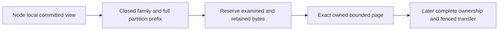

# ClusterRouting: bounded partition record pages

Status: first implementation stage for KL-036/071/072; complete movement remains
unqualified. Decisions: [ADR-016](../../ADR/ADR-016-atomic-physical-placement.md)
and [ADR-017](../../ADR/ADR-017-migration-tokens.md). Initial serving remains RF3.

This stage reads exact canonical key/value bytes from an already owned committed
`IKeyValueView`. The node-local caller retains that cut for all its pages. It
changes no existing persisted format, public API, placement or writer authority.

| Requirement | Acceptance criterion and real oracle |
|---|---|
| REQ-PMOVE-001: use a closed source-owned partition-family inventory | AC-PMOVE-001: actual partition-key constructors are covered; every selected family uses `KeySpace.Partition` with the four complete partition components. Unknown families, invalid partitions and foreign continuation keys fail before copying. Global catalog, principal/API keys, global outcomes, physical watermarks and shared blob accounting are explicitly excluded. |
| REQ-PMOVE-002: bound retained bytes, records and examined work independently | AC-PMOVE-002: real native ZoneTree pages cover empty/inclusive/one-over bounds, exact keys/values/order and charged lookahead. Retained bytes include every returned key/value buffer and the independent continuation buffer. Checked reservation precedes every copy, including continuation; an overlarge record or examined-byte exhaustion throws typed BudgetExceeded with no successful partial page. No full Scan, payload decode or whole-store materialization. |
| REQ-PMOVE-003: preserve caller-owned cut, cancellation and identity | AC-PMOVE-003: paginated reads inside one actual native view reproduce exact selected records; equal key text across tenant/database/domain stays isolated. Cancellation before/during traversal settles the original call with no successful partial image. Reopen preserves bytes; grains acquire no file owners. |
| REQ-PMOVE-004: a family page cannot stand in for a complete movable image | AC-PMOVE-004: no installer or public move endpoint exists until partition outcomes, shared catalog/authorization, blob accounting, retained cursor/transfer state and derived-index readiness have an accepted complete protocol. Later process-kill/fencing/RF3 SDK/MCP gates remain mandatory. |

The inventory covers documents/indexes/unique keys and epochs, graphs and
adjacency, vectors/lineage/effects, samples/sequence/dedup/retention, blob heads/
uploads/parts/metadata, every queue index/body/metadata/counter/inbox, recurring
schedules/sagas/capacity, subscription state/window/completion/inbox, both remote
transfer endpoints, event streams/topics/identities/sequence/feed/snapshots,
outbox/heads/consumers/receipts and visibility epochs. Enumerate actual current
constructors, including dynamic family arguments. There is no universal encoded
partition prefix: the family precedes the four partition components.

## Frozen reader contract and ordered ownership

TASK-PMOVE-PAGES: root owns architecture, source inventory and joins. Luna
implementation owns only new internal Core ClusterRouting Queries/Contracts/
Validation files prefixed `PartitionRecord`. Exact contract:
`PartitionRecordPageReader.Read(IKeyValueView view, PartitionRef partition,
string family, int maxRecords, long maxRetainedBytes, long maxExaminedBytes,
ReadOnlyMemory<byte> afterKey = default, CancellationToken cancellationToken = default)`
returns an internal immutable `PartitionRecordPage` containing owned
`ImmutableArray<KeyValueRecord> Records`, `bool HasMore`, `long RetainedBytes`,
`long ExaminedBytes` and optional independently owned `ReadOnlyMemory<byte>`
continuation. `PartitionRecordFamilies.All` is an immutable ordinal inventory.
Use native VisitRange, charge its real observer before copying, verify the
exclusive continuation belongs to this exact prefix and has canonical KeyCodec
encoding, and preserve raw bytes. Validate the continuation's bounded length
before decoding its key components; user value payloads are never decoded.
Reserve and copy continuation independently from the last returned key; its
bytes contribute to RetainedBytes and maxRetainedBytes. Native accounting and
unexpected visitor stops fail closed.
Positive bounds must be checked before traversal; overflowing counters fail
closed. There is no serialization or inter-grain DTO in this first stage.

TASK-PMOVE-PAGE-ORACLES: an independent Luna worker owns only new UnitTests
ClusterRouting Cases/Helpers prefixed `PartitionRecord`. Derive the criteria
above against actual ZoneTree/TestDatabase primitives, without mocks, fake view,
skips or weakened limits. Preserve callbacks' borrowed lifetime. Root reviews
the complete private packets, then executes Aspire normal/scalar tests.

Complete ownership is a later root-owned stage. Current epoch7 outcome keys have
no partition locator; their hash cannot recover one. Copying every global outcome
or dropping outcomes is incorrect. Existing-store migration needs its exact
accepted upgrade/rollback contract. Current persisted authorization remains
authority and an acknowledged revocation must fence all serving groups. Source
and destination group indexes are never directly comparable; explicit ownership
epoch invalidation is the first candidate under KL-072, pending full freeze.

Slice map: Core owns this internal pure reader in ClusterRouting; Server's
StorageRecovery retains native views/files and Replication retains ordered
commit authority. Later Orleans orchestration uses one request grain and native
ManagedCode.Communication asynchronous streams with bounded handoff. Public
contracts, SDK/MCP, frontend/admin controls are N/A for this internal stage;
their later actual move contract must be specified and qualified.

Verification: full strict Release build, formatter/governance, genuine Aspire
unit and unit-scalar focused PartitionRecord cases for local development, then
exact-source Linux CI. Later movement requires process cuts at every persisted
state and Docker/Aspire RF3 SDK/MCP recovery, fencing, token and receipt oracles.
Internal pages alone do not satisfy those movement acceptance criteria.

