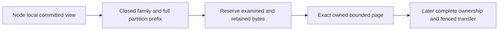
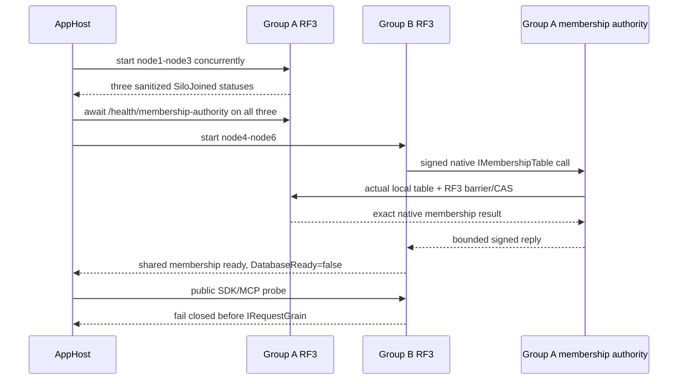
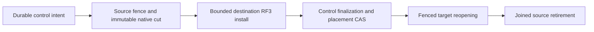
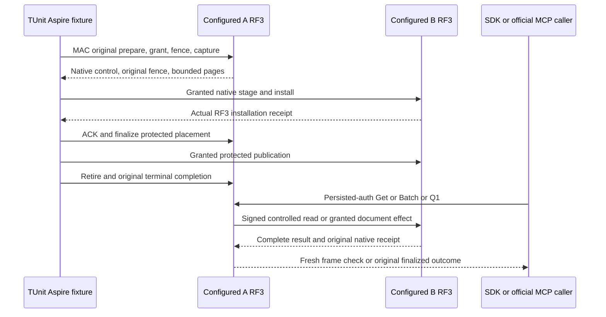
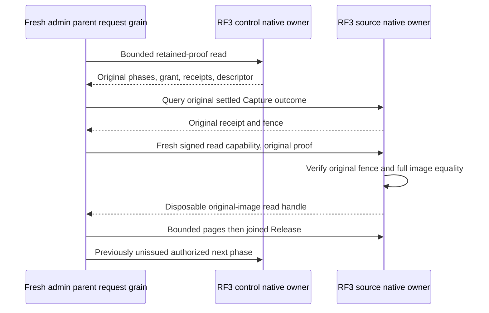
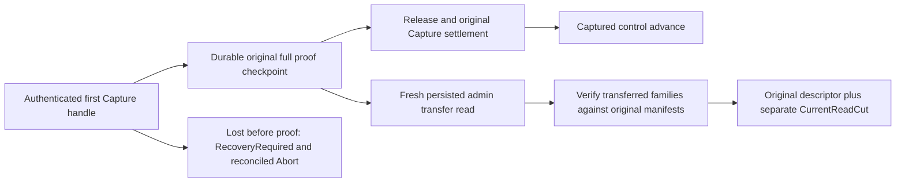
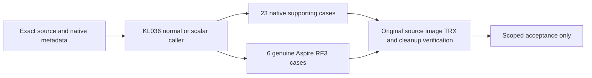
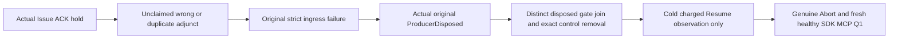
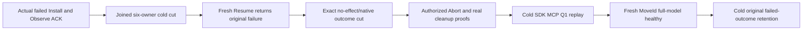
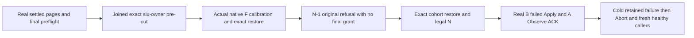

# ClusterRouting: bounded partition record pages

Status: first implementation stage for KL-036/071/072; complete movement remains
unqualified. Decisions: [ADR-016](../../ADR/ADR-016-atomic-physical-placement.md)
and [ADR-017](../../ADR/ADR-017-ownership-session-tokens.md). Initial serving remains RF3.

This stage reads exact canonical key/value bytes from an already owned committed
`IKeyValueView`. The node-local caller retains that cut for all its pages. It
changes no existing persisted format, public API, placement or writer authority.

| Requirement | Acceptance criterion and real oracle |
|---|---|
| REQ-PMOVE-001: use a closed source-owned partition-family inventory | AC-PMOVE-001: actual partition-key constructors are covered; every selected family uses `KeySpace.Partition` with the four complete partition components. Unknown families, invalid partitions and foreign continuation keys fail before copying. Global catalog, principal/API keys, global outcomes, physical watermarks and shared blob accounting are explicitly excluded. |
| REQ-PMOVE-002: bound retained bytes, records and examined work independently | AC-PMOVE-002: real native ZoneTree pages cover empty/inclusive/one-over bounds, exact keys/values/order and charged lookahead. Retained bytes include every returned key/value buffer and the independent continuation buffer. Checked reservation precedes every copy, including continuation; an overlarge record or examined-byte exhaustion throws typed BudgetExceeded with no successful partial page. No full Scan, payload decode or whole-store materialization. |
| REQ-PMOVE-003: preserve caller-owned cut, cancellation and identity | AC-PMOVE-003: paginated reads inside one actual native view reproduce exact selected records; equal key text across tenant/database/domain stays isolated. Cancellation before/during traversal settles the original call with no successful partial image. Reopen preserves bytes; grains acquire no file owners. |
| REQ-PMOVE-004: a family page cannot stand in for a complete movable image | AC-PMOVE-004: no installer or public move endpoint exists until partition outcomes, shared catalog/authorization, blob accounting, retained cursor/transfer state and derived-index readiness have an accepted complete protocol. Later process-kill/fencing/RF3 SDK/MCP gates remain mandatory. |

The inventory covers documents/indexes/unique keys and epochs, graphs and
adjacency, vectors/lineage/effects, samples/sequence/dedup/retention, blob heads/
uploads/parts/metadata, every queue index/body/metadata/counter/inbox, recurring
schedules/sagas/capacity, subscription state/window/completion/inbox, both remote
transfer endpoints, event streams/topics/identities/sequence/feed/snapshots,
outbox/heads/consumers/receipts and visibility epochs. Enumerate actual current
constructors, including dynamic family arguments. There is no universal encoded
partition prefix: the family precedes the four partition components.

## Frozen reader contract and ordered ownership

TASK-PMOVE-PAGES: root owns architecture, source inventory and joins. Luna
implementation owns only new internal Core ClusterRouting Queries/Contracts/
Validation files prefixed `PartitionRecord`. Exact contract:
`PartitionRecordPageReader.Read(IKeyValueView view, PartitionRef partition,
string family, int maxRecords, long maxRetainedBytes, long maxExaminedBytes,
ReadOnlyMemory<byte> afterKey = default, CancellationToken cancellationToken = default)`
returns an internal immutable `PartitionRecordPage` containing owned
`ImmutableArray<KeyValueRecord> Records`, `bool HasMore`, `long RetainedBytes`,
`long ExaminedBytes` and optional independently owned `ReadOnlyMemory<byte>`
continuation. `PartitionRecordFamilies.All` is an immutable ordinal inventory.
Use native VisitRange, charge its real observer before copying, verify the
exclusive continuation belongs to this exact prefix and has canonical KeyCodec
encoding, and preserve raw bytes. Validate the continuation's bounded length
before decoding its key components; user value payloads are never decoded.
Reserve and copy continuation independently from the last returned key; its
bytes contribute to RetainedBytes and maxRetainedBytes. Native accounting and
unexpected visitor stops fail closed.
Positive bounds must be checked before traversal; overflowing counters fail
closed. There is no serialization or inter-grain DTO in this first stage.

TASK-PMOVE-PAGE-ORACLES: an independent Luna worker owns only new UnitTests
ClusterRouting Cases/Helpers prefixed `PartitionRecord`. Derive the criteria
above against actual ZoneTree/TestDatabase primitives, without mocks, fake view,
skips or weakened limits. Preserve callbacks' borrowed lifetime. Root reviews
the complete private packets, then executes Aspire normal/scalar tests.

Complete ownership is a later root-owned stage. Global control outcomes have no
movable partition locator; their hash cannot recover one. Copying every global
outcome or dropping outcomes is incorrect. The current product must preserve
explicit partition-associated outcomes and shared control authority without a
data conversion or alternate reader. Current persisted authorization remains
authority and an acknowledged revocation must fence all serving groups. Source
and destination group indexes are never directly comparable; explicit ownership
epoch invalidation is the first candidate under KL-072, pending full freeze.

Slice map: Core owns this internal pure reader in ClusterRouting; Server's
StorageRecovery retains native views/files and Replication retains ordered
commit authority. Later Orleans orchestration uses one request grain and native
ManagedCode.Communication asynchronous streams with bounded handoff. Public
contracts, SDK/MCP, frontend/admin controls are N/A for this internal stage;
their later actual move contract must be specified and qualified.

Verification: full strict Release build, formatter/governance, genuine Aspire
unit and unit-scalar focused PartitionRecord cases for local development, then
exact-source Linux CI. Later movement requires process cuts at every persisted
state and Docker/Aspire RF3 SDK/MCP recovery, fencing, token and receipt oracles.
Internal pages alone do not satisfy those movement acceptance criteria.

The accepted native epoch/outcome prerequisite is [TokenOwnershipLineage](TokenOwnershipLineage.md), REQ/AC-PMOVE-005..006 and REQ/AC-MTOKEN-001..004 under ADR-017. Its partition-associated locator is part of the current product; shared global authority remains an explicit complete-image dependency. Family pages or a locator alone do not authorize installation or cutover.

# Accepted Stage 1A: shared Orleans membership; later physical movement contracts

Status: root accepts TASK-MOVE-1A and AC-MEMBERSHIP-001..006 for implementation on 2026-10-05. Later movement stages remain proposed until their exact contracts freeze. This is a contract, not runtime qualification; no physical movement acceptance is closed.

Related: [PartitionTransfer](PartitionTransfer.md), [PhysicalShardCatalog](PhysicalShardCatalog.md), [AtomicPartitionPlacement](AtomicPartitionPlacement.md), [ADR-016](../../ADR/ADR-016-atomic-physical-placement.md), [ADR-017](../../ADR/ADR-017-ownership-session-tokens.md), [ADR-099](../../ADR/ADR-099-physical-shard-catalog.md) and [ADR-101](../../ADR/ADR-101-explicit-atomic-partition-placement.md). Canonical slice remains `ClusterRouting`.

## Scope and source-backed boundary

The original plan requires controlled copy/catch-up/barrier/switch/cleanup (KL-036), whole atomic partitions with generation readiness and restartable cleanup (KL-071), and either pre-movement token invalidation or correct lineage translation without comparing independent log positions (KL-072). Current contracts intentionally stop before those operations: AC-PMOVE-004 forbids an installer, `AtomicPartitionPlacementV1` only resolves to the single committed `DefaultShard`, `PhysicalShardCatalog` only boots epoch 1, and AC-MTOKEN-004 explicitly excludes epoch bump/cross-group cutover. This proposal is a new movement contract; it does not reclassify current PMAP, bounded pages, token issuance, outcome association or current-frame recovery as movement. Source anchors: `docs/design/architecture-v0.3.uk.md` §§4, 6, 28 and KL-036/071/072; `docs/ADR/ADR-016-atomic-physical-placement.md` §§1–5; `docs/ADR/ADR-017-ownership-session-tokens.md`; current `PhysicalShardCatalog`/`AtomicPartitionPlacement` and `PartitionTransfer` contracts.

Stable identity remains the complete four-field `PartitionRef` / `AtomicPartitionId`. Physical shard identity remains a separate opaque ID for an independently configured RF3 replica group. A node-local `PartitionHost` owns its canonical ZoneTree store, replica log, file locks, materializer and apply gate. Orleans activation migration changes no physical ownership. Replica voters and Orleans silos are not separate logical shards.

Movement applies only to one complete `AtomicPartitionId` at a time. Splitting one hot atomic partition, changing its transaction domain, or changing the user-visible identity is out of scope. Source and destination must be independently provisioned, authenticated, configured three-voter RF3 groups with distinct physical IDs, incarnations and ordered voter identities. Their Raft/apply positions are unrelated and must never be numerically compared.

## Authority and operation contract

A stable database control authority remains outside the movable partition. It owns the canonical placement directory, persisted principals/policies, and the single global `(verified principal, CommandId)` uniqueness/outcome authority. The initial existing default shard may serve this role until a separately accepted topology stage provisions a dedicated control group; the control authority itself is never moved by this protocol. A moved partition is not permitted to create a second independent dedup domain.

Every routed request is authenticated at the existing public boundary and passes through its distinct `IRequestGrain` and native `ManagedCode.Communication` CQRS operation stream. The server—not the caller—derives a bounded internal owner grant from the committed control authority. It binds the complete partition, physical shard ID, incarnation, ordered voter identity, placement epoch, verified principal, persisted policy epoch, command ID/fingerprint when present, and operation/read kind. No client field or propagated Orleans context may supply role, owner, epoch, voter or policy authority. Every write operation kind that can mutate partition state must consume and validate this grant in its actual same-view canonical apply transaction; unsupported/unclassified writes fail closed. Reads resolve the current owner through the same control authority and cannot serve from a stale source owner after switch.

Because one atomic ZoneTree transaction cannot span independent physical groups, mutation execution has a durable control-authority intent: reserve the global command key and fingerprint before target execution, apply the idempotent typed mutation plus a target-side operation receipt atomically at the current owner, then finalize the exact outcome at the control authority. Acknowledgement occurs only after the final outcome is durable. A crash between stages leaves an inspectable pending intent; same-ID/same-fingerprint retry reconciles it and returns the exact terminal outcome, while same-ID/different-fingerprint is `Conflict`. If reconciliation cannot establish whether the owner committed, return the existing safe unknown-outcome category and retain the intent; never report success or dispatch a second logical effect. This authority stage is required before existing outcome rows can leave their current physical group.

Persisted policy remains canonical at the control authority. Revocation acknowledgement must fence new grants and wait for previously admitted mutation grants to settle; if a relevant owner cannot be reached or joined, revocation does not acknowledge a false fence. A stale or expired internal grant cannot authorize writes after a completed revocation or owner switch. Credentials, principal/API-key records and global outcomes are not copied with the partition.

## Requirements and measurable acceptance

- **REQ-MOVE-001 — Distinct physical owners and stable logical identity.** A complete partition is assigned to one physical shard, not to a voter or activation. **AC-MOVE-001:** an Aspire-owned topology starts at least two independent three-voter RF3 groups with distinct physical IDs/incarnations/voter arrays. Native status and signed discovery prove each group independently; writes to one full `PartitionRef` are visible only through the owner route, while a partition with identical suffix fields but a different full scope remains separate. No test calls three voters three owners.
- **REQ-MOVE-002 — One durable global command and policy authority.** Global command uniqueness/results and persisted authorization remain authoritative through owner changes. **AC-MOVE-002:** actual SDK and official MCP same-ID/same-body retries from different group endpoints return byte/logically identical terminal outcomes; same-ID/different-body and cross-partition duplicate attempts preserve global `Conflict`; interrupted pending intents reconcile without duplicated domain/outbox effects. A policy revoke prevents later admission and cannot acknowledge while pre-revocation grants remain unsettled. No client-supplied role or owner grant is accepted.
- **REQ-MOVE-003 — Complete bounded partition image and independent cuts.** Every canonical record, intent/receipt required for that partition, and required derived-generation state is transferred or deterministically rebuilt and verified; excluded global state stays in the control authority. **AC-MOVE-003:** an independent oracle compares the source committed partition image at a named source cut with destination installed state, exact full-scope keys/values, checksums and derived readiness. It covers documents/indexes, graph edges/adjacency, vector lineage, time-series samples, blob manifests/parts and ownership-bound metadata, queues/sagas/subscriptions/transfers/events/outbox/visibility, partition-local execution receipts, and any partition-scoped locator metadata needed to resolve the stable control authority. Such locator metadata is non-authoritative and may only point to canonical outcomes that remain in the control authority; global `StoredOutcome` records and the global command identity index are never copied into a data-owner image. Global/Unknown outcomes, global policy/catalog, and shared physical accounting are not silently copied. Unknown legacy outcomes, missing or unresolvable locators, unsupported files/assets, incomplete derived state or any over-bound image block readiness before ownership can switch. Limits and per-family record/byte totals are frozen before implementation; pages alone do not establish image completeness.
- **REQ-MOVE-004 — Ordered tail and source fencing.** The destination is caught up through an explicit terminal source fence before assignment changes. **AC-MOVE-004:** writes concurrent with snapshot capture are either present exactly once in the ordered tail or rejected after the source fence; destination final state matches the frozen source cut plus the complete tail. Every write path validates the trusted owner epoch in its same-view apply. Once the fence is committed, the old source cannot accept a new write even through a stale route or delayed grant. The catalog CAS and assignment revision are monotonic and idempotently recoverable.
- **REQ-MOVE-005 — Restartable phases and no data loss.** Movement progress is durable and phase-specific. **AC-MOVE-005:** real process termination/reopen at every persisted phase—intent, source fenced, image prepared/transferring, destination installed, tail caught up, assignment published, source retired—recovers forward or performs a proven pre-publication rollback. It never exposes two writable owners, loses an acknowledged command, deletes the only complete copy, decrements an epoch, or cleans source logs/files before destination quorum and published-owner evidence are durable. Ambiguous publication remains closed and is reconciled by the same move ID.
- **REQ-MOVE-006 — Explicit token and cursor behavior.** No source log position is compared with a destination log position. **AC-MOVE-006:** every source-owner CommitToken and owner-scoped feed/index cursor captured before switch is explicitly invalidated after the switch with stable `TokenInvalidated`; it never silently restarts at destination head. Newly issued destination tokens work and preserve same-owner monotonic reads. Tests include pre-switch token, post-switch old token, destination token, restart and retry/replay.
- **REQ-MOVE-007 — Caller-visible routing and bounded recovery.** Real operations keep the one-request-grain boundary and finite original deadline/cancellation. **AC-MOVE-007:** SDK and official MCP execute reads/writes before/during/after movement, see only complete current-owner results, and report safe typed busy/ownership/outcome errors during a fence; a fresh healthy request succeeds after every recoverable interruption. Every owned group, stream, child, transfer and lock is awaited and disposed before cleanup; no detached timeout-as-join path is allowed.

Traceability: original `AC-ROUTE-005` (planned prepare/copy/catch-up/validate/owner-switch/release with process interruption and actual RF3) and KL-036 copy/catch-up/barrier/switch/cleanup → REQ-MOVE-003/004/005 and AC-MOVE-003/004/005; KL-071 whole-partition image/generation/restartability → REQ-MOVE-001/003/005; KL-072 old-token invalidation/translation → REQ-MOVE-006; global outcomes/policy and live public route → REQ-MOVE-002/007. Each AC needs the named automated native or Aspire oracle; none is satisfied by the current PMOVE page tests or same-group voter restarts.

## Ordered implementation stages and exact ownership

1. **TASK-MOVE-1A — Six-node Orleans/RF3 topology only; no data-operation admission.** Add one explicit AppHost-only profile selector `KeyLoadTests:ClusterRouting:Profile=two-rf3` while keeping the existing caller entry `KeyLoadTests:Suite=rf3`. It creates exactly six containers, `node1` through `node6`, with Group A=`node1,node2,node3` and Group B=`node4,node5,node6`; each group has three fixed voters. For all six, `KeyLoad__ClusterId` is the same database Orleans cluster identity and `ClusterOptions.ServiceId` remains the current constant `KeyLoad`. Each group has one shared nonempty `KeyLoad__PhysicalShardId`, one shared nonempty `KeyLoad__Incarnation`, and its own exact ordered `KeyLoad__Peers__0..2` (for example Group A origins `http://node1:8080`, `http://node2:8080`, `http://node3:8080`); across groups the physical IDs, incarnations, and voter arrays are distinct/disjoint. Each node has a unique `KeyLoad__PublicEndpoint`, `KeyLoad__SiloAddress`, `KeyLoad__SiloPort` (container target11111), and `KeyLoad__DataDirectory` (`/data` mounted from a distinct `<root>/nodeN`); the existing private-network HTTP setting stays explicit. Each `ReplicaConfiguration` is production mode (`BenchmarkTopology=false`) and validates exactly three fixed voters, unique identities, one local member, and independent per-node store/log/lock roots. No arbitrary node-count override is allowed. Existing `KeyLoad__SigningKey`, `KeyLoad__AdminKey`, `KeyLoad__PeerSecret`, transport limits, and operation deadlines retain current validation; no secret is emitted in profile/status diagnostics. Current per-group caps remain untouched: MaxAppendEntries64, MaxAppendBytes16MiB, SnapshotChunkBytes262144 and MaxSnapshotBytes4GiB; the two-group selector may not raise or relax these or the three-voter majority.

   **R2 membership blocker and R3 refinement:** identical `ClusterId` alone is not proof of one Orleans cluster. Current `OrleansSiloConfiguration` binds `IMembershipTable` to the local `PartitionHost` group, so disjoint groups diverge. The proposed R3 amendment below defines a Group A shared membership authority and Group B authenticated provider proxy. It preserves the current persisted membership aliases/IDs and native RF3 membership mutation path; it does not yet qualify a six-silo cluster.

   Stage 1A keeps silo membership readiness separate from database data admission. Existing `/health/ready` remains the database-ready signal. In the two-group profile every public database operation is rejected by an explicit `OrleansNode.ExecuteCoreAsync` profile gate before reading `IGrainFactory` or looking up `IRequestGrain`, even if Group A completed local catalog bootstrap. Group A may complete the current local physical-catalog bootstrap before Group B starts. Group B MUST skip that request-grain bootstrap because a shared Orleans directory can place the grain on a different physical owner; no direct store write or local-placement assumption may replace it. Group B has no committed physical catalog and both groups remain `DatabaseReady=false`. Existing three-node `rf3` behavior remains unchanged. Literal and real AppHost tests must prove one shared six-silo membership view, two independent three-voter RF3 domains, distinct node-local stores/logs/locks, and public SDK/MCP no-dispatch with no user/catalog/outcome mutation. They must not claim Group B is a usable second database owner in 1A.

   **Current contract identities remain unchanged in 1A:** `ReplicaSiloDiscovery` keeps alias `keyload.replica.discovery.v2` and IDs 0–6 (`VoterId`, `ClusterId`, `Incarnation`, `SiloAddress`, `TransportReady`, `ApplicationRpcVersion`, `PeerEnvelopeVersion`); `PhysicalShardCatalog` stays `keyload.contract.physical-shard-catalog.v1` IDs 0–2, and `PhysicalShardRecord` stays `keyload.contract.physical-shard-record.v1` IDs 0–3. `AtomicPartitionPlacementV1` and its request/resolution aliases and IDs remain as ADR-101. `NodeStatus` stays `keyload.contract.node-status.v1` IDs 0–8. R3 freezes new generated membership-authority transport contracts with an independent protocol version 1; the existing app-request interface version 4, replica peer-envelope version 3, discovery-MAC version 2 and all persisted membership aliases remain unchanged. The six-node profile is homogeneous current image only; startup closes on missing, mixed or incompatible membership/member identity evidence.

   Owners for the topology-only stage: root owns AppHost's profile selector, six-node resource graph and actual image/runtime identity; Orleans owns the shared membership authority adapter and explicit separation of silo membership from user-operation admission; Replication owns fixed per-group RF3 voters and authenticated primary/barrier evidence; Server owns each node-local `PartitionHost` and fail-closed operation gate; Integration tests own actual AppHost-owned six-node native membership/status and SDK/MCP no-dispatch cases. The stage does not implement an owner directory, cross-group data operation, copy, or movement.
2. **TASK-MOVE-1B — Committed owner directory and global command/policy authority (not a move).** Only after 1A proves the common cluster and both groups remain data-operation closed, add a versioned additive owner directory and the global command reservation/final-outcome authority. Preserve SCAT V1 and PMAP V1 bytes/aliases/IDs. Through persisted-admin native control, assign a newly created empty `PartitionRef` to the additional group at its initial epoch and route real SDK/MCP reads/writes through the server-derived owner. No existing partition or records move in this stage. Establish the global command reservation, target-side atomic idempotency receipt, and exact finalization/reconciliation before acknowledging cross-group writes. Same principal/CommandId/body retries reconcile the same pending intent; changed body conflicts. Every mutating operation kind is inventoried and consumes the trusted grant inside its actual same-view apply. Policy remains at stable control authority and revocation drains prior grants. Owner: root owns AppHost transport/profile and authenticated inter-group client; Core owns ClusterRouting owner directory and `AtomicCommandCommit`/`CommandOutcomes` integration; Orleans owns request admission/routing; Replication owns inter-group authentication/streaming; Server owns routing to the node-local `PartitionHost`; Integration tests use actual .NET SDK and official MCP. This stage still does not claim an existing-data move.
3. **TASK-MOVE-IMAGE — Complete partition export/import.** Define a versioned bounded image manifest over `PartitionRecordFamilies`, plus explicit non-keyspace-owned assets and rebuild-ready derived generations. Capture one source `IKeyValueView` cut and make immutable checksummed bounded pages. Install only into a distinct, empty/private destination generation under its `PartitionHost` lock; validate full `PartitionRef`, database incarnation/format, all family totals/hashes, partition-local execution receipts and non-authoritative locator references, quotas and derived readiness before publication. Canonical global `StoredOutcome` records and the global command index remain in the stable control authority and are not copied. Owner: Core ClusterRouting pages/manifest; Storage.ZoneTree and Server StorageRecovery own actual private generation files, handles and atomic install; Replication defines only transport envelope/authentication; no grain owns file handles. Join point: same node-local store lifecycle as `PartitionHost` and checkpoint recovery. Until verified install exists, source stays authoritative and destination cannot serve.
4. **TASK-MOVE-TAIL — Durable ordered catch-up and source fence.** Add per-partition movement intent and tail records in the same source canonical transaction as every post-snapshot mutation; bounded sequence numbers are partition-scoped and distinct from group Raft positions. Pause/throttle/fail closed before a configured tail retention bound is exhausted. Source fence stops new grants, waits admitted operations, commits a terminal tail sequence and remains durable across restart. Destination applies exactly once through that terminal sequence under its native apply gate and verifies the final image. Owners: Core command/outcome; Replication ordered transport; Server/StorageRecovery node-local fence and lifecycle; Orleans one-request admission/drain. No source lock or log is released before actual terminal join.
5. **TASK-MOVE-SWITCH — Monotonic owner publication and recovery.** In a same-control-authority transaction, compare current full owner tuple + assignment revision + source epoch + MoveId and publish destination tuple with a strictly greater placement epoch only after destination installed/caught-up receipt and source fence receipt validate. Make retry of an identical switch idempotent; changed move input conflicts; stale revisions fail closed. Old source's local fence is permanent after publication. Pre-publication rollback is permitted only while control authority still records source and destination effects can be abandoned safely; post-publication always recovers forward. Owners: Core placement/control command; Orleans routing; Server ready/admission; root joins public operation routing. No old compatible binary may serve after movement records are published; protocol/profile compatibility must fail startup closed.
6. **TASK-MOVE-TOKEN — Token/cursor semantic join.** KL-072 selects explicit invalidation for the first move contract. Every cursor/token whose meaning includes a physical-group log position must carry the owner incarnation/placement epoch or be version-rejected after switch with `TokenInvalidated`; destination tokens use the destination lineage. No source/destination position comparison is permitted. Owners: Abstractions native contracts only if append-safe fields are required; Core token helpers; Query/ChangeFeeds cursor consumers. A separate durable translation/sequence format is out of scope.
7. **TASK-MOVE-RF3 — Genuine public qualification.** Add AppHost-owned six-node fault cases with real .NET SDK and official MCP; test duplicate, concurrent, revoke, long-running tail, cuts/restart at each phase, old-owner fencing after delayed request, source/destination leader changes, retry after lost ACK, token invalidation, health/readiness and cleanup. Root owns fixture/wave topology, exact source maps, image/profile/version admission and Linux qualification. Preserve original failure artifacts; no independent Docker launch. Only after every unit/recovery/analyzer/formatter/RF3 gate passes can this ADR move to Implemented or KL-036/071/072 close.

## Rollout, rollback and limitations

Current SCAT V1 and PMAP V1 bytes/aliases/IDs remain unchanged until an explicit data-format upgrade is separately specified. A new owner directory/control record requires a new stable generated-native alias/key or an explicit writer-stopped conversion; old writers/readers must never silently ignore a published owner. Mixed source/destination protocol versions fail closed. No downgrade to an earlier placement epoch is allowed. Restore either reopens the current published destination with complete receipt/lineage or recovers forward; it cannot reactivate a stale source based on its local copy alone.

Frontend is N/A for this internal routing/control workflow. SQL and SDK/MCP gain no caller-trusted owner fields. Full movement, rollback, selected old-token invalidation, global outcome authority, and two-group process-fault evidence remain open until these new ACs are implemented and qualified.

## R4 — Shared Orleans membership authority (Stage 1A contract proposal)

This section supersedes R2's unresolved membership transport paragraph. It freezes a narrow topology-only prerequisite for review; it does not enable owner routing, make either group's local database composable, or close any movement AC. R4 corrects the pinned Orleans version, native `UpdateRow` trust semantics, historical-row capacity and cancellation-aware provider contract below; these corrections supersede conflicting R3 wording in this amendment and ADR-106.

### Existing lifecycle and authority

Current `ServerApplication.RunLifetimeAsync` starts `PartitionHost.Coordinator`, then starts the ASP.NET app/Kestrel, then awaits `OrleansNode.StartAsync`. `OrleansNode.StartCoreAsync` calls native `IHost.StartAsync`; only after that returns does it publish `IGrainFactory`, then run `PhysicalShardCatalogStartup`. The Kestrel process therefore has a real authenticated endpoint available before Orleans asks `IMembershipTable.InitializeMembershipTable`.

Group A remains the sole membership-table authority. It keeps the existing local `ReplicaMembershipTable`, whose `ReplicaMembershipStore.ReadAsync` performs `ReplicaConsensus.ReadControlBarrierAsync` before reading the `membership/orleans-membership` record, and whose `CompareExchangeAsync` submits native `OperationKind.Membership` through Group A's `ICommitCoordinator`. The existing membership record, snapshot, row and suspect aliases/IDs are unchanged. This is one persisted table replicated by Group A's actual three-voter RF3 quorum.

Group B registers `ReplicaMembershipAuthorityClientTable` as Orleans `IMembershipTable`; it MUST NOT register a local `ReplicaMembershipTable` fallback. Its native membership methods call the Group A HTTP authority during Orleans startup and thereafter. The authority endpoint is registered by Kestrel before Orleans starts, but returns unavailable while its owner has no published provider. `OrleansNode` marks `SiloJoined` only after native `built.StartAsync` returns. It then completes Group A's existing `PhysicalShardCatalogStartup`; as the final successful startup step, after catalog initialization has returned, it publishes the borrowed `IMembershipTable` obtained from `built.Services` through `ReplicaMembershipAuthorityOwner` and sets `AuthorityReady`. `OrleansNode.StartAsync` completes only after this publication. The endpoint never resolves silo services from the outer Kestrel provider. This ordering prevents Group B startup from racing Group A's catalog bootstrap through the shared directory. No Orleans client/grain call is used to initialize shared membership.

### Ordered startup and shutdown

1. AppHost creates exactly Group A=`node1..node3` and Group B=`node4..node6`, fixed current image only. All six have the same `KeyLoad__ClusterId` and `ClusterOptions.ServiceId=KeyLoad`; each group retains its distinct three-voter `KeyLoad__Peers__0..2`, `PhysicalShardId`, `Incarnation`, private logs, stores, locks and apply gates.
2. AppHost starts Group A's three nodes concurrently, awaits `/health/silo` from all three (`SiloJoined` means native `built.StartAsync` returned), and then awaits `/health/membership-authority` from all three (`AuthorityReady` means `OrleansNode.StartAsync`, including Group A's local catalog initialization, returned and the local table provider has been published). The endpoint must continue to return unavailable between the first and second barriers; it accepts authority calls only after this second barrier. This guarantees the local startup catalog request cannot be placed on a Group B silo. Group A's existing `PhysicalShardCatalogStartup` may complete locally; it does not open public data admission in this profile.
3. Only after that barrier AppHost starts Group B. Its `IMembershipTable.InitializeMembershipTable` uses bounded requests to Group A's three exact origins until it reads the shared table or its finite startup deadline/cancellation expires. Normal Orleans membership insertion/status/heartbeat calls also use this proxy. Failed authority/quorum is a startup failure; the client never falls back to Group B's isolated local store.
4. Group B MUST skip `PhysicalShardCatalogStartup`'s request-grain bootstrap in 1A. Once six silos share a distributed directory, that request could activate/execute on another physical owner. Do not substitute a direct local write, `PreferLocalPlacement`, or a bootstrap grain. Group B has no committed owner catalog in 1A; its catalog and safe application route are explicit Stage 1B prerequisites.
5. The six-node AppHost test waits for Group A’s `/health/membership-authority` barrier before starting B, then waits for shared-membership readiness on all six. Each check reads the actual full table through that node’s provider; the total may contain up to 48 retained rows, but readiness requires exactly the six expected current, unique SiloAddress generations to be Active. No row is truncated. Status exposes total-row and active-current counts plus a SHA-256 fingerprint over the six current address/status tuples, never rows or addresses. Tests independently read signed discovery from each actual node and require all six views to match. `/health/silo` reports only `SiloJoined`; `/health/membership-authority` reports Group A’s completed local startup; membership-ready never opens public database admission.
6. `/health/membership-authority` is a Group A-only internal status phase. It remains false until the table is published after full local startup and catalog initialization; Group B never publishes an authority. `DatabaseReady` remains false on both groups for all of 1A. Existing `/health/ready` remains 503 and every SDK/MCP database operation is rejected by `OrleansNode.ExecuteAsync` before `IRequestGrain` lookup/dispatch. Membership and silo readiness are system-control phases, not public database readiness.
7. Aspire dependency ordering stops Group B before Group A. Group B's outbound membership calls remain available until its native Silo shutdown settles; then its proxy owner joins outstanding calls and disposes its HTTP client/credentials. Before Group A's native Silo shutdown, its authority owner closes external admission and joins admitted HTTP handlers while Kestrel and the local membership table are still live. The local membership table remains available to Group A's own Silo teardown. After Silo shutdown settles, clear the published borrowed-provider reference before native service-provider disposal; never dispose that borrowed provider independently. Kestrel and authority secrets are disposed afterward.

`ServerApplication`'s observed order is `Coordinator.StartAsync -> app.StartAsync -> silo.StartAsync`; shutdown is `silo.StopAsync` (including membership teardown) before `app.StopAsync`, then physical-owner disposal. Stage 1A preserves this order. No new hosted service or concurrent Orleans lifecycle callback is used to “bootstrap” the cluster.

### Ordered membership startup

### Membership authority wire and authentication

The new endpoint is private-network-only `POST /internal/orleans/membership/v1`; it is distinct from bodyless `PeerSecurity` discovery (`GET /internal/silo`) and does not broaden `PeerSecurity`. It uses native generated Orleans serialization, exact original request-body bytes for authentication, strict closed request/response records, no JSON fallback, no caller-facing route, and no `ReplicaRpc` enum/envelope reinterpretation.

Add these new stable generated contracts in the `ClusterRouting` slice. Existing `ReplicaSiloDiscovery` remains alias `keyload.replica.discovery.v2` IDs 0–6; request-interface version 4, peer-envelope version 3 and discovery-MAC version 2 do not change because the RequestGrain and replica-envelope shapes are unchanged. The new membership protocol has its independent explicit `Version=1`; an unknown/missing version fails closed.

- `ReplicaMembershipAuthorityEntryV1`, alias `keyload.orleans.membership.authority.entry.v1`: IDs 0 Address, 1 Status, 2 ProxyPort, 3 Host, 4 Name, 5 Started, 6 Alive, 7 Suspects (existing native `ReplicaMembershipSuspect` values), 8 RowETag. It mirrors the complete current native row needed to round-trip `MembershipEntry`; no persisted record is rewritten.
- `ReplicaMembershipAuthorityCallV1`, alias `keyload.orleans.membership.authority.call.v1`: IDs 0 Version, 1 ClusterId, 2 AuthorityPhysicalShardId, 3 AuthorityIncarnation, 4 CallerPhysicalShardId, 5 CallerIncarnation, 6 CallerVoterId, 7 CallerSiloAddress (actual generation from `ILocalSiloDetails`), 8 RequestId, 9 Operation, 10 TargetSiloAddress, 11 CandidateEntry, 12 ExpectedTableVersion, 13 ExpectedTableVersionETag, 14 ExpectedRowETag, 15 CleanupBeforeUtcTicks. Operation enum values are explicit and append-only: ReadAll=1, ReadRow=2, InsertRow=3, UpdateRow=4, UpdateIAmAlive=5, CleanupDefunct=6. DeleteTable is deliberately not a proxy operation.
- `ReplicaMembershipAuthorityReplyV1`, alias `keyload.orleans.membership.authority.reply.v1`: IDs 0 Version, 1 AuthorityPhysicalShardId, 2 AuthorityIncarnation, 3 RequestId, 4 RequestNonce, 5 `ResultKind : int`, 6 nullable existing `ErrorCode`, 7 `ErrorDetailCode : int`, 8 Applied, 9 TableVersion, 10 TableVersionETag, 11 Rows. `ResultKind` is explicit `Completed=1` or `Failed=2`. Completed carries null ErrorCode and `ErrorDetailCode.None=0`; Applied is the exact native mutation result (false on reads and non-applied CAS), and Rows contains the entire bounded read result. Failed carries non-null existing ErrorCode, non-None fixed ErrorDetailCode, Applied=false, no rows, TableVersion=0 and an empty TableVersionETag. ErrorDetailCode is explicit and append-only: None=0, MalformedRequest=1, AuthenticationFailed=2, UnsupportedVersion=3, AuthorityMismatch=4, CallerGroupMismatch=5, UnsupportedOperation=6, RequestLimit=7, ReplyLimit=8, MembershipCapacity=9, AuthorityUnavailable=10, PersistedTableCorrupt=11, DeleteUnsupported=12. Map MalformedRequest/UnsupportedOperation to Validation; AuthenticationFailed/AuthorityMismatch/CallerGroupMismatch to Unauthenticated; UnsupportedVersion/DeleteUnsupported to UnsupportedCapability; RequestLimit/ReplyLimit/MembershipCapacity to ResourceExhausted; AuthorityUnavailable to OwnershipLost; PersistedTableCorrupt to Corruption. These details map to fixed local strings only; no exception, address, header, identity or payload text crosses the boundary.

The HTTP authentication headers are single-valued and canonical: cluster ID, authority physical/incarnation, caller physical/incarnation/voter/SiloAddress, invariant UTC ticks, fresh nonce, and 32-byte HMAC-SHA256 signature. Sum of UTF-8 header-name/value bytes is at most 4,096, each value at most 512 bytes, and Kestrel enforces the same total header limit before handler retention. Timestamp is canonical positive invariant UTC ticks within 30 seconds of receiver TimeProvider UTC now. Nonce is base64url of 16 cryptographically random bytes without padding (22 ASCII bytes); IDs are canonical lower-case N; SiloAddress round-trips exactly through ToParsableString() and is at most 256 UTF-8 bytes. A single declared Content-Length is required and checked before streaming. The request MAC input is ASCII domain `keyload-orleans-membership-authority-request-v1` plus LF, length-prefixed UTF-8 canonical method/path/identity/timestamp/nonce fields, big-endian UInt64 exact body length, and the 32 raw SHA-256 bytes of the original body. The reply uses the distinct `keyload-orleans-membership-authority-reply-v1` domain and binds authority identity, original RequestId/nonce, status, exact body length and digest. No decoded/re-serialized DTO participates. Verify MAC in fixed time before native deserialization; then require body/header identities to match. Reject duplicate/missing headers, replayed nonce, noncanonical address/ID, request/reply substitution, redirected origin, query string, unknown operation, trailing bytes and oversized body. No log includes secrets, headers, payload or address.

Group B signs calls using its existing group `KeyLoad__PeerSecret`. Group A's authority configuration holds the exact Group B fixed physical ID/incarnation/voter set and that group's peer credential to validate inbound calls. Group A signs replies with its own existing `PeerSecret`; Group B's authority client holds the expected Group A credential and physical ID/incarnation to validate replies. Credentials are separate from `AdminKey`/`SigningKey`; AppHost injects them as secret parameters, zeroes temporary decoded bytes, and never exposes them through status. Existing per-group peer discovery/replication authentication remains unchanged.

Runtime settings are strict and all-or-nothing: `KeyLoad__MembershipAuthority__Mode` is `local` (default, existing single RF3), `authority` (Group A), or `proxy` (Group B); `KeyLoad__MembershipAuthority__AuthorityPhysicalShardId`, `...__AuthorityIncarnation`, `...__AuthorityEndpoints__0..2`, and `...__AuthorityPeerSecret` identify/authenticate the exact Group A authority for proxy nodes; `...__TrustedGroupPhysicalShardId`, `...__TrustedGroupIncarnation`, `...__TrustedGroupVoterIds__0..2`, `...__TrustedGroupSiloEndpoints__0..2` (canonical host:port resolved at startup), and `...__TrustedGroupPeerSecret` identify/authenticate the exact Group B for authority nodes. `KeyLoad__ClusterId`, `KeyLoad__PhysicalShardId`, `KeyLoad__Incarnation`, `KeyLoad__Peers__0..2`, `KeyLoad__SiloAddress`, `KeyLoad__SiloPort`, and `KeyLoad__AllowPrivateNetworkHttp` keep their current meanings. `local` rejects authority-only keys; only the exact two-RF3 AppHost profile can assign `authority` to Group A and `proxy` to Group B. Partial vectors, duplicate/nonmember origins, wrong physical ID/incarnation/cluster, malformed secrets or non-private HTTP fail configuration before stores open. The normal three-node profile remains `local`; it has no authority settings or behavior change.

### Bounds, errors and lifecycle

The authority endpoint and client use one shared 30-second operation deadline: `ReplicaMembershipProtocol.RequestTimeout = ReplicaProtocol.ReadBarrierTimeout` (10 seconds) + `ReplicaProtocol.CommandTimeout` (20 seconds). It covers admission, HTTP connect, body read, provider read/CAS, response serialization and verification. The pinned `Microsoft.Orleans.*` packages are 10.4.0. Orleans 10.4.0 `IMembershipTable` has cancellation-aware Async overloads for initialization, reads, insert/update/heartbeat, cleanup and deletion. Implement those overloads on the same `ReplicaMembershipTable`; the handler dispatches to its corresponding native `...Async(..., originalLinkedDeadlineToken)` method. Tokenless compatibility methods delegate to the same algorithms. Do not rely on Orleans default adapters, which cancel only the caller wait while tokenless work continues. No extra `ExecuteAuthorityCallAsync` shim is needed because every proxied operation has a native cancellation-token overload; no second provider or storage implementation is created. Cancellation/disconnect cancels and joins the original provider callback before releasing its lease; no `WaitAsync` or detached task. Startup retry remains a single cancellable 120-second total deadline and existing 250ms transient interval. HTTP connection establishment remains the existing 500ms peer-connect bound. In the two-RF3 profile only, request bodies are at most 65,536 bytes, full replies at most 262,144 bytes, persisted encoded membership snapshots at most 262,144 bytes, one encoded row at most 4,096 bytes, retained rows at most 48, and suspects per row at most six. SiloAddress, Host, Name and each suspect address are each at most 256 UTF-8 bytes. The 48-row total is a new explicit profile bound, not an existing native limit; it accommodates six expected current members plus up to 42 retained generations. ReadAll returns all history with no truncation. Count exactly six expected current Active SiloAddress generations for readiness; historical non-current rows do not count. Preflight row-count and field-size bounds before building a changed row array; serialize snapshots and replies through cap+1 bounded writers. If a read or proposed update exceeds a cap, return ResourceExhausted without retaining or persisting the over-limit record/snapshot/reply; never evict a live or historical row to make space. Existing local three-node membership mode retains its current behavior. Each process admits at most eight authority calls and retains at most 16,384 unexpired nonces. Nonces expire after two minutes using monotonic TimeProvider timestamps; only expired entries may be removed. A full unexpired nonce table rejects new calls with ResourceExhausted before provider work, never evicting replay evidence. Retries use a fresh nonce and exact original CAS expectations. Authority failover visits only the three configured Group A origins under the same operation token; redirects are disabled.

The authenticated identity is a configured group trust identity, not an individual silo credential: the existing PeerSecret is group-shared. Every call binds and validates the caller group tuple, canonical SiloAddress and generation, fixed native silo port, request nonce and signature. InsertRow and UpdateIAmAlive are generation-owned native operations, so the candidate SiloAddress must equal the signed CallerSiloAddress. UpdateRow is intentionally not own-row-only: Orleans 10.4.0 MembershipTableManager calls UpdateRowAsync to add suspicion votes and mark arbitrary target silos Dead. A member of either configured trusted group may therefore CAS-update any existing exact target row; TargetSiloAddress must equal CandidateEntry.SiloAddress and the persisted row key. It cannot insert an unrelated generation through UpdateRow. Preserve native row/table ETag CAS, suspicion lists, heartbeat non-regression, and all native membership transitions. CleanupDefunct retains the existing Dead+cutoff rule and native CAS. Remote DeleteTable remains unsupported. A lost/replayed call cannot create a second table transition; return the exact native CAS boolean.

Authentication/shape failures are `Unauthenticated` or `Validation`; unsupported deletion/operation is `UnsupportedCapability`; authority missing/quorum loss/deadline is `OwnershipLost`; bounded capacity is `ResourceExhausted`; malformed persisted membership bytes remain `Corruption`. A typed CAS non-application returns the actual `false`, not synthetic success. Group B startup throws if authority cannot initialize; no local-read fallback is allowed. Active HTTP handlers and proxy calls are cancelled and actually joined before disposing HttpClient, replay tables, credentials, Silo host or stores. Group B stops before Group A; Kestrel authority remains available while the control Silo is still in membership teardown, then rejects admission and joins callbacks before app disposal. For Group A, close external authority admission before native Silo shutdown, join admitted HTTP calls while Kestrel and the local provider are still live, then stop the Silo; clear the published borrowed-provider reference before the native service provider can dispose it. Do not dispose the borrowed `IMembershipTable` independently.

### Membership-specific acceptance

- **AC-MEMBERSHIP-001 (same view):** a genuine six-container Aspire run reports all six native silos joined; independent Group A and B replica configurations each contain exactly three distinct fixed voters and unique physical IDs/incarnations; one shared full `IMembershipTable.ReadAll` view includes the six expected current active SiloAddress generations and may retain bounded old generations. All rows are returned without truncation under the 48-row/256-KiB profile cap. Both groups' physical stores, replica logs and locks remain distinct. Group B has no catalog and no data readiness. Existing 3-node RF3 remains unchanged.
- **AC-MEMBERSHIP-002 (bootstrap ordering):** source-bound startup trace proves AppHost waits for all Group A `/health/silo` and `/health/membership-authority` results, then starts Group B; Kestrel is listening before B's Silo starts. A real startup observation verifies that after `SiloJoined` but before Group A catalog initialization succeeds, the authority endpoint still reports unavailable and no proxy call is admitted. Only after `AuthorityReady` is published does B's `IMembershipTable.InitializeMembershipTable` complete through authenticated Group A HTTP without Orleans grain dispatch. No Group A quorum/authority returns typed unavailability and B startup fails/cancels within the original startup deadline.
- **AC-MEMBERSHIP-003 (safe admission):** in the six-node profile `/health/silo` can be true and membership-ready can be true while `/health/ready` remains 503. Real SDK and official MCP read/write calls at both group endpoints fail before `IRequestGrain` dispatch with no data/catalog/outcome mutation. No other public DB API becomes ready.
- **AC-MEMBERSHIP-004 (wire and auth):** actual native serializer tests cover all fields, row ETags, suspicion times, TableVersion, six-current-plus-history readiness, exact 48-row and encoded byte bounds; actual HTTP tests reject malformed/missing/duplicate headers, altered body/signature, wrong group/authority/incarnation/cluster/address, stale/replayed nonce, old protocol version, extra fields/trailing bytes, unknown operation and cap+1. A real native membership-manager suspicion/death path updates a remote target row through exact ETag/table-version CAS. No local provider fallback appears after any failure.
- **AC-MEMBERSHIP-005 (quorum/failover/teardown):** stop one Group A node and prove Group B membership reads/heartbeat CAS continue through one of the other actual control nodes with Group A majority. Stop two Group A nodes and prove Group B returns unavailable/does not fall back. In a normal owned shutdown, Group B Silo disposal and outbound operations join before Group A teardown; all three authority Kestrel handlers/calls join before Group A credentials/host/stores dispose. A fresh complete six-node start joins with current new SiloAddress generations and no stale ownership/readiness.
- **AC-MEMBERSHIP-006 (current compatibility):** standard three-node current image uses local membership unchanged. The two-RF3 profile accepts only the same exact homogeneous immutable current image on all six before AppHost `Start`; old or mixed images are not supported by this profile and are rejected by image identity/version checks before resources start. The membership transport itself requires protocol v1 and exact authority tuple. No rolling upgrade claim is made.

REQ-MOVE-001 and AC-MOVE-001 remain open until this stage's actual six-node evidence exists. AC-MOVE-002..007 and Stage 1B remain open. A single RF3 group, three voters counted twice, equal ClusterId, standalone nodes or six configurations are not proof of one Orleans cluster.

### Accepted membership DNS pin lifecycle, 2026-10-05

REQ-MEMBERSHIP-007: Group A composition must not resolve the not-yet-started
Group B container aliases. Aspire still starts B only after every A authority
health barrier. The authority resolves B's exact configured host and silo port
only after validating the signed group/caller tuple, original-body HMAC, nonce
and canonical SiloAddress; no payload selects a hostname or resolution target.
Resolution and waiting consume the original admitted call deadline/cancellation.
Await the actual native `Dns.GetHostAddressesAsync` task, with no detached task,
fallback, extra operation deadline or unbounded retry.

Each authority lifetime has exactly three private per-voter pin gates. At most
one resolution is in flight for a voter, within the existing eight-call cap.
Validate the complete native result before publication: require 1..8 distinct
valid addresses, reject rather than truncate an over-bound set, and require the
authenticated canonical caller address/port to match. Publish one owned immutable
set only after success. A failed/cancelled initial attempt leaves the voter
unpinned and performs no membership-store work; a later independently admitted
call may try again. A successful pin is never silently refreshed or replaced in
that authority lifetime. Replacing an address requires a fresh authority
lifetime; ordinary process restarts retaining the configured container address
remain supported. Existing fixed Group A origins/identity checks are unchanged.
Unresolved addresses fail OwnershipLost; mismatched caller identity/address
fails Unauthenticated; over-bound resolution fails ResourceExhausted. Use only
closed safe wire errors, never names, addresses or resolver exception text.

AC-MEMBERSHIP-007: the actual Aspire six-container startup reaches A authority
readiness before B exists, then all six native silos join one membership table.
Actual HTTP/native-DNS tests cover cold concurrent calls, first-attempt
cancellation/unavailability with no pin/store mutation, successful once-only
pinning, signed wrong address, changed address rejection, capacity rejection and
shutdown joining the original resolutions/calls before pin gates dispose.
Existing six-view, native suspicion/CAS, failover, minority and teardown gates
remain mandatory; source configuration is not that proof.

Traceability: REQ-MEMBERSHIP-007 -> AC-MEMBERSHIP-007 -> ADR-106 amendment ->
TASK-MOVE-1A. Luna lifecycle_wave owns the private authority pin/endpoint and
native regression packet; root owns review, join, strict build/format and actual
Aspire RF3 evidence. No persisted, public database or user authorization format
changes occur. Rollback disables the explicit two-RF3 profile; it cannot revive
an eager-DNS startup cycle or enable Stage 1B data operations.

### Accepted independent six-generation oracle, 2026-10-05

REQ-MEMBERSHIP-008: the two-RF3 test topology must hand its already-generated
Group B identity and discovery credential to the owned native test wave through
the actual Aspire model. `membership-physical-b` and `membership-incarnation-b`
are canonical nonempty D-format GUID ParameterResources, distinct from Group A;
`membership-peer-b` is the existing secret ParameterResource. Pass these same
resource references to B's node configuration and A's trusted-group configuration.
Do not independently generate or substitute test identities or credentials.
The test resolves the three exact resources with native
`ParameterResource.GetValueAsync` under its original cancellation/deadline and
never records their values in logs, test output, artifacts or exception text.
Decoded discovery-key bytes have an owned lifetime and are zeroed only after all
original signed-discovery operations join. No credential is exposed by health.

Group A and B use the same actual Orleans ClusterId derived from A, while their
physical IDs, incarnations and three-voter discovery MAC keys remain distinct.
A new feature-local test helper verifies all six real signed native discovery
responses against that explicit cluster/group tuple and exact configured voter
origin. Preserve the existing three-node signed-discovery helper and MAC version.
Reject malformed/duplicate signatures, altered bodies, wrong group/cluster/voter,
oversized bodies, duplicate addresses and noncanonical SiloAddress generations.
There is no public database bypass, fake membership provider or new trusted role.

For this membership-only profile, each successful `/health/membership-ready`
response is a closed JSON object with exactly `version:1`, `activeSilos:6`,
`membershipRows` in 6..48, and `activeFingerprint`, a lower-case 64-character
SHA256. Its total UTF-8 response is at most 512 bytes. Derive all fields from ONE
actual local `IMembershipTable.ReadAllAsync` result, using the native proxy on B.
Require six distinct current Active canonical addresses, including the actual
local generation, and the existing exact configured endpoint checks. Hash the
six active full SiloAddress strings, including generations, sorted ordinally:
ASCII `keyload.orleans.membership.active.v1`, little-endian UInt32 count, then
for each address a little-endian UInt32 UTF-8 byte length and those exact bytes.
Each address is at most 256 UTF-8 bytes. Never truncate rows or addresses. Failure
returns the existing unavailable status; addresses, hostnames, row contents,
secrets and resolver exceptions never appear in this health response. Heartbeat
times and row ETags do not enter this active-generation fingerprint.

AC-MEMBERSHIP-008: in the actual six-container Aspire case, independently read
and authenticate native discovery from all six nodes, derive the expected hash
from their exact current generations, and compare it with all six health replies
and their closed schema/count/byte bounds. A wrong/stale generation, duplicate
generation, wrong B credential/incarnation/shared ClusterId, missing resource,
over-bound row/address or unavailable native view fails before any public data
operation. Native digest controls cover permutation independence, generation
changes, duplicate/cap rejection and framing ambiguity; they do not substitute
for the six-container oracle. Real SDK and official MCP admission-closure checks
remain mandatory at both groups. No TASK-MOVE acceptance closes from these source
contracts or a health boolean alone.

Traceability: REQ-MEMBERSHIP-008 -> AC-MEMBERSHIP-008 -> ADR-106 amendment ->
TASK-MOVE-1A and AC-MEMBERSHIP-001. Luna lifecycle_wave owns the feature-local
Aspire handoff, actual view fingerprint and test oracle; root owns guarded joins,
strict gates and original Linux RF3 evidence. This additive profile-only health
contract does not change stored records, existing discovery aliases/IDs/MACs,
three-node behavior or public database admission. Rollback disables two-RF3;
Stage 1B remains closed.

### Accepted native endpoint registration and disposal, 2026-10-05

REQ-MEMBERSHIP-009 requires the actual server composition to map exactly one
`POST /internal/orleans/membership/v1` to the existing membership-authority
handler. It preserves that handler's closed method/content/body/header checks,
Group A authority readiness, original signed bytes, eight-call admission and
joined DNS/store operations. Local and Proxy modes remain unavailable through
this route; it does not open public database admission or add another dispatcher.
The route must be present before Kestrel starts and before Group B's native
membership provider calls it.

The root service provider owns the membership authority owner and endpoint.
Register the owner by type or a provider-owned factory, and register the endpoint
with a provider-owned factory using the existing NodeOptions, that exact owner
and TimeProvider. Do not register externally created disposable singleton
instances or rely on an inaccessible constructor being selected by DI.
OrleansNode first closes and joins the original admitted authority operations and
clears the borrowed table. Kestrel then stops and joins its original handlers;
only then does root-provider disposal dispose the endpoint's MAC credentials,
pin gates, replay cache and admission gate, followed by the owner's CTS. Preserve
the original failure objects and existing shutdown order. No credential or
disposed-state probe is exposed to clients, logs or health responses.

AC-MEMBERSHIP-009 maps to actual server-composition/lifecycle regressions and the
existing Aspire six-node startup, authenticated membership and owned teardown
cases: the native Group B call reaches the mapped handler, wrong method/auth
still fails closed, Local/Proxy routes remain unavailable, and original authority
handlers/DNS/calls settle before provider-owned disposal. Source registration
alone is not runtime proof. Traceability is REQ-MEMBERSHIP-009 ->
AC-MEMBERSHIP-009 -> ADR-106 amendment -> TASK-MOVE-1A; lifecycle_wave owns the
private guarded correction in ServerConfiguration and populated feature-local
transport/test ownership, and root owns integration and native evidence.
There is no data/wire migration. Rollback disables the explicit profile and
cannot retain an unmapped authority handler or abandoned disposable owner as a
working six-node implementation.

### Native immutable-image oracle repair

TASK-MEMBERSHIP-IMAGE-ORACLE repairs the pre-start test oracle for the existing
AC-MEMBERSHIP-006. `RuntimeContainerImage.Add` supplies the accepted tag and the
64-character digest separately to native Aspire13.6.0. Setting the native SHA256
clears Tag; the annotation stores the unprefixed digest and the resolved reference
uses `repository@sha256:digest`. The original922 Linux run rejected this valid
model because the previous correction incorrectly required a retained Tag.
Require the exact accepted repository, null Tag, digest and full native resolved
reference on all six resources; the authenticated receipt still retains its tag.
retain the existing fail-before-start mismatch behavior and actual six-container
startup, signed membership, closed public calls and joined teardown. The patch
owns `TwoRf3MembershipImageAssertions.cs` and a new cohesive
`Cases/TwoRf3MembershipImageModelTests.cs`; no image construction, profile,
credential, topology, timeout or production behavior changes. Root freezes and
reviews the contract, the worker prepares the guarded correction, and root joins
strict build/format plus the existing exact-source Linux RF3 case. Source review
alone does not qualify membership. unpack_atomicity Luna owns the private source
packet; root owns the final join and gates. The added actual KeyLoad AppHost
BuildAsync-only flow rejects one test-owned altered digest without changing any
of the six image annotations, restores that input and verifies the healthy model.
Its controlled immutable model reference is validation input, not registry or
runtime evidence; it does not explicitly call StartAsync or fabricate an image
receipt. The native testing builder resumes the AppHost entry point, so absence
of that explicit call does not establish that resources never started. The owned
application is disposed and joined before removing its private root.
Retain the existing six-node real-image startup and client flow for Linux
qualification. Rollback removes only this oracle correction and model regression.

## TASK-MEMBERSHIP-FLAT-CONFIG (2026-10-07)

This repairs the exact original Stage III startup failure under
AC-MEMBERSHIP-001/002/006. AC-MEMBERSHIP-CONFIG-001 requires the two-RF3 AppHost
to emit the existing native flat MembershipAuthoritySettings property names:
TrustedGroupPhysicalShardId, TrustedGroupIncarnation, TrustedGroupVoterIds,
TrustedGroupSiloEndpoints and TrustedGroupPeerSecret. Array indices use the
native double-underscore separator. The previous nested TrustedGroup spelling
is rejected; no dual-shape binding or compatibility fallback is allowed. Keep
strict validation, secrets, fixed groups, identity and RF3 readiness unchanged.
Original nodes1–3 validator and secondary missing-lock cleanup failures remain
retained.

Root owns the ADR-106 refinement and integration. A Luna worker prepares only
AppHost ClusterRouting resource-key corrections and cohesive matching UnitTests
regressions in a private guarded packet. Actual environment callbacks/binding
must prove both group shapes without printing secret values. Existing genuine
six-silo SDK/MCP membership/admission and joined cleanup remains the required
runtime oracle. Do not loosen a validator, increase startup deadlines or skip
lock checks to conceal this startup defect. Source and qualification pending;
frontend, database schema and new dependency are N/A.

TASK-MEMBERSHIP-TUNIT-LOCAL-IMAGE refines AC-MEMBERSHIP-001/002/006 under
[ADR-119](../../ADR/ADR-119-tunit-owned-local-membership-image.md). Preserve the
default strict GitHub image and current six-member/two-three-voter/SDK/MCP closed
flow. The explicit local case owns one freshly prepared image, proves all six
actual container config IDs/references and joins wave/18 locks/image cleanup.
The current missing local prerequisite owner cannot be replaced by a bare tag
or synthetic registry digest. Source and native runtime stages remain pending.

## Query-scoped native work observation, TASK-PMOVE-OBSERVATION-001

REQ-PMOVE-002/003 and AC-PMOVE-002/003 require deterministic cancellation during actual native traversal, not an aggregate-counter polling race. Preserve the existing PartitionRecordPageReader.Read signature and all default callers. Add an internal overload accepting the existing typed StorageReadObserver before optional afterKey and cancellationToken. Its production purpose is caller-owned query-scoped examined-work accounting, admission and cooperative cancellation; it exposes byte counts only, never keys, values, identity or payloads. It owns no view/store/thread and makes no placement or persistence change.

Compose the native VisitRange observation after existing checked page examined-byte charging, exactly once for each successfully charged native observation including lookahead; immediately check the initiating token again before any consumer copy. Existing provider/page bounds retain precedence. The callback is synchronous inside the original caller-owned read gate and cannot escape that call. Callback failure propagates as the original exception, prevents successful partial-page return and leaves storage unchanged. Callers must supply bounded nonblocking accounting/admission callbacks; no awaited work, store reentry or detached work is supported. Default calls take one null callback branch per charge with no extra native reads, copies, counters or retained buffers. No throughput/latency improvement is claimed without measurements.

Implementation ownership: Core ClusterRouting/Queries/PartitionRecordPageReader.cs composes the existing native delegate; UnitTests ClusterRouting/Helpers/PartitionRecordCancellationRunner.cs executes one synchronous original read and cancels only after its actual observed bytes exceed a separately measured one-record page including lookahead. Cases/PartitionRecordCancellationTests.cs and Assertions/PartitionRecordCancellationStateAssertions.cs require exact initiating token, no partial page, completed original call before owner disposal, exact diagnostic observed-byte agreement, all seeded canonical key/value bytes and position unchanged, and a healthy complete bounded page. A second real native flow throws from the caller observation and retains that exact exception with the same full-state/healthy oracles. No fake view/provider, timing sleeps, retries, thread priorities, larger fixture or accepted-success alternative is admissible.

Root freezes/joins this private packet, runs strict build/native normal/scalar reports and retains original raced-case failures. Rollback removes the observer overload/test composition only; no format or data migration. Linux/process/RF3 and complete movement gates remain required, and ADR-016 is not marked Implemented by this stage.

### TASK-MEMBERSHIP-NATIVE-HEALTH-MAPPING-001 (accepted source repair; runtime pending)

REQ/AC-MEMBERSHIP-002/003/008 and NativeTUnitEntry's existing fixture-owned six-silo gate require distinct native states, not generic HTTP availability. Actual local R322 failed1/1 at904.656s with zero4200-source/896-image drift. Group A native HTTP repeatedly returned404 for /health/membership-authority while AppHost WaitForAuthority kept Group B pending;15-minute initiating cancellation then canceled creation of node4-6. Original60-second DCP watch failures and secondary OfflineFileNotFound cleanup remain original separate evidence, not inferred primary causes.

Freeze before code: Server ClusterRouting Transport/ReplicaMembershipHealthEndpoints.cs maps GET /health/silo to200 only after existing OrleansNode.SiloJoined and actual published native Grains factory are present, otherwise503. GET /health/membership-authority returns200 only in validated Authority mode after existing node native join/factory publication and ReplicaMembershipAuthorityOwner.IsReady (real IMembershipTable provider published only after Group A native silo/catalog startup, and admission still open); Local/Proxy/unpublished/closed states return503. No address/catalog/credential/payload is disclosed; boolean routes return empty status only. Owner.IsReady is the same existing native authority endpoint admission gate; no replacement provider, probe/reflection, unconditionalHealthy or application-request dispatch is introduced.

Group A early authority health MUST NOT require six Active rows, or Group B's native WaitFor gate would deadlock. Existing GET /health/membership-ready remains unchanged: actual native ReadAll/proxy path, six exact Active generations/fingerprint, bounded historical rows and local membership presence. Both group database-ready routes remain503 and SDK/officialMCP deny before request-grain dispatch. AppHost dependencies and all original container/image identities, deadlines, cancellation/reader/node/storage/lock/image joins remain unchanged.

Existing real TwoRf3MembershipProfileTests.AcMembership001To003UsesOneSixSiloMembershipAndKeepsBothDatabaseGroupsClosed is the regression: native Group A authority gate permits Group B startup, independent actual six-silo fingerprint/membership and per-node silo200/membership200/data503/authorityA200-B503/publicSDK-MCP-denial oracles remain exact. Source review cannot claim the before-catalog startup observation or runtime success; those existing acceptance criteria remain required. Root owns guarded join, strict solutionbuild, fresh exact native six-silo gate and mandatory full Linux suites. No watch timeout/configuration is raised. Rollback removes both missing route mappings together with this task contract only; existing three-node readiness/ownership contracts remain unchanged.

### TASK-MEMBERSHIP-MCP-CLOSED-INIT-ORACLE: exact earliest official admission denial

Freeze before test correction under REQ/AC-MEMBERSHIP-003/008 and existing ADR-106 Stage1A: actual R347 six-silo run failed1/1 at49.656s after the native authority routes admitted Group B. The real official SDK2.2.0 session creation failed in SendDiscoverAsync, before a tool invocation, with HTTP503 and exactly OwnershipLost / “The physical shard catalog is not ready for public admission.”. Preserve the original failed log/TRX/source-image witness; it is not a passing membership gate.

DatabaseIdentityMiddleware routes every /mcp request through McpHttpPipeline, which resolves persisted credentials through DatabaseCredentialResolver.ReadAsync and OrleansNode.ExecuteCoreAsync before native SDK framing/session processing. Stage1A DatabaseReady=false throws the catalog admission error before Grains lookup and request dispatch. Thus a successful official SDK connection is an invalid Stage1A test precondition. The real official discovery/initialization request must be rejected at that earliest boundary. Do not bypass authentication/initialization to manufacture read/write CallToolResult values. Actual SDK read and command denials remain mandatory at both groups; actual official tool read/write interoperability stays independently mandatory in data-ready RF3 and future Stage1B, and is not claimed from failed session creation.

The owning ClusterRouting readiness assertion must use real McpOfficialClient.ConnectAsync and require the exact native HttpRequestException503, a bounded original native response-body message, precisely five problem fields type/title/status/detail/errorCode with the literal catalog-not-ready values, and no bearer credential disclosure. Any other503, generic server fault, wrong body/extra field, successful connection, timeout, cancellation or cleanup error fails. Unexpected successful native owners are disposed; existing connection failure cleanup preserves primary and cleanup errors. No alternate transport, fake provider/handler, retry, timing change, production seam or successful-session branch is admitted.

The original SDK QueryCapabilities/Commit calls remain and now compare every typed safe problem field. This earliest source-bound pre-grain rejection implies no user data/catalog/outcome effect; this test does not claim a complete persisted-store snapshot from Initialize. Following both group denials, repeat genuine all-six silo/membership/data/authority health and independent signed native fingerprint checks to prove system-control operations remain healthy while data stays closed. All existing image/profile/two-three-voter/membership/privacy/cleanup and Stage1B boundaries remain. Root owns guarded join, full build and actual native six-silo operation proof plus mandatory Linux/recovery/standardRF3 gates. No runtime PASS, movement acceptance or production qualification follows from authored source.

TASK-KL026-BOUNDED-ROLLUP-001 / REQ-SERIES-024 / AC-SERIES-024 and existing REQ-PMOVE-001 / AC-PMOVE-001: new native `sample-rollup-v1` records, including CAS tombstones, belong to the same four-component canonical partition family inventory. The independent literal PartitionRecordInventoryTests matrix must include this family in ordinal order (58 authored families), then actually seed and read every native family through the existing complete native page fixture. This is contract source maintenance, not a discovered test count, installed transfer protocol or runtime qualification. Raw samples and their original families remain intact.

## TASK-OWNER-DIRECTORY-1B-001: configured two-owner startup registration

This private implementation stage is a prerequisite for KL036/KL037, not remote
query fanout or partition movement. REQ-OWNER-REGISTER-001 maps to
AC-OWNER-REGISTER-001: the real node-local canonical directory operation must
prove fresh persisted administrator authorization, exact literal native record
bytes, CAS, immutable-command replay, logged denial replay, complete unchanged
post-failure state and native reopen followed by a healthy operation.
REQ-OWNER-REGISTER-002 maps to AC-OWNER-REGISTER-002: only the explicitly enabled
configured two-RF3 topology may verify all three destination endpoint proofs and
submit the same canonical registration body through unique request grains.
REQ-OWNER-REGISTER-003 maps to AC-OWNER-REGISTER-003: malformed/overbound or
unconfigured owner evidence must fail closed; the destination public SDK/MCP
data admission remains closed and all accepted native work is joined on stop.

Directory version1 is additive to SCAT/PMAP V1 and bounded to exactly the two
configured owners, each with three exact native endpoint voter identities. The
maximum eight PartitionQuery leaves remains a separate bound. Native binary
records contain stable owner tuples and configured endpoints only; no credential,
principal claims, transient silo address, probe nonce, MAC or observation timing.
Canonical registration identity binds the exact bounded tuple/CAS native body
under its frozen domain. Each issuer independently verifies current destination
proof before signing identical durable command bytes. Registration is not a
persisted index/checkpoint, user grant, remote routing authority or global cut.

Startup subscribes to native advisory silo events before an initial actual
membership ReadAll check, coalesces notifications in one bounded owned signal,
and verifies fresh six-silo membership before any registration. Endpoint identity
is the receiving node's actual PartitionHost/native signed discovery identity;
PreferLocalPlacement or a NodeStatus NodeId does not prove endpoint placement.
The receiving owner uses its own configured credential through a separately
authorized native RequestGrain and revalidates current local persisted authority
after the local quorum barrier. Default RF3 behavior is unchanged. Cancellation
and original failures settle native children, readers, subscriptions and worker
before membership provider/silo/storage disposal; no retry-to-green or widened
execution deadline. Implementation and native qualification remain pending.

Authored native Core operation mappings (execution pending):
- AcOwnerRegister001NativeRegistrationReplayAndReopenRetainCompleteLiteralDirectory
  covers actual canonical register, same-ID replay, changed-content conflict, full
  native directory/source bytes and native reopen/healthy continuation.
- AcOwnerRegister001DeniedLoggedFailureReplaysWithoutDirectoryEffectThenHealthyRegistration
  covers persisted nonadministrator denial, retained failure replay/post-failure
  full image/cut equality and legitimate canonical registration/read continuation.

These two methods do not qualify endpoint probes or actual two-owner startup.
AC-OWNER-REGISTER-002/003 require the actual controller and Aspire six-silo flows,
currently incomplete. No native IDs, census count or runtime PASS is inferred.

### TASK-OWNER-DIRECTORY-1B-001 current configured topology implementation gate
The opt-in is exactly `KeyLoadTests:ClusterRouting:RegisterPhysicalOwners=true` under validated ephemeral `two-rf3`; absent/false preserves the default membership-only topology. An explicit registration setting without that profile or a nonliteral value rejects. Each A issuer independently verifies all three configured native B endpoint proofs and emits the same deterministic tuple/CAS-zero command body; nonce, signature, clock and observed silo addresses never enter the durable body. A native advisory subscription precedes the initial actual membership check, with one coalesced signal and one original execution lifetime. Public GroupA/GroupB admission remains closed.
`PhysicalOwnerRegistrationRf3Tests.AcOwnerRegister001To003RegistersConfiguredOwnersThenJoinsAllNodesAndReopensLiteralDirectory` exercises actual configured startup, completed native registration observation, fresh SDK/official MCP closed admission, full all-three-A literal directory bytes, B absence, joined shutdown/file-lock release and same-store full-image/position reopen. Two `PhysicalOwnerDirectoryWholeFlowTests` exercise real ZoneTree canonical apply, exact native replay, changed-body conflict, logged permission failure, CAS failure and healthy directory reads. These authored gates map REQ/AC-OWNER-REGISTER-001..003; native execution is pending. They do not complete KL036 owner assignment/movement or KL037 public remote fanout.

### Native compiler integration: owner admission and joined disposal

The physical-owner probe owner receives centrally bound and validated `PhysicalOwnerExecutionOptions` from `KeyLoad:PhysicalOwnerExecution`. MaximumAdmissions defaults to8 and may only be reduced to1..8; the frozen16KiB body limit and original request lifetime remain unchanged. A single boolean DropWrite membership wake is advisory/coalesced, never a queued operation or authority proof. Options are validated before physical ownership and shared with the borrowed native silo container. Every original native client, address pin, replay cache, cancellation source and work lease has direct observed disposal after its original worker/requests join. Partial construction and native admission failure retain the original error plus cleanup errors; an operation releases only its own frame/permit and never disposes the borrowed parent owner. This implements the already frozen owner lifetime and bound, without suppression, provider substitution, timing changes or new acceptance claims.

The exact probe operation returns its permit before disposing the final native work lease. Registry drain therefore dominates permit return before semaphore disposal; both original failures are retained. No operation disposes the borrowed parent owner.

The configured probe-client owner holds both native HttpClient and SocketsHttpHandler. HTTP borrows its handler (disposeHandler=false); parent disposal directly observes both after requests join. Failed creation joins acquired handler/pins and retains every original failure.

## TASK-OWNER-DOCUMENT-1B-002: configured A-to-B document read stage

REQ-OWNER-DOC-001..006 map respectively to AC-OWNER-DOC-001..006. This implementation stage is explicitly opt-in ephemeral two-RF3 data admission, dependent on the configured native owner directory. Default RF3 is unchanged. Only explicit immutable PMAP assignments to the exact registered destination may route an existing document Get request. Local effects and non-routed reads reject foreign ownership before effects or token creation; general fanout and remote writes remain open.

The source captures current persisted principal identity/tenant/policy epoch and exact PMAP/directory fence after native quorum admission. A domain-separated configured peer signature carries identity and scope, never grants, roles or credentials. B independently authorizes its matching current persisted principal during its actual native document read cut through a unique RequestGrain/CQRS child. Physical placement hints scope and restore the native RequestContext value and do not authorize execution. Original deadlines, cancellation and admission limits dominate all owned transport/child work. Source rechecks its fence after the reply; no transparent retry or cross-owner position comparison is permitted.

The reply's private native witness binds the actual destination node/incarnation/read generation, partition owner and policy/applied cut. Public callers receive only the authorized DocumentResult. SDK GetAsync, official keyload_documents_get and the existing SQL CALL share the same execution. Existing minimum CommitToken is evaluated on B, not A. No persisted text/index checkpoint or global snapshot is claimed.

Implementation order: registered-owner PMAP validation/local execution fence; typed private document witness and same-cut reader; bounded signed peer transport and fresh destination admission; explicit startup ownership and joined shutdown; real ZoneTree denial/repair/healthy flows; real owned six-silo SDK/MCP/CALL denial, literal result, original B receipt replay and restart. Each stage remains unqualified until its actual native operation gates run. Source-only assertions are not acceptance. Existing ADR106/ADR100 ownership, ADR002 retained failure, authorization and document-session contracts remain in force.

## Fresh policy and native transport ownership join

Source and destination each require their own current persisted DocumentsRead grant before physical placement/token diagnostics; source epoch/tenant/map/directory are rechecked after the remote reply. The destination child again loads fresh persisted identity at its actual quorum-backed read cut. The source transport owns both native HttpClient and SocketsHttpHandler directly; HttpClient borrows its handler, and shutdown joins all original work before observing both disposals and address-pin disposal. Current root physical-owner lifecycle/configuration fixes and ADR106 native integration appendix must survive this stage. SDK and official MCP both exercise existing Q1 CALL, with no new catalog/dialect entry.

## Authored native operation trace and join boundaries

AC-OWNER-DOC-002 → RemoteDocumentNativeOwnerTests.AcOwnerDoc002RegisteredRemoteMapRejectsLocalWriteAndReplaysFailureBeforeHealthyLocalEffect (real native registered map, retained exact failure replay, both full store images/cuts and independent literal healthy source document). AC-OWNER-DOC-003/005 → RemoteDocumentNativeOwnerTests.AcOwnerDoc003And005SourcePolicyChangeInvalidatesCapturedRouteWithoutDestinationEffect (actual policy epoch change, stale fence rejection/full state, fresh native route and complete healthy B document/witness). AC-OWNER-DOC-003/005/006 → RemoteDocumentNativeReadTests (real persisted B denial→epoch2 grant→literal read, unchanged original receipt replay/native reopen; exact original precanceled token/no result/full state→healthy). Cancellation authored here is admission cancellation, not an observed in-progress remote cancellation claim.

AC-OWNER-DOC-001..006 → RemoteDocumentRf3Tests.AcOwnerDoc001To006DestinationFreshDenialGrantPublicReadReceiptReplayAndOwnedRestart: actual owned six-silo profile and image; fresh A identity/B no-grant SDK+official MCP denial with same-node cut invariance and literal B document; real B policy2 grant; SDK/MCP document read and both existing Q1 CALL routes under original B minimum receipt; complete immutable B receipt mutation/token/durability and same-ID official MCP replay; actual selected B node4 namespace kill/owned restart before fresh literal read/replay under unchanged original deadline; original clients/owned resources joined with retained primary/cleanup errors. This proves no availability while selected endpoint is stopped, generic voter failover or remote writes.

Root integration: preserve current directory probe options/permit-before-lease drain and native lifecycle compiler fixes, build all generated native serializers/aliases, run genuine discovery to bind new parameterized identities/source ranges/DLL/PDB, execute normal/scalar native unit and ordinary (unexpanded local-image/coverage selection) six-silo RF3 filter /*/*/RemoteDocumentRf3Tests/*. Unit filters /*/*/RemoteDocumentNativeOwnerTests/* and /*/*/RemoteDocumentNativeReadTests/*. Existing public get/CALL schemas and catalog counts do not change. Owned private aliases and new internal GrainReadKind require fresh native generated compilation; no fabricated schemas/digests/UIDs are provided. MCP owned safe-detail parity packets are a join prerequisite for the exact denial oracle. Whole KL036/037 fanout/global policy/movement/performance and Linux qualification remain open.

## TASK-KL036-CONTROLLED-MOVE-002: ordered current-source control and transfer stage

This private source stage implements original REQ-MOVE-002..007 / AC-MOVE-002..007, not a migration or measured qualification. The immutable RemoteDocument/KL037 composed101 is its prerequisite. Stable control owns current original StoredOutcome bytes and global principal/CommandId/scope/fingerprint identity; target owns only separately bound local effect receipts. Global credentials/policies/outcomes are never copied into a target data-owner image. Source/control and destination keep distinct RF3/node-local stores/journals/positions.

The ordered contract is control intent → same-view source fence → complete bounded native image/tail → target RF3 installed/effect receipt → control exact outcome finalization and monotonic PMAP publication → target admission → joined source retirement. Prepublication abort requires original control source ownership and joined target staging; postpublication recovery only advances. Original parent token/deadline and native caps are never reset. All mutable target effects reuse native DatabaseEngine atomic dispatch under real replication; no network await is inside apply.

PhysicalShardRecord keeps the group's base epoch. A PMAP partition epoch may exceed that base only with the exact durable published MoveId/owner/install lineage. Physical ID/incarnation/voters and logical partition epoch are separately checked; no group-wide epoch change or source/destination position comparison. Existing Batch epoch claims remain consistency conditions; fresh Batch uses actual new partition epoch, while server-created processing/subscription batches derive it from the same trusted view.

New first-release generated contracts use version1 with no legacy reader or format conversion: public PartitionMoveRequest IDs0 MoveId,1 Partition,2 DestinationPhysicalShardId,3 ExpectedPlacementRevision,4 Mode; PartitionMoveResult IDs0 MoveId,1 Partition,2 Phase,3 SourceOwner,4 DestinationOwner,5 SourceCut,6 InstalledReceipt,7 PublishedPlacement. Mode is Transfer1/Resume2/Abort3; persisted phases are Prepared1/Fenced2/Captured3/Transferring4/Installed5/Published6/Retired7/Aborted8. Exact per-phase native persistence and protected transport fields are frozen before their implementation. Movement state never grants authority to public callers.

The existing unique request/CQRS boundary and configured physical-owner signed transport own coordination. Public administrator operation route `/v1/admin/partitions/move` and tool `keyload_admin_partition_move` require fresh persisted administrator admission and bounded discovery; SDK/official MCP/Q1 CALL share it. Target grant proves current control identity/policy/complete operation fingerprint and current physical/partition lineage, never caller roles. Unknown/ambiguous scope/history, over-bound/incomplete image, missing derived readiness or unknown result remain closed.

Required real native two-store, process-cut and actual six-silo SDK/official-MCP operations retain original receipts, full literal image/index/model state, duplicate/cross-partition conflicts, policy grant fences, cancellation/no partial state, abort/forward resume, old-token rejection/new-token read and healthy target effects. Source-authored code/docs do not close KL036 or establish Linux/fault/endurance/performance gates. Root owns integration/native execution; independent peer review binds complete sealed source.

### Durable original-command ledger (implementation stage)
The control ledger key is derived from the existing `CommandOutcomeKeyResolver.ForNew` identity bytes: global, unknown and full `PartitionRef` namespaces remain independent. Its native v1 record freezes that identity, the original canonical fingerprint, exact destination owner/placement witness and the issued effect ID. A retained admitted record cannot be replaced by a new target effect ID after an uncertain response. Only a real target RF3 `CommitReceipt` matching the retained effect ID, target incarnation, exact logical partition and admitted placement epoch may advance the record to EffectAcknowledged. Finalization retains that exact target receipt plus original `OperationResult` payload and their generated-native checksum; neither reconstructed receipt fields nor an invented commit position are authority. An original nonempty control outcome reference may finalize an already-existing original command without replaying the target effect. The ledger's phase is not target-write readiness; movement publication also requires the separate completed transfer/control fence.

The one retained source image capture shares one original `ReadExecutionBudget` and the current `MaxScanRecords` across every native family/page (including native lookahead and control-owned outcome rows); the observer rejects before native row copying. Per-page `MaxBatchMutations` does not reset that aggregate admission. The current `MaxQueryReadBytes`, native page envelope bound and independent node-resident reservation remain required. An over-capacity partition fails closed before installation; this stage does not enlarge existing limits or claim an unbounded transfer.

The configured private movement peer envelope has a distinct generated-native v1 alias and signing purpose. It binds the stable MoveId, exact logical partition, persisted control/source/target owner tuples, current control-intent digest, separately scoped native stage, monotonic page ordinal, original absolute expiry, unique nonce, and exact bounded native body. Receiver admission checks configured signed peer identity and exact native placement/control witness before its unique database child grain may issue receiver-local native command authority. A public admin request is not an internal peer proof; stale or wrong-group envelopes cannot install rows or open writes. Reply envelopes bind the same nonce/stage and retain actual native result bytes; no caller-supplied CommitReceipt is admitted as target proof.

The immutable intent checksum uses generated native `PartitionMoveIntent` v1, IDs0..7: version, MoveId, full PartitionRef, persisted principal, original policy epoch, original source placement resolution, destination owner, original control admission position. Mutable phase/sourceCut/install receipt/published row are excluded; they require their separate current-state fence. The original control admission position is never rewritten by later transitions. Signed peer envelopes must match this exact digest; matching MoveId alone is insufficient.

The moved-effect admission retains a generated-native persisted delegation record, not a caller role or API-key copy. It binds the exact existing command identity/fingerprint, retained effect ID, immutable MoveId, published target placement, actual fresh A `PrincipalRecord` (including policy epoch, expiration, row/field grants), absolute original operation expiry and original control admission position. B verifies the configured control proof and installs that exact bounded record through its own native ordered RF3 effect path before use. The effect executor must scope delegated authority only to that exact model operation and partition; global configuration, credentials, membership and administration remain control-owned and cannot be delegated by this record. Fresh policy changes at A cannot acknowledge until all previously admitted B effects from the affected policy epoch have finalized or definitively aborted; no network is awaited within the A or B synchronous apply gate. This is an explicit control policy-fence stage, not a current implicit capability of copied principal rows.

Target page admission validates the existing closed native family inventory, exact full-partition native key prefix, strict key order, exact native raw values including any legal empty value, bounded item/frame counts and source raw-key/value checksum before its one native transaction stages bytes. Control-owned outcome/locator families cannot be installed. Retrying the same staged page ordinal requires byte-identical original native page bytes; changed content conflicts without replacing the retained page. Staging remains invisible under the persisted target fence and cannot itself publish PMAP or reopen writes. New movement stage keys are operational control records, not a silently added canonical model family; physical backup/recovery includes them and logical movement includes their explicit lineage/phase witnesses.

Private phase minting is internal to the verified Server/Core composition: public JSON normalization and public `CreateNativeOperation` cannot create it. The locally issued native phase command contains only stable version/MoveId/full scope/control/source/destination/intent digest/stage/ordinal/body. Network nonce and proof expiry are checked by receiver admission and excluded from the original phase fingerprint, so a fresh signed retry cannot change retained native command content. The elected group's Core verifies the receiver-issued native Store signing authority before one canonical dispatcher application. Public movement remains a separate parent-only operation.

### Controlled transfer: source resource identity and node-retained image
The configured peer admission verifies the actual logged control grant before issuing the receiver-local native phase. The grant binds the real original grant journal command/position, current persisted operator policy epoch, exact phase command/native body, full partition scope, actual source/destination tuple and original absolute expiry. Pending grant counters prevent policy/resource alteration until actual ordered receiver settlement; expiry alone does not settle a possibly dispatched phase.

The immutable source image includes the bounded actual scoped ResourceDefinition snapshots admitted by that control grant. The descriptor digest binds ordered family metadata and existing canonical typed resource fingerprint. Page/install issue compares the exact canonical current grant snapshots with this original descriptor; destination-global resource policies and original global command outcomes are not overwritten. The node-local image owner reserves raw plus bounded metadata memory from the existing node cache budget before capture, returns only a descriptor/handle through CQRS, and joins all real page borrowers before releasing the reservation and authentic source settlement. This is modeled retained admission, not an RSS claim.

Implementation and native qualification remain pending until the complete transfer/install/control-finalize/write-reopening flow and real operation/process/RF3 cases are executed. No partial phase is MoveReady.

### Captured-image release settlement
Capture is a read capability; its complete image is never a logged payload. After the actual source owner closes and joins capture/page borrowers and releases its reservation, that owner submits the original signed Capture envelope under its original PhaseCommandId through SubmitVerified. The native logged Capture settlement checks the original persisted fence, source owner and admitted request bounds and returns only its real journal receipt. It does not repeat capture, assert a descriptor digest, install data or announce MoveReady. Control A acknowledges only this real source journal bound to the original Capture grant. Cancellation or handle disposal does not synthesize journal settlement.

### Ordered source command fence
Inside the original atomic commit owner, freshly authorized partition-scoped commands first resolve any original retained outcome. A new command then checks the actual persisted movement fence before clock validation or model effects. Only the private native movement phase bypasses this fence. Thus exact acknowledged replay retains its original receipt while new source effects fail closed with the scoped movement diagnostic. This check does not replace full-scope/global-command classification or background-work quiescence; those remain explicit movement admission boundaries.

### Incremental closed target import and blob storage authority
Installation is page-bounded under original native journal/apply ownership. Each admitted original page is retained for exact source verification and is installed once into a still-closed target scope; publication waits for complete final family verification and actual target receipt. Blob Head/State use the same current format: only storage Incarnation is rebound to the actual destination. Original IntegrityIncarnation, integrity hash, content, upload identity/status, reservation and absolute expiry remain unchanged. Active uploads are not silently aborted. Existing native quota arithmetic charges each imported head/state once to destination physical accounting under the captured exact resource policy; source original/global authority is retained until explicit finalization/retirement. This is controlled movement of current records, not a storage-format migration or whole-store restore. Target/global policy disagreement fails closed; no destination-global ResourceDefinition overwrite.

### Native control advance
The logged control advance freezes a captured descriptor only after its exact original Capture grant has a real settled source journal. It binds scope/source cut, original resource identity and descriptor digest; no synthetic read or target receipt is accepted. Later installed advance accepts only the authenticated actual destination installation receipt for that admitted descriptor and exact native partition/incarnation. Control publication remains a separate native finalize barrier.

### Terminal callable subset and closed public boundary
The source-only callable subset implements all eighteen private logged phases, including actual page-bounded installation, protected publication lineage, source retirement and ordered target/source abort with real settled grants. These implementations require native compilation and operation qualification. No public MoveReady or public dispatch is enabled by this subset. Ordinary access to a retained target movement stage remains fenced even after technical publication until the separate permanent control-A authorization/outcome bridge exists; Published alone is not database authority. The public A-authority bridge, fresh-A dispatch validator, full terminal process/RF3 regression execution and original task closure remain open. Original control outcome namespaces and policy authority remain A.

## TASK-MOVE-VERIFIED-TRANSPORT-001: configured native movement execution

REQ-MOVE-002..007 / AC-MOVE-002..007; ADR-106. This is a docs-first implementation stage for the exact configured A/B topology, not complete movement qualification. A remains control; only A-to-B and B-to-A are admitted. Default RF3 and public user grants do not enable private movement. Physical incarnations, ordered voters, full atomic partition and logical ownership epoch remain distinct.

The receiver admits one bounded native POST body only after configured control MAC purpose, exact destination/source/control tuples, actual native silo/DNS pin, nonce, original absolute expiry and authentic settled A authorization journal match. Local control execution preserves its actual freshly persisted A operator; noncontrol receiver execution uses its own ordinary persisted bootstrap administrator plus the separate authenticated A grant. No copied credentials, client roles, internal-principal bypass or public native-factory mint is allowed. SubmitVerifiedAsync re-verifies the exact Core-issued native authority and reuses original coordinator admission/ordering; every apply and read retains its own unique native request grain and CQRS boundary.

Initial Capture is readonly. A single PartitionHost-owned CacheMemoryBudget is borrowed, not recreated from the same options. Before image allocation reserve checked 2*MaximumImageBytes + MaximumRecords*512 + actual PartitionRecordFamilies.All.Length*512 + 2*measured native Resources bytes +4096. Named constants model construction/retention overhead; MaximumRecords is immutable and downward bounded by MaxScanRecords. Existing byte/entry admission rejects before capture; no RSS or performance claim follows. Descriptor retains complete scoped resource definitions using canonical typed fingerprint identity, never global catalog/credentials. Every Page reloads fresh Core scope/fence/admin before borrowing; native page serialization finishes inside the actual borrower lease. Result/frame bytes remain within existing limits.

Capture reconciliation pins the original configured voter and phase command ID, joins the retained producer and returns the original still-open handle after fresh scope validation. It never allocates a replacement under that same ID. Release joins every borrower and releases original image reservation before submitting the original Capture settlement command. Only its actual native journal may authorize A acknowledgement. Expiry cannot fabricate release, settlement or a new authority lifetime.

A real SourceBeginAbort journal closes canonical capture admission before source runtime closure. Abort then closes scoped admission, cancels and joins retained captures and every page/image borrower before terminal source apply. Original caller tokens/deadlines are preserved through the existing budget stage-cancellation lease. Closure retains bounded existing native-work admissions until actual Abort journal confirmation or joined host shutdown. Original primary/cancellation and every cleanup failure remain retained. Publish/Retire/Abort consume actual native preceding grant/receipt/body proofs; neither local memory release nor a read cut is a write acknowledgement.

Sender performs one actual SendAsync with a fresh transport nonce and unchanged durable phase body/ID/grant/expiry. After submission an unsigned, missing or invalid terminal is UnknownWriteOutcome with original diagnostic retained; cancellation is unchanged. A signed definitive reply is exact. The caller retains original identity and reconciles that receiver/control lineage before any next phase; no hidden retry, alternate owner, new ID or deadline expansion occurs. Runtime closes admissions and joins original operations/source borrowers before transport/pins/ledger/stores dispose.

Ownership: Server ClusterRouting Authentication/Transport/Execution/Lifecycle/Admission owns configured verifier, sender, receiver and source image lifetime; Orleans ClusterRouting Identity/Execution/Contracts plus existing codec/read/command grains own private signed CQRS; Core coordinator seam reuses native authority. Core durable phases/public admin parent and genuine mixed-model/process/six-silo tests are separately composed owned stages. Native supporting cases currently include ActualConfiguredPeerPrepareRetainsOriginalReceiptAndMixedStateAcrossColdReopen and ActualPersistedGrantFencesSourceAndRetainsOriginalMixedReceiptAcrossColdReopen. Complete capture/install/publication/retirement/abort process and SDK/official MCP gates remain required; source code alone closes no AC or original KL036 task. Rollback before publication remains explicit durable abort, never data omission or migration fallback.

### Completed receiver subset / blocked sender admission (transport R2)

TASK-MOVE-VERIFIED-TRANSPORT-001 retains REQ-MOVE-002..007 / AC-MOVE-002..007. Receiver configured MAC admission, private native apply, Capture/Page/Release and joined source closure are the callable composition subset. Execution remains explicitly opt-in and disabled by default. Public movement dispatch is not enabled by this subset: the sender rejects with Unsupported before signing or sending until an actual fresh A quorum/applied cut and persisted control/grant/operator check are bound. This is an incomplete admission boundary, not successful placeholder behavior; receiver-only native flows cannot establish public sender qualification. No phase ID/body/grant/expiry, authority, limits or catalog is changed.

### Direct native movement phase compile bridge (source candidate)

**REQ-MOVE-NATIVE-001** — The direct native prerequisite uses two distinct
canonical owners and their own durable replica log/materializer; every effect
is locally signed and genuinely committed/applied. Six real loopback listeners
supply validated peer origins/native endpoints. This is not six-silo RF3 proof.
**AC-MOVE-NATIVE-001** — `ControlledPartitionMovementSeedTests` verifies complete
literal document/vector/topic/queue/blob state, original full receipt replay,
changed-payload conflict, source-control outcome authority and cold reopen.
**AC-MOVE-NATIVE-002** — `ControlledPartitionMovementPrepareTests` verifies real
configured MAC denial/no effects, actual Prepare, same-ID replay/content
conflict and unchanged native state across cold reopen.
**AC-MOVE-NATIVE-003** — `ControlledPartitionMovementGrantTests` executes real A
Authorize/Fence/ACK/AcceptFence, complete literal journals/grant/control and
original acknowledged mixed receipt replay through cold reopen.
**AC-MOVE-NATIVE-004** — `ControlledPartitionMovementCaptureTests` executes the
same prerequisite then actual configured Capture/Page/Release. Before Release,
complete source raw bytes/cut/log remain unchanged. Independent original
source records determine every family count/raw-byte/content digest; control
outcomes produce no target pages. The small fixture requires one page per
nonempty transferable family. Aggregate digest includes literal ordered
resources. Joined Release produces the original Capture journal17; actual A
ACK18 and settled-grant Advance19 produce Captured, then cold reopen retains
complete mixed state and original control-owned outcomes.

Capture request bounds derive deterministically downward from validated DB and
host cache configuration, including checked resource metadata ceiling; runtime
still measures actual grant resources and enforces original reservation caps.
Original request body/absolute expiry are immutable; fresh transport nonce
cannot create another capture. All original owner/materializer/page/image
work and disposals join with retained primary and cleanup faults. Independently
literal values use complete canonical JSON bytes; original captured native
receipts/replays preserve exact ordered native bytes.

TASK-KL036-NATIVE-PHASE-COMPILE-001 maps REQ/AC above to the four exact native
classes under UnitTests/ClusterRouting and real shared CrashHost native owners.
Required root gates: fresh full generated build/format, genuine census and
normal/scalar tests. No native execution is claimed by this source packet.
Install/publication/retire/abort, four-child crash proof, public SDK/official MCP
six-silo movement, complete-model coverage and Linux qualification remain open;
this prerequisite neither closes KL036 nor changes existing MOVE acceptance.

### Operation-scoped unconfigured movement absence (R725 repair contract)

REQ-MOVE-002/004/007: a DatabaseEngine without an immutable configured physical owner cannot issue or apply private movement phases. Construction scans one actual native row at most from each existing authoritative movement family (source, target, control, grants, cleanup, protected command ledger and published lineage); any row, including malformed, unknown typed contents and Retired/Aborted history, rejects restoration without the original configured owner. No marker, format or migration is added. Every unconfigured resource/command admission repeats this bounded absence proof inside its current canonical cut, because a different configured engine may later mutate the shared borrowed store. A single bounded engine-local negative proof may be reused only when actual gated Store.Identity(NodeId, Incarnation, ReadGeneration) and Position equal the verified immutable committed cut. The IAtomicStore contract requires every effective publication to advance Position and replacement with reused Position to change ReadGeneration/incarnation/node identity. Staged views never publish this cache. An untouched AtomicPartitionRosterTransaction may consume the committed proof; Put/Delete/Reset disable that reuse and invalidate its local proof. BudgetedReadView forwards staged-view state rather than hiding it. No persisted principal/policy/fence or configured-owner authorization is cached. Empty native ranges have zero examined record bytes; any present authority is rejected, not omitted from budget. Configured owners retain all current fresh same-cut target/source/SCAT/PMAP fences. The engine borrows its store; failed construction does not dispose it.

The original five DocumentMutationImageRead/SourceReadBudget/AnnSeedReadBudget cases keep all exact point/byte limits and negative/healthy assertions unchanged. Existing actual configured-peer Prepare flow additionally proves fresh null-owner issuance/apply rejection before any effects, full source/target/position/log invariance, real configured Prepare success and retained-control null-owner restoration rejection. Existing actual Grant flow adds a genuine new source command through native log/materializer: exact OwnershipLost original failed outcome/replay, unchanged original document/vector/topic/queue/blob model and healthy authorized reads after cold configured reopen. A separate native-store malformed-authority→rejected unconfigured construction→record removal→same-cut healthy operation proves each existing family without constructing a fake grant or Ready result. No Linux/native pass or performance gain is claimed before required execution.

The authority admission adds fourteen fixed native first-record range requests when no matching immutable-cut proof exists; each absent range examines zero logical record bytes, but it still has iterator/seeking work. Identical committed cuts reuse one scalar identity/position proof with no additional authority ranges; new writes/restore/read-generation changes force revalidation. No +0-work or performance-improvement claim follows from unchanged original point/byte counters. The new malformed-family whole-flow adds one authored native Unit case; the original Prepare/Grant case identities are strengthened, not replaced. All actual range work remains visible in native diagnostics, and present rows charge original wrappers before rejection.

**TASK-KL036-MOVEMENT-OWNER-ADMISSION-001 / AC-MOVE-NATIVE-005** (mapped to REQ-MOVE-NATIVE-001) — `UnconfiguredMovementAuthorityWholeFlowTests.RetainedAndMalformedAuthorityRejectsStartupAndCurrentCutThenExactHealthyRead` proves all fourteen independently literal current authority families: actual malformed persisted bytes reject borrowed-engine construction and current read with full raw image/position unchanged; the same retained engine also rejects a fresh global ConfigurePrincipal operation with exact OwnershipLost/Fenced and no principal effect, retaining its actual failed outcome/replay rather than promising unchanged failure metadata. Remove the actual authority row, then assert the full independently literal DocumentResult (reference, revision, canonical content, redaction flag/fields) through the same retained engine. Existing actual configured-peer Prepare and Grant cases provide supporting null-owner issue/apply, retained-engine/cold-restoration denial and configured source-fenced command original replay plus full native healthy model reads. Original exact five read-cost oracles stay unchanged. This is a bounded native admission criterion, not closure of broader movement/public/endurance acceptance; exact root build, normal/scalar, recovery and Linux RF3 remain pending.

### Native test-oracle read ownership

TASK-KL036-MOVEMENT-OWNER-ADMISSION-001 retains the cold-owner restoration check. Full normal R736 exposed 52 recursive read failures in existing test helpers: native operation normalization constructs its borrowed engine inside the already acquired outcome read. Resolve the immutable operation's unchanged outcome key before entering that read, and delegate fixture adapters to the shared oracle. Recovery projection captures still collect vector, lineage, effect, outcome and outbox bytes from one gated view; no captured state is read between views. Preserve all existing successful/failed operation, replay and corruption assertions. No production lock policy, authorization, read limit or absence proof changes. The original full run also retains three separate loopback-bind failures; focused and full native unit/recovery execution must verify the integrated repair before any passing qualification claim.

The verified movement helper also resolves an authenticated control body's principal ID before opening the fresh principal-policy read. Grant-operator resolution can itself read the store; it must not run inside an existing read callback. Evaluation and persisted principal validation remain inside that fresh read, and subsequent native phases retain their own current-cut grant checks.

### Fresh control dispatch admission (effect path)
After the existing native quorum ReadBarrier, the sender borrows the original parent ReadExecutionBudget and validates one charged control-A cut before nonce/MAC/Send. The cut reads actual configured control owner, current intent, current persisted operator, and exact original grant and authorization journal. This effect-admission API rejects settled/disposed/expired grants; it is not an original-outcome reconciliation API and must never turn that rejection into evidence of no commit. Capture continuation requires its still-open original grant. Exact original outcome reconciliation remains a separately required read-only current-authority path. No new budget/deadline or renewed body/grant is minted.

### Original phase uncertainty reconciliation
A lost signed phase response does not leave control A with the receiver-issued native operation or its evaluated time. A separate authenticated current-authority read purpose carries the immutable original phase identity (full partition, original command ID, original body/grant, source/control/destination tuples) and its own fresh query expiry/nonce outside the original envelope. The receiver does not Issue, Normalize, Apply, renew the original expiry or append. It reconstructs only the original canonical PhaseCommand JSON identity used by the existing command fingerprint, whose EvaluatedAt is excluded. The lookup uses the native scoped outcome/locator reader under one charged cut, fresh persisted receiver administrator and exact physical incarnation/policy epoch. The result is the actual retained OperationResult, byte-bound before release. Missing outcome remains RecoveryRequired and cannot establish no dispatch or no commit.

Control A separately verifies the actual retained grant and original admission journal, current configured source/destination/control directory and current persisted original administrator before authorizing this query. Settlement or abort disposition does not change the immutable original phase identity; reconciliation never authorizes a new effect. Effect dispatch retains its strict original expiry and pending-grant rules. Original control identity/global/unknown/full-partition namespaces remain unchanged.

### Permanent control-A command authority: initial protected document batch
After actual movement retirement, A remains authority for original global/unknown/full-PartitionRef command identities and their native content fingerprint. The first protected write surface is an explicitly bounded Batch of PutDocument/PatchDocument/DeleteDocument. Other moved command kinds fail UnsupportedCapability; this is not general model command completion. Existing global/unknown namespaces are retained without translation.

A native logged ControlAdmitCommand verifies the original A-issued operation, freshly reads its actual persisted user principal and resource policies, checks current retired movement/PMAP lineage and pins the exact user/database policy while the original command is unresolved. It records the full original identity/content plus target effect ID, actual admission position and immutable server-produced delegation. No credential or caller-supplied trusted role is copied. B verifies the original durable A grant/admission, actual published target lineage and exact delegation inside its existing native ordered apply owner. A feature-local transaction wrapper borrows only the authenticated exact resource definitions; it never persists them or replaces global B policies. Native document authorization/CAS/index/outbox/mutation code runs on actual B rows. Ordinary B requests remain fenced.

The actual B effect result/receipt is acknowledged at A under the original native command namespace. Finalize creates the original scoped native StoredOutcome and locator at A using the same source incarnation/policy/fingerprint and actual retained target result; it must retain same-ID and changed-content conflict semantics. Policy pins release only after actual finalize. Unknown B settlement retains durable A admission and original effect ID; no retry creates a second effect. Public dispatch remains closed until all callable stages, fresh authority and actual operation/public tests are complete.

The protected document command stage appends private logged stage ordinals 19 (A admit), 20 (A acknowledge actual target payload), 21 (A finalize original scoped outcome) and 22 (B actual document effect); prior ordinals 1–18 remain exact. The target journal optional Id4 EffectDigest is computed inside the real apply from the full native effect payload; A requires it from the settled original target grant before acknowledgement. Original result and native user receipt remain unmodified; A owns the persisted original outcome key/locator/incarnation metadata. This private draft does not yet enable public dispatch: pre-effect definitive target failure reconciliation and the public caller-authority parent are still required, with genuine tests before SourceReady.

The first protected public document read is the existing GetDocument operation under a separate fresh query frame, not a write grant or copied B credential. A captures actual current persisted caller/collection policy, full protected retired control/PMAP lineage/directory revision/reference/optional minimum token, bounded original request expiry and query nonce under its authorized charged cut. B validates the configured authenticated A frame, actual fresh local technical administrator and quorum, current physical owner/published lineage and unchanged non-policy resource definition, then reuses ReadDocumentAtCut for row visibility, field redaction and exact native MinimumToken checks. A freshly rechecks the original frame after receiving the bounded result before returning it. The original caller budget/read grant is shared/imported, including actual target native records and delegated resource reads; no copied credentials, stale field policies, raw model/public bypass or reset deadline. Tokens from a previous physical incarnation remain TokenInvalidated; no physical lineage/token translation.

A original-outcome finalization is a current persisted administrator-owned reconciliation transaction, not another user effect or user-result release. It requires the actual retained current user identity/policy epoch to match durable admission, but natural user TTL expiry after B settlement does not destroy that already-authoritative outcome: finalization may persist it and release original pins under fresh A administrator authorization. Public outcome/read requests still freshly authenticate the user and cannot release results after expiry/revocation. No fresh B effects, role conversion, deadline extension or credential copy occurs during finalization.

### Protected original-command technical identity fence
REQ-MOVE-002/004/007 and AC-MOVE-002/004/007 retain the full original user command namespace. Private control stages 19–22 must use distinct technical phase command IDs. The actual native issuer rejects a phase ID equal to the original user command ID before creating or appending the private operation, even when the data user and control administrator are the same principal. Rejecting only inside apply could itself persist a failed technical outcome in that original namespace and is insufficient. The public parent derives technical IDs from the complete original scoped identity and native content and reuses the actual retained IDs on uncertainty reconciliation.

Required genuine regression: under the same persisted administrator and full partition, attempt each protected phase with the original command ID, retain the exact Validation error and unchanged journal/store/original outcome namespace, then execute the distinct-ID native operation and complete original same-ID replay/changed-content conflict and healthy continuation. This source fence does not claim that test has executed or close the public bridge/runtime gates.

### Canonical first protected-command admission identity
REQ-MOVE-002/004/007, AC-MOVE-002/004/007 and ADR106 preserve one first durable protected-command admission. Before an admission becomes visible, an explicit public same-ID/same-content retry legitimately has a new server-issued original operation evaluation time and a new current request absolute expiry. Private phase19 semantic command identity omits only those two operational variations: its generated typed identity body uses default OriginalOperation.EvaluatedAt and default ExpiresAt. All original ID/kind/subject/content/native authority/full namespace, operator, control, effect ID and other fields remain bound. The real native phase value/body retains the actual first issued operation and first absolute expiry, which are committed/applied by the existing owner and returned from its real retained outcome. This is neither caller time nor a renewed write grant. Other phases retain exact original byte identity.

Issuer and read-only original-phase outcome lookup use the same canonical identity helper. Native authority still binds the full actual native phase value hash as well as its semantic fingerprint; the canonical identity body is never executed or stored instead of the actual command. A same-ID retry binds the same original semantic identity and cannot allocate another durable admission, domain effect or policy pin. The existing RF3 coordinator can append a replay entry and advance native AppliedBytes; this layer does not promise one RF3 log index. Direct native fixture ownership may settle the actual retained original index, which is a separate bounded fixture property, not a manufactured admission or generic replication change. Once a real admission exists, the parent must reuse its retained OriginalOperation/Delegation.ExpiresAt/EffectId and actual grant/body on every target stage. A later public expiry cannot extend that record or make an expired B effect eligible. Fresh persisted user/operator authorization and all current directory/lineage checks remain mandatory before dispatch/result release.

Required genuine Native flow: use actual retired two-owner state and current persisted principals. Issue two phase19 commands with the same technical ID/full original scope/content but two real owning-clock observations and two server request expiries; their full native values differ while semantic fingerprints agree. Submit through real journal/materializer and assert byte-identical original phase receipt/outcome, one actual original admission/pin/domain effect, retained first evaluation time/expiry/effect/op native bytes and full model/command state after same-ID retry/reopen. Assert the actual owning topology journal/apply metadata: the retained-index native fixture does not append again; RF3 may append replay metadata while retaining the original result and admission position. Read-only original-phase reconciliation with the second envelope must return that actual first result without issuance/append. Change original document content or effect/control/subject under the same phase ID and require exact Conflict with full model/command/pin state unchanged and exact truthful native journal/apply metadata (no generic RF3 no-append claim). Complete actual grant→B document effect→A ACK/finalize using FIRST retained admission and assert full original user receipt replay/changed-content Conflict plus literal healthy revision2 continuation. Expired retained first B grant remains rejected under fresh public expiry, without new effect or reset deadline. No test/native pass or public bridge completion is claimed here.

The two original-operation producers must each invoke the real owning Core CreateNativeOperation with the same native user command and separately observed owning clock, not modify a previously issued envelope with `with`. Compare actual freshly issued NativePayload/authority/signature claims: existing NativeCommandAuthority contains purpose/incarnation/ID/kind/subject/content fingerprint/value hash/error detail and no clock, nonce, RequestContext or caller expiry. HMAC binds all those actual fields. Reconciliation still requires fresh persisted operator/user authorization; this source trace is not an executed cryptographic equality test.

### Protected document current grant recovery (source contract, unqualified)

REQ-MOVE-002/004/007 and their owning acceptance retain the original A command namespace, first admission, current persisted authorization and genuine receiver journal. A cached ControlAuthorize result is an immutable first outcome; its initially null Settlement is not the current grant state after ControlAcknowledge. CaptureControlledDocumentGrant reads the current canonical grant and the actual original authorization outcome under one charged A read cut, fresh administrator policy epoch, current registered physical owners and protected retired placement. It returns the stored Settlement/AbortDisposition plus the actual original journal after exact immutable grant/body/outcome binding. It issues no operation, synthesizes no receipt, changes no records and extends no expiry. Missing, changed, denied or corrupt authority never proves no target dispatch. The parent selects actual effect versus original-phase outcome reconciliation from this snapshot; a settled grant is not fresh effect permission.

The genuine whole-operation regression must acknowledge a real B effect at A, retain the cached first Authorize result with null Settlement, then read the stored settled grant and byte-identical first authorization journal before real A command acknowledge/finalize. Repeat after cold reopen and recover the original full user receipt. Reject changed authorization body, missing/corrupt original outcome and revoked/current administrator policy without model effects, then restore valid authorization and complete a literal healthy next command. Use actual journals/materializers and configured authenticated peer admission; no getter-only/source proof or fabricated B result. This appended contract is source-only; runtime and public RF3 qualification remain required.

### Exact first controlled-document target body (source candidate)

REQ-MOVE-NATIVE-001 / AC-MOVE-NATIVE-004 / TASK-KL036-PROTECTED-DOCUMENT-001 retain the exact generated native `PartitionControlApplyBody` bytes at first durable A admission, under the existing native record/result byte bounds. Additive private `PartitionControlCommandRecord` Id14 `TargetBody` has no compatibility reader or reconstruction fallback. Fresh admission validates the actual first A-issued operation, current persisted principal, retained control and resources before encoding; the original operation, delegation and expiry remain first-owned. A record without its nonempty, consistent target body fails Corruption.

Authorize, effect dispatch and original-phase query use these identical retained bytes, rather than deserializing and regenerating the body from separately decoded records. Cold retries preserve the first cryptographic authority, body digest, grant and absolute effect expiry. Query authorization has its separately bounded fresh expiry; it does not renew effect authority. RF3 replay may append and advance applied metadata, while the original admission/domain effect remains singular. Actual native qualification must compare two fresh issuers, cold before/after B effect and A grant ACK, exact original target body bytes/current stored grant, mismatch rejection, full original outcome and healthy read. This is an unpublished private contract; no migration, format fallback or acceptance closure is claimed.

A20 authentic grant comparison hashes the retained first `TargetBody` bytes directly. It does not regenerate a native body from independently decoded control/delegation records. `RequireControlledCommandRecord` retains the fresh persisted admin and current retired-control/PMAP validation before this comparison. Complete destination semantic validation compares all canonical tuple fields, including voter values, rather than ImmutableArray backing identity.

## TASK-MOVE-PROTECTED-DOCUMENT-BRIDGE-001 — authored private narrow stage

REQ-MOVE-DOC-AUTHORITY-001: An ordinary Document read of a retired protected placement retains the actual A authenticated request, persisted principal/resource policy and permanent original command namespace. A captures a charged same-cut controlled frame; only its configured signed inter-owner channel may admit that frame at the exact B physical incarnation. A user credential, caller role or same-ID B user is never authority. B's ordinary persisted bootstrap administrator is freshly reloaded only for the local technical execution, after actual quorum and unique request-grain admission. Existing Core receiver validates retired control/publication and non-policy resource identity, then reads the document with the authenticated A subject's row/field policy and original minimum token. Old tokens are not translated.

AC-MOVE-DOC-AUTHORITY-001: Real native/public flows must reject revoked or changed A policy, mismatched destination/frame/token and unavailable lineage without a partial result; full storage/cut remains unchanged for reads. A healthy follow-up returns the complete independent literal document and redacted paths. Complete native cold/replay/SDK/official MCP/Q1 gates remain required; source alone does not qualify this stage.

REQ-MOVE-DOC-WORK-001: Before dispatch A reserves one downward grant from the already-owned request read budget; B receives fixed byte/record/result ceilings and original absolute expiry. Every B point/range/resource read charges its actual native grant. Signed terminal metadata returns only accepted logical bytes and examined records. A imports authenticated metrics before retaining the result, obtains fresh quorum and revalidates the ORIGINAL captured frame. Receiver, transport and request owners join all admitted work and dispose original context/frames with primary and cleanup errors retained. Generic public request-purpose payloads cannot select the private controlled read kind. No new quota or deadline, hidden retry or admin bypass is introduced.

AC-MOVE-DOC-WORK-001: Genuine observed work cancellation must retain the original token, return no partial document, join all child/transport owners and preserve complete state before a healthy literal operation. Exact forged/wrong-purpose and exhausted downward grants reject before unauthorized work.

REQ-MOVE-DOC-COMMAND-001: Initial protected effects are Document Put/Patch/Delete Batch only. Original A-issued user operation ID/body/fingerprint and original A outcome remain authoritative. Distinct stable technical phase IDs must never equal the user's ID. A durable delegation precedes B's granted actual effect; B's native journal EffectDigest binds its complete effect payload; A verifies actual settled target grant/result before acknowledging and finalizing the ORIGINAL caller outcome. Missing response/outcome is uncertainty, not no effect or permission to append again. Unsupported model commands remain explicitly rejected until separately mapped.

AC-MOVE-DOC-COMMAND-001: Real SDK/MCP/Q1 immutable same-ID replay must return the complete original A receipt/result without additional B effects; changed payload conflict and authorization denial preserve exact safe errors and target state. Cold A/B reopening must preserve full corpus, control lineage and original outcomes. Public activation remains closed until the complete bridge and root-owned native gates pass; technical publication alone is not ordinary Ready.

### Protected Document bridge native join contract
REQ-MOVE-DOC-AUTHORITY-001/WORK-001/COMMAND-001 retain the existing configured remote peer transport and exact MAC/pin admission. Internal document transport now has one generated version1 envelope containing exactly one ordinary-document or controlled-document call. Existing nested aliases/IDs remain unchanged; a mixed old raw-call root fails closed. This unpublished first-release wire requires a coordinated configured-owner binary rollout, not a legacy parser or runtime JSON fallback. Public SDK/MCP/Q1 JSON and catalog are unchanged.

The protected Batch path is registered only on opted-in A with movement enabled. Its separate original request grain checks the original signed envelope and captures current A policy/publication before selecting the protected parent. Null means no protected publication and leaves the ordinary route unchanged. Stable technical IDs derive from the complete native original fingerprint and distinct fixed purpose strings; no request ID, clock, nonce or fresh expiry drives them. The actual first phase19 operation/expiry is retained; the owning canonical identity overlay only normalizes those operational fields for replay identity. Retried submission may truthfully advance replication/apply metadata while retaining one original admission/domain effect.

Parent budget counters are created once and reused across actual signed phases. Each child runs inside the existing movement runtime owner and a temporary original-budget cancellation scope; scope release and native owner shutdown preserve primary/cleanup errors. Original-phase uncertainty reconciliation uses its distinct query MAC/purpose, one query per explicit public request and the original configured receiver voter/phase ID; authentic grant metrics are imported before retaining its native result. Missing outcome remains uncertainty, never permits a fresh append or longer B expiry. A retained Authorize result is not current grant state: the parent must reload the actual stored grant plus original authorization journal under the same charged A cut before choosing effect versus read-only lookup. The sealed Core49 grant API is a required source dependency. Full public paths are authored below; exact-source execution and independent peer review remain pending.

Native authored supporting read flow uses the genuine complete retired A/B phase corpus, persisted missing-subject denial, complete literal document result, actual receiver read grant/import/A-frame recheck, actual retained original A receipt token rejected unchanged by B with the existing exact foreign-incarnation diagnostic, full source+target bytes/positions unchanged, then both cold reopens and full healthy reread. This supporting Core flow is not proof of SDK/MCP/Q1 transport. Full public paths, immutable command ACK/finalize/replay/conflict and after-observed cancellation remain required gates.

Supporting protected-command native operation reuses the genuine full Retired A/B corpus and actual configured MAC/pin admission. Under one original work budget it executes actual ControlAdmitCommand admission, ControlAuthorize grant, ControlApplyCommand document replacement, ControlAcknowledge receiver-journal acknowledgement, ControlAcknowledgeCommand original-result acknowledgement and ControlFinalizeCommand finalization. Independent complete literal original/effect receipts bind actual pre-effect B journal index plus one, physical incarnation and published logical epoch, document revision2 and exact mutation. Actual retained first outcome bytes are replayed across cold A/B reopen with complete images/positions unchanged; a newly issued same-ID changed-payload operation rejects the exact owned conflict before the next complete healthy read. This is supporting native Core/receiver proof, not public SDK/MCP/Q1 or RF3 qualification.

### REQ-MOVE-DOC-PUBLIC-SETUP-001 / AC-MOVE-DOC-PUBLIC-SETUP-001
The protected Document RF3 fixture opts into the existing ephemeral `two-rf3` Aspire topology with `ProtectedDocumentMovement=true`. Strict typed AppHost control accepts this selector only with physical registration, remote document reads and remote queries enabled, without a test-runner/benchmark selection. All six existing resources receive the ordinary movement-runtime enablement; no test-only server authorization or storage mutation endpoint is added. Omission retains default-disabled movement. Startup, health and joined shutdown remain owned by the TUnit fixture and existing Aspire resources.

The fixture holds its generated A/B peer keys privately and obtains the actual A silo address from signed native discovery. It sends bounded original binary movement proposals through the existing configured-owner MAC endpoint. Each proposal passes production MAC, replay nonce, configured tuple, DNS/silo pins, persisted administrator, unique signed request grain, CQRS and native RF3 append/apply. No caller role or retained storage handle is injected. Original reply owner/command/nonce and MAC are verified before using any returned receipt. The fixture never modifies mounted stores.

Ordered setup is actual Prepare, A authorize/source fence/ACK/accept, source capture/page/release, A captured advancement, granted B page staging and install with actual ACKs, A installed advancement/finalize, granted B publication/ACK, bounded granted A retirement/ACK and original terminal retirement completion. Every subsequent phase uses only native returned control, fence, descriptor, grant, journal and installation receipt. Public SDK/official MCP/Q1 then perform GetDocument and DocumentBatch through their ordinary authenticated paths. The setup does not enable or qualify public MovePartition sending.

AC: persisted denial has no target document effect; unchanged A minimum token is rejected at B then a full healthy read follows; literal projected results match across SDK, official MCP and both Q1 transports; Put/Patch/Delete receipts replay immutably and changed-content IDs conflict; scoped observed cancellation returns no partial read and the next operation succeeds; after actual all-voter restarts, every public flow resolves original state/receipt. Runtime, coverage and Linux RF3 evidence remain pending until exact source runs.

Slice ownership: AppHost ClusterRouting typed selector/resource enablement; IntegrationTests ClusterRouting TwoRf3 lifecycle and signed setup peer; IntegrationTests DocumentStorage public seed/setup, full operation assertions and cases; Server/Orleans DocumentStorage retains production public bridge. Root reviews source, then alone integrates/builds/tests. No compatibility reader, external runner or fabricated readiness is permitted.

TASK-MOVE-DOC-PUBLIC-SETUP-001 maps REQ/AC-MOVE-DOC-PUBLIC-SETUP-001 to `ProtectedDocumentMovementOptionsTests` and `ProtectedDocumentRf3Tests.ActualRetiredOwnersPreservePublicDocumentSdkMcpQ1CancellationReceiptsAndColdReplay`. The fixture-only Core friend metadata admits exact native serializers to IntegrationTests, with no public schema or runtime authorization change. Root owns full format/analyzer/build, normal/scalar/recovery and Linux Aspire RF3 execution, original reports and final peer acceptance. These are authored source paths; no passing outcome or coverage is claimed.

### Protected outcome wire and independent supporting oracles
REQ/AC-DOC-CONTROL preserves purpose separation with two strictly separate routes: phase wire reader accepts only PartitionMovementProtocol.Path; outcome wire reader accepts only OutcomePath. Both retain exact POST/content type/length/no query/no encoding admission. PartitionMovementOutcomeWireTests exercises actual OutcomePath byte reads, wrong-purpose rejection before body consumption and fresh healthy next read; the genuine six-node case additionally queries the actual retained settled source Fence and target StagePage through signed OutcomePath/current persisted administrator/unique native query grains, compares full original phase outcomes and requires unchanged source/target Applied before fresh public operations. This proves retained native phase endpoint querying; it does not force an uncertain protected public command or claim its reconciliation branch executed. Supporting native document expected full logical reference/body/revision/original command identity and receipts use independent literals and require exact issued original payload. Expected values never derive from producer constants. Root compiler and original native public whole-flow remain required.

### Actual protected command terminal outcome branch
The existing six-resource opted-in fixture submits a real public SDK replacement and retains its full QuorumProcessDurable original receipt. It then queries the actual A21 finalized phase by exact original command identity/canonical fingerprint and retained retired control. That authoritative result supplies actual original operation, TargetBody, delegation and effect receipt; fixture never issues an unsigned original command or invents target authority. Actual A ControlAuthorize query supplies its original grant/journal, then actual B22 outcome query uses the exact retained TargetBody/grant and original effect ID. Wrong route (404), invalid outcome MAC (401), and a body selecting the already persisted nonadministrator operator (signed PermissionDenied) must preserve full healthy original SDK replay and actual retained terminal/effect outcomes; global Applied observations are monotone and may include native control records. The denied body is an explicitly malformed authority request, not an alternative original command. Fresh healthy original terminal/effect queries follow under the same case token, bounded nonce/expiry/read/result budgets; full original/effect receipts and distinct IDs/index/epoch are checked. This exercises actual outcome receiver/wire/auth/unique request grain/CQRS response, not a forced uncertain public command admission; broader fault reconciliation remains separate.

### Uncertain protected public parent: sender-runtime outcome acceptance
REQ-MOVE-DOC-UNCERTAIN-001: A genuine public SDK protected replacement may lose its terminal response after B22 applies and the original A grant ACK settles, before A20/A21. An explicit same-ID/body/subject retry must reload that original settled grant and call the production sender runtime QueryOutcomeAsync for the retained B22 bytes, original phase ID/expiry and authorization journal. It must recover the complete original receipt and finalize once without a second B effect. Fresh retry envelope expiry only bounds lookup; it cannot enlarge the original grant or downward budget.

AC-MOVE-DOC-UNCERTAIN-001: The actual six-resource Aspire-owned RF3 fixture persists a c1-probe administrator/API key through the SDK. A private existing ThrowOrdinary probe on the original public command at ControlledDocumentGrantSettled fires only after the genuine A grant ACK response validates, before A20/A21. Technical grant ACK still uses the retained movement control operator; root is never admitted to the probe. The original SDK result is UnknownWriteOutcome with no receipt; the producer is joined. Full literal replacement JSON/revision and a positive bounded B Applied advancement plus full retained original effect establish the acknowledged effect. Changed-payload same-ID Conflict and persisted denied-principal PermissionDenied preserve A/B Applied and full B document before healthy same-ID recovery.

AC-MOVE-DOC-UNCERTAIN-002: Closed opt-in ControlledDocumentGrantSettled and ControlledDocumentOutcomeReturned observers is called only after authentic production runtime outcome response/result validation, under the original public request grain/context, cancellation and budget. An original-command Hold arm must observe the real sender path, with the SDK task still incomplete; release and ProducerDisposed join precede comparison with an independent complete receipt (original command ID, actual B incarnation, partition, observed original position independently bounded by same-owner pre/post cuts, epoch2, QuorumProcessDurable, one literal putDocument revision2 mutation). SDK/official MCP/Q1 finalized replay and full reads must preserve the complete original receipt and full domain state, with monotone same-owner B Applied observations; all-voter cold restart repeats the original outcome/full document. Direct endpoint negative-to-healthy testing remains separate and unchanged.

TASK-MOVE-DOC-UNCERTAIN-001 maps both ACs to ProtectedDocumentRf3Tests.ActualUncertainParentUsesSenderRuntimeOutcomeWithoutSecondEffect. Ownership: Orleans RequestGrain borrows its real context for two optional observation callbacks through the existing router contract; Server DocumentStorage observes after QueryOriginalEncodedAsync's authentic matching result; the existing ClusterRouting probe owner retains bounded claims/markers and joined lifecycle. IntegrationTests DocumentStorage owns the fault/retry tasks, independent literal oracles and cleanup; existing TwoRf3 wave owns six Docker resources/readiness/stopping. No fake handler, Ready, grant, store mutation or deadline extension. Rollout is coordinated first-release internal observer API; production effect/wire/serialization unchanged. Rollback removes only this optional observer and regression; no stored-format migration. Root alone compiles/runs required Linux native gates; authored source is not execution/qualification evidence. ADR-106 governs the boundary.

### Protected receipt cut oracle correction (R2 source-only)
REQ/AC-MOVE-DOC-UNCERTAIN-001/002 and DOC-COMMAND-001 preserve genuine post-grant-settlement fault, authentic sender QueryOutcomeAsync observation, original full receipt/effect identity, negative/healthy and all cold/public replay flows. A public Status quorum-applied observation is not a reservation: native leader-ready null/control entries can legitimately advance global Applied between requests. Replace the initial preEffectApplied+1 prediction by observed original native receipt position strictly above the same-owner pre-effect cut and at/below the post-effect cut captured after the first uncertain effect, before reconciliation. Initial Public130 successful commands likewise bound their observed receipt position by same-owner pre/post cuts. All remaining receipt ID/partition/incarnation/epoch/mutation/revision/durability fields remain independently literal or known actual fixture identity.

Global Applied observations around reads, denies or replay are monotone same-incarnation evidence, not proof of no database effect or no native log append. Full literal revision/body, exact original SDK/MCP/Q1 receipt and actual retained B22 journal identity/position/effect original result prove the domain effect. Use original target MinimumToken in real SDK and official MCP complete document reads, including cold/replay; native validation retains original incarnation/partition/epoch/positive<=current quorum cut. Direct endpoint negative/healthy coverage stays separate. No exact effect index is independently predetermined, no fresh authority is minted, and no deadline/cancellation/probe/transport/runtime/operation-grain contract changes.

TASK-MOVE-DOC-UNCERTAIN-001 remains mapped to the original uncertainty native case, with the existing Public130 case and actual retained outcome helper. This corrects an authored source oracle, retracting R1's index prediction only; earlier peer/reconstruction evidence and runtime-pending status remain immutable. Root alone joins/builds/executes required Linux native gates.

R3 source correction: the existing resource-policy contract requires bounded RFC6901 JSON Pointer paths. Genuine fixture FieldPolicy uses /secret, and independent redacted-path expectation is ['/secret']; private is the unchanged grant name. Reader FieldGrants ['title'] are grant names, not paths. JsonData/ResourceConfiguration/JsonPointerPaths/Authorization.Project native APIs are witnessed. Root's compile-successor missing KeyLoad.Orleans import is preserved. This fixes setup admission/projection source defects without relaxing validation or changing production policy.

R4 native compiler diagnostics correction: PartitionMovePhase is the owning KeyLoad Abstractions enum, not a Core Contracts namespace type. Persisted PrincipalRecord field grants use the actual ImmutableArray contract via collection expression. Scenario-owned CancellationTokenSource is explicitly disposed after joined producer/marker/client cleanup on the common DisposeAsync path, preserving the native gathered failure precedence. These mechanical type/lifecycle repairs do not change fault point, oracle, cancellation or clocks. Original R754 failed compiler receipt remains failed evidence; R4 source is not a passing rerun.

R4 projected initial JSON oracle uses the independent literal escaped Cyrillic JSON text emitted by existing JsonNode.ToJsonString default STJ encoding after field projection. Original unredacted user JSON remains exact raw caller text. No expected output is derived by invoking the actual projection helper.

## TASK-KL036-TERMINAL-PROCESS-001: original issued phase process handoff

REQ-MOVE-PROCESS-001 refines REQ-MOVE-003/005/007 without changing production phase, grant, expiry or acknowledgement authority. Prepare Install, Retire and Abort using the actual configured peer verifier and native control grants, preserving the exact receiver-issued original signed operation. Before a child opens either physical root, join every parent capture/page borrower, source capability/runtime, phase admission and both journal/materializer/store owners, then close all producer listeners. Configured owner tuples and the actual origin metadata remain frozen; they do not claim a live six-silo cluster. No child recreates a phase, principal, grant, receipt, Ready state or dispatcher.

AC-MOVE-PROCESS-001 maps to genuine TUnit terminal process flows over HeaderWritten, PayloadWritten, JournalFlushed, MutationApplied and ApplyCompleted. Each selected original phase runs through four owned CrashHost children: pre-effect preparation killed at its actual marker, fault child killed at the selected native atomic cut, original-operation recovery, then byte-identical original replay verification. The original run deadline covers preparation, all children/readers, forward continuation and cold independent state/original receipt verification. Cleanup joins all child exits/stdout/stderr and proves both native locks released; timeout is not a joined result. Retain every original primary and cleanup error and roots on failure.

AC-MOVE-PROCESS-002 requires independent literal complete document/vector/topic/queue/blob state and original A receipt across forward Install/publication/Retire recovery or durable prepublication Abort recovery. The actual target installed journal, source publication and original cleanup grants are prerequisites for progression; no observed read cut is an ACK. Staged target reads remain closed, and a source Abort confirms only after its original source producer/capture closure. A new healthy operation follows complete cold reopen. Add graph/time-series/other supported canonical corpus through genuine model operations; unsupported live capability states require exact quiescence rejection and unchanged complete state before healthy continuation.

The private test input is strict current native binary, existing alias and fields0..4 plus field5 MaximumFixtureEntries. Only existing supporting64 or terminal426 is accepted before native store construction; this selects retained fixture history, never increases production MaxAppendEntries64 or any byte/read/admission ceiling. Input/result files retain CreateNew, owner-only permissions and native measured byte caps. Existing Fence case explicitly carries supporting64. Required native generated compilation and process execution remain pending; schema source does not qualify a gate.

Ordered ownership: movement owner implements its native fixture/handoff and full-model oracles privately; root owns any shared project/catalog/schema joins, integrated source/image freeze and native build; independent peers reconstruct guarded sources; root runs actual source-bound normal/scalar/recovery and Aspire SDK/MCP RF3, assigns movement failures back to movement owner, and records Linux evidence. Full public Transfer/Resume/Abort parent remains a separate mandatory implementation scope, not satisfied by these direct native process cases.

### Terminal process fixture implementation checkpoint
The owning `ControlledPartitionMovementTerminalProcessTests` now authors three five-cut cases: `GenuineInstallFourChildCutsContinueThroughPublicationRetirementAndFreshColdWrite`, `GenuineRetireFourChildCutsPreserveCompleteOriginalReceiptAndFreshColdWrite`, and `GenuineJoinedSourceAbortFourChildCutsPreserveModelsOriginalReceiptAndHealthyColdWrite`. They map AC-MOVE-PROCESS-001/002 to actual native original phase admission, four CrashHost children, complete existing terminal/abort model and original-receipt oracles, and true cold continuation. Install/Retire follow with the existing protected A19/B22/A20/A21 replacement and literal complete receipt/document/cold replay oracle; Abort follows with the existing native original-owner fresh batch/receipt/cold oracle.

A fixture-scoped AsyncLocal process owner is installed only by these serialized cases. It replaces borrowed admissions with fresh configured MAC/DNS admission per request and disposes it before handing the already issued exact native operation to a child. Captures use the same real source/page runtime and existing original release/closure contracts. Source Abort is selected only on the actual source owner after `CloseMoveAsync`/`RequireMoveJoined`/zero retained reservations, then after full original source runtime disposal; target Abort while capture is active is never intercepted. Both parent journal/materializer/stores and all original listener sockets join before child construction; continuation reopens native owners and rebinds the exact previously discovered origins. No admission closes over an old DatabaseEngine after reopen.

All children drain bounded original stdout/stderr concurrently, preserve exact native markers, kill only their own child tree, join original exits and both reader tasks before releasing Process ownership, and preserve primary/cleanup failures. Failed handoff roots are retained. Native input bounds remain supporting64/terminal426; both unaffected owner image/position and exact recovered/replay results are checked after cold reopen. These cases execute in mandatory Linux normal/scalar lanes through the fixture-owned native TUnit entry; existing Recovery Fence cases remain mandatory. No runtime, RF3 or power-loss qualification is claimed by this authored checkpoint. Broader model images, admission rejection/healthy continuation and actual public parent remain open.

R2 terminal-process lifecycle correction preserves sealed R1 as failed source-review evidence. All15 genuine phase/cut cases and all4 children remain. A centrally validated NativeMovementProcessOptions in Unit ResourceExecution owns existing90s whole-operation/30s cleanup and8192/256 output/read ceilings; UnitExecutionOptions composes it. The original owner DatabaseEngine EvaluationClock starts one90s deadline before preparation and continuation; no per-child deadline reset is permitted. One lazy30s cleanup deadline joins actual exit/stdout/stderr after cancellation/kill. Each failure remains visible. A cleanup timeout does not establish settlement: the original Process/task owner is retained, both physical roots are retained, no root reopen/delete or Process.Dispose occurs while unsettled. Only actual joined tasks plus native HasExited permit disposal and fresh current-owner continuation. Root native compiler/process execution remains pending.

### TASK-KL036-LINUX-FOUNDATION-001: original retained receipt and exact fence stage

Authenticated Linux run37821315110 / source3458f6111f94e93d40334bc2cdaae008dac58a01 exposed two shared roots across19 normal cases and their scalar equivalents. Original source Fence is native replica index13; actual ControlAcknowledge14 and ControlAcceptFence15 are later metadata commits. Fence13 unchanged original mixed receipt/no-write oracle runs immediately after actual Fence and before those settlement commands, as the capture/grant scenarios already require; accepted Fence control still proves SourceCut13 at control index15. No expected cut is derived from the observed failing value.

A retained successful original Batch result is an outcome READ, with original source token and fingerprint, after actual Retired completion. It must not enter new-effect placement admission against the new placement epoch. ResolveOutcome first rechecks fresh persisted principal policy and logical mutation permissions, independently proves canonical retired-source authority, and authorizes every original mutation against current retained resource metadata. Only then does it select and validate the actual scoped outcome/locator and original physical incarnation/content identity. A narrow retired observation path requires actual canonical Retired control, retained original source fence, configured source/control identity, exact original placement/intent/cut, actual current published placement and the original successful CommitReceipt command/token scope bounded by that original SourceCut. No new placement/token/result is synthesized. Wrong/missing/corrupt outcome/locator/control/fence, changed command/policy/resource permissions or forged receipt remains fail closed. New/unknown effects and resource/data reads keep existing physical-owner and movement fences unchanged. This path authorizes only returning the already retained successful Batch result; it has no mutation or remote effect authority.

AC-MOVE-001..007 retain existing complete raw receipt/state/no-position/no-index/no-image-change comparisons, unknown source denial, genuine native publication/retirement, all four process children at five Install/Retire cuts, true cold owners and fresh target follow-up. Add complete changed-content/current-policy rejection and intact original receipt continuation assertions at the retired source; execute normal/scalar/recovery/RF3 on exact current Linux SHA. Build or source inspection alone is not acceptance or power-loss proof.

Foundation authorization follow-on: every retained result read rechecks fresh current persisted principal policy and original mutation permissions before reporting incarnation/content conflicts or exposing the result. Canonical retained resource definitions are metadata, never authorization authority. A real principal revoke advances epoch1→2; permission restoration advances2→3. Under the unchanged native cached-result contract epoch1 receipts remain PermissionDenied at epoch3. Do not roll policy back or weaken epoch binding to produce an apparent healthy replay. Wrong-principal denial leaves the epoch1 principal unchanged and is followed by exact epoch1 receipt replay; the separate genuine revoke/restore flow proves raw state/cuts/outcomes unchanged by denied reads and healthy fresh-ID global authorized work at epoch3. Complete retirement/cold fixtures, no direct policy-store mutations.

R3 correction: freshly persisted logical operation/mutation permission admission occurs BEFORE command outcome/locator selection and BEFORE all selected metadata/fingerprint diagnostics. Retirement admission is independently proved from genuine current Retired control, original source fence and published placement before a private metadata-only resource selector is used. The selected actual outcome/locator is then validated, including original receipt/cut/epoch identity. An unauthorized or revoked subject with corrupt scoped metadata still receives only PermissionDenied/Unauthenticated. Current authorized subjects observe genuine Corruption, then exact restored bytes permit healthy original continuation. Ordinary effects use the unchanged physical-owner resource path. The reused batch authorization loop takes a private typed selector and invokes a direct helper; ordinary writes allocate no captured view/request Func/delegate.

TASK-KL036-LINUX-FOUNDATION-001 traceability adds two complete native case oracles under REQ-MOVE-002/005/007 and AC-MOVE-002/005/007:

| Automated case | Complete operation flow | Qualification |
| --- | --- | --- |
| `RetiredPartitionOutcomeAuthorizationTests.ActualRetirementColdOwnerRevocationAndRestorationKeepOriginalEpochBoundOutcome` | Actual publication/retirement; persisted wrong-principal denial and full original receipt continuation; genuine revoke/restore with strictly increasing policy epoch; exact unchanged raw images/cuts/indexes/outcomes on denied reads; cold owners and a fresh authorized global operation. | Authored; exact-source native Linux execution required. |
| `RetiredOutcomeMetadataAuthorizationTests.ActualRetiredColdOwnerKeepsCorruptMetadataBehindCurrentPersistedAuthorization` | Actual publication/retirement; deliberate current-format outcome and locator corruption; persisted denied/revoked subjects receive safe permission/authentication failures with no result or state changes; current authorized subject observes exact corruption; exact byte restoration, cold reopen and complete healthy original replay. | Authored; exact-source native Linux execution required. |

The native foundation repair does not complete public movement or retained outcome support for extended/composition mutations. Those paths retain existing native policy and physical-owner checks and fail closed; complete supported-mutation admission and SDK/official MCP/RF3 coverage belong to the whole KL-036 public-parent follow-on. No caller-visible capability or task is marked complete from these source changes.

### TASK-KL036-LINUX-RETIRED-PUBLISHED-READ-004

REQ-MOVE-002/004/007 and AC-MOVE-002/004/007 retain the original source outcome authority after actual publication and Retired completion. The source-only physical execution witness (`ReadPlacementWitness`) intentionally rejects a committed destination assignment and is therefore inapplicable to this narrowly authenticated retained-outcome observation. After fresh persisted principal and logical mutation permission admission and actual retired control/fence validation, resolve the registered current placement from the actual canonical directory.ControlOwner using `ResolveRegisteredPlacement`. Preserve every explicit original source/local/control owner, destination owner, source cut, intent digest, published row epoch/revision and original receipt scope check. Ordinary physical execution/read witnesses remain unchanged; this observation permits no new, unknown, remote or foreign-owner effect.

Authenticated e47803ef6e1e7ab89105f337772cb94b625951f6 originals from run37831435664 attempt1 contain normal/scalar15 failures each (3078/3093 pass) and recovery275 pass. Four earlier fence roots cleared; fourteen retained-receipt failures still throw OwnershipLost because the old observation invokes the source-only witness before selecting its actual original outcome. The separate invalid-peer-proof case remains an independent open root; this correction does not renew grants or widen clocks.

The shared retired-source assertion now independently reads the actual persisted-admin placement and verifies full destination physical/incarnation/voter identity, explicit publication and increased epoch, while the replay preserves the original source incarnation/epoch and complete original native receipt bytes. This assertion executes in the actual published/cold owner, all five Install and five Retire process-cut continuations, persisted revocation/restoration, denied corrupt metadata and healthy continuation cases. Existing changed-content/epoch denial, policy epoch binding, unchanged complete raw source/target images/cuts/replica indices and scoped outcome/locator retention remain mandatory. Source authored privately; no build, test, RF3, power-loss or whole-KL036 acceptance is claimed. Required current Linux normal/scalar/process-recovery/RF3 execution remains open.

### TASK-KL036-LINUX-RETIRE-FIRST-EXPIRY-005

REQ-MOVE-002/004/007 and AC-MOVE-002/004/007 distinguish first issuance of each native retirement cleanup grant from replay of an already issued grant. The authenticated e478 normal/scalar original terminal failures occur at61.114s/61.197s in real peer VerifyAsync expiry/identity admission. The central request lifetime is one minute; the old fixture copied Prepare/Capture expiry to every later first-issued retirement family. Timing plus the exact reuse path supports expiry as the concrete diagnosis, while the original safe failure does not log which admission predicate failed.

Each previously unissued bounded retirement family obtains its first expiry from the current native owner clock plus the unchanged centrally validated GrainRoutingOptions.RequestLifetime. Its actual returned original grant and effect retain exactly that first expiry. Already-issued IDs/body/grant/expiry remain immutable through child handoff and cold reconciliation; there is no grant renewal or effect redispatch. The local A acknowledgement retains that exact family expiry; the independently new final retirement command stamps its own first bounded request expiry. Both native and process terminal trials start the same centrally configured90s absolute wholeflow deadline before seed/preparation. Each new first phase expiry is capped by that retained absolute deadline and remaining cancellation. The existing90s whole-process deadline and30s joined cleanup remain unchanged, with no per-child or per-family deadline reset. Production request/grant validation, centralized options, RF3 receipt barriers and native cleanup policy remain unchanged.

The real first retirement effect has an authenticated expired-envelope negative before native issuance: observe Unauthenticated, no result, unchanged complete source bytes/cut/replica last/commit/applied indices, then submit the intact original unexpired grant/effect and assert actual native cleanup/ACK/terminal/cold/original-receipt truth. This is an expired envelope test, not a claim that an expired effect grant can execute. All existing admitted family/model, deny/cold/process wholeflow assertions remain. Required current Linux native normal/scalar/recovery/RF3 verification is pending; no qualification or clock/performance claim follows from authored source.

## TASK-KL036-NATURAL-ISSUED-EXPIRY-001 — actual first grant expiry with complete healthy retirement

REQ-MOVE-NATURAL-ISSUED-EXPIRY-001: The owning native terminal fixture must distinguish a modified expired envelope from natural expiry of an actually issued original grant. One dedicated case uses a centrally owned/validated five-second first retirement grant lifetime, capped by the same original absolute90s wholeflow deadline and native configured maximum RequestLifetime. Capture/install/publication and every original ID/body/nonce/grant remain genuine. No clock advance, old expiry rewrite, deadline reset or permission renewal. The lifetime is a deliberate test configuration, not a product default/performance claim.

REQ-MOVE-NATURAL-ISSUED-EXPIRY-002: Apply the genuine first Retire effect while its original grant is valid, retain its actual original result/receipt, leave the source grant unsettled, and wait using the actual native owner TimeProvider until the exact returned original expiry. Replay the byte-identical original envelope through real native peer MAC/admission; require Unauthenticated before journal and unchanged full source AND target images/positions/last/committed/applied indices, actual original outcome, grant identity/expiry and unsettled status. A bounded fresh administrator outcome read may observe the genuine original result after expiry; it grants no old effect permission.

REQ-MOVE-NATURAL-ISSUED-EXPIRY-003: Only then first-issue the previously unissued control ACK with a new bounded native envelope capped by the same original90s deadline, settling the genuine original effect receipt without renewing its grant. First-issue distinct next Retire families using actual owning authorization/returned grant expiry and finish the complete real retirement/terminal/cold-owner/native model/full original document receipt assertions. Original expired replay remains denied; no native effect redispatch or synthetic receipt.

AC-MOVE-NATURAL-ISSUED-EXPIRY-001 covers REQ-MOVE-NATURAL-ISSUED-EXPIRY-001/002/003 and maps `ActualIssuedRetireGrantExpiresWithoutMutationThenFreshAckAndFamiliesCompleteBothColdOwners`, the actual native whole terminal fixture, centrally validated lifetime boundaries, exact old grant/outcome/no-effect oracle and complete healthy continuation. Original negative and cleanup failures remain visible. Actual Linux normal/scalar evidence mandatory; Darwin loopback setup failure is not operation evidence. Public parent/RF3 and natural process expiry qualification remain distinct open whole-task gates. This source packet is unbuilt/unexecuted until the root's explicit coherent image verification.

## TASK-KL036-RETIRED-CONTROLLED-BRIDGE-001

REQ-MOVE-RETIRED-BRIDGE-001: after actual retirement, a fresh authenticated persisted control operator and original caller policies admit only the existing protected-document command/read bridge. Resolve the canonical published destination through the actual native RequireMoveDirectory.ControlOwner and ResolveRegisteredPlacement. The ordinary source-only ReadPlacementWitness remains unchanged and denies model execution on retired source. Keep retired phase/full expected-control equality, original operator, actual local control owner/incarnation, complete source/destination identity, exact published placement epoch/revision and resource/mutation/field policies. No source model write, copied outcome authority, receipt inference, ownership bypass or new/unknown effect admission is authorized by this correction.
The canonical control owner remains distinct from the source placement of later moves. RequireMoveDirectory proves local control ownership; complete expected-control equality retains the original source placement; registered placement resolution and exact destination incarnation/epoch/revision prove the current published destination. Do not require a later source placement to equal the fixed control owner. Capture, grant observation, admission and acknowledgement share this same guard.
REQ-MOVE-RETIRED-BRIDGE-002: first-issued natural-expiry qualification must observe the original native owner's actual EvaluationClock UTC reaching the exact issued absolute expiry; timer completion alone is insufficient. Recompute the remaining duration after each actual clock observation, round delay representation upward to milliseconds, and await only under the original whole-flow90s cancellation/deadline. Do not alter original phase/body/grant/nonce/expiry, introduce a new deadline, advance the clock, or weaken expired-original no-effect assertions. Fresh distinct cleanup-family first issuance and complete both cold owners remain mandatory.

AC-MOVE-RETIRED-BRIDGE-001: actual protected replacement after full publication/retirement reaches genuine source Admit→destination effect→source ACK/final result, replays exact original control-owned receipt, and performs both cold-owner literal read with unchanged replay images/cuts/outcomes. Reuse ActualRetiredOwnersApplyAndRetainTheOriginalDocumentReceiptAcrossColdReopen and all ten genuine Install/Retire five-cut process continuations.
AC-MOVE-RETIRED-BRIDGE-002: unknown/revoked/wrong subject, current denied mutation/read policy, foreign original source token, changed published placement/control/destination and corrupt metadata fail closed before effects; complete source/destination images/store positions/journal commit/apply/outcome bytes remain unchanged. Restored original policy retains original USER epoch denial; new native command ID/healthy actual protected read/command completes both cold owners. Reuse ActualRetiredOwnersDenyUnknownSourceThenReadLiteralTargetWithoutChangingEitherStore and ActualRetirementColdOwnerRevocationAndRestorationKeepOriginalEpochBoundOutcome, with new narrow placement/policy negatives as needed. The denied-subject original replay uses its actual first-issued batch ownership epoch, not a new source-only placement read.
AC-MOVE-RETIRED-BRIDGE-003: actual issued first Retire grant applied but unsettled reaches its genuine expiry under unchanged whole90s. Exact unchanged original dispatch is denied, every image/position/commit/apply/own result/retained grant stays unchanged, and actual distinct ACK/families/terminal/receipt and both cold owners complete. Required natural expiry case must pass both current Linux normal and scalar; the original normal pass/scalar failure is retained, not relabeled success.

Implementation order: docs/ADR first; exact owning bridge placement selection and guard preservation; actual first-epoch denied-subject fixture and owner-clock condition loop; genuine policy/placement negatives plus existing full cold/process healthy continuations; root-only native format/build/Linux RF3 verification. Native/public aliases/IDs, serialization and original receipts remain unchanged. Status is private source repair, unqualified until current native/Linux/process/RF3 evidence. Original fe8 run37855042382 attempt1 artifact11584188901 API/ZIP SHA19e0af23f6cec9361097981eabc7eed87a309c1838ad9971623793e6e56e29eb:13 OwnershipLost cases in both modes; natural-issued expiry passed normal and failed scalar; recovery275/275 pass.

R7 source review also preserves the actual signed NativeCommandPayload wrapper: the wrong-subject fixture decodes its canonical Value solely to retain the actual original ownership epoch; the protected replacement oracle independently reissues its literal expected CommandRequest with the same actual source owner, command ID, subject and original evaluation time and compares the complete signed native envelope bytes. A raw CommandRequest is not the signed native envelope. No production codec, MAC, receipt or outcome expectation changes.
The existing complete published-read flow now performs genuine persisted no-grants principal creation, revoked epoch increment, restored epoch increment with retained denial, and native read/command permission failures. It compares both entire raw images, store positions and journal last/committed/applied indices after every denied operation. A changed published row revision is denied by both source validation and destination native receiver; the original frame remains valid. Existing literal healthy reads and both cold owners follow; command/process full receipt flows remain unchanged. These are authored unexecuted regressions.

## TASK-KL036-FOUNDATION-FRESH-EPOCH-001
Authentic f80 run37861333290 attempt1 artifact11586748497 ZIP/API SHA1978f919e8ba62fcbea7a5b15ce05f0e3971f6bf9bcc7248f7b94a149fcf67b3: normal and scalar3103/3114 PASS;10 Install/Retire process cases fail when their fresh protected replacement OriginalResult rejects stale ownership epoch, while the published command case normal hits the same rejection and scalar rejects native install peer proof. Original recovery275/275 and analyzers388/388 PASS. Preserve every original failure and distinguish proof-expiry inference from an observed historical predicate.
REQ-MOVE-FOUNDATION-FRESH-EPOCH-001 / AC-MOVE-FOUNDATION-FRESH-EPOCH-001: A fresh protected original Batch must supply the actual authenticated registered published destination ownership epoch, not CommandRequest's initial default1 after epoch2 publication. The owning capture admission rejects a previously unissued stale-epoch command after fresh native mutation policies and actual canonical placement, before admitting any technical phase. Genuine retained original outcomes/records keep their original epoch/body/fingerprint and existing replay authority unchanged. The fixture independently reads authenticated current placement before constructing its new command and checks literal published epoch2/expected replacement bytes/complete original and technical receipts. Independently submit a distinct stale-epoch command, require OwnershipLost with complete both-owner raw/store/journal/committed/applied equality, then healthy actual-current-epoch command and both cold-owner exact original receipt continuation. No request/body/receipt is rewritten after issuance and no current-owner check is loosened.
REQ-MOVE-FOUNDATION-FIRST-PHASE-001 / AC-MOVE-FOUNDATION-FIRST-PHASE-001: Image descriptor/fence/capture handle cut and first Capture expiry remain original. Each previously unissued StagePage, Install ordinal/completion, Installed advance, Finalize, Publish and its independently unissued control ACK derives its first absolute envelope/grant lifetime from its actual owning clock plus existing centrally validated RequestLifetime, capped by the SAME original wholeflow absolute90s deadline and unchanged cancellation. The actual returned grant expiry/body/IDs are then reused exactly for its effect; no issued grant is renewed or rebound. Control ACK lifetime is independent of an expired original effect grant and still only observes the real retained effect receipt. Existing expiry-denial/no-effect and natural-issued-expiry tests remain mandatory and unchanged. Actual complete10 process flows plus published flow normal/scalar through actual Linux are required; local Darwin setup failure is not execution evidence. Source-only stage; whole public parent/RF3 acceptance remains open.
Implementation order: these docs/ADR first; native new-command epoch admission and fresh command fixture; first-issuance fixture expiry wiring without native lifetime changes; existing full healthy receipt/cold/process oracles plus explicit stale rejection; root-only source guard review/format/build/Linux execution. No alias/field ID/public schema/persistence migration is introduced.

## TASK-KL036-PUBLIC-PARENT-001: native public movement parent

REQ-MOVE-PARENT-001 maps REQ/AC-MOVE-002/004/005/007 to one typed public command: existing stable `OperationKind.MovePartition` (value33), existing `PartitionMoveRequest`/`PartitionMoveResult`, HTTP POST `/v1/admin/partitions/move`, SDK `MovePartitionAsync`, and MCP `keyload_admin_partition_move`. Q1 CALL resolves that same central typed operation descriptor. `MoveId` is the original public stable command identity; Transfer/Resume/Abort are the existing mode1/2/3, with no alternate endpoints or public private-phase selection. The route follows the existing `/v1/admin/` administration prefix; existing `/v1/admin/partition-placement/bind|read` remains independent.

REQ-MOVE-PARENT-002: the actual signed unique RequestGrain intercepts MovePartition before physical command resolution. It decodes current native public input, reloads persisted administrator authority against the signed envelope, requires nonempty identical envelope CommandId/MoveId and defined non-None mode, and calls a borrowed native parent under the same request cancellation/read-work deadline. Its native ManagedCode CQRS writer awaits bounded typed `MovePhase` progress; add only generated GrainRequestProgress field3, preserving alias/fields0..2. No public MovePartition enters a partition replica log directly. Every database effect remains the existing original signed private phase through a separately authenticated unique native request grain and genuine physical RF3 commit/ACK.

REQ-MOVE-PARENT-003: the parent uses actual committed control/source placement and registered owners under a charged read cut. Source/destination/control expectations come from committed state and validated configured tuples; callers supply no principal, grant, owner voter list, Ready state or effect receipt. Resume reloads the exact original control, first phase identities, grants and retained outcomes before new dispatch. Stable technical identities include original complete scoped move identity, phase/stage and ordinal. An uncertain child outcome is looked up using its exact immutable original phase/body/grant/expiry; never regenerate or enlarge authority. Prepared/Fenced/Captured/Installed/Published/Retired and unpublished Abort contracts remain the existing frozen native protocol. Published moves cannot Abort or roll placement backwards.

REQ-MOVE-PARENT-004: only bounded sequential source pages and target chunks are retained. Original capture voter/handle is pinned for Page/Release. Capture and page/runtime borrowers join before source cleanup; ordered commit/apply and original receipt barriers remain unchanged. Cancellation/disconnect joins children and source work, returns safe typed interrupted/unknown outcomes, and leaves durable move state for an explicit Resume/Abort. An in-memory parent cache, detached retry/timer or timeout is never completion. Revoke, conflicting identity/body/expected placement, unsupported mode/topology, corrupt retained proof and over-budget input fail closed with no unauthorized effect. Public catalog effect hints are writable/destructive and explicitly not generically idempotent; guidance describes exact same-move recovery.

AC-MOVE-PARENT-001: real SDK/official MCP/Q1 initiation/Resume/Abort on actual six-node Aspire RF3 proves full complete model state, original receipts/identity and monotone same-owner token contracts; persisted nonadministrator/revoked principals, changed move expectations/mode and source-write/fence races preserve authority. AC-MOVE-PARENT-002: actual cuts/uncertain outcomes in each parent stage require original complete state and one effect after cold explicit recovery, plus fresh healthy operation; all children/resources/readers/frames settle. AC-MOVE-PARENT-003: actual native descriptor/schema decoding, signed requestgrain CQRS progress/backpressure/cancellation, bounded stream framing and safe terminal behavior are tested by operations, never source-text scans. Root owns integrated generated build/format/full required Linux suites/coverage and exact delivered cohort.

Ordered implementation: freeze this registration/trust/stream contract; draft exact shared descriptor/name/route/hint/description/API/SDK/progress joins privately; implement current native parent and fresh-authorized snapshot/retained proof reads; add genuine full public six-node tests and per-interruption cold continuation; root joins only the coherent implementation and freezes source/images before native acceptance. Registration source alone MUST NOT be integrated as a delivered operation or mark any AC complete. No KeyLoad migration/legacy path is added.

### TASK-KL036-CAPTURE-RESUME-001: retained proof and source read reconstruction (review delta)

Status: proposed docs-first boundary; implementation and required Linux acceptance remain open. No Capture stage guard or original grant lifetime changes are authorized by this delta.

REQ-MOVE-RESUME-001: retain original control-side native phase commands and their actual settled results atomically with the existing RF3 control phase commit. A bounded typed `PartitionMoveRetainedPhase` row contains version, MoveId, partition, original operation command ID, original authenticated operator identity/policy epoch, exact `PartitionMovePhaseCommand` bytes, original native phase result and control applied position. Key identity is partition/MoveId/original command ID; a move index supports charged bounded reads. Only existing local-control stages write these rows in `ExecutePartitionMovePhase`; ControlAuthorize therefore retains the original nested remote phase, receiver, grant ID, original phase ID and expiry. ControlAdvance retains the original descriptor/fence/Capture-grant identity. The row is not embedded into the peer grant or public result. Existing generated fields/aliases, effect IDs, operation receipt and ACK contracts remain unchanged. First-release new namespace/alias `keyload.core.partition-move-retained-phase.v1`; no import, fallback, synthetic older rows or storage migration.

The new row and index are native ordered atomic mutations below the unchanged RF3 barrier, never a parent-memory checkpoint or a second control effect. Encoded bytes and mutations count against existing central MaxBatchBytes/MaxBatchMutations; capacity is checked before effect admission and before commit. A read is bounded by native ReadExecutionBudget and scans only this move index; the parent consumes one proof at a time rather than materializing a move's pages. Active proofs live until terminal cleanup and original outcome retention permit removal; absent historical proof yields resumable failure, not a reconstructed command. Proof retention and deletion must have explicit central entry/byte admission before implementation; no unbounded historical cache is allowed.

REQ-MOVE-RESUME-002: fresh resume reads reload the current persisted administrator and bounded typed authenticated identity on both control and source through separately keyed RequestGrain native CQRS reads. The control snapshot returns the exact retained Capture authorization/grant/ACK, source Fence proof, settled Capture outcome, and captured ControlAdvance descriptor/fence only after identity/digest/receipt/partition/owner/policy checks. Outcomes are queried using the existing authenticated OutcomePath against the original voter and original issued phase bytes before any uncertain original effect is dispatched. Expired originals are never reauthorized, replayed as new effects or assigned a new phase ID. A previously unissued phase may obtain a newly bounded current-state grant only after retained original conflicts and unknown outcomes reconcile.

REQ-MOVE-RESUME-003: an independently fresh signed private read purpose `/internal/partition-move-resume-image` carries typed original retained Capture proof, exact descriptor/fence/resources and fresh bounded read expiry. It is distinct from the phase and outcome purposes and is admitted only through a fresh persisted administrator read request, configured control/source owner and current unchanged still-fenced source. The source verifies the original settled Capture journal receipt and original grant body digest, full MoveId/partition/control owner/source placement/destination owner/cut/manifest/resource identity and actual source native outcome. It verifies current fence equals the original fence, cleanup remains open and source is not retired/aborting/published-to-a-different-owner. It recreates only the original fenced image with `PartitionMoveImageCapture` using the original SourceCut; a fresh Store.Position is never labelled the old cut. Every reconstructed family/page manifest/count/digest and resources must equal the retained original descriptor before a handle is published. Missing/changed/corrupt original proof, owner, data or descriptor fails closed with RecoveryRequired/resumable status and no control/placement/fence/effect change. Existing Capture admission remains Fenced-only and existing Capture expiry checks remain strict.

REQ-MOVE-RESUME-004: a reconstructed image uses the existing native source owner registry, one central memory reservation and native request-work ReadCapability lease. Producer cancellation, expiry, Abort and silo stopping prevent new pages, join original producer/readers and release exactly once with all failures preserved. Startup publishes source read readiness only after native recovery/ownership/fence/proof validation; no old DatabaseEngine callback crosses cold reopen. Page/Release of this handle use the fresh read capability's exact purpose/identity/bounds rather than an expired effect envelope. Every page revalidates fresh persisted authority and original fence; cancellation/backpressure/terminal errors use native CQRS. Closing a read handle cannot unfreeze, publish, retire or satisfy an effect grant. Parent original lifetime governs the whole operation; no per-phase reset. Cleanup is joined under centrally validated owner-clock bound and unsettled owners/roots remain retained with explicit failure.

AC-MOVE-RESUME-001 maps REQ001/002 to proposed `PartitionMovementRetainedProofTests`: genuine native committed original rows/results, bounded negative admission, exact replay, body/subject/ID conflict, missing proof and cold reopen; compare independent original receipts and all unchanged authority/state fields. AC-MOVE-RESUME-002 maps REQ002/003 to proposed `PartitionMovementCapturedResumeRf3Tests`: actual six-node Aspire SDK/official MCP/Q1 Transfer stops after Captured, producers are joined, all owners cold restart, original effect grant expires, fresh administrator Resume proves exact original descriptor and reaches original complete publication/retirement with no second Capture effect; all actual source/target/control original receipts and complete model/domain state are checked. AC-MOVE-RESUME-003 maps REQ003/004 to changed original cut/owner/descriptor/manifest/data, expired fresh read, revoked admin, wrong purpose/MAC, Abort race, cancellation and stopped-reader failure followed by fresh healthy continuation; all denied cases preserve original effect/placement/fence and expose unsettled cleanup. No fabricated outcome, marker success, fresh-cut substitution or processkill power-loss claim.

Ownership/join: Core ClusterRouting Contracts/Serialization owns retained proof rows; Commands owns same-transaction proof writes; Queries/Validation owns fresh charged snapshots and equality admission. Orleans ClusterRouting Contracts/Execution/Grains owns typed unique request read capabilities and native stream/error/cancellation semantics. Server ClusterRouting Identity/Transport owns distinct signed read purpose; Lifecycle owns native reopened image/page sessions and joined shutdown. Unit ClusterRouting owns native bounded proof/cold/negative tests; Integration ClusterRouting owns actual SDK/official MCP/Q1 six-node acceptance. Root owns central limits/options/schema joins and sole source integration/build/Linux execution. Rollback withdraws public registration and read purpose; source fences and original existing effect grants/results stay authoritative. No proof means fail closed; no legacy path.

### Canonical parent checkpoint operation contract (supersedes REQ-MOVE-RESUME-001 storage mechanism above)

REQ-MOVE-CHECKPOINT-001: append only private peer stage `ControlCheckpoint = 23` to existing stage alias, preserving values1..22. It is a separately authorized native control request effect through the existing RequestGrain/ordered RF3 path, never a new public OperationKind. A native alias `keyload.core.partition-move-checkpoint-body.v1` has fields0 Version,1 Action,2 OperatorPrincipalId,3 OriginalRequest,4 ExpectedGeneration,5 OriginalPhaseCommandId,6 OriginalPhase,7 OriginalAuthorization,8 ObservedOriginalResult,9 OriginalDescriptor,10 OriginalFence. Closed Action values Admit1/Observe2/CompactTerminal3; no recursive checkpoint phase allowed. The checkpoint command itself has an independent original ID/body and retained native operation result; deterministic domain-separated checkpoint IDs cannot equal MoveId, grant ID or original phase effect ID.

Canonical parent header alias `keyload.core.partition-move-parent-header.v1`: fields0 Version,1 MoveId,2 Partition,3 OriginalRequest,4 OperatorPrincipalId,5 InitialPolicyEpoch,6 ControlOwner,7 SourcePlacement,8 DestinationOwner,9 Generation,10 RetainedPhaseCount,11 RetainedEncodedBytes,12 TerminalResult. Phase row alias `keyload.core.partition-move-parent-phase.v1`: fields0 Version,1 MoveId,2 Partition,3 OriginalPhaseCommandId,4 OriginalPhase,5 OriginalAuthorization,6 OriginalResult,7 OriginalDescriptor,8 OriginalFence,9 AdmissionCheckpointReceipt,10 ObservationCheckpointReceipt. Header key parent/partition/MoveId, phase key parent-phase/partition/MoveId/original phaseID; charged move-index iteration. These are new strict native typed namespaces. Existing fields/aliases/public schemas remain unchanged; no optional legacy read or migration. Missing current-format required header/row is corruption or resumable RecoveryRequired, never permission to recreate issued identity.

Admit must commit and return its actual RF3 receipt BEFORE the parent dispatches the original phase, including first ControlPrepare and later local-control phases. It reloads fresh persisted administrator, checks original request identity, placement/catalog/current stage, exact body/subject/IDs, bounded expected generation and original issued grant/authorization. Initial header creation binds the original public Transfer request and owners before ControlPrepare; later Resume/Abort bind that header and cannot replace the original Transfer request. Existing same-ID exact Admit returns original receipt; changed phase/body/operator/destination/revision conflicts. Admit reserves header+row encoded bytes and counts atomically, stores original phase bytes/IDs, and changes no placement/fence/control phase. After effect, Observe validates actual original operation result from local native operation ledger, or the actual remote outcome and settled original control grant/ACK; it cannot accept caller-supplied synthetic receipt authority. Unknown effect outcomes are queried by the exact retained bytes/ID before dispatch. Observe's source descriptor is admitted only with the actual original Capture settlement/fence/full resource identity; it persists before releasing the last original image handle or advancing Captured. An incomplete Observe is reconciled by its original checkpoint ID before any further effect. Expired original effect grants are never changed. Previously unissued grants remain current-state bounded.

REQ-MOVE-CHECKPOINT-002: use current central limits, subject to root acceptance of strict admission mapping: per-row native encoded bytes and full atomic mutation payload fit MaxBatchBytes; per-move phase count <= MaxScanRecords; per-move total retained encoded bytes <= MaxQueryReadBytes; active headers per principal/database <= MaxBatchMutations. Index/header/counter encoding and duplicate retained phase/page bytes count in actual quotas, not logical payload estimates. Exhaustion is pre-dispatch BudgetExceeded, leaves previous checkpoint/control/fence unchanged and keeps Resume/Abort available. Generation is checked under the native apply transaction; only one active parent lease per MoveId with cancellation/join and native optimistic checkpoint generation, no process lock presented as cluster serialization. Abort must reconcile pending original outcomes, preserve source quiescence and execute existing complete cleanup phases before CompactTerminal. CompactTerminal removes page/phase rows and decrements exact counters only after actual terminal retirement/abort receipts prove no pending original effect; retain the bounded original request identity/complete terminal result in the existing move-history lifetime so SDK/MCP/Q1 replay returns original terminal result. No timer silently discards an active checkpoint. Terminal retained histories require same existing history quota or explicit root-reviewed bounded retention policy before code; missing retired history must report an unavailable original outcome.

AC-MOVE-CHECKPOINT-001: native positive/negative quota, original identity/body/subject conflict, genuine commit cuts at checkpoint Admit/Observe/CompactTerminal, cold owner reopen and actual original replay; no original effect precedes acknowledged Admit. AC-MOVE-CHECKPOINT-002: all six real RF3 owners cold restart at admitted-before-effect, applied-before-Observe, Capture-proof-observed-before-Captured and terminal-before-compaction cuts; SDK/MCP/Q1 Resume preserves original complete receipts/data, current persisted admin, no duplicate effect or expired-grant renewal. AC-MOVE-CHECKPOINT-003: quota exhaustion, missing/corrupt/changed raw checkpoint, policy revocation, Abort race, unknown original result and source-image mismatch fail closed then healthy bounded continuation; all original domains/receipts/placement/fence remain checked. TASK-KL036-CAPTURE-RESUME-001 owns these checks and all REQ-MOVE-CHECKPOINT requirements.

Implementation stages: (1) root reviews these exact alias/field/stage/quota joins; (2) Core Contracts/Serialization/Commands native header/rows, atomic counters, stage23 admission/equality/proof writes; (3) Core Queries and Orleans native charged current-proof reads; (4) Server parent first-issued checkpoint/phase orchestration and signed distinct resumed-image read purpose; (5) Unit genuine process cuts and complete original/native oracles; (6) Integration actual Aspire six-node SDK/MCP/Q1 public Transfer/Resume/Abort, negative then healthy and cold cases; (7) root exact-source Linux gates. Snapshot ownership is control RF3 native ZoneTree/journals, image ownership is source native disposable session. No source code for this new boundary is authorized by metadata alone; root design review precedes implementation.

### Final reviewed checkpoint schema and admission corrections (TASK-KL036-CAPTURE-RESUME-001)

This section supersedes the earlier provisional durable quota mapping and phase row layout. Source enum verification confirms values1..22 only in `PartitionMovePeerEnvelope.cs`; private `ControlCheckpoint = 23` is currently unused and additive. Existing aliases/IDs and public MovePartition33/modes1..3 remain unchanged.

REQ-MOVE-CHECKPOINT-003: dedicated root-owned centrally validated `PartitionMovementCheckpointOptions` provisional defaults/hard policy ceilings: MaxActiveMovesPerPrincipal4, MaxActiveMovesPerDatabase32, MaxPhaseRecordsPerMove4096, MaxRetainedMetadataBytesPerMove16MiB. Validate all positive and <= reviewed ceilings, principal<=database. These are stored-admission quotas, distinct from MaxBatchMutations and MaxScanRecords. Existing MaxBatchBytes still caps actual complete encoded atomic pending payload, and native read/examined/result budgets still cap each query. No performance/scale claim follows from defaults. Admission charges actual encoded header/index/counter/row/result/descriptor/proof bytes; no estimate-based exemption. One first-issued pending effect body exists per generation; it cannot be discarded while its outcome is unknown.

Final header `keyload.core.partition-move-parent-header.v1` fields0 Version,1 MoveId,2 Partition,3 OriginalTransferRequest,4 OperatorPrincipalId,5 InitialPolicyEpoch,6 ControlOwner,7 SourcePlacement,8 DestinationOwner,9 Generation,10 RetainedPhaseCount,11 RetainedMetadataBytes,12 PendingOriginalPhaseCommandId,13 TerminalResult,14 TerminalObservationReceipt. OriginalTransferRequest must have Mode Transfer. Request replay scope is MoveId+original authenticated subject+partition+destination+expected placement revision. Resume/Abort are authorized mode transitions on that same immutable scope; they never overwrite OriginalTransferRequest. Changed subject/partition/destination/revision/body conflicts even when Mode changes. Existing original grants preserve their absolute expiry and original policy identity; each resumed read/effect additionally reloads current persisted authorization and budget.

Final phase row `keyload.core.partition-move-parent-phase.v1` fields0 Version,1 MoveId,2 Partition,3 OriginalPhaseCommandId,4 Stage,5 PageOrdinal,6 OriginalBodyDigest,7 OriginalPhase (nullable only AFTER durable settled observation),8 OriginalAuthorization,9 OriginalResult,10 OriginalDescriptor,11 OriginalFence,12 AdmissionCheckpointReceipt,13 ObservationCheckpointReceipt,14 OriginalGrant,15 OriginalReceiverOwner,16 OriginalExpiresAt. Exact first-issued pending OriginalPhase/body is required until unknown outcome reconciles. Settled phase compaction preserves original stage/ordinal/ID/body digest/full actual result/receipts/receiver/grant/expiry and retained descriptor/fence metadata, drops settled page payload bytes only after native Observe is acknowledged and never redispatches that effect. Field7 null with no valid complete field9/13 proof is corruption, not an effect absence.

Final checkpoint body `keyload.core.partition-move-checkpoint-body.v1` fields0 Version,1 Action(Admit1/Observe2/CompactTerminal3),2 OperatorPrincipalId,3 OriginalTransferRequest,4 ExpectedGeneration,5 OriginalPhaseCommandId,6 OriginalPhase,7 OriginalAuthorization,8 ObservedOriginalResult,9 OriginalDescriptor,10 OriginalFence,11 NextOriginalPhaseCommandId,12 NextOriginalPhase,13 NextOriginalAuthorization,14 OriginalExpiresAt,15 NextOriginalExpiresAt. Expiry is future/nondefault only for a new first Admit, immutable against the first-issued phase on reconciliation/Observe, and never renewed. Admit creates the one pending original and returns actual RF3 receipt before dispatch. Observe proves the exact original result then clears/compacts pending body; optional fields11..13 can atomically admit the already first-issued nested original phase from an observed ControlAuthorize body with its actual validated original grant and authorization. This promotion keeps creation-before-dispatch and one pending body without losing the phase bytes when the authorizing body is compacted. It is not a new ID/body/grant choice after restart: the nested phase ID/body were frozen by original ControlAuthorize. Other next phases use Admit once they are genuinely unissued. Recursive stage23/nested-checkpoint bodies, second pending phase, changed generation or originalphase/body conflict fail closed.

Observe validates actual native original result/receipt and receiver identity against retained original operation ledger or separately authenticated actual original outcome and the original settled control grant/ACK. A caller's claimed result alone has no authority. Source descriptor/fence captured in Observe must come from the actual native source capture response under original settled Capture, with full original manifest/resource identity verified; Captured advance cannot precede its durable metadata checkpoint. A lost Observe response reconciles its original checkpoint operation ID/result before phase continuation. No expired original effect grant renewal and no silent reapplication of an observed effect.

REQ-MOVE-CHECKPOINT-004: active history is retained until genuine full abort/retirement settles every original pending outcome; no wall-clock expiry erases unknown authority. CompactTerminal releases active admission counts, removes only safely settled page/phase payload metadata and preserves bounded header OriginalTransferRequest/operator/owner scope plus original complete authenticated terminal result and terminal observation receipt. This preserves original public idempotent MoveId replay and truthful resumable/terminal failures. Terminal header/history admission is separately bounded by root-owned checkpoint options before implementation: provisional MaxRetainedTerminalMovesPerDatabase4096 and MaxRetainedTerminalBytesPerDatabase16MiB, no automatic eviction of an accepted replay authority. At capacity new initial Transfer is BudgetExceeded; retained terminal replay, Resume and Abort remain admitted with their own bounded request work. Root may revise provisional numbers before code, but neither silently drops terminal history nor synthesizes an old result. All canonical counters compact/decrement atomically from actual encoded rows, with full cold/process+RF3 positive/negative evidence required. Missing/corrupt header/proof gives unavailable/resumable RecoveryRequired and cannot recreate old authority.

Owned-field join: Core ClusterRouting Contracts owns three exact new aliases above and only peerstage23; Serialization owns parent/header/phase/index/quota keys and strict native readers; Commands owns Admit/Observe/promotion/CompactTerminal under existing ordered RF3 apply; Validation owns complete identity/generation/proof equality and actual bytes; Queries owns charged fresh-admin snapshots. Server ResourceExecution Configuration owns dedicated options/validation and root composition binding; Server ClusterRouting parent/lifecycle/transport owns bounded original checkpoint/phase orchestration and actual read-image purpose/cleanup. Orleans ClusterRouting typed native capabilities own unique request-grain/cancellation/CQRS access. No root or sibling live source changes in this private packet. TASK and AC-MOVE-CHECKPOINT001..003 plus AC-MOVE-RESUME001..003 retain all real original process+RF3 acceptance and negative-to-healthy/cold requirements. Implementation begins only after this docs freeze is reviewed.

### TASK-KL036-CAPTURE-TRANSFER-READ-001 — original proof and current transfer-data read

This contract supersedes any earlier wording about reopening a historical snapshot or recapturing its full descriptor. The complete original descriptor comes from the actual first `PartitionMovementCaptureHandle` in the MAC-verified native transport Capture reply, with the original command, nonce, receiver and discovery identity checked. `Release` subsequently produces the original settled Capture journal proof; neither that proof, the control record nor its ImageDigest contains the full descriptor. The parent must durably checkpoint the complete authenticated first Capture descriptor/manifests/cut and its bounded authenticated witness before Release and before the Captured control advance. A descriptor supplied by a caller, a recomputed digest or a journal ACK alone is insufficient authority. Proof retention must pass native authenticated issuance/validation before entering acknowledged control journal/apply; the existing signed raw reply is currently discarded by transport and must be retained through an internal bounded proof path. This is required implementation, not delivered capability.

After restart, an independently fresh persisted-admin bounded READ capability may read transfer data only after checking the exact original still-active source fence, same physical owner/incarnation, partition, move/generation, control/destination identities and original settled Capture proof. A distinct transfer-data reader scans only transferred record families at a fresh current scoped cut. It checks every transferred family's exact record count, raw byte count, page count and digest against the original manifest, including empty families. Original nontransferred outcome/locator family metadata and resource definitions are reused solely from the original authenticated canonical descriptor. The reader returns the original descriptor plus verified current pages and a separately named CurrentReadCut; it neither calls full image recapture nor labels this current cut as the original SourceCut. No original effect grant is renewed or replaced. Source ownership, fence or data disagreement fails closed.

If the first Capture/full descriptor is lost before durable complete proof exists, Resume returns resumable RecoveryRequired; it cannot redispatch an expired or unknown original Capture, synthesize original metadata, or advance placement. Genuine Abort remains available only after complete original-outcome reconciliation and separately authenticated native abort effects. Every retained read capability, pages reservation and producer is joined on success, cancellation and fault before ownership disposal.

REQ-MOVE-RESUME-004 maps to AC-MOVE-RESUME-004: real cold resume after original proof ACK verifies transferred bytes while changed control outcome metadata stays original; negative cases cover lost pre-proof Capture, forged/truncated/wrong-owner/wrong-cut witness, changed transferred bytes/counts/digest, missing fence and expired original grant. Tests must use actual native proofs and RF3 SDK/official-MCP public calls. A source-only reader or docs cannot satisfy this acceptance.

The native issuer requires IPartitionMovementCheckpointVerifier as an explicitly configured Core constructor dependency, alongside the dedicated checkpoint options. Server supplies the actual native MAC verifier; factories without movement authority must supply an explicit rejection provider, never an optional accepting fallback. The verifier receives the current engine and admitted bounded work, retains no authority cache or obsolete engine. Generic CreateVerifiedPartitionMovementOperation rejects ControlCheckpoint. The specialized issuer owns a private body snapshot, verifies all actual proof bindings, compares the verifier's digest with SHA256 of the COMPLETE owned checkpoint body, then seals that complete phase with existing native StoreIdentity authority. Direct/unsealed/caller JSON checkpoint paths cannot issue it. Core checks the existing native authority before RF3 journal/apply.

Capture proof uses nonce persisted by first Admit (checkpoint body17 OriginalRequestNonce; phase18 OriginalRequestNonce) before any Capture dispatch. Body18 NextOriginalRequestNonce binds atomic promotion from a settled original ControlAuthorize to its first Capture pending phase. Body16 and phase17 retain OriginalCaptureWitness. A witness's nonce is not authority on its own.

Observe has a strictly bounded Capture-proof-only variant: it stores the actual verified full descriptor/fence/witness while OriginalResult remains null and the original pending body/grant/nonce is retained. Its real control checkpoint ACK must precede Release. After Release settles the original Capture effect, ordinary Observe reconciles the exact same proof and settled result before compaction. No unknown original body is removed, no effect expiry is extended and no already observed effect is dispatched again.

### Original authenticated dispatch identity (strict appended private proof)

`PartitionMovementTransportReply` preserves alias/Ids0..4 and appends Id5 OriginalPhaseIdentityDigest. The receiver computes it from actual verified first-issued phase command ID, complete native PartitionMovePhaseCommand, original native grant and original absolute expiry. It excludes per-exchange/per-read nonce, which is bound separately by each authenticated request/reply. A generated digest input alias `keyload.core.partition-move-original-dispatch-identity.v1` fixes fields0 PhaseCommandId,1 OriginalPhase,2 OriginalGrant,3 OriginalExpiresAt. SHA256 of its exact native serialization is immutable. Parent phase appends Id20 OriginalPhaseIdentityDigest, calculated before dispatch from those original admitted facts and retained after body compaction. Witness verification requires exact equality to this originally persisted value. Missing or changed digest is rejected by new checkpoint proof validation; no compatibility reconstruction or metadata inference is permitted. Outcome-read replies attest the original effect's same scope while their nonce remains the independently fresh read nonce.

REQ-MOVE-CHECKPOINT-004 maps to AC-MOVE-CHECKPOINT-004: actual signed Capture and outcome replies retain this exact first scope through cold restart; absent/changed digest, nonce, body, grant, expiry, receiver or descriptor fail before any native checkpoint admission/state/cut changes. Healthy fresh authenticated continuation and all SDK/MCP/Q1 flows remain mandatory.

### Authenticated full outcome and Capture Release nonce

OriginalOutcomeWitness is appended at checkpoint body19 and parent phase21. Alias `keyload.core.partition-move-outcome-witness.v1` fixes fields0 Version,1 Purpose,2 OriginalPhaseCommandId,3 ReplyNonce,4 OriginalReplyBytes,5 OriginalReplySignature. Closed purpose alias `keyload.core.partition-move-outcome-proof-purpose.v1` has EffectReply1 and OutcomeReadReply2; these select the existing distinct MAC domains and are never an assertion of verification. Exact authenticated reply OriginalPhaseIdentityDigest5 must equal phase20. The verifier decodes the actual native PhaseResult or existing PartitionMovementOutcomeWitness.Result and compares COMPLETE presented OperationResult native bytes. Local observations read genuine StoredOutcome; a grant settlement receipt alone does not authorize a full result. Raw witness bytes and native retained rows are included in configured metadata and atomic payload admission.

The existing replay ledger consumes every envelope nonce once. First Capture READ nonce stays body17/phase18. The independently original Release effect nonce is minted before first Capture admission and appended at body20 OriginalCaptureReleaseNonce, body21 NextOriginalCaptureReleaseNonce and phase22 OriginalCaptureReleaseNonce. Both nonces are immutably ACKed before Capture/Release; they are distinct and nonempty for Capture. Other grant-backed effect witnesses use their original phase18 nonce. Outcome READs retain separate fresh query nonces and never renew the original effect expiry. Proof-only Observe retains pending body/grant/nonce and phase19 CaptureProofCheckpointReceipt. Ordinary settled Observe retains that original proof ACK while compacting settled body bytes and preserving full authenticated original outcome truth.

AC-MOVE-CHECKPOINT-004 requires actual signed absent/changed nonce/body/grant/expiry/receiver/digest/full result/purpose/witness cases to leave both state and cut unchanged, then genuine healthy/cold continuation. Capture/Release use distinct genuine nonce-ledger admissions. No fake verifier, synthesized receipt or altered source quiescence may satisfy these cases.

Parent header appends Id15 LastOriginalPhaseCommandId, an O(1) canonical pointer to the original most recently admitted phase, retained after settled pending is cleared. It is updated only in acknowledged same-transaction Admit/promotion, never inferred from a disposable dispatcher. This preserves bounded current-phase observation without scanning every retained phase. Old original phase rows, including unknown bodies, remain retained under their first identity. Native control history with no parent checkpoint fails RecoveryRequired rather than importing an old technical move into public replay authority.

The settled Capture row retains its small original typed phase body as well as the original grant, absolute expiry, two distinct first-issued nonces, full descriptor and both authenticated proofs. This enables exact source StoredOutcome fingerprint and original dispatch-identity validation during a fresh transfer-data read after restart. Settled page-effect payloads remain compactable; all retained bytes remain quota charged, and the body grants no renewed effect permission. Before native checkpoint issuance, charged current canonical reads validate exact Observe shape, pending scope, original expiry/nonces, local StoredOutcome equality and nested original grant promotion; malformed proof input fails before checkpoint journal/apply changes the cut.

# TASK-KL036-CAPTURE-TRANSFER-READ-002

The fresh transfer reader receives canonical authority from a separately authenticated, persisted-admin, bounded native control READ request grain. That read returns a strict generated `PartitionMoveTransferReadAuthority` with IDs 0 Header, 1 CapturePhase, 2 CurrentControl, 3 ControlReadCut; alias `keyload.core.partition-move-transfer-read-authority.v1`. It reads the actual acknowledged header, original Capture phase row and current control history from one charged canonical read view, and requires the full original Capture witness, the separate pre-Release proof checkpoint receipt, actual successful Capture outcome and observation receipt. It verifies the complete immutable move/partition/control/source/destination/descriptor/fence identity and permits only Captured, Installed or Published control state. ControlReadCut is current control observation, never original SourceCut.

A distinct native MAC purpose binds this canonical read result to a fresh bounded transfer-read request identity, nonce, absolute expiry and configured exact control and source physical tuples. The source receiver verifies that raw native control reply before issuing its independently authenticated bounded source READ grain. A caller-created object or capture reply alone cannot issue this read. The source rereads current persisted admin, verifies its actual original Capture StoredOutcome using the retained exact first-issued Capture phase/body/grant/expiry (observation after expiry is allowed), requires full equality with the retained actual result and verifies the original physical owner and still-fenced source image. Only transferred-family bytes are scanned and compared to the canonical original manifests. CurrentReadCut stays separate. No Capture grant is renewed, no effects or control transitions are issued, and no original outcome is synthesized.

Source transfer pages have independently owned, centrally charged memory and native read-work leases. Admission occurs before retaining/scanning pages; public parent cancellation, source abort and runtime shutdown close admissions and join original producer/session/page readers before release. Exact native bounds and all ownership failures remain visible. Full operation tests must cover forged/missing canonical authority, changed field/nonce/expiry/receiver, actual source outcome disagreement, changed transferred bytes, changed nontransferred outcomes with original metadata preserved, cold resume and healthy continuation. This draft is unsealed and unqualified until those runtime flows exist.

The required Core-owned verifier also verifies fresh transfer-read authority from the exact raw native control READ reply under a distinct MAC domain. Its VerifyTransferRead method accepts raw bytes/signature and returns only the decoded bounded canonical authority bytes after verification; it has no optional fallback or caller-supplied verified flag. Core source reading accepts that raw proof, not a caller-created authority object. The generated control reply alias is keyload.server.partition-move-transfer-authority-reply.v1 with IDs 0 Version, 1 RequestId, 2 Nonce, 3 ExpiresAt, 4 ControlOwner, 5 SourceOwner, 6 Discovery, 7 Reply. Reply is the actual native read-grain terminal result, containing canonical generated authority. Its fresh absolute lifetime is validated against the centrally configured request lifetime; its nonce is independent of original effect and Release nonces. The body/receiver and complete actual read result are MAC-bound.

# Native transfer-read grain joins

Append only two private native read kinds after current ControlledDocument: PartitionMovementTransferAuthority and PartitionMovementTransferData. Stable existing enum values remain unchanged. Each uses a distinct internal native request purpose; neither accepts a command kind or command ID. The ordinary signed request codec retains request ID, current physical incarnation, authenticated subject, bounded fresh absolute expiry and native payload digest. Each call executes through a unique request grain and fresh persisted administrator reload.

Authority query alias keyload.orleans.partition-move-transfer-authority-query.v1: IDs 0 Request, 1 CapturePhaseCommandId, 2 MaximumReadBytes, 3 MaximumExaminedRecords, 4 MaximumResultBytes. Actual control rows are read under one downward native read grant and actual bytes/record metrics are returned with the canonical authority in alias keyload.orleans.partition-move-transfer-authority-result.v1, IDs 0 Authority, 1 ReadBytes, 2 ExaminedRecords. The source uses the fully verified returned Authority, never caller-created rows.

Source capability alias keyload.orleans.partition-move-transfer-data-capability.v1: IDs 0 Action, 1 OriginalAuthorityReplyBytes, 2 OriginalAuthoritySignature, 3 HandleId, 4 Ordinal. Action alias keyload.orleans.partition-move-transfer-data-action.v1 has Open=1, Page=2, Close=3. Open validates current control proof and actual source StoredOutcome, admits shared central image reservation before image allocation, and creates a distinct handle with original descriptor and separate current source read cut. Page rereads current source administrator and still-active original fence, enforces the independently fresh read handle lifetime and exact immutable authority proof identity, and joins a borrowed page before native encoding completes. Close is an authenticated session cleanup read, may close an expired original read handle, never settles or redispatches Capture, and joins every original page reader before releasing the reservation/work lease. Original Capture source sessions and fresh data-read sessions share the owning source abort/shutdown registry and original producer join path; they have different scope validation and handles.

Close must remain idempotently observable after a lost reply or true cold source restart. A distinct required verifier method VerifyTransferCleanup verifies the complete original control-read MAC, exact configured source/control identity, original Capture/outcome witnesses and canonical fields as historical observation; it does not require the old data-read expiry to remain future and grants no data read or effect permission. A fresh native request expiry and fresh persisted source administrator remain mandatory. Close of an exactly authenticated already-absent handle returns actual AlreadyAbsent disposition from the current native owner registry; an existing handle is removed only after original session/page tasks and its retained work lease join successfully. Neither disposition claims a Capture settlement or durable database effect. Open/Page continue to require the original fresh read lifetime.

# Transfer wire ownership, TASK-KL036-PARENT-001

Distinct internal POST /internal/partitions/movement/v1/transfer-data accepts native generated request alias keyload.server.partition-move-transfer-data-request.v1 with stable IDs 0 RequestId, 1 Nonce, 2 ExpiresAt, 3 OperatorPrincipalId, 4 CallerVoter, 5 CallerSiloAddress, 6 Capability (existing Open/Page/Close typed payload). IDs and purposes are additive private current format, no migration/fallback. Complete original wire bytes use native configured control MAC domain keyload-partition-movement-transfer-data-request-v1; responses use distinct keyload-partition-movement-transfer-data-reply-v1. Response alias keyload.server.partition-move-transfer-data-reply.v1 has IDs 0 RequestId, 1 Nonce, 2 SourceOwner, 3 Discovery, 4 Reply. No original effect grant or original effect expiry is modified.

Control authority is emitted only after a freshly authenticated unique native request grain completes the bounded actual canonical control read. Its reply carries actual current read cut and original persisted descriptor/witnesses. Control owner signs the complete generated authority reply with the already frozen distinct authority domain, fresh request ID/nonce and absolute read expiry. This is a read capability only. Receiver authenticates outer transfer wire/control voter/address/nonce and current source physical identity before creating its unique read request grain; that grain freshly reloads the exact persisted operator and validates original authority/Capture/outcome MACs plus actual source outcome/fence. Source data/cleanup actions cannot bypass the required verifier. Every read owns fresh expiry and bounded native work; page sessions share source abort/shutdown ownership.

Negative request/reply MAC, replay nonce, changed subject/capability/owner/expiry, missing original proof and invalid current fence fail before page/state effects; compare native cut/placement/authority rows, then complete a fresh healthy movement. Lost Close response is reconciled through actual registry Joined/AlreadyAbsent and cannot claim durable Capture Release or source Abort. REQ-MOVE checkpoint proof/read ownership and AC-MOVE-001..007 retain whole-flow native, genuine process/cold and Linux RF3 SDK/MCP/Q1 evidence requirements.

### Canonical bounded parent state read, TASK-KL036-PARENT-001

Append native read kind PartitionMovementParentState after transfer data, distinct purpose keyload-partition-movement-parent-state-query-v1. Query alias keyload.orleans.partition-move-parent-state-query.v1 IDs0 Request,1 SelectedOriginalPhaseCommandId,2 MaximumReadBytes,3 MaximumExaminedRecords,4 MaximumResultBytes. Zero selected ID reads header/pending/last only; nonzero reads exactly one retained row, never a phase scan. Result alias keyload.orleans.partition-move-parent-state-result.v1 IDs0 State,1 actual ReadBytes,2 actual ExaminedRecords. State alias keyload.core.partition-move-parent-state.v1 IDs0 Header(nullable),1 Pending(nullable),2 LastIssued(nullable),3 Selected(nullable),4 Control(nullable actual history),5 Directory(actual registered current owners),6 Placement(actual current revision),7 CurrentReadCut. One charged native view owns every row and current applied cut, fresh persisted administrator and configured control authority are mandatory; existing parent immutable move scope and all retained current-format row identities are strictly validated. A missing retained pending/last/selected row is RecoveryRequired, never reconstructed from placement or a new cut. Runtime must reconcile actual receiver outcome for every pending original before advancing. Parent state remains read observation, never effect authority, historical snapshot or a supplied result. Whole AC-MOVE-001..007 proof/unknown/cold/healthy cases and Linux RF3 SDK/MCP/Q1 evidence remain mandatory.

Parent sequential native READ grant completion: the aggregate original parent byte/record ledger and owner clock never reset. After the actual child native reply has completed and its actual examined bytes/records are imported, CompleteReadGrant closes that same grant and releases only its unconsumed reservation. A closed grant rejects future charge/import/completion. No failed, cancelled, transport-unknown or still-running child can release its reservation; their original operation fails or reconciles separately. Parallel children retain their own reserved ceilings until actual settlement and cannot borrow another pending ceiling. Remaining grant ceilings derive from the original aggregate limit minus consumed and outstanding reservations, not a new per-phase budget. Tests must cover exact actual import, repeated completion rejection, charge-after-close rejection, concurrent reserved ceilings and positive sequential movement under the unchanged aggregate limit.

Original child IDs are deterministic addresses for exact retained first-issued rows, never effect permission or result proof. Native generated identity seed alias keyload.server.partition-move-parent-phase-identity.v1 IDs0 Version,1 OriginalTransferRequest normalized only to its originally admitted Transfer mode,2 exact OperatorPrincipalId,3 closed ParentPhaseRole,4 nonnegative Ordinal. Hash the complete native bytes with SHA256 and use its first16bytes as Guid. The canonical parent immutable replay scope is validated before deriving/selecting a retained row; changed destination/partition/expected revision/principal cannot reuse a move. Every first phase/body/grant/absolute expiry/nonce still enters actual acknowledged checkpoint before dispatch. Resume derives the known Capture role address and reads that actual row rather than scanning/recreating an original descriptor. Missing row fails closed. Role values are private current format and never reused; retry cannot replace a row body, renew its expiry, or reapply an observed effect. Distinct request grain IDs and per-read nonces remain independently fresh.

### First-issued dispatch and actual outcome observation ordering

REQ-MOVE-PARENT-OBSERVE-001: the parent dispatches an effect only immediately after its actual first Admit ACK has been re-read as the canonical pending row. A resumed pending row is reconciled through a separately authenticated actual StoredOutcome READ; it is never implicitly re-dispatched. Non-Capture remote dispatch uses only the persisted first request nonce and exact original envelope/authorization, with current persisted sender/receiver admission. Read reconciliation uses a distinct fresh query nonce and bounded fresh READ lifetime, preserving original effect expiry. Successful effect transport alone is followed by actual native outcome observation; the complete actual stored result and authenticated outcome-read witness are durably Observed before the next phase. Local control observations query the genuine original StoredOutcome under fresh administrator authority. Failed/unknown effects retain pending canonical authority; no fabricated ACK/result clears it. Capture remains the separate proof-before-Release protocol and cannot enter the ordinary effect observer.

AC-MOVE-PARENT-OBSERVE-001: whole-flow lost-reply/cold/resume tests prove no second effect dispatch, exact original nonce/body/grant/expiry, fresh query nonce, actual stored complete result and Observe ACK ordering. Forged/missing/mismatched result or witness gives fail-closed error with unchanged placement/control/outcome/cut, followed by authenticated healthy reconciliation. Reader grants release only their unused reservation after a real settled reply and successful exact metric import; unknown or failed reader work retains its original reservation. Aggregate bytes/records/deadline never reset. These cases remain mandatory in the full public SDK/MCP/Q1 Linux qualification.

### Native parent phase construction

REQ-MOVE-PARENT-PHASE-001: parent phase builders use only the actual canonical control history and registered control/source/destination tuples. They serialize existing native phase bodies; no new effect protocol is introduced. First grant authorization persists the exact intended effect body/ID/receiver/absolute expiry before dispatch. Attaching a returned grant requires exact actual grant/phase ID, stage/ordinal, complete body digest, original control intent and original expiry equality, then uses only actual native captured resources. A grant journal ACK never substitutes for an effect outcome. Fence acceptance uses the actual settled Fence result and original grant ID; grant acknowledgement uses the actual effect journal receipt. Advancing Captured/Installed uses the original authenticated descriptor/fence and actual first Capture/Install grant identities and actual Install receipt. Unknown or mismatched evidence cannot select the next effect.

AC-MOVE-PARENT-PHASE-001: complete public transfers must prove the exact native Prepare→Authorize→Fence→Acknowledge→Accept order and original admitted identities; altered body/ID/receiver/expiry/resource proof cases fail without phase/control/placement effects. This acceptance remains incomplete until the actual parent runtime, whole-flow negative/healthy/cold tests and Linux SDK/MCP/Q1 RF3 execution are sealed and qualified.

### Parent child deadline propagation

REQ-MOVE-PARENT-DEADLINE-001: every new local/native child READ or checkpoint expiry is capped by the original public operation work owner's remaining monotonic deadline, computed from its original clock/start and centrally validated QueryDeadlineSeconds. Routing.RequestLifetime is only an additional upper bound. No child constructs a fresh whole-operation deadline or extends the retained original phase grant. Reconciliation can use a fresh READ lifetime within the resumed public operation's original work deadline while preserving historical effect expiry. Zero/expired remaining lifetime fails BudgetExceeded before dispatch.

AC-MOVE-PARENT-DEADLINE-001: an owner-clock whole-flow test must advance close to the original work deadline between settled phases and prove each subsequent signed child expiry decreases with the remaining operation time, with no extension during unknown/reconciliation/error cleanup. Cancelled/expired work retains unknown canonical pending authority and reports original failures. This is mandatory public whole-flow qualification, not a timing claim from a helper-only assertion.

### Actual first Capture parent execution

REQ-MOVE-PARENT-CAPTURE-001: first Capture executes only immediately after genuine pending Admit ACK/reread. The parent receives the complete actual authenticated native CaptureHandle descriptor and raw Capture witness under the original Capture nonce. It durably issues proof-only Observe, then rereads the actual separate CaptureProofCheckpointReceipt and exact descriptor/fence/witness from canonical pending authority BEFORE Release. Release uses only the distinct originally admitted release nonce, original effect expiry and actual capture voter/handle. Only a genuine stored Capture result authenticated by fresh OutcomeRead can settle the pending Capture through full Observe; no transport handle or proof-only ACK is a Capture effect result. Full ordinary observation cannot bypass this separate path. Lost first proof/handle/release and missing original outcome stay resumable RecoveryRequired and permit genuine fully reconciled Abort. Transfer pages after Captured use the fresh original-manifest transfer reader; Release does not pretend a disposed original session remains usable.

AC-MOVE-PARENT-CAPTURE-001: complete process/cold/public flows cover kills before/after first proof ACK, Release and full Observe ACK, with original IDs/nonces/expiry/MAC/descriptor equality. No case repeats Capture, fabricates historical source metadata/cut, or advances Captured without actual original stored Capture outcome and full proof. Missing/forged/changed proof cases preserve full source/target/control/cut and then healthy authorized reconciliation or genuine Abort; Linux RF3 SDK/MCP/Q1 evidence remains mandatory.

### Atomic native grant-result promotion

REQ-MOVE-PARENT-GRANT-001: successful pending ControlAuthorize is observed only by the grant observer, atomically promoting its exact originally persisted nested effect body/ID/receiver/absolute expiry together with the actual native returned grant/resources and actual complete authorization result. Ordinary Observe cannot compact a successful authorization while losing the first nested effect body. First remote effect nonce and distinct Capture Release nonce are persisted in that same acknowledged native promotion before effect dispatch. A resumed successful authorization may promote its already-issued expired grant as historical pending authority, but transport still denies expired effect execution and no grant expiry is renewed. Existing current native policy-epoch denial remains intact; historical observation does not silently become fresh effect authority. An actual failed authorization can settle without promotion only from its real native stored failure.

AC-MOVE-PARENT-GRANT-001: complete kill/cold/public tests interrupt authorization result observation and atomic effect promotion, proving original nested body/ID/receiver/expiry survives, no duplicate effect is inferred, and changed grant/result/body/nonce/expiry fails without control/placement/cut mutation. Expired original grant and revoked/restored policy remain denial/fail-closed cases with genuine Abort or fresh-ID healthy continuation as admitted by native contracts.

Parent header also appends Id16 OriginalSourceOwner: the complete actual registered physical owner tuple read in the first acknowledged header admission, matching original SourcePlacement physical ID/incarnation/voter sequence. Its physical owner epoch remains distinct from the logical SourcePlacement epoch. It is retained unchanged across later directory/placement observations and is never fabricated from the current logical placement or from a witness-supplied owner. Missing or mismatched complete source owner is Corruption/RecoveryRequired. Id15 remains LastOriginalPhaseCommandId; existing IDs0..14 retain their frozen meanings. Whole-source/destination/epoch/receiver mismatch and cold tests must validate this complete original owner authority.

### Interrupted original phase retained through cold Abort (2026-10-08)

REQ-MOVE-PARENT-INTERRUPTED-001 / AC-MOVE-PARENT-INTERRUPTED-001 / TASK-KL036-PARENT-ABORT-001: Header alias `keyload.core.partition-move-parent-header.v1` appends nullable Guid Id17 `InterruptedOriginalPhaseCommandId`; IDs0..16 are unchanged and no other canonical interrupted pointer exists. State alias `keyload.core.partition-move-parent-state.v1` appends Id8 `Interrupted`, one exact phase-key read charged to the original bounded read owner. Missing or corrupt referenced rows fail closed, including after a true cold reopen.

Only an authenticated Abort call may Admit a separately identified ControlBeginAbort over one currently pending original phase. It requires fresh persisted administrator authority, the immutable original MoveId/partition/source/control/destination scope, exact acknowledged current unpublished control (Prepared/Fenced/Captured/Installed), exact native control body and intent digest, and the complete still-unknown original phase/body/grant/absolute expiry/nonces. The transaction stores Id17 before replacing Pending; Last remains the newly admitted Abort command. A second interruption, missing control, changed body/owner, Published/Retired/Aborted control, or non-Abort call is refused without changing header, rows, counters or cut. Original expiry is never extended.

Interrupted observation accepts only its genuine native outcome with the existing exact proof validation. It cannot promote a grant, clear another pending Abort phase, replace Last, or remove Id17. Unknown raw bodies and their retained metadata/phase charges remain until genuine outcome or actual native grant AbortDisposition. Terminal compaction requires the interrupted outcome ACK, or for a grant-backed effect the exact original canonical grant with real AbortDisposition after native source/target cleanup and CancelGrants; equality covers all originally issued grant fields. It never synthesizes OriginalResult or an original effect receipt. Local unknown control effects and missing first Prepare remain RecoveryRequired until their actual outcome or a separately specified native cancellation barrier exists. Active admission counters cannot be released merely because control says Aborted.

AC-MOVE-PARENT-INTERRUPTED-001 maps to mandatory `PartitionMovementParentInterruptedAbortTests`: genuine first-issue unknown effect → scoped Abort Admit → cold reopen returns both original unknown row and new Abort pending; changed/absent pointer/body/grant/nonce/expiry/receiver, revoked authority, second interruption and published refusal → identical state/cut/counters → fresh healthy continuation; real native outcome observation preserves Abort pending; actual cleanup/CancelGrants terminal proof preserves original unknown body without fabricated receipt. Native Linux unit/process and Aspire RF3 SDK/MCP/Q1 execution evidence remains open; private source is not qualification.

### First-Prepare cancellation: actual barrier then independently observed ACK

REQ-MOVE-PARENT-UNPREPARED-CANCEL-001 / AC-MOVE-PARENT-UNPREPARED-CANCEL-001 / TASK-KL036-PARENT-CANCEL-001: checkpoint action alias appends CancelUnprepared4 and ObserveCancellation5; existing1..3 unchanged. Phase alias appends Id23 nullable `PartitionMoveParentCancellation`; original IDs0..22 unchanged. Cancellation alias `keyload.core.partition-move-parent-cancellation.v1` has Id0 Version,1 OriginalPhaseCommandId,2 exact native CancellationPhase,3 actual own CancellationReceipt,4 CancellationPolicyEpoch. Body existing IDs0..21 remain unchanged. Cancel body uses exact retained first Prepare5/6/14/17/20 and Abort request3, with all presented-result/proof/promotion fields absent. ObserveCancellation uses those same original fields plus Id8 the genuine full native result of CancellationReceipt.CommandId; it is explicitly a cancellation observation, never OriginalResult of Prepare.

The original first Prepare must be the sole retained phase, still pending with no result/grant/authorization; current actual same-move Control history and scoped native original outcome must be absent on the same node-local ordered apply owner, with intact scoped metadata and unchanged registered placement. Fresh persisted administrator admission precedes all metadata diagnostics. CancelUnprepared writes only its actual cancellation marker/receipt and exact native phase, using existing measured metadata/atomic bounds, retaining Pending, Active and all original phase/body quota. Missing, corrupt, mismatched or second cancellation fails closed. Original expiry remains immutable; no effect is renewed.

Native Prepare checks the retained marker, full first phase identity, own actual receipt binding and current owner on that same ordered gate before any Prepare effect. Cancel first blocks the delayed exact authentic Prepare; Prepare first makes cancellation refuse and requires genuine outcome reconciliation plus normal Abort. Unknown cancellation ACK after restart keeps Active/quota until a fresh bounded lookup validates the real StoredOutcome of the cancellation command, full native phase fingerprint, original cancellation epoch, physical incarnation, exact successful native checkpoint result and own receipt. Mere absence, timeout or a guessed receipt cannot release admission. ObserveCancellation then stores the actual terminal observation receipt/result, retains unknown original Prepare bytes under terminal quota, and releases Active counters atomically. Prepare.OriginalResult stays null; no fabricated control history, original receipt or SourceCut is introduced (public cancelled-before-Prepare result has SourceCut0).

The AC maps to `PartitionMovementParentUnpreparedCancellationTests`: both real ordered race directions, true cold reopen before/after barrier and observation, unknown ACK retention, delayed authentic Prepare denial without database effect, corrupt/missing/changed body/owner/nonce/expiry/receipt/scope, wrong principal/revoked policy, terminal quota exhaustion, real existing outcome refusal, and independent fresh MoveId healthy complete transfer through SDK/MCP/Q1. Native Linux process and Aspire RF3 evidence remains required/open; no claim of power-loss durability.

AC-MOVE-PARENT-UNPREPARED-CANCEL-001 additionally requires State Id9 CancellationOutcome from the genuine signed/grain-isolated bounded native parent-state query: absent own cancellation StoredOutcome preserves Active and original quotas; full actual own outcome/receipt permits separate terminal observation only. Cold and denied query regressions must verify charged native read metrics and no inferred authority.

The missing-marker edge appends native PrepareBody Id2 `RequireParentCheckpoint` (existing alias and IDs0/1 unchanged). The actual public parent always first-admits a Prepare body with this field true; that exact original native body is durable before dispatch and participates in original dispatch/body/fingerprint identity. It requires the canonical acknowledged parent header and exact original phase row on the same ordered native owner before any effect, so deleted/missing/corrupt parent authority after a cancellation cannot become an ordinary Prepare. Existing explicitly internal standalone native phase fixtures create current-format false bodies; that separate trusted internal entry is not an unauthenticated fallback for a public parent request. Any changed field/body/phase ID conflicts with original authority; public callers cannot select this internal body or bypass canonical parent orchestration. First public Prepare with missing parent/header/row or altered required flag must fail before state/cut change; genuine internal standalone and healthy fully admitted public flows both retain their native contracts.

### Actual downward transfer-query producer metrics

REQ-MOVE-PARENT-TRANSFER-METRICS-001 / AC-MOVE-PARENT-TRANSFER-METRICS-001 / TASK-KL036-PARENT-TRANSFER-METRICS-001: transfer capability alias appends required Id5 MaximumReadBytes,6 MaximumExaminedRecords,7 MaximumResultBytes, bounded by the caller's remaining original operation grant and centrally validated native limits. Each separately signed unique native read grain creates one work budget/grant and scopes every source authority/producer/session read to it; source never resets the producer deadline or uses a new independent read allowance. A feature-scoped grant lease changes only views/capture callbacks under that exact budget; ordinary default views and existing ordinary Capture behavior stay unchanged.

The typed native transfer result alias `keyload.orleans.partition-move-transfer-data-result.v1` IDs0 Action,1 nullable Handle,2 nullable Page,3 nullable Closed,4 ReadBytes,5 ExaminedRecords contains exactly the selected result and actual per-call native work. Native point attempts and every observed range record (including page lookahead/repeated verification) charge the original scoped grant before data consumption. Image retained cardinality and historical handle construction bytes are never imported as current work. Open replay reports only its fresh authority/session reads; the original producer retains its original work owner, bounds and cancellation. Native source admission/image/page/work leases and abort/shutdown registries remain actual owners.

The parent reserves downward allowance before dispatch, validates the real authenticated typed reply/action/result, imports actual metrics, then releases unused allowance only after that actual read settles. Unknown/failed/cancelled reads retain the reservation; aggregate bounds include already consumed bytes/records plus all outstanding allowances. Output result bytes remain separately constrained. Required native regressions: low byte/record/output bounds fail before escaping, original producer does not gain allowance or deadline on replay, cancelled/unknown reads retain caller reservations, actual metadata/row counts differ correctly from image cardinality, and denied/failed flow followed by healthy fresh bounded read. Whole Aspire RF3 SDK/MCP/Q1 and cold/process acceptance remains mandatory/open.

The transfer native work deadline is additionally capped once by the actual verified signed query expiry, converted to a monotonic remaining bound on its original start timestamp. Producer/paging/verification cannot reset or widen this lifetime; ordinary existing budgets keep their centrally validated default deadline. AC-MOVE-PARENT-TRANSFER-METRICS-001 requires expired/short-bound producer denial and unchanged original owner cancellation.

### TASK-MOVE-PARENT-SETTLED-BODY-001: bounded cold completion inputs

REQ-MOVE-CHECKPOINT-003 and AC-MOVE-CHECKPOINT-001 require actual cold orchestration inputs within unchanged measured retained metadata quotas. Compaction after durable Observe removes StagePage bytes and ControlAuthorize bytes whose original nested effect is StagePage. Other actual first-issued bodies remain charged and immutable, including terminal source/target cleanup and local control completion inputs, so a cold parent can provide the exact original cleanup body required by native completion settlement. Capture full original descriptor/fence/witness and original proof-only ACK remain retained. Exact body digest, first IDs/grants/nonce/absolute expiry, actual result/receipt/witness ownership remain unchanged; no observed effect may be dispatched again. No field/alias/namespace or authority change is introduced. Missing/corrupt retained original facts fail closed. Whole native cold/published/abort/proof negative and public SDK/MCP/Q1 qualification remain required and unexecuted.

### TASK-MOVE-PARENT-NATIVE-SEQUENCE-001: actual terminal command construction

The parent assembles Capture, ControlAdvance, ControlFinalize, PublishWitness, SourceBeginAbort, bounded cleanup-family, ControlCancelGrants and terminal completion bodies from the canonical retained original header, current native control and actual observed first-issued outcomes. All use the existing generated native contracts and separately authenticated unique request-grain/native RF3 command boundary. PublishWitness derives its lineage only from the actual ControlFinalize result and original installed token; terminal completion carries the actual native terminal cleanup journal, exact retained first body and original grant ID. Cleanup page/family ordinals are bounded by the existing canonical native family inventory; missing/error/nonterminal proof fails closed. Native receiver owner, policy, original grant/settlement, cleanup preceding-proof and ordered gate checks remain authoritative. These typed builders create no new receipt, result, grant or authority and cannot renew observed effects. They are implementation parts of the whole runtime sequence, not standalone acceptance; actual planner/runtime/public/cold/race/negative tests remain open.

### TASK-MOVE-PARENT-OUTCOME-READ-FAILOVER-001

REQ-MOVE-PARENT-003 and AC-MOVE-PARENT-001/003 permit bounded observation-only failover over the original configured receiver RF3 voter tuple. Start with the original preferred voter and visit each actual configured voter at most once under the same original caller work/absolute query expiry/cancellation. One owner-clock cancellation deadline starts from the lesser of remaining monotonic caller lifetime and the query absolute expiry BEFORE the first read barrier; it bounds the infinite-timeout HTTP transport and is shared by every attempt without reset. The full original command/phase/body/grant/nonce/expiry identity is unchanged; each independently authenticated READ attempt has its own fresh query nonce and bounded grant. Reserve a downward share of remaining caller bytes/records before each attempt so an unknown earlier read reservation stays charged while a later configured reader can run. Import and complete only an actually authenticated settled result. Never infer absence or original effect outcome from network failure, never redispatch an effect, renew its grant or recapture. Caller cancellation/deadline, malformed/authentication/domain/cleanup failures fail closed immediately. Only a direct network HttpRequestException without HTTP status raised by the actual HttpClient.SendAsync call can move to the next configured voter; a feature-local typed exception preserves that original send failure and source stack. Resource disposal stays outside this classification, and any aggregate with a cleanup failure fails closed. All failed original network exceptions are preserved on exhaustion. No aggregate cleanup error is treated as a retryable network failure. Transfer-data Open/Page/Close remains pinned to its actual local session; observation failover does not move those disposable resources. Genuine RF3 stop/read-current-proof, all-voter failure and full unchanged-state/healthy acceptance tests remain required and unexecuted.

AC-MOVE-PARENT-UNPREPARED-CANCEL-001 reversed ordering and AC-MOVE-CHECKPOINT-001 non-page retention map to GenuinePreparedWinnerDeniesCancellationBeforeJournalAndRetainsObservedBodyAcrossColdOwner. The genuine native first Prepare wins before cancellation. After a true cold owner reopen, the later authenticated CancelUnprepared must fail Conflict before journal issuance and leave complete source/target bytes, both positions and source journal last/commit/native applied indices unchanged. Fresh native Observe then stores the actual existing Prepare result, clears only its Pending and retains the exact original non-page body/expiry. Another true cold owner replays the exact original native phase result without changing either store/cut/index. This is actual ordered native race/observation evidence when executed, not complete ordinary prepared Abort or public Transfer acceptance; those flows remain required and unimplemented here. Source authored privately; no checks executed.

## TASK-MOVE-PARENT-ADMIN-OBSERVATION-001 — exact original local issuance authority

REQ-MOVE-PARENT-ADMIN-OBSERVATION-001: An internal parent ADMIN observation must authenticate the current canonical persisted same-subject ClusterAdministrator before reading checkpoint, body, outcome or locator metadata. Revoked, demoted and different subjects receive no metadata. This permission observes an actual original outcome only; ordinary USER receipt historical-policy rejection remains unchanged.

REQ-MOVE-PARENT-ADMIN-OBSERVATION-002: Audit finds phase fields 0–23 occupied, no exact per-phase control issuance epoch; Header.InitialPolicyEpoch cannot represent later first admissions. Append unused phase Id24 OriginalIssuancePolicyEpoch, captured from the actual native Admit principal once and retained through acknowledged generated-native phase serialization. Promotion copies the actual original grant OperatorPolicyEpoch, verified against the original observed authorization phase issuance epoch. Local stored outcomes must match that exact original subject, incarnation, first issuance epoch, original body/fingerprint and actual result. Cancellation reuses its already-canonical Id4 CancellationPolicyEpoch captured by actual first cancellation. No caller epoch hint or replacement grant is admitted.

REQ-MOVE-PARENT-ADMIN-OBSERVATION-003: A parent-bound local Prepare pre-effect admission and its ordered owner gate require current policy epoch equal to the checkpoint first issuance epoch. Restore does not authorize old execution. Internal read uses canonical checkpoint selected phase, returns actual native stored result separately as State Id10 SelectedOriginalOutcome, and verifies the persisted original phase against the caller-selected original before Observe. Missing result stays unknown and charged. Corrupt first epoch, body, result or receipt fails closed. Settled checkpoint observation neither renews a grant nor releases a USER result.

The source grant operator epoch is distinct from a destination receiver's separately authenticated principal epoch. This local contract does not loosen existing remote outcome query admission; original receiver issuance authority and its whole remote flow remain a mandatory unimplemented gate until independently bound. No legacy converter or fallback is provided for this unpublished strict format.

AC-MOVE-PARENT-ADMIN-OBSERVATION-001 maps the native lost cancellation reply → retained Active/quota → persisted revoke → denied access with full images/cuts unchanged → restore at a new epoch → true cold reopen → actual own cancellation result → ObserveCancellation → true cold terminal/quota release → fresh MoveId healthy Prepare regression. Demoted/wrong-subject and tampered original epoch negatives must preserve both owners, journal/apply cuts and outcomes. AC-MOVE-PARENT-ADMIN-OBSERVATION-002 maps actual prepared local outcome at the first epoch → current restored admin canonical selected read → exact native Observe, while the unchanged ordinary USER historical result remains denied; late old Prepare cannot execute. Full public SDK/MCP/Q1, remote original-issuance proof, race/cold/process and Aspire RF3 acceptance remain open. Source-only code and authored tests are not qualification.

Native local issuance integrity refinement: Id24 is additionally checked against the actual scoped StoredOutcome of the first AdmissionCheckpointReceipt command. For a grant-promoted phase, check the actual original ControlAuthorize StoredOutcome at OriginalGrant.GrantId, exact original authorization receipt and full original granted result. Original current-format phase epoch alone is never authority; missing/corrupt issuance outcome fails closed before original outcome observation or parent-bound Prepare effect. This check occurs only after the genuine admission ACK, preserving creation-before-dispatch and the original journal ownership. Tampered Id24 must fail even when a current restored administrator exists.

## TASK-MOVE-PARENT-RECEIVER-ISSUANCE-001 — approved native first issuance

REQ-MOVE-PARENT-RECEIVER-ISSUANCE-001: receiver first issuance is a separately authenticated unique request grain native command, Stage ReceiverIssue24, specialized Core issuer (generic phase issuer rejects24). It accepts a bounded typed ReceiverIssueBody alias `keyload.core.partition-move-receiver-issue-body.v1`, IDs0 version,1 exact original effect commandID,2 complete original PeerEnvelope including original first nonce/body/grant/absolute expiry,3 original source grant ACK,4 source canonical pending-proof witness. Current native source proof verifies exact pending phase under fresh source persisted same-subject admin and original RF3 Admit/grant proofs; no caller roles or epoch hint. Receiver fresh persisted technical ClusterAdministrator is resolved by its existing native receiver administrator API, not selected by caller. ReceiverIssue is not the original effect and cannot alter placement, control, transferred model state, source fences or create OriginalResult.

REQ-MOVE-PARENT-RECEIVER-ISSUANCE-002: same receiver node-local ordered commit/apply gate owns the RF3-acknowledged issuance row and actual StoredOutcome. Native row alias `keyload.core.partition-move-receiver-issuance.v1`, fixed IDs0 version,1 moveID,2 partition,3 originalEffectID,4 complete original dispatch identity digest,5 original effect nonce,6 original effect stage,7 ordinal,8 original grantID,9 original source operator subject,10 original source operator policy epoch,11 actual receiver technical subject,12 actual receiver technical policy epoch,13 original absolute expiry,14 physical receiver owner,15 actual native first issuance applied position,16 original source grant ACK,17 original body digest,18 original control-intent digest,19 own issuance commandID. Receiver captures11/12 from the actual current native principal exactly once, after fresh authority and before first effect. The issuance row contains no receipt/ACK or result self-reference. The proof READ joins the actual scoped own StoredOutcome at own commandID19, verifies actual journal position15 at the same native read cut, and returns the actual committed receipt without synthesis. The original full body is retained only in source pending checkpoint; receiver stores its bounded canonical native identity/digest, no duplicate page bytes. Key is partition/move/effectID. Missing/corrupt row fails closed. Strict no legacy format/fallback.

First-issued issuance commandID is deterministic from original effectID plus a new frozen ReceiverIssue phase role. A second same exact issue command returns its real own outcome; differing nonce/body/grant/expiry/subject/owner or ID content is Conflict. It never changes11/12 after policy restoration. Unknown issuance reply is reconciled with a bounded authenticated query, never inferred from absence or grant ACK. Fresh same receiver technical-admin subject/role precedes any row/body/outcome diagnostics. Source fresh same operator admin admission precedes source checkpoint metadata.

REQ-MOVE-PARENT-RECEIVER-ISSUANCE-003: receiver typed READ IssuanceQuery carries exact original effect scope, independently fresh query nonce and downward caller budgets. Receiver returns the actual native issuance row plus actual own StoredOutcome result/receipt; native MAC uses a dedicated issuance-proof purpose/domain and includes full query scope, first original nonce/grant/body/expiry/receiver identities and real first11/12. Parent specialized required verifier checks the actual MAC, full decoded native row/result/receipt and its canonical first issued pending scope. Append private phase Id25 OriginalReceiverIssuanceWitness and Id26 ReceiverIssuanceCheckpointReceipt; append checkpoint body Id22 OriginalReceiverIssuanceWitness. Observe proof-only accepts this proof while retaining original pending body/nonce/grant/expiry, OriginalResult null and Active/quota. It durably ACKs this proof before any original effect dispatch. Missing proof ACK forbids dispatch; a lost ACK after restart is observed only. This is one original pending effect, not a second pending body per generation.

REQ-MOVE-PARENT-RECEIVER-ISSUANCE-004: original effect transport includes the first authenticated issuance proof in a bounded optional generated contract field. Before its native issuer AND again on the same ordered owner gate, require the exact canonical receiver row, own real issuance outcome, exact original native effect identity/nonce/grant/expiry and receiver physical owner, current fresh receiver subject/ClusterAdministrator and current receiver epoch == first receiver epoch. Source current grant admission/absolute original expiry remains unchanged. A restored receiver admin may observe an actual old result using the exact original issuance row/epoch and current subject/role, but cannot execute the old effect or renew its grant. Ordinary USER and ordinary non-parent outcome reads retain existing policy-epoch rejection. No historical snapshot reconstruction or synthesized receipt.

REQ-MOVE-PARENT-RECEIVER-ISSUANCE-005: own issuance receipt is not an effect outcome, installed receipt, capture descriptor or grant settlement. Uncertain issuance/effect keeps source original pending body, Active and quotas. Receiver admission uses Core-owned checkpoint phase/metadata limits, plus existing MaxBatchBytes; source raw witness bytes are counted in original retained metadata. Receiver issuance rows are retained until genuinely reconciled normal effect/Abort/cancel terminal proof and bounded retention; no timeout/absence-based deletion. An issue row without effect result supports only genuine existing Abort/cancellation gates, never guessed settlement. Cancellation and original effect check the same node-local gate; issued/settled effect follows normal reconciled Abort. Capture/transfer sessions remain pinned to their genuine receiver.

AC-MOVE-PARENT-RECEIVER-ISSUANCE-001: actual source/destination owners with different genuine admin policy epochs produce an RF3 first issue ACK, source checkpoint proof ACK, then original native effect and exact stored outcome, cold reopen and whole Transfer/retirement/receipt replay.
AC-MOVE-PARENT-RECEIVER-ISSUANCE-002: lose issue reply/lose proof checkpoint ACK/lose effect reply independently, revoke receiver and source admins independently, deny without payload/full images+positions+journal/apply/outcomes unchanged, restore fresh persisted same subjects, cold reopen. Actual old outcome observation may settle; old effect remains denied. Missing old outcome stays charged and only real Abort/cancel may release.
AC-MOVE-PARENT-RECEIVER-ISSUANCE-003: absent/mismatched MAC, original nonce/body/grant/expiry/receiver/subject/first epoch/issuance command or ACK fails closed before effect; real restored bytes then fresh new issuance family/new MoveId healthy whole flow. Wrong/demoted subject and corrupt row must fail authentication/permission before scoped diagnostics.
AC-MOVE-PARENT-RECEIVER-ISSUANCE-004: concurrent first issue/effect/cancel race at the same ordered receiver gate, process kill at every issue/proof/effect ACK boundary, cold quota retention and genuine cleanup. Generated-native serialization IDs/aliases, actual SDK/MCP/Q1 Aspire RF3 normal/scalar/Linux/process gates mandatory. No performance/power-loss claim.

Ownership: Core Contracts/Serialization/Validation/Commands/Queries inside ClusterRouting owns canonical rows, issuance stage and effect gate. Orleans ClusterRouting Contracts/Commands/Queries/Serialization owns generated command/query and unique authenticated request grain CQRS. Server ClusterRouting Authentication/Identity/Execution/Transport owns real native MAC, source pending proof, bounded receiver first issue/reconciliation and ownership. Unit/Recovery/Integration matching slice owns the positive/negative/cold/race/SDK/MCP/Q1 evidence. Architecture review precedes new source; entire parent stays unsealed.

## Root review corrections and exact additional audit

Receipt is joined from actual scoped StoredOutcome, never embedded before commit. Original-effect identity remains existing PartitionMoveOriginalDispatchIdentity over original effect commandID, native phase/body, original grant and absolute expiry; appended PeerEnvelope Id13 receiver issuance proof is excluded, and original full first envelope nonce is checked independently. No hash/signature cycle or changed effect bytes. Native phase aliases and existing fields remain stable.

Actual grant fields0–20 occupied; omission of proof must not silently revert a public parent effect to the existing trusted standalone fixture path. Append unused grant Id21 RequireReceiverIssuance, captured only by native source ControlAuthorize from the exact actual canonical pending parent authorization, not caller input. Public parent grants require this proof at native issuance and same ordered effect gate. Existing standalone grant default false remains its unchanged explicit native contract. PeerEnvelope Id13 is unused, checkpoint body22 unused, phase25/26 unused; source serialized grant flag is part of its existing immutable complete grant digest/native authenticated proof. New receiver records use dedicated `pmri` control metadata family, explicitly excluded from transferred model image by the canonical control-owned family classification. Quotas count these records and raw authenticated proofs; unknown first issue/effect cannot free them.

Exact restored-epoch repeat of receiver issuance is an ADMIN observation of its actual first StoredOutcome under current same persisted technical subject/role. It neither runs a new issuance effect nor changes first epoch. Source original grant epoch remains distinct; original effect requires current receiver policy equal to its recorded first issuance policy at both pre-effect points. No old-effect execution, grant lifetime widening, receiver replacement or unknown redispatch. Source/receiver auth must precede missing/corrupt outcome and locator diagnostics.

Receiver issuance native integrity fields: row Id20 IssuanceFingerprint is computed from the actual verified native issuance operation during ordered apply, never from a witness hint; proof READ requires the actual scoped StoredOutcome fingerprint/subject/incarnation/first receiver epoch and real journal receipt to match it. Existing PhaseResult fields0–10 are occupied; unused Id11 ReceiverIssuance carries the actual native persisted row as the issuance result. This result is observed only after real native ACK; the row itself retains no receipt. A bounded issuance proof snapshot aliases `keyload.core.partition-move-receiver-issuance-snapshot.v1`, IDs0 actual row,1 actual native original result,2 actual read cut. Its typed Orleans query has IDs0 original effectID,1 full original envelope,2 original grant ACK,3 maximumReadBytes,4 maximumExaminedRecords,5 maximumResultBytes; actual same-subject current technical-admin admission occurs before metadata.

Receiver specialized native issuance body additions are unused IDs5 ActualReceiverPrincipalId and6 ActualReceiverPolicyEpoch (populated only by Core after its fresh persisted administrator lookup, rejected if supplied by a caller), and7 SourcePendingSignature. Source pending authority reply uses a dedicated generated native alias/purpose, IDs0 version,1 fresh requestID,2 fresh query nonce,3 bounded expiry,4 actual control owner,5 actual source operator subject,6 actual current source policy epoch,7 actual unique-grain ParentState reply,8 actual configured discovery. Receiver required verifier checks actual native MAC, configured source owner/voter, source expiry and exact canonical pending body/grant/first nonce/absolute expiry; first issuance also requires actual current source policy equal original grant policy. These source values are not receiver epoch. No caller-provided proof flags or optional verification fallback. Core returns/compares digest over complete internally enriched issuance body including raw source proof/signature before sealing native operation.

Actual source current policy in the first-issuance proof is captured inside the same canonical ParentState Store.Read after its fresh persisted authentication. State unused IDs11 CurrentOperatorPolicyEpoch and12 CurrentOperatorPrincipalId expose that same-read-cut identity for native internal scope only. Server must not label an earlier Administrator() snapshot as the query's current policy. Source pending MAC reply copies these actual native result fields, and verifier binds them to the original header operator and original grant first policy for new issuance. Ordinary public payload schemas remain unchanged.

TASK-MOVE-PARENT-RECEIVER-FIRST-BODY-001 freezes exact first source witness before native receiver issue dispatch. Source witness alias `keyload.core.partition-move-receiver-source-witness.v1`, IDs0 version,1 original effectID,2 first source query nonce,3 full original source pending reply bytes,4 native source signature. Phase unused Id27 OriginalReceiverSourceWitness and28 ReceiverSourceCheckpointReceipt retain its exact first bytes/ACK; body unused23 OriginalReceiverSourceWitness carries it. Proof-only Observe preserves pending OriginalResult null and all original quota/body/grant/expiry. Receiver issuance reuses these exact bytes. Cold unknown issuer/effect observes only actual outcomes; it never obtains a replacement source witness or changes the original issuance body/fingerprint. Source required native MAC verifier authenticates this actual query witness and checks it against the separately persisted original effect nonce and complete canonical pending scope; a witness-supplied query nonce is not independent effect authority. Exact source proof ACK must precede issuer dispatch, and exact receiver proof ACK must precede original effect dispatch. Missing ACK/changed raw bytes remains unknown/charged.

Receiver canonical subject admission: required native verifier reuses the existing Server-owned PartitionStoreProtocol.AdministratorId identity before receiver issuance/read metadata; it performs actual current persisted Principal lookup and requires ClusterAdministrator. It accepts no expected subject from caller/query/row/witness. Core specialized receiver issuer and receiver read invoke this mandatory admission before row/outcome/locator access. Another current admin cannot distinguish a missing/corrupt receiver row. Source operator identity remains independently bound to its actual canonical parent header. Explicit standalone rejecting verifier denies these receiver paths.

TASK-MOVE-PARENT-RECEIVER-RAW-COMPACTION-001 freezes settled source-proof retention. An unknown original effect retains its exact first SourceWitness raw bytes, source proof ACK, original phase/body/grant/nonce/absolute expiry and charged quota. Only after verified actual original outcome plus separately acknowledged original receiver issuance proof may Observe drop SourceWitness raw bytes. It retains ReceiverSourceCheckpointReceipt, the complete receiver witness/native row/actual own outcome and its immutable NativeIssuanceFingerprint (binding the exact original issuer body including source bytes), original-effect body/identity digest, source grant/nonce/expiry and original outcome proof/result. This is observation-only compaction: settled effects are never reapplied, no replacement source read is permitted, and missing/mismatched proof ACK cannot release raw retention. AC: genuine page issue→source ACK→receiver ACK→effect outcome→Observe yields smaller charged metadata; cold replay returns original result without producer/effect redispatch. Unknown, denied or changed proof leaves all original raw bytes/quota/state/cuts unchanged, followed by valid proof/healthy continuation. Native Linux/RF3 evidence remains mandatory and absent.

Receiver issuer command identity is a distinct deterministic native identity derived from the already immutable original effect CommandId, not a stage/page-only role (which would collide between Fence/Capture/Install ordinal0). Alias `keyload.server.partition-move-receiver-issue-identity.v1` IDs0 version,1 original effect CommandId; SHA256 first16 bytes form its Guid. Exact authenticated receiver proof must carry that actual issuer CommandId. This does not alter any original effect IDs/body/nonce/grant, and differing original phases cannot share a first issuance command. Existing purpose contracts remain separate. REQ receiver first-id idempotency/AC wrong scope and cold exact repeat apply.

Receiver historical original-effect observation uses the same fresh canonical persisted receiver administrator admission BEFORE any issuer row or scoped outcome lookup. Within one native read cut it validates the retained first issuer row and its actual own StoredOutcome/receipt/incarnation/fingerprint, then matches the original effect StoredOutcome to that exact first receiver policy epoch and original full phase fingerprint. It compares neither a caller epoch nor the current restored epoch. Missing/corrupt issuer or effect outcome stays RecoveryRequired/Corruption and charged; ordinary non-parent USER outcome epochs remain strict current-policy. This adds no effect permission: pre-effect still requires current receiver epoch equal first issuance and unexpired original grant, with native ordered proof gate mandatory. REQ admin observation and receiver issuance AC lost-reply/revoke/restore/cold/denied-subject/tampered-epoch map to genuine whole flows; current source is unqualified.

TASK-MOVE-PARENT-ORDERED-RECEIVER-ADMISSION-001 freezes the exact additive native sealing path. Existing PhaseCommand IDs0..11 remain unchanged; unused12 ReceiverEffectAdmission is native-owned admission. Envelope unused14 SourceDispatchWitness carries a fresh source pending proof read AFTER both source-witness and receiver-issuance proof ACKs; unused13 receiver proof remains separate. Alias `keyload.core.partition-move-receiver-effect-admission.v1`:0 version,1 original effect nonce,2 original absolute expiry,3 immutable complete original grant,4 actual receiver issuance witness,5 actual source dispatch witness. Specialized required Core verifier authenticates fresh source MAC, exact canonical pending original phase/nonce/body/grant/expiry/receiver and both actual proof ACKs/full retained receiver witness, then actual receiver proof/native issuance row/outcome/current technical admin epoch. Only Core's native issuer can append Id12 after verifying the complete envelope digest including both raw witnesses; generic issuer rejects parent-grant effects. Same ordered receiver apply gate validates native payload admission against actual own issuer row/outcome/first epoch and unexpired original grant. Absence/false flag for existing native parent/receiver MoveId or partition authority denies before any effect. Standalone granular fixtures with no parent authority retain their existing actual issued grants; no caller/test trust flags are added. Original-effect identity excludes only Id12/Envelope13/14 proof metadata, with full original grant/nonce/body/absolute expiry/receiver scope unchanged; native replicated payload integrity still covers all appended raw bytes. New public JSON fields grant no authority. REQ strict first issue/pre-effect/observation and AC missing flag/witness/proof-drop/move-scope/wrong subject/epoch/body/nonce/expiry/receiver unchanged-state/cut→valid proof healthy/cold flows apply. Native Linux/RF3 execution remains absent.

The same native receiver admission applies to the Capture READ capability before its first image snapshot/session opens, and to subsequent original Capture scope validation; capture is not a bypass around the effect barrier. Core verifies the complete independent MAC proofs before entering storage, then rechecks actual first receiver issuance/current receiver epoch/original expiry under the same gated read that reads the fenced image or validates an owned original session. No fake replicated Capture effect or synthetic receipt is issued for this verification. Original Release settles the actual native Capture effect under the same immutable first scope; still-fenced transfer reopening remains the distinct bounded transfer-data reader, never Capture renewal.

TASK-MOVE-PARENT-RECEIVER-TRANSPORT-001 freezes distinct bounded internal first-issuer traffic. It MUST NOT consume the original effect nonce or reuse the source-read nonce, including when source and receiver are the same physical owner. Issuer command alias `keyload.server.partition-move-receiver-issue-request.v1` IDs0 version,1 deterministic first issuer CommandId,2 original effect CommandId,3 complete original effect envelope without proof fields,4 exact previously ACKed first source witness,5 actual source grant ACK,6 caller voter,7 caller silo address,8 distinct deterministic first issuer request nonce. Nonce derives SHA256(first16) of native alias `keyload.server.partition-move-receiver-issue-nonce.v1`, IDs0 version,1 original effectID,2 first source QueryNonce; both seed values are bound by canonical original pending/source ACK. It must differ from original effect/source-read nonce. Commands carry the same original absolute effect expiry, current configured-peer native authentication and original source proof; no fresh expiry or replacement first witness after unknown dispatch. A separate fresh READ query uses alias `keyload.server.partition-move-receiver-issue-query.v1` IDs0 version,1 original effectID,2 original effect envelope,3 original source grant ACK,4 fresh query nonce,5 fresh bounded query expiry,6 caller voter,7 caller silo address. Required distinct native MAC domains `receiver-issue-command-v1` and `receiver-issue-query-v1` authenticate these request families; `receiver-issue-reply-v1` authenticates genuine native issuer proof query result, while existing `receiver-issue-source-v1` remains source pending witness purpose. Issuer command executes only a separately authenticated unique native request grain; exact repeat/restart uses only fresh proof READ of actual original issuer outcome and cannot execute/renew old effect. Native peer admission verifies bounded bytes/configured original control/receiver/voter/address/expiry/replay before command or metadata, and fresh canonical receiver admin is required before issuer row/outcome diagnostics. All bytes/work/read-result/retention bounds include these exchanges. REQ first-issue/reconciliation and AC same-owner distinct nonce, replay/changed body/wrong owner/MAC/lost reply/revoke/restore/cold, quota retained on missing outcome→healthy proof apply; actual Linux/RF3 whole flows remain required.

The frozen issuer identity alias/IDs remain unchanged while its actual single canonical implementation belongs to Core `Identity/PartitionMoveReceiverIssuanceIdentity.cs`: Core first issuer requires exact deterministic CommandId before any row/write, and server proof verification reuses that native helper. A server-provided arbitrary issuer ID cannot strand a canonical first row. Native alias `keyload.server.partition-move-receiver-issue-identity.v1` is preserved; no duplicated hash implementation or existing ID changes. AC wrong issuer ID denies with unchanged images/cuts/quota then healthy genuine first issuance applies.

Native-only PhaseCommandId12 has JsonIgnore on the appended property. Existing canonical JSON command fingerprints serialize exactly the original fields0..11 without a new null property; proof metadata remains in generated native Orleans payload/capability integrity, not public JSON trust or original command identity. JsonDefaults global options remain unchanged. Canonical identity strips only this independently verified native proof admission; original phase fields, grant-bound body/resource identity and nonce/absolute-expiry dispatch scope remain unchanged. AC exact original ordinary phase JSON/fingerprint before/after plus changed native admission denial/healthy sealed parent applies; no migration/fallback is introduced.

TASK-MOVE-PARENT-ISSUER-PACKET-001 freezes exact original issuer request before network dispatch. ReceiverIssueRequest unusedId9 SourceProofCheckpointReceipt is derived ONLY from freshly read canonical pending state after joined source proof ACK, never caller hints. Core issue-body unused8 OriginalIssuerRequestBytes and9 OriginalIssuerRequestSignature carry the complete original command-purpose MAC packet. The configured source owner signs only after freshly persisted same original operator/admin/current original epoch and exact pending phase/grant/body/nonce/expiry/receiver/SourceWitness/SourceProofACK equality; caller voter/address come from actual discovered source runtime/configured membership. Before dispatch, control checkpoints this exact first signed packet: phase unused29 OriginalReceiverIssuePacket and30 ReceiverIssuePacketCheckpointReceipt; checkpoint-body unused24 OriginalReceiverIssuePacket. Alias `keyload.core.partition-move-receiver-issue-packet.v1` IDs0 version,1 original effectID,2 original issuer request nonce,3 full original issuer request bytes,4 original native command-purpose signature. Proof-only Observe requires existing source proof ACK and exact first native command scope, preserves pending/no-result/Active/quota, then records an actual own receipt before issuer network dispatch. Cold unknown issuer queries only actual issuer outcome using fresh READ, never replaces original packet, caller address, nonce, body, source witness, grant or expiry. Core receiver specialized verifier authenticates original issuer command-purpose MAC under configured control authority and exact raw-request/source ACK/first SourceWitness/body/nonce/grant/expiry/receiver equality before sealing; native current receiver subject/epoch is captured separately once. No future receipt appears inside its own preceding request. Settled raw compaction may drop first issuer packet bytes ONLY after actual receiver own outcome/proof ACK and real original effect outcome Observe, retaining first packet ACK plus actual receiver native issuance fingerprint/receipt/outcome and original first scope. Missing/changed/unknown original packet remains charged. REQ receiver first-id/body ownership and AC unknown-reply/cold/revoke-restore/source ACK forged/dropped/wrong epoch/changed address/nonce/body→unchanged images/cuts/quota→genuine first packet healthy/cold observation apply. Whole native/Linux/RF3 evidence remains required and absent.

All receiver source-proof-only Observe bodies use the exact Header.OriginalTransferRequest (Mode Transfer) and the original native SourceWitness read's header generation. Before source packet signing, actual SourceProofCheckpointReceipt must resolve to its own scoped native StoredOutcome using the reconstructed complete original proof-only body and ordinary native command fingerprint; its real Stage23 journal receipt must equal the retained ACK exactly. The source is freshly authorized before outcome/scope diagnostics and requires current source epoch equal original grant issuance. A valid receipt for another checkpoint cannot satisfy this proof. No new synthetic digest field is added. Future packet ACK similarly binds its exact original signed bytes through native proof-only Observe, and unknown first packet retains those bytes. AC corrupt ACK pointer, changed source witness/old generation/body/nonce/expiry, different valid checkpoint receipt deny unchanged native state/cuts/quota then exact original healthy issuance apply.

ParentState reads deduplicate equal phase IDs inside one already-authorized immutable native read cut. Pending/Last/Selected/Interrupted for the same phase reuse the one actual decoded record, reducing repeated raw point reads, allocations and native serialized reference graphs without caching authority across calls. Distinct IDs still each require actual scoped storage reads and charged byte/record budgets. Values/aliases/field IDs/read cuts/results are unchanged. Complete page admission must measure native proof payloads after reference sharing, never assume deduplication alone proves payload fit or performance; unsupported oversize fails before first grant/effect. AC repeated selected/pending ID equality, distinct records/changed scope denial, same-cut byte metrics + large native proof page healthy/cold tests remain required.

## TASK-MOVE-PARENT-EXPIRED-RETIRE-CANCELLATION-001

REQ-MOVE-PARENT-RETIRE-CANCEL-001: cancellation is a separate native operation restricted to one exact first-issued expired Retire at the original source of an already canonical published move. Under the recovered node-local ordered owner gate, require fresh persisted same-subject administrator and signed control peer scope; bind original phase/body/grant/nonce/absolute expiry/physical receiver and full canonical published placement. Require actual recovered native outcome/commit/apply authority to establish that the original effect has no committed outcome and no applied family change. Missing ACK, stale witness, replication lag, unreplayed journal, timeout or expiry alone cannot establish absence. Any actual original effect/outcome rejects cancellation and retains its original result/ACK continuation. Prepare cancellation remains its distinct unchanged contract.

REQ-MOVE-PARENT-RETIRE-CANCEL-002: persist a distinct actual cancellation command/result/receipt through normal native journal and RF3 ACK. Unknown cancellation outcome retains the exact original pending phase/body/grant/nonce/first issuance, Active and quotas; it forbids replacement. Observe only the genuine native cancellation outcome. Do not create an OriginalResult for the canceled Retire, renew its grant, reset its witness or reuse its phase identity. Only after this actual observation may a new cleanup generation with distinct phase/grant/nonce be admitted, using independently verified unchanged original family cursor and same canonical published ownership. Late original dispatch must be rejected at the same ordered source owner gate.

AC-MOVE-PARENT-RETIRE-CANCEL-001: actual complete parent Transfer reaches canonical publication, loses first Retire before native dispatch, then cold reopens original source/control. Expired original dispatch is denied, full source/destination bytes/positions/commit/apply/outcomes and original charged pending quota stay unchanged; real cancellation and actual cancellation observation permit a distinct cleanup generation, complete retirement, exact original retained user receipt and both cold owners.
AC-MOVE-PARENT-RETIRE-CANCEL-002: independently lose cancellation ACK before cold reopen; remain charged without replacement until actual native cancellation query/observation. Wrong/demoted/revoked subject, changed MAC/body/nonce/grant/expiry/owner/phase, stale read cut and unrecovered journal deny without effect or metadata disclosure. Exact original healthy authorization then reconciles actual outcome.
AC-MOVE-PARENT-RETIRE-CANCEL-003: race original Retire dispatch against cancellation on the same ordered source owner gate. Original-effect winner rejects cancellation and resumes genuine result/ACK path; cancellation winner rejects late original dispatch and admits only a new distinct verified-cursor generation after its real observed receipt. No guessed absence, synthetic result, widened Prepare barrier or generic cancellation bypass. Required current Linux normal/scalar/process and Aspire RF3 SDK/MCP/Q1 whole-flow evidence remains open.

Status: docs-first contract only; exact native aliases/unused field-ID audit, implementation and all acceptance evidence remain pending. Owner: KL-036 Core ClusterRouting command/query/storage gate, Orleans unique request-grain native CQRS and Server authenticated parent orchestration; Unit/Recovery/Integration own real complete flows.

Receiver native transport paths are exactly `/internal/partitions/movement/v1/receiver-issuance` for the immutable first command-purpose issuer packet and `/internal/partitions/movement/v1/receiver-issuance-proof` for fresh observation-only query-purpose reads. Existing strict POST/native binary/single MAC/content-length/no transfer/content encoding wire bounds apply. A receiver validates the original configured control/receiver tuple, caller voter/address pin, native MAC purpose, fresh request expiry and distinct replay nonce before execution; then fresh canonical receiver persisted technical admin is required before metadata. First command is bounded by its original absolute effect expiry. Query uses its independent fresh bounded READ expiry, does not execute old effects and permits original grant expiry only for authenticated historical observation. No network retry of a first issue after uncertainty; every retry/restart uses fresh proof READ. All server request ownership is joined through the existing movement runtime; CQRS retains separate unique request-grain execution.

Concrete receiver proof-query work bound correction: request IDs0..7 stay frozen; append unused8 MaximumReadBytes,9 MaximumExaminedRecords,10 MaximumResultBytes, derived from one reserved downward caller read leaf before network admission. Receiver requires positive bounds within canonical MaxQueryReadBytes/MaxScanRecords/MaxBatchBytes and uses these exact limits in the actual native unique-grain issuance query. It cannot widen to its full central budget. Actual returned read bytes/examined records charge the reserved leaf and complete it; request/result/native proof bytes remain centrally bounded. AC depleted caller budget denial before network, changed/zero/oversized bound rejection with unchanged state/cut/outcome, actual producer metrics and healthy native proof/cold continuation required.

Capture Release uses the separately persisted original release nonce while the receiver issuance remains bound to the actual first Capture request nonce. The required native verifier authenticates the complete incoming release envelope, then requires same canonical pending first Capture identity, original CaptureProofCheckpointReceipt/full authenticated original Capture witness/descriptor/fence and exact original release nonce under the fresh signed source dispatch proof. Core derives the first nonce from the actual persisted receiver issuance row after fresh receiver admin authorization, independently compares the stored issuance/outcome identity, and seals the full unchanged incoming release envelope. No witness-supplied first nonce, public field/ID, grant expiry renewal or Capture replay is introduced. Missing/mismatched release/first-row/Capture proof denies before native effect with complete unchanged state/cut/outcome; exact Release then genuine Observe and both cold owners complete.

Control-owner MAC key selection is derived from the existing configured physical control tuple, not a generic remote-group key. Native source pending and first issuer packet verification first require exact original ControlOwner equality with PhysicalOwnerConfiguredTuples.Control using the actual native replica configuration. Authority uses its own PeerSecret; proxy uses the configured AuthorityPeerSecret. TrustedGroupPeerSecret remains the separate destination-reply authority where applicable. There is no key fallback, tuple substitution or key-content diagnostic. AC actual proxy receiver first issuance with distinct control/destination secrets, wrong configured tuple/key denial and unchanged state/cut followed by exact genuine issuer/cold continuation required.

REQ-MOVE-PARENT-ORIGINAL-NONCE-001 / AC-MOVE-PARENT-ORIGINAL-NONCE-001: For grant-backed remote effects, OriginalEnvelope construction consumes only the actual canonical first-request nonce, or the separately persisted Capture Release nonce for the Capture release stage. Empty remote original nonce, empty release nonce or release requested for another stage fails RecoveryRequired before any dispatch; no helper may invent a remote original nonce during reconstruction. Existing local control phases retain their explicitly empty canonical peer nonce: a fresh internal wrapper nonce has no effect identity or receiver first-issuance authority, and cannot change their original command/body/expiry/issued policy. This does not broaden local effect replay or authorize dispatch during resumed observation. Missing/changed original nonce cold negative→unchanged source/destination/cuts/Active/quota→intact original proof healthy continuation remains required in the complete parent flow suite. This source guard is unqualified until the whole native/public suite executes.

REQ-MOVE-PARENT-ISSUER-READ-FAILOVER-001 / AC-MOVE-PARENT-ISSUER-READ-FAILOVER-001: Receiver issuer outcome queries alone may read each actual configured RF3 voter once under the same source-authorized current call and original parent remaining time. Each read uses a fresh query nonce; its original effect nonce/body/grant/expiry and first issuer request remain unchanged. Before transport reserve a positive downward leaf share of remaining source work divided by remaining voter attempts, capped by canonical result/read/scan bounds; reject depleted byte/record budgets before any network read. Unknown failed reader reservation stays charged, while actual successful producer metrics are imported and only settled leaf remainder completed. Fresh persisted source admission and native receiver admin/own-cut proof remain mandatory; only network observation failures advance voter. Original issuance and effect commands never fail over/retry through this read path. Full one-reader-unavailable→actual original issuer proof and all-reader-unavailable→charged/unchanged-pending→cold healthy observation flows are required; source implementation remains unqualified.

TASK-MOVE-PARENT-PREPARE-OMISSION-001 freezes the concrete post-Prepare metadata loss gap. Native ControlRecord unused Id13 ParentCheckpointRequired is derived at actual ordered Prepare from RequireMoveParentLocalEffectAdmission's genuine canonical first pending Admit, with exact original Prepare body/subject/ID/issued epoch equality; public JSON bool or a caller hint cannot set authority. The explicit incoming RequireParentCheckpoint body must equal that derived admitted truth. Existing internal standalone primitives have no canonical parent Admit and retain false. First-issued control persists this immutable marker through every native with/update/history/result. Repeats must preserve it, and marker-required controls deny before any effect if their exact header/phase/proof is missing, even when Active pointer is also absent. Before Prepare, a retained canonical phase-prefix entry with missing header likewise denies; absence is never permission to replace an actual admitted public phase.
The original standalone intent digest bytes remain unchanged: false controls use the existing PartitionMoveIntent codec. True controls use additive alias keyload.core.partition-move-parent-intent.v1, fields0 OriginalIntent(existing exact Version/MoveId/partition/principal/first epoch/source/destination/control position),1 ParentCheckpointRequired(true). This required bit is covered by every grant/receiver intent binding and cannot be dropped to select generic native effect admission. Existing aliases/IDs and public request/result JSON remain unchanged; this is the unpublished current product parent format, with no migration/fallback or old-effect authorization.
REQ-MOVE-PARENT-PREPARE-OMISSION-001 maps AC-MOVE-PARENT-PREPARE-OMISSION-001: genuine Admit→actual Prepare→first native grant/effect; missing header plus pointer, missing first row, dropped/wrong flag, changed retained control marker, late original dispatch and cold restart deny with complete unchanged source/destination/cuts/native outcomes/Active/quota; restore exact original authority and complete valid proof/healthy movement. Existing standalone genuine native fixture continues unchanged; no caller/test trust flag. Whole native/Linux/RF3 implementation and flow qualification remain required.

REQ-MOVE-PARENT-TRANSFER-AUTHORITY-WORK-001 / AC-MOVE-PARENT-TRANSFER-AUTHORITY-WORK-001: The parent original transfer-authority read joins the actual control read barrier and fresh persisted administrator before query creation. It reserves a downward native read leaf from the original parent work owner; query byte/record/result limits cannot exceed that leaf. Import actual native producer metrics and complete only the settled read leaf. Missing/error/unknown replies retain charged reservation. The returned full original descriptor remains its authenticated historical proof, not the fresh read cut; no capture/grant/effect is issued by this reader. Cold capture proof loss and exhausted byte/record/result/time budgets fail before transfer data dispatch; healthy exact proof supplies pages and completes genuine movement.

Private source mapping for AC-MOVE-PARENT-PREPARE-OMISSION-001: PartitionMovementParentPreparedWinnerTrial now calls actual omission corruption checks immediately after native Admit and again after actual Prepare/Observe plus cold reopen. The first check removes Header and Active with original phase retained; the second removes Header, Active and exact original phase while preserving genuine control marker. Each sends exact original Prepare and false-flag/changed-digest Prepare through real MAC/native issue admission, requires RecoveryRequired and full both-owner bytes/store/journal last/committed/applied equality, restores exact original saved authority, cold reopens and continues exact original native receipt replay. This is one native phase boundary regression within the unfinished whole-parent acceptance suite; it does not qualify the full grant/effect/public or RF3 flow. Missing-row-only and independently changed marker/receiver proof complete flows remain mandatory.

REQ-MOVE-PARENT-PUBLIC-REPLAY-001 / AC-MOVE-PARENT-PUBLIC-REPLAY-001: After genuine complete Transfer/Abort and both actual cold owners, the same retained MoveId and immutable partition/destination/expected placement identity returns the exact original native terminal result through SDK, official MCP and Q1 CALL. Each invocation has its real unique request-grain and current persisted admin. Changed immutable identity with the same MoveId is Conflict before any new native phase/effect; test SDK/MCP/Q1 failures and exact healthy replay afterwards, comparing complete source/destination model/outcome/placement cuts in the owning full flow. Cross-transport replay cannot invent a result, restore a revoked principal, renew a grant or fabricate capture metadata. PartitionMovementPublicCallerReplay is the shared actual-caller oracle invoked by the full RF3 parent scenario; the helper alone is not qualification.

The MovePartition advisory MCP effect hint is ReadOnly=false, Idempotent=true, Destructive=true: a valid identical MoveId/scope retry is bound to its canonical first phases and exact retained terminal authority, while movement cleanup can remove original physical records. Idempotent does not authorize unknown effect redispatch, grant renewal or changed scope; every invocation has fresh persisted authorization. Public SDK/MCP/Q1 repeated complete result and mismatched same-ID scope regressions enforce this hint; qualification remains open until actual whole flows.

REQ-MOVE-RETAINED-COMPOSITION-READ-001: Retired original Batch receipt observation already requires fresh native operation/mutation authority before outcome locator validation, exact original user policy epoch/fingerprint/receipt, genuine original source fence and canonical Retired/published placement. For QueueToGraph and GraphToQueue only, thread the existing private typed BatchResourceAdmission selector through native composition authorization. The retained path reads current source-retained logical ResourceDefinition metadata, preserves transaction domain and exact requested resource kind, all QueueInspect/GraphWrite/GraphRead/QueuePublish/DocumentsRead capabilities, raw field use/grants and target field/header write policies. It cannot execute composition, expand effects, mint a result or relax another extended mutation. Ordinary current Batch/effect authorization retains CurrentPhysicalOwner as default and invokes the same Resource owner checks with no closure/delegate allocation.
AC-MOVE-RETAINED-COMPOSITION-READ-001: Genuine native parent movement carries separately seeded queue-to-graph and graph-to-queue outputs, completes publication/retirement, cold opens both owners, and returns both exact original composition receipts through original native outcome authority. Independently deny current capability/raw-field/target-field/target-header and wrong resource kind/domain plus old user epoch, comparing complete both model/store/journal/apply/outcome cuts; restored permitted unchanged first epoch produces exact original receipt, whereas policy epoch restoration uses a fresh MoveId/command identity for healthy continuation. Extended recurring/saga/queue-transfer/graph-delivery/vector-projection state-dependent admission remains separately fail-closed until its full original/current policy proof contract and genuine flow tests are complete; no claimed blanket support.

Composition receipt logical capability pre-admission also uses the same native RequireCompositionCapabilities before retired fence/control/scope/outcome locator decoding, so a principal with only the top mutated GraphWrite or QueuePublish capability cannot learn corrupt retained scope diagnostics while lacking secondary QueueInspect, GraphRead or start-collection DocumentsRead authority. Native structure limits are checked from the supplied sealed original body; field/header resource policies remain required before actual outcome selection. Ordinary composition authorization reuses identical checks and physical owner default without allocation delegates. Full wrong secondary capability + corrupt retained locator/scope -> PermissionDenied/no effect -> exact intact allowed receipt regression is mandatory.

Additional owning phase-boundary mapping for AC-MOVE-PARENT-PREPARE-OMISSION-001: while genuine Header/Active/first phase remain intact, a false RequireParentCheckpoint body with recomputed body digest must fail OwnershipLost before journal/effect; independently remove only the exact first phase while preserving Header/Active and cold reopen, require RecoveryRequired with complete both-owner state/cut equality. Restore the exact saved first row, cold reopen and continue the actual original Prepare outcome. Corruption-test cold reopen and restoration are owned by the same failure collector; an initial reopen failure cannot skip restoration or hide cleanup failures. These native boundary regressions remain unexecuted and do not replace the mandatory full public/RF3 flow.

REQ-MOVE-PARENT-INSTALL-FRAME-001: MaxBatchMutations remains the native logical expanded-command and image-page record bound; it is not a cap on physical Put invocations. Install writes one raw record per admitted image record, the target installed-page cursor, and actual native outcome metadata; BlobHead/BlobState additionally update native resource/global quota keys. ZoneTreeTransaction.Stage coalesces repeated keys and applies its resolved MaxFrameBytes bound to all staged key/value bytes. The final native WAL codec bounds the complete serialized frame. AtomicCommandCommit persists actual outcome/scoped locators, applied watermark, committed clock and missing partition roster entries before final ValidateCommit; an oversized compiled command resets its effects and retains its genuine bounded ResourceExhausted outcome at the actual apply position. No guessed physical-mutation reserve, lowered page count, fake result or relaxed storage frame is introduced.
AC-MOVE-PARENT-INSTALL-FRAME-001: The complete actual parent transfer suite admits a legal page at its exact chosen encoded boundary, observes each real Install ordinal then the completion ordinal, and verifies all raw model values/native accounting/cursor/receipt/cold state. Independently exercise a page whose actual complete native frame exceeds the resolved storage bound, require a genuine rejected native outcome without installed model/accounting/cursor effects, retain original pending identity/quota until genuine observation, and continue a healthy fresh scoped movement. Caller packet capacity denial before first grant is separately enforced by the owning grant preflight against fresh native resources; it is not a historical result or a substitute for final WAL validation. Source audit only; these whole flow tests and execution remain mandatory.

REQ-MOVE-PARENT-SUBSEQUENT-SOURCE-001 / AC-MOVE-PARENT-SUBSEQUENT-SOURCE-001: The canonical registered directory ControlOwner remains A while physical source changes. Complete a genuine public A-to-B Transfer with publication, retirement and both cold owners; perform real model operations under B placement and retain their original native receipts. Then issue a fresh MoveId with actual current expected placement revision and destination A, completing B-to-A under the same fixed control A. Assert actual source B identity, full moved raw/model/accounting state, canonical placement epochs/cuts, original command receipts and terminal replay through SDK/official MCP/Q1 after both cold owners. Independently wrong source/control tuple, stale expected placement revision and same MoveId changed destination deny before new grant/effect; healthy fresh identity continues. Registered source identity is resolved from actual directory entries and placement, never required to equal the directory ControlOwner. Two existing configured RF3 tuples remain genuine six-voter deployment; no new topology or standalone substitute. This whole flow must be authored in the public parent suite; implementation and Linux/RF3 execution remain open.

Public replay authorization oracle for AC-MOVE-PARENT-PUBLIC-REPLAY-001: use genuine separately persisted nonadministrator and different-subject administrator credentials to invoke the retained original request through SDK, official MCP and Q1. Require PermissionDenied through each actual dispatched unique request grain, with no terminal result payload, while the owning complete flow compares both full native state/cuts/outcomes/quota. Afterwards invoke the permitted original subject for exact healthy original terminal replay. No caller role hints, fabricated credential or inferred result authority enter this helper. Actual caller provisioning and whole-flow execution remain mandatory.

REQ-MOVE-PARENT-CAPTURE-POINTER-001 / AC-MOVE-PARENT-CAPTURE-POINTER-001: Header fields0..18 audited in current private canonical schema; unused Id19 OriginalCapturePhaseCommandId is a nullable Guid initialized only from the actual admitted Capture phase row when existing SaveMoveParentAdmission commits that row and header together under native RF3 ACK. A second different Capture identity is Conflict, null/empty/mutated pointer with a later Captured/Installed/Published/Retired state is fail-closed, never guessed from role or replaced by recapture. The pointer retains its first exact row stage/scope/body/grant/expiry/nonce/receiver and proof authority after settled page compaction and cold restart. Fresh persisted same-subject administrator precedes reads, and transfer authority joins that exact native Capture row plus original settled proof/ACK/full descriptor/fence. Genuine complete transfer with page compaction/cold Resume and actual retained pointer must succeed; lost/changed pointer or mismatched Capture row must preserve source/destination/cuts/Active/quota without new Capture/effect, then intact original authority healthy continuation. Header declaration remains security-owned; native accounting write and transfer authority validation remain movement-owned; planner consumes the retained actual pointer. No alias/current field is repurposed, migration/fallback or synthetic receipt is introduced. Whole native/public/RF3 execution remains open.

### TASK-KL036-PARENT-TRANSFER-CLOSE-001 — cancellation retains owned handles

- **REQ-MOVE-PARENT-TRANSFER-CLOSE-001:** Open, Page and Close use the same original transfer-data authority, immutable original expiry and remaining whole-operation budget. A canceled or expired Close is an actual cleanup failure and cannot establish joined disposal. Preserve the primary and cleanup failures and retain ownership of the original source handle; no fresh authority, extended expiry or replacement cleanup budget may be issued merely to close it.
- **AC-MOVE-PARENT-TRANSFER-CLOSE-001:** A real Open→Page→Close healthy flow joins the original handle. Independently cancel or expire after real Open, observe the actual failed Close without changing placement or clearing original pending/quota, then complete genuine freshly authorized Abort in native order: ControlBeginAbort→terminal TargetAbort plus actual ACK→SourceBeginAbort→source marker ACK→terminal source Abort→CancelGrants→FinalizeAbort. SourceBeginAbort or joined source runtime shutdown must actually join retained original producer/session ownership. Cold restart must preserve original checkpoint authority and reconcile actual outcomes; a Close attempt, timeout or missing handle is never a terminal receipt. Tests bracket full source/target records, outcomes and cuts. Source-only private implementation remains unqualified until the whole-flow native/RF3 cases execute.

### TASK-KL036-PARENT-RETIRE-CANCEL-IDENTITY-001 — original cancellation identity

- **REQ-MOVE-PARENT-RETIRE-CANCEL-IDENTITY-001:** Dedicated native stage25 RetireCancel admission authenticates fresh same-subject receiver administrator and exact signed current control-pending proof before issuing any operation. Its canonical fingerprint retains the byte-identical original Retire effect envelope from the authenticated persisted first issuer request (independently verified dispatch proof metadata remains outside original effect identity), original authorization, phase/command IDs, cleanup generation and actual first cancellation receiver principal/policy epoch. Only cancellation transport request bytes/signature, current cancellation read expiry and current source read witness are removed by the stage25-specific canonical native body encoder after dedicated sealed verification; these fields remain independently authenticated transport authority. Original Retire grant/body/nonce/expiry are never replaced or normalized. Original issuer/source checkpoint ACKs remain independently verified; an early retained source witness is never relabeled as the actual transient final dispatch proof.
- **AC-MOVE-PARENT-RETIRE-CANCEL-IDENTITY-001:** A lost cancellation reply followed by freshly signed same-epoch transport preserves the exact original cancellation fingerprint and genuine StoredOutcome. After revoke/restore, observation is read-only against the retained first cancellation policy epoch; it cannot issue the same cancellation under the new epoch, replace the body, execute an old effect or release Active/quota from missing outcome. Changed original envelope/authorization/receiver subject/first epoch/generation conflicts or denies without effect. Missing/corrupt actual cancellation outcome stays unknown and charged. Complete cold negative→restored-policy actual observation→new cleanup generation→healthy native terminal flow must execute. Generic movement operation creation rejects stage25 and has no generic transport-field exemption.

### TASK-KL036-PARENT-GRANT-CAPACITY-001 — atomic full-wrapper size admission

- **REQ-MOVE-PARENT-GRANT-CAPACITY-001:** For a new parent-backed phase grant, the ordered Core authorization transaction invokes required native verifier `RequireReceiverIssueCapacity(ReadOnlyMemory<byte> ownedNativeContext)` before outstanding counters or grant writes. Context is generated only by Core from the same transaction: actual canonical ParentState including pending, last, selected original Capture and interrupted rows, actual cancellation/selected outcomes when present, control, directory, registered placement and applied read cut; exact intended phase; actual candidate grant with newly captured current resources and first receiver/operator/expiry/admission scope; centrally validated batch and checkpoint limits. No consumer resource pre-read or caller estimate can substitute for these facts. The Server implementation is a pure size observer returning no authority, receipt, budget or effect.
- **AC-MOVE-PARENT-GRANT-CAPACITY-001:** Measure native wrapper framing and each retained phase occurrence independently, including all four ParentState slots (Pending/LastIssued/Selected/Interrupted) and actual outcome slots. Include source pending signed reply, original effect envelope, receiver issue request/raw packet, both retained source/issuer witnesses, receiver issuance witness, future final read variants and checkpoint framing. Maximum scalar/ACK shapes remain isolated size-only values and never enter serialization used as operation evidence, storage, grants, receipts or proof authentication. Legal-bound whole pages complete actual grants/effects/ACKs. Parent one-over preflight denies BEFORE first authorization admission/send, preserving original checkpoint, ownership, reservation and ACK cuts, then healthy independent flow completes. The separate ordered Core fresh-resource defense executes before grant counters/write; if concurrency causes a bound failure after submission, retain its genuine failed native outcome/ACK and charged original pending. That failure is not claimed to preserve the total journal/store cut and is never hidden or recast as an unsubmitted request. Resource growth between an earlier parent pre-read and authorization is checked using the actual fresh transaction resources. Original native WAL final-frame validation remains mandatory and separate; no physical-put reserve or guessed frame cap is introduced.

The context uses native alias `keyload.core.partition-move-receiver-issue-capacity-context.v1`, IDs0 Version,1 ActualState,2 IntendedPhase,3 CandidateGrant,4 MaxBatchBytes,5 MaxPhaseRecordsPerMove,6 MaxRetainedMetadataBytesPerMove. Alias is new; IDs are local to this new private contract. Source remains private and unqualified until the complete estimator/transaction/native negative/healthy cases execute.

### TASK-KL036-PARENT-RETIRE-CANCEL-READ-001 — unique native observation dispatch

REQ/AC-MOVE-PARENT-RETIRE-CANCEL-IDENTITY-001 uses appended private `GrainReadKind.PartitionMovementRetireCancellationOutcome` after existing ReceiverIssuance (no earlier enum value changes), distinct purpose `keyload-partition-movement-retire-cancellation-outcome-query-v1`, signed `GrainRequestCodec.CreatePartitionMovementRetireCancellationOutcome` and actual `GrainControlledReadCapabilities` dispatch into the owned typed query/execution/result. Read bytes/records/result caps are centrally validated; expiry remains fresh bounded READ permission and cannot authorize the expired original Retire. HTTP reply uses separately authenticated RetireCancellation MAC purpose and the existing owned transport reader/join path. Missing/mismatched purpose/read kind, command fields, MAC, original scope or receiver denies; current persisted same-subject admin precedes metadata and the read joins actual cancellation StoredOutcome/receipt/cut, never an inferred result. New native query serializer IDs are frozen in the Security-owned docs-first contract. Whole lost-reply/cold/revoke/restore/unchanged-cut/healthy-generation tests remain mandatory.

## First cancellation attempt admission (2026-10-09)

TASK/REQ/AC-MOVE-PARENT-RETIRE-CANCEL-ATTEMPT-001: append unused ParentPhase Id33 `RetireCancellationAttempt`, CheckpointBody Id27 of the same type, and checkpoint action7 `AdmitRetireCancellation`. Native alias `keyload.core.partition-move-retire-cancellation-attempt.v1`; fields Id0 Version,1 CancellationCommandId,2 CancellationNonce,3 CancellationExpiresAt,4 OriginalRequestBytes,5 OriginalRequestSignature. No caller policy epoch is carried. The actual control checkpoint ACK retains the exact first signed cancellation bytes before a first send. Only the invocation which receives that actual first admission ACK sends; any resumed retained marker is observation-only. An absent cancellation StoredOutcome after a resumed marker or crash before send yields charged RecoveryRequired, preserving original Pending, Active and all quotas. A lost reply may settle only through actual source native cancellation StoredOutcome/barrier plus its verified MAC and actual control observation ACK. Negative/cold/error flows must preserve originals and healthy continuation; no absence-as-ACK or fresh reissuance.

### TASK-KL036-PARENT-UNISSUED-AUTHORIZE-ABORT-001 — exact local terminal barrier

- **REQ-MOVE-PARENT-UNISSUED-AUTHORIZE-ABORT-001:** Only an interrupted first local ControlAuthorize without its native OriginalResult, observation or OriginalGrant may use this terminal admission. Fresh persisted same-subject administrator, actual retained first-admission proof and exact original authorize body/phase/IDs/owners/nonce/absolute expiry remain mandatory. At the recovered ordered control cut, verify the actual FinalizeAbort native StoredOutcome/receipt and exact Aborted control, authoritative absence of both original local StoredOutcome and its exact grant row, and RequireNoUnsettledMoveGrants. A timeout, absent reply or missing row alone is insufficient. Aborted native phase admission rejects any late original authorize before grant writes.
- **AC-MOVE-PARENT-UNISSUED-AUTHORIZE-ABORT-001:** Actual first ControlAuthorize admission→crash before effect→cold reopen→genuine target/source cleanup/CancelGrants/FinalizeAbort→terminal checkpoint completes with OriginalResult still null and the exact unknown original metadata retained/charged in terminal storage. Original ID/body/scope, present outcome, present grant, corrupt locator/row or mismatched actual final barrier fails closed and retains Active/quota until reconciliation. Prove late original dispatch denial and both owners' full unchanged raw/outcome/placement/journal/apply cuts, then complete an independent fresh-MoveId healthy whole transfer. This is not a general local-command or remote absence bypass. Private implementation/test source alone is unqualified.

Owned joins: Core Commands/PartitionMoveCheckpointInterruptedAbort.cs and new Commands/PartitionMoveCheckpointUnissuedAuthorizeAbort.cs; terminal caller passes freshly authenticated principal. Session owns complete actual native cold/negative/healthy flows.

### Whole-parent RF3 private test ownership extension (2026-10-09)

TASK-KL036-PARENT-NATIVE-RF3-001 uses genuine independently provisioned TwoRf3MembershipWave.StartProtectedDocumentsAsync topology and actual discovered control-A SDK/MCP endpoints. Session owns PublicParentFlowTests plus Helpers/PartitionMovementPublicParentRf3Scenario.cs, Helpers/PartitionMovementPublicParentRf3Seed.cs and Assertions/PartitionMovementPublicParentRf3Cut.cs: independent queue↔graph corpus/receipts, complete A→B cold then B→A under fixed control A, denied current policy/subject, original terminal/rejection/replay and complete dual-owner native/model/cut oracles. Security owns Cases/PartitionMovementExpiredRetireCancellationRf3Tests.cs and Helpers/PartitionMovementExpiredRetireCancellationRf3Trial.cs: genuine BeforeSubmit hold selected by actual original Retire command ID, unchanged originally issued grant/body/nonce/absolute expiry, actual owner-clock natural expiry, cold/lost-reply/cancellation-ACK/unknown refusal and distinct healthy generation with late original denial. Existing strict QueryControls schema is reused; no new fault flag or topology alias. All five additional paths audited absent in live/base/proposal before ownership assignment; each agent guards its own packet. Central helpers/fixtures, build/compiler/Git remain root-owned. These tests are unexecuted until the complete coherent private parent packet joins and receives actual native/Linux/RF3 qualification.

### TASK-KL036-PARENT-RF3-RAW-ROOT-001 — actual owned fixture root

REQ/AC-MOVE-PARENT-NATIVE-RF3-001 full raw oracles use only internal TwoRf3MembershipWave.OwnedDataRoot exposing the existing actual dataRoot. Source owner is movement; exact live/base SHA26978cb3e670a988d84cd956cf5c587dcf14b585f818337aa09481c3fa2be4ed guarded before private write. No topology, startup, stop/disposal or public API change. Raw native scans are permitted ONLY after actual joined stop of all six owned server processes and readers, with actual native file-lock checks; resumed continuation reuses those same roots through the same Aspire-owned fixture. QueryControls.Root is unrelated and cannot identify database storage. Failure to join retains resources and root rather than asserting a successful raw oracle. Tests remain unexecuted until the coherent whole parent is qualified.

### Native sizing factory source ownership extension

TASK/REQ/AC-MOVE-PARENT-GRANT-CAPACITY-001 adds four Session-owned absent-base/private sizing splits under Server Features/ClusterRouting/Configuration: PartitionMovementParentCaptureLimits.Components.cs, .Phases.cs, .Wrappers.cs and .Resources.cs. They are the existing capture-limit factory's explicit fixed-schema sizing components, not a new serializer or authority provider. Original CaptureLimits retains Create and required pure RequireReceiverIssueCapacity. Pinned actual native codec field header maximum11 bytes/reference32 maximum5 bytes/length-prefix32 maximum5 bytes/long varint maximum10 bytes are charged for independent occurrences, with native generated record framing and actual opaque payload lengths. All Header20/Phase34/State13/checkpoint28 fields and each duplicated wrapper occurrence are accounted for. No runtime reflection, guessed duplication multiplier, fake emitted receipt/proof or unsupported reference-free serializer is allowed. Legal/one-over/alias-shape controls and final actual-issued packet bounds remain required; no performance or qualification claim from private source.

### Actual native parent effect producer and late cancellation oracle

TASK-KL036-PARENT-LATE-NATIVE-001 freezes REQ-MOVE-PARENT-LATE-NATIVE-001 and AC-MOVE-PARENT-LATE-NATIVE-001. The owning Unit VerifiedSubmit producer preserves genuine process-scope dispatch and real configured MAC/DNS admission. After fresh persisted administrator admission, a grant whose native RequireReceiverIssuance binding is true uses the same required CreateVerifiedPartitionMovementParentEffect factory as production Receiver.ApplyAsync, with the current native owner clock and centrally validated read budget. Ordinary standalone phases and checkpoint creation retain their existing native factories; no test/caller flag supplies trust.

The independent cancellation barrier oracle must obtain the final envelope only from the actual parent receiver-proof runner followed by a fresh authenticated SourcePending read and OriginalEnvelope(pending, dispatch). Seal the real native operation before its original expiry, retain it without submitting, execute genuine source cancellation and observe its actual ACK, cold reopen the same native store, and submit that SAME saved operation. Denial must arise at the ordered cancellation barrier before any original effect, with complete source/target raw/outcome/placement/journal/apply cuts unchanged, then complete the actual distinct cleanup generation. Earlier issuer/source witnesses or cold snapshots cannot manufacture a final dispatch envelope; public transport expiry denial alone does not qualify this barrier. Security owns Helpers/PartitionMovementExpiredRetireLateOperationTrial.cs; session owns the actual complete parent fixture producer; movement owns the shared VerifiedSubmit factory selection and canonical trust joins. Tests remain source-only until the coherent packet compiles and passes mandatory Linux native/RF3 execution.

### Genuine owner test mapping and ordered refusal evidence

REQ/AC-MOVE-PARENT-NATIVE-RF3-001 and REQ/AC-MOVE-PARENT-LATE-NATIVE-001 retain all product and mandatory-suite criteria. Complete parent orchestration requires the actual concrete OrleansNode/PartitionHost, request codec/context/Discovery and unique grain execution used by Receiver/Client. The controlled Unit nodes own separate direct native stores and journals, so a complete public-parent Unit fixture is N/A: replacing those concrete owners with a parallel callback dispatcher or fabricated signed reply would not exercise the specified trust boundary. The full automated positive/negative/cold/public parent mapping is PartitionMovementPublicParentFlowTests and PartitionMovementExpiredRetireCancellationRf3Tests through the genuine six-node Aspire RF3 runtime. Unit tests continue to qualify owning native admission/corruption/cancellation guards; they are not relabelled as a public Orleans flow. Assigned but unauthored Unit full-parent fixture/transport paths are excluded from a sealed packet rather than emitted as placeholders.

The independent saved-operation supporting oracle uses only an actual factory-produced native operation. Existing ApplyEmbedded verifies that unchanged native authority and selects the current real owner evaluation clock inside its native Store.Commit; the test never rewrites EvaluatedAt, grant, nonce, expiry, body or signature. Direct fixture journal submission of an old timestamp can fail global monotonic clock admission before phase execution and cannot prove cancellation. Require exact OwnershipLost/MissingAuthority from the ordered cancellation guard, distinct from expiry's OwnershipLost/OwnerMismatch, and preserve the complete original parent/cancellation/fence/cleanup/family/quota state plus the target. A first ordered domain refusal legitimately commits its actual failed StoredOutcome/locator and canonical accounting/clock/roster delta: require that exact native failed result and bounded delta instead of claiming an unchanged complete source cut. Preseal/public authorization negatives still require complete unchanged source/target raw/outcome/placement/journal/apply cuts. This supporting embedded oracle does not qualify RF3/journal delivery; a real scoped server postseal/preapply hold must retain the actual original native operation, use separately authorized cancellation, and release the same operation without payload logging or public fault transport. That producer is an explicit remaining acceptance gap until implemented and executed.

## Native encoded type framing for bounded movement envelopes

TASK-KL036-NATIVE-TYPE-FRAMING-001 implements REQ-IS-TYPE-FRAMING-001 / AC-IS-TYPE-FRAMING-001, linked to ADR-060 and ADR-106 and AC-MOVE-PARENT-NATIVE-RF3-001. NativeEncodedTypeMeasure.Measure<T>() uses the existing configured NativeSerializerProviders, a fresh pooled native session, existing NativeCountingWriter and the pinned registered TypeCodec.WriteEncodedType API. It returns only the counted encoded-type framing length, never payload bytes, a typed object, effect permission, receipt or acknowledgment. Own and dispose writer/session/counting buffer on every success/failure path; do not introduce a serializer profile, reflection traversal, guessed alias formatting or scratch-size bypass.

A fresh-session type length is one framing input. The movement fixed-schema estimator must independently bound reference/ordinal/context overhead and every field/phase/wrapper occurrence, including duplicated opaque payloads; it cannot report this number as exact whole-message size. Use the actual pinned Orleans10.4.0 producer contract, not a historical10.1.0 source assumption. Pure server capacity receives actual immutable validated NodeOptions.ClusterId for independently counted source/receiver cluster-string occurrences; caller length hints and metadata pre-read estimates provide no authority. Full legal-envelope and one-over preauthorization denial followed by genuine healthy parent completion through SDK/MCP/CQRS Aspire RF3 are the automated acceptance map. Actual-issued packet limits still apply. This additive framing helper changes no existing serialization bytes/aliases/IDs/public protocol. Rollback removes only this helper and its capacity caller as one source stage; no migration/fallback. Root owns integration, compiler/formatter/source-image verification and mandatory Linux execution; the private helper is uncompiled/unqualified until then.

### TASK-KL036-SEALED-RETIRE-HOLD-001 — real admitted operation barrier oracle
REQ-MOVE-PARENT-SEALED-RETIRE-HOLD-001 requires the existing awaited GrainPartitionMovementCommand.SubmitAsync stack to retain the same native factory-sealed authenticated StageRetire operation after fresh persisted administrator/request admission and native authority verification, only when its ReceiverEffectAdmission is present. The opt-in existing private phase observer may await RetireOperationSealed; neither operation bytes nor payloads are exported, and no new dispatcher, public endpoint, signing path, timeout or cancellation exemption is introduced.
AC-MOVE-PARENT-SEALED-RETIRE-HOLD-001 maps to genuine Aspire RF3 original-expiry flows: hold the actual factory-sealed authenticated Retire on its existing awaited stack; require the ORIGINAL expiry-linked request token to produce Cancelled and actual ProducerDisposed/join before all-six cold native scans. Verify the original issuer/phase/body/nonce/grant/expiry remain exact, no original effect StoredOutcome or business/cursor change exists, and original pending/Active/quota remain charged. Fresh separately authenticated genuine cancellation/own receipt, followed by verified Action6 observation/Id22 disposition, then permits only a distinct admitted cleanup generation and complete healthy/cold receipt replay. Do not require that cancelled original request to reach ordered apply after its expiry, extend/rebind its token, or label Cancelled as MissingAuthority. Independent exact ordered cancellation-tombstone correctness remains AC-MOVE-PARENT-LATE-NATIVE-001 and OPEN until a genuine same-seal native producer/ordered oracle is executed; no synthetic original outcome qualifies it.
Ownership: movement-native-sealed-hold-ownership-20261009.json fixes five existing Orleans/Server command, enum and private-probe paths. Append RetireOperationSealed to each enum without changing prior values; preserve the closed private marker/arm validation and TargetVoter restriction. Security owns the actual RF3 negative/healthy case; existing server/native owners retain the operation on the awaited stack and all cleanup. Unit public-parent producer is N/A because sealed OrleansNode/PartitionHost composition is genuinely exercised through this RF3 runtime, not a substitute dispatcher. All existing mandatory unit/recovery/RF3 suites remain required. Rollback is source-only before delivery; no persistence or public format is changed by the probe.

### TASK-KL036-RETIRE-GRANT-CANCELLATION-001 — native cancelled grant accounting
REQ-MOVE-PARENT-RETIRE-GRANT-CANCELLATION-001 appends unused Grant Id22 RetireCancellationDisposition (nullable default) without changing fields0..21. New generated alias keyload.core.partition-move-retire-cancellation-disposition.v1 has Id0 Version,1 OriginalPhaseCommandId,2 OriginalPhaseIdentityDigest,3 OriginalNonce,4 OriginalExpiresAt,5 CancellationCommandId,6 actual CancellationReceipt,7 actual first ReceiverPrincipalId,8 actual first ReceiverPolicyEpoch,9 CleanupGeneration. All fields derive only from the already verified genuine Action6 native source cancellation witness and exact retained original grant/phase; no caller hint or inferred epoch.
AC-MOVE-PARENT-RETIRE-GRANT-CANCELLATION-001: in that same canonical verified Action6 transaction, exact byte equality of stored original grant after stripping ONLY additive disposition to retained OriginalGrant, plus all original phase/body/nonce/expiry/source receipt identity, precedes writing compact disposition and decrementing actual move/operator/database outstanding counters exactly once. Operator is original grant.OperatorPrincipalId, not cancellation receiver. Retained original phase/grant/issuer request bytes remain unchanged; OriginalResult, Settlement, AbortDisposition and original effect outcome remain null. Same ACK replay/cold read cannot decrement twice; unexpected prior disposition while Pending exists, corruption, changed scope/receipt/epoch or generic late effect fails closed. Unknown Action7 does not change grant counters or release parent-active/unknown-metadata quota. Terminal native grant scan accepts only structurally valid exact cancellation disposition, never mere non-null closure.
AC-MOVE-PARENT-RETIRE-GRANT-CANCELLATION-002 maps to actual RF3 original sealed Retire expiry→Cancelled/producer join→cold charged/no-original-effect→fresh native cancellation ownACK→verified Action6 old-grant disposition/counter release once→new generation healthy terminal→cold exact cancellation/user receipt replay. Validate every old grant/phase/issuer byte unchanged, OriginalResult/Settlement/AbortDisposition and original effect outcome null, complete business rows/cursor/fence/ownership/target unchanged at expired denial, actual cancellation/disposition-only metadata delta, all three old-grant counters released exactly once and parent-active charged until genuine terminal. Same ACK/cold replay cannot release twice; corrupt compact disposition rejects before forward effects then exact fixture-cohort restore permits healthy continuation. Security owns the actual RF3 cases/type/mutation; movement owns closed grant integrity; session owns native continuation/size accounting. MissingAuthority ordered-barrier proof stays separately OPEN under AC-MOVE-PARENT-LATE-NATIVE-001; no generic failed old outcome or distinct observation receipt is invented. Mandatory current Linux normal/scalar/recovery/Aspire SDK/MCP/Q1 gates remain.

TASK-KL036-SEALED-RETIRE-HOLD-001 test ownership extension: Security owns absent-base Integration Helpers/PartitionMovementExpiredRetireSealedOperationRf3Trial.cs, guarded in security-sealed-retire-rf3-ownership-extension-20261009.json. This extracts the actual RF3 sealed-operation original-expiry Cancelled/no-effect/cancellation/cold continuation oracle from the existing trial, preserving all original deadlines, tokens and actual unchanged-original-effect/cancellation-disposition delta assertions.

TASK-KL036-RETIRE-GRANT-CANCELLATION-001 test ownership: Security owns guarded absent-base Integration Helpers/PartitionMovementRetireGrantDispositionRf3Trial.cs. Corrupt only explicit disposition on genuinely canceled stopped/file-locked native owners; fresh public resumed access must fail closed, then restore exact bytes under genuine stop and prove cold replay/healthy continuation. No constructed canceled authority or Unit public-parent substitute.

### TASK-KL036-CAPACITY-FIXTURE-BINDING-001
REQ-MOVE-PARENT-CAPACITY-FIXTURE-BINDING-001 adds only a nullable fixture MovementMaxBatchBytes to the existing closed ephemeral protected-movement RF3 profile. Validate using actual DatabaseLimits.Validate, require the owned protected movement topology, and pass only existing KeyLoad__DatabaseLimits__MaxBatchBytes to each of six owned containers; retain original production defaults, every other limit/deadline/token and same Aspire resource/start/stop ownership. Preserve exact admitted override in original profile/image receipt. Ownership is session-capacity-fixture-ownership-extension-20261009.json; existing TwoRf3MembershipWave OwnedDataRoot proposal is retained exactly.
AC-MOVE-PARENT-CAPACITY-FIXTURE-BINDING-001 runs actual legal and one-over complete operations through SDK/official MCP/Q1, with genuine pre-admission state/page and fresh transaction Resources. Denial must precede original grant issuance and preserve cursor/model/grant/quota state; retain every legitimate native failure outcome/journal delta rather than claiming total cut unchanged. Restore a legal configured bound in the same owned data roots via the same stopped/restarted Aspire wave, then genuine reconciled abort/fresh MoveId or authorized original healthy continuation as native state permits, literal results and cold receipts. Pure codec-bound controls over actual pages remain supporting only, not issuance evidence. No fake grant/result/receipt or test dispatcher. Required Linux/RF3 exact-source execution remains pending.

### TASK-KL036-RETIRE-DISPOSITION-CORRUPT-COLD-001
REQ-MOVE-PARENT-RETIRE-DISPOSITION-CORRUPT-COLD-001 permits only fixture-owned native directory snapshot/corruption/exact restore after actual joined stop of all six original Aspire processes/readers and native lock-release confirmation. Reuse existing bounded native inventory/copy ownership, central file/byte/depth/path budgets and closed no-reparse relative paths/length/SHA/native modes. Snapshot remains private within owned temporary fixture resources; diagnostics contain no user bytes, credential bytes, foreign roots or logs.
AC-MOVE-PARENT-RETIRE-DISPOSITION-CORRUPT-COLD-001 starts from actual authenticated canceled Retire/Id22 state, saves exact original native file set, commits only explicit malformed compact disposition, and retains actual cold/native rejection plus original failure ledger. Distinguish earlier native recovery refusal from dedicated-disposition rejection. After all handles again settle under stopped ownership, restore exact original files/positions/modes, verify complete SHA inventory, restart the SAME Aspire resources/roots, and run healthy original SDK/MCP/cold receipt/model replay. Row-only Commit rollback is not replica-cut restoration. Preserve primary and cleanup failures; join all copies/restores/readers and delete only owned temporary snapshot after retained evidence. Security owns new absent-base PartitionMovementStoppedNativeSnapshot.cs in security-cold-snapshot-ownership-extension-20261009.json and existing disposition RF3 trial. No production backup API changes or synthetic authority.

TASK-KL036-CAPACITY-FIXTURE-BINDING-001 lifecycle extension: Session owns absent-base TwoRf3MembershipWave.Capacity.cs (session-capacity-lifecycle-ownership-extension-20261009.json). A changed fixture cap requires actual joined AppHost shutdown and native graph reprovision over the SAME owned data roots. Capture and rebind exact actual original named physical-b/incarnation-b/peer-b parameters and actual endpoint assignments through native Aspire APIs; do not generate replacement owner identities/keys, infer secrets from diagnostics, use Docker environment workarounds, increase deadlines or claim Docker restart changes the graph's admitted environment. Keep original private parameter values in fixture-owned memory only; preserved identities/endpoints/limits are checked in actual new admitted profile/resource/image receipts before public healthy continuation. If the existing pinned native APIs cannot preserve these facts, fail closed and report exact binding gap.

TASK-KL036-CAPACITY-FIXTURE-BINDING-001 responsibility extension: Session owns absent-base CapacityRf3Snapshot/CapacityRf3Producer helpers in session-capacity-test-ownership-extension-20261009.json. Snapshot reads genuine stopped/locked native parent state through current persisted administrator and actual original ControlOwner; Header19 Capture is selected from actual retained admission, no synthetic grant/state/proof. Producer uses existing StageGrant BeforeSubmit scoped observer, exact real request identity, and joined caller/probe stop. Pure structural controls remain supporting; only real configured server capacity admission establishes denial/healthy operational evidence.

TASK-KL036-RETIRE-DISPOSITION-CORRUPT-COLD-001 cohort correction freezes TWO distinct sets for each of six nodes: fixture-owned native database plus fixture-owned replica subdirectory (including canonical/replication journals unchanged). Snapshot/restore occurs only after all six actual original Aspire resources/readers join and all native file locks release. Exclude node root/profile/logs/credential configuration; persisted test database credential records remain private native bytes, never diagnostics. Preserve actual corrupt database AND replica copies, original errors/cold evidence and exact original path/length/SHA/mode/position manifests before restoring the exact pre-fault cohort under original budgets. This is a scoped fault-fixture reset, not production recovery. Restart same Aspire resources/owner keys and prove whole healthy replay/models. No failed original report is discarded. If another native owner is required, freeze its exact source/scope before writes. Existing guarded Security StoppedNativeSnapshot/disposition trial paths implement this delta; original database-only variant is superseded before sealed source.

TASK-KL036-RETIRE-GRANT-CANCELLATION-001 read integrity correction: a fresh authorized parent-state read with actual CleanupGeneration>0 validates each existing closed RetireCancellationDisposition through the original canonical grant index and charged native read view before returning parent authority. It requires actual control history and verifies exact original retained phase/attempt/witness/receipt/body identity; this is not NoUnsettled and must allow genuine other outstanding pending grants. Missing/corrupt/mismatched disposed grants fail before resumed cancellation/new grant/cleanup effects. Current ordinary physical-owner paths and generation0 behavior remain unchanged. Existing native examined-record/byte/deadline budgets bound the actual index/phase reads; no cache, caller flags or uncharged scan. Exact two-path source ownership is movement-cancelled-grant-read-integrity-ownership-20261009.json. Cold compact nonce-only fault therefore tests the dedicated integrity denial before forward effects, then exact original cohort restore/healthy continuation.

## TASK-KL036-BOUNDED-PEER-OWNERS-002

REQ-MOVE-PEER-COMPOSITION-002 preserves the existing peer MAC/authentication, current persisted authorization, configured owner pins, replay cache, expiry and native request-grain contracts while meeting the existing 200-code-line type limit. PartitionMovementPeerAdmission remains the sole constructor/configuration/pins/replay/disposal owner. Separate feature-local static Outcome, TransferData, ReceiverIssue and RetireCancellation admission helpers borrow read-only typed views of that exact owner; they cannot construct another options owner, cache, timer, principal or storage host. Original validation/MAC/nonce/pin/physical-owner order and all literal bytes remain unchanged.

AC-MOVE-PEER-COMPOSITION-002 maps to the existing genuine public-parent/expired-retire/capacity SDK and official MCP RF3 flows plus current native capability/admission unit flows under ADR-106 and ADR-117; source expansion checks are review evidence only. Root owns guarded integration, actual compiler/type-size checks, native normal/scalar metadata and current Linux RF3 verification. Positive/denied/cancelled/cold-reopen/healthy-continuation oracles remain intact. No dedicated getter/property-only test, new public endpoint, effect authority, wire/alias/ID change or full-task promotion. The already frozen whole-parent MissingAuthority/future-error/+1/complete-suite acceptance boundaries remain open until their original evidence exists.

## TASK-KL036-PUBLISHED-COMMAND-NATIVE-LANE-001

REQ-MOVE-PUBLISHED-COMMAND-LANE-001: The actual retired-owner protected document command/cold-replay unit wholeflow uses the existing exclusive native-owner TUnit lane, as do its terminal, published-read and retired-policy/metadata sibling flows. Scheduling must preserve the original centrally configured 90-second terminal deadline, original cancellation tokens, native phase/grant identity, receipt equality, both actual cold owners and healthy document continuation. No retries, timeout extensions or assertion changes are permitted.

AC-MOVE-PUBLISHED-COMMAND-LANE-001 maps to `ControlledDocumentPublishedCommandTests.ActualRetiredOwnersApplyAndRetainTheOriginalDocumentReceiptAcrossColdReopen`: the unchanged complete native operation and cold receipt/model assertions must pass in both complete Linux normal and scalar suites under `[NotInParallel]`. Original eb0 normal/scalar failures (90.262687/91.1144302 seconds, TaskCanceledException) remain immutable. Their outer retained stack does not identify the failing phase; concurrent scheduling as the cause is an inference, not observed runtime proof. Source correction and compilation do not close this criterion. ADR-106 records the integration contract.

Fixture ownership audit: each TerminalOwners invocation retains the complete original listener collection while owning both independently rooted canonical ZoneTree stores, native replica journals/materializers and admissions. LoopbackListeners binds the same six 127.0.0.1–127.0.0.6 native silo endpoints at fixed port 11111 (plus six ephemeral HTTP listeners). Exclusive scheduling therefore matches the fixture's fixed native endpoint ownership; it does not turn its independent temporary store roots into shared state. The materializers remain actual awaited native owners, not an in-memory substitute. Exact existing `[NotInParallel]` siblings are ControlledPartitionMovementTerminalTests, ControlledDocumentPublishedReadTests, RetiredOutcomeMetadataAuthorizationTests and RetiredPartitionOutcomeAuthorizationTests. This one-class correction preserves the ordinary independent-case parallel slots and changes no suite-wide scheduler configuration. The fixed endpoint/source audit justifies matching their existing scheduling; it does not establish which inner operation expired in eb0.

TASK-KL036-R849-NATIVE-TEST-COMPOSITION-001 retains the actual parent/cancellation/omission/complete-model RF3 tests while repairing current native API imports, required DocumentResult redaction fields, typed stopped-cut construction, actual HTTP disposal and nullable TUnit exception annotations. The true cold terminal assertions/healthy continuation are extracted as one cohesive helper without changing statement order, effects, receipt/model literals or original tokens/deadlines. The unreferenced PartitionMovementExpiredRetireLateOperationTrial is removed: no test or production producer instantiates/calls it, and its supporting ApplyEmbedded implementation was never qualification evidence. AC-MOVE-PARENT-LATE-NATIVE-001/MissingAuthority remains OPEN and must receive a genuine factory-sealed producer oracle; dead helper source cannot close it. No required discovered test is removed. Full build and Linux normal/scalar/recovery/Aspire RF3 remain mandatory.

TASK-KL036-CAPTURE-POINTER-ORPHAN-001 / AC-MOVE-PARENT-CAPTURE-POINTER-001 source census correction: PartitionMovementParentCapturePointerTrial had zero actual source callers and was never a discovered test or qualification evidence. Remove this orphan helper without removing any required case or weakening the criterion. Existing native Unit CaptureScenario performs the internal standalone Prepare/Fence/Capture sequence and does not produce a canonical parent Header19, parent proof checkpoint or receiver-issuance authority. The existing ParentNativeFixture covers genuine first Prepare/cancellation checkpoints, not the complete sealed OrleansNode/PartitionHost parent Capture producer. Supplying a header/grant or Action callback to make the orphan run would fabricate the required ownership chain. The actual full-parent producer is the existing Aspire RF3 runtime; its positive full transfer/page-compaction/cold replay remains required, while a genuine absent/changed Capture pointer or mismatched Capture-row rejection→unchanged full owners/cuts/quota→intact-authority healthy continuation must be wired at that real owner boundary. That negative criterion is explicitly OPEN with zero orphan coverage credit. No product schema, proof, grant, expiry, token or deadline changes occur; ADR-106 remains the owning implementation contract. Current focused Unit19 methods/31 instances per normal/scalar lane and Recovery1 method/5 cuts are unchanged.

TASK-KL036-EXPIRED-SEALED-AC-TRACE-001 correction proposal: REQ-MOVE-PARENT-RETIRE-CANCEL-001/002 and original AC-MOVE-PARENT-RETIRE-CANCEL-001/002 require strict expired effect denial, unchanged original effect/cursor, genuine recovered absence, actual cancellation own outcome, charged unknown quota and distinct-generation continuation; they do not authorize expiry exemption or synthesized original effect outcome. The former same-token RF3 mapping demanding post-expiry MissingAuthority/failed old StoredOutcome contradicted the frozen native expiry-linked endpoint contract. Preserve the actual RF3 Cancelled/no-effect/Id22/cold oracle and the separate independent ordered native barrier AC, still OPEN. This is traceability correction only: no product/storage/transport behavior, grant expiry, request token, deadline, limit or mandatory suite changes. Current source/runtime evidence remains required; no AC is marked qualified by this proposal.

## Scoped KL-036 native Linux acceptance lane (2026-10-09)

TASK-KL036-EXACT-NATIVE-ACCEPTANCE-001 / REQ-KL036-NATIVE-ACCEPTANCE-001 / AC-KL036-NATIVE-ACCEPTANCE-001 add KL-036 to the same closed native task matrix and manual selector. This is scoped public-parent/supporting acceptance, never whole KL-036/product/fullsuite/coverage qualification. Existing task identities KL008/011/014/015/021/027, default full suites, scalar/recovery/RF3 and all artifact/provenance/image/cleanup gates remain mandatory. Five selections contain29 declared cases per profile:20 existing source-mapped supporting instances,3 complete native encoded type-frame flows, and6 genuine Aspire-owned public-parent RF3 flows across PublicParentFlowTests(1), ExpiredRetireCancellationRf3Tests(4), ParentCapacityRf3Tests(1). The UTF8/UTF16 native fingerprint method retains its three actual Int32 boundary instances0/1/2. Framing is supporting registered generated-command/counter framing, malformed native-version refusal then exact healthy complete-payload continuation and concurrent native sessions/canceled admission; it is not a separate product capability.

Root must supply fresh original native filtered metadata and PE/PDB/source bindings before final contract admission. Class/method/parameter/native display/instance/UID/source identity, exact union/no skip/no duplicate/no extra, unmodified original TRX and counters, original source/image before-after and settled native process/registry/resource cleanup remain unchanged. Source-declared counts are not executed or discovered evidence. Linux normal/scalar cells use separate GitHub runners and the existing server-only image producer, exact source/run/attempt/image receipt, native MaximumParallelTests20 and preserved NotInParallel shared-resource protections. Scalar describes only the caller environment; no scalar server assumption is invented. Existing unit30m/RF3 selection60m and180m job limits are unchanged. Failure retains authentic reports and blocks qualification; no omission, retry, fallback, custom runner or extra workflow is introduced.

Supporting cases retain real persisted caller-stamped/wrong-stage denials, cold unknown/prepared-winner cancellation, raw scope/read reservations and release/deadline isolation, authenticated Capture/fullmodel/receipt cold replay, native canonical fingerprint and actual Orleans context restoration/concurrency/disposal. Public RF3 preserves linked models and SDK/official MCP/Q1 receipts across two genuine RF3 owners/cold replay; original cancellation own-outcome/lost-reply/unknown charged refusal/distinct cleanup generation; same-token sealed expiry only Cancelled/no-effect; actual cold-corrupt disposition refusal followed by exact fixture-owned database+replica restoration and healthy continuation; configured capture-shape/grant bound denial and restoration. Independent same-seal MissingAuthority remains OPEN, as do native future embedded SafeDetail upper-bound and exact operational pre-admission+1 criteria. No selected flow can close those unqualified gates or substitute fixture reset for production recovery/power-loss proof.

Traceability preserves existing PartitionTransfer/ADR106 public-parent/cancellation/disposition contracts and ResourceExecution scoped-grant requirements; this additive execution orchestration uses ADR117 and REQ/AC-TUNIT-ENTRY-010. Ordered stages: docs-first scope, private exact contract/validator/workflow change, root fresh build/native discovery identity comparison, unchanged source/image/process checks, commit/push and authenticate each task-acceptance-KL-036-normal/scalar original artifact source/run/attempt/API+ZIP digest before any acceptance claim. Root owns live docs/workflow/compiler/Git joins; security owner repairs scoped infrastructure and harvests these dedicated original outcomes, Movement/Session own whole parent implementation. Rollback removes only the additive KL036 dispatch/contract entry while retaining originals and all prior lanes; there is no data/protocol migration.

### TASK-KL036-CAPTURE-POINTER-RF3-001 genuine committed Capture pointer fault contract

REQ-MOVE-PARENT-CAPTURE-POINTER-001 / AC-MOVE-PARENT-CAPTURE-POINTER-001 maps to PartitionMovementCapturePointerRf3Tests: MissingOriginalCapturePointerRefusesThenExactOriginalColdResumeIsHealthy, ChangedOriginalCapturePointerRefusesThenExactOriginalColdResumeIsHealthy, ActualNonCaptureRowPointerRefusesThenExactOriginalColdResumeIsHealthy. Unit negative producer remains N/A: the native standalone fixture does not own the sealed OrleansNode/PartitionHost parent Capture runtime. These are genuine automated Aspire RF3 cases, authored source only until exact-source Linux execution.

Use existing TwoRf3MembershipWave.StartProtectedDocumentsAsync + PublicParentRf3Seed with all linked models/blob/composition original receipts. Arm existing QueryControls for actual ParentPhaseIds.For(firstRequest, root, AdvanceCaptured), phase SubmitReturned, Hold. GrainCommandExecutor invokes SubmitReturned only AFTER actual GrainPartitionMovementCommand.SubmitAsync -> real coordinator SubmitVerifiedAsync settled result, before reply encoding. Thus this hold owns a genuine committed ControlAdvanceCaptured while the public parent has not received/observed its reply. It does not hold an undispatched ControlAuthorize: that would reconcile unknown before pointer validation and could not prove the criterion.

Observe signed marker, cancel original public caller, join real settlement/ProducerDisposed, retire only owned arm. Stop all six original resources/readers, prove all eighteen node/database/replica locks free, bounded full native cuts. Precondition: actual Control is Captured; Header19 identifies original admitted Capture row; actual Capture proof checkpoint, full Observe receipt, full actual Capture result/descriptor/fence, original receiver issuer proof/nonces/body/grant/expiry are retained. Held AdvanceCaptured own outcome must exist, original phase body/identity must equal actual command, while no StagePage/StageGrant was issued/applied. Any unmet precondition fails the test.

## Three genuine pointer faults

After precondition capture, use existing StoppedNativeSnapshot to copy coherent BOTH database and replica subdirectories for each six nodes under original central file/byte/mode/closed-path budgets. No node root/profile/log/config copies or credential payload diagnostics. Change only actual Header19 on all three control voters in genuine native commit: (1) null; (2) a distinct missing Guid; (3) exact ACTUAL retained AdvanceCaptured phase ID (valid existing non-Capture row, not fabricated metadata). Preserve full canonical header identity/other fields and every original phase/proof. Take fault baseline AFTER fixture fault commits, including real Store positions. Restart same Aspire resources. A startup/recovery rejection is retained as an initiating FAILURE and does not count as pointer validation; exact cohort restoration and healthy continuation are still attempted in cleanup.

Resume same original MoveId via real SDK and official MCP (same fixed control A) must fail RecoveryRequired before first StageGrant/page/destination effect. Existing planner first legitimately observes held AdvanceCaptured from actual StoredOutcome, then OriginalCaptureIdentity/ReadPartitionMovementTransferAuthority/Require catches absent/missing/wrong-stage original authority. Missing-pointer planner admission failure and missing-row/actual wrong-stage transfer validation are named separately; no inference from generic unavailable transport. Public Problem/result contract and actual server failure stage must match the expected native rejection.

## Exact no-forward-effect oracle and real metadata deltas

Stop/join all six again. Destination rows, placement, transferred-family business rows (from actual original descriptor family prefixes), original Capture body/descriptor/proof/nonce/grant/expiry, grants and all move/operator/database active/outstanding quotas remain byte/value identical to fault baseline. No Stage grant/receiver issuer/page/Install/publication/retire phase exists. Source metadata may change ONLY to settle the already committed exact AdvanceCaptured outcome: actual Observe checkpoint native commands/results/receipts, its original phase observation/compaction and header generation/last pointer plus actual native applied/clock/scoped outcome/locator records. Inspect real newly committed replica entries and their actual stored outcomes, keep exact error entries/positions; never pretend reads create failed StoredOutcome. If no checkpoint was applied, require zero journal delta. Any forward effect, unaccounted key change or synthesized result fails. Do not claim the entire raw cut unchanged when authentic settlement metadata advanced.

## Restore and healthy same-move continuation

Retain all actual corrupt database+replica copies and original failure/cold evidence privately, then existing bounded exact snapshot restore reinstates every original database+replica file/length/SHA/native mode/position while all six owners remain stopped. Restart same resources/keys/endpoints. Resume SAME original MoveId: recover the actual held AdvanceCaptured result, transfer original manifest bytes and complete actual parent movement; no recapture/old-effect reissue/expiry renewal. Check full literal linked model/blob/composition values and ALL original SDK/MCP/Q1 receipts, terminal parent replay and actual all-six cold compaction/receipt replay. Original parent/caller deadlines and native cancellation semantics remain unchanged. If original lifetime genuinely prevents continuation, retain the actual failure rather than extend it.

## Exact proposed ownership

New absent-base test-only paths: Cases/PartitionMovementCapturePointerRf3Tests.cs (3actual fault variants); Helpers/PartitionMovementCapturePointerRf3Trial.cs (joined flow); Helpers/PartitionMovementCapturePointerRf3Producer.cs (existing SubmitReturned observer); Helpers/PartitionMovementCapturePointerRf3Fault.cs (stopped actual Header19 mutation); Assertions/PartitionMovementCapturePointerRf3Cut.cs (real journal/metadata/business/no-forward-effect oracle). Existing cut/snapshot/seed are borrowed unchanged; central feature/ADR docs append this ordered contract before code. No new Unit producer, public endpoint, trusted callback or product probe.

Root reviews source-backed boundary then joins only a coherent next-stage guarded packet when current compiler stage stable. Required actual Linux Aspire RF3 execution closes the criterion; source/build/discovery alone do not.

### TASK-KL036-CAPTURE-POINTER-RF3-LANE-001 source-only exact task selection

REQ-MOVE-PARENT-CAPTURE-POINTER-001 / AC-MOVE-PARENT-CAPTURE-POINTER-001 maps the three authored PartitionMovementCapturePointerRf3Tests methods to the additive KL-036 rf3-capture-pointer task selection in scripts/Features/CodeQuality/task-acceptance.contract.json. The authored source contains three independent [Test] methods, no [Arguments] and no parameters; each expected instanceName equals the exact methodName and parameterTypeFullNames is empty. This expected source census is not native UID, location/range, compiled image or original TRX authority. Root must build the complete successor source, capture native JSON discovery for the exact filter, and require the strict verifier's exact class/method/display/parameter/source/PDB/image union before executing and authenticating original results. No guessed UID, range or argument display can substitute.

Native filter is one four-segment TUnit path with alternatives ONLY inside the final method segment: `/*/*/PartitionMovementCapturePointerRf3Tests/(MissingOriginalCapturePointerRefusesThenExactOriginalColdResumeIsHealthy)|(ChangedOriginalCapturePointerRefusesThenExactOriginalColdResumeIsHealthy)|(ActualNonCaptureRowPointerRefusesThenExactOriginalColdResumeIsHealthy)`. All seven original task rows, five original KL-036 selections (29 declared cases) and every case metadata field are retained; this adds only three cases in a sixth KL-036 selection (32 declared source cases total). The existing normal/scalar task profiles, Linux workflow 180-minute deadline, native maximum parallel tests20, discovery1800-second and RF3execution3600-second child bounds, real case ParentDeadline12 minutes and all original grant/HTTP/read/cleanup budgets remain unchanged. Mandatory complete Unit normal/scalar, process recovery, analyzer and real SDK/MCP RF3 suites remain required independently. Task-scoped success cannot promote full-suite/product/coverage acceptance.

The negative missing/changed/actual-non-Capture pointer cases and their same-move exact restore/healthy/cold continuation remain OPEN until genuine exact-source Linux RF3 results exist. Independent MissingAuthority saved-operation proof, future embedded native SafeDetail capacity and exact operational legal/+1 proof remain OPEN; this lane adds no coverage credit or claimed runtime outcome.

TASK-KL036-CAPTURE-POINTER-RF3-POSITION-001 / REQ-MOVE-PARENT-CAPTURE-POINTER-001 / AC-MOVE-PARENT-CAPTURE-POINTER-001 exact cut oracle: for genuine RF3 commands AtomicCommandCommit passes the positive replicationIndex to Execute, ReplicaCanonicalApply supplies actual entry.Index, and MoveJournalReceipt retains that exact value. Therefore an observed reconciliation checkpoint Journal.AppliedPosition MUST equal its actual decoded replica entry.Index; the retained original Advance receipt is bounded by that owner's actual native AppliedBytes, never by local Store.Position. The stopped Header19 fixture Commit increases local ZoneTree journal position without increasing the replica applied watermark. Its local Store.Position remains a distinct identity, with the separate exact delta equal to the count of actually applied replica entries (including real election no-ops). This is an assertion correction preserving the original production contract, not a cut conversion, receipt change, deadline adjustment or weakened criterion. Real source/PDB/image-bound Linux RF3 execution remains required and pending.

### Original USER outcome rejection channel (55f regression correction)

TASK-KL036-PARENT-USER-OUTCOME-CHANNEL-001 preserves REQ/AC-MOVE-RETIRED-BRIDGE-002 and the historical-parent observation contract: fresh restored administrator observation may reconcile the exact originally issued parent outcome, while an ordinary USER receipt from the old policy epoch remains denied. `DatabaseEngine.ResolveOutcome` returns its typed safe rejection in `OperationResult.Error`; it does not throw the captured domain exception. `LostCancellationReplyRetainsQuotaAcrossRevokeRestoreAndColdAdminObservationThenFreshMove` must assert the returned PermissionDenied, null result and original safe policy-epoch diagnostic, then compare complete source/target owner state before proceeding through actual cold parent observation and fresh healthy movement. Throwing parent-state reads retain their separate exception oracle. No policy rollback, weakened denial, effect retry, timeout or production behavior change.

Authentic source55f run37885964187 normal/scalar Unit originals each22/23 pass and fail this exact discarded-result assertion at PolicyRestoreTrial:25. This source correction requires new Linux normal/scalar execution; it is not a passing runtime claim. The separate six RF3 startup failures and late native MissingAuthority acceptance remain open.

### First native replica prerequisite before catalog authentication

TASK-KL036-CATALOG-STARTUP-READY-001 implements REQ-SCAT-003 / AC-SCAT-003 and the same native startup boundary required by KL036's complete public-parent RF3 flows. Inside the existing catalog InitializeAsync ExecutionLifetime, owning TimeProvider and linked original cancellation, await local attached transport, an actual configured observed leader, positive durable term/committed prefix, locally applied committed prefix, and fresh authenticated compatible RF3 cohort. A local leader must additionally pass the existing native IsLeaderAsync committed-current-term readiness check. A follower's observed prefix is only a prerequisite, never a claimed current-term quorum proof. The immediately following original unique-grain authentication and fresh real quorum barrier remain unchanged and decisive; any subsequent leadership loss fails through that original boundary. No authentication/read request is retried, no deadline is reset, no capacity/window/limit/default is added, and startup remains closed on cancellation, poison, incompatible/missing cohort or catalog mismatch.

Native replica transport attaches and starts election/heartbeat maintenance during GrainService.Init before built.StartAsync returns. Early configured-peer discovery is independent of catalog and runtime-journal admission; native election/critical heartbeat commits the first readiness entry through the existing node-local materializer. Consequently this wait does not depend on the catalog admission it precedes. It observes only native owner state and uses its existing centrally validated heartbeat cadence. It does not infer readiness from a Running container, Orleans membership, directory registration or fixture metadata.

Automated operation regressions are the existing genuine two-RF3 public-parent linked-model SDK/official MCP/Q1 A→B→A/cold flow, all four expired-retire cancellation whole flows and the parent capacity whole flow. They each must actually reach the database operation after all six owned servers start; existing catalog mismatch/denied/corrected-wave cases remain mandatory. No getter-only fixture or separate dispatcher is introduced. Source55f normal/scalar all six RF3 cases failed before DB flow: node4/5 original logs show QuorumRead NoLeader during catalog authentication, node6 fails compatible-cohort admission. Missing initial native prerequisite is a source-backed ordering defect; successful execution of this correction remains unobserved and must not be inferred from those failed originals. Full normal/scalar/Linux RF3 qualification remains open, as does the separate same-sealed late-retire MissingAuthority proof.
### TASK-KL036-NONE-CONTROL-SEALED-APPLY-001

REQ-MOVE-NATIVE-001 and AC-MOVE-NATIVE-004 require both fresh native admission
and ordered application to reject malformed retained control. The original
`MalformedPersistedNoneControlRejectsOriginalApplyAndRepairedColdOwnersInstallExactly`
flow failed in Linux source55f before its journal assertion: its factory read
the already damaged `None` row and correctly refused to seal the operation.
This original failure remains evidence.

AC-MOVE-NONE-CONTROL-001: verify the real authenticated peer request and seal its
actual immutable operation while the original control is valid. After changing
only that actual control phase to `None`, fresh sealing of the same request
must return exact Corruption/Invalid with complete raw canonical state, store
identity/position, applied cut and journal last/committed indexes unchanged.
Submit the previously sealed original operation through the existing real
journal/materializer; require exact RecoveryRequired/CorruptLog, unchanged
canonical state/identity/position/applied cut and the original single committed
journal-entry advance. Restore the exact original row through the same failure
collector, join the faulted owner, cold reopen, replay its original real outcome,
then complete the existing full healthy installation and both-owner continuation.
No envelope/proof regeneration, synthetic operation, admission bypass, provider,
deadline or production behavior changes.

The implementation is confined to the existing Unit ClusterRouting
`ControlledPartitionMovementNoneControlFlow` and ADR-106. Root joins the
docs-first correction, builds/formats and retains fresh Linux normal/scalar
original full-flow reports before qualification. Existing source aliases,
serialized fields, case identity and all original assertions remain unchanged;
this correction does not close broader KL-036, RF3 or power-loss gates.

### Same native sealed Retire operation: in-process owner borrow contract

TASK-KL036-PARENT-LATE-NATIVE-002 carries REQ/AC-MOVE-PARENT-LATE-NATIVE-001 without relabeling the separate RF3 Cancelled oracle. A new internal in-process observation may borrow the exact originally factory-sealed Retire operation only AFTER the actual unique command grain verifies its native HMAC and fresh persisted administrator, and BEFORE its coordinator submission. Retire must have actual ReceiverEffectAdmission; the full production parent source/issuer/dispatch proof path must already have run. No caller creates a sealed operation or supplies an authority flag. The observer is an explicit typed native DI dependency, absent from ordinary process composition. It is neither a serializer/public schema nor an endpoint, read kind, peer phase, persisted row, dispatcher or execution permission. Public request diagnostic probes remain identity-only.

The observation receives only the exact native verified ReplicatedOperation and original operation CancellationToken. It does not retain GrainContext, RequestContext, borrowed DatabaseEngine or storage handles; it exports no payload/signature/secret through JSON, HTTP, files or diagnostics. A test-owned finite observer retains the immutable operation solely within its fixture's physical-owner lifetimes and preserves its original native authority/body/nonce/grant/expiry/fingerprint byte identity. Its awaited hold honors the original token; after natural original expiry, the original producer settles Cancelled and is joined. This hold cannot apply or submit the operation, and no fresh token is substituted into the original request. Actual first-issued expiry and all EXISTING process-only operation90s/cleanup30s bounds remain unchanged. This ADDITIVE supporting Integration case uses the existing centrally bound RequestCqrsRf3Protocol.ParentDeadline12m; it enlarges no original case.

A separately authenticated fresh parent Resume then executes the real expired-Retire cancellation and acknowledged Action6/Id22 disposal. The test observes those actual native retained rows/receipt/outstanding counters, not elapsed time or missing ACK as cancellation proof. Before subsequent cleanup effects, stop and join all six owned production server/silo/request owners and verify native file-lock release. Reopen the same source through its actual PartitionHost constructor/storage recovery. The exact retained sealed operation is passed to existing DatabaseEngine.ApplyEmbedded as a SUPPORTING native canonical-apply boundary: real current owner clock is chosen internally, original operation authority and old grant remain unchanged, and current persisted administrator admission remains decisive. This is not a reissued public request, canceled-token continuation or RF3/replication ACK.

The exact independent rejection must be OperationResult.Error OwnershipLost AND SafeDetail MissingAuthority. Expired-grant OwnerMismatch, token cancellation, clock uncertainty, startup failure or synthetic invalid proof do not close this AC. Verify the actual failed StoredOutcome/locator/identity/clock/accounting delta committed by native ApplyEmbedded and every other source business/fence/cursor/grant/parent row plus full target bytes unchanged. Preserve separate local Store.Position and Replica AppliedBytes identities: ApplyEmbedded replicationIndex0 does not advance the replica applied prefix. Cold reopen must retain the real failed outcome and cancellation barrier. Rejoin the same original owners and perform authentic distinct cleanup-generation continuation to terminal, cold original public receipt/model replay, and a fresh healthy authorized operation. If an original native failure blocks that continuation, retain the failure and repair the exact owning contract rather than restoring away the failed outcome or guessing terminal state.

Proposed production ownership: Orleans Features/ClusterRouting/Execution/IGrainPartitionMovementSealedOperationObserver.cs (typed nonserialized observation, name rendered without zero-width marker in actual source), Commands/GrainPartitionMovementCommand.cs, Commands/GrainCommandExecutor.cs and the actual command-grain constructor owner; Server Features/ClusterRouting/Hosting/OrleansNode.cs and OrleansSiloConfiguration.cs, plus internal ServerConfiguration native fixture composition. Optional observer is borrowed explicitly into native silo DI; no configuration/env switch registers it in delivered processes. Implementation must keep the existing constructor/options owners, original auth order and joined shutdown. Tests own separate Features/ClusterRouting fixture/producer/negative-cut/continuation roles, each bounded and purpose-specific. No Unit fake parent producer is reused. The producer requires six actual in-process production ServerConfiguration+PartitionHost+OrleansNode owners, real SDK parent orchestration and authenticated peer HTTP; the existing one-silo RequestCqrsFixture is N/A because it supplies TestDatabase/embedded coordinator instead.

Automated acceptance: genuine pre-expiry factory/proof capture; unchanged original expiry cancellation and no original effect; real first cancellation ACK/Id22; same sealed cold native MissingAuthority+failed StoredOutcome exact delta; cold failed outcome persistence; distinct-generation whole healthy continuation/public original receipts; forged or regenerated proof never counts. The existing mandatory Docker/Aspire six-node SDK/official MCP/Q1 whole flows independently qualify public RF3 behavior. In-process native evidence does not qualify Docker RF3 or process-kill/power-loss durability. This contract is docs-first source design only; no new operation/schema or execution claimed. Exact implementation and actual current-source Linux tests remain pending.

Root disposition for this additive supporting native-owner full-parent case: use the EXISTING RequestCqrsRf3Protocol.ParentDeadline (12 minutes), including all actual six-owner startup, default60s issued expiry, true cold native commit and distinct-generation continuation. This is a new integration supporting scope, not an extension or relabeling of any original90s/30s process case. Native server cleanup borrows the actual centrally validated ServerExecutionOptions.ShutdownTimeout, with one absolute cleanup deadline for the six owned servers. Original DockerRF3 and process suites remain unchanged. The existing ControlledPartitionMovementLoopbackListeners exact6endpoint lease/JoinForChild is reused; there is no Darwin address alias, port/protocol weakening or single-voter substitution.

Final observation ownership is exactly the new nonserialized Execution/IGrainPartitionMovementSealedOperationObserver.cs; Commands/GrainPartitionMovementCommand.cs and GrainCommandExecutor.cs; Grains/CommandPartitionGrain.cs; Server Hosting/OrleansNode.cs and OrleansSiloConfiguration.cs; internal ClientApi/Hosting/ServerConfiguration.cs Build composition. The explicit internal Build observer argument is an in-process object only, never a configuration/command-line/env registration or caller role. It is borrowed through the actual native owner into silo DI. Production Build(args) supplies null. After observer completion the original token is checked and the same operation HMAC reverified; no observer mutation can become authority.

### Executable source traceability and verification boundaries
REQ-MOVE-PARENT-LATE-NATIVE-001 / AC-MOVE-PARENT-LATE-NATIVE-001 → TASK-KL036-PARENT-LATE-NATIVE-002 → `PartitionMovementLateNativeOwnerTests.SameFactorySealedExpiredRetireColdRecordsMissingAuthorityThenSameMoveAndOriginalReceiptAreHealthy` (one unparameterized native Integration source identity).
This additive supporting case uses real six in-process ServerConfiguration/PartitionHost/OrleansNode owners, two RF3 groups sharing the genuine native membership authority, real .NET SDK HTTP and original separately authenticated request grains. It does not qualify the mandatory Docker/Aspire topology or official MCP/Q1 interoperability; existing genuine public-parent and expired-Retire RF3 cases retain those criteria. Source identity is not a compiled/native UID or a passing test. Normal/scalar exact-source Linux execution, mandatory Unit/process recovery/Docker RF3 suites and actual compiler/analyzer checks remain pending. Future embedded SafeDetail capacity, operational exact +1 capacity, and whole acceptance remain OPEN.
The same listener lease assigns all six original native addresses/ports. Startup completes original production catalog authentication and runtime journal admission; the fixture observes actual native DatabaseReady/verified owner registration, using borrowed validated Membership.StartupRetryDelay only for readiness observation under the unchanged parent token. It performs no authentication/read retry or ready inference from Running. Native cleanup uses borrowed ServerExecutionOptions.ShutdownTimeout and TimeProvider, with a cached single shutdown attempt for each six-owner generation. Unsettled original shutdown/disposal tasks and physical roots are retained and reported as failures; cleanup cannot reset a deadline or claim an unjoined owner was disposed.
Exact source roles: Fixtures/PartitionMovementLateNativeSettings.cs, .Node.cs, .Owners.cs (immutable native topology and resource ownership); Helpers/PartitionMovementLateNativeBorrow.cs (two finite actual per-owner seals, original tokens, no operation execution); Helpers/PartitionMovementLateNativeSeed.cs (real persisted resource/document/receipt and literal cold/healthy operations); Helpers/PartitionMovementLateNativeTrial.cs (production complete parent, original natural expiry and actual distinct cleanup generation); Assertions/PartitionMovementLateNativeCut.cs and .ColdOracle.cs (complete bounded canonical scans, actual Action6/Id22, separate local commit versus replica prefix, real failed outcome and exact allowed delta); Cases/PartitionMovementLateNativeOwnerTests.cs. All paths are under the existing ClusterRouting slice.
The failed embedded commit permits only the actual original scoped outcome, exact scoped locator and native ClockBytes additions/updates. Existing partition roster is already present from the genuine original business command. Every other raw source row, including original parent/cancellation/cursor/grant/quota and Replica AppliedBytes, and every row of the other five native owners, must remain byte-equal. Raw rows/operation bytes remain in bounded fixture memory, and assertions compare equality booleans instead of exporting payload/credential inventories. Actual native StoredOutcome fingerprint/incarnation/current first policy epoch, exact MissingAuthority detail, native clock bounds and original seal bytes are checked. The failure is then read after true owner disposal/reopen and again after same-move authentic terminal continuation; no snapshot reset erases it. Exact native physical failure, earlier startup/cancellation/clock/OwnerMismatch denial, disposal errors or inability to continue is a test failure, never substitute evidence.

Lifecycle successor review: all six native StartAsync tasks launch concurrently. Actual successful silo host stop AND joined request work precede application/storage disposal. Independently safe cleanup retains every initiating/appStop/appDispose/partition/cold/listener error. Native timeout/clock are captured from the validated owner before provider disposal; cached shutdown tasks forbid timeout reset. Partition cleanup after application errors requires genuine HTTP stop or successful disposal; otherwise retain borrowed storage. Root deletion requires every actual physical owner joined and an empty failure ledger. Source-only review; original failed reports and all execution gates remain unchanged.

### TASK-KL036-PARENT-LATE-NATIVE-PRODUCER-JOIN-003 — original SDK task owns cleanup admission

REQ/AC-MOVE-PARENT-LATE-NATIVE-001 / TASK-KL036-PARENT-LATE-NATIVE-002 require actual original SDK producer settlement before releasing its clients or deleting any native root. The trial cancels its original linked caller lifetime before cleanup; cancellation callback failure remains in the primary ledger. The six-owner shutdown retains its SAME centrally validated ShutdownTimeout/TimeProvider cancellation source until original SDK producer settlement, using that exact token for WaitAsync after native host stop. Neither a producer nor a host gets a new/reset deadline. Only genuinely completed tasks permit restart/root deletion; failed/cancelled completion is observed, not turned into success. Pending producer clients/roots and unjoined native owners remain retained. Independently safe cold/listener cleanup still executes under the existing failure ledger; the shared deadline source is disposed only when native owners and original producers are settled. Full compiler/native Linux normal/scalar/Docker RF3 evidence remains pending; source cleanup cannot close the acceptance gate.

### TASK-OWNER-REGISTER-DIAG-001 — bounded original failure phase evidence
REQ-OWNER-REGISTER-DIAG-001 maps to AC-OWNER-REGISTER-DIAG-001: the existing
`PhysicalOwnerRegistrationRf3Tests.AcOwnerRegister001To003RegistersConfiguredOwnersThenJoinsAllNodesAndReopensLiteralDirectory`
retains its original fifteen-minute whole-flow budget, cancellation tokens, native
registration log watch, exact health-200 assertion, SDK/official MCP closed admission,
all-six joined shutdown and complete native directory/reopen oracles. Only on failure,
before cleanup, it emits one bounded closed diagnostic with the last entered phase,
known node ordinal, log-watch/completed/failed marker and health send/response/status
facts, elapsed monotonic time and original token cancellation flags. If startup has
not returned, application/resource observations are explicitly unavailable; no
readiness or missed-log cause is inferred. If the original application is available,
one synchronous public TryGetCurrentState snapshot records only six declared node
ordinals, presence, exact model-resource identity equality and closed native state
categories. No extra HTTP request, polling, retry or stream replacement is added.
No log content, endpoint, resource ID, header, credential, user data, exception text
or response content enters the diagnostic. Observation/output failures join the
original failure ledger before the unchanged owned cleanup.

The authenticated original55f registration failure is TaskCanceled after15m13.4939394s;
its original stdout is truncated and supplies no initiating phase. This diagnostic
contract is not a product readiness repair or a KL019 PASS. Root owns integration,
fresh native discovery/build and exact-source Linux original qualification under
ADR-106 and ADR-117. Rollback removes only these passive observations; all original
operations and gates remain unchanged.

### TASK-KL036-NATIVE-MEMBERSHIP-HEARTBEAT-001 — operation-specific native heartbeat

REQ-MEMBERSHIP-HEARTBEAT-001 / AC-MEMBERSHIP-HEARTBEAT-001 freeze the native Orleans10.4 UpdateIAmAlive producer: MembershipTableManager.UpdateIAmAlive constructs only SiloAddress and IAmAliveTime. The current signed authority v1 entry remains unchanged; its UpdateIAmAlive use carries canonical empty metadata, default status/port/start, UTC Alive, empty suspects and initial ETag. Validate this closed operation shape independently; InsertRow, UpdateRow and replies retain their exact full-entry validation. The server converts the authenticated heartbeat into a minimal native MembershipEntry and invokes the existing native membership provider, whose CAS changes only a strictly newer Alive on an existing row, preserving every other field, row ETag and table version. Unknown address and duplicate/stale heartbeat cannot insert or replace a row. Existing signed cluster/authority/caller group and exact caller-silo binding, replay admission, byte bounds, deadlines and persisted authority are unchanged. No schema/alias/ID migration or optional full-row metadata is introduced.

Automated supporting operation regression: ReplicaMembershipAuthorityHeartbeatFlowTests.NativeSignedHeartbeatPreservesFullRowRejectsWrongCallerThenHealthyContinuation drives the actual production ClientTable, signed HTTP authority Endpoint, published native ReplicaMembershipTable and real ZoneTree membership CAS/apply; malformed full-row and wrong-caller rejection preserves the cut, unknown/stale heartbeat is a native no-op, and a newer heartbeat continues healthily. Existing mandatory KL036 Aspire two-RF3 SDK/official MCP whole flows (public parent, four cancellation, capacity and three capture-pointer cases) remain the actual six-owner startup/operation/cold qualification; their fresh Linux normal/scalar evidence is required. Authentic556 nine RF3 failures per mode and native UpdateIAmAlive Validation.Entry stacks remain original failures, not qualified repair evidence.

Ownership: Orleans Validation/ReplicaMembershipAuthorityHeartbeat.cs and existing Call operation selection; Topology ClientTable heartbeat call; Server Transport/ReplicaMembershipAuthorityOperations.AliveAsync only; owning Unit native-store case; feature/PartitionTransfer/ADR106 traceability. Delivery order: docs freeze → narrow source/tests → root guarded join/build/native discovery → required Linux normal/scalar and genuine Aspire RF3/cold SDK/MCP. Rollback is source-only current-format revert; no persisted format or authority change. Fresh proof of common startup resolution remains OPEN until those actual suites run. Native source: https://github.com/dotnet/orleans/blob/v10.4.0/src/Orleans.Runtime/MembershipService/MembershipTableManager.cs, UpdateIAmAlive lines230–239.

TASK-KL036-NATIVE-MEMBERSHIP-HEARTBEAT-001 supporting regression ownership refinement: Security owns Cases/ReplicaMembershipAuthorityHeartbeatFlowTests.cs, Helpers/ReplicaMembershipAuthorityHeartbeatHttp.cs and Configuration/ReplicaMembershipAuthorityHeartbeatOptions.cs under owning Unit ClusterRouting. The actual existing native store/consensus fixture supplies ReplicaMembershipTable; its production authority owner publishes that same real provider, an owned ephemeral Kestrel host maps the production authority endpoint, and the production ReplicaMembershipAuthorityClientTable issues the original native minimal UpdateIAmAlive with real signed request/reply authentication. Verify the persisted row's exact metadata/ETag/table version, only a newer Alive mutation, stale/duplicate/unknown-address native successful no-op, malformed full registration and wrong signed caller address refusal with unchanged persisted cut, then a healthy newer heartbeat. All HTTP host/client/reader/provider operations join under existing owning limits/clocks/cancellation and one failure ledger. This supporting single-voter native committed store/signed-wire operation is not Docker RF3 qualification. It refines AC-MEMBERSHIP-HEARTBEAT-001's supporting test mapping without weakening any six-owner SDK/MCP/normal/scalar/cold gate or original556 failure. The earlier NativeStoreTests draft is transferred source work, not a second requirement or runtime evidence.

### TASK-KL036-PARENT-PERSISTED-PROBE-ADMIN-001 — real admitted diagnostic identity

REQ/AC-MOVE-PARENT-PERSISTED-PROBE-ADMIN-001 require every protected public-parent RF3 seed to configure one actual c1-probe-* ClusterAdministrator and a freshly generated hashed API key through the existing root SDK on BOTH real groups before linked models, receipts or MoveId are created. Seed SDK source/target and official MCP callers then use that actual credential; all parent phase IDs, held probe selectors, scoped original outcome reads and stopped fresh parent read authenticate the same persisted principal. This fixes the concrete root caller / closed c1-probe-only arm mismatch. No root probe exception, trusted caller role, test bypass, unsigned request, synthetic principal or parallel credential producer is allowed.

The root clients perform only genuine principal/key setup; both native public returned principal identities, administrator flags, policy epochs and key acknowledgements must match. Credential bytes remain private owner memory and real authentication headers, never diagnostics or probe records. Production probe principal/action/MAC/schema validation, unique request grains, expiry/deadline/limits, original parent request/proofs and every model/receipt/cold replay assertion are unchanged. Existing full public A→B→A, three expired Retire cancellation/disposition/sealed controls, existing capacity and all three CapturePointer variant cases are retained as the automated acceptance mapping. Supporting LateNative retains its distinct already-owned actual identity path. No six-owner pass is claimed from source audit; original556 startup failures remain immutable and fresh exact-source Linux RF3 is required.

Ownership/order: docs/ADR106 frozen before the shared Integration Helpers/PartitionMovementPublicParentRf3Seed.cs + new PartitionMovementPublicParentRf3Administrator.cs and six existing protected-parent selector/read helper constants change. Root guarded source join/build, native case census and complete original normal/scalar RF3 executions. Current-format fixture setup only; no production runtime/schema, rollout migration or fallback. Failure cleanup retains every actually owned HTTP/client/wave resource and original error.

## TASK-KL036-NATIVE-SUPPORT-LANE-034 — additive exact two-flow selection

REQ/AC-TUNIT-ENTRY-010 and existing REQ/AC-MOVE-PARENT-LATE-NATIVE-001 plus signed native heartbeat requirements map two actual native-discovered supporting cases to additive KL036 selections. Preserve every entire original task object, all six original KL036 selections and their32 cases. Add `native-owner-late-retire-support` (Integration assembly, suite rf3, one case) and `unit-signed-heartbeat-support` (Unit assembly, one case), giving eight selections/34 cases per normal/scalar profile. The former uses actual six in-process native production owners/SAME factory-sealed operation/ApplyEmbedded; the suite token chooses its existing Integration assembly and never claims Docker RF3 quorum qualification. The latter uses actual persisted native store and signed production client/HTTP/endpoint/table flow, not a six-owner topology. Every mandatory full Unit normal/scalar, recovery/analyzer and genuine Docker/Aspire SDK/MCP RF3 gate remains independent and unchanged.

Exact native originals are r872 late-native (one discovered case) and heartbeat (three discovered cases, selecting ONLY the signed flow). Late UID is `KeyLoad.IntegrationTests.Features.ClusterRouting.PartitionMovementLateNativeOwnerTests.1.1.SameFactorySealedExpiredRetireColdRecordsMissingAuthorityThenSameMoveAndOriginalReceiptAreHealthy.1.1.0`; signed heartbeat UID is `KeyLoad.UnitTests.Features.ClusterRouting.ReplicaMembershipAuthorityHeartbeatFlowTests.1.1.NativeSignedHeartbeatPreservesFullRowRejectsWrongCallerThenHealthyContinuation.1.1.0`. Both parameterTypeFullNames arrays are empty and instance display equals exact method. Original census stdout hashes are54ad9b1baf368fe4d7a9a613007380c03fda010c6119f2ad0bb52dbfec4f7d7e anddeb40e1edee7b1d4e85c80a56cdb7d21c9dda23c5cbedc9b318492574b58961e. These are metadata originals, not runtime outcomes or current rebuilt image authority. Contract metadata retains the existing closed schema; native UID/image/source/PDB rebind remains required after full C# joins.

Both filters use exactly one four-segment native TUnit path; alternatives are never additional path segments. No verifier/key/default/parallel/child/deadline change: native20 cap, workflow180 minutes, discovery1800 seconds, Integration3600-second child bounds, actual supporting parent12-minute case deadline and original90s process/30s cleanup/60s grant contracts remain intact. HistoricalR875 actual eleven-task plan and distinct input-plan hashes are never interchanged or rewritten as proof for these additions. Ordered delivery: docs/traceability freeze→exact additive contract+private original metadata map→root source review/join/fullbuild/native census/strict rebind→actual normal/scalar operations→authenticate originals. No PASS/coverage/product readiness claim from selection or discovery.

### TASK-KL036-PARENT-OPERATIONAL-CAPACITY-002 — genuine before-Admit legal/+1 operations

REQ/AC-MOVE-PARENT-GRANT-CAPACITY-001 use the actual before-Admit StagePage state and page, not the later admitted StageGrant state of the existing supporting control. Append only the closed ephemeral diagnostic phase ParentStagePreflight after existing GrainRequestPhase(7) and RequestCqrsProbePhase(12) unused ordinal audits. This observer carries existing verified ingress identity, MoveId, persisted principal, original unique-grain context and token. It emits no page/state/grant/proof/authority/credential; private probe arm admits only Hold with existing identity-only fields. Existing probe activation/lifecycle/bounds remain the only composition; disabled observer supplies null per-request callback. No wire/database phase/alias/Id/default/timeout/migration or public execution endpoint changes.

The original RequestGrain/PartitionMoveParentExecution creates the callback only when its existing native phase observer is enabled and passes it through the native parent interface/runtime/orchestrator/pages to the actual StagePage preflight in NativeStep. This callback is per-request and never stored on shared owners. After the actual source transfer reader settles Open/Page/Close and constructs the real intended page, invoke the callback before RequirePlannedStageCapacity and before any StageGrant admission/authorization. Check original work/token again after the await. Fresh Core grant authorization and native ordered checks remain unchanged and decisive.

Automated real Aspire RF3 trial first holds this point, cancels/joins the actual unique-grain producer, stops/joins all six servers/readers and proves18 locks, then records actual captured Header19/original Capture proof/Advance observation, pending-null state and exact DB+replica cohort. Restart that exact cohort and hold the existing actual StageGrant BeforeSubmit to inspect its genuinely generated native intended page/receiver. Keep that real admission report. After genuine six-stop, restore the original complete pre-admission cohort byte-for-byte, retaining the inspected later cohort as original fixture evidence. This is a fixture reset, not product recovery or synthesized authority.

Calculate the conservative structural gate threshold from that actual earlier persisted state and actual later-produced page only. Existing shape-only estimator never returns authority. Reconfigure only the existing fixture MovementMaxBatchBytes to threshold-minus-one, preserving all original identities/keys/ports/limits/tokens. Actual sameMove Resume must reach the gate and return BudgetExceeded before any StageGrant phase admission, grant/counter/ACK/cursor/model change. The original Captured/Header19/native proofs and full original business rows/grant/quota remain unchanged; genuine applied election NoOp metadata is accounted from actual replica entries and separate StorePosition increments. Any earlier startup/expiry/auth failure fails the oracle.

Restore legal threshold using existing joined same-root AppHost reprovision, without regenerating capture or renewing an original grant. Any subsequent phase grant is genuinely first-issued after cohort restore by its original native owner with current persisted authorization, actual TimeProvider and unchanged central lifetime. The sameMove must complete all native pages/effects/ACKs, literal full linked models and original receipts, SDK/MCP/Q1 exact terminal replay and cold continuation. Actual intended page/receiver identity and gate threshold must remain equal after denial; a reconstructed predecessor or historical cut is never claimed. Future embedded failed StoredOutcome.SafeDetail capacity remains separately OPEN and no4096/truncation/fabricated maximum is introduced. Exact-source Linux normal/scalar mandatory suites remain OPEN until actual artifacts exist.

This stage consumes TASK-KL036-PARENT-PERSISTED-PROBE-ADMIN-001: the shared actual c1-probe administrator and credential are persisted on both groups before seeding; unchanged native probe validation remains mandatory. Same-root reprovision retains the original queryControls owner until Wave joined disposal (no replacement or abandoned arms). Independent original inspection/refusal snapshots are restored once each, retaining both actual later cohorts privately under existing closed inventory budgets.

The private observation is emitted ONLY for genuine StagePage ordinal InitialPhaseOrdinal, once in that request's first-page path. Every page keeps its existing capacity check; later pages do not duplicate the same immutable diagnostic marker. The configured denial and legal calls both require actual Observed→Released→ProducerDisposed records bound to that real request; an SDK result before the marker is a failed oracle. Each individual arm is joined and retired without stopping global fixture admission between stages.

Source prerequisite implemented in this private packet: TASK-KL036-RETAINED-TRANSFER-CURRENT-CAP-001 derives the tighter local actual transfer-read page ceiling while preserving the original Capture.MaximumPageBytes and all canonical authority/current bounds. Root join, compilation and genuine operational execution of this prerequisite remain OPEN. This packet must not be qualified by earlier BudgetExceeded/no-effect alone; it deliberately fails unless the genuine required preflight marker is reached. Future embedded failed outcome detail capacity remains OPEN.

## TASK-KL036-RETAINED-TRANSFER-CURRENT-CAP-001 — retained proof under a tighter actual read cap

REQ-MOVE-PARENT-RETAINED-READ-CAP-001: Observation-only transfer data from the actual settled original Capture uses local effective page ceiling `min(original positive MaximumPageBytes,current centrally validated positive MaxBatchBytes)`. The original Capture body/phase/grant/nonce/expiry/Header19/descriptor/manifests/ACKs/native outcome/witness bytes remain unchanged. Initial Capture, settlement, all effects and authorization grants retain their strict original contracts. Fresh persisted principal/admin and native proof verification precede scope/data access. Current authority/envelope/descriptor/result byte limits, descriptor resource count/cumulative scan/query limits, source fence/open cleanup, actual original outcome equality and current RAM/read/work/expiry/session admission remain mandatory.

AC-MOVE-PARENT-RETAINED-READ-CAP-001: The genuine operational capacity RF3 case uses its committed earlier Capture/Advance cohort and actual later native StagePage body only for sizing, then restores the exact six database+replica cohort. It asserts original declared Capture page cap exceeds the legal configured batch, while the actual native original page fits both legal and one-byte-less current caps. Both real Resume calls must reach actual ingress ParentStagePreflight after production authenticated transfer Open/Page/Close; one-byte-less fails BudgetExceeded with no effects/model/cursor/grant/quota changes, legal completes the same Move with fresh grants, literal models and SDK/MCP/Q1/cold original receipt replay. The three existing genuine CapturePointerRf3 tests retain missing/changed/non-Capture Header19 negative→exact original cohort restoration→same-Move healthy proof; they must continue to refuse before forward effects.

Reader invariant: unchanged MaxBatchMutations and sorted native continuation define identical record-count page boundaries. Retained-byte ceiling refuses BEFORE copying an over-budget key/value, and measured native page must fit current ceiling; no splitting, repacking or historical snapshot fabrication. Every transferred family count/raw byte/page count/digest equals the complete original manifest; original nontransferred metadata remains solely its original proof, current read cut stays separately actual. An independently identified oversized retained-page denial remains an explicit additional OPEN acceptance control until preceding authority/descriptor guards are proven admissible; an earlier BudgetExceeded is never StagePreflight coverage. Future embedded failed StoredOutcome SafeDetail capacity remains OPEN.

Implementation order/ownership: freeze this REQ/AC and ADR contract first; Core `Features/ClusterRouting/Queries/PartitionMoveTransferDataAuthority.cs` only derives the local read ceiling and removes only the historical declared-cap/current-cap comparison. Existing RecordPageReader/FamilyCapture/TransferDataReader/descriptor/native verifier/effect owners are unchanged. Integration operational Boundary adds actual retained page-size/original cap assertions; the immutable20-path marker/whole-flow packet is composed without dropping prior criteria. No schema/alias/ID/default/timeout/format change or migration/fallback. Root joins, builds and executes all mandatory native normal/scalar/recovery and Linux Aspire RF3 suites; current stage is private source-only, no UID/result or readiness claim.

## TASK-KL036-RETAINED-PAGE-NATIVE-FAILURE-001 — exact current-byte guard and closed returned error

REQ-MOVE-PARENT-RETAINED-PAGE-DENIAL-001 / AC-MOVE-PARENT-RETAINED-PAGE-DENIAL-001 require the actual retained-page byte refusal after genuine original Capture/Header19/Advance proofs. AuthorizationReload is an earlier prerequisite and cannot qualify this byte guard. The automated source mapping is `PartitionMovementRetainedPageCapacityRf3Tests.ActualOriginalRetainedPageExceedsCurrentCapWithoutEffectsThenSameMoveColdSdkMcpQ1IsHealthy`: actual SDK completed eight64KB plus tail blob and original seed corpus, literal SDK/official MCP/Q1 reads and complete original receipts; genuine captured six-owner pre-cut, full DB+replica snapshots and native locks; original one-page BlobPart raw record count/hash/bytes; independently legal original envelope/header/proof/current descriptor/root framing and unchanged query/scan ceilings. Cumulative actual family raw bytes plus original continuation upper bounds must fit the original image ceiling. Only current MaxBatchBytes is set to the actual intended family rawBytes minus one through the existing fixture profile; record-count boundaries and original descriptor/proofs remain unchanged.

The exact static owning `PartitionRecordPageReader.RetainedBudgetExceeded` literal becomes internal through the existing Core→Orleans friend declaration, with identical bytes and guard order. The existing native unique read grain, fresh persisted principal, quorum barrier, original request context/token/expiry and centrally captured IOptions pass to a borrowed feature-local `PartitionMovementTransferDataObservedExecution`. Only that original KeyLoadException BudgetExceeded plus exact owning message emits the additive private `TransferPageRetainedBudgetExceeded` phase after synchronous native Store.Read/VisitRange and read-grant/session cleanup unwinds. The unchanged phase observer receives identity only, not page/proof/grant/signature data. Nonprobe execution returns the original Task without another await or owner. Callback cancellation/failure retains the original error through the existing native failure ledger/fatal policy. Original expired/canceled request authority is never renewed.

Private enum append order retains ParentStagePreflight (Orleans7/Server12), then TransferPageRetainedBudgetExceeded (Orleans8/Server13). No serializer alias/Id, public schema, persisted phase, trusted caller field, endpoint or dispatcher is added. The closed arm requires existing c1 principal, Guid.Empty command, actual PartitionMovementTransferData read kind and Hold only; existing marker record validation admits exactly this phase. A missing marker, prior framing/work/auth refusal, startup rejection or canceled observation is a failed oracle, never byte-guard evidence.

REQ-MOVE-PARENT-TRANSFER-ERROR-001 / AC-MOVE-PARENT-TRANSFER-ERROR-001 separately require actual returned native transfer errors to retain code and payload but use existing Unavailable detail before signing. Security's narrowly owned EndpointTransferReadOperations normalizes returned errors only, then the unchanged strict RequireValue refuses malformed enum/nonempty error payload and malformed success. It never drops payload or widens MAC/reply verification; success bytes are unchanged. The genuine signed source marker must be Observed→Released→ProducerDisposed, SDK failure exactly BudgetExceeded with null Value and Unavailable detail, MCP/Q1 refusal and all six full rows/model/cursor/grant/quota cuts unchanged except separately proven actual election NoOps. Then exact original cohort/current-cap restoration, same-Move fresh native grants, operational preflight, literal all-model SDK/MCP/Q1 receipts and true cold replay are mandatory.

Ownership: Movement owns Core reader constant visibility, Orleans private phase/native read/helper, Server private probe enum/JSON/marker whitelist, six Integration test-role sources and this feature/ADR trace; Security owns the separate one-source returned-error normalization packet. Dependencies: immutable operational21 R4 and current lane34 appendices, plus the separately guarded normalization. Root owns live joins/native compiler/census/tests/Git. Current-format rollout only, no migration/fallback; rollback removes these additive diagnostic observers and returned-detail normalization while retaining original proof/cap/fence/read contracts. Source implementation is PRIVATE UNCOMPILED; native UID/runtime and full normal/scalar Linux RF3 qualification remain OPEN. Existing future native embedded SafeDetail capacity and exact operation legal/+1 qualification remain OPEN until original runtime evidence; this source packet claims neither.

### TASK-KL019-NATIVE-ACTIVATION-001 — sequential native database activation witness

REQ-KL019-NATIVE-ACTIVATION-001 / AC-KL019-NATIVE-ACTIVATION-001 qualify the SAME native CommandPartitionGrain across actual sequential owned-node loss/restart: opt-in BeforeSubmit observation uses its actual IGrainContext.GrainId SHA256 and native non-default ActivationId with exact public parsable roundtrip. A fresh ingress request GUID alone is not database activation evidence. Separate closed CommandActivation files bind the original session/arm/request/command/voter/silo BeforeSubmit marker. Current probe v2 owner/arm/release/marker bytes remain unchanged; no new public endpoint, caller authority, generated persistence identity or policy change. Existing private modes, no-reparse checks, immutable controls, atomic writer and file/record/aggregate ceilings charge each witness exactly as every other control file. Default/unselected requests do not capture activation evidence.

NativeDatabaseActivationRf3Tests.SameNativeDatabaseGrainReplacesActivationReplaysStableCommandThenColdHealthyContinuation starts the real protected-document six-owner Aspire wave and performs the existing genuine protected setup. It then provisions a separate ordinary persisted C1 document caller and source-owned partition: source3 control mounts cannot be mislabeled as targetB activation proof. Hold the actual SDK command; capture/release/settle its native database witness and full original receipt. Kill/restart the exact observed source owner, capture the identical command through a fresh official MCP ingress request, require equal grain digest and unequal actual ActivationId and ingress request identity, and compare full original receipt and unchanged document revision/content. After all six processes stop and original node/database/replica locks are acquired, each source voter must retain the exact original successful native scoped outcome/receipt and each target voter must lack that unrelated scoped outcome. Reopen the same Aspire roots, verify unchanged exact SDK/MCP command replay, changed-content same-ID conflict, then the existing full fresh healthy command/read/receipt continuation. Original 12-minute parent and all request/hold/cleanup deadlines remain unchanged; initiating/producer/cleanup failures are retained, and a primary failure retains the owned roots before disposal while still joining all resource/lock cleanup.

Ownership: Server ClusterRouting Contracts/RequestCqrsProbeActivation{Record,Protocol}; Execution capture/inventory; Validation exact witness/native identity/marker binding; existing serialization owner remains the only atomic writer. Integration ClusterRouting Cases/NativeDatabaseActivationRf3Tests and bounded witness/held-call/scenario/cold-outcome responsibilities. ADR-106 native probe ownership is reused; no storage migration is needed. Ordered delivery is this docs freeze → guarded implementation → root full build/format/native discovery → actual Linux normal/scalar Aspire RF3 originals. Rollback removes only opt-in observation and its scenario; all current-format data/authority remain unchanged.

This case proves sequential activation replacement and duplicate-command effect fencing only. Simultaneously live duplicate database activations remain explicitly OPEN, as does whole KL019 until every original criterion is qualified. Source implementation/native census/build are not runtime PASS or a task closure, and killed-process cold reopening is not power-loss proof.

Failure evidence retention refinement: primary-failure retention also preserves the separate original private probe file tree. Its fixture first validates all original settled gates and producer-disposal markers after actual resources joined; only file deletion is inhibited. Native host stop/dispose/lock checks and every cleanup failure remain unchanged. Retained private records remain under their original closed modes and bounds, not exported as product telemetry.

### TASK-KL019-SIMULTANEOUS-NATIVE-CONTEXT-001 — actual overlap qualification

REQ-KL019-NATIVE-OVERLAP-001 requires a genuine old/new executing native `CommandPartitionGrain` context for the same canonical GrainId/physical owner. A sequential stop/restart, two request grains or concurrent HTTP calls cannot satisfy this predicate. AC-KL019-NATIVE-OVERLAP-001 requires the original old callback to acknowledge a fresh nonce before isolation, then acknowledge another fresh nonce after an actual distinct replacement ActivationId witness; the new callback must subsequently acknowledge a challenge bound to the original old-after Ack bytes. Both original producers must still be held. Any original cancellation, self-termination, timeout, early completion or missing Ack fails this gate.

The bounded opt-in diagnostic carries only original session/arm/request/command IDs, native voter/silo identity, SHA256 of native GrainId, actual ActivationId, closed step, nonce and original-file digests. It uses the existing immutable file quota, private modes, record bounds, source-probe admission and same original callback/token. It reads no caller payload, credentials or public protocol metadata. TargetVoter is admitted solely for a nonempty command `BeforeSubmit`/`Hold` with no read, partition, source-request or source-arm fields, and matches the exact actual local replica identity. Default untargeted behavior and canonical-journal target admission are unchanged.

Stage A derives a dedicated exact-six namespace model from the original source-bound image; the ordinary fixed-three composition and exact-two-peer rule APIs remain unchanged. The opt-in isolation blocks all five real other silo peers for the selected source owner. Actual signed discovery binds each of the six original Aspire containers to its own source/target incarnation and transport address; native capability/namespace/counter/restoration proofs remain mandatory. No independent containers, private Orleans API or replacement topology is admitted.

Stage B keeps the original native hold, routing and execution deadlines. After causal live overlap, releasing the old callback must produce actual `OwnershipLost` with the closed no-leader/transport-unavailable diagnostic rather than cancellation/expiry or an unknown-write result. Releasing the new callback must return the exact already-committed receipt. All six owners are then genuinely stopped/joined before original native cold receipt inspection, same-source SDK/official-MCP stable replay, conflict refusal and fresh healthy continuation. Uncommitted replication journal changes are not described as unchanged canonical state; no native failed result is reset or fabricated.

AC-KL019-NATIVE-LIVE-CALLBACK-001 maps to `NativeDatabaseLiveCallbackRf3Tests.ActualHeldNativeCallbackAcknowledgesBeforeAfterThenStableColdReceiptAndHealthyContinuation`, a genuine SDK held callback with two actual Ack rounds and original receipt/cold/healthy controls, without duplicate-activation credit. AC-KL019-NATIVE-OVERLAP-001 maps to `NativeDatabaseDuplicateActivationRf3Tests.SimultaneousNativeDatabaseContextsFenceOldAuthorityThenColdStableReplayAndHealthyContinuation`. Both require fresh native discovery, immutable compiled-image binding, Linux Aspire execution, original TRX and all resource/reader/producer cleanup joins. Source implementation, supporting flow, sequential replacement and metadata discovery alone do not close simultaneous duplicate ownership.

Ownership: AppHost `ReplicaIsolationResourceComposition` plus exact-six `NativeActivationIsolationComposition`; Server ClusterRouting `RequestCqrsProbeLive*` and actual held callback; Integration ClusterReplication native rule/identity owners plus ClusterRouting causal witness/producer/scenario/cases. This packet depends on immutable sequential KL019 R3 source, with separate live/prerequisite guards. Root alone joins, formats, builds and delivers. Rollback removes only this opt-in diagnostic stage and its two declared tests; it does not change persisted models, permissions, production directory defaults or ordinary fixed-three fixtures. All original Linux cancellation/startup failures remain immutable evidence; native timing may prevent overlap and remains an explicit failed qualification, never grounds to enlarge limits.

### TASK-KL019-WHOLE-NATIVE-UNION-001 — original acceptance trace

Original architecture KL019's duplicate/stale-epoch canonical-effect and restart-ownership predicates remain mandatory. Immutable sequential R3 plus simultaneous A+B are one source union with original reviewed C# bytes. This union adds REQ/AC-KL019-EPOCH-WHOLE-001 supporting real native stale/future operation refusal, exact failed-outcome repeat with no second cut, then actual current persisted epoch healthy commit/literal document/full receipt replay with no second commit. The ordered failed outcome is retained; it is not a successful original write or unchanged whole raw store.

Source mapping: PartitionOwnershipEpochWholeFlowTests.StaleAndFutureNativeEpochsReplayWithoutSecondEffectThenCurrentEpochIsHealthy; existing PartitionOwnershipEpochTests.CurrentBatchEpochIssuesTokenFromPersistedPlacementWitness / StaleAndFutureBatchEpochsPersistOwnershipFailureWithoutDomainMutation / MissingCatalogFailsClosedBeforePartitionCommit / CorruptPlacementOwnerTupleFailsBeforeOutcomeOrPartitionMutation preserve current positive and malformed authority controls. Actual persisted CAS and signed minimal native producer map to ReplicaMembershipNativeStoreTests.RealStorePersistsNativeSnapshotAndRejectsStaleCompareExchange and ReplicaMembershipAuthorityHeartbeatFlowTests.NativeSignedHeartbeatPreservesFullRowRejectsWrongCallerThenHealthyContinuation. Existing six-owner PhysicalOwnerRegistrationRf3Tests.AcOwnerRegister001To003RegistersConfiguredOwnersThenJoinsAllNodesAndReopensLiteralDirectory preserves actual native owner locks/directory identity and closed public calls after stopped joined owners; its original TaskCanceled evidence remains failed.

Sequential NativeDatabaseActivationRf3Tests.SameNativeDatabaseGrainReplacesActivationReplaysStableCommandThenColdHealthyContinuation and both declared live/duplicate activation cases retain complete actual SDK/official-MCP same-command receipts, no second effect/conflict and new healthy effect, original native cold source3/target3 scope and all-six owner lock/readers joins. Supporting live callback or sequential restart cannot qualify simultaneous duplicate activation. Original ingress request identity remains separate from same canonical database grain/owner identity.

Source mapping is not acceptance. No native UID/count/location or current runtime outcome is inferred; root must compile/discover the union once and qualify normal/scalar actual Linux Aspire originals, all request/reader/resource cleanup and exact source/image provenance. Native overlap remains OPEN until causal live Ack and old-authority refusal occur under original deadlines. Full dependency/mandatory CI and endurance/power-loss/performance gates remain separate; no old report or diagnostic-only proof closes KL019.

## TASK-KL036-TRANSFER-CLOSE-WHOLE-FLOW-001 — exact original-token failure and source join

# TASK-KL036-TRANSFER-CLOSE-WHOLE-FLOW-001: exact real Open/cancel/Close/Abort ownership

REQ/AC-MOVE-PARENT-TRANSFER-CLOSE-001 / ADR106 implementation boundary. Actual production source contradiction: ReceiverCleanup.ApplyPhaseAsync currently joins only native Abort Role.Source, while SourceBeginAbort is routed directly to context.ApplyAsync. ADR106/PartitionTransfer require SourceBeginAbort (or original shutdown) to join retained source producer/session ownership before its ACK. Do not weaken that requirement or pretend the current SourceBeginAbort ACK proves resource join.

Narrow product repair proposed: for exact authenticated SourceBeginAbort Role.Source invoke the SAME existing source CloseMoveAsync and RequireMoveJoined before the original context.ApplyAsync. Validate its actual successful native SourceBeginAbort receipt using existing original owner/command/stage/digest/positive index invariants, but DO NOT ConfirmMoveClosed/release retained native admission there. Native SourceAbort retains its existing true settlement proof and ConfirmMoveClosed release. Target cleanup and all other stages unchanged. Original grant/issuer/MAC/phase/body/nonce/expiry/current admin/RF3 checks remain unchanged; no synthetic receipt, journal, counter release or broad dispatcher. Unknown SourceBeginAbort outcome retains the actual closed source admission; only genuine original phase query reconciliation/terminal source Abort can complete it.

Exact evidence seam: append private TransferPageReturned (Orleans9/Server14) only after successful actual Page action in the existing native TransferData observed execution helper. Its real Open already returned to the owning parent; Page has validated current original authority/fence and disposed its borrowed page before observer. The same native request/context/token emits identity only; no handle/page/proof/signature export. Nonprobe task/success path remains unchanged. Hold this Page-return phase and cancel ONLY the original SDK producer caller; observe original source Page Cancelled+ProducerDisposed.

Actual failed Close must be independently identified. Expand the already-private ingress phase callback from single StagePreflight callback to closed source-owned diagnostic phase callback supporting ONLY ParentStagePreflight and ParentTransferCloseFailed. It is constructed by original PartitionMoveParentExecution from the SAME decoded signed request, native codec/IGrainContext/original writer cancellation and borrowed through runtime/orchestrator/page continuation; no caller flag or JSON field. Existing StagePreflight semantics unchanged. ParentTransferPageReader records failures.Count before its original Close call and emits ParentTransferCloseFailed (Orleans10/Server15) ONLY if that real Close added a failure. Pass the SAME already-canceled original token; observer writes Observed→Cancelled under existing lifecycle rather than replacing token/window. Observer error/cancellation joins original Page+Close failure ledger. No fresh cleanup token/authority or Close execution is manufactured. Closed arm: actual c1 principal, exact original MoveId command, no read kind, Hold only. Source TransferPageReturned arm: c1/Guid.Empty/exact TransferData read kind/Hold. No public/persisted schema/alias/Id change.

Genuine new twelve-minute RF3 case: shared persisted c1 seed/models; actual SDK whole move; prearm source PageReturned and ingress CloseFailed selectors; await actual PageReturned after Open, cancel original SDK linked lifetime, retain actual canceled SDK result and both source/ingress native markers plus ProducerDisposed and original failure; separately authorized fresh public Abort under original parent deadline then exact source SourceBeginAbort and terminal SourceAbort/target/control receipts, retained original issued grants/dispositions, Active quota settled only at actual terminal. Do NOT stop resources before Abort, because shutdown would independently join handle and erase the required Abort owner proof. Joined stop/full source/target model rows occurs after actual Abort, with exact allowed canonical native abort/grant/outcome/applied metadata and unchanged business payload/placement; record original failures before any stop. Same original receipts remain exact. Then fresh MoveId under unchanged original placement, same genuine six owners, actual SDK/official MCP/Q1 all literal models/receipts and true cold replay. No root reset, fake grant/proof, retry, expiry/limit/deadline change or generic Cancelled-as-Close credit.

Additional hard evidence needed in authored test: actual SourceBeginAbort native ACK is meaningful only because owning receiver now calls RequireMoveJoined before it; source runtime lease/accounting must remain charged until actual SourceAbort settlement. Captured old control source cleanup grant/outcome chain must show actual target-first sequence. Full raw no-business-effects comparison uses stopped pre-move source/target baseline captured before original transfer begins, and after genuine Abort; canonical abort metadata delta is verified separately, not suppressed broadly. This is new complete operation flow, no Unit fake producer; genuine RF3 native discovery/normal+scalar/current Linux results mandatory and OPEN.

Ownership proposed: existing Core contracts/effects unchanged. Orleans private phase enum, existing TransferDataObservedExecution, IPartitionMovementParent and PartitionMoveParentExecution callback construction. Server private phase/closed JSON/marker whitelist, Runtime.Parent, Orchestrator/PageContinuation/NativeStep callback plumbing, ParentTransferPageReader actual Close failure observation, ReceiverCleanup existing source join boundary. Feature-local integration case/trial/producer/cut assertions reuse original seed/wave/native snapshots/receipt models. Root sole live/compiler/Git. Root reviewed/froze this exact contract a8d5f144 and authorized private implementation; original ready31 source checkpoint unaffected.

Source implementation/automated case: `PartitionMovementTransferCloseRf3Tests.ActualOpenThenOriginalCallerCancellationRecordsCloseFailureBeforeFreshAbortJoinsSourceAndColdSdkMcpQ1IsHealthy`. Current private source only; no compiled UID/runtime outcome. All original limits/deadlines/defaults/current auth/bytes/receipts unchanged, original required normal/scalar Unit/Recovery/Docker RF3 gates retained. Future native embedded SafeDetail finite bound and other unqualified whole-stage criteria remain OPEN.

# TASK-KL036-RECEIVER-ISSUE-FAILOVER-WHOLE-001

REQ-MOVE-PARENT-RECEIVER-ISSUE-FAILOVER-001 maps existing REQ-MOVE-PARENT-002/004 and retained original receiver issue/packet/proof authority to actual RF3 read failover after Issue ACK and before Observe. AC-MOVE-PARENT-RECEIVER-ISSUE-FAILOVER-001 requires two genuine SDK/MCP/Q1 six-owner cases, one receiver stopped and all three receivers stopped; actual ACK/native issuer row/outcome/current read proof are authority, identity-only markers are timing observations only. Preserve first original signed packet, source proof/checkpoint ACK, body/grant/nonce/absolute expiry/original receiver first epoch, current persisted same-subject admin and work. Existing FirstVoter original effect send is unchanged. No replacement issuer/effect packet, body, nonce, expiry, optional trust flag, guessed result, retry or new dispatcher.

Closed private phases append ParentReceiverIssueAcknowledged (Orleans11/Server16) and ParentReceiverIssueObserved (Orleans12/Server17), after existing Close phases. They are emitted ONLY for actual first StagePage ordinal0, from the same original c1-authenticated parent ingress callback constructed by PartitionMoveParentExecution. The first follows successful IssueReceiverFirstAsync completion (real native own result ACK) and precedes existing ObserveExistingAsync. The second follows successful canonical receiver witness checkpoint ACK returned by ObserveExistingAsync, before original first effect dispatch. Callback uses original native context/token and joins the existing primary/cleanup failure ledger. Closed arm is original nonempty MoveId, no ReadKind, Hold, existing persisted c1 principal. No marker includes page/proof/signature/grant/body or confers execution authority. No change to GrainReadKind reserved ClusterBackupOwner/WaitForAnnIndex.

One receiver case: genuine first StagePage Issue ACK; stop same original node4; release ACK; original QueryReceiverIssueAsync retries only its existing READ voter loop, not effect. Require observed proof checkpoint boundary; restart exact node4 resource under unchanged original expiry/token; release for original FIRST effect send. Actual retained witness must decode authenticated native reply from node5 (node4 absent; node6 was not needed), exact issuer original identity/row/native successful own outcome/read cut/ACK. Genuine complete transfer then SDK/official MCP/Q1 original receipt/model replay and true cold. If original expiry/token preempts restart or execution, retain actual failure, no extension.

All receiver case: stop node4/node5/node6 after actual Issue ACK, then release. No successful receiver proof boundary may occur. Require original public UnknownWriteOutcome from actual unavailable observation; no original effect result or receiver witness checkpoint, original pending/grant/canonical signed packet and active/outstanding quota retained. Restore all same resources. Fresh persisted-admin Resume is OBSERVATION ONLY: it can ACK actual original issuance proof, but native original StagePage outcome is absent and must return RecoveryRequired; it MUST NOT dispatch/reissue/renew original effect. Exact native issuer row/outcome/body/grant/nonce/expiry remain unchanged and no StagePage effect appears. Then genuine target-first Abort/native disposal of original pending grant, Aborted replay, fresh MoveId complete healthy SDK/MCP/Q1 and true cold. All failures/cancellations/producers/arms/readers/resources joined with original deadline; no resource stop substitutes for a held observation.

REQ-MOVE-PARENT-OUTCOME-RETURNED-ERROR-001 / AC-MOVE-PARENT-OUTCOME-RETURNED-ERROR-001 freeze owning KeyLoad producer correction. EndpointOutcomeOperations currently normalizes thrown errors only, preserves an obsolete special detail, and returns native MissingDurableOutcome detail untouched. Strict verifier allows only Unavailable. Normalize ONLY terminal.Error non-null SafeDetail to existing Unavailable before unchanged RequireValue then envelope/serialization/MAC. Preserve code and payload (malformed nonempty error payload still rejected), success byte semantics and original native diagnostics. Missing actual outcome remains RecoveryRequired; never synthesize OperationResult/receipt, clear pending or discharge quota. Genuine all-loss→restored Resume→retained unknown→Abort/fresh healthy case covers returned error; malformed signed result and arbitrary enum/payload remain strict failures under existing owning native suites.

Ownership: Orleans private phase enum/PartitionMoveParentExecution callback closed set; Server private phase/JSON/records, NativeStep/PhaseRunner/ReceiverProofRunner borrowed callback, EndpointOutcomeOperations strict producer; feature/ADR appendices; seven Integration responsibility files. No Core persisted/public protocol/format/alias/Id or config/default/time/limit change. Source-first root review/join/build/native discovery/full mandatory Linux normal/scalar Unit/Recovery/RF3 remain OPEN. All prior immutable artifacts retained. Future embedded native SafeDetail upper bound remains OPEN and unrelated.

Automated source-only mapping: `PartitionMovementReceiverIssueFailoverRf3Tests.ActualIssueAckReadFailoverRetainsOriginalAuthorityAndColdSdkMcpQ1HealthyContinuation` with genuine OneReceiver/AllReceivers arguments. Native UID/runtime and complete-frame frame criterion are OPEN.

### TASK-KL036-RECEIVER-ISSUE-INGRESS-ADJUNCT-001 — implemented private source boundary

REQ/AC-MOVE-PARENT-RECEIVER-ISSUE-INGRESS-ADJUNCT-001: the ephemeral private native probe may admit exactly one linked ParentReceiverIssueObserved arm for a genuine released ParentReceiverIssueAcknowledged claim. Existing SourceArmId/SourceRequestId must match the actual original c1 ingress request/MoveId and native observed/released primary markers. Original single claim, current admission/gate quotas, options, clock, caller token and producer lifetime remain unchanged. Separate immutable arm ID/release cannot reuse the primary release. Wrong/missing/duplicate links, altered subjects/commands/request IDs, wrong source phase, changed target/partition/read kind or bytes fail closed. No public/persisted format or trust/effect-routing change.

Source implementation owns RequestCqrsReceiverIssueAdjunct; the existing arm validator/claim selector/observer/claim records compose it. Actual producer disposal writes both original primary and selected adjunct markers under one original failure ledger and lifecycle drain; fixture retires the linked arm before its still-active primary. No returned proof or marker synthesizes native authority. The first ACK callback only follows actual Issue completion; the second only follows actual canonical receiver witness checkpoint ACK. Nonprobe paths retain the original effect send and no waits.

Automated whole-flow source binding: PartitionMovementReceiverIssueFailoverRf3Tests.ActualIssueAckReadFailoverRetainsOriginalAuthorityAndColdSdkMcpQ1HealthyContinuation(bool allReceivers), authored Arguments(false) and Arguments(true). One-loss compares independently signed still-running node5 discovery with the retained original signed receiver reply, its native issuer row/own StoredOutcome/receipt/cut before original node4 first dispatch; true cold follows. All-loss restores the exact three existing kill receipts before the standard six-stop/18-lock snapshot, authenticates original retained proof via observation-only Resume, requires missing original effect RecoveryRequired/value-null/Unavailable with charged state, then genuine old-grant AbortDisposition and fresh movement/full SDK/MCP/Q1/cold model/receipt replay. Legitimate control proof ACK journal changes are distinct from business/effect/grant mutations. Original 60s grant/parent 12m deadline/defaults remain untouched; actual expiry/restart/setup/refusal failures remain failures.

Qualification OPEN: exact source compiler/analyzers, fresh native typed bool case IDs/image binding, native normal/scalar strict actual-vs-malformed transport/identity suites, all mandatory process recovery and Docker Aspire RF3 runs, invalid-adjunct genuine negative-flow qualification, movement final Install-frame legal/+1 evidence and future native embedded outcome detail capacity bound. Source guards/self-review are not runtime PASS or whole KL036 closure.

## Genuine final Install complete-frame source contract (TASK-KL036-INSTALL-NATIVE-FRAME-EVIDENCE-001)

TASK-KL036-INSTALL-NATIVE-FRAME-EVIDENCE-001 / existing REQ/AC-MOVE-PARENT-INSTALL-FRAME-001. Root reviewed native-install-frame-inspection-review-r1 on current turn before source. Exact source factor preserves recovery partial header/body tail behavior and native sequence/format/checksum/codec. Inspection holds the stopped original owner lock using existing regular-file API, reads only existing native identity and original journal, never constructs a runtime/opens recovery (which may truncate/apply), and never writes/truncates/applies/checkpoints. Original positive centrally validated frame/byte/record bounds and original cancellation apply before every allocation. Inspection rejects partial, checksum, unsupported/compacted journal and scan exhaustion, returns metadata plus internal matching outcome bytes only to CrashHost scope verifier (never wire/diagnostics/payload export). Full real RF3 legal/+1 source is authored in this stage; actual compiler/native discovery/Linux qualification remains OPEN. Native storage owner tests are supporting read/recovery regression, not movement qualification. No production default changes, public inspection, new friend or copied serializer.

TASK-KL036-INSTALL-FRAME-PROFILE-001 / REQ-MOVE-PARENT-INSTALL-FRAME-001 / AC-MOVE-PARENT-INSTALL-FRAME-001: fixture-only nullable MovementMaxFrameBytes is legal only inside the original ephemeral protected two-RF3 profile. Strict invariant decimal parsing and actual ZoneTreeStorageExecutionOptions.Validate precede graph creation. Bind exactly KeyLoad__StorageExecution__MaxFrameBytes on all original six resources. No other storage setting, DatabaseLimits value, production default, grant lifetime, request token, operation deadline or other profile changes. Preserve original native node identities, parameter bytes and endpoint ports through genuine joined AppHost reprovision; fresh authenticated first grants issue AFTER exact DB+replica cohort restore, never copy outcomes/authority. Evidence binds configured frame cap to source/image/profile and actual final Install owning native journal payload/checksum/sequence/command-outcome identity. Legal means actual final frame payload fits that exact native cap; one-over means that same genuine final Install reaches owning complete-frame validation and is rejected with literal model/cursor/placement/receipt/no-effect oracles plus exact allowed failed-outcome delta. Earlier packet/page/preflight refusal is failed qualification. Actual future variable native clock/index/framing may change payload length; historical measurement is calibration only, never a synthesized future frame proof. Full SDK/MCP/Q1, whole models/old receipts and cold healthy continuation mandatory; fresh Linux/native census still open.

Owning inspection prerequisite: expose only the existing feature-internal ZoneTreeExistingStore.Validate scope guard to the internal borrowed-lease inspector; no new public API/friend, all exact canonical-directory/node/incarnation/cache/observer/budget checks remain unchanged and run before identity/journal reads. Inspector requires already-resolved central execution options and existing exclusive regular-file ownership, never opens recovery/runtime.

Reprovision lifecycle ownership: StartCoreAsync creates QueryControls only when none exists; original same-wave query-probe owner/session remains borrowed across joined AppHost reconstruction until owning wave disposal. Existing admission limits, original claim/arm identities and cleanup remain unchanged; no orphan replacement owner.

Private original child binding: closed native-install-frame-inspect mode reuses the existing C1 outcome inspection process lifetime, outer node.owner.lock, bounded stdin/stdout/stderr, same original child execution/cleanup bounds and full exit/writer/readers/handle settlement. Existing mode defaults and bodies remain unchanged. Strict generated JSON request carries only existing original directory/node/incarnation/technical principal/command/partition scope plus exact originally configured frame cap; no credential, signature, user page/body/outcome bytes. Child acquires existing database owner.lock, resolves actual existing storage execution options, verifies native identity and current WAL checksum/coalesced decoded mutations via owning internal inspector; raw outcome bytes remain internal and are decoded by actual Core native serializer to check incarnation/partition/result before metadata-only receipt. Unknown/partial/compacted/corrupt/overscan native evidence fails, never normalized to presence/success. Private receipt binds original command/node/incarnation/native format, native local WAL sequence/payload length/checksum/raw mutation bytes/count/scan totals and actual stored error/stage/result flags; it does not authorize effects or turn a replica index into local sequence. Supporting owner tests remain separate from Docker final Install qualification.

REQ-MOVE-PARENT-INSTALL-ENCODED-GUARD-001 / AC-MOVE-PARENT-INSTALL-ENCODED-GUARD-001 / TASK-KL036-INSTALL-ENCODED-GUARD-001: owning ZoneTreeJournalBufferWriter.Advance retains its exact ResourceExhausted exception type/code/order/counter/limit, changing only safe fixed failure detail to EncodedTransactionFrameLimitExceeded = "The encoded transaction exceeds the native journal frame limit.". Raw ZoneTreeTransaction.Stage retains original TransactionFrameLimitExceeded detail. Actual native failed StoredOutcome carries original encoded guard detail through unchanged AtomicCommandCommit failure reset/persist/validate; closed stopped child exposes only EncodedFrameLimitRejected boolean derived from exact actual error code+owning literal after original scope verification. No reader/verifier relaxation, payload export, format/budget/default changes or fabricated result. Mandatory whole real final Install legal/+1 must independently verify successful native payload length/raw staging headroom and exact restored cohort/refusal/effects/cold healthy proofs; earlier packet/raw Stage refusal or varying native frame bytes is failed qualification, never tolerance. Root approved this exact minimal boundary before source.

Automated supporting owner calibration remains the EXISTING FrameBudgetTests.AcWal002IncrementalFrameAccountingMatchesBinaryPayloadAtExactLimits (12 actual native coalesced WAL trials). Strengthen its original one-byte-short actual commit failure with exact encoded guard detail assertion, retaining all native no-effect/value/position/empty-WAL/checksum assertions and each legal commit. It is not movement/RF3 acceptance. Reserved new NativeJournalFrameInspectionTests/Trial paths stay absent/N/A: genuine stopped inspection is exercised by the actual CrashHost child in the complete RF3 frame flow, avoiding a second direct original-store Unit dispatcher/guard-open. Current recovery suite remains mandatory to qualify unchanged partial-tail decoder semantics.

Historical/current native frame prerequisite: inspection also returns MaximumObservedPayloadBytes across the complete bounded checksum-verified original WAL scan. Before any reprovision to final-frame legal/+1, every original owner must prove retained historical frame maximum fits the requested current cap; ValidateHeader applies current MaxFrameBytes during real recovery. A preceding source checkpoint, receiver frame or InstallPage above cap makes setup ineligible/failing and cannot be labelled final Install denial. This closed metadata fact has no payload/authority or inspection mutation.

REQ-MOVE-PARENT-FINAL-INSTALL-PREFLIGHT-001 / AC-MOVE-PARENT-FINAL-INSTALL-PREFLIGHT-001 / TASK-KL036-FINAL-INSTALL-PRECUT-001: append closed native GrainRequestPhase13 and private RequestCqrsProbePhase18 ParentFinalInstallPreflight, preserving all existing ordinals. ONLY the genuine original parent effect runner may observe it when intended.Stage is Install and intended.PageOrdinal equals the checked sum of actual retained OriginalDescriptor family PageCount, before any final Admit/ControlAuthorize/grant issuance. The actual original unique ingress identity/context/caller token/work and existing observer owner are borrowed unchanged. Forward the original observer through existing InstallNext continuation; earlier raw Install page effects/settled ACKs are unchanged. Marker contains identity only, no descriptor/page/grant/proof/result or trusted flags. Hold/cancel/join actual producer and all original claims before stopped six-owner/18-lock snapshot of both native database and replica. Restored Resume freshly authenticates and issues the previously unissued final grant, never reuses/extends issued authority. Actual all-six maximum historical WAL payload must fit denied cap and actual final raw staging must fit; if final frame is not strictly larger than every historical frame, setup fails explicitly. No recovery/checkpoint/expiry/token/options/default change. Whole real legal/+1 final-frame refusal, exact actual failed outcome delta, original pre-cut restore and SDK/MCP/Q1/cold full-model healthy continuation are mandatory; compiler/native UID/Linux qualification OPEN.

Whole automated binding: PartitionMovementFinalInstallFrameRf3Tests.ActualFinalInstallNativeFrameLegalAndOneByteShortRetainEffectsThenSameMoveColdHealthyContinuation; original centrally bound 12-minute parent scope/native20 lane (no UID until root census). Seven feature-local absent-base roles own actual producer hold/release/cancel/join, stopped scope/child metadata, precut snapshot, exact native refusal allowed deltas, restoring whole trial and terminal/replay/cold models. Default native storage cap used only to initially construct original cohort. Both denied and legal runs restore exact same genuinely pre-final original database+replica cohort and create fresh previously-unissued final grant under current persisted c1 auth. Actual frame must equal calibrated length on all receiver owners; any byte variance fails. All previous six owner history fits denied cap; final raw staging bytes <=denied cap. Failure business families/cursor/placement unchanged; only actual admitted control/issuer/failure outcome/journal metadata may differ, validated from actual known role identities/receipts. No generic raw-equality assertion after admitted effects; no result invented. The failed StoreOutcome exact encoded code/detail boolean remains independent of returned public error. Earlier admission/recovery/expiry refusal and missing outcome fail. Full original SDK/MCP/Q1 replay, literal linked models, cold receipt/compaction and same-move healthy terminal mandatory.

Source-only status: the above reviewed exact owner implementation and complete RF3 scenario are authored, not compiled or executed. No UID/count/runtime/pass inferred. All current whole-task suites, scalar/native recovery/Docker RF3 gates, independent invalid-adjunct negative operation, future embedded native SafeDetail capacity bound and exact source/image Linux qualification remain OPEN. Setup ineligibility from historical native frames, partial/compacted WAL, actual expiry or changing final payload length is a retained failure, never a skip or acceptance.

Exact refused-length qualification remains OPEN: the actual failed StoredOutcome encoded-Advance detail proves serializer capacity refusal, while actual successful WAL payload F is inspected separately. It does not itself retain the attempted rejected prefix/full candidate length. Restored legal F alone must not be counted as proof that the denied candidate was exactly F. A separately reviewed owning observation of actual Advance bytes is required; no numeric public detail, synthetic serialization, tolerance or inferred +1 credit is introduced in this source checkpoint.

## TASK-KL036-ACTIVE-ADJUNCT-CLAIMED-CLEANUP-001 — source-only original producer cleanup

REQ-MOVE-ACTIVE-ADJUNCT-CLEANUP-001 requires the exact genuinely admitted producer to dispose its own immutable claim even when a newly introduced invalid UNCLAIMED adjunct makes ordinary global admission fail. AC-MOVE-ACTIVE-ADJUNCT-CLEANUP-001 maps to `PartitionMovementActiveAdjunctRf3Tests.ActualActiveWrongRequestOrDuplicateAdjunctFailsThenOriginalOwnerDisposesAndColdAbortFreshMoveCompletes(bool duplicate)`, with actual arguments false/true. ADR106 owns the trust/lifecycle contract; StorageRecovery ownership, original RF3 and all mandatory suites remain unchanged.

`RequestCqrsProbeClaimedCleanup` is ProducerDisposed-only, under the original lock and centrally validated file/record/arm/aggregate/mode/flush budgets. It verifies owner bytes, original own claim bytes, every present known arm and all previously registered immutable controls. Unfamiliar structurally bounded UNCLAIMED arms count toward quotas but are not decoded, registered, claimed or executed. Unknown markers/releases, own/known mutation, lost immutable controls and duplicate disposal fail closed. Ordinary strict snapshot/admission, ca784 wrapped adjunct handling, native operation authority and callback tokens remain unchanged. The original primary and each cleanup failure remain visible.

A genuine hold can fail from strict InvalidFiles BEFORE cancellation, so the test never fabricates Cancelled or Released. Actual ProducerDisposed after the original SDK task settles establishes a distinct fixture `DisposedGateJoined` cleanup fact; ordinary `Settled`, release/cancellation and WaitForSettlement meanings remain unchanged. It joins only the original observed gate once and permits original-owned retirement/resource cleanup. All native owners/readers must still settle and original18 locks release before cold scans or deletion.

Both real Aspire cases retain the failed ingress, require the genuine disposal marker with the same request/command/voter, deny any faulty-arm marker/claim and any fabricated settlement. Exact private faulty arm removal precedes fresh normal admission. Complete stopped transferred-family bytes remain identical except explicitly separate actual outcome/proof/control metadata. The original unknown StagePage stays charged with its immutable first body/grant/nonce/expiry, absent native effect result and original actual receiver issuance. Cold Resume observes the real issuance only and remains RecoveryRequired; genuine same-Move Abort retains its actual disposition, then the existing fresh-Move SDK/MCP/Q1 full-model/original-receipt/cold replay completes. No unknown redispatch, grant renewal, new lifetime, fake outcome or storage reset.

This is authored source only. Build, native discovery, Linux normal/scalar RF3 and original artifacts are OPEN. Dedicated own-arm mutation/unknown marker-release lifecycle negative matrix remains OPEN; the two active negative operation cases do not claim that matrix or exact native final-frame +1, future embedded SafeDetail bound, endurance or production readiness.

R3 source correction for AC-MOVE-PARENT-CLAIMED-DISPOSAL-001: every admitted known NON-retired arm must be present as its exact original bytes in the purpose cleanup snapshot, not only the disposing arm and observed controls. The known-arm set is checked after all actual present records have passed exact byte verification and before any marker publication. Legitimately already-retired absence remains allowed; unfamiliar unclaimed arms remain quota-only and unadmitted. ValidateEntry remains private and is borrowed as the original owner delegate.

Dedicated removal negative matrix remains OPEN: actual owner removal and OTHER known non-retired arm removal must reject disposal before publication; exact original repair must precede genuine original disposal and whole no-effect/healthy/cold continuation. Existing two active malformed-adjunct cases do not cover this matrix. No source/runtime acceptance credit is assigned until the genuine producer/cleanup refusal boundary and complete automated flow are implemented and qualified.

TASK-KL036-CLAIMED-CLEANUP-STYLE-005 preserves the exact claimed cleanup owner, quota, inventory and publication flow under REQ-MOVE-ACTIVE-ADJUNCT-CLEANUP-001 and AC-MOVE-PARENT-CLAIMED-DISPOSAL-001. Original source39c02ec6/run37945550147 failed the unchanged IDE0007 rule at the aggregate-byte local declaration. Use inferred var from the same typed long InitialAggregateBytes constant, without a limit or runtime change. Existing genuine active-invalid adjunct refusal, producer disposal, healthy continuation and RF3 cleanup remain the focused regressions; root owns the repair and fresh original Linux checks. Source repair is not acceptance.

### TASK-KL036-FINAL-FRAME-REPLICA-OBSERVATION-001 — distinct native receiver evidence

REQ-MOVE-FINAL-FRAME-REPLICA-OBSERVATION-001 / AC-MOVE-FINAL-FRAME-REPLICA-OBSERVATION-001: the protected six-owner final-Install flow must retain the actual B3 encoded rejection prefix and cap from the original native writer, then independently reconcile the SAME original failed StoredOutcome after leaving the gate. CommitStage appends EncodedFrameRejected=9; old0..8 meanings stay unchanged. The existing observer carries attempted prefix(long) and actual cap(int) only for this stage. Original ResourceExhausted/EncodedTransactionFrameLimitExceeded and callback failures share the existing failure ledger; no IO/wait or authority enters the writer callback.

The distinct fixture-only B observation uses closed private JSON owner/selection/refusal records, actual entry index/term/effect/nonce/expiry/receiver principal/owner/incarnation, and no ingress RequestId or phase/action reuse. Ordinary A3 probe/admission and production execution remain unchanged. The root-approved implementation contract is replica-owner-review-contract.md SHA8be15c8bc068282a57a61dcf4b37d2be60a0599a1f9249cba8658ba5b6e6cd34. Enrollment is explicit only in the protected final-frame six-owner profile using its original centrally bound record/file budgets.

Qualification requires EACH B voter actual prefix==cap+1 and separately independent stopped legal native payload F==cap+1, historical frame fit and raw staging headroom; greater prefix or earlier refusal fails setup with no tolerance/cap adjustment. The original same-move denied→exact original database/replica restore→fresh previously-unissued signed final grant→SDK/MCP/Q1/full-model/cold replay remains the whole-operation test. Source-only implementation, native UID census/build/Linux normal+scalar RF3 and mandatory suites remain OPEN; diagnostic observations do not authorize effects or invent outcomes.

Storage classification seam (root-approved): existing public ZoneTreeStore.IsEncodedFrameLimitRejection(OperationResult?) delegates to StorageRecovery/Validation/ZoneTreeEncodedFrameRejection. Pure exact ResourceExhausted plus the owning EncodedTransactionFrameLimitExceeded literal only; null/wrong detail/code/success returns false. It performs no IO/authorization/proof/retry and exposes no new protocol fields. Server still must freshly ResolveOutcome for SAME original native operation/entry/owner/operator/fingerprint/incarnation and match actual callback prefix/cap. Rollback removes this diagnostic seam/enrollment only; journal/effect format/authority and old execution remain unchanged. Automated assertion belongs the genuine failed final-frame→exact original cohort restore→fresh grant→same-move healthy/cold flow, not a synthetic DTO/property control.

B observer automated mapping: the existing `PartitionMovementFinalInstallFrameRf3Tests.ActualFinalInstallNativeFrameLegalAndOneByteShortRetainEffectsThenSameMoveColdHealthyContinuation` now requires all three distinct B records and actual replica entry/issuer/cold failed outcome binding before exact original cohort restore and same-Move legal SDK/MCP/Q1 continuation. `PartitionMovementFrameObservationScopeRf3Tests.ActualUnselectedOrForeignReceiverObservationCannotPublishProofThenSameMoveColdHealthy(false/true)` executes the same genuine calibrated, failed encoded-frame and restored healthy cohorts with respectively no selection or a foreign diagnostic-only MoveId. Neither variant may emit a B record or receive exact-prefix acceptance credit. These three authored source identities have no native UID/runtime claim pending root compilation and exact-source Linux discovery/execution.

## TASK-KL036-CLAIMED-CLEANUP-NEGATIVE-MATRIX-001 — genuine denied publication and new owner session

REQ-MOVE-PARENT-CLAIMED-CLEANUP-MATRIX-001 / AC-MOVE-PARENT-CLAIMED-CLEANUP-MATRIX-001 freeze the complete operation contract below. The old missing marker/claim stays an original refusal; only genuinely new session cleanup may succeed. All earlier immutable evidence and mandatory gates remain.

# Genuine denied publication and fresh-session continuation

TASK-KL036-CLAIMED-CLEANUP-NEGATIVE-MATRIX-001; REQ/AC-MOVE-PARENT-CLAIMED-CLEANUP-MATRIX-001. This contract precedes implementation. Root R901 producer-disposal source remains unchanged.

The original protected six-owner Aspire cohort and persisted c1 administrator execute the actual parent until ParentReceiverIssueAcknowledged holds after the genuine Issue ACK. Before the request, an independent same-subject unused arm is genuinely broadcast and admitted by the original strict native snapshot. The original observed marker establishes the selected owner and original request/arm; it grants no authority.

For non-retired other-arm removal, one atomic rename moves its actual already-admitted original bytes to a fresh valid arm filename. The native ordinary reader rejects the embedded ArmId/filename mismatch before CommitArmInventory, so the original missing identity cannot silently become a legitimately retired arm. Claimed ProducerDisposed then refuses the absent known non-retired identity. This finite source milestone implements the non-retired OTHER-arm and actual claimed-owner arm variants across all three original control-owner voters. The claimed-owner variant selects only genuine primary.ArmId after exact original RequestId/non-retired/unsettled checks; its original bytes remain unchanged. The RetainedObservedControl variant changes only the actual observed marker pathname at its true Discovery-selected A voter, after complete strict-read record equality; its original bytes remain unchanged. Ordinary filename/record validation and retained-control cleanup must reject it independently. Retired-arm resurrection remains separately OPEN; these cases receive no coverage credit for that variant.

The actual original SDK result must be UnknownWriteOutcome with no value, and no original ProducerDisposed/Released/Cancelled success may be invented. The original task and all observation waits settle under the unchanged parent12-minute/caller/native tokens. Original missing markers and expected old fixture UnsettledGates refusal remain separate retained failures/evidence, never DisposedGateJoined/Settled/OwnerDisposed success.

All six original Aspire resources and readers are stopped through the existing owning AppHost lifetime, then all18 original storage locks are checked. Copy only the closed original private control tree through existing bounded NodeEpochRf3Inventory/Capture/CopyTree APIs, retaining original faulty bytes/length/SHA/modes outside dataRoot. Repair only the exact fault-owned pathname/bytes after this real join. No database/replica row mutation, claim restoration or marker regeneration occurs.

Stop the old fixture admission and retain its actual evidence; invoke its real DisposeAfterResourcesJoinedAsync once and assert the actual UnsettledGates refusal. Create a genuinely new RequestCqrsProbeFixture session only after these owners are joined. Assign it to the same wave, and use Session KL042's existing RestartJoinedAsync/ReconfigureAsync owner without selection change, preserving original roots/ports/keys/image/options. Do not retry old disposal or relabel old missing publication. Original private root remains retained evidence.

The new session uses current persisted authentication through the existing original SDK/MCP/Q1 clients. Same Move Resume remains observation-only RecoveryRequired if original issuance proof is unknown; genuine Abort must settle native original disposition, followed by a distinct fresh MoveId with full literal models/original receipts/SDK+official MCP+Q1/cold checks. Reuse existing ActiveAdjunct healthy operation oracle unchanged; it is not permission to weaken policy/expiry/outcome checks.

Owned absent test-role paths: Contracts/PartitionMovementCleanupMatrixProtocol.cs; Cases/PartitionMovementCleanupMatrixRf3Tests.cs; Helpers/PartitionMovementCleanupMatrixRf3Trial.cs; Helpers/PartitionMovementCleanupMatrixRf3Producer.cs; Helpers/PartitionMovementCleanupMatrixRf3Fault.cs; Helpers/PartitionMovementCleanupMatrixRf3Session.cs; Assertions/PartitionMovementCleanupMatrixRf3Assertions.cs. All below tests/KeyLoad.IntegrationTests/Features/ClusterRouting. Existing feature/ADR append-only contracts are owned by movement. No production, observer API, catalog/workflow, shared Wave, deadline/token/limit/default/serializer edits. Session RestartJoinedAsync is an explicit predecessor, not duplicated lifecycle.

Traceability and qualification: each authored argument must map to this REQ/AC and native source census after root build. Exact-source Linux normal/scalar RF3 runtime, original failing evidence and every existing KL036 mandatory suite remain OPEN. Source/native ownership checks are not runtime PASS. No generic early startup/parser failure substitutes for actual original admission/observed marker/owned fault and denied publication/cold healthy operation.

Automated source mapping: PartitionMovementCleanupMatrixRf3Tests.ActualMissingAdmittedArmRefusesOriginalPublicationThenNewSessionSameDatabaseColdHealthy(PartitionMovementCleanupMatrixFaultRole.OtherKnownArm / ClaimedOwnerArm / RetainedObservedControl). Native UID/census and Linux qualification are pending root build. Every partial fault pathname is recorded before its actual move; an initiating rename failure retains the original failed owner/root and cannot enter repair/healthy success. Expected original SDK refusal and the actual once-only UnsettledGates exception are asserted independently; the closed faulty-tree snapshot and original fixture root remain private retained evidence. No original negative exception is turned into an old disposal success.

Unknown-control source contract predecessor: /private/tmp/keyload-kl036-claimed-cleanup-unknown-control-review-r1-20261009/CONTRACT.md. Only the filename arm-id component changes; no synthetic marker object/body or new observer API is created. The already observed original marker still independently binds full current native RequestId/phase/command/voter/entry fields.

## Additive genuine retired OTHER resurrection source implementation

# Genuine retired identity resurrection negative

TASK-KL036-CLAIMED-CLEANUP-RETIRED-RESURRECTION-001 / REQ/AC-MOVE-PARENT-CLAIMED-CLEANUP-MATRIX-001. Source predecessor is root-joined immutable cleanup R4 plus B-only R2; this distinct causal predecessor is frozen before implementation. No new observer/API/schema/configuration/time boundary.

Create an actual admitted unused OTHER arm before the real original IssueAcknowledged request. Await the native primary Observed marker under actual Discovery identity. Remove OTHER through actual fixture RetireArmAsync, retaining its original exact bytes; this fixture flag alone is never proof of native retirement. Add exactly one existing legal linked IssueObserved arm with SAME principal/command/session and actual primary.RequestId/ArmId. Write the real original phase-bound primary release and await genuine primary Released plus linked IssueObserved. Existing RequirePair validates both actual primary markers; the same ProbeFiles snapshot commits native absence to the retained retired inventory before emitting the linked marker. Require matching native voter/request/command and actual cold durable issuer witness/checkpoint ACK; the marker is diagnostic only, never proof of database authority.

While the actual linked original producer remains held BEFORE first effect, republish only the original exact retired OTHER bytes at their original arm pathname under existing bounded owner/file APIs. No new admitted arm, fake retirement, rewritten body, signature or marker is generated. Global CommitArmInventory must reject loaded retired identity; ProducerDisposed-only cleanup independently rejects loaded retired identity via RequireKnownArmPresence. Original SDK failure/no value and absent ProducerDisposed for BOTH original primary and linked adjunct are mandatory. Primary Released is legitimate and must not be mislabelled failure; linked adjunct Released/Cancelled/Settled/DisposedGateJoined remain absent.

The cold original pending StagePage now legitimately has actual OriginalReceiverIssuanceWitness and ACK observed=true. Do not reuse the older hardcoded observed=false helper or clear that proof. Independently require exact original phase/body/grant/nonce/expiry, actual signed first issuer row, outstanding move/principal/database quotas and no native original effect/outcome, literal unchanged transferred families and original receipts. Allowed actual issue/proof/observe checkpoint commits remain separately recorded; no false all-row/position equality.

Cancel/join the actual producer and marker waits under original parent/caller tokens, then stop all six original AppHost resources/readers and confirm eighteen native locks. Preserve original faulty private control tree with original existing inventory/file/byte bounds before deleting ONLY the exact newly resurrected arm bytes. Never recreate retired other admission. Invoke old fixture cleanup once, assert actual UnsettledGates, and retain old root/ledger. New genuine observer session via existing RestartJoined keeps same DB/image/keys/ports/options/current persisted c1 clients. Same Move Resume observation-only must retain unknown effect/quotas, followed by genuine Abort/native disposition and fresh full SDK/MCP/Q1 models/old receipts/cold healthy flow.

All native matching proofs and callback predecessor markers are mandatory; if runtime owner migration/preemption cannot establish them, preserve the actual failure instead of inferring retirement from fixture state or timer. This is a real RF3 operation criterion, not a property/validator assertion. Native UID and source-exact Linux qualification remain OPEN until root runs the actual case. Existing future embedded failed outcome-detail capacity bound remains OPEN.

Evidence preservation successor: after the original six owners/readers and eighteen locks join, the existing bounded private probe-tree copy uses fixture-owned artifacts/qualification/<actual original SessionId>-denied-publication-evidence. Existing closed inventory/reparse/file/byte/mode bounds and create-only ownership remain; no database records, credentials or foreign roots enter diagnostics. The earlier /tmp-only sink remains historical, not artifact qualification.

Automated source mapping: `PartitionMovementCleanupMatrixRf3Tests.ActualRetiredOtherResurrectionRefusesPublicationAfterReleasedAndLinkedObservedThenNewSessionColdHealthy`; the existing three argument cases remain unchanged. Retirement proof is genuine primary Released + legally linked IssueObserved and independently decoded original issuer/checkpoint/cold native facts; fixture retirement state alone cannot qualify it. Source implemented; fresh exact-source Linux normal/scalar Docker RF3 discovery, UID binding and execution remain OPEN. No runtime, exact-frame +1, future SafeDetail bound or whole KL036 PASS is claimed.

# TASK-KL036-WHOLE-SOURCE-ACCEPTANCE-INVENTORY-001

REQ/AC-MOVE-001..007 and each mapped native subcriterion retain the complete product requirements. This source mapping does not replace mandatory complete suites or strict task evidence. Current strict task contract has37 declared cases in10 selections. The former29-case subset is historical; it cannot be labelled whole KL036. Eleven further source instances bring the proposed task source union to48: issue failover2, active adjunct2, final Install frame1, frame observation2, cleanup typed matrix3, retired zero-parameter1. Original task objects, selections, metadata, filters and all unrelated tasks are preserved byte-semantically in source-acceptance-map.json.

Each new instance records actual source class/method/typed arguments/hash and a single four-segment native filter. Parameterized instanceName/UID/range are deliberately unbound: no guessed enum/bool display can enter the strict contract. Root alone performs current complete build/source-PDB-image binding, then authentic Linux native JSON discovery under original max20/deadlines, copies actual native display/UID/parameter/location fields and checks exact union against original generated source/PDB/assembly manifests before execution. Both normal/scalar tasks retain original streams/TRX/process settlement/source/attempt/artifact hashes and unchanged strict task verifier. Unexpected/missing/duplicate/new-native case denies qualification.

Mandatory foundation selectors include genuine seed/prepare/fence/capture/abort/retired document/current-policy/corrupt-control/native outcome wire flows; terminal Install/Retire/Abort are each five real cuts with four children; Recovery Fence has five original typed cuts. Complete required Unit normal/scalar, recovery, analyzers and actual Docker Aspire .NET/official MCP/Q1 suites remain independently mandatory. Late native owner and signed heartbeat retain supporting scope. Historical source/Linux receipts are retained without being promoted to this source cohort.

Mapping is private source-ready only. Existing source48 cases must be compiled/discovered/executed on Linux; no native UID, PASS, exact frame+1, future SafeDetail universal bound, endurance or production readiness is claimed. Root task-contract/workflow ownership is unchanged; this delta changes documentation traceability only, not executor/selector/validation/product behavior.

# TASK-KL036-EMBEDDED-FAILED-OUTCOME-RETENTION-001

REQ-MOVE-PARENT-FAILED-OUTCOME-RETENTION-001 / AC-MOVE-PARENT-FAILED-OUTCOME-RETENTION-001 refine REQ/AC-MOVE-PARENT-INSTALL-FRAME-001 and REQ/AC-MOVE-002/005/007 with the actual embedded failure channel. This contract freezes the narrow test-only strengthening before source implementation. Existing genuine final Install native encoded-frame refusal supplies real factory-issued grants, separately authenticated native receiver operations, actual all-three B failed StoredOutcome records, and canonical A Observe checkpoint ACK. No test manufactures an OperationResult, signature, phase, receipt, clock or failure.

Within that same existing final-frame denied operation, each A retained OriginalResult must equal every actual B original native result in full, including the non-null owning SafeDetail. The existing public Storage classifier must match the actual encoded frame guard; the outer closed Unavailable detail is not the nested durable result. The actual A ObservationCheckpointReceipt must resolve to its own successful native StoredOutcome, exact current principal/partition scope and native replica entry. Decode the real ControlCheckpoint/Observe body and require its original effect ID and full OriginalResult equal the retained row. The original receipt AppliedPosition equals actual entry.Index and remains bounded by that same owner's actual AppliedBytes. Local Store.Position retains its separate existing exact delta; no cut conversion.

All existing no-effect full business/cursor/placement/source fence/grant/outstanding quota and failed native row delta assertions remain in their original order. Continue the same existing exact DB+replica pre-cut restoration, genuine freshly first-issued final grant, sameMove .NET/official MCP/Q1/full-model/original-receipt/cold healthy continuation. This is meaningful complete operation evidence of a real embedded failure retained under actual native observation limits, not a DTO/getter-only control. It does not invent a universal future error-message size or weaken missing/corrupt/current-policy denial.

Owning source roles: new Integration Assertions/PartitionMovementEmbeddedFailureRf3Assertions.cs; existing Helpers/PartitionMovementFinalInstallFrameRf3Assertions.cs delegates once after its original control assertions, reusing the original already bounded replica entries and native cuts. Existing production issuer/factory/observer/checkpoint accounting/storage/transport verifier remains unchanged. Rollback removes only the additive assertion helper/call and traceability note. No schema, aliases/IDs, limits/defaults/timeouts/tokens, diagnostics/persisted fields, public endpoint or friend change.

Automated mapping: PartitionMovementFinalInstallFrameRf3Tests.ActualFinalInstallNativeFrameLegalAndOneByteShortRetainEffectsThenSameMoveColdHealthyContinuation and both actual PartitionMovementFrameObservationScopeRf3Tests.ActualUnselectedOrForeignReceiverObservationCannotPublishProofThenSameMoveColdHealthy(bool) variants run this same native failed-outcome assertion before their original healthy continuation. Root build/source-PDB/image/native Linux normal/scalar discovery and original complete-suite execution are mandatory and OPEN. The universal future embedded SafeDetail/checkpoint-wrapper capacity upper-bound and an independently legal nested-error exact +1 refusal criterion remain OPEN; concrete retained outcome evidence cannot close those different claims.
### TASK-KL036-NATIVE-OBSERVATION-OWNERSHIP-006: borrow validated policy and stable schema memory

REQ/AC-MOVE-PARENT-INSTALL-FRAME-001 and the B-side native encoded-frame observation contract retain their actual producer, post-gate authority/outcome verification, fixed JSON schema and joined owner lifecycle. Native fixes for KLD0037/CA1416 returned NotFound; CS9203 had no supported fix. The observer borrows the existing centrally bound and validated IOptions<NodeOptions>/IOptions<ReplicaConfiguration> through the sole actual PartitionHost composition call. No raw options wrapper, fresh defaults or second binding may replace those real runtime owners. Private readonly string arrays back the unchanged read-only schema-name spans, preserving names/order and preventing escaping temporary collection memory. Fixture factory and evidence-copy writer explicitly reject Windows before their existing Unix-mode directory acquisitions; the original private-permission guard and ownership remain.

Root joins the guarded five-path Server ClusterRouting/StorageRecovery and Integration ClusterRouting successor. Existing ADR-106/ADR-117 cover unchanged source, observation and lifetime boundaries. Full original failed-frame/three-receiver/ACK/native cut/restore/fresh-grant/same-move SDK/MCP/Q1/cold flows, current native discovery and original Linux reports remain mandatory. No suppression, public/persisted schema change, altered limits/deadlines, fabricated proof or runtime qualification is introduced. Rollback removes this coherent ownership/lifetime amendment only.

# TASK-KL036-OBSERVED-FAILED-INSTALL-COLD-ABORT-001

REQ-MOVE-PARENT-OBSERVED-FAILURE-COLD-001 / AC-MOVE-PARENT-OBSERVED-FAILURE-COLD-001 refine original REQ/AC-MOVE-005/007 and failed-outcome retention. Freeze before implementation: preserve an actual full-production-parent final Install failed ResourceExhausted result, all three original B StoredOutcome rows, canonical A Observe ACKs, original phase/grant/nonce/expiry/issuer witness and active quota. This uses the genuine existing native final-frame calibration/denial producer; no fabricated result, message, envelope, receipt or clock.

Current source supports the lawful operation sequence: Orchestrator requires the retained observed LastIssued result and rethrows its original error on Resume before TransferNext or an effect dispatch. Abort branches before that check; its actual BeginAbort, target cleanup/ACK, SourceBeginAbort joined ownership, source terminal ACK, grant disposal and FinalizeAbort retain the old failed outcome. DisposeAbortedMoveGrants appends actual AbortDisposition once to outstanding live control grants after both native terminal cleanup proofs, never changes retained first-issued grant or invents Settlement. The existing final-frame case currently restores its pre-final DB+replica cohort before healthy continuation, so it does not exercise this different genuine failed-state cold path.

New zero-parameter RF3 case uses the SAME original centrally bound 12-minute ParentDeadline and cancellation, six actual Aspire owners/readers/18 native locks, persisted c1 credential, SDK and official MCP/Q1 helpers. After actual encoded-frame denial/byte observation/original full no-effect assertions, retire the original frame selection only after joined six-stop/evidence preservation. Reconfigure ONLY the fixture frame limit back to its original admitted production-default value through the existing same-root owner; preserve the failed database AND replica cohort unchanged. No snapshot restore/rollback, used-grant renewal, body/nonce replacement, expiry extension, timer/default/security/read limit or producer retry. All earlier denied/calibrated frames and failed outcomes remain actual native history.

Fresh cold SDK Resume must return the same ResourceExhausted with null Value; all retained phase/result/ACK/native outcome/live grant/counters are byte-equivalent and full native rows/positions may differ ONLY by actual replicated no-op entries. Missing/error/corrupt authority remains a failed case. Then genuine SDK Abort must reach Aborted with unchanged original placement and complete literal business/model/blob/original receipts. Cold cuts require original failed phase/result/ACK and B native outcomes unchanged, old live grant identity unchanged after removing ONLY its actual AbortDisposition, Settlement remains null, exact terminal parent ACK/pending/interrupted and all three outstanding counters zero. No fake original successful result.

Cold SDK/official MCP/Q1 terminal replay and conflict denial use the existing real public replay helper. A genuinely new MoveId then transfers the same full seeded models/queue-to-graph/graph-to-queue/blob corpus, original receipts and fresh native authorization through the existing healthy helper, followed by another real cold replay/full row cut. Finally reread the original aborted move/effect to prove the original failed phase/outcomes/disposition remain unchanged through the successful new move.

Owned files: new Cases/PartitionMovementObservedFailureColdRf3Tests.cs; new Helpers/PartitionMovementObservedFailureColdRf3Continuation.cs; new Assertions/PartitionMovementObservedFailureColdRf3Assertions.cs; existing FinalInstallFrameRf3Trial adds an explicitly selected supporting branch and reuses its exact original producer/calibration/denial. Existing three final-frame/scope cases select false and preserve original restore behavior. Docs append to PartitionTransfer and ADR106. No product source, schema/aliases/Ids/enums, public API, scope/workflow/native selector change. Rollback removes only new test roles/branch and appended traceability.

Automated source mapping: PartitionMovementObservedFailureColdRf3Tests.ActualObservedFailedInstallColdResumeRetainsNativeFailureThenAbortAndFreshMoveSdkMcpQ1Healthy(). This is ONE additional SOURCE-ONLY candidate beyond the prior whole48 map; strict native task selection remains unchanged until root native Linux discovery authenticates its exact UID/display/source/PDB/image. Mandatory full Unit/scalar/recovery/Docker RF3 gates stay unchanged. No compiler/runtime/native PASS. Numeric nested-error exact+1 and universal future SafeDetail bound remain OPEN, unrelated to this actual failed-state continuation.

# TASK-KL036-UNSETTLED-POLICY-FENCE-COLD-001

REQ-MOVE-PARENT-UNSETTLED-POLICY-FENCE-001 / AC-MOVE-PARENT-UNSETTLED-POLICY-FENCE-001 refine REQ/AC-MOVE-002/005/007. Freeze before source: actual ExecuteConfigurePrincipal validates an advancing policy epoch, then RequireNoMovementGrant rejects with Conflict / PartitionMoveProtocol.PolicyBusy while the principal's original control grants remain outstanding. The test cannot acknowledge revocation while an unknown/failed grant remains charged. A is canonical control; B's mirrored principal need not have an outstanding control counter, so this refused request targets A only.

The complete existing production parent final Install encoded-frame refusal supplies real original phase/grant/nonce/expiry, B3 failed StoredOutcome, and A Observe ACK. Under the SAME existing twelve-minute parent lifetime, restore only the original admitted fixture frame cap while retaining the actual failed DB+replica cohort. With the genuine original root SDK credential, issue a new command requesting the SAME persisted c1 principal at epoch2 with administrator=false. Use the one shared administrator definition constructor; do not create a second credential or policy producer. The real request must return Conflict and null value; a transport or earlier admission rejection does not qualify.

After all six original owners/readers and eighteen locks join, inspect actual newly applied replica entries. Every non-NoOp entry must be the exact original root ConfigurePrincipal command ID/body; actual global StoredOutcome must retain Conflict/PolicyBusy, actual principal epoch1/administrator=true must remain unchanged, original old Install phase/outcome/issuer/Observe ACK and all move/operator/database counters remain exact. Permit only the actual failed-command outcome, native clock and actual applied watermark deltas; store commit count equals actual applied entries. A's three voters must have the real failed operation; B may only have real NoOps. No granted policy, result fabrication, retry, expiry/grant renewal, raw restoration, copied authority or skipped failure.

Then restart the SAME cohort with current persisted authentication. Existing failed-state cold continuation must return the same old ResourceExhausted on Resume, execute genuine Abort with actual terminal proofs and one-time counter disposal, and retain the failed original result/ACK/issuance unchanged. A new MoveId uses complete original SDK/official MCP/Q1 terminal replay/conflict, all literal linked models/blob/original receipts and true cold healthy continuation. The old policy remains epoch1 because the attempted change was genuinely denied. The distinct demotion2/restore3 historical USER-result denial criterion remains OPEN and receives no credit here.

Ownership: new RF3 case, one operation helper and one journal assertion helper; shared Administrator factors only its existing principal definition; FinalInstallFrameRf3Trial and ObservedFailureColdRf3Continuation add an explicit test-only selected branch, every old branch unchanged. No product/schema/alias/ID/default/timer/limits/probe/catalog/workflow/native UID contract edits. Source only; root complete build, exact-source Linux native UID/PDB/image, normal/scalar/recovery/Docker RF3 are mandatory. No PASS inferred from source.

Flow: genuine failed Install -> root policy mutation Conflict -> joined cold exact failed-command delta -> same old Resume error -> actual Abort/counter0 -> new MoveId complete SDK/MCP/Q1 and cold healthy corpus.

# TASK-KL036-RESTORED-POLICY-PARENT-COLD-001

REQ-MOVE-PARENT-RESTORED-POLICY-COLD-001 / AC-MOVE-PARENT-RESTORED-POLICY-COLD-001 refine REQ/AC-MOVE-002/005/007 and ADMIN-OBSERVATION. Freeze before source: actual ReadPartitionMovementParentState requires fresh persisted administrator, exact original subject, replay body and canonical control owner before original metadata. It returns the current policy epoch; terminal replay never executes/renews old grants. In contrast actual ResolveOutcomeCore and ValidateCachedResult reject an ordinary USER receipt whose original StoredOutcome.PolicyEpoch differs from the current principal epoch. Restoring the same subject's administrator bit does not restore old USER effect/result authority.

Use the genuine protected two-RF3 Aspire wave and existing shared seed/root SDK principal/credential producer. First complete the SAME actual A-to-B public parent at original epoch1 through SDK and full original official MCP/Q1 model/blob/receipt checks. Joined six-owner/18-lock cold state must prove terminal ACK and zero original control outstanding counters before any policy change. Root SDK then persists exact advancing epoch2 demotion to the SAME c1 principal on both groups. No key, identity, grant, body, proof, nonce, placement, default, limit, timeout or clock replacement. Genuine SDK/official MCP/Q1 parent Resume and Abort must deny PermissionDenied under that current persisted identity. Cold native principal fields and all other rows after those denied accesses remain unchanged except actual replicated election NoOps; earlier authentication/transport failure is not success.

Root SDK persists epoch3 administrator restoration on both groups; native cold cuts bind the actual same-subject definition/epoch, old Header.InitialPolicyEpoch and original terminal parent/ACK unchanged, original live grant counters zero. Fresh SDK/official MCP/Q1 same-body terminal replay then succeeds using current admin observation only. ALL genuinely retained seed.Originals ordinary/composition command receipts remain PermissionDenied through SDK/official MCP/Q1 with null result, while their full original native outcome bytes remain unchanged. Preserve old receipt-success checks in every original flow; factor only the identical current-data Capture/equality/literal checks for this changed-epoch flow. Original blob bytes/count/digest/partial reads and every linked model remain literal-equal; blob receipt historical-policy denial is not separately credited by this scope.

A new MoveId uses genuinely new currently authorized grants to move B-to-A under fixed control A, with exact actual current placement revision and original physical owners. SDK operation plus official MCP/Q1 terminal replay/conflict and true cold checks prove complete current models/blob/receipts preserved. Old USER policy-denial assertions occur before the fresh reverse move, while the original retired-source retained-result read scope is genuinely established. After the later owner change, keep exact original outcome bytes; no claim that a different physical-owner/epoch admission must prefer PermissionDenied over OwnershipLost. Original terminal replay/read metadata and business effects remain byte-exact; account real native denied USER replay journal entries if they occur instead of assuming no journal. No outcome fabrication, synthetic failed phase, policy rollback, old grant execution or renewal.

Original centrally bound twelve-minute parent deadline, all six resource ownership/readers/locks and original joined failure ledger remain unchanged. Full positive/negative/cold case is source-only until root build, fresh Linux native UID/source/PDB/image discovery and normal/scalar/recovery/mandatory Docker RF3 gates. This draft depends on the immutable policy-busy8 R2 shared administrator Definition factoring; do not blindly apply before that prerequisite joins. No strict selector/count/workflow/catalog/production source changes.

## TASK-KL036-CONTROLLED-BLOB-MOVEMENT-001 — native owning prerequisite

REQ-MOVE-CONTROLLED-BLOB-001 / AC-MOVE-CONTROLLED-BLOB-001 require actual original Begin/Part0/Part1/Complete receipts and new bounded Blob effects through the existing controlled command pipeline after retirement. The unique request grain currently routes only Batch; Blob resource ownership precedes retained outcome selection. Expanding a selector alone is insufficient. The original source StoredOutcome remains authoritative; current destination upload lifetime and native BlobOutcomeAuthority must be verified by an authenticated bounded native read before successful historical result release. Retired observation never reexecutes an old effect.

REQ-MOVE-CONTROLLED-BLOB-OUTCOME-001 / AC-MOVE-CONTROLLED-BLOB-OUTCOME-001 preserve exact source outcome bytes, scope/fingerprint/incarnation/current policy and real destination state. Missing/corrupt/wrong authority/body/owner/epoch fails closed. New controlled target effects capture the actual native pre-effect BlobOutcomeAuthority, bind it to the real effect/ACK digest, and retain it in original control outcome finalization. Existing phases, aliases/IDs, counters, quotas, ordered apply and absolute expiry remain unchanged; additive field IDs and native typed read contracts are frozen in the owning implementation contract before code. No legacy/fallback authority.

REQ-MOVE-CONTROLLED-BLOB-POLICY-001 / AC-MOVE-CONTROLLED-BLOB-POLICY-001 extend the actual restored-policy whole RF3 case: retain all old positive closures; capture the bounded actual typed initial Blob requests/results in fixture memory; prove demotion2 denial and restore3 original epoch1 USER receipt PermissionDenied/null through SDK, official MCP and Q1 without replacing native StoredOutcome bytes. Current admin parent replay must not rebind old USER epochs. A generic OwnershipLost does not qualify policy denial.

REQ-MOVE-CONTROLLED-BLOB-READ-001 / AC-MOVE-CONTROLLED-BLOB-READ-001 require actual current metadata/upload/range/list routing to the real moved owner with native policy, row, lifetime, byte/read/result budgets and full exact blob/cold proof. Unrelated current model routing is not qualified by this Blob prerequisite. ADR-106 owns the control/read boundary; BlobStorage owns actual policy/lifetime/data execution. The native current proof remains separate from an immutable original result.

Whole-flow mapping is the existing protected six-owner parent/restored-policy corpus with actual persisted c1 credentials, complete literal models/receipts and all6/18lock joined cold cuts, SDK/official MCP/Q1 and fresh healthy continuation. All old positive Begin/Part0/Part1/Complete closures remain. Source-only implementation proposals are not compiled/runtime evidence; root-only exact-source Linux UID/PDB/full Unit normal+scalar/recovery/RF3 gates remain OPEN. No strict task selection/count change.

### TASK-KL036-CONTROLLED-BLOB-MOVEMENT-001 — complete source-stage contract

The source-stage implementation extends the existing controlled native command pipeline, not a second dispatcher. Canonical control owner A freshly loads the persisted caller and logical resource policy before outcome/locator diagnostics, captures the complete native request/policy scope, and revalidates that exact scope after the authenticated B read. Current physical owner B freshly authenticates its configured technical administrator, verifies the actual published native owner/placement/moved descriptor and non-policy resource definition, and executes native BlobAuthority/BlobOutcomeValidation over the actual B cut using the full MAC-bound canonical A policy overlay. B's separately configured user mirror is not a second logical policy authority. Source-supplied policy is accepted only inside this authenticated server delegation; caller JSON cannot construct that trust. A missing/conflicting physical scope remains refused. Reverse B→A with current destination A follows the existing ordinary local native Blob path under fresh A policy.

Frozen additive native fields: PartitionControlEffectPayload.BlobAuthority Id2, PartitionControlAcknowledgeBody.BlobAuthority Id6, PartitionControlCommandRecord.BlobAuthority Id15; old fields/aliases/IDs/stages/counters remain unchanged. PartitionControlApplyBody.Command Id3 retains the actual Batch value or is null only for a real native Blob OriginalOperation. The owning grant admission compares the complete actually retained TargetBody bytes to the intended phase bytes, so absence of the Batch-only field does not bypass original body identity. Successful native target effects capture BlobOutcomeAuthority before effects and bind it into actual effect/ACK digest and source StoredOutcome; failed native effects retain a null stamp. The actual existing expired-grant query-only path is unchanged.

ControlledBlobReadFrame alias keyload.core.partition-control-blob-read-frame.v1 has Id0 Version,1 QueryId,2 Control,3 Publication,4 Principal,5 Resource,6 DirectoryRevision,7 ExpiresAt,8 Purpose,9 Original,10 OriginalOutcome,11 NativeRequest. Purpose values are Outcome0/Metadata1/UploadInfo2/Range3/List4. Outcome requires the actual original operation/outcome and empty NativeRequest; data requires both originals null and the exact existing native typed request. ControlledBlobReadRequest alias keyload.orleans.controlled-blob-read-request.v1 has Id0 Frame,1 MaximumReadBytes,2 MaximumExaminedRecords,3 MaximumResultBytes. ControlledBlobReadResult alias keyload.orleans.controlled-blob-read-result.v1 has Id0 NativeValue,1 OutcomeValidated,2 ReadBytes,3 ExaminedRecords. The result flag is produced only after actual destination native validation, never a caller proof flag. Its result type is closed against the requested purpose. GrainReadKind.ControlledBlob appends after WaitForAnnIndex without changing any old ordinal; later KL078 SampleChunkWindow must compose after this actual precursor.

RemoteControlledBlobCall alias keyload.server.remote-controlled-blob-call.v1 has Id0 Version,1 actual ingress RequestId,2 Nonce,3 CallerVoter,4 CallerSiloAddress,5 Source,6 registered Destination,7 Request,8 MaximumReplyBytes. RemoteDocumentTransportEnvelope appends Id2 ControlledBlob; RemoteDocumentReplyV1 appends Id8 ControlledBlob. Exactly one request variant is admitted. Old reply validators reject the new slot; the new reply validator rejects old result/query/control success slots. The existing RemoteDocumentMac request/reply domains authenticate the entire native envelope/reply bytes, including all new fields. No bare-frame signature, new endpoint, unsigned hint or fallback is introduced. Original bounded HTTP client, pins, work/session owner, read/result/record/query budgets, absolute expiry, caller cancellation, original failure ledger and joined runtime disposal are reused.

Source ownership is BlobStorage Authorization/Queries/Validation/Contracts in Core; BlobStorage Contracts/Identity/Queries/Serialization in Orleans; BlobStorage Execution/Transport/Validation/Contracts in Server; the existing ClusterRouting controlled command and DocumentStorage runtime/transport integration points retain their owners. Existing GrainRequestEnvelopeConstruction.MovementRead constructs both controlled read envelopes with the same actual database/clock/lifetime/expiry/payload-copy guard and codec Issue/ValidateScope; the purpose-specific factory methods do not duplicate a codec. GrainBlobReadExecution owns only configured borrowed-router selection versus the original reused native Blob capability after the same fresh read admission; it owns no storage/options/lifetime.

Automated complete-flow mapping extends the existing ActualDemotionDeniesParentThenRestoredAdminReplaysParentButNotOldUserReceiptsAndMovesCold case and preserves every original positive closure, literal model assertion, original ParentDeadline and six-owner Aspire topology. After actual A→B retirement, original Begin/Part0/Part1/Complete receipts replay through SDK, official MCP and Q1 on both; current metadata/upload/full two-part range/list are checked through all four callers. New actual Begin/Part0/Part1/Complete effects have real B incarnation/placement receipts; a genuinely wrong first ordinal reaches native B execution, retains an actual finalized failed Validation outcome with null authority and empty effect mutations, and leaves upload progress unchanged before healthy parts/completion. All four new successful receipts replay after joined all-six/18-lock cold reopen. Changed same-ID original content refuses Conflict. Demotion2 and restore3 deny each epoch1 original receipt through all four callers with exact PermissionDenied/null, preserve native source StoredOutcome raw bytes, and keep parent admin replay separate. Restored current Blob reads and the complete B→A fresh-move/full-model/cold continuation remain genuine operations.

Rollback removes this additive source stage as a coherent unqualified checkpoint; it does not modify immutable original failed reports, old native fields/ordinals or legacy formats. Source review/reconstruction is not qualification. Required gates remain root-only fresh exact-source native build/analyzers, original Linux Source/PDB/UID discovery, complete Unit normal+scalar, process recovery and protected Aspire six-owner SDK/official MCP/Q1/cold flows. No task selector/native UID/count/PASS contract changes are made. Additional forged/mixed-variant/MAC failure matrix and all six mutation-kind fault coverage beyond the four-operation corpus remain explicit unqualified acceptance work; native closed guards are implemented but not credited by property-only tests. Whole KL036 nested failed-detail numeric+1 and other existing OPEN criteria remain OPEN.

### TASK-KL036-CONTROLLED-BLOB-SIX-KIND-002 / CUT-003 — authored whole-flow successor
REQ/AC-MOVE-CONTROLLED-BLOB-001 and ADR-106 retain the original A policy / B physical-lifetime trust contract. The existing actual restored-policy RF3 case now executes all six native blob mutation kinds after A→B, through the .NET SDK, official MCP, Q1 SDK and Q1 MCP: Begin/Part/Abort/Reclaim and a distinct Begin/Part/Complete/Delete/Reclaim. Active reclamation must return exact Conflict; wrong-revision deletion must return exact RevisionConflict. All six joined native cuts account only the five actual source technical phases and one actual target phase, their scoped outcome/locator/authority/grant/index records, native Clock/Applied, exact failed original outcome, null failed stamp and empty target mutations. Every other raw row, counter, policy, placement/fence/cursor/parent stays byte-exact. Unknown metadata/entry or an early refusal fails qualification. Cold replay retains actual receipts for valid lifetimes and exact TokenInvalidated after genuine state reclamation; persisted demotion2/restoration3 keep all six historical USER commands PermissionDenied and original native records byte-identical. Existing old receipts/models, independent post-move0x43/0x44 bytes after cold/reverse, unchanged original deadline and full cleanup remain mandatory.
Mapping: `PartitionMovementPolicyEpochColdRf3Tests.ActualDemotionDeniesParentThenRestoredAdminReplaysParentButNotOldUserReceiptsAndMovesCold`; supporting fixture roles `PartitionMovementControlledBlobLifecycleRf3{Trial,Publication,Calls,Assertions}` and `PartitionMovementControlledBlobFailedCutRf3{Trial,Assertions,Phases}`. No new case/UID/count or runtime PASS is inferred from source. Signed-transport forged-envelope matrix and numeric nested failed-detail legal/+1 remain OPEN; no arbitrary detail cap, fake authority or generic refusal is credited.

# Exact native membership control-plane cut accounting
TASK-KL036-BLOB-COLD-MEMBERSHIP-CUT-005; REQ/AC-MOVE-CONTROLLED-BLOB-001 / ADR-106. Freeze before source.
Native ReplicaMembershipStore.CompareExchangeAsync submits real OperationKind.Membership through the same native coordinator/database during each original restarted silo's lifecycle. Core ExecuteMembership changes only KeyCodec.Encode(ReplicaMembershipProtocol.StorageSpace, ReplicaMembershipProtocol.TableKey), conditional on the actual ExpectedVersion, and increments its native row Version exactly once only on true. AtomicCommandCommit persists the actual Global StoredOutcome plus native Clock/Applied. Therefore expecting every entry after genuine RestartAsync to be a no-op contradicts the native owner pipeline.
The fixture may account ONLY actual native Membership operations for that exact existing table key and PartitionStoreProtocol.AdministratorId. It must read the actual before PrincipalRecord/physical catalog, require persisted cluster-admin/current epoch/incarnation, verify actual Global StoredOutcome/fingerprint/null partition/null model stamps and success bool against the exact original mutation's version predicate, carry the actual payload bytes only on actual true, and compare complete final native MembershipRecord bytes. No invented operation/result, general metadata-prefix ignore, copied codec/provider algorithm, arbitrary principal/table or policy fallback. Every additional nonmembership entry must still be the exact existing intended controlled phase or absent for a read/denied replay. Every other raw row including policies, resource/blob quotas/models, owner/placement/fence/cursor/parent/grants stays exact. Actual replica entries remain committed and index-bound; local StorePosition delta is separately exact. Actual Clock is the maximum before/actual admitted evaluations. Membership GlobalOutcome keys are individually bound to their actual native entry IDs and original current principal policy.
This is test-only correction of control-plane accounting, not relaxed product authorization or a fake no-write claim. Existing failed reports remain immutable. Full native compile/UID/Linux normal/scalar/RF3 evidence remains OPEN; no deadline/limit/profile change. Exact guards include current existing RequireNoEffects helper plus the immutable six-kind successor postimages.

### TASK-KL036-CONTROLLED-BLOB-WIRE-004 — actual signed producer borrow (source checkpoint)
REQ/AC-MOVE-CONTROLLED-BLOB-001; ADR-106. The reviewed internal optional borrowed observer is source-implemented after actual native encoding/signing and before the original first HTTP send, under the same actual request token/work/lifecycle. Ordinary DI never registers an observer service; the null path retains the original send. No alias/Id/public fields, defaults, signatures, deadlines, roles or persisted authority change.

Automated supporting case: `PartitionMovementBlobWireNativeTests.ActualSignedSixKindBlobWireFaultsDenyWithoutEffectsThenOriginalSendAndColdSdkMcpQ1AreHealthy`. Six real native hosts/silos/storage owners use the existing centrally bound parent integration deadline. Genuine six-kind outcome and four read-purpose frames are independently mutated one field while retaining their ORIGINAL MAC; the real endpoint must return Unauthorized/Unauthenticated, then the unchanged original send and SDK/official MCP/Q1 receipts, literal blob bytes, all-six stopped native cuts and same-cohort cold continuation must succeed. This is MAC rejection supporting evidence, not proof that a correctly re-signed semantic forgery passes or fails later scope guards. Docker RF3 mandatory flows remain separate.

The unsigned middleware JSON refusal is read using the existing native HttpContent bounded buffer primitive with the actual original MaximumReplyBytes, followed by exact Problem.ErrorCode validation; it is not passed through the binary signed-reply reader. Existing failed request/response disposal and original failure ledger remain. Full raw cuts account ONLY actual native Membership CAS outcomes/version/payload/root identity, no-op Applied entries and their exact local commit deltas; all other rows remain byte-identical. No global simultaneous read-cut is inferred from six independently gated owner reads.

Qualification: PRIVATE SOURCE ONLY. Root-only compiler/analyzer, actual native UID discovery and exact-source Linux normal/scalar, recovery and Docker RF3 gates remain unqualified. No task count/UID/PASS contract changes. Pregrant universal future nested SafeDetail capacity and the independent numeric nested-error legal/+1 criterion remain OPEN.

### TASK-KL036-NATIVE-ENVELOPE-RESPONSIBILITY-006

REQ/AC-MOVE-CONTROLLED-BLOB-001 and ADR-106 retain exact native signed outcome requests. PartitionMovementRequestEnvelopes owns typed outcome envelope construction alongside its command/capture builders; GrainRequestCodec delegates and retains central scope verification and signing. Reuse the existing expiry predicate and native payload copy: same sampled clock, request lifetime, original expiry, purpose, kind, principal, incarnation, query bytes and MaxBatchBytes bound. Public methods, serializer aliases/Ids, authority and operation flow remain unchanged. This internal responsibility move preserves the strict aggregate 200-line type limit; existing native signed framing and whole controlled-movement tests remain required. No compilation or runtime qualification is inferred from the refactor.

### TASK-KL036-NATIVE-PREREQUISITE-FAILURE-OBSERVATION-001
REQ-MOVE-NATIVE-PREREQUISITE-OBSERVATION-001 → AC-MOVE-NATIVE-PREREQUISITE-OBSERVATION-001; ADR-106. Freeze before implementation.
The original aeb3fc2/run37981021139 normal job113991243825 failed node4 startup. Authenticated artifact11643250609 (SHA256 ae979e6a656e0f72e583f1ddc85d12ff6a7fc67e69fbf58d087ecc3c4778a680) contains its cancellation stack but no catalog prerequisite state. Its cause remains UNKNOWN; this diagnostic does not repair or explain that historical failure.
PhysicalShardCatalogStartup may retain only the last native StateAsync observation already obtained by its original prerequisite loop, plus nullable actual cohort/leader confirmation values evaluated at their original short-circuit positions. On the original failure/cancellation it emits one closed NativeReplicaPrerequisite failure record: cancellation flag, closed error code, nullable transport/leader-presence/role/term/committed/materialized/cohort/leader-confirmed facts. Unknown facts remain null. No voter/leader/request/physical IDs, secrets, payload, exception messages or caller values enter the record. The existing resource log associates its node-owned process; no extra lookup is permitted.
The loop uses the SAME catalog ExecutionLifetime, TimeProvider, linked original cancellation, StateAsync call, predicate order and heartbeat delay. No additional reads, polls, retry, authentication attempt, readiness relaxation or deadline reset. Original authentication/catalog/quorum admission stays after successful prerequisite. Logging failure joins the original failure through ServerFailureObserver; the single original exception is rethrown with its identity/stack intact, and additional failures remain in the existing ledger. Ordinary success emits no failure record and performs no additional native call.
Ownership: Server ClusterRouting Hosting/PhysicalShardCatalogStartup.cs and OrleansNode.cs; new Diagnostics/PhysicalShardCatalogPrerequisiteObservation.cs. No public wire/serializer/persisted fields or aliases/Ids change. Rollback removes only this observation and owned logger argument; it cannot change admission or classify old reports as fixed.
Automated whole-flow mapping: PartitionMovementPublicParentFlowTests.ActualPublicParentMovesAllLinkedModelsAndOriginalReceiptsAcrossTwoRf3OwnersAndBackAfterColdReplay (existing genuine Aspire six-owner SDK/official MCP/Q1/cold flow). AC requires unchanged successful operation behavior and one original-stage failure record when this prerequisite actually fails; absent state remains unknown. Root-only fresh compiler/native discovery and exact-source Linux normal/scalar/RF3 evidence are OPEN. No source-derived UID, PASS, startup cause or task-count promotion.

### TASK-KL036-FINAL-OUTCOME-CAPACITY-003 — finite actual final-Install outcome/witness reservation

REQ-MOVE-PARENT-FINAL-OUTCOME-CAPACITY-003 maps to AC-MOVE-PARENT-FINAL-OUTCOME-CAPACITY-003 and ADR-106. The real outcome query returns `GrainValue.Value = PartitionMovementOutcomeWitness`, containing the full `OperationResult`, actual read counters and a nullable authenticated transport proof. The client attaches the ORIGINAL signed reply and measures the completed witness. Reserve that actual schema, both native success and the specific encoded-frame failure, the independent `NativeValue` field framing, both Version/Purpose proof scalars, all four retained phase occurrences, selected outcome, subsequent source read and complete Observe/checkpoint/native-operation wrappers BEFORE the final grant. Do not size a phase-result-only reply or infer an all-stage outcome bound.

The fixed encoded-frame failure detail byte count is owned by `StorageRecovery.Validation/ZoneTreeEncodedFrameRejection` and exposed as the pure existing-owner `ZoneTreeStore.EncodedFrameLimitRejectionDetailBytes` delegate. It counts the exact owning constant with native UTF8 encoding. No consumer literal, remote frame-option assumption, arbitrary SafeDetail cap/truncation, copied serializer, IO or proof authority is introduced. The reserve is the maximum of actual success schema and this one fixed failed variant. Other transitive storage/serialization exceptions are NOT declared fixed or covered by a universal catalogue.

For actual final Install only, after the original `ParentFinalInstallPreflight` and before first Admit/ControlAuthorize, the planned guard uses the actual original state, native intended phase, selected original resources and original work/current MaxBatch. The ordered native grant guard independently repeats with its actual fresh resources. Future local authorization is a component-only byte bound, never a synthesized record/grant/ACK. Both pending and last slots are normalized conservatively with actual retained sizes as floors and maximum pending-ID framing; all four future phase occurrences and the independent selected original outcome are reserved. Missing original descriptor fails closed.

Automated whole-flow source: `PartitionMovementFinalOutcomeCapacityRf3Tests.ActualFinalInstallOutcomeCapacityLegalAndOneByteShortThenRealFailedObserveAbortAndColdHealthy()`. Real protected six-owner fixture reaches genuine settled page ACKs and original final preflight; all six resources/readers and 18 locks join; preserve the exact database+replica pre-final cohort with NO final grant. Calibrate the actual installed native frame F using unchanged original options, restore the exact cohort, and derive conservative reservation N using the exact pure planned predicate over the actual native final Install constructor. Independently require historical native frames and raw staging headroom to fit F-1, plus current descriptor/read/request/result bounds. Both fixture N and N-1 validate through actual DatabaseLimits; no production option/default/time change.

Refused N-1 reaches actual final preflight and requires exact native BudgetExceeded plus the owning finite reservation detail through the real SDK; MCP and both Q1 routes refuse too. Full stopped native cuts prove no final grant, receiver issuance, original effect/outcome, cursor, parent or quota mutation; only independently decoded actual native membership/applied metadata deltas are permitted. Earlier generic BudgetExceeded, serializer/clock/expiry denial or absent marker is a failed oracle. Restore the exact original cohort before legal N, yielding genuinely fresh previously-unissued final grants. Legal N MUST pass the atomic fresh-resource gate, reach the actual B encoded-frame refusal, retain the full original native failed result and signed witness, and persist the genuine successful A Observe ACK. All three original B voter prefix records, actual failed outcome and unchanged business/model rows remain mandatory.

Restore only fixture configuration after the genuine failed Apply/Observe has settled; retain that ORIGINAL outcome/ACK and charges across cold Resume, then actual target-first Abort and fresh healthy SDK/official MCP/Q1/full-blob/model/cold original-receipt continuation. The original existing deadline/token/options and failure+cleanup ledger remain; no retries, fabricated receipts, erased failed outcome or capability reassignment. N is a conservative joint native envelope admission threshold, NOT actual failure-message length or exact observed checkpoint size; success may dominate the maximum. This finite case therefore does not close universal future SafeDetail or an independent nested-error-only exact-byte criterion.

Ownership: Server ClusterRouting Configuration capacity components/NativeStep and one fixed constants contract; StorageRecovery pure validation/owner delegate; existing final-frame producer/history and failed-state continuation test owners; four new Integration case/boundary/trial/stage roles. No generated aliases/Ids/persisted formats/public wire schema/transport authority changes. Rollback removes only these finite guards/observations and preserves immutable original evidence and every existing failure/auth/quota contract. This is PRIVATE SOURCE ONLY: root build/analyzers/native discovery/exact-source Linux normal+scalar Unit/Recovery/Docker RF3 evidence remain OPEN; strict native task selections, counts, UIDs and mandatory whole suites are unchanged.

