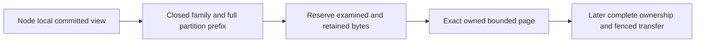
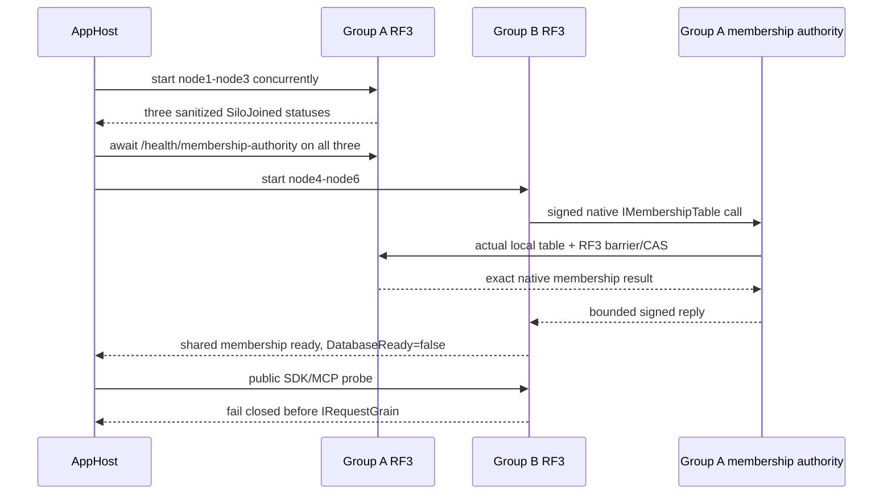
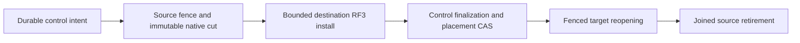
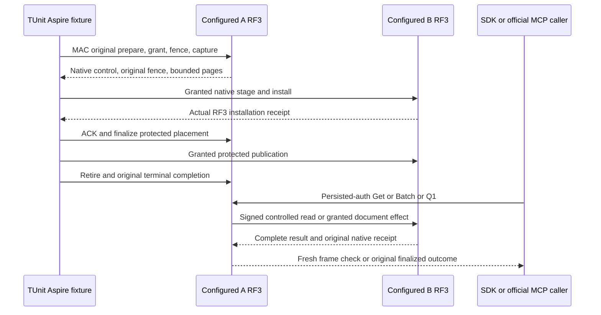

# ClusterRouting: bounded partition record pages

Status: first implementation stage for KL-036/071/072; complete movement remains
unqualified. Decisions: [ADR-016](../../ADR/ADR-016-atomic-physical-placement.md)
and [ADR-017](../../ADR/ADR-017-ownership-session-tokens.md). Initial serving remains RF3.

This stage reads exact canonical key/value bytes from an already owned committed
`IKeyValueView`. The node-local caller retains that cut for all its pages. It
changes no existing persisted format, public API, placement or writer authority.

| Requirement | Acceptance criterion and real oracle |
|---|---|
| REQ-PMOVE-001: use a closed source-owned partition-family inventory | AC-PMOVE-001: actual partition-key constructors are covered; every selected family uses `KeySpace.Partition` with the four complete partition components. Unknown families, invalid partitions and foreign continuation keys fail before copying. Global catalog, principal/API keys, global outcomes, physical watermarks and shared blob accounting are explicitly excluded. |
| REQ-PMOVE-002: bound retained bytes, records and examined work independently | AC-PMOVE-002: real native ZoneTree pages cover empty/inclusive/one-over bounds, exact keys/values/order and charged lookahead. Retained bytes include every returned key/value buffer and the independent continuation buffer. Checked reservation precedes every copy, including continuation; an overlarge record or examined-byte exhaustion throws typed BudgetExceeded with no successful partial page. No full Scan, payload decode or whole-store materialization. |
| REQ-PMOVE-003: preserve caller-owned cut, cancellation and identity | AC-PMOVE-003: paginated reads inside one actual native view reproduce exact selected records; equal key text across tenant/database/domain stays isolated. Cancellation before/during traversal settles the original call with no successful partial image. Reopen preserves bytes; grains acquire no file owners. |
| REQ-PMOVE-004: a family page cannot stand in for a complete movable image | AC-PMOVE-004: no installer or public move endpoint exists until partition outcomes, shared catalog/authorization, blob accounting, retained cursor/transfer state and derived-index readiness have an accepted complete protocol. Later process-kill/fencing/RF3 SDK/MCP gates remain mandatory. |

The inventory covers documents/indexes/unique keys and epochs, graphs and
adjacency, vectors/lineage/effects, samples/sequence/dedup/retention, blob heads/
uploads/parts/metadata, every queue index/body/metadata/counter/inbox, recurring
schedules/sagas/capacity, subscription state/window/completion/inbox, both remote
transfer endpoints, event streams/topics/identities/sequence/feed/snapshots,
outbox/heads/consumers/receipts and visibility epochs. Enumerate actual current
constructors, including dynamic family arguments. There is no universal encoded
partition prefix: the family precedes the four partition components.

## Frozen reader contract and ordered ownership

TASK-PMOVE-PAGES: root owns architecture, source inventory and joins. Luna
implementation owns only new internal Core ClusterRouting Queries/Contracts/
Validation files prefixed `PartitionRecord`. Exact contract:
`PartitionRecordPageReader.Read(IKeyValueView view, PartitionRef partition,
string family, int maxRecords, long maxRetainedBytes, long maxExaminedBytes,
ReadOnlyMemory<byte> afterKey = default, CancellationToken cancellationToken = default)`
returns an internal immutable `PartitionRecordPage` containing owned
`ImmutableArray<KeyValueRecord> Records`, `bool HasMore`, `long RetainedBytes`,
`long ExaminedBytes` and optional independently owned `ReadOnlyMemory<byte>`
continuation. `PartitionRecordFamilies.All` is an immutable ordinal inventory.
Use native VisitRange, charge its real observer before copying, verify the
exclusive continuation belongs to this exact prefix and has canonical KeyCodec
encoding, and preserve raw bytes. Validate the continuation's bounded length
before decoding its key components; user value payloads are never decoded.
Reserve and copy continuation independently from the last returned key; its
bytes contribute to RetainedBytes and maxRetainedBytes. Native accounting and
unexpected visitor stops fail closed.
Positive bounds must be checked before traversal; overflowing counters fail
closed. There is no serialization or inter-grain DTO in this first stage.

TASK-PMOVE-PAGE-ORACLES: an independent Luna worker owns only new UnitTests
ClusterRouting Cases/Helpers prefixed `PartitionRecord`. Derive the criteria
above against actual ZoneTree/TestDatabase primitives, without mocks, fake view,
skips or weakened limits. Preserve callbacks' borrowed lifetime. Root reviews
the complete private packets, then executes Aspire normal/scalar tests.

Complete ownership is a later root-owned stage. Global control outcomes have no
movable partition locator; their hash cannot recover one. Copying every global
outcome or dropping outcomes is incorrect. The current product must preserve
explicit partition-associated outcomes and shared control authority without a
data conversion or alternate reader. Current persisted authorization remains
authority and an acknowledged revocation must fence all serving groups. Source
and destination group indexes are never directly comparable; explicit ownership
epoch invalidation is the first candidate under KL-072, pending full freeze.

Slice map: Core owns this internal pure reader in ClusterRouting; Server's
StorageRecovery retains native views/files and Replication retains ordered
commit authority. Later Orleans orchestration uses one request grain and native
ManagedCode.Communication asynchronous streams with bounded handoff. Public
contracts, SDK/MCP, frontend/admin controls are N/A for this internal stage;
their later actual move contract must be specified and qualified.

Verification: full strict Release build, formatter/governance, genuine Aspire
unit and unit-scalar focused PartitionRecord cases for local development, then
exact-source Linux CI. Later movement requires process cuts at every persisted
state and Docker/Aspire RF3 SDK/MCP recovery, fencing, token and receipt oracles.
Internal pages alone do not satisfy those movement acceptance criteria.

The accepted native epoch/outcome prerequisite is [TokenOwnershipLineage](TokenOwnershipLineage.md), REQ/AC-PMOVE-005..006 and REQ/AC-MTOKEN-001..004 under ADR-017. Its partition-associated locator is part of the current product; shared global authority remains an explicit complete-image dependency. Family pages or a locator alone do not authorize installation or cutover.

# Accepted Stage 1A: shared Orleans membership; later physical movement contracts

Status: root accepts TASK-MOVE-1A and AC-MEMBERSHIP-001..006 for implementation on 2026-10-05. Later movement stages remain proposed until their exact contracts freeze. This is a contract, not runtime qualification; no physical movement acceptance is closed.

Related: [PartitionTransfer](PartitionTransfer.md), [PhysicalShardCatalog](PhysicalShardCatalog.md), [AtomicPartitionPlacement](AtomicPartitionPlacement.md), [ADR-016](../../ADR/ADR-016-atomic-physical-placement.md), [ADR-017](../../ADR/ADR-017-ownership-session-tokens.md), [ADR-099](../../ADR/ADR-099-physical-shard-catalog.md) and [ADR-101](../../ADR/ADR-101-explicit-atomic-partition-placement.md). Canonical slice remains `ClusterRouting`.

## Scope and source-backed boundary

The original plan requires controlled copy/catch-up/barrier/switch/cleanup (KL-036), whole atomic partitions with generation readiness and restartable cleanup (KL-071), and either pre-movement token invalidation or correct lineage translation without comparing independent log positions (KL-072). Current contracts intentionally stop before those operations: AC-PMOVE-004 forbids an installer, `AtomicPartitionPlacementV1` only resolves to the single committed `DefaultShard`, `PhysicalShardCatalog` only boots epoch 1, and AC-MTOKEN-004 explicitly excludes epoch bump/cross-group cutover. This proposal is a new movement contract; it does not reclassify current PMAP, bounded pages, token issuance, outcome association or current-frame recovery as movement. Source anchors: `docs/design/architecture-v0.3.uk.md` §§4, 6, 28 and KL-036/071/072; `docs/ADR/ADR-016-atomic-physical-placement.md` §§1–5; `docs/ADR/ADR-017-ownership-session-tokens.md`; current `PhysicalShardCatalog`/`AtomicPartitionPlacement` and `PartitionTransfer` contracts.

Stable identity remains the complete four-field `PartitionRef` / `AtomicPartitionId`. Physical shard identity remains a separate opaque ID for an independently configured RF3 replica group. A node-local `PartitionHost` owns its canonical ZoneTree store, replica log, file locks, materializer and apply gate. Orleans activation migration changes no physical ownership. Replica voters and Orleans silos are not separate logical shards.

Movement applies only to one complete `AtomicPartitionId` at a time. Splitting one hot atomic partition, changing its transaction domain, or changing the user-visible identity is out of scope. Source and destination must be independently provisioned, authenticated, configured three-voter RF3 groups with distinct physical IDs, incarnations and ordered voter identities. Their Raft/apply positions are unrelated and must never be numerically compared.

## Authority and operation contract

A stable database control authority remains outside the movable partition. It owns the canonical placement directory, persisted principals/policies, and the single global `(verified principal, CommandId)` uniqueness/outcome authority. The initial existing default shard may serve this role until a separately accepted topology stage provisions a dedicated control group; the control authority itself is never moved by this protocol. A moved partition is not permitted to create a second independent dedup domain.

Every routed request is authenticated at the existing public boundary and passes through its distinct `IRequestGrain` and native `ManagedCode.Communication` CQRS operation stream. The server—not the caller—derives a bounded internal owner grant from the committed control authority. It binds the complete partition, physical shard ID, incarnation, ordered voter identity, placement epoch, verified principal, persisted policy epoch, command ID/fingerprint when present, and operation/read kind. No client field or propagated Orleans context may supply role, owner, epoch, voter or policy authority. Every write operation kind that can mutate partition state must consume and validate this grant in its actual same-view canonical apply transaction; unsupported/unclassified writes fail closed. Reads resolve the current owner through the same control authority and cannot serve from a stale source owner after switch.

Because one atomic ZoneTree transaction cannot span independent physical groups, mutation execution has a durable control-authority intent: reserve the global command key and fingerprint before target execution, apply the idempotent typed mutation plus a target-side operation receipt atomically at the current owner, then finalize the exact outcome at the control authority. Acknowledgement occurs only after the final outcome is durable. A crash between stages leaves an inspectable pending intent; same-ID/same-fingerprint retry reconciles it and returns the exact terminal outcome, while same-ID/different-fingerprint is `Conflict`. If reconciliation cannot establish whether the owner committed, return the existing safe unknown-outcome category and retain the intent; never report success or dispatch a second logical effect. This authority stage is required before existing outcome rows can leave their current physical group.

Persisted policy remains canonical at the control authority. Revocation acknowledgement must fence new grants and wait for previously admitted mutation grants to settle; if a relevant owner cannot be reached or joined, revocation does not acknowledge a false fence. A stale or expired internal grant cannot authorize writes after a completed revocation or owner switch. Credentials, principal/API-key records and global outcomes are not copied with the partition.

## Requirements and measurable acceptance

- **REQ-MOVE-001 — Distinct physical owners and stable logical identity.** A complete partition is assigned to one physical shard, not to a voter or activation. **AC-MOVE-001:** an Aspire-owned topology starts at least two independent three-voter RF3 groups with distinct physical IDs/incarnations/voter arrays. Native status and signed discovery prove each group independently; writes to one full `PartitionRef` are visible only through the owner route, while a partition with identical suffix fields but a different full scope remains separate. No test calls three voters three owners.
- **REQ-MOVE-002 — One durable global command and policy authority.** Global command uniqueness/results and persisted authorization remain authoritative through owner changes. **AC-MOVE-002:** actual SDK and official MCP same-ID/same-body retries from different group endpoints return byte/logically identical terminal outcomes; same-ID/different-body and cross-partition duplicate attempts preserve global `Conflict`; interrupted pending intents reconcile without duplicated domain/outbox effects. A policy revoke prevents later admission and cannot acknowledge while pre-revocation grants remain unsettled. No client-supplied role or owner grant is accepted.
- **REQ-MOVE-003 — Complete bounded partition image and independent cuts.** Every canonical record, intent/receipt required for that partition, and required derived-generation state is transferred or deterministically rebuilt and verified; excluded global state stays in the control authority. **AC-MOVE-003:** an independent oracle compares the source committed partition image at a named source cut with destination installed state, exact full-scope keys/values, checksums and derived readiness. It covers documents/indexes, graph edges/adjacency, vector lineage, time-series samples, blob manifests/parts and ownership-bound metadata, queues/sagas/subscriptions/transfers/events/outbox/visibility, partition-local execution receipts, and any partition-scoped locator metadata needed to resolve the stable control authority. Such locator metadata is non-authoritative and may only point to canonical outcomes that remain in the control authority; global `StoredOutcome` records and the global command identity index are never copied into a data-owner image. Global/Unknown outcomes, global policy/catalog, and shared physical accounting are not silently copied. Unknown legacy outcomes, missing or unresolvable locators, unsupported files/assets, incomplete derived state or any over-bound image block readiness before ownership can switch. Limits and per-family record/byte totals are frozen before implementation; pages alone do not establish image completeness.
- **REQ-MOVE-004 — Ordered tail and source fencing.** The destination is caught up through an explicit terminal source fence before assignment changes. **AC-MOVE-004:** writes concurrent with snapshot capture are either present exactly once in the ordered tail or rejected after the source fence; destination final state matches the frozen source cut plus the complete tail. Every write path validates the trusted owner epoch in its same-view apply. Once the fence is committed, the old source cannot accept a new write even through a stale route or delayed grant. The catalog CAS and assignment revision are monotonic and idempotently recoverable.
- **REQ-MOVE-005 — Restartable phases and no data loss.** Movement progress is durable and phase-specific. **AC-MOVE-005:** real process termination/reopen at every persisted phase—intent, source fenced, image prepared/transferring, destination installed, tail caught up, assignment published, source retired—recovers forward or performs a proven pre-publication rollback. It never exposes two writable owners, loses an acknowledged command, deletes the only complete copy, decrements an epoch, or cleans source logs/files before destination quorum and published-owner evidence are durable. Ambiguous publication remains closed and is reconciled by the same move ID.
- **REQ-MOVE-006 — Explicit token and cursor behavior.** No source log position is compared with a destination log position. **AC-MOVE-006:** every source-owner CommitToken and owner-scoped feed/index cursor captured before switch is explicitly invalidated after the switch with stable `TokenInvalidated`; it never silently restarts at destination head. Newly issued destination tokens work and preserve same-owner monotonic reads. Tests include pre-switch token, post-switch old token, destination token, restart and retry/replay.
- **REQ-MOVE-007 — Caller-visible routing and bounded recovery.** Real operations keep the one-request-grain boundary and finite original deadline/cancellation. **AC-MOVE-007:** SDK and official MCP execute reads/writes before/during/after movement, see only complete current-owner results, and report safe typed busy/ownership/outcome errors during a fence; a fresh healthy request succeeds after every recoverable interruption. Every owned group, stream, child, transfer and lock is awaited and disposed before cleanup; no detached timeout-as-join path is allowed.

Traceability: original `AC-ROUTE-005` (planned prepare/copy/catch-up/validate/owner-switch/release with process interruption and actual RF3) and KL-036 copy/catch-up/barrier/switch/cleanup → REQ-MOVE-003/004/005 and AC-MOVE-003/004/005; KL-071 whole-partition image/generation/restartability → REQ-MOVE-001/003/005; KL-072 old-token invalidation/translation → REQ-MOVE-006; global outcomes/policy and live public route → REQ-MOVE-002/007. Each AC needs the named automated native or Aspire oracle; none is satisfied by the current PMOVE page tests or same-group voter restarts.

## Ordered implementation stages and exact ownership

1. **TASK-MOVE-1A — Six-node Orleans/RF3 topology only; no data-operation admission.** Add one explicit AppHost-only profile selector `KeyLoadTests:ClusterRouting:Profile=two-rf3` while keeping the existing caller entry `KeyLoadTests:Suite=rf3`. It creates exactly six containers, `node1` through `node6`, with Group A=`node1,node2,node3` and Group B=`node4,node5,node6`; each group has three fixed voters. For all six, `KeyLoad__ClusterId` is the same database Orleans cluster identity and `ClusterOptions.ServiceId` remains the current constant `KeyLoad`. Each group has one shared nonempty `KeyLoad__PhysicalShardId`, one shared nonempty `KeyLoad__Incarnation`, and its own exact ordered `KeyLoad__Peers__0..2` (for example Group A origins `http://node1:8080`, `http://node2:8080`, `http://node3:8080`); across groups the physical IDs, incarnations, and voter arrays are distinct/disjoint. Each node has a unique `KeyLoad__PublicEndpoint`, `KeyLoad__SiloAddress`, `KeyLoad__SiloPort` (container target11111), and `KeyLoad__DataDirectory` (`/data` mounted from a distinct `<root>/nodeN`); the existing private-network HTTP setting stays explicit. Each `ReplicaConfiguration` is production mode (`BenchmarkTopology=false`) and validates exactly three fixed voters, unique identities, one local member, and independent per-node store/log/lock roots. No arbitrary node-count override is allowed. Existing `KeyLoad__SigningKey`, `KeyLoad__AdminKey`, `KeyLoad__PeerSecret`, transport limits, and operation deadlines retain current validation; no secret is emitted in profile/status diagnostics. Current per-group caps remain untouched: MaxAppendEntries64, MaxAppendBytes16MiB, SnapshotChunkBytes262144 and MaxSnapshotBytes4GiB; the two-group selector may not raise or relax these or the three-voter majority.

   **R2 membership blocker and R3 refinement:** identical `ClusterId` alone is not proof of one Orleans cluster. Current `OrleansSiloConfiguration` binds `IMembershipTable` to the local `PartitionHost` group, so disjoint groups diverge. The proposed R3 amendment below defines a Group A shared membership authority and Group B authenticated provider proxy. It preserves the current persisted membership aliases/IDs and native RF3 membership mutation path; it does not yet qualify a six-silo cluster.

   Stage 1A keeps silo membership readiness separate from database data admission. Existing `/health/ready` remains the database-ready signal. In the two-group profile every public database operation is rejected by an explicit `OrleansNode.ExecuteCoreAsync` profile gate before reading `IGrainFactory` or looking up `IRequestGrain`, even if Group A completed local catalog bootstrap. Group A may complete the current local physical-catalog bootstrap before Group B starts. Group B MUST skip that request-grain bootstrap because a shared Orleans directory can place the grain on a different physical owner; no direct store write or local-placement assumption may replace it. Group B has no committed physical catalog and both groups remain `DatabaseReady=false`. Existing three-node `rf3` behavior remains unchanged. Literal and real AppHost tests must prove one shared six-silo membership view, two independent three-voter RF3 domains, distinct node-local stores/logs/locks, and public SDK/MCP no-dispatch with no user/catalog/outcome mutation. They must not claim Group B is a usable second database owner in 1A.

   **Current contract identities remain unchanged in 1A:** `ReplicaSiloDiscovery` keeps alias `keyload.replica.discovery.v2` and IDs 0–6 (`VoterId`, `ClusterId`, `Incarnation`, `SiloAddress`, `TransportReady`, `ApplicationRpcVersion`, `PeerEnvelopeVersion`); `PhysicalShardCatalog` stays `keyload.contract.physical-shard-catalog.v1` IDs 0–2, and `PhysicalShardRecord` stays `keyload.contract.physical-shard-record.v1` IDs 0–3. `AtomicPartitionPlacementV1` and its request/resolution aliases and IDs remain as ADR-101. `NodeStatus` stays `keyload.contract.node-status.v1` IDs 0–8. R3 freezes new generated membership-authority transport contracts with an independent protocol version 1; the existing app-request interface version 4, replica peer-envelope version 3, discovery-MAC version 2 and all persisted membership aliases remain unchanged. The six-node profile is homogeneous current image only; startup closes on missing, mixed or incompatible membership/member identity evidence.

   Owners for the topology-only stage: root owns AppHost's profile selector, six-node resource graph and actual image/runtime identity; Orleans owns the shared membership authority adapter and explicit separation of silo membership from user-operation admission; Replication owns fixed per-group RF3 voters and authenticated primary/barrier evidence; Server owns each node-local `PartitionHost` and fail-closed operation gate; Integration tests own actual AppHost-owned six-node native membership/status and SDK/MCP no-dispatch cases. The stage does not implement an owner directory, cross-group data operation, copy, or movement.
2. **TASK-MOVE-1B — Committed owner directory and global command/policy authority (not a move).** Only after 1A proves the common cluster and both groups remain data-operation closed, add a versioned additive owner directory and the global command reservation/final-outcome authority. Preserve SCAT V1 and PMAP V1 bytes/aliases/IDs. Through persisted-admin native control, assign a newly created empty `PartitionRef` to the additional group at its initial epoch and route real SDK/MCP reads/writes through the server-derived owner. No existing partition or records move in this stage. Establish the global command reservation, target-side atomic idempotency receipt, and exact finalization/reconciliation before acknowledging cross-group writes. Same principal/CommandId/body retries reconcile the same pending intent; changed body conflicts. Every mutating operation kind is inventoried and consumes the trusted grant inside its actual same-view apply. Policy remains at stable control authority and revocation drains prior grants. Owner: root owns AppHost transport/profile and authenticated inter-group client; Core owns ClusterRouting owner directory and `AtomicCommandCommit`/`CommandOutcomes` integration; Orleans owns request admission/routing; Replication owns inter-group authentication/streaming; Server owns routing to the node-local `PartitionHost`; Integration tests use actual .NET SDK and official MCP. This stage still does not claim an existing-data move.
3. **TASK-MOVE-IMAGE — Complete partition export/import.** Define a versioned bounded image manifest over `PartitionRecordFamilies`, plus explicit non-keyspace-owned assets and rebuild-ready derived generations. Capture one source `IKeyValueView` cut and make immutable checksummed bounded pages. Install only into a distinct, empty/private destination generation under its `PartitionHost` lock; validate full `PartitionRef`, database incarnation/format, all family totals/hashes, partition-local execution receipts and non-authoritative locator references, quotas and derived readiness before publication. Canonical global `StoredOutcome` records and the global command index remain in the stable control authority and are not copied. Owner: Core ClusterRouting pages/manifest; Storage.ZoneTree and Server StorageRecovery own actual private generation files, handles and atomic install; Replication defines only transport envelope/authentication; no grain owns file handles. Join point: same node-local store lifecycle as `PartitionHost` and checkpoint recovery. Until verified install exists, source stays authoritative and destination cannot serve.
4. **TASK-MOVE-TAIL — Durable ordered catch-up and source fence.** Add per-partition movement intent and tail records in the same source canonical transaction as every post-snapshot mutation; bounded sequence numbers are partition-scoped and distinct from group Raft positions. Pause/throttle/fail closed before a configured tail retention bound is exhausted. Source fence stops new grants, waits admitted operations, commits a terminal tail sequence and remains durable across restart. Destination applies exactly once through that terminal sequence under its native apply gate and verifies the final image. Owners: Core command/outcome; Replication ordered transport; Server/StorageRecovery node-local fence and lifecycle; Orleans one-request admission/drain. No source lock or log is released before actual terminal join.
5. **TASK-MOVE-SWITCH — Monotonic owner publication and recovery.** In a same-control-authority transaction, compare current full owner tuple + assignment revision + source epoch + MoveId and publish destination tuple with a strictly greater placement epoch only after destination installed/caught-up receipt and source fence receipt validate. Make retry of an identical switch idempotent; changed move input conflicts; stale revisions fail closed. Old source's local fence is permanent after publication. Pre-publication rollback is permitted only while control authority still records source and destination effects can be abandoned safely; post-publication always recovers forward. Owners: Core placement/control command; Orleans routing; Server ready/admission; root joins public operation routing. No old compatible binary may serve after movement records are published; protocol/profile compatibility must fail startup closed.
6. **TASK-MOVE-TOKEN — Token/cursor semantic join.** KL-072 selects explicit invalidation for the first move contract. Every cursor/token whose meaning includes a physical-group log position must carry the owner incarnation/placement epoch or be version-rejected after switch with `TokenInvalidated`; destination tokens use the destination lineage. No source/destination position comparison is permitted. Owners: Abstractions native contracts only if append-safe fields are required; Core token helpers; Query/ChangeFeeds cursor consumers. A separate durable translation/sequence format is out of scope.
7. **TASK-MOVE-RF3 — Genuine public qualification.** Add AppHost-owned six-node fault cases with real .NET SDK and official MCP; test duplicate, concurrent, revoke, long-running tail, cuts/restart at each phase, old-owner fencing after delayed request, source/destination leader changes, retry after lost ACK, token invalidation, health/readiness and cleanup. Root owns fixture/wave topology, exact source maps, image/profile/version admission and Linux qualification. Preserve original failure artifacts; no independent Docker launch. Only after every unit/recovery/analyzer/formatter/RF3 gate passes can this ADR move to Implemented or KL-036/071/072 close.

## Rollout, rollback and limitations

Current SCAT V1 and PMAP V1 bytes/aliases/IDs remain unchanged until an explicit data-format upgrade is separately specified. A new owner directory/control record requires a new stable generated-native alias/key or an explicit writer-stopped conversion; old writers/readers must never silently ignore a published owner. Mixed source/destination protocol versions fail closed. No downgrade to an earlier placement epoch is allowed. Restore either reopens the current published destination with complete receipt/lineage or recovers forward; it cannot reactivate a stale source based on its local copy alone.

Frontend is N/A for this internal routing/control workflow. SQL and SDK/MCP gain no caller-trusted owner fields. Full movement, rollback, selected old-token invalidation, global outcome authority, and two-group process-fault evidence remain open until these new ACs are implemented and qualified.

## R4 — Shared Orleans membership authority (Stage 1A contract proposal)

This section supersedes R2's unresolved membership transport paragraph. It freezes a narrow topology-only prerequisite for review; it does not enable owner routing, make either group's local database composable, or close any movement AC. R4 corrects the pinned Orleans version, native `UpdateRow` trust semantics, historical-row capacity and cancellation-aware provider contract below; these corrections supersede conflicting R3 wording in this amendment and ADR-106.

### Existing lifecycle and authority

Current `ServerApplication.RunLifetimeAsync` starts `PartitionHost.Coordinator`, then starts the ASP.NET app/Kestrel, then awaits `OrleansNode.StartAsync`. `OrleansNode.StartCoreAsync` calls native `IHost.StartAsync`; only after that returns does it publish `IGrainFactory`, then run `PhysicalShardCatalogStartup`. The Kestrel process therefore has a real authenticated endpoint available before Orleans asks `IMembershipTable.InitializeMembershipTable`.

Group A remains the sole membership-table authority. It keeps the existing local `ReplicaMembershipTable`, whose `ReplicaMembershipStore.ReadAsync` performs `ReplicaConsensus.ReadControlBarrierAsync` before reading the `membership/orleans-membership` record, and whose `CompareExchangeAsync` submits native `OperationKind.Membership` through Group A's `ICommitCoordinator`. The existing membership record, snapshot, row and suspect aliases/IDs are unchanged. This is one persisted table replicated by Group A's actual three-voter RF3 quorum.

Group B registers `ReplicaMembershipAuthorityClientTable` as Orleans `IMembershipTable`; it MUST NOT register a local `ReplicaMembershipTable` fallback. Its native membership methods call the Group A HTTP authority during Orleans startup and thereafter. The authority endpoint is registered by Kestrel before Orleans starts, but returns unavailable while its owner has no published provider. `OrleansNode` marks `SiloJoined` only after native `built.StartAsync` returns. It then completes Group A's existing `PhysicalShardCatalogStartup`; as the final successful startup step, after catalog initialization has returned, it publishes the borrowed `IMembershipTable` obtained from `built.Services` through `ReplicaMembershipAuthorityOwner` and sets `AuthorityReady`. `OrleansNode.StartAsync` completes only after this publication. The endpoint never resolves silo services from the outer Kestrel provider. This ordering prevents Group B startup from racing Group A's catalog bootstrap through the shared directory. No Orleans client/grain call is used to initialize shared membership.

### Ordered startup and shutdown

1. AppHost creates exactly Group A=`node1..node3` and Group B=`node4..node6`, fixed current image only. All six have the same `KeyLoad__ClusterId` and `ClusterOptions.ServiceId=KeyLoad`; each group retains its distinct three-voter `KeyLoad__Peers__0..2`, `PhysicalShardId`, `Incarnation`, private logs, stores, locks and apply gates.
2. AppHost starts Group A's three nodes concurrently, awaits `/health/silo` from all three (`SiloJoined` means native `built.StartAsync` returned), and then awaits `/health/membership-authority` from all three (`AuthorityReady` means `OrleansNode.StartAsync`, including Group A's local catalog initialization, returned and the local table provider has been published). The endpoint must continue to return unavailable between the first and second barriers; it accepts authority calls only after this second barrier. This guarantees the local startup catalog request cannot be placed on a Group B silo. Group A's existing `PhysicalShardCatalogStartup` may complete locally; it does not open public data admission in this profile.
3. Only after that barrier AppHost starts Group B. Its `IMembershipTable.InitializeMembershipTable` uses bounded requests to Group A's three exact origins until it reads the shared table or its finite startup deadline/cancellation expires. Normal Orleans membership insertion/status/heartbeat calls also use this proxy. Failed authority/quorum is a startup failure; the client never falls back to Group B's isolated local store.
4. Group B MUST skip `PhysicalShardCatalogStartup`'s request-grain bootstrap in 1A. Once six silos share a distributed directory, that request could activate/execute on another physical owner. Do not substitute a direct local write, `PreferLocalPlacement`, or a bootstrap grain. Group B has no committed owner catalog in 1A; its catalog and safe application route are explicit Stage 1B prerequisites.
5. The six-node AppHost test waits for Group A’s `/health/membership-authority` barrier before starting B, then waits for shared-membership readiness on all six. Each check reads the actual full table through that node’s provider; the total may contain up to 48 retained rows, but readiness requires exactly the six expected current, unique SiloAddress generations to be Active. No row is truncated. Status exposes total-row and active-current counts plus a SHA-256 fingerprint over the six current address/status tuples, never rows or addresses. Tests independently read signed discovery from each actual node and require all six views to match. `/health/silo` reports only `SiloJoined`; `/health/membership-authority` reports Group A’s completed local startup; membership-ready never opens public database admission.
6. `/health/membership-authority` is a Group A-only internal status phase. It remains false until the table is published after full local startup and catalog initialization; Group B never publishes an authority. `DatabaseReady` remains false on both groups for all of 1A. Existing `/health/ready` remains 503 and every SDK/MCP database operation is rejected by `OrleansNode.ExecuteAsync` before `IRequestGrain` lookup/dispatch. Membership and silo readiness are system-control phases, not public database readiness.
7. Aspire dependency ordering stops Group B before Group A. Group B's outbound membership calls remain available until its native Silo shutdown settles; then its proxy owner joins outstanding calls and disposes its HTTP client/credentials. Before Group A's native Silo shutdown, its authority owner closes external admission and joins admitted HTTP handlers while Kestrel and the local membership table are still live. The local membership table remains available to Group A's own Silo teardown. After Silo shutdown settles, clear the published borrowed-provider reference before native service-provider disposal; never dispose that borrowed provider independently. Kestrel and authority secrets are disposed afterward.

`ServerApplication`'s observed order is `Coordinator.StartAsync -> app.StartAsync -> silo.StartAsync`; shutdown is `silo.StopAsync` (including membership teardown) before `app.StopAsync`, then physical-owner disposal. Stage 1A preserves this order. No new hosted service or concurrent Orleans lifecycle callback is used to “bootstrap” the cluster.

### Ordered membership startup

### Membership authority wire and authentication

The new endpoint is private-network-only `POST /internal/orleans/membership/v1`; it is distinct from bodyless `PeerSecurity` discovery (`GET /internal/silo`) and does not broaden `PeerSecurity`. It uses native generated Orleans serialization, exact original request-body bytes for authentication, strict closed request/response records, no JSON fallback, no caller-facing route, and no `ReplicaRpc` enum/envelope reinterpretation.

Add these new stable generated contracts in the `ClusterRouting` slice. Existing `ReplicaSiloDiscovery` remains alias `keyload.replica.discovery.v2` IDs 0–6; request-interface version 4, peer-envelope version 3 and discovery-MAC version 2 do not change because the RequestGrain and replica-envelope shapes are unchanged. The new membership protocol has its independent explicit `Version=1`; an unknown/missing version fails closed.

- `ReplicaMembershipAuthorityEntryV1`, alias `keyload.orleans.membership.authority.entry.v1`: IDs 0 Address, 1 Status, 2 ProxyPort, 3 Host, 4 Name, 5 Started, 6 Alive, 7 Suspects (existing native `ReplicaMembershipSuspect` values), 8 RowETag. It mirrors the complete current native row needed to round-trip `MembershipEntry`; no persisted record is rewritten.
- `ReplicaMembershipAuthorityCallV1`, alias `keyload.orleans.membership.authority.call.v1`: IDs 0 Version, 1 ClusterId, 2 AuthorityPhysicalShardId, 3 AuthorityIncarnation, 4 CallerPhysicalShardId, 5 CallerIncarnation, 6 CallerVoterId, 7 CallerSiloAddress (actual generation from `ILocalSiloDetails`), 8 RequestId, 9 Operation, 10 TargetSiloAddress, 11 CandidateEntry, 12 ExpectedTableVersion, 13 ExpectedTableVersionETag, 14 ExpectedRowETag, 15 CleanupBeforeUtcTicks. Operation enum values are explicit and append-only: ReadAll=1, ReadRow=2, InsertRow=3, UpdateRow=4, UpdateIAmAlive=5, CleanupDefunct=6. DeleteTable is deliberately not a proxy operation.
- `ReplicaMembershipAuthorityReplyV1`, alias `keyload.orleans.membership.authority.reply.v1`: IDs 0 Version, 1 AuthorityPhysicalShardId, 2 AuthorityIncarnation, 3 RequestId, 4 RequestNonce, 5 `ResultKind : int`, 6 nullable existing `ErrorCode`, 7 `ErrorDetailCode : int`, 8 Applied, 9 TableVersion, 10 TableVersionETag, 11 Rows. `ResultKind` is explicit `Completed=1` or `Failed=2`. Completed carries null ErrorCode and `ErrorDetailCode.None=0`; Applied is the exact native mutation result (false on reads and non-applied CAS), and Rows contains the entire bounded read result. Failed carries non-null existing ErrorCode, non-None fixed ErrorDetailCode, Applied=false, no rows, TableVersion=0 and an empty TableVersionETag. ErrorDetailCode is explicit and append-only: None=0, MalformedRequest=1, AuthenticationFailed=2, UnsupportedVersion=3, AuthorityMismatch=4, CallerGroupMismatch=5, UnsupportedOperation=6, RequestLimit=7, ReplyLimit=8, MembershipCapacity=9, AuthorityUnavailable=10, PersistedTableCorrupt=11, DeleteUnsupported=12. Map MalformedRequest/UnsupportedOperation to Validation; AuthenticationFailed/AuthorityMismatch/CallerGroupMismatch to Unauthenticated; UnsupportedVersion/DeleteUnsupported to UnsupportedCapability; RequestLimit/ReplyLimit/MembershipCapacity to ResourceExhausted; AuthorityUnavailable to OwnershipLost; PersistedTableCorrupt to Corruption. These details map to fixed local strings only; no exception, address, header, identity or payload text crosses the boundary.

The HTTP authentication headers are single-valued and canonical: cluster ID, authority physical/incarnation, caller physical/incarnation/voter/SiloAddress, invariant UTC ticks, fresh nonce, and 32-byte HMAC-SHA256 signature. Sum of UTF-8 header-name/value bytes is at most 4,096, each value at most 512 bytes, and Kestrel enforces the same total header limit before handler retention. Timestamp is canonical positive invariant UTC ticks within 30 seconds of receiver TimeProvider UTC now. Nonce is base64url of 16 cryptographically random bytes without padding (22 ASCII bytes); IDs are canonical lower-case N; SiloAddress round-trips exactly through ToParsableString() and is at most 256 UTF-8 bytes. A single declared Content-Length is required and checked before streaming. The request MAC input is ASCII domain `keyload-orleans-membership-authority-request-v1` plus LF, length-prefixed UTF-8 canonical method/path/identity/timestamp/nonce fields, big-endian UInt64 exact body length, and the 32 raw SHA-256 bytes of the original body. The reply uses the distinct `keyload-orleans-membership-authority-reply-v1` domain and binds authority identity, original RequestId/nonce, status, exact body length and digest. No decoded/re-serialized DTO participates. Verify MAC in fixed time before native deserialization; then require body/header identities to match. Reject duplicate/missing headers, replayed nonce, noncanonical address/ID, request/reply substitution, redirected origin, query string, unknown operation, trailing bytes and oversized body. No log includes secrets, headers, payload or address.

Group B signs calls using its existing group `KeyLoad__PeerSecret`. Group A's authority configuration holds the exact Group B fixed physical ID/incarnation/voter set and that group's peer credential to validate inbound calls. Group A signs replies with its own existing `PeerSecret`; Group B's authority client holds the expected Group A credential and physical ID/incarnation to validate replies. Credentials are separate from `AdminKey`/`SigningKey`; AppHost injects them as secret parameters, zeroes temporary decoded bytes, and never exposes them through status. Existing per-group peer discovery/replication authentication remains unchanged.

Runtime settings are strict and all-or-nothing: `KeyLoad__MembershipAuthority__Mode` is `local` (default, existing single RF3), `authority` (Group A), or `proxy` (Group B); `KeyLoad__MembershipAuthority__AuthorityPhysicalShardId`, `...__AuthorityIncarnation`, `...__AuthorityEndpoints__0..2`, and `...__AuthorityPeerSecret` identify/authenticate the exact Group A authority for proxy nodes; `...__TrustedGroupPhysicalShardId`, `...__TrustedGroupIncarnation`, `...__TrustedGroupVoterIds__0..2`, `...__TrustedGroupSiloEndpoints__0..2` (canonical host:port resolved at startup), and `...__TrustedGroupPeerSecret` identify/authenticate the exact Group B for authority nodes. `KeyLoad__ClusterId`, `KeyLoad__PhysicalShardId`, `KeyLoad__Incarnation`, `KeyLoad__Peers__0..2`, `KeyLoad__SiloAddress`, `KeyLoad__SiloPort`, and `KeyLoad__AllowPrivateNetworkHttp` keep their current meanings. `local` rejects authority-only keys; only the exact two-RF3 AppHost profile can assign `authority` to Group A and `proxy` to Group B. Partial vectors, duplicate/nonmember origins, wrong physical ID/incarnation/cluster, malformed secrets or non-private HTTP fail configuration before stores open. The normal three-node profile remains `local`; it has no authority settings or behavior change.

### Bounds, errors and lifecycle

The authority endpoint and client use one shared 30-second operation deadline: `ReplicaMembershipProtocol.RequestTimeout = ReplicaProtocol.ReadBarrierTimeout` (10 seconds) + `ReplicaProtocol.CommandTimeout` (20 seconds). It covers admission, HTTP connect, body read, provider read/CAS, response serialization and verification. The pinned `Microsoft.Orleans.*` packages are 10.4.0. Orleans 10.4.0 `IMembershipTable` has cancellation-aware Async overloads for initialization, reads, insert/update/heartbeat, cleanup and deletion. Implement those overloads on the same `ReplicaMembershipTable`; the handler dispatches to its corresponding native `...Async(..., originalLinkedDeadlineToken)` method. Tokenless compatibility methods delegate to the same algorithms. Do not rely on Orleans default adapters, which cancel only the caller wait while tokenless work continues. No extra `ExecuteAuthorityCallAsync` shim is needed because every proxied operation has a native cancellation-token overload; no second provider or storage implementation is created. Cancellation/disconnect cancels and joins the original provider callback before releasing its lease; no `WaitAsync` or detached task. Startup retry remains a single cancellable 120-second total deadline and existing 250ms transient interval. HTTP connection establishment remains the existing 500ms peer-connect bound. In the two-RF3 profile only, request bodies are at most 65,536 bytes, full replies at most 262,144 bytes, persisted encoded membership snapshots at most 262,144 bytes, one encoded row at most 4,096 bytes, retained rows at most 48, and suspects per row at most six. SiloAddress, Host, Name and each suspect address are each at most 256 UTF-8 bytes. The 48-row total is a new explicit profile bound, not an existing native limit; it accommodates six expected current members plus up to 42 retained generations. ReadAll returns all history with no truncation. Count exactly six expected current Active SiloAddress generations for readiness; historical non-current rows do not count. Preflight row-count and field-size bounds before building a changed row array; serialize snapshots and replies through cap+1 bounded writers. If a read or proposed update exceeds a cap, return ResourceExhausted without retaining or persisting the over-limit record/snapshot/reply; never evict a live or historical row to make space. Existing local three-node membership mode retains its current behavior. Each process admits at most eight authority calls and retains at most 16,384 unexpired nonces. Nonces expire after two minutes using monotonic TimeProvider timestamps; only expired entries may be removed. A full unexpired nonce table rejects new calls with ResourceExhausted before provider work, never evicting replay evidence. Retries use a fresh nonce and exact original CAS expectations. Authority failover visits only the three configured Group A origins under the same operation token; redirects are disabled.

The authenticated identity is a configured group trust identity, not an individual silo credential: the existing PeerSecret is group-shared. Every call binds and validates the caller group tuple, canonical SiloAddress and generation, fixed native silo port, request nonce and signature. InsertRow and UpdateIAmAlive are generation-owned native operations, so the candidate SiloAddress must equal the signed CallerSiloAddress. UpdateRow is intentionally not own-row-only: Orleans 10.4.0 MembershipTableManager calls UpdateRowAsync to add suspicion votes and mark arbitrary target silos Dead. A member of either configured trusted group may therefore CAS-update any existing exact target row; TargetSiloAddress must equal CandidateEntry.SiloAddress and the persisted row key. It cannot insert an unrelated generation through UpdateRow. Preserve native row/table ETag CAS, suspicion lists, heartbeat non-regression, and all native membership transitions. CleanupDefunct retains the existing Dead+cutoff rule and native CAS. Remote DeleteTable remains unsupported. A lost/replayed call cannot create a second table transition; return the exact native CAS boolean.

Authentication/shape failures are `Unauthenticated` or `Validation`; unsupported deletion/operation is `UnsupportedCapability`; authority missing/quorum loss/deadline is `OwnershipLost`; bounded capacity is `ResourceExhausted`; malformed persisted membership bytes remain `Corruption`. A typed CAS non-application returns the actual `false`, not synthetic success. Group B startup throws if authority cannot initialize; no local-read fallback is allowed. Active HTTP handlers and proxy calls are cancelled and actually joined before disposing HttpClient, replay tables, credentials, Silo host or stores. Group B stops before Group A; Kestrel authority remains available while the control Silo is still in membership teardown, then rejects admission and joins callbacks before app disposal. For Group A, close external authority admission before native Silo shutdown, join admitted HTTP calls while Kestrel and the local provider are still live, then stop the Silo; clear the published borrowed-provider reference before the native service provider can dispose it. Do not dispose the borrowed `IMembershipTable` independently.

### Membership-specific acceptance

- **AC-MEMBERSHIP-001 (same view):** a genuine six-container Aspire run reports all six native silos joined; independent Group A and B replica configurations each contain exactly three distinct fixed voters and unique physical IDs/incarnations; one shared full `IMembershipTable.ReadAll` view includes the six expected current active SiloAddress generations and may retain bounded old generations. All rows are returned without truncation under the 48-row/256-KiB profile cap. Both groups' physical stores, replica logs and locks remain distinct. Group B has no catalog and no data readiness. Existing 3-node RF3 remains unchanged.
- **AC-MEMBERSHIP-002 (bootstrap ordering):** source-bound startup trace proves AppHost waits for all Group A `/health/silo` and `/health/membership-authority` results, then starts Group B; Kestrel is listening before B's Silo starts. A real startup observation verifies that after `SiloJoined` but before Group A catalog initialization succeeds, the authority endpoint still reports unavailable and no proxy call is admitted. Only after `AuthorityReady` is published does B's `IMembershipTable.InitializeMembershipTable` complete through authenticated Group A HTTP without Orleans grain dispatch. No Group A quorum/authority returns typed unavailability and B startup fails/cancels within the original startup deadline.
- **AC-MEMBERSHIP-003 (safe admission):** in the six-node profile `/health/silo` can be true and membership-ready can be true while `/health/ready` remains 503. Real SDK and official MCP read/write calls at both group endpoints fail before `IRequestGrain` dispatch with no data/catalog/outcome mutation. No other public DB API becomes ready.
- **AC-MEMBERSHIP-004 (wire and auth):** actual native serializer tests cover all fields, row ETags, suspicion times, TableVersion, six-current-plus-history readiness, exact 48-row and encoded byte bounds; actual HTTP tests reject malformed/missing/duplicate headers, altered body/signature, wrong group/authority/incarnation/cluster/address, stale/replayed nonce, old protocol version, extra fields/trailing bytes, unknown operation and cap+1. A real native membership-manager suspicion/death path updates a remote target row through exact ETag/table-version CAS. No local provider fallback appears after any failure.
- **AC-MEMBERSHIP-005 (quorum/failover/teardown):** stop one Group A node and prove Group B membership reads/heartbeat CAS continue through one of the other actual control nodes with Group A majority. Stop two Group A nodes and prove Group B returns unavailable/does not fall back. In a normal owned shutdown, Group B Silo disposal and outbound operations join before Group A teardown; all three authority Kestrel handlers/calls join before Group A credentials/host/stores dispose. A fresh complete six-node start joins with current new SiloAddress generations and no stale ownership/readiness.
- **AC-MEMBERSHIP-006 (current compatibility):** standard three-node current image uses local membership unchanged. The two-RF3 profile accepts only the same exact homogeneous immutable current image on all six before AppHost `Start`; old or mixed images are not supported by this profile and are rejected by image identity/version checks before resources start. The membership transport itself requires protocol v1 and exact authority tuple. No rolling upgrade claim is made.

REQ-MOVE-001 and AC-MOVE-001 remain open until this stage's actual six-node evidence exists. AC-MOVE-002..007 and Stage 1B remain open. A single RF3 group, three voters counted twice, equal ClusterId, standalone nodes or six configurations are not proof of one Orleans cluster.

### Accepted membership DNS pin lifecycle, 2026-10-05

REQ-MEMBERSHIP-007: Group A composition must not resolve the not-yet-started
Group B container aliases. Aspire still starts B only after every A authority
health barrier. The authority resolves B's exact configured host and silo port
only after validating the signed group/caller tuple, original-body HMAC, nonce
and canonical SiloAddress; no payload selects a hostname or resolution target.
Resolution and waiting consume the original admitted call deadline/cancellation.
Await the actual native `Dns.GetHostAddressesAsync` task, with no detached task,
fallback, extra operation deadline or unbounded retry.

Each authority lifetime has exactly three private per-voter pin gates. At most
one resolution is in flight for a voter, within the existing eight-call cap.
Validate the complete native result before publication: require 1..8 distinct
valid addresses, reject rather than truncate an over-bound set, and require the
authenticated canonical caller address/port to match. Publish one owned immutable
set only after success. A failed/cancelled initial attempt leaves the voter
unpinned and performs no membership-store work; a later independently admitted
call may try again. A successful pin is never silently refreshed or replaced in
that authority lifetime. Replacing an address requires a fresh authority
lifetime; ordinary process restarts retaining the configured container address
remain supported. Existing fixed Group A origins/identity checks are unchanged.
Unresolved addresses fail OwnershipLost; mismatched caller identity/address
fails Unauthenticated; over-bound resolution fails ResourceExhausted. Use only
closed safe wire errors, never names, addresses or resolver exception text.

AC-MEMBERSHIP-007: the actual Aspire six-container startup reaches A authority
readiness before B exists, then all six native silos join one membership table.
Actual HTTP/native-DNS tests cover cold concurrent calls, first-attempt
cancellation/unavailability with no pin/store mutation, successful once-only
pinning, signed wrong address, changed address rejection, capacity rejection and
shutdown joining the original resolutions/calls before pin gates dispose.
Existing six-view, native suspicion/CAS, failover, minority and teardown gates
remain mandatory; source configuration is not that proof.

Traceability: REQ-MEMBERSHIP-007 -> AC-MEMBERSHIP-007 -> ADR-106 amendment ->
TASK-MOVE-1A. Luna lifecycle_wave owns the private authority pin/endpoint and
native regression packet; root owns review, join, strict build/format and actual
Aspire RF3 evidence. No persisted, public database or user authorization format
changes occur. Rollback disables the explicit two-RF3 profile; it cannot revive
an eager-DNS startup cycle or enable Stage 1B data operations.

### Accepted independent six-generation oracle, 2026-10-05

REQ-MEMBERSHIP-008: the two-RF3 test topology must hand its already-generated
Group B identity and discovery credential to the owned native test wave through
the actual Aspire model. `membership-physical-b` and `membership-incarnation-b`
are canonical nonempty D-format GUID ParameterResources, distinct from Group A;
`membership-peer-b` is the existing secret ParameterResource. Pass these same
resource references to B's node configuration and A's trusted-group configuration.
Do not independently generate or substitute test identities or credentials.
The test resolves the three exact resources with native
`ParameterResource.GetValueAsync` under its original cancellation/deadline and
never records their values in logs, test output, artifacts or exception text.
Decoded discovery-key bytes have an owned lifetime and are zeroed only after all
original signed-discovery operations join. No credential is exposed by health.

Group A and B use the same actual Orleans ClusterId derived from A, while their
physical IDs, incarnations and three-voter discovery MAC keys remain distinct.
A new feature-local test helper verifies all six real signed native discovery
responses against that explicit cluster/group tuple and exact configured voter
origin. Preserve the existing three-node signed-discovery helper and MAC version.
Reject malformed/duplicate signatures, altered bodies, wrong group/cluster/voter,
oversized bodies, duplicate addresses and noncanonical SiloAddress generations.
There is no public database bypass, fake membership provider or new trusted role.

For this membership-only profile, each successful `/health/membership-ready`
response is a closed JSON object with exactly `version:1`, `activeSilos:6`,
`membershipRows` in 6..48, and `activeFingerprint`, a lower-case 64-character
SHA256. Its total UTF-8 response is at most 512 bytes. Derive all fields from ONE
actual local `IMembershipTable.ReadAllAsync` result, using the native proxy on B.
Require six distinct current Active canonical addresses, including the actual
local generation, and the existing exact configured endpoint checks. Hash the
six active full SiloAddress strings, including generations, sorted ordinally:
ASCII `keyload.orleans.membership.active.v1`, little-endian UInt32 count, then
for each address a little-endian UInt32 UTF-8 byte length and those exact bytes.
Each address is at most 256 UTF-8 bytes. Never truncate rows or addresses. Failure
returns the existing unavailable status; addresses, hostnames, row contents,
secrets and resolver exceptions never appear in this health response. Heartbeat
times and row ETags do not enter this active-generation fingerprint.

AC-MEMBERSHIP-008: in the actual six-container Aspire case, independently read
and authenticate native discovery from all six nodes, derive the expected hash
from their exact current generations, and compare it with all six health replies
and their closed schema/count/byte bounds. A wrong/stale generation, duplicate
generation, wrong B credential/incarnation/shared ClusterId, missing resource,
over-bound row/address or unavailable native view fails before any public data
operation. Native digest controls cover permutation independence, generation
changes, duplicate/cap rejection and framing ambiguity; they do not substitute
for the six-container oracle. Real SDK and official MCP admission-closure checks
remain mandatory at both groups. No TASK-MOVE acceptance closes from these source
contracts or a health boolean alone.

Traceability: REQ-MEMBERSHIP-008 -> AC-MEMBERSHIP-008 -> ADR-106 amendment ->
TASK-MOVE-1A and AC-MEMBERSHIP-001. Luna lifecycle_wave owns the feature-local
Aspire handoff, actual view fingerprint and test oracle; root owns guarded joins,
strict gates and original Linux RF3 evidence. This additive profile-only health
contract does not change stored records, existing discovery aliases/IDs/MACs,
three-node behavior or public database admission. Rollback disables two-RF3;
Stage 1B remains closed.

### Accepted native endpoint registration and disposal, 2026-10-05

REQ-MEMBERSHIP-009 requires the actual server composition to map exactly one
`POST /internal/orleans/membership/v1` to the existing membership-authority
handler. It preserves that handler's closed method/content/body/header checks,
Group A authority readiness, original signed bytes, eight-call admission and
joined DNS/store operations. Local and Proxy modes remain unavailable through
this route; it does not open public database admission or add another dispatcher.
The route must be present before Kestrel starts and before Group B's native
membership provider calls it.

The root service provider owns the membership authority owner and endpoint.
Register the owner by type or a provider-owned factory, and register the endpoint
with a provider-owned factory using the existing NodeOptions, that exact owner
and TimeProvider. Do not register externally created disposable singleton
instances or rely on an inaccessible constructor being selected by DI.
OrleansNode first closes and joins the original admitted authority operations and
clears the borrowed table. Kestrel then stops and joins its original handlers;
only then does root-provider disposal dispose the endpoint's MAC credentials,
pin gates, replay cache and admission gate, followed by the owner's CTS. Preserve
the original failure objects and existing shutdown order. No credential or
disposed-state probe is exposed to clients, logs or health responses.

AC-MEMBERSHIP-009 maps to actual server-composition/lifecycle regressions and the
existing Aspire six-node startup, authenticated membership and owned teardown
cases: the native Group B call reaches the mapped handler, wrong method/auth
still fails closed, Local/Proxy routes remain unavailable, and original authority
handlers/DNS/calls settle before provider-owned disposal. Source registration
alone is not runtime proof. Traceability is REQ-MEMBERSHIP-009 ->
AC-MEMBERSHIP-009 -> ADR-106 amendment -> TASK-MOVE-1A; lifecycle_wave owns the
private guarded correction in ServerConfiguration and populated feature-local
transport/test ownership, and root owns integration and native evidence.
There is no data/wire migration. Rollback disables the explicit profile and
cannot retain an unmapped authority handler or abandoned disposable owner as a
working six-node implementation.

### Native immutable-image oracle repair

TASK-MEMBERSHIP-IMAGE-ORACLE repairs the pre-start test oracle for the existing
AC-MEMBERSHIP-006. `RuntimeContainerImage.Add` supplies the accepted tag and the
64-character digest separately to native Aspire13.6.0. Setting the native SHA256
clears Tag; the annotation stores the unprefixed digest and the resolved reference
uses `repository@sha256:digest`. The original922 Linux run rejected this valid
model because the previous correction incorrectly required a retained Tag.
Require the exact accepted repository, null Tag, digest and full native resolved
reference on all six resources; the authenticated receipt still retains its tag.
retain the existing fail-before-start mismatch behavior and actual six-container
startup, signed membership, closed public calls and joined teardown. The patch
owns `TwoRf3MembershipImageAssertions.cs` and a new cohesive
`Cases/TwoRf3MembershipImageModelTests.cs`; no image construction, profile,
credential, topology, timeout or production behavior changes. Root freezes and
reviews the contract, the worker prepares the guarded correction, and root joins
strict build/format plus the existing exact-source Linux RF3 case. Source review
alone does not qualify membership. unpack_atomicity Luna owns the private source
packet; root owns the final join and gates. The added actual KeyLoad AppHost
BuildAsync-only flow rejects one test-owned altered digest without changing any
of the six image annotations, restores that input and verifies the healthy model.
Its controlled immutable model reference is validation input, not registry or
runtime evidence; it does not explicitly call StartAsync or fabricate an image
receipt. The native testing builder resumes the AppHost entry point, so absence
of that explicit call does not establish that resources never started. The owned
application is disposed and joined before removing its private root.
Retain the existing six-node real-image startup and client flow for Linux
qualification. Rollback removes only this oracle correction and model regression.

## TASK-MEMBERSHIP-FLAT-CONFIG (2026-10-07)

This repairs the exact original Stage III startup failure under
AC-MEMBERSHIP-001/002/006. AC-MEMBERSHIP-CONFIG-001 requires the two-RF3 AppHost
to emit the existing native flat MembershipAuthoritySettings property names:
TrustedGroupPhysicalShardId, TrustedGroupIncarnation, TrustedGroupVoterIds,
TrustedGroupSiloEndpoints and TrustedGroupPeerSecret. Array indices use the
native double-underscore separator. The previous nested TrustedGroup spelling
is rejected; no dual-shape binding or compatibility fallback is allowed. Keep
strict validation, secrets, fixed groups, identity and RF3 readiness unchanged.
Original nodes1–3 validator and secondary missing-lock cleanup failures remain
retained.

Root owns the ADR-106 refinement and integration. A Luna worker prepares only
AppHost ClusterRouting resource-key corrections and cohesive matching UnitTests
regressions in a private guarded packet. Actual environment callbacks/binding
must prove both group shapes without printing secret values. Existing genuine
six-silo SDK/MCP membership/admission and joined cleanup remains the required
runtime oracle. Do not loosen a validator, increase startup deadlines or skip
lock checks to conceal this startup defect. Source and qualification pending;
frontend, database schema and new dependency are N/A.

TASK-MEMBERSHIP-TUNIT-LOCAL-IMAGE refines AC-MEMBERSHIP-001/002/006 under
[ADR-119](../../ADR/ADR-119-tunit-owned-local-membership-image.md). Preserve the
default strict GitHub image and current six-member/two-three-voter/SDK/MCP closed
flow. The explicit local case owns one freshly prepared image, proves all six
actual container config IDs/references and joins wave/18 locks/image cleanup.
The current missing local prerequisite owner cannot be replaced by a bare tag
or synthetic registry digest. Source and native runtime stages remain pending.

## Query-scoped native work observation, TASK-PMOVE-OBSERVATION-001

REQ-PMOVE-002/003 and AC-PMOVE-002/003 require deterministic cancellation during actual native traversal, not an aggregate-counter polling race. Preserve the existing PartitionRecordPageReader.Read signature and all default callers. Add an internal overload accepting the existing typed StorageReadObserver before optional afterKey and cancellationToken. Its production purpose is caller-owned query-scoped examined-work accounting, admission and cooperative cancellation; it exposes byte counts only, never keys, values, identity or payloads. It owns no view/store/thread and makes no placement or persistence change.

Compose the native VisitRange observation after existing checked page examined-byte charging, exactly once for each successfully charged native observation including lookahead; immediately check the initiating token again before any consumer copy. Existing provider/page bounds retain precedence. The callback is synchronous inside the original caller-owned read gate and cannot escape that call. Callback failure propagates as the original exception, prevents successful partial-page return and leaves storage unchanged. Callers must supply bounded nonblocking accounting/admission callbacks; no awaited work, store reentry or detached work is supported. Default calls take one null callback branch per charge with no extra native reads, copies, counters or retained buffers. No throughput/latency improvement is claimed without measurements.

Implementation ownership: Core ClusterRouting/Queries/PartitionRecordPageReader.cs composes the existing native delegate; UnitTests ClusterRouting/Helpers/PartitionRecordCancellationRunner.cs executes one synchronous original read and cancels only after its actual observed bytes exceed a separately measured one-record page including lookahead. Cases/PartitionRecordCancellationTests.cs and Assertions/PartitionRecordCancellationStateAssertions.cs require exact initiating token, no partial page, completed original call before owner disposal, exact diagnostic observed-byte agreement, all seeded canonical key/value bytes and position unchanged, and a healthy complete bounded page. A second real native flow throws from the caller observation and retains that exact exception with the same full-state/healthy oracles. No fake view/provider, timing sleeps, retries, thread priorities, larger fixture or accepted-success alternative is admissible.

Root freezes/joins this private packet, runs strict build/native normal/scalar reports and retains original raced-case failures. Rollback removes the observer overload/test composition only; no format or data migration. Linux/process/RF3 and complete movement gates remain required, and ADR-016 is not marked Implemented by this stage.

### TASK-MEMBERSHIP-NATIVE-HEALTH-MAPPING-001 (accepted source repair; runtime pending)

REQ/AC-MEMBERSHIP-002/003/008 and NativeTUnitEntry's existing fixture-owned six-silo gate require distinct native states, not generic HTTP availability. Actual local R322 failed1/1 at904.656s with zero4200-source/896-image drift. Group A native HTTP repeatedly returned404 for /health/membership-authority while AppHost WaitForAuthority kept Group B pending;15-minute initiating cancellation then canceled creation of node4-6. Original60-second DCP watch failures and secondary OfflineFileNotFound cleanup remain original separate evidence, not inferred primary causes.

Freeze before code: Server ClusterRouting Transport/ReplicaMembershipHealthEndpoints.cs maps GET /health/silo to200 only after existing OrleansNode.SiloJoined and actual published native Grains factory are present, otherwise503. GET /health/membership-authority returns200 only in validated Authority mode after existing node native join/factory publication and ReplicaMembershipAuthorityOwner.IsReady (real IMembershipTable provider published only after Group A native silo/catalog startup, and admission still open); Local/Proxy/unpublished/closed states return503. No address/catalog/credential/payload is disclosed; boolean routes return empty status only. Owner.IsReady is the same existing native authority endpoint admission gate; no replacement provider, probe/reflection, unconditionalHealthy or application-request dispatch is introduced.

Group A early authority health MUST NOT require six Active rows, or Group B's native WaitFor gate would deadlock. Existing GET /health/membership-ready remains unchanged: actual native ReadAll/proxy path, six exact Active generations/fingerprint, bounded historical rows and local membership presence. Both group database-ready routes remain503 and SDK/officialMCP deny before request-grain dispatch. AppHost dependencies and all original container/image identities, deadlines, cancellation/reader/node/storage/lock/image joins remain unchanged.

Existing real TwoRf3MembershipProfileTests.AcMembership001To003UsesOneSixSiloMembershipAndKeepsBothDatabaseGroupsClosed is the regression: native Group A authority gate permits Group B startup, independent actual six-silo fingerprint/membership and per-node silo200/membership200/data503/authorityA200-B503/publicSDK-MCP-denial oracles remain exact. Source review cannot claim the before-catalog startup observation or runtime success; those existing acceptance criteria remain required. Root owns guarded join, strict solutionbuild, fresh exact native six-silo gate and mandatory full Linux suites. No watch timeout/configuration is raised. Rollback removes both missing route mappings together with this task contract only; existing three-node readiness/ownership contracts remain unchanged.

### TASK-MEMBERSHIP-MCP-CLOSED-INIT-ORACLE: exact earliest official admission denial

Freeze before test correction under REQ/AC-MEMBERSHIP-003/008 and existing ADR-106 Stage1A: actual R347 six-silo run failed1/1 at49.656s after the native authority routes admitted Group B. The real official SDK2.2.0 session creation failed in SendDiscoverAsync, before a tool invocation, with HTTP503 and exactly OwnershipLost / “The physical shard catalog is not ready for public admission.”. Preserve the original failed log/TRX/source-image witness; it is not a passing membership gate.

DatabaseIdentityMiddleware routes every /mcp request through McpHttpPipeline, which resolves persisted credentials through DatabaseCredentialResolver.ReadAsync and OrleansNode.ExecuteCoreAsync before native SDK framing/session processing. Stage1A DatabaseReady=false throws the catalog admission error before Grains lookup and request dispatch. Thus a successful official SDK connection is an invalid Stage1A test precondition. The real official discovery/initialization request must be rejected at that earliest boundary. Do not bypass authentication/initialization to manufacture read/write CallToolResult values. Actual SDK read and command denials remain mandatory at both groups; actual official tool read/write interoperability stays independently mandatory in data-ready RF3 and future Stage1B, and is not claimed from failed session creation.

The owning ClusterRouting readiness assertion must use real McpOfficialClient.ConnectAsync and require the exact native HttpRequestException503, a bounded original native response-body message, precisely five problem fields type/title/status/detail/errorCode with the literal catalog-not-ready values, and no bearer credential disclosure. Any other503, generic server fault, wrong body/extra field, successful connection, timeout, cancellation or cleanup error fails. Unexpected successful native owners are disposed; existing connection failure cleanup preserves primary and cleanup errors. No alternate transport, fake provider/handler, retry, timing change, production seam or successful-session branch is admitted.

The original SDK QueryCapabilities/Commit calls remain and now compare every typed safe problem field. This earliest source-bound pre-grain rejection implies no user data/catalog/outcome effect; this test does not claim a complete persisted-store snapshot from Initialize. Following both group denials, repeat genuine all-six silo/membership/data/authority health and independent signed native fingerprint checks to prove system-control operations remain healthy while data stays closed. All existing image/profile/two-three-voter/membership/privacy/cleanup and Stage1B boundaries remain. Root owns guarded join, full build and actual native six-silo operation proof plus mandatory Linux/recovery/standardRF3 gates. No runtime PASS, movement acceptance or production qualification follows from authored source.

TASK-KL026-BOUNDED-ROLLUP-001 / REQ-SERIES-024 / AC-SERIES-024 and existing REQ-PMOVE-001 / AC-PMOVE-001: new native `sample-rollup-v1` records, including CAS tombstones, belong to the same four-component canonical partition family inventory. The independent literal PartitionRecordInventoryTests matrix must include this family in ordinal order (58 authored families), then actually seed and read every native family through the existing complete native page fixture. This is contract source maintenance, not a discovered test count, installed transfer protocol or runtime qualification. Raw samples and their original families remain intact.

## TASK-OWNER-DIRECTORY-1B-001: configured two-owner startup registration

This private implementation stage is a prerequisite for KL036/KL037, not remote
query fanout or partition movement. REQ-OWNER-REGISTER-001 maps to
AC-OWNER-REGISTER-001: the real node-local canonical directory operation must
prove fresh persisted administrator authorization, exact literal native record
bytes, CAS, immutable-command replay, logged denial replay, complete unchanged
post-failure state and native reopen followed by a healthy operation.
REQ-OWNER-REGISTER-002 maps to AC-OWNER-REGISTER-002: only the explicitly enabled
configured two-RF3 topology may verify all three destination endpoint proofs and
submit the same canonical registration body through unique request grains.
REQ-OWNER-REGISTER-003 maps to AC-OWNER-REGISTER-003: malformed/overbound or
unconfigured owner evidence must fail closed; the destination public SDK/MCP
data admission remains closed and all accepted native work is joined on stop.

Directory version1 is additive to SCAT/PMAP V1 and bounded to exactly the two
configured owners, each with three exact native endpoint voter identities. The
maximum eight PartitionQuery leaves remains a separate bound. Native binary
records contain stable owner tuples and configured endpoints only; no credential,
principal claims, transient silo address, probe nonce, MAC or observation timing.
Canonical registration identity binds the exact bounded tuple/CAS native body
under its frozen domain. Each issuer independently verifies current destination
proof before signing identical durable command bytes. Registration is not a
persisted index/checkpoint, user grant, remote routing authority or global cut.

Startup subscribes to native advisory silo events before an initial actual
membership ReadAll check, coalesces notifications in one bounded owned signal,
and verifies fresh six-silo membership before any registration. Endpoint identity
is the receiving node's actual PartitionHost/native signed discovery identity;
PreferLocalPlacement or a NodeStatus NodeId does not prove endpoint placement.
The receiving owner uses its own configured credential through a separately
authorized native RequestGrain and revalidates current local persisted authority
after the local quorum barrier. Default RF3 behavior is unchanged. Cancellation
and original failures settle native children, readers, subscriptions and worker
before membership provider/silo/storage disposal; no retry-to-green or widened
execution deadline. Implementation and native qualification remain pending.

Authored native Core operation mappings (execution pending):
- AcOwnerRegister001NativeRegistrationReplayAndReopenRetainCompleteLiteralDirectory
  covers actual canonical register, same-ID replay, changed-content conflict, full
  native directory/source bytes and native reopen/healthy continuation.
- AcOwnerRegister001DeniedLoggedFailureReplaysWithoutDirectoryEffectThenHealthyRegistration
  covers persisted nonadministrator denial, retained failure replay/post-failure
  full image/cut equality and legitimate canonical registration/read continuation.

These two methods do not qualify endpoint probes or actual two-owner startup.
AC-OWNER-REGISTER-002/003 require the actual controller and Aspire six-silo flows,
currently incomplete. No native IDs, census count or runtime PASS is inferred.

### TASK-OWNER-DIRECTORY-1B-001 current configured topology implementation gate
The opt-in is exactly `KeyLoadTests:ClusterRouting:RegisterPhysicalOwners=true` under validated ephemeral `two-rf3`; absent/false preserves the default membership-only topology. An explicit registration setting without that profile or a nonliteral value rejects. Each A issuer independently verifies all three configured native B endpoint proofs and emits the same deterministic tuple/CAS-zero command body; nonce, signature, clock and observed silo addresses never enter the durable body. A native advisory subscription precedes the initial actual membership check, with one coalesced signal and one original execution lifetime. Public GroupA/GroupB admission remains closed.
`PhysicalOwnerRegistrationRf3Tests.AcOwnerRegister001To003RegistersConfiguredOwnersThenJoinsAllNodesAndReopensLiteralDirectory` exercises actual configured startup, completed native registration observation, fresh SDK/official MCP closed admission, full all-three-A literal directory bytes, B absence, joined shutdown/file-lock release and same-store full-image/position reopen. Two `PhysicalOwnerDirectoryWholeFlowTests` exercise real ZoneTree canonical apply, exact native replay, changed-body conflict, logged permission failure, CAS failure and healthy directory reads. These authored gates map REQ/AC-OWNER-REGISTER-001..003; native execution is pending. They do not complete KL036 owner assignment/movement or KL037 public remote fanout.

### Native compiler integration: owner admission and joined disposal

The physical-owner probe owner receives centrally bound and validated `PhysicalOwnerExecutionOptions` from `KeyLoad:PhysicalOwnerExecution`. MaximumAdmissions defaults to8 and may only be reduced to1..8; the frozen16KiB body limit and original request lifetime remain unchanged. A single boolean DropWrite membership wake is advisory/coalesced, never a queued operation or authority proof. Options are validated before physical ownership and shared with the borrowed native silo container. Every original native client, address pin, replay cache, cancellation source and work lease has direct observed disposal after its original worker/requests join. Partial construction and native admission failure retain the original error plus cleanup errors; an operation releases only its own frame/permit and never disposes the borrowed parent owner. This implements the already frozen owner lifetime and bound, without suppression, provider substitution, timing changes or new acceptance claims.

The exact probe operation returns its permit before disposing the final native work lease. Registry drain therefore dominates permit return before semaphore disposal; both original failures are retained. No operation disposes the borrowed parent owner.

The configured probe-client owner holds both native HttpClient and SocketsHttpHandler. HTTP borrows its handler (disposeHandler=false); parent disposal directly observes both after requests join. Failed creation joins acquired handler/pins and retains every original failure.

## TASK-OWNER-DOCUMENT-1B-002: configured A-to-B document read stage

REQ-OWNER-DOC-001..006 map respectively to AC-OWNER-DOC-001..006. This implementation stage is explicitly opt-in ephemeral two-RF3 data admission, dependent on the configured native owner directory. Default RF3 is unchanged. Only explicit immutable PMAP assignments to the exact registered destination may route an existing document Get request. Local effects and non-routed reads reject foreign ownership before effects or token creation; general fanout and remote writes remain open.

The source captures current persisted principal identity/tenant/policy epoch and exact PMAP/directory fence after native quorum admission. A domain-separated configured peer signature carries identity and scope, never grants, roles or credentials. B independently authorizes its matching current persisted principal during its actual native document read cut through a unique RequestGrain/CQRS child. Physical placement hints scope and restore the native RequestContext value and do not authorize execution. Original deadlines, cancellation and admission limits dominate all owned transport/child work. Source rechecks its fence after the reply; no transparent retry or cross-owner position comparison is permitted.

The reply's private native witness binds the actual destination node/incarnation/read generation, partition owner and policy/applied cut. Public callers receive only the authorized DocumentResult. SDK GetAsync, official keyload_documents_get and the existing SQL CALL share the same execution. Existing minimum CommitToken is evaluated on B, not A. No persisted text/index checkpoint or global snapshot is claimed.

Implementation order: registered-owner PMAP validation/local execution fence; typed private document witness and same-cut reader; bounded signed peer transport and fresh destination admission; explicit startup ownership and joined shutdown; real ZoneTree denial/repair/healthy flows; real owned six-silo SDK/MCP/CALL denial, literal result, original B receipt replay and restart. Each stage remains unqualified until its actual native operation gates run. Source-only assertions are not acceptance. Existing ADR106/ADR100 ownership, ADR002 retained failure, authorization and document-session contracts remain in force.

## Fresh policy and native transport ownership join

Source and destination each require their own current persisted DocumentsRead grant before physical placement/token diagnostics; source epoch/tenant/map/directory are rechecked after the remote reply. The destination child again loads fresh persisted identity at its actual quorum-backed read cut. The source transport owns both native HttpClient and SocketsHttpHandler directly; HttpClient borrows its handler, and shutdown joins all original work before observing both disposals and address-pin disposal. Current root physical-owner lifecycle/configuration fixes and ADR106 native integration appendix must survive this stage. SDK and official MCP both exercise existing Q1 CALL, with no new catalog/dialect entry.

## Authored native operation trace and join boundaries

AC-OWNER-DOC-002 → RemoteDocumentNativeOwnerTests.AcOwnerDoc002RegisteredRemoteMapRejectsLocalWriteAndReplaysFailureBeforeHealthyLocalEffect (real native registered map, retained exact failure replay, both full store images/cuts and independent literal healthy source document). AC-OWNER-DOC-003/005 → RemoteDocumentNativeOwnerTests.AcOwnerDoc003And005SourcePolicyChangeInvalidatesCapturedRouteWithoutDestinationEffect (actual policy epoch change, stale fence rejection/full state, fresh native route and complete healthy B document/witness). AC-OWNER-DOC-003/005/006 → RemoteDocumentNativeReadTests (real persisted B denial→epoch2 grant→literal read, unchanged original receipt replay/native reopen; exact original precanceled token/no result/full state→healthy). Cancellation authored here is admission cancellation, not an observed in-progress remote cancellation claim.

AC-OWNER-DOC-001..006 → RemoteDocumentRf3Tests.AcOwnerDoc001To006DestinationFreshDenialGrantPublicReadReceiptReplayAndOwnedRestart: actual owned six-silo profile and image; fresh A identity/B no-grant SDK+official MCP denial with same-node cut invariance and literal B document; real B policy2 grant; SDK/MCP document read and both existing Q1 CALL routes under original B minimum receipt; complete immutable B receipt mutation/token/durability and same-ID official MCP replay; actual selected B node4 namespace kill/owned restart before fresh literal read/replay under unchanged original deadline; original clients/owned resources joined with retained primary/cleanup errors. This proves no availability while selected endpoint is stopped, generic voter failover or remote writes.

Root integration: preserve current directory probe options/permit-before-lease drain and native lifecycle compiler fixes, build all generated native serializers/aliases, run genuine discovery to bind new parameterized identities/source ranges/DLL/PDB, execute normal/scalar native unit and ordinary (unexpanded local-image/coverage selection) six-silo RF3 filter /*/*/RemoteDocumentRf3Tests/*. Unit filters /*/*/RemoteDocumentNativeOwnerTests/* and /*/*/RemoteDocumentNativeReadTests/*. Existing public get/CALL schemas and catalog counts do not change. Owned private aliases and new internal GrainReadKind require fresh native generated compilation; no fabricated schemas/digests/UIDs are provided. MCP owned safe-detail parity packets are a join prerequisite for the exact denial oracle. Whole KL036/037 fanout/global policy/movement/performance and Linux qualification remain open.

## TASK-KL036-CONTROLLED-MOVE-002: ordered current-source control and transfer stage

This private source stage implements original REQ-MOVE-002..007 / AC-MOVE-002..007, not a migration or measured qualification. The immutable RemoteDocument/KL037 composed101 is its prerequisite. Stable control owns current original StoredOutcome bytes and global principal/CommandId/scope/fingerprint identity; target owns only separately bound local effect receipts. Global credentials/policies/outcomes are never copied into a target data-owner image. Source/control and destination keep distinct RF3/node-local stores/journals/positions.

The ordered contract is control intent → same-view source fence → complete bounded native image/tail → target RF3 installed/effect receipt → control exact outcome finalization and monotonic PMAP publication → target admission → joined source retirement. Prepublication abort requires original control source ownership and joined target staging; postpublication recovery only advances. Original parent token/deadline and native caps are never reset. All mutable target effects reuse native DatabaseEngine atomic dispatch under real replication; no network await is inside apply.

PhysicalShardRecord keeps the group's base epoch. A PMAP partition epoch may exceed that base only with the exact durable published MoveId/owner/install lineage. Physical ID/incarnation/voters and logical partition epoch are separately checked; no group-wide epoch change or source/destination position comparison. Existing Batch epoch claims remain consistency conditions; fresh Batch uses actual new partition epoch, while server-created processing/subscription batches derive it from the same trusted view.

New first-release generated contracts use version1 with no legacy reader or format conversion: public PartitionMoveRequest IDs0 MoveId,1 Partition,2 DestinationPhysicalShardId,3 ExpectedPlacementRevision,4 Mode; PartitionMoveResult IDs0 MoveId,1 Partition,2 Phase,3 SourceOwner,4 DestinationOwner,5 SourceCut,6 InstalledReceipt,7 PublishedPlacement. Mode is Transfer1/Resume2/Abort3; persisted phases are Prepared1/Fenced2/Captured3/Transferring4/Installed5/Published6/Retired7/Aborted8. Exact per-phase native persistence and protected transport fields are frozen before their implementation. Movement state never grants authority to public callers.

The existing unique request/CQRS boundary and configured physical-owner signed transport own coordination. Public administrator operation route `/v1/admin/partitions/move` and tool `keyload_admin_partition_move` require fresh persisted administrator admission and bounded discovery; SDK/official MCP/Q1 CALL share it. Target grant proves current control identity/policy/complete operation fingerprint and current physical/partition lineage, never caller roles. Unknown/ambiguous scope/history, over-bound/incomplete image, missing derived readiness or unknown result remain closed.

Required real native two-store, process-cut and actual six-silo SDK/official-MCP operations retain original receipts, full literal image/index/model state, duplicate/cross-partition conflicts, policy grant fences, cancellation/no partial state, abort/forward resume, old-token rejection/new-token read and healthy target effects. Source-authored code/docs do not close KL036 or establish Linux/fault/endurance/performance gates. Root owns integration/native execution; independent peer review binds complete sealed source.

### Durable original-command ledger (implementation stage)
The control ledger key is derived from the existing `CommandOutcomeKeyResolver.ForNew` identity bytes: global, unknown and full `PartitionRef` namespaces remain independent. Its native v1 record freezes that identity, the original canonical fingerprint, exact destination owner/placement witness and the issued effect ID. A retained admitted record cannot be replaced by a new target effect ID after an uncertain response. Only a real target RF3 `CommitReceipt` matching the retained effect ID, target incarnation, exact logical partition and admitted placement epoch may advance the record to EffectAcknowledged. Finalization retains that exact target receipt plus original `OperationResult` payload and their generated-native checksum; neither reconstructed receipt fields nor an invented commit position are authority. An original nonempty control outcome reference may finalize an already-existing original command without replaying the target effect. The ledger's phase is not target-write readiness; movement publication also requires the separate completed transfer/control fence.

The one retained source image capture shares one original `ReadExecutionBudget` and the current `MaxScanRecords` across every native family/page (including native lookahead and control-owned outcome rows); the observer rejects before native row copying. Per-page `MaxBatchMutations` does not reset that aggregate admission. The current `MaxQueryReadBytes`, native page envelope bound and independent node-resident reservation remain required. An over-capacity partition fails closed before installation; this stage does not enlarge existing limits or claim an unbounded transfer.

The configured private movement peer envelope has a distinct generated-native v1 alias and signing purpose. It binds the stable MoveId, exact logical partition, persisted control/source/target owner tuples, current control-intent digest, separately scoped native stage, monotonic page ordinal, original absolute expiry, unique nonce, and exact bounded native body. Receiver admission checks configured signed peer identity and exact native placement/control witness before its unique database child grain may issue receiver-local native command authority. A public admin request is not an internal peer proof; stale or wrong-group envelopes cannot install rows or open writes. Reply envelopes bind the same nonce/stage and retain actual native result bytes; no caller-supplied CommitReceipt is admitted as target proof.

The immutable intent checksum uses generated native `PartitionMoveIntent` v1, IDs0..7: version, MoveId, full PartitionRef, persisted principal, original policy epoch, original source placement resolution, destination owner, original control admission position. Mutable phase/sourceCut/install receipt/published row are excluded; they require their separate current-state fence. The original control admission position is never rewritten by later transitions. Signed peer envelopes must match this exact digest; matching MoveId alone is insufficient.

The moved-effect admission retains a generated-native persisted delegation record, not a caller role or API-key copy. It binds the exact existing command identity/fingerprint, retained effect ID, immutable MoveId, published target placement, actual fresh A `PrincipalRecord` (including policy epoch, expiration, row/field grants), absolute original operation expiry and original control admission position. B verifies the configured control proof and installs that exact bounded record through its own native ordered RF3 effect path before use. The effect executor must scope delegated authority only to that exact model operation and partition; global configuration, credentials, membership and administration remain control-owned and cannot be delegated by this record. Fresh policy changes at A cannot acknowledge until all previously admitted B effects from the affected policy epoch have finalized or definitively aborted; no network is awaited within the A or B synchronous apply gate. This is an explicit control policy-fence stage, not a current implicit capability of copied principal rows.

Target page admission validates the existing closed native family inventory, exact full-partition native key prefix, strict key order, exact native raw values including any legal empty value, bounded item/frame counts and source raw-key/value checksum before its one native transaction stages bytes. Control-owned outcome/locator families cannot be installed. Retrying the same staged page ordinal requires byte-identical original native page bytes; changed content conflicts without replacing the retained page. Staging remains invisible under the persisted target fence and cannot itself publish PMAP or reopen writes. New movement stage keys are operational control records, not a silently added canonical model family; physical backup/recovery includes them and logical movement includes their explicit lineage/phase witnesses.

Private phase minting is internal to the verified Server/Core composition: public JSON normalization and public `CreateNativeOperation` cannot create it. The locally issued native phase command contains only stable version/MoveId/full scope/control/source/destination/intent digest/stage/ordinal/body. Network nonce and proof expiry are checked by receiver admission and excluded from the original phase fingerprint, so a fresh signed retry cannot change retained native command content. The elected group's Core verifies the receiver-issued native Store signing authority before one canonical dispatcher application. Public movement remains a separate parent-only operation.

### Controlled transfer: source resource identity and node-retained image
The configured peer admission verifies the actual logged control grant before issuing the receiver-local native phase. The grant binds the real original grant journal command/position, current persisted operator policy epoch, exact phase command/native body, full partition scope, actual source/destination tuple and original absolute expiry. Pending grant counters prevent policy/resource alteration until actual ordered receiver settlement; expiry alone does not settle a possibly dispatched phase.

The immutable source image includes the bounded actual scoped ResourceDefinition snapshots admitted by that control grant. The descriptor digest binds ordered family metadata and existing canonical typed resource fingerprint. Page/install issue compares the exact canonical current grant snapshots with this original descriptor; destination-global resource policies and original global command outcomes are not overwritten. The node-local image owner reserves raw plus bounded metadata memory from the existing node cache budget before capture, returns only a descriptor/handle through CQRS, and joins all real page borrowers before releasing the reservation and authentic source settlement. This is modeled retained admission, not an RSS claim.

Implementation and native qualification remain pending until the complete transfer/install/control-finalize/write-reopening flow and real operation/process/RF3 cases are executed. No partial phase is MoveReady.

### Captured-image release settlement
Capture is a read capability; its complete image is never a logged payload. After the actual source owner closes and joins capture/page borrowers and releases its reservation, that owner submits the original signed Capture envelope under its original PhaseCommandId through SubmitVerified. The native logged Capture settlement checks the original persisted fence, source owner and admitted request bounds and returns only its real journal receipt. It does not repeat capture, assert a descriptor digest, install data or announce MoveReady. Control A acknowledges only this real source journal bound to the original Capture grant. Cancellation or handle disposal does not synthesize journal settlement.

### Ordered source command fence
Inside the original atomic commit owner, freshly authorized partition-scoped commands first resolve any original retained outcome. A new command then checks the actual persisted movement fence before clock validation or model effects. Only the private native movement phase bypasses this fence. Thus exact acknowledged replay retains its original receipt while new source effects fail closed with the scoped movement diagnostic. This check does not replace full-scope/global-command classification or background-work quiescence; those remain explicit movement admission boundaries.

### Incremental closed target import and blob storage authority
Installation is page-bounded under original native journal/apply ownership. Each admitted original page is retained for exact source verification and is installed once into a still-closed target scope; publication waits for complete final family verification and actual target receipt. Blob Head/State use the same current format: only storage Incarnation is rebound to the actual destination. Original IntegrityIncarnation, integrity hash, content, upload identity/status, reservation and absolute expiry remain unchanged. Active uploads are not silently aborted. Existing native quota arithmetic charges each imported head/state once to destination physical accounting under the captured exact resource policy; source original/global authority is retained until explicit finalization/retirement. This is controlled movement of current records, not a storage-format migration or whole-store restore. Target/global policy disagreement fails closed; no destination-global ResourceDefinition overwrite.

### Native control advance
The logged control advance freezes a captured descriptor only after its exact original Capture grant has a real settled source journal. It binds scope/source cut, original resource identity and descriptor digest; no synthetic read or target receipt is accepted. Later installed advance accepts only the authenticated actual destination installation receipt for that admitted descriptor and exact native partition/incarnation. Control publication remains a separate native finalize barrier.

### Terminal callable subset and closed public boundary
The source-only callable subset implements all eighteen private logged phases, including actual page-bounded installation, protected publication lineage, source retirement and ordered target/source abort with real settled grants. These implementations require native compilation and operation qualification. No public MoveReady or public dispatch is enabled by this subset. Ordinary access to a retained target movement stage remains fenced even after technical publication until the separate permanent control-A authorization/outcome bridge exists; Published alone is not database authority. The public A-authority bridge, fresh-A dispatch validator, full terminal process/RF3 regression execution and original task closure remain open. Original control outcome namespaces and policy authority remain A.

## TASK-MOVE-VERIFIED-TRANSPORT-001: configured native movement execution

REQ-MOVE-002..007 / AC-MOVE-002..007; ADR-106. This is a docs-first implementation stage for the exact configured A/B topology, not complete movement qualification. A remains control; only A-to-B and B-to-A are admitted. Default RF3 and public user grants do not enable private movement. Physical incarnations, ordered voters, full atomic partition and logical ownership epoch remain distinct.

The receiver admits one bounded native POST body only after configured control MAC purpose, exact destination/source/control tuples, actual native silo/DNS pin, nonce, original absolute expiry and authentic settled A authorization journal match. Local control execution preserves its actual freshly persisted A operator; noncontrol receiver execution uses its own ordinary persisted bootstrap administrator plus the separate authenticated A grant. No copied credentials, client roles, internal-principal bypass or public native-factory mint is allowed. SubmitVerifiedAsync re-verifies the exact Core-issued native authority and reuses original coordinator admission/ordering; every apply and read retains its own unique native request grain and CQRS boundary.

Initial Capture is readonly. A single PartitionHost-owned CacheMemoryBudget is borrowed, not recreated from the same options. Before image allocation reserve checked 2*MaximumImageBytes + MaximumRecords*512 + actual PartitionRecordFamilies.All.Length*512 + 2*measured native Resources bytes +4096. Named constants model construction/retention overhead; MaximumRecords is immutable and downward bounded by MaxScanRecords. Existing byte/entry admission rejects before capture; no RSS or performance claim follows. Descriptor retains complete scoped resource definitions using canonical typed fingerprint identity, never global catalog/credentials. Every Page reloads fresh Core scope/fence/admin before borrowing; native page serialization finishes inside the actual borrower lease. Result/frame bytes remain within existing limits.

Capture reconciliation pins the original configured voter and phase command ID, joins the retained producer and returns the original still-open handle after fresh scope validation. It never allocates a replacement under that same ID. Release joins every borrower and releases original image reservation before submitting the original Capture settlement command. Only its actual native journal may authorize A acknowledgement. Expiry cannot fabricate release, settlement or a new authority lifetime.

A real SourceBeginAbort journal closes canonical capture admission before source runtime closure. Abort then closes scoped admission, cancels and joins retained captures and every page/image borrower before terminal source apply. Original caller tokens/deadlines are preserved through the existing budget stage-cancellation lease. Closure retains bounded existing native-work admissions until actual Abort journal confirmation or joined host shutdown. Original primary/cancellation and every cleanup failure remain retained. Publish/Retire/Abort consume actual native preceding grant/receipt/body proofs; neither local memory release nor a read cut is a write acknowledgement.

Sender performs one actual SendAsync with a fresh transport nonce and unchanged durable phase body/ID/grant/expiry. After submission an unsigned, missing or invalid terminal is UnknownWriteOutcome with original diagnostic retained; cancellation is unchanged. A signed definitive reply is exact. The caller retains original identity and reconciles that receiver/control lineage before any next phase; no hidden retry, alternate owner, new ID or deadline expansion occurs. Runtime closes admissions and joins original operations/source borrowers before transport/pins/ledger/stores dispose.

Ownership: Server ClusterRouting Authentication/Transport/Execution/Lifecycle/Admission owns configured verifier, sender, receiver and source image lifetime; Orleans ClusterRouting Identity/Execution/Contracts plus existing codec/read/command grains own private signed CQRS; Core coordinator seam reuses native authority. Core durable phases/public admin parent and genuine mixed-model/process/six-silo tests are separately composed owned stages. Native supporting cases currently include ActualConfiguredPeerPrepareRetainsOriginalReceiptAndMixedStateAcrossColdReopen and ActualPersistedGrantFencesSourceAndRetainsOriginalMixedReceiptAcrossColdReopen. Complete capture/install/publication/retirement/abort process and SDK/official MCP gates remain required; source code alone closes no AC or original KL036 task. Rollback before publication remains explicit durable abort, never data omission or migration fallback.

### Completed receiver subset / blocked sender admission (transport R2)

TASK-MOVE-VERIFIED-TRANSPORT-001 retains REQ-MOVE-002..007 / AC-MOVE-002..007. Receiver configured MAC admission, private native apply, Capture/Page/Release and joined source closure are the callable composition subset. Execution remains explicitly opt-in and disabled by default. Public movement dispatch is not enabled by this subset: the sender rejects with Unsupported before signing or sending until an actual fresh A quorum/applied cut and persisted control/grant/operator check are bound. This is an incomplete admission boundary, not successful placeholder behavior; receiver-only native flows cannot establish public sender qualification. No phase ID/body/grant/expiry, authority, limits or catalog is changed.

### Direct native movement phase compile bridge (source candidate)

**REQ-MOVE-NATIVE-001** — The direct native prerequisite uses two distinct
canonical owners and their own durable replica log/materializer; every effect
is locally signed and genuinely committed/applied. Six real loopback listeners
supply validated peer origins/native endpoints. This is not six-silo RF3 proof.
**AC-MOVE-NATIVE-001** — `ControlledPartitionMovementSeedTests` verifies complete
literal document/vector/topic/queue/blob state, original full receipt replay,
changed-payload conflict, source-control outcome authority and cold reopen.
**AC-MOVE-NATIVE-002** — `ControlledPartitionMovementPrepareTests` verifies real
configured MAC denial/no effects, actual Prepare, same-ID replay/content
conflict and unchanged native state across cold reopen.
**AC-MOVE-NATIVE-003** — `ControlledPartitionMovementGrantTests` executes real A
Authorize/Fence/ACK/AcceptFence, complete literal journals/grant/control and
original acknowledged mixed receipt replay through cold reopen.
**AC-MOVE-NATIVE-004** — `ControlledPartitionMovementCaptureTests` executes the
same prerequisite then actual configured Capture/Page/Release. Before Release,
complete source raw bytes/cut/log remain unchanged. Independent original
source records determine every family count/raw-byte/content digest; control
outcomes produce no target pages. The small fixture requires one page per
nonempty transferable family. Aggregate digest includes literal ordered
resources. Joined Release produces the original Capture journal17; actual A
ACK18 and settled-grant Advance19 produce Captured, then cold reopen retains
complete mixed state and original control-owned outcomes.

Capture request bounds derive deterministically downward from validated DB and
host cache configuration, including checked resource metadata ceiling; runtime
still measures actual grant resources and enforces original reservation caps.
Original request body/absolute expiry are immutable; fresh transport nonce
cannot create another capture. All original owner/materializer/page/image
work and disposals join with retained primary and cleanup faults. Independently
literal values use complete canonical JSON bytes; original captured native
receipts/replays preserve exact ordered native bytes.

TASK-KL036-NATIVE-PHASE-COMPILE-001 maps REQ/AC above to the four exact native
classes under UnitTests/ClusterRouting and real shared CrashHost native owners.
Required root gates: fresh full generated build/format, genuine census and
normal/scalar tests. No native execution is claimed by this source packet.
Install/publication/retire/abort, four-child crash proof, public SDK/official MCP
six-silo movement, complete-model coverage and Linux qualification remain open;
this prerequisite neither closes KL036 nor changes existing MOVE acceptance.

### Operation-scoped unconfigured movement absence (R725 repair contract)

REQ-MOVE-002/004/007: a DatabaseEngine without an immutable configured physical owner cannot issue or apply private movement phases. Construction scans one actual native row at most from each existing authoritative movement family (source, target, control, grants, cleanup, protected command ledger and published lineage); any row, including malformed, unknown typed contents and Retired/Aborted history, rejects restoration without the original configured owner. No marker, format or migration is added. Every unconfigured resource/command admission repeats this bounded absence proof inside its current canonical cut, because a different configured engine may later mutate the shared borrowed store. A single bounded engine-local negative proof may be reused only when actual gated Store.Identity(NodeId, Incarnation, ReadGeneration) and Position equal the verified immutable committed cut. The IAtomicStore contract requires every effective publication to advance Position and replacement with reused Position to change ReadGeneration/incarnation/node identity. Staged views never publish this cache. An untouched AtomicPartitionRosterTransaction may consume the committed proof; Put/Delete/Reset disable that reuse and invalidate its local proof. BudgetedReadView forwards staged-view state rather than hiding it. No persisted principal/policy/fence or configured-owner authorization is cached. Empty native ranges have zero examined record bytes; any present authority is rejected, not omitted from budget. Configured owners retain all current fresh same-cut target/source/SCAT/PMAP fences. The engine borrows its store; failed construction does not dispose it.

The original five DocumentMutationImageRead/SourceReadBudget/AnnSeedReadBudget cases keep all exact point/byte limits and negative/healthy assertions unchanged. Existing actual configured-peer Prepare flow additionally proves fresh null-owner issuance/apply rejection before any effects, full source/target/position/log invariance, real configured Prepare success and retained-control null-owner restoration rejection. Existing actual Grant flow adds a genuine new source command through native log/materializer: exact OwnershipLost original failed outcome/replay, unchanged original document/vector/topic/queue/blob model and healthy authorized reads after cold configured reopen. A separate native-store malformed-authority→rejected unconfigured construction→record removal→same-cut healthy operation proves each existing family without constructing a fake grant or Ready result. No Linux/native pass or performance gain is claimed before required execution.

The authority admission adds fourteen fixed native first-record range requests when no matching immutable-cut proof exists; each absent range examines zero logical record bytes, but it still has iterator/seeking work. Identical committed cuts reuse one scalar identity/position proof with no additional authority ranges; new writes/restore/read-generation changes force revalidation. No +0-work or performance-improvement claim follows from unchanged original point/byte counters. The new malformed-family whole-flow adds one authored native Unit case; the original Prepare/Grant case identities are strengthened, not replaced. All actual range work remains visible in native diagnostics, and present rows charge original wrappers before rejection.

**TASK-KL036-MOVEMENT-OWNER-ADMISSION-001 / AC-MOVE-NATIVE-005** (mapped to REQ-MOVE-NATIVE-001) — `UnconfiguredMovementAuthorityWholeFlowTests.RetainedAndMalformedAuthorityRejectsStartupAndCurrentCutThenExactHealthyRead` proves all fourteen independently literal current authority families: actual malformed persisted bytes reject borrowed-engine construction and current read with full raw image/position unchanged; the same retained engine also rejects a fresh global ConfigurePrincipal operation with exact OwnershipLost/Fenced and no principal effect, retaining its actual failed outcome/replay rather than promising unchanged failure metadata. Remove the actual authority row, then assert the full independently literal DocumentResult (reference, revision, canonical content, redaction flag/fields) through the same retained engine. Existing actual configured-peer Prepare and Grant cases provide supporting null-owner issue/apply, retained-engine/cold-restoration denial and configured source-fenced command original replay plus full native healthy model reads. Original exact five read-cost oracles stay unchanged. This is a bounded native admission criterion, not closure of broader movement/public/endurance acceptance; exact root build, normal/scalar, recovery and Linux RF3 remain pending.

### Native test-oracle read ownership

TASK-KL036-MOVEMENT-OWNER-ADMISSION-001 retains the cold-owner restoration check. Full normal R736 exposed 52 recursive read failures in existing test helpers: native operation normalization constructs its borrowed engine inside the already acquired outcome read. Resolve the immutable operation's unchanged outcome key before entering that read, and delegate fixture adapters to the shared oracle. Recovery projection captures still collect vector, lineage, effect, outcome and outbox bytes from one gated view; no captured state is read between views. Preserve all existing successful/failed operation, replay and corruption assertions. No production lock policy, authorization, read limit or absence proof changes. The original full run also retains three separate loopback-bind failures; focused and full native unit/recovery execution must verify the integrated repair before any passing qualification claim.

The verified movement helper also resolves an authenticated control body's principal ID before opening the fresh principal-policy read. Grant-operator resolution can itself read the store; it must not run inside an existing read callback. Evaluation and persisted principal validation remain inside that fresh read, and subsequent native phases retain their own current-cut grant checks.

### Fresh control dispatch admission (effect path)
After the existing native quorum ReadBarrier, the sender borrows the original parent ReadExecutionBudget and validates one charged control-A cut before nonce/MAC/Send. The cut reads actual configured control owner, current intent, current persisted operator, and exact original grant and authorization journal. This effect-admission API rejects settled/disposed/expired grants; it is not an original-outcome reconciliation API and must never turn that rejection into evidence of no commit. Capture continuation requires its still-open original grant. Exact original outcome reconciliation remains a separately required read-only current-authority path. No new budget/deadline or renewed body/grant is minted.

### Original phase uncertainty reconciliation
A lost signed phase response does not leave control A with the receiver-issued native operation or its evaluated time. A separate authenticated current-authority read purpose carries the immutable original phase identity (full partition, original command ID, original body/grant, source/control/destination tuples) and its own fresh query expiry/nonce outside the original envelope. The receiver does not Issue, Normalize, Apply, renew the original expiry or append. It reconstructs only the original canonical PhaseCommand JSON identity used by the existing command fingerprint, whose EvaluatedAt is excluded. The lookup uses the native scoped outcome/locator reader under one charged cut, fresh persisted receiver administrator and exact physical incarnation/policy epoch. The result is the actual retained OperationResult, byte-bound before release. Missing outcome remains RecoveryRequired and cannot establish no dispatch or no commit.

Control A separately verifies the actual retained grant and original admission journal, current configured source/destination/control directory and current persisted original administrator before authorizing this query. Settlement or abort disposition does not change the immutable original phase identity; reconciliation never authorizes a new effect. Effect dispatch retains its strict original expiry and pending-grant rules. Original control identity/global/unknown/full-partition namespaces remain unchanged.

### Permanent control-A command authority: initial protected document batch
After actual movement retirement, A remains authority for original global/unknown/full-PartitionRef command identities and their native content fingerprint. The first protected write surface is an explicitly bounded Batch of PutDocument/PatchDocument/DeleteDocument. Other moved command kinds fail UnsupportedCapability; this is not general model command completion. Existing global/unknown namespaces are retained without translation.

A native logged ControlAdmitCommand verifies the original A-issued operation, freshly reads its actual persisted user principal and resource policies, checks current retired movement/PMAP lineage and pins the exact user/database policy while the original command is unresolved. It records the full original identity/content plus target effect ID, actual admission position and immutable server-produced delegation. No credential or caller-supplied trusted role is copied. B verifies the original durable A grant/admission, actual published target lineage and exact delegation inside its existing native ordered apply owner. A feature-local transaction wrapper borrows only the authenticated exact resource definitions; it never persists them or replaces global B policies. Native document authorization/CAS/index/outbox/mutation code runs on actual B rows. Ordinary B requests remain fenced.

The actual B effect result/receipt is acknowledged at A under the original native command namespace. Finalize creates the original scoped native StoredOutcome and locator at A using the same source incarnation/policy/fingerprint and actual retained target result; it must retain same-ID and changed-content conflict semantics. Policy pins release only after actual finalize. Unknown B settlement retains durable A admission and original effect ID; no retry creates a second effect. Public dispatch remains closed until all callable stages, fresh authority and actual operation/public tests are complete.

The protected document command stage appends private logged stage ordinals 19 (A admit), 20 (A acknowledge actual target payload), 21 (A finalize original scoped outcome) and 22 (B actual document effect); prior ordinals 1–18 remain exact. The target journal optional Id4 EffectDigest is computed inside the real apply from the full native effect payload; A requires it from the settled original target grant before acknowledgement. Original result and native user receipt remain unmodified; A owns the persisted original outcome key/locator/incarnation metadata. This private draft does not yet enable public dispatch: pre-effect definitive target failure reconciliation and the public caller-authority parent are still required, with genuine tests before SourceReady.

The first protected public document read is the existing GetDocument operation under a separate fresh query frame, not a write grant or copied B credential. A captures actual current persisted caller/collection policy, full protected retired control/PMAP lineage/directory revision/reference/optional minimum token, bounded original request expiry and query nonce under its authorized charged cut. B validates the configured authenticated A frame, actual fresh local technical administrator and quorum, current physical owner/published lineage and unchanged non-policy resource definition, then reuses ReadDocumentAtCut for row visibility, field redaction and exact native MinimumToken checks. A freshly rechecks the original frame after receiving the bounded result before returning it. The original caller budget/read grant is shared/imported, including actual target native records and delegated resource reads; no copied credentials, stale field policies, raw model/public bypass or reset deadline. Tokens from a previous physical incarnation remain TokenInvalidated; no physical lineage/token translation.

A original-outcome finalization is a current persisted administrator-owned reconciliation transaction, not another user effect or user-result release. It requires the actual retained current user identity/policy epoch to match durable admission, but natural user TTL expiry after B settlement does not destroy that already-authoritative outcome: finalization may persist it and release original pins under fresh A administrator authorization. Public outcome/read requests still freshly authenticate the user and cannot release results after expiry/revocation. No fresh B effects, role conversion, deadline extension or credential copy occurs during finalization.

### Protected original-command technical identity fence
REQ-MOVE-002/004/007 and AC-MOVE-002/004/007 retain the full original user command namespace. Private control stages 19–22 must use distinct technical phase command IDs. The actual native issuer rejects a phase ID equal to the original user command ID before creating or appending the private operation, even when the data user and control administrator are the same principal. Rejecting only inside apply could itself persist a failed technical outcome in that original namespace and is insufficient. The public parent derives technical IDs from the complete original scoped identity and native content and reuses the actual retained IDs on uncertainty reconciliation.

Required genuine regression: under the same persisted administrator and full partition, attempt each protected phase with the original command ID, retain the exact Validation error and unchanged journal/store/original outcome namespace, then execute the distinct-ID native operation and complete original same-ID replay/changed-content conflict and healthy continuation. This source fence does not claim that test has executed or close the public bridge/runtime gates.

### Canonical first protected-command admission identity
REQ-MOVE-002/004/007, AC-MOVE-002/004/007 and ADR106 preserve one first durable protected-command admission. Before an admission becomes visible, an explicit public same-ID/same-content retry legitimately has a new server-issued original operation evaluation time and a new current request absolute expiry. Private phase19 semantic command identity omits only those two operational variations: its generated typed identity body uses default OriginalOperation.EvaluatedAt and default ExpiresAt. All original ID/kind/subject/content/native authority/full namespace, operator, control, effect ID and other fields remain bound. The real native phase value/body retains the actual first issued operation and first absolute expiry, which are committed/applied by the existing owner and returned from its real retained outcome. This is neither caller time nor a renewed write grant. Other phases retain exact original byte identity.

Issuer and read-only original-phase outcome lookup use the same canonical identity helper. Native authority still binds the full actual native phase value hash as well as its semantic fingerprint; the canonical identity body is never executed or stored instead of the actual command. A same-ID retry binds the same original semantic identity and cannot allocate another durable admission, domain effect or policy pin. The existing RF3 coordinator can append a replay entry and advance native AppliedBytes; this layer does not promise one RF3 log index. Direct native fixture ownership may settle the actual retained original index, which is a separate bounded fixture property, not a manufactured admission or generic replication change. Once a real admission exists, the parent must reuse its retained OriginalOperation/Delegation.ExpiresAt/EffectId and actual grant/body on every target stage. A later public expiry cannot extend that record or make an expired B effect eligible. Fresh persisted user/operator authorization and all current directory/lineage checks remain mandatory before dispatch/result release.

Required genuine Native flow: use actual retired two-owner state and current persisted principals. Issue two phase19 commands with the same technical ID/full original scope/content but two real owning-clock observations and two server request expiries; their full native values differ while semantic fingerprints agree. Submit through real journal/materializer and assert byte-identical original phase receipt/outcome, one actual original admission/pin/domain effect, retained first evaluation time/expiry/effect/op native bytes and full model/command state after same-ID retry/reopen. Assert the actual owning topology journal/apply metadata: the retained-index native fixture does not append again; RF3 may append replay metadata while retaining the original result and admission position. Read-only original-phase reconciliation with the second envelope must return that actual first result without issuance/append. Change original document content or effect/control/subject under the same phase ID and require exact Conflict with full model/command/pin state unchanged and exact truthful native journal/apply metadata (no generic RF3 no-append claim). Complete actual grant→B document effect→A ACK/finalize using FIRST retained admission and assert full original user receipt replay/changed-content Conflict plus literal healthy revision2 continuation. Expired retained first B grant remains rejected under fresh public expiry, without new effect or reset deadline. No test/native pass or public bridge completion is claimed here.

The two original-operation producers must each invoke the real owning Core CreateNativeOperation with the same native user command and separately observed owning clock, not modify a previously issued envelope with `with`. Compare actual freshly issued NativePayload/authority/signature claims: existing NativeCommandAuthority contains purpose/incarnation/ID/kind/subject/content fingerprint/value hash/error detail and no clock, nonce, RequestContext or caller expiry. HMAC binds all those actual fields. Reconciliation still requires fresh persisted operator/user authorization; this source trace is not an executed cryptographic equality test.

### Protected document current grant recovery (source contract, unqualified)

REQ-MOVE-002/004/007 and their owning acceptance retain the original A command namespace, first admission, current persisted authorization and genuine receiver journal. A cached ControlAuthorize result is an immutable first outcome; its initially null Settlement is not the current grant state after ControlAcknowledge. CaptureControlledDocumentGrant reads the current canonical grant and the actual original authorization outcome under one charged A read cut, fresh administrator policy epoch, current registered physical owners and protected retired placement. It returns the stored Settlement/AbortDisposition plus the actual original journal after exact immutable grant/body/outcome binding. It issues no operation, synthesizes no receipt, changes no records and extends no expiry. Missing, changed, denied or corrupt authority never proves no target dispatch. The parent selects actual effect versus original-phase outcome reconciliation from this snapshot; a settled grant is not fresh effect permission.

The genuine whole-operation regression must acknowledge a real B effect at A, retain the cached first Authorize result with null Settlement, then read the stored settled grant and byte-identical first authorization journal before real A command acknowledge/finalize. Repeat after cold reopen and recover the original full user receipt. Reject changed authorization body, missing/corrupt original outcome and revoked/current administrator policy without model effects, then restore valid authorization and complete a literal healthy next command. Use actual journals/materializers and configured authenticated peer admission; no getter-only/source proof or fabricated B result. This appended contract is source-only; runtime and public RF3 qualification remain required.

### Exact first controlled-document target body (source candidate)

REQ-MOVE-NATIVE-001 / AC-MOVE-NATIVE-004 / TASK-KL036-PROTECTED-DOCUMENT-001 retain the exact generated native `PartitionControlApplyBody` bytes at first durable A admission, under the existing native record/result byte bounds. Additive private `PartitionControlCommandRecord` Id14 `TargetBody` has no compatibility reader or reconstruction fallback. Fresh admission validates the actual first A-issued operation, current persisted principal, retained control and resources before encoding; the original operation, delegation and expiry remain first-owned. A record without its nonempty, consistent target body fails Corruption.

Authorize, effect dispatch and original-phase query use these identical retained bytes, rather than deserializing and regenerating the body from separately decoded records. Cold retries preserve the first cryptographic authority, body digest, grant and absolute effect expiry. Query authorization has its separately bounded fresh expiry; it does not renew effect authority. RF3 replay may append and advance applied metadata, while the original admission/domain effect remains singular. Actual native qualification must compare two fresh issuers, cold before/after B effect and A grant ACK, exact original target body bytes/current stored grant, mismatch rejection, full original outcome and healthy read. This is an unpublished private contract; no migration, format fallback or acceptance closure is claimed.

A20 authentic grant comparison hashes the retained first `TargetBody` bytes directly. It does not regenerate a native body from independently decoded control/delegation records. `RequireControlledCommandRecord` retains the fresh persisted admin and current retired-control/PMAP validation before this comparison. Complete destination semantic validation compares all canonical tuple fields, including voter values, rather than ImmutableArray backing identity.

## TASK-MOVE-PROTECTED-DOCUMENT-BRIDGE-001 — authored private narrow stage

REQ-MOVE-DOC-AUTHORITY-001: An ordinary Document read of a retired protected placement retains the actual A authenticated request, persisted principal/resource policy and permanent original command namespace. A captures a charged same-cut controlled frame; only its configured signed inter-owner channel may admit that frame at the exact B physical incarnation. A user credential, caller role or same-ID B user is never authority. B's ordinary persisted bootstrap administrator is freshly reloaded only for the local technical execution, after actual quorum and unique request-grain admission. Existing Core receiver validates retired control/publication and non-policy resource identity, then reads the document with the authenticated A subject's row/field policy and original minimum token. Old tokens are not translated.

AC-MOVE-DOC-AUTHORITY-001: Real native/public flows must reject revoked or changed A policy, mismatched destination/frame/token and unavailable lineage without a partial result; full storage/cut remains unchanged for reads. A healthy follow-up returns the complete independent literal document and redacted paths. Complete native cold/replay/SDK/official MCP/Q1 gates remain required; source alone does not qualify this stage.

REQ-MOVE-DOC-WORK-001: Before dispatch A reserves one downward grant from the already-owned request read budget; B receives fixed byte/record/result ceilings and original absolute expiry. Every B point/range/resource read charges its actual native grant. Signed terminal metadata returns only accepted logical bytes and examined records. A imports authenticated metrics before retaining the result, obtains fresh quorum and revalidates the ORIGINAL captured frame. Receiver, transport and request owners join all admitted work and dispose original context/frames with primary and cleanup errors retained. Generic public request-purpose payloads cannot select the private controlled read kind. No new quota or deadline, hidden retry or admin bypass is introduced.

AC-MOVE-DOC-WORK-001: Genuine observed work cancellation must retain the original token, return no partial document, join all child/transport owners and preserve complete state before a healthy literal operation. Exact forged/wrong-purpose and exhausted downward grants reject before unauthorized work.

REQ-MOVE-DOC-COMMAND-001: Initial protected effects are Document Put/Patch/Delete Batch only. Original A-issued user operation ID/body/fingerprint and original A outcome remain authoritative. Distinct stable technical phase IDs must never equal the user's ID. A durable delegation precedes B's granted actual effect; B's native journal EffectDigest binds its complete effect payload; A verifies actual settled target grant/result before acknowledging and finalizing the ORIGINAL caller outcome. Missing response/outcome is uncertainty, not no effect or permission to append again. Unsupported model commands remain explicitly rejected until separately mapped.

AC-MOVE-DOC-COMMAND-001: Real SDK/MCP/Q1 immutable same-ID replay must return the complete original A receipt/result without additional B effects; changed payload conflict and authorization denial preserve exact safe errors and target state. Cold A/B reopening must preserve full corpus, control lineage and original outcomes. Public activation remains closed until the complete bridge and root-owned native gates pass; technical publication alone is not ordinary Ready.

### Protected Document bridge native join contract
REQ-MOVE-DOC-AUTHORITY-001/WORK-001/COMMAND-001 retain the existing configured remote peer transport and exact MAC/pin admission. Internal document transport now has one generated version1 envelope containing exactly one ordinary-document or controlled-document call. Existing nested aliases/IDs remain unchanged; a mixed old raw-call root fails closed. This unpublished first-release wire requires a coordinated configured-owner binary rollout, not a legacy parser or runtime JSON fallback. Public SDK/MCP/Q1 JSON and catalog are unchanged.

The protected Batch path is registered only on opted-in A with movement enabled. Its separate original request grain checks the original signed envelope and captures current A policy/publication before selecting the protected parent. Null means no protected publication and leaves the ordinary route unchanged. Stable technical IDs derive from the complete native original fingerprint and distinct fixed purpose strings; no request ID, clock, nonce or fresh expiry drives them. The actual first phase19 operation/expiry is retained; the owning canonical identity overlay only normalizes those operational fields for replay identity. Retried submission may truthfully advance replication/apply metadata while retaining one original admission/domain effect.

Parent budget counters are created once and reused across actual signed phases. Each child runs inside the existing movement runtime owner and a temporary original-budget cancellation scope; scope release and native owner shutdown preserve primary/cleanup errors. Original-phase uncertainty reconciliation uses its distinct query MAC/purpose, one query per explicit public request and the original configured receiver voter/phase ID; authentic grant metrics are imported before retaining its native result. Missing outcome remains uncertainty, never permits a fresh append or longer B expiry. A retained Authorize result is not current grant state: the parent must reload the actual stored grant plus original authorization journal under the same charged A cut before choosing effect versus read-only lookup. The sealed Core49 grant API is a required source dependency. Full public paths are authored below; exact-source execution and independent peer review remain pending.

Native authored supporting read flow uses the genuine complete retired A/B phase corpus, persisted missing-subject denial, complete literal document result, actual receiver read grant/import/A-frame recheck, actual retained original A receipt token rejected unchanged by B with the existing exact foreign-incarnation diagnostic, full source+target bytes/positions unchanged, then both cold reopens and full healthy reread. This supporting Core flow is not proof of SDK/MCP/Q1 transport. Full public paths, immutable command ACK/finalize/replay/conflict and after-observed cancellation remain required gates.

Supporting protected-command native operation reuses the genuine full Retired A/B corpus and actual configured MAC/pin admission. Under one original work budget it executes actual ControlAdmitCommand admission, ControlAuthorize grant, ControlApplyCommand document replacement, ControlAcknowledge receiver-journal acknowledgement, ControlAcknowledgeCommand original-result acknowledgement and ControlFinalizeCommand finalization. Independent complete literal original/effect receipts bind actual pre-effect B journal index plus one, physical incarnation and published logical epoch, document revision2 and exact mutation. Actual retained first outcome bytes are replayed across cold A/B reopen with complete images/positions unchanged; a newly issued same-ID changed-payload operation rejects the exact owned conflict before the next complete healthy read. This is supporting native Core/receiver proof, not public SDK/MCP/Q1 or RF3 qualification.

### REQ-MOVE-DOC-PUBLIC-SETUP-001 / AC-MOVE-DOC-PUBLIC-SETUP-001
The protected Document RF3 fixture opts into the existing ephemeral `two-rf3` Aspire topology with `ProtectedDocumentMovement=true`. Strict typed AppHost control accepts this selector only with physical registration, remote document reads and remote queries enabled, without a test-runner/benchmark selection. All six existing resources receive the ordinary movement-runtime enablement; no test-only server authorization or storage mutation endpoint is added. Omission retains default-disabled movement. Startup, health and joined shutdown remain owned by the TUnit fixture and existing Aspire resources.

The fixture holds its generated A/B peer keys privately and obtains the actual A silo address from signed native discovery. It sends bounded original binary movement proposals through the existing configured-owner MAC endpoint. Each proposal passes production MAC, replay nonce, configured tuple, DNS/silo pins, persisted administrator, unique signed request grain, CQRS and native RF3 append/apply. No caller role or retained storage handle is injected. Original reply owner/command/nonce and MAC are verified before using any returned receipt. The fixture never modifies mounted stores.

Ordered setup is actual Prepare, A authorize/source fence/ACK/accept, source capture/page/release, A captured advancement, granted B page staging and install with actual ACKs, A installed advancement/finalize, granted B publication/ACK, bounded granted A retirement/ACK and original terminal retirement completion. Every subsequent phase uses only native returned control, fence, descriptor, grant, journal and installation receipt. Public SDK/official MCP/Q1 then perform GetDocument and DocumentBatch through their ordinary authenticated paths. The setup does not enable or qualify public MovePartition sending.

AC: persisted denial has no target document effect; unchanged A minimum token is rejected at B then a full healthy read follows; literal projected results match across SDK, official MCP and both Q1 transports; Put/Patch/Delete receipts replay immutably and changed-content IDs conflict; scoped observed cancellation returns no partial read and the next operation succeeds; after actual all-voter restarts, every public flow resolves original state/receipt. Runtime, coverage and Linux RF3 evidence remain pending until exact source runs.

Slice ownership: AppHost ClusterRouting typed selector/resource enablement; IntegrationTests ClusterRouting TwoRf3 lifecycle and signed setup peer; IntegrationTests DocumentStorage public seed/setup, full operation assertions and cases; Server/Orleans DocumentStorage retains production public bridge. Root reviews source, then alone integrates/builds/tests. No compatibility reader, external runner or fabricated readiness is permitted.

TASK-MOVE-DOC-PUBLIC-SETUP-001 maps REQ/AC-MOVE-DOC-PUBLIC-SETUP-001 to `ProtectedDocumentMovementOptionsTests` and `ProtectedDocumentRf3Tests.ActualRetiredOwnersPreservePublicDocumentSdkMcpQ1CancellationReceiptsAndColdReplay`. The fixture-only Core friend metadata admits exact native serializers to IntegrationTests, with no public schema or runtime authorization change. Root owns full format/analyzer/build, normal/scalar/recovery and Linux Aspire RF3 execution, original reports and final peer acceptance. These are authored source paths; no passing outcome or coverage is claimed.

### Protected outcome wire and independent supporting oracles
REQ/AC-DOC-CONTROL preserves purpose separation with two strictly separate routes: phase wire reader accepts only PartitionMovementProtocol.Path; outcome wire reader accepts only OutcomePath. Both retain exact POST/content type/length/no query/no encoding admission. PartitionMovementOutcomeWireTests exercises actual OutcomePath byte reads, wrong-purpose rejection before body consumption and fresh healthy next read; the genuine six-node case additionally queries the actual retained settled source Fence and target StagePage through signed OutcomePath/current persisted administrator/unique native query grains, compares full original phase outcomes and requires unchanged source/target Applied before fresh public operations. This proves retained native phase endpoint querying; it does not force an uncertain protected public command or claim its reconciliation branch executed. Supporting native document expected full logical reference/body/revision/original command identity and receipts use independent literals and require exact issued original payload. Expected values never derive from producer constants. Root compiler and original native public whole-flow remain required.

### Actual protected command terminal outcome branch
The existing six-resource opted-in fixture submits a real public SDK replacement and retains its full QuorumProcessDurable original receipt. It then queries the actual A21 finalized phase by exact original command identity/canonical fingerprint and retained retired control. That authoritative result supplies actual original operation, TargetBody, delegation and effect receipt; fixture never issues an unsigned original command or invents target authority. Actual A ControlAuthorize query supplies its original grant/journal, then actual B22 outcome query uses the exact retained TargetBody/grant and original effect ID. Wrong route (404), invalid outcome MAC (401), and a body selecting the already persisted nonadministrator operator (signed PermissionDenied) must preserve full healthy original SDK replay and actual retained terminal/effect outcomes; global Applied observations are monotone and may include native control records. The denied body is an explicitly malformed authority request, not an alternative original command. Fresh healthy original terminal/effect queries follow under the same case token, bounded nonce/expiry/read/result budgets; full original/effect receipts and distinct IDs/index/epoch are checked. This exercises actual outcome receiver/wire/auth/unique request grain/CQRS response, not a forced uncertain public command admission; broader fault reconciliation remains separate.

### Uncertain protected public parent: sender-runtime outcome acceptance
REQ-MOVE-DOC-UNCERTAIN-001: A genuine public SDK protected replacement may lose its terminal response after B22 applies and the original A grant ACK settles, before A20/A21. An explicit same-ID/body/subject retry must reload that original settled grant and call the production sender runtime QueryOutcomeAsync for the retained B22 bytes, original phase ID/expiry and authorization journal. It must recover the complete original receipt and finalize once without a second B effect. Fresh retry envelope expiry only bounds lookup; it cannot enlarge the original grant or downward budget.

AC-MOVE-DOC-UNCERTAIN-001: The actual six-resource Aspire-owned RF3 fixture persists a c1-probe administrator/API key through the SDK. A private existing ThrowOrdinary probe on the original public command at ControlledDocumentGrantSettled fires only after the genuine A grant ACK response validates, before A20/A21. Technical grant ACK still uses the retained movement control operator; root is never admitted to the probe. The original SDK result is UnknownWriteOutcome with no receipt; the producer is joined. Full literal replacement JSON/revision and a positive bounded B Applied advancement plus full retained original effect establish the acknowledged effect. Changed-payload same-ID Conflict and persisted denied-principal PermissionDenied preserve A/B Applied and full B document before healthy same-ID recovery.

AC-MOVE-DOC-UNCERTAIN-002: Closed opt-in ControlledDocumentGrantSettled and ControlledDocumentOutcomeReturned observers is called only after authentic production runtime outcome response/result validation, under the original public request grain/context, cancellation and budget. An original-command Hold arm must observe the real sender path, with the SDK task still incomplete; release and ProducerDisposed join precede comparison with an independent complete receipt (original command ID, actual B incarnation, partition, observed original position independently bounded by same-owner pre/post cuts, epoch2, QuorumProcessDurable, one literal putDocument revision2 mutation). SDK/official MCP/Q1 finalized replay and full reads must preserve the complete original receipt and full domain state, with monotone same-owner B Applied observations; all-voter cold restart repeats the original outcome/full document. Direct endpoint negative-to-healthy testing remains separate and unchanged.

TASK-MOVE-DOC-UNCERTAIN-001 maps both ACs to ProtectedDocumentRf3Tests.ActualUncertainParentUsesSenderRuntimeOutcomeWithoutSecondEffect. Ownership: Orleans RequestGrain borrows its real context for two optional observation callbacks through the existing router contract; Server DocumentStorage observes after QueryOriginalEncodedAsync's authentic matching result; the existing ClusterRouting probe owner retains bounded claims/markers and joined lifecycle. IntegrationTests DocumentStorage owns the fault/retry tasks, independent literal oracles and cleanup; existing TwoRf3 wave owns six Docker resources/readiness/stopping. No fake handler, Ready, grant, store mutation or deadline extension. Rollout is coordinated first-release internal observer API; production effect/wire/serialization unchanged. Rollback removes only this optional observer and regression; no stored-format migration. Root alone compiles/runs required Linux native gates; authored source is not execution/qualification evidence. ADR-106 governs the boundary.

### Protected receipt cut oracle correction (R2 source-only)
REQ/AC-MOVE-DOC-UNCERTAIN-001/002 and DOC-COMMAND-001 preserve genuine post-grant-settlement fault, authentic sender QueryOutcomeAsync observation, original full receipt/effect identity, negative/healthy and all cold/public replay flows. A public Status quorum-applied observation is not a reservation: native leader-ready null/control entries can legitimately advance global Applied between requests. Replace the initial preEffectApplied+1 prediction by observed original native receipt position strictly above the same-owner pre-effect cut and at/below the post-effect cut captured after the first uncertain effect, before reconciliation. Initial Public130 successful commands likewise bound their observed receipt position by same-owner pre/post cuts. All remaining receipt ID/partition/incarnation/epoch/mutation/revision/durability fields remain independently literal or known actual fixture identity.

Global Applied observations around reads, denies or replay are monotone same-incarnation evidence, not proof of no database effect or no native log append. Full literal revision/body, exact original SDK/MCP/Q1 receipt and actual retained B22 journal identity/position/effect original result prove the domain effect. Use original target MinimumToken in real SDK and official MCP complete document reads, including cold/replay; native validation retains original incarnation/partition/epoch/positive<=current quorum cut. Direct endpoint negative/healthy coverage stays separate. No exact effect index is independently predetermined, no fresh authority is minted, and no deadline/cancellation/probe/transport/runtime/operation-grain contract changes.

TASK-MOVE-DOC-UNCERTAIN-001 remains mapped to the original uncertainty native case, with the existing Public130 case and actual retained outcome helper. This corrects an authored source oracle, retracting R1's index prediction only; earlier peer/reconstruction evidence and runtime-pending status remain immutable. Root alone joins/builds/executes required Linux native gates.

R3 source correction: the existing resource-policy contract requires bounded RFC6901 JSON Pointer paths. Genuine fixture FieldPolicy uses /secret, and independent redacted-path expectation is ['/secret']; private is the unchanged grant name. Reader FieldGrants ['title'] are grant names, not paths. JsonData/ResourceConfiguration/JsonPointerPaths/Authorization.Project native APIs are witnessed. Root's compile-successor missing KeyLoad.Orleans import is preserved. This fixes setup admission/projection source defects without relaxing validation or changing production policy.

R4 native compiler diagnostics correction: PartitionMovePhase is the owning KeyLoad Abstractions enum, not a Core Contracts namespace type. Persisted PrincipalRecord field grants use the actual ImmutableArray contract via collection expression. Scenario-owned CancellationTokenSource is explicitly disposed after joined producer/marker/client cleanup on the common DisposeAsync path, preserving the native gathered failure precedence. These mechanical type/lifecycle repairs do not change fault point, oracle, cancellation or clocks. Original R754 failed compiler receipt remains failed evidence; R4 source is not a passing rerun.

R4 projected initial JSON oracle uses the independent literal escaped Cyrillic JSON text emitted by existing JsonNode.ToJsonString default STJ encoding after field projection. Original unredacted user JSON remains exact raw caller text. No expected output is derived by invoking the actual projection helper.

## TASK-KL036-TERMINAL-PROCESS-001: original issued phase process handoff

REQ-MOVE-PROCESS-001 refines REQ-MOVE-003/005/007 without changing production phase, grant, expiry or acknowledgement authority. Prepare Install, Retire and Abort using the actual configured peer verifier and native control grants, preserving the exact receiver-issued original signed operation. Before a child opens either physical root, join every parent capture/page borrower, source capability/runtime, phase admission and both journal/materializer/store owners, then close all producer listeners. Configured owner tuples and the actual origin metadata remain frozen; they do not claim a live six-silo cluster. No child recreates a phase, principal, grant, receipt, Ready state or dispatcher.

AC-MOVE-PROCESS-001 maps to genuine TUnit terminal process flows over HeaderWritten, PayloadWritten, JournalFlushed, MutationApplied and ApplyCompleted. Each selected original phase runs through four owned CrashHost children: pre-effect preparation killed at its actual marker, fault child killed at the selected native atomic cut, original-operation recovery, then byte-identical original replay verification. The original run deadline covers preparation, all children/readers, forward continuation and cold independent state/original receipt verification. Cleanup joins all child exits/stdout/stderr and proves both native locks released; timeout is not a joined result. Retain every original primary and cleanup error and roots on failure.

AC-MOVE-PROCESS-002 requires independent literal complete document/vector/topic/queue/blob state and original A receipt across forward Install/publication/Retire recovery or durable prepublication Abort recovery. The actual target installed journal, source publication and original cleanup grants are prerequisites for progression; no observed read cut is an ACK. Staged target reads remain closed, and a source Abort confirms only after its original source producer/capture closure. A new healthy operation follows complete cold reopen. Add graph/time-series/other supported canonical corpus through genuine model operations; unsupported live capability states require exact quiescence rejection and unchanged complete state before healthy continuation.

The private test input is strict current native binary, existing alias and fields0..4 plus field5 MaximumFixtureEntries. Only existing supporting64 or terminal426 is accepted before native store construction; this selects retained fixture history, never increases production MaxAppendEntries64 or any byte/read/admission ceiling. Input/result files retain CreateNew, owner-only permissions and native measured byte caps. Existing Fence case explicitly carries supporting64. Required native generated compilation and process execution remain pending; schema source does not qualify a gate.

Ordered ownership: movement owner implements its native fixture/handoff and full-model oracles privately; root owns any shared project/catalog/schema joins, integrated source/image freeze and native build; independent peers reconstruct guarded sources; root runs actual source-bound normal/scalar/recovery and Aspire SDK/MCP RF3, assigns movement failures back to movement owner, and records Linux evidence. Full public Transfer/Resume/Abort parent remains a separate mandatory implementation scope, not satisfied by these direct native process cases.

### Terminal process fixture implementation checkpoint
The owning `ControlledPartitionMovementTerminalProcessTests` now authors three five-cut cases: `GenuineInstallFourChildCutsContinueThroughPublicationRetirementAndFreshColdWrite`, `GenuineRetireFourChildCutsPreserveCompleteOriginalReceiptAndFreshColdWrite`, and `GenuineJoinedSourceAbortFourChildCutsPreserveModelsOriginalReceiptAndHealthyColdWrite`. They map AC-MOVE-PROCESS-001/002 to actual native original phase admission, four CrashHost children, complete existing terminal/abort model and original-receipt oracles, and true cold continuation. Install/Retire follow with the existing protected A19/B22/A20/A21 replacement and literal complete receipt/document/cold replay oracle; Abort follows with the existing native original-owner fresh batch/receipt/cold oracle.

A fixture-scoped AsyncLocal process owner is installed only by these serialized cases. It replaces borrowed admissions with fresh configured MAC/DNS admission per request and disposes it before handing the already issued exact native operation to a child. Captures use the same real source/page runtime and existing original release/closure contracts. Source Abort is selected only on the actual source owner after `CloseMoveAsync`/`RequireMoveJoined`/zero retained reservations, then after full original source runtime disposal; target Abort while capture is active is never intercepted. Both parent journal/materializer/stores and all original listener sockets join before child construction; continuation reopens native owners and rebinds the exact previously discovered origins. No admission closes over an old DatabaseEngine after reopen.

All children drain bounded original stdout/stderr concurrently, preserve exact native markers, kill only their own child tree, join original exits and both reader tasks before releasing Process ownership, and preserve primary/cleanup failures. Failed handoff roots are retained. Native input bounds remain supporting64/terminal426; both unaffected owner image/position and exact recovered/replay results are checked after cold reopen. These cases execute in mandatory Linux normal/scalar lanes through the fixture-owned native TUnit entry; existing Recovery Fence cases remain mandatory. No runtime, RF3 or power-loss qualification is claimed by this authored checkpoint. Broader model images, admission rejection/healthy continuation and actual public parent remain open.

R2 terminal-process lifecycle correction preserves sealed R1 as failed source-review evidence. All15 genuine phase/cut cases and all4 children remain. A centrally validated NativeMovementProcessOptions in Unit ResourceExecution owns existing90s whole-operation/30s cleanup and8192/256 output/read ceilings; UnitExecutionOptions composes it. The original owner DatabaseEngine EvaluationClock starts one90s deadline before preparation and continuation; no per-child deadline reset is permitted. One lazy30s cleanup deadline joins actual exit/stdout/stderr after cancellation/kill. Each failure remains visible. A cleanup timeout does not establish settlement: the original Process/task owner is retained, both physical roots are retained, no root reopen/delete or Process.Dispose occurs while unsettled. Only actual joined tasks plus native HasExited permit disposal and fresh current-owner continuation. Root native compiler/process execution remains pending.
