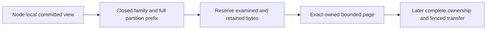
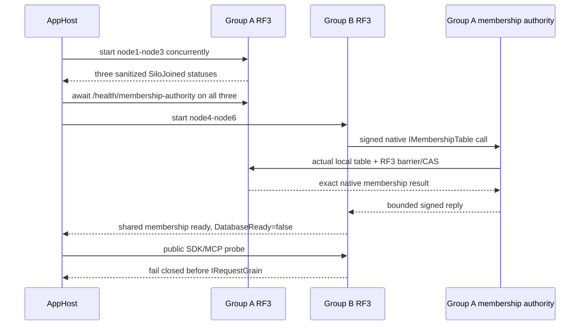

# ClusterRouting: bounded partition record pages

Status: first implementation stage for KL-036/071/072; complete movement remains
unqualified. Decisions: [ADR-016](../../ADR/ADR-016-atomic-physical-placement.md)
and [ADR-017](../../ADR/ADR-017-migration-tokens.md). Initial serving remains RF3.

This stage reads exact canonical key/value bytes from an already owned committed
`IKeyValueView`. The node-local caller retains that cut for all its pages. It
changes no existing persisted format, public API, placement or writer authority.

| Requirement | Acceptance criterion and real oracle |
|---|---|
| REQ-PMOVE-001: use a closed source-owned partition-family inventory | AC-PMOVE-001: actual partition-key constructors are covered; every selected family uses `KeySpace.Partition` with the four complete partition components. Unknown families, invalid partitions and foreign continuation keys fail before copying. Global catalog, principal/API keys, global outcomes, physical watermarks and shared blob accounting are explicitly excluded. |
| REQ-PMOVE-002: bound retained bytes, records and examined work independently | AC-PMOVE-002: real native ZoneTree pages cover empty/inclusive/one-over bounds, exact keys/values/order and charged lookahead. Retained bytes include every returned key/value buffer and the independent continuation buffer. Checked reservation precedes every copy, including continuation; an overlarge record or examined-byte exhaustion throws typed BudgetExceeded with no successful partial page. No full Scan, payload decode or whole-store materialization. |
| REQ-PMOVE-003: preserve caller-owned cut, cancellation and identity | AC-PMOVE-003: paginated reads inside one actual native view reproduce exact selected records; equal key text across tenant/database/domain stays isolated. Cancellation before/during traversal settles the original call with no successful partial image. Reopen preserves bytes; grains acquire no file owners. |
| REQ-PMOVE-004: a family page cannot stand in for a complete movable image | AC-PMOVE-004: no installer or public move endpoint exists until partition outcomes, shared catalog/authorization, blob accounting, retained cursor/transfer state and derived-index readiness have an accepted complete protocol. Later process-kill/fencing/RF3 SDK/MCP gates remain mandatory. |

The inventory covers documents/indexes/unique keys and epochs, graphs and
adjacency, vectors/lineage/effects, samples/sequence/dedup/retention, blob heads/
uploads/parts/metadata, every queue index/body/metadata/counter/inbox, recurring
schedules/sagas/capacity, subscription state/window/completion/inbox, both remote
transfer endpoints, event streams/topics/identities/sequence/feed/snapshots,
outbox/heads/consumers/receipts and visibility epochs. Enumerate actual current
constructors, including dynamic family arguments. There is no universal encoded
partition prefix: the family precedes the four partition components.

## Frozen reader contract and ordered ownership

TASK-PMOVE-PAGES: root owns architecture, source inventory and joins. Luna
implementation owns only new internal Core ClusterRouting Queries/Contracts/
Validation files prefixed `PartitionRecord`. Exact contract:
`PartitionRecordPageReader.Read(IKeyValueView view, PartitionRef partition,
string family, int maxRecords, long maxRetainedBytes, long maxExaminedBytes,
ReadOnlyMemory<byte> afterKey = default, CancellationToken cancellationToken = default)`
returns an internal immutable `PartitionRecordPage` containing owned
`ImmutableArray<KeyValueRecord> Records`, `bool HasMore`, `long RetainedBytes`,
`long ExaminedBytes` and optional independently owned `ReadOnlyMemory<byte>`
continuation. `PartitionRecordFamilies.All` is an immutable ordinal inventory.
Use native VisitRange, charge its real observer before copying, verify the
exclusive continuation belongs to this exact prefix and has canonical KeyCodec
encoding, and preserve raw bytes. Validate the continuation's bounded length
before decoding its key components; user value payloads are never decoded.
Reserve and copy continuation independently from the last returned key; its
bytes contribute to RetainedBytes and maxRetainedBytes. Native accounting and
unexpected visitor stops fail closed.
Positive bounds must be checked before traversal; overflowing counters fail
closed. There is no serialization or inter-grain DTO in this first stage.

TASK-PMOVE-PAGE-ORACLES: an independent Luna worker owns only new UnitTests
ClusterRouting Cases/Helpers prefixed `PartitionRecord`. Derive the criteria
above against actual ZoneTree/TestDatabase primitives, without mocks, fake view,
skips or weakened limits. Preserve callbacks' borrowed lifetime. Root reviews
the complete private packets, then executes Aspire normal/scalar tests.

Complete ownership is a later root-owned stage. Current epoch7 outcome keys have
no partition locator; their hash cannot recover one. Copying every global outcome
or dropping outcomes is incorrect. Existing-store migration needs its exact
accepted upgrade/rollback contract. Current persisted authorization remains
authority and an acknowledged revocation must fence all serving groups. Source
and destination group indexes are never directly comparable; explicit ownership
epoch invalidation is the first candidate under KL-072, pending full freeze.

Slice map: Core owns this internal pure reader in ClusterRouting; Server's
StorageRecovery retains native views/files and Replication retains ordered
commit authority. Later Orleans orchestration uses one request grain and native
ManagedCode.Communication asynchronous streams with bounded handoff. Public
contracts, SDK/MCP, frontend/admin controls are N/A for this internal stage;
their later actual move contract must be specified and qualified.

Verification: full strict Release build, formatter/governance, genuine Aspire
unit and unit-scalar focused PartitionRecord cases for local development, then
exact-source Linux CI. Later movement requires process cuts at every persisted
state and Docker/Aspire RF3 SDK/MCP recovery, fencing, token and receipt oracles.
Internal pages alone do not satisfy those movement acceptance criteria.

The accepted native epoch/outcome prerequisite is [TokenMigrationLineage](TokenMigrationLineage.md), REQ/AC-PMOVE-005..006 and REQ/AC-MTOKEN-001..004 under ADR-017. Its partition-associated locator is additive; global authority and old unknown-scope outcomes remain explicit complete-image blockers. Family pages or a locator alone do not authorize installation or cutover.

# Accepted Stage 1A: shared Orleans membership; later physical movement contracts

Status: root accepts TASK-MOVE-1A and AC-MEMBERSHIP-001..006 for implementation on 2026-10-05. Later movement stages remain proposed until their exact contracts freeze. This is a contract, not runtime qualification; no physical movement acceptance is closed.

Related: [PartitionTransfer](PartitionTransfer.md), [PhysicalShardCatalog](PhysicalShardCatalog.md), [AtomicPartitionPlacement](AtomicPartitionPlacement.md), [ADR-016](../../ADR/ADR-016-atomic-physical-placement.md), [ADR-017](../../ADR/ADR-017-migration-tokens.md), [ADR-099](../../ADR/ADR-099-physical-shard-catalog.md) and [ADR-101](../../ADR/ADR-101-explicit-atomic-partition-placement.md). Canonical slice remains `ClusterRouting`.

## Scope and source-backed boundary

The original plan requires controlled copy/catch-up/barrier/switch/cleanup (KL-036), whole atomic partitions with generation readiness and restartable cleanup (KL-071), and either a supported old-token invalidation or correct lineage translation without comparing independent log positions (KL-072). Current contracts intentionally stop before those operations: AC-PMOVE-004 forbids an installer, `AtomicPartitionPlacementV1` only resolves to the single committed `DefaultShard`, `PhysicalShardCatalog` only boots epoch 1, and AC-MTOKEN-004 explicitly excludes epoch bump/cross-group cutover. This proposal is a new movement contract; it does not reclassify current PMAP, bounded pages, token issuance, outcome association or prior-frame compatibility as movement. Source anchors: `docs/design/architecture-v0.3.uk.md` §§4, 6, 28 and KL-036/071/072; `docs/ADR/ADR-016-atomic-physical-placement.md` §§1–5; `docs/ADR/ADR-017-migration-tokens.md`; current `PhysicalShardCatalog`/`AtomicPartitionPlacement` and `PartitionTransfer` contracts.

Stable identity remains the complete four-field `PartitionRef` / `AtomicPartitionId`. Physical shard identity remains a separate opaque ID for an independently configured RF3 replica group. A node-local `PartitionHost` owns its canonical ZoneTree store, replica log, file locks, materializer and apply gate. Orleans activation migration changes no physical ownership. Replica voters and Orleans silos are not separate logical shards.

Movement applies only to one complete `AtomicPartitionId` at a time. Splitting one hot atomic partition, changing its transaction domain, or changing the user-visible identity is out of scope. Source and destination must be independently provisioned, authenticated, configured three-voter RF3 groups with distinct physical IDs, incarnations and ordered voter identities. Their Raft/apply positions are unrelated and must never be numerically compared.

## Authority and operation contract

A stable database control authority remains outside the movable partition. It owns the canonical placement directory, persisted principals/policies, and the single global `(verified principal, CommandId)` uniqueness/outcome authority. The initial existing default shard may serve this role until a separately accepted topology stage provisions a dedicated control group; the control authority itself is never moved by this protocol. A moved partition is not permitted to create a second independent dedup domain.

Every routed request is authenticated at the existing public boundary and passes through its distinct `IRequestGrain` and native `ManagedCode.Communication` CQRS operation stream. The server—not the caller—derives a bounded internal owner grant from the committed control authority. It binds the complete partition, physical shard ID, incarnation, ordered voter identity, placement epoch, verified principal, persisted policy epoch, command ID/fingerprint when present, and operation/read kind. No client field or propagated Orleans context may supply role, owner, epoch, voter or policy authority. Every write operation kind that can mutate partition state must consume and validate this grant in its actual same-view canonical apply transaction; unsupported/unclassified writes fail closed. Reads resolve the current owner through the same control authority and cannot serve from a stale source owner after switch.

Because one atomic ZoneTree transaction cannot span independent physical groups, mutation execution has a durable control-authority intent: reserve the global command key and fingerprint before target execution, apply the idempotent typed mutation plus a target-side operation receipt atomically at the current owner, then finalize the exact outcome at the control authority. Acknowledgement occurs only after the final outcome is durable. A crash between stages leaves an inspectable pending intent; same-ID/same-fingerprint retry reconciles it and returns the exact terminal outcome, while same-ID/different-fingerprint is `Conflict`. If reconciliation cannot establish whether the owner committed, return the existing safe unknown-outcome category and retain the intent; never report success or dispatch a second logical effect. This authority stage is required before existing outcome rows can leave their current physical group.

Persisted policy remains canonical at the control authority. Revocation acknowledgement must fence new grants and wait for previously admitted mutation grants to settle; if a relevant owner cannot be reached or joined, revocation does not acknowledge a false fence. A stale or expired internal grant cannot authorize writes after a completed revocation or owner switch. Credentials, principal/API-key records and global outcomes are not copied with the partition.

## Requirements and measurable acceptance

- **REQ-MOVE-001 — Distinct physical owners and stable logical identity.** A complete partition is assigned to one physical shard, not to a voter or activation. **AC-MOVE-001:** an Aspire-owned topology starts at least two independent three-voter RF3 groups with distinct physical IDs/incarnations/voter arrays. Native status and signed discovery prove each group independently; writes to one full `PartitionRef` are visible only through the owner route, while a partition with identical suffix fields but a different full scope remains separate. No test calls three voters three owners.
- **REQ-MOVE-002 — One durable global command and policy authority.** Global command uniqueness/results and persisted authorization remain authoritative through owner changes. **AC-MOVE-002:** actual SDK and official MCP same-ID/same-body retries from different group endpoints return byte/logically identical terminal outcomes; same-ID/different-body and cross-partition duplicate attempts preserve global `Conflict`; interrupted pending intents reconcile without duplicated domain/outbox effects. A policy revoke prevents later admission and cannot acknowledge while pre-revocation grants remain unsettled. No client-supplied role or owner grant is accepted.
- **REQ-MOVE-003 — Complete bounded partition image and independent cuts.** Every canonical record, intent/receipt required for that partition, and required derived-generation state is transferred or deterministically rebuilt and verified; excluded global state stays in the control authority. **AC-MOVE-003:** an independent oracle compares the source committed partition image at a named source cut with destination installed state, exact full-scope keys/values, checksums and derived readiness. It covers documents/indexes, graph edges/adjacency, vector lineage, time-series samples, blob manifests/parts and ownership-bound metadata, queues/sagas/subscriptions/transfers/events/outbox/visibility, partition-local execution receipts, and any partition-scoped locator metadata needed to resolve the stable control authority. Such locator metadata is non-authoritative and may only point to canonical outcomes that remain in the control authority; global `StoredOutcome` records and the global command identity index are never copied into a data-owner image. Global/Unknown outcomes, global policy/catalog, and shared physical accounting are not silently copied. Unknown legacy outcomes, missing or unresolvable locators, unsupported files/assets, incomplete derived state or any over-bound image block readiness before ownership can switch. Limits and per-family record/byte totals are frozen before implementation; pages alone do not establish image completeness.
- **REQ-MOVE-004 — Ordered tail and source fencing.** The destination is caught up through an explicit terminal source fence before assignment changes. **AC-MOVE-004:** writes concurrent with snapshot capture are either present exactly once in the ordered tail or rejected after the source fence; destination final state matches the frozen source cut plus the complete tail. Every write path validates the trusted owner epoch in its same-view apply. Once the fence is committed, the old source cannot accept a new write even through a stale route or delayed grant. The catalog CAS and assignment revision are monotonic and idempotently recoverable.
- **REQ-MOVE-005 — Restartable phases and no data loss.** Movement progress is durable and phase-specific. **AC-MOVE-005:** real process termination/reopen at every persisted phase—intent, source fenced, image prepared/transferring, destination installed, tail caught up, assignment published, source retired—recovers forward or performs a proven pre-publication rollback. It never exposes two writable owners, loses an acknowledged command, deletes the only complete copy, decrements an epoch, or cleans source logs/files before destination quorum and published-owner evidence are durable. Ambiguous publication remains closed and is reconciled by the same move ID.
- **REQ-MOVE-006 — Explicit token and cursor behavior.** No source log position is compared with a destination log position. **AC-MOVE-006:** every source-owner CommitToken and owner-scoped feed/index cursor captured before switch is explicitly invalidated after the switch with stable `TokenInvalidated`; it never silently restarts at destination head. Newly issued destination tokens work and preserve same-owner monotonic reads. Tests include pre-switch token, post-switch old token, destination token, restart and retry/replay.
- **REQ-MOVE-007 — Caller-visible routing and bounded recovery.** Real operations keep the one-request-grain boundary and finite original deadline/cancellation. **AC-MOVE-007:** SDK and official MCP execute reads/writes before/during/after movement, see only complete current-owner results, and report safe typed busy/ownership/outcome errors during a fence; a fresh healthy request succeeds after every recoverable interruption. Every owned group, stream, child, transfer and lock is awaited and disposed before cleanup; no detached timeout-as-join path is allowed.

Traceability: original `AC-ROUTE-005` (planned prepare/copy/catch-up/validate/owner-switch/release with process interruption and actual RF3) and KL-036 copy/catch-up/barrier/switch/cleanup → REQ-MOVE-003/004/005 and AC-MOVE-003/004/005; KL-071 whole-partition image/generation/restartability → REQ-MOVE-001/003/005; KL-072 old-token invalidation/translation → REQ-MOVE-006; global outcomes/policy and live public route → REQ-MOVE-002/007. Each AC needs the named automated native or Aspire oracle; none is satisfied by the current PMOVE page tests or same-group voter restarts.

## Ordered implementation stages and exact ownership

1. **TASK-MOVE-1A — Six-node Orleans/RF3 topology only; no data-operation admission.** Add one explicit AppHost-only profile selector `KeyLoadTests:ClusterRouting:Profile=two-rf3` while keeping the existing caller entry `KeyLoadTests:Suite=rf3`. It creates exactly six containers, `node1` through `node6`, with Group A=`node1,node2,node3` and Group B=`node4,node5,node6`; each group has three fixed voters. For all six, `KeyLoad__ClusterId` is the same database Orleans cluster identity and `ClusterOptions.ServiceId` remains the current constant `KeyLoad`. Each group has one shared nonempty `KeyLoad__PhysicalShardId`, one shared nonempty `KeyLoad__Incarnation`, and its own exact ordered `KeyLoad__Peers__0..2` (for example Group A origins `http://node1:8080`, `http://node2:8080`, `http://node3:8080`); across groups the physical IDs, incarnations, and voter arrays are distinct/disjoint. Each node has a unique `KeyLoad__PublicEndpoint`, `KeyLoad__SiloAddress`, `KeyLoad__SiloPort` (container target11111), and `KeyLoad__DataDirectory` (`/data` mounted from a distinct `<root>/nodeN`); the existing private-network HTTP setting stays explicit. Each `ReplicaConfiguration` is production mode (`BenchmarkTopology=false`) and validates exactly three fixed voters, unique identities, one local member, and independent per-node store/log/lock roots. No arbitrary node-count override is allowed. Existing `KeyLoad__SigningKey`, `KeyLoad__AdminKey`, `KeyLoad__PeerSecret`, transport limits, and operation deadlines retain current validation; no secret is emitted in profile/status diagnostics. Current per-group caps remain untouched: MaxAppendEntries64, MaxAppendBytes16MiB, SnapshotChunkBytes262144 and MaxSnapshotBytes4GiB; the two-group selector may not raise or relax these or the three-voter majority.

   **R2 membership blocker and R3 refinement:** identical `ClusterId` alone is not proof of one Orleans cluster. Current `OrleansSiloConfiguration` binds `IMembershipTable` to the local `PartitionHost` group, so disjoint groups diverge. The proposed R3 amendment below defines a Group A shared membership authority and Group B authenticated provider proxy. It preserves the current persisted membership aliases/IDs and native RF3 membership mutation path; it does not yet qualify a six-silo cluster.

   Stage 1A keeps silo membership readiness separate from database data admission. Existing `/health/ready` remains the database-ready signal. In the two-group profile every public database operation is rejected by an explicit `OrleansNode.ExecuteCoreAsync` profile gate before reading `IGrainFactory` or looking up `IRequestGrain`, even if Group A completed local catalog bootstrap. Group A may complete the current local physical-catalog bootstrap before Group B starts. Group B MUST skip that request-grain bootstrap because a shared Orleans directory can place the grain on a different physical owner; no direct store write or local-placement assumption may replace it. Group B has no committed physical catalog and both groups remain `DatabaseReady=false`. Existing three-node `rf3` behavior remains unchanged. Literal and real AppHost tests must prove one shared six-silo membership view, two independent three-voter RF3 domains, distinct node-local stores/logs/locks, and public SDK/MCP no-dispatch with no user/catalog/outcome mutation. They must not claim Group B is a usable second database owner in 1A.

   **Current contract identities remain unchanged in 1A:** `ReplicaSiloDiscovery` keeps alias `keyload.replica.discovery.v2` and IDs 0–6 (`VoterId`, `ClusterId`, `Incarnation`, `SiloAddress`, `TransportReady`, `ApplicationRpcVersion`, `PeerEnvelopeVersion`); `PhysicalShardCatalog` stays `keyload.contract.physical-shard-catalog.v1` IDs 0–2, and `PhysicalShardRecord` stays `keyload.contract.physical-shard-record.v1` IDs 0–3. `AtomicPartitionPlacementV1` and its request/resolution aliases and IDs remain as ADR-101. `NodeStatus` stays `keyload.contract.node-status.v1` IDs 0–8. R3 freezes new generated membership-authority transport contracts with an independent protocol version 1; the existing app-request interface version 4, replica peer-envelope version 3, discovery-MAC version 2 and all persisted membership aliases remain unchanged. The six-node profile is homogeneous current image only; startup closes on missing, mixed or incompatible membership/member identity evidence.

   Owners for the topology-only stage: root owns AppHost's profile selector, six-node resource graph and actual image/runtime identity; Orleans owns the shared membership authority adapter and explicit separation of silo membership from user-operation admission; Replication owns fixed per-group RF3 voters and authenticated primary/barrier evidence; Server owns each node-local `PartitionHost` and fail-closed operation gate; Integration tests own actual AppHost-owned six-node native membership/status and SDK/MCP no-dispatch cases. The stage does not implement an owner directory, cross-group data operation, copy, or movement.
2. **TASK-MOVE-1B — Committed owner directory and global command/policy authority (not a move).** Only after 1A proves the common cluster and both groups remain data-operation closed, add a versioned additive owner directory and the global command reservation/final-outcome authority. Preserve SCAT V1 and PMAP V1 bytes/aliases/IDs. Through persisted-admin native control, assign a newly created empty `PartitionRef` to the additional group at its initial epoch and route real SDK/MCP reads/writes through the server-derived owner. No existing partition or records move in this stage. Establish the global command reservation, target-side atomic idempotency receipt, and exact finalization/reconciliation before acknowledging cross-group writes. Same principal/CommandId/body retries reconcile the same pending intent; changed body conflicts. Every mutating operation kind is inventoried and consumes the trusted grant inside its actual same-view apply. Policy remains at stable control authority and revocation drains prior grants. Owner: root owns AppHost transport/profile and authenticated inter-group client; Core owns ClusterRouting owner directory and `AtomicCommandCommit`/`CommandOutcomes` integration; Orleans owns request admission/routing; Replication owns inter-group authentication/streaming; Server owns routing to the node-local `PartitionHost`; Integration tests use actual .NET SDK and official MCP. This stage still does not claim an existing-data move.
3. **TASK-MOVE-IMAGE — Complete partition export/import.** Define a versioned bounded image manifest over `PartitionRecordFamilies`, plus explicit non-keyspace-owned assets and rebuild-ready derived generations. Capture one source `IKeyValueView` cut and make immutable checksummed bounded pages. Install only into a distinct, empty/private destination generation under its `PartitionHost` lock; validate full `PartitionRef`, database incarnation/format, all family totals/hashes, partition-local execution receipts and non-authoritative locator references, quotas and derived readiness before publication. Canonical global `StoredOutcome` records and the global command index remain in the stable control authority and are not copied. Owner: Core ClusterRouting pages/manifest; Storage.ZoneTree and Server StorageRecovery own actual private generation files, handles and atomic install; Replication defines only transport envelope/authentication; no grain owns file handles. Join point: same node-local store lifecycle as `PartitionHost` and checkpoint recovery. Until verified install exists, source stays authoritative and destination cannot serve.
4. **TASK-MOVE-TAIL — Durable ordered catch-up and source fence.** Add per-partition movement intent and tail records in the same source canonical transaction as every post-snapshot mutation; bounded sequence numbers are partition-scoped and distinct from group Raft positions. Pause/throttle/fail closed before a configured tail retention bound is exhausted. Source fence stops new grants, waits admitted operations, commits a terminal tail sequence and remains durable across restart. Destination applies exactly once through that terminal sequence under its native apply gate and verifies the final image. Owners: Core command/outcome; Replication ordered transport; Server/StorageRecovery node-local fence and lifecycle; Orleans one-request admission/drain. No source lock or log is released before actual terminal join.
5. **TASK-MOVE-SWITCH — Monotonic owner publication and recovery.** In a same-control-authority transaction, compare current full owner tuple + assignment revision + source epoch + MoveId and publish destination tuple with a strictly greater placement epoch only after destination installed/caught-up receipt and source fence receipt validate. Make retry of an identical switch idempotent; changed move input conflicts; stale revisions fail closed. Old source's local fence is permanent after publication. Pre-publication rollback is permitted only while control authority still records source and destination effects can be abandoned safely; post-publication always recovers forward. Owners: Core placement/control command; Orleans routing; Server ready/admission; root joins public operation routing. No old compatible binary may serve after movement records are published; protocol/profile compatibility must fail startup closed.
6. **TASK-MOVE-TOKEN — Token/cursor semantic join.** KL-072 selects explicit invalidation for the first move contract. Every cursor/token whose meaning includes a physical-group log position must carry the owner incarnation/placement epoch or be version-rejected after switch with `TokenInvalidated`; destination tokens use the destination lineage. No source/destination position comparison is permitted. Owners: Abstractions native contracts only if append-safe fields are required; Core token helpers; Query/ChangeFeeds cursor consumers. A separate durable translation/sequence format is out of scope.
7. **TASK-MOVE-RF3 — Genuine public qualification.** Add AppHost-owned six-node fault cases with real .NET SDK and official MCP; test duplicate, concurrent, revoke, long-running tail, cuts/restart at each phase, old-owner fencing after delayed request, source/destination leader changes, retry after lost ACK, token invalidation, health/readiness and cleanup. Root owns fixture/wave topology, exact source maps, image/profile/version admission and Linux qualification. Preserve original failure artifacts; no independent Docker launch. Only after every unit/recovery/analyzer/formatter/RF3 gate passes can this ADR move to Implemented or KL-036/071/072 close.

## Rollout, rollback and limitations

Current SCAT V1 and PMAP V1 bytes/aliases/IDs remain unchanged until an explicit data-format upgrade is separately specified. A new owner directory/control record requires a new stable generated-native alias/key or an explicit writer-stopped conversion; old writers/readers must never silently ignore a published owner. Mixed source/destination protocol versions fail closed. No downgrade to an earlier placement epoch is allowed. Restore either reopens the current published destination with complete receipt/lineage or recovers forward; it cannot reactivate a stale source based on its local copy alone.

Frontend is N/A for this internal routing/control workflow. SQL and SDK/MCP gain no caller-trusted owner fields. Full movement, rollback, selected old-token invalidation, global outcome authority, and two-group process-fault evidence remain open until these new ACs are implemented and qualified.

## R4 — Shared Orleans membership authority (Stage 1A contract proposal)

This section supersedes R2's unresolved membership transport paragraph. It freezes a narrow topology-only prerequisite for review; it does not enable owner routing, make either group's local database composable, or close any movement AC. R4 corrects the pinned Orleans version, native `UpdateRow` trust semantics, historical-row capacity and cancellation-aware provider contract below; these corrections supersede conflicting R3 wording in this amendment and ADR-106.

### Existing lifecycle and authority

Current `ServerApplication.RunLifetimeAsync` starts `PartitionHost.Coordinator`, then starts the ASP.NET app/Kestrel, then awaits `OrleansNode.StartAsync`. `OrleansNode.StartCoreAsync` calls native `IHost.StartAsync`; only after that returns does it publish `IGrainFactory`, then run `PhysicalShardCatalogStartup`. The Kestrel process therefore has a real authenticated endpoint available before Orleans asks `IMembershipTable.InitializeMembershipTable`.

Group A remains the sole membership-table authority. It keeps the existing local `ReplicaMembershipTable`, whose `ReplicaMembershipStore.ReadAsync` performs `ReplicaConsensus.ReadControlBarrierAsync` before reading the `membership/orleans-membership` record, and whose `CompareExchangeAsync` submits native `OperationKind.Membership` through Group A's `ICommitCoordinator`. The existing membership record, snapshot, row and suspect aliases/IDs are unchanged. This is one persisted table replicated by Group A's actual three-voter RF3 quorum.

Group B registers `ReplicaMembershipAuthorityClientTable` as Orleans `IMembershipTable`; it MUST NOT register a local `ReplicaMembershipTable` fallback. Its native membership methods call the Group A HTTP authority during Orleans startup and thereafter. The authority endpoint is registered by Kestrel before Orleans starts, but returns unavailable while its owner has no published provider. `OrleansNode` marks `SiloJoined` only after native `built.StartAsync` returns. It then completes Group A's existing `PhysicalShardCatalogStartup`; as the final successful startup step, after catalog initialization has returned, it publishes the borrowed `IMembershipTable` obtained from `built.Services` through `ReplicaMembershipAuthorityOwner` and sets `AuthorityReady`. `OrleansNode.StartAsync` completes only after this publication. The endpoint never resolves silo services from the outer Kestrel provider. This ordering prevents Group B startup from racing Group A's catalog bootstrap through the shared directory. No Orleans client/grain call is used to initialize shared membership.

### Ordered startup and shutdown

1. AppHost creates exactly Group A=`node1..node3` and Group B=`node4..node6`, fixed current image only. All six have the same `KeyLoad__ClusterId` and `ClusterOptions.ServiceId=KeyLoad`; each group retains its distinct three-voter `KeyLoad__Peers__0..2`, `PhysicalShardId`, `Incarnation`, private logs, stores, locks and apply gates.
2. AppHost starts Group A's three nodes concurrently, awaits `/health/silo` from all three (`SiloJoined` means native `built.StartAsync` returned), and then awaits `/health/membership-authority` from all three (`AuthorityReady` means `OrleansNode.StartAsync`, including Group A's local catalog initialization, returned and the local table provider has been published). The endpoint must continue to return unavailable between the first and second barriers; it accepts authority calls only after this second barrier. This guarantees the local startup catalog request cannot be placed on a Group B silo. Group A's existing `PhysicalShardCatalogStartup` may complete locally; it does not open public data admission in this profile.
3. Only after that barrier AppHost starts Group B. Its `IMembershipTable.InitializeMembershipTable` uses bounded requests to Group A's three exact origins until it reads the shared table or its finite startup deadline/cancellation expires. Normal Orleans membership insertion/status/heartbeat calls also use this proxy. Failed authority/quorum is a startup failure; the client never falls back to Group B's isolated local store.
4. Group B MUST skip `PhysicalShardCatalogStartup`'s request-grain bootstrap in 1A. Once six silos share a distributed directory, that request could activate/execute on another physical owner. Do not substitute a direct local write, `PreferLocalPlacement`, or a bootstrap grain. Group B has no committed owner catalog in 1A; its catalog and safe application route are explicit Stage 1B prerequisites.
5. The six-node AppHost test waits for Group A’s `/health/membership-authority` barrier before starting B, then waits for shared-membership readiness on all six. Each check reads the actual full table through that node’s provider; the total may contain up to 48 retained rows, but readiness requires exactly the six expected current, unique SiloAddress generations to be Active. No row is truncated. Status exposes total-row and active-current counts plus a SHA-256 fingerprint over the six current address/status tuples, never rows or addresses. Tests independently read signed discovery from each actual node and require all six views to match. `/health/silo` reports only `SiloJoined`; `/health/membership-authority` reports Group A’s completed local startup; membership-ready never opens public database admission.
6. `/health/membership-authority` is a Group A-only internal status phase. It remains false until the table is published after full local startup and catalog initialization; Group B never publishes an authority. `DatabaseReady` remains false on both groups for all of 1A. Existing `/health/ready` remains 503 and every SDK/MCP database operation is rejected by `OrleansNode.ExecuteAsync` before `IRequestGrain` lookup/dispatch. Membership and silo readiness are system-control phases, not public database readiness.
7. Aspire dependency ordering stops Group B before Group A. Group B's outbound membership calls remain available until its native Silo shutdown settles; then its proxy owner joins outstanding calls and disposes its HTTP client/credentials. Before Group A's native Silo shutdown, its authority owner closes external admission and joins admitted HTTP handlers while Kestrel and the local membership table are still live. The local membership table remains available to Group A's own Silo teardown. After Silo shutdown settles, clear the published borrowed-provider reference before native service-provider disposal; never dispose that borrowed provider independently. Kestrel and authority secrets are disposed afterward.

`ServerApplication`'s observed order is `Coordinator.StartAsync -> app.StartAsync -> silo.StartAsync`; shutdown is `silo.StopAsync` (including membership teardown) before `app.StopAsync`, then physical-owner disposal. Stage 1A preserves this order. No new hosted service or concurrent Orleans lifecycle callback is used to “bootstrap” the cluster.

### Ordered membership startup

### Membership authority wire and authentication

The new endpoint is private-network-only `POST /internal/orleans/membership/v1`; it is distinct from bodyless `PeerSecurity` discovery (`GET /internal/silo`) and does not broaden `PeerSecurity`. It uses native generated Orleans serialization, exact original request-body bytes for authentication, strict closed request/response records, no JSON fallback, no caller-facing route, and no `ReplicaRpc` enum/envelope reinterpretation.

Add these new stable generated contracts in the `ClusterRouting` slice. Existing `ReplicaSiloDiscovery` remains alias `keyload.replica.discovery.v2` IDs 0–6; request-interface version 4, peer-envelope version 3 and discovery-MAC version 2 do not change because the RequestGrain and replica-envelope shapes are unchanged. The new membership protocol has its independent explicit `Version=1`; an unknown/missing version fails closed.

- `ReplicaMembershipAuthorityEntryV1`, alias `keyload.orleans.membership.authority.entry.v1`: IDs 0 Address, 1 Status, 2 ProxyPort, 3 Host, 4 Name, 5 Started, 6 Alive, 7 Suspects (existing native `ReplicaMembershipSuspect` values), 8 RowETag. It mirrors the complete current native row needed to round-trip `MembershipEntry`; no persisted record is rewritten.
- `ReplicaMembershipAuthorityCallV1`, alias `keyload.orleans.membership.authority.call.v1`: IDs 0 Version, 1 ClusterId, 2 AuthorityPhysicalShardId, 3 AuthorityIncarnation, 4 CallerPhysicalShardId, 5 CallerIncarnation, 6 CallerVoterId, 7 CallerSiloAddress (actual generation from `ILocalSiloDetails`), 8 RequestId, 9 Operation, 10 TargetSiloAddress, 11 CandidateEntry, 12 ExpectedTableVersion, 13 ExpectedTableVersionETag, 14 ExpectedRowETag, 15 CleanupBeforeUtcTicks. Operation enum values are explicit and append-only: ReadAll=1, ReadRow=2, InsertRow=3, UpdateRow=4, UpdateIAmAlive=5, CleanupDefunct=6. DeleteTable is deliberately not a proxy operation.
- `ReplicaMembershipAuthorityReplyV1`, alias `keyload.orleans.membership.authority.reply.v1`: IDs 0 Version, 1 AuthorityPhysicalShardId, 2 AuthorityIncarnation, 3 RequestId, 4 RequestNonce, 5 `ResultKind : int`, 6 nullable existing `ErrorCode`, 7 `ErrorDetailCode : int`, 8 Applied, 9 TableVersion, 10 TableVersionETag, 11 Rows. `ResultKind` is explicit `Completed=1` or `Failed=2`. Completed carries null ErrorCode and `ErrorDetailCode.None=0`; Applied is the exact native mutation result (false on reads and non-applied CAS), and Rows contains the entire bounded read result. Failed carries non-null existing ErrorCode, non-None fixed ErrorDetailCode, Applied=false, no rows, TableVersion=0 and an empty TableVersionETag. ErrorDetailCode is explicit and append-only: None=0, MalformedRequest=1, AuthenticationFailed=2, UnsupportedVersion=3, AuthorityMismatch=4, CallerGroupMismatch=5, UnsupportedOperation=6, RequestLimit=7, ReplyLimit=8, MembershipCapacity=9, AuthorityUnavailable=10, PersistedTableCorrupt=11, DeleteUnsupported=12. Map MalformedRequest/UnsupportedOperation to Validation; AuthenticationFailed/AuthorityMismatch/CallerGroupMismatch to Unauthenticated; UnsupportedVersion/DeleteUnsupported to UnsupportedCapability; RequestLimit/ReplyLimit/MembershipCapacity to ResourceExhausted; AuthorityUnavailable to OwnershipLost; PersistedTableCorrupt to Corruption. These details map to fixed local strings only; no exception, address, header, identity or payload text crosses the boundary.

The HTTP authentication headers are single-valued and canonical: cluster ID, authority physical/incarnation, caller physical/incarnation/voter/SiloAddress, invariant UTC ticks, fresh nonce, and 32-byte HMAC-SHA256 signature. Sum of UTF-8 header-name/value bytes is at most 4,096, each value at most 512 bytes, and Kestrel enforces the same total header limit before handler retention. Timestamp is canonical positive invariant UTC ticks within 30 seconds of receiver TimeProvider UTC now. Nonce is base64url of 16 cryptographically random bytes without padding (22 ASCII bytes); IDs are canonical lower-case N; SiloAddress round-trips exactly through ToParsableString() and is at most 256 UTF-8 bytes. A single declared Content-Length is required and checked before streaming. The request MAC input is ASCII domain `keyload-orleans-membership-authority-request-v1` plus LF, length-prefixed UTF-8 canonical method/path/identity/timestamp/nonce fields, big-endian UInt64 exact body length, and the 32 raw SHA-256 bytes of the original body. The reply uses the distinct `keyload-orleans-membership-authority-reply-v1` domain and binds authority identity, original RequestId/nonce, status, exact body length and digest. No decoded/re-serialized DTO participates. Verify MAC in fixed time before native deserialization; then require body/header identities to match. Reject duplicate/missing headers, replayed nonce, noncanonical address/ID, request/reply substitution, redirected origin, query string, unknown operation, trailing bytes and oversized body. No log includes secrets, headers, payload or address.

Group B signs calls using its existing group `KeyLoad__PeerSecret`. Group A's authority configuration holds the exact Group B fixed physical ID/incarnation/voter set and that group's peer credential to validate inbound calls. Group A signs replies with its own existing `PeerSecret`; Group B's authority client holds the expected Group A credential and physical ID/incarnation to validate replies. Credentials are separate from `AdminKey`/`SigningKey`; AppHost injects them as secret parameters, zeroes temporary decoded bytes, and never exposes them through status. Existing per-group peer discovery/replication authentication remains unchanged.

Runtime settings are strict and all-or-nothing: `KeyLoad__MembershipAuthority__Mode` is `local` (default, existing single RF3), `authority` (Group A), or `proxy` (Group B); `KeyLoad__MembershipAuthority__AuthorityPhysicalShardId`, `...__AuthorityIncarnation`, `...__AuthorityEndpoints__0..2`, and `...__AuthorityPeerSecret` identify/authenticate the exact Group A authority for proxy nodes; `...__TrustedGroup__PhysicalShardId`, `...__TrustedGroup__Incarnation`, `...__TrustedGroup__VoterIds__0..2`, `...__TrustedGroup__SiloEndpoints__0..2` (canonical host:port resolved at startup), and `...__TrustedGroup__PeerSecret` identify/authenticate the exact Group B for authority nodes. `KeyLoad__ClusterId`, `KeyLoad__PhysicalShardId`, `KeyLoad__Incarnation`, `KeyLoad__Peers__0..2`, `KeyLoad__SiloAddress`, `KeyLoad__SiloPort`, and `KeyLoad__AllowPrivateNetworkHttp` keep their current meanings. `local` rejects authority-only keys; only the exact two-RF3 AppHost profile can assign `authority` to Group A and `proxy` to Group B. Partial vectors, duplicate/nonmember origins, wrong physical ID/incarnation/cluster, malformed secrets or non-private HTTP fail configuration before stores open. The normal three-node profile remains `local`; it has no authority settings or behavior change.

### Bounds, errors and lifecycle

The authority endpoint and client use one shared 30-second operation deadline: `ReplicaMembershipProtocol.RequestTimeout = ReplicaProtocol.ReadBarrierTimeout` (10 seconds) + `ReplicaProtocol.CommandTimeout` (20 seconds). It covers admission, HTTP connect, body read, provider read/CAS, response serialization and verification. The pinned `Microsoft.Orleans.*` packages are 10.4.0. Orleans 10.4.0 `IMembershipTable` has cancellation-aware Async overloads for initialization, reads, insert/update/heartbeat, cleanup and deletion. Implement those overloads on the same `ReplicaMembershipTable`; the handler dispatches to its corresponding native `...Async(..., originalLinkedDeadlineToken)` method. Tokenless compatibility methods delegate to the same algorithms. Do not rely on Orleans default adapters, which cancel only the caller wait while tokenless work continues. No extra `ExecuteAuthorityCallAsync` shim is needed because every proxied operation has a native cancellation-token overload; no second provider or storage implementation is created. Cancellation/disconnect cancels and joins the original provider callback before releasing its lease; no `WaitAsync` or detached task. Startup retry remains a single cancellable 120-second total deadline and existing 250ms transient interval. HTTP connection establishment remains the existing 500ms peer-connect bound. In the two-RF3 profile only, request bodies are at most 65,536 bytes, full replies at most 262,144 bytes, persisted encoded membership snapshots at most 262,144 bytes, one encoded row at most 4,096 bytes, retained rows at most 48, and suspects per row at most six. SiloAddress, Host, Name and each suspect address are each at most 256 UTF-8 bytes. The 48-row total is a new explicit profile bound, not an existing native limit; it accommodates six expected current members plus up to 42 retained generations. ReadAll returns all history with no truncation. Count exactly six expected current Active SiloAddress generations for readiness; historical non-current rows do not count. Preflight row-count and field-size bounds before building a changed row array; serialize snapshots and replies through cap+1 bounded writers. If a read or proposed update exceeds a cap, return ResourceExhausted without retaining or persisting the over-limit record/snapshot/reply; never evict a live or historical row to make space. Existing local three-node membership mode retains its current behavior. Each process admits at most eight authority calls and retains at most 16,384 unexpired nonces. Nonces expire after two minutes using monotonic TimeProvider timestamps; only expired entries may be removed. A full unexpired nonce table rejects new calls with ResourceExhausted before provider work, never evicting replay evidence. Retries use a fresh nonce and exact original CAS expectations. Authority failover visits only the three configured Group A origins under the same operation token; redirects are disabled.

The authenticated identity is a configured group trust identity, not an individual silo credential: the existing PeerSecret is group-shared. Every call binds and validates the caller group tuple, canonical SiloAddress and generation, fixed native silo port, request nonce and signature. InsertRow and UpdateIAmAlive are generation-owned native operations, so the candidate SiloAddress must equal the signed CallerSiloAddress. UpdateRow is intentionally not own-row-only: Orleans 10.4.0 MembershipTableManager calls UpdateRowAsync to add suspicion votes and mark arbitrary target silos Dead. A member of either configured trusted group may therefore CAS-update any existing exact target row; TargetSiloAddress must equal CandidateEntry.SiloAddress and the persisted row key. It cannot insert an unrelated generation through UpdateRow. Preserve native row/table ETag CAS, suspicion lists, heartbeat non-regression, and all native membership transitions. CleanupDefunct retains the existing Dead+cutoff rule and native CAS. Remote DeleteTable remains unsupported. A lost/replayed call cannot create a second table transition; return the exact native CAS boolean.

Authentication/shape failures are `Unauthenticated` or `Validation`; unsupported deletion/operation is `UnsupportedCapability`; authority missing/quorum loss/deadline is `OwnershipLost`; bounded capacity is `ResourceExhausted`; malformed persisted membership bytes remain `Corruption`. A typed CAS non-application returns the actual `false`, not synthetic success. Group B startup throws if authority cannot initialize; no local-read fallback is allowed. Active HTTP handlers and proxy calls are cancelled and actually joined before disposing HttpClient, replay tables, credentials, Silo host or stores. Group B stops before Group A; Kestrel authority remains available while the control Silo is still in membership teardown, then rejects admission and joins callbacks before app disposal. For Group A, close external authority admission before native Silo shutdown, join admitted HTTP calls while Kestrel and the local provider are still live, then stop the Silo; clear the published borrowed-provider reference before the native service provider can dispose it. Do not dispose the borrowed `IMembershipTable` independently.

### Membership-specific acceptance

- **AC-MEMBERSHIP-001 (same view):** a genuine six-container Aspire run reports all six native silos joined; independent Group A and B replica configurations each contain exactly three distinct fixed voters and unique physical IDs/incarnations; one shared full `IMembershipTable.ReadAll` view includes the six expected current active SiloAddress generations and may retain bounded old generations. All rows are returned without truncation under the 48-row/256-KiB profile cap. Both groups' physical stores, replica logs and locks remain distinct. Group B has no catalog and no data readiness. Existing 3-node RF3 remains unchanged.
- **AC-MEMBERSHIP-002 (bootstrap ordering):** source-bound startup trace proves AppHost waits for all Group A `/health/silo` and `/health/membership-authority` results, then starts Group B; Kestrel is listening before B's Silo starts. A real startup observation verifies that after `SiloJoined` but before Group A catalog initialization succeeds, the authority endpoint still reports unavailable and no proxy call is admitted. Only after `AuthorityReady` is published does B's `IMembershipTable.InitializeMembershipTable` complete through authenticated Group A HTTP without Orleans grain dispatch. No Group A quorum/authority returns typed unavailability and B startup fails/cancels within the original startup deadline.
- **AC-MEMBERSHIP-003 (safe admission):** in the six-node profile `/health/silo` can be true and membership-ready can be true while `/health/ready` remains 503. Real SDK and official MCP read/write calls at both group endpoints fail before `IRequestGrain` dispatch with no data/catalog/outcome mutation. No other public DB API becomes ready.
- **AC-MEMBERSHIP-004 (wire and auth):** actual native serializer tests cover all fields, row ETags, suspicion times, TableVersion, six-current-plus-history readiness, exact 48-row and encoded byte bounds; actual HTTP tests reject malformed/missing/duplicate headers, altered body/signature, wrong group/authority/incarnation/cluster/address, stale/replayed nonce, old protocol version, extra fields/trailing bytes, unknown operation and cap+1. A real native membership-manager suspicion/death path updates a remote target row through exact ETag/table-version CAS. No local provider fallback appears after any failure.
- **AC-MEMBERSHIP-005 (quorum/failover/teardown):** stop one Group A node and prove Group B membership reads/heartbeat CAS continue through one of the other actual control nodes with Group A majority. Stop two Group A nodes and prove Group B returns unavailable/does not fall back. In a normal owned shutdown, Group B Silo disposal and outbound operations join before Group A teardown; all three authority Kestrel handlers/calls join before Group A credentials/host/stores dispose. A fresh complete six-node start joins with current new SiloAddress generations and no stale ownership/readiness.
- **AC-MEMBERSHIP-006 (current compatibility):** standard three-node current image uses local membership unchanged. The two-RF3 profile accepts only the same exact homogeneous immutable current image on all six before AppHost `Start`; old or mixed images are not supported by this profile and are rejected by image identity/version checks before resources start. The membership transport itself requires protocol v1 and exact authority tuple. No rolling upgrade claim is made.

REQ-MOVE-001 and AC-MOVE-001 remain open until this stage's actual six-node evidence exists. AC-MOVE-002..007 and Stage 1B remain open. A single RF3 group, three voters counted twice, equal ClusterId, standalone nodes or six configurations are not proof of one Orleans cluster.

### Accepted membership DNS pin lifecycle, 2026-10-05

REQ-MEMBERSHIP-007: Group A composition must not resolve the not-yet-started
Group B container aliases. Aspire still starts B only after every A authority
health barrier. The authority resolves B's exact configured host and silo port
only after validating the signed group/caller tuple, original-body HMAC, nonce
and canonical SiloAddress; no payload selects a hostname or resolution target.
Resolution and waiting consume the original admitted call deadline/cancellation.
Await the actual native `Dns.GetHostAddressesAsync` task, with no detached task,
fallback, extra operation deadline or unbounded retry.

Each authority lifetime has exactly three private per-voter pin gates. At most
one resolution is in flight for a voter, within the existing eight-call cap.
Validate the complete native result before publication: require 1..8 distinct
valid addresses, reject rather than truncate an over-bound set, and require the
authenticated canonical caller address/port to match. Publish one owned immutable
set only after success. A failed/cancelled initial attempt leaves the voter
unpinned and performs no membership-store work; a later independently admitted
call may try again. A successful pin is never silently refreshed or replaced in
that authority lifetime. Replacing an address requires a fresh authority
lifetime; ordinary process restarts retaining the configured container address
remain supported. Existing fixed Group A origins/identity checks are unchanged.
Unresolved addresses fail OwnershipLost; mismatched caller identity/address
fails Unauthenticated; over-bound resolution fails ResourceExhausted. Use only
closed safe wire errors, never names, addresses or resolver exception text.

AC-MEMBERSHIP-007: the actual Aspire six-container startup reaches A authority
readiness before B exists, then all six native silos join one membership table.
Actual HTTP/native-DNS tests cover cold concurrent calls, first-attempt
cancellation/unavailability with no pin/store mutation, successful once-only
pinning, signed wrong address, changed address rejection, capacity rejection and
shutdown joining the original resolutions/calls before pin gates dispose.
Existing six-view, native suspicion/CAS, failover, minority and teardown gates
remain mandatory; source configuration is not that proof.

Traceability: REQ-MEMBERSHIP-007 -> AC-MEMBERSHIP-007 -> ADR-106 amendment ->
TASK-MOVE-1A. Luna lifecycle_wave owns the private authority pin/endpoint and
native regression packet; root owns review, join, strict build/format and actual
Aspire RF3 evidence. No persisted, public database or user authorization format
changes occur. Rollback disables the explicit two-RF3 profile; it cannot revive
an eager-DNS startup cycle or enable Stage 1B data operations.

### Accepted independent six-generation oracle, 2026-10-05

REQ-MEMBERSHIP-008: the two-RF3 test topology must hand its already-generated
Group B identity and discovery credential to the owned native test wave through
the actual Aspire model. `membership-physical-b` and `membership-incarnation-b`
are canonical nonempty D-format GUID ParameterResources, distinct from Group A;
`membership-peer-b` is the existing secret ParameterResource. Pass these same
resource references to B's node configuration and A's trusted-group configuration.
Do not independently generate or substitute test identities or credentials.
The test resolves the three exact resources with native
`ParameterResource.GetValueAsync` under its original cancellation/deadline and
never records their values in logs, test output, artifacts or exception text.
Decoded discovery-key bytes have an owned lifetime and are zeroed only after all
original signed-discovery operations join. No credential is exposed by health.

Group A and B use the same actual Orleans ClusterId derived from A, while their
physical IDs, incarnations and three-voter discovery MAC keys remain distinct.
A new feature-local test helper verifies all six real signed native discovery
responses against that explicit cluster/group tuple and exact configured voter
origin. Preserve the existing three-node signed-discovery helper and MAC version.
Reject malformed/duplicate signatures, altered bodies, wrong group/cluster/voter,
oversized bodies, duplicate addresses and noncanonical SiloAddress generations.
There is no public database bypass, fake membership provider or new trusted role.

For this membership-only profile, each successful `/health/membership-ready`
response is a closed JSON object with exactly `version:1`, `activeSilos:6`,
`membershipRows` in 6..48, and `activeFingerprint`, a lower-case 64-character
SHA256. Its total UTF-8 response is at most 512 bytes. Derive all fields from ONE
actual local `IMembershipTable.ReadAllAsync` result, using the native proxy on B.
Require six distinct current Active canonical addresses, including the actual
local generation, and the existing exact configured endpoint checks. Hash the
six active full SiloAddress strings, including generations, sorted ordinally:
ASCII `keyload.orleans.membership.active.v1`, little-endian UInt32 count, then
for each address a little-endian UInt32 UTF-8 byte length and those exact bytes.
Each address is at most 256 UTF-8 bytes. Never truncate rows or addresses. Failure
returns the existing unavailable status; addresses, hostnames, row contents,
secrets and resolver exceptions never appear in this health response. Heartbeat
times and row ETags do not enter this active-generation fingerprint.

AC-MEMBERSHIP-008: in the actual six-container Aspire case, independently read
and authenticate native discovery from all six nodes, derive the expected hash
from their exact current generations, and compare it with all six health replies
and their closed schema/count/byte bounds. A wrong/stale generation, duplicate
generation, wrong B credential/incarnation/shared ClusterId, missing resource,
over-bound row/address or unavailable native view fails before any public data
operation. Native digest controls cover permutation independence, generation
changes, duplicate/cap rejection and framing ambiguity; they do not substitute
for the six-container oracle. Real SDK and official MCP admission-closure checks
remain mandatory at both groups. No TASK-MOVE acceptance closes from these source
contracts or a health boolean alone.

Traceability: REQ-MEMBERSHIP-008 -> AC-MEMBERSHIP-008 -> ADR-106 amendment ->
TASK-MOVE-1A and AC-MEMBERSHIP-001. Luna lifecycle_wave owns the feature-local
Aspire handoff, actual view fingerprint and test oracle; root owns guarded joins,
strict gates and original Linux RF3 evidence. This additive profile-only health
contract does not change stored records, existing discovery aliases/IDs/MACs,
three-node behavior or public database admission. Rollback disables two-RF3;
Stage 1B remains closed.

### Accepted native endpoint registration and disposal, 2026-10-05

REQ-MEMBERSHIP-009 requires the actual server composition to map exactly one
`POST /internal/orleans/membership/v1` to the existing membership-authority
handler. It preserves that handler's closed method/content/body/header checks,
Group A authority readiness, original signed bytes, eight-call admission and
joined DNS/store operations. Local and Proxy modes remain unavailable through
this route; it does not open public database admission or add another dispatcher.
The route must be present before Kestrel starts and before Group B's native
membership provider calls it.

The root service provider owns the membership authority owner and endpoint.
Register the owner by type or a provider-owned factory, and register the endpoint
with a provider-owned factory using the existing NodeOptions, that exact owner
and TimeProvider. Do not register externally created disposable singleton
instances or rely on an inaccessible constructor being selected by DI.
OrleansNode first closes and joins the original admitted authority operations and
clears the borrowed table. Kestrel then stops and joins its original handlers;
only then does root-provider disposal dispose the endpoint's MAC credentials,
pin gates, replay cache and admission gate, followed by the owner's CTS. Preserve
the original failure objects and existing shutdown order. No credential or
disposed-state probe is exposed to clients, logs or health responses.

AC-MEMBERSHIP-009 maps to actual server-composition/lifecycle regressions and the
existing Aspire six-node startup, authenticated membership and owned teardown
cases: the native Group B call reaches the mapped handler, wrong method/auth
still fails closed, Local/Proxy routes remain unavailable, and original authority
handlers/DNS/calls settle before provider-owned disposal. Source registration
alone is not runtime proof. Traceability is REQ-MEMBERSHIP-009 ->
AC-MEMBERSHIP-009 -> ADR-106 amendment -> TASK-MOVE-1A; lifecycle_wave owns the
private guarded correction in ServerConfiguration and populated feature-local
transport/test ownership, and root owns integration and native evidence.
There is no data/wire migration. Rollback disables the explicit profile and
cannot retain an unmapped authority handler or abandoned disposable owner as a
working six-node implementation.
