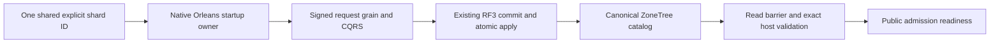

# Physical shard catalog foundation

Status: accepted implementation contract, 2026-10-05; implementation and
qualification pending. Canonical slice: ClusterRouting. Parent:
[ClusterRouting](../ClusterRouting.md). Decision: [ADR-099](../../ADR/ADR-099-physical-shard-catalog.md).
This is a prerequisite of KL-036/037/038/071/072/075, not their completion.

## Authority and exact V1 contracts

The first production catalog describes ONE physical shard backed by the current
three-voter RF3 replica group. Every complete AtomicPartitionId maps to that
default shard; neither replicas nor Orleans activations become shard identities.
PhysicalShardId is a nonempty independently configured/persisted opaque Guid.
Do not derive it from incarnation, voter IDs, endpoint, path, grain or log index.
The canonical catalog is one generated-native record at
KeyCodec.Encode("physical-shard-catalog", "v1") in canonical ZoneTree. Only the
ordinary replicated AtomicCommandCommit writes it. No sidecar/ReplicaStore/local
Database.Bootstrap catalog authority is allowed.

Generated contracts, stable IDs and aliases (feature-local alias constants):

| Type | Fields in ID order | Alias |
|---|---|---|
| PhysicalShardCatalog | 0 Version:int=1; 1 Revision:long; 2 DefaultShard:PhysicalShardRecord | keyload.contract.physical-shard-catalog.v1 |
| PhysicalShardRecord | 0 PhysicalShardId:Guid; 1 Incarnation:Guid; 2 VoterIds:ImmutableArray<string>; 3 PlacementEpoch:long | keyload.contract.physical-shard-record.v1 |
| BootstrapPhysicalShardCatalogRequest | 0 Version:int=1; 1 ExpectedRevision:long=0; 2 PhysicalShardId:Guid; 3 Incarnation:Guid; 4 VoterIds:ImmutableArray<string> | keyload.contract.physical-shard-bootstrap-request.v1 |

Append OperationKind.BootstrapPhysicalShardCatalog without changing old numeric
values. It is a persisted-cluster-administrator-only native command routed via
the existing CatalogPartition. It uses the existing signed request, separate
IRequestGrain, native CQRS stream, command grain, coordinator, quorum and ordered
atomic apply path. Core uses the existing operation/authorization/dispatcher
switches and prepared mutations, never a parallel dispatcher or direct startup
write. ReadPhysicalShardCatalog(principalId) reads current persisted-admin policy
and the native catalog inside one store gate. Missing is NotFound; malformed
stored version/identity/count/epochs are Corruption, without raw diagnostics.
VoterIds retain the exact ordered native `ReplicaConfiguration.VoterIds` strings with ordinal identity; do not derive replacement Guid identities. Each identity must be non-null, non-whitespace and at most512 UTF-8 bytes; duplicates are compared ordinally. Validate these limits before native encoding/retention, and classify malformed persisted identities as Corruption. PhysicalShardId and incarnation remain independent Guid values. These new catalog contracts are unreleased; existing replica identities and payloads are unchanged.

Values are bounded to8192 encoded bytes. Public HTTP/MCP catalog endpoints and
placement-mutating commands are outside this foundation stage.

New bootstrap requires ExpectedRevision=0, nonempty unique IDs, nonempty
incarnation and the exact ordered configured voter IDs. Production requires3;
the explicitly selected native comparison topology may use1/2 under ADR-034.
An absent row atomically creates revision1 and placement epoch1. An exact
existing tuple at revision1/epoch1 is idempotent success; a conflicting tuple or
expected revision fails Conflict without mutation. Other versions/shapes fail
Validation. Future placement CAS must check revision and affected epoch and
advance both monotonically with checked overflow; no such mutation is enabled
until its fenced movement/lineage contract is accepted and qualified.

Bootstrap command ID is the first16 bytes of SHA256 over ASCII
`KeyLoad.PhysicalShardCatalog.Bootstrap.v1` followed by one zero byte and the
16 big-endian PhysicalShardId bytes, interpreted as a big-endian Guid.
Freeze independent golden vectors before integration. Same-ID uncertain retries
use the sole shared `PhysicalShardCatalogIdentity.CreateBootstrapCommandId(Guid)`
helper in Abstractions ClusterRouting/Serialization; Server must not duplicate it.
They
reuse byte-identical native payload; each request GUID is fresh. A changed tuple
under that ID conflicts through the existing outcome fingerprint. No unbounded
retry; an unresolved outcome keeps readiness closed and fails startup.

## Startup, fencing and rollout

OrleansNode.StartCoreAsync starts the real silo and publishes its native grain
factory for internal bootstrap. Public execution/readiness remains closed behind
a separate catalog-ready flag. The startup owner checks the existing signed
fixed-peer cohort, authenticates AdminKey against persisted credentials, opens
the existing native request identity context, and uses the same ExecuteCore
path for only the bootstrap command. Public ExecuteAsync requires catalog-ready;
the internal startup seam cannot be selected by an HTTP/MCP caller. After the
native terminal receipt, perform a quorum control read barrier and gated catalog
read, comparing exact configured shard ID/incarnation/ordered voters/epoch1.
Only then open catalog-ready. Public request admission revalidates that tuple
against committed canonical metadata; a mismatch fences admission. Keep logical
grain keys, storage handles, atomic scopes and CommitToken ownership epoch1
unchanged. PlacementEpoch never authorizes comparing different token lineages.

One existing `GrainRequestStreamProtocol.ExecutionLifetime` deadline, created
with the running silo's `TimeProvider` before startup authentication and linked
to the original ApplicationStopping token, bounds authentication, bootstrap,
final quorum barrier/catalog verification and gate publication as one operation.
Each nested request keeps its existing execution deadline, but cannot extend
this outer lifetime. Stop joins the original startup task, native request work
and silo before the PartitionHost closes stores. No detached bootstrap or timeout-as-settlement.
Advance the application request-interface cohort version3 to4 before enabling
this new native command; peer-envelope/data frame versions stay unchanged.
Require homogeneous cold rollout and preserve authenticated mixed-version
rejection. No running-store conversion or runtime legacy fallback is authorized.

The shared private Aspire profile is V2 with exactly Version=2, PhysicalShardId,
Incarnation, SigningKey, PeerSecret and AdminKey. Creation persists one fresh
shard ID once and supplies it identically to every configured voter. Existing
four-field profiles require an explicit offline upgrade with all original
credentials/incarnation and permissions preserved, a verified backup and atomic
replacement; normal Open fails old profiles rather than silently rewriting them.
Non-Aspire config must supply the same explicit nonempty ID to every voter.
Backup/restore must preserve matching catalog/profile identity; conflicting
restored identity remains fenced until a separate accepted restore/rebind stage.
Rollback uses the verified pre-stage backup/profile and a homogeneous older
executable; an older binary reading the new row is not assumed compatible.

The AppHost exposes only this explicit offline invocation:
`dotnet run --project src/KeyLoad.AppHost --configuration Release -- --keyload-profile-upgrade-v1-to-v2 --data-root <absolute-data-root>`.
The root names the existing directory containing `local-profile.json`. Before
invocation, an operator must stop every KeyLoad/AppHost process that could use
that root and ensure no other process can modify it; the profile is not an
exclusive-use lock and the command does not infer quiescence from reading it.
Dispatch occurs before Aspire builder creation and accepts only the exact flag,
`--data-root`, and one absolute path. Missing, malformed, mixed or extra command
arguments fail closed without starting topology. The command calls the existing
offline converter only; normal AppHost startup and `Open` never convert. Output
is fixed non-secret text and does not include credentials or the generated
PhysicalShardId. This command is intended for disposable operator-controlled
data and is not run on user data as part of qualification.

## Accepted interface3→4 RF3 evidence stage (TASK-SCAT-IFACE34)

The prior executable is pinned to commit `1e8833c027cf232e35fe012cd3eed41c61a17f89`, the committed/pushed `main` source immediately before SCAT joins. Its protocol facts are application request alias `keyload.request.v2`, interface version3, ZoneTree data epoch7, and peer envelope3. Original CI run `37292025093`, attempt1, retained artifact `docker-rf3-image-evidence` ID `11340156317` (9,812,717 bytes); its original server image manifest digest is `sha256:93a7080a433f94c2fcaf4fd875faab9026f2cf087e9bbc3428b2373e3992f5cd` and config digest is `sha256:ecb43e7f69de038f30a7280d88739649a6ddf8a1edcc0b424cd1121be940427e`. Preserve that original artifact unchanged. It proves the prior source/image build provenance only; its local-registry reference is not assumed available, and that run did not qualify RF3 runtime. Each later Linux `docker-rf3` job must independently archive the frozen commit, build and inspect a fresh prior image in its owned registry, and retain a new run-bound receipt, archive, inventory, manifest and digest. The source3 producer identity is the current real workflow run; it is separate from the fixed prior source revision.

The prior-image receipt must independently bind the exact source commit/tree/archive/inventory, zero overlays, pinned SDK/runtime bases, actual image config and original registry manifest/digest, with protocol profile `{ dataEpoch: 7, requestInterfaceAlias: "keyload.request.v2", requestInterfaceVersion: 3, peerEnvelopeVersion: 3 }`. Current v4 references continue to use the existing current-source image proof. Before any cohort starts, inspect every actual Aspire node image against its corresponding verified prior3 or current4 receipt. Do not reuse Native5 or RPC1 image proofs as interface3 evidence.

All stages use a unique test-owned temporary root and a profile created once by the current AppHost. The V2 profile ID, credentials and incarnation are byte-identical across the interface3 and interface4 waves. The older Server3 image does not parse the AppHost profile file; passing it this test-owned V2 profile through current AppHost configuration does not prove that Server3 originally created or reopened a V2 profile, nor does it prove compatibility with an original V1 profile. V1→V2 conversion is tested only by the explicit offline converter on disposable test-owned bytes with a verified pre-conversion backup; it is never run on user data.

The automated stage runs in this order:

1. Start a homogeneous three-node interface3 wave from clean test data using three identical verified prior3 references. Exercise the declared real SDK/official MCP baseline workload and capture its actual receipts/results, profile bytes and stopped per-node storage inventories. Stop and join the complete AppHost wave before copying or inspecting storage.
2. Verify independent copies of that pre-upgrade profile/data into separate upgrade, mixed and rollback roots. Keep the original and rollback-source inventory immutable. Start all three interface4 images on the upgrade copy as a cold homogeneous cohort. Require all three actual `/health/ready` endpoints and caller-visible preserved state; prove the committed catalog through the native offline test oracle after orderly stop, comparing exact PhysicalShardId, incarnation, ordered configured voter IDs, revision1 and placement epoch1.
3. On the separate untouched pre-upgrade copy, start one interface4 image and two interface3 images with the same explicit profile identity and the actual three-voter AppHost model. Through the actual interface4 voter, prove authenticated signed discovery of interface3, closed `/health/ready` and rejected SDK admission. The source backup must remain byte-identical. Do not claim the older interface3 majority is fenced; do not allow interface3 to open stores containing the new catalog. Stop and join every mixed resource before checking test-owned storage.
4. Roll back only by restoring the independently verified pre-upgrade copy and starting three interface3 images homogeneously. Verify the preserved baseline workload and original profile/inventory witnesses. This is restore-before-catalog rollback, not compatibility of interface3 with interface4 catalog bytes and not rollback of writes accepted by interface4.

The image/cohort test never assumes the original run's registry persists, never mutates the retained source report, and never presents a copied image receipt as runtime evidence. Any missing prior image receipt, manifest mismatch, image-model mismatch, failed resource start, unavailable authenticated interface observation, readiness uncertainty or cleanup error fails the cohort and retains the owned evidence/root.

## Requirements, acceptance and ordered ownership

| Requirement | Acceptance and automated mapping |
|---|---|
| REQ-SCAT-001: one native committed catalog authority | AC-SCAT-001: actual TestDatabase/ZoneTree bootstrap creates exactly rev1/epoch1 with native roundtrip/reopen and unchanged existing records; same tuple/different request and same-ID retry preserve result/effects; conflicting ID/incarnation/voters/revision and non-admin fail without changes. PhysicalShardCatalogTests and native payload tests. |
| REQ-SCAT-002: stable identity and finite validation | AC-SCAT-002: independent ID/command golden vectors; reject empty/default/duplicate/out-of-bound voter shapes and versions before retention; one production RF3 shard plus explicit comparison count; encoded bound, corrupt persisted row, unchanged token/atomic IDs. PhysicalShardCatalogValidationTests. Native null reference elements fail Corruption before native operation admission; the public JSON normalization path retains its owning Validation result. Corrupt persisted fixtures use the official generated writer and raw canonical key insertion, rather than the strict valid-record writer. |
| REQ-SCAT-003: native startup and current host fence | AC-SCAT-003: actual Aspire RF3 SDK/official MCP starts only after all three voters observe the same quorum-committed catalog; cancellation/unknown retry/restart and conflicting config retain closed readiness and cleanup; genuine mismatch denies admission, no sidecar authority. PhysicalShardCatalogRf3Tests. |
| REQ-SCAT-004: explicit config/cohort lifecycle | AC-SCAT-004: new V2 profile stable across reopen; strict old-profile rejection and explicit offline upgrade preserve secrets/permissions; exact CLI-only offline conversion of a real disposable legacy profile preserves verified backup and exits before Aspire composition (`ClusterProfileUpgradeCommandTests`); exact-source homogeneous interface3→4 cold upgrade, authenticated mixed3/4 fencing on the v4 voter, and rollback by restoring a verified untouched pre-upgrade copy. Real image/cohort RF3 tests. |

`Interface3ServerSourceTests` calls the actual pinned interface3 Git archive/export and proof-module ESM import through the Aspire-owned Unit TUnit child: it revalidates actual repository versus extracted no-`.git` workspaces, validates returned source/protocol metadata, and proves retained archive/inventory bytes remain unchanged through revalidation and owned cleanup. This source/export mechanism test is not image or cohort qualification.

1. Root freezes this feature/ADR, shared enums/protocol/config joins, prior source
   identity and exact packet ownership. partition_pages Luna/high privately owns
   new Abstractions ClusterRouting Contracts and Core ClusterRouting
   Contracts/Commands/Queries/Validation files plus focused Unit ClusterRouting
   Cases against real native state. Existing shared operation/authorization
   switches remain root joins.
2. dependency_closeout Luna/high privately owns AppHost ClusterReplication
   Models/Configuration and shared ClusterResources PhysicalShardId propagation,
   strict V2 profile/offline-upgrade regressions, new
   scripts/Features/ClusterRouting/interface3-server-source.mjs,
   interface3-server-proof.mjs, prepare-interface3-server-image.mjs and
   verify-interface3-server-image.mjs, and new
   tests/KeyLoad.IntegrationTests/Features/ClusterRouting/Helpers/RequestCqrsRf3Interface3ImageProof.cs.
   Root owns scripts/Features/ClusterRouting/AGENTS.md, the prior image producer/CI
   environment, AppHost image-mode, shared RequestCqrs image/wave startup joins
   and Server NodeOptions/protocol-v4 joins. Root owns CLI join and config
   migration approval at actual execution time; do not upgrade user data.
3. lifecycle_wave Luna/high privately owns Server ClusterRouting startup/fence
   helpers and precise OrleansNode/readiness joins after the Core contract is
   frozen. Root joins native enum/codec/command-grain routing and version4, then
   assigns independent real RF3 tests once callable seams exist.
4. partition_pages Luna/high owns only NEW RF3 Cases/Assertions/Helpers for the
   interface3→4 homogeneous, mixed and restore-only rollback oracles, using the
   shared profile and image-proof/wave seams. Root reviews every hash-bound diff,
   runs strict whole Release/format/governance, Aspire unit/scalar/recovery and
   real RF3 with original Linux SHA/artifacts,
   updates traceability and commits all scope. Partial/local passes cannot close
   movement, distributed execution, token lineage or scale benchmarks.

Frontend is N/A: internal database ownership metadata. Split/merge, assignment
maps, copy/tail/switch, multi-group execution and token translation are excluded
from this initial accepted contract and retain their original required gates.

## Authenticated mixed-cohort observation contract (REQ-SCAT-005)

The mixed interface3/4 acceptance has a server-side evidence obligation. A direct
response observed by the test client proves only what a remote voter said about
itself; it does not prove that the interface4 node authenticated, decoded and
accepted the exact fixed-peer identity before applying its compatibility fence.
AC-SCAT-005 is satisfied only by records captured synchronously in the original
`ReplicaCohortDiscovery` result path, after `ReplicaDiscoveryExchange` has verified
the signature over the exact bounded native response bytes and
`ReplicaDiscoveryIdentity` has validated voter ID, cluster ID, incarnation and
canonical silo address. The production discovery result and compatibility
calculation remain the sole authority.

The seam is internal and test-only. With no sink configured, discovery behavior
is unchanged. The existing strict probe configuration gains one exact private
`DiscoveryCaptureMode` setting: missing or `disabled` is the default; only the
SCAT mixed-cohort fixture may set `mixed-interface3-v1`. Unknown, malformed or
inconsistent settings fail strict validation. The default mode preserves all
existing same-image requirements and rejects every protocol-cohort override. The
mixed mode is accepted only when the private probe is enabled with a valid
test-owned session/root, the real fixed three-voter RF3 topology is selected, and
the complete configured image model is exactly node1=current4, node2=node3=prior3
(the two prior references must be ordinal-identical; node1 must differ). It rejects
missing/unknown voters, other image shapes including three distinct refs, benchmark
node counts and every non-ephemeral/non-cohort configuration. Before Aspire
`StartAsync`, the integration owner independently verifies the current4 and prior3
digest-bound image receipts and the exact per-node image model; AppHost validates
shape only and is not treated as receipt authority. The mode propagates into node1
only; no mixed observation sink is registered on node2 or node3. Existing request-probe sessions and
all other readiness tests leave capture disabled. The exact mode is passed through
the strict AppHost profile validator and only into node1’s container environment;
nodes2/3 receive no capture mode and the prior3 images have no observer
implementation. Only mixed-mode node1 registers the internal sink; it must not add a public API, HTTP
endpoint, peer wire field, discovery client or alternate compatibility path.
For an incompatible result, the callback runs inline before it is cached/returned,
receives the exact cancellation token used by the native attempt (already linked
to the original startup/request token and its existing attempt timeout), and is
awaited before startup admission proceeds. It creates no new timer, token source,
detached task or widened deadline. The native transport try/catch that translates
its own timeout/cancellation to unavailable must end before callback invocation;
callback cancellation or write failure propagates as an observed probe failure.
The exchange gate still releases in its existing `finally`. The callback receives
only the validated observation’s safe fields.

Only the first authenticated, identity-validated observation whose production
`ProtocolCompatible` value is false is recorded for each configured remote peer.
Compatible observations are not synthesized into or substituted for this evidence.
The v1 private record has these exact typed fields: `Version:int=1`,
`Kind:string` equal to the fixed observation-kind constant, the existing opaque
probe `SessionId:string`, local `ObserverVoterId:string`, remote
`PeerVoterId:string`, `ApplicationRpcVersion:int`, `PeerEnvelopeVersion:int`,
`TransportReady:bool` and `ProtocolCompatible:bool`. JSON field names match these
property names exactly. Both voter IDs must exactly match the existing configured
voter strings using ordinal comparison;
the observer must be local and the peer must be one of the two configured remote
voters. Do not record the silo address, raw response/body, signature, nonce,
secrets, payloads, exception text or user data. One immutable record per remote
voter is retained, with at most two records for a production RF3 process. An
exact duplicate is idempotent. A later observation
with the same validated peer identity, RPC/envelope versions and incompatible
status but a different `TransportReady` value leaves the first record unchanged
and is accepted; readiness can change over time and is reported as captured. A conflicting peer identity, RPC/envelope version, or incompatible-status value;
an unknown peer, malformed record or limit violation is an observed probe failure. The writer never forces
`TransportReady` to true or derives it from HTTP success.

The new records use exactly `discovery-00.json` and `discovery-01.json` as fixed
slots in the current private probe root, not peer-derived path text. Extend the
existing strict JSON codec and known-file whitelist and inventory validator for the versioned record; retain private file
mode, atomic creation, owner/session binding and no-symlink checks. Each record
is at most the existing 8,192-byte record bound, and counts against the existing
400-file and 1,048,576-byte aggregate limits. The dedicated observation count is
also independently capped at two. The integration oracle requires both slots and rejects missing, duplicate, extra,
malformed, unknown-peer and over-bound records; no parser silently skips a failed
record. Keep the existing bounded private root and existing cleanup
owner. A failed/terminal server process must not delete its evidence. Tests read
only after Aspire has stopped and joined all resources; on failure, retain the
owned root for diagnosis, and delete it only after a successful joined cleanup.

A sink or filesystem write failure while probing must remain an explicit observed
test-startup failure; it must not be swallowed or translated to unavailable
transport, compatibility rejection, authorization denial or successful
observation. It cannot grant admission or alter the validated result. The probe
is disabled outside the owned test fixture and never participates in persisted
authorization, recovery, compatibility or readiness decisions.

For the mixed cohort, require the actual interface4 observer record to name each
of its two fixed remote voters exactly once and report app RPC3, peer envelope3
and protocol incompatible. Preserve and report the actual `TransportReady` value
without requiring either true or false. Also require the separately frozen closed
readiness and real SDK admission-denial assertions. Do not infer observer
behavior from direct signed responses made to the test client; do not claim the
older interface3 majority is fenced. If startup becomes terminal, capture the
records from the test-owned root after joined process cleanup rather than
attempting to read a dead HTTP endpoint.

### AppHost admission for the SCAT observation mode

`DiscoveryCaptureMode=mixed-interface3-v1` is a narrow extension of the existing
private probe profile, not a general permission to combine probes and protocol
image overrides. The AppHost profile parser keeps its current default behavior:
all same-image checks remain and any protocol-cohort override is rejected when
capture is disabled. For the mixed value, it accepts only the ephemeral fixed
three-voter model with explicit node1/node2/node3 entries, equal node2 and node3
image references, and a different node1 reference. Unknown voters, missing or
extra entries, three distinct images, malformed or unknown modes, disabled probe
residue, benchmarks, non-ephemeral profiles and an unselected cohort all fail
closed. The caller separately verifies digest-bound current4 and prior3 receipts
for the exact map before `DistributedApplication.StartAsync`; AppHost shape checks
are not image provenance. The mixed capture setting is injected only into node1;
node2/node3 receive the unchanged request-probe settings with capture disabled.

This mode is enabled only on the actual mixed-cohort scenario through its existing
private request-probe fixture. Probe session/root ownership, strict private file
permissions and after-stop/join cleanup remain unchanged. No topology is replaced
or degraded, and no data/membership fallback is allowed. The AppHost admission
unit cases prove default-mode same-image/cohort rejection, exact mixed-shape
admission, malformed mode rejection and rejection of every neighboring image or
topology shape. Server unit cases cover mode default/strict admission, actual
private record codec/session/peer bounds and duplicate handling. The real interface34 integration case verifies image receipts
before start, invokes the actual private probe, stops/joins its entire Aspire
wave, and only then reads and validates the interface4 observer records.

| Requirement | Acceptance criterion |
|---|---|
| REQ-SCAT-005: establish mixed-cohort evidence at the newer observer | AC-SCAT-005: in the real mixed3/4 Aspire cohort, only node1 uses the explicitly enabled private probe mode with the digest-bound image model node1=current4 and node2=node3=prior3. After independently verifying current/prior image receipts and before any resource starts, its probe contains the first validated protocol-incompatible observation for each exact remote voter ID, app RPC3, peer envelope3 and `ProtocolCompatible=false`. `TransportReady` is recorded truthfully but either value is accepted; the separately observed closed readiness and SDK admission fence remain required. Direct authenticated responses from older voters do not satisfy this criterion. |

# SCAT-005 mixed-node1 observable amendment

For mixed node1 interface4 startup, keep the observation sink validation and post-wave evidence read unchanged. Before the same wave is stopped, make one unique, admin-authorized new-document write attempt through the real .NET SDK and official MCP client and evaluate node1's actual observed state:

- If readiness returns HTTP 503, require SDK `OwnershipLost` and official MCP `OwnershipLost` with `dispatched: false` (or its actual HTTP 503 admission rejection).
- If readiness fails with an `HttpRequestException` with no HTTP status, require Aspire to report node1 as `Exited`, `FailedToStart`, or `Finished`; require the SDK to report `UnknownWriteOutcome` and official MCP connection failure with no HTTP status. Do not call a dead endpoint a 503 response.
- Any other readiness status, client response, missing terminal state, or cleanup error fails the case.

After the wave runner has stopped and joined all Aspire resources, open each actual mixed-copy node store sequentially with the existing `NodeEpochRf3OfflineOptions`, `PartitionHost`, persisted `AuthorizationPolicy`, `CommandAdmissionGovernor`, native ZoneTree storage, system clock, and native logger. Query the attempted unique `EntityRef` as the persisted administrator and require it to be absent on every voter. Dispose each host before opening the next store. This proves the denied/uncertain attempted write did not commit, without assuming the result based only on a client error.

The case still independently verifies digest-pinned current4/prior3 image receipts before wave start, reads exactly the two node1 private native-authenticated records only after runner stop/join, and requires observer node1, exact configured node2/node3 IDs, versions3/3 and `ProtocolCompatible=false`, retaining each truthful `TransportReady` value. The existing `RequestCqrsRf3Epoch7WaveRunner` and wave cleanup remain the resource owners. Evidence stays intact on any failure; delete its private owner tree only after successful typed-record, readiness/admission, no-write, and wave-cleanup assertions.

Ownership is only new `PhysicalShardCatalogInterface34` assertion/oracle helpers and its existing mixed runner wiring, plus the explicitly approved two-name private probe file allowlist/quota/cleanup extension. This is a test-owned assertion seam only: no Server startup or compatibility changes, no public endpoint, no fake provider, no shared runner changes, no timeout enlargement, and no claim that older interface3 nodes are fenced.

### Exact mixed-mode native startup observation

Only when the explicit private fixture has CaptureDiscovery=true and the verified node1=current4/node2=node3=prior3 image model is selected, the shared wave may transfer ownership after node1 reaches actual Running, Exited, FailedToStart or Finished; nodes2/3 still require actual Running. All other existing waves keep their existing healthy/Running rules. This transfer permits the frozen live503 or statusless terminal denial assertions to observe the original process; it does not establish readiness or success. Preserve the original single wave deadline, original cancellation and full stop/join ownership. Root owns the role-local RequestCqrsRf3WaveArguments argument helper and startup readiness seam.

Root integration keeps probe record emission in Execution/RequestCqrsProbeDiscoveryObservation.cs, native path/permission checks in Validation/RequestCqrsProbePaths.cs, and serialized inventory reads in RequestCqrsProbeFiles. These role-local extractions preserve callback order, the original native attempt token, exact file bounds and strict failure behavior.

### Current native recovery-fixture catalog setup (REQ/AC-SCAT-006)

REQ-SCAT-006 requires current-format positive crash and stored-replication fixtures
to initialize the actual canonical catalog before their first partition operation.
The test-only `KeyLoad.CrashHost/Features/ClusterRouting/Helpers/RecoveryPhysicalShardBootstrap`
uses the existing native bootstrap operation and `DatabaseEngine.Apply` after
persisting the test administrator. It supplies one independently fixed test shard
ID, the actual canonical-store incarnation and the fixture's exact ordered voter
configuration. Reopen reads and validates the persisted tuple instead of replacing
it. The bootstrap's evaluated time is UnixEpoch, so setup cannot advance the
business clock past a scenario's deterministic operations. No direct catalog-key
write, Core fallback, production startup bypass or caller-supplied authority is added.

AC-SCAT-006 maps to the existing real-process document, composition, projection,
messaging, retention, aggregate and snapshot crash cases and the genuinely stored
`ReadRoundProtocolTests` one/two/three-voter cases. They must retain their exact
crash boundaries, committed prefix, receipts, replay and cleanup assertions after
explicit setup. A conflicting persisted tuple must fail setup without rewriting
it. One-process fixture preparation is development/test setup, not RF3 quorum
qualification. Genuine prior native5/native6 source drivers, raw-image upgrade
fixtures and intentionally missing/corrupt-catalog negative controls remain
unchanged. Root owns these fixture joins and the sequential Aspire recovery gate.

TASK-SCAT-VALIDATION-IDENTITY preserves REQ/AC-SCAT-002: independent invalid native bootstrap bodies use independent command GUIDs. Reusing the deterministic shard bootstrap GUID with different bodies tests the mandatory global command-identity Conflict contract, not standalone Validation. Keep exact invalid-list/null/corruption, absent-catalog and unchanged-state assertions and the separate replay/conflict tests. This fixture-only refinement uses existing ADR-099; it changes no product identity or validation ordering.
