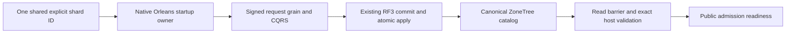

# Physical shard catalog foundation

Status: accepted implementation contract, 2026-10-05; implementation and
qualification pending. Canonical slice: ClusterRouting. Parent:
[ClusterRouting](../ClusterRouting.md). Decision: [ADR-099](../../ADR/ADR-099-physical-shard-catalog.md).
This is a prerequisite of KL-036/037/038/071/072/075, not their completion.

## Authority and exact V1 contracts

The first production catalog describes ONE physical shard backed by the current
three-voter RF3 replica group. Every complete AtomicPartitionId maps to that
default shard; neither replicas nor Orleans activations become shard identities.
PhysicalShardId is a nonempty independently configured/persisted opaque Guid.
Do not derive it from incarnation, voter IDs, endpoint, path, grain or log index.
The canonical catalog is one generated-native record at
KeyCodec.Encode("physical-shard-catalog", "v1") in canonical ZoneTree. Only the
ordinary replicated AtomicCommandCommit writes it. No sidecar/ReplicaStore/local
Database.Bootstrap catalog authority is allowed.

Generated contracts, stable IDs and aliases (feature-local alias constants):

| Type | Fields in ID order | Alias |
|---|---|---|
| PhysicalShardCatalog | 0 Version:int=1; 1 Revision:long; 2 DefaultShard:PhysicalShardRecord | keyload.contract.physical-shard-catalog.v1 |
| PhysicalShardRecord | 0 PhysicalShardId:Guid; 1 Incarnation:Guid; 2 VoterIds:ImmutableArray<string>; 3 PlacementEpoch:long | keyload.contract.physical-shard-record.v1 |
| BootstrapPhysicalShardCatalogRequest | 0 Version:int=1; 1 ExpectedRevision:long=0; 2 PhysicalShardId:Guid; 3 Incarnation:Guid; 4 VoterIds:ImmutableArray<string> | keyload.contract.physical-shard-bootstrap-request.v1 |

Append OperationKind.BootstrapPhysicalShardCatalog without changing current numeric
values. It is a persisted-cluster-administrator-only native command routed via
the existing CatalogPartition. It uses the existing signed request, separate
IRequestGrain, native CQRS stream, command grain, coordinator, quorum and ordered
atomic apply path. Core uses the existing operation/authorization/dispatcher
switches and prepared mutations, never a parallel dispatcher or direct startup
write. ReadPhysicalShardCatalog(principalId) reads current persisted-admin policy
and the native catalog inside one store gate. Missing is NotFound; malformed
stored version/identity/count/epochs are Corruption, without raw diagnostics.
VoterIds retain the exact ordered native `ReplicaConfiguration.VoterIds` strings with ordinal identity; do not derive replacement Guid identities. Each identity must be non-null, non-whitespace and at most512 UTF-8 bytes; duplicates are compared ordinally. Validate these limits before native encoding/retention, and classify malformed persisted identities as Corruption. PhysicalShardId and incarnation remain independent Guid values. These new catalog contracts are unreleased; existing replica identities and payloads are unchanged.

Values are bounded to8192 encoded bytes. Public HTTP/MCP catalog endpoints and
placement-mutating commands are outside this foundation stage.

New bootstrap requires ExpectedRevision=0, nonempty unique IDs, nonempty
incarnation and the exact ordered configured voter IDs. Production requires3;
the explicitly selected native comparison topology may use1/2 under ADR-034.
An absent row atomically creates revision1 and placement epoch1. An exact
existing tuple at revision1/epoch1 is idempotent success; a conflicting tuple or
expected revision fails Conflict without mutation. Other versions/shapes fail
Validation. Future placement CAS must check revision and affected epoch and
advance both monotonically with checked overflow; no such mutation is enabled
until its fenced movement/lineage contract is accepted and qualified.

Bootstrap command ID is the first16 bytes of SHA256 over ASCII
`KeyLoad.PhysicalShardCatalog.Bootstrap.v1` followed by one zero byte and the
16 big-endian PhysicalShardId bytes, interpreted as a big-endian Guid.
Freeze independent golden vectors before integration. Same-ID uncertain retries
use the sole shared `PhysicalShardCatalogIdentity.CreateBootstrapCommandId(Guid)`
helper in Abstractions ClusterRouting/Serialization; Server must not duplicate it.
They
reuse byte-identical native payload; each request GUID is fresh. A changed tuple
under that ID conflicts through the existing outcome fingerprint. No unbounded
retry; an unresolved outcome keeps readiness closed and fails startup.

## Startup, fencing and rollout

OrleansNode.StartCoreAsync starts the real silo and publishes its native grain
factory for internal bootstrap. Public execution/readiness remains closed behind
a separate catalog-ready flag. The startup owner checks the existing signed
fixed-peer cohort, authenticates AdminKey against persisted credentials, opens
the existing native request identity context, and uses the same ExecuteCore
path for only the bootstrap command. Public ExecuteAsync requires catalog-ready;
the internal startup seam cannot be selected by an HTTP/MCP caller. After the
native terminal receipt, perform a quorum control read barrier and gated catalog
read, comparing exact configured shard ID/incarnation/ordered voters/epoch1.
Only then open catalog-ready. Public request admission revalidates that tuple
against committed canonical metadata; a mismatch fences admission. Keep logical
grain keys, storage handles, atomic scopes and CommitToken ownership epoch1
unchanged. PlacementEpoch never authorizes comparing different token lineages.

One existing `GrainRequestStreamProtocol.ExecutionLifetime` deadline, created
with the running silo's `TimeProvider` before startup authentication and linked
to the original ApplicationStopping token, bounds authentication, bootstrap,
final quorum barrier/catalog verification and gate publication as one operation.
Each nested request keeps its existing execution deadline, but cannot extend
this outer lifetime. Stop joins the original startup task, native request work
and silo before the PartitionHost closes stores. No detached bootstrap or timeout-as-settlement.
Startup admits requests using the current application request interface and signed
purposes. The configured RF3 voters must form the current cohort before the
catalog-ready flag opens; unsupported or stale signed purposes fail before
dispatch or consensus admission.

The shared private Aspire profile is exactly the current V2 schema: Version=2,
PhysicalShardId, Incarnation, SigningKey, PeerSecret and AdminKey. Creation
persists one fresh shard ID once and supplies it identically to every configured
voter. Unsupported, malformed or inconsistent configuration fails closed before
resources start; no profile rewrite or conversion is performed. Non-Aspire
configuration supplies the same explicit nonempty ID to every voter. Backup and
restore preserve matching current catalog/profile identity; a conflicting
restored identity remains fenced and follows the current BackupRestore contract.

The real Aspire current-cohort tests create and reopen one current profile,
exercise persisted-admin catalog bootstrap, verify all three voters observe the
same quorum-committed catalog before readiness, and reject invalid configuration
without mutation. The current .NET SDK and official MCP clients verify public
admission and persisted authorization. AppHost owns topology, resources, runner,
endpoints and complete shutdown.

## Requirements, acceptance and ordered ownership

| Requirement | Acceptance and automated mapping |
|---|---|
| REQ-SCAT-001: one native committed catalog authority | AC-SCAT-001: actual TestDatabase/ZoneTree bootstrap creates exactly revision1/epoch1 with native roundtrip/reopen and unchanged existing records; same tuple/different request and same-ID retry preserve result/effects; conflicting ID/incarnation/voters/revision and non-admin fail without changes. PhysicalShardCatalogTests and native payload tests. |
| REQ-SCAT-002: stable identity and finite validation | AC-SCAT-002: independent ID/command golden vectors; reject empty/default/duplicate/out-of-bound voter shapes and unsupported versions before retention; one production RF3 shard plus explicit comparison count; encoded bound, corrupt persisted row, unchanged token/atomic IDs. PhysicalShardCatalogValidationTests. Native null reference elements fail Corruption before native operation admission; public JSON normalization retains its owning Validation result. Corrupt persisted fixtures use the official generated writer and raw canonical key insertion, not the strict valid-record writer. |
| REQ-SCAT-003: native startup and current host fence | AC-SCAT-003: actual Aspire RF3 SDK/official MCP starts only after all three current voters observe the same quorum-committed catalog; cancellation, unknown retry, restart and conflicting configuration retain closed readiness and complete cleanup; genuine identity mismatch denies admission, with no sidecar authority. PhysicalShardCatalogRf3Tests. |
| REQ-SCAT-004: strict current configuration lifecycle | AC-SCAT-004: the current V2 profile is identical across voters and remains stable across reopen; missing, malformed, unsupported-version or conflicting identities fail before resource startup or catalog mutation. Current backup/restore preserves matching catalog/profile authority and conflicting restored identity remains fenced. PhysicalShardCatalogRf3Tests and current BackupRestore integration cases. |

Canonical implementation stages are: freeze the current native catalog and startup
contract; implement generated contracts and same-view read/bootstrap validation;
join Server/Orleans startup fencing and strict AppHost profile admission; add real
ZoneTree and Aspire current-cohort operations; then review the complete patch and
run normal/scalar/recovery plus Docker/Aspire RF3 SDK/MCP gates. Shared operation,
authorization, topology and workflow joins have one root integration owner. Feature
workers own only explicitly released source and test paths. Preserve every current
catalog, permission, cancellation, readiness, retry and cleanup assertion. No
source-only result qualifies the product or a delivery gate.

Frontend is N/A: internal database ownership metadata. Physical movement,
assignment maps, copy/tail/switch, multi-group execution and token translation are
not implemented by this catalog foundation and require their own accepted current
contract and RF3/process-cut qualification. Orleans activation movement must
preserve node-local storage ownership; source registration alone does not qualify
actual forced movement in RF3.

### Current native recovery-fixture catalog setup (REQ/AC-SCAT-006)

REQ-SCAT-006 requires current-format positive crash and stored-replication fixtures
to initialize the actual canonical catalog before their first partition operation.
The test-only `KeyLoad.CrashHost/Features/ClusterRouting/Helpers/RecoveryPhysicalShardBootstrap`
uses the existing native bootstrap operation and `DatabaseEngine.Apply` after
persisting the test administrator. It supplies one independently fixed test shard
ID, the actual canonical-store incarnation and the fixture's exact ordered voter
configuration. Reopen reads and validates the persisted tuple instead of replacing
it. The bootstrap's evaluated time is UnixEpoch, so setup cannot advance the
business clock past a scenario's deterministic operations. No direct catalog-key
write, Core fallback, production startup bypass or caller-supplied authority is added.

AC-SCAT-006 maps to the existing real-process document, composition, projection,
messaging, retention, aggregate and snapshot crash cases and the genuinely stored
`ReadRoundProtocolTests` one/two/three-voter cases. They must retain their exact
crash boundaries, committed prefix, receipts, replay and cleanup assertions after
explicit setup. A conflicting persisted tuple must fail setup without rewriting
it. One-process fixture preparation is development/test setup, not RF3 quorum
qualification. Current-format positive recovery fixtures and intentionally missing/corrupt-catalog negative controls remain unchanged. Root owns these fixture joins and the sequential Aspire recovery gate.

TASK-SCAT-VALIDATION-IDENTITY preserves REQ/AC-SCAT-002: independent invalid native bootstrap bodies use independent command GUIDs. Reusing the deterministic shard bootstrap GUID with different bodies tests the mandatory global command-identity Conflict contract, not standalone Validation. Keep exact invalid-list/null/corruption, absent-catalog and unchanged-state assertions and the separate replay/conflict tests. This fixture-only refinement uses existing ADR-099; it changes no product identity or validation ordering.
# TASK-SCAT-RF3-MISMATCH-SURVIVOR-READINESS (2026-10-07)

AC-SCAT-003's mismatched-voter flow starts a wave without requiring every voter
to be healthy, because the conflicting voter must remain fenced. Before its
unchanged public readiness assertions, the fixture must await native Aspire
health for node1 and node2 using the existing parent cancellation/deadline.
Docker Running alone does not prove that an HTTP request can be admitted.
Preserve exact survivor HTTP200, conflicting-voter HTTP503 or observed terminal
process denial, denied SDK/MCP write and complete post-correction state checks.
Root owns the two native waits in
`tests/KeyLoad.IntegrationTests/Features/ClusterRouting/Assertions/PhysicalShardCatalogRf3MismatchAssertions.cs`
and actual owned RF3 verification. No server policy, topology, timeout, retry,
assertion or image provenance contract changes; ADR-099 remains the governing
architecture. The original R197 flow failed at node1's first HTTP request with
ResponseEnded before testing the conflicting voter. The revised flow remains
unqualified until its actual native case completes.

R204 reached the corrected-wave SDK/MCP state checks after the native survivor
health join, conflicting-voter denial and preserved seed receipt. The last
all-voter assertion incorrectly expected McpDocumentProtocol.InitialJson, which
belongs to a separate Unicode CRUD fixture. This wave actually seeds
RequestCqrsRf3Workload.InitialDocuments[0]. Root must compare against that exact
independent original write input for document-00 on every voter, never derive
expected text from recovered data or relax byte equality/revision/absence
assertions. Remove the now-unused DocumentStorage import in the mismatch case.
The standalone Unicode/restart flow remains unchanged and passed in R203.

R206 completed `AcScat003OneVoterWithConflictingShardIdentityStaysFencedAndDeniesAdmission`
through actual native TUnit and fixture-owned Aspire Docker RF3 on2026-10-07.
It passed the survivor health/readiness, conflicting-voter admission denial,
unchanged seed/denied-write absence and corrected-wave exact SDK/MCP results.
The shared two-case run passed2/2 with no skips or source/assembly drift; its
original TRX SHA-256 is
`6b915c662396baa4f25d09e2f3d64b7ff435d07338f3c03ae4e3bab942a62f6f`.
R205 full native Release build passed with zero warnings/errors or source drift.
This qualifies the local fixture correction; complete current-source Linux RF3
and the remaining physical-shard acceptance gates remain open.
