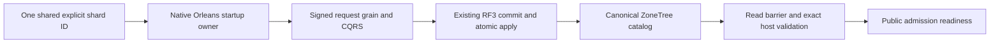

# Physical shard catalog foundation

Status: accepted implementation contract, 2026-10-05; implementation and
qualification pending. Canonical slice: ClusterRouting. Parent:
[ClusterRouting](../ClusterRouting.md). Decision: [ADR-099](../../ADR/ADR-099-physical-shard-catalog.md).
This is a prerequisite of KL-036/037/038/071/072/075, not their completion.

## Authority and exact V1 contracts

The first production catalog describes ONE physical shard backed by the current
three-voter RF3 replica group. Every complete AtomicPartitionId maps to that
default shard; neither replicas nor Orleans activations become shard identities.
PhysicalShardId is a nonempty independently configured/persisted opaque Guid.
Do not derive it from incarnation, voter IDs, endpoint, path, grain or log index.
The canonical catalog is one generated-native record at
KeyCodec.Encode("physical-shard-catalog", "v1") in canonical ZoneTree. Only the
ordinary replicated AtomicCommandCommit writes it. No sidecar/ReplicaStore/local
Database.Bootstrap catalog authority is allowed.

Generated contracts, stable IDs and aliases (feature-local alias constants):

| Type | Fields in ID order | Alias |
|---|---|---|
| PhysicalShardCatalog | 0 Version:int=1; 1 Revision:long; 2 DefaultShard:PhysicalShardRecord | keyload.contract.physical-shard-catalog.v1 |
| PhysicalShardRecord | 0 PhysicalShardId:Guid; 1 Incarnation:Guid; 2 VoterIds:ImmutableArray<Guid>; 3 PlacementEpoch:long | keyload.contract.physical-shard-record.v1 |
| BootstrapPhysicalShardCatalogRequest | 0 Version:int=1; 1 ExpectedRevision:long=0; 2 PhysicalShardId:Guid; 3 Incarnation:Guid; 4 VoterIds:ImmutableArray<Guid> | keyload.contract.physical-shard-bootstrap-request.v1 |

Append OperationKind.BootstrapPhysicalShardCatalog without changing old numeric
values. It is a persisted-cluster-administrator-only native command routed via
the existing CatalogPartition. It uses the existing signed request, separate
IRequestGrain, native CQRS stream, command grain, coordinator, quorum and ordered
atomic apply path. Core uses the existing operation/authorization/dispatcher
switches and prepared mutations, never a parallel dispatcher or direct startup
write. ReadPhysicalShardCatalog(principalId) reads current persisted-admin policy
and the native catalog inside one store gate. Missing is NotFound; malformed
stored version/identity/count/epochs are Corruption, without raw diagnostics.
Values are bounded to8192 encoded bytes. Public HTTP/MCP catalog endpoints and
placement-mutating commands are outside this foundation stage.

New bootstrap requires ExpectedRevision=0, nonempty unique IDs, nonempty
incarnation and the exact ordered configured voter IDs. Production requires3;
the explicitly selected native comparison topology may use1/2 under ADR-034.
An absent row atomically creates revision1 and placement epoch1. An exact
existing tuple at revision1/epoch1 is idempotent success; a conflicting tuple or
expected revision fails Conflict without mutation. Other versions/shapes fail
Validation. Future placement CAS must check revision and affected epoch and
advance both monotonically with checked overflow; no such mutation is enabled
until its fenced movement/lineage contract is accepted and qualified.

Bootstrap command ID is the first16 bytes of SHA256 over ASCII
`KeyLoad.PhysicalShardCatalog.Bootstrap.v1` followed by one zero byte and the
16 big-endian PhysicalShardId bytes, interpreted as a big-endian Guid.
Freeze independent golden vectors before integration. Same-ID uncertain retries
use the sole shared `PhysicalShardCatalogIdentity.CreateBootstrapCommandId(Guid)`
helper in Abstractions ClusterRouting/Serialization; Server must not duplicate it.
They
reuse byte-identical native payload; each request GUID is fresh. A changed tuple
under that ID conflicts through the existing outcome fingerprint. No unbounded
retry; an unresolved outcome keeps readiness closed and fails startup.

## Startup, fencing and rollout

OrleansNode.StartCoreAsync starts the real silo and publishes its native grain
factory for internal bootstrap. Public execution/readiness remains closed behind
a separate catalog-ready flag. The startup owner checks the existing signed
fixed-peer cohort, authenticates AdminKey against persisted credentials, opens
the existing native request identity context, and uses the same ExecuteCore
path for only the bootstrap command. Public ExecuteAsync requires catalog-ready;
the internal startup seam cannot be selected by an HTTP/MCP caller. After the
native terminal receipt, perform a quorum control read barrier and gated catalog
read, comparing exact configured shard ID/incarnation/ordered voters/epoch1.
Only then open catalog-ready. Public request admission revalidates that tuple
against committed canonical metadata; a mismatch fences admission. Keep logical
grain keys, storage handles, atomic scopes and CommitToken ownership epoch1
unchanged. PlacementEpoch never authorizes comparing different token lineages.

Startup uses the existing execution deadline and ApplicationStopping token.
Stop joins its original startup task, native request work and silo before the
PartitionHost closes stores. No detached bootstrap or timeout-as-settlement.
Advance the application request-interface cohort version3 to4 before enabling
this new native command; peer-envelope/data frame versions stay unchanged.
Require homogeneous cold rollout and preserve authenticated mixed-version
rejection. No running-store conversion or runtime legacy fallback is authorized.

The shared private Aspire profile is V2 with exactly Version=2, PhysicalShardId,
Incarnation, SigningKey, PeerSecret and AdminKey. Creation persists one fresh
shard ID once and supplies it identically to every configured voter. Existing
four-field profiles require an explicit offline upgrade with all original
credentials/incarnation and permissions preserved, a verified backup and atomic
replacement; normal Open fails old profiles rather than silently rewriting them.
Non-Aspire config must supply the same explicit nonempty ID to every voter.
Backup/restore must preserve matching catalog/profile identity; conflicting
restored identity remains fenced until a separate accepted restore/rebind stage.
Rollback uses the verified pre-stage backup/profile and a homogeneous older
executable; an older binary reading the new row is not assumed compatible.

## Requirements, acceptance and ordered ownership

| Requirement | Acceptance and automated mapping |
|---|---|
| REQ-SCAT-001: one native committed catalog authority | AC-SCAT-001: actual TestDatabase/ZoneTree bootstrap creates exactly rev1/epoch1 with native roundtrip/reopen and unchanged existing records; same tuple/different request and same-ID retry preserve result/effects; conflicting ID/incarnation/voters/revision and non-admin fail without changes. PhysicalShardCatalogTests and native payload tests. |
| REQ-SCAT-002: stable identity and finite validation | AC-SCAT-002: independent ID/command golden vectors; reject empty/default/duplicate/out-of-bound voter shapes and versions before retention; one production RF3 shard plus explicit comparison count; encoded bound, corrupt persisted row, unchanged token/atomic IDs. PhysicalShardCatalogValidationTests. |
| REQ-SCAT-003: native startup and current host fence | AC-SCAT-003: actual Aspire RF3 SDK/official MCP starts only after all three voters observe the same quorum-committed catalog; cancellation/unknown retry/restart and conflicting config retain closed readiness and cleanup; genuine mismatch denies admission, no sidecar authority. PhysicalShardCatalogRf3Tests. |
| REQ-SCAT-004: explicit config/cohort lifecycle | AC-SCAT-004: new V2 profile stable across reopen; strict old-profile rejection and explicit offline upgrade preserve secrets/permissions; cold homogeneous4 and authenticated mixed3/4 rejection, backup/restore/rollback original artifacts. ClusterProfile and real image/cohort tests. |

1. Root freezes this feature/ADR, shared enums/protocol/config joins and exact
   packet ownership. partition_pages Luna/high privately owns new Abstractions
   ClusterRouting Contracts and Core ClusterRouting Contracts/Commands/Queries/
   Validation files plus focused Unit ClusterRouting Cases against real native
   state. Existing shared operation/authorization switches remain root joins.
2. dependency_closeout Luna/high privately owns AppHost ClusterReplication
   Models/Configuration and shared ClusterResources PhysicalShardId propagation,
   strict V2 profile/offline-upgrade regressions. Root owns CLI join and config
   migration approval at actual execution time; do not upgrade user data now.
3. lifecycle_wave Luna/high privately owns Server ClusterRouting startup/fence
   helpers and precise OrleansNode/readiness joins after the Core contract is
   frozen. Root joins native enum/codec/command-grain routing and version4, then
   assigns independent real RF3 tests once callable seams exist.
4. Root reviews every hash-bound diff, runs strict whole Release/format/governance,
   Aspire unit/scalar/recovery and real RF3 with original Linux SHA/artifacts,
   updates traceability and commits all scope. Partial/local passes cannot close
   movement, distributed execution, token lineage or scale benchmarks.

Frontend is N/A: internal database ownership metadata. Split/merge, assignment
maps, copy/tail/switch, multi-group execution and token translation are excluded
from this initial accepted contract and retain their original required gates.

