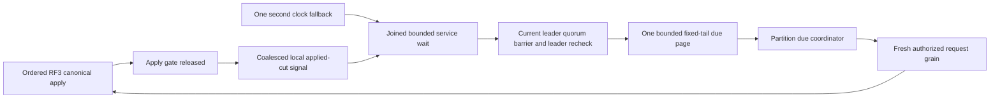

# ClusterRouting: native runtime adoption

Date: 2026-10-06. Status: implementation in progress under the owner's approval
of the capability review. Decision: [ADR-110](../../ADR/ADR-110-native-orleans-execution-primitives.md).
The owning [ExecutionPrimitives](ExecutionPrimitives.md) remains the REQ/AC inventory.

## Scope and primitive selection

Adopt concrete native mechanisms only where the reviewed production path needs
their guarantees. Preserve the unique authenticated request grain, fresh persisted
authorization, node-local ZoneTree handles, ordered apply and RF3 receipts.
Frontend and new public SDK/MCP schemas are N/A for the first runtime stages;
existing public commands, queries and inspection qualify their outcomes.

The first independent stage improves the existing native per-silo due service
using a coalesced local post-apply wake. The known partition coordinator still
uses reliable awaited RPC. A new memory stream or broadcast trampoline would
add queues/activations without a new delivery requirement: native broadcast does
not automatically target every silo-local service, and memory-stream cache rewind
is not durable restart replay. Persistent Streams remain their own provider,
subscription/outbox and actual-consumer workstream; no generic dispatcher is added.

## Accepted due-service contract: REQ/AC-ORL-011

Expose cancellation-aware waiting for a changed applied position from the actual
ReplicaMaterializer through ReplicaConsensus. Check the current cut and register
against its coalesced signal under the same synchronous Lock; do not invoke
callbacks/network calls while holding applyGate or a borrowed read view.
Publication remains after ordered canonical apply and after applyGate release.
Waiting is disposable and holds no store handle or data payload.

RecurringDueGrainService waits for an apply change or its existing one-second
TimeProvider clock fallback. A fixed 500ms minimum cycle cadence admits at most
two scan pages per second, one page (at most32 hints) and one dispatch at a time.
Coalesce writes rather than starting a scan/task per commit. Preserve the fixed
upper-bound, alternating prefix sweep cursor; reset only on its existing store
incarnation/read-generation contract, never on each write. The current leader
check, quorum ReadBarrier and second leader check precede all due discovery.
The coordinator reloads the persisted creator and routes every effect through a
fresh signed GUID IRequestGrain and the existing native CQRS consumer.

Every wait and losing clock/apply branch is canceled and joined before the next
cycle or Stop completes. Store shutdown invalidates/wakes waits safely; caller
cancellation does not cancel the shared signal or authorize work. Future due times
still progress with no new writes. Startup transport/membership order and physical
cleanup barriers stay unchanged. The cadence is an explicit resource bound, not
measured proof of a latency/throughput improvement.

AC-ORL-011 requires actual canonical apply to release a pending waiter, a write
which races registration to remain observable, unchanged/canceled/shutdown waits
to settle without leaked work, and multiple coalesced writes to retain the final
applied position. Real due operations must preserve autonomous schedule/saga
outcomes, creator revocation/restoration, no-quorum, leader loss/restart and
single-effect identities through SDK and official MCP. Hot writes must preserve
finite fixed-tail traversal; the service must still join during cancellation.

## Accepted native telemetry contract: REQ/AC-ORL-012

Enable native AddActivityPropagation on the production silo. Subscribe the
existing process-wide outer OTel provider to Microsoft.Orleans metrics and
Microsoft.Orleans.Application / Microsoft.Orleans.Lifecycle activities; do not
create a second exporter/provider inside the silo host. No new dependency is
needed. Native source names and RPC keys are verified against v10.4.0.

Before every exporter, an exact-native-source processor removes all unapproved
tags, raw target/source/grain/activation/enumerator IDs, exception messages and
stack traces, status description and tracestate. Normalize span display names
and retained service/method/type values to closed named protocol constants; no
arbitrary tag string may become an exported value. Preserve native trace/span/
parent identity and success/error status. Native baggage is not exported.
The central typed telemetry options bound work to32 tags,24 events,8 baggage
items,256 characters per inspected tag value and zero links. Only reviewed native
lifecycle event names with zero attributes survive. Immutable unexpected events,
links or oversized metadata suppress that span by clearing Recorded before the
actual OTel1.19.1 export processor; report a fixed low-cardinality suppression
reason. A suppressed span is a diagnostic gap, never a claimed complete trace.

Use a meter-scoped view with TagKeys=[] for Microsoft.Orleans, aggregating each
native instrument without dimensions; leave other meters' views unchanged.
Explicit AlwaysOff exemplar filtering prevents stripped original tags from
reappearing as exemplar attributes. Retain only fixed safe suppression reasons.
This adds observability, not measured performance or durability claims.

AC-ORL-012 executes real signed native writes/reads and a genuine native failure
against the actual store, verifies terminal outcome/state, captures exported
native metrics and trace parentage, and proves no payload/SQL/credential/principal/
raw routing IDs, private exception text or exemplar attributes escape. Concurrent
principals retain distinct request contexts. Inject immutable privacy sentinels
into an actual operation span to prove fail-closed suppression while the operation
still has its correct outcome. Bound capture and flush/join every provider.
Native mechanism fixtures remain unit evidence; SDK/MCP RF3 is still mandatory.

### Native streamed-request telemetry join

TASK-ORL-TELEMETRY-STREAM-002 keeps REQ/AC-ORL-012 and every existing
operation, parentage, state, privacy and resource assertion. Register the native
client AddActivityPropagation alongside the existing silo registration in the
real RequestCqrs fixture. The pinned Orleans10.4.0 filter reports method tags as
interface/method and routes IAsyncEnumerableGrainExtension calls to its native
Application source. The current KeyLoad grain inventory has one native
IAsyncEnumerable entry point, IRequestGrain.ExecuteStreamAsync. Normalize only
the exact native Orleans.Runtime.IAsyncEnumerableGrainExtension/StartEnumeration<T>
RPC to the existing request.execute value; MoveNext, DisposeAsync and unknown
methods retain their generic closed classification. This does not make extension
calls separate database requests or change native stream lifetime/authority.

The original local ClusterRouting cohort executed230 cases, passed228 and failed
the request-method label assertion before later telemetry checks. It retained no
raw method tags, so its failure alone does not prove the proposed classification.
Root must verify the whole actual signed-operation test through Aspire after the
guarded join, with all original parentage/privacy/metric assertions intact. No
synthetic activity, raw-tag export, relaxed assertion, new provider or higher
limit is permitted. Own source paths are the ServiceDefaults ClusterRouting
policy constants and tag sanitizer plus RequestCqrsFixture client registration;
Luna produces a private guarded patch and root owns native build/format,
source identity, normal/scalar tests and Linux/RF3 qualification. Rollback removes
only this closed mapping/client registration after admission and capture settle;
no public API, persisted data, signed identity or RF3 contract changes.

## Execution and verification contract

| Task / owner / permissions | Dependencies and join | Artifacts and proof |
|---|---|---|
| TASK-ORL-DUE-APPLY / Luna high, disjoint code/tests | Starts after this accepted contract. May edit ReplicaMaterializer/ReplicaConsensus and cohesive feature-local signal/wait helpers, RecurringDueGrainService and its new wait helper, new real-operation ClusterReplication/Messaging unit cases; no shared composition, Core mutations, docs, dependency or Git edits. Root joins full diff. | Native cancellation-safe signal, bounded joined consumer, actual apply/cancel/race/shutdown TUnit workflows; existing due RF3 regressions remain mandatory. |
| TASK-ORL-TELEMETRY / Luna high, disjoint code/tests | Starts after the accepted telemetry contract. Owns ServiceDefaults Extensions and feature-local ClusterRouting diagnostics/constants, new real native telemetry cases/helpers and RequestCqrsFixture native propagation join. Root owns production silo registration and all gates. No pins, other source, docs/status or Git edits. | Real exported operation/metric/trace/privacy/error/concurrency evidence; no property-only test or fake exporter service. |
| TASK-ORL-ROOT-JOIN / root | Owns contracts, central composition/pins, cross-feature trust/format joins, docs/status and all final gates. Other chats' changes stay with their owners. | Full self-review, exact runtime source snapshot, final canonical build and formatter, Aspire unit/scalar/recovery/RF3, functional coverage and original Linux qualification as applicable. |

Implement and author tests together, then run runtime validation after the
coherent implementation/self-review, as required by the latest root correction.
The final 2026-10-06 canonical join build failed with456 diagnostics in CrashHost
and Comparisons; canonical formatting failed with1117 diagnostics in the shared
checkout. Neither check reported a finding in the104 explicitly reviewed stage
paths, which stayed unchanged during those gates. Dependent test compilation and
runtime acceptance still require a passing complete solution build.
[The development receipt](../../implementation/native-orleans-development-2026-10-06.json)
records the commands, original local logs and open gates. Restore succeeded;
no runtime test, coverage result or successful final build is claimed.
No source-only result closes a runtime criterion.
After code joins: `dotnet build KeyLoad.slnx --no-restore --configuration Release`,
`dotnet format KeyLoad.slnx --verify-no-changes --no-restore`, and the root
Aspire-owned entry for unit, unit-scalar, recovery and rf3. Focused filters are
only development proof; full gates and exact-source Linux qualification remain
required. Preserve original artifacts and complete state/error assertions; no
mocks, manual Docker topology or property-only tests.

Rollout changes no current persisted/public/generated contract for the due wake.
Rollback joins all admitted work before restoring the previous clock-only wait;
canonical schedules, creator identity, receipts and recovery journals stay intact.
The native provider and initial already-due saga handoff now follow the accepted
[RuntimeJournal](RuntimeJournal.md) contract. Their source joins, reader upgrade,
startup/shutdown and actual native tests are in progress and unqualified.
Transaction/worker stages still require concrete additional contracts and proof.

