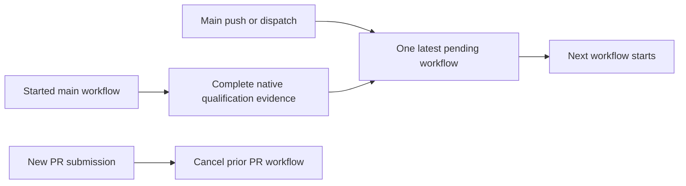
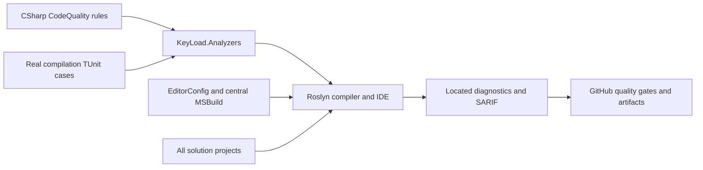
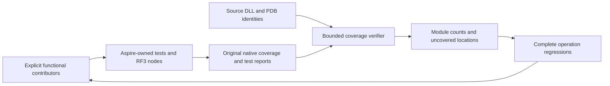

# CodeQuality

REQ-CQ-006 maps to AC-CQ-008/009 in
this Feature and the ADR-033 execution contract,
under the accepted ADR-033 numeric extension. Four source-editable enabled error
rules enforce file/type/function/nesting400/200/50/3 with real Roslyn boundary
fixtures. Actual numeric coverage, RF3 container collection and a matched numeric
baseline remain pending; restored collector presence is not coverage proof.

Developers author executable Roslyn rules in this repository and receive located
diagnostics in the IDE, compiler and CI artifacts. [ADR-033](../ADR/ADR-033-code-quality.md)
owns the import and build-policy decision. Detailed measurable acceptance and
verification cases: [working acceptance](CodeQuality.md).

## Requirements and acceptance traceability

| Requirement | Acceptance | Task / evidence owner |
|---|---|---|
| REQ-CQ-001: exact Prostir EditorConfig and strict SDK/style analysis for all projects | AC-CQ-001 | TASK-006; MSBuild evaluation, import SHA and solution build |
| REQ-CQ-002: editable KeyLoad Roslyn rules with real compiler regressions | AC-CQ-002/004 | TASK-004/005; TUnit analyzer project and CI results |
| REQ-CQ-003: independent compiler SARIF including failed-build diagnostics | AC-CQ-003 | TASK-006; compiler reports and CI always-upload |
| REQ-CQ-004: enforce quality gates and honest qualification | AC-CQ-005/006 | TASK-006; workflow, architecture/status/docs and governance |
| REQ-CQ-005: preserving benchmark source prerequisites | AC-CQ-007 | TASK-MP-010U/V/W/X; XML/private adapter review, public argument regressions and real GitHub comparison qualification |
| REQ-CQ-006: executable numeric maintainability and coverage gates | AC-CQ-008/009 | TASK-MP-010AC-W and TASK-CQ-009; real Roslyn boundaries/self-inventory; later strict coverage/export/no-decrease qualification |
| REQ-CQ-007: preserving CLI, live-query, search, redaction and site/query/storage/remaining-unit quality joins with explicit lifetime/constructor validation | AC-CQ-010/011/012/013/014/015/016 | TASK-MP-010AH-C/Q/L/QN/SA/SB, TASK-MP-010UQ/US/UTF; source parity, real null/lifetime and deterministic workload regressions, enabled builds and actual GitHub feature suites |
| REQ-CQ-008: started main qualification survives subsequent main submissions within bounded workflow concurrency | AC-CQ-017 / AC-QUAL-001..003 | TASK-QUAL-CI-QUEUE-R9; exact workflow review and live same-group run/SHA/job/native evidence under the ADR033 continuation |
| REQ-CQ-009: source-bound functional coverage and meaningful uncovered-flow repair | AC-CQ-018/019/020/021 | TASK-CQ-FUNCTIONAL-COVERAGE-001..003; original native MTP reports, contributor/source/PDB inventories, module/file/line/branch reports, actual RF3 server export and complete-flow regressions |

The website candidate's REQ/AC-BC-027 is a bounded REQ-CQ-006 dependency substage,
owned by TASK-SITE-ANALYZER-COVERAGE-011 in the [site plan](../ADR/ADR-040-static-site-threejs-evidence.md).
Tooling lives under `scripts/Features/CodeQuality/`; tests use new
SiteAnalyzerCoverage-prefixed files in this slice. The frozen JSON inventory and
ADR-033 candidate implementation contract require the native collector, immutable
sources, exact integer80/70/90 thresholds and complete diagnostic regressions.
Successful evidence establishes only the first analyzer-module baseline; global
AC-CQ-009 and RF3/container/no-decrease coverage remain pending.

Observed candidate run36988549282 executes88 regressions with84 successes and4
failures, retained native XML/TRX and no skipped analyzer case. Its next bounded
failure loop maps BC-027/CQ-006/CQ-008/009 to TASK-SITE-NATIVE-FORMAT-014 (native
decimal-display grammar with integer-only decisions), TASK-SITE-NUMERIC-REPAIR-015
(independent token-start span oracles and cohesive200-line test classes), and
TASK-SITE-DIAGNOSTIC-FLOWS-016 (meaningful KLD0001/KLD0022 flows for real coverage
gaps). Acceptance, exact disjoint ownership, staged join and GitHub verification
are in the site acceptance/plan and ADR-033 below. No native numeric pass or
broader CodeQuality completion follows from source repairs or local builds.

TASK016's genuine WriteString regression exposed a value-argument false positive.
Accepted TASK-SITE-ARGUMENT-ROLE-018 preserves that failing case, adds exact real
argument-binding regressions and first runs an unchanged-production GitHub red
baseline. The later two-file bound-parameter classification repair and016 semantic
join remain mandatory before complete native/site qualification. See the detailed
site acceptance/plan and ADR-033 implementation contract; blocked source never
unblocks final acceptance.

## Canonical slice map

AC-CQ-017 follows the acceptance and execution contract in this Feature. Main
push/dispatch submissions retain one running and the default one pending workflow
per existing workflow/ref group; a newer pending submission can replace the prior
pending one without cancelling the started run. PR replacement retains its prior
cancellation behavior. All existing jobs, actual RF3/client requirements, limits,
failure/skip conditions and artifacts remain unchanged. Source configuration is
not proof of live scheduler behavior or runtime qualification. A cancelled pending
run may have no jobs/native reports and remains explicitly unqualified. Main
behavior requires two real same-group submissions and terminal/native evidence;
PR expression review is the documented service-review exception. This changes CI
coordination only and does not establish AC-CQ-009 numerical coverage.

- Backend/tooling: `src/KeyLoad.Analyzers/Features/CodeQuality/`.
- Tests: `tests/KeyLoad.Analyzers.Tests/Features/CodeQuality/`.
- Shared build infrastructure: root `Directory.Build.props/targets`, `.editorconfig`,
  `KeyLoad.slnx`; CI infrastructure: `.github/workflows/ci.yml`.
- Durable docs: this file, ADR-033, global Architecture and implementation status.
- Frontend, database/API contracts, persistence and RF3 topology: N/A; compile-time
  policy has no product runtime entry point or stored state.

## Rules and applicability

Port from Prostir: LiteralMachineKey, ProgramEndpointMapping, GrainInterfaceVersion,
ProgramCompositionRoot, OrleansContractConstructor, SystemClockAccess,
OrleansGenerateSerializer and UntypedCatch. KeyLoad diagnostic IDs use KLD and
retain the source rule's numeric suffix. Program endpoint aggregate is MapKeyLoadApi.
Assembly/domain ownership uses KeyLoad names. Existing source violations must fail
the build; never disable these rules merely to declare a green migration.

| Diagnostic | Rule | Default severity |
|---|---|---|
| KLD0001 | Named constants for machine keys | Error |
| KLD0013 | Aggregate endpoint mapping in the server entry point | Error |
| KLD0014 | Explicit grain-interface version | Error |
| KLD0020 | Program contains composition calls only | Error |
| KLD0021 | Explicit constructor for Orleans contracts | Error |
| KLD0022 | Business code uses an injected clock | Error |
| KLD0023 | Explicit serializer ownership for Orleans types | Error |
| KLD0024 | Typed catch clauses | Warning, promoted to error by the build |
| KLD0030 | Nongenerated file code lines at most400 | Error |
| KLD0031 | Nongenerated aggregate type code lines at most200 | Error |
| KLD0032 | Executable unit code lines at most50 | Error |
| KLD0033 | Executable control-flow nesting at most3 | Error |

Excluded Prostir-specific rules: ProductCommandContract and ServerOwnedIdentity
assume Prostir's typed product command/Studio lifecycle; EfCoreCosmosTopLevelAny
assumes EF/Cosmos; NativeObjectStorage dictates a product/provider choice not made
by this import. No corresponding KeyLoad product contract exists. Those exclusions
do not disable any portable rule or SDK diagnostic.

## Execution and verification

Lead owns shared docs/config and final review; coding workers own disjoint analyzer
and test project trees. Acceptance cases require valid/invalid code, compiler-valid
semantic fixtures, generated/external boundary cases and precise diagnostic ID,
severity and source locations. Use actual SDK Roslyn and Orleans metadata, no
framework stubs. CI executes TUnit on Microsoft.Testing.Platform after Release
build. Reports use project/configuration/framework paths; generated/build artifacts
are ignored. Build failure must remain failure even when reports upload.

Baseline and final CI evidence belong to the plan/status, with exact run/job/SHA.
KLD0030–KLD0033 enforce the repository's file/type/unit/nesting complexity limits.
Their exact-SHA full-graph qualification remains pending. The bounded site
dependency now collects native analyzer coverage; its first complete passing
baseline remains pending. Whole-solution coverage is separate and unqualified;
this compile-time feature makes no RF3 or database-readiness claim.
Observed development gates and current blockers: [evidence](../implementation/code-quality.md).

## Authoring a rule

Add a public `[DiagnosticAnalyzer(LanguageNames.CSharp)]` class beneath the source
slice; the SDK discovers it through the central Analyzer reference. Allocate a
unique KLD identifier, define a meaningful descriptor, call EnableConcurrentExecution
and set an explicit generated-code policy, then register the narrow Roslyn symbol,
operation or syntax action appropriate for the rule. Keep metadata/message tokens
in named constants. Add valid/invalid real-compilation TUnit cases in the matching
test slice with precise diagnostic ID, severity and source location assertions.
Run the development build to collect findings; CI owns regression execution.
Update this catalog and acceptance traceability when adding or changing a rule.

## Source, target and failure boundaries

Actors are rule authors, product contributors, IDE/compiler users and CI reviewers. Entry points are the two CodeQuality project slices and central analyzer attachment above. Rule source/configuration exists; the [qualification evidence](../implementation/code-quality.md) records failed full-solution build/format, newly compiled numeric rules and pending numeric coverage. Existing source violations must be repaired by their owners before complete-source qualification; no local compilation or doc review establishes passing CI, coverage or whole-solution complexity.

Positive flow: a compiler-valid fixture satisfying the contract emits no rule finding; a violating fixture emits the expected located diagnostic and fails the configured build gate. Negative flow: invalid semantic fixtures, unrecognized metadata, unwanted generated/external-code analysis or duplicate diagnostic identifiers require explicit regression assertions. Edge/error flow: failed compilation still retains SARIF and remains failure; artifact upload cannot convert it to success. New or changed rules add real-compilation TUnit cases and retain every existing assertion under the same canonical slice and ADR contract.

TASK018's real tests-first [GitHub run36991420593](https://github.com/managedcode/KeyLoad/actions/runs/36991420593)
at8d8d395f7fa6157773e0318d64f0124cd2e84579 executed103cases:96passed,
7failed,0skipped. Original numeric and native-display repairs passed; seven
compiler-valid key/value binding regressions demonstrated excess diagnostics.
After strongest evidence review, the bounded two-file argument-role repair in
ADR-033 is released. Tests and classification catalogs stay unchanged.
Actual native coverage is889/942lines,472/570branches; KLD0001passes205/224,
KLD0022fails25/30. Changed production needs fresh native source hashes and
denominators. SiteTests and final qualification remain pending; source repair
alone cannot close AC-CQ-009 or AC-BC-027. Exact failed artifacts and joins live
in the [site plan](../ADR/ADR-040-static-site-threejs-evidence.md) and
[site status](../implementation/site-design.json).

## Owner functional coverage contract, 2026-10-05

The owner requires measured test coverage without load tests and meaningful
repairs of uncovered behaviour while finalizing each module. A test must execute
a complete real operation and verify its outcome and resulting or preserved state;
getter/setter, property-only or implementation-mirroring tests are insufficient.
This extends REQ-CQ-006/009 and the accepted ADR-033 numeric contract. It does not
replace any complete mandatory suite or turn source inspection into coverage.

### Quality review repair, 2026-10-05

The owner requires repairs of the actual findings from the installed quality
bundle. TASK-CQ-REPAIR-001 follows the preserving source-repair contract in
ADR-033 and extends REQ-CQ-004/006 with the criteria below. Existing product
requirements, numeric limits, diagnostic severity and qualification gates remain
mandatory. Optional analyzer defaults which conflict with the owning EditorConfig
are reviewed individually; their raw count is not a confirmed defect count.

- AC-CQ-022: the complete current solution passes the strict Release build and
  `dotnet format --verify-no-changes`; retain failed and passing original reports.
  Compiler and analyzer repairs preserve public signatures, persistence bytes,
  signed identity, real topology, workload results and cancellation/lifetime rules.
- AC-CQ-023: review every source-bound method with native cyclomatic complexity
  above20, extract only coherent validation/execution responsibilities where
  needed, and remeasure the changed source. Preserve original evaluation order,
  short-circuiting, errors and side effects. Existing real-operation feature tests
  and the complete required suites provide the behavioral regression contract;
  numerical improvement alone does not establish correctness or performance.
- AC-CQ-024: BlobRecordReader repairs retain AC-BLOB-001–007 and add complete
  persisted-corruption operations for uncovered validation failures, asserting the
  error and unchanged canonical state. Native functional coverage must meet the
  existing90% critical-flow line and70% branch thresholds for changed validation;
  retain exact source/DLL/PDB identities and the original reports.

Execution: disjoint workers own the existing Orleans membership compiler repairs,
comparison-library compiler repairs and exact high-complexity source files. The
lead owns Blob validation/tests, compiler aggregation closure removal, shared
documentation and final integration. First finish and inspect preserving repairs;
then format, build, run the mapped tests through Aspire, collect functional
coverage and repeat metrics. Run complete unit/scalar/recovery/RF3 gates and retain
actual outcomes. No source repair closes an unexecuted or failed acceptance gate.

- AC-CQ-018: the first contributor profile is exactly the functional
  `PartitionQuery*` TUnit cases in `unit` and `unit-scalar`, through the existing
  Aspire-owned entry and native MTP CodeCoverage 18.11.2. The profile includes
  `KeyLoad.Query` production source and the actual Release DLL/PDB hashes. Use
  native static managed instrumentation when the actual platform lacks dynamic
  support, with only the inventory-owned Release test deployment module directory.
  Require exact restoration of the original DLL/PDB hashes after native settlement;
  a modified build image cannot count as original-source evidence. Retain
  both original Cobertura reports and original TRX/TUnit outcomes, including
  failed runs. Inventory exact contributors and source hashes before and after;
  missing/cancelled reports, changed source, unexpected modules, paths or integer
  counts make the report unqualified rather than zero. This is scoped evidence.
- AC-CQ-019: report per-module/file covered and executable line counts, original
  native branch counts where available, percentages and uncovered source locations.
  Never sum normal/scalar or replica duplicates. Exact line hits may be OR-unioned
  on matching module/source/line identity. Aggregate branches only when native
  evidence identifies each outcome; coarse per-line covered/total pairs alone
  cannot establish a branch union. Until then retain per-run branch counts and
  mark the merged branch result unmeasured. Preserve the mandatory 80/70/90 and
  module/no-decrease gates; an unqualified partial report cannot close AC-CQ-009.
- AC-CQ-020: complete coverage has an explicit functional contributor inventory
  and classification of every production project. Exclude all load, stress,
  performance and comparison contributors, including such cases inside an
  otherwise ordinary suite. Keep complete ordinary CI suites mandatory; a separate
  coverage selection does not qualify a full suite. Site V8 evidence stays separate.
  Collect each of the three real Docker `KeyLoad.Server` processes, bind report
  exports to exact server image/DLL/PDB/source identities, and settle the actual
  collector and AppHost-owned nodes before consuming exports. Test-host coverage
  alone does not establish RF3/server or whole-solution coverage. Freeze the pinned
  native collector invocation and lifetime/export contract before that integration.
- AC-CQ-021: for module closure, review uncovered locations against REQ/AC flows,
  implement real success/failure/edge regressions and remeasure the same source.
  Rejected operations must prove their error and preserved state. No fake provider,
  fabricated task, trivial accessor test, executable-source exclusion, missing
  report, skipped suite or ignored failure can make the gate pass.

TASK-CQ-FUNCTIONAL-COVERAGE-001 owns the bounded first profile and report under
`scripts/Features/CodeQuality/functional-coverage*`; it reuses the existing Aspire
settings/output handoff and native collector, with no new test framework or public
database contract. Root owns docs, source joins, actual collection and final review;
the Luna worker writes only a guarded private source packet. Original XML is
bounded to 32 MiB, inventory to 5,000 sources and 100,000 distinct line locations;
XML DTD/external resolution is prohibited and all accepted source paths resolve
within the source-bound production inventory. Reports are deterministic JSON and
Markdown with raw counts, contributor identities, source/DLL/PDB hashes and
uncovered locations, without user data or secrets. Existing analyzer/site coverage
settings, inventory and gate remain unchanged. Real native profile collection,
successful and rejected processing of its retained reports, source drift and
missing-report rejection provide the verification flow; authored fixture XML is
not a substitute for native evidence.

TASK-CQ-FUNCTIONAL-COVERAGE-002 expands the explicit functional inventory, native
merge/export and CI always-retained artifacts after the native identity contract
is frozen. TASK-CQ-FUNCTIONAL-COVERAGE-003 closes modules against actual uncovered
flows and the complete original acceptance/gates. Neither later task is complete
because the first scoped profile exists. No persistence or public API migration
occurs; rollback restores a coherent tooling profile and retains original reports
without disabling required quality or functional test gates.

