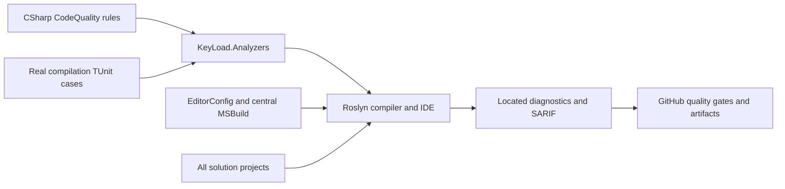

# CodeQuality

REQ-CQ-006 maps to AC-CQ-008/009 in
[quality-gates.acceptance.md](../../quality-gates.acceptance.md) and its working plan,
under the accepted ADR-033 numeric extension. Four source-editable enabled error
rules enforce file/type/function/nesting400/200/50/3 with real Roslyn boundary
fixtures. Actual numeric coverage, RF3 container collection and a matched numeric
baseline remain pending; restored collector presence is not coverage proof.

Developers author executable Roslyn rules in this repository and receive located
diagnostics in the IDE, compiler and CI artifacts. [ADR-033](../ADR/ADR-033-code-quality.md)
owns the import and build-policy decision. Detailed measurable acceptance and
verification cases: [working acceptance](../../code-quality.acceptance.md).

## Requirements and acceptance traceability

| Requirement | Acceptance | Task / evidence owner |
|---|---|---|
| REQ-CQ-001: exact Prostir EditorConfig and strict SDK/style analysis for all projects | AC-CQ-001 | TASK-006; MSBuild evaluation, import SHA and solution build |
| REQ-CQ-002: editable KeyLoad Roslyn rules with real compiler regressions | AC-CQ-002/004 | TASK-004/005; TUnit analyzer project and CI results |
| REQ-CQ-003: independent compiler SARIF including failed-build diagnostics | AC-CQ-003 | TASK-006; compiler reports and CI always-upload |
| REQ-CQ-004: enforce quality gates and honest qualification | AC-CQ-005/006 | TASK-006; workflow, architecture/status/docs and governance |
| REQ-CQ-005: preserving benchmark source prerequisites | AC-CQ-007 | TASK-MP-010U/V/W/X; XML/private adapter review, public argument regressions and real GitHub comparison qualification |
| REQ-CQ-006: executable numeric maintainability and coverage gates | AC-CQ-008/009 | TASK-MP-010AC-W and TASK-CQ-009; real Roslyn boundaries/self-inventory; later strict coverage/export/no-decrease qualification |
| REQ-CQ-007: preserving CLI, live-query, search, redaction and site/query/storage/remaining-unit quality joins with explicit lifetime/constructor validation | AC-CQ-010/011/012/013/014/015/016 | TASK-MP-010AH-C/Q/L/QN/SA/SB, TASK-MP-010UQ/US/UTF; source parity, real null/lifetime and deterministic workload regressions, enabled builds and actual GitHub feature suites |

The website candidate's REQ/AC-BC-027 is a bounded REQ-CQ-006 dependency substage,
owned by TASK-SITE-ANALYZER-COVERAGE-011 in the [site plan](../../site-design.plan.md).
Tooling lives under `scripts/Features/CodeQuality/`; tests use new
SiteAnalyzerCoverage-prefixed files in this slice. The frozen JSON inventory and
ADR-033 candidate implementation contract require the native collector, immutable
sources, exact integer80/70/90 thresholds and complete diagnostic regressions.
Successful evidence establishes only the first analyzer-module baseline; global
AC-CQ-009 and RF3/container/no-decrease coverage remain pending.

Observed candidate run36988549282 executes88 regressions with84 successes and4
failures, retained native XML/TRX and no skipped analyzer case. Its next bounded
failure loop maps BC-027/CQ-006/CQ-008/009 to TASK-SITE-NATIVE-FORMAT-014 (native
decimal-display grammar with integer-only decisions), TASK-SITE-NUMERIC-REPAIR-015
(independent token-start span oracles and cohesive200-line test classes), and
TASK-SITE-DIAGNOSTIC-FLOWS-016 (meaningful KLD0001/KLD0022 flows for real coverage
gaps). Acceptance, exact disjoint ownership, staged join and GitHub verification
are in the site acceptance/plan and ADR-033 below. No native numeric pass or
broader CodeQuality completion follows from source repairs or local builds.

TASK016's genuine WriteString regression exposed a value-argument false positive.
Accepted TASK-SITE-ARGUMENT-ROLE-018 preserves that failing case, adds exact real
argument-binding regressions and first runs an unchanged-production GitHub red
baseline. The later two-file bound-parameter classification repair and016 semantic
join remain mandatory before complete native/site qualification. See the detailed
site acceptance/plan and ADR-033 implementation contract; blocked source never
unblocks final acceptance.

## Canonical slice map

- Backend/tooling: `src/KeyLoad.Analyzers/Features/CodeQuality/`.
- Tests: `tests/KeyLoad.Analyzers.Tests/Features/CodeQuality/`.
- Shared build infrastructure: root `Directory.Build.props/targets`, `.editorconfig`,
  `KeyLoad.slnx`; CI infrastructure: `.github/workflows/ci.yml`.
- Durable docs: this file, ADR-033, global Architecture and implementation status.
- Frontend, database/API contracts, persistence and RF3 topology: N/A; compile-time
  policy has no product runtime entry point or stored state.

## Rules and applicability

Port from Prostir: LiteralMachineKey, ProgramEndpointMapping, GrainInterfaceVersion,
ProgramCompositionRoot, OrleansContractConstructor, SystemClockAccess,
OrleansGenerateSerializer and UntypedCatch. KeyLoad diagnostic IDs use KLD and
retain the source rule's numeric suffix. Program endpoint aggregate is MapKeyLoadApi.
Assembly/domain ownership uses KeyLoad names. Existing source violations must fail
the build; never disable these rules merely to declare a green migration.

| Diagnostic | Rule | Default severity |
|---|---|---|
| KLD0001 | Named constants for machine keys | Error |
| KLD0013 | Aggregate endpoint mapping in the server entry point | Error |
| KLD0014 | Explicit grain-interface version | Error |
| KLD0020 | Program contains composition calls only | Error |
| KLD0021 | Explicit constructor for Orleans contracts | Error |
| KLD0022 | Business code uses an injected clock | Error |
| KLD0023 | Explicit serializer ownership for Orleans types | Error |
| KLD0024 | Typed catch clauses | Warning, promoted to error by the build |
| KLD0030 | Nongenerated file code lines at most400 | Error |
| KLD0031 | Nongenerated aggregate type code lines at most200 | Error |
| KLD0032 | Executable unit code lines at most50 | Error |
| KLD0033 | Executable control-flow nesting at most3 | Error |

Excluded Prostir-specific rules: ProductCommandContract and ServerOwnedIdentity
assume Prostir's typed product command/Studio lifecycle; EfCoreCosmosTopLevelAny
assumes EF/Cosmos; NativeObjectStorage dictates a product/provider choice not made
by this import. No corresponding KeyLoad product contract exists. Those exclusions
do not disable any portable rule or SDK diagnostic.

## Execution and verification

Lead owns shared docs/config and final review; coding workers own disjoint analyzer
and test project trees. Acceptance cases require valid/invalid code, compiler-valid
semantic fixtures, generated/external boundary cases and precise diagnostic ID,
severity and source locations. Use actual SDK Roslyn and Orleans metadata, no
framework stubs. CI executes TUnit on Microsoft.Testing.Platform after Release
build. Reports use project/configuration/framework paths; generated/build artifacts
are ignored. Build failure must remain failure even when reports upload.

Baseline and final CI evidence belong to the plan/status, with exact run/job/SHA.
KLD0030–KLD0033 enforce the repository's file/type/unit/nesting complexity limits.
Their exact-SHA full-graph qualification remains pending. The bounded site
dependency now collects native analyzer coverage; its first complete passing
baseline remains pending. Whole-solution coverage is separate and unqualified;
this compile-time feature makes no RF3 or database-readiness claim.
Observed development gates and current blockers: [evidence](../implementation/code-quality.md).

## Authoring a rule

Add a public `[DiagnosticAnalyzer(LanguageNames.CSharp)]` class beneath the source
slice; the SDK discovers it through the central Analyzer reference. Allocate a
unique KLD identifier, define a meaningful descriptor, call EnableConcurrentExecution
and set an explicit generated-code policy, then register the narrow Roslyn symbol,
operation or syntax action appropriate for the rule. Keep metadata/message tokens
in named constants. Add valid/invalid real-compilation TUnit cases in the matching
test slice with precise diagnostic ID, severity and source location assertions.
Run the development build to collect findings; CI owns regression execution.
Update this catalog and acceptance traceability when adding or changing a rule.

## Source, target and failure boundaries

Actors are rule authors, product contributors, IDE/compiler users and CI reviewers. Entry points are the two CodeQuality project slices and central analyzer attachment above. Rule source/configuration exists; the [qualification evidence](../implementation/code-quality.md) records failed full-solution build/format, newly compiled numeric rules and pending numeric coverage. Existing source violations must be repaired by their owners before complete-source qualification; no local compilation or doc review establishes passing CI, coverage or whole-solution complexity.

Positive flow: a compiler-valid fixture satisfying the contract emits no rule finding; a violating fixture emits the expected located diagnostic and fails the configured build gate. Negative flow: invalid semantic fixtures, unrecognized metadata, unwanted generated/external-code analysis or duplicate diagnostic identifiers require explicit regression assertions. Edge/error flow: failed compilation still retains SARIF and remains failure; artifact upload cannot convert it to success. New or changed rules add real-compilation TUnit cases and retain every existing assertion under the same canonical slice and ADR contract.

TASK018's real tests-first [GitHub run36991420593](https://github.com/managedcode/KeyLoad/actions/runs/36991420593)
at8d8d395f7fa6157773e0318d64f0124cd2e84579 executed103cases:96passed,
7failed,0skipped. Original numeric and native-display repairs passed; seven
compiler-valid key/value binding regressions demonstrated excess diagnostics.
After strongest evidence review, the bounded two-file argument-role repair in
ADR-033 is released. Tests and classification catalogs stay unchanged.
Actual native coverage is889/942lines,472/570branches; KLD0001passes205/224,
KLD0022fails25/30. Changed production needs fresh native source hashes and
denominators. SiteTests and final qualification remain pending; source repair
alone cannot close AC-CQ-009 or AC-BC-027. Exact failed artifacts and joins live
in the [site plan](../../site-design.plan.md) and
[site status](../implementation/site-design.json).
