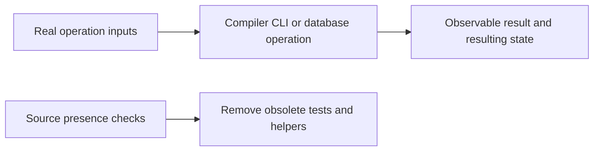
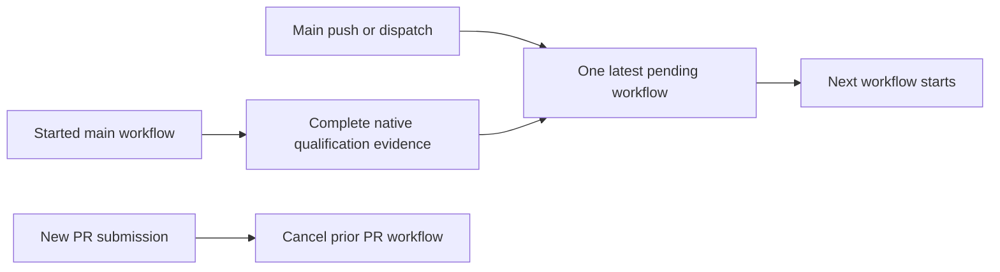
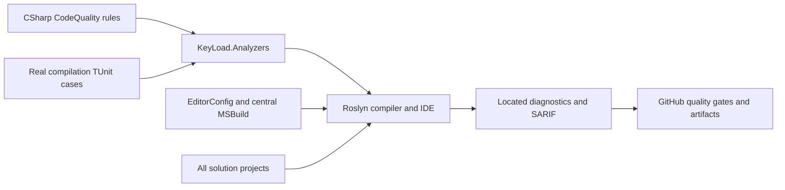
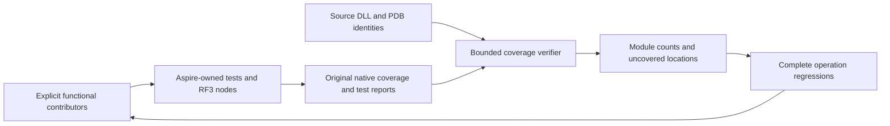

# CodeQuality

TASK-CQ-UNIT64-010 implements the owner's 2026-10-06 rule-specific correction:
REQ-CQ-006 / AC-CQ-008 now require KLD0032 at an executable-unit boundary of64
code lines. File400, aggregate type200, nesting3, token/trivia counting,
generated-source exclusions, cancellation, diagnostic ID/severity and precise
source spans stay governed by their existing contracts. The actual compiler
flow must accept63/64 and emit the same located Error for65, with diagnostic
text naming64. Oversized accessor, local-function, lambda, constructor,
destructor, operator, anonymous-method, raw-literal and disabled-text fixtures
must continue exercising rejected code; generated oversized and comment/trivia
cases must still prove their existing positive contracts. Root owns policy,
ADR/docs and integration. Luna owns the threshold/descriptors and the two
existing executable-unit compiler fixture files. Required verification is the
canonical solution build, Aspire-owned analyzer suite, formatter and exact-source
Linux qualification. Historical50-line diagnostics remain historical evidence.

TASK-CQ-NATIVE-STDOUT-009 preserves REQ-CQ-009 and AC-CQ-044/045 for
the genuine source-manifest cancellation child. Its captured stdout limit
includes the readiness line and newline; reserve that prefix before reading
the remainder, reject a prefix which cannot fit, and still detect an extra
character when the remaining allowance is zero. Run the actual native child
at the exact prefix bound and one character below it, verify original
exit/readers, safe output failure and owned cleanup, then complete the healthy
default-bound child flow. Reuse centrally validated test execution options.
This tooling operation is not a product coverage contributor. Root owns its
helper/output-reader/test join; existing one-watchdog fail-stop, original
failure preservation and required Aspire/Linux gates remain mandatory.

## Behavioural test cleanup, owner correction 2026-10-06

- REQ-CQ-014: functional tests execute an actual operation and verify its observable
  outcome and resulting state. Reading repository source or workflow YAML to
  assert words, calls, attributes or implementation shape is prohibited test proof.
- AC-CQ-049: remove the source-only workflow tests, their unused readers/parsers and
  the CI filter targeting the removed tests. Keep real governance CLI acceptance/
  rejection flows, native compiler/analyzer diagnostics and database operations.
  Verify remaining code with the canonical Release build and relevant Aspire suites.
- AC-CQ-050: active requirements must not cite removed source-only tests as current
  acceptance evidence. Workflow execution and original GitHub outcomes qualify
  delivery behaviour; existing static governance stays in CI. Immutable historical
  receipts keep their original test identities and results.

AC-CQ-049 retains `GovernanceWorkingFileTests`, `IsolatedDocumentResourceMongoTests`,
`IsolatedDocumentResourcePostgresTests`, `IsolatedResourceTopologyRedisTests` and
`MongoReadinessResourceTests` as the automated operation/composition regressions.
AC-CQ-050 uses an explicit review exception: inspect the active requirement/test
mapping and retain actual original GitHub job outcomes for workflow behaviour;
substring assertions cannot replace those outcomes.

TASK-CQ-BEHAVIOURAL-TESTS-001 maps REQ-CQ-014 to AC-CQ-049/050. The lead owns policy,
  docs, CI integration and final checks; the RepositoryGovernance worker removes
  source-only cases/helpers, the comparison worker removes mounted-script token
  assertions, and a read-only auditor checks remaining projects. Review each diff,
  retain real positive/negative/edge operations, resolve live references, then run
  format, Release build, static governance and affected Aspire tests. No database,
  protocol, dependency, storage format or topology change is part of this cleanup;
  existing ADR-033/ADR-032 contracts suffice (new ADR: N/A). Rollback restores this
  coherent test/CI/doc change without touching unrelated work.

Local development verification on2026-10-06: canonical Release solution build
passed with zero warnings/errors; full solution formatting, CI YAML parsing and
static governance passed. The retained Aspire-owned focused cases passed37/37
(governance9, document resources18, Mongo readiness7, Redis resources3), with no
skips. Original reports are under `TestResults/source-text-cleanup/`. The canceled
governance attempt and Redis rejection of the macOS symlink temp path remain
retained; sequential retries using the real `/private/tmp` temp root passed
without changing assertions or path guards. This is development evidence, not
new Linux RF3/recovery or product qualification.

REQ-CQ-006 maps to AC-CQ-008/009 in
this Feature and the ADR-033 execution contract,
under the accepted ADR-033 numeric extension. Four source-editable enabled error
rules enforce file/type/function/nesting400/200/64/3 with real Roslyn boundary
fixtures. Actual numeric coverage, RF3 container collection and a matched numeric
baseline remain pending; restored collector presence is not coverage proof.

Developers author executable Roslyn rules in this repository and receive located
diagnostics in the IDE, compiler and CI artifacts. [ADR-033](../ADR/ADR-033-code-quality.md)
owns the import and build-policy decision. Detailed measurable acceptance and
verification cases: [working acceptance](CodeQuality.md).

## Requirements and acceptance traceability

| Requirement | Acceptance | Task / evidence owner |
|---|---|---|
| REQ-CQ-001: exact Prostir EditorConfig and strict SDK/style analysis for all projects | AC-CQ-001 | TASK-006; MSBuild evaluation, import SHA and solution build |
| REQ-CQ-002: editable KeyLoad Roslyn rules with real compiler regressions | AC-CQ-002/004 | TASK-004/005; TUnit analyzer project and CI results |
| REQ-CQ-003: independent compiler SARIF including failed-build diagnostics | AC-CQ-003 | TASK-006; compiler reports and CI always-upload |
| REQ-CQ-004: enforce quality gates and honest qualification | AC-CQ-005/006 | TASK-006; workflow, architecture/status/docs and governance |
| REQ-CQ-005: preserving benchmark source prerequisites | AC-CQ-007 | TASK-MP-010U/V/W/X; XML/private adapter review, public argument regressions and real GitHub comparison qualification |
| REQ-CQ-006: executable numeric maintainability and coverage gates | AC-CQ-008/009 | TASK-MP-010AC-W and TASK-CQ-009; real Roslyn boundaries/self-inventory; later strict coverage/export/no-decrease qualification |
| REQ-CQ-007: preserving CLI, live-query, search, redaction and site/query/storage/remaining-unit quality joins with explicit lifetime/constructor validation | AC-CQ-010/011/012/013/014/015/016 | TASK-MP-010AH-C/Q/L/QN/SA/SB, TASK-MP-010UQ/US/UTF; source parity, real null/lifetime and deterministic workload regressions, enabled builds and actual GitHub feature suites |
| REQ-CQ-008: started main qualification survives subsequent main submissions within bounded workflow concurrency | AC-CQ-017 / AC-QUAL-001..003 | TASK-QUAL-CI-QUEUE-R9; exact workflow review and live same-group run/SHA/job/native evidence under the ADR033 continuation |
| REQ-CQ-009: source-bound functional coverage and meaningful uncovered-flow repair | AC-CQ-018/019/020/021 | TASK-CQ-FUNCTIONAL-COVERAGE-001..003; original native MTP reports, contributor/source/PDB inventories, module/file/line/branch reports, actual RF3 server export and complete-flow regressions |

The website candidate's REQ/AC-BC-027 is a bounded REQ-CQ-006 dependency substage,
owned by TASK-SITE-ANALYZER-COVERAGE-011 in the [site plan](../ADR/ADR-040-static-site-threejs-evidence.md).
Tooling lives under `scripts/Features/CodeQuality/`; tests use new
SiteAnalyzerCoverage-prefixed files in this slice. The frozen JSON inventory and
ADR-033 candidate implementation contract require the native collector, immutable
sources, exact integer80/70/90 thresholds and complete diagnostic regressions.
Successful evidence establishes only the first analyzer-module baseline; global
AC-CQ-009 and RF3/container/no-decrease coverage remain pending.

Observed candidate run36988549282 executes88 regressions with84 successes and4
failures, retained native XML/TRX and no skipped analyzer case. Its next bounded
failure loop maps BC-027/CQ-006/CQ-008/009 to TASK-SITE-NATIVE-FORMAT-014 (native
decimal-display grammar with integer-only decisions), TASK-SITE-NUMERIC-REPAIR-015
(independent token-start span oracles and cohesive200-line test classes), and
TASK-SITE-DIAGNOSTIC-FLOWS-016 (meaningful KLD0001/KLD0022 flows for real coverage
gaps). Acceptance, exact disjoint ownership, staged join and GitHub verification
are in the site acceptance/plan and ADR-033 below. No native numeric pass or
broader CodeQuality completion follows from source repairs or local builds.

TASK016's genuine WriteString regression exposed a value-argument false positive.
Accepted TASK-SITE-ARGUMENT-ROLE-018 preserves that failing case, adds exact real
argument-binding regressions and first runs an unchanged-production GitHub red
baseline. The later two-file bound-parameter classification repair and016 semantic
join remain mandatory before complete native/site qualification. See the detailed
site acceptance/plan and ADR-033 implementation contract; blocked source never
unblocks final acceptance.

## Canonical slice map

AC-CQ-017 follows the acceptance and execution contract in this Feature. Main
push/dispatch submissions retain one running and the default one pending workflow
per existing workflow/ref group; a newer pending submission can replace the prior
pending one without cancelling the started run. PR replacement retains its prior
cancellation behavior. All existing jobs, actual RF3/client requirements, limits,
failure/skip conditions and artifacts remain unchanged. Source configuration is
not proof of live scheduler behavior or runtime qualification. A cancelled pending
run may have no jobs/native reports and remains explicitly unqualified. Main
behavior requires two real same-group submissions and terminal/native evidence;
PR expression review is the documented service-review exception. This changes CI
coordination only and does not establish AC-CQ-009 numerical coverage.

- Backend/tooling: `src/KeyLoad.Analyzers/Features/CodeQuality/`.
- Tests: `tests/KeyLoad.Analyzers.Tests/Features/CodeQuality/`.
- Shared build infrastructure: root `Directory.Build.props/targets`, `.editorconfig`,
  `KeyLoad.slnx`; CI infrastructure: `.github/workflows/build-and-tests.yml`.
- Durable docs: this file, ADR-033, global Architecture and implementation status.
- Frontend, database/API contracts, persistence and RF3 topology: N/A; compile-time
  policy has no product runtime entry point or stored state.

## Rules and applicability

Port from Prostir: LiteralMachineKey, ProgramEndpointMapping, GrainInterfaceVersion,
ProgramCompositionRoot, OrleansContractConstructor, SystemClockAccess,
OrleansGenerateSerializer and UntypedCatch. KeyLoad diagnostic IDs use KLD and
retain the source rule's numeric suffix. Program endpoint aggregate is MapKeyLoadApi.
Assembly/domain ownership uses KeyLoad names. Existing source violations must fail
the build; never disable these rules merely to declare a green migration.

| Diagnostic | Rule | Default severity |
|---|---|---|
| KLD0001 | Named constants for machine keys | Error |
| KLD0013 | Aggregate endpoint mapping in the server entry point | Error |
| KLD0014 | Explicit grain-interface version | Error |
| KLD0020 | Program contains composition calls only | Error |
| KLD0021 | Explicit constructor for Orleans contracts | Error |
| KLD0022 | Business code uses an injected clock | Error |
| KLD0023 | Explicit serializer ownership for Orleans types | Error |
| KLD0024 | Typed catch clauses | Warning, promoted to error by the build |
| KLD0030 | Nongenerated file code lines at most400 | Error |
| KLD0031 | Nongenerated aggregate type code lines at most200 | Error |
| KLD0032 | Executable unit code lines at most64 | Error |
| KLD0033 | Executable control-flow nesting at most3 | Error |
| KLD0034 | Typed synchronization outside Orleans activation-owned state | Error |
| KLD0035 | Named constants for all runtime numeric literals, including zero and one | Error |
| KLD0036 | Named identities for runtime strings, characters, interpolation text and format tokens | Error |
| KLD0037 | Native typed options and owned configuration binding; operational policy cannot hide behind constants | Error |

Excluded Prostir-specific rules: ProductCommandContract and ServerOwnedIdentity
assume Prostir's typed product command/Studio lifecycle; EfCoreCosmosTopLevelAny
assumes EF/Cosmos; NativeObjectStorage dictates a product/provider choice not made
by this import. No corresponding KeyLoad product contract exists. Those exclusions
do not disable any portable rule or SDK diagnostic.

## Execution and verification

Lead owns shared docs/config and final review; coding workers own disjoint analyzer
and test project trees. Acceptance cases require valid/invalid code, compiler-valid
semantic fixtures, generated/external boundary cases and precise diagnostic ID,
severity and source locations. Use actual SDK Roslyn and Orleans metadata, no
framework stubs. CI executes TUnit on Microsoft.Testing.Platform after Release
build. Reports use project/configuration/framework paths; generated/build artifacts
are ignored. Build failure must remain failure even when reports upload.

Baseline and final CI evidence belong to the plan/status, with exact run/job/SHA.
KLD0030–KLD0033 enforce the repository's file/type/unit/nesting complexity limits.
Their exact-SHA full-graph qualification remains pending. The bounded site
dependency now collects native analyzer coverage; its first complete passing
baseline remains pending. Whole-solution coverage is separate and unqualified;
this compile-time feature makes no RF3 or database-readiness claim.
Observed development gates and current blockers: [evidence](../implementation/code-quality.md).

## Authoring a rule

Add a public `[DiagnosticAnalyzer(LanguageNames.CSharp)]` class beneath the source
slice; the SDK discovers it through the central Analyzer reference. Allocate a
unique KLD identifier, define a meaningful descriptor, call EnableConcurrentExecution
and set an explicit generated-code policy, then register the narrow Roslyn symbol,
operation or syntax action appropriate for the rule. Keep metadata/message tokens
in named constants. Add valid/invalid real-compilation TUnit cases in the matching
test slice with precise diagnostic ID, severity and source location assertions.
Run the development build to collect findings; CI owns regression execution.
Update this catalog and acceptance traceability when adding or changing a rule.

## Typed synchronization correction, 2026-10-05

[ADR-108](../ADR/ADR-108-typed-synchronization.md) owns REQ-CQ-010 and
TASK-CQ-SYNC-001..004. The owner prohibits object/Monitor synchronization gates.
Scope is all KeyLoad-owned C# runtime, infrastructure, benchmark and test code;
public signatures, persisted bytes, RF3 topology and authorization stay unchanged.
Plain object identity sentinels are outside this rule because they are not locks.

- REQ-CQ-010 / AC-CQ-025: compiling an object-typed lock, a Monitor call or a
  synchronous lock in a Grain-derived activation emits KLD0034 at the offending
  expression. Real Roslyn compilations verify diagnostics, locations, aliases,
  inherited grains, generated-code exclusion and permitted non-grain Lock gates.
- AC-CQ-026: necessary short synchronous shared-service critical sections use
  System.Threading.Lock; asynchronous mutual exclusion uses cancellable
  SemaphoreSlim.WaitAsync and finally-release. No object/Monitor gates remain.
  Real lifecycle/cache/replica regressions must preserve repeated/concurrent
  disposal, shutdown, admitted work settlement and storage reopen behavior.
- AC-CQ-027: activation state relies on Orleans scheduling. Review actual lock
  owners and their callbacks/reentrancy; do not remove shared node-local storage,
  journal, apply or resource ownership gates merely because callers are grains.
  Existing real request-grain and RF3 SDK/MCP tests cover those boundaries.

Verification uses the strict complete Release build, formatter, governance,
Aspire-owned analyzers/unit/unit-scalar/recovery/rf3 suites and retained original
reports. Local checks are development evidence; source review alone cannot close
runtime or Linux qualification. Before implementation, existing unrelated dirty
work includes OrleansNode and storage/Blob/Graph/documentation repairs; preserve
it. Baseline runtime outcomes are unmeasured until the Aspire suites execute.

## Source, target and failure boundaries

Actors are rule authors, product contributors, IDE/compiler users and CI reviewers. Entry points are the two CodeQuality project slices and central analyzer attachment above. Rule source/configuration exists; the [qualification evidence](../implementation/code-quality.md) records failed full-solution build/format, newly compiled numeric rules and pending numeric coverage. Existing source violations must be repaired by their owners before complete-source qualification; no local compilation or doc review establishes passing CI, coverage or whole-solution complexity.

Positive flow: a compiler-valid fixture satisfying the contract emits no rule finding; a violating fixture emits the expected located diagnostic and fails the configured build gate. Negative flow: invalid semantic fixtures, unrecognized metadata, unwanted generated/external-code analysis or duplicate diagnostic identifiers require explicit regression assertions. Edge/error flow: failed compilation still retains SARIF and remains failure; artifact upload cannot convert it to success. New or changed rules add real-compilation TUnit cases and retain every existing assertion under the same canonical slice and ADR contract.

TASK018's real tests-first [GitHub run36991420593](https://github.com/managedcode/KeyLoad/actions/runs/36991420593)
at8d8d395f7fa6157773e0318d64f0124cd2e84579 executed103cases:96passed,
7failed,0skipped. Original numeric and native-display repairs passed; seven
compiler-valid key/value binding regressions demonstrated excess diagnostics.
After strongest evidence review, the bounded two-file argument-role repair in
ADR-033 is released. Tests and classification catalogs stay unchanged.
Actual native coverage is889/942lines,472/570branches; KLD0001passes205/224,
KLD0022fails25/30. Changed production needs fresh native source hashes and
denominators. SiteTests and final qualification remain pending; source repair
alone cannot close AC-CQ-009 or AC-BC-027. Exact failed artifacts and joins live
in the [site plan](../ADR/ADR-040-static-site-threejs-evidence.md) and
site status (report removed from repository).

## Owner functional coverage contract, 2026-10-05

The owner requires measured test coverage without load tests and meaningful
repairs of uncovered behaviour while finalizing each module. A test must execute
a complete real operation and verify its outcome and resulting or preserved state;
getter/setter, property-only or implementation-mirroring tests are insufficient.
This extends REQ-CQ-006/009 and the accepted ADR-033 numeric contract. It does not
replace any complete mandatory suite or turn source inspection into coverage.

### Quality review repair, 2026-10-05

The owner requires repairs of the actual findings from the installed quality
bundle. TASK-CQ-REPAIR-001 follows the preserving source-repair contract in
ADR-033 and extends REQ-CQ-004/006 with the criteria below. Existing product
requirements, numeric limits, diagnostic severity and qualification gates remain
mandatory. Optional analyzer defaults which conflict with the owning EditorConfig
are reviewed individually; their raw count is not a confirmed defect count.

- AC-CQ-022: the complete current solution passes the strict Release build and
  `dotnet format --verify-no-changes`; retain failed and passing original reports.
  Compiler and analyzer repairs preserve public signatures, persistence bytes,
  signed identity, real topology, workload results and cancellation/lifetime rules.
- AC-CQ-023: review every source-bound method with native cyclomatic complexity
  above20, extract only coherent validation/execution responsibilities where
  needed, and remeasure the changed source. Preserve original evaluation order,
  short-circuiting, errors and side effects. Existing real-operation feature tests
  and the complete required suites provide the behavioral regression contract;
  numerical improvement alone does not establish correctness or performance.
- AC-CQ-024: BlobRecordReader repairs retain AC-BLOB-001–007 and add complete
  persisted-corruption operations for uncovered validation failures, asserting the
  error and unchanged canonical state. Native functional coverage must meet the
  existing90% critical-flow line and70% branch thresholds for changed validation;
  retain exact source/DLL/PDB identities and the original reports.
- AC-CQ-028: site-coverage process fixtures supply their controlled source
  revision explicitly, independently of the caller environment. Serialize the
  affected real PowerShell test cases through native TUnit scheduling so shared
  admission does not exhaust another case's subprocess budget. Preserve the
  existing process concurrency, timeout, cleanup and output bounds and all
  positive/negative parser, revision, inventory and threshold assertions. These
  controlled parser fixtures are tests, never published coverage evidence.

Execution: disjoint workers own the existing Orleans membership compiler repairs,
comparison-library compiler repairs and exact high-complexity source files. The
lead owns Blob validation/tests, compiler aggregation closure removal, shared
documentation and final integration. First finish and inspect preserving repairs;
then format, build, run the mapped tests through Aspire, collect functional
coverage and repeat metrics. Run complete unit/scalar/recovery/RF3 gates and retain
actual outcomes. No source repair closes an unexecuted or failed acceptance gate.

Continuation 2026-10-06 retains the same TASK-CQ-REPAIR-001 acceptance contract.
First capture the current strict solution-build failures and preserve the earlier
140/144 analyzer result. A disjoint test-fixture worker owns the remaining real
PowerShell copied-repository failures and current-inventory threshold oracle;
the lead owns build integration, Blob corruption regressions, formatting,
Aspire-owned suite execution, native coverage/complexity and final evidence.
The bounded worker also owns `Assert-CoveragePathHasNoLinks` in the existing
site-analyzer-coverage shared helper after profiling the real copied-repository
process. Native .NET metadata inspection may replace repeated PowerShell provider
calls only while preserving rejection of linked path segments, missing-input
failures and the original source/hash contract; verify real symlink negatives and
complete copied Prepare processes under the unchanged budget before joining.
Repair the demonstrated cause without increasing process budgets, removing
assertions or suppressing diagnostics. Review the joined diff, run analyzers and
the existing complete unit/scalar/recovery/RF3 gates, then retain a final canonical
build after all edits and formatting. Report source drift and missing coverage
explicitly; concurrent unrelated feature implementation is preserved.

The continuation also repairs the independently owned `KeyLoad.Diagnostics`
literal diagnostics without changing its ADR-063 fixed histogram/counter schema,
startup footprint, four-CAS bound, allocation behaviour or public signatures.
A disjoint worker names immutable measurement boundaries and structural values in
the existing ResourceExecution files; it introduces no operational configuration
or telemetry feature. Existing real phase-bank regressions remain the behaviour
contract, with a strict project build and final solution integration by the lead.

- AC-CQ-018: the first contributor profile is exactly the functional
  `PartitionQuery*` TUnit cases in `unit` and `unit-scalar`, through the existing
  Aspire-owned entry and native MTP CodeCoverage 18.11.2. The profile includes
  `KeyLoad.Query` production source and the actual Release DLL/PDB hashes. Use
  native static managed instrumentation when the actual platform lacks dynamic
  support, with only the inventory-owned Release test deployment module directory.
  Require exact restoration of the original DLL/PDB hashes after native settlement;
  a modified build image cannot count as original-source evidence. Retain
  both original Cobertura reports and original TRX/TUnit outcomes, including
  failed runs. Inventory exact contributors and source hashes before and after;
  missing/cancelled reports, changed source, unexpected modules, paths or integer
  counts make the report unqualified rather than zero. This is scoped evidence.
- AC-CQ-019: report per-module/file covered and executable line counts, original
  native branch counts where available, percentages and uncovered source locations.
  Never sum normal/scalar or replica duplicates. Exact line hits may be OR-unioned
  on matching module/source/line identity. Aggregate branches only when native
  evidence identifies each outcome; coarse per-line covered/total pairs alone
  cannot establish a branch union. Until then retain per-run branch counts and
  mark the merged branch result unmeasured. Preserve the mandatory 80/70/90 and
  module/no-decrease gates; an unqualified partial report cannot close AC-CQ-009.
  A native report which omits both integer branch-count attributes retains null
  aggregate counts; `branch-rate="1"` alone is not branch evidence. Reject a
  one-sided or malformed root pair. When both counts exist, validate them against
  every actual native per-line condition pair without modifying the original XML.
- AC-CQ-020: complete coverage has an explicit functional contributor inventory
  and classification of every production project. Exclude all load, stress,
  performance and comparison contributors, including such cases inside an
  otherwise ordinary suite. Keep complete ordinary CI suites mandatory; a separate
  coverage selection does not qualify a full suite. Site V8 evidence stays separate.
  Collect each of the three real Docker `KeyLoad.Server` processes, bind report
  exports to exact server image/DLL/PDB/source identities, and settle the actual
  collector and AppHost-owned nodes before consuming exports. Test-host coverage
  alone does not establish RF3/server or whole-solution coverage. Freeze the pinned
  native collector invocation and lifetime/export contract before that integration.
- AC-CQ-021: for module closure, review uncovered locations against REQ/AC flows,
  implement real success/failure/edge regressions and remeasure the same source.
  Rejected operations must prove their error and preserved state. No fake provider,
  fabricated task, trivial accessor test, executable-source exclusion, missing
  report, skipped suite or ignored failure can make the gate pass.

TASK-CQ-FUNCTIONAL-COVERAGE-001 owns the bounded first profile and report under
`scripts/Features/CodeQuality/functional-coverage*`; it reuses the existing Aspire
settings/output handoff and native collector, with no new test framework or public
database contract. Root owns docs, source joins, actual collection and final review;
the Luna worker writes only a guarded private source packet. Original XML is
bounded to 32 MiB, inventory to 5,000 sources and 100,000 distinct line locations;
XML DTD/external resolution is prohibited and all accepted source paths resolve
within the source-bound production inventory. Reports are deterministic JSON and
Markdown with raw counts, contributor identities, source/DLL/PDB hashes and
uncovered locations, without user data or secrets. Existing analyzer/site coverage
settings, inventory and gate remain unchanged. Real native profile collection,
successful and rejected processing of its retained reports, source drift and
missing-report rejection provide the verification flow; authored fixture XML is
not a substitute for native evidence.

TASK-CQ-FUNCTIONAL-COVERAGE-002 expands the explicit functional inventory, native
merge/export and CI always-retained artifacts after the native identity contract
is frozen. TASK-CQ-FUNCTIONAL-COVERAGE-003 closes modules against actual uncovered
flows and the complete original acceptance/gates. Neither later task is complete
because the first scoped profile exists. No persistence or public API migration
occurs; rollback restores a coherent tooling profile and retains original reports
without disabling required quality or functional test gates.

The production settings explicitly collect native child processes and enable
dynamic managed instrumentation on supported platforms while retaining static
managed instrumentation for platforms which require it. CLI backup/pack/restore
contributors require actual CLI and Artifacts module hits from their real child
processes. Passing host tests or naming those modules in the contributor registry
does not establish their coverage. CI collects the four owned profiles after one
Release build, preserves the separate complete suites and always uploads raw
reports before module-completeness admission. Missing modules remain unqualified.

TASK-CQ-FUNCTIONAL-UNIT-INVENTORY-043 expands this collection under
REQ-CQ-009 and AC-CQ-018/020/021. Keep ordinary unit and scalar commands complete,
unfiltered and without coverage after the authorized physical transfer leaves the
UnitTests assemblies free of benchmark/comparison, load, stress, performance,
progress, entry, counter and comparison-image-preparation cases. Their checks
remain in the Benchmarks-owned project/workflow. Functional coverage alone uses
five explicit bounded positive selector groups in each mode, each with a separate
results directory and native output. The current inventory names exact current
UnitTests class/method/argument identities, owning source and REQ/AC, explicitly
classifies any residual nonfunctional cross-slice case, and records where moved
benchmark ownership now resides without duplicating its selector inventory. The
R104 proposal is preparation input; it cannot be adopted without reconciling the
exact post-transfer source and complete native case inventory. Keep each coverage
selector within the existing 4,096-character admission cap.

Ownership: `.github/workflows/build-and-tests.yml`;
`scripts/Features/CodeQuality/functional-coverage.unit-test-inventory.json`;
`functional-coverage.native-product-descriptor.ps1`,
`functional-coverage.native-merge.contributors.ps1`,
`functional-coverage.native-merge.test-images.ps1`,
`functional-coverage.native-merge.admission.ps1`, and only the required
group-specific identity joins in `functional-coverage.native-merge.trx.ps1` and
`functional-coverage.native-merge.functional-report.ps1` in that same slice.
The generic merge executor retains its existing ownership and input contract.
Existing NativeCoverageMergeTests and the necessary feature-local fixture/helper
own actual processing of retained native evidence and rejected modified copies;
do not introduce source-token or fabricated coverage tests.

All ten unit groups, recovery and RF3 must succeed before merge. For each mode,
require disjoint exact case sets whose union equals the full permitted inventory;
reject missing/duplicate/overlapping/empty/excluded identities and skipped or
failed results. Match the actual test image's compiler-input receipt, source
inventory, DLL/PDB hashes, MVID and native report/TRX identities. Keep original
reports immutable, all production-project classifications and RF3 server-process
collection mandatory, and normal/scalar branch outcomes separate unless native
evidence identifies the same individual branch outcome. Existing bounds,
80/70/90 thresholds, no-decrease and CRAP requirements remain unchanged.

Root freezes the feature/ADR before preparation, owns serialized live joins and
canonical checks, and collects every profile through the existing Aspire entry.
The Luna worker prepares guarded private code and operation regressions. The
inventory and successful partial collection do not close full ordinary suites,
numeric whole-product coverage, CRAP or any unexercised module acceptance.

#### Separate product-evidence admission operation

The post-descriptor admission regression is a separate CI operation after the
normal Product descriptor has been written. It invokes
`functional-coverage.native-merge.ps1` with `ProductAdmission` and the actual
generated Product descriptor and native TRX receipts. `Product` and
`ProductAdmission` share the same repository/evidence/tool path validation,
configured size and time bounds, and `Read-FcNativeProductPlan` validation.
`ProductAdmission` returns only a bounded admission result; it does not invoke
collectors or the generic merge executor and does not write coverage output.

The operation first admits the unmodified current descriptor and reports, then
uses a controlled copy of one actual native TRX receipt and updates only its
matching descriptor hash to create the expected validation failure. It asserts
that exact failure, verifies the original descriptor and reports remain byte
identical, and admits the originals again. Unexpected processing errors do not
count as successful rejection. The ordinary unfiltered unit operation remains
separate and does not claim to run this required post-descriptor operation.
Authored fixture XML is not a substitute for native evidence.

The Product descriptor also binds a `unitCensus` containing actual successful
full normal and scalar runs collected in the same evidence cohort after the same
Release build. Both census runs have coverage disabled and retain their original
native TRX, TUnit report, source revision, source-manifest hash, test-image
manifest digest and exact bounded evidence references. Their case identities and
source locations must equal each other and the complete current functional
inventory. Each instrumented mode's five groups must be disjoint and their union
must equal both its matching census and that inventory, with no failed or skipped
case. Keep census references within the existing file, report, path and total-byte
bounds. Census reports are validation inputs only: they are immutable, excluded
from coverage merge inputs, counts and thresholds. This same-cohort requirement
prevents inferring a compiled test image from another build or job.

Each inventory case also records the original native TUnit `lineNumber` and
`endLineNumber` alongside its exact current source path/hash. Require positive,
ordered line bounds within that source file; both census reports and every
instrumented report must match this exact method/argument source range. Missing
or mismatched ranges reject rather than falling back to path-only ownership.

### Compiled-source identity prerequisite

TASK-CQ-FUNCTIONAL-COVERAGE-001A extends AC-CQ-018/020 with a native read-only
identity helper under `scripts/Features/CodeQuality/functional-coverage.compiled-identity.ps1`.
Use the installed .NET System.Reflection.Metadata and PEReader APIs; do not load
or execute inspected assemblies or install another parser dependency. Root owns
this new helper and its canonical Get-Fc integration, without replacing the
existing coverage scripts or reports. ADR-033 owns its ordered verification.

Bind each actual production/test DLL to its module MVID, DLL/PDB SHA-256 and
portable-PDB debug identity, including the PE CodeView GUID/stamp correspondence.
Match every inventoried compiled source to its PDB document's native SHA-256
checksum and the actual source bytes. A current filesystem hash alone cannot
establish that the DLL compiled those bytes. Reject mismatched, duplicate, absent
or unsupported identities, links, paths outside the owned checkout and drift of
the original inputs during inspection. Bound each DLL/PDB to64 MiB and each
document/inventory enumeration to5000 entries before retaining the next entry.
Retain generated PDB documents separately with their actual checksums and explicit
unmeasured/source-binding disposition; never silently count them as inventoried
product source or infer coverage for them. Missing inventory source documents
keep compiled-source binding incomplete.

Verify through actual Release DLL/PDB/source inspection, then a real source change
against the unchanged compiled image and restoration, an actually mismatched
existing PDB, missing/duplicate inventory and bounded rejected inputs. Inspection
and rejection controls are static evidence, not functional coverage or a passing
build. Fresh complete-flow TUnit runs still execute only through Aspire; native
pre/post source/module identities and original reports remain mandatory.

For inspection of relocated original artifacts, an optional explicit original
compilation root maps PDB document names to the owned current checkout by exact
root-relative path. It is retained in the receipt, never inferred from arbitrary
suffix matching, and never followed as a filesystem location. Validate each
mapped relative path against the same confined inventory and native checksum;
unknown or escaping document roots are rejected. This also permits real
stale-source controls in an owned copy without modifying another writer's live
source. Unmapped non-executable declarations remain explicitly unmeasured rather
than invented PDB bindings.

## Magic runtime values, 2026-10-05

[ADR-111](../ADR/ADR-111-magic-runtime-values.md) owns REQ-CQ-011 and
TASK-CQ-LITERALS-001..004. The owner authorizes source-owned rules for recurring
quality defects, including magic strings and numbers. Existing const policy and
KLD0001 remain mandatory. This executable extension covers semantic runtime
policy contexts; it does not claim to implement every possible literal context.

- REQ-CQ-011 / AC-CQ-029: KLD0035 emits an enabled Error at each numeric literal
  passed, directly or through arithmetic/conversions, to native TimeSpan
  construction/factories, Task delay/timeout waits, SemaphoreSlim timed waits,
  CancellationTokenSource construction or CancelAfter. Values zero and one are
  checked too: a one-second deadline is policy, not an arithmetic identity.
  Named constant references remain valid. Application methods sharing framework
  names, implicit optional arguments and generated code do not produce findings.
- AC-CQ-030: KLD0036 emits an enabled Error at runtime string literals used in
  native string equality, string switch/constant patterns, native comparison
  methods, or native primitive/Guid/date/time ToString/TryFormat format arguments.
  Named constants remain valid; ordinary caller text, dynamic interpolations,
  unrelated APIs and existing KLD0001 key diagnostics retain their contracts.
- AC-CQ-031: real compiler-valid TUnit flows assert rejected inline expressions,
  corrected constant references, exact IDs/severity/spans, aliases/overloads,
  generated-code and external/test-data boundaries. Runtime-facing KeyLoad
  assemblies include infrastructure and benchmarks. Test-data assemblies are
  outside these two new runtime-policy rules; their existing rules remain active.
- AC-CQ-032: migrate all findings in these supported contexts with domain-named
  constants while preserving exact values, overload binding, formats, persisted
  bytes, timing and public behavior. Complete Release build and Aspire analyzer
  suite must pass; retain broader required runtime gates and original artifacts.

Scope choice: inspect source first, then add exact semantic rules and repair their
findings. A general ban would currently report hundreds of runtime values and
thousands of input-data literals; it requires a separately explicit complete
migration. Do not introduce mass numeric exemptions, suppress diagnostics, lower
severity or convert test fixtures into fabricated runtime evidence. Uncovered
literal contexts remain subject to the existing root const policy and review.
The pending owner scope clarification may expand this contract before that work.

| Task | Owner / permissions | Dependencies / start | Artifact / join |
|---|---|---|---|
| TASK-CQ-LITERALS-001 | Read-only source inventory worker | Root/local policy | Original SDK Roslyn inventory, context counts and examples |
| TASK-CQ-LITERALS-002 | Lead: semantic rules and shared contracts/docs | This acceptance contract | Compiler rules, stable catalog and source-bound coverage inventory |
| TASK-CQ-LITERALS-003 | Test worker: new MagicRuntime-prefixed files only | Frozen 029–031 | Compiler-valid positive/negative/edge flows; no shared fixture changes |
| TASK-CQ-LITERALS-004 | Migration workers on disjoint project paths, lead integration | Actual diagnostics from 002 | Preserving named constants; inspected diff; complete verification |

The SDK Roslyn baseline found 3,478 nongenerated files. Existing full analyzer
suite/build blockers are recorded in the typed-synchronization development receipt;
coverage process fixture repairs are concurrently owned elsewhere. New failures
caused by these rules belong to this task. Finish implementation and review, then
build, run focused and complete Aspire analyzers, format, final solution build and
required unit/scalar/recovery/RF3 checks. No local or source result proves delivered
Linux qualification or numeric coverage; retain original reports and precise blocks.

## General literal and centralized options correction, 2026-10-06

The owner's explicit answer selects the complete runtime migration. This
supersedes the narrower context boundaries of AC-CQ-029/030/032 above; preserve
those native API regressions and extend their expected findings. Operational
policy is configuration, so moving deadlines into per-class constants is rejected.
[ADR-113](../ADR/ADR-113-centralized-runtime-options.md) owns REQ-CQ-012/013 and
TASK-CQ-GENERAL-001..005. Runtime scope is every nongenerated KeyLoad C# product,
CLI, infrastructure and benchmark project. Test input/expected-data assemblies
remain distinct; their configuration helpers follow the same native options path.

- REQ-CQ-012 / AC-CQ-033: enabled Error diagnostics reject all runtime string,
  numeric and character literal expressions outside named const declarations,
  enum definitions and attribute metadata. Check initializer/parameter defaults,
  endpoints, reflection/function tokens, switch branches and interpolation text.
  No blanket numeric0/1/-1 exemption and no suppression baseline. Preserve native
  generated-code exclusion. Use `nameof` for an existing actual symbol; immutable
  protocol/format/corpus identities and mathematical structure use meaningful
  feature-owned constants. Metadata endpoint/alias/property strings still require
  constants through the existing KLD0001 contract and general string checks.
- REQ-CQ-013 / AC-CQ-034: operational timeouts, deadlines, retries, capacities and
  admission/resource limits are declared by scenario in typed options, centrally
  registered/bound/validated, and injected through real IOptions<T>. The selected
  frozen lifetime is IOptions<T>; dynamic monitor/snapshot adoption requires its
  operation/lifecycle contract. Remove arbitrary per-class policy const/static
  fields. Named defaults belong only to canonical options definitions. Never
  configure stable serializer field IDs, protocol bytes or qualification corpus
  criteria as deployment policy.
- AC-CQ-035: existing NodeOptions and AppHost selectors use options at execution
  boundaries. Raw IConfiguration/environment access is restricted to explicit
  central binding/composition code; feature execution and constructors consume
  IOptions. Preserve exact section/env/CLI names, unknown/malformed-value rejection,
  RF3 membership selection, signed authority, cancellation and default behavior.
- AC-CQ-036: DueCoordination dispatch deadline and poll interval come from one
  centrally bound/validated options type used by coordinator grain and grain
  service. A nondefault configured value reaches both actual callers; invalid
  nonpositive/out-of-bound values fail startup before admitted work. Real operation
  regressions preserve joined stop and no dispatch after cancellation.
- AC-CQ-037: exact native Roslyn fixtures reject a timeout hidden behind const or
  static readonly, reject direct runtime configuration reads and bare configuration
  object injection, permit centrally registered options/defaults and const/nameof
  identities, and cover all general-literal spans/assemblies/generated boundaries.
  Native Monitor/Lock method groups remain synchronization use when converted
  to delegates; a conversion cannot bypass the grain/typed-lock rule. Native
  Timer due-time/period operands retain framework symbol ownership checks.
  Const-backed default parameters, getters and helper returns cannot hide a
  native timeout; semantic traversal is cycle-bounded and preserves dynamic
  caller values. An options snapshot clone cannot overwrite policy with a
  hardcoded value merely because its base came from a genuine IOptions.Value.
  Conditional values, coalescing fallback values and switch-expression result
  arms retain that source provenance; predicates/pattern literals are not timeout
  operands. Native fixtures preserve configured results and framework sentinels.
  Native `FileStreamOptions.BufferSize` assignments and explicit `bufferSize`
  arguments of native FileStream/StreamWriter/StreamReader constructors are also
  operational policy sinks, including const-backed values. Verify actual framework
  symbol ownership; same-named application members do not become native IO sinks.
  Genuine field-only immutable temporal corpus data permits its native TimeSpan
  declaration; mutable/counterfeit markers and reuse as a timeout still fail.
  Immutable JSON metadata record snapshots preserve their serialized shape; a
  genuine property marker does not permit mutable/service configuration injection.
- AC-CQ-038: complete preserving migration has no introduced literal/options
  diagnostics in the canonical full Release build; native Aspire full analyzers,
  unit/scalar/recovery/RF3 suites, format and source-bound coverage retain all gates.
  Original narrow-stage findings and test artifacts remain historical evidence.

AC-CQ-034/035 also cover the BCL-only diagnostic phase bank's allocation and
CAS retries. The canonical native `DatabasePhaseExecutionOptions` is centrally
bound/validated before server work and projects captured immutable operands to
the pure bank/facade, which have no fallback/default overload. Actual stripes
must be1/2/4 and attempts1..4 (defaults4), preserving the frozen32/6/16 snapshot
and128KiB ceiling. DatabasePhase* native TUnit cases verify every allowed setting,
invalid pre-allocation rejection, saturation/contention, detached observations
and actual allocation limits. Full Aspire/CI gates remain required, alongside
the independent diagnostics qualification in ADR-063.

AC-CQ-037 recognizes the exact owned Diagnostics bank constructor/facade startup
stripe/retry operands as operational sinks. Named constants at those calls are
rejected; configured projections and application types with the same names are
preserved. Compiler fixtures reference the actual Diagnostics assembly.

AC-CQ-009/037 includes all six executable semantic helpers in ADR-113's final
policy join. The frozen native analyzer coverage inventory contains54 sources
(45 executable,9 declaration-only); HardcodedPolicyReturns, HardcodedPolicySearch,
NativeTimerPolicy, OptionsSnapshotOverrides, OwnedDiagnosticsPolicy and
PolicyArgumentSources belong to the KLD0037 critical pipeline. Existing
SiteAnalyzerCoverageProcessTests and SiteAnalyzerCoverageThresholdTests verify
the complete source inventory and unchanged80/70/90 thresholds, including
independent integer boundaries for the expanded controlled XML fixture. Actual
functional collector evidence remains required separately from synthetic inputs.

AC-CQ-034/035 also removes the embedded OpenSearch health URL deadline. The
already central native adapter wrapper owns OpenSearchHealthWaitTimeoutSeconds
(default60, inclusive1..60), reaches both actual target observations and the native
vector fixture, and records the effective setting. Native URI regressions cover
lower/default values, culture-independent seconds and invalid pre-observation
rejection; existing real OpenSearch cluster operations retain green/all-copy
evidence. URL protocol/status tokens remain named identities rather than policy.

Executable native regression helpers also use the centrally bound/validated
`NativeComparisonHarnessOptions` section `KeyLoad:NativeComparisonHarness`.
Their PostgreSQL cleanup, advisory-lock observation and pool context reset,
Redis probe lifetime, Kurrent gossip response/worker/volume bounds and original
teardown task settlement/readback limits are operational policy. Preserve each
original default and inclusive ceiling, independent capacity oracles, native
client operations and all primary/callback/cleanup failures. Actual task-state
observation must join native work before disposing its cancellation owner; a
threshold expiry never grants permission to leave that original work running.
The auxiliary native harness group also owns Neo4j/Mongo/OpenSearch HTTP and
cleanup budgets, child-process/readback/fault/readiness bounds and progress-file
write buffers. `NativeComparisonHarnessPolicyTests` exercises a configured lower
threshold using a genuine native delay/cancellation callback and validates
invalid native configuration before execution; execution evidence is pending.

Additional AC-CQ-034/035 regressions are `CentralAppHostOptionsTests` (native
bootstrap snapshot, configured timeout/filter admission, actual resource charging
and pre-resource startup failure), `PhysicalShardProfileBoundedReadTests` (configured
exact byte cap and reject-before-file writer), and configured-policy scenarios in
`ScaleServerResourceEvidenceParserTests` (valid native policy, invalid timing,
sample overflow and incomparable policies). These are authored acceptance checks;
they are not marked passing until the Aspire-owned suite runs against the rebuilt
source. Existing byte preservation, atomic publication, authentication and RF3
assertions remain mandatory when required constructor arguments are joined.

`ClusterPublishedPortPolicyTests` extends AC-CQ-034/035 with centrally configured
RF3 published ports. The genuine Aspire resource model must retain three distinct
configured endpoint annotations and a frozen options snapshot; ephemeral ports
remain Aspire-assigned. Invalid first ports, including an overflowing third-voter
port, must fail before resources or data directories exist. Internal container
ports remain immutable image identities.

`NativeCoverageOptionsEnvironmentTests` maps the selected RF3 fixture IO join to
AC-CQ-034/035: evaluate genuine Aspire environment callbacks with all12 nondefault
native settings, rebind that emitted environment through the native options
boundary, and require the exact configured snapshot and coherent existing mode/
source aliases. The fixture's real file IO then consumes the original retained
wrapper and rejects admitted-run policy mismatches. Schema/hash/format-fence and
process-settlement assertions remain unchanged; this development bridge test
does not substitute for original RF3 coverage execution.

Additional AC-CQ-034 checks are `NativeComparisonAdapterPolicyTests` (inclusive
native adapter bounds and invalid-value matrices),
`TimeSeriesIntensiveDigestTests.AcCq034ConfiguredOperationTimeoutChangesOnlyItsIndependentWorkloadFrameAsync`
(independent configured-timeout digest oracle and unchanged frozen default), and
`TimescaleTimeSeriesIntensiveSessionTests.AcCq034ConfiguredAdapterPolicyReachesNativeNpgsqlSettingsAsync`
(configured policy reaches the actual Npgsql connection settings). These checks
are authored and await the rebuilt Aspire-owned suite; they do not qualify
comparative performance.

`NativeComparisonMongoPolicyTests` additionally covers configured native Mongo
pool settings and invalid operational policy before client construction. Replica
probe/copy deadlines must consume the target's native OperationTimeout; probe
cleanup consumes CleanupTimeout independently of caller cancellation. Preserve
fixed qualification-profile identity, defaults 30 seconds and pool margin/minimum
4/16; configured lower values must reach these execution owners. Real replicated
Mongo behavior requires the original exact-source comparison suite.

`NativeComparisonReportPolicyTests` compares original and configured lower native
CSV buffers against independent golden bytes. `VectorExecutionCadenceTests`
compares configured cancellation/yield policy with unchanged corpus payload,
vector digests and exact oracle results. `OpenLoopOriginalFailureTests` and
`OpenLoopOriginalFailureWorkerTests` exercise the production settlement path with
original native tasks and cancellation callbacks, retaining original failures
and joined disposal. These checks await the rebuilt Aspire-owned suite.

The final operational-sink audit includes configured grain reply initial buffers,
administrator failure-ring retention, native seed batches and storage stream
buffers. Existing groups retain their original defaults and inclusive ceilings;
actual allocation/chunking/file owners must consume the configured values.
`CommandInboxExecutionOptions` owns the configurable control burst separately
from serialized admission limits. Its configured lower-burst regressions retain
data fairness, lane FIFO and all failure/cancellation ownership. New seed rows in
`NativeComparisonAdapterPolicyTests` preserve native validation of inclusive
bounds. These source additions await the final integrated build and Aspire run.

`NativeTextFileStreamBufferPolicyTests` observes real unflushed file lengths under
configured lower caps, omitted native buffer arguments and smaller/unbuffered
native caller requests; invalid caps reject before file ownership. Existing
external generated benchmark consumers verify that omitted environment settings
preserve canonical typed defaults. Invalid standalone configuration is rejected
at composition before allocation; valid target validation still precedes corpus
construction. The rebuilt complete Aspire suite remains the acceptance gate.

`NativeCorpusPagingRegression` maps native KeyLoad/Redis readback to AC-CQ-034:
the existing options group's lower ReadbackBatchCapacity reaches actual SQL pages
and Redis SCAN/MGET, with observed native request/page counts and independent
original order/bytes/cancellation/following-read assertions. Its native selected
Aspire topology is mandatory; a source or total-only check is not execution proof.

`SqlTriviaExecutionPolicyTests` maps AC-CQ-034/035 to configured work chunks in
the shared trivia reader, Query/Server owners and SDK conservative classification,
including interval1 with immutable two-character comment atoms and exact
default/custom known-read/unknown-write cancellation behavior.
`SampleChunkExecutionPolicyTests` maps AC-CQ-034 to explicit native TimeSeries
codec options, configured hash/text cancellation cadences, preserved complete
envelopes and independent checksum/record goldens, and rejection before work.

`BlobExecutionPolicyTests` maps AC-CQ-034 to the separate native blob restore/proof
options, genuine ZoneTree paging, configured budget rejection before effects and
preserved fenced retry/cursor/metadata contracts. `ScaledRawStorageExecutionPolicyTests`
maps native mutable segment slack to the existing scaled fixture options and
genuine native capacity/residence observations, preserving original corpus bytes.

`NativeComparisonDiagnosticPolicyTests` maps AC-CQ-034 to actual native comparison
diagnostic projections: configured traversal/output/identifier/reservation limits,
invalid policy before execution, immutable overflow/unavailable projections,
unchanged default goldens and existing privacy assertions.

`SerializationExecutionPolicyTests` maps AC-CQ-034/035 to the one native
process-options wrapper and independently configured genuine serializer owners:
bounded retained UTF8 pool, required zeroing, fingerprint/DOM chunk overrides,
surrogate boundaries, exact original envelopes/fingerprints and invalid native
binding before owner creation. Startup and standalone first use share the same
typed source boundary; per-call pools and hidden fallback wrappers are forbidden.

`CliBackupExecutionPolicyTests` maps AC-CQ-034/035 to the actual CLI process:
native `KEYLOAD_BACKUP__` binding supplies archive piece size, independently
checked catalog piece counts and byte-exact unpack/restore. Invalid policy creates
no archive, preserves the verified backup and precedes a healthy configured retry.
The primitive archive API requires explicit piece size and has no static runtime
default. `BlobRestorePageNormalizationTests` adds actual default/one-record page
flows and a lower byte-budget fence followed by complete healthy normalization.

| Task | Owner / exact scope | Dependency / join |
|---|---|---|
| TASK-CQ-GENERAL-001 | Lead: contracts, central configuration markers/options registry integration, AppHost configuration, shared config/docs | Freeze034/035 and disjoint joins before worker writes |
| TASK-CQ-GENERAL-002 | Analyzer worker: Analyzers, AnalyzerTests; independent temporary extraction tooling | This contract; general literal/options semantics and native regressions; no product writes |
| TASK-CQ-GENERAL-003 | Runtime worker: Abstractions/Core/Query/Replication/Storage*/Security plus new owning regression files | Central marker/options contract; all immutable literals and actual operational options; source-value parity |
| TASK-CQ-GENERAL-004 | Runtime worker: Orleans/Server/Client/Cli/benchmarks, excluding AppHost configuration and central registry files | Central contract; DueCoordination first, then remaining options/immutable tokens; actual callers/tests |
| TASK-CQ-GENERAL-005 | Lead: complete diff review, AppHost general literal migration, integrated gates and checkpoint |002..004 stable source; complete source-bound evidence, no skipped gate |

Integration join ownership:002 additionally owns shared UnitTests calls and exact
native package-generated source boundaries;003 owns Comparison library immutable
identities and actual adapter policy; lead owns ComparisonHost and IntegrationTests.
004 retains Server/Orleans/Client/CLI/BenchmarkScenarios. A dependency or test-call
migration does not authorize weakening assertions, analyzer severity or any gate.

Implementation order: central ownership and options marker/registration contract;
DueCoordination screenshot regression and options path; native compiler general
literal/configuration rules; disjoint complete migrations with reviewed domain
classification; integration and complete verification. Temporary Roslyn extraction
utilities may help preserve exact tokens/types but every resulting symbol has a
meaningful owner; do not introduce Literal1/value-per-number dumping or rewrite
protocol bytes. Existing record options used as public request data are not
application configuration merely because their name contains Options.

### Native test-image identity for functional coverage

TASK-CQ-FUNCTIONAL-TEST-IDENTITY-001B extends AC-CQ-018/020 under ADR-033.
The current Query-only profile must bind the actual Release UnitTests DLL/PDB
alongside the Query image. Binding only the selected 21 test/support source files
does not bind their shared helpers to the executable that actually ran them.

Before collection, enumerate every non-generated C# source under the UnitTests
project, including tests excluded from coverage contribution, and retain its
actual SHA-256. Identity inventory and accepted contributor selection have
different purposes: an inventoried load or shape-only case does not become a
coverage contributor. Verify this complete project-source inventory against the
actual compiler inputs through a receipt emitted by the same UnitTests build;
portable-PDB documents describe debug-source mappings, not every compiler input.
Reject source drift, unsafe links/paths, duplicate or unsupported identities and
incomplete compiler-input bindings. Retain generated and external debug documents
under bounded closed provenance labels without resolving external names as
repository files; they remain unmeasured. Verify every inventoried PDB row that
exists against its actual source checksum. A source with no emitted debug mapping
must still be present in the build's compiler-input receipt.
Bound traversal and retained source inventory to 5000 entries before admitting
the next entry, and do not follow directory symlinks.

Also capture the actual SHA-256 of `global.json`, `Directory.Build.props`,
`Directory.Build.targets`, `Directory.Packages.props`, `KeyLoad.slnx` and the
UnitTests project file before and after collection and in the same-build receipt.
Prepare/Verify snapshots alone do not prove which central inputs built an image.
The new helper belongs to
`scripts/Features/CodeQuality/functional-coverage.test-identity.ps1`; it reuses
the canonical path/hash/native metadata helpers and adds no alternative caller,
test runner, parser dependency or coverage framework. A Luna worker owns only a
guarded private helper packet; root owns canonical Prepare/Verify joins and
manifest integration. Existing reports remain immutable and cannot acquire
this binding retrospectively.

Prepare retains the bounded native test-image snapshot in the create-only
`functional-coverage.test-image-manifest.json` and binds its filename/SHA-256 in
the source manifest. The source manifest also records the actual Query compiled
identity. Capture both images before writing collection settings; Verify rejects
missing image bindings and reruns their native source/PDB checks, including all
six central inputs, before admitting reports. Bind every identity-helper script
through the existing script inventory. Publication cannot replace an existing
test-image manifest; a failed preparation requires a fresh owned evidence root.

Verification uses actual native DLL/PDB/source inspection and rejected stale
source, foreign/missing PDB, missing central input and unsafe-link controls.
It remains static identity evidence. Fresh complete-flow TUnit collection still
runs through Aspire after a successful current-source build; full unit/scalar,
recovery, RF3 and sixteen-module/server coverage remain required independently.

TASK-CQ-FUNCTIONAL-COMPILE-IDENTITY-001C preserves AC-CQ-018/020 while repairing
the debug-document/compile-input distinction. Its UnitTests-local
`Features/CodeQuality/Build/` target captures the actual non-generated owned
`@(Compile)` items and the six central hashes immediately before `CoreCompile`.
Emit that bounded canonical input identity into the compilation, for example as
native assembly metadata, so it cannot be attached afterwards to an older DLL.
Bind the producer target's own path/SHA-256 separately in that emitted receipt
and in the outer source manifest; it does not replace or expand the six central
inputs. The canonical native PE reader verifies the receipt from that same image and
retains DLL/PDB hashes, MVID and matching PDB GUID/stamp together. Reject missing,
duplicate, malformed, oversized, stale or unsupported receipts; preserve the
complete source inventory and central-input drift checks. Build-generated receipt
code is generated infrastructure, excluded from production coverage contribution.
Root owns the feature/ADR contract, project import and Prepare/Verify joins; a Luna
worker supplies a guarded private target/reader/helper packet. Use real build
metadata and accepted/rejected native image flows to verify this task. Static
inspection of an older image may reproduce a defect but cannot qualify new source.

TASK-CQ-COMPILE-PACKAGE-ROOT preserves AC-CQ-018/020 and the exact native TUnit
generated-source exclusion while repairing package-root path composition.
The R239 clean official restore supplied a NuGetPackageRoot without a trailing
separator; string concatenation in the compile-identity target then failed to
locate the real pinned TUnit props/source and correctly rejected an external
compile item. Compose that directory with native Path.Combine/GetFullPath.
AC-CQ-PACKAGE-ROOT-001 requires real native MSBuild compilation with the actual
pinned TUnit props/generated source for roots with and without a trailing
separator, identical owned-source/central/producer metadata and native DLL/PDB
inspection; a counterfeit same-path item with different defining import
metadata remains rejected before compilation. Do not broaden source admission,
exclude arbitrary package files, alter receipt schema or disable the guard.
Root owns the target join and native checks; a Luna worker may prepare guarded
private target and cohesive compiler-flow tests. Existing ADR-033/117 and
TASK-CQ-FUNCTIONAL-COMPILE-IDENTITY-001C remain the architecture contract.

The actual `NativeCompilationIdentityPackageRootTests` whole operation compiles
the pinned native TUnit props/source with both root forms, inspects exact six
central/owned-source/producer rows and portable DLL/PDB binding, rejects a
same-path source redefined by a different import, preserves the original output
bytes, then performs a healthy forced compilation. The negative import removes
the original compile item before replacing its defining metadata; no duplicate
item or SDK clean operation substitutes for the required admission rejection.
R256/R257 include this case in10/10 normal/scalar owning passes; full native
Release and formatter pass with no input drift. This is local compiler-operation
evidence; complete current-source Linux/coverage qualification stays open.

TASK-CQ-QUERY-COHESION-091F is a bounded continuation of TASK-CQ-REPAIR-001,
REQ-CQ-004/006/007 and AC-CQ-022/038. Review the current Query source before
repairing remaining KLD0031 findings; concurrent capability, row-projection and
predicate-normalizer extractions are preserved. A Luna worker may extract the
actual PreparedQuery ordering responsibility into a feature-local execution
helper, preserving worst-first admission, exact ordering/ties, full entity
references, allocation reservations, release, limit and read-budget behavior.
Do not split the same oversized type into more partial files or suppress its
diagnostic. New operational configuration continues through native IOptions;
immutable ordering mathematics are named domain constants. Root owns live joins,
current-source native build/format and existing complete query-operation,
continuation, budget and failure flows through Aspire. Source-only review does
not establish a passing test or coverage result.

TASK-CQ-NATIVE-ORLEANS-091F continues TASK-CQ-GENERAL-003/004 and
AC-CQ-022/034/038. Review current-source native Orleans/CLI findings before
repair: validated IOptions dependencies reject null before first use; immutable
domain/protocol/mathematical tokens retain their exact original values. The
native stream drain/lifetime, membership constructor and recurring-wait join
signatures put their original cancellation token last and update every actual
caller coherently. Preserve token identity, primary/failure ordering, original
CQRS IAsyncEnumerable settlement/backpressure, RequestContext isolation, RF3
membership and node-local ownership. No caller or serialization alias/field ID
may drift. Repair circular CLI exit-code constants from their actual historical
command behavior. Luna owns a guarded private current-source Orleans/CLI packet;
root reviews the public/internal caller join, builds with enabled analyzers and
runs existing complete request/stream/membership/recovery/CLI flows through
Aspire. No suppression, alternate transport or ManagedCode consumer workaround
is admitted; new dependency defects retain their owning-repository release rule.

### Native complete functional cohort and RF3 collector contract

TASK-CQ-FUNCTIONAL-COVERAGE-002 continues REQ-CQ-009 and AC-CQ-018..021 under
[ADR-033](../ADR/ADR-033-code-quality.md). This is an accepted implementation
contract, not a collected result. The first prefix-selected Query prototype is
not an admissible complete contributor inventory: each selected method must be
reviewed as an actual operation flow. Preserve that prototype's immutable source
and any original reports as scoped history; do not relabel metadata-only cases
as functional execution or reuse a stale test image.

- AC-CQ-039: a closed source-bound manifest identifies every admitted case by
  suite, full namespace, class and method, related feature REQ/AC and executed
  modules. Each admission records the real operation, independent outcome and
  resulting or preserved state. Run finite exact method selections through the
  existing Aspire suites; a class selection is allowed only when every selected
  method is admitted. Verify exact actual TRX identities and all parameterized
  instances. Reject omissions, extras, changed source, failed or skipped cases.
  Load/stress/performance/comparison and accessor/shape/source-inventory tests
  remain outside product coverage even if included in a mandatory ordinary suite.
- AC-CQ-040: retain original native binary `.coverage` files and native conversions
  for each admitted invocation. Native CodeCoverage18.11.2 binary merging uses
  an explicit verified report list and identical production DLL/PDB/MVID/source
  identities, never a directory glob. Do not sum duplicate denominators. Require
  repeated-input merge invariance and native integer line/branch counts before
  accepting a merged outcome result. A per-line Cobertura branch fraction alone
  still leaves branch union unmeasured. Keep originals, tool logs, outcomes and
  bounded deterministic source-mapped uncovered locations. Missing evidence is
  unqualified, not zero; the existing80/70/90/no-decrease gates are unchanged.
- AC-CQ-041: server contribution comes from the original three server processes
  inside the existing ClusterFixture-owned ephemeral Aspire RF3 graph. A finite
  reviewed non-kill functional selection records its actual fixture roster and
  exactly three collectors per fixture. Kill/restart/recovery/fault cases remain
  mandatory in their complete suites and retain their own evidence; they cannot
  contribute an assumed final collector flush. No independent Docker deployment
  or parallel AppHost is admitted. Every original server, collector, readiness
  and observer task must settle before reports are read, retained and the owned
  fixture root is deleted. Every failure path preserves primary-first errors.
- AC-CQ-042: collector preparation is an Aspire-owned dependency before the test
  runner starts. Use the same native Microsoft coverage engine18.11.2 as MTP,
  with an explicitly centrally pinned CLI package download; no global tool
  installation, Coverlet, VSTest or second coverage framework. The test-only
  Linux-x64 image copies the already built/published original server closure
  without recompiling it, verifying matching DLL/PDB/MVIDs against the selected
  test deployment. Bind the native tool package/files, pinned base image, actual
  derived image identity and each original output to the exact source cohort.

The complete production roster is Abstractions, Analyzers, AppHost, Artifacts,
Cli, Client, Core, Diagnostics, Orleans, Query, Replication, Security, Server,
ServiceDefaults, Storage.IO and Storage.ZoneTree. Compile-time Analyzers and
Aspire test/deployment coordination retain explicit separate infrastructure
qualification. Executable Abstractions, Diagnostics and ServiceDefaults code
remains production source: shared contracts or startup/telemetry responsibilities
do not make it N/A. Unexercised executable code remains an uncovered gap.
Generated compiler-only infrastructure may be classified separately with an
exact source reason; never remove executable source to raise a percentage.

The server wrapper launches one original native `collect --server-mode` command
with an exact session, settings and binary output and one native `connect` to
that same session. Its feature-local target wrapper launches exactly one
original `dotnet KeyLoad.Server.dll`, retaining its PID, Linux process-start
fingerprint and actual wait exit status. On Aspire stop the owner verifies that
original target identity, requests its graceful TERM, joins the original
target/connect tasks, then shuts down and joins the same native collector.
It writes a create-only terminal receipt
only after native settlement; requested stop, a snapshot, a wrapper timeout or
a later replacement process is not settlement proof. Native SIGTERM/exit/flush
behavior must be proved with the actual Linux tool/server before qualification.
Dedicated per-fixture/node report mounts are separate from database `/data`.
Configured limits, IPC/shutdown duration and report/path/roster bounds live in
validated native IOptions captured at their composition owner and passed to
actual execution; consumers have no duplicate defaults or raw policy reads.

Ownership is `scripts/Features/CodeQuality/` for closed manifests, native tool
invocation, test-only image/wrapper, identity/report verification and retained
artifacts; `src/KeyLoad.AppHost/Features/CodeQuality/{Configuration,Contracts,Identity,Resources}/`
for validated test-only preparation and resource dependencies; and
`tests/KeyLoad.IntegrationTests/Features/CodeQuality/{Configuration,Fixtures,Helpers}/`
for scoped fixture selection/export. Root owns the existing TestSuiteResources,
ClusterFixture, central package, solution source map and CI joins. Workers supply
guarded private packets. No product request, persisted format, replica receipt,
public SDK/MCP contract or authorization boundary changes in this stage.

Verification executes meaningful native success/denial/state-preservation flows,
actual collector stop and report export, then native same-image merge. Also
exercise missing/corrupt/replaced/mismatched reports, altered source/image/tool,
unexpected contributors and failed cleanup with a healthy follow-up where
applicable. Preserve full unit/scalar/recovery/RF3/analyzer/site gates separately
and always-upload originals after failures. CI source-only settings, private
fixtures and partial reports do not close this contract or any original task.

TASK-CQ-NATIVE-COVERAGE-OPTIONS-001 freezes the one native AppHost options
snapshot before image preparation. Section KeyLoadTests:NativeCoverage owns
descriptor/files/path/manifest/report and lifecycle policy. Defaults are64KiB
descriptor,4096 files,2GiB total closure,256MiB individual file,4096 path characters,
16MiB context manifest and256MiB native report. The JSON descriptor uses the exact
server/base/tool identity and bounds shape released to the image worker; Node
receives its descriptor byte limit explicitly and enforces the immutable1MiB
descriptor-format ceiling, without an operational default.

Validate at least two closure files, readBufferBytes no larger than an individual
file, and the context manifest no larger than either the file or complete closure
limit. The AppHost and materializer enforce the same captured relationships.
The comparison suite rejects coverage settings, output and format selectors
before creating its runner; load and performance execution cannot become a
functional coverage contributor through that entry point.

Native shutdown defaults to10 seconds, original chain settlement to20 seconds,
container stop to45 seconds and complete three-node application cleanup to180
seconds. Validate positive whole seconds, shutdown+settlement strictly below
container stop and application cleanup above the three-node stop budget. Compose
the Docker stop policy through Aspire's native WithContainerRuntimeArgs at the
test-only coverage resource; retain actual inspected runtime stop behavior and
original collector exits before claiming qualification. Native testing must
prove that DCP honors this policy; an API/descriptor alone is not flush evidence.
Timeouts fail without a successful terminal receipt. Full fault suites do not
inherit an assumed graceful-flush result. The tool version is read from native
AppHost assembly metadata emitted from the central package property, never a
second runtime version literal. Root owns registration and fixture/cleanup joins.

The closed native descriptor bounds also include readBufferBytes, default64KiB
and bounded by the one native options definition. Both hashing and copy readers
consume that exact captured buffer; they do not embed a second operational
buffer in Node format constants. Image tooling is split by descriptor contract,
bounded filesystem, native tool closure and context/CLI responsibilities under
the existing400-file/64-function/three-level limits. Linux-x64 collection covers
all original KeyLoad runtime assemblies in the selected server closure, with
AppHost/Analyzers still separately qualified infrastructure. Dynamic managed
instrumentation preserves admitted DLL/PDB bytes. The wrapper cannot publish a
successful terminal while an original Server child remains alive; actual native
process identity/exit settlement remains mandatory before report admission.

The native server-mode/connect split replaces the unproved assumption that a
collector shutdown also stops its application. It is one collector/session and
one server per existing RF3 node, not another deployment. No replacement target
or snapshot qualifies. Target identity and exit receipts are create-only and
bound to that node/session/image/context/source. The overall settlement watchdog
starts once at the original stop request and covers target/connect/collector;
IPC shutdown consumes its configured bound inside that lifetime. Timeout,
identity reuse, missing exit witness or any nonzero original exit publishes no
successful terminal. Root must still prove actual Linux behavior through Aspire.

The preparation resource reads both the exact engine version and restored
package root from native AppHost assembly metadata generated by the same build.
KeyLoadNativeCoverageToolVersion uses the central version property;
KeyLoadNativeCoveragePackageRoot uses its actual NuGet package root and that
same property. Missing, duplicate, relative or inconsistent metadata fails before
preparation. The materializer still validates and hashes the original package
closure; metadata alone does not prove collection, image identity or coverage.

TASK-CQ-PRODUCTION-IDENTITY-003 freezes the additive canonical manifest before
native binary-merge implementation. The Query v2 manifest and its original reports
remain scoped history. The new create-only
`functional-coverage.production-source-manifest.json` has schemaVersion3 and the
closed fields sourceRevision, repository, contractSha256, compiledProducts,
compiledTestsManifest, compilationProducer, contributors, settingsSha256 and
scripts. Every referenced file has its observed original SHA256; metadata alone
does not qualify a build or contributor.

- AC-CQ-043: compiledProducts has exactly the16 modules listed above, once each.
  Each entry has the exact fields module, role, sources and compiledIdentity.
  Only KeyLoad.AppHost and KeyLoad.Analyzers have role infrastructure; the other14
  have role production. sources retains each actual owned source path/SHA256.
  compiledIdentity is the native Read-FcCompiledIdentity result, including the
  original DLL/PDB paths/hashes, moduleName, MVID, PDB GUID/stamp, source-checksum
  documents, compilation/inspection roots, identity-tool hash and complete/missing
  source bindings. Unknown, repeated, changed or incomplete module identity fails.
  The merge descriptor references this authoritative collection and does not
  manufacture another compiler identity table.
- AC-CQ-044: compiledTestsManifest is an explicit array of suite, fileName and
  sha256 references to original native test-image manifests. Unit and scalar may
  reference the same original image; recovery and RF3 must bind their own actual
  image. Each selected contributor retains exact suite/class/method/instance,
  related feature REQ/AC, operation/outcome/state and executed-module admission.
  Every original selected TRX and native test outcome must match that inventory.
  Native source/central-input/producer compile receipts remain mandatory; a later
  filesystem snapshot cannot establish an older test compilation.
- The exact v3 contributors shape is an array of objects with only suite,
  className, methodName, instanceName, requirements, acceptance, executedModules
  and operationOutcomeAndState. suite is unit, unit-scalar, recovery or rf3;
  identifiers match the original native TRX case, including data instances.
  requirements and acceptance are nonempty unique feature REQ/AC arrays,
  executedModules admits only canonical production modules, and the nonempty
  operationOutcomeAndState records the reviewed complete executed flow and its
  observed outcome/state. Source bytes bind through that suite's original native
  test-image manifest; a description alone is not execution evidence. Tooling,
  load, stress, performance and comparison cases are not product contributors.
  All fields and identifiers use the captured descriptor/path bounds.
  Each native merge suiteRuns row additionally binds
  testImageManifestSha256 to its exact compiledTestsManifest suite entry; the
  original functional report and TRX are independently hash/exit checked.
- Native merge suiteRuns uses only suite, runId, sourceRevision,
  sourceManifestSha256, testImageManifestSha256, nativeExitCode, functionalReport,
  trx and coverage. File references have only path, length and sha256, confined
  below the original evidence root. nativeExitCode is the observed original
  Aspire-owned runner completion and must be zero, never an inferred value.
  functionalReport references the unchanged original TUnit JSON report,
  schemaVersion1. Its native assembly/suite and complete group/test identifiers,
  passed status and integer summary must agree with the original TRX and admitted
  contributors; failed/skipped/cancelled/timed-out/flaky or unexpected cases fail.
  coverage references the original native MTP binary, not a rewritten XML report.
  The native framework report keeps its original supported metadata fields;
  closed custom descriptor keys do not authorize rewriting that report.
- v3 scripts entries have only name and sha256, with unique safe basenames under
  scripts/Features/CodeQuality/. Bind the complete actual functional-coverage*
  executable/settings/contract inventory (ps1, mjs, sh, xml, json and dockerfile),
  plus the owned .dockerignore. Hash and compare the complete inventory before
  and after native execution; additions, removals, links or changed bytes fail.
  Identity-tool and canonical compilation-target hashes retain their independent
  compiledIdentity/compilationProducer bindings. Source revision is the original
  candidate HEAD, contractSha256 binds the original frozen production contract,
  and settingsSha256 binds the original captured collector settings. No guessed
  exit, synthetic TUnit report or mutable late compilation snapshot is admitted.
- AC-CQ-045: MTP reports and RF3 fixtures are separate explicit groups. Unit and
  scalar runs do not acquire a fictitious server roster. Each actual contributing
  RF3 fixture supplies exactly three original node context/terminal/report records.
  Merge/export starts after the original contributor invocations and collectors
  finish. Native tooling-operation proofs are excluded product contributors;
  missing finalized fixtures remain an open gate, never an invented report.

Root owns new production inventory/compiled-identity tooling, existing native
test-compilation receipt joins, AppHost preparation and finalized artifact roster.
The Luna merge worker owns only new native-merge consumers and complete native
tooling-operation regression packets. The image worker owns actual materializer
operation proofs. Root verifies fresh original PE/PDB/source equality, changed
input rejection with unchanged originals and healthy follow-up, then actual
Aspire normal/scalar/recovery/RF3 collection and post-settlement merge. Existing
80/70/90/no-decrease and complete delivered-source Linux gates remain mandatory.
Rollback removes the coherent new tooling/joins and preserves every original
report and v2 scoped record; database data, public protocols and replica topology
are unchanged by this tooling stage. ADR-033 remains Accepted until these gates
have their required evidence.

TASK-CQ-RF3-ORIGINAL-004 freezes the test-only RF3 preparation and artifact join
before implementation. The closed optional selector is
`KeyLoadTests:NativeCoverage:ServerMode=rf3-original-node-v1`; only the RF3 suite,
an explicit reviewed v3 contributor filter, original production manifest,
paired coverage paths and binary coverage format may select it. Other modes,
missing contributors, mixed sources and unknown selections fail before resources.
The required input selector is KeyLoadTests:NativeCoverage:SourceManifest, an
absolute original functional-coverage.production-source-manifest.json path.
The Query schemaVersion2 contract is never an RF3 admission source. Read the exact
v3 fields and contributor tuples frozen by TASK-CQ-PRODUCTION-IDENTITY-003; require
at least one reviewed rf3 contributor and that suite's actual native compiled
test-image manifest before preparation. Missing admission remains an open gate.
AppHost creates one original run ID before preparation and retains its create-only
run manifest through preparation, native runner completion and cleanup. That
manifest has only schemaVersion, runId, suite, sourceRevision,
sourceManifestSha256, testImageManifestSha256, filter, caseIdentities and
executionPolicy. Case identities have only className, methodName and instanceName
and match actual native TUnit/TRX identities; the manifest is admission, not proof
of execution. executionPolicy captures the existing validated native coverage and
test execution options, with no copied operational defaults. The captured
executionPolicy has only coverage and tests: coverage is the exact twelve-key
NativeCoverageExecutionOptions snapshot listed below; tests has exactly
ordinaryTimeout, clusterTimeout, intensiveTimeout, nativeControlTimeout,
nativeScaledTimeout, nativeVectorTimeout, applicationCleanupTimeout,
imageCleanupTimeout, terminationGrace, processSettlementTimeout,
processExitPollInterval, cleanupOutputCharacters, maximumFilterCharacters and
maximumPathCharacters from native TestExecutionOptions. Timeout/interval strings
use native invariant TimeSpan c serialization and all options retain their native
validators plus the stated startup/poll relationship. runId and fixtureId are
canonical lowercase Guid D strings, created once by their original owner.
The original MTP settings sibling is `functional-coverage.production.settings.xml`; its original
bytes bind settingsSha256 and all four MTP invocations. Native server settings
bind their own context and source-script inventory independently.

- AC-CQ-046: AppHost owns materialization, original source/server/tool validation,
  derived image build/inspection, native runner dependency and final image/context
  cleanup. Exactly three existing RF3 resources retain their original storage,
  membership, readiness and real SDK/official MCP callers. The coverage verifier
  first reuses ReadVerifiedReferenceAsync for the original production image and
  source receipt. Only the incompatible production-image annotation equality is
  replaced in this explicit mode by a derived-image proof binding the original
  receipt, unchanged Server DLL/PDB/MVID, context/tool/settings and the actual
  inspected immutable image used by each node. Ordinary RF3 verification remains
  mandatory and unchanged. Docker projections must omit credentials and payloads.
- AC-CQ-047: each actual fixture writes a separate create-only
  `functional-coverage.rf3-fixture.v1.json` after its original Aspire application
  stops/disposes and all original collectors/children/readers settle, before owned
  input cleanup. Its exact top fields are schemaVersion, fixtureId,
  functionalRunId, suite, sourceRevision, sourceManifestSha256, caseIdentities,
  sourceImage, coverageImage, server, collector and nodes. sourceImage has only
  reference, manifestDigest and sourceReceiptSha256. coverageImage has only
  reference, imageId, contextManifestSha256, dockerfileSha256,
  materializerReceipt and inspectReceipt. These two references bind the original
  native materializer result and safe native Docker inspect output with path,
  length and sha256, under the original evidence root; hash-only metadata cannot
  replace either original result. The image inspect result is the unchanged UTF-8
  stdout from native docker image inspect with --format '{{json .Id}}': one JSON
  string matching the actual immutable sha256 image ID, with native exit zero.
  coverageImage.reference is the owned unique local
  keyload/functional-coverage:<runId-in-lowercase-Guid-N> tag, bound before/after
  by the actual inspected immutable imageId and all three container image IDs.
  A local config image ID must not be relabelled as a registry manifest digest.
  No environment, credentials or payload projection is retained. The original
  materializer result retains its five native contextDirectory, manifestPath,
  manifestSha256, fileCount and totalBytes fields. server has only assemblyName,
  mvid, dllSha256, pdbSha256 and sourceReceiptSha256. collector has only
  packageId, version, closureDigest, settingsSha256 and bounds, capturing the
  actual validated coverage snapshot. bounds has exactly maximumDescriptorBytes,
  maximumFiles, readBufferBytes, maximumTotalBytes, maximumFileBytes,
  maximumPathCharacters, maximumManifestBytes, maximumReportBytes,
  shutdownTimeout, settlementTimeout, containerStopTimeout and
  applicationCleanupTimeout, equal to the original native merge descriptor
  policy; timeout strings use native invariant TimeSpan c serialization.
  The node context keeps its existing separately checked projected bounds.
  Exactly node1/node2/node3 have only node,
  containerId, imageId, session, serverPid, serverStartTicks, terminal, coverage
  and contextManifest. Referenced files have only path, length and sha256,
  confined below the original evidence root. Test code registers its actual native
  case identity with the fixture during execution; selected-case metadata alone
  cannot prove that a fixture executed that case. Each fixture ID is created once
  when that original fixture is constructed. No later replacement run/fixture ID,
  synthetic outcome or rewritten native TUnit JSON is accepted.
- Native merge rf3Fixtures adds exactly one required fixtureReceipt file reference
  to the existing fixtureId, sourceRevision, sourceManifestSha256, functionalRunId,
  caseIdentities and nodes fields. It reads that original separate receipt and
  requires all identities and exactly three original node references to agree.
  Each RF3 contributor maps once to an actual fixture; unit, scalar and recovery
  reports do not acquire server rosters. An absent or unsettled fixture is failure.
- AC-CQ-048: original-child exec witness acquisition reuses the validated native
  coverage ShutdownTimeout as its startup bound and the validated test execution
  ProcessExitPollInterval as its polling policy. The captured launch policy binds
  this positive whole-millisecond interval, no greater than the startup bound,
  and passes it explicitly to each node. Read the original PID/start ticks before
  accepting its post-exec command; a retry never starts another Server. On failed
  witness, cancellation or timeout, signal only that owned original child and
  join its real exit/readers under captured settlement bounds. Bounded cleanup
  failure publishes no successful terminal and preserves original inputs and
  outstanding ownership for the original Aspire teardown under the captured
  ApplicationCleanupTimeout. No unbounded wait, detached reader, late successful
  snapshot, replaced target or invented exit may qualify collection or export.

Root owns selector/fixture joins and reviewed contributor admission. The Luna RF3
worker owns guarded preparation, derived-image verification, original witness and
fixture exporter source packets. The merge worker consumes the exact original
fixtureReceipt; the producer worker supplies native compile identity and captured
settings. Verify preparation rejection, changed/occupied input preservation,
healthy follow-up, actual Linux three-node collection and cleanup, SDK/MCP outcomes
and exact-source binary merge. This additive test instrumentation changes no
database format or production topology. Rollback removes its coherent test-only
selection and joins while preserving all original results. ADR-033 remains
Accepted, and missing native execution remains an open acceptance gate.

TASK-CQ-IMAGE-OPERATION-005 covers AC-CQ-039/042 through one real materializer
operation: altered copied Server bytes are rejected before context publication;
an occupied destination and sentinel bytes/modes are preserved; a fresh valid
invocation creates the complete source-bound context. An independent C# oracle
checks actual Release Server DLL/PDB/MVID, restored native package/dependency/
Linux/license closure, source templates, exact files/hashes/modes, original
receipts and captured bounds. Original Server inputs remain byte-identical and
all original child/reader results are observed before fixture cleanup.
NativeCoverageImageMaterializationTests and its role-local NativeCoverageImage
helpers are tooling-operation evidence, explicitly excluded product coverage.
Test-generated local-test-observed-inputs receipts authenticate no GitHub build,
Docker image or RF3 collection. Source integration is not a runtime gate pass;
the bounded error-path lifecycle remains separately governed by AC-CQ-048.

TASK-CQ-RF3-ORIGINAL-004 admits the unchanged Release Server closure named by the
original v3 compiledProducts KeyLoad.Server DLL/PDB identity. Its parent directory
is serverPublishDirectory; preparation must copy that actual native closure and
must not run another publish or rebuild. server.sourceReceiptPath names the
original v3 production source manifest, and context/fixture
server.sourceReceiptSha256 binds that original file. The distinct
fixture.sourceImage.sourceReceiptSha256 binds the original verified GitHub Docker
image receipt; its source revision must agree with the v3 manifest. Neither file
can substitute for the other's identity proof.

The AppHost preparation owner creates one original
functional-coverage.base-image.v1.json with exactly schemaVersion1,
sourceRevision, sourcePath, sourceSha256 and imageReference. sourcePath is Dockerfile;
sourceSha256 binds its actually observed bounded bytes, and imageReference is its
single digest-pinned ASP.NET runtime FROM. The original Dockerfile bytes and
revision are checked before and after context materialization. The baseImage
invocation consumes this create-only original sidecar and its hash. This observed
preparation receipt authenticates source inputs and supplies no test, image-build
or collection qualification by itself. AC-CQ-046/047 and ADR-033 govern the join.

Native TUnit RF3 reports display the two admitted constructor-data classes as
`PartitionQueryPublicRf3Tests(ClusterFixture)` and
`McpDocumentCrudParityTests(ClusterFixture)`. Their contributor and original TRX
TestMethod identities retain the exact plain CLR class names. The merge reader
maps only these two exact native display aliases to their compiled CLR classes,
requires each test class to agree with its native group, and checks the original
native test ID against that class and the actual
`KeyLoad.IntegrationTests.ClusterFixture` constructor identity. No generic suffix
stripping or inferred fixture is accepted. Unit, scalar, recovery and RF3 reports
must name their exact original suite assembly; every original outcome must pass.
Historical failing reports provide identity evidence only. AC-CQ-046/047 and the
original compiled-test manifest continue to govern source and execution proof.

The original context sourceTemplates binds original source-template hashes.
The files inventory and fixture coverageImage.dockerfileSha256 separately bind
the rendered Dockerfile that contains the admitted ASP.NET digest. Original
materializer paths identify the preparation context; node-local copied evidence
paths preserve its exact bytes without being relabelled as the preparation path.
Validate the actual Server dependency closure against its native .deps.json and
the v3 product identities. Every owned assembly in that closure requires its
matching DLL/PDB; modules executed only by the CLI or SDK client do not become
fabricated Server dependencies. Recheck original compilation/source identities,
contract bytes and revision after all native merge children settle.

The native tooling regression passes one create-only ToolingInputDescriptor file
with exactly schemaVersion1 and inputs, containing exactly three original
coverage-file references with path, length and sha256. Captured native bounds
govern descriptor bytes, paths, files and hashing. Check the original files
before and after merge; preserve their bytes and resulting CLI storage state.
This tooling-only envelope neither changes the product merge descriptor nor
admits the regression as a product coverage contributor. AC-CQ-043/045/047 and
the original-child settlement contract apply; no unbounded waits qualify proof.

For AC-CQ-043/044, the independent C# operation oracle reads each original
DLL/PDB and verifies actual SHA256, module name, MVID and the native CodeView
GUID/stamp against the produced identity. This applies to all16 original
compiled products and all three original test images, within the same complete
prepare, tamper/rejection, preserved-input, restore and healthy verification
workflow; a property-format assertion alone is not native identity proof.

The AC-CQ-045/047 original-child settlement uses one captured absolute cleanup
watchdog. On timeout or overflow, kill the owned child tree, allow its original
exit/readers to join within the existing validated TerminationGrace and the
remaining absolute bound, and close the original redirected readers only if
they are still pending. Join those same tasks within the remaining bound. Do
not reset the timer, create a replacement waiter or await without a bound. If
the original tasks or actual native exit still cannot settle, fail-stop the
native merger owner with a fixed safe fatal message, preserve every original
input, and publish no successful merge output or receipt. Its original parent
observes that native failure and retains Aspire/TUnit ownership of tree cleanup;
an unsettled process is never labelled joined or converted into coverage proof.

TASK-CQ-ORIGINAL-SETTLEMENT-008 retains REQ-CQ-009 and AC-CQ-045/047. The
native R72 cancellation/output workflows passed3/3, but source review found
reset cleanup timers, a second original-task capture and an unlimited exit poll.
Freeze the repair in CodeQuality/Processes and the real child-operation helper:
one async-disposable deadline captures the owner's TimeProvider and validated
ProcessSettlementTimeout once. Both task joining and actual HasExited polling
consume that same monotonic budget. Cancel and join every owned deadline/grace/
poll timer before disposal; TimeProvider.System is selected only by default
entry points. Capture the actual original exit/readers once and retain their
original exceptions without duplication. Never substitute completed tasks for
missing original stages or recapture a replacement exit observer.

Root owns the helper, live joins and serial native build/format/Aspire gates;
Luna owns a private guarded process/deadline packet and mapped complete-operation
regression. Remove the obsolete settlement overload and migrate every caller
together. Verify real readiness followed by cancellation, bounded-output failure,
original task completion, actual exit before disposal, owned-root removal and a
successful prepare/tamper/rejection/restore/healthy manifest follow-up. Keep all
existing failure-identity assertions. Native fatal-deadline expiry requires its
own real-process proof; source review or ordinary cancellation does not prove it.
No new public API, persisted format, dependency, raised bound or relaxed gate is
introduced. Rollback restores one coherent previous test-owner implementation
after all admitted work joins, retaining original reports. Linux full functional
coverage, recovery and RF3 gates remain required.

Native R26/R27 baseline exposed KLD0031 on the216-code-line combined
NativeComparisonExecutionOptions type. The unchanged adapter conditions now
belong to its feature-local NativeComparisonAdapterOptionsValidator; the bound
options properties, defaults, source profile limits and evidence fields remain
identical. R27 no longer reports that violation. Final complete build, existing
options operation flows, format and delivery gates remain required.

The schema-v3 product contributor authority is the source-controlled
`scripts/Features/CodeQuality/functional-coverage.product-contributors.json`.
Its exact schema is `{schemaVersion:1,contributors:[...]}`, with each row using
the existing eight-field AC-CQ-044 contract. It explicitly names all four
functional suites; unit and unit-scalar reference the same original test image.
The producer snapshots and hashes this original registry with its complete
script inventory before and after capture. Reject duplicate keys/identities,
unknown suites/modules, empty or malformed REQ/AC labels and oversized input.
The earlier Query-only contract remains a separate partial development profile.
An authored row selects a future full operation flow; it supplies no pass,
coverage hit or current-source qualification. Original successful suite exits,
TUnit/TRX identities and native image/source bindings remain mandatory for merge.

Aspire test-output capture follows both native identity phases for each selected
unreplicated one-shot executable: the initial model resource ID and its one
observed DCP instance ID. Keep observing notifications, deduplicate by the exact
native ID and retain/join every original log task. The closed topology admits
at most two distinct streams per selected executable; an unexpected third
instance fails instead of silently losing output. Forward original stderr and
stdout without adding an unbounded retention buffer or inventing DCP suffixes.

The final AC-CQ-034/035 completeness join includes the operational reservations
found by manual review of actual consumers, beyond the native analyzer sinks:

| Actual configured consumer | Native regression and unchanged oracle |
| --- | --- |
| Canonical JSON flush and digest UTF-8 stack scratch | SerializationBufferPolicyTests: real Utf8JsonWriter flush, independently frozen JSON bytes and digest frames |
| ANN allocated hash scratch and memory admission | AnnSeedHashScratchPolicyTests: actual ZoneTree corpus, maximum valid identifier, independent digest, configured modeled reservation and exact/one-under budget |
| SurrealDB and PostgreSQL native SQL builder reservations | NativeComparisonSerializationPolicyTests and NativeComparisonSerializationProjectionTests: native binding/rejection, actual StringBuilder capacity and independent complete SQL/float goldens |
| Ordinary KeyLoad time-series request cap | NativeComparisonAdapterPolicyTests and NativeConfiguredTimeSeriesReadRegression on existing Aspire RF3: exact SDK rows, cancellation and healthy reuse |
| Native signed-claim decode admission | SignedClaimsExecutionPolicyTests and its actual leased-message flow: original claim/MAC bytes, exact preserved message state and healthy same-store retry |

These settings retain their prior defaults, accept only validated bounded values,
and reach execution through native options at their documented composition owner.
The required wrappers are joined in production, genuine embedded owners and all
actual fixtures; no per-class fallback or optional literal restores a policy.
Persisted/public request operands, stable protocol/format identities, fixed
qualified workload criteria and the bounded CAS arithmetic contract in ADR063
retain their existing ownership. This source inventory supplies no passing test,
coverage, performance or delivered-source claim: final formatter/build and the
complete original Aspire/native Linux reports remain mandatory.

### Explicit native CLI collection settings

TASK-CQ-NATIVE-CLI-SETTINGS-006 extends REQ-CQ-009 and AC-CQ-039/040/045 under
[ADR-033](../ADR/ADR-033-code-quality.md). Capture the canonical production
settings path and SHA-256 before the first real CLI operation. Pass that original
file explicitly through native `dotnet-coverage collect --settings` for each
backup, pack and restore child; parent MTP settings do not configure an independent
collector invocation. Require unchanged bounded regular settings bytes before
and after each original child settles. Preserve the existing validated options,
module allowlist, original reports and native tool identity.

The automated proof remains
`NativeCoverageMergeTests.ActualCliBackupRestoreCoverageMergesWithRepeatedInputInvariantAndPreservedState`:
real committed ZoneTree data, CLI backup/pack/inspection/restore, reopened data,
new incarnation and paused dispatch, original report retention, native merge,
repeated-input invariance and independent executable-line union. Empty native
exports remain rejected; a rate field without executable rows cannot qualify
coverage. This tooling proof does not itself admit a product contributor or
satisfy a numeric threshold. Complete source-bound Linux functional cohorts,
RF3, recovery and every existing no-decrease/80/70/90 gate remain mandatory.

### Owned native CLI static collection

TASK-CQ-NATIVE-CLI-STATIC-007 continues REQ-CQ-009 and AC-CQ-039/040/045
under [ADR-033](../ADR/ADR-033-code-quality.md). The retained standalone CLI
reports from the interrupted local full-Unit development run are empty native
reports, not coverage qualification. Native tool18.11.2 exposes `collect
--include-files`; [its official contract](https://learn.microsoft.com/en-us/dotnet/core/additional-tools/dotnet-coverage)
supports static managed instrumentation on this machine without dynamic support.

Materialize the complete actual Release CLI deployment closure as independent
regular files in the already owned fixture, using the existing validated file,
total-byte, file-count and path bounds. Reuse the native image copy and source
snapshot primitives; do not hardlink, rebuild, instrument or otherwise mutate
shared Release outputs. Capture the complete original closure before copying,
verify exact copied inputs before collection, and revalidate the original source
closure after every settled child and during failure cleanup. A changed original
input fails the operation and supplies no coverage evidence.

Pass only the owned copied KeyLoad product assembly pattern to the existing
native `collect --include-files` option, retain the unchanged canonical production
settings and fourteen-module allowlist, and execute the copied real CLI. Keep
the same backup/pack/inspect/restore, reopened records, identity/dispatch state,
original report retention, repeated-input invariant and independent executable
line-union oracle. Owned copies are instrumentation workspace, never admitted
as unchanged original source or as a new product contributor. Every original
process, reader and cleanup joins within the unchanged admitted bounds.

Root owns this contract, guarded integration and final review; Luna owns only
the CodeQuality image/copy/snapshot and standalone CLI collection joins. Then
root runs the actual mapped test through Aspire, normal/scalar functional
collection and complete exact-source Linux gates. Missing executable rows remain
failure; full-suite completion, source identity, functional-only classification,
coverage thresholds, RF3 and recovery stay required. This stage remains pending
runtime proof and does not produce a current numeric coverage baseline.

## Controlled time ownership, 2026-10-06

[ResourceExecution TimeProvider](ResourceExecution/TimeProvider.md) and [ADR-115](../ADR/ADR-115-time-provider.md) extend KLD0022 to native Stopwatch timing and Environment.TickCount/TickCount64, with exact-span real-compiler positive/negative/generated fixtures. Explicit provider/default composition boundaries remain allowed. Native provider timers and real clock-controlled engine/replica workflows are required; source migration alone is not qualification.

### Independent Linux analyzer coverage

TASK-CQ-GENERAL-CI-001 under [ADR-113](../ADR/ADR-113-centralized-runtime-options.md)
maps REQ-CQ-006/012/013 and AC-CQ-009/033..038 to the existing Linux analyzer job.
After its Release build, prepare the frozen source/settings manifest, collect the
complete native Aspire analyzer suite and verify the original Cobertura integers
against the captured source SHA. Retain all 54 sources, 45 executable files,
9 declarations and unchanged 80/70/90 module/critical thresholds. Missing, stale,
empty, malformed or insufficient native evidence fails; diagnostic suite failures
remain failures even if coverage thresholds pass. Verification runs after a failed
collection to preserve failure evidence, and the existing artifact upload retains
original reports, settings, manifest, raw coverage and gate report. This additional
CI join executes independently of benchmark producer selection and preserves the
website gate and every unit/scalar/recovery/RF3 qualification requirement.
Require exactly one original analyzer TRX, a positive total, executed equal to
total and passed equal to total. Preserve those counters, source SHA and original
TRX hash in the retained receipt; missing, skipped or failed tests fail the job.

### Deterministic portable PDB source ownership

TASK-CQ-PDB-PATHMAP-008 under ADR-113/ADR-033 preserves REQ-CQ-009 and
AC-CQ-043/044 while accepting the native CI compiler's exact `/_/` source root.
Its suffix must satisfy the existing confined relative-path rules; original
physical roots and all source/checksum/PE/PDB/drift/resource checks remain required.
Unknown external paths remain digest-redacted and unbound. Real SDK compiler
fixtures cover complete canonical mapping, source-byte tampering and healthy
restoration, plus unknown/escaping root rejection. The existing complete native
production manifest/tamper case and exact-source Linux preparation, recovery and
RF3 remain required; missing binding continues to fail qualification.

The three `NativePathMapCompilerTests.AcCq044Native*` cases map AC-CQ-044 to
actual portable-PDB canonical, changed/restored, unknown and escaping-source
evidence. Reused process settlement must observe already completed native faults,
retain primary/cleanup aggregates and join every original child and reader before
disposal or fixture deletion. A cleanup deadline failure remains a failure; it
does not permit detached work, loss of fatal-containing aggregate members or a
success claim. TASK-CQ-PDB-PATHMAP-008 adds native lifecycle and failure-retention
regressions alongside the existing complete production-manifest operation case.
Linux CI additionally runs those ten cases before the full unit suite, requires
exactly ten executed/passed original TRX cases and retains the original reports.
The additional receipt does not replace full unit/scalar/recovery/RF3 or coverage.

### Current native formatter and coverage identities

TASK-CQ-CURRENT-NATIVE-042 preserves REQ-CQ-001/006/009 and AC-CQ-001/008/044/046.
The canonical `dotnet format KeyLoad.slnx --verify-no-changes --no-restore` uses
its default Debug analyzer project output. Build that actual source analyzer in
Debug immediately before the command so an absent/stale artifact cannot omit
rules or enforce an earlier limit. Keep the separate full Release build and
all real64/65 boundary cases; no disabled analyzer or reduced rule is permitted.

The actual native Cobertura format identifies both package and class through
`name` attributes. Read those native attributes while keeping filename/module/line
identity, exact original-input line union, native branch pairs, integer counts,
bounded XML admission and repeated-input invariance unchanged. Validate through
the complete real CLI pack/backup/restore collector and merge operation, retaining
its three original inputs, proof, binary/XML reports, native failures, preserved
backup/restored state and healthy follow-up. A repaired parser or this single
functional contributor is not complete module coverage or a CRAP measurement.

The descriptor producer takes `-UnitRunStatusPath` pointing to
`functional-coverage.unit-run-status.v1.json` inside the same evidence root,
replacing the former single unit/scalar exit-code parameters. Its strict schema
is `schemaVersion:1`, `sourceRevision`, `sourceManifestSha256`, and `runs`; each
run has exactly `id`, `suite`, `filter`, `coverageEnabled`, `exitCode`, and
`resultsDirectory`. Require exactly twelve unique runs: `unit-census`,
`unit-scalar-census`, `unit-functional-01` through `unit-functional-05`, and
`unit-scalar-functional-01` through `unit-scalar-functional-05`. The two census
filters are empty and coverage is false; each coverage filter equals its exact
inventory selector and coverage is true. Each results directory equals its run
ID and is confined to the evidence root. Capture each integer exit code from
the original native TUnit process; all twelve must be zero. Recovery/RF3 retain their
explicit existing exit-code inputs. Require current source/image parity and
original bounded native reports for every row; the status file alone cannot
prove successful execution. Read at most 64 KiB, within the configured manifest
limit, and reject unknown, duplicate, missing, skipped or malformed entries.
No alternate directory discovery or prior unit-status schema is accepted.
The fixed 64 KiB bound accommodates ten ASCII selectors of at most 4,096
characters and the twelve closed metadata rows. Keep the per-selector bound,
exact schema and configured manifest limit; the former 16 KiB aggregate cannot
represent every admitted selector set. This is a private evidence-format bound,
not a change to operation deadlines, test outcomes or coverage thresholds.

The descriptor binds that bounded file as `unitRunStatus`. Each unit/scalar
`suiteRuns` entry and census run has a `statusId` consuming exactly one matching
row; all twelve rows are consumed once. Confine its TRX/report/coverage references
to that row's results directory. Existing recovery/RF3 inputs remain separate.
The existing `NativeCoverageMergeTests` operation owns the post-descriptor phase
through `NativeCoverageProductEvidenceRejection.cs` and the bounded immutable
snapshot/rewrite helper `NativeCoverageProductEvidenceFiles.cs`, both under
`tests/KeyLoad.UnitTests/Features/CodeQuality/Helpers/`. Require
`KEYLOAD_NATIVE_PRODUCT_ADMISSION_REQUIRED=true` and
`KEYLOAD_NATIVE_PRODUCT_DESCRIPTOR_PATH` together for that CI phase; inconsistent,
missing or malformed required inputs fail. With both absent the ordinary real
backup/restore still runs. CI must retain and validate the bounded
`native-product-admission-phase.v1.json` receipt, emitted only after original
admission, exact modified-native-TRX denial, original-byte verification, healthy
re-admission and owned cleanup; an ordinary-only success cannot certify this phase.

TASK-CQ-FUNCTIONAL-UNIT-INVENTORY-043 resource-ownership refinement: select and retain the unique owned temporary path before any directory creation, and observe creation in the same primary-error/cleanup scope as the native admission sequence. Cleanup must still be attempted for that known path if creation or verification fails. Every controlled copied TRX and descriptor must fit both its configured report/descriptor limit and the configured per-file limit before create-only writes. This tightens AC-CQ-018/020/021; it adds no case, collector or alternate evidence path. Runtime fault branches remain unqualified until genuine native evidence exists.

TASK-CQ-FUNCTIONAL-UNIT-INVENTORY-043 native-identity refinement: preserve every native method/argument case when multiple cases share one declaring class. Apply selector leaf-name collision validation between distinct declaring classes, never between cases of the same class. Moved benchmark cases retain their original native namespaces; classify their exclusion by the canonical ComparisonTests source path and exact source hash, while reconciling their unchanged native class/method/argument identity. Do not rename preserved types or admit benchmark cases into functional census or merge inputs.

TASK-CQ-FUNCTIONAL-UNIT-INVENTORY-043 report-display refinement, frozen 2026-10-07: each functional inventory case retains two exact original identities. `className` is the declared CLR name from native TRX `TestMethod.className` and selects the native TUnit tree class. The additional required `nativeReportClassName` is the original fully qualified MTP group namespace/class display string, including any fixture suffix. Keep each original method/argument display name and source path/hash/positive line range. The native report and TRX must reconcile one-to-one through that explicit inventory row; return the declared case identity for census/group parity. Never strip suffixes, normalize display strings, guess aliases or rewrite either report. The new field is a nonempty string of at most 512 characters without `|`, CR, LF or NUL; preserve every other exact functional-case key and bound. Moved benchmark records keep their existing shape and exclusion rules.

The pinned TUnit 1.72.16 native tree builds its class path from `ClassMetadata.Name = Type.Name`; its MTP report may separately display `RequestCqrsBoundaryTests(RequestCqrsClusterFixture)`, while original TRX declares `RequestCqrsBoundaryTests`. This is an observed native report distinction, not a legacy format. Successful same-image normal/scalar full censuses and all ten positive group reports must match both stored identities and retain complete, disjoint case parity. The failed R111 report may inform the private draft but cannot qualify the final current inventory. Root freezes and joins; the Luna producer worker owns only the required inventory-shape and native report-to-TRX join changes in the existing CodeQuality scripts. The existing native ProductAdmission whole-flow remains mandatory, with no authored reports, added collector or coverage claim.

### Q2 operation contributor join, frozen 2026-10-07

TASK-CQ-Q2-CONTRIBUTOR-044 implements REQ-CQ-009 and AC-CQ-044/046/047.
AC-CQ-Q2-CONTRIBUTOR-001 requires the existing canonical product contributor
registry to retain its 55 original rows and add only the 39 exact whole-operation
identities reviewed under ADR-118 and AC-CUT-DOCUMENT-INDEX-SCAN-001. The result
is 41 unit, 41 unit-scalar, one recovery and eleven RF3 rows. These are selection
records, never passing outcomes or measured coverage. The separate first
AC-CQ-018 PartitionQuery profile and its filter remain unchanged.

The current pinned TUnit reports have two identities: the declared CLR class
and the original report's constructor-data display class. Extend the native
functional-report reader's exact RF3 class inventory to the four declared
RelationalSqlRf3JoinTests, RelationalSqlRf3JoinAuthorizationTests,
RelationalSqlRf3JoinCancellationTests and RelationalSqlRf3JoinReadCutTests in
KeyLoad.IntegrationTests.Features.RelationalStorage. Their admitted display is
exactly the respective class name followed by `(ClusterFixture)`; each original
native test ID must name the exact KeyLoad.IntegrationTests.ClusterFixture
constructor identity already used by the existing two entries. Add the exact
parameterless RelationalSqlRf3JoinBudgetTests display separately; its native ID
must have no constructor-data suffix. Retain the existing two mappings.
Unknown namespace/class/display/fixture/native-ID combinations remain rejected;
no generic suffix stripping, normalization, inferred fixture or report rewriting
is allowed. Every test still matches its original TRX and exact registered case.

Root owns registry, requirement/ADR and final integration. Luna owns only the
existing functional-coverage.native-merge.functional-report.ps1 reader. Freeze,
review guarded source, then run native build/format, actual whole-operation
unit/scalar/recovery/RF3 and the required post-descriptor original
ProductAdmission flow. Required evidence is complete same-image original native
reports and TRX, exact source bounds and the unchanged admit/controlled-denial/
original-immutability/re-admit/cleanup regression. Original Q2 native report
identities and every successful cohort are still unqualified until actual
execution; source metadata is not execution evidence. Existing strict ID denial
branches receive an explicit source-review exception for this additive class
inventory, with original Linux ProductAdmission/RF3 results required before
qualification. Preserve all bounds, schemas, 80/70/90 and no-decrease gates.
Roll out registry and reader together; a coherent source rollback removes the
additive class selection, never introduces an alternate reader. Database bytes,
public APIs, dependencies, collector settings and topology are unchanged.

The Stage VII source audit found that the current merge entry accepts only
Product and ToolingProof, and CI has no ProductAdmission operation. The required
admit/controlled-denial/immutability/re-admit/cleanup flow is specified above;
its implementation and native execution remain open. NativeCoverageMergeTests
currently exercises actual CLI tooling collection/merge and must not be cited as
that missing product admission flow. The current descriptor is schema-v1 with
four cohort slots; the complete inventory/census amendment is still required.

For the additive Q2 registry join, root updates only the existing CI functional
collection selectors to the exact 41 normal, 41 scalar, one recovery and eleven
RF3 candidates. Use the original PartitionQuery class selection plus the six
original Q2 operation classes, SqlInnerJoinDeclaredProjectionTests and
DocumentIndexCommittedScanTests; RF3 adds its four Q2
constructor-data classes and the parameterless budget class. Preserve full
uninstrumented suites, native server collection, all source/image/report checks,
limits, module completeness and skipped-on-failure semantics. The separate
AC-CQ-018 first-profile contract and its filter remain unchanged. This selector
repair cannot qualify complete-module coverage or the missing admission flow.

TASK-REL-004-INNER-JOIN-009 contributes the exact
`AcceptedSqlAndDeclaredColumnsUseRealRowsWithExactAstParityAndHealthyQ1Followup`
normal/scalar operation under AC-REL-004-JOIN-001/002/005 and
AC-QUERY-007-JOIN-001/002. It checks the actual successful schema results,
admitted primary-key/source_revision data, complete SQL/AST pages and literal
projections, Sources/cut, unchanged state and healthy Q1 metadata semantics.
The registry and CI selector are joined together; they do not measure coverage.

TASK-CQ-Q2-CONTRIBUTOR-044 repairs the source-ownership oracle under the existing
native production-manifest acceptance. Keep the original 25 first-query
identities per mode and the five existing additional identities exactly. The
reviewed expansion contains exactly 39 separate literal identities, so the
current inventory is 41 unit, 41 scalar, one recovery and 11 RF3 contributors.
Partition by the canonical first-query identities rather than the shared
QueryExecution namespace. Preserve exact registry row values, field shape,
module/requirement/acceptance/operation assertions and unique identities.
ProductionSourceManifestOperationTests remains a whole native CLI operation:
prepare actual compiled identities, reject altered evidence without replacement,
restore/admit originals and prove create-only output and joined child cleanup.
The original R295 diagnostic passed 9/10 and failed expected25 versus actual41;
retain that failure and run the entire owning native operation after repair.
This test-oracle correction changes no producer/collector result or production
contract. ADR: existing ADR-033 is sufficient. Source qualification, original
Linux evidence and measured product coverage remain distinct required gates.

### Native coverage package-producer implementation contract, 2026-10-07

Native coverage package metadata composition joins the legitimate NuGetPackageRoot, dotnet-coverage and the centrally pinned version with System.IO.Path.Combine. Roots with and without a trailing separator have identical native package ownership semantics. Retain immutable build metadata, original feed/package closure validation and fail-closed preparation; no environment fallback or surrogate package is admitted.

Ownership: CodeQuality, ADR-033, TASK-CQ-PRODUCTION-IDENTITY-003; AC-CQ-039..042 and the existing source-manifest/process-settlement acceptance flows. Root must build legitimate NuGet package roots with and without their trailing separator, then execute NativeCoverageMergeTests.ActualCliBackupRestoreCoverageMergesWithRepeatedInputInvariantAndPreservedState and NativeCoverageImageMaterializationTests.RealMaterializerRejectsAlteredAndOccupiedInputsThenCopiesTheObservedReleaseClosure on the genuine installed package. Preserve original pre-operation failures and exact new source/image identities.

### Native coverage metadata-enumeration implementation contract, 2026-10-07

Native compilation receipt enumeration uses MetadataReader.GetAssemblyDefinition().GetCustomAttributes(), the native indexed collection for the owning assembly. Preserve assembly parent, constructor, type, scope, signature, blob, enumeration order, record/count/text bounds and all original source pre/post equality scans. No caching, skipped project scan or weakened manifest validation is permitted.

Ownership: CodeQuality, ADR-033, TASK-CQ-PRODUCTION-IDENTITY-003; AC-CQ-039..042 and the existing source-manifest/process-settlement acceptance flows. Root must execute the existing complete NativeImagesProduceClosedManifestAndRejectTamperingWithoutReplacingEvidence and AcCq045CanceledChildAndOutputOverflowSettleBeforeHealthyOperation flows, retaining tamper denials, restored healthy verification, create-only evidence and joined child cleanup. Compare actual original metadata records before/after on genuine product and generated TUnit images. No runtime equivalence or speedup is claimed by this packet.

## Native confined path traversal, TASK-CQ-NATIVE-CONFINED-PATH-001

TASK-CQ-NATIVE-CONFINED-PATH-001 preserves Resolve-FcPath lexical rooted/parent/escape rejection and every per-segment reparse denial. Replace PowerShell provider Join-Path/Test-Path/Get-Item with native Path.Combine/File.GetAttributes for the same original segments. Only FileNotFoundException and DirectoryNotFoundException retain the original missing-path behavior; all other native IO failures propagate, never admit an unchecked path. Symlink/dangling/reparse points retain the exact frozen ErrorPath message. No filesystem cache, omitted segment, skipped source/PDB/image scan, new authority or timeout change. Final regular-file/compiled-file and caller-specific existence checks remain unchanged. Original path normalization, source checksum/pre-post identity binding, all complete manifest passes and cleanup remain mandatory. Linux filesystem behavior requires original runner proof; private macOS native diagnostics are development evidence only. Ownership is CodeQuality shared path confinement under ADR033/TASK-CQ-PRODUCTION-IDENTITY-003 and AC-CQ-039..042 plus existing complete native manifest tamper/restoration and process-settlement flows. Root must qualify real normal/scalar source-manifest operations with original bounds before closure.

TASK-CQ-FUNCTIONAL-UNIT-INVENTORY-043 census-universe join, 2026-10-07:
Inventory schemaVersion3 replaces private candidate2 and the unjoined inventory1
reader. Its exact keys are schemaVersion, inventoryStatus, functionalCases,
requiredNonContributorCases, excludedUnitCases, coverageGroups and movedBenchmarkCases.
Admission requires current-reviewed and zero excludedUnitCases. Functional cases
retain the existing exact12 identity/source/classification/REQ/AC keys. Required
ordinary-only cases retain those12 keys plus nonContributorReason and reviewBasis;
their classification is required-non-contributor, exclusionReason null, reason and
reviewBasis nonempty bounded4096strings. These cases are not coverage contributors.
The disjoint union of both lists is the complete ordinary normal/scalar census.
Both successful censuses must equal that universe. Their functional projection
must equal the disjoint union of five instrumented groups per mode. No unresolved
case or skipped/failed census is admitted; original outcomes remain immutable.
Each group has exactly groupId, selector, classNames, excludedMethodNames and
caseIdentities. Sorted unique classNames select declared native class leaves;
excludedMethodNames is exactly the sorted unique ordinary-only methods in those
classes. Selectors use native MTP syntax /*/*/(Class1)|(Class2)/(*)&(!Method1*)&(!Method2*).
With no exclusions the last segment is *. Names are canonical CLR identifiers;
no generic aliases/regex/wildcards are stored. Method prefix negation also excludes
argument display suffixes. Validate induced selection over the complete census:
no functional method-prefix collision or mixed per-instance classification may
be accepted. Each group is <=4096characters; exactly five disjoint groups cover
all functional identities. Original native group reports/TRX independently prove
selection; source predicate simulation does not qualify the native parser.
Native product descriptor schemaVersion3 replaces the obsolete four-slot v1
contract, with exact same closed keys as the already frozen extended descriptor:
schemaVersion, invocationId, evidenceRoot, sourceManifest, unitRunStatus, tool,
bounds, unitCensus, suiteRuns, rf3Fixtures and outputDirectory. Keep existing
.v1.json artifact filenames as frozen locator names, not a version fallback;
only internal schemaVersion3 is admitted. Group runId remains unique original
UUID and statusId the exact named status; they are distinct identities. Full
census runId remains its named census ID. Twelve status rows remain schema1
and <=65536bytes. Production source manifest remains schema3 and16modules:
14production plus2infrastructure; support modules remain separately inventoried.
Root owns integration and original native qualification under AC-CQ-018/020/021
and TASK-CQ-FUNCTIONAL-UNIT-INVENTORY-043. Freeze docs, join reviewed current
inventory/source/readers/workflow coherently, build/format, then retain genuine
normal/scalar fullcensus plus ten groups, recovery and coveredRF3 and the existing
original-admit/copied-denial/immutability/re-admit/joined-cleanup receipt. Original
StageVII2788cases with3failures are candidate discovery only and must reject.
Rollback removes the coherent join; no old schema or historical cohort fallback.

Original report source filePath may equal the exact existing compiled-identity
DeterministicPathMapPrefix /_/ plus expected sourcePath, or the exact repository
absolute source path. Require equal sourceRelativePath when present. Admit no
other virtual root, suffix stripping or inferred source path. Retain raw report
bytes and join source hash/ranges to the compiled image before this check.

### R4 genuine native census and confined selectors (authored, pending native group proof)

REQ-CQ-039..045 and ADR-033 retain the schema3 contributor/descriptor contracts, exactly five disjoint nonempty functional groups, every required ordinary control, all sixteen production module gates and unchanged80/70/90/no-decrease thresholds. The genuine R332 full discovery contains2876 complete parameterized native identities; source review reconciles2788 existing identities and88 new whole-operation cases. The reviewed partition is2534 functional and342 ordinary-only controls. These are inventory counts, not measured coverage or Linux qualification. Original failed and superseded native reports remain retained.

The canonical selector uses the shortest ordinal CLR class-leaf identifier prefix plus terminal `*` whose matches within the complete observed universe are confined to the assigned group. Deduplicate and remove redundant longer prefixes, sort ordinally, retain existing exact method-prefix exclusions, reject collisions, unassigned/ordinary-only classes, unsafe exclusions and selectors over4096 characters. Do not infer TUnit wildcard behavior from this construction. Before collecting coverage, root must run genuine native `--list-tests json` for each exact selector on the same compiled image and compare its complete parameterized identity set to that group's inventory. Any missing/extra/control identity rejects admission; full discovery must equal the complete functional-plus-ordinary census.

`functional-coverage.native-census.ps1` performs bounded read-only equality validation against digest-bound original native JSON and the reviewed inventory. The preflight requires a digest-bound genuine native image observation, validates current DLL/PDB and every declared source hash (at most8192 records), and invokes existing schema3 inventory/source/group validation. Native exit/status, before/after source/image equality, matching PDB/MVID/declared compiled-source receipt and original native JSON remain mandatory independent evidence. The R332/R337 receipts bind the historical pre-formatter image only; subsequent formatter or R4 source changes require fresh native identities and discovery. Full ordinary normal/scalar, all five normal/scalar coverage groups, recovery, covered RF3 and original descriptor/TRX admission remain separate mandatory gates. No measured coverage, RF3 success or task closure follows from authored source or discovery alone.

R5 independently confirmed correction: the R3/R4 native merge whole-operation case changes its source bytes and method span. Bind its authored proposed sourceSHA36c399c42a659957ac7e9308a38bb747551fe79f55828d0fc0f9270788b0aef5, preserve original observed native range7..19 as pending historical metadata, and block source/census qualification until actual post-join full discovery and matching current compiled image observation exist. The optional full-census-only private range rebind changes only lineNumber/endLineNumber from genuine native records after complete reviewed universe/class/method/display/sourceSHA equality and existing schema3 validation. It writes one new exclusive inventory.current-native.v3.json outside checkout; root reviews and guards the range-only canonical join. No source-derived guessed range, UID or native success is published. Original R345/R346 are pre-R5 image/discovery receipts only; a subsequent R5 build and original native source/image/census proof are mandatory.

### R5 same-job workflow producer integration (source proposal, runtime pending)

TASK-CQ-FUNCTIONAL-UNIT-INVENTORY-043 / REQ-CQ-039..045 / AC-CQ-039..045: Build and Tests retains all ordinary required verify/RF3 gates. The RF3 coverage job additionally owns one source/image preparation, native full plus five selected discoveries in both normal/scalar modes, full uninstrumented normal/scalar execution, ten disjoint instrumented groups, existing recovery contributor and covered RF3. Each original child exit is retained; twelve closed unit status rows represent two censuses and ten coverage groups, while recovery/RF3 remain separate explicit exit inputs and twelve covered inputs. Failed execution rejects descriptor admission without altering original reports.

Workflow-local CodeQuality producer helpers use the existing genuine native DLL/PDB/assembly compile-receipt snapshot and strict schema3 census validator; snapshots before/after each discovery must match. Discovery original stdout/stderr and joined native process receipt remain artifacts. No inferred wildcard selection, authored positive report, timeout increase, cache or omitted source scan is permitted. Each native discovery keeps the ordinary 30-minute ceiling and joined 30-second settlement; ordinary unit/recovery and RF3 execution retain existing runner budgets. Root must first join genuinely observed post-R5 native ranges; CI never rebinds or mutates inventory automatically.

After same-job source/image verification, descriptor producer consumes the bounded twelve-row status file. NativeCoverageMergeTests runs separately with both required ProductAdmission environment inputs; validate its original one-case TRX and bounded phase receipt against the descriptor digest, two healthy admissions and one controlled TRX denial. Product merge then enforces unchanged sixteen-module80/70/critical90/no-decrease gates. Every original artifact survives failures; source authoring alone establishes no qualification. Owned paths: .github/workflows/build-and-tests.yml and scripts/Features/CodeQuality/functional-coverage.workflow-{discovery,collect}.ps1; root owns joins and native execution. Rollback removes this complete workflow integration, never restores the obsolete four-cohort producer contract.

TASK-CQ-FUNCTIONAL-UNIT-INVENTORY-043 argument-construction correction: source review found that PowerShell comma-array precedence combined the intended Suite and ResultsDirectory expressions into one string. Freeze the existing exact two native selection arguments before correcting only expression parentheses in functional-coverage.workflow-collect.ps1. Retain every status row, original child exit, suite/filter/coverage/result-path/budget and all discovery/source/image/descriptor/admission gates. Verify actual two-element argument values with bounded literal-only PowerShell evaluation, then genuine native execution after root releases frozen images. This is a tooling source correction, not a successful native test receipt.

TASK-CQ-NATIVE-PROCESS-PIPELINE preserves the existing native process-owner contract: the awaited exit-task result must not enter the PowerShell success pipeline. The actual .NET exit awaiter may expose VoidTaskResult; discard that value only after observing its completion, then retain the original exit code, failures, stdout/stderr joins and disposal. Existing REQ/AC-CQ coverage-admission and native ownership criteria remain mandatory; no process state is synthesized. ADR-033 already defines this boundary, so no new architecture decision is required.

The regression is the actual complete production discovery entry against the built TUnit image in both normal and scalar modes, followed by the actual collector/admission/merge flow. Preserve the original failed producer evidence and source/image/script hashes. An isolated dotnet version diagnostic establishes the pipeline defect only; it does not qualify product operations or coverage.

### Stage X native unit inventory and contribution eligibility

TASK-CQ-FUNCTIONAL-UNIT-INVENTORY-043 retains REQ-CQ-039..045, AC-CQ-039..045 and ADR-033. Original R400 native discovery observes 2896 complete parameterized identities; the matching R402 image observation binds MVID, DLL/PDB and all 1101 declared source documents. The reviewed schema3 inventory has 2502 whole-operation contributors and 394 required ordinary controls, with zero excluded cases and five disjoint nonempty groups. All identities, locations and source hashes come from these original native reports. R403 verifies full census equality and existing inventory/selector contracts; genuine filtered normal/scalar discoveries and executed coverage remain mandatory separate gates.

NativePayloadMappingCoversEverySupportedOperationKindWithoutInventedDtoTypes and MultiLanePublicJsonDescriptorRetainsLiteralParentAndLeafNativePayloads remain required ordinary controls. Their metadata/codec parity checks execute no authorized database operation, so they contribute no product functional coverage. The new whole-operation cases exercise actual queue, authorization, artifact recovery and rejected Core admission followed by healthy execution. Group selectors retain the existing 4096-character limit; ordinary normal/scalar suites remain complete. No numeric coverage, Linux/RF3 result or original-task closure follows from this inventory join. Preserve every original failed and superseded report.

### TASK-CQ-RF3-CLOSED-CATALOG-046 / native diagnostic isolation correction (authored)

REQ-CQ-039..045 / AC-CQ-039..045 retain the original source/image, artifact, collector and joined-node gates. The covered RF3 cohort is exactly the existing eleven nonparameterized identities in functional-coverage.product-contributors.json: four query/document cases and seven Q2 relational cases, across seven closed classes. The AppHost typed contributor catalogue owns exact class/method/instance equality; producer filter, admission, run manifest and fixture reader must select this same cohort. Missing, duplicate, foreign class, substituted method or instance is rejected before infrastructure; a count alone grants no admission. No local-image selection, resource quota, deadline or coverage threshold changes. Existing native source preparation exercises actual manifest admission, controlled identity corruption, byte-preserving restoration and healthy read before native source verification. Covered RF3 still requires its original eleven real SDK/official MCP operations and original node exports.

The original Linux run37655841124/attempt1/source0c2f4799df1ebfa1dd90cd0ae31c1fde4991b057 retains eleven BeforeTestSession selection failures; authored correction is not executed RF3 or coverage proof. Root owns fresh build, native census/inventory, full normal/scalar, recovery and covered RF3 execution.

### TASK-CQ-R441-ORIGINAL-MANIFEST-KEYS

REQ-CQ-039..045 / AC-CQ-039..045 and ADR-033 require native admission to consume the actual unchanged compiled-identity producer schema. Original R441 admission rejected a genuine prepared manifest: the consumer looked for dllPath/pdbPath while the original native compiled identity emits dll/pdb. R443 canonical preparation confirms those keys, all sixteen products and the exact eleven RF3 contributors. Match those existing keys without fallback, alias, schema change or reconstructed evidence. The actual ProductionSourceManifestOperationTests flow remains mandatory: genuine preparation, strict missing/foreign/duplicate identity rejection, unchanged original-byte restoration and healthy re-admission. Preserve the failed R441 TRX and require fresh native execution before qualification.

Stage XI native inventory binding (R453/R454): exact original full discovery observes 2946 distinct cases, classified as 2551 functional and 395 required ordinary controls. Existing identities/classifications and the twenty source-reviewed new classes are preserved; helpers add no cases. Group counts are 495/522/440/522/572. Source/image guards bind the original census SHA dd0c297ecfd9c4f3f3c96773e0a3c8c62c078d22c96e0e7c53e5d179b59da98a and original image observation SHA cc492d8d750579c03270b30bee840fe7ad96e1702b7a9d95c3fa566ee78189ab (MVID ae7dcfe4-4764-4825-98c1-82f99df2d3e5, 1142 declared sources). Strict schema3/native census equality and genuine full/group native admission remain required; discovery is not runtime success or numeric coverage evidence. Original R423/R424 and failures remain immutable.

Stage XI final decoder-corrected native inventory binding (R463/R464): genuine fresh help/list exits0, no4376-source/541-image drift, and exact2946 cases retain2551 functional/395 required ordinary with group495/522/440/522/572. Original stdout SHA dd0c297ecfd9c4f3f3c96773e0a3c8c62c078d22c96e0e7c53e5d179b59da98a; original image observation SHA 2e59fa10c5f46643781925cdc895c9f1694a5f83cf0d98981923c217f3a762fc, MVID60757605-ab25-4e92-8c1a-27fa028f58e7,1142 declared sources. Existing classifications/REQ/AC remain unchanged. R453/R454 evidence remains immutable; current binding replaces no historical outcomes. Strict native equality/admission, fresh full normal/scalar/recovery and exact-SHA Linux/RF3/runtime coverage gates remain required; discovery does not claim execution success or numeric coverage.

## TASK-CQ-RF3-PREPARATION-OWNERSHIP-002

REQ-CQ-039/040 and AC-CQ-039/040 retain the closed original eleven contributor,
source/DLL/PDB/image/context and collector admission. Original4e18 BeforeSession
selection failure used obsolete two-class runtime filter while producer selected
seven classes/eleven cases; current shared catalogue already repairs that mismatch.
No nested empty-string normalization is authorized: nested fixture mode/source are
explicitly cleared, suite is absent, and current typed image context remains strict.

The native TUnit coverage preparation owner must compose the AppHost directly through
the existing Aspire testing builder API, validating outer original-node selection and
exact closed catalogue first, then adding the unchanged real prerequisite resources.
It must never resume a standalone TestSuiteApplication after removing its runner.
The fixture owns preparation start/readiness/output/stop/dispose/collector cleanup;
original primary plus joined cleanup failures remain retained. No deadline, image,
source manifest, public RF3 topology, whitelist or thresholds change. Extend existing
genuine source-preparation operation with exact old-selector rejection followed by
healthy canonical-selector source admission and unchanged original manifest bytes.
This admission control is supporting infrastructure evidence, not product coverage;
actual covered RF3 eleven original collector flows and Linux gates remain mandatory.

Supporting control owns GITHUB_SHA briefly under the existing globally nonparallel test, using only the genuine prepared native source manifest revision, restores the exact prior environment in finally and propagates primary/restore failures. Production selection still checks its original environment source SHA; no bypass parameter or fabricated manifest.

R3 joined restoration: observe each original environment-key restore individually through existing ServerFailureObserver, continue every remaining key, retain all earlier stop/output/builder/image failures and throw only after restoration settles. Output lifetime disposal and cleanup service lookup similarly retain original failure identities. Prepare primary/cleanup aggregation remains unchanged. Correct actual AppHostRuntimeOptions.NativeCoverageRf3Image property verified in owning source.

Native lifecycle repair: acquire the actual testing builder through the AppHost factory frame directly into the session owner, then compose prerequisites. Partial composition failures retain that original assigned builder for joined cleanup; no second standalone suite owner or disposable local factory result is introduced. Original R490/R491 diagnostics remain failed development evidence until the repaired native gates settle.

## TASK-CQ-PRIVATE-IMAGE-INVOCATION-001

REQ-CQ-039/040, AC-CQ-039/040/042 and ADR-033 require the original owned image descriptor to be private at creation. On Unix the actual CreateNew producer requests owner read/write only (0600), before any descriptor byte is written; no post-creation permission repair, existing-file overwrite or relaxation of the materializer's regular-file/link/private-mode admission is permitted. Windows creation preserves its existing platform behavior; native Unix qualification remains mandatory. Original descriptor bounds, source/DLL/PDB/MVID/base-image proof, closed eleven RF3 admission and all original process/reader/cleanup deadlines remain unchanged.

The existing NativeCoverageImageMaterializationTests.RealMaterializerRejectsAlteredAndOccupiedInputsThenCopiesTheObservedReleaseClosure supporting control creates its descriptor through the actual producer write boundary, rejects an explicitly public-mode descriptor through the real Node materializer without creating a context or modifying descriptor bytes/mode, rejects a second CreateNew write without changing the original descriptor, then materializes a fresh actual Release closure and verifies complete native context/source identity and joined child/output/disposal. Existing altered-source and occupied-context controls remain. This control is ordinary infrastructure evidence, not product coverage or RF3 execution. Original Linux661 preparation/cleanup failures are retained: the source mismatch is confirmed, but the historical runtime stage/category is unobserved and is not inferred from elapsed time. Root must build, execute this control in normal/scalar and run the unchanged actual covered RF3 session before qualification.

REQ-CQ-039..045 / AC-CQ-039..045: the final Stage XVI native census/image binding observes 3009 distinct cases, with 2616 whole-operation contributors and the unchanged 393 required ordinary controls. Twelve reviewed new classes contribute eighteen native instances for ANN persistence/replay/lineage/cancellation/ownership and persisted MCP denial/error/replay/healthy flows. Existing classifications and all identities remain; the actual descriptor producer/materializer control remains ordinary. Five disjoint functional groups contain 522/528/466/528/572 cases. R628 original native discovery and R629 native DLL/PDB/1193 declared-source observation bind every case location and current source hash; fresh genuine full plus five filtered discoveries in normal/scalar must agree before admission. Discovery does not establish numeric product coverage or full Linux RF3 qualification. Final local whole-operation normal/scalar120/120 and four-process ANN recovery1/1 observations remain scoped development evidence; every original failed report is retained in status.json.

### TASK-CQ-PRIVATE-IMAGE-INVOCATION-001 safe original preparation observation

Additive REQ-CQ-039/040 and AC-CQ-042 evidence observes only closed preparation phase, actual original child exit code/closed signal, stdout/stderr byte counts and original exit/reader settlement flags. Unknown observations remain null/false. One fixed-field bounded JSON line is emitted on the original preparation failure stderr beside the unchanged generic failure. No raw stderr, exception detail, file path, source payload, credentials or image reference is retained. Phase is set immediately before the actual awaited native operation; it does not infer an initiating category from elapsed time or safe error text. Original primary/cleanup order, process stop/settlement deadlines and hard-exit behavior for unsettled tasks remain unchanged. Root must inspect the actual next preparation failure receipt and execute healthy original preparation/collector cleanup; authored source is not observed RF3 evidence.

### TASK-CQ-NATIVE-PACKAGE-DIGEST-001

REQ-CQ-039/040 and AC-CQ-039/040/042 retain the existing native package archive, closure, source/image and collector gates. The native package producer emits nupkgSha512 as the canonical Base64 encoding of the actual 64-byte SHA-512 digest, matching the restored NuGet sidecar. The RF3 context reader must admit that exact format, with an 88-character bound, successful 64-byte decode and canonical round-trip equality; hex, whitespace, malformed padding and alternate encodings are rejected. No schema aliases, fallback or rewritten evidence is introduced.

The shared validator belongs to KeyLoad.AppHost/Features/CodeQuality/Validation/NativeCoveragePackageDigestValidation.cs and is consumed by the existing IntegrationTests context reader. Extend the existing RealMaterializerRejectsAlteredAndOccupiedInputsThenCopiesTheObservedReleaseClosure operation: consume the actual native materialized package hash, compare it with the independently hashed original archive, reject controlled alternate representations, and preserve all source/context bytes and joined child/reader cleanup. This remains an ordinary infrastructure control. Original exact46a4 covered11 failures remain retained; their compound rejection does not independently identify every failed field. Full original covered RF3 and numeric coverage admission/merge remain required. ADR-033 owns this implementation contract.
