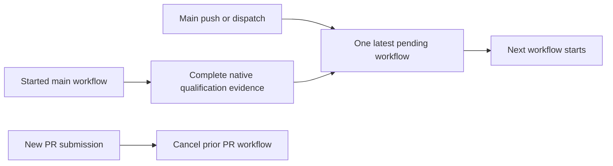
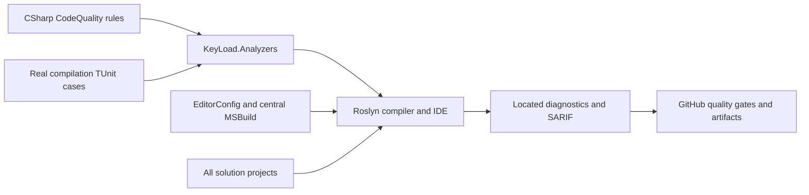
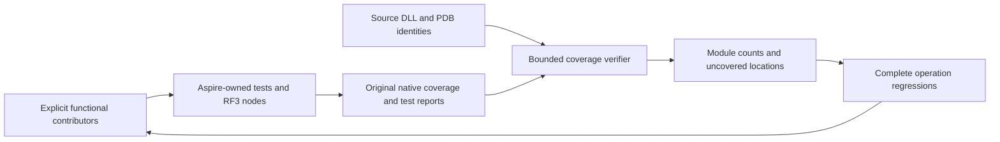

# CodeQuality

REQ-CQ-006 maps to AC-CQ-008/009 in
this Feature and the ADR-033 execution contract,
under the accepted ADR-033 numeric extension. Four source-editable enabled error
rules enforce file/type/function/nesting400/200/50/3 with real Roslyn boundary
fixtures. Actual numeric coverage, RF3 container collection and a matched numeric
baseline remain pending; restored collector presence is not coverage proof.

Developers author executable Roslyn rules in this repository and receive located
diagnostics in the IDE, compiler and CI artifacts. [ADR-033](../ADR/ADR-033-code-quality.md)
owns the import and build-policy decision. Detailed measurable acceptance and
verification cases: [working acceptance](CodeQuality.md).

## Requirements and acceptance traceability

| Requirement | Acceptance | Task / evidence owner |
|---|---|---|
| REQ-CQ-001: exact Prostir EditorConfig and strict SDK/style analysis for all projects | AC-CQ-001 | TASK-006; MSBuild evaluation, import SHA and solution build |
| REQ-CQ-002: editable KeyLoad Roslyn rules with real compiler regressions | AC-CQ-002/004 | TASK-004/005; TUnit analyzer project and CI results |
| REQ-CQ-003: independent compiler SARIF including failed-build diagnostics | AC-CQ-003 | TASK-006; compiler reports and CI always-upload |
| REQ-CQ-004: enforce quality gates and honest qualification | AC-CQ-005/006 | TASK-006; workflow, architecture/status/docs and governance |
| REQ-CQ-005: preserving benchmark source prerequisites | AC-CQ-007 | TASK-MP-010U/V/W/X; XML/private adapter review, public argument regressions and real GitHub comparison qualification |
| REQ-CQ-006: executable numeric maintainability and coverage gates | AC-CQ-008/009 | TASK-MP-010AC-W and TASK-CQ-009; real Roslyn boundaries/self-inventory; later strict coverage/export/no-decrease qualification |
| REQ-CQ-007: preserving CLI, live-query, search, redaction and site/query/storage/remaining-unit quality joins with explicit lifetime/constructor validation | AC-CQ-010/011/012/013/014/015/016 | TASK-MP-010AH-C/Q/L/QN/SA/SB, TASK-MP-010UQ/US/UTF; source parity, real null/lifetime and deterministic workload regressions, enabled builds and actual GitHub feature suites |
| REQ-CQ-008: started main qualification survives subsequent main submissions within bounded workflow concurrency | AC-CQ-017 / AC-QUAL-001..003 | TASK-QUAL-CI-QUEUE-R9; exact workflow review and live same-group run/SHA/job/native evidence under the ADR033 continuation |
| REQ-CQ-009: source-bound functional coverage and meaningful uncovered-flow repair | AC-CQ-018/019/020/021 | TASK-CQ-FUNCTIONAL-COVERAGE-001..003; original native MTP reports, contributor/source/PDB inventories, module/file/line/branch reports, actual RF3 server export and complete-flow regressions |

The website candidate's REQ/AC-BC-027 is a bounded REQ-CQ-006 dependency substage,
owned by TASK-SITE-ANALYZER-COVERAGE-011 in the [site plan](../ADR/ADR-040-static-site-threejs-evidence.md).
Tooling lives under `scripts/Features/CodeQuality/`; tests use new
SiteAnalyzerCoverage-prefixed files in this slice. The frozen JSON inventory and
ADR-033 candidate implementation contract require the native collector, immutable
sources, exact integer80/70/90 thresholds and complete diagnostic regressions.
Successful evidence establishes only the first analyzer-module baseline; global
AC-CQ-009 and RF3/container/no-decrease coverage remain pending.

Observed candidate run36988549282 executes88 regressions with84 successes and4
failures, retained native XML/TRX and no skipped analyzer case. Its next bounded
failure loop maps BC-027/CQ-006/CQ-008/009 to TASK-SITE-NATIVE-FORMAT-014 (native
decimal-display grammar with integer-only decisions), TASK-SITE-NUMERIC-REPAIR-015
(independent token-start span oracles and cohesive200-line test classes), and
TASK-SITE-DIAGNOSTIC-FLOWS-016 (meaningful KLD0001/KLD0022 flows for real coverage
gaps). Acceptance, exact disjoint ownership, staged join and GitHub verification
are in the site acceptance/plan and ADR-033 below. No native numeric pass or
broader CodeQuality completion follows from source repairs or local builds.

TASK016's genuine WriteString regression exposed a value-argument false positive.
Accepted TASK-SITE-ARGUMENT-ROLE-018 preserves that failing case, adds exact real
argument-binding regressions and first runs an unchanged-production GitHub red
baseline. The later two-file bound-parameter classification repair and016 semantic
join remain mandatory before complete native/site qualification. See the detailed
site acceptance/plan and ADR-033 implementation contract; blocked source never
unblocks final acceptance.

## Canonical slice map

AC-CQ-017 follows the acceptance and execution contract in this Feature. Main
push/dispatch submissions retain one running and the default one pending workflow
per existing workflow/ref group; a newer pending submission can replace the prior
pending one without cancelling the started run. PR replacement retains its prior
cancellation behavior. All existing jobs, actual RF3/client requirements, limits,
failure/skip conditions and artifacts remain unchanged. Source configuration is
not proof of live scheduler behavior or runtime qualification. A cancelled pending
run may have no jobs/native reports and remains explicitly unqualified. Main
behavior requires two real same-group submissions and terminal/native evidence;
PR expression review is the documented service-review exception. This changes CI
coordination only and does not establish AC-CQ-009 numerical coverage.

- Backend/tooling: `src/KeyLoad.Analyzers/Features/CodeQuality/`.
- Tests: `tests/KeyLoad.Analyzers.Tests/Features/CodeQuality/`.
- Shared build infrastructure: root `Directory.Build.props/targets`, `.editorconfig`,
  `KeyLoad.slnx`; CI infrastructure: `.github/workflows/ci.yml`.
- Durable docs: this file, ADR-033, global Architecture and implementation status.
- Frontend, database/API contracts, persistence and RF3 topology: N/A; compile-time
  policy has no product runtime entry point or stored state.

## Rules and applicability

Port from Prostir: LiteralMachineKey, ProgramEndpointMapping, GrainInterfaceVersion,
ProgramCompositionRoot, OrleansContractConstructor, SystemClockAccess,
OrleansGenerateSerializer and UntypedCatch. KeyLoad diagnostic IDs use KLD and
retain the source rule's numeric suffix. Program endpoint aggregate is MapKeyLoadApi.
Assembly/domain ownership uses KeyLoad names. Existing source violations must fail
the build; never disable these rules merely to declare a green migration.

| Diagnostic | Rule | Default severity |
|---|---|---|
| KLD0001 | Named constants for machine keys | Error |
| KLD0013 | Aggregate endpoint mapping in the server entry point | Error |
| KLD0014 | Explicit grain-interface version | Error |
| KLD0020 | Program contains composition calls only | Error |
| KLD0021 | Explicit constructor for Orleans contracts | Error |
| KLD0022 | Business code uses an injected clock | Error |
| KLD0023 | Explicit serializer ownership for Orleans types | Error |
| KLD0024 | Typed catch clauses | Warning, promoted to error by the build |
| KLD0030 | Nongenerated file code lines at most400 | Error |
| KLD0031 | Nongenerated aggregate type code lines at most200 | Error |
| KLD0032 | Executable unit code lines at most50 | Error |
| KLD0033 | Executable control-flow nesting at most3 | Error |
| KLD0034 | Typed synchronization outside Orleans activation-owned state | Error |
| KLD0035 | Named constants for all runtime numeric literals, including zero and one | Error |
| KLD0036 | Named identities for runtime strings, characters, interpolation text and format tokens | Error |
| KLD0037 | Native typed options and owned configuration binding; operational policy cannot hide behind constants | Error |

Excluded Prostir-specific rules: ProductCommandContract and ServerOwnedIdentity
assume Prostir's typed product command/Studio lifecycle; EfCoreCosmosTopLevelAny
assumes EF/Cosmos; NativeObjectStorage dictates a product/provider choice not made
by this import. No corresponding KeyLoad product contract exists. Those exclusions
do not disable any portable rule or SDK diagnostic.

## Execution and verification

Lead owns shared docs/config and final review; coding workers own disjoint analyzer
and test project trees. Acceptance cases require valid/invalid code, compiler-valid
semantic fixtures, generated/external boundary cases and precise diagnostic ID,
severity and source locations. Use actual SDK Roslyn and Orleans metadata, no
framework stubs. CI executes TUnit on Microsoft.Testing.Platform after Release
build. Reports use project/configuration/framework paths; generated/build artifacts
are ignored. Build failure must remain failure even when reports upload.

Baseline and final CI evidence belong to the plan/status, with exact run/job/SHA.
KLD0030–KLD0033 enforce the repository's file/type/unit/nesting complexity limits.
Their exact-SHA full-graph qualification remains pending. The bounded site
dependency now collects native analyzer coverage; its first complete passing
baseline remains pending. Whole-solution coverage is separate and unqualified;
this compile-time feature makes no RF3 or database-readiness claim.
Observed development gates and current blockers: [evidence](../implementation/code-quality.md).

## Authoring a rule

Add a public `[DiagnosticAnalyzer(LanguageNames.CSharp)]` class beneath the source
slice; the SDK discovers it through the central Analyzer reference. Allocate a
unique KLD identifier, define a meaningful descriptor, call EnableConcurrentExecution
and set an explicit generated-code policy, then register the narrow Roslyn symbol,
operation or syntax action appropriate for the rule. Keep metadata/message tokens
in named constants. Add valid/invalid real-compilation TUnit cases in the matching
test slice with precise diagnostic ID, severity and source location assertions.
Run the development build to collect findings; CI owns regression execution.
Update this catalog and acceptance traceability when adding or changing a rule.

## Typed synchronization correction, 2026-10-05

[ADR-108](../ADR/ADR-108-typed-synchronization.md) owns REQ-CQ-010 and
TASK-CQ-SYNC-001..004. The owner prohibits object/Monitor synchronization gates.
Scope is all KeyLoad-owned C# runtime, infrastructure, benchmark and test code;
public signatures, persisted bytes, RF3 topology and authorization stay unchanged.
Plain object identity sentinels are outside this rule because they are not locks.

- REQ-CQ-010 / AC-CQ-025: compiling an object-typed lock, a Monitor call or a
  synchronous lock in a Grain-derived activation emits KLD0034 at the offending
  expression. Real Roslyn compilations verify diagnostics, locations, aliases,
  inherited grains, generated-code exclusion and permitted non-grain Lock gates.
- AC-CQ-026: necessary short synchronous shared-service critical sections use
  System.Threading.Lock; asynchronous mutual exclusion uses cancellable
  SemaphoreSlim.WaitAsync and finally-release. No object/Monitor gates remain.
  Real lifecycle/cache/replica regressions must preserve repeated/concurrent
  disposal, shutdown, admitted work settlement and storage reopen behavior.
- AC-CQ-027: activation state relies on Orleans scheduling. Review actual lock
  owners and their callbacks/reentrancy; do not remove shared node-local storage,
  journal, apply or resource ownership gates merely because callers are grains.
  Existing real request-grain and RF3 SDK/MCP tests cover those boundaries.

Verification uses the strict complete Release build, formatter, governance,
Aspire-owned analyzers/unit/unit-scalar/recovery/rf3 suites and retained original
reports. Local checks are development evidence; source review alone cannot close
runtime or Linux qualification. Before implementation, existing unrelated dirty
work includes OrleansNode and storage/Blob/Graph/documentation repairs; preserve
it. Baseline runtime outcomes are unmeasured until the Aspire suites execute.

## Source, target and failure boundaries

Actors are rule authors, product contributors, IDE/compiler users and CI reviewers. Entry points are the two CodeQuality project slices and central analyzer attachment above. Rule source/configuration exists; the [qualification evidence](../implementation/code-quality.md) records failed full-solution build/format, newly compiled numeric rules and pending numeric coverage. Existing source violations must be repaired by their owners before complete-source qualification; no local compilation or doc review establishes passing CI, coverage or whole-solution complexity.

Positive flow: a compiler-valid fixture satisfying the contract emits no rule finding; a violating fixture emits the expected located diagnostic and fails the configured build gate. Negative flow: invalid semantic fixtures, unrecognized metadata, unwanted generated/external-code analysis or duplicate diagnostic identifiers require explicit regression assertions. Edge/error flow: failed compilation still retains SARIF and remains failure; artifact upload cannot convert it to success. New or changed rules add real-compilation TUnit cases and retain every existing assertion under the same canonical slice and ADR contract.

TASK018's real tests-first [GitHub run36991420593](https://github.com/managedcode/KeyLoad/actions/runs/36991420593)
at8d8d395f7fa6157773e0318d64f0124cd2e84579 executed103cases:96passed,
7failed,0skipped. Original numeric and native-display repairs passed; seven
compiler-valid key/value binding regressions demonstrated excess diagnostics.
After strongest evidence review, the bounded two-file argument-role repair in
ADR-033 is released. Tests and classification catalogs stay unchanged.
Actual native coverage is889/942lines,472/570branches; KLD0001passes205/224,
KLD0022fails25/30. Changed production needs fresh native source hashes and
denominators. SiteTests and final qualification remain pending; source repair
alone cannot close AC-CQ-009 or AC-BC-027. Exact failed artifacts and joins live
in the [site plan](../ADR/ADR-040-static-site-threejs-evidence.md) and
[site status](../implementation/site-design.json).

## Owner functional coverage contract, 2026-10-05

The owner requires measured test coverage without load tests and meaningful
repairs of uncovered behaviour while finalizing each module. A test must execute
a complete real operation and verify its outcome and resulting or preserved state;
getter/setter, property-only or implementation-mirroring tests are insufficient.
This extends REQ-CQ-006/009 and the accepted ADR-033 numeric contract. It does not
replace any complete mandatory suite or turn source inspection into coverage.

### Quality review repair, 2026-10-05

The owner requires repairs of the actual findings from the installed quality
bundle. TASK-CQ-REPAIR-001 follows the preserving source-repair contract in
ADR-033 and extends REQ-CQ-004/006 with the criteria below. Existing product
requirements, numeric limits, diagnostic severity and qualification gates remain
mandatory. Optional analyzer defaults which conflict with the owning EditorConfig
are reviewed individually; their raw count is not a confirmed defect count.

- AC-CQ-022: the complete current solution passes the strict Release build and
  `dotnet format --verify-no-changes`; retain failed and passing original reports.
  Compiler and analyzer repairs preserve public signatures, persistence bytes,
  signed identity, real topology, workload results and cancellation/lifetime rules.
- AC-CQ-023: review every source-bound method with native cyclomatic complexity
  above20, extract only coherent validation/execution responsibilities where
  needed, and remeasure the changed source. Preserve original evaluation order,
  short-circuiting, errors and side effects. Existing real-operation feature tests
  and the complete required suites provide the behavioral regression contract;
  numerical improvement alone does not establish correctness or performance.
- AC-CQ-024: BlobRecordReader repairs retain AC-BLOB-001–007 and add complete
  persisted-corruption operations for uncovered validation failures, asserting the
  error and unchanged canonical state. Native functional coverage must meet the
  existing90% critical-flow line and70% branch thresholds for changed validation;
  retain exact source/DLL/PDB identities and the original reports.
- AC-CQ-028: site-coverage process fixtures supply their controlled source
  revision explicitly, independently of the caller environment. Serialize the
  affected real PowerShell test cases through native TUnit scheduling so shared
  admission does not exhaust another case's subprocess budget. Preserve the
  existing process concurrency, timeout, cleanup and output bounds and all
  positive/negative parser, revision, inventory and threshold assertions. These
  controlled parser fixtures are tests, never published coverage evidence.

Execution: disjoint workers own the existing Orleans membership compiler repairs,
comparison-library compiler repairs and exact high-complexity source files. The
lead owns Blob validation/tests, compiler aggregation closure removal, shared
documentation and final integration. First finish and inspect preserving repairs;
then format, build, run the mapped tests through Aspire, collect functional
coverage and repeat metrics. Run complete unit/scalar/recovery/RF3 gates and retain
actual outcomes. No source repair closes an unexecuted or failed acceptance gate.

Continuation 2026-10-06 retains the same TASK-CQ-REPAIR-001 acceptance contract.
First capture the current strict solution-build failures and preserve the earlier
140/144 analyzer result. A disjoint test-fixture worker owns the remaining real
PowerShell copied-repository failures and current-inventory threshold oracle;
the lead owns build integration, Blob corruption regressions, formatting,
Aspire-owned suite execution, native coverage/complexity and final evidence.
The bounded worker also owns `Assert-CoveragePathHasNoLinks` in the existing
site-analyzer-coverage shared helper after profiling the real copied-repository
process. Native .NET metadata inspection may replace repeated PowerShell provider
calls only while preserving rejection of linked path segments, missing-input
failures and the original source/hash contract; verify real symlink negatives and
complete copied Prepare processes under the unchanged budget before joining.
Repair the demonstrated cause without increasing process budgets, removing
assertions or suppressing diagnostics. Review the joined diff, run analyzers and
the existing complete unit/scalar/recovery/RF3 gates, then retain a final canonical
build after all edits and formatting. Report source drift and missing coverage
explicitly; concurrent unrelated feature implementation is preserved.

The continuation also repairs the independently owned `KeyLoad.Diagnostics`
literal diagnostics without changing its ADR-063 fixed histogram/counter schema,
startup footprint, four-CAS bound, allocation behaviour or public signatures.
A disjoint worker names immutable measurement boundaries and structural values in
the existing ResourceExecution files; it introduces no operational configuration
or telemetry feature. Existing real phase-bank regressions remain the behaviour
contract, with a strict project build and final solution integration by the lead.

- AC-CQ-018: the first contributor profile is exactly the functional
  `PartitionQuery*` TUnit cases in `unit` and `unit-scalar`, through the existing
  Aspire-owned entry and native MTP CodeCoverage 18.11.2. The profile includes
  `KeyLoad.Query` production source and the actual Release DLL/PDB hashes. Use
  native static managed instrumentation when the actual platform lacks dynamic
  support, with only the inventory-owned Release test deployment module directory.
  Require exact restoration of the original DLL/PDB hashes after native settlement;
  a modified build image cannot count as original-source evidence. Retain
  both original Cobertura reports and original TRX/TUnit outcomes, including
  failed runs. Inventory exact contributors and source hashes before and after;
  missing/cancelled reports, changed source, unexpected modules, paths or integer
  counts make the report unqualified rather than zero. This is scoped evidence.
- AC-CQ-019: report per-module/file covered and executable line counts, original
  native branch counts where available, percentages and uncovered source locations.
  Never sum normal/scalar or replica duplicates. Exact line hits may be OR-unioned
  on matching module/source/line identity. Aggregate branches only when native
  evidence identifies each outcome; coarse per-line covered/total pairs alone
  cannot establish a branch union. Until then retain per-run branch counts and
  mark the merged branch result unmeasured. Preserve the mandatory 80/70/90 and
  module/no-decrease gates; an unqualified partial report cannot close AC-CQ-009.
- AC-CQ-020: complete coverage has an explicit functional contributor inventory
  and classification of every production project. Exclude all load, stress,
  performance and comparison contributors, including such cases inside an
  otherwise ordinary suite. Keep complete ordinary CI suites mandatory; a separate
  coverage selection does not qualify a full suite. Site V8 evidence stays separate.
  Collect each of the three real Docker `KeyLoad.Server` processes, bind report
  exports to exact server image/DLL/PDB/source identities, and settle the actual
  collector and AppHost-owned nodes before consuming exports. Test-host coverage
  alone does not establish RF3/server or whole-solution coverage. Freeze the pinned
  native collector invocation and lifetime/export contract before that integration.
- AC-CQ-021: for module closure, review uncovered locations against REQ/AC flows,
  implement real success/failure/edge regressions and remeasure the same source.
  Rejected operations must prove their error and preserved state. No fake provider,
  fabricated task, trivial accessor test, executable-source exclusion, missing
  report, skipped suite or ignored failure can make the gate pass.

TASK-CQ-FUNCTIONAL-COVERAGE-001 owns the bounded first profile and report under
`scripts/Features/CodeQuality/functional-coverage*`; it reuses the existing Aspire
settings/output handoff and native collector, with no new test framework or public
database contract. Root owns docs, source joins, actual collection and final review;
the Luna worker writes only a guarded private source packet. Original XML is
bounded to 32 MiB, inventory to 5,000 sources and 100,000 distinct line locations;
XML DTD/external resolution is prohibited and all accepted source paths resolve
within the source-bound production inventory. Reports are deterministic JSON and
Markdown with raw counts, contributor identities, source/DLL/PDB hashes and
uncovered locations, without user data or secrets. Existing analyzer/site coverage
settings, inventory and gate remain unchanged. Real native profile collection,
successful and rejected processing of its retained reports, source drift and
missing-report rejection provide the verification flow; authored fixture XML is
not a substitute for native evidence.

TASK-CQ-FUNCTIONAL-COVERAGE-002 expands the explicit functional inventory, native
merge/export and CI always-retained artifacts after the native identity contract
is frozen. TASK-CQ-FUNCTIONAL-COVERAGE-003 closes modules against actual uncovered
flows and the complete original acceptance/gates. Neither later task is complete
because the first scoped profile exists. No persistence or public API migration
occurs; rollback restores a coherent tooling profile and retains original reports
without disabling required quality or functional test gates.

### Compiled-source identity prerequisite

TASK-CQ-FUNCTIONAL-COVERAGE-001A extends AC-CQ-018/020 with a native read-only
identity helper under `scripts/Features/CodeQuality/functional-coverage.compiled-identity.ps1`.
Use the installed .NET System.Reflection.Metadata and PEReader APIs; do not load
or execute inspected assemblies or install another parser dependency. Root owns
this new helper and its canonical Get-Fc integration, without replacing the
existing coverage scripts or reports. ADR-033 owns its ordered verification.

Bind each actual production/test DLL to its module MVID, DLL/PDB SHA-256 and
portable-PDB debug identity, including the PE CodeView GUID/stamp correspondence.
Match every inventoried compiled source to its PDB document's native SHA-256
checksum and the actual source bytes. A current filesystem hash alone cannot
establish that the DLL compiled those bytes. Reject mismatched, duplicate, absent
or unsupported identities, links, paths outside the owned checkout and drift of
the original inputs during inspection. Bound each DLL/PDB to64 MiB and each
document/inventory enumeration to5000 entries before retaining the next entry.
Retain generated PDB documents separately with their actual checksums and explicit
unmeasured/source-binding disposition; never silently count them as inventoried
product source or infer coverage for them. Missing inventory source documents
keep compiled-source binding incomplete.

Verify through actual Release DLL/PDB/source inspection, then a real source change
against the unchanged compiled image and restoration, an actually mismatched
existing PDB, missing/duplicate inventory and bounded rejected inputs. Inspection
and rejection controls are static evidence, not functional coverage or a passing
build. Fresh complete-flow TUnit runs still execute only through Aspire; native
pre/post source/module identities and original reports remain mandatory.

For inspection of relocated original artifacts, an optional explicit original
compilation root maps PDB document names to the owned current checkout by exact
root-relative path. It is retained in the receipt, never inferred from arbitrary
suffix matching, and never followed as a filesystem location. Validate each
mapped relative path against the same confined inventory and native checksum;
unknown or escaping document roots are rejected. This also permits real
stale-source controls in an owned copy without modifying another writer's live
source. Unmapped non-executable declarations remain explicitly unmeasured rather
than invented PDB bindings.

## Magic runtime values, 2026-10-05

[ADR-111](../ADR/ADR-111-magic-runtime-values.md) owns REQ-CQ-011 and
TASK-CQ-LITERALS-001..004. The owner authorizes source-owned rules for recurring
quality defects, including magic strings and numbers. Existing const policy and
KLD0001 remain mandatory. This executable extension covers semantic runtime
policy contexts; it does not claim to implement every possible literal context.

- REQ-CQ-011 / AC-CQ-029: KLD0035 emits an enabled Error at each numeric literal
  passed, directly or through arithmetic/conversions, to native TimeSpan
  construction/factories, Task delay/timeout waits, SemaphoreSlim timed waits,
  CancellationTokenSource construction or CancelAfter. Values zero and one are
  checked too: a one-second deadline is policy, not an arithmetic identity.
  Named constant references remain valid. Application methods sharing framework
  names, implicit optional arguments and generated code do not produce findings.
- AC-CQ-030: KLD0036 emits an enabled Error at runtime string literals used in
  native string equality, string switch/constant patterns, native comparison
  methods, or native primitive/Guid/date/time ToString/TryFormat format arguments.
  Named constants remain valid; ordinary caller text, dynamic interpolations,
  unrelated APIs and existing KLD0001 key diagnostics retain their contracts.
- AC-CQ-031: real compiler-valid TUnit flows assert rejected inline expressions,
  corrected constant references, exact IDs/severity/spans, aliases/overloads,
  generated-code and external/test-data boundaries. Runtime-facing KeyLoad
  assemblies include infrastructure and benchmarks. Test-data assemblies are
  outside these two new runtime-policy rules; their existing rules remain active.
- AC-CQ-032: migrate all findings in these supported contexts with domain-named
  constants while preserving exact values, overload binding, formats, persisted
  bytes, timing and public behavior. Complete Release build and Aspire analyzer
  suite must pass; retain broader required runtime gates and original artifacts.

Scope choice: inspect source first, then add exact semantic rules and repair their
findings. A general ban would currently report hundreds of runtime values and
thousands of input-data literals; it requires a separately explicit complete
migration. Do not introduce mass numeric exemptions, suppress diagnostics, lower
severity or convert test fixtures into fabricated runtime evidence. Uncovered
literal contexts remain subject to the existing root const policy and review.
The pending owner scope clarification may expand this contract before that work.

| Task | Owner / permissions | Dependencies / start | Artifact / join |
|---|---|---|---|
| TASK-CQ-LITERALS-001 | Read-only source inventory worker | Root/local policy | Original SDK Roslyn inventory, context counts and examples |
| TASK-CQ-LITERALS-002 | Lead: semantic rules and shared contracts/docs | This acceptance contract | Compiler rules, stable catalog and source-bound coverage inventory |
| TASK-CQ-LITERALS-003 | Test worker: new MagicRuntime-prefixed files only | Frozen 029–031 | Compiler-valid positive/negative/edge flows; no shared fixture changes |
| TASK-CQ-LITERALS-004 | Migration workers on disjoint project paths, lead integration | Actual diagnostics from 002 | Preserving named constants; inspected diff; complete verification |

The SDK Roslyn baseline found 3,478 nongenerated files. Existing full analyzer
suite/build blockers are recorded in the typed-synchronization development receipt;
coverage process fixture repairs are concurrently owned elsewhere. New failures
caused by these rules belong to this task. Finish implementation and review, then
build, run focused and complete Aspire analyzers, format, final solution build and
required unit/scalar/recovery/RF3 checks. No local or source result proves delivered
Linux qualification or numeric coverage; retain original reports and precise blocks.

## General literal and centralized options correction, 2026-10-06

The owner's explicit answer selects the complete runtime migration. This
supersedes the narrower context boundaries of AC-CQ-029/030/032 above; preserve
those native API regressions and extend their expected findings. Operational
policy is configuration, so moving deadlines into per-class constants is rejected.
[ADR-113](../ADR/ADR-113-centralized-runtime-options.md) owns REQ-CQ-012/013 and
TASK-CQ-GENERAL-001..005. Runtime scope is every nongenerated KeyLoad C# product,
CLI, infrastructure and benchmark project. Test input/expected-data assemblies
remain distinct; their configuration helpers follow the same native options path.

- REQ-CQ-012 / AC-CQ-033: enabled Error diagnostics reject all runtime string,
  numeric and character literal expressions outside named const declarations,
  enum definitions and attribute metadata. Check initializer/parameter defaults,
  endpoints, reflection/function tokens, switch branches and interpolation text.
  No blanket numeric0/1/-1 exemption and no suppression baseline. Preserve native
  generated-code exclusion. Use `nameof` for an existing actual symbol; immutable
  protocol/format/corpus identities and mathematical structure use meaningful
  feature-owned constants. Metadata endpoint/alias/property strings still require
  constants through the existing KLD0001 contract and general string checks.
- REQ-CQ-013 / AC-CQ-034: operational timeouts, deadlines, retries, capacities and
  admission/resource limits are declared by scenario in typed options, centrally
  registered/bound/validated, and injected through real IOptions<T>. The selected
  frozen lifetime is IOptions<T>; dynamic monitor/snapshot adoption requires its
  operation/lifecycle contract. Remove arbitrary per-class policy const/static
  fields. Named defaults belong only to canonical options definitions. Never
  configure stable serializer field IDs, protocol bytes or qualification corpus
  criteria as deployment policy.
- AC-CQ-035: existing NodeOptions and AppHost selectors use options at execution
  boundaries. Raw IConfiguration/environment access is restricted to explicit
  central binding/composition code; feature execution and constructors consume
  IOptions. Preserve exact section/env/CLI names, unknown/malformed-value rejection,
  RF3 membership selection, signed authority, cancellation and default behavior.
- AC-CQ-036: DueCoordination dispatch deadline and poll interval come from one
  centrally bound/validated options type used by coordinator grain and grain
  service. A nondefault configured value reaches both actual callers; invalid
  nonpositive/out-of-bound values fail startup before admitted work. Real operation
  regressions preserve joined stop and no dispatch after cancellation.
- AC-CQ-037: exact native Roslyn fixtures reject a timeout hidden behind const or
  static readonly, reject direct runtime configuration reads and bare configuration
  object injection, permit centrally registered options/defaults and const/nameof
  identities, and cover all general-literal spans/assemblies/generated boundaries.
  Native `FileStreamOptions.BufferSize` assignments and explicit `bufferSize`
  arguments of native FileStream/StreamWriter/StreamReader constructors are also
  operational policy sinks, including const-backed values. Verify actual framework
  symbol ownership; same-named application members do not become native IO sinks.
  Genuine field-only immutable temporal corpus data permits its native TimeSpan
  declaration; mutable/counterfeit markers and reuse as a timeout still fail.
  Immutable JSON metadata record snapshots preserve their serialized shape; a
  genuine property marker does not permit mutable/service configuration injection.
- AC-CQ-038: complete preserving migration has no introduced literal/options
  diagnostics in the canonical full Release build; native Aspire full analyzers,
  unit/scalar/recovery/RF3 suites, format and source-bound coverage retain all gates.
  Original narrow-stage findings and test artifacts remain historical evidence.

Executable native regression helpers also use the centrally bound/validated
`NativeComparisonHarnessOptions` section `KeyLoad:NativeComparisonHarness`.
Their PostgreSQL cleanup, advisory-lock observation and pool context reset,
Redis probe lifetime, Kurrent gossip response/worker/volume bounds and original
teardown task settlement/readback limits are operational policy. Preserve each
original default and inclusive ceiling, independent capacity oracles, native
client operations and all primary/callback/cleanup failures. Actual task-state
observation must join native work before disposing its cancellation owner; a
threshold expiry never grants permission to leave that original work running.
The auxiliary native harness group also owns Neo4j/Mongo/OpenSearch HTTP and
cleanup budgets, child-process/readback/fault/readiness bounds and progress-file
write buffers. `NativeComparisonHarnessPolicyTests` exercises a configured lower
threshold using a genuine native delay/cancellation callback and validates
invalid native configuration before execution; execution evidence is pending.

Additional AC-CQ-034/035 regressions are `CentralAppHostOptionsTests` (native
bootstrap snapshot, configured timeout/filter admission, actual resource charging
and pre-resource startup failure), `PhysicalShardProfileBoundedReadTests` (configured
exact byte cap and reject-before-file writer), and configured-policy scenarios in
`ScaleServerResourceEvidenceParserTests` (valid native policy, invalid timing,
sample overflow and incomparable policies). These are authored acceptance checks;
they are not marked passing until the Aspire-owned suite runs against the rebuilt
source. Existing byte preservation, atomic publication, authentication and RF3
assertions remain mandatory when required constructor arguments are joined.

Additional AC-CQ-034 checks are `NativeComparisonAdapterPolicyTests` (inclusive
native adapter bounds and invalid-value matrices),
`TimeSeriesIntensiveDigestTests.AcCq034ConfiguredOperationTimeoutChangesOnlyItsIndependentWorkloadFrameAsync`
(independent configured-timeout digest oracle and unchanged frozen default), and
`TimescaleTimeSeriesIntensiveSessionTests.AcCq034ConfiguredAdapterPolicyReachesNativeNpgsqlSettingsAsync`
(configured policy reaches the actual Npgsql connection settings). These checks
are authored and await the rebuilt Aspire-owned suite; they do not qualify
comparative performance.

`NativeComparisonReportPolicyTests` compares original and configured lower native
CSV buffers against independent golden bytes. `VectorExecutionCadenceTests`
compares configured cancellation/yield policy with unchanged corpus payload,
vector digests and exact oracle results. `OpenLoopOriginalFailureTests` and
`OpenLoopOriginalFailureWorkerTests` exercise the production settlement path with
original native tasks and cancellation callbacks, retaining original failures
and joined disposal. These checks await the rebuilt Aspire-owned suite.

The final operational-sink audit includes configured grain reply initial buffers,
administrator failure-ring retention, native seed batches and storage stream
buffers. Existing groups retain their original defaults and inclusive ceilings;
actual allocation/chunking/file owners must consume the configured values.
`CommandInboxExecutionOptions` owns the configurable control burst separately
from serialized admission limits. Its configured lower-burst regressions retain
data fairness, lane FIFO and all failure/cancellation ownership. New seed rows in
`NativeComparisonAdapterPolicyTests` preserve native validation of inclusive
bounds. These source additions await the final integrated build and Aspire run.

`NativeTextFileStreamBufferPolicyTests` observes real unflushed file lengths under
configured lower caps, omitted native buffer arguments and smaller/unbuffered
native caller requests; invalid caps reject before file ownership. Existing
external generated benchmark consumers verify that omitted environment settings
preserve canonical typed defaults. Invalid standalone configuration is rejected
at composition before allocation; valid target validation still precedes corpus
construction. The rebuilt complete Aspire suite remains the acceptance gate.

| Task | Owner / exact scope | Dependency / join |
|---|---|---|
| TASK-CQ-GENERAL-001 | Lead: contracts, central configuration markers/options registry integration, AppHost configuration, shared config/docs | Freeze034/035 and disjoint joins before worker writes |
| TASK-CQ-GENERAL-002 | Analyzer worker: Analyzers, AnalyzerTests; independent temporary extraction tooling | This contract; general literal/options semantics and native regressions; no product writes |
| TASK-CQ-GENERAL-003 | Runtime worker: Abstractions/Core/Query/Replication/Storage*/Security plus new owning regression files | Central marker/options contract; all immutable literals and actual operational options; source-value parity |
| TASK-CQ-GENERAL-004 | Runtime worker: Orleans/Server/Client/Cli/benchmarks, excluding AppHost configuration and central registry files | Central contract; DueCoordination first, then remaining options/immutable tokens; actual callers/tests |
| TASK-CQ-GENERAL-005 | Lead: complete diff review, AppHost general literal migration, integrated gates and checkpoint |002..004 stable source; complete source-bound evidence, no skipped gate |

Integration join ownership:002 additionally owns shared UnitTests calls and exact
native package-generated source boundaries;003 owns Comparison library immutable
identities and actual adapter policy; lead owns ComparisonHost and IntegrationTests.
004 retains Server/Orleans/Client/CLI/BenchmarkScenarios. A dependency or test-call
migration does not authorize weakening assertions, analyzer severity or any gate.

Implementation order: central ownership and options marker/registration contract;
DueCoordination screenshot regression and options path; native compiler general
literal/configuration rules; disjoint complete migrations with reviewed domain
classification; integration and complete verification. Temporary Roslyn extraction
utilities may help preserve exact tokens/types but every resulting symbol has a
meaningful owner; do not introduce Literal1/value-per-number dumping or rewrite
protocol bytes. Existing record options used as public request data are not
application configuration merely because their name contains Options.

### Native test-image identity for functional coverage

TASK-CQ-FUNCTIONAL-TEST-IDENTITY-001B extends AC-CQ-018/020 under ADR-033.
The current Query-only profile must bind the actual Release UnitTests DLL/PDB
alongside the Query image. Binding only the selected 21 test/support source files
does not bind their shared helpers to the executable that actually ran them.

Before collection, enumerate every non-generated C# source under the UnitTests
project, including tests excluded from coverage contribution, and retain its
actual SHA-256. Identity inventory and accepted contributor selection have
different purposes: an inventoried load or shape-only case does not become a
coverage contributor. Verify this complete project-source inventory against the
actual compiler inputs through a receipt emitted by the same UnitTests build;
portable-PDB documents describe debug-source mappings, not every compiler input.
Reject source drift, unsafe links/paths, duplicate or unsupported identities and
incomplete compiler-input bindings. Retain generated and external debug documents
under bounded closed provenance labels without resolving external names as
repository files; they remain unmeasured. Verify every inventoried PDB row that
exists against its actual source checksum. A source with no emitted debug mapping
must still be present in the build's compiler-input receipt.
Bound traversal and retained source inventory to 5000 entries before admitting
the next entry, and do not follow directory symlinks.

Also capture the actual SHA-256 of `global.json`, `Directory.Build.props`,
`Directory.Build.targets`, `Directory.Packages.props`, `KeyLoad.slnx` and the
UnitTests project file before and after collection and in the same-build receipt.
Prepare/Verify snapshots alone do not prove which central inputs built an image.
The new helper belongs to
`scripts/Features/CodeQuality/functional-coverage.test-identity.ps1`; it reuses
the canonical path/hash/native metadata helpers and adds no alternative caller,
test runner, parser dependency or coverage framework. A Luna worker owns only a
guarded private helper packet; root owns canonical Prepare/Verify joins and
manifest integration. Existing reports remain immutable and cannot acquire
this binding retrospectively.

Prepare retains the bounded native test-image snapshot in the create-only
`functional-coverage.test-image-manifest.json` and binds its filename/SHA-256 in
the source manifest. The source manifest also records the actual Query compiled
identity. Capture both images before writing collection settings; Verify rejects
missing image bindings and reruns their native source/PDB checks, including all
six central inputs, before admitting reports. Bind every identity-helper script
through the existing script inventory. Publication cannot replace an existing
test-image manifest; a failed preparation requires a fresh owned evidence root.

Verification uses actual native DLL/PDB/source inspection and rejected stale
source, foreign/missing PDB, missing central input and unsafe-link controls.
It remains static identity evidence. Fresh complete-flow TUnit collection still
runs through Aspire after a successful current-source build; full unit/scalar,
recovery, RF3 and sixteen-module/server coverage remain required independently.

TASK-CQ-FUNCTIONAL-COMPILE-IDENTITY-001C preserves AC-CQ-018/020 while repairing
the debug-document/compile-input distinction. Its UnitTests-local
`Features/CodeQuality/Build/` target captures the actual non-generated owned
`@(Compile)` items and the six central hashes immediately before `CoreCompile`.
Emit that bounded canonical input identity into the compilation, for example as
native assembly metadata, so it cannot be attached afterwards to an older DLL.
Bind the producer target's own path/SHA-256 separately in that emitted receipt
and in the outer source manifest; it does not replace or expand the six central
inputs. The canonical native PE reader verifies the receipt from that same image and
retains DLL/PDB hashes, MVID and matching PDB GUID/stamp together. Reject missing,
duplicate, malformed, oversized, stale or unsupported receipts; preserve the
complete source inventory and central-input drift checks. Build-generated receipt
code is generated infrastructure, excluded from production coverage contribution.
Root owns the feature/ADR contract, project import and Prepare/Verify joins; a Luna
worker supplies a guarded private target/reader/helper packet. Use real build
metadata and accepted/rejected native image flows to verify this task. Static
inspection of an older image may reproduce a defect but cannot qualify new source.

TASK-CQ-QUERY-COHESION-091F is a bounded continuation of TASK-CQ-REPAIR-001,
REQ-CQ-004/006/007 and AC-CQ-022/038. Review the current Query source before
repairing remaining KLD0031 findings; concurrent capability, row-projection and
predicate-normalizer extractions are preserved. A Luna worker may extract the
actual PreparedQuery ordering responsibility into a feature-local execution
helper, preserving worst-first admission, exact ordering/ties, full entity
references, allocation reservations, release, limit and read-budget behavior.
Do not split the same oversized type into more partial files or suppress its
diagnostic. New operational configuration continues through native IOptions;
immutable ordering mathematics are named domain constants. Root owns live joins,
current-source native build/format and existing complete query-operation,
continuation, budget and failure flows through Aspire. Source-only review does
not establish a passing test or coverage result.

TASK-CQ-NATIVE-ORLEANS-091F continues TASK-CQ-GENERAL-003/004 and
AC-CQ-022/034/038. Review current-source native Orleans/CLI findings before
repair: validated IOptions dependencies reject null before first use; immutable
domain/protocol/mathematical tokens retain their exact original values. The
native stream drain/lifetime, membership constructor and recurring-wait join
signatures put their original cancellation token last and update every actual
caller coherently. Preserve token identity, primary/failure ordering, original
CQRS IAsyncEnumerable settlement/backpressure, RequestContext isolation, RF3
membership and node-local ownership. No caller or serialization alias/field ID
may drift. Repair circular CLI exit-code constants from their actual historical
command behavior. Luna owns a guarded private current-source Orleans/CLI packet;
root reviews the public/internal caller join, builds with enabled analyzers and
runs existing complete request/stream/membership/recovery/CLI flows through
Aspire. No suppression, alternate transport or ManagedCode consumer workaround
is admitted; new dependency defects retain their owning-repository release rule.

### Native complete functional cohort and RF3 collector contract

TASK-CQ-FUNCTIONAL-COVERAGE-002 continues REQ-CQ-009 and AC-CQ-018..021 under
[ADR-033](../ADR/ADR-033-code-quality.md). This is an accepted implementation
contract, not a collected result. The first prefix-selected Query prototype is
not an admissible complete contributor inventory: each selected method must be
reviewed as an actual operation flow. Preserve that prototype's immutable source
and any original reports as scoped history; do not relabel metadata-only cases
as functional execution or reuse a stale test image.

- AC-CQ-039: a closed source-bound manifest identifies every admitted case by
  suite, full namespace, class and method, related feature REQ/AC and executed
  modules. Each admission records the real operation, independent outcome and
  resulting or preserved state. Run finite exact method selections through the
  existing Aspire suites; a class selection is allowed only when every selected
  method is admitted. Verify exact actual TRX identities and all parameterized
  instances. Reject omissions, extras, changed source, failed or skipped cases.
  Load/stress/performance/comparison and accessor/shape/source-inventory tests
  remain outside product coverage even if included in a mandatory ordinary suite.
- AC-CQ-040: retain original native binary `.coverage` files and native conversions
  for each admitted invocation. Native CodeCoverage18.11.2 binary merging uses
  an explicit verified report list and identical production DLL/PDB/MVID/source
  identities, never a directory glob. Do not sum duplicate denominators. Require
  repeated-input merge invariance and native integer line/branch counts before
  accepting a merged outcome result. A per-line Cobertura branch fraction alone
  still leaves branch union unmeasured. Keep originals, tool logs, outcomes and
  bounded deterministic source-mapped uncovered locations. Missing evidence is
  unqualified, not zero; the existing80/70/90/no-decrease gates are unchanged.
- AC-CQ-041: server contribution comes from the original three server processes
  inside the existing ClusterFixture-owned ephemeral Aspire RF3 graph. A finite
  reviewed non-kill functional selection records its actual fixture roster and
  exactly three collectors per fixture. Kill/restart/recovery/fault cases remain
  mandatory in their complete suites and retain their own evidence; they cannot
  contribute an assumed final collector flush. No independent Docker deployment
  or parallel AppHost is admitted. Every original server, collector, readiness
  and observer task must settle before reports are read, retained and the owned
  fixture root is deleted. Every failure path preserves primary-first errors.
- AC-CQ-042: collector preparation is an Aspire-owned dependency before the test
  runner starts. Use the same native Microsoft coverage engine18.11.2 as MTP,
  with an explicitly centrally pinned CLI package download; no global tool
  installation, Coverlet, VSTest or second coverage framework. The test-only
  Linux-x64 image copies the already built/published original server closure
  without recompiling it, verifying matching DLL/PDB/MVIDs against the selected
  test deployment. Bind the native tool package/files, pinned base image, actual
  derived image identity and each original output to the exact source cohort.

The complete production roster is Abstractions, Analyzers, AppHost, Artifacts,
Cli, Client, Core, Diagnostics, Orleans, Query, Replication, Security, Server,
ServiceDefaults, Storage.IO and Storage.ZoneTree. Compile-time Analyzers and
Aspire test/deployment coordination retain explicit separate infrastructure
qualification. Executable Abstractions, Diagnostics and ServiceDefaults code
remains production source: shared contracts or startup/telemetry responsibilities
do not make it N/A. Unexercised executable code remains an uncovered gap.
Generated compiler-only infrastructure may be classified separately with an
exact source reason; never remove executable source to raise a percentage.

The server wrapper launches one original native `collect --server-mode` command
with an exact session, settings and binary output and one native `connect` to
that same session. Its feature-local target wrapper launches exactly one
original `dotnet KeyLoad.Server.dll`, retaining its PID, Linux process-start
fingerprint and actual wait exit status. On Aspire stop the owner verifies that
original target identity, requests its graceful TERM, joins the original
target/connect tasks, then shuts down and joins the same native collector.
It writes a create-only terminal receipt
only after native settlement; requested stop, a snapshot, a wrapper timeout or
a later replacement process is not settlement proof. Native SIGTERM/exit/flush
behavior must be proved with the actual Linux tool/server before qualification.
Dedicated per-fixture/node report mounts are separate from database `/data`.
Configured limits, IPC/shutdown duration and report/path/roster bounds live in
validated native IOptions captured at their composition owner and passed to
actual execution; consumers have no duplicate defaults or raw policy reads.

Ownership is `scripts/Features/CodeQuality/` for closed manifests, native tool
invocation, test-only image/wrapper, identity/report verification and retained
artifacts; `src/KeyLoad.AppHost/Features/CodeQuality/{Configuration,Contracts,Identity,Resources}/`
for validated test-only preparation and resource dependencies; and
`tests/KeyLoad.IntegrationTests/Features/CodeQuality/{Configuration,Fixtures,Helpers}/`
for scoped fixture selection/export. Root owns the existing TestSuiteResources,
ClusterFixture, central package, solution source map and CI joins. Workers supply
guarded private packets. No product request, persisted format, replica receipt,
public SDK/MCP contract or authorization boundary changes in this stage.

Verification executes meaningful native success/denial/state-preservation flows,
actual collector stop and report export, then native same-image merge. Also
exercise missing/corrupt/replaced/mismatched reports, altered source/image/tool,
unexpected contributors and failed cleanup with a healthy follow-up where
applicable. Preserve full unit/scalar/recovery/RF3/analyzer/site gates separately
and always-upload originals after failures. CI source-only settings, private
fixtures and partial reports do not close this contract or any original task.

TASK-CQ-NATIVE-COVERAGE-OPTIONS-001 freezes the one native AppHost options
snapshot before image preparation. Section KeyLoadTests:NativeCoverage owns
descriptor/files/path/manifest/report and lifecycle policy. Defaults are64KiB
descriptor,4096 files,2GiB total closure,256MiB individual file,4096 path characters,
16MiB context manifest and256MiB native report. The JSON descriptor uses the exact
server/base/tool identity and bounds shape released to the image worker; Node
receives its descriptor byte limit explicitly and enforces the immutable1MiB
descriptor-format ceiling, without an operational default.

Validate at least two closure files, readBufferBytes no larger than an individual
file, and the context manifest no larger than either the file or complete closure
limit. The AppHost and materializer enforce the same captured relationships.
The comparison suite rejects coverage settings, output and format selectors
before creating its runner; load and performance execution cannot become a
functional coverage contributor through that entry point.

Native shutdown defaults to10 seconds, original chain settlement to20 seconds,
container stop to45 seconds and complete three-node application cleanup to180
seconds. Validate positive whole seconds, shutdown+settlement strictly below
container stop and application cleanup above the three-node stop budget. Compose
the Docker stop policy through Aspire's native WithContainerRuntimeArgs at the
test-only coverage resource; retain actual inspected runtime stop behavior and
original collector exits before claiming qualification. Native testing must
prove that DCP honors this policy; an API/descriptor alone is not flush evidence.
Timeouts fail without a successful terminal receipt. Full fault suites do not
inherit an assumed graceful-flush result. The tool version is read from native
AppHost assembly metadata emitted from the central package property, never a
second runtime version literal. Root owns registration and fixture/cleanup joins.

The closed native descriptor bounds also include readBufferBytes, default64KiB
and bounded by the one native options definition. Both hashing and copy readers
consume that exact captured buffer; they do not embed a second operational
buffer in Node format constants. Image tooling is split by descriptor contract,
bounded filesystem, native tool closure and context/CLI responsibilities under
the existing400-file/50-function/three-level limits. Linux-x64 collection covers
all original KeyLoad runtime assemblies in the selected server closure, with
AppHost/Analyzers still separately qualified infrastructure. Dynamic managed
instrumentation preserves admitted DLL/PDB bytes. The wrapper cannot publish a
successful terminal while an original Server child remains alive; actual native
process identity/exit settlement remains mandatory before report admission.

The native server-mode/connect split replaces the unproved assumption that a
collector shutdown also stops its application. It is one collector/session and
one server per existing RF3 node, not another deployment. No replacement target
or snapshot qualifies. Target identity and exit receipts are create-only and
bound to that node/session/image/context/source. The overall settlement watchdog
starts once at the original stop request and covers target/connect/collector;
IPC shutdown consumes its configured bound inside that lifetime. Timeout,
identity reuse, missing exit witness or any nonzero original exit publishes no
successful terminal. Root must still prove actual Linux behavior through Aspire.

The preparation resource reads both the exact engine version and restored
package root from native AppHost assembly metadata generated by the same build.
KeyLoadNativeCoverageToolVersion uses the central version property;
KeyLoadNativeCoveragePackageRoot uses its actual NuGet package root and that
same property. Missing, duplicate, relative or inconsistent metadata fails before
preparation. The materializer still validates and hashes the original package
closure; metadata alone does not prove collection, image identity or coverage.

TASK-CQ-PRODUCTION-IDENTITY-003 freezes the additive canonical manifest before
native binary-merge implementation. The Query v2 manifest and its original reports
remain scoped history. The new create-only
`functional-coverage.production-source-manifest.json` has schemaVersion3 and the
closed fields sourceRevision, repository, contractSha256, compiledProducts,
compiledTestsManifest, compilationProducer, contributors, settingsSha256 and
scripts. Every referenced file has its observed original SHA256; metadata alone
does not qualify a build or contributor.

- AC-CQ-043: compiledProducts has exactly the16 modules listed above, once each.
  Each entry has the exact fields module, role, sources and compiledIdentity.
  Only KeyLoad.AppHost and KeyLoad.Analyzers have role infrastructure; the other14
  have role production. sources retains each actual owned source path/SHA256.
  compiledIdentity is the native Read-FcCompiledIdentity result, including the
  original DLL/PDB paths/hashes, moduleName, MVID, PDB GUID/stamp, source-checksum
  documents, compilation/inspection roots, identity-tool hash and complete/missing
  source bindings. Unknown, repeated, changed or incomplete module identity fails.
  The merge descriptor references this authoritative collection and does not
  manufacture another compiler identity table.
- AC-CQ-044: compiledTestsManifest is an explicit array of suite, fileName and
  sha256 references to original native test-image manifests. Unit and scalar may
  reference the same original image; recovery and RF3 must bind their own actual
  image. Each selected contributor retains exact suite/class/method/instance,
  related feature REQ/AC, operation/outcome/state and executed-module admission.
  Every original selected TRX and native test outcome must match that inventory.
  Native source/central-input/producer compile receipts remain mandatory; a later
  filesystem snapshot cannot establish an older test compilation.
- The exact v3 contributors shape is an array of objects with only suite,
  className, methodName, instanceName, requirements, acceptance, executedModules
  and operationOutcomeAndState. suite is unit, unit-scalar, recovery or rf3;
  identifiers match the original native TRX case, including data instances.
  requirements and acceptance are nonempty unique feature REQ/AC arrays,
  executedModules admits only canonical production modules, and the nonempty
  operationOutcomeAndState records the reviewed complete executed flow and its
  observed outcome/state. Source bytes bind through that suite's original native
  test-image manifest; a description alone is not execution evidence. Tooling,
  load, stress, performance and comparison cases are not product contributors.
  All fields and identifiers use the captured descriptor/path bounds.
  Each native merge suiteRuns row additionally binds
  testImageManifestSha256 to its exact compiledTestsManifest suite entry; the
  original functional report and TRX are independently hash/exit checked.
- Native merge suiteRuns uses only suite, runId, sourceRevision,
  sourceManifestSha256, testImageManifestSha256, nativeExitCode, functionalReport,
  trx and coverage. File references have only path, length and sha256, confined
  below the original evidence root. nativeExitCode is the observed original
  Aspire-owned runner completion and must be zero, never an inferred value.
  functionalReport references the unchanged original TUnit JSON report,
  schemaVersion1. Its native assembly/suite and complete group/test identifiers,
  passed status and integer summary must agree with the original TRX and admitted
  contributors; failed/skipped/cancelled/timed-out/flaky or unexpected cases fail.
  coverage references the original native MTP binary, not a rewritten XML report.
  The native framework report keeps its original supported metadata fields;
  closed custom descriptor keys do not authorize rewriting that report.
- v3 scripts entries have only name and sha256, with unique safe basenames under
  scripts/Features/CodeQuality/. Bind the complete actual functional-coverage*
  executable/settings/contract inventory (ps1, mjs, sh, xml, json and dockerfile),
  plus the owned .dockerignore. Hash and compare the complete inventory before
  and after native execution; additions, removals, links or changed bytes fail.
  Identity-tool and canonical compilation-target hashes retain their independent
  compiledIdentity/compilationProducer bindings. Source revision is the original
  candidate HEAD, contractSha256 binds the original frozen production contract,
  and settingsSha256 binds the original captured collector settings. No guessed
  exit, synthetic TUnit report or mutable late compilation snapshot is admitted.
- AC-CQ-045: MTP reports and RF3 fixtures are separate explicit groups. Unit and
  scalar runs do not acquire a fictitious server roster. Each actual contributing
  RF3 fixture supplies exactly three original node context/terminal/report records.
  Merge/export starts after the original contributor invocations and collectors
  finish. Native tooling-operation proofs are excluded product contributors;
  missing finalized fixtures remain an open gate, never an invented report.

Root owns new production inventory/compiled-identity tooling, existing native
test-compilation receipt joins, AppHost preparation and finalized artifact roster.
The Luna merge worker owns only new native-merge consumers and complete native
tooling-operation regression packets. The image worker owns actual materializer
operation proofs. Root verifies fresh original PE/PDB/source equality, changed
input rejection with unchanged originals and healthy follow-up, then actual
Aspire normal/scalar/recovery/RF3 collection and post-settlement merge. Existing
80/70/90/no-decrease and complete delivered-source Linux gates remain mandatory.
Rollback removes the coherent new tooling/joins and preserves every original
report and v2 scoped record; database data, public protocols and replica topology
are unchanged by this tooling stage. ADR-033 remains Accepted until these gates
have their required evidence.
