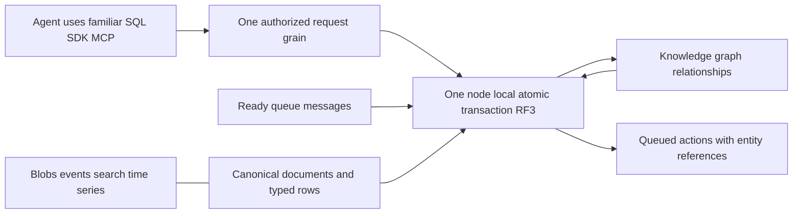

# DatabaseComposition

KeyLoad is one database for AI agents. Documents, typed tables, graphs, blobs,
queues, events, vectors/search and time series coexist and reference one another.
Tables, collections and queues are logical resources inside that database. SQL is
the familiar shared language for reading and combining them and writing results.
The central product flow is queue -> linked entities -> knowledge graph, and the
reverse graph -> queued actions, inside one authorized bounded database request.

Status: bounded procedural source implemented; exact-source GitHub qualification
and full declarative SQL remain pending. Owner direction 2026-10-03.
[ADR-067](../ADR/ADR-067-composable-agent-database.md) fixes the first executable
stage. Full declarative SQL across every model remains required under
[QueryExecution](QueryExecution.md)/ADR-065. This is not independent model stores
joined by a client-side workflow.

| Requirement | Acceptance | Task / automated or manual evidence |
|---|---|---|
| REQ-COMP-001: one database and canonical cross-model identity, SQL central | AC-COMP-001/007 | TASK-COMP-001/003/004; product content tests, native serialization, lead review |
| REQ-COMP-002: queue-to-entity-to-graph server derivation | AC-COMP-002/004 | TASK-COMP-002/004; real ZoneTree + actual SQL SDK/MCP RF3 |
| REQ-COMP-003: graph-to-queue server derivation | AC-COMP-003/004 | TASK-COMP-002/004; real ZoneTree + actual SQL SDK/MCP RF3 |
| REQ-COMP-004: persisted source/target/row/field authorization and stable retries | AC-COMP-005/007 | TASK-COMP-002/004; real policy, replay and scope errors |
| REQ-COMP-005: bounded deterministic same-partition atomic execution | AC-COMP-004/006 | TASK-COMP-002/004; cumulative limits, late rollback, real reopen, real process-kill atomic recovery and identical replica commands |
| REQ-COMP-006: honest syntax, qualification, performance and publication | AC-COMP-001/008 | TASK-COMP-003/005; content tests, integrated checks and exact-source Actions receipts |
| REQ-COMP-007: README and landing present one AI-native product thesis | AC-COMP-009 | TASK-COMP-008 (ADR-067 stage 8); SiteProductThesisTests and lead prose review |

Canonical slice map: Abstractions/Core/UnitTests/IntegrationTests/RecoveryTests/CrashHost
`Features/DatabaseComposition/`; shared Mutation/ApplyMutations/authorization joins
remain genuine shared primitives. Existing QueryExecution SQL CALL, ClientApi SDK
CommitAsync and MCP catalog need no alternate executor. Frontend product copy
lives in the existing BenchmarkComparisons landing entry (global presentation
join); no composition editor is delivered (N/A: API-first stage). Client DTOs are
the shared Abstractions contracts; separate client facade N/A because CommitAsync
already carries these typed mutations. Storage N/A for a new engine: every derived
effect uses existing node-local ZoneTree/native WAL, atomic and RF3 journals.

QueueToGraph and GraphToQueue expand to ordinary UpsertEdge and EnqueueMessage
effects inside the ordered existing transaction. The source payload is a
QueueGraphLink with canonical EntityRef endpoints. Source queue messages remain
Ready; projection does not receive or ACK. Source/target field grants are checked
before copying. Hidden graph neighbors follow existing traversal rules. Derived
IDs are deterministic; overflow, malformed/missing/foreign entities, protected
fields or collision fail all effects. No cross-partition/global snapshot or blob
mutation batching is implied. The acceptance below defines exact states, caps, errors, rollout, rollback and
test mapping; ADR-067 owns ordered implementation and agent join gates.

Qualification requires build, TUnit normal/scalar, real process recovery and
Docker/Aspire RF3 via .NET and official MCP. Local development results remain local;
no performance acceleration, power-loss or production-readiness claim is inferred.

## Source stage acceptance contract

In scope: requirements/ADR/product copy; QueueToGraph and GraphToQueue typed
mutations; existing CommandRequest, SQL CALL, SDK and MCP; real ZoneTree and RF3
tests. Out of scope of this stage: arbitrary SQL joins, PostgreSQL transport,
cross-partition atomicity, queue lease/ACK changes, blob lifecycle batching,
storage/replication format replacement and fabricated performance/publication.

Actors: persisted authenticated agent/admin; public canonical command through
HTTP/.NET/official MCP or SQL envelope. No supplied trusted roles. Orleans keeps
one request grain; physical hosts retain ZoneTree/native WAL and RF3 ownership.

| ID | Pass / fail conditions | Tests / review |
|---|---|---|
| AC-COMP-001 | Rules, ADR, feature, architecture, design, README and site lead with coexistence, canonical links, familiar SQL and both directions; distinguish current stage from complete SQL | SiteDatabaseCompositionTests + lead full doc diff review; prose review is the explicit manual exception |
| AC-COMP-002 | QueueToGraph reads all live Ready messages within the supplied cap at the committed evaluated time; resolves visible same-partition canonical From/To; writes graph edges with deterministic prefix+message IDs; never leases/ACKs/sweeps | real-ZoneTree queue projection/empty/scheduled/expired/overflow/malformed/hidden/missing/cross-partition cases |
| AC-COMP-003 | GraphToQueue uses authorized bounded traversal on the transaction view; enqueues one canonical QueueGraphLink payload per visible edge with deterministic prefix+edge IDs; no hidden attributes/endpoints escape | real-ZoneTree reverse/hidden/permission/field/budget/collision tests |
| AC-COMP-004 | Ordered mixed mutations read prior staged writes; expanded effects, indexes/adjacency, queue counters, outbox and receipt share one commit; any error resets every domain effect | mixed batch success and late-error rollback tests, real store reopen |
| AC-COMP-005 | Each source/target/resource/row/field authority is checked against persisted policy; unchanged-ID replay returns same receipt without duplicate effects; changed payload conflicts; current permission/field revocation denies replay | real principals/field policy/receipt/duplicate cases |
| AC-COMP-006 | One cumulative read-byte budget and expanded MaxBatchMutations bound cover entire batch; overflow rejects all, never truncates silently; reads materialize before writes; replicated derivation uses deterministic bounds without local wall deadlines/cancellation | byte/count/multiple-composition/exact-cap/replica-determinism cases; code review of callbacks and apply clock |
| AC-COMP-007 | Native DTOs have stable aliases/IDs; public polymorphic JSON preserves old shapes; SQL canonical CALL needs no second gateway/operation kind; fresh request routing remains | serializer roundtrip + frozen pre-composition native writer fixtures + SQL compiler + actual RF3 .NET/official MCP forward/reverse/retry/error tests |
| AC-COMP-008 | Build/formatter/governance and relevant TUnit tests pass; exact-source Actions full normal/scalar/recovery/RF3 remain separately recorded, website publication requires existing complete Benchmarks pipeline | retained source/SHA/commands/reports in implementation receipt; no numeric coverage claim without collector |
| AC-COMP-009 | README and landing both state the same theses: KeyLoad is an AI-native database; agents shouldn't need a dozen databases; why we think one database is the future; why .NET, Orleans and ZoneTree. Neither surface claims production readiness. README theses are its section headings and lead sentence, not navigation links; landing theses are visible `<main>` copy, not metadata. Fail if either surface drops a thesis or matches the forbidden-claims pattern | SiteProductThesisTests (README headings, landing main copy, forbidden claims on both, all-missing and one-missing cases); prose and SEO review is the explicit manual exception |

Frozen DTOs: QueueGraphLink(From EntityRef, To EntityRef, Label string,
AttributesJson string = "{}"); QueueToGraph(Graph string, Queue string,
EdgeIdPrefix string, MaxMessages int = 100) : Mutation(Graph);
GraphToQueueMutation(Queue string, Graph string, Start EntityRef, MessageIdPrefix string,
MaxDepth int = 3, MaxVertices int = 1000, MaxEdges int = 100) : Mutation(Queue).
Bounds come from named constants plus configured limits. Queue payload must
strictly deserialize as QueueGraphLink with visible, authorized required fields.
Projection requires all source payload raw-read/raw-use grants and target writes,
including headers for derived enqueue; denial fails the whole command. This first
stage copies an authorized link, not arbitrary document content. Graph traversal
preserves its existing hidden-neighbor omission behavior.

Expansion yields existing UpsertEdge/EnqueueMessage mutations, so receipts and
outbox describe actual effects. Zero selected edges/messages produces no effects.
Source-ready overflow (including expired entries examined) rejects with
BudgetExceeded. Stable command IDs replay the original outcome; a new ID with
colliding derived edge/message IDs rejects (edge ExpectedRevision=0). All resources
must share catalog transaction domain and exact PartitionRef; other scopes reject.
Commands execute deterministic apply, using one frozen monotonic read-budget clock;
public admission/cancellation semantics remain unchanged. New DTOs are additive;
homogeneous binary rollout is required before issuing new types to old nodes.
Rollback removes new producers/advertisement, not committed primitive data.

Reviewed authority refinement: successful composing outcomes retain bounded native
canonical endpoint references (plus explicit reverse starts) privately in the same
StoredOutcome transaction, optional appended field ID5. Internal MutationReceipt
field ID4 retains refs only for explicitly expanded primitive effects and is
ignored in public JSON. This supports later delete/update effects without reading
final target records or guessing effect origins from ID prefixes. Stable replay reauthorizes
those saved rows and source/target grants without reading source selections again.
Missing authority for a composing outcome fails closed. No public JSON authority
field and no trusted caller input. Tests must change RowAccess with unchanged
principal and verify denied retry, and change source data then verify identical
original receipt/no extra effects. GraphToQueueMutation is the pre-delivery C# type
name refinement required by CA1711; discriminator/alias/semantics stay unchanged.

Initial entry boundary: only standalone CommandRequest batches accept composition.
Handler/subscription/projection inbox Effects reject these types explicitly with
UnsupportedCapability before effects; existing primitive effects remain. Future
lease/ACK composition requires a separate inbox saved-authority replay contract.

## Evidence and remaining delivery gates

The source-stage receipt (report removed from repository)
retains the initial source packet and historical development/Actions results. The
latest integrated receipt (report removed from repository)
records original Linux Actions for `ca7e22d9c201304f0b81f59f3a0ae18e4125be37`:
32/32 composition unit cases, 7/7 composition process-recovery cases and both
SQL/.NET/official MCP RF3 composition cases pass. The complete process-recovery
suite passes 194/194 and genuine Docker/Aspire RF3 passes 67/67. Build, formatter,
governance and analyzers pass. The normal unit suite passes 2573/2576 with three
errors; the complete scalar suite is skipped, so full qualification remains open.
Local development results and process kills do not prove GitHub scalar or
power-loss qualification. Website source is updated; publication waits for the
existing complete Benchmarks/site gates. Full model SQL sources/joins/DML, native
client sessions, distributed composition and comparable performance remain
mandatory future stages.

## TASK-KL095-TOPIC-SQL-COMPOSITION-COLD-001 — actual composition cold/current-grant continuation

REQ-COMP and AC-COMP-004/007 retain the existing same-partition native QueueToGraph/GraphToQueue pipeline, fresh per-mutation persisted permissions, bounded staged source reads and atomic original receipts. AC-COMP-SQL-COLD-001 extends the SAME AC_COMP_007 real RF3 case, preserving AC_COMP_004 late invalid-reference rollback, all original arguments/assertions and the original two-minute caller lifetime. It retains the genuine forward AND reverse command/receipt before disposing clients, performs first same-volume cohort cold, compares complete original documents/graph/queue inspection records and replays both receipts through actual SDK, official MCP and both Q1 routes. A separate configured same-partition graph isolates current GraphWrite refusal for a mixed document+QueueToGraph operation. Exact PermissionDenied/no-value across the actual four routes leaves the marker absent, new graph empty and all original models unchanged. After actual persisted policy restoration, replay of the FAILED original command stays failed; a distinct command commits its actual marker plus two graph edges, full receipt/model checks hold, then a second same-volume cold and fresh credential session replay all original and healthy receipts.

Native authority remains unchanged: QueueInspect+GraphWrite for forward; GraphRead+QueuePublish+DocumentsRead for reverse, plus existing source field use/raw read and target write policies. No native provider, signing, activation, schema, dispatcher, source ACK/claim, quotas, clock, timeout, retries or distributed transaction is added. New purpose roles are CompositionSqlColdState/Capture/Assertions/Authority/Trial. Capturing actual public records does not replace independent literal edge/link checks already in the original case. Shared source snapshots and client cleanup reuse original owners/failure ledgers; narrow shared RF3 scheduling stays unchanged and Unit50 remains mandatory.

See QueryExecution TASK-KL095-TOPIC-SQL-COMPOSITION-COLD-001 for TopicEvents=2 using the same native cut, payload/header policy and public cold contracts. Root must compose its exact append with the earlier pending-DLQ SQL guard documents once, preserving both bodies. Source-only authored stage: coherent build, native typed UID discovery and delivered-source Linux normal/scalar/process/RF3 qualification remain OPEN. Declarative queue↔entity model JOIN/DML and full SQL/client-wire conformance remain explicitly unsupported/pending; existing procedural CALL composition is not relabelled as full SQL.

### TASK-KL095-TOPIC-SQL-COMPOSITION-COLD-001 — current Phase2/PendingDeadLetter source rebase

This finite successor preserves the original R1 source contract, all eight Topic query fields and unchanged source/position/generation, current Query+TopicsRead field privacy, original raw/result/cancel budgets, same-generation purge, four actual Unit declarations, four original RF3 route arguments and existing complete CALL composition/cold cases. Preserve the current PendingDeadLetter SQL documentation and Phase2 pending/parked/order/current capability semantics; Topic is a pure existing event-source reader, not a new queue decoder or a replacement query inventory. All original public aliases/field IDs/operation IDs and SQL/Q1 version declarations remain exact; TopicEvents appends after Events/QueueMessages, and full SQL/JOIN/DML/client-wire gates remain OPEN.

Native API preflight establishes SourceHead/SourceRecord in the same DatabaseEngine partial and SourceEventReader's exact Topic source+position validation; IKeyValueView.ReadOwnedValue is an instance member, while StorageRecords.GetRecord is the existing KeyLoad.Storage extension. SqlRf3Protocol belongs to KeyLoad.IntegrationTests.Features.QueryExecution, and original request/AST/event/data/row/permission constructors retain their current shapes. Correct the private composition tuple to global::KeyLoad.GraphTraversal so the sibling GraphTraversal namespace cannot capture the type; materialize the original direct-or-Q1 official MCP request into an explicitly bounded object before generic CallAsync<T>, preserving the exact DTO value and official Arguments serializer. No API/signing/transport/schema/lifetime behavior is changed by these compile-intent corrections.

Root alone joins, builds/analyzes, discovers native identities and executes current-source Linux normal/scalar plus real process and Aspire RF3. Focused canonical selections after coherent build are scripts/Features/TestInfrastructure/run-tests.mjs with Suite=unit or unit-scalar and Filter=/*/*/(TopicSqlNativeTests|TopicSqlNativeRecoveryTests)/*, and Suite=rf3 with Filter=/*/*/(TopicSqlRf3Tests|DatabaseCompositionRf3Tests)/*. Preserve native50 ordinary and existing exclusive RF3 fixture groups, original deadlines, every original required suite and exact source/DLL/PDB/runtime/cleanup artifacts. Declarations/arguments/previews are not native UIDs, compiler success or PASS.

## TASK-KL091-DOCUMENT-CAS-COLD-001 — same original failed command after cold

REQ-MSG-005/AC-MSG-005, REQ-DSTORE-004/006 and AC-DSTORE-004/006 retain the existing native transaction/process gates and the SAME QueueProducerAtomicRf3Tests false/true Args, original deadline, signed authorization, grants, response-cancellation flow and two cold cycles. Original producer17 already covers triad success, event precondition, queue quota/duplicate/domain refusal, complete original and fresh healthy receipt/model/cold operations. This additive test-only edge closes the missing public document-CAS precondition replay: stage a genuinely new event first, then PutDocument of the original existing document with independent ExpectedRevision0; require RevisionConflict before the remaining queue effect. No product/API/schema/persisted IDs or quota change.

Retain the SAME actual CommandRequest and complete original safe five-field Problem. SDK, official MCP and both Q1 routes must return null success body and exactly that semantic Problem before and after first real same-root RF3 cold restart. Each rejection is immediately followed by full four-route original document/event/head/message/scheduled-image equality, refused document/message absence, empty refused stream with independent head0/first1/generation1, then the original full receipt replay and unchanged images. Problem JSON comparison preserves every field/value/null and never compares volatile outer execution IDs. MCP output must omit private credential/payload. Native physical read cuts remain current per real request, not falsely invariant across replicated failure metadata.

Original policy epoch demotion/repair, historical receipt refusal, actual fresh healthy event sequence2 (proving failed event sequence/dedup was rolled back), original ready/scheduled counters, ACK and second same-root cold continuation remain intact. No invented failure, wait, fallback, polling, retry or longer timeout. Ordered integration: this appendix and ADR024/DatabaseComposition source map; two feature-local helper/assertion owners plus the existing Trial and named fixture literal; native previews and guarded join; canonical compiler/analyzers/formatter, original Unit normal/scalar and genuine process cases, full current-image Docker SDK/official MCP/Q1 two Args. Source/native preview does not qualify runtime UID or acceptance; root retains full exact-source/image/PDB/discovery and cleanup gates. Rollback removes only this additive test/doc edge with exact guards, never stored data or product behavior.
