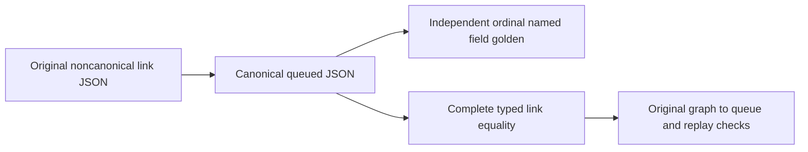

# DatabaseComposition RF3 payload oracle

REQ-SQLC-003 / AC-SQLC-003C preserves AC-COMP-007 under
[ADR-065](../../ADR/ADR-065-full-sql-client-compatibility.md) and the existing
[DatabaseComposition contract](../DatabaseComposition.md). Source ca22 original
RF3 run37124217640/job111206387125 has66pass/1error: the positive stops at queued
payload insertion-order equality before reaching reverse flow. No green claim.

The original real Docker RF3 SDK/official MCP positive is the failing regression.
IntegrationTests Features/DatabaseComposition/DatabaseCompositionRf3Tests.cs and
NEW DatabaseCompositionRf3Payload.cs retain incoming noncanonical payload and
all graph/source/receipt/replay/rollback checks. An independent known-field
golden includes every link/reference/partition member in ordinal order without
calling the production canonicalizer or inspecting stored values to fabricate
expected bytes. Exact canonical payload plus full link equality must hold; then
the existing reverse graph-to-queue branch must execute and pass.

Root owns these narrow fixtures/docs and final source/Release/format/static and
exact GitHub RF3 evidence. Backend/frontend/contracts/data changes are N/A:
the existing canonical JSON contract is unchanged. No local tests, doubles,
schema, queue/serializer/client/protocol changes or weakened assertions. Rollback
the two fixture files together. Failure/skipped/unavailable native evidence
keeps this stage and the full SQL/composition gates pending.
