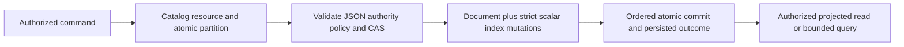

# DocumentStorage

### Exact caller-owned document text (REQ/AC-DSTORE-008)

REQ-DSTORE-008 retains the exact validated `PutDocument.Json` text in the native
canonical document record: Unicode, escapes, property order, whitespace and
decimal spelling remain caller-owned. Validation still enforces the same byte,
depth, object-root, duplicate-member and decimal-range rules. Reuse the existing
CanonicalJsonWriter validation walk with a discard sink rather than materializing
rewritten canonical text. `JsonData.Validate` and every frozen canonical
fingerprint/golden digest remain unchanged. Patch produces its existing validated
derived document; redacted reads still use the existing persisted field policy.
There is no promise of original text for a redacted or patched result.

AC-DSTORE-008 maps to `DocumentExactContentTests`: real TestDatabase/ZoneTree Put,
authorized raw read, native record roundtrip and exact same-command replay retain
literal caller text; replacement retains its new literal text; duplicate members
and out-of-range decimals still fail without effects. Existing CRUD, rollback,
index, image/outbox and native serialization regressions remain mandatory. The
real SDK/official MCP `PhysicalShardCatalogRf3Tests` Unicode assertion remains
exact across every voter and restart. Root owns JsonData's shared validation join
and the document command/test slice; [ADR-060](../ADR/ADR-060-native-internal-serialization.md)
already requires exact caller-owned document strings. Stored record aliases/IDs,
native format, public DTOs and command fingerprints do not change; existing
historical records are not rewritten. Local proof and exact-source Linux RF3
qualification are separate required evidence.

Status: source-present baseline documented; complete product and GitHub qualification remain pending. Current behavior is distinguished below from the accepted target architecture in [design sections 7 and 37–41](../design/architecture-v0.3.uk.md).

## Purpose and actors

DocumentStorage owns tenant/database/domain-scoped JSON documents, revisions, mutations, scalar index maintenance, and authorized reads. Actors are database clients, the server command boundary, and internal query operators. Concrete current operations are `DatabaseEngine.GetDocument` and mutation application for `PutDocument`, `PatchDocument`, and `DeleteDocument`; these flow through the server/replicated command path. This document describes the observed Core contract and its target slice, not an unqualified production guarantee.

## Canonical slice map and boundaries

| Surface | Current source | Target owner |
|---|---|---|
| Contracts | `src/KeyLoad.Abstractions/Contracts.cs` (`EntityRef`, document mutations/results, `DocumentAuthority`, `IndexDefinition`) | `src/KeyLoad.Abstractions/Features/DocumentStorage/` |
| Backend | `src/KeyLoad.Core/Features/DocumentStorage/Execution/Documents.cs`, shared mutation dispatch in `DatabaseEngine.cs` | `src/KeyLoad.Core/Features/DocumentStorage/` |
| Tests | `tests/KeyLoad.UnitTests/Features/DocumentStorage/`, shared atomic batch cases in `Features/ResourceExecution/TransactionTests.cs`, `SecurityAndQueryTests.cs`, `Features/QueryExecution/` | DocumentStorage behavior and its documented cross-slice atomic/query callers |
| Durable specification | This file | `docs/Features/DocumentStorage.md` |
| HTTP | `src/KeyLoad.Server/Features/DocumentStorage/Transport/DocumentApi.cs` plus shared `Features/ClientApi/ApiEndpoints.cs`: `POST /v1/documents/get` and mutation command `POST /v1/commands` | Shared HTTP transport belongs to `src/KeyLoad.Server/Features/ClientApi/`; document validation and behavior belong to `src/KeyLoad.Core/Features/DocumentStorage/` |
| .NET SDK | `src/KeyLoad.Client/KeyLoadClient.cs`: `GetAsync` and `CommitAsync` | Shared client transport belongs to `src/KeyLoad.Client/Features/ClientApi/`; typed document behavior maps to this DocumentStorage slice |
| Official MCP | Actual `Features/ClientApi/McpCommandCatalog.cs` and `McpReadCatalog.cs`, with `McpDocumentParityTests` exercising `keyload_documents_commit` and `keyload_documents_get` through the official C# SDK | Shared ClientApi owns transport/dispatch; DocumentStorage owns the CRUD contract and matching RF3 parity cases |
| UI | No document-specific frontend interaction is specified | N/A: database document CRUD is consumed through API/SDK/MCP, not a separate UI surface |
| Backup/export | Cross-resource archive behavior is owned by BackupRestore | N/A here: this slice supplies canonical records but does not define an independent backup format |

The current root-level files are documented migration debt under ADR-032, not the target layout. Search/query owns query planning and projections; Authorization owns identity/policy rules; Messaging/EventStreams own their resources. DocumentStorage does not own physical node placement, replica consensus, or public route naming.

## Current source behavior

- A collection resource is resolved inside the supplied partition. JSON is validated against database limits. Put creates or replaces with an incremented revision; optional expected revision is checked. Patch requires an existing live document, a nonempty bounded patch, and an exact revision. Delete writes a tombstone and increments revision.
- Direct document writes are denied when catalog authority is `EventStream`. Row and field permissions are checked on mutation/read. Reads omit deleted or row-invisible records and use the persisted field projector.
- Index definitions currently support scalar paths with inclusion rules for null/missing values. Updates remove old keys and write new keys in the same transaction. Unique values are enforced within the partition; a conflicting owner rejects the transaction.
- `CommandRequest` and mutation records participate in the shared ordered batch path. Existing tests cover document/event/queue batch atomicity and persisted command retry. The literal partition key alone does not merge distinct transaction domains.
- The observed implementation does not establish multikey, covering, partial, computed, global-unique, online generation rebuild, or cluster-wide split semantics. These remain design/backlog work in section 7 and the indexing/shard workstreams KL-011/039; they are outside the original KL-010 CRUD/CAS and KL-012 batch/outcome task scopes.

## Requirements and acceptance

| Requirement | Measurable acceptance | Existing TUnit evidence or planned test |
|---|---|---|
| REQ-DSTORE-001: validate scoped CRUD, revisions, and document authority | AC-DSTORE-001 passes when create/read/replace/patch/delete produce monotone revisions, exact-CAS concurrency has one winner, and invalid/stale writes or direct mutation of event-authoritative resources are rejected without partial state. | Existing `ConcurrentCompareAndSwapHasOneWinner`; actual `DocumentCrudRevisionTests` and `DocumentPutValidationAtomicityTests` cover create/missing/delete/invalid JSON/authority. Original source/PDB-matched Linux normal/scalar evidence and all four task RF3 cases passed; current native RF3 refresh passed. See TASK-DSTORE-KL010-KL012-CLOSEOUT below. |
| REQ-DSTORE-002: maintain declared scalar indexes atomically | AC-DSTORE-002 passes when replacing/deleting a document removes its old keys, writes new keys, and a duplicate partition-unique value rejects the full mutation batch. | Existing `UniqueConflictRollsBackDocumentIndexEventAndEnqueue`, `AcMp003PointAndIndexDereferenceConsumeTheSameRawReadBudget`; actual `DocumentScalarIndexMutationTests` covers persisted old/new index transitions and rollback. Local full-suite evidence below; exact-source CI qualification pending. |
| REQ-DSTORE-003: enforce row/field policy at every document boundary | AC-DSTORE-003 passes when unauthorized row writes/reads and protected field use fail or project according to policy; tenant or row ownership cannot be supplied to gain access. | Existing `NestedSensitiveFieldsAreOmittedAndAliasedPredicateAndSortAreDenied`, `RowScopeAndTenantCannotBeForged`; actual field/row/tenant matrix plus isolated replacement-write and Delete-index-use controls. Local full-suite evidence below; exact-source CI qualification pending. |
| REQ-DSTORE-004: share an atomic transaction domain with eligible events and queues | AC-DSTORE-004 passes when document + event + local enqueue commit together or all remain absent, same command retry returns the stored outcome, and identical partition-key text in unrelated domains stays isolated. | Existing `DocumentEventAndQueueCommitTogetherAndCommandRetryDoesNotRepeatEffects`, `UniqueConflictRollsBackDocumentIndexEventAndEnqueue`, `SameLiteralPartitionKeyCannotCrossTransactionDomains`. CI qualification pending. |
| REQ-DSTORE-005: reuse transaction-scoped document images | AC-DSTORE-005 passes when one before-record lookup supplies CRUD and outbox; no final staged lookup/decode is required; exact bytes, revisions, tombstones, indexes, authorization, quotas and sequential same-ID mutations remain intact. Native placement admission adds exactly three bounded metadata point reads to the six current mutation/outcome reads, reused by the Batch receipt and every outbox effect under REQ/AC-MTOKEN-007. The current atomic roster performs one additional existing-entry validation per distinct candidate partition before publishing or validating its first-write row; the single-partition mutation oracle is therefore six mutation/outcome plus three placement plus one roster lookup (ten), with unchanged paired-size payload work. Actual native counters must verify the current per-operation total and paired-size payload work; an obsolete outcome lookup must not be retained to satisfy an old counter. | TASK-MP-007I in ADR-035 and ADR-017; real-store paired-size/counter and before/after/failure cases plus existing transaction/change-feed/recovery/RF3 regressions; GitHub evidence pending. |
| REQ-DSTORE-006: retain command identity and outcome atomically across real process restart | AC-DSTORE-006 passes when two distinct actual CrashHost processes execute one hundred same-ID/same-content retries each around a real first-process kill; every result matches the original complete receipt, while one document revision, one event, one Ready queue message and the exact batch outbox cut remain. Same-ID/changed-content returns Conflict without changing effects or the original outcome; a fresh authorized command succeeds afterward. | TASK-DSTORE-COMMAND-100-RESTART in ADR-002; new `CommandIdempotencyProcessRecoveryTests` and actual CrashHost scenario under `Features/DocumentStorage/`. The original Linux two-process case passed in run37560457057, with unchanged source bound to its native compiled image; see the scoped closeout below. |
| REQ-DSTORE-007: prove persisted precondition-failure replay and authenticated-principal isolation | AC-DSTORE-007 passes when a failed expected-revision command replays its exact persisted error after a fresh command makes that precondition satisfiable, without a new document/outbox effect, and a fresh command ID then succeeds. Two distinct persisted authorized principals independently execute the same literal command ID and retain their own exact outcomes and documents; changing either principal's existing command content conflicts without changing either effect. | TASK-DSTORE-OUTCOME-MATRIX under ADR-002; new `DocumentCommandOutcomeReplayTests` and `DocumentCommandPrincipalScopeTests`, with real TestDatabase/ZoneTree helpers under UnitTests/Features/DocumentStorage. Native Aspire normal/scalar and delivered-source Linux proof remain required. |
| REQ-DSTORE-009: persist command identity in its full resolved scope | AC-DSTORE-009 passes when the current scoped-key, retained-error, corruption, restart and public RF3 flows below all pass without outcome rewrites, guessed partition identity or ambiguous principal/ID lookup. | TASK-DSTORE-SCOPED-OUTCOMES-001..004; ADR-002, ADR-011 and ADR-017; real ZoneTree unit/scalar, existing CrashHost recovery and SDK/official MCP Aspire RF3 cases. Contract accepted before implementation; no complete gate is claimed. |

### Existing unit case-to-acceptance crosswalk

This table binds the current operation cases to their existing criteria; it adds
no product behavior and does not close any CI, recovery, RF3, performance, or
exact-source gate. A listed class is evidence for only the stated scope.

| Native case class | Existing requirement / acceptance | Evidence boundary |
|---|---|---|
| `DocumentCrudRevisionTests`, `DocumentPutValidationAtomicityTests` | REQ-DSTORE-001 / AC-DSTORE-001 | CRUD/CAS/revision, malformed-input rollback, and healthy follow-up. |
| `DocumentScalarIndexMutationTests` | REQ-DSTORE-002 / AC-DSTORE-002 | Old/new index transitions and uniqueness rollback. |
| `ScalarIndexProcessRecoveryTests` and the owning CrashHost DocumentStorage scenario | REQ-DSTORE-002 / AC-DSTORE-INDEX-PROCESS-001 | TASK-DSTORE-INDEX-PROCESS freezes the real process/reference-model flow below; source and qualification pending. |
| `DocumentRowTenantMutationAuthorizationTests` | REQ-DSTORE-003 / AC-DSTORE-003 and REQ-AUTH-005 / AC-AUTH-005 | Put/Patch/Delete cannot forge row owner or tenant; this does not cover all row-scoped read/query adapters. |
| `DocumentFieldMutationAuthorizationTests`, `DocumentReplacementFieldAuthorizationTests`, `DocumentDeleteIndexAuthorizationTests` | REQ-DSTORE-003 / AC-DSTORE-003 and REQ-AUTH-006 / AC-AUTH-006 | Persisted field-write/index-use grants are independently enforced on the tested paths, not across the full query-adapter or field-lineage matrix. Whole-row delete requires applicable index-use, not field-write. |
| `DocumentMutationImageTests`, `DocumentMutationImageFailureTests`, `DocumentMutationImageReadTests` | REQ-DSTORE-005 / AC-DSTORE-005 | Real same-ID image/outbox bytes, before-image read-counts, and failure rollback. These cases do not establish REQ-DSTORE-004 cross-resource event/enqueue atomicity or performance qualification. |
| `DocumentExactContentTests` | REQ-DSTORE-008 / AC-DSTORE-008 | Exact current caller JSON text, replay and invalid-document no-effect behavior; see TASK-DSTORE-EXACT-TEXT below. |
| `DocumentCommandOutcomeReplayTests`, `DocumentCommandPrincipalScopeTests` | REQ-DSTORE-007 / AC-DSTORE-007 | Persisted expected-revision failure replay and principal-scoped command identity; these do not close the broader REQ-DSTORE-009 matrix. |
| `VisibleReadTests` | REQ-MP-002 / its existing grouped AC-MP-002..006 acceptance | Bounded visible-document visitation and persisted visibility/stale-vector exclusion. These shared ResourceExecution criteria are exercised through real document/vector state. The owning spec groups AC-MP-002..006 and does not define per-criterion text, so the mapping does not infer separate AC-003/004 semantics from method names or claim the full group is covered. |
| `ReadOnlyCoreContractTests` | REQ-ROC-005 / AC-ROC-005 under ADR-041 | Strict current public collection-shape behavior and a healthy store follow-up. This cross-slice contract evidence is not AC-DSTORE-001 CRUD coverage. |

The current command-outcome retention contract has no automatic TTL/purge path.
Retries are supported while the original outcome remains in the canonical store
with the same incarnation and current persisted authorization. No finite minimum
time window or retry guarantee after explicit outcome/store removal or changed
incarnation is advertised. This is documented current behavior, not an implemented
expiry policy. A new policy needs an accepted ADR and its own qualification.

TASK-DSTORE-OUTCOME-MATRIX is a bounded completion of two existing ADR-002 test
rows. Root owns the contract and review; query_wave Luna/high owns only the two
new named cases and cohesive helpers under UnitTests/Features/DocumentStorage.
Use the real persisted policies and original native outcome bytes, with literal
document/revision and outbox expectations. Physical apply position may advance
on error/replay and must not be mistaken for a new domain effect. No production
key, fingerprint, serializer, public outcome API, expiry or permission changes
are authorized by this test stage.

## Current scoped outcome contract

REQ/AC-DSTORE-009 requires the exact accepted matrix in
[ADR-011](../ADR/ADR-011-current-native-format.md). Durable identity is verified
principal, explicit Global/Partition scope, the complete resolved `PartitionRef`
for Partition, and CommandId. The canonical fingerprint, native StoredOutcome
alias and IDs 0..7, persisted authorization, incarnation checks and ordered
atomic apply boundary remain unchanged. A partition digest cannot reconstruct
its full identity or physical owner.

TASK-DSTORE-FULL-IDENTITY-001 supplements the scoped repair with four complete
real-ZoneTree cases, one for each individual `PartitionRef` component. Hold the
other three components, persisted principal and command ID fixed while changing
only tenant, database, transaction domain or partition key. Configure two real
collections in their actual scopes so a domain change never overwrites the first
collection's catalog authority. Commit both commands, compare exact independent
receipts on replay, reject changed content separately in each scope, verify both
literal document values and unchanged outbox tails after retries/conflicts, then
reopen the store and resolve/read both original commands. Expected keys use the
existing independent test oracle, not the production scope/key resolver. A
dedicated worker owns only new ClusterRouting test cases/helpers; root owns live
integration and the ordinary/scalar/recovery/RF3 gates. Acceptance maps to
AC-DSTORE-009 and ADR-002/011; these authored cases do not replace caller-visible
RF3 proof.

Current partition keys are `KeySpace.Partition("outcome-v2", partition, principal, id)`;
global keys are `KeyCodec.Encode("outcome-v2", "global", principal, id)`.
Current Unknown-scope persisted errors use the distinct nonmovable key
`KeyCodec.Encode("outcome-v2", "unknown", principal, id)`; Unknown is explicit
missing scope, never an inferred partition or trusted global role.
`outcome-locator-v2` contains the complete partition/principal/id and the exact
matching v2 outcome key. Success and persisted domain failure write outcome,
locator where applicable, domain effects, apply watermark and clock in the same
existing transaction. Unknown writes have no locator. No partition is guessed
and no alternate persisted representation is admitted.

Operation-aware `ResolveOutcome(originalOperation)` is the sole retained-result
lookup. Remove ambiguous public `DatabaseEngine.Outcome(principal,id)` and
`KeySpace.Outcome`; update every current caller to its original operation or an
internal raw-format oracle. SDK/HTTP/MCP lookup-schema changes are N/A because
none exposes the removed Core accessor. UI is N/A for this database contract.

Within one committed view, select only the current key for the operation's full
scope. Validate its native metadata and exact scoped locator before replay or a
new write. An orphan locator, contradictory scope, malformed record or missing
or wrong locator fails Corruption without repair or winner selection. Unknown,
Global and Partition identities remain independent. Lookup is bounded; no
cross-partition presence scan, reservation or inferred global identity is allowed.

AC-DSTORE-009 requires complete actual-operation scenarios:

1. The same principal and literal ID commits independently in two configured full partitions, with exact documents, receipts and outbox effects. Both exact retries retain their own results after fresh engine/store reopen; changed content in either scope conflicts and preserves both scopes. Include tenant/database/domain/key distinctions and explicit Global versus Partition reuse.
2. A real precondition failure in A remains the same retained error after a fresh command makes that precondition satisfiable; reuse in B remains independent. Retry produces no new effects. Actual authorized resolution and revoked/denied controls preserve reauthorization. A current persisted Unknown failure before and after valid A/B commands with the same ID cannot shadow either scoped result; its exact retry/error and changed-content conflict remain independent.
3. Real native transactions prove outcome/locator/effects/watermark/clock atomicity. Missing or wrong locators, orphan locators, contradictory metadata and malformed records reject without rewriting or partial domain effects; a healthy unrelated command remains usable where its authority is intact. Current Global operations have no partition locator and cannot substitute for a missing Partition result.
4. Aspire-owned real process cuts and two-process retry scenarios prove current-key recovery and exact current native state preservation. Aspire RF3 tests use both actual SDK and official MCP clients for same-ID/two-partition commits, opposite-endpoint retries and an owned restart/leader path. Local proof remains distinct from delivered-source Linux qualification.

Ordered ownership: TASK-DSTORE-SCOPED-OUTCOMES-001 freezes this feature and the
ADR-002/011/017 and TokenOwnershipLineage joins (root); 002 owns scoped keys,
locator codecs/inventory and existing Core commit/resolution paths (Luna private
packet); 003 updates all actual accessor callers and adds UnitTests,
RecoveryTests/CrashHost and IntegrationTests operation flows in their canonical
slices (same worker); 004 joins/reviews, runs build/format/governance and complete
Aspire normal/scalar/recovery/RF3 plus exact-SHA Linux gates (root).
Current deployment uses homogeneous RF3 binaries with the exact current native
contract before admission. Recovery and restore validate the current format and
preserve its state. Outcome expiry and cross-group token translation remain
separate unimplemented contracts.

### Authorization and retained-error ordering

TASK-DSTORE-SCOPED-OUTCOMES-002 preserves the original command trust boundary.
Normal execution and operation-aware resolution authenticate the persisted
principal and authorize the operation before reading or decoding retained outcome
metadata. A revoked caller receives the original authorization error, including
when the retained bytes are corrupt; after valid authorization the same corrupt
row fails Corruption. The already-applied replica path retains its existing
authority and replay order rather than introducing a new caller authorization step.

If normal admission fails before outcome selection, retain that original error
and reset staged domain effects. Current bounded presence checks prevent a
previous outcome at the selected key from being overwritten; they do not decode
it before authorization or disclose its fingerprint. Preserve the existing
apply-watermark and monotonic-clock transaction behavior. Actual rejected-operation
tests verify original bytes and the absence of a second outcome/locator or domain
effect. An unoccupied selected identity may retain the current denied/domain-error
outcome; occupied-identity protection must not prohibit all retained errors.

Unknown-scope retry/conflict tests must use an actual operation whose persisted
authorization succeeds before its malformed payload fails execution. An error
rejected by authorization cannot reveal a prior fingerprint. Exact authorized
Unknown retries and changed-content conflicts still use their independent v2
identity; no caller-supplied role or metadata-before-authorization shortcut is
permitted. These flows extend AC-DSTORE-009 and its existing native unit/scalar,
recovery and RF3 evidence, without qualifying an unexecuted gate.

The current scoped implementation and callers have original source-matched
Linux normal/scalar and process-recovery proof. The original KL-012 acceptance
and named public RF3 partition/restart flow are closed below. Full feature
qualification, the complete Linux RF3 cohort and functional coverage remain
separate open gates; a task closeout does not mark every supplemental criterion
or the full DocumentStorage feature complete.

The accepted [ADR-035 document image contract](../ADR/ADR-035-memory-performance.md)
assigns CRUD handlers and new matching tests to one worker, and shared
AtomicMutationApplication caller integration to the lead. Internal context/result
carriers stay under Features/DocumentStorage and within one atomic transaction.
UI/SDK/MCP schema changes are N/A: public contracts and current persisted bytes stay exact.

The2026-10-04 regression-completion stage maps AC-DSTORE-001 to
DocumentCrudRevisionTests and DocumentPutValidationAtomicityTests, AC-DSTORE-002
to DocumentScalarIndexMutationTests, and AC-DSTORE-003 to
DocumentFieldMutationAuthorizationTests and DocumentRowTenantMutationAuthorizationTests.
These use actual TestDatabase/ZoneTree and the existing contracts: no new product
semantics or mutation DTO. Root owns this mapping and join; cluster_wave Luna/high
owns only these new UnitTests/Features/DocumentStorage files and their cohesive
fixture. Include duplicate JSON members, document-byte/depth bounds after an
earlier staged indexed mutation, exact rollback, tombstone/recreate revisions,
unique-index isolation, persisted field grants and healthy owner follow-up.

Field-write grants gate create/replacement/patch of protected fields. Whole-row
Delete follows the existing DocumentsWrite capability and row-write policy,
plus any index-field-use grant required for strict maintenance. It does not
introduce a field-write requirement for whole-row deletion. This distinguishes
the current lifecycle and field-mutation contracts in REQ-AUTH-006; neither
client-supplied row ownership nor an administrator label establishes authority.

TASK-DSTORE-FIELD-MUTATION-ORACLES closes the remaining AC-DSTORE-003 boundaries
with separate DocumentReplacementFieldAuthorizationTests and
DocumentDeleteIndexAuthorizationTests. Replacement denial uses a principal that
already has DocumentsWrite, field-read and indexed field-use grants, isolating the missing
field-write grant; exact original revision/JSON/index entries remain unchanged,
and a principal with both grants replaces successfully. Delete denial isolates
the missing indexed field-use grant and preserves the live record/index; its
allowed control has field-use but no field-write grant and produces the exact
next tombstone revision while removing the index entry. These are existing
persisted-policy semantics, not a public contract or schema change. cluster_wave
Luna/high owns only the two new files; root reviews and integrates actual Aspire
normal/scalar/recovery and exact delivered-source Linux/RF3 qualification.

## Flows and failure behavior

Positive: authorized valid JSON mutation passes catalog and CAS checks, updates document and affected indexes in one atomic command, and returns its committed revision/receipt. Negative: malformed JSON, stale CAS, denied row/field access, event-authoritative direct write, or unique collision rejects the operation. Edge: replacing indexed values removes old entries; delete creates a tombstone; patch of missing/deleted document fails; duplicate command identity is resolved by persisted outcome. Error responses must not disclose protected payload values. Query pages and index scans remain subject to the shared read budgets.

## Decisions and verification

Related decisions: [ADR-001](../ADR/ADR-001-partition-identity-affinity.md), [ADR-002](../ADR/ADR-002-command-idempotency.md), [ADR-004](../ADR/ADR-004-committed-read-views.md), [ADR-005](../ADR/ADR-005-canonical-keyspace-codec.md), [ADR-006](../ADR/ADR-006-strict-derived-indexes.md), [ADR-010](../ADR/ADR-010-query-budgets-security.md), [ADR-014](../ADR/ADR-014-principals-rbac-row-policy.md), and [ADR-016](../ADR/ADR-016-atomic-physical-placement.md). Cross-resource batches follow [ADR-024](../ADR/ADR-024-transaction-domain-binding.md).

The 2026-10-04 development receipt (report removed from repository) records8 new real-ZoneTree CRUD cases in full Aspire normal/scalar suites at2889/2889 each and recovery228/228, with unchanged source/runtime and1000 unique atomic process cuts. The original Linux and actual SDK/official-MCP RF3 task closeout below supersedes that task-local pending qualification. Complete current-source Linux RF3 and broader feature acceptance remain required. Document-specific UI is N/A; cross-partition unique constraints and production readiness remain unqualified.

## RF3 CRUD public-client completion (2026-10-04 accepted test scope)

TASK-DSTORE-RF3-PARITY adds only new `McpDocumentCrudParityTests`, `McpDocumentCrudParityAssertions` and, if needed, `McpDocumentCrudParityScenario` under IntegrationTests/Features/DocumentStorage. REQ-DSTORE-001 / AC-DSTORE-001 and existing ADR-002 define the behavior; an additional ADR is N/A because there is no boundary, format, transport or mutation-contract change. cluster_wave Luna/high owns these disjoint test files; root owns review, feature/task mapping, builds and exact-source Aspire/Docker RF3 qualification.

Two mirrored success cases use the actual existing keyed Aspire ClusterFixture, separate real scoped persisted principal/API-key grants, the .NET SDK and official MCP C# SDK on different RF3 endpoints. One executes SDK create -> MCP explicit replacement -> SDK Patch -> MCP Delete; the other reverses each caller. Both callers therefore successfully execute Patch and Delete, and opposite-client reads assert exact canonical JSON and revisions 1/2/3, revision4 tombstone mutation receipt, and null from both after deletion. Matching accepted command retries through the other client preserve the original command receipt/token. A third case performs an explicit replacement at revision1, then repeats a stale expected revision1 through MCP and the same stable command through SDK: exact RevisionConflict and unchanged revision2/JSON are required. Error assertions do not infer durable storage of a failed outcome merely from repeated identical errors.

Use the existing bounded McpCallerDeadline, actual persisted authorization helpers, native official tool serializers and existing fixture cleanup. No mock, hand-written MCP transport, trusted client role, new listener, broadened retries or weakened test is allowed. Existing document and policy tests stay intact. The earlier e97 Linux RF3 report remains 83/84 overall; this test scope counts only after its own complete exact-source Linux Aspire RF3 result.

TASK-DSTORE-EXACT-TEXT also updates the existing native ownership, malformed
record restore, canonical retry and embedded-fixture oracles to require the
original submitted literal JSON, rather than `JsonData.Validate` output. Their
authority/corruption/revision/receipt/no-second-effect assertions stay intact.
Canonical validation/fingerprint golden bytes remain unchanged; canonical retry
equivalence must not rewrite the first acknowledged document text. These cases
map to REQ/AC-DSTORE-008 and ADR-060 with the dedicated exact-content tests.

## TASK-DSTORE-KL010-KL012-CLOSEOUT (2026-10-07)

Root independently validated the original reports, current source hashes and
native PDB document hashes before closing the original task acceptance.
[Linux run37560457057](https://github.com/managedcode/KeyLoad/actions/runs/37560457057/job/112596312154)
at `6816ae919cac67c217c85096d04d474667e80f1f` passed normal/scalar2767 each
and recovery235, without failures or skips, and passed same-job source/image
verification. Twenty-two mapped whole-operation unit cases pass in both modes;
the distinct two-process hundred-retry recovery case passes. The root audit
binds23 document/outcome unit source files, nine recovery source files and all1142
unchanged non-AppHost product source files to their original PDB checksums.
The three changed AppHost model-control files remain separate infrastructure
work. Native identity manifests are provenance combined with those executed
reports, never standalone qualification.

| Original task | Requirements, cases and acceptance proof |
|---|---|
| KL-010 CRUD/CAS and JSON validation | REQ/AC-DSTORE-001 and exact-text supplement008: `DocumentCrudRevisionTests`, `DocumentPutValidationAtomicityTests`, `DocumentExactContentTests`, plus the32-contender `TransactionTests.ConcurrentCompareAndSwapHasOneWinner`. Get/Put/Patch/Delete/recreate preserve exact monotone revisions/tombstone; stale/authority failures and malformed/duplicate/oversized/deep JSON preserve state. The three `McpDocumentCrudParityTests` and all-voter `PhysicalShardCatalogRf3Tests` preserve receipts and exact unredacted text across SDK/MCP and restart. |
| KL-012 atomic batch/outcome and persisted replay | REQ/AC-DSTORE-004/006 and principal/full-scope supplements007/009: `TransactionTests.DocumentEventAndQueueCommitTogetherAndCommandRetryDoesNotRepeatEffects`, `CommandIdempotencyProcessRecoveryTests.AcDocument006OneHundredCommandRetriesSurviveRealProcessRestart`, command/principal/scoped-outcome cases and four `FullPartitionOutcomeIdentityTests`. One hundred retries in each distinct real process preserve complete receipt, one document/event/queue effect and original outbox cut; changed content conflicts and a fresh authorized command succeeds. Current retention is the explicit no-auto-expiry canonical-record/same-incarnation/reauthorization contract above. `ScopedCommandIdentityRf3Tests` proves SDK/MCP partition-scoped replay/conflict and owned voter restart. |

All five named RF3 cases passed in both original Linux runs
[37554329420](https://github.com/managedcode/KeyLoad/actions/runs/37554329420/job/112576928739)
and [37555827366](https://github.com/managedcode/KeyLoad/actions/runs/37555827366/job/112581704430),
with their exact current test/workflow/assertion files bound to the original PDBs.
Their full RF3 suites each had141 passed/14 failed; those unrelated failures
remain open. On2026-10-07 the same five cases passed again in actual local
native TUnit, fixture-owned Aspire Docker RF3, with both real clients, zero
skips and zero source/assembly drift. Original TRX SHA-256 is
`5248d0f18836513f79e7e1a0759c9f34acfe165ca93a8586fa36b8a135efb0d5`.
The root independent original-source/report audit SHA-256 is
`aa296da1479ede198753f72b42d372945b83d46dfecaa78419769c58a239640b`;
full artifact/report identities are retained in `docs/implementation/status.json`.
No new feature behavior or duplicate getter/shape tests were added for closeout;
ADR-002/060 already govern these operations. This closes the original two task
scopes only. Complete DocumentStorage, full Linux RF3, endurance, power loss and
full product functional coverage are still open; process kill is not power-loss
proof. Other feature criteria remain individually tracked.

## TASK-DSTORE-INDEX-PROCESS (2026-10-07)

REQ-DSTORE-002 additionally maps to **AC-DSTORE-INDEX-PROCESS-001**: an independent
parent reference model must agree with canonical documents and declared scalar
index membership after a real child process performs insert, replace, patch,
delete and a rejected unique-conflict batch, then is killed and reopened in a
distinct process. The conflict must leave documents, index entries and all other
batch effects unchanged. Equal unique values in different atomic partitions
remain admissible. Verify every expected member and excluded old/deleted value,
exact document JSON/revision and declared unique ownership; a fresh valid
mutation and subsequent reopen must prove recovery remains usable.

Reuse the existing CrashHost process protocol, native ZoneTree storage, safe
readiness/fault markers and ordered kill/exit/stdout/stderr settlement. Cover an
acknowledged cut and an existing in-flight atomic fault boundary; the allowed
complete outcomes come from the immutable operation schedule and observed
receipt/cut, never from treating the query engine as its own reference oracle.
Retain bounded deadlines, current persisted authorization, no partial transaction
and primary/cleanup failures. Do not add a second storage implementation or
consumer workaround. Process kill does not establish power-loss durability.

Ownership is RecoveryTests/Features/DocumentStorage/Cases/
`ScalarIndexProcessRecoveryTests.cs`, its feature-local Helpers/Assertions as
needed, and CrashHost/Features/DocumentStorage/Scenarios with the existing
dispatch registration. Frontend/SDK/MCP additions are N/A to this child-process
recovery gap; actual RF3 index qualification remains a separate required gate.
ADR-002 and ADR-011 already own atomic scalar indexing and process recovery;
there is no new format, dependency, trust or topology boundary. Root freezes
requirements before a Luna worker prepares private guarded source, reviews and
joins it, builds, executes focused native TUnit/recovery and obtains exact-source
Linux source/PDB evidence before acceptance. Broader index varieties and full
DocumentStorage qualification remain open.

### TASK-KL011-COMPOSITE-RANGE-PROCESS-001

REQ-DSTORE-002 / AC-DSTORE-002 and new AC-DSTORE-COMPOSITE-PROCESS-001: preserve original KL011 equality/range/composite/partition-unique scope. A real four-process CrashHost matrix verifies inserted, replaced, patched, deleted and tombstoned documents, complete composite/ordered-score/unique native index images in two atomic partitions, literal membership and native exclusive-after-key ranges. Composite equality must report the genuine declared composite index; native range Scan proof is distinct from KL013 query-planner inequality seeks. A mixed document/event/enqueue unique conflict must roll back every effect; its original persisted failure and successful acknowledged receipt replay unchanged after crash with complete store-byte and position invariance. A fresh command follows recovery and a fourth reopen preserves it.

Reuse original JournalFlushed cut, acknowledged first kill, original child stdout/stderr and joined cleanup/deadlines. Parent literal tuples are independent of observed index values; native public KeySpace encodes the specified literal keys, never calls the index mutation implementation. No provider doubles, fallback, retry-until-pass, power-loss or closure claim. Existing scalar scenario is untouched. Ownership: CrashHost DocumentStorage Contracts/Scenarios owns new current-format private modes; Recovery DocumentStorage Cases/Helpers/Assertions owns actual process orchestration and independent oracle; only existing CrashHost application adds closed dispatch. Source-only packet requires full strict build, native discovery, focused process matrix and original full Linux recovery plus unchanged normal/scalar/RF3 gates. ADR002 owns command replay; ADR011 owns atomic journal/recovery.

## TASK-KL021-DOCUMENT-SESSION-READ-001

Accepted homogeneous first-release document session-read implementation contract; runtime qualification remains open.

REQ-SESSIONREAD-001 / AC-SESSIONREAD-001: Only document GET gains optional typed GetDocumentRequest.MinimumToken at generated native Id1, keeping Reference Id0 and alias. SDK explicit GetAsync(EntityRef, CommitToken, CancellationToken), HTTP/official MCP keyload_documents_get and Q1 CALL keyload_documents_get(@arguments) decode the exact same typed request via existing canonical catalog; absent option remains ordinary strong GET. This is not generic model/session cache support and does not add a dispatcher.

REQ-SESSIONREAD-002 / AC-SESSIONREAD-002: The existing unique request/read grain obtains fresh native quorum barrier under original bounded ReplicaReadRoundExecutor timeout, including existing actual WaitForApplyAsync(barrier.Position). Afterwards document execution reloads persisted principal/grants and validates minimum token in the exact same native Store.Read cut as row/field authorization and document projection. Token must match database incarnation, exact atomic partition and current persisted ownership epoch; position must be positive and no greater than actual lastApplied at that cut. This barrier applies the current quorum commit cut, hence it already meets every previously acknowledged minimum token. A token beyond that fresh applied cut is explicitly rejected; there is no speculative wait for a caller-invented future position. No physical-lineage translation, stale-mode API or authority cache is added.

REQ-SESSIONREAD-003 / AC-SESSIONREAD-003: Explicit existing TokenInvalidated category with distinct fixed safe reasons WrongIncarnation / OutOfScope / FuturePosition / InvalidPosition identifies token failures without exposing token values/credentials/records. Missing/corrupt applied authority is Corruption; unsupported ownership epoch is OwnershipLost or token invalidation per current placement witness policy. Persisted authorization is checked before token failure reasons; denial contains no row. Caller cancellation checked before admission and inside final cut, no partial result; native deadline/admission/drain unchanged. Former leader with no quorum cannot pass existing fresh barrier even for a valid historical token.

REQ-SESSIONREAD-004 / AC-SESSIONREAD-004: Real ZoneTree local whole flows prove literal document/complete state+position unchanged after invalid incarnation/scope/future/position and pre-cancel, fresh authorized minimum succeeds and later revision continues. Real fixture-owned Aspire RF3 SDK+official MCP failover operation proves acknowledged write token→elected leader kill→token-bearing complete literal healthy read→all invalid variants fail→healthy token read; isolated former surviving leader/minority strong token read fails, both voter restoration and healthy read follow. Existing native receipt replay/Unknown scenarios remain separate and unchanged. Auth revocation must deny valid token then renewed persisted grant/healthy read.

Ownership: Abstractions DocumentStorage DTO; Client overload; Core feature-local same-view validator and Documents reader; Orleans existing GrainCoreReadCapabilities routing; docs ClientApi/DocumentStorage/ClusterReplication + ADR017/036 amendment; unit DocumentStorage and RF3 ClusterReplication wholeflow. SQL Q1 CALL is exact typed operation envelope only; Q1 SELECT/AST and other read models do not accept session options in this stage. Same homogeneous current first-release cohort; native Id append/alias remains stable, no legacy reader/migration/runtime fallback. Root owns join/build/native discovery/test/Linux evidence and status; no qualification or closure inferred from authored source.

## Proven epoch meaning before implementation

DatabaseEngine.Token in Core/DatabaseEngine.cs obtains OwnershipEpoch from persisted ReadPlacementWitness.PlacementEpoch. AtomicPartitionPlacementReader Fallback/Explicit uses PhysicalShardCatalog.DefaultShard.PlacementEpoch; PhysicalShardCatalogRecordSerialization.InitialRecord initializes that physical-placement value. ReplicaElection.RunRound changes DurableReplicaLog term/vote, not physical catalog. Original authenticated 4e18 RF3 passed LeaderLossQueueScenario compares the entire pre-kill commit token to the actual replay token after elected leader kill. Hence elected leader failover keeps physical PlacementEpoch, and equality does not invalidate that acknowledged token. The new public wholeflow additionally checks a fresh postfailover command retains the same physical epoch/incarnation/atomic identity. Physical ownership movement with a changed placement epoch is explicitly unsupported by this minimal surface; it fails closed without invented lineage, and does not claim KL035/036/072 movement support.

The current native fixture supports Kill/Restart and retains actual owner receipts.
The authored authority-denial flow is a still-live surviving voter without quorum,
not a network-isolated former leader while another majority stays live. That
stronger KL021 authority scenario remains open until a bounded fixture-owned
network partition contract exists; no manual Docker or new fault hook is added.
Fresh barrier implementations are ReplicaReadRoundExecutor + ReplicaLeader.BarrierAsync:
both use native Materializer.WaitForApplyAsync at their authenticated quorum cut.
SDK method ownership is Features/DocumentStorage/Transport/DocumentSessionClient.cs.

### Native MCP no-quorum boundary refinement

McpHttpPipeline.RunAsync invokes DatabaseCredentialResolver.ReadAsync before
native tool dispatch. Its fresh signed Authenticate read itself needs quorum.
Therefore the no-quorum official caller must retain the actual native
HttpRequestException HTTP503 rather than invent a CallToolResult error; SDK
GET still asserts its actual typed OwnershipLost problem. The healthy
restored token-bearing SDK/MCP/SQL results remain complete literal checks.
This is not a tool outcome or session initialization success claim.

The final no-quorum oracle retains both SDK's exact OwnershipLost/503/NoLeader
problem and the official caller's actual native HTTP503 original exception,
with its bounded five-field Problem body and credential/document privacy checks.
It never converts that pre-tool HTTP failure into a fictitious tool result.

SESSIONREAD-003 missing-applied authority regression: `DocumentSessionReadTests.Kl021MissingAppliedAuthorityFailsClosedAndRestoredNativeReadContinues` uses actual canonical indexed Apply, native record removal/restoration in the same owned ZoneTree store, exact Corruption, unchanged complete bytes/cut after failed read, and full healthy document continuation. Authored only; native execution remains required.

## TASK-OWNER-DOCUMENT-1B-002 configured two-owner remote document read

Prerequisite is the independently reviewed configured owner-directory stage now joined by root; this packet binds current root-owned lifecycle/configuration source. Original KL036/KL037 remain broader and open. ADR106/ADR100 govern ownership; existing native DocumentStorage/Authorization/ClientApi contracts govern caller output. All implementation/tests private; no native qualification from source.

REQ-OWNER-DOC-001 / AC-OWNER-DOC-001: an explicit ephemeral two-rf3 RemoteDocumentReads=true selection requires RegisterPhysicalOwners=true. Default RF3 and membership-only/registration-only profiles are unchanged. Both groups independently complete native local SCAT and runtime-journal admission under their own current physical owner. A is the stable control/identity issuer and native persisted owner-directory/PMAP authority; B maintains independently persisted data, credentials/principals/policy and RF3 journals. A data-ready publication additionally requires actual locally verified owner registration; A membership-authority health remains the early startup gate, without an all-six cycle. This is not general remote admission/fanout or global policy replication.

REQ-OWNER-DOC-002 / AC-OWNER-DOC-002: an actual persisted cluster administrator may create one immutable PMAP V1 explicit partition assignment to the exact registered B tuple using the existing bind operation/CAS. Unknown/changed owner/incarnation/voters/epoch or map revision fail closed. Preserve current native keys/aliases/IDs and default local mapping. Native local data execution on A for foreign placement rejects before effects/tokens. Only the document routing stage may resolve that foreign witness; it never treats caller-supplied physical identity or endpoint as authority. Other modalities/remote writes/assignment movement remain unsupported. Raw source and destination positions are never compared.

REQ-OWNER-DOC-003 / AC-OWNER-DOC-003: existing SDK GetAsync/GetDocumentRequest, official keyload_documents_get and existing Q1 CALL reach the same native unique source RequestGrain/read actor. After fresh A quorum/credential/principal admission, one A read cut captures complete explicit PMAP tuple/revision, directory revision/current owner tuple, source principal ID/tenant/policy epoch. The source signs only identity/scope (no roles/grants/bearer secret) to a fixed configured B endpoint. Receiving B verifies domain-separated peer HMAC, exact configured control/destination identities, endpoint-voter/silo DNS/native protocol proof, fresh original bounded expiry, nonce/replay cache and at most8 owned active read frames before body retention. No probing/retry loop can retry a user operation invisibly.

B loads its own current persisted matching principal ID+tenant, constructs a fresh B signed child request and actual native RequestContext identity, then executes through its existing unique RequestGrain/CQRS/read actor. A signed identity is not a grant: B applies its own DocumentsRead, row/field restrictions, revocation/expiry/policy epoch at the actual B store cut. Missing or denied B identity fails with the existing exact safe error. No principal/policy copying, admin shortcut, caller role or credential forwarding. Source group A is the explicitly configured identity issuer; IDs are in its canonical global namespace, while receiving grants remain independently persisted and administered. Broader global revocation/drain remains open.

REQ-OWNER-DOC-004 / AC-OWNER-DOC-004: retain existing PreferLocal placement strategy and use pinned Orleans10.3.1 IPlacementDirector.PlacementHintKey only for these configured data-mode server-issued request contexts, scoped to the actual current receiving native SiloAddress; save/restore exact previous present/null/value state. Compatible native hint directs new unique actors; receiving envelope/current owner/incarnation and actual node/read-generation receipt verification still fail closed if activation placement/movement cannot honor that physical owner. Hint is routing, never authorization. Each read/effect remains native unique request-grain/CQRS; no parallel dispatcher.

REQ-OWNER-DOC-005 / AC-OWNER-DOC-005: original source signed expiry/deadline/token dominates transport, B admission and child. B captures a generated bounded internal document+owner/read witness during the same authorized native read cut: actual node/incarnation/read-generation, partition owner/epoch, persisted principal policy epoch, local applied minimum and local Store.Position distinct. Existing optional minimum CommitToken is validated against this B placement/applied cut. Result retains only authorized projected DocumentResult. Source completes a fresh quorum read and rechecks original principal epoch/tenant plus exact PMAP/directory fence before retaining output; any change rejects with no partial result. There is no global snapshot, cross-owner token/position equality or automatic read retry.

REQ-OWNER-DOC-006 / AC-OWNER-DOC-006: native node owner registers and bounds transport/read work, closes admission before shutdown, cancels and joins all original child/HTTP reader tasks before silo/store disposal; original primary and every cleanup failure retained. Source transport/decoder/scope failures are safe existing typed terminal errors; no false success or partial page. No user data/credential/inventory in logs/context diagnostics. Responses and native bodies use existing result/native byte caps plus a named fixed 8MiB transport bound before allocation (including private metadata); an otherwise permitted larger document truthfully fails bounded transport rather than truncating. At most8 active owned transport frames, a configured bounded native replay window, and exactly one selected configured destination endpoint per user read.

Authored gates required: real ZoneTree bind/foreign local rejection/current read witness, fresh destination denial/revocation/no effect→literal healthy; actual six-silo SDK/official MCP/Q1 denied→B grant epoch advance→literal authorized field-redacted document; full original immutable B write receipt+same-ID replay/no extra revision/effect; owned B leader/node restart with native discovered namespace/image/endpoint proof and fresh literal routing result under original deadline. Actual runtime/census/image/PDB/Linux proof stays root-owned. General fanout, generic owner count, scheduler/performance/global policy/movement are not completed.

Native primary source witnesses: https://raw.githubusercontent.com/dotnet/orleans/v10.3.1/src/Orleans.Runtime/Placement/PreferLocalPlacementDirector.cs and https://raw.githubusercontent.com/dotnet/orleans/v10.3.1/src/Orleans.Core/Placement/IPlacementDirector.cs. Native director checks exact compatible placement hint before local/random placement; directory/incarnation/receiver checks remain authority.

Command actor prerequisite: opt-in configured data-mode uses key owner-v1:<canonical32lowerhex server-verified incarnation>:<unchanged canonical logical partition>. Native request signature/scope is verified before derivation; the configured local physical owner/incarnation and fresh persisted SCAT after quorum must match. Bootstrap alone may precede SCAT, still bound to actual local store incarnation/configured physical owner. The executor strictly parses and compares the complete derived key. Default RF3 uses original actor keys. This separates independently persisted A/B control/auth actors; it does not change atomic partition identity or authorize remote writes/movement.

## Remote data-readiness join

Only the explicit RemoteDocumentReads profile adds each native node `/health/ready` health check alongside the existing authority/membership checks. The original six-resource Aspire healthy wait must include completed local catalog/runtime-journal admission and (for A) completed directory registration before public SDK/MCP setup. Native peer probes continue to use their existing membership-ready trust boundary, avoiding an A-data-ready/B-registration cycle. Default membership-only and RF3 health contracts remain unchanged.

## Native placement-hint byte admission

The native serialized request-state bytes plus the selected native SiloAddress hint bytes must fit the unchanged MaximumContextBytes allowance before any RequestContext mutation. Principal native bytes retain their existing independent MaximumPrincipalBytes cap. Default no-hint requests retain their exact state admission. A hint is routing advice only; signed/local physical-owner validation still decides authority. Original cancellation and exact existing BudgetExceeded contract apply.

## Fresh policy and native transport ownership join

Source and destination each require their own current persisted DocumentsRead grant before physical placement/token diagnostics; source epoch/tenant/map/directory are rechecked after the remote reply. The destination child again loads fresh persisted identity at its actual quorum-backed read cut. The source transport owns both native HttpClient and SocketsHttpHandler directly; HttpClient borrows its handler, and shutdown joins all original work before observing both disposals and address-pin disposal. Current root physical-owner lifecycle/configuration fixes and ADR106 native integration appendix must survive this stage. SDK and official MCP both exercise existing Q1 CALL, with no new catalog/dialect entry.

## Authored native operation trace and join boundaries

AC-OWNER-DOC-002 → RemoteDocumentNativeOwnerTests.AcOwnerDoc002RegisteredRemoteMapRejectsLocalWriteAndReplaysFailureBeforeHealthyLocalEffect (real native registered map, retained exact failure replay, both full store images/cuts and independent literal healthy source document). AC-OWNER-DOC-003/005 → RemoteDocumentNativeOwnerTests.AcOwnerDoc003And005SourcePolicyChangeInvalidatesCapturedRouteWithoutDestinationEffect (actual policy epoch change, stale fence rejection/full state, fresh native route and complete healthy B document/witness). AC-OWNER-DOC-003/005/006 → RemoteDocumentNativeReadTests (real persisted B denial→epoch2 grant→literal read, unchanged original receipt replay/native reopen; exact original precanceled token/no result/full state→healthy). Cancellation authored here is admission cancellation, not an observed in-progress remote cancellation claim.

AC-OWNER-DOC-001..006 → RemoteDocumentRf3Tests.AcOwnerDoc001To006DestinationFreshDenialGrantPublicReadReceiptReplayAndOwnedRestart: actual owned six-silo profile and image; fresh A identity/B no-grant SDK+official MCP denial with same-node cut invariance and literal B document; real B policy2 grant; SDK/MCP document read and both existing Q1 CALL routes under original B minimum receipt; complete immutable B receipt mutation/token/durability and same-ID official MCP replay; actual selected B node4 namespace kill/owned restart before fresh literal read/replay under unchanged original deadline; original clients/owned resources joined with retained primary/cleanup errors. This proves no availability while selected endpoint is stopped, generic voter failover or remote writes.

Root integration: preserve current directory probe options/permit-before-lease drain and native lifecycle compiler fixes, build all generated native serializers/aliases, run genuine discovery to bind new parameterized identities/source ranges/DLL/PDB, execute normal/scalar native unit and ordinary (unexpanded local-image/coverage selection) six-silo RF3 filter /*/*/RemoteDocumentRf3Tests/*. Unit filters /*/*/RemoteDocumentNativeOwnerTests/* and /*/*/RemoteDocumentNativeReadTests/*. Existing public get/CALL schemas and catalog counts do not change. Owned private aliases and new internal GrainReadKind require fresh native generated compilation; no fabricated schemas/digests/UIDs are provided. MCP owned safe-detail parity packets are a join prerequisite for the exact denial oracle. Whole KL036/037 fanout/global policy/movement/performance and Linux qualification remain open.

### Independent complete document/witness value oracle

Independently literal DocumentResult and OwnedDocumentReadResultV1 comparisons use complete canonical JsonDefaults bytes, preserving every document reference/revision/JSON/redaction and private owner/policy/applied/storage-cut field. Native object-reference/backreference encoding is not treated as value equality between independently materialized objects. Original captured immutable receipt/replay bytes and literal mutation native bytes remain exact native comparisons; full canonical store images and cut invariance remain unchanged.

### Remote native field-pointer fixture correction (R648)

REQ/AC-OWNER-DOC-003/005/006 and REQ/AC-PQUERY-REMOTE-001..005 retain the existing bounded RFC 6901 field-grant/resource-policy contract. Remote native fixture field paths are `/title` and `/secret`; canonical stored JSON property names remain literal `title` and `secret`. Complete public redaction witnesses report `/secret`, matching the actual resource policy. No validation or authorization rule changes.

The existing four RemoteDocumentNativeOwnerTests/RemoteDocumentNativeReadTests operations, five RemotePartitionQueryNativeTests operations, and RemotePartitionParallelCancellationTests operation retain their denial, fresh grant/policy change, native reopen/receipt replay, observed-work cancellation/no partial, complete unchanged images/separate cuts and literal healthy continuation assertions. This correction repairs shared real ConfigureResource seed admission; it adds no case identity or runtime qualification. Root must execute the existing native classes after a fresh build. ADR-100 and ADR-106 remain the owning read-cut/physical-owner boundaries; no boundary change requires a new ADR. Original R648 failures remain retained.

### TASK-CRS-COHORT-NO-QUORUM-DETAIL-001

REQ/AC-CRS-002/005 and REQ/AC-SESSIONREAD-003 preserve the existing authenticated fixed-voter cohort and explicit majority. Only the final aggregate compatible-count-below-majority branch in ReplicaCohortAdmission.EnsureCompatibleCohortAsync returns the existing OwnershipLost/NoLeader diagnostic. SDK reads and MCP's pre-tool authenticated read therefore retain the same established no-quorum safe problem. Individual invalid/unavailable discovery, local transport-not-ready, substituted signature, wrong identity and incompatible reachable peer retain their existing strict diagnostics and rejection; no new catch, retry, threshold, deadline or cache authority.

Root owns this single Orleans branch and extends the existing StoppedSocketsRemoveFreshObservationsAndRequireACompatibleMajority native whole-flow to distinguish exact individual InvalidDiscovery from exact aggregate NoLeader, preserve actual stopped sockets/cache eviction/two-voter survival, and re-admit a fresh healthy signed cohort. Existing transition/signature/cancellation/shutdown controls and real KL021 SDK/official MCP no-quorum/body/privacy/restoration flow remain required. Stage order: docs, code and focused native normal/scalar, full build/format, current native case-source binding, delivered exact-source Linux RF3. Original46a4 safe-detail mismatch is retained; source diagnosis does not identify every historical initiating branch. ADR-082 owns cohort admission; ADR-017 owns public session-read authority.
