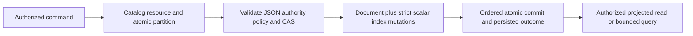

# DocumentStorage

Status: source-present baseline documented; complete product and GitHub qualification remain pending. Current behavior is distinguished below from the accepted target architecture in [design sections 7 and 37–41](../design/architecture-v0.3.uk.md).

## Purpose and actors

DocumentStorage owns tenant/database/domain-scoped JSON documents, revisions, mutations, scalar index maintenance, and authorized reads. Actors are database clients, the server command boundary, and internal query operators. Concrete current operations are `DatabaseEngine.GetDocument` and mutation application for `PutDocument`, `PatchDocument`, and `DeleteDocument`; these flow through the server/replicated command path. This document describes the observed Core contract and its target slice, not an unqualified production guarantee.

## Canonical slice map and boundaries

| Surface | Current source | Target owner |
|---|---|---|
| Contracts | `src/KeyLoad.Abstractions/Contracts.cs` (`EntityRef`, document mutations/results, `DocumentAuthority`, `IndexDefinition`) | `src/KeyLoad.Abstractions/Features/DocumentStorage/` |
| Backend | `src/KeyLoad.Core/Features/DocumentStorage/Execution/Documents.cs`, shared mutation dispatch in `DatabaseEngine.cs` | `src/KeyLoad.Core/Features/DocumentStorage/` |
| Tests | `tests/KeyLoad.UnitTests/Features/DocumentStorage/`, shared atomic batch cases in `Features/ResourceExecution/TransactionTests.cs`, `SecurityAndQueryTests.cs`, `Features/QueryExecution/` | DocumentStorage behavior and its documented cross-slice atomic/query callers |
| Durable specification | This file | `docs/Features/DocumentStorage.md` |
| HTTP | `src/KeyLoad.Server/Features/DocumentStorage/Transport/DocumentApi.cs` plus shared `Features/ClientApi/ApiEndpoints.cs`: `POST /v1/documents/get` and mutation command `POST /v1/commands` | Shared HTTP transport belongs to `src/KeyLoad.Server/Features/ClientApi/`; document validation and behavior belong to `src/KeyLoad.Core/Features/DocumentStorage/` |
| .NET SDK | `src/KeyLoad.Client/KeyLoadClient.cs`: `GetAsync` and `CommitAsync` | Shared client transport belongs to `src/KeyLoad.Client/Features/ClientApi/`; typed document behavior maps to this DocumentStorage slice |
| Official MCP | Actual `Features/ClientApi/McpCommandCatalog.cs` and `McpReadCatalog.cs`, with `McpDocumentParityTests` exercising `keyload_documents_commit` and `keyload_documents_get` through the official C# SDK | Shared ClientApi owns transport/dispatch; DocumentStorage owns the CRUD contract and matching RF3 parity cases |
| UI | No document-specific frontend interaction is specified | N/A: database document CRUD is consumed through API/SDK/MCP, not a separate UI surface |
| Backup/export | Cross-resource archive behavior is owned by BackupRestore | N/A here: this slice supplies canonical records but does not define an independent backup format |

The current root-level files are documented migration debt under ADR-032, not the target layout. Search/query owns query planning and projections; Authorization owns identity/policy rules; Messaging/EventStreams own their resources. DocumentStorage does not own physical node placement, replica consensus, or public route naming.

## Current source behavior

- A collection resource is resolved inside the supplied partition. JSON is validated against database limits. Put creates or replaces with an incremented revision; optional expected revision is checked. Patch requires an existing live document, a nonempty bounded patch, and an exact revision. Delete writes a tombstone and increments revision.
- Direct document writes are denied when catalog authority is `EventStream`. Row and field permissions are checked on mutation/read. Reads omit deleted or row-invisible records and use the persisted field projector.
- Index definitions currently support scalar paths with inclusion rules for null/missing values. Updates remove old keys and write new keys in the same transaction. Unique values are enforced within the partition; a conflicting owner rejects the transaction.
- `CommandRequest` and mutation records participate in the shared ordered batch path. Existing tests cover document/event/queue batch atomicity and persisted command retry. The literal partition key alone does not merge distinct transaction domains.
- The observed implementation does not establish multikey, covering, partial, computed, global-unique, online generation rebuild, or cluster-wide split semantics. These remain design/backlog work in section 7 and KL-010..012/039.

## Requirements and acceptance

| Requirement | Measurable acceptance | Existing TUnit evidence or planned test |
|---|---|---|
| REQ-DSTORE-001: validate scoped CRUD, revisions, and document authority | AC-DSTORE-001 passes when create/read/replace/patch/delete produce monotone revisions, exact-CAS concurrency has one winner, and invalid/stale writes or direct mutation of event-authoritative resources are rejected without partial state. | Existing `ConcurrentCompareAndSwapHasOneWinner`; actual `DocumentCrudRevisionTests` and `DocumentPutValidationAtomicityTests` cover create/missing/delete/invalid JSON/authority. Local full-suite evidence below; exact-source CI qualification pending. |
| REQ-DSTORE-002: maintain declared scalar indexes atomically | AC-DSTORE-002 passes when replacing/deleting a document removes its old keys, writes new keys, and a duplicate partition-unique value rejects the full mutation batch. | Existing `UniqueConflictRollsBackDocumentIndexEventAndEnqueue`, `AcMp003PointAndIndexDereferenceConsumeTheSameRawReadBudget`; actual `DocumentScalarIndexMutationTests` covers persisted old/new index transitions and rollback. Local full-suite evidence below; exact-source CI qualification pending. |
| REQ-DSTORE-003: enforce row/field policy at every document boundary | AC-DSTORE-003 passes when unauthorized row writes/reads and protected field use fail or project according to policy; tenant or row ownership cannot be supplied to gain access. | Existing `NestedSensitiveFieldsAreOmittedAndAliasedPredicateAndSortAreDenied`, `RowScopeAndTenantCannotBeForged`; actual field/row/tenant matrix plus isolated replacement-write and Delete-index-use controls. Local full-suite evidence below; exact-source CI qualification pending. |
| REQ-DSTORE-004: share an atomic transaction domain with eligible events and queues | AC-DSTORE-004 passes when document + event + local enqueue commit together or all remain absent, same command retry returns the stored outcome, and identical partition-key text in unrelated domains stays isolated. | Existing `DocumentEventAndQueueCommitTogetherAndCommandRetryDoesNotRepeatEffects`, `UniqueConflictRollsBackDocumentIndexEventAndEnqueue`, `SameLiteralPartitionKeyCannotCrossTransactionDomains`. CI qualification pending. |
| REQ-DSTORE-005: reuse transaction-scoped document images | AC-DSTORE-005 passes when one before-record lookup supplies CRUD and outbox; no final staged lookup/decode is required; exact bytes, revisions, tombstones, indexes, authorization, quotas and sequential same-ID mutations remain intact. | TASK-MP-007I in ADR-035; new real-store paired-size/counter and before/after/failure cases plus existing transaction/change-feed/recovery/RF3 regressions; GitHub evidence pending. |

The accepted [ADR-035 document image contract](../ADR/ADR-035-memory-performance.md)
assigns CRUD handlers and new matching tests to one worker, and shared
AtomicMutationApplication caller integration to the lead. Internal context/result
carriers stay under Features/DocumentStorage and within one atomic transaction.
UI/SDK/MCP schema migration is N/A: public contracts and persisted bytes stay exact.

The2026-10-04 regression-completion stage maps AC-DSTORE-001 to
DocumentCrudRevisionTests and DocumentPutValidationAtomicityTests, AC-DSTORE-002
to DocumentScalarIndexMutationTests, and AC-DSTORE-003 to
DocumentFieldMutationAuthorizationTests and DocumentRowTenantMutationAuthorizationTests.
These use actual TestDatabase/ZoneTree and the existing contracts: no new product
semantics or mutation DTO. Root owns this mapping and join; cluster_wave Luna/high
owns only these new UnitTests/Features/DocumentStorage files and their cohesive
fixture. Include duplicate JSON members, document-byte/depth bounds after an
earlier staged indexed mutation, exact rollback, tombstone/recreate revisions,
unique-index isolation, persisted field grants and healthy owner follow-up.

Field-write grants gate create/replacement/patch of protected fields. Whole-row
Delete follows the existing DocumentsWrite capability and row-write policy,
plus any index-field-use grant required for strict maintenance. It does not
introduce a field-write requirement for whole-row deletion. This distinguishes
the current lifecycle and field-mutation contracts in REQ-AUTH-006; neither
client-supplied row ownership nor an administrator label establishes authority.

TASK-DSTORE-FIELD-MUTATION-ORACLES closes the remaining AC-DSTORE-003 boundaries
with separate DocumentReplacementFieldAuthorizationTests and
DocumentDeleteIndexAuthorizationTests. Replacement denial uses a principal that
already has DocumentsWrite, field-read and indexed field-use grants, isolating the missing
field-write grant; exact original revision/JSON/index entries remain unchanged,
and a principal with both grants replaces successfully. Delete denial isolates
the missing indexed field-use grant and preserves the live record/index; its
allowed control has field-use but no field-write grant and produces the exact
next tombstone revision while removing the index entry. These are existing
persisted-policy semantics, not a public contract or schema change. cluster_wave
Luna/high owns only the two new files; root reviews and integrates actual Aspire
normal/scalar/recovery and exact delivered-source Linux/RF3 qualification.

## Flows and failure behavior

Positive: authorized valid JSON mutation passes catalog and CAS checks, updates document and affected indexes in one atomic command, and returns its committed revision/receipt. Negative: malformed JSON, stale CAS, denied row/field access, event-authoritative direct write, or unique collision rejects the operation. Edge: replacing indexed values removes old entries; delete creates a tombstone; patch of missing/deleted document fails; duplicate command identity is resolved by persisted outcome. Error responses must not disclose protected payload values. Query pages and index scans remain subject to the shared read budgets.

## Decisions and verification

Related decisions: [ADR-001](../ADR/ADR-001-partition-identity-affinity.md), [ADR-002](../ADR/ADR-002-command-idempotency.md), [ADR-004](../ADR/ADR-004-committed-read-views.md), [ADR-005](../ADR/ADR-005-canonical-keyspace-codec.md), [ADR-006](../ADR/ADR-006-strict-derived-indexes.md), [ADR-010](../ADR/ADR-010-query-budgets-security.md), [ADR-014](../ADR/ADR-014-principals-rbac-row-policy.md), and [ADR-016](../ADR/ADR-016-atomic-physical-placement.md). Cross-resource batches follow [ADR-024](../ADR/ADR-024-transaction-domain-binding.md).

The [2026-10-04 development receipt](../implementation/keycodec-crud-development-2026-10-04.json) records8 new real-ZoneTree CRUD cases in full Aspire normal/scalar suites at2889/2889 each and recovery228/228, with unchanged source/runtime and1000 unique atomic process cuts. Local development verification is authorized through unified Aspire; delivered-source qualification still requires complete Linux GitHub original build/TUnit/recovery/Docker RF3 artifacts. Required official MCP parity through Aspire RF3 remains pending. Document-specific UI is N/A; cross-partition unique constraints and production readiness remain unqualified.

## RF3 CRUD public-client completion (2026-10-04 accepted test scope)

TASK-DSTORE-RF3-PARITY adds only new `McpDocumentCrudParityTests`, `McpDocumentCrudParityAssertions` and, if needed, `McpDocumentCrudParityScenario` under IntegrationTests/Features/DocumentStorage. REQ-DSTORE-001 / AC-DSTORE-001 and existing ADR-002 define the behavior; an additional ADR is N/A because there is no boundary, format, transport or mutation-contract change. cluster_wave Luna/high owns these disjoint test files; root owns review, feature/task mapping, builds and exact-source Aspire/Docker RF3 qualification.

Two mirrored success cases use the actual existing keyed Aspire ClusterFixture, separate real scoped persisted principal/API-key grants, the .NET SDK and official MCP C# SDK on different RF3 endpoints. One executes SDK create -> MCP explicit replacement -> SDK Patch -> MCP Delete; the other reverses each caller. Both callers therefore successfully execute Patch and Delete, and opposite-client reads assert exact canonical JSON and revisions 1/2/3, revision4 tombstone mutation receipt, and null from both after deletion. Matching accepted command retries through the other client preserve the original command receipt/token. A third case performs an explicit replacement at revision1, then repeats a stale expected revision1 through MCP and the same stable command through SDK: exact RevisionConflict and unchanged revision2/JSON are required. Error assertions do not infer durable storage of a failed outcome merely from repeated identical errors.

Use the existing bounded McpCallerDeadline, actual persisted authorization helpers, native official tool serializers and existing fixture cleanup. No mock, hand-written MCP transport, trusted client role, new listener, broadened retries or weakened test is allowed. Existing document and policy tests stay intact. The earlier e97 Linux RF3 report remains 83/84 overall; this test scope counts only after its own complete exact-source Linux Aspire RF3 result.
