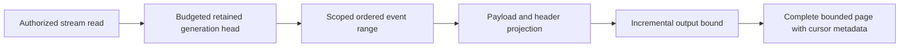

# EventStreams

Status: bounded read repair accepted; implementation/CI pending.
[ADR-035](../ADR/ADR-035-memory-performance.md) and AC-MP-005/012 apply.

| Requirement | Acceptance | Tests |
|---|---|---|
| REQ-EVENT-001: one raw work/deadline/cancellation budget covers stream head and event range | AC-MP-005 | Real-store bounded ranges, point/scan work, cancellation and subsequent store health |
| REQ-EVENT-002: projected complete StreamPage fits the result limit including head/cut/HasMore | AC-MP-005 | Exact positive/empty/edge response and over-budget event/protocol metadata cases |
| REQ-EVENT-003: preserve revisions, generation/retention failures and payload/header policy | AC-MP-005/012 | Existing event/processing recovery and new real persisted-policy redaction cases |

Owning slice: Core/Features/EventStreams/ helpers and UnitTests/Features/EventStreams/.
Existing Events.cs is ADR-032 migration debt; append/dedup/persistence are outside
this bounded-read task. Request DTO/wire and schema remain unchanged. Public SDK
and HTTP are entry points; UI N/A. Lead owns shared budget and endpoint forwarding.

TASK-MP-007A owns only ReadStream plus new event helpers/tests. Tests use the actual
ZoneTree engine and persisted policies, no doubles. GitHub executes TUnit and
related recovery/RF3 checks after strict build; source is not qualified delivery.

## Повний контракт Event Store

Актори: producer append, authorized reader/replay consumer та subscription worker. Entry points: `AppendEvents` у [public contracts](../../src/KeyLoad.Abstractions/Contracts.cs), `CommitAsync`/`ReadStreamAsync` у [SDK](../../src/KeyLoad.Client/KeyLoadClient.cs), [HTTP operations](../../src/KeyLoad.Server/ApiEndpoints.cs). Source: [Events.cs](../../src/KeyLoad.Core/Events.cs); source є, але нові shared changes ще не GitHub-qualified.

| Вимога | Observable acceptance / flows | Test mapping |
|---|---|---|
| REQ-EVENT-004: append batch має expected-revision precondition та atomic domain authority | AC-EVENT-004: valid append послідовно змінює head/events у тому самому command commit; stale revision/NoStream або wrong domain відхиляє весь batch без часткових document/queue effects | Existing `DocumentEventAndQueueCommitTogetherAndCommandRetryDoesNotRepeatEffects`, `UniqueConflictRollsBackDocumentIndexEventAndEnqueue` у [TransactionTests](../../tests/KeyLoad.UnitTests/TransactionTests.cs); додаткові isolated OCC boundaries PLANNED |
| REQ-EVENT-005: EventId dedup належить stream generation і зберігає content identity | AC-EVENT-005: same ID/content retry не створює другий event; different content дає Conflict; інший stream generation має власну identity; restart не втрачає dedup | Existing `EventIdsAreScopedToTheStreamGenerationAndStreamsCanBeSubscribed`, `RetainedEventIdRejectsDifferentContentAndPreservesDedupForTheInitialStoreFormat` у [SubscriptionTests](../../tests/KeyLoad.UnitTests/SubscriptionTests.cs); recovery expansion PLANNED |
| REQ-EVENT-006: read/replay має ordered revisions, retained generation та bounded safe page | AC-EVENT-006: page/cursor продовжує retained stream без дубля/skip; empty tail валідний; invalid generation/history loss — typed failure; current payload/header policies застосовані | Existing [StreamReadResourceTests](../../tests/KeyLoad.UnitTests/Features/EventStreams/StreamReadResourceTests.cs), `FromNowAndTailCursorIncludeEveryLaterAppend` у SubscriptionTests; AC-MP-005/012 збережені |
| REQ-EVENT-007: aggregate snapshots/schema/replay розвиваються як явний versioned contract | AC-EVENT-007: PLANNED acceptance після окремого contract freeze: snapshot version + retained events відтворюють той самий aggregate; incompatible schema/version, trimmed history або wrong generation не дають мовчазно неправильний state | PLANNED TUnit real-store version/replay і process-recovery suite; KL-085 pending, не implemented |

Повна resource identity включає tenant/database/atomic partition/stream set/stream/generation. Domain events є public history; CDC/outbox, consensus WAL та queue state мають власні authority/retention за [ADR-023](../ADR/ADR-023-journal-authority.md). Feed positions і revision — [ADR-025](../ADR/ADR-025-event-revision-feed-positions.md), atomic binding — [ADR-024](../ADR/ADR-024-transaction-domain-binding.md), privacy — [ADR-029](../ADR/ADR-029-event-message-classification.md), restore/retention — [ADR-030](../ADR/ADR-030-retention-paused-restore.md).

Topics/group delivery належать [Messaging](Messaging.md), CDC/system projections — [ChangeFeeds](ChangeFeeds.md), uploaded user bytes — [BlobStorage](BlobStorage.md). External effects і cross-partition atomic commits не обіцяються. Target map: Abstractions/Core/Client/Server/tests `Features/EventStreams/`; shared transport/host composition мають свої owners. UI N/A, це programmable Event Store. Нові runtime tasks починаються зі своїх ADR contracts; tests тільки real GitHub TUnit/recovery/RF3 SDK/MCP. Наявні test methods — source evidence, а не passing run.
