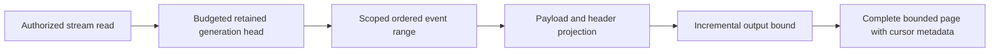

# EventStreams

Status: bounded read repair accepted; implementation/CI pending.
[ADR-035](../ADR/ADR-035-memory-performance.md) and AC-MP-005/012 apply.

| Requirement | Acceptance | Tests |
|---|---|---|
| REQ-EVENT-001: one raw work/deadline/cancellation budget covers stream head and event range | AC-MP-005 | Real-store bounded ranges, point/scan work, cancellation and subsequent store health |
| REQ-EVENT-002: projected complete StreamPage fits the result limit including head/cut/HasMore | AC-MP-005 | Exact positive/empty/edge response and over-budget event/protocol metadata cases |
| REQ-EVENT-003: preserve revisions, generation/retention failures and payload/header policy | AC-MP-005/012 | Existing event/processing recovery and new real persisted-policy redaction cases |

Owning slice: Core/Features/EventStreams/ helpers and UnitTests/Features/EventStreams/.
Existing Events.cs is ADR-032 migration debt; append/dedup/persistence are outside
this bounded-read task. Request DTO/wire and schema remain unchanged. Public SDK
and HTTP are entry points; UI N/A. Lead owns shared budget and endpoint forwarding.

TASK-MP-007A owns only ReadStream plus new event helpers/tests. Tests use the actual
ZoneTree engine and persisted policies, no doubles. GitHub executes TUnit and
related recovery/RF3 checks after strict build; source is not qualified delivery.

## Повний контракт Event Store

Актори: producer append, authorized reader/replay consumer та subscription worker. Entry points: `AppendEvents` у [public contracts](../../src/KeyLoad.Abstractions/Contracts.cs), `CommitAsync`/`ReadStreamAsync` у [SDK](../../src/KeyLoad.Client/KeyLoadClient.cs), [HTTP operations](../../src/KeyLoad.Server/ApiEndpoints.cs). Source: [Events.cs](../../src/KeyLoad.Core/Features/EventStreams/Execution/Events.cs); source є, але нові shared changes ще не GitHub-qualified.

| Вимога | Observable acceptance / flows | Test mapping |
|---|---|---|
| REQ-EVENT-004: append batch має expected-revision precondition та atomic domain authority | AC-EVENT-004: valid append послідовно змінює head/events у тому самому command commit; stale revision/NoStream або wrong domain відхиляє весь batch без часткових document/queue effects | Existing `DocumentEventAndQueueCommitTogetherAndCommandRetryDoesNotRepeatEffects`, `UniqueConflictRollsBackDocumentIndexEventAndEnqueue` у [TransactionTests](../../tests/KeyLoad.UnitTests/TransactionTests.cs); додаткові isolated OCC boundaries PLANNED |
| REQ-EVENT-005: EventId dedup належить stream generation і зберігає content identity | AC-EVENT-005: same ID/content retry не створює другий event; different content дає Conflict; інший stream generation має власну identity; restart не втрачає dedup | Existing `EventIdsAreScopedToTheStreamGenerationAndStreamsCanBeSubscribed`, `RetainedEventIdRejectsDifferentContentAndPreservesDedupForTheInitialStoreFormat` у [SubscriptionTests](../../tests/KeyLoad.UnitTests/SubscriptionTests.cs); recovery expansion PLANNED |
| REQ-EVENT-006: read/replay має ordered revisions, retained generation та bounded safe page | AC-EVENT-006: page/cursor продовжує retained stream без дубля/skip; empty tail валідний; invalid generation/history loss — typed failure; current payload/header policies застосовані | Existing [StreamReadResourceTests](../../tests/KeyLoad.UnitTests/Features/EventStreams/Cases/StreamReadResourceTests.cs), `FromNowAndTailCursorIncludeEveryLaterAppend` у SubscriptionTests; AC-MP-005/012 збережені |
| REQ-EVENT-007: compatible snapshot and complete same-cut tail reproduce an aggregate | AC-EVENT-007: reference equals snapshot+tail reduction; exact reducer/state schema enforced; explicit full replay requires complete history; wrong generation, erased/missing history and invalid identity fail explicitly | ADR-075; AggregateReplay real ZoneTree, pure worker, process recovery and actual RF3 SDK/MCP tests; runtime pending |
| REQ-EVENT-008: one bounded snapshot slot has atomic CAS and stable retry | AC-EVENT-008: absent-slot version zero, exact prior version, nondecreasing source revision and tail/floor bounds hold; retry never advances twice; unknown format/checksum corruption fail closed; reopen preserves exact state | ADR-075; AggregateSnapshot CAS/native/reopen/recovery tests; runtime pending |
| REQ-EVENT-009: aggregate state requires fully authorized workers | AC-EVENT-009: persisted EventsRead plus EventsReplay or EventsSnapshotsManage and every payload/header raw-read/raw-use grant are checked before bodies; tenant/resource denial and revocation disclose no protected state/events | ADR-075; persisted-policy real-store and official-client RF3 tests; runtime pending |
| REQ-EVENT-010: replay is bounded and produces no external effects | AC-EVENT-010: complete tail fits MaximumEvents and shared raw/result/deadline/cancel bounds or fails whole; one cut and one exact current event schema feed a deterministic pure worker; schema mismatch fails before callbacks; no append/enqueue/ack/subscription redrive occurs | ADR-075; AggregateReplay bounds/source invariance and pure SDK worker tests; runtime pending |

Повна resource identity включає tenant/database/atomic partition/stream set/stream/generation. Domain events є public history; CDC/outbox, consensus WAL та queue state мають власні authority/retention за [ADR-023](../ADR/ADR-023-journal-authority.md). Feed positions і revision — [ADR-025](../ADR/ADR-025-event-revision-feed-positions.md), atomic binding — [ADR-024](../ADR/ADR-024-transaction-domain-binding.md), privacy — [ADR-029](../ADR/ADR-029-event-message-classification.md), restore/retention — [ADR-030](../ADR/ADR-030-retention-paused-restore.md).

Topics/group delivery належать [Messaging](Messaging.md), CDC/system projections — [ChangeFeeds](ChangeFeeds.md), uploaded user bytes — [BlobStorage](BlobStorage.md). External effects і cross-partition atomic commits не обіцяються. Target map: Abstractions/Core/Client/Server/tests `Features/EventStreams/`; shared transport/host composition мають свої owners. UI N/A, це programmable Event Store. Нові runtime tasks починаються зі своїх ADR contracts; tests тільки real GitHub TUnit/recovery/RF3 SDK/MCP. Наявні test methods — source evidence, а не passing run.

## Current replay and event identity contract

Under ADR-075, `AggregateReplayReduction.Reduce` accepts the complete current
page, exact reducer, validated `IOptions<AggregateReplayWorkerLimits>` and
cancellation. Every event must match the reducer's current event schema exactly.
Validate the complete stream/generation/head/floor/tail/order/identity, original
payload/header JSON and combined input limits before invoking any reducer. Pass
the original immutable event to the reducer; validate each resulting state and
check cancellation at every existing boundary. There is no schema conversion
callback, registry, path resolver or associated configuration/message surface.
Snapshot and full-history replay must yield the same independently expected
state; wrong schema, invalid JSON, incomplete tail or exhausted budget must fail
without reducer effects. A subsequent healthy replay must still succeed.

AC-EVENT-005 uses only the current stream-and-generation EventId key. Real
append/retry/different-content/reopen cases retain exact head, revision, sequence,
receipt and content checks. Remove the alternate resource-wide key lookup.
Current whole-operation dedup tests remain required.

TASK-EVENT-CURRENT-028 freezes Client EventStreams reduction/validation/options/
messages, the two exclusive conversion files, Core Events append lookup and the
three existing worker case files plus test support as one guarded private scope.
It also ports only the EventId dedup case in Messaging's
`SubscriptionRecoveryAndPolicyTests.cs` to real current-key append/retry,
different-content rejection, reopen and independent stream/topic operations;
all other subscription, policy and inbox flows remain unchanged.
The worker removes conversion-only cases and ports current schema, bounds,
cancellation and positive reduction flows; root reviews every change, joins
shared docs and runs enabled build/format plus actual Aspire normal/scalar and
current event recovery/RF3 gates. Current native IDs/aliases, exact canonical
event content, persisted authorization and atomic/RF3 authority do not change.
Rollback restores a coherent source checkpoint with the current format.

TASK-MCP-EVENT-PARITY adds actual Docker RF3 .NET/official MCP evidence for
REQ-EVENT-004/005/006 and AC-EVENT-004/005/006 under ADR-039: identical bounded
page content and exclusive-revision replay, stable append retry with no duplicate event,
empty tail, persisted stream-set authority, cross-tenant denial, invalid limit and
stale generation. New tests are owned by
`tests/KeyLoad.IntegrationTests/Features/EventStreams/Cases/McpEventStreamTests.cs` and
cohesive scenario/tokens/assertion helpers in the same slice. Source-only status
remains pending until the full exact-SHA GitHub RF3 suite passes. Every actual read
cut must cover the append receipt and sequential cuts remain monotonic; independent
cuts may advance because five-second persisted Orleans heartbeats share the physical
store. No public pin-to-cut input exists, so byte parity applies to the exact event
records while each returned cut is checked independently.

TASK-RUNTIME-EVENT-FIXTURE-W preserves REQ-EVENT-004/006, AC-EVENT-004/006 and
AC-MP-005/012 after six exact candidate6949fa0 / run37005805424 tests fail during
setup. StreamReadResourceFixture creates different IDs for the CommandRequest
and replicated envelope; production correctly rejects that mismatch. The worker
owns only UnitTests/Features/EventStreams/StreamReadResourceFixture.cs and NEW
StreamCommandIdentityTests.cs. Derive the batch envelope ID from its existing
CommandRequest; other fixture commands retain fresh IDs. The new actual-store
negative regression must prove mismatched IDs return Validation without stream
effects, while matched ID append succeeds and retains its receipt identity/replay.
Preserve all existing range/policy/budget/cancellation and fixture lifetime cases.
This is test-only input repair: ADR-035/041/039 and the canonical batch contract
are sufficient, with no product/API/data boundary change or separate ADR. Lead
reviews/builds/formats and qualifies complete exact-SHA GitHub unit/RF3 suites.

TASK-AD-E2 preserves REQ/AC-EVENT-004/005/006 and AC-MCP-002/005/007 after
run37032546228 at exactb533c80 fails three RF3 cases at byte-exact EventData
expectations. The existing production contract canonicalizes JSON payload/header
property order; SDK/MCP bytes already agree, while the fixture expects unsorted
producer bytes. One worker owns only IntegrationTests/Features/EventStreams/
McpEventStreamScenario.cs and McpEventStreamTokens.cs. Keep unsorted InputEvents
for actual append and handcrafted independent canonical ExpectedEvents for the
unchanged exact equality, identity, sequence, paging, retry and security assertions.
Do not compute expectations through production normalization or weaken comparisons.
ADR-035/039 remain sufficient for this test-only oracle correction; no product,
schema, authority or transport contract changes. Lead owns integration/delivery
and exact-SHA GitHub qualification; local tests remain prohibited.

## TASK-EVENT-QUEUE-WHOLEFLOW-001 — bounded native operation regression proposal

This source-only regression batch preserves the existing ADR-002/024/026/028
contracts and REQ/AC-EVENT-004/005 plus REQ/AC-MSG-001/002/005. Its original
architecture task subset is KL-083 (append OCC/content identity), KL-087 (lost
claim/ACK reply recovery) and KL-091 (same-domain batch precondition rollback).
It does not close those tasks or qualify the full EventStreams/Messaging feature.

The owning unit cases are
[EventAppendWholeFlowTests](../../tests/KeyLoad.UnitTests/Features/EventStreams/Cases/EventAppendWholeFlowTests.cs)
(two concurrent Exact append instances and four rejection instances),
[QueueLostResponseWholeFlowTests](../../tests/KeyLoad.UnitTests/Features/Messaging/Cases/QueueLostResponseWholeFlowTests.cs)
(one claim/ACK retry workflow with real ZoneTree reopen), and
[QueueAdmissionCancellationWholeFlowTests](../../tests/KeyLoad.UnitTests/Features/Messaging/Cases/QueueAdmissionCancellationWholeFlowTests.cs)
(two pre-admission cancellation instances). They use actual native storage,
joined workers, literal complete results, persisted-state assertions, stable
receipt replay and a healthy follow-up. Failed commands may retain authorized
outcome/clock records; rejection tests assert complete affected domain-family
state rather than falsely requiring no committed failure outcome. Pre-admission
cancellation asserts the entire store and position remain unchanged and checks
the original token. It does not claim cancellation after commit undoes effects.

The exact proposed native inventory is nine. Current normal/scalar execution,
seeded process-crash criteria and real RF3 SDK/MCP qualification remain required;
source review is not execution evidence. Original historical passing cases and
retained global failures remain separate from this proposal.

## TASK-EVENT-APPEND-SEEDED-CRASH-001

REQ-EVENT-004/005 and AC-EVENT-004/005, REQ-MSG-005/AC-MSG-005 and REQ-STORAGE-006/007/AC-STORAGE-006/007 refine original KL083/KL091 seeded DURING append acceptance. Existing local R334/R335 full unit2876/2876 and R330 recovery236/236 are retained as baseline, not proof of this new flow or Linux acceptance. ADR002's private amendment freezes implementation before code.

AC-EVENT-CRASH-001: a real CrashHost seeds canonical resources and stream revision1, freezes one original typed command containing PutDocument, AppendEvents Exact1 and EnqueueMessage, then arms only its next native commit. Parent observes the existing exact crash marker at HeaderWritten, PayloadWritten, JournalFlushed, MutationApplied0/3/6 or ApplyCompleted, kills only its owned child and joins actual original exit and both bounded readers. Reopen native ZoneTree only after native handle/lock release. The retained outcome determines one complete recovered prefix: document/event/head/EventId identity/queue/outbox/receipt and store position must all match independent literal expectations. JournalFlushed and later cuts must recover committed; pre-flush cuts may expose either complete valid prefix, never partial state.

AC-EVENT-CRASH-002: applying the exact original principal/CommandId/payload/time on the recovered store yields one successful canonical effect, retains the original complete result on matching retry without position/byte changes, rejects changed content as exact Conflict, and leaves a matching healthy retry valid. A fresh bounded document/event/queue follow-up must advance stream revision3 and publish complete literal state. No sidecar may define recovered truth: sidecars hold only frozen caller input and seed coordinates; all canonical recovery comes from actual store.

Ownership map: CrashHost/EventStreams/Contracts and Helpers own immutable scenario/data plus existing CrashHostApplication mode dispatch; RecoveryTests/EventStreams/Cases, Processes and Assertions own seven real process cases, original child lifetime and independent state/replay oracle. Reuse CanonicalCrashBoundary, CommandIdempotencyProcessChild, existing native90second run/30second cleanup bounds, StorageTrialLease and current serializer/provider/options. No production storage/provider seam, format/namespace/serializer change, client retry, new deadline, multi-lane expansion or process-kill power-loss claim. Failures preserve primary plus child/readers/disposal errors and retained root; successful cleanup occurs only after original child and reopened store/locks settle. Root alone guarded-joins, formats/builds, discovers exact seven instances and runs full native recovery followed by original required normal/scalar/RF3/Linux/coverage gates. Rollback removes only this additive mode/cases and contract; all prior modes and failures stay intact.

### TASK-BACKUP-EVENTING-CUT-001 (KL-098 local capability-state proof)

Freeze before code under REQ/AC-BACKUP-001/002/003/004, REQ/AC-EVENT-004/005/006 and REQ/AC-MSG-003/005/006: seed actual native resources, three canonical source events, two independent subscription groups, an out-of-order completion gap, one persisted subscription-processing inbox with document+queue effects, and a real leased queue message. Capture the native backup cut, pack/unpack the genuine current-format artifact, restore into a clean target and reopen real ZoneTree. Independently require stable positions/content/generation, literal group checkpoint/issued/gap state, exact document/message state and byte-identical retained event/subscription/inbox/queue/outbox records. Manifest/source cut and single restore-authority position increment are exact; archive bytes remain unchanged.

Before explicit operator resume, fresh subscription and queue receive must fail exactly DispatchPaused and old source cursor/delivery tokens and pre-restore original command outcomes must fail exactly TokenInvalidated without effects. Persisted narrow principal denial remains enforced. Failed owned Apply outcomes commit exactly once and same-ID failed replay preserves complete result and store position. Old stored outcomes are retained; no old incarnation receipt is fabricated as current success.

Reconcile through existing public native operations only: explicitly seek the restored group from retained beginning to a new subscription generation, clear that group's explicit pause, explicitly set dispatch running as administrator, and obtain genuine new-incarnation claims. Reprocess the already completed source position using the same handler scope/execution generation: the persisted inbox returns AlreadyProcessed with original effects token and no second document/enqueue. Close contiguous gaps with actual acknowledgements. A new bounded producer/claim/ack and final close/reopen prove healthy continuation and all canonical state. Use no sleeps, fake providers, raw system-key resume or implementation-only migration APIs.

This closes only the missing local eventing artifact-state regression. KL-098 consumer/rebuild/transfer retention pins, event/topic purge/receipt horizon, history-loss reconciliation, remote-transfer KL094 and cluster-wide per-partition backup cut remain distinct open criteria. Current public event/topic APIs expose caps, reads and subscription seek, but no event/topic purge/pin implementation; the test must not synthesize history loss by deleting canonical keys or advertise local backup as a cluster cut. Existing outbox purge/pin and remote-transfer suites remain mandatory.

Ownership: UnitTests BackupRestore Cases/Fixtures/Assertions/Helpers; native artifacts and ZoneTree product APIs unchanged. Ordered join: contract, test-only implementation, root format/build and full normal/scalar native execution with exact original source/DLL identities; Linux recovery/RF3/global gates unchanged. No coverage inventory edit or status closure. Failure retains owned source/backup/target root and original primary plus joined disposal errors. No product seam, format/serializer/public contract change. Rollback removes this task and its test-only flow; no old report is rewritten.
