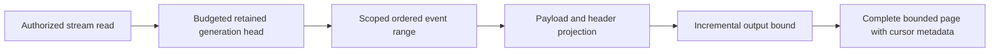
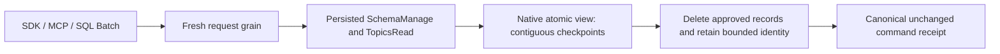

# EventStreams

Status: bounded read repair accepted; implementation/CI pending.
[ADR-035](../ADR/ADR-035-memory-performance.md) and AC-MP-005/012 apply.

| Requirement | Acceptance | Tests |
|---|---|---|
| REQ-EVENT-001: one raw work/deadline/cancellation budget covers stream head and event range | AC-MP-005 | Real-store bounded ranges, point/scan work, cancellation and subsequent store health |
| REQ-EVENT-002: projected complete StreamPage fits the result limit including head/cut/HasMore | AC-MP-005 | Exact positive/empty/edge response and over-budget event/protocol metadata cases |
| REQ-EVENT-003: preserve revisions, generation/retention failures and payload/header policy | AC-MP-005/012 | Existing event/processing recovery and new real persisted-policy redaction cases |

Owning slice: Core/Features/EventStreams/ helpers and UnitTests/Features/EventStreams/.
Existing Events.cs is ADR-032 migration debt; append/dedup/persistence are outside
this bounded-read task. Request DTO/wire and schema remain unchanged. Public SDK
and HTTP are entry points; UI N/A. Lead owns shared budget and endpoint forwarding.

TASK-MP-007A owns only ReadStream plus new event helpers/tests. Tests use the actual
ZoneTree engine and persisted policies, no doubles. GitHub executes TUnit and
related recovery/RF3 checks after strict build; source is not qualified delivery.

## Повний контракт Event Store

Актори: producer append, authorized reader/replay consumer та subscription worker. Entry points: `AppendEvents` у [public contracts](../../src/KeyLoad.Abstractions/Contracts.cs), `CommitAsync`/`ReadStreamAsync` у [SDK](../../src/KeyLoad.Client/KeyLoadClient.cs), [HTTP operations](../../src/KeyLoad.Server/ApiEndpoints.cs). Source: [Events.cs](../../src/KeyLoad.Core/Features/EventStreams/Execution/Events.cs); source є, але нові shared changes ще не GitHub-qualified.

| Вимога | Observable acceptance / flows | Test mapping |
|---|---|---|
| REQ-EVENT-004: append batch має expected-revision precondition та atomic domain authority | AC-EVENT-004: valid append послідовно змінює head/events у тому самому command commit; stale revision/NoStream або wrong domain відхиляє весь batch без часткових document/queue effects | Existing `DocumentEventAndQueueCommitTogetherAndCommandRetryDoesNotRepeatEffects`, `UniqueConflictRollsBackDocumentIndexEventAndEnqueue` у [TransactionTests](../../tests/KeyLoad.UnitTests/TransactionTests.cs); додаткові isolated OCC boundaries PLANNED |
| REQ-EVENT-005: EventId dedup належить stream generation і зберігає content identity | AC-EVENT-005: same ID/content retry не створює другий event; different content дає Conflict; інший stream generation має власну identity; restart не втрачає dedup | Existing `EventIdsAreScopedToTheStreamGenerationAndStreamsCanBeSubscribed`, `RetainedEventIdRejectsDifferentContentAndPreservesDedupForTheInitialStoreFormat` у [SubscriptionTests](../../tests/KeyLoad.UnitTests/SubscriptionTests.cs); recovery expansion PLANNED |
| REQ-EVENT-006: read/replay має ordered revisions, retained generation та bounded safe page | AC-EVENT-006: page/cursor продовжує retained stream без дубля/skip; empty tail валідний; invalid generation/history loss — typed failure; current payload/header policies застосовані | Existing [StreamReadResourceTests](../../tests/KeyLoad.UnitTests/Features/EventStreams/Cases/StreamReadResourceTests.cs), `FromNowAndTailCursorIncludeEveryLaterAppend` у SubscriptionTests; AC-MP-005/012 збережені |
| REQ-EVENT-007: compatible snapshot and complete same-cut tail reproduce an aggregate | AC-EVENT-007: reference equals snapshot+tail reduction; exact reducer/state schema enforced; explicit full replay requires complete history; wrong generation, erased/missing history and invalid identity fail explicitly | ADR-075; AggregateReplay real ZoneTree, pure worker, process recovery and actual RF3 SDK/MCP tests; runtime pending |
| REQ-EVENT-008: one bounded snapshot slot has atomic CAS and stable retry | AC-EVENT-008: absent-slot version zero, exact prior version, nondecreasing source revision and tail/floor bounds hold; retry never advances twice; unknown format/checksum corruption fail closed; reopen preserves exact state | ADR-075; AggregateSnapshot CAS/native/reopen/recovery tests; runtime pending |
| REQ-EVENT-009: aggregate state requires fully authorized workers | AC-EVENT-009: persisted EventsRead plus EventsReplay or EventsSnapshotsManage and every payload/header raw-read/raw-use grant are checked before bodies; tenant/resource denial and revocation disclose no protected state/events | ADR-075; persisted-policy real-store and official-client RF3 tests; runtime pending |
| REQ-EVENT-010: replay is bounded and produces no external effects | AC-EVENT-010: complete tail fits MaximumEvents and shared raw/result/deadline/cancel bounds or fails whole; one cut and one exact current event schema feed a deterministic pure worker; schema mismatch fails before callbacks; no append/enqueue/ack/subscription redrive occurs | ADR-075; AggregateReplay bounds/source invariance and pure SDK worker tests; runtime pending |

Повна resource identity включає tenant/database/atomic partition/stream set/stream/generation. Domain events є public history; CDC/outbox, consensus WAL та queue state мають власні authority/retention за [ADR-023](../ADR/ADR-023-journal-authority.md). Feed positions і revision — [ADR-025](../ADR/ADR-025-event-revision-feed-positions.md), atomic binding — [ADR-024](../ADR/ADR-024-transaction-domain-binding.md), privacy — [ADR-029](../ADR/ADR-029-event-message-classification.md), restore/retention — [ADR-030](../ADR/ADR-030-retention-paused-restore.md).

Topics/group delivery належать [Messaging](Messaging.md), CDC/system projections — [ChangeFeeds](ChangeFeeds.md), uploaded user bytes — [BlobStorage](BlobStorage.md). External effects і cross-partition atomic commits не обіцяються. Target map: Abstractions/Core/Client/Server/tests `Features/EventStreams/`; shared transport/host composition мають свої owners. UI N/A, це programmable Event Store. Нові runtime tasks починаються зі своїх ADR contracts; tests тільки real GitHub TUnit/recovery/RF3 SDK/MCP. Наявні test methods — source evidence, а не passing run.

## Current replay and event identity contract

Under ADR-075, `AggregateReplayReduction.Reduce` accepts the complete current
page, exact reducer, validated `IOptions<AggregateReplayWorkerLimits>` and
cancellation. Every event must match the reducer's current event schema exactly.
Validate the complete stream/generation/head/floor/tail/order/identity, original
payload/header JSON and combined input limits before invoking any reducer. Pass
the original immutable event to the reducer; validate each resulting state and
check cancellation at every existing boundary. There is no schema conversion
callback, registry, path resolver or associated configuration/message surface.
Snapshot and full-history replay must yield the same independently expected
state; wrong schema, invalid JSON, incomplete tail or exhausted budget must fail
without reducer effects. A subsequent healthy replay must still succeed.

AC-EVENT-005 uses only the current stream-and-generation EventId key. Real
append/retry/different-content/reopen cases retain exact head, revision, sequence,
receipt and content checks. Remove the alternate resource-wide key lookup.
Current whole-operation dedup tests remain required.

TASK-EVENT-CURRENT-028 freezes Client EventStreams reduction/validation/options/
messages, the two exclusive conversion files, Core Events append lookup and the
three existing worker case files plus test support as one guarded private scope.
It also ports only the EventId dedup case in Messaging's
`SubscriptionRecoveryAndPolicyTests.cs` to real current-key append/retry,
different-content rejection, reopen and independent stream/topic operations;
all other subscription, policy and inbox flows remain unchanged.
The worker removes conversion-only cases and ports current schema, bounds,
cancellation and positive reduction flows; root reviews every change, joins
shared docs and runs enabled build/format plus actual Aspire normal/scalar and
current event recovery/RF3 gates. Current native IDs/aliases, exact canonical
event content, persisted authorization and atomic/RF3 authority do not change.
Rollback restores a coherent source checkpoint with the current format.

TASK-MCP-EVENT-PARITY adds actual Docker RF3 .NET/official MCP evidence for
REQ-EVENT-004/005/006 and AC-EVENT-004/005/006 under ADR-039: identical bounded
page content and exclusive-revision replay, stable append retry with no duplicate event,
empty tail, persisted stream-set authority, cross-tenant denial, invalid limit and
stale generation. New tests are owned by
`tests/KeyLoad.IntegrationTests/Features/EventStreams/Cases/McpEventStreamTests.cs` and
cohesive scenario/tokens/assertion helpers in the same slice. Source-only status
remains pending until the full exact-SHA GitHub RF3 suite passes. Every actual read
cut must cover the append receipt and sequential cuts remain monotonic; independent
cuts may advance because five-second persisted Orleans heartbeats share the physical
store. No public pin-to-cut input exists, so byte parity applies to the exact event
records while each returned cut is checked independently.

TASK-RUNTIME-EVENT-FIXTURE-W preserves REQ-EVENT-004/006, AC-EVENT-004/006 and
AC-MP-005/012 after six exact candidate6949fa0 / run37005805424 tests fail during
setup. StreamReadResourceFixture creates different IDs for the CommandRequest
and replicated envelope; production correctly rejects that mismatch. The worker
owns only UnitTests/Features/EventStreams/StreamReadResourceFixture.cs and NEW
StreamCommandIdentityTests.cs. Derive the batch envelope ID from its existing
CommandRequest; other fixture commands retain fresh IDs. The new actual-store
negative regression must prove mismatched IDs return Validation without stream
effects, while matched ID append succeeds and retains its receipt identity/replay.
Preserve all existing range/policy/budget/cancellation and fixture lifetime cases.
This is test-only input repair: ADR-035/041/039 and the canonical batch contract
are sufficient, with no product/API/data boundary change or separate ADR. Lead
reviews/builds/formats and qualifies complete exact-SHA GitHub unit/RF3 suites.

TASK-AD-E2 preserves REQ/AC-EVENT-004/005/006 and AC-MCP-002/005/007 after
run37032546228 at exactb533c80 fails three RF3 cases at byte-exact EventData
expectations. The existing production contract canonicalizes JSON payload/header
property order; SDK/MCP bytes already agree, while the fixture expects unsorted
producer bytes. One worker owns only IntegrationTests/Features/EventStreams/
McpEventStreamScenario.cs and McpEventStreamTokens.cs. Keep unsorted InputEvents
for actual append and handcrafted independent canonical ExpectedEvents for the
unchanged exact equality, identity, sequence, paging, retry and security assertions.
Do not compute expectations through production normalization or weaken comparisons.
ADR-035/039 remain sufficient for this test-only oracle correction; no product,
schema, authority or transport contract changes. Lead owns integration/delivery
and exact-SHA GitHub qualification; local tests remain prohibited.

## TASK-EVENT-QUEUE-WHOLEFLOW-001 — bounded native operation regression proposal

This source-only regression batch preserves the existing ADR-002/024/026/028
contracts and REQ/AC-EVENT-004/005 plus REQ/AC-MSG-001/002/005. Its original
architecture task subset is KL-083 (append OCC/content identity), KL-087 (lost
claim/ACK reply recovery) and KL-091 (same-domain batch precondition rollback).
It does not close those tasks or qualify the full EventStreams/Messaging feature.

The owning unit cases are
[EventAppendWholeFlowTests](../../tests/KeyLoad.UnitTests/Features/EventStreams/Cases/EventAppendWholeFlowTests.cs)
(two concurrent Exact append instances and four rejection instances),
[QueueLostResponseWholeFlowTests](../../tests/KeyLoad.UnitTests/Features/Messaging/Cases/QueueLostResponseWholeFlowTests.cs)
(one claim/ACK retry workflow with real ZoneTree reopen), and
[QueueAdmissionCancellationWholeFlowTests](../../tests/KeyLoad.UnitTests/Features/Messaging/Cases/QueueAdmissionCancellationWholeFlowTests.cs)
(two pre-admission cancellation instances). They use actual native storage,
joined workers, literal complete results, persisted-state assertions, stable
receipt replay and a healthy follow-up. Failed commands may retain authorized
outcome/clock records; rejection tests assert complete affected domain-family
state rather than falsely requiring no committed failure outcome. Pre-admission
cancellation asserts the entire store and position remain unchanged and checks
the original token. It does not claim cancellation after commit undoes effects.

The exact proposed native inventory is nine. Current normal/scalar execution,
seeded process-crash criteria and real RF3 SDK/MCP qualification remain required;
source review is not execution evidence. Original historical passing cases and
retained global failures remain separate from this proposal.

## TASK-EVENT-APPEND-SEEDED-CRASH-001

REQ-EVENT-004/005 and AC-EVENT-004/005, REQ-MSG-005/AC-MSG-005 and REQ-STORAGE-006/007/AC-STORAGE-006/007 refine original KL083/KL091 seeded DURING append acceptance. Existing local R334/R335 full unit2876/2876 and R330 recovery236/236 are retained as baseline, not proof of this new flow or Linux acceptance. ADR002's private amendment freezes implementation before code.

AC-EVENT-CRASH-001: a real CrashHost seeds canonical resources and stream revision1, freezes one original typed command containing PutDocument, AppendEvents Exact1 and EnqueueMessage, then arms only its next native commit. Parent observes the existing exact crash marker at HeaderWritten, PayloadWritten, JournalFlushed, MutationApplied0/3/6 or ApplyCompleted, kills only its owned child and joins actual original exit and both bounded readers. Reopen native ZoneTree only after native handle/lock release. The retained outcome determines one complete recovered prefix: document/event/head/EventId identity/queue/outbox/receipt and store position must all match independent literal expectations. JournalFlushed and later cuts must recover committed; pre-flush cuts may expose either complete valid prefix, never partial state.

AC-EVENT-CRASH-002: applying the exact original principal/CommandId/payload/time on the recovered store yields one successful canonical effect, retains the original complete result on matching retry without position/byte changes, rejects changed content as exact Conflict, and leaves a matching healthy retry valid. A fresh bounded document/event/queue follow-up must advance stream revision3 and publish complete literal state. No sidecar may define recovered truth: sidecars hold only frozen caller input and seed coordinates; all canonical recovery comes from actual store.

Ownership map: CrashHost/EventStreams/Contracts and Helpers own immutable scenario/data plus existing CrashHostApplication mode dispatch; RecoveryTests/EventStreams/Cases, Processes and Assertions own seven real process cases, original child lifetime and independent state/replay oracle. Reuse CanonicalCrashBoundary, CommandIdempotencyProcessChild, existing native90second run/30second cleanup bounds, StorageTrialLease and current serializer/provider/options. No production storage/provider seam, format/namespace/serializer change, client retry, new deadline, multi-lane expansion or process-kill power-loss claim. Failures preserve primary plus child/readers/disposal errors and retained root; successful cleanup occurs only after original child and reopened store/locks settle. Root alone guarded-joins, formats/builds, discovers exact seven instances and runs full native recovery followed by original required normal/scalar/RF3/Linux/coverage gates. Rollback removes only this additive mode/cases and contract; all prior modes and failures stay intact.

### TASK-BACKUP-EVENTING-CUT-001 (KL-098 local capability-state proof)

Freeze before code under REQ/AC-BACKUP-001/002/003/004, REQ/AC-EVENT-004/005/006 and REQ/AC-MSG-003/005/006: seed actual native resources, three canonical source events, two independent subscription groups, an out-of-order completion gap, one persisted subscription-processing inbox with document+queue effects, and a real leased queue message. Capture the native backup cut, pack/unpack the genuine current-format artifact, restore into a clean target and reopen real ZoneTree. Independently require stable positions/content/generation, literal group checkpoint/issued/gap state, exact document/message state and byte-identical retained event/subscription/inbox/queue/outbox records. Manifest/source cut and single restore-authority position increment are exact; archive bytes remain unchanged.

Before explicit operator resume, fresh subscription and queue receive must fail exactly DispatchPaused and old source cursor/delivery tokens and pre-restore original command outcomes must fail exactly TokenInvalidated without effects. Persisted narrow principal denial remains enforced. Failed owned Apply outcomes commit exactly once and same-ID failed replay preserves complete result and store position. Old stored outcomes are retained; no old incarnation receipt is fabricated as current success.

Reconcile through existing public native operations only: explicitly seek the restored group from retained beginning to a new subscription generation, clear that group's explicit pause, explicitly set dispatch running as administrator, and obtain genuine new-incarnation claims. Reprocess the already completed source position using the same handler scope/execution generation: the persisted inbox returns AlreadyProcessed with original effects token and no second document/enqueue. Close contiguous gaps with actual acknowledgements. A new bounded producer/claim/ack and final close/reopen prove healthy continuation and all canonical state. Use no sleeps, fake providers, raw system-key resume or implementation-only migration APIs.

This closes only the missing local eventing artifact-state regression. KL-098 consumer/rebuild/transfer retention pins, event/topic purge/receipt horizon, history-loss reconciliation, remote-transfer KL094 and cluster-wide per-partition backup cut remain distinct open criteria. Current public event/topic APIs expose caps, reads and subscription seek, but no event/topic purge/pin implementation; the test must not synthesize history loss by deleting canonical keys or advertise local backup as a cluster cut. Existing outbox purge/pin and remote-transfer suites remain mandatory.

Ownership: UnitTests BackupRestore Cases/Fixtures/Assertions/Helpers; native artifacts and ZoneTree product APIs unchanged. Ordered join: contract, test-only implementation, root format/build and full normal/scalar native execution with exact original source/DLL identities; Linux recovery/RF3/global gates unchanged. No coverage inventory edit or status closure. Failure retains owned source/backup/target root and original primary plus joined disposal errors. No product seam, format/serializer/public contract change. Rollback removes this task and its test-only flow; no old report is rewritten.

## TASK-KL098-TOPIC-RETENTION-001 — bounded native topic purge

REQ-EVENT-RETENTION-001: `PurgeTopic(Topic, ThroughPosition, Generation)` is an inclusive same-partition Batch mutation through SDK CommitAsync, existing official MCP documents_commit and shared SQL CALL documents_commit decoder/request grain. Persisted SchemaManage AND TopicsRead are required before cached outcome replay. No new transport, provider or physical owner.

REQ-EVENT-RETENTION-002: delete only retained positions FirstAvailablePosition..ThroughPosition inclusive; reject nonpositive, beyond-tail or already-retained-away cuts, stale generation and scan/byte exhaustion. Every persisted same-source/generation group's contiguous Checkpoint pins all positions greater than Checkpoint, including paused/parked groups; IssuedPosition/ACK gaps do not release pins. Therefore requested cut must be <= every Checkpoint. Refusal is ResourceExhausted and cannot alter topic/group/inbox/queue state.

Every original native observer charges one examined record plus bytes before decoding, including range lookahead and missing point lookup; callbacks never escape native read ownership. All PurgeTopic effects in one owned ApplyMutations batch share one monotonically charged MaxScanRecords/MaxBatchBytes ledger; no reset per mutation. Native atomic write cancellation/admission remains owned by the original apply gate; this adds no separate token or deadline.

REQ-EVENT-RETENTION-003: atomically advance FirstAvailablePosition to cut+1 and subtract exact native serialized source bytes; preserve TailPosition, partition event sequence, generation, group/inbox/queue state, incarnation and backup identity. Retain only generated native typed event-ID digest/original position/generation in existing topic-event-id family. No bodies, fallback, migration or receipt pruning. Fresh identical event reuse remains DuplicateEventId; conflicting content remains Conflict; same immutable original command ID returns byte-identical receipt after purge.

AC-EVENT-RETENTION-001: genuine ZoneTree seeded three-event/two-group operation refuses unread and paused pins, releases only by existing exact ACK/explicit seek; bounded approved purge leaves literal event3 at original position/sequence3 and unchanged other model bytes, old read yields exact HistoryUnavailable; same-ID purge replay retains complete receipt and stable store cut.
AC-EVENT-RETENTION-002: post-purge original publish replay returns exact original receipt, fresh identical/conflicting event commands preserve exact distinct errors; denied caller cannot purge or replay privileged receipt, stale generation/cut/record/byte budget failures retain complete logical state and stable same-ID rejected outcomes; healthy next publish is position/sequence4.
AC-EVENT-RETENTION-003: native store reopen retains exact head, digest identities, group/checkpoint/inbox/queue state and receipts; shared real SQL compiler/decoder admits same Batch mutation; root must run native unit/scalar/recovery and genuine RF3 SDK/MCP before qualification. Automated owning cases: TopicRetentionOperationTests, TopicRetentionBoundaryTests; no source-only proof.

Implementation order: this contract first; Abstractions/EventStreams Contracts + generated native alias; Core/EventStreams Commands and Messaging publisher identity; existing Batch validation/auth/apply joins; UnitTests/EventStreams native operation fixtures/cases. Roll out only as a homogeneous freshly built native server cohort; do not downgrade a store whose journals/records retain the new generated aliases. Existing formats/aliases/field IDs are unchanged, with no mixed-version fallback. Historical digest count and receipt-horizon-wide storage bounds remain unqualified; active MaxEvents/MaxBytes is not reinterpreted as a lifetime-ID limit. Rollback source before qualification; persisted purge is deliberate irreversible data removal and has no migration rollback. Rebuild/transfer pins, receipt-horizon pruning, remote KL094 and complete KL098 closure remain explicitly incomplete.

### TASK-KL098-TOPIC-PURGE-CRASH-001: native admitted purge cuts

REQ-EVENT-RETENTION-004 / AC-EVENT-RETENTION-004: the real CrashHost first acknowledges purge through source position1, then arms the existing native CanonicalCrashBoundary for exactly the next Store.Commit position of immutable purge-through2. Two seeds admit either success (paused checkpoint3) or exact ResourceExhausted rejection (paused checkpoint1). Kill only the owned original process after its native phase marker; join original exit and both bounded readers, prove exclusive native locks, reopen actual ZoneTree. HeaderWritten/PayloadWritten are pre-flush boundaries; JournalFlushed is AFTER native durable flush returns and BEFORE native apply, not inside an OS flush syscall. MutationApplied0 and ApplyCompleted are actual native apply cuts. Pre-flush may recover old or whole new cut; post-flush must recover complete success/rejected receipt, never partial model changes.

The independent oracle requires literal head/events/source positions/digests/doc/queue/paused checkpoint plus original acknowledged seed receipt, canonical command fingerprint/receipt, exact committed clock and stable same-ID replay with full-store byte equality. Fresh identical/conflicting EventID errors remain distinct. Follow with actual append/read/queue claim and final native reopen. No new product seam/provider/journal/format/whitelist, sleeps, wider deadlines or retry-to-green. Root native discovery/build/recovery execution and exact source/DLL/PDB receipts are pending; process kill is not power-loss proof. Historical identity-population/horizon/rebuild/transfer/remote retention and full KL098 gates remain open.

Ownership: CrashHost EventStreams Contracts/Helpers, existing CrashHostApplication mode join; RecoveryTests EventStreams Cases/Processes/Assertions. Contracts join after TASK-KL098-TOPIC-RETENTION-001, then child/oracle; existing original process/readers/cleanup helpers are reused unchanged. Rollback removes this scenario/tests only, preserving product retention contract and immutable historical results.

### TASK-KL098-TOPIC-RETENTION-CORRUPTION-001

REQ-EVENT-RETENTION-005 / AC-EVENT-RETENTION-005: before an actual purge uses a persisted subscription pin, require its exact native canonical group key, positive subscription generation/ownership epoch, native definition/policy bounds and 0<=Checkpoint<=IssuedPosition<=the current source tail. GroupState has no source identity fields; source identity/generation comes from the canonical prefix, and subscription generation MUST NOT equal source generation by assumption. Paused/parked pins remain authoritative. Wrong native alias, extra key suffix and impossible persisted shape return exact Corruption, never silently pin/unpin. Reuse current native identifier/policy constants; no repository-wide group behavior change.

A retained-ID digest must be exactly 64 lowercase hexadecimal characters, with generation equal source generation and position within the actually purged prefix. A canonical active event and preexisting digest at the same ID is Corruption; purge must never overwrite it. Native wrong aliases remain Corruption with the retained-history detail, not DuplicateEventId/Conflict. Corruption is an existing fatal command-compilation boundary: exact KeyLoadException/Corruption escapes before canonical outcome or redo commit, so neither first call nor identical original-ID repeat advances position, clock, dedup or any canonical byte. It must not be normalized into an OperationResult or stored rejected receipt. Require the exact retained-history detail and whole-store byte equality for both actual throws while corruption remains. Explicitly restore the original native state; the same original purge ID then commits its literal two-record effect and exact success receipt once, followed by stable receipt replay. A same original publish ID that previously threw on corrupt retained digest is freshly evaluated after repair: valid retained identity yields exact DuplicateEventId, persisted once and replayed unchanged. Healthy new append remains required. No receipt is invented for the fatal attempt. No fallback, fake storage, authorization bypass, generation clamp, policy quota relaxation or product test hook. Existing valid fresh identical IDs remain DuplicateEventId, changed content Conflict, original command replay immutable.

Owning paths: Core EventStreams Validation/Commands and Messaging TopicPublishReads retained-ID branch; UnitTests EventStreams Cases over actual TopicRetentionFixture. Join after purgeR1 and crash follow-on docs, preserve both immutable packets. Root format/build/native normal/scalar/recovery/RF3 discovery/execution pending. This precise corruption follow-on does not close KL098 broader gates.

Shared-ledger boundary: each first purge-through1 completes exactly two observed group reads plus source body, active-ID pointer and missing retained-digest probe (five). The next effect observes both original persisted groups, reaching seven before another body read. Fixture cap6 proves second-effect rollback under one shared ledger; original cap4 remains an explicit first-effect rejection control. Production limits are unchanged; both require the same exact scan-budget ResourceExhausted outcome and full rollback.

Stage XI native analyzer correction retains the existing REQ/AC contracts: the ephemeral native gate snapshot is exposed as `GateDiagnostics`, and the one-command purge ledger snapshots and validates the existing centrally bound `OperationLimitsOptions`. Limits, observer ordering, byte/scan accounting and authorization remain unchanged. Lowercase digest validation uses the same exact ASCII alphabet through native span classification. Original failed build diagnostics are retained; compilation and whole-operation regressions remain mandatory.

R441 actual native correction, TASK-KL098-TOPIC-RETENTION-CORRUPTION-001 / REQ/AC-EVENT-RETENTION-005 and AC-EVENT-RETENTION-002: original twelve Corruption failures and one nonadvancing policy-epoch failure remain retained. DatabaseEngine.ExecuteAndBuildOutcome excludes Corruption from stored domain outcomes. The genuine manager revocation advances persisted epoch1 to2 before replay denial; original success receipt and complete native bytes remain immutable after denied repeat. No product exception normalization, authorization weakening or new recovery claim. Root owns fresh native build/census/whole-operation re-execution; this source correction is not PASS evidence.

## TASK-EVENT-APPEND-RF3-001 — original KL083 public whole flow

REQ-EVENT-004/005 and AC-EVENT-004/005 retain the current expected-revision,
stream-generation EventId identity and same-command replay contracts. The new
AC-EVENT-APPEND-RF3-001 requires one actual Aspire RF3 flow through the .NET SDK
and official MCP SDK: the existing literal three-event NoStream seed; exact
NoStream refusal, same-command changed-content Conflict, changed EventId Conflict,
partial-duplicate DuplicateEventId and stale append-generation TokenInvalidated
with full canonical stream invariance;
persisted EventsRead-only append/retained-command refusal with safe problems;
two joined Exact3 producers with exactly one complete winner and one immutable
RevisionConflict; unchanged full successful/failed replay; a fresh Any append
and the complete independent five-event literal stream, head, revision, sequence,
metadata and receipt oracle. Each page independently covers the actual receipt
cut; running-cluster physical positions may advance and are not domain-effect
oracles. Original event RecordedAt values are retained across refusal/replay.

`EventAppendRf3WholeFlowTests.AcEvent004005PublicConcurrentExactDedupDeniedReplayAndHealthyAnyAppend`
owns this additive public operation flow. Existing EventAppendWholeFlowTests
retain isolated local OCC/full mixed rollback controls and the seven original
EventAppendProcessRecoveryTests retain genuine seeded kill/join/reopen and
full receipt/dedup/healthy proof. Shared RF3 resources are never stopped by the
new case. Native ConnectionGrain call-local execution, fresh persisted policy,
existing caller deadline and full joined SDK/MCP/fixture cleanup remain unchanged.
No new product format, alias, field ID, capability, quota, dependency or timeout.
Root owns integration and exact-source Linux normal/scalar/process/RF3 discovery,
execution and provenance; source presence is not qualification or task closure.
Broader ADR002 leader-change, full feature/coverage/endurance and power-loss gates
remain mandatory and explicitly unqualified by this source-only packet.

The final fresh Any append uses the previously rolled-back new EventId from the
partial-duplicate batch under a fresh CommandId and literal new payload. A leaked
dedup reservation must fail this healthy operation; it cannot hide behind page
invariance. The original rejected command retains its failed outcome unchanged.

After that fresh append, the same failed partial batch must replay its exact
original DuplicateEventId problem. Re-evaluation would now encounter changed
content at the formerly rolled-back ID and cannot substitute a different error.
The original NoStream successful command must still replay its original receipt
at the later head; full canonical events/head remain unchanged.

### TASK-KL084-STABLE-STREAM-STAGE-A-001 — current product implementation contract

REQ-EVENT-READ-DIRECTION-001 / AC-EVENT-READ-DIRECTION-001 requires complete independent forward/backward retained-event pages, exclusive bounds, current field/header redaction, byte refusal without partial publication, cancellation/refusal followed by a healthy operation. REQ-EVENT-READ-CUT-001 / AC-EVENT-READ-CUT-001 freezes original traversal tail/floor and snapshot cut, with subsequent append excluded until a new traversal; current CutPosition remains actual same-view position. Original generation/history, signed source feed and every global gate remain mandatory.

ReadStreamRequest IDs0..2 remain unchanged; Direction3 (Forward0/Backward1), MaxBytes4 (0 means original centrally validated MaxBatchBytes), Cursor5 are additive current contracts. StreamPage0..4 remain unchanged; Cursor5 and SnapshotCutPosition6 are appended. Head is the captured immutable traversal head; fresh current head separately proves original range remains available. Complete native result, including cursor/head metadata, must fit the original constrained result budget. Over-budget produces a closed refusal, not a partial page. Native reverse VisitReverseRange retains exclusive LOWER afterKey and exclusive UPPER untilKey, with original counting/cancellation reader. The new undelivered traversal cursor field6 SchemaVersion uses the actual ResourceDefinition.SchemaVersion long type without narrowing; existing alias, field IDs, constructor shape and authorization comparisons remain fixed.

The generated native stream-traversal cursor alias is keyload.core.stream-traversal-cursor.v1: 0Version,1Purpose,2Incarnation,3Stream,4PrincipalId,5PolicyEpoch,6SchemaVersion,7PlacementEpoch,8Direction,9CapturedTailRevision,10CapturedFirstAvailableRevision,11SnapshotCutPosition,12NextExclusiveRevision,13ExpiresAt,14LogicalPlacementRevision,15DirectoryFence. Fields7/14/15 are actual AtomicPartitionPlacementResolution PlacementEpoch/Revision/DirectoryRevision; no scalar reinterpretation. Original owning signer and EventSourceExecutionOptions.CursorLifetime supply MAC/expiry; continuation does not renew original expiry.

Core authenticates current persisted principal and EventsRead before token decode or event payload. On that SAME bounded native view, actual catalog and registered owner/directory/logical placement resolve and verify exact borrowed configured PhysicalShardRecord (including ordered voters), store incarnation, and current selected owner. Original ConnectionReadCapabilities supplies only its existing DI PhysicalShardRecord to the Stream branch. Core verifies the tuple; it grants no caller roles. Public Core request/scalar paths acquire native default catalog authority and refuse if it is not this store; nondefault owner paths must provide genuine configured authority which is revalidated. No administrator-read workaround, fabricated default epoch or parallel dispatcher.

Ownership/mapping: Abstractions EventStreams DTO/enum; Core EventStreams Contracts/Queries/Execution; existing Orleans GrainCoreReadCapabilities + ConnectionReadCapabilities only Stream dispatch; Client current ReadStreamAsync request transport unchanged; existing SDK/MCP/Q1 same public request and complete schema/result controls; Unit native real-store controls and RF3 same-root cold traversal. All original reader/producer cleanup and failure trees remain. Native source preview precedes root join, actual strict fresh metadata and Linux normal/scalar/process/RF3 evidence follow. Stage A does not implement vector-map admission or live registration/backpressure Stage B/C and cannot close KL084. No migration/fallback, policy/deadline/limit change or runtime PASS is asserted.

Stage A boundary details: negative or above-captured-bound AfterRevision and invalid Direction/MaxBytes are Validation, as frozen in the approved traversal proposal; original Limit<1/>MaxResults remains BudgetExceeded. Cursor requests use AfterRevision=0 rather than a second competing boundary. Exhausted traversal returns Cursor=null. The existing scalar Core signature delegates to this one current reader; no retained legacy reader is introduced. UTC expiry control in native Unit tests borrows the original timer/monotonic owner and exact same EventSourceExecutionOptions instance; it is a supporting expiry operation, not natural RF3 time qualification.

## TASK-KL084-PUBLIC-CATCHUP-COLD-001

REQ/AC-EVENT-006 and architecture38.3/KL084: existing forward ReadStream numeric exclusive-revision continuation must not lose an append at an observed empty tail. Freeze one real original stream/generation and append receipt, read its complete three-event catch-up, then start an empty-tail read concurrently with one exact3 append. The race page is validated against its actual committed cut: complete empty old head3 or complete one-event new head4 only. After both original operations settle, consume the original after3 continuation through SDK/official MCP and both Q1 routes, exact independently authored event4/full record/page, empty continuation and immutable original append receipt replay. Current wrong-generation denial on all routes precedes healthy continuation. Dispose original caller owners, kill/restart the same Aspire-owned RF3 resources with original clocks/deadline/roots and native readiness, reconnect fresh clients with same persisted credential, assert unchanged node/incarnation/voters and nondecreasing actual generation, and require the same original continuation and full four-event history/receipt.

This finite test does not claim notification registration, backward read, signed stream cut/cursor, vector cursor/discovery-map or >RAM qualification. Current DTO IDs0Stream/1AfterRevision/2Limit and forward same-cut native operation remain unchanged. Architecture38.3 still requires backward, maxBytes, vector cursor and catch-up/register race; ADR025 explicitly has no chosen vector wire yet. Those are real remaining implementation gates, not replaced by this test or by document CDC cursors. No clock/limit/retry/provider/topology/schema/auth modification; no new operational option. Existing Unit range/work/result/privacy/cancellation/retention tests and process/restore/movement scopes remain mandatory. Exact-source Linux native discovery/source+PE/PDB, normal/scalar original outcomes and joined resources/reader cleanup required. Docs precede source; rollback removes these fixture-only files and appendage coherently.

The existing ReadEventSource stream path already supplies a signed scalar SourceCursor with incarnation, exact source, persisted principal/policy/schema and expiry, plus stable per-atomic EventSequence. This is preserved and exercised: retain its original caught-up cursor before append, consume the identical cursor through all four routes before/after cold, verify complete independent event4 and empty continuation. No claim that this existing scalar token is a vector cursor or stable historical ReadStream cut.

## TASK-KL084-OPERATION-KIND-RESERVATION-001

REQ-EVENT-READ-CUT-001 / AC-EVENT-READ-CUT-001 and the pending KL084 Stage B/C control-map admission reserve the exact native operation values EventFeedControl=36 and EventFeedSourcePhase=37; target-only CommitInbox retains its already frozen value38. These are consecutive distinct operation discriminants, never flags or combinations. The reservation does not implement or qualify Stage B/C.

Before the verified control/source implementation is joined, both reserved operations must remain unavailable: the existing generic CreateNativeOperation factory refuses them with UnsupportedCapability, public JSON normalization records the existing unsupported refusal, and no public endpoint, MCP operation tool or native payload decoder is added by this reservation. Stage B/C must independently authorize actual control36 admission and private source37 execution through the owning trusted receiver; it cannot enable either via the generic public factory. Existing operation identities, aliases, field IDs and receipts are unchanged.

Implementation ownership: Abstractions/Contracts.cs only for these exact enum values, under EventStreams/ADR025 traceability; root composes the declarations after this contract and retains the existing closed factory/normalization branches. The Stage B/C agent rebases its shared declarations rather than duplicating them. Root verifies full build and affected native operation/refusal regressions, then exact-source Linux normal/scalar/process/RF3 complete Stage B/C flows before acceptance. Rollback of this undelivered reservation must remove the related undelivered consumers together; no persisted migration, fallback or legacy path is authorized. Runtime qualification and KL084 closure remain pending.

### Native cold caller phase ownership clarification 2026-10-10

Existing StreamTraversal and StreamCatchup cold cases close each actual SDK/official MCP caller phase before the same-root Aspire restart, then own a new caller phase for the unchanged full receipt, cursor, history and healthy continuation assertions. The native caller helper joins the operation before disposal, preserves every original operation and disposal failure through the existing ServerFailureObserver, and rethrows the actual original failure or ordered aggregate. No timeout, cancellation, identity, replay oracle, public contract or topology changes. ADR-025 and the existing cold/recovery acceptance flows remain the implementation contract; exact-source Linux outcomes are still required.

## KL-085 AC-EVENT-009 authorized recovery continuation (2026-10-10)

The existing `AcEvent009RevocationReauthorizesReplayAndDurableSnapshotRetry` and
`AcEvent009PersistedRawGrantsAuthorizeExactInputsAndRevocationDeniesBothClients`
cases continue the original protected aggregate operation after persisted
revocation. They retain the original snapshot command, complete receipt and
complete snapshot/tail page; revocation refuses private reads and original-command
retry, then a strictly higher persisted policy epoch restores the same principal
and exact original grants. The repaired caller must receive the independently
expected snapshot state, complete ordered event data/headers and pure reducer
result, and the complete original full snapshot receipt remains an immutable local native authority oracle.
The original command stays PermissionDenied after an epoch-changing grant repair;
current authorization does not erase its captured policy-epoch fence. A NEW
authorized snapshot CAS command uses the actual existing source revision and
state, advances snapshot version exactly once and yields its independently
expected current-epoch receipt. That new command alone may success-replay.

Unit ownership reopens the same native store. RF3 ownership closes the original
SDK/MCP connections, restarts all three existing Aspire-owned nodes on the same
root, and acquires fresh SDK/official MCP callers. Direct SDK, official MCP, Q1
SDK and Q1 MCP must each return complete protected replay data and the NEW current-epoch
receipt before and after cold restart; the OLD epoch command remains denied
without protected output or aggregate effects on every route. Each observed owner retains NodeId and
incarnation, while read generation and applied authority may advance; every
new replay page acquires its own current cut, which must not precede the retained
original page. Full page equality excludes only that independently checked cut.
No old cursor, connection or captured authority is reused after restart.

This extends REQ-EVENT-007/008/009/010 and AC-EVENT-007/008/009/010 under TASK-085
and ADR-075. Snapshot CAS/source revision, original JSON/checksum, persisted raw
grants, strict stored outcome policy-epoch equality and pure bounded worker behavior
remain unchanged. Refusal creates no aggregate input/snapshot effects; authority
and command bookkeeping are not asserted to have an invariant physical cut.
There is no application schema transformation, internal-format fallback, clock,
quota, deadline, transport, serializer or product API change. Normal/scalar Unit,
real process recovery and RF3 caller qualification remain authentic runtime gates.

Ordered source ownership and join: (1) append this contract before source;
(2) preserve both existing case declarations and their original deadline/fixture
ownership; (3) retain original protected input, snapshot command/receipt/page;
(4) exercise persisted revoke and all public refusal routes; (5) repair the same
persisted principal at a higher epoch, require the OLD command denied and complete
all four fresh reads plus NEW current-epoch snapshot CAS/receipt retry routes;
(6) join old callers, capture actual owner statuses, restart the existing RF3
resources, acquire fresh callers, repeat complete results and compare native
owner identities. Root joins/tests this guarded proposal; rollback is source
rollback only and introduces no persistent format change.

Exact owning source map: Unit `Cases/AggregateReplayAuthorityTests.cs` and
`Helpers/AggregateReplayAuthorizationContinuation.cs`; Integration
`Cases/AggregateReplayRf3Tests.cs`, `Helpers/AggregateReplayRf3Scenario.cs`,
`Helpers/AggregateReplayAuthorizationContinuation.cs`,
`Contracts/AggregateReplayAuthorizationOriginal.cs` and
`Assertions/AggregateReplayAuthorizationRoutes.cs`, all within their existing
`Features/EventStreams` slices. The original process suite and independent
schema/history/concurrency/cancel cases remain required; this additive flow
closes no application schema transformation or endurance gate by source presence.

R2 native source correction: `DatabaseEngine.ValidateCachedResult` in
`CommandOutcomes.cs` rejects `previous.PolicyEpoch != principal.PolicyEpoch`.
`SaveAggregateSnapshot` admits equal existing SourceRevision with the exact
current ExpectedSnapshotVersion. This continuation preserves those production
fences unchanged. Unit captures the actual original StoredOutcome native row
bytes before revocation and checks them unchanged after repair, new CAS and
reopen; RF3 retains the full original receipt as evidence without treating a
reserialization as a persisted-node witness. The immutable R1 proposal is
unqualified and superseded for join; no original execution failure is rewritten.

## TASK-KL098-MIXED-RETAINED-ARCHIVE-001 traceability join

REQ/AC-BACKUP-003/004 and REQ/AC-EVENT-RETENTION-001–005 map to the exact current-format mixed-cut operation, ordering, native source owners, higher-epoch privacy repair and remaining qualification in [BackupRestore](BackupRestore.md#task-kl098-mixed-retained-archive-001--current-format-common-eventing-cut). Existing original local artifact, Phase1 queue backup, target-inbox cold/process and topic purge/process cases remain unchanged. The proposed new Unit case creates real original subscription gap/inbox, pending/parked/leased queue, target inbox/effects and separately purged source under ONE original native archive cut; no empty-family count or fake rows. Both actual atomic partitions, immutable outcomes and complete source/archive bytes stay exact. Paused new-incarnation restore, original authority refusal, explicit authorized continuation, current persisted privacy/revoke/repair and joined same-root cold/healthy follow.

Ordered join is this docs contract before new Unit BackupRestore Cases/Contracts/Models/Helpers/Assertions, then root native preview/build/normal+scalar discovery and original Linux source/DLL/PDB/images. No product/schema/public/family/option/default/timeout/clock change. Rollback removes this test-only addition and append, preserving original source/history. Actual 67 inventory and one source declaration are not native UIDs/PASS. Mixed six-owner SDK/official MCP/both Q1/process gates, queued Phase2 order, reviewed B/C source pins, receipt horizon/rebuild/transfer/remote KL094 and physical-erasure/endurance/power-loss requirements remain OPEN.

### TASK-KL084-NATIVE-READ-TRANCHE-001

REQ-EVENTS-VECTOR-PRIVATE-READ-001 maps to AC-EVENTS-VECTOR-PRIVATE-READ-001: purpose-only native EventVectorCoverage69, EventVectorOriginalOutcome70 and EventVectorSources71 run through the current ConnectionReadExecution owner. Generic public read construction refuses these kinds; no public HTTP/MCP/Q1 decoder or tool is added. Existing QueueTransferCoordination72 and every previous ordinal remain unchanged. Current persisted subject authorization, original expiry/cancellation, configured physical owner and same-view catalog/registered placement precede protected native reads. Coverage contains the complete bounded roster/origin/resource/head facts; an actual absent empty-topic head never creates a generation or pin. Source pages preserve all canonical events/cursors/read cuts. Original outcome observation returns actual retained raw native bytes after identity/fingerprint/retained-scope checks and cannot renew or resend a phase.

This source prerequisite implements the three bounded readers and their R7–R21 typed schema/identity/validation dependencies. It does not activate control/source commands36/37, R22 first-issuance state, public vector control/tail tools, remote endpoint or stream provider registration. Those remain required in the complete guarded B/C stage. No new policy values, default authority, migration, fallback or history-release claim. Abstractions owns request shapes; Core EventStreams owns bounded query/validation/identity/serialization; Orleans EventStreams owns signed internal read codec and closed purpose admission, with four additive ClusterRouting joins.

Acceptance is still OPEN: root canonical compiler/analyzers and genuine denied purpose/owner/current-policy/cancel/budget → unchanged full image/cut → fresh healthy complete native coverage/source/outcome operations; cold unknown outcomes must remain observed without resend. Full B/C SDK/official MCP/Q1, source-pin/partial-refresh/release/first-issuance/provider/callback/recovery gates remain mandatory. Native source preview and declared cases do not close any criterion.

### TASK-KL084-NATIVE-READ-CONTRACT-COMPILATION-002

REQ/AC-EVENTS-VECTOR-PRIVATE-READ-001 retains the exact native read ordinals, closed purpose admission, current persisted authorization, bounded same-view reads and original expiry/cancellation. Complete the existing public shape's XML descriptions without changing any field, alias or identity. Keep EventVectorReadEnvelope in the owning EventStreams Serialization role: it validates the same actual read kind before observing the same TimeProvider, uses existing RemoteRead lifetime/incarnation/payload constraints, then applies the original source purpose. The existing GrainRequestCodec method still signs that exact envelope once. Extract only this cohesive construction to keep the aggregate codec within its existing 200-code-line bound; no dispatch, authority, timing, signature, quotas or generated contracts change.

Root integrates these documentation and envelope-construction edits before a fresh native/compiler/formatter stage. Original generic public refusals and all Unit/process/Aspire RF3 source/image/UID gates remain required; source correction alone closes no criterion. Rollback removes only this helper and restores the same body and property documentation coherently. Full B/C remains OPEN.

### TASK-KL084-NATIVE-READ-CURRENT-POLICY-002

REQ/AC-EVENTS-VECTOR-PRIVATE-READ-001 retain the same actual DatabaseEngine.Authorization IAuthorizationPolicy throughout ParentOutcomeRead → ParentObservationRead → ParentLookup → ParentScopes. Active and terminal retained source scopes require current persisted SubscriptionsManage and EventsRead/TopicsRead before protected phase decoding. Cleanup phase validation borrows the same policy instance; it creates no policy, default authority or caller role. The control-partition grant uses the actual requested resource (Scope.Resource, topic or streamSet), preserving the native wildcard-or-exact resource matching API.

The finite Core correction also moves the two local coverage CancellationToken parameters last with all original calls, and names the existing zero values for empty identity text and equal scope ordering. No field, alias, ordinal, receipt, expiry, arithmetic bound or validation sequence changes. Current source gates still require canonical compiler/analyzers and full authorization/refusal/cold/healthy operations; this correction adds no execution or acceptance claim. Docs precede the guarded Core postimages; root alone integrates and verifies.

## TASK-KL084-BOUNDED-NATIVE-PROVIDER-OPERATION-030

REQ/AC scope: approved KL084 B/C advisory-provider admission and disposable native pubsub resource ownership. The purpose-owned EventFeed provider borrows the actual pinned Orleans10.4 MemoryAdapterFactory, native IQueueAdapter/cache, and registered Serializer<MemoryMessageBody>; Microsoft.Orleans.Streaming is explicitly centrally pinned at the SAME10.4 version to expose those native APIs. There is no replacement/copied provider. Queue slots, cache batch slots, and encoded fixed-hint bytes remain distinct; MaxAddCount is not a memory bound.

Native keyed EventFeedPubSubStorage uses actual public IGrainStorage/GrainId/registered serializers, exact encoded key/state-name/ETag/value charges, SAME configured MaxResults and MaxQueryReadBytes, per-entry min(MaxBatchBytes,MaxQueryReadBytes), ETag CAS, detached state and joined original owner cleanup. The two complete EventFeedPubSubStorageTests operations exercise original complete value+ETag, stale/no-effect quota/cancellation/foreign-state refusal, actual clear/replacement, encoded-byte refusal, disposal refusal and fresh disposable state. This stage does not activate public feed control, qualify native callback subscription/loss/drain, durable pins, RF3 or process recovery, or claim a durable memory provider. Those whole KL084 B/C gates remain mandatory and OPEN.

Verification: private isolated source/build/output lane only; original build/test reports and exact source/compiled-image receipts are required. Local results qualify only these supporting native resource operations, never delivered Linux acceptance. Root integrates the reviewed source and reruns all affected mandatory gates.

### TASK-KL084-NATIVE-PUBSUB-EMISSION-032

The same registered serializer measures and admits the complete native row before allocation. Native buffer size hints are not emitted byte counts: `SerializeToArray` supplies the original native allocation protocol, followed by exact admitted-versus-emitted length verification. Only the owned counting writer actual byte-admission refusal maps to ResourceExhausted with its full original cause; serializer errors remain untouched. The full native CAS/quota/cancellation/disposal/refusal→unchanged state→healthy replacement/restart operations are required; capacities and default provider semantics are unchanged. The isolated native macOS development normal/scalar controls passed both cases after original failures; Linux integrated, provider callback/tail, process-kill recovery and RF3 qualification remain open.

### TASK-EVENT-VECTOR-CODEC-RESPONSIBILITY-033

The bounded event-vector phase additions retain the original GrainRequestCodec API. Its exact native payload verification responsibility moves to feature-local `ClusterRouting/Serialization/GrainRequestPayloadVerification`; the façade borrows the same codec, engine and captured maximum token length. Evaluation remains token-length → native signature verification → original scope validation → configured MaxBatchBytes → native payload validation → DecodedGrainRequest. No new authority, configuration capture, allocation, alias, field ID, fallback or exception order is introduced. Existing signed-request negative/healthy operation tests remain the verification gate; source extraction and private compilation are not Linux/RF3 qualification.
