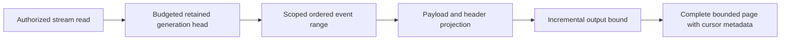
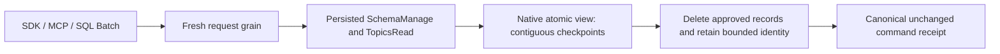

# EventStreams

Status: bounded read repair accepted; implementation/CI pending.
[ADR-035](../ADR/ADR-035-memory-performance.md) and AC-MP-005/012 apply.

| Requirement | Acceptance | Tests |
|---|---|---|
| REQ-EVENT-001: one raw work/deadline/cancellation budget covers stream head and event range | AC-MP-005 | Real-store bounded ranges, point/scan work, cancellation and subsequent store health |
| REQ-EVENT-002: projected complete StreamPage fits the result limit including head/cut/HasMore | AC-MP-005 | Exact positive/empty/edge response and over-budget event/protocol metadata cases |
| REQ-EVENT-003: preserve revisions, generation/retention failures and payload/header policy | AC-MP-005/012 | Existing event/processing recovery and new real persisted-policy redaction cases |

Owning slice: Core/Features/EventStreams/ helpers and UnitTests/Features/EventStreams/.
Existing Events.cs is ADR-032 migration debt; append/dedup/persistence are outside
this bounded-read task. Request DTO/wire and schema remain unchanged. Public SDK
and HTTP are entry points; UI N/A. Lead owns shared budget and endpoint forwarding.

TASK-MP-007A owns only ReadStream plus new event helpers/tests. Tests use the actual
ZoneTree engine and persisted policies, no doubles. GitHub executes TUnit and
related recovery/RF3 checks after strict build; source is not qualified delivery.

## Повний контракт Event Store

Актори: producer append, authorized reader/replay consumer та subscription worker. Entry points: `AppendEvents` у [public contracts](../../src/KeyLoad.Abstractions/Contracts.cs), `CommitAsync`/`ReadStreamAsync` у [SDK](../../src/KeyLoad.Client/KeyLoadClient.cs), [HTTP operations](../../src/KeyLoad.Server/ApiEndpoints.cs). Source: [Events.cs](../../src/KeyLoad.Core/Features/EventStreams/Execution/Events.cs); source є, але нові shared changes ще не GitHub-qualified.

| Вимога | Observable acceptance / flows | Test mapping |
|---|---|---|
| REQ-EVENT-004: append batch має expected-revision precondition та atomic domain authority | AC-EVENT-004: valid append послідовно змінює head/events у тому самому command commit; stale revision/NoStream або wrong domain відхиляє весь batch без часткових document/queue effects | Existing `DocumentEventAndQueueCommitTogetherAndCommandRetryDoesNotRepeatEffects`, `UniqueConflictRollsBackDocumentIndexEventAndEnqueue` у [TransactionTests](../../tests/KeyLoad.UnitTests/TransactionTests.cs); додаткові isolated OCC boundaries PLANNED |
| REQ-EVENT-005: EventId dedup належить stream generation і зберігає content identity | AC-EVENT-005: same ID/content retry не створює другий event; different content дає Conflict; інший stream generation має власну identity; restart не втрачає dedup | Existing `EventIdsAreScopedToTheStreamGenerationAndStreamsCanBeSubscribed`, `RetainedEventIdRejectsDifferentContentAndPreservesDedupForTheInitialStoreFormat` у [SubscriptionTests](../../tests/KeyLoad.UnitTests/SubscriptionTests.cs); recovery expansion PLANNED |
| REQ-EVENT-006: read/replay має ordered revisions, retained generation та bounded safe page | AC-EVENT-006: page/cursor продовжує retained stream без дубля/skip; empty tail валідний; invalid generation/history loss — typed failure; current payload/header policies застосовані | Existing [StreamReadResourceTests](../../tests/KeyLoad.UnitTests/Features/EventStreams/Cases/StreamReadResourceTests.cs), `FromNowAndTailCursorIncludeEveryLaterAppend` у SubscriptionTests; AC-MP-005/012 збережені |
| REQ-EVENT-007: compatible snapshot and complete same-cut tail reproduce an aggregate | AC-EVENT-007: reference equals snapshot+tail reduction; exact reducer/state schema enforced; explicit full replay requires complete history; wrong generation, erased/missing history and invalid identity fail explicitly | ADR-075; AggregateReplay real ZoneTree, pure worker, process recovery and actual RF3 SDK/MCP tests; runtime pending |
| REQ-EVENT-008: one bounded snapshot slot has atomic CAS and stable retry | AC-EVENT-008: absent-slot version zero, exact prior version, nondecreasing source revision and tail/floor bounds hold; retry never advances twice; unknown format/checksum corruption fail closed; reopen preserves exact state | ADR-075; AggregateSnapshot CAS/native/reopen/recovery tests; runtime pending |
| REQ-EVENT-009: aggregate state requires fully authorized workers | AC-EVENT-009: persisted EventsRead plus EventsReplay or EventsSnapshotsManage and every payload/header raw-read/raw-use grant are checked before bodies; tenant/resource denial and revocation disclose no protected state/events | ADR-075; persisted-policy real-store and official-client RF3 tests; runtime pending |
| REQ-EVENT-010: replay is bounded and produces no external effects | AC-EVENT-010: complete tail fits MaximumEvents and shared raw/result/deadline/cancel bounds or fails whole; one cut and one exact current event schema feed a deterministic pure worker; schema mismatch fails before callbacks; no append/enqueue/ack/subscription redrive occurs | ADR-075; AggregateReplay bounds/source invariance and pure SDK worker tests; runtime pending |

Повна resource identity включає tenant/database/atomic partition/stream set/stream/generation. Domain events є public history; CDC/outbox, consensus WAL та queue state мають власні authority/retention за [ADR-023](../ADR/ADR-023-journal-authority.md). Feed positions і revision — [ADR-025](../ADR/ADR-025-event-revision-feed-positions.md), atomic binding — [ADR-024](../ADR/ADR-024-transaction-domain-binding.md), privacy — [ADR-029](../ADR/ADR-029-event-message-classification.md), restore/retention — [ADR-030](../ADR/ADR-030-retention-paused-restore.md).

Topics/group delivery належать [Messaging](Messaging.md), CDC/system projections — [ChangeFeeds](ChangeFeeds.md), uploaded user bytes — [BlobStorage](BlobStorage.md). External effects і cross-partition atomic commits не обіцяються. Target map: Abstractions/Core/Client/Server/tests `Features/EventStreams/`; shared transport/host composition мають свої owners. UI N/A, це programmable Event Store. Нові runtime tasks починаються зі своїх ADR contracts; tests тільки real GitHub TUnit/recovery/RF3 SDK/MCP. Наявні test methods — source evidence, а не passing run.

## Current replay and event identity contract

Under ADR-075, `AggregateReplayReduction.Reduce` accepts the complete current
page, exact reducer, validated `IOptions<AggregateReplayWorkerLimits>` and
cancellation. Every event must match the reducer's current event schema exactly.
Validate the complete stream/generation/head/floor/tail/order/identity, original
payload/header JSON and combined input limits before invoking any reducer. Pass
the original immutable event to the reducer; validate each resulting state and
check cancellation at every existing boundary. There is no schema conversion
callback, registry, path resolver or associated configuration/message surface.
Snapshot and full-history replay must yield the same independently expected
state; wrong schema, invalid JSON, incomplete tail or exhausted budget must fail
without reducer effects. A subsequent healthy replay must still succeed.

AC-EVENT-005 uses only the current stream-and-generation EventId key. Real
append/retry/different-content/reopen cases retain exact head, revision, sequence,
receipt and content checks. Remove the alternate resource-wide key lookup.
Current whole-operation dedup tests remain required.

TASK-EVENT-CURRENT-028 freezes Client EventStreams reduction/validation/options/
messages, the two exclusive conversion files, Core Events append lookup and the
three existing worker case files plus test support as one guarded private scope.
It also ports only the EventId dedup case in Messaging's
`SubscriptionRecoveryAndPolicyTests.cs` to real current-key append/retry,
different-content rejection, reopen and independent stream/topic operations;
all other subscription, policy and inbox flows remain unchanged.
The worker removes conversion-only cases and ports current schema, bounds,
cancellation and positive reduction flows; root reviews every change, joins
shared docs and runs enabled build/format plus actual Aspire normal/scalar and
current event recovery/RF3 gates. Current native IDs/aliases, exact canonical
event content, persisted authorization and atomic/RF3 authority do not change.
Rollback restores a coherent source checkpoint with the current format.

TASK-MCP-EVENT-PARITY adds actual Docker RF3 .NET/official MCP evidence for
REQ-EVENT-004/005/006 and AC-EVENT-004/005/006 under ADR-039: identical bounded
page content and exclusive-revision replay, stable append retry with no duplicate event,
empty tail, persisted stream-set authority, cross-tenant denial, invalid limit and
stale generation. New tests are owned by
`tests/KeyLoad.IntegrationTests/Features/EventStreams/Cases/McpEventStreamTests.cs` and
cohesive scenario/tokens/assertion helpers in the same slice. Source-only status
remains pending until the full exact-SHA GitHub RF3 suite passes. Every actual read
cut must cover the append receipt and sequential cuts remain monotonic; independent
cuts may advance because five-second persisted Orleans heartbeats share the physical
store. No public pin-to-cut input exists, so byte parity applies to the exact event
records while each returned cut is checked independently.

TASK-RUNTIME-EVENT-FIXTURE-W preserves REQ-EVENT-004/006, AC-EVENT-004/006 and
AC-MP-005/012 after six exact candidate6949fa0 / run37005805424 tests fail during
setup. StreamReadResourceFixture creates different IDs for the CommandRequest
and replicated envelope; production correctly rejects that mismatch. The worker
owns only UnitTests/Features/EventStreams/StreamReadResourceFixture.cs and NEW
StreamCommandIdentityTests.cs. Derive the batch envelope ID from its existing
CommandRequest; other fixture commands retain fresh IDs. The new actual-store
negative regression must prove mismatched IDs return Validation without stream
effects, while matched ID append succeeds and retains its receipt identity/replay.
Preserve all existing range/policy/budget/cancellation and fixture lifetime cases.
This is test-only input repair: ADR-035/041/039 and the canonical batch contract
are sufficient, with no product/API/data boundary change or separate ADR. Lead
reviews/builds/formats and qualifies complete exact-SHA GitHub unit/RF3 suites.

TASK-AD-E2 preserves REQ/AC-EVENT-004/005/006 and AC-MCP-002/005/007 after
run37032546228 at exactb533c80 fails three RF3 cases at byte-exact EventData
expectations. The existing production contract canonicalizes JSON payload/header
property order; SDK/MCP bytes already agree, while the fixture expects unsorted
producer bytes. One worker owns only IntegrationTests/Features/EventStreams/
McpEventStreamScenario.cs and McpEventStreamTokens.cs. Keep unsorted InputEvents
for actual append and handcrafted independent canonical ExpectedEvents for the
unchanged exact equality, identity, sequence, paging, retry and security assertions.
Do not compute expectations through production normalization or weaken comparisons.
ADR-035/039 remain sufficient for this test-only oracle correction; no product,
schema, authority or transport contract changes. Lead owns integration/delivery
and exact-SHA GitHub qualification; local tests remain prohibited.

## TASK-EVENT-QUEUE-WHOLEFLOW-001 — bounded native operation regression proposal

This source-only regression batch preserves the existing ADR-002/024/026/028
contracts and REQ/AC-EVENT-004/005 plus REQ/AC-MSG-001/002/005. Its original
architecture task subset is KL-083 (append OCC/content identity), KL-087 (lost
claim/ACK reply recovery) and KL-091 (same-domain batch precondition rollback).
It does not close those tasks or qualify the full EventStreams/Messaging feature.

The owning unit cases are
[EventAppendWholeFlowTests](../../tests/KeyLoad.UnitTests/Features/EventStreams/Cases/EventAppendWholeFlowTests.cs)
(two concurrent Exact append instances and four rejection instances),
[QueueLostResponseWholeFlowTests](../../tests/KeyLoad.UnitTests/Features/Messaging/Cases/QueueLostResponseWholeFlowTests.cs)
(one claim/ACK retry workflow with real ZoneTree reopen), and
[QueueAdmissionCancellationWholeFlowTests](../../tests/KeyLoad.UnitTests/Features/Messaging/Cases/QueueAdmissionCancellationWholeFlowTests.cs)
(two pre-admission cancellation instances). They use actual native storage,
joined workers, literal complete results, persisted-state assertions, stable
receipt replay and a healthy follow-up. Failed commands may retain authorized
outcome/clock records; rejection tests assert complete affected domain-family
state rather than falsely requiring no committed failure outcome. Pre-admission
cancellation asserts the entire store and position remain unchanged and checks
the original token. It does not claim cancellation after commit undoes effects.

The exact proposed native inventory is nine. Current normal/scalar execution,
seeded process-crash criteria and real RF3 SDK/MCP qualification remain required;
source review is not execution evidence. Original historical passing cases and
retained global failures remain separate from this proposal.

## TASK-EVENT-APPEND-SEEDED-CRASH-001

REQ-EVENT-004/005 and AC-EVENT-004/005, REQ-MSG-005/AC-MSG-005 and REQ-STORAGE-006/007/AC-STORAGE-006/007 refine original KL083/KL091 seeded DURING append acceptance. Existing local R334/R335 full unit2876/2876 and R330 recovery236/236 are retained as baseline, not proof of this new flow or Linux acceptance. ADR002's private amendment freezes implementation before code.

AC-EVENT-CRASH-001: a real CrashHost seeds canonical resources and stream revision1, freezes one original typed command containing PutDocument, AppendEvents Exact1 and EnqueueMessage, then arms only its next native commit. Parent observes the existing exact crash marker at HeaderWritten, PayloadWritten, JournalFlushed, MutationApplied0/3/6 or ApplyCompleted, kills only its owned child and joins actual original exit and both bounded readers. Reopen native ZoneTree only after native handle/lock release. The retained outcome determines one complete recovered prefix: document/event/head/EventId identity/queue/outbox/receipt and store position must all match independent literal expectations. JournalFlushed and later cuts must recover committed; pre-flush cuts may expose either complete valid prefix, never partial state.

AC-EVENT-CRASH-002: applying the exact original principal/CommandId/payload/time on the recovered store yields one successful canonical effect, retains the original complete result on matching retry without position/byte changes, rejects changed content as exact Conflict, and leaves a matching healthy retry valid. A fresh bounded document/event/queue follow-up must advance stream revision3 and publish complete literal state. No sidecar may define recovered truth: sidecars hold only frozen caller input and seed coordinates; all canonical recovery comes from actual store.

Ownership map: CrashHost/EventStreams/Contracts and Helpers own immutable scenario/data plus existing CrashHostApplication mode dispatch; RecoveryTests/EventStreams/Cases, Processes and Assertions own seven real process cases, original child lifetime and independent state/replay oracle. Reuse CanonicalCrashBoundary, CommandIdempotencyProcessChild, existing native90second run/30second cleanup bounds, StorageTrialLease and current serializer/provider/options. No production storage/provider seam, format/namespace/serializer change, client retry, new deadline, multi-lane expansion or process-kill power-loss claim. Failures preserve primary plus child/readers/disposal errors and retained root; successful cleanup occurs only after original child and reopened store/locks settle. Root alone guarded-joins, formats/builds, discovers exact seven instances and runs full native recovery followed by original required normal/scalar/RF3/Linux/coverage gates. Rollback removes only this additive mode/cases and contract; all prior modes and failures stay intact.

### TASK-BACKUP-EVENTING-CUT-001 (KL-098 local capability-state proof)

Freeze before code under REQ/AC-BACKUP-001/002/003/004, REQ/AC-EVENT-004/005/006 and REQ/AC-MSG-003/005/006: seed actual native resources, three canonical source events, two independent subscription groups, an out-of-order completion gap, one persisted subscription-processing inbox with document+queue effects, and a real leased queue message. Capture the native backup cut, pack/unpack the genuine current-format artifact, restore into a clean target and reopen real ZoneTree. Independently require stable positions/content/generation, literal group checkpoint/issued/gap state, exact document/message state and byte-identical retained event/subscription/inbox/queue/outbox records. Manifest/source cut and single restore-authority position increment are exact; archive bytes remain unchanged.

Before explicit operator resume, fresh subscription and queue receive must fail exactly DispatchPaused and old source cursor/delivery tokens and pre-restore original command outcomes must fail exactly TokenInvalidated without effects. Persisted narrow principal denial remains enforced. Failed owned Apply outcomes commit exactly once and same-ID failed replay preserves complete result and store position. Old stored outcomes are retained; no old incarnation receipt is fabricated as current success.

Reconcile through existing public native operations only: explicitly seek the restored group from retained beginning to a new subscription generation, clear that group's explicit pause, explicitly set dispatch running as administrator, and obtain genuine new-incarnation claims. Reprocess the already completed source position using the same handler scope/execution generation: the persisted inbox returns AlreadyProcessed with original effects token and no second document/enqueue. Close contiguous gaps with actual acknowledgements. A new bounded producer/claim/ack and final close/reopen prove healthy continuation and all canonical state. Use no sleeps, fake providers, raw system-key resume or implementation-only migration APIs.

This closes only the missing local eventing artifact-state regression. KL-098 consumer/rebuild/transfer retention pins, event/topic purge/receipt horizon, history-loss reconciliation, remote-transfer KL094 and cluster-wide per-partition backup cut remain distinct open criteria. Current public event/topic APIs expose caps, reads and subscription seek, but no event/topic purge/pin implementation; the test must not synthesize history loss by deleting canonical keys or advertise local backup as a cluster cut. Existing outbox purge/pin and remote-transfer suites remain mandatory.

Ownership: UnitTests BackupRestore Cases/Fixtures/Assertions/Helpers; native artifacts and ZoneTree product APIs unchanged. Ordered join: contract, test-only implementation, root format/build and full normal/scalar native execution with exact original source/DLL identities; Linux recovery/RF3/global gates unchanged. No coverage inventory edit or status closure. Failure retains owned source/backup/target root and original primary plus joined disposal errors. No product seam, format/serializer/public contract change. Rollback removes this task and its test-only flow; no old report is rewritten.

## TASK-KL098-TOPIC-RETENTION-001 — bounded native topic purge

REQ-EVENT-RETENTION-001: `PurgeTopic(Topic, ThroughPosition, Generation)` is an inclusive same-partition Batch mutation through SDK CommitAsync, existing official MCP documents_commit and shared SQL CALL documents_commit decoder/request grain. Persisted SchemaManage AND TopicsRead are required before cached outcome replay. No new transport, provider or physical owner.

REQ-EVENT-RETENTION-002: delete only retained positions FirstAvailablePosition..ThroughPosition inclusive; reject nonpositive, beyond-tail or already-retained-away cuts, stale generation and scan/byte exhaustion. Every persisted same-source/generation group's contiguous Checkpoint pins all positions greater than Checkpoint, including paused/parked groups; IssuedPosition/ACK gaps do not release pins. Therefore requested cut must be <= every Checkpoint. Refusal is ResourceExhausted and cannot alter topic/group/inbox/queue state.

Every original native observer charges one examined record plus bytes before decoding, including range lookahead and missing point lookup; callbacks never escape native read ownership. All PurgeTopic effects in one owned ApplyMutations batch share one monotonically charged MaxScanRecords/MaxBatchBytes ledger; no reset per mutation. Native atomic write cancellation/admission remains owned by the original apply gate; this adds no separate token or deadline.

REQ-EVENT-RETENTION-003: atomically advance FirstAvailablePosition to cut+1 and subtract exact native serialized source bytes; preserve TailPosition, partition event sequence, generation, group/inbox/queue state, incarnation and backup identity. Retain only generated native typed event-ID digest/original position/generation in existing topic-event-id family. No bodies, fallback, migration or receipt pruning. Fresh identical event reuse remains DuplicateEventId; conflicting content remains Conflict; same immutable original command ID returns byte-identical receipt after purge.

AC-EVENT-RETENTION-001: genuine ZoneTree seeded three-event/two-group operation refuses unread and paused pins, releases only by existing exact ACK/explicit seek; bounded approved purge leaves literal event3 at original position/sequence3 and unchanged other model bytes, old read yields exact HistoryUnavailable; same-ID purge replay retains complete receipt and stable store cut.
AC-EVENT-RETENTION-002: post-purge original publish replay returns exact original receipt, fresh identical/conflicting event commands preserve exact distinct errors; denied caller cannot purge or replay privileged receipt, stale generation/cut/record/byte budget failures retain complete logical state and stable same-ID rejected outcomes; healthy next publish is position/sequence4.
AC-EVENT-RETENTION-003: native store reopen retains exact head, digest identities, group/checkpoint/inbox/queue state and receipts; shared real SQL compiler/decoder admits same Batch mutation; root must run native unit/scalar/recovery and genuine RF3 SDK/MCP before qualification. Automated owning cases: TopicRetentionOperationTests, TopicRetentionBoundaryTests; no source-only proof.

Implementation order: this contract first; Abstractions/EventStreams Contracts + generated native alias; Core/EventStreams Commands and Messaging publisher identity; existing Batch validation/auth/apply joins; UnitTests/EventStreams native operation fixtures/cases. Roll out only as a homogeneous freshly built native server cohort; do not downgrade a store whose journals/records retain the new generated aliases. Existing formats/aliases/field IDs are unchanged, with no mixed-version fallback. Historical digest count and receipt-horizon-wide storage bounds remain unqualified; active MaxEvents/MaxBytes is not reinterpreted as a lifetime-ID limit. Rollback source before qualification; persisted purge is deliberate irreversible data removal and has no migration rollback. Rebuild/transfer pins, receipt-horizon pruning, remote KL094 and complete KL098 closure remain explicitly incomplete.

### TASK-KL098-TOPIC-PURGE-CRASH-001: native admitted purge cuts

REQ-EVENT-RETENTION-004 / AC-EVENT-RETENTION-004: the real CrashHost first acknowledges purge through source position1, then arms the existing native CanonicalCrashBoundary for exactly the next Store.Commit position of immutable purge-through2. Two seeds admit either success (paused checkpoint3) or exact ResourceExhausted rejection (paused checkpoint1). Kill only the owned original process after its native phase marker; join original exit and both bounded readers, prove exclusive native locks, reopen actual ZoneTree. HeaderWritten/PayloadWritten are pre-flush boundaries; JournalFlushed is AFTER native durable flush returns and BEFORE native apply, not inside an OS flush syscall. MutationApplied0 and ApplyCompleted are actual native apply cuts. Pre-flush may recover old or whole new cut; post-flush must recover complete success/rejected receipt, never partial model changes.

The independent oracle requires literal head/events/source positions/digests/doc/queue/paused checkpoint plus original acknowledged seed receipt, canonical command fingerprint/receipt, exact committed clock and stable same-ID replay with full-store byte equality. Fresh identical/conflicting EventID errors remain distinct. Follow with actual append/read/queue claim and final native reopen. No new product seam/provider/journal/format/whitelist, sleeps, wider deadlines or retry-to-green. Root native discovery/build/recovery execution and exact source/DLL/PDB receipts are pending; process kill is not power-loss proof. Historical identity-population/horizon/rebuild/transfer/remote retention and full KL098 gates remain open.

Ownership: CrashHost EventStreams Contracts/Helpers, existing CrashHostApplication mode join; RecoveryTests EventStreams Cases/Processes/Assertions. Contracts join after TASK-KL098-TOPIC-RETENTION-001, then child/oracle; existing original process/readers/cleanup helpers are reused unchanged. Rollback removes this scenario/tests only, preserving product retention contract and immutable historical results.

### TASK-KL098-TOPIC-RETENTION-CORRUPTION-001

REQ-EVENT-RETENTION-005 / AC-EVENT-RETENTION-005: before an actual purge uses a persisted subscription pin, require its exact native canonical group key, positive subscription generation/ownership epoch, native definition/policy bounds and 0<=Checkpoint<=IssuedPosition<=the current source tail. GroupState has no source identity fields; source identity/generation comes from the canonical prefix, and subscription generation MUST NOT equal source generation by assumption. Paused/parked pins remain authoritative. Wrong native alias, extra key suffix and impossible persisted shape return exact Corruption, never silently pin/unpin. Reuse current native identifier/policy constants; no repository-wide group behavior change.

A retained-ID digest must be exactly 64 lowercase hexadecimal characters, with generation equal source generation and position within the actually purged prefix. A canonical active event and preexisting digest at the same ID is Corruption; purge must never overwrite it. Native wrong aliases remain Corruption with the retained-history detail, not DuplicateEventId/Conflict. Corruption is an existing fatal command-compilation boundary: exact KeyLoadException/Corruption escapes before canonical outcome or redo commit, so neither first call nor identical original-ID repeat advances position, clock, dedup or any canonical byte. It must not be normalized into an OperationResult or stored rejected receipt. Require the exact retained-history detail and whole-store byte equality for both actual throws while corruption remains. Explicitly restore the original native state; the same original purge ID then commits its literal two-record effect and exact success receipt once, followed by stable receipt replay. A same original publish ID that previously threw on corrupt retained digest is freshly evaluated after repair: valid retained identity yields exact DuplicateEventId, persisted once and replayed unchanged. Healthy new append remains required. No receipt is invented for the fatal attempt. No fallback, fake storage, authorization bypass, generation clamp, policy quota relaxation or product test hook. Existing valid fresh identical IDs remain DuplicateEventId, changed content Conflict, original command replay immutable.

Owning paths: Core EventStreams Validation/Commands and Messaging TopicPublishReads retained-ID branch; UnitTests EventStreams Cases over actual TopicRetentionFixture. Join after purgeR1 and crash follow-on docs, preserve both immutable packets. Root format/build/native normal/scalar/recovery/RF3 discovery/execution pending. This precise corruption follow-on does not close KL098 broader gates.

Shared-ledger boundary: each first purge-through1 completes exactly two observed group reads plus source body, active-ID pointer and missing retained-digest probe (five). The next effect observes both original persisted groups, reaching seven before another body read. Fixture cap6 proves second-effect rollback under one shared ledger; original cap4 remains an explicit first-effect rejection control. Production limits are unchanged; both require the same exact scan-budget ResourceExhausted outcome and full rollback.

Stage XI native analyzer correction retains the existing REQ/AC contracts: the ephemeral native gate snapshot is exposed as `GateDiagnostics`, and the one-command purge ledger snapshots and validates the existing centrally bound `OperationLimitsOptions`. Limits, observer ordering, byte/scan accounting and authorization remain unchanged. Lowercase digest validation uses the same exact ASCII alphabet through native span classification. Original failed build diagnostics are retained; compilation and whole-operation regressions remain mandatory.

R441 actual native correction, TASK-KL098-TOPIC-RETENTION-CORRUPTION-001 / REQ/AC-EVENT-RETENTION-005 and AC-EVENT-RETENTION-002: original twelve Corruption failures and one nonadvancing policy-epoch failure remain retained. DatabaseEngine.ExecuteAndBuildOutcome excludes Corruption from stored domain outcomes. The genuine manager revocation advances persisted epoch1 to2 before replay denial; original success receipt and complete native bytes remain immutable after denied repeat. No product exception normalization, authorization weakening or new recovery claim. Root owns fresh native build/census/whole-operation re-execution; this source correction is not PASS evidence.
