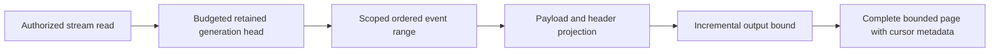

# EventStreams

Status: bounded read repair accepted; implementation/CI pending.
[ADR-035](../ADR/ADR-035-memory-performance.md) and AC-MP-005/012 apply.

| Requirement | Acceptance | Tests |
|---|---|---|
| REQ-EVENT-001: one raw work/deadline/cancellation budget covers stream head and event range | AC-MP-005 | Real-store bounded ranges, point/scan work, cancellation and subsequent store health |
| REQ-EVENT-002: projected complete StreamPage fits the result limit including head/cut/HasMore | AC-MP-005 | Exact positive/empty/edge response and over-budget event/protocol metadata cases |
| REQ-EVENT-003: preserve revisions, generation/retention failures and payload/header policy | AC-MP-005/012 | Existing event/processing recovery and new real persisted-policy redaction cases |

Owning slice: Core/Features/EventStreams/ helpers and UnitTests/Features/EventStreams/.
Existing Events.cs is ADR-032 migration debt; append/dedup/persistence are outside
this bounded-read task. Request DTO/wire and schema remain unchanged. Public SDK
and HTTP are entry points; UI N/A. Lead owns shared budget and endpoint forwarding.

TASK-MP-007A owns only ReadStream plus new event helpers/tests. Tests use the actual
ZoneTree engine and persisted policies, no doubles. GitHub executes TUnit and
related recovery/RF3 checks after strict build; source is not qualified delivery.

## Повний контракт Event Store

Актори: producer append, authorized reader/replay consumer та subscription worker. Entry points: `AppendEvents` у [public contracts](../../src/KeyLoad.Abstractions/Contracts.cs), `CommitAsync`/`ReadStreamAsync` у [SDK](../../src/KeyLoad.Client/KeyLoadClient.cs), [HTTP operations](../../src/KeyLoad.Server/ApiEndpoints.cs). Source: [Events.cs](../../src/KeyLoad.Core/Features/EventStreams/Execution/Events.cs); source є, але нові shared changes ще не GitHub-qualified.

| Вимога | Observable acceptance / flows | Test mapping |
|---|---|---|
| REQ-EVENT-004: append batch має expected-revision precondition та atomic domain authority | AC-EVENT-004: valid append послідовно змінює head/events у тому самому command commit; stale revision/NoStream або wrong domain відхиляє весь batch без часткових document/queue effects | Existing `DocumentEventAndQueueCommitTogetherAndCommandRetryDoesNotRepeatEffects`, `UniqueConflictRollsBackDocumentIndexEventAndEnqueue` у [TransactionTests](../../tests/KeyLoad.UnitTests/TransactionTests.cs); додаткові isolated OCC boundaries PLANNED |
| REQ-EVENT-005: EventId dedup належить stream generation і зберігає content identity | AC-EVENT-005: same ID/content retry не створює другий event; different content дає Conflict; інший stream generation має власну identity; restart не втрачає dedup | Existing `EventIdsAreScopedToTheStreamGenerationAndStreamsCanBeSubscribed`, `RetainedEventIdRejectsDifferentContentAndPreservesDedupForTheInitialStoreFormat` у [SubscriptionTests](../../tests/KeyLoad.UnitTests/SubscriptionTests.cs); recovery expansion PLANNED |
| REQ-EVENT-006: read/replay має ordered revisions, retained generation та bounded safe page | AC-EVENT-006: page/cursor продовжує retained stream без дубля/skip; empty tail валідний; invalid generation/history loss — typed failure; current payload/header policies застосовані | Existing [StreamReadResourceTests](../../tests/KeyLoad.UnitTests/Features/EventStreams/Cases/StreamReadResourceTests.cs), `FromNowAndTailCursorIncludeEveryLaterAppend` у SubscriptionTests; AC-MP-005/012 збережені |
| REQ-EVENT-007: compatible snapshot and complete same-cut tail reproduce an aggregate | AC-EVENT-007: reference equals snapshot+tail reduction; exact reducer/state schema enforced; explicit full replay requires complete history; wrong generation, erased/missing history and invalid identity fail explicitly | ADR-075; AggregateReplay real ZoneTree, pure worker, process recovery and actual RF3 SDK/MCP tests; runtime pending |
| REQ-EVENT-008: one bounded snapshot slot has atomic CAS and stable retry | AC-EVENT-008: absent-slot version zero, exact prior version, nondecreasing source revision and tail/floor bounds hold; retry never advances twice; unknown format/checksum corruption fail closed; reopen preserves exact state | ADR-075; AggregateSnapshot CAS/native/reopen/recovery tests; runtime pending |
| REQ-EVENT-009: aggregate state requires fully authorized workers | AC-EVENT-009: persisted EventsRead plus EventsReplay or EventsSnapshotsManage and every payload/header raw-read/raw-use grant are checked before bodies; tenant/resource denial and revocation disclose no protected state/events | ADR-075; persisted-policy real-store and official-client RF3 tests; runtime pending |
| REQ-EVENT-010: replay is bounded and produces no external effects | AC-EVENT-010: complete tail fits MaximumEvents and shared raw/result/deadline/cancel bounds or fails whole; one cut and exact schema feed deterministic versioned worker upcasting; missing paths fail; no append/enqueue/ack/subscription redrive occurs | ADR-075; AggregateReplay bounds/source invariance and pure SDK worker tests; runtime pending |

Повна resource identity включає tenant/database/atomic partition/stream set/stream/generation. Domain events є public history; CDC/outbox, consensus WAL та queue state мають власні authority/retention за [ADR-023](../ADR/ADR-023-journal-authority.md). Feed positions і revision — [ADR-025](../ADR/ADR-025-event-revision-feed-positions.md), atomic binding — [ADR-024](../ADR/ADR-024-transaction-domain-binding.md), privacy — [ADR-029](../ADR/ADR-029-event-message-classification.md), restore/retention — [ADR-030](../ADR/ADR-030-retention-paused-restore.md).

Topics/group delivery належать [Messaging](Messaging.md), CDC/system projections — [ChangeFeeds](ChangeFeeds.md), uploaded user bytes — [BlobStorage](BlobStorage.md). External effects і cross-partition atomic commits не обіцяються. Target map: Abstractions/Core/Client/Server/tests `Features/EventStreams/`; shared transport/host composition мають свої owners. UI N/A, це programmable Event Store. Нові runtime tasks починаються зі своїх ADR contracts; tests тільки real GitHub TUnit/recovery/RF3 SDK/MCP. Наявні test methods — source evidence, а не passing run.

TASK-MCP-EVENT-PARITY adds actual Docker RF3 .NET/official MCP evidence for
REQ-EVENT-004/005/006 and AC-EVENT-004/005/006 under ADR-039: identical bounded
page content and exclusive-revision replay, stable append retry with no duplicate event,
empty tail, persisted stream-set authority, cross-tenant denial, invalid limit and
stale generation. New tests are owned by
`tests/KeyLoad.IntegrationTests/Features/EventStreams/Cases/McpEventStreamTests.cs` and
cohesive scenario/tokens/assertion helpers in the same slice. Source-only status
remains pending until the full exact-SHA GitHub RF3 suite passes. Every actual read
cut must cover the append receipt and sequential cuts remain monotonic; independent
cuts may advance because five-second persisted Orleans heartbeats share the physical
store. No public pin-to-cut input exists, so byte parity applies to the exact event
records while each returned cut is checked independently.

TASK-RUNTIME-EVENT-FIXTURE-W preserves REQ-EVENT-004/006, AC-EVENT-004/006 and
AC-MP-005/012 after six exact candidate6949fa0 / run37005805424 tests fail during
setup. StreamReadResourceFixture creates different IDs for the CommandRequest
and replicated envelope; production correctly rejects that mismatch. The worker
owns only UnitTests/Features/EventStreams/StreamReadResourceFixture.cs and NEW
StreamCommandIdentityTests.cs. Derive the batch envelope ID from its existing
CommandRequest; other fixture commands retain fresh IDs. The new actual-store
negative regression must prove mismatched IDs return Validation without stream
effects, while matched ID append succeeds and retains its receipt identity/replay.
Preserve all existing range/policy/budget/cancellation and fixture lifetime cases.
This is test-only input repair: ADR-035/041/039 and the canonical batch contract
are sufficient, with no product/API/data boundary change or separate ADR. Lead
reviews/builds/formats and qualifies complete exact-SHA GitHub unit/RF3 suites.

TASK-AD-E2 preserves REQ/AC-EVENT-004/005/006 and AC-MCP-002/005/007 after
run37032546228 at exactb533c80 fails three RF3 cases at byte-exact EventData
expectations. The existing production contract canonicalizes JSON payload/header
property order; SDK/MCP bytes already agree, while the fixture expects unsorted
producer bytes. One worker owns only IntegrationTests/Features/EventStreams/
McpEventStreamScenario.cs and McpEventStreamTokens.cs. Keep unsorted InputEvents
for actual append and handcrafted independent canonical ExpectedEvents for the
unchanged exact equality, identity, sequence, paging, retry and security assertions.
Do not compute expectations through production normalization or weaken comparisons.
ADR-035/039 remain sufficient for this test-only oracle correction; no product,
schema, authority or transport contract changes. Lead owns integration/delivery
and exact-SHA GitHub qualification; local tests remain prohibited.
