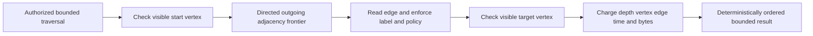

# GraphTraversal

The accepted [ShortestPath](GraphTraversal/ShortestPath.md) contract and
[ADR-098](../ADR/ADR-098-bounded-graph-paths.md) add the missing KL-023 unweighted
path/frontier and shared SQL/SDK/MCP stages. Implementation and full qualification
are pending; the reachability oracle does not close those requirements.

Status: bounded same-partition graph mutation and traversal are present in Core source; broader graph/search integration and GitHub qualification remain pending. The target design is summarized in [sections 8, 26, 28, and 35](../design/architecture-v0.3.uk.md).

## Purpose, actors, and entry points

GraphTraversal owns graph edge records, adjacency maintenance, and authorized bounded directed traversal over document vertices. Actors are database clients and authorized query/search operators. Current writes are `UpsertEdge`/`DeleteEdge` mutations handled by `DatabaseEngine`; current reads call `DatabaseEngine.Traverse` with a `TraverseRequest`. Contracts are in `src/KeyLoad.Abstractions/Contracts.cs` and `Queries.cs`; implementation is in `src/KeyLoad.Core/GraphAndSeries.cs`.

## Canonical slice map and boundaries

| Surface | Current source | Target owner |
|---|---|---|
| Contracts | `src/KeyLoad.Abstractions/Contracts.cs`, `Queries.cs` | `src/KeyLoad.Abstractions/Features/GraphTraversal/` |
| Backend | `src/KeyLoad.Core/GraphAndSeries.cs`, mutation dispatch/authorization in `DatabaseEngine.cs` and `MutationAuthorization.cs` | `src/KeyLoad.Core/Features/GraphTraversal/` |
| Tests | `tests/KeyLoad.UnitTests/GraphAndSearchTests.cs`, `ReadExecutionTests.cs`, `HttpAdmissionTests.cs` | `tests/KeyLoad.UnitTests/Features/GraphTraversal/` |
| Durable specification | This file | `docs/Features/GraphTraversal.md` |
| HTTP | `src/KeyLoad.Server/ApiEndpoints.cs`: `POST /v1/graph/traverse`; edge mutations enter through shared `POST /v1/commands` | Shared HTTP transport belongs to `src/KeyLoad.Server/Features/ClientApi/`; graph semantics belong to `src/KeyLoad.Core/Features/GraphTraversal/` |
| .NET SDK | `src/KeyLoad.Client/KeyLoadClient.cs`: `TraverseAsync` and `CommitAsync` for graph mutations | Shared client transport belongs to `src/KeyLoad.Client/Features/ClientApi/`; typed graph behavior maps to this GraphTraversal slice |
| Official MCP | The authenticated official C# SDK exposes `keyload_graph_incoming` and shortest-path tools through the shared ClientApi gateway/catalog | Real RF3 schema oracles preserve exact properties/required fields and hints; nested `PartitionRef` includes computed `atomicPartitionId` as an optional property |
| UI | No dedicated graph-management or traversal frontend is specified | N/A: graph traversal is a database/API query capability, not a separate frontend surface |
| External graph provider | None is selected or implemented for canonical edge ownership | N/A: provider-backed/ranked graph retrieval is separate planned search work |

Current layer-first locations are migration debt under ADR-032. GraphTraversal does not own document CRUD, physical placement, query ranking, or vector/text providers. Graph vertices are references to visible collection documents; graph and vertex permissions remain distinct checks.

## Accepted TASK-MP-007C resource repair

[ADR-035](../ADR/ADR-035-memory-performance.md) adds REQ-GRAPH-005, mapped to
AC-GRAPH-002/003/004 and AC-MP-005/006/012: reuse vertex visibility and collection
authorization inside one read cut without retaining full vertex documents.
Cache only boolean visibility by complete EntityRef and authorized/unavailable
collection decisions by complete partition plus collection; never a cross-request
or payload cache. A denied/hidden target stays excluded and cannot be expanded.
The start's existing visible/permission errors still propagate.

Start one cancellation/operation-clock budget before the gate. Visit adjacency
records directly without a raw page, charge every candidate before label/visibility
filtering, and retain the existing global maxEdges overflow error and deterministic
BFS/output order. Project edge attributes under the graph's persisted field policy.
Bound incremental standalone vertices/edges before retention, then measure the
exact complete GraphTraversal. Cycles/self-loops terminate as before.

Worker owns only Traverse in `GraphAndSeries.cs`, new
`Core/Features/GraphTraversal/` helpers and new `UnitTests/Features/GraphTraversal/`
tests. Lead's same-file TimeSeries/vector joins are complete before worker start;
lead will not edit that file concurrently. Public signature/defaults, mutations
and all other Core/shared files stay. Lead owns docs/server integration.

Tests first: real converging/repeated large visible and hidden target rows must
succeed under a byte cap permitting one target lookup but not repeated payload
reads; hidden downstream paths remain excluded. Cover cycle/label/global edge
count, exact envelope/output overflow, cancellation/unchanged position and a healthy
following call. Preserve existing assertions; no doubles/local test run. GitHub
TUnit then RF3 SDK/MCP and node resource artifacts own qualification.

## Accepted KL-023 independent reachability oracle stage, 2026-10-05

REQ-GRAPH-006 / AC-GRAPH-005: compare the current directed traversal with an
independent test-owned graph model backed by genuine `TestDatabase`/ZoneTree
fixtures. Compute minimum hop distances independently from the production
reader, native keys and returned result; compare complete vertex/edge membership
and ordinal public order for directed cycles, converging equal-depth paths,
shorter direct paths, shuffled insertion and hidden intermediate vertices.
For each requested depth, expand only visible permitted targets and prove that
vertices beyond that depth are absent. Depth is a successful bounded query
boundary; a shallower depth must not be reclassified as a budget error.
An exact distinct-visible-vertex or examined-edge cap succeeds, while one less
than the required count returns `BudgetExceeded` without a partial result.
Count outgoing candidates before label/visibility filtering. Preserve the
existing cancellation/deadline and healthy-follow-up cases.

TASK-KL023-ORACLE owns only
`tests/KeyLoad.UnitTests/Features/GraphTraversal/Assertions/GraphTraversalReferenceBfsOracle.cs`
and `Cases/GraphTraversalReferenceOracleTests.cs`. Root freezes this contract,
reviews and joins the private packet, and runs Aspire normal/scalar followed by
exact-source Linux and real SDK/official MCP RF3 qualification. Existing
ADR-004/010/014 define the unchanged read, budget and persisted authorization
boundaries; no additional architecture decision is needed for this test-only
stage. It adds no runtime/data/public contract or dependency; rollback removes
the unused test files. Public shortest-path results, batched frontier execution
and the complete KL-023 acceptance remain open.

## Current source behavior

`UpsertEdge` validates identifiers and graph resource, requires both endpoints in the same atomic partition, verifies both referenced documents are visible, checks graph field-write policy and expected revision, then updates the edge plus outgoing/incoming adjacency records in the command transaction. Deleting an edge removes both adjacency entries and its canonical edge record. Cross-partition edge writes currently fail with `UnsupportedCapability`.

`Traverse` starts from a visible vertex and performs directed outgoing breadth-first traversal. Optional labels filter edges; hidden/missing target vertices are not returned or expanded. A visited-vertex set terminates cycles. The current hard limits are max depth 16, max vertices 10,000 and max edges 50,000; request defaults are depth 3, 1,000 vertices, and 5,000 edges. Shared work/deadline/read/result budgets can reject rather than return an unmarked partial traversal. Returned edge attributes are projected using persisted field policies; output order is deterministic by vertex and edge identifiers.

The source does not establish incoming traversal, shortest-path results, cross-partition edges, async reverse-adjacency repair, ranked graph retrieval, or a partial-result opt-in. Product-design suggested defaults and future algorithms are not current guarantees.

## Requirements and acceptance

| Requirement | Measurable acceptance | Existing TUnit evidence or planned test |
|---|---|---|
| REQ-GRAPH-001: keep edge and adjacency mutations atomic and partition-scoped | AC-GRAPH-001 passes when create/update/delete leaves edge and both adjacency directions consistent; stale revision, hidden/missing endpoint, or endpoint in another partition rejects without partial writes. | Planned `GraphEdgeMutationRevisionAndPartitionCases`; current transaction rollback tests establish shared mutation atomicity but do not constitute a full edge index matrix. |
| REQ-GRAPH-002: traverse only authorized visible graph/document data | AC-GRAPH-002 passes when a hidden/missing intermediate vertex and its downstream path are excluded, denied graph access fails, and disallowed edge attributes are projected. | `TraversalStopsAtHiddenIntermediateVerticesAndHandlesCycles`, `FilteredOrHiddenGraphEdgesCountAgainstTheGlobalVisitBudget`. |
| REQ-GRAPH-003: bound traversal depth, visits, time, and result | AC-GRAPH-003 passes when cycles terminate, each invalid/exhausted bound returns a visible budget error without an implicit partial result, and cancellation/deadline is honored. | `FilteredOrHiddenGraphEdgesCountAgainstTheGlobalVisitBudget`, `SearchAndGraphResultBudgetsIncludeProtocolMetadata`, `QuerySearchAndGraphRequestsShareOneWorkingSetReservationBudget`; planned adversarial max-depth/max-vertex/max-edge boundary matrix. |
| REQ-GRAPH-004: keep graph traversal stable under shared read accounting | AC-GRAPH-004 passes when point reads, adjacency scans, edge/vertex dereferences, and response metadata are charged to the operation budget and a subsequent healthy operation remains usable after rejection/cancellation. | `GraphEdgeAndVertexDereferencesConsumeTheReadByteBudget`, `OneReadDeadlineCoversSubsequentPointAndScanWork`, `CancelledReadsStopBeforeTouchingCanonicalState`. |

## Flows and failure behavior

Positive: an authorized edge write binds both visible document endpoints to the same partition and stores edge/adjacency state atomically; traversal expands only allowed outgoing edges within supplied limits. Negative: foreign partition endpoint, stale revision, denied resource/row/field access, or malformed identifiers reject. Edge: self-loops and cycles terminate through visited tracking; hidden targets do not expose their outgoing neighborhood; an exact limit boundary succeeds only if no additional work exceeds it. Exhaustion is an explicit budget error, not a silently truncated result.

## Decisions and verification

Related decisions: [ADR-001](../ADR/ADR-001-partition-identity-affinity.md), [ADR-004](../ADR/ADR-004-committed-read-views.md), [ADR-005](../ADR/ADR-005-canonical-keyspace-codec.md), [ADR-010](../ADR/ADR-010-query-budgets-security.md), [ADR-014](../ADR/ADR-014-principals-rbac-row-policy.md), and [ADR-016](../ADR/ADR-016-atomic-physical-placement.md). Cross-partition physical placement and movement follow [ADR-017](../ADR/ADR-017-ownership-session-tokens.md); they do not change the current same-partition write contract.

The listed TUnit names are source mappings only; this authoring task ran no product tests. GitHub Actions owns build/TUnit/recovery/Aspire RF3 qualification through .NET SDK and official MCP clients; required official MCP parity is pending. Cross-partition traversal, shortest paths, graph-ranking roles, external graph providers, and production-readiness claims remain planned and require their own measurable contracts.
