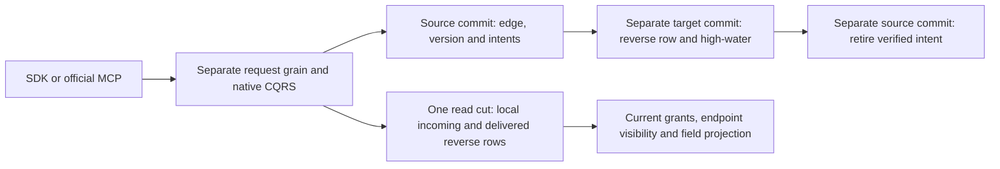

# Cross-partition graph edges

Status: accepted first same-physical-owner implementation contract; source and qualification gates remain open. It does not complete remote physical-shard movement or all of KL-038.

Canonical slice: GraphTraversal. Requirements: REQ-GRAPH-XPART-001..005. Acceptance: AC-GRAPH-XPART-001..005. Implementation contract: ADR-102.

## Boundary

The source partition is the existing `CommandRequest.Partition` and must equal the complete `UpsertEdge.From.Partition`. `EdgeId` remains scoped to the complete source partition and graph. Endpoints retain full `EntityRef` values. The source partition owns the canonical edge and outgoing adjacency. A different destination atomic partition is allowed only if both complete current placement tuples resolve to the same persisted physical shard (physical ID, incarnation, ordered voter IDs, placement epoch). A different owner is `UnsupportedCapability`; no stage here moves records, handles or authority across physical owners. The source edge mutation, its generated intent and the normal source outbox entry are committed by the existing admitted replicated command and atomic apply path. Destination adjacency and source completion use separate normal replicated commits; the feature never claims a two-partition atomic transaction.

The one request-grain CQRS boundary remains unchanged. Delivery and completion are distinct bounded typed requests. Existing local-partition graph reads and local incoming/outgoing keys stay unchanged. Source outgoing reads load the canonical `EdgeRecord`; destination reverse records are derived and never become canonical edge data.

## Persisted native contracts

All contracts use generated Orleans serialization. Native aliases and field IDs are stable as listed below; the root integrator registers them in the central native alias inventory and dispatch joins.

| Contract | Alias | Field IDs |
|---|---|---|
| `GraphEdgeOwnerVersionV1` | `keyload.contract.graph-edge-owner-version.v1` | 0 version=1; 1 monotonic revision; 2 deleted |
| `GraphCrossPartitionDeliveryIntentV1` | `keyload.contract.graph-cross-partition-delivery-intent.v1` | 0 version=1; 1 source partition; 2 graph; 3 edge ID; 4 full destination `EntityRef`; 5 revision; 6 deleted; 7 full edge snapshot; 8 original persisted principal ID; 9 original policy epoch; 10 fingerprint |
| `ApplyCrossPartitionReverseEdge` mutation | `keyload.contract.apply-cross-partition-reverse-edge.v1` | 0 source partition; 1 graph; 2 edge ID; 3 full destination `EntityRef`; 4 expected revision |
| `CompleteCrossPartitionReverseEdge` mutation | `keyload.contract.graph-reverse-edge-completion.v1` | 0 source partition; 1 graph; 2 edge ID; 3 full destination `EntityRef`; 4 expected revision |
| `GraphCrossPartitionReceiverStateV1` | `keyload.contract.graph-cross-partition-receiver-state.v1` | 0 version=1; 1 source partition; 2 graph; 3 edge ID; 4 full destination; 5 revision; 6 deleted; 7 fingerprint |
| `GraphCrossPartitionCapacityV1` | `keyload.contract.graph-cross-partition-capacity.v1` | 0 version=1; 1 direction; 2 record count (`long`); 3 encoded bytes (`long`) |
| `GraphCrossPartitionCapacityDirection` | `keyload.contract.graph-cross-partition-capacity-direction.v1` | enum values: PendingIntents=0; ReceiverStates=1; other values fail validation |
| `GraphCrossPartitionFingerprintV1` | `keyload.contract.graph-cross-partition-fingerprint.v1` | 0 version=1; 1 source partition; 2 graph; 3 edge ID; 4 full destination; 5 revision; 6 deleted; 7 full edge snapshot |
| `ReadIncomingGraphEdgesRequestV1` | `keyload.contract.graph-incoming-edges-request.v1` | 0 version; 1 full target `EntityRef`; 2 graph; 3 limit |
| `GraphIncomingEdgeRowV1` | `keyload.contract.graph-incoming-edge-row.v1` | 0 full canonical `EdgeRecord`; 1 delivered revision |
| `GraphIncomingEdgesPageV1` | `keyload.contract.graph-incoming-edges-page.v1` | 0 version; 1 immutable rows; 2 cut position; 3 projection identity fixed to `eventual-reverse.v1` |

The owner-version key is source-partition scoped by graph and edge ID and persists after edge deletion so an edge ID cannot restart at revision 1. Intent keys additionally include the complete destination partition. There is one coalesced desired-state intent per source edge and destination: an endpoint change writes the old destination tombstone and new destination active intent at the same newly incremented source revision. Receiver and remote reverse-adjacency keys are target-partition scoped and include the complete source partition, graph and edge ID; same edge IDs from other source partitions cannot collide.

Fingerprint is lowercase SHA-256 over generated native serialization of the exact versioned delivery tuple (source and target full references, revision, disposition, and full edge snapshot). The persisted receiver high-water state never expires in this stage. Tombstones remain as high-water state.

REQ/AC-GRAPH-XPART-001 additionally requires this digest to depend on tuple values,
never on CLR object sharing. Before native encoding, construct the same fixed
tree of independently owned source/destination/edge endpoint reference records
and independently owned string occurrences, including exact attributes content.
Equal references decoded from separate canonical-edge and intent frames must
produce the same digest as shared references at source commit. Preserve every
tuple field, exact attributes bytes, generated aliases/field IDs and native
envelope; do not alter global serializer/reference semantics or use JSON fallback.
`GraphCrossPartitionFingerprintTests` proves independent native-frame equality,
object-sharing independence and full-reference/content sensitivity.

This is a correction before the first qualified cross-partition feature release.
Earlier unqualified development digests are not a compatible persisted generation:
retain their original evidence and fail closed on mismatches. Do not silently
rewrite, accept a legacy digest or use a dual decoder. Existing feature data must
be writer-stopped and explicitly rebuilt under a separately qualified migration
before it can be counted as accepted upgrade evidence.

Capacity records validate version, direction, nonnegative counts/bytes and the actual configured bounds before use. Checked delta accounting is part of the same native transaction as its owned intent or receiver state. Missing capacity is an empty initial state only when the corresponding native family is empty; contradictory capacity/family state is `Corruption`. The generated fingerprint tuple is the single canonical digest input; no JSON serialization or caller-supplied digest is used as authority.

## Mutation and delivery rules

Both new mutations use the existing public `CommandRequest` / `OperationKind.Batch` JSON union and SDK `CommitAsync`. Their frozen `kind` discriminators are `applyCrossPartitionReverseEdge` and `completeCrossPartitionReverseEdge`; retain all existing discriminators. Their inherited `Mutation.Resource` equals `Graph` and is never an alternate authority scope. Root owns the two `JsonDerivedType` registrations and existing canonical mutation authorization/dispatch joins. Native aliases and per-type field IDs stay exactly as in the table above, including owner-version revision/deleted IDs 1/2, intent revision/deleted IDs 5/6 and receiver fingerprint ID 7. A class must not reuse an ID for two of its own fields. Independent JSON/native union round trips and alias/ID oracles cover both mutation variants and every new stored contract before public RF3 consumption.

Every source upsert or delete bounded-scans its existing intents for that graph and edge. It advances every still-pending noncurrent destination to a tombstone at the new source owner revision, then writes the current active destination when applicable. The previous canonical destination is tombstoned even when its former intent already completed. This prevents A→B→C updates from leaving A's unresolved tombstone at a revision older than the owner and therefore permanently stale. The per-edge scan is capped by `MaxScanRecords`, with a lookahead overflow rejecting the entire transaction; checked native capacity accounting applies to all changed intents. A multi-hop update before repair must clean every formerly delivered destination without resurrecting an old edge. This flow is mapped to `GraphCrossPartitionSourceCommitTests` and `GraphCrossPartitionRepairTests`.

`UpsertEdge` requires source `From.Partition == CommandRequest.Partition`, validates both endpoint collection rows and persisted row grants, and resolves the source and target placement rows/catalog against one complete physical tuple. It checks source and destination graph-write scopes. Owner revision increases with checked arithmetic. It commits canonical edge/outgoing adjacency, desired-state delivery intent(s), and the existing outbox row in the same source transaction. Upsert to a new destination tombstones the previous destination and writes the new destination's active desired state. `DeleteEdge` increments the persistent owner revision and writes a destination tombstone in the same transaction as canonical edge/index deletion.

A bounded pending-intent read exposes only delivery locators (not edge payload) under current persisted graph-write authority; active candidates additionally require current endpoint collection read grants/row visibility. It returns at most `min(MaxResults, MaxScanRecords)` candidates and charges encoded results to `MaxBatchBytes`. Repair repeatedly reads a bounded prefix and invokes the ordinary receiver request; no task-per-edge fanout, unbounded background retry, or alternate dispatcher exists. Pending intent records are capped per source partition at `MaxScanRecords` records and `MaxBatchBytes` native bytes, using an atomic persisted capacity counter. An update reserves only its positive byte/record delta before writing; failed reservation rejects the whole source transaction as `ResourceExhausted`. Destination receiver rows are capped by the same record/byte limits; exhaustion rejects the entire target transaction and stays visible.

`ApplyCrossPartitionReverseEdge` uses the existing `Batch` mutation route with `CommandRequest.Partition == Destination.Partition`. The supplied fields are locators only; no supplied revision, digest, intent, role, or receipt is trusted. In the destination transaction it reloads the exact source intent, owner-version and canonical edge/tombstone from the same current native view, validates the current full placement tuple and current caller persisted grants on both graph scopes, then checks the receiver high-water state. The current caller is reauthorized; frozen original principal/policy fields are audit/fingerprint metadata and never confer authority. Revocation blocks target apply and source completion before either write. Active apply also requires both current endpoint rows to be visible/readable. Tombstone cleanup requires current graph-write grants but does not require a deleted endpoint row to be readable.

An exact duplicate revision/fingerprint is an idempotent no-op. A lower revision is a typed stale/no-change outcome. An equal revision with different fingerprint is `Conflict`; persisted receiver/source inconsistencies are `Corruption`. A higher active revision atomically writes derived reverse adjacency and receiver high-water state; a higher tombstone atomically removes derived adjacency and preserves receiver high-water state. A caller message for an older intent after source coalescing is a stale no-op; it cannot publish stale payload.

`CompleteCrossPartitionReverseEdge` is a distinct source-partition `Batch` mutation, also locator-only. In the source transaction it reloads the exact current pending intent and owner version, plus the actual committed destination receiver state from the same native store. It retires/account-debits the intent only when destination revision, disposition and fingerprint equal the current intent. Any caller-supplied proof is ignored. If target commit succeeded but completion failed, repair repeats idempotently then completes. If the source intent was superseded, completion is a stale no-op and the newer current intent stays pending. A remote receiver is never read this way; this completion design is valid only because this stage admits one same physical owner. Any remote-owner future stage requires its own incarnation/epoch-bound signed native intent/receipt ADR.

Current graph reads preserve existing vertex privacy: a missing, deleted or hidden endpoint is not returned or expanded. Vertex deletion does not cascade a remote canonical edge; it hides the edge while current endpoint visibility fails. Active delivery checks current endpoint visibility and visibly fails without writing if an endpoint was removed. Tombstone delivery can clean a removed endpoint's projection. Recreating a document at the same full `EntityRef` follows current graph visibility behavior; it does not create a new edge revision.

`ReadIncomingGraphEdgesRequestV1` is the real public consumer of the reverse projection. It is an additive read-only capability through the existing `IRequestGrain` and native CQRS stream. The request's target partition selects the node-local read owner; the reader performs one current `Store.Read`, checks the existing `GraphRead` capability for both target and source graph scopes and current `DocumentsRead`/row visibility for the target and every source endpoint, validates full source/target placement equality against the current physical tuple, and reloads each source canonical edge plus owner-version from that same view. It returns only rows whose current canonical edge, receiver revision, full endpoint references and fingerprint match and whose endpoints are currently visible. Missing, hidden, deleted or not-yet-delivered rows are omitted under the declared eventual projection contract; the projection is not complete graph truth and never invents source authority.

The Core seam is `DatabaseEngine.ReadIncomingGraphEdges(string principalId, ReadIncomingGraphEdgesRequestV1 request, TimeProvider? timeProvider = null, CancellationToken cancellationToken = default)`. Append `GrainReadKind.GraphIncomingEdges` without renumbering existing values. The existing `GrainCoreReadCapabilities` whitelist and switch decode with `GrainNativePayload.ReadPublicInput` and forward the original token by its named `cancellationToken` argument. Public surfaces are SDK `IncomingEdgesAsync`, HTTP `POST /v1/graph/incoming` and read-only/idempotent/nondestructive MCP `keyload_graph_incoming`; no second dispatcher or grain boundary is added.

The read limit must be 1..`MaxResults`. The native range visit is bounded by `MaxScanRecords`; every range and point read, canonical-edge verification, serialized request/result and retained row is charged through the existing `ReadExecutionBudgetReadGrant`/`BudgetedReadView` and original deadline/cancellation. If more eligible rows exist than the limit or any work/result bound is exceeded, the whole call fails `BudgetExceeded` without returning a truncated page. No cursor, snapshot-completeness claim, or partial-success result exists. The page's fixed `eventual-reverse.v1` projection label makes the consistency mode explicit.

Incoming reads include both existing same-partition canonical incoming adjacency and delivered cross-partition reverse adjacency in the same read cut. Both scans and all point checks share one combined work/byte/retention/result grant. Identity is the full source partition, graph and edge ID; equal textual IDs in different source partitions remain distinct. Local canonical rows use `DeliveredRevision=0`, because they require no receiver delivery; their actual canonical revision remains in `Edge.Revision`. Cross-partition rows use the verified positive receiver owner revision. Local adjacency without its matching canonical edge is `Corruption`; undelivered cross-partition rows remain absent under the eventual projection. Before returning either row kind, apply the existing `Authorization.Project` behavior to the canonical source graph's `FieldPolicies` and `AttributesJson`; fingerprint verification uses the original canonical snapshot before this public projection. Hidden fields cannot escape through the new row wrapper. Local-only, mixed local/cross, same-ID, hidden-attribute and combined exact/one-over budget cases are mandatory native reader tests.

## Requirements and acceptance

| Requirement | Acceptance and proof |
|---|---|
| REQ-GRAPH-XPART-001: canonical source ownership and committed intent | AC-GRAPH-XPART-001: actual ZoneTree transaction stores source edge, monotonic owner version, coalesced intent and existing outbox record together; rollback leaves none. Same-owner full refs succeed; endpoint source mismatch, foreign physical tuple, malformed placement and source revision overflow leave canonical state unchanged. `GraphCrossPartitionSourceCommitTests`. |
| REQ-GRAPH-XPART-002: ordered idempotent reverse projection | AC-GRAPH-XPART-002: actual store duplicate application is idempotent; lower versions never replace high-water; equal version/different fingerprint returns `Conflict`; tombstone then older active never resurrects; endpoint replacement tombstones old destination and applies new one. `GraphCrossPartitionReceiverTests`. |
| REQ-GRAPH-XPART-003: current persisted authorization and privacy | AC-GRAPH-XPART-003: current caller must have source+destination graph write and endpoint collection read/row visibility for active apply; revoke/hidden/deleted endpoint prevents write. Tombstones require graph write but reveal no endpoint data. Full `PartitionRef`/`EntityRef` scopes prevent same-ID cross-tenant collisions. `GraphCrossPartitionAuthorizationTests`. |
| REQ-GRAPH-XPART-004: bounded repair and visible failures | AC-GRAPH-XPART-004: native candidate pages are bounded by actual limits; exact/excess capacity, corrupt counter, malformed intent, placement mismatch, grant denial and receiver commit failure remain visible with no false source completion. Target success/source-completion failure safely replays; current receiver state is the only completion oracle. `GraphCrossPartitionRepairTests`. |
| REQ-GRAPH-XPART-005: one request grain and real same-owner clients | AC-GRAPH-XPART-005: root-owned Aspire RF3 .NET SDK and official MCP cases create/read/update/delete cross-partition edges on distinct partitions of one verified owner, compare source/target commits and outgoing/incoming reads, test duplicate/reordered repair and denied grant, and show every committed write on all RF3 voters. The incoming query declares eventual projection scope, enforces real storage/read/result budgets and never claims completeness. Remote owner and physical movement remain explicitly unsupported. `GraphCrossPartitionRf3Tests`; actual source SHA/native originals required. |

The graph edge is intentionally eventual across partitions: source commit success means canonical source data and retained intent are committed, not that destination reverse adjacency is already applied. The declared window is measured from source commit to destination commit in RF3 evidence; on failure, lag and typed failure remain observable. No fixed latency guarantee is asserted before those originals exist.

## Ownership and verification

Worker private source scope: new Abstractions GraphTraversal contracts; Core GraphTraversal Contracts/Models/Serialization/Validation/Commands/Queries; new UnitTests GraphTraversal Cases/Assertions/Helpers. Root owns central native aliases/field registry, mutation discriminator/validation/authorization/apply union, `OperationKind`/`GrainReadKind`/resolver/dispatch, Server API and SDK/official MCP operation exposure, CQRS worker/coordinator, architecture inventory and feature/ADR integration. Do not replace generic administrative ProjectionConsumer semantics or create parallel command logs. The worker's Core reader and native Unit cases cover the incoming projection, current canonical-source verification, privacy and read grants. Root runs the actual Release solution build, TUnit normal/scalar, recovery and Aspire RF3 entry after reviewed integration; this source contract alone is not qualification.

Frontend: N/A; no separate graph UI. SQL: N/A for this first edge transport stage; SQL must use the same authorized graph operation in a separately joined Query compiler stage. Remote physical owners, global graph queries, movement, automatic repair service and external exactly-once processing remain outside this stage.
