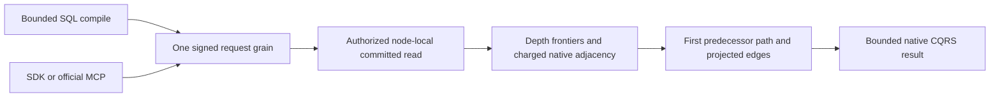

# Bounded unweighted shortest path

Status: accepted implementation contract, 2026-10-05; qualification pending.
Canonical slice: GraphTraversal. Parent: [GraphTraversal](../GraphTraversal.md).
Decision: [ADR-098](../../ADR/ADR-098-bounded-graph-paths.md). Task: KL-023.

## Public contracts

The exact engine seam is public `DatabaseEngine.ShortestPath(string principalId,
GraphShortestPathRequest request, TimeProvider? timeProvider=null,
CancellationToken cancellationToken=default)` and an internal overload with
`ReadExecutionBudget budget` as the third argument. The public entry starts one
budget using the supplied clock or engine clock; the internal SQL/test join
borrows that original budget without restarting or disposing it.

Find one shortest directed outgoing path between full document EntityRef values
inside one atomic partition and one current persisted-authorized committed
ZoneTree read cut. Explicit breadth-first depth frontiers execute in the
node-local storage owner. Orleans uses one request grain and native ManagedCode
CQRS. No per-edge RPC or borrowed storage value escapes the gate.

`GraphShortestPathRequest` version1 generated IDs: 0 Version, 1 Partition,
2 Graph, 3 From, 4 To, 5 MaxDepth=16, 6 MaxVertices=1000, 7 MaxEdges=5000,
8 optional immutable Labels. Bounds: depth0..16, vertices1..10000, examined
edges1..50000, at most64 canonical nonempty labels. Null/empty Labels admits all.
Version/shape/identifier/label errors are Validation; invalid numeric caps are
BudgetExceeded; a foreign endpoint partition is UnsupportedCapability.
Existing request/read/result byte caps, deadline and cancellation apply.
Alias: `keyload.contract.graph-shortest-path-request.v1`.

`GraphShortestPathResult` generated IDs: 0 Version=1, 1 Found, 2 nullable Hops,
3 immutable ordered Vertices, 4 immutable ordered projected Edges, 5 CutPosition.
Found means Vertices.Length=Edges.Length+1 and Hops=Edges.Length. Vertices run
From..To; each edge connects neighboring vertices. Authorized From=To returns
one vertex, no edges, Hops=0. No path returns Found=false, Hops=null, empty arrays.
CutPosition is the actual store position captured inside the same read gate.
Alias: `keyload.contract.graph-shortest-path-result.v1`. Existing IDs stay stable.

SQL profile `Q1.GraphPath.v1`, capability `graph-path-v1`, compiles to the same
typed operator/result:

```sql
SELECT * FROM GRAPH_SHORTEST_PATH(
  'graph', 'fromCollection', 'fromId', 'toCollection', 'toId',
  16, 1000, 5000, 'optionalLabel');
```

Each string/integer argument may use an existing named SQL parameter of its
exact scalar type. Eight initial arguments are mandatory; trailing labels are
optional/bounded. Reject cursor, projection, join, ordering, predicates, extra
statements, expressions and alternate grammar. `SqlGraphPathRequest` carries
Version/QueryRequest at generated IDs0/1 and alias
`keyload.contract.sql-graph-path-request.v1`; Cursor must be null and
AllowFullScan=true. Parsing, validation, reads and exact output share one
ReadExecutionBudget started before parsing. Do not reset the deadline at the
Core join. This explicit bounded profile does not claim full SQL/protocol support.
Both SQL endpoint literals resolve within QueryRequest.Partition; the grammar
has no separate endpoint-partition argument. An unauthorized whole SQL scope
fails persisted authorization. Only the direct typed operation can express a
foreign endpoint, which fails UnsupportedCapability.

## Requirements and acceptance

| Requirement | Measurable acceptance and automated mapping |
|---|---|
| REQ-GRAPH-007: shortest path and explicit depth frontiers | AC-GRAPH-006: independent input-model BFS agrees on ordered full EntityRef vertices and edges for direct/longer/converging paths, shuffled insertion, overlapping IDs across collections, cycles/self-loops, unreachable and depth0/exact/one-short cases. Equal-hop ties follow frontier discovery order then native ordinal edge-ID order. GraphShortestPathTests and independent GraphPath reference oracle. |
| REQ-GRAPH-008: one authorized current read cut | AC-GRAPH-007: denied graph/source collection propagates PermissionDenied; missing/hidden/deleted source is NotFound. Hidden/missing/denied/deleted target and hidden intermediate give the same closed no-path result. Labels require existing graph field-use authority; edge AttributesJson is projected by current persisted graph policy. Actual-store revocation/read-cut plus SDK/official MCP Linux RF3 failover cases exclude stale/hidden payload. |
| REQ-GRAPH-009: finite node/edge/time/byte work | AC-GRAPH-008: charge every examined candidate before label/visibility filtering. Exact required node/edge cap succeeds; one less throws BudgetExceeded without partial success. Check cancellation/deadline during every frontier, scan, dereference, predecessor walk and output. Retention is admitted before insertion; exact output includes protocol metadata. Real during-work cancellation and healthy follow-up preserve committed position. |
| REQ-GRAPH-010: shared SQL/SDK/MCP execution | AC-GRAPH-009: literal/parameter SQL matches direct result/CutPosition/errors. Reject malformed versions/syntax/parameters, extra statements, foreign partitions and exhausted bounds. Real Aspire RF3 SDK/official MCP preserve one request grain and native CQRS lifecycle; official discovery verifies both `keyload_graph_shortest_path` and `keyload_query_graph_path`, exact typed request/result schemas, and read-only/idempotent/non-destructive hints against the independent ClientApi oracle. Nested `PartitionRef` has exactly its four identity fields plus computed `atomicPartitionId`; only the four identity fields are required. |

## Execution and bounds

`SqlGraphPathOperationFlowTests.ExtraStatementsRejectWithoutReadsAndHealthySqlRetryMatchesDirectPath`
maps REQ-GRAPH-010 / AC-GRAPH-009 to one complete real-ZoneTree flow: reject an
extra statement, preserve committed position, then retry valid SQL on the same
engine and compare the independently expected ordered path and read cut with
the direct typed operation. Native normal/scalar execution and compiled-source
coverage binding remain required before this case contributes to coverage.

REQ-GRAPH-010 / AC-GRAPH-009 also replace the existing combined version/cursor/
full-scan rejection-only case with three complete operation flows in
`SqlGraphPathRejectionTests`. Each invalid input must return Validation without
changing committed position, then a valid SQL retry on that same engine must
match the direct typed result, independently expected ordered vertices/edges,
and the original read cut. The alternate-projection and malformed-parameter
cases retain every existing invalid input and require the same unchanged-state
and healthy-retry assertions after each rejection. Keep the two positive parity
cases and the separate extra-statement complete flow. Remove the replaced
rejection-only methods; admit replacements only after native normal/scalar runs.

Expand one explicit depth frontier and collect only the next. Visit each native
adjacency prefix in ordinal order without materializing high-degree pages.
Visited identity is the complete EntityRef. Keep only first predecessor edge
ID/reference/depth, and stop at the first minimum-depth target; later equal-hop
paths cannot replace it. Depth exhaustion returns no-path success; node/edge/
read/retention/deadline exhaustion throws. Validate adjacency/edge ID/from/partition
agreement as Corruption. Re-read only final path edges through charged reads,
then project attributes; retain neither all explored edge payloads nor documents.

Reuse GraphVertexVisibility's native policy/boolean caches. Optional
feature-local admission callbacks charge each new vertex/collection decision
before insertion; existing callers keep their behavior. Before retaining any
decision, predecessor or frontier, reserve conservative modeled metadata against
MaxBatchBytes: twice its exact JSON bytes plus128 fixed bytes per vertex or
predecessor; twice partition/name metadata bytes plus128 per collection decision.
Use checked arithmetic and cancellation checks. This includes frontier references
and cache overhead conservatively; it is not a measured RSS claim.
Traversal metadata and the exact serialized result have separate finite ledgers,
each capped by MaxBatchBytes. Result admission reserves the empty-array envelope
and each serialized array item plus its comma before retention; final measurement
checks the complete protocol result. The metadata cap is not added to the output
size when deciding the exact output boundary. These ledgers do not establish an
aggregate RSS bound.

## Ordered ownership, verification and rollout

1. Root freezes this spec/ADR before the Luna worker prepares private new
   Abstractions/Features/GraphTraversal/Contracts/GraphShortestPathRequest.cs and
   GraphShortestPathResult.cs with feature-local GraphShortestPathContractAliases.cs;
   Core/Features/GraphTraversal/Queries/
   DatabaseEngine.GraphShortestPath.cs, GraphShortestPathReader.cs and cohesive
   local Models/Execution/Validation files. The only existing helper edit is
   Execution/GraphVertexVisibility.cs admission hooks. No shared routing/Git edits.
2. A separate independent worker owns new UnitTests GraphTraversal/Cases,
   Assertions and Helpers against real TestDatabase/ZoneTree state, covering the
   reference, policy, exact/excess budgets and actual cancellation matrix.
3. Root owns the SQL integration. After the Core packet is frozen, the separate
   Luna Query worker may prepare only new QueryExecution contract/parser/value/
   syntax/executor files and independent SQL parity/rejection cases privately.
   The exact public method is QueryEngine.ShortestPathSql(string principalId,
   SqlGraphPathRequest request, TimeProvider? timeProvider=null,
   CancellationToken cancellationToken=default), returning GraphShortestPathResult.
   It starts one budget before parse/admission and calls the internal Core
   budget-taking entry. Root alone joins QueryEngine's existing capability list,
   native dispatch, any required friend boundary and all source/gates/Git.
4. Root owns appended Orleans read-kind/capability/result dispatch; Server
   POST /v1/graph/shortest-path and POST /v1/query/graph-path; official MCP catalog
   and tools following its existing naming/schema contract; typed Client calls;
   IntegrationTests real SDK/official MCP graph/SQL revocation/failover joins.
   The separately assigned Luna integration worker may prepare only new
   IntegrationTests/Features/GraphTraversal/Cases, Helpers and Assertions files
   privately. Frozen tools are keyload_graph_shortest_path and
   keyload_query_graph_path; SDK extensions are ShortestPathAsync and
   ShortestPathSqlAsync, each returning Result<GraphShortestPathResult>. A leader
   loss uses the explicit graph-path-rf3-leader-loss fault scope and only the
   fixture-owned RF3 resource. The current fixture has no centralized scenario
   allowlist; its named call-site scope and resource ownership are retained.
   Use the real shared Aspire ClusterFixture
   and official MCP client; recover/restart every owned stopped node and retain
   primary/cleanup failures. No independent Docker launch or fabricated topology.
   A separately assigned Luna client worker may prepare only new
   Client/Features/GraphTraversal/Transport/GraphPathClient.cs and
   Client/Features/QueryExecution/Transport/GraphPathQueryClient.cs privately,
   using the existing KeyLoadClient.Send transport, cancellation and Result
   contract. Root reviews and joins these calls with the routes and real client
   tests; the worker cannot introduce another dispatcher or change transport.
5. Root reviews base/post hashes and all code, runs strict Release/format/
   governance plus actual Aspire normal/scalar/process/RF3 gates, retains original
   exact Linux SHA/run/artifacts, updates the full KL-023 acceptance chain honestly,
   and commits all current code after each stage. Focused passes cannot close
   KL-023 or waive complete required suites.

Frontend is N/A: a database read capability. Weighted/cross-partition paths
require separate contracts. No canonical format, data migration, replica
membership or acknowledgement changes. Rollout adds explicit version1 reads;
unsupported versions fail closed. Rollback removes new read registration; existing
operations and acknowledged ZoneTree data require no rewrite.


