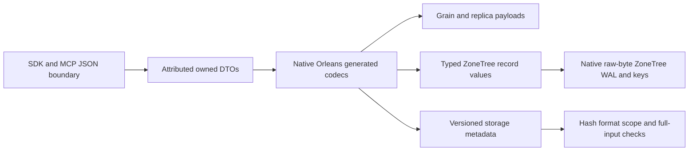

# InternalSerialization

The owner requires generated Orleans10.3.1 binary serialization for all owned internal typed payloads. Public HTTP/MCP JSON, exact user content and frozen canonical identities remain explicit concrete boundaries. This cross-cutting codec is genuinely shared; each model's behavior remains in its existing canonical slice. Frontend is N/A because no UI behavior is introduced; public API JSON stays unchanged.

## Requirements and acceptance

REQ-IS-001 through REQ-IS-009 respectively require the complete attributed DTO closure, pooled strict native codec, typed persistence/accounting, versioned storage metadata, secure bounded replication, native grain/membership contracts, versioned native signed claims, explicit non-destructive migration and exact-source qualification. They map one-to-one to AC-IS-001..009 and the test/flow matrix in the root acceptance file. Each missing or malformed case must fail before effects; deserialize defaults are not authorization or semantic validation.

## Ownership and verification

[ADR-060](../ADR/ADR-060-native-internal-serialization.md) owns formats and ordered implementation. Abstractions owns Features/InternalSerialization and generated public DTOs; Core owns each model's private records/readers/accounting; Replication owns ClusterReplication persistence/protocols; Storage.ZoneTree owns StorageRecovery/BackupRestore metadata; Orleans owns ClusterRouting/ClusterReplication internal transport. Existing public ClientApi remains its actual JSON protocol boundary.

Tests mirror InternalSerialization and the affected existing slices. Generated codecs and small real-file fixtures cover type/null/default/empty/byte/DOM/enum/polymorphism boundaries. Real process fault cuts and genuine Docker RF3 SDK/MCP prove recovery/runtime behavior only at the qualified SHA. Local runtime tests/benchmarks are forbidden; separate compiler, formatter and governance checks are static evidence.

Current status: attributes are partly applied and dependent runtime changes remain under the already executed source hold. The fully joined temporary snapshot passed 25-project Release compilation with real analyzers, zero warnings/errors, and the required full formatter. Its 106 affected/new native test files contain 296 test declarations and 301 Arguments attributes; these are unexecuted source counts. [Static receipt](../implementation/native-internal-static-preview.json) records exact source/patch/log hashes and excluded moving owner work. That snapshot requires fresh rebase and checks before installation; it does not qualify latest owner source or runtime behavior.

The final candidate includes attributed ChangeFeedClaims and native grain-to-HTTP/MCP principal binding, retaining existing admission/accounting and narrow strict grammar checks. Known ungenerated enum headers follow the official backing integer codec. An internal public-input profile permits only null reference collection elements so existing command/query validators and valid traversal-label behavior remain intact; required roots/members/initialized arrays, dictionaries, persisted records, claims and outputs stay strict. Public HTTP/MCP/CLI JSON, user JSON content, frozen identity material and the explicitly user-selected local-profile.json configuration file retain their concrete external boundaries.

The active checkout retains earlier formats and the ValueOperand factory join remains staged. Automatic approval review rejected shared-codec persisted formats, KLT2 old-token invalidation and binary inter-node rollout pending direct consent. Native installation, offline conversion, general nested decoded/type/reference/work bounds and exact-source mandatory native qualification remain open. Prior ADR-057 WAL proof is historical and does not qualify this migration. No measured acceleration, power-loss or production result follows from this static preview.
