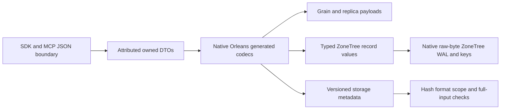

# InternalSerialization

The owner requires generated Orleans10.3.1 binary serialization for all owned internal typed payloads. Public HTTP/MCP JSON, exact user content and frozen canonical identities remain explicit concrete boundaries. This cross-cutting codec is genuinely shared; each model's behavior remains in its existing canonical slice. Frontend is N/A because no UI behavior is introduced; public API JSON stays unchanged.

## Requirements and acceptance

REQ-IS-001 through REQ-IS-009 respectively require the complete attributed DTO closure, pooled strict native codec, typed persistence/accounting, versioned storage metadata, secure bounded replication, native grain/membership contracts, versioned native signed claims, explicit non-destructive migration and exact-source qualification. They map one-to-one to AC-IS-001..009 and the [test/flow matrix](InternalSerialization/Acceptance.md). Each missing or malformed case must fail before effects; deserialize defaults are not authorization or semantic validation.

## Ownership and verification

[ADR-060](../ADR/ADR-060-native-internal-serialization.md) owns formats and ordered implementation. Abstractions owns Features/InternalSerialization and generated public DTOs; Core owns each model's private records/readers/accounting; Replication owns ClusterReplication persistence/protocols; Storage.ZoneTree owns StorageRecovery/BackupRestore metadata; Orleans owns ClusterRouting/ClusterReplication internal transport. Existing public ClientApi remains its actual JSON protocol boundary.

Tests mirror InternalSerialization and the affected existing slices. Generated codecs and small real-file fixtures cover type/null/default/empty/byte/DOM/enum/polymorphism boundaries. Real process fault cuts and genuine Docker RF3 SDK/MCP prove recovery/runtime behavior only at the qualified SHA. The explicit owner correction on 2026-10-03 authorizes local TUnit development tests and bounded recovery/performance experiments; label their actual source and machine. Required Linux GitHub fault/topology and publication qualification remains separate. Compiler, formatter and governance checks are static evidence.

Historical static preview: attributes were partly applied and dependent runtime changes remained under the executed source hold. The fully joined temporary snapshot passed 25-project Release compilation with real analyzers, zero warnings/errors, and the required full formatter. Its 106 affected/new native test files contain 296 test declarations and 301 Arguments attributes; these are unexecuted source counts. [Static receipt](../implementation/native-internal-static-preview.json) records exact source/patch/log hashes and excluded moving owner work. That snapshot requires fresh rebase and checks before installation; it does not qualify latest owner source or runtime behavior.

The final candidate includes attributed ChangeFeedClaims and native grain-to-HTTP/MCP principal binding, retaining existing admission/accounting and narrow strict grammar checks. Known ungenerated enum headers follow the official backing integer codec. An internal public-input profile permits only null reference collection elements so existing command/query validators and valid traversal-label behavior remain intact; required roots/members/initialized arrays, dictionaries, persisted records, claims and outputs stay strict. Public HTTP/MCP/CLI JSON, user JSON content, frozen identity material and the explicitly user-selected local-profile.json configuration file retain their concrete external boundaries.

Current owner-directed resumption installs the native candidate after a fresh rebase, preserving unrelated phase telemetry, scoped term observations and SQL work. The previous automatic-review rejection and source hold are historical. Missing-identity, backup-cut and shared collection/reference/depth/graph/DOM guards are being repaired with real regression fixtures before exact-source GitHub qualification. Legacy stores remain fail-closed; a qualified offline converter and reverse conversion are not delivered. Prior ADR-057 WAL proof qualifies only its historical source, not this wider migration. No measured acceleration, power-loss or production result is claimed.

Native v2 preserves bounded unknown fields and known-schema references. Typed
references to opaque omitted-type unknown fields fail closed before allocation;
deferred schema inference is outside this homogeneous rollout contract. Replica
and authentication projections read the actual generated constructor/body scopes,
including empty constructor scopes for explicitly attributed record properties.

Native preflight supports the owning generated DTO closure and its specified
scalar/array/collection/surrogate shapes. Unmodeled System surrogate and derived
collection codecs are rejected before decode; they cannot bypass count guards
through an object-typed member. General heap amplification remains unqualified.

REQ-IS-010 / AC-IS-010 requires actual diagnostic measurement before selecting
shared hot-path optimizations. It maps to the full [native serialization diagnostic
contract](BenchmarkComparisons/NativeSerialization.md), with source-bound
BenchmarkDotNet results separate from mandatory RF3/full competitor qualification.

## Current strict qualification repairs

R13/R14 in ADR060 retain AC-IS002/003/005/006/007: owning nullable pair metadata,
genuine malformed auth/probe native writers with valid twins, actual persisted
quota lengths, full replay contents including private composition references,
real membership provider and the existing integer-zero no-body sentinel.
NativePairMetadataTests, McpNativeAuthenticationMalformed/ReaderTests,
ReplicaReadProbeHeader/SecurityTests, NativeReplayResultAssertions, the blob/search
readers and ChangeFeeds/Messaging/ClusterRouting quota/provider cases own the
positive/negative assertions. All current formats and trust/error boundaries stay
unchanged. R15 under AC-IS010 retains strict authentic step success while saving
bounded API-visibility inspections. [Source/evidence stage](../implementation/native-serialization-repair-stage-002.json)
records actual preceding failed jobs and separate current-source qualification.
Source repair, a complete compiler build and raw measurements from a failed
diagnostic job do not qualify runtime, acceleration, RF3 or durability.

R17 under REQ-IS002/AC-IS002 and AC-IS004/007 distinguishes persisted native queue-body corruption from caller validation, preserving bytes, ready state, counters, positions and absent outcome before successful restore with the same request identity. QueueBodyAccountingTests/QueueBodyFailureAssertions own this real-ZoneTree fixture. Unknown well-known header metadata is classified only at the official single-header/span boundary in NativeFieldHeaderReader, using the saved official Reader and registered type table; arbitrary owned/generated/session key failures remain visible. NativeUnknownWellKnownHeader* tests use genuine writer twins, extended field deltas and public/MCP controls. ADR060 owns the accepted implementation and rollback. Normal/scalar/recovery/RF3 qualification remains exact-source GitHub-only; source review and a development build cannot satisfy it.

## Terminal admission allocation reduction

REQ-IS-PERF005 / AC-IS-PERF005 requires zero auxiliary allocation for warmed,
normalized terminal types and nullable admission allocation equal to the existing
Normalize loop. REQ-IS-PERF006 / AC-IS-PERF006 preserves the supported domain,
closed generic-owner enum fallback and exact type-depth264/265 boundary. Only
NativeWireSupported's existing primitive/enum/scalar predicate receives a root
shortcut; the complete iterative fallback, generated codecs, persisted bytes,
resource limits and validation remain unchanged. NativeWireSupportedScalar
AllocationTests, Tests, Fixtures and DepthTests own the positive, unsupported,
nullable, byte-ownership and depth controls. ADR060 records rollout and rollback.

REQ-IS-PERF007 / AC-IS-PERF007 uses the prospective allocation/latency budgets,
complete24-cell profile, six exact corpora, twelve JSON cohort controls and
conservative interval decision in ADR060. Pair arithmetic requires retained
originals and independent review; two local command-decode cells cannot satisfy
this full criterion. Internal microbenchmarks follow the latest root policy and
must not be dispatched through the end-to-end database comparison workflow.

The [stage004 evidence](../implementation/native-serialization-repair-stage-004.json)
binds the complete successful normal/scalar/recovery/analyzer/RF3 CI and protected
24-cell diagnostic baseline to delivered commit3ae408fe. The pending shortcut's
full local24cell experiment preserves all six corpora and native/JSON bytes.
Command NativeDecode allocation falls from128270 to45386B/op for1KiB and from
1541554 to321975B/op for16KiB (64.62%/79.11%). All12native allocation budgets
pass. Only3of12JSONmean controls pass, so the pair does not qualify latency or
AC-IS-PERF007. These are per-operation allocations, not total server RAM.
Final five-source build, normal/scalar, recovery and exact-source RF3 gates
remain separate from the historical image that produced this pair.
The owner cancelled the unrelated process-helper repair branch. This delivery
contains only the admission shortcut and its four scalar regression files;
source-image results containing cancelled helpers remain historical evidence.

The 2026-10-04 ADR060 verification correction warms the nullable allocation
control's exact non-inlined synchronous measurement helpers32 times, using the
same4096-iteration bodies subsequently measured once. Exact0B/equality and all
production serialization semantics remain unchanged. The original full-suite
336B baseline-only difference remains retained as a failed run; this correction
requires fresh complete Aspire normal/scalar reports and exact-source Linux
qualification before claiming the gate.
